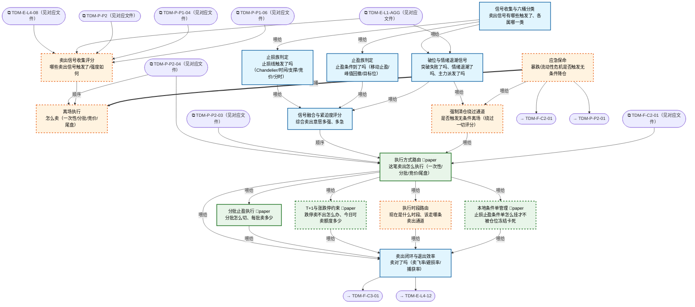

# 交易决策地图 · 离场流 X·信号/执行/R1 应急（自动派生）

> **本文件由生成器自动派生，禁止手编**。真源=`config/trading_decision_map.yaml`（改动后 git commit → 运行时启动自动重生成）。
> 规模：15 节点｜🔴设计态（红节点）7｜📄paper 实盘执行 4｜图例：橙虚线=设计态，蓝底=📄paper 实盘执行节点（D18 治理阶梯）。
> **[可缩放 HTML 版 / Zoomable HTML](http://localhost:8765/docs/02_enterprise_architecture/10_trading_map/_zoomable_html/trading_map_06_x_exit.html)** — Ctrl+滚轮缩放 ｜ 双击重置 ｜ Ctrl+Shift+D 切换拖动/选择模式

## 关系图

## 节点明细

| node_id | 名称 | 怎么算（大白话） | 时点 | 档位 | 模块锚 |
|---|---|---|---|---|---|
| TDM-X-S1🔴 | 卖出信号收集评分 | 卖出信号枢纽：六桶分类（risk/signal/target/trailing/time/volatility）收集→止损族/止盈族/破位退潮族并行判定→融合评分→强制清仓旁路。 产出'卖不卖+多急'。 | 持续 | — | — |
| TDM-X-S2🔴 | 离场执行 | 离场执行枢纽：方式路由（一次性/分批/竞价/尾盘）→约束（T+1/涨跌停）→时段路由→条件单/分批执行→闭环复盘。 '卖不卖'定了之后管'怎么卖'。 | 盘中 | — | — |
| TDM-X-R1🔴 | 应急保命 | 应急保命横切（kill switch 常驻任何档位不可移除）：组合级回撤 25% 或单日 -6% 触发→无条件全清仓+冻结所有开仓通道，只能 Owner 手动解除。 AI 熔断只降档不升档。 这是系统的'拔电源'。 | 持续 | — | — |
| TDM-X-S1-01 | 信号收集与六桶分类 | 8 类信号源聚合去重（同一持仓多信号触发的合并为一条带来源列表），按六桶分类：止损/止盈/目标/移动/时间/波动。 分类决定后续走哪条判定链+什么确认模式（止损类立即执行不辩论，止盈类等收盘确认）。 | 持续 | auto | MOD-SELL-001 |
| TDM-X-S1-02 | 止损族判定 | 五路止损并行：Chandelier（ATR 悬停：亏损区 3×ATR/盈利区 2×ATR 收紧）、固定 -7% 生死线、支撑破位（关键位下方 1%）、时间止损（盈利仓 5 日不涨/亏损仓 3 日）、分时破位（盘中跌破分时均线 30 分钟）。 止损只升不降（棘轮）。 | 持续 | auto | MOD-SELL-005 |
| TDM-X-S1-03 | 止盈族判定 | 止盈三式：移动止盈（Chandelier 盈利区 2×ATR 跟踪，涨越多回撤容忍越大但只升不降）、峰值回撤（从最高浮盈回落 30% 兑现——赚过没拿住是最大利润漏点）、目标位（预期涨幅达成即了结，打板票=次日不板走）。 | 持续 | auto | MOD-SELL-004 |
| TDM-X-S1-04 | 破位与情绪退潮信号 | 三路情绪侧信号：突破失败（买入理由消失——突破价跌回+量能萎缩，连冲 3 次失败强制清仓）、情绪退潮（L1 六段进入 distribution+该股为情绪票→加权卖出）、龙虎榜派发（高位游资上卖方榜/三日榜净卖出=诱多出货）。 | 持续 | auto | MOD-SELL-003 |
| TDM-X-S1-05 | 信号融合与紧迫度评分 | 信号加权融合 0~1：各桶信号按类型权重（止损 0.9/破位 0.7/止盈 0.5）+多周期共振加成（日线周线同向+0.2）。 紧迫度三档：>0.8 立即市价（S2-01 快速通道）、0.5-0.8 分批从容走、<0.5 等确认。 去抖与强制清仓互斥（救命单不等去抖）。 | 持续 | auto | MOD-SELL-007 |
| TDM-X-S1-06🔴 | 强制清仓绕过通道 | 四触发任一=绕过全部评分直接市价清仓：风控 KillSwitch（组合级）、黑天鹅（持仓突遭立案/暴雷）、K≥3 连续破位失败、主力弃庄（龙虎榜机构清仓式卖出）。 资金安全>一切优化，紧迫度直接置 1.0。 与 R1 分工：R1 管组合熔断，本节点管单仓强清。 | 持续 | auto | — |
| TDM-X-S2-01 | 执行方式路由 | 路由表：紧迫度>0.8 或小仓（<2%）→一次性市价；中等紧迫+大仓→分批（3 批，每批 1/3，间隔 5 分钟）；不急+流动性差→尾盘集中；隔夜风险单→竞价挂跌停价逃命。 卖出前三查：单笔≤买一档挂单量、日量×10% 参与率、持仓市值/20 日均额>1% 禁市价。 | 盘中 | paper | MOD-SELL-019 |
| TDM-X-S2-02🔴 | T+1与涨跌停约束 | 跌停处置三步：先挂跌停价排队（17:30 夜市委托第一时间挂，越早排越前）→盘中封单骤减>20% 时撤旧单改买一价重挂（撤单重挂会重置排队位次，只在封单明显松动时做）→次日竞价再处理残余。 可卖额度=t1_sellable 核对（当日买入不可卖）。 | 盘中 | paper | — |
| TDM-X-S2-03🔴 | 执行时段路由 | 时段通道分裂路由：深市 14:57 后集合竞价不可撤单（要卖赶在 14:57 前挂）；沪市尾盘可撤可改。 竞价逃命单=9:15 后挂跌停价（按开盘价成交，排队最优先）。 14:30-14:45 跳水窗谨慎挂单、14:50 决策窗处理做T收口。 | 盘中 | auto | — |
| TDM-X-S2-04🔴 | 本地条件单管理 | 条件单本地化（vn.py 范式）：止损/止盈触发器存本地不预占仓位（QMT 预挂条件单会冻结仓位），tick 触发后才发限价单；每根 K 线收盘 cancel 重挂刷新价位；本地双停止单 OCO（一个触发自动撤另一个）。 | 持续 | paper | — |
| TDM-X-S2-05 | 分批止盈执行 | Exit Ladder 阶梯：+1R（赚一个风险单位）减 50% 保本；+2R 再减 25% 锁利；尾仓 25% 跟踪止盈跑趋势。 信号强度定密度：弱信号一次走完、强信号留 runner。 MFE 捕获率<50%=卖太早，反馈校准 S1 权重。 | 盘中 | paper | MOD-SELL-017 |
| TDM-X-S2-06 | 卖出闭环与退出效率 | 卖出后 N 日跟踪三率：卖飞率（卖后再创新高的占比，>30%=止损太紧）、避损率（卖出后继续跌的占比，衡量止损价值）、MFE 捕获率（拿到行情的百分比）。 六分类复盘（止损/止盈/时间/逻辑/置换/恐慌）——PANIC 占比>10%=纪律失效告警。 | 盘后 | auto | MOD-SELL-012 |

## 挂载清单

**模块锚（MOD）**：MOD-SELL-001 src/zephyr/sell_decision/core/sell_signal_collector.py、MOD-SELL-003 src/zephyr/sell_decision/core/breakout_failure_detector.py、MOD-SELL-004 src/zephyr/sell_decision/core/take_profit_strategy.py、MOD-SELL-005 src/zephyr/sell_decision/core/stop_loss_strategy.py、MOD-SELL-007 src/zephyr/sell_decision/core/sell_signal_fusion_engine.py、MOD-SELL-012 src/zephyr/sell_decision/core/sell_execution_quality_tracker.py、MOD-SELL-017 src/zephyr/sell_decision/core/scaling_out.py、MOD-SELL-019 src/zephyr/sell_decision/core/sell_execution_planner.py
