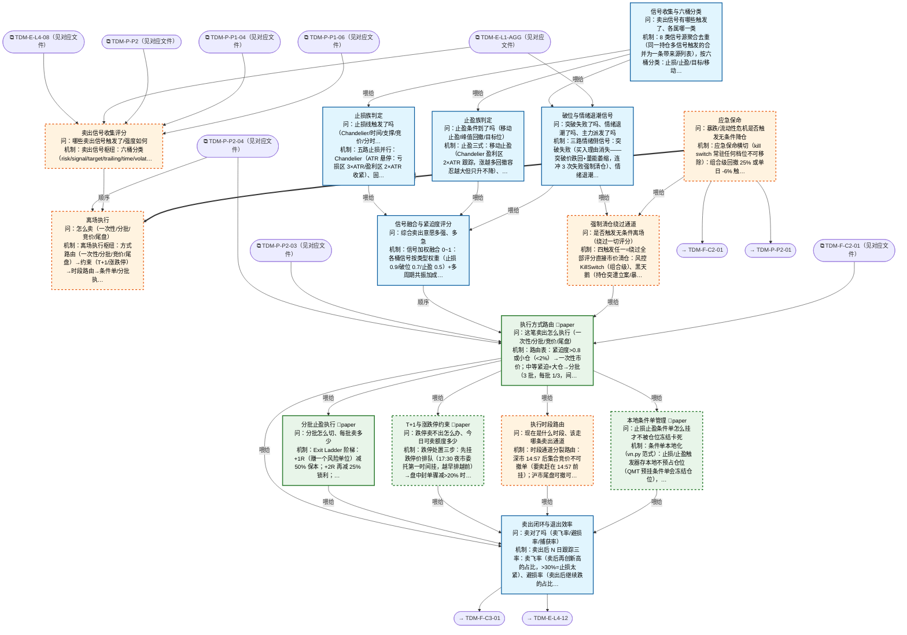

# 交易决策地图 · 离场流 X·信号/执行/R1 应急（自动派生）

> **本文件由生成器自动派生，禁止手编**。真源=`config/trading_decision_map.yaml`（改动后 git commit → 运行时启动自动重生成）。
> 规模：15 节点｜🔴设计态（红节点）7｜📄paper 实盘执行 4｜图例：橙虚线=设计态，蓝底=📄paper 实盘执行节点（D18 治理阶梯）。
> 每个节点的完整机制（怎么算/依据什么/裁定原文）见下方「节点详解」区。
> **[可缩放 HTML 版 / Zoomable HTML](http://localhost:8765/docs/02_enterprise_architecture/10_trading_map/_zoomable_html/trading_map_06_x_exit.html)** — Ctrl+滚轮缩放 ｜ 双击重置 ｜ Ctrl+Shift+D 切换拖动/选择模式

## 关系图

## 节点明细（速览）

| node_id | 名称 | 怎么算（大白话） | 时点 | 档位 | 模块锚 |
|---|---|---|---|---|---|
| TDM-X-S1🔴 | 卖出信号收集评分 | 卖出信号枢纽：六桶分类（risk/signal/target/trailing/time/volatility）收集→止损族/止盈族/破位退潮族并行判定→融合评分→强制清仓旁路。 产出'卖不卖+多急'。 | 持续 | — | — |
| TDM-X-S2🔴 | 离场执行 | 离场执行枢纽：方式路由（一次性/分批/竞价/尾盘）→约束（T+1/涨跌停）→时段路由→条件单/分批执行→闭环复盘。 '卖不卖'定了之后管'怎么卖'。 | 盘中 | — | — |
| TDM-X-R1🔴 | 应急保命 | 应急保命横切（kill switch 常驻任何档位不可移除）：组合级回撤 25% 或单日 -6% 触发→无条件全清仓+冻结所有开仓通道，只能 Owner 手动解除。 AI 熔断只降档不升档。 这是系统的'拔电源'。 | 持续 | — | — |
| TDM-X-S1-01 | 信号收集与六桶分类 | 8 类信号源聚合去重（同一持仓多信号触发的合并为一条带来源列表），按六桶分类：止损/止盈/目标/移动/时间/波动。 分类决定后续走哪条判定链+什么确认模式（止损类立即执行不辩论，止盈类等收盘确认）。 | 持续 | auto | MOD-SELL-001 |
| TDM-X-S1-02 | 止损族判定 | 五路止损并行：Chandelier（ATR 悬停：亏损区 3×ATR/盈利区 2×ATR 收紧）、固定 -7% 生死线、支撑破位（关键位下方 1%）、时间止损（盈利仓 5 日不涨/亏损仓 3 日）、分时破位（盘中跌破分时均线 30 分钟）。 止损只升不降（棘轮）。 | 持续 | auto | MOD-SELL-005 |
| TDM-X-S1-03 | 止盈族判定 | 止盈三式：移动止盈（Chandelier 盈利区 2×ATR 跟踪，涨越多回撤容忍越大但只升不降）、峰值回撤（从最高浮盈回落 30% 兑现——赚过没拿住是最大利润漏点）、目标位（预期涨幅达成即了结，打板票=次日不板走）。 | 持续 | auto | MOD-SELL-004 |
| TDM-X-S1-04 | 破位与情绪退潮信号 | 三路情绪侧信号：突破失败（买入理由消失——突破价跌回+量能萎缩，连冲 3 次失败强制清仓）、情绪退潮（L1 六段进入 distribution+该股为情绪票→加权卖出）、龙虎榜派发（高位游资上卖方榜/三日榜净卖出=诱多出货）。 | 持续 | auto | MOD-SELL-003 |
| TDM-X-S1-05 | 信号融合与紧迫度评分 | 信号加权融合 0~1：各桶信号按类型权重（止损 0.9/破位 0.7/止盈 0.5）+多周期共振加成（日线周线同向+0.2）。 紧迫度三档：>0.8 立即市价（S2-01 快速通道）、0.5-0.8 分批从容走、<0.5 等确认。 去抖与强制清仓互斥（救命单不等去抖）。 | 持续 | auto | MOD-SELL-007 |
| TDM-X-S1-06🔴 | 强制清仓绕过通道 | 四触发任一=绕过全部评分直接市价清仓：风控 KillSwitch（组合级）、黑天鹅（持仓突遭立案/暴雷）、K≥3 连续破位失败、主力弃庄（龙虎榜机构清仓式卖出）。 资金安全>一切优化，紧迫度直接置 1.0。 与 R1 分工：R1 管组合熔断，本节点管单仓强清。 | 持续 | auto | — |
| TDM-X-S2-01 | 执行方式路由 | 路由表：紧迫度>0.8 或小仓（<2%）→一次性市价；中等紧迫+大仓→分批（3 批，每批 1/3，间隔 5 分钟）；不急+流动性差→尾盘集中；隔夜风险单→竞价挂跌停价逃命。 卖出前三查：单笔≤买一档挂单量、日量×10% 参与率、持仓市值/20 日均额>1% 禁市价。 | 盘中 | paper | MOD-SELL-019 |
| TDM-X-S2-02🔴 | T+1与涨跌停约束 | 跌停处置三步：先挂跌停价排队（17:30 夜市委托第一时间挂，越早排越前）→盘中封单骤减>20% 时撤旧单改买一价重挂（撤单重挂会重置排队位次，只在封单明显松动时做）→次日竞价再处理残余。 可卖额度=t1_sellable 核对（当日买入不可卖）。 | 盘中 | paper | — |
| TDM-X-S2-03🔴 | 执行时段路由 | 时段通道分裂路由：深市 14:57 后集合竞价不可撤单（要卖赶在 14:57 前挂）；沪市尾盘可撤可改。 竞价逃命单=9:15 后挂跌停价（按开盘价成交，排队最优先）。 14:30-14:45 跳水窗谨慎挂单、14:50 决策窗处理做T收口。 | 盘中 | auto | — |
| TDM-X-S2-04🔴 | 本地条件单管理 | 条件单本地化（vn.py 范式）：止损/止盈触发器存本地不预占仓位（QMT 预挂条件单会冻结仓位），tick 触发后才发限价单；每根 K 线收盘 cancel 重挂刷新价位；本地双停止单 OCO（一个触发自动撤另一个）。 | 持续 | paper | — |
| TDM-X-S2-05 | 分批止盈执行 | Exit Ladder 阶梯：+1R（赚一个风险单位）减 50% 保本；+2R 再减 25% 锁利；尾仓 25% 跟踪止盈跑趋势。 信号强度定密度：弱信号一次走完、强信号留 runner。 MFE 捕获率<50%=卖太早，反馈校准 S1 权重。 | 盘中 | paper | MOD-SELL-017 |
| TDM-X-S2-06 | 卖出闭环与退出效率 | 卖出后 N 日跟踪三率：卖飞率（卖后再创新高的占比，>30%=止损太紧）、避损率（卖出后继续跌的占比，衡量止损价值）、MFE 捕获率（拿到行情的百分比）。 六分类复盘（止损/止盈/时间/逻辑/置换/恐慌）——PANIC 占比>10%=纪律失效告警。 | 盘后 | auto | MOD-SELL-012 |

## 节点详解（机制怎么产生）

### TDM-X-S1 卖出信号收集评分 🔴

**问**：哪些卖出信号触发了/强度如何

**机制（怎么算）**：卖出信号枢纽：六桶分类（risk/signal/target/trailing/time/volatility）收集→止损族/止盈族/破位退潮族并行判定→融合评分→强制清仓旁路。 产出'卖不卖+多急'。

**依据锚**：风险限额 RLM-DRAWDOWN-001、RLM-DRAWDOWN-002、RLM-DRAWDOWN-006

**设计备注（裁定/欠账原文）**：
- ── 离场流 exit_flow（cn_a）──────────────────────────────────────────────
- D50 欠账（69 号 §2.27）：峰值收益回撤止盈信号——每仓记历史最高浮盈 peak_pnl，从峰值回落 X%
- 强制兑现（短线最大利润漏点="赚过没拿住"，与止损/时间止损三级联动）；已由 TDM-X-S1-03 止盈族承接落位（D60 轮）

### TDM-X-S2 离场执行 🔴

**问**：怎么卖（一次性/分批/竞价/尾盘）

**机制（怎么算）**：离场执行枢纽：方式路由（一次性/分批/竞价/尾盘）→约束（T+1/涨跌停）→时段路由→条件单/分批执行→闭环复盘。 '卖不卖'定了之后管'怎么卖'。

### TDM-X-R1 应急保命 🔴

**问**：暴跌/流动性危机是否触发无条件降仓

**机制（怎么算）**：应急保命横切（kill switch 常驻任何档位不可移除）：组合级回撤 25% 或单日 -6% 触发→无条件全清仓+冻结所有开仓通道，只能 Owner 手动解除。 AI 熔断只降档不升档。 这是系统的'拔电源'。

**依据锚**：风险限额 RLM-KILLSW-003、RLM-KILLSW-005、RLM-KILL-SWITCH-004、RLM-KILL-SWITCH-005 ｜ 阈值 THD-DRAWDOWN-001、THD-DRAWDOWN-002、THD-DRAWDOWN-003

**设计备注（裁定/欠账原文）**：
- ── 风控横切（非第四条流，任何环节可触发）────────────────────────────────

### TDM-X-S1-01 信号收集与六桶分类

**问**：卖出信号有哪些触发了、各属哪一类

**机制（怎么算）**：8 类信号源聚合去重（同一持仓多信号触发的合并为一条带来源列表），按六桶分类：止损/止盈/目标/移动/时间/波动。 分类决定后续走哪条判定链+什么确认模式（止损类立即执行不辩论，止盈类等收盘确认）。

**依据锚**：因子 FCT-TECH-077、FCT-TECH-083 ｜ 数据 DS-082、DS-150
**治理**：激活=continuous ｜ 档位=auto ｜ 模块=MOD-SELL-001

**设计备注（裁定/欠账原文）**：
- 治理档位豁免（外审修复 2026-09-07，I-01/M-58）：kill switch 任何 ai_autonomy 档位下均为真实执行，不随 paper 模拟；
- 复位=Owner 人工确认（fail-closed：重启/失联后保持 HALTED 待人工解除，I-05）；风控心跳失联→默认降级安全态（禁新开仓+人工告警，I-06/M-60 挂载点）
- 四层止损作用域×节拍（m-11）：单票连续价（X-S1-02）/做T价差+时间（P2-02）/sleeve 月度净值（F-C3-02 5%减半·7.5%冻结）/组合日度+回撤（本节点）
- ── X 流血肉（D60-D66，Owner 2026-09-07 终裁；2 树枝 12 节点，树深 2）──
- 42 号卖出流 spec 十节吸收（语义入节点+公式留 doc_ref+spec 保留为算法附件，22 号先例）；
- sell_decision 域 9 production 模块直接锚定；三空白新写=S2-03 时段路由/S2-04 本地条件单/S1-06 绕过通道编排；
- R1 应急保命保持横切不展开（kill switch 常驻 D18，RLM×4+THD×3 语义完备）
- S1 树枝：六桶分类→{止损族/止盈族/破位情绪}→融合评分；强制清仓绕过通道并行（42号§3.2 最高优先级）
- 六类 exit 分类学分桶=risk/signal/target/trailing/time/volatility（42号 7 类信号归并映射，§2.29 D61）；
- triage 分级定扫描频率（Watch 秒级/Monitor 5min/Hold 事件驱动，MOD-SELL-000 前提）

### TDM-X-S1-02 止损族判定

**问**：止损线触发了吗（Chandelier/时间/支撑/竞价/分时）

**机制（怎么算）**：五路止损并行：Chandelier（ATR 悬停：亏损区 3×ATR/盈利区 2×ATR 收紧）、固定 -7% 生死线、支撑破位（关键位下方 1%）、时间止损（盈利仓 5 日不涨/亏损仓 3 日）、分时破位（盘中跌破分时均线 30 分钟）。 止损只升不降（棘轮）。

**依据锚**：风险限额 RLM-DRAWDOWN-001 ｜ 算法 IND-VOL-001
**治理**：激活=continuous ｜ 档位=auto ｜ 模块=MOD-SELL-005 ｜ 兜底=ATR 缺失→固定%止损降级（短线 4%/中长线 8%）

**设计备注（裁定/欠账原文）**：
- Chandelier 双区参数（亏损区 N=10/M=3.0 盈利区 N=22/M=2.0）+1×ATR/5日时间止损+固定%降级；
- A股六模式=A-share 止损引擎（MOD-RK-09：固定-7%/支撑破位/逻辑失效/竞价不及预期/分时破位/板块退潮，
- 38 测试待接线不越权催期）；猎杀防护=MOD-SELL-015（止损位偏移 1-2%+软止损 OBSERVING）；
- 单向棘轮 clamp=D50 欠账（调用方持久化止损位 max(old,new)）
- （D91 终裁）：同层多档取最严（止损距离最小先生效）；fallback 4%/8% 仅 ATR 缺失启用；游资红线 2% 不进触发器（移作 S2-06 复盘对照口径）；支撑破位改双触发=硬底（-7%~-8% 或 2×ATR(14) 立即离场防跳空）+软确认（跌破支撑→次日开盘 30 分钟观察窗：收复开盘价+量能配合=持有/未收复/冲高回落/窗口结束=离场）；站稳=收盘连续 2 日收于支撑上方；本节点修订 D69 risk 桶支撑破位从 immediate 改双触发

### TDM-X-S1-03 止盈族判定

**问**：止盈条件到了吗（移动止盈/峰值回撤/目标位）

**机制（怎么算）**：止盈三式：移动止盈（Chandelier 盈利区 2×ATR 跟踪，涨越多回撤容忍越大但只升不降）、峰值回撤（从最高浮盈回落 30% 兑现——赚过没拿住是最大利润漏点）、目标位（预期涨幅达成即了结，打板票=次日不板走）。

**治理**：激活=continuous ｜ 档位=auto ｜ 模块=MOD-SELL-004

**设计备注（裁定/欠账原文）**：
- Chandelier 移动止盈（自动 phase 判定）+峰值回撤兑现（D50 欠账本轮落位：peak_pnl 回落 X% 强制兑现）+
- 目标位达成；止盈条件只看市场状态变量（信号/移动止损/峰值回撤），不看连赢次数（D57 撤回语义）

### TDM-X-S1-04 破位与情绪退潮信号

**问**：突破失败了吗、情绪退潮了吗、主力派发了吗

**机制（怎么算）**：三路情绪侧信号：突破失败（买入理由消失——突破价跌回+量能萎缩，连冲 3 次失败强制清仓）、情绪退潮（L1 六段进入 distribution+该股为情绪票→加权卖出）、龙虎榜派发（高位游资上卖方榜/三日榜净卖出=诱多出货）。

**依据锚**：因子 FCT-SENT-012 ｜ 数据 DS-082 ｜ 席位 SEAT-INST-001、SEAT-INST-002、SEAT-INST-003、SEAT-YOUZI-001、SEAT-YOUZI-002、SEAT-YOUZI-003
**治理**：激活=continuous ｜ 档位=auto ｜ 模块=MOD-SELL-003

**设计备注（裁定/欠账原文）**：
- 突破成败判定（连冲 3 次失败→强制清仓信号喂 S1-06）+情绪退潮加权（联动 L1-AGG 六段，28 号真源）+
- 龙虎榜派发五规则（高位游资上卖方榜/三日榜净卖出=诱多，优先三日榜，§35A 素材）
- D68 必改（第二轮审计，69 号 §2.30）：除权除息日卖出口径——溢价率/跳空判定分母改用除权除息参考价
- （除息缺口是价格规则调整非下跌，否则除息日误判核按钮清仓）；D69 假破位处置——盘中破位收盘收回=
- 影线穿越不算，反视为洗盘持有加分；时段可靠性系数——早盘 9:30-10:00 假信号高发窗（开盘 5 分钟
- 波动为全天 4 倍）破位确认从严（量能+收盘双确认），尾盘从宽
- PIT 纪律（外审 M-43）：龙虎榜 T 日 18:00 后发布，本节点 continuous 消费时只用 T-1 及更早榜
- （D99 终裁 2026-09-07）：天地板规则改个股级——废除板块单日家数降仓/清仓（实证证伪：c=2 组 n=50 T+5 +0.97% 与基线无差异，docs/_working/2026-09-07-tiandiban-threshold-study.md）；持仓个股自身天地板→入次日竞价即决重点观察名单

### TDM-X-S1-05 信号融合与紧迫度评分

**问**：综合卖出意愿多强、多急

**机制（怎么算）**：信号加权融合 0~1：各桶信号按类型权重（止损 0.9/破位 0.7/止盈 0.5）+多周期共振加成（日线周线同向+0.2）。 紧迫度三档：>0.8 立即市价（S2-01 快速通道）、0.5-0.8 分批从容走、<0.5 等确认。 去抖与强制清仓互斥（救命单不等去抖）。

**治理**：激活=continuous ｜ 档位=auto ｜ 模块=MOD-SELL-007 ｜ 兜底=融合引擎异常→各族信号直通 S2-01 人工确认

**设计备注（裁定/欠账原文）**：
- 加权融合 0~1+多时间框架共振（MOD-SELL-007）+紧迫度分级→执行策略映射（MOD-SELL-009
- sell_urgency_scorer）；紧迫度输出定 S2-01 路由（市价急走 vs 限价从容走）
- D69（第二轮审计，69 号 §2.30）：确认层三段式——triggered→confirmed→released，加权分达阈后
- 须过确认窗才放行 S2；分桶确认模式（D69 定稿）：risk/time/volatility 桶=immediate 不辩论、
- signal/target/trailing 桶=close_confirm（收盘确认非影线）；去抖三参数 confirm_bars∈{0,1}/
- buffer_pct 0.2-0.5%/量能≥20日均量 1.5 倍；**去抖与紧迫度互斥——S1-06 强制清仓绕过确认层**

### TDM-X-S1-06 强制清仓绕过通道 🔴

**问**：是否触发无条件离场（绕过一切评分）

**机制（怎么算）**：四触发任一=绕过全部评分直接市价清仓：风控 KillSwitch（组合级）、黑天鹅（持仓突遭立案/暴雷）、K≥3 连续破位失败、主力弃庄（龙虎榜机构清仓式卖出）。 资金安全>一切优化，紧迫度直接置 1.0。 与 R1 分工：R1 管组合熔断，本节点管单仓强清。

**依据锚**：风险限额 RLM-KILL-SWITCH-004、RLM-KILL-SWITCH-005
**治理**：激活=continuous ｜ 档位=auto

**设计备注（裁定/欠账原文）**：
- 红节点（编排缺口）；四触发=风控 KillSwitch/黑天鹅/K≥3 破位失败/主力弃庄→紧迫度 1.0 直送 S2 执行路由
- 不经过融合仲裁（资金安全最高优先级）；与 X-R1 分工=R1 管组合级熔断、本节点管单仓强制清仓；
- 连续亏损熔断已落码=trade_level_circuit_breaker.py（42号§3.10）
- 回测口径（外审 M-50）：黑天鹅/主力弃庄无可计算代理，拼装回测 V1 声明不含该两分支（覆盖折扣标注）；触发源边=X-S1-04（K≥3）+X-R1（组合级）

### TDM-X-S2-01 执行方式路由

**问**：这笔卖出怎么执行（一次性/分批/竞价/尾盘）

**机制（怎么算）**：路由表：紧迫度>0.8 或小仓（<2%）→一次性市价；中等紧迫+大仓→分批（3 批，每批 1/3，间隔 5 分钟）；不急+流动性差→尾盘集中；隔夜风险单→竞价挂跌停价逃命。 卖出前三查：单笔≤买一档挂单量、日量×10% 参与率、持仓市值/20 日均额>1% 禁市价。

**依据锚**：成本模型 CST-ASTOCK-001
**治理**：激活=intraday ｜ 档位=paper ｜ 模块=MOD-SELL-019 ｜ 兜底=路由异常→限价单默认通道+人工确认

**设计备注（裁定/欠账原文）**：
- S2 树枝：路由→{涨跌停约束/时段路由/条件单/分批}→闭环退出效率；paper×4 实盘执行
- 按紧迫度+仓位大小+流动性路由（大单拆分/密度感知）+KillSwitch 清仓排序（MOD-SELL-019）；
- 卖出情景预案=MOD-SELL-013 exit_scenario_planner（BM-SELL-07）产出预案喂路由
- D70（第二轮审计，69 号 §2.30）：流动性前置三检查——单笔量≤买一档挂单量/当日量×参与率 10% 硬顶/
- 持仓市值÷20日均成交额>1% 禁一次性市价；IS 急卖 preset——紧迫度 0.8-1.0 映射高 λ 前重后轻
- （首 1/3 时间窗完成≥50%，漂移不利参与率上调）；ICEBERG 随机化 ±10-20%/释放间隔 0.5-2s 抖动
- 防游资盯盘识别；市价单保护价=基准价×97-98% 与笼子取交集（QMT 语义）；枯竭检测——点差突宽/
- 深度秒撤→挂低价等而非市价砸
- D71：多持仓卖出队列每 tick 重排+停牌标的顺延；板块联动顺序=跟风→补涨→中军→龙头
- （买盘消失速度排序，龙头留 IS 慢速通道，龙头断板=全板块紧急升级）；时段-信号映射——
- 止损不挑时段触发即执行/止盈限早盘 9:45-10:00 黄金窗或尾盘窗口
- D72 恐慌拦截（69 号 §2.30，外审 B-06 落盘修复）：低开<-3% 触发开盘 30 分钟等待窗口禁市价卖出，三类绕过=KillSwitch/黑天鹅/跌停封死；
- 与 D67 核按钮（<-5% 竞价挂跌停）在 -5%~-3% 区间的优先级、S1-06 四触发中 K≥3/主力弃庄是否豁免——（D95 终裁：竞价段 9:20-9:25 挂单豁免本窗口——限价排队非市价砸盘；豁免清单扩至 S1-06 四触发全对齐=KillSwitch/黑天鹅/跌停封死/K≥3 破位/主力弃庄；利空公告仓豁免等待窗）
- 输入仲裁声明（外审 R2-05）：四路输入优先级=X-R1/S1-06 强清中断 ≥ F-C2-01 组合强裁 > P2-03/P2-04 纪律强平减仓 > S1-05 常规融合（D95 已裁确认本仲裁序）

### TDM-X-S2-02 T+1与涨跌停约束 🔴

**问**：跌停卖不出怎么办、今日可卖额度多少

**机制（怎么算）**：跌停处置三步：先挂跌停价排队（17:30 夜市委托第一时间挂，越早排越前）→盘中封单骤减>20% 时撤旧单改买一价重挂（撤单重挂会重置排队位次，只在封单明显松动时做）→次日竞价再处理残余。 可卖额度=t1_sellable 核对（当日买入不可卖）。

**依据锚**：风险限额 RLM-DRAWDOWN-003
**治理**：激活=intraday ｜ 档位=paper ｜ 兜底=排队失败→次日竞价优先处理并标记

**设计备注（裁定/欠账原文）**：
- 红节点（编排缺口）；跌停=挂跌停价排队（隔夜单 17:30 后第一时间挂+封单骤减>20% 撤旧买一价重挂+
- 撤单重挂重置位次禁忌）+t1_sellable 可卖额度核对；做T仓例外语义（42号§3.8）
- D71（第二轮审计，69 号 §2.30）：特殊标的分支——①新股首日卖出状态机（分板块参数表：首日仅限价单
- 市价申报废单/临停基准=当日开盘价非发行价/主板首日竞价限发行价±20%/中签仓首日可卖当日买入仓不可卖/
- 社区分层：开盘出 4 成冲高出 4 成留 2 成）；②临停复牌子状态机（停牌期可挂可撤/复牌竞价申报限停牌前
- 成交价±10%/预埋限价规避复牌跳水/北交所临停只能撤不能新挂）；③风险警示板分支（ST 主板 ±5%（仅 2026-07-06 前有效）→2026-07-06 起 ±10%（沪深主板风险警示与主板一致，外审 B-10/J-03 制度时变）/双创 20%/北交所 30% 不变；回测须按生效日切片/
- 0.01 元低价股跌停仅 1 分钱秒级排队/强制限价申报）（✅ 已核实 2026-09-07 另案结论：规则已如期生效、盘面实证 10% 口径（18 个交易日 >5% 波动）；矛盾根因=stk_limit 管道口径滞后——修表欠账已清偿（2026-09-07 #ARCH-DATA-020）：生成侧 _limit_pct_of/daban rule_limit_price 按 trade_date 切片（≥2026-07-06 主板 ST=10%、此前 5%），ST 行重算回填 246406 行+周度 0.05 清零+Decimal 精确对账通过；联动参数重校欠账：竞价即决封板/溢价映射、跌停排队、封成比阈值按 10% 重校；ST 日累计买入 50 万股上限（规则 4.4.10）保留）；④碎股整单卖出拆分废单+科创板 200 股基准
- 多日连续跌停分支（§35A 素材吸收，外审 m-27）：第 2 日盲目割肉非最优、约 43% 第 3 日开板；区分基本面暴雷（全力跑）vs 情绪错杀（放量开板分批）
- ②临停复牌 ±10% 仅适用盘中临停；长期停牌（月级重组）复牌首日交易安排（D105 终裁：长停复牌首日欠账期默认=不自动卖出转人工；盘中临停±10% 与长停复牌两子状态）

### TDM-X-S2-03 执行时段路由 🔴

**问**：现在是什么时段、该走哪条卖出通道

**机制（怎么算）**：时段通道分裂路由：深市 14:57 后集合竞价不可撤单（要卖赶在 14:57 前挂）；沪市尾盘可撤可改。 竞价逃命单=9:15 后挂跌停价（按开盘价成交，排队最优先）。 14:30-14:45 跳水窗谨慎挂单、14:50 决策窗处理做T收口。

**治理**：激活=intraday ｜ 档位=auto

**设计备注（裁定/欠账原文）**：
- 红节点（X 流三空白之一）；沪深尾盘分裂路由（深市/创业板/科创板 14:57-15:00 收盘集合竞价不可撤、
- 沪市主板同段连续竞价可撤——路由器按市场分流）+竞价逃命单通道（挂跌停价=排队最优先按开盘价成交）+
- 尾盘时段规律（14:30-14:45 跳水窗/14:50-14:55 按收盘价决策窗）
- D67 竞价即决协议落地（第二轮审计，完整决策表真源=69 号 §2.30）：隔夜仓次日 9:25 定格 30 秒内出动作，
- 溢价×量能十行矩阵（盘前固化基准：封板时间→次日预期高开映射 秒板 5-9%/烂板 0 至 -3%）；竞价量能
- 三口径=占昨日总量 5-10% 健康/<3% 缩量诱多高发/>15% 爆量看承接（**D67 纠错：修正 §2.28 D55-5
- 骨架"昨涨停量 10-15%"旧口径**）；9:20-9:25 不可撤段决定离场→直接挂跌停价排队；除权除息日溢价率
- 分母改除权参考价（D68 联动）

### TDM-X-S2-04 本地条件单管理 🔴

**问**：止损止盈条件单怎么挂才不被仓位冻结卡死

**机制（怎么算）**：条件单本地化（vn.py 范式）：止损/止盈触发器存本地不预占仓位（QMT 预挂条件单会冻结仓位），tick 触发后才发限价单；每根 K 线收盘 cancel 重挂刷新价位；本地双停止单 OCO（一个触发自动撤另一个）。

**治理**：激活=continuous ｜ 档位=paper

**设计备注（裁定/欠账原文）**：
- 红节点（X 流三空白之二）；vn.py 范式=停止单本地存储不冻结仓位、触发才发限价单（解决限价止盈挂
- 交易所冻结仓位致止损单被拒，T+1 同坑）+每 K 线 cancel_all 重挂刷新+本地双停止单 OCO
- D71（第二轮审计，69 号 §2.30）：SellChase 状态机——触发后不成交的处置（挂单→计时→撤→追 1 tick
- 重挂→预算 15-20 轮耗尽转最优五档即成剩撤市价兜底；内嵌 Escape 检查：本方前 N 档量<对面 X% 撤单
- 避损防挂单被扫）；快照龄>1 tick 强制刷新闸门（盘口快照竞态：决定时厚下单时薄）；
- QMT 工程三坑（联动 93 号 playbook）：成交回报重连全量重推须 business_id 幂等去重/市价单 price
- 字段=保护限价卖出给足空间/on_cancel_error 兜底+回调内禁同步下单

### TDM-X-S2-05 分批止盈执行

**问**：分批怎么切、每批卖多少

**机制（怎么算）**：Exit Ladder 阶梯：+1R（赚一个风险单位）减 50% 保本；+2R 再减 25% 锁利；尾仓 25% 跟踪止盈跑趋势。 信号强度定密度：弱信号一次走完、强信号留 runner。 MFE 捕获率<50%=卖太早，反馈校准 S1 权重。

**治理**：激活=intraday ｜ 档位=paper ｜ 模块=MOD-SELL-017 ｜ 兜底=分批模块异常→降级一次性执行

**设计备注（裁定/欠账原文）**：
- scale-out 阶梯（1:1 R:R 减 50% 止损移保本→2:1 减 25%→runner 25% 跟踪）+按信号强度定分批密度
- （弱信号一次走/强信号留 runner）+MFE 捕获率自检（<50%=卖太早，处置效应校准）；
- 分批 2-4 点最优超 4 管理成本>收益；42号§3.7"分批 MVP 降级"已被 scaling_out.py 落码升级（本轮发现）

### TDM-X-S2-06 卖出闭环与退出效率

**问**：卖对了吗（卖飞率/避损率/捕获率）

**机制（怎么算）**：卖出后 N 日跟踪三率：卖飞率（卖后再创新高的占比，>30%=止损太紧）、避损率（卖出后继续跌的占比，衡量止损价值）、MFE 捕获率（拿到行情的百分比）。 六分类复盘（止损/止盈/时间/逻辑/置换/恐慌）——PANIC 占比>10%=纪律失效告警。

**治理**：激活=postmarket ｜ 档位=auto ｜ 模块=MOD-SELL-012

**设计备注（裁定/欠账原文）**：
- D51 欠账"离场闭环最后一环"本轮落位：卖出后 N 日跟踪（卖飞率=卖后再创新高占比/避损率/MFE 捕获率）
- 统计喂 F-C3 归因校准 S1 评分权重；信号准确率监控=MOD-SELL-010 sell_signal_accuracy_monitor（BM-SELL-09
- 卖出闭环优化）；42号§3.11 复盘编排复用 55 号
- D72（第二轮审计，69 号 §2.30）：卖出理由六分类封闭枚举（每笔必填禁自由文本）——STOP_LOSS/
- TAKE_PROFIT/TIME_STOP/LOGIC_FAIL/REPLACE/PANIC；**PANIC 健康占比应为 0，滚动占比>10%=纪律失效
- 告警**（检查等待窗口闸门是否被绕过，禁先调参数）；理由×结果交叉统计定位偏差（止损类卖后大涨=
- 止损过紧喂 G04 校准/置换类卖后原标的跑赢=置换排序偏差喂 BM-SELL-05）；信号 N 日前瞻跟踪分桶归因
- ——每条信号持久化{桶ID/触发价/触发时刻/实际卖价}，T+5 回填未卖前瞻收益，任一桶 30 日避损率斜率
- 降 30%→该桶紧迫度权重自动降档；IS 三分解（延迟/冲击/机会成本）进执行成本轴；
- 卖出冷却期（卖出后 2 日禁追高买回，大盈利清仓后 1 个月）+参数漂移锁（卖飞后 2 日禁改参数，
- 调整必须走 42号§3.11 A/B 显著性 p<0.05）——前置闸门语义
- 冷却机制（D106 终裁改版：废除日历型固定天数）=迟滞带（卖出触发于信号破 A 线、买回要求升破 B 线，B>A 不对称）+连败阶梯（同标的连亏 2 次仓位上限减半/3 次暂停至 20 日波动分位变化）+regime 开关（震荡市激活/趋势市关闭），参数回测标定后生效；清单经 S2-06→E-L4-12 边消费（B-06）；参数漂移锁保留（卖飞后 2 交易日禁改参数，调整走 42 号 §3.11 A/B p<0.05）；
- 状态持久化载体=sleeve 治理状态表（待施工，M-39）；复牌假触发防护：停牌期时间止损计时暂停（对齐 D49 欠账期默认，M-31）
- 入边分工互斥声明（外审 R2-06）：五路入边按执行通道归属互斥上报——同一笔成交只经其执行通道（S2-01 直卖/02/03/04/05）上报一次，禁止通道间双报

## 挂载清单

**模块锚（MOD）**：MOD-SELL-001 src/zephyr/sell_decision/core/sell_signal_collector.py、MOD-SELL-003 src/zephyr/sell_decision/core/breakout_failure_detector.py、MOD-SELL-004 src/zephyr/sell_decision/core/take_profit_strategy.py、MOD-SELL-005 src/zephyr/sell_decision/core/stop_loss_strategy.py、MOD-SELL-007 src/zephyr/sell_decision/core/sell_signal_fusion_engine.py、MOD-SELL-012 src/zephyr/sell_decision/core/sell_execution_quality_tracker.py、MOD-SELL-017 src/zephyr/sell_decision/core/scaling_out.py、MOD-SELL-019 src/zephyr/sell_decision/core/sell_execution_planner.py
