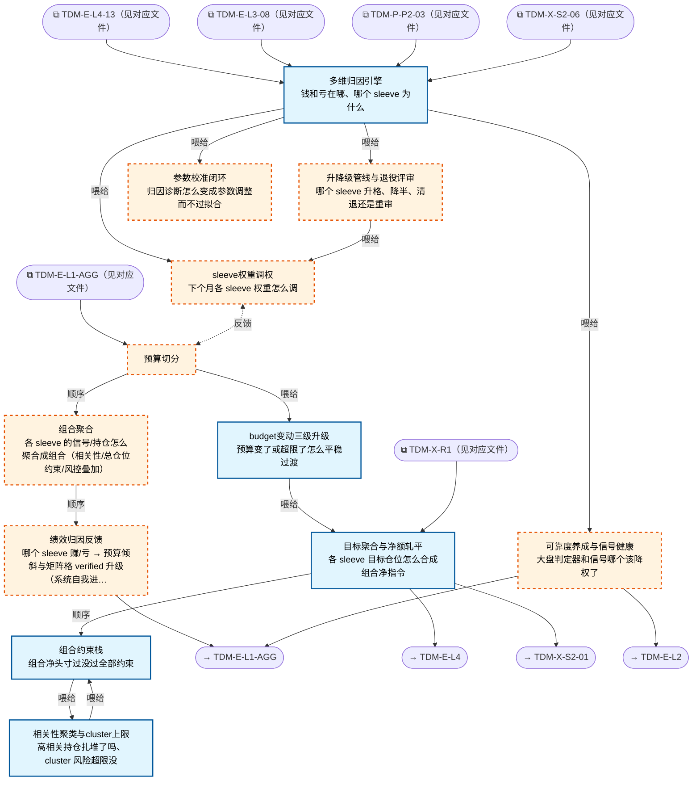

# 交易决策地图 · 组合流 F·聚合/归因反馈（自动派生）

> **本文件由生成器自动派生，禁止手编**。真源=`config/trading_decision_map.yaml`（改动后 git commit → 运行时启动自动重生成）。
> 规模：12 节点｜🔴设计态（红节点）7｜📄paper 实盘执行 0｜图例：橙虚线=设计态，蓝底=📄paper 实盘执行节点（D18 治理阶梯）。
> **[可缩放 HTML 版 / Zoomable HTML](http://localhost:8765/docs/02_enterprise_architecture/10_trading_map/_zoomable_html/trading_map_07_f_portfolio.html)** — Ctrl+滚轮缩放 ｜ 双击重置 ｜ Ctrl+Shift+D 切换拖动/选择模式

## 关系图

## 节点明细

| node_id | 名称 | 怎么算（大白话） | 时点 | 档位 | 模块锚 |
|---|---|---|---|---|---|
| TDM-F-C1🔴 | 预算切分 | 预算切分（Millennium pod 模式）：总仓位预算（L1 预算带）按 sleeve 权重切分（PP-001 配置：打板 20%/多因子 20%/事件 15%…），各 sleeve 账本独立、风险独立核算、互不挪用。 sleeve 间资金流动只通过月度调权（C3-03）。 总仓位怎么切给各 sleeve（Millennium pod 单体版）；带内实际仓位=状态分布加权插值（灰度非查表）；过渡带降仓×0.5-0.7+尾部预备金 10-15% 恒定预留 | 盘前 | — | — |
| TDM-F-C2🔴 | 组合聚合 | 聚合四步：各 sleeve 目标仓位求和轧平（对冲净额）→组合约束栈全检→相关性聚类去扎堆→输出组合净指令流。 多策略并发时'每个策略各自的账'与'组合是一盘棋'在这里合流。 | 持续 | — | — |
| TDM-F-C3🔴 | 绩效归因反馈 | 归因反馈闭环：多维归因（哪赚哪亏为什么）→升降级评审（sleeve 维持/减半/清退）→权重调权→参数校准→传感器可靠度反馈 L1。 系统自我进化的发动机——赚的加码亏的减码，全部凭数据不凭感觉。 | 盘后 | — | — |
| TDM-F-C2-01 | 目标聚合与净额轧平 | intent netting 三步：收集各 sleeve 指令→同标的代数求和（买 1000+卖 600=净买 400，省 600 股手续费）→净差单下发。 成交按贡献比例分摊回各 sleeve 账本（否则逐笔归因做不了）。 批量窗口 1 分钟一拍，防信号抖动反复重算。 | 持续 | auto | MOD-POS-021 |
| TDM-F-C2-02 | 组合约束栈 | 约束栈六层顺序过：总仓位上限→回撤限额（资金曲线分级压缩）→波动率目标→集中度（单票 20%）→流动性（3 日可退出）→相关性（cluster 5%）。 过哪层裁哪层，按非策略仓优先裁。 程序化查表，不进信号层。 | 持续 | auto | MOD-POS-021 |
| TDM-F-C2-03 | 相关性聚类与cluster上限 | 相关性三档：60 日滚动 PnL 相关矩阵→层次聚类→同 cluster 合并风控。 ρ>0.70 的持仓合并计算敞口（视为同一个风险）；ρ>0.85 禁新仓；单 cluster 总权重≤5% 权益。 月度再聚类+危机期压测（相关性会趋于 1）。 | 持续 | auto | MOD-POS-012 |
| TDM-F-C2-04 | budget变动三级升级 | 预算变动三级响应（防踩踏）：Tier1 预算降<10%=封锁新仓（撤买单留卖单）自然收敛；Tier2 降 10-25%=各 sleeve 差异化窗口自主收敛（打板 2 日/事件 3 日/多因子 4 日）；Tier3 降>25%=按比例强裁。 防抖：日内<5% 忽略、连降>10% 强触发。 | 持续 | auto | MOD-POS-022 |
| TDM-F-C3-01 | 多维归因引擎 | 几何 Brinson 三因子：配置效应（板块权重选对没）+选股效应（板块内选的票跑赢板块没）+交互效应。 加做T vs 持仓盈亏二分、IS 三分解（延迟/冲击/机会成本）。 月度跑一次，回答'钱从哪赚的亏到哪了'。 | 盘后 | auto | MOD-PF-007 |
| TDM-F-C3-02🔴 | 升降级管线与退役评审 | 月度评审+季度 verdict 四选一（维持/减半/清退/重审），评审制人工裁定不自动退役。 数据依据：composite score（60+120 日双窗口）+THD-RETIRE 三线（滚动 20 日跑输基准 5%/60 日 Sharpe<0/回撤漂移 1.5×）。 单 sleeve 回撤 5% 自动减半、7.5% 冻结——这条自动执行不等评审。 | 盘后 | auto | — |
| TDM-F-C3-03🔴 | sleeve权重调权 | 月度调权公式：新权重=normalize(基准权重×PerfScore×Shrinkage)，下限 5% 上限 40%。 防过拟合三纪律：单次调整幅度≤±10pp、调整后 5 交易日锁定、阈值未触发=不动（no-change 默认）。 大调整（>10pp）分日线性过渡。 | 盘后 | auto | — |
| TDM-F-C3-04🔴 | 参数校准闭环 | 校准四道 gate 才准改参数：CPCV 交叉验证（防数据挖掘）+DSR（deflated Sharpe，防多次尝试虚高）+PBO<30%（过拟合概率）+参数平台期（参数敏感度平坦区才可信）。 walk-forward 效率 WFE>60% 才可用，<40% 禁上线。 purge 窗=持仓半衰期，embargo≥5 日。 | 盘后 | auto | — |
| TDM-F-C3-05🔴 | 可靠度养成与信号健康 | 传感器可靠度三档递进：起步等权（实证：简单平均 50 年最稳）→月度判准率加权（下限 10% 防winner 通吃）→粒子滤波时变（远期）。 滚动 IC 监控+半衰期拟合，衰减>50% 报警。 反馈给 L1-AGG 降权不可靠传感器——大盘判定器自己也要被考核。 | 盘后 | auto | — |

## 挂载清单

**模块锚（MOD）**：MOD-PF-007 src/zephyr/pf_core/core/performance_attribution_engine.py、MOD-POS-012 src/zephyr/position/core/correlation_regime_monitor.py、MOD-POS-021 src/zephyr/position/core/firm_risk_aggregator.py、MOD-POS-022 src/zephyr/position/core/budget_change_handler.py
