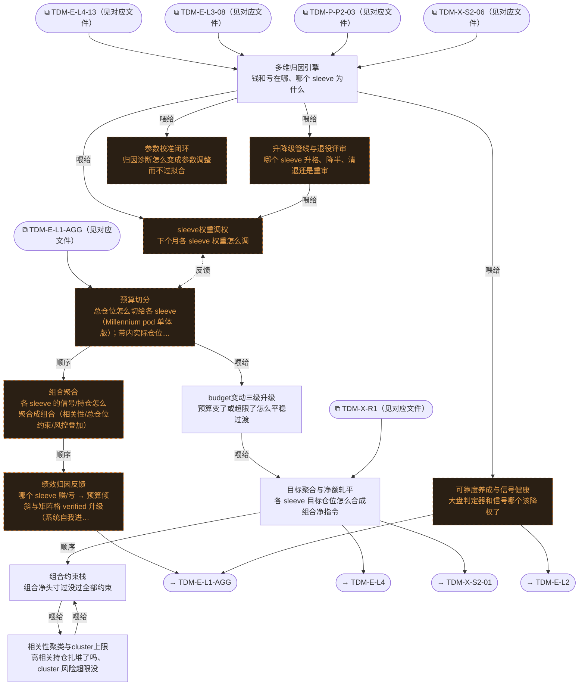

# 交易决策地图 · 组合流 F·聚合/归因反馈（自动派生）

> **本文件由生成器自动派生，禁止手编**。真源=`config/trading_decision_map.yaml`（改动后 git commit → 运行时启动自动重生成）。
> 规模：12 节点｜🔴设计态（红节点）7｜📄paper 实盘执行 0｜图例：橙虚线=设计态，蓝底=📄paper 实盘执行节点（D18 治理阶梯）。
> **[可缩放 HTML 版 / Zoomable HTML](http://localhost:8765/docs/02_enterprise_architecture/10_trading_map/_zoomable_html/trading_map_07_f_portfolio.html)** — Ctrl+滚轮缩放 ｜ 双击重置 ｜ Ctrl+Shift+D 切换拖动/选择模式

## 关系图

## 节点明细

| node_id | 名称 | 决策问题 | 时点 | activation | ai_autonomy | 模块锚 | 策略挂载 |
|---|---|---|---|---|---|---|---|
| TDM-F-C1🔴 | 预算切分 | 总仓位怎么切给各 sleeve（Millennium pod 单体版）；带内实际仓位=状态分布加权插值（灰度非查表）；过… | 盘前 | — | — | — | — |
| TDM-F-C2🔴 | 组合聚合 | 各 sleeve 的信号/持仓怎么聚合成组合（相关性/总仓位约束/风控叠加） | 持续 | — | — | — | — |
| TDM-F-C3🔴 | 绩效归因反馈 | 哪个 sleeve 赚/亏 → 预算倾斜与矩阵格 verified 升级（系统自我进化闭环） | 盘后 | — | — | — | — |
| TDM-F-C2-01 | 目标聚合与净额轧平 | 各 sleeve 目标仓位怎么合成组合净指令 | 持续 | continuous | auto | src/zephyr/position/core/firm_risk_aggregator.py（MOD-POS-021… | — |
| TDM-F-C2-02 | 组合约束栈 | 组合净头寸过没过全部约束 | 持续 | continuous | auto | src/zephyr/position/core/firm_risk_aggregator.py（MOD-POS-021… | — |
| TDM-F-C2-03 | 相关性聚类与cluster上限 | 高相关持仓扎堆了吗、cluster 风险超限没 | 持续 | continuous | auto | src/zephyr/position/core/correlation_regime_monitor.py（MOD-P… | — |
| TDM-F-C2-04 | budget变动三级升级 | 预算变了或超限了怎么平稳过渡 | 持续 | continuous | auto | src/zephyr/position/core/budget_change_handler.py（MOD-POS-02… | — |
| TDM-F-C3-01 | 多维归因引擎 | 钱和亏在哪、哪个 sleeve 为什么 | 盘后 | postmarket | auto | src/zephyr/pf_core/core/performance_attribution_engine.py（MO… | — |
| TDM-F-C3-02🔴 | 升降级管线与退役评审 | 哪个 sleeve 升格、降半、清退还是重审 | 盘后 | postmarket | auto | — | — |
| TDM-F-C3-03🔴 | sleeve权重调权 | 下个月各 sleeve 权重怎么调 | 盘后 | postmarket | auto | — | — |
| TDM-F-C3-04🔴 | 参数校准闭环 | 归因诊断怎么变成参数调整而不过拟合 | 盘后 | postmarket | auto | — | — |
| TDM-F-C3-05🔴 | 可靠度养成与信号健康 | 大盘判定器和信号哪个该降权了 | 盘后 | postmarket | auto | — | — |

## 挂载清单

**模块锚（MOD）**：MOD-PF-007 src/zephyr/pf_core/core/performance_attribution_engine.py、MOD-POS-012 src/zephyr/position/core/correlation_regime_monitor.py、MOD-POS-021 src/zephyr/position/core/firm_risk_aggregator.py、MOD-POS-022 src/zephyr/position/core/budget_change_handler.py
