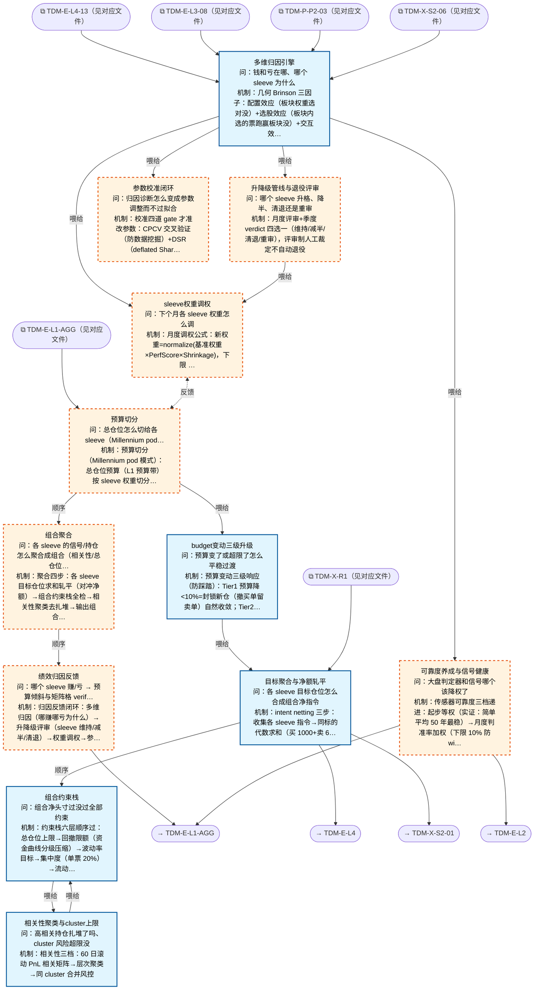

# 交易决策地图 · 组合流 F·聚合/归因反馈（自动派生）

> **本文件由生成器自动派生，禁止手编**。真源=`config/trading_decision_map.yaml`（改动后 git commit → 运行时启动自动重生成）。
> 规模：12 节点｜🔴设计态（红节点）7｜📄paper 实盘执行 0｜图例：橙虚线=设计态，蓝底=📄paper 实盘执行节点（D18 治理阶梯）。
> 每个节点的完整机制（怎么算/依据什么/裁定原文）见下方「节点详解」区。
> **[可缩放 HTML 版 / Zoomable HTML](http://localhost:8765/docs/02_enterprise_architecture/10_trading_map/_zoomable_html/trading_map_07_f_portfolio.html)** — Ctrl+滚轮缩放 ｜ 双击重置 ｜ Ctrl+Shift+D 切换拖动/选择模式

## 关系图

## 节点明细（速览）

| node_id | 名称 | 怎么算（大白话） | 时点 | 档位 | 模块锚 |
|---|---|---|---|---|---|
| TDM-F-C1🔴 | 预算切分 | 预算切分（Millennium pod 模式）：总仓位预算（L1 预算带）按 sleeve 权重切分（PP-001 配置：打板 20%/多因子 20%/事件 15%…），各 sleeve 账本独立、风险独立核算、互不挪用。sleeve 间资金流动只通过月度调权（C3-03）。 | 盘前 | — | — |
| TDM-F-C2🔴 | 组合聚合 | 聚合四步：各 sleeve 目标仓位求和轧平（对冲净额）→组合约束栈全检→相关性聚类去扎堆→输出组合净指令流。多策略并发时'每个策略各自的账'与'组合是一盘棋'在这里合流。 | 持续 | — | — |
| TDM-F-C3🔴 | 绩效归因反馈 | 归因反馈闭环：多维归因（哪赚哪亏为什么）→升降级评审（sleeve 维持/减半/清退）→权重调权→参数校准→传感器可靠度反馈 L1。系统自我进化的发动机——赚的加码亏的减码，全部凭数据不凭感觉。 | 盘后 | — | — |
| TDM-F-C2-01 | 目标聚合与净额轧平 | intent netting 三步：收集各 sleeve 指令→同标的代数求和（买 1000+卖 600=净买 400，省 600 股手续费）→净差单下发。成交按贡献比例分摊回各 sleeve 账本（否则逐笔归因做不了）。批量窗口 1 分钟一拍，防信号抖动反复重算。 | 持续 | auto | MOD-POS-021 |
| TDM-F-C2-02 | 组合约束栈 | 约束栈六层顺序过：总仓位上限→回撤限额（资金曲线分级压缩）→波动率目标→集中度（单票 20%）→流动性（3 日可退出）→相关性（cluster 5%）。过哪层裁哪层，按非策略仓优先裁。程序化查表，不进信号层。 | 持续 | auto | MOD-POS-021 |
| TDM-F-C2-03 | 相关性聚类与cluster上限 | 相关性三档：60 日滚动 PnL 相关矩阵→层次聚类→同 cluster 合并风控。ρ>0.70 的持仓合并计算敞口（视为同一个风险）；ρ>0.85 禁新仓；单 cluster 总权重≤5% 权益。月度再聚类+危机期压测（相关性会趋于 1）。 | 持续 | auto | MOD-POS-012 |
| TDM-F-C2-04 | budget变动三级升级 | 预算变动三级响应（防踩踏）：Tier1 预算降<10%=封锁新仓（撤买单留卖单）自然收敛；Tier2 降 10-25%=各 sleeve 差异化窗口自主收敛（打板 2 日/事件 3 日/多因子 4 日）；Tier3 降>25%=按比例强裁。防抖：日内<5% 忽略、连降>10% 强触发。 | 持续 | auto | MOD-POS-022 |
| TDM-F-C3-01 | 多维归因引擎 | 几何 Brinson 三因子：配置效应（板块权重选对没）+选股效应（板块内选的票跑赢板块没）+交互效应。加做T vs 持仓盈亏二分、IS 三分解（延迟/冲击/机会成本）。月度跑一次，回答'钱从哪赚的亏到哪了'。 | 盘后 | auto | MOD-PF-007 |
| TDM-F-C3-02🔴 | 升降级管线与退役评审 | 月度评审+季度 verdict 四选一（维持/减半/清退/重审），评审制人工裁定不自动退役。数据依据：composite score（60+120 日双窗口）+THD-RETIRE 三线（滚动 20 日跑输基准 5%/60 日 Sharpe<0/回撤漂移 1.5×）。单 sleeve 回撤 5% 自动减半、7.5% 冻结——这条自动执行不等评审。 | 盘后 | auto | — |
| TDM-F-C3-03🔴 | sleeve权重调权 | 月度调权公式：新权重=normalize(基准权重×PerfScore×Shrinkage)，下限 5% 上限 40%。防过拟合三纪律：单次调整幅度≤±10pp、调整后 5 交易日锁定、阈值未触发=不动（no-change 默认）。大调整（>10pp）分日线性过渡。 | 盘后 | auto | — |
| TDM-F-C3-04🔴 | 参数校准闭环 | 校准四道 gate 才准改参数：CPCV 交叉验证（防数据挖掘）+DSR（deflated Sharpe，防多次尝试虚高）+PBO<30%（过拟合概率）+参数平台期（参数敏感度平坦区才可信）。walk-forward 效率 WFE>60% 才可用，<40% 禁上线。purge 窗=持仓半衰期，embargo≥5 日。 | 盘后 | auto | — |
| TDM-F-C3-05🔴 | 可靠度养成与信号健康 | 传感器可靠度三档递进：起步等权（实证：简单平均 50 年最稳）→月度判准率加权（下限 10% 防winner 通吃）→粒子滤波时变（远期）。滚动 IC 监控+半衰期拟合，衰减>50% 报警。反馈给 L1-AGG 降权不可靠传感器——大盘判定器自己也要被考核。 | 盘后 | auto | — |

## 节点详解（机制怎么产生）

### TDM-F-C1 预算切分 🔴

**问**：总仓位怎么切给各 sleeve（Millennium pod 单体版）；带内实际仓位=状态分布加权插值（灰度非查表）；过渡带降仓×0.5-0.7+尾部预备金 10-15% 恒定预留

**机制（怎么算）**：预算切分（Millennium pod 模式）：总仓位预算（L1 预算带）按 sleeve 权重切分（PP-001 配置：打板 20%/多因子 20%/事件 15%…），各 sleeve 账本独立、风险独立核算、互不挪用。sleeve 间资金流动只通过月度调权（C3-03）。

**设计备注（裁定/欠账原文）**：
- ── 组合资金流 portfolio_flow（cn_a，v1.1 新增：整装仿真系统核心骨架）────
- 地图终极定位（Owner 2026-09-05 拍板）：整装仿真策略组合的蓝图——本流=资金切分→组合聚合→归因反馈闭环
- 预算=灰度区间带（v1.2.1 Owner 裁定：仓位非定值，状态分布带内连续插值）
- 六段预算带（机构+A股多源收敛，全 proposed）：capitulation 0-10%（只试错）/
- accumulation 20-30%（试错+底仓）/ ignition 30-50% / expansion 50-70%（verified 后
- earned-position 上探 70-80%）/ euphoria ≤30%（只卖不买）/ distribution 0%（空仓）
- 横切：过渡带（最大隶属度<60%）预算×0.5-0.7；尾部预备金 10-15% 永不投出；
- 小资金容量优势允许高集中度（earned 单票集中，游资路径），风险百分比制资金无关
- D88（F 流第二轮审计，69 号 §2.32）：预备金管理三件——①存放分层（当日可用逆回购 GC001 一层/
- T+1 短债一层，14:00 后利率高 38%）；②书面动用条件≥2 条触发才可动用（组合回撤到线/单 sleeve
- 冻结/显著折价窗口），动用记交易日志；③回补规则（条件解除后 N 日内回补 10-15% 带内；sleeve 冻结
- 释放仓位先进预备金层）；月报加现金贡献行（均仓×现金收益率+涨/跌月分开标注）
- （D98 终裁）：切入 distribution=Tier3 立即强裁（绕过 Tier2 收敛窗）；其他降档走 Tier2；earned-position 存量降档日减半、7 个交易日内归位新预算带；切换日=回测净值最大敏感点之一

### TDM-F-C2 组合聚合 🔴

**问**：各 sleeve 的信号/持仓怎么聚合成组合（相关性/总仓位约束/风控叠加）

**机制（怎么算）**：聚合四步：各 sleeve 目标仓位求和轧平（对冲净额）→组合约束栈全检→相关性聚类去扎堆→输出组合净指令流。多策略并发时'每个策略各自的账'与'组合是一盘棋'在这里合流。

**依据锚**：组合模型 PFM-HEU-002、PFM-RB-001、PFM-HEUR-009

### TDM-F-C3 绩效归因反馈 🔴

**问**：哪个 sleeve 赚/亏 → 预算倾斜与矩阵格 verified 升级（系统自我进化闭环）

**机制（怎么算）**：归因反馈闭环：多维归因（哪赚哪亏为什么）→升降级评审（sleeve 维持/减半/清退）→权重调权→参数校准→传感器可靠度反馈 L1。系统自我进化的发动机——赚的加码亏的减码，全部凭数据不凭感觉。

**依据锚**：阈值 THD-RETIRE-001、THD-RETIRE-002、THD-RETIRE-003 ｜ 基准 BMK-INDEX-003、BMK-ABSOLUTE-001

**设计备注（裁定/欠账原文）**：
- D50 欠账（69 号 §2.27，事后分析带）：①交易盈亏/持仓盈亏二分（vn.py 范式：日内成交映射 vs 隔夜持仓映射）——
- 直接衡量"做T到底贡献多少"，strategy_book 加切分列；②策略级 P&L Explain（底仓/做T/加仓腿分离归因，
- 策略亲和度调权的数据地基）；③逐笔 TCA（decision price→fill price 滑点归因，A股隐性成本可达佣金 5-10 倍）
- ——三项已由 TDM-F-C3-01 多维归因引擎承接落位（D74 轮）

### TDM-F-C2-01 目标聚合与净额轧平

**问**：各 sleeve 目标仓位怎么合成组合净指令

**机制（怎么算）**：intent netting 三步：收集各 sleeve 指令→同标的代数求和（买 1000+卖 600=净买 400，省 600 股手续费）→净差单下发。成交按贡献比例分摊回各 sleeve 账本（否则逐笔归因做不了）。批量窗口 1 分钟一拍，防信号抖动反复重算。

**治理**：激活=continuous ｜ 档位=auto ｜ 模块=MOD-POS-021

**设计备注（裁定/欠账原文）**：
- ── F 流血肉（D74-D83，Owner 2026-09-07 终裁；C2 四枝+C3 五枝，树深 2；C1 预算带 D10-D12 定稿不动）──
- Millennium pod 单体版同构验证（pod 账本分离+风险净额化）；9 个 production 锚直接可用（32/33/54/55 号
- +MOD-PF-007 已落码 Brinson 引擎）；三空白=C2-01 执行侧 netting/C3-04 校准闭环编排/C3-05 可靠度加权
- C2 树枝：净额轧平→约束栈→相关性 cluster；budget 变动并行（F-C1 预算变动喂三级升级）
- intent netting 三步（收集→同标的按符号求和→净差单发执行）+成交按贡献比例分摊回 strategy_book
- （逐笔归因到策略的前提，rustybt 范式）+发单前价格交叉闸门防跨策略自成交（Cancel Newest 语义）；
- 冲突不裁决对错只轧平（net>0 买入/net<0 仅可减不可做空/net=0 对冲，Millennium pod 同构：账本分离
- 风险净额化）；跨策略合并底座=MOD-POS-005 cross_strategy_position_merger
- D85（F 流第二轮审计，69 号 §2.32）运行时五件：①聚合批量窗口——按 1 分钟 bar 收盘或 5 分钟一拍
- 批量净额（防信号流抖动 thrash），风险事件走即时通道不进批次；②intent TTL≤信号半衰期（短线
- 1-3 根 bar），过期作废不重发等下一拍重评；③re-netting 循环——部分成交→分摊→residual=
- target−actual 进下一聚合批次不即时追单，偏差<0.5% NAV 不补、同 parent 补单上限 2 次；
- ④强平插队三语义——先撤全部挂单后平仓/三态 kill switch（ACTIVE/HALTED 禁新仓放平仓/REDUCING
- 只减不加）/exit 指令绕过一切削减性闸门但仍过价格保护（双车道：risk-reduction lane>normal lane）
- 聚合输入=全图 sleeve 目标仓位/intent 隐式订阅（数据轴承载，不单画边，外审 M-12）；纯指令型声明：不触碰下单接口，一切下单经 E-L4/X-S2 paper 节点（对齐 F-C2-04，外审 M-59）；做T 双腿以配对 ID 穿透本节点净额轧平（过轧平检查但保配对身份不合并），资金校验必过 F-C2-02（D97）
- sleeve 级冻结语义：冻结即作废该 sleeve 全部未过期 intent+撤未成交挂单（复用 intent TTL，外审 M-23）；sleeve 离线三态=冻结最后目标/目标清零/剔除聚合（D96 终裁确认：欠账期默认=冻结最后目标）

### TDM-F-C2-02 组合约束栈

**问**：组合净头寸过没过全部约束

**机制（怎么算）**：约束栈六层顺序过：总仓位上限→回撤限额（资金曲线分级压缩）→波动率目标→集中度（单票 20%）→流动性（3 日可退出）→相关性（cluster 5%）。过哪层裁哪层，按非策略仓优先裁。程序化查表，不进信号层。

**依据锚**：风险限额 RLM-CONCENTRATION-002、RLM-CONCENTRATION-003
**治理**：激活=continuous ｜ 档位=auto ｜ 模块=MOD-POS-021

**设计备注（裁定/欠账原文）**：
- 约束栈顺序定稿（D76）：总仓位→回撤限额（资金曲线分级动态压缩 MOD-POS-007）→波动率目标→集中度→
- 流动性→相关性；post_kelly_clip 按比例削（非策略优先级截断）；硬约束回撤最优先期望目标容忍暂破
- D85（69 号 §2.32）：净指令下发前资金状态校验——本地维护可用/可取/冻结三态模拟账本与券商镜像
- （当日可调出=min{调拨额,期初余额}；撤单秒级解冻；9:20-9:25/14:57-15:00 不可撤窗）；聚合产物
- **先卖后买**排序；买入额度=期初可用+当日计划卖回款−在途买单冻结−预扣费；额度不足只按比例削
- 买入不削卖出；与现金 sleeve 逆回购互斥（当日拟买入资金不得先做逆回购）
- 资金四态=可用/冻结/在途/可取（对齐 D58；在途=T+1 回款未可取段=先卖后买排序依据，外审 m-57）；节假日顺延待日历数据源（M-26）（D101 终裁：卖出资金 T+0 回转可用；当日卖回款作买入额度以成交回报为准释放，计划不算数防透支；D106：时间口径全交易日化，月=20 交易日滚动窗无额外节假日顺延）；停牌/锁死仓计入口径=单列不计入集中度与强裁基数（M-28）

### TDM-F-C2-03 相关性聚类与cluster上限

**问**：高相关持仓扎堆了吗、cluster 风险超限没

**机制（怎么算）**：相关性三档：60 日滚动 PnL 相关矩阵→层次聚类→同 cluster 合并风控。ρ>0.70 的持仓合并计算敞口（视为同一个风险）；ρ>0.85 禁新仓；单 cluster 总权重≤5% 权益。月度再聚类+危机期压测（相关性会趋于 1）。

**治理**：激活=continuous ｜ 档位=auto ｜ 模块=MOD-POS-012

**设计备注（裁定/欠账原文）**：
- D77 口径升级（32号 tierzero 0.6→行业主流）：60 日滚动 PnL 相关→层次聚类→cluster heat≤5% 权益；
- ρ>0.70 cluster 内减半/ρ>0.85 禁新仓；月度再聚类+危机压测 ρ→0.9（A 股涨跌停流动性螺旋更剧烈）；
- 底座=MOD-POS-011 covariance_estimator（Ledoit-Wolf 收缩）+MOD-POS-012 三档相关性 regime

### TDM-F-C2-04 budget变动三级升级

**问**：预算变了或超限了怎么平稳过渡

**机制（怎么算）**：预算变动三级响应（防踩踏）：Tier1 预算降<10%=封锁新仓（撤买单留卖单）自然收敛；Tier2 降 10-25%=各 sleeve 差异化窗口自主收敛（打板 2 日/事件 3 日/多因子 4 日）；Tier3 降>25%=按比例强裁。防抖：日内<5% 忽略、连降>10% 强触发。

**治理**：激活=continuous ｜ 档位=auto ｜ 模块=MOD-POS-022

**设计备注（裁定/欠账原文）**：
- 纯指令型状态机（不触碰下单接口）：Tier1 封锁新仓（撤买单留卖单瞬时）→Tier2 自主收敛（差异化窗口
- 打板 2d/事件 3d/多因子 4d）→Tier3 按比例强裁；防抖双层（日内<5% 忽略/连降>10% 强触；上调豁免）；
- 已知缺口=BudgetChanged 事件链未接线（33 号复核注记，随装配排期）
- Tier2 自主收敛窗口内加仓冻结（外审 m-20）；强裁基数=可卖口径（锁死/停牌仓剔除，外审 M-28）

### TDM-F-C3-01 多维归因引擎

**问**：钱和亏在哪、哪个 sleeve 为什么

**机制（怎么算）**：几何 Brinson 三因子：配置效应（板块权重选对没）+选股效应（板块内选的票跑赢板块没）+交互效应。加做T vs 持仓盈亏二分、IS 三分解（延迟/冲击/机会成本）。月度跑一次，回答'钱从哪赚的亏到哪了'。

**依据锚**：基准 BMK-INDEX-003、BMK-ABSOLUTE-001
**治理**：激活=postmarket ｜ 档位=auto ｜ 模块=MOD-PF-007

**设计备注（裁定/欠账原文）**：
- C3 树枝：多维归因→{升降级评审/权重调权/参数校准/可靠度养成}（结论分发四路）
- 几何 Brinson（8 sleeve=8 板块：配置效应=权重贡献/选股效应=sleeve 内部，免多期 linking 修正）+
- 因子归因+风险归因+策略降级检测（IC 衰减>50% 权重归 0 建议）+拥挤检测（ρ>0.8 减半/ρ>0.9 归零建议）
- （MOD-PF-007 已落码）；交易 vs 持仓盈亏二分（vn.py 范式，D50 落位）+IS 三分解（延迟/冲击/机会成本）
- D84（F 流第二轮审计，69 号 §2.32）正确性必改：①T+1 隔夜漂移切账——纸面组合从 decision price
- （信号日收盘）起算策略 alpha，隔夜漂移单列 delay cost **不进 PerfScore 不进执行考核**
- （不切账则升降级评审全部失真）；②收益基准双轨——策略 sleeve 用 TWR 几何链接（调仓=内部流
- 不污染；出入金用 Modified Dietz 日频链接），账户层另算 XIRR；③归因侧复权口径——账本存不复权价
- +复权因子（禁存前复权快照防全历史重写漂移），回测与实盘归因同源同因子；④孤儿成交 suspense——
- break 未清标的进未归因桶（house account 不参与策略考核），中签仓独立打新 sleeve，手工单次日
- 强制补标签；⑤现金贡献行——现金作为独立 sleeve 计入归因（GC001 收益，涨/跌月分开标注）

### TDM-F-C3-02 升降级管线与退役评审 🔴

**问**：哪个 sleeve 升格、降半、清退还是重审

**机制（怎么算）**：月度评审+季度 verdict 四选一（维持/减半/清退/重审），评审制人工裁定不自动退役。数据依据：composite score（60+120 日双窗口）+THD-RETIRE 三线（滚动 20 日跑输基准 5%/60 日 Sharpe<0/回撤漂移 1.5×）。单 sleeve 回撤 5% 自动减半、7.5% 冻结——这条自动执行不等评审。

**依据锚**：阈值 THD-RETIRE-001、THD-RETIRE-002、THD-RETIRE-003
**治理**：激活=postmarket ｜ 档位=auto

**设计备注（裁定/欠账原文）**：
- D115 M-22 收口：5% 减半/7.5% 冻结=收盘核算触发（净值结算后统一评估，避免盘中假摔误杀）；
- 盘中例外=触及 7.5% 冻结线即时禁新开仓（可逆保护动作，不砍存量）；恢复=修复 50% 回撤后逐级加回（对齐 X-R1-02 恢复规则）
- 月度 composite 评审+季度正式 verdict 四选一（维持/减半/清退/重审，每 sleeve 恰好一个输出；
- 阈值未触发=no change 防过度交易）；评审制人工裁定不自动退役（55 号 Owner 裁定，THD-RETIRE 触发
- 评估报告）；DSR 门禁：退役=滚动 DSR<0 连续 8 周（个人版入场≥0.5）；RegimeDecayDetector 三选二
- 借鉴（胜率衰减+DD 超 1.5×回测 MDD+OOD）；红节点（评审编排编排面）
- D84（69 号 §2.32）正确性必改——单 sleeve 回撤协议（组合未到 KillSwitch 线的中间地带）：
- sleeve 回撤 5%→权重减半/7.5%→冻结只减不加/冻结后连续两个月度 verdict 不达标→清退归零；
- sleeve 线自动执行、组合线全停，分层不冲突（Millennium 5%/7.5% 事实标准）
- D86（69 号 §2.32）升降级实操：①composite 公式落地——60 日+120 日双窗口分位/阈值打分（8 sleeve
- 同伴分位无意义，对自身历史分布取分位）+0.05 硬线 2 连月+三类一票否决（信号 3σ 连续衰减隔离 5 日/
- 回撤 Protocol 期间否决一切加仓指令/实盘 vs 回测残差 CUSUM 红→review）；②观察名单中间态——
- composite 落 Watch 带/DSR 周检穿零/非业绩触发（参数大改/数据源/通道变更）进观察，**半仓缓刑
- 3 个月**收集证据非冻结，恢复=50+ 笔 forward+PF>1.1-1.2+Sharpe>0.5-0.8，观察期不得加仓；
- ③滞回带防横跳——恢复线高于降权线一档+调权后 5 交易日锁定期+单次±10pp 上限+降权保留 REDUCED
- 跟踪仓/paper 双轨重启通道；④fail-safe——数据质量门未过→当月不调权维持现状记"未归因月份"
- （禁部分数据粗调：错配诊断会指向错误 sleeve）
- composite 0.05 硬线 2 连月计数重置规则=单月≥0.05 即清零重计（D96 终裁确认）；升档参考输入登记=paper 样本笔数/时长/与回测偏差阈（m-44）；（D96 终裁：档内自动=减半/冻结/降权/停新开仓可逆减动作；清退归零=系统自动产出评审提案+Owner 签字执行）

### TDM-F-C3-03 sleeve权重调权 🔴

**问**：下个月各 sleeve 权重怎么调

**机制（怎么算）**：月度调权公式：新权重=normalize(基准权重×PerfScore×Shrinkage)，下限 5% 上限 40%。防过拟合三纪律：单次调整幅度≤±10pp、调整后 5 交易日锁定、阈值未触发=不动（no-change 默认）。大调整（>10pp）分日线性过渡。

**治理**：激活=postmarket ｜ 档位=auto

**设计备注（裁定/欠账原文）**：
- 调权公式 54 号已定（RegimeMetaAllocator）：allocation=normalize(Base×PerfScore×Shrinkage)
- floor 5%/cap 40%；PP-001 演进（等权→逆波动率→半 Kelly+HRP→拼装回测归因→逐月替换主观先验，
- 拼装回测引擎 planned）；防过拟合三纪律：参数漂移限幅±30%/每次最多一个参数族/阈值未触发 no-change
- D86（69 号 §2.32）过渡期与仲裁：①no-trade band——只调偏离目标>25%（相对）的 sleeve，调权频率
- ≤每周一次，>10pp 分 2-3 个交易日线性过渡；②成本闸——预估双边成本>预期改善 50%→缓调顺延下月，
- 超预算月只执行减权/退役方向；③三层仲裁——回撤 Protocol/KillSwitch（即时覆盖一切）>冷启动/
- budget 资格约束（决定能不能动）>C3-03 调权（决定动多少）；减权方向立即执行、加仓方向等资格
- 满足后下一调权窗（风险单向优先，TRM 模式）；④Component VaR 边际检查——调权前 252 日协方差算
- 8 sleeve 边际贡献表，错配比值差且 CVaR 高者优先降权，负 Component 对冲型 sleeve 降权需人工确认
- D87（69 号 §2.32）：月报错配双列表——8 sleeve 收益贡献%|风险贡献%|错配比值（收益/风险）升序
- =风险调整后排序；归因有效期标注——报告带协方差窗口观测数+当前波动状态两行元数据，高波动期
- 风险贡献自动标注低置信度+stressed 相关（ρ→0.9）复算对照版

### TDM-F-C3-04 参数校准闭环 🔴

**问**：归因诊断怎么变成参数调整而不过拟合

**机制（怎么算）**：校准四道 gate 才准改参数：CPCV 交叉验证（防数据挖掘）+DSR（deflated Sharpe，防多次尝试虚高）+PBO<30%（过拟合概率）+参数平台期（参数敏感度平坦区才可信）。walk-forward 效率 WFE>60% 才可用，<40% 禁上线。purge 窗=持仓半衰期，embargo≥5 日。

**治理**：激活=postmarket ｜ 档位=auto

**设计备注（裁定/欠账原文）**：
- 红节点（F 流三空白之二：G04 校准机制在（核对/建议工单已落码 tracker #48）但闭环未转起来）；
- walk-forward 容器（WFE=OOS/IS >60% 可用/<40% 禁上线）+CPCV+DSR+PBO+参数平台期四道 gate 才允许
- verified；purge 窗=持仓半衰期+embargo≥5 日（A 股 T+1+隔夜跳空）；DSR 只做门禁不做优化目标；
- 底座引入建议=purgedcv 或 skfolio（CPCV+optuna trial 计数喂 DSR）
- D86（69 号 §2.32）小样本防线：3 个月<15 笔 forward 交易→"数据不足"状态沿用缓刑，不触发任何
- 升降级；归因结论必须带置信区间呈现（胜率 55%±18% 而非裸报 55%，30 笔时 60% 胜率 95%CI≈
- [42%,78%]）；打板类只做计数型检验（胜率二项 CI）不做幅度排名；8 sleeve×环境切片检验全过
- BH-FDR 校正，校正后不显著标注"不作为调权输入"
- D87（69 号 §2.32）：sleeve 内信号级归因并入 G04 输入——按信号特征分桶的赚亏表+三分瀑布
- （gross signal alpha/timing slippage/execution drag）+IC-持仓期衰减曲线定调仓频率；
- sleeve 内参数修改沿用 SHARP 纪律——单参数原子改+walk-forward 验证（与四道 gate 对接不重复建设）；
- 冷启动衔接——新策略 30% 仓位→正常评审需三条件（≥2 评审周期+forward 笔数门槛 15-50 笔按频率
- 分层：打板/做T 3 个月起、多因子 6 个月起+composite 入线）；shadow 只做验证门不做排名输入，
- shadow 与 live 同权重口径记账
- 校准结论出口=参数真源 registry 修改工单（外审 M-04）；PIT 纪律：HMM 用 filtered 非 smoothed+滚动分位 trailing-only+状态标签序列一次生成冻结落盘为回测输入资产（M-42/M-46，回测协议强制）

### TDM-F-C3-05 可靠度养成与信号健康 🔴

**问**：大盘判定器和信号哪个该降权了

**机制（怎么算）**：传感器可靠度三档递进：起步等权（实证：简单平均 50 年最稳）→月度判准率加权（下限 10% 防winner 通吃）→粒子滤波时变（远期）。滚动 IC 监控+半衰期拟合，衰减>50% 报警。反馈给 L1-AGG 降权不可靠传感器——大盘判定器自己也要被考核。

**治理**：激活=postmarket ｜ 档位=auto

**设计备注（裁定/欠账原文）**：
- 红节点（F 流三空白之三：D7-D13 历史判准率加权 src 零实现，c3_throttle_attribution 仅 design 态）；
- 传感器可靠度三档递进（等权起步——Fed 实证简单平均最稳→判准率/逆误差平方加权→粒子滤波 DTVW），
- 权重下限 10% 月度更新禁日级追权重（D93 修订 D82：禁日级追**归因调权**权重；主线倾斜通道（轮动低分位+主线赚钱效应≥3 日+策略滚动 20/60 日评分双达标）允许当日生效，上限 60%），反馈 E-L1-AGG（hub feedback 边的承载者）；滚动 IC+半衰期
- hyperbolic 拟合（机械/拥挤型因子 hyperbolic 优于 exponential）+三选二衰减报警；alphalens-reloaded
- 引入建议做 IC 计算
- D87（69 号 §2.32）归因反馈扩展：①L2 板块命中表——每月记录推荐板块集合→5/20 日收益 vs 行业等权
- 基准，月度胜率+平均超额双列（中信建投月报模板，复用可靠度框架换基准，判定者评级同构）；
- ②选股漏斗分层归因——决策时快照（来源 lane/score/conviction）+按来源聚合胜率表+**未入选影子
- 组合对照**（paper T+5，差值=打分层贡献，为负=该层漏 alpha；等权对照防集中度效应）；
- ③反馈边治理分级三档——自动执行（触发线内协议化动作如单 sleeve 降权）/预授权（偏离超预设幅度
- 才人工确认）/纯人工（月度评审季度 verdict），一人系统也写下来防 governance drift；
- ④币圈 schema 预留——归因收益分解预留 funding/basis 独立行（A 股实例恒 0，schema 不分裂）+
- 时间轴 UTC 日历日，不预建引擎

## 挂载清单

**模块锚（MOD）**：MOD-PF-007 src/zephyr/pf_core/core/performance_attribution_engine.py、MOD-POS-012 src/zephyr/position/core/correlation_regime_monitor.py、MOD-POS-021 src/zephyr/position/core/firm_risk_aggregator.py、MOD-POS-022 src/zephyr/position/core/budget_change_handler.py
