# 交易决策地图 · 建仓流 L9·知识供给轴（源线/图谱/状态变量/决策假设/考试/治理）（自动派生）

> **本文件由生成器自动派生，禁止手编**。真源=`config/trading_decision_map.yaml`（改动后 git commit → 运行时启动自动重生成）。
> 规模：44 节点｜🔴设计态（红节点）38｜📄paper 实盘执行 0｜图例：橙虚线=设计态，蓝底=📄paper 实盘执行节点（D18 治理阶梯）。
> 每个节点的完整机制（怎么算/依据什么/裁定原文）见下方「节点详解」区。
> **[可缩放 HTML 版 / Zoomable HTML](http://localhost:8765/docs/02_enterprise_architecture/10_trading_map/_zoomable_html/trading_map_08_e_l9_supply.html)** — Ctrl+滚轮缩放 ｜ 双击重置 ｜ Ctrl+Shift+D 切换拖动/选择模式

## 关系图

```mermaid
flowchart TD
  TDM_E_L9_A01["源线·日线/分钟行情<br/>问：价量趋势与动量能否预测N日收益？<br/>机制：A档在产源线节点：DS锚=MINIQMT/TUSHARE/BAOSTOCK/TDX；全表挂接密度最高…"]
  TDM_E_L9_A02["源线·Tick分笔<br/>问：日内微观结构能否预测次日方向与冲击成本？<br/>机制：A档在产源线节点：DS锚=TICKFLOW/TDX/BAIDUYUN；滑点/冲击近独占来源"]
  TDM_E_L9_A03["源线·板块/概念指数<br/>问：板块轮动与强弱持续性能否领先个股？<br/>机制：A档在产源线节点：DS锚=TQCENTER/TDX/AKSHARE"]
  TDM_E_L9_A04["源线·估值<br/>问：估值横截面能否区分未来收益？<br/>机制：A档在产源线节点：DS锚=AKSHARE"]
  TDM_E_L9_A05["源线·财务<br/>问：基本面改善能否被定价滞后捕捉？<br/>机制：A档在产源线节点：DS锚=TUSHARE/BAOSTOCK"]
  TDM_E_L9_A06["源线·资金流<br/>问：主力/大单净流向能否预测短期方向？<br/>机制：A档在产源线节点：DS锚=TUSHARE"]
  TDM_E_L9_A07["源线·千股千评<br/>问：机构评级变化能否领先股价？<br/>机制：A档在产源线节点：DS锚=AKSHARE-ALT"]
  TDM_E_L9_A08["源线·航运运价BDI<br/>问：全球贸易实物景气能否经运价领先映射出口链？<br/>机制：A档在产源线节点：DS锚=AKSHARE-ALT"]
  TDM_E_L9_A09["源线·财经快讯情绪<br/>问：快讯流密度与情感能否量化情绪并预测次日？<br/>机制：A档在产源线节点：DS锚=CLS/EASTMONEY_NEWS/RSS"]
  TDM_E_L9_A10["源线·国际宏观<br/>问：全球风险因子如何传导A股风险偏好？<br/>机制：A档在产源线节点：DS锚=FRED"]
  TDM_E_L9_A11["源线·能源库存<br/>问：库存意外变化能否领先油价与石化链？<br/>机制：A档在产源线节点：DS锚=EIA"]
  TDM_E_L9_A12["源线·天气<br/>问：极端天气能否预测用电负荷/农产品/航运扰动？<br/>机制：A档在产源线节点：DS锚=QWEATHER"]
  TDM_E_L9_A13["源线·股东户数<br/>问：筹码集中度变化能否领先个股行情？<br/>机制：A档在产源线节点：DS锚=EASTMONEY_DATACENTER"]
  TDM_E_L9_A14["源线·互动易问答<br/>问：官方回应能否提前捕捉题材催化？<br/>机制：A档在产源线节点：DS锚=IRM"]
  TDM_E_L9_A15["源线·加密永续/费率<br/>问：全球杠杆拥挤能否跨市场预警A股情绪？<br/>机制：A档在产源线节点：DS锚=HYPERLIQUID；消费定位=A股跨市场风险偏好（cn_a）；消费定位…"]
  TDM_E_L9_A16["源线·投入产出<br/>问：部门间上下游强度能否机械判定传导路径？<br/>机制：A档在产源线节点：DS锚=IO_TABLE（国家统计局）"]
  TDM_E_L9_B01["源线·卫星影像<br/>问：物理量能否领先官方数据？<br/>机制：B档外采未接源线节点：B档外采：Copernicus免费/Planet商业；接入=资金门位"]
  TDM_E_L9_B02["源线·美国官方天气/海洋<br/>问：极端事件能否预警能源中断与减产？<br/>机制：B档外采未接源线节点：B档外采：NWS API免费"]
  TDM_E_L9_B03["源线·招聘JD<br/>问：扩缩招动能能否领先营收与行业景气？<br/>机制：B档外采未接源线节点：B档外采：智联招聘抓取"]
  TDM_E_L9_B04["源线·电商价格<br/>问：在线价格能否做高频通胀与单品景气映射？<br/>机制：B档外采未接源线节点：B档外采：Keepa付费API"]
  TDM_E_L9_B05["源线·招投标<br/>问：中标能否领先企业营收与基建链景气？<br/>机制：B档外采未接源线节点：B档外采：政采网/公共资源平台"]
  TDM_E_L9_B06["源线·社媒舆情X/Reddit<br/>问：海外散户情绪能否领先中概与联动板块？<br/>机制：B档外采未接源线节点：B档外采：Reddit/X API"]
  TDM_E_L9_B07["源线·雪球/股吧散户情绪<br/>问：A股散户讨论热度能否量化情绪并预警极端？<br/>机制：B档外采未接源线节点：B档外采：雪球强反爬"]
  TDM_E_L9_B08["源线·APP榜单<br/>问：APP下载排名能否领先用户增长与MAU拐点？<br/>机制：B档外采未接源线节点：B档外采：七麦会员/SensorTower"]
  TDM_E_L9_B09["源线·进出口贸易<br/>问：分商品出口量价能否领先出口链与航运需求？<br/>机制：B档外采未接源线节点：B档外采：UN Comtrade免费API"]
  TDM_E_L9_B10["源线·信用卡/支付消费<br/>问：消费高频代理能否领先社零与消费板块？<br/>机制：B档外采未接源线节点：B档外采：SpendingPulse proxy"]
  TDM_E_L9_C01["源线·实时门店客流<br/>问：线下消费景气的实时观测？<br/>机制：C档无渠道源线节点：C档无渠道：想得到无机械接入渠道"]
  TDM_E_L9_C02["源线·银行网点/信贷活跃<br/>问：信贷投放动能的草根实时观测？<br/>机制：C档无渠道源线节点：C档无渠道"]
  TDM_E_L9_C03["源线·直播电商实时成交<br/>问：新消费品牌动销的实时观测？<br/>机制：C档无渠道源线节点：C档无渠道"]
  TDM_E_L9_G1["图谱·Zephyr产业链<br/>问：产业链环节谁传导到谁？（873链/5560节点/1726结构…<br/>机制：传导图谱供给侧（G1）：ig_*14表（PG depgraph图谱域）；583/873链有链内传导边…"]
  TDM_E_L9_G2["图谱·ChainKnowledgeGraph事实层<br/>问：开源产业链事实层提供结构先验（4654上市公司/95559产…<br/>机制：传导图谱供给侧（G2）：已导入ig_fact（source=ckg_2021，as_of=2021-…"]
  TDM_E_L9_G3["图谱·实体股权穿透<br/>问：谁控制谁？（股权/任职/隐形边N度向上穿透）<br/>机制：传导图谱供给侧（G3）：ig_equity_edge 804条+十大股东274,865对；穿透函数=…"]
  TDM_E_L9_G4["图谱·概念/题材<br/>问：公司属于什么概念题材？（与产业链结构正交的标签面）<br/>机制：传导图谱供给侧（G4）：stock_concept as_of 2026-09-14（THS导出）；…"]
  TDM_E_L9_G5["图谱·投入产出传导<br/>问：部门间上下游强度有多大？（量化传导的机械判定依据）<br/>机制：传导图谱供给侧（G5）：ig_io_edge 16,859条（2020版153部门直接消耗系数）；头…"]
  TDM_E_L9_V1["状态变量快照·大盘<br/>问：昨日大盘状态变量的T-1快照是否就绪且带时戳？<br/>机制：状态变量快照（宪章L3三件之一）：大盘状态=RegimeSnapshot 7维概率分布（4态HMM+…"]
  TDM_E_L9_V2["状态变量快照·情绪<br/>问：昨日情绪相位六段的T-1快照是否就绪且带时戳？<br/>机制：状态变量快照（宪章L3三件之一）：情绪聚合器=独立对话未建（纪要§8.3定案不代建）→红节点如实；既…"]
  TDM_E_L9_V3["状态变量快照·板块<br/>问：昨日板块级状态变量的T-1快照是否就绪且带时戳？<br/>机制：状态变量快照（宪章L3三件之一）：板块层五成分接线=集成窗（secmine板块线移交）；快照落台=j…"]
  TDM_E_L9_AGG["知识供给汇聚<br/>问：知识供给轴（源线/图谱/状态变量）的覆盖与健康总览？<br/>机制：知识供给汇聚：29源线+5图谱+3状态变量快照的汇聚点：供给健康读数喂建仓流根（数据就绪度输入）；本…"]
  TDM_E_L9_D1["决策假设·因子组合挖掘<br/>问：在T-1状态变量+传导链证据上挖组合假设？（E1C三轨：gp…<br/>机制：关联定名=因子组合挖掘（纪要§4）；E1C三轨已建，缺积木/考试链加固/GPU燃料（GPU周五硬前置…"]
  TDM_E_L9_D2["决策假设·登记与考试方案<br/>问：决策假设是否带预注册exam_plan入表（禁临场改题）？<br/>机制：入表即挂exam_plan（criterion/threshold/method），一问一考拆到不能…"]
  TDM_E_L9_E1["验证·一问一考考试链<br/>问：每问是否按预注册exam_plan考出可证伪结论？<br/>机制：以考试证伪为心脏：考尺/E4/WFA已建成（骨架审计）；考题一律来自入表exam_plan；GPU资…"]
  TDM_E_L9_E2["验证·结论回传与修正<br/>问：考试结论是否次日生效回传（决策修正/复考退役建议）？<br/>机制：反馈数据边：今日考试结论次日方可进入下游修正/复裁（时间分层铁律）；向L4回传证伪结论，向L0回传复…"]
  TDM_E_L9_Z1["治理·问题治理与状态机<br/>问：全表schema（18列）与十态状态机是否被强制执行？<br/>机制：draft→registered→mining→in_exam→answered→复考/挂起/合并/…"]
  TDM_E_L9_Z2["治理·净零与资产对账<br/>问：新增条目是否声明替代物？图↔库双向对账读数是否在册？<br/>机制：净零增长审计+chain_refs双向对账探测器（scripts/governance/reconc…"]
  EXT_TDM_E_L1_S0(["⧉ TDM-E-L1-S0（见对应文件）"])
  EXT_TDM_E_L1_AGG(["⧉ TDM-E-L1-AGG（见对应文件）"])
  EXT_TDM_E_L2_04(["⧉ TDM-E-L2-04（见对应文件）"])
  TDM_E_L9_A01 -->|喂给| TDM_E_L9_AGG
  TDM_E_L9_A02 -->|喂给| TDM_E_L9_AGG
  TDM_E_L9_A03 -->|喂给| TDM_E_L9_AGG
  TDM_E_L9_A04 -->|喂给| TDM_E_L9_AGG
  TDM_E_L9_A05 -->|喂给| TDM_E_L9_AGG
  TDM_E_L9_A06 -->|喂给| TDM_E_L9_AGG
  TDM_E_L9_A07 -->|喂给| TDM_E_L9_AGG
  TDM_E_L9_A08 -->|喂给| TDM_E_L9_AGG
  TDM_E_L9_A09 -->|喂给| TDM_E_L9_AGG
  TDM_E_L9_A10 -->|喂给| TDM_E_L9_AGG
  TDM_E_L9_A11 -->|喂给| TDM_E_L9_AGG
  TDM_E_L9_A12 -->|喂给| TDM_E_L9_AGG
  TDM_E_L9_A13 -->|喂给| TDM_E_L9_AGG
  TDM_E_L9_A14 -->|喂给| TDM_E_L9_AGG
  TDM_E_L9_A15 -->|喂给| TDM_E_L9_AGG
  TDM_E_L9_A16 -->|喂给| TDM_E_L9_AGG
  TDM_E_L9_B01 -->|喂给| TDM_E_L9_AGG
  TDM_E_L9_B02 -->|喂给| TDM_E_L9_AGG
  TDM_E_L9_B03 -->|喂给| TDM_E_L9_AGG
  TDM_E_L9_B04 -->|喂给| TDM_E_L9_AGG
  TDM_E_L9_B05 -->|喂给| TDM_E_L9_AGG
  TDM_E_L9_B06 -->|喂给| TDM_E_L9_AGG
  TDM_E_L9_B07 -->|喂给| TDM_E_L9_AGG
  TDM_E_L9_B08 -->|喂给| TDM_E_L9_AGG
  TDM_E_L9_B09 -->|喂给| TDM_E_L9_AGG
  TDM_E_L9_B10 -->|喂给| TDM_E_L9_AGG
  TDM_E_L9_C01 -->|喂给| TDM_E_L9_AGG
  TDM_E_L9_C02 -->|喂给| TDM_E_L9_AGG
  TDM_E_L9_C03 -->|喂给| TDM_E_L9_AGG
  TDM_E_L9_G2 -->|喂给| TDM_E_L9_G1
  TDM_E_L9_G1 --> EXT_OUT_TDM_E_L2_06([→ TDM-E-L2-06])
  TDM_E_L9_G1 --> EXT_OUT_TDM_E_L3_01([→ TDM-E-L3-01])
  TDM_E_L9_G3 --> EXT_OUT_TDM_E_L3_12_2([→ TDM-E-L3-12-2])
  TDM_E_L9_G4 --> EXT_OUT_TDM_E_L1_AGG([→ TDM-E-L1-AGG])
  TDM_E_L9_G5 --> EXT_OUT_TDM_E_L1_S0([→ TDM-E-L1-S0])
  TDM_E_L9_G5 -->|喂给| TDM_E_L9_D1
  EXT_TDM_E_L1_S0 --> TDM_E_L9_V1
  EXT_TDM_E_L1_AGG --> TDM_E_L9_V2
  EXT_TDM_E_L2_04 --> TDM_E_L9_V3
  TDM_E_L9_V1 --> EXT_OUT_TDM_E_L0_01([→ TDM-E-L0-01])
  TDM_E_L9_V1 --> EXT_OUT_TDM_X_S1([→ TDM-X-S1])
  TDM_E_L9_V2 --> EXT_OUT_TDM_E_L2_05([→ TDM-E-L2-05])
  TDM_E_L9_V2 --> EXT_OUT_TDM_X_S1_04([→ TDM-X-S1-04])
  TDM_E_L9_V3 --> EXT_OUT_TDM_E_L2_01([→ TDM-E-L2-01])
  TDM_E_L9_V1 -->|喂给| TDM_E_L9_D1
  TDM_E_L9_D1 -->|顺序| TDM_E_L9_D2
  TDM_E_L9_D2 -->|顺序| TDM_E_L9_E1
  TDM_E_L9_E1 -->|顺序| TDM_E_L9_E2
  TDM_E_L9_E2 --> EXT_OUT_TDM_F_C3_02([→ TDM-F-C3-02])
  TDM_E_L9_E2 <-.->|反馈| TDM_E_L9_D1
  TDM_E_L9_E2 --> EXT_OUT_TDM_E_L0([→ TDM-E-L0])
  TDM_E_L9_Z1 ==>|广播| TDM_E_L9_AGG
  TDM_E_L9_Z2 ==>|广播| TDM_E_L9_AGG
  TDM_E_L9_A01 --> EXT_OUT_TDM_E_L3_02([→ TDM-E-L3-02])
  TDM_E_L9_A03 --> EXT_OUT_TDM_E_L2_01_2([→ TDM-E-L2-01-2])
  TDM_E_L9_A06 --> EXT_OUT_TDM_E_L2_01_4([→ TDM-E-L2-01-4])
  TDM_E_L9_A09 --> EXT_OUT_TDM_E_L1_S0_1([→ TDM-E-L1-S0-1])
  TDM_E_L9_A15 --> EXT_OUT_TDM_E_L1_S0([→ TDM-E-L1-S0])
  TDM_E_L9_A02 --> EXT_OUT_TDM_E_L4_14([→ TDM-E-L4-14])
  TDM_E_L9_AGG --> EXT_OUT_TDM_E_FLOW([→ TDM-E-FLOW])
  classDef production fill:#e1f5fe,stroke:#01579b,stroke-width:2px,color:#000;
  classDef design fill:#fff3e0,stroke:#e65100,stroke-width:2px,color:#000,stroke-dasharray: 5 5;
  classDef paper fill:#e8f5e9,stroke:#2e7d32,stroke-width:2.5px,color:#000;
  class TDM_E_L9_G3,TDM_E_L9_V1,TDM_E_L9_V3,TDM_E_L9_D1,TDM_E_L9_E1,TDM_E_L9_Z2 production;
  class TDM_E_L9_A01,TDM_E_L9_A02,TDM_E_L9_A03,TDM_E_L9_A04,TDM_E_L9_A05,TDM_E_L9_A06,TDM_E_L9_A07,TDM_E_L9_A08,TDM_E_L9_A09,TDM_E_L9_A10,TDM_E_L9_A11,TDM_E_L9_A12,TDM_E_L9_A13,TDM_E_L9_A14,TDM_E_L9_A15,TDM_E_L9_A16,TDM_E_L9_B01,TDM_E_L9_B02,TDM_E_L9_B03,TDM_E_L9_B04,TDM_E_L9_B05,TDM_E_L9_B06,TDM_E_L9_B07,TDM_E_L9_B08,TDM_E_L9_B09,TDM_E_L9_B10,TDM_E_L9_C01,TDM_E_L9_C02,TDM_E_L9_C03,TDM_E_L9_G1,TDM_E_L9_G2,TDM_E_L9_G4,TDM_E_L9_G5,TDM_E_L9_V2,TDM_E_L9_AGG,TDM_E_L9_D2,TDM_E_L9_E2,TDM_E_L9_Z1 design;
```

## 节点明细（速览）

| node_id | 名称 | 怎么算（大白话） | 时点 | 档位 | 模块锚 |
|---|---|---|---|---|---|
| TDM-E-L9-A01🔴 | 源线·日线/分钟行情 | A档在产源线节点：DS锚=MINIQMT/TUSHARE/BAOSTOCK/TDX；全表挂接密度最高线。U3频率=daily，时滞=hours；PIT=K线落定不修订，复权因子禁进PIT窗。本节点=源线身份与供给语义上图画（U1-U6 六问结论的图谱投影），数据本体按 DS/CH 真源引用，不在地图复制条目。 | 盘前 | — | — |
| TDM-E-L9-A02🔴 | 源线·Tick分笔 | A档在产源线节点：DS锚=TICKFLOW/TDX/BAIDUYUN；滑点/冲击近独占来源。U3频率=realtime，时滞=0d；PIT=TDX分笔仅近交易日，历史依赖包断档不可补。本节点=源线身份与供给语义上图画（U1-U6 六问结论的图谱投影），数据本体按 DS/CH 真源引用，不在地图复制条目。 | 盘中 | — | — |
| TDM-E-L9-A03🔴 | 源线·板块/概念指数 | A档在产源线节点：DS锚=TQCENTER/TDX/AKSHARE。U3频率=realtime，时滞=0d；PIT=指数快照落定不修订，成分随披露更新。本节点=源线身份与供给语义上图画（U1-U6 六问结论的图谱投影），数据本体按 DS/CH 真源引用，不在地图复制条目。 | 盘中 | — | — |
| TDM-E-L9-A04🔴 | 源线·估值 | A档在产源线节点：DS锚=AKSHARE。U3频率=daily，时滞=hours；PIT=估值按交易日落定，回补须按披露日对齐。本节点=源线身份与供给语义上图画（U1-U6 六问结论的图谱投影），数据本体按 DS/CH 真源引用，不在地图复制条目。 | 盘前 | — | — |
| TDM-E-L9-A05🔴 | 源线·财务 | A档在产源线节点：DS锚=TUSHARE/BAOSTOCK。U3频率=quarterly，时滞=T-1；PIT=按公告日PIT，财报修订挂披露时戳。本节点=源线身份与供给语义上图画（U1-U6 六问结论的图谱投影），数据本体按 DS/CH 真源引用，不在地图复制条目。 | 盘前 | — | — |
| TDM-E-L9-A06🔴 | 源线·资金流 | A档在产源线节点：DS锚=TUSHARE。U3频率=daily，时滞=hours；PIT=日度聚合盘后落定不修订。本节点=源线身份与供给语义上图画（U1-U6 六问结论的图谱投影），数据本体按 DS/CH 真源引用，不在地图复制条目。 | 盘中 | — | — |
| TDM-E-L9-A07🔴 | 源线·千股千评 | A档在产源线节点：DS锚=AKSHARE-ALT。U3频率=daily，时滞=hours；PIT=评级快照日更，历史不修订。本节点=源线身份与供给语义上图画（U1-U6 六问结论的图谱投影），数据本体按 DS/CH 真源引用，不在地图复制条目。 | 盘前 | — | — |
| TDM-E-L9-A08🔴 | 源线·航运运价BDI | A档在产源线节点：DS锚=AKSHARE-ALT。U3频率=daily，时滞=T-1；PIT=运价指数发布日锚定。本节点=源线身份与供给语义上图画（U1-U6 六问结论的图谱投影），数据本体按 DS/CH 真源引用，不在地图复制条目。 | 盘前 | — | — |
| TDM-E-L9-A09🔴 | 源线·财经快讯情绪 | A档在产源线节点：DS锚=CLS/EASTMONEY_NEWS/RSS。U3频率=realtime，时滞=0d；PIT=快讯时戳不可回填，聚合窗口须右闭。本节点=源线身份与供给语义上图画（U1-U6 六问结论的图谱投影），数据本体按 DS/CH 真源引用，不在地图复制条目。 | 盘中 | — | — |
| TDM-E-L9-A10🔴 | 源线·国际宏观 | A档在产源线节点：DS锚=FRED。U3频率=daily，时滞=T-1；PIT=FRED发布日锚定，修订挂vintage。本节点=源线身份与供给语义上图画（U1-U6 六问结论的图谱投影），数据本体按 DS/CH 真源引用，不在地图复制条目。 | 盘前 | — | — |
| TDM-E-L9-A11🔴 | 源线·能源库存 | A档在产源线节点：DS锚=EIA。U3频率=weekly，时滞=T-1；PIT=EIA周报发布时点锚定。本节点=源线身份与供给语义上图画（U1-U6 六问结论的图谱投影），数据本体按 DS/CH 真源引用，不在地图复制条目。 | 盘前 | — | — |
| TDM-E-L9-A12🔴 | 源线·天气 | A档在产源线节点：DS锚=QWEATHER。U3频率=realtime，时滞=0d；PIT=观测时戳即落定，预报分版本。本节点=源线身份与供给语义上图画（U1-U6 六问结论的图谱投影），数据本体按 DS/CH 真源引用，不在地图复制条目。 | 盘中 | — | — |
| TDM-E-L9-A13🔴 | 源线·股东户数 | A档在产源线节点：DS锚=EASTMONEY_DATACENTER。U3频率=adhoc，时滞=T-1；PIT=披露日锚定。本节点=源线身份与供给语义上图画（U1-U6 六问结论的图谱投影），数据本体按 DS/CH 真源引用，不在地图复制条目。 | 盘前 | — | — |
| TDM-E-L9-A14🔴 | 源线·互动易问答 | A档在产源线节点：DS锚=IRM。U3频率=intraday，时滞=0d；PIT=问答时戳不可回填。本节点=源线身份与供给语义上图画（U1-U6 六问结论的图谱投影），数据本体按 DS/CH 真源引用，不在地图复制条目。 | 盘中 | — | — |
| TDM-E-L9-A15🔴 | 源线·加密永续/费率 | A档在产源线节点：DS锚=HYPERLIQUID；消费定位=A股跨市场风险偏好（cn_a）；消费定位=A股跨市场风险偏好预警。U3频率=realtime，时滞=0d；PIT=交易所快照，资金费率8小时周期锚定。本节点=源线身份与供给语义上图画（U1-U6 六问结论的图谱投影），数据本体按 DS/CH 真源引用，不在地图复制条目。 | 盘中 | — | — |
| TDM-E-L9-A16🔴 | 源线·投入产出 | A档在产源线节点：DS锚=IO_TABLE（国家统计局）。U3频率=static，时滞=static；PIT=统计口径年份锚定（2020版153部门）。本节点=源线身份与供给语义上图画（U1-U6 六问结论的图谱投影），数据本体按 DS/CH 真源引用，不在地图复制条目。 | 盘前 | — | — |
| TDM-E-L9-B01🔴 | 源线·卫星影像 | B档外采未接源线节点：B档外采：Copernicus免费/Planet商业；接入=资金门位。U3频率=adhoc，时滞=unknown；PIT=渠道未接，PIT未评估。本节点=源线身份与供给语义上图画（U1-U6 六问结论的图谱投影），数据本体按 DS/CH 真源引用，不在地图复制条目。 | 盘前 | — | — |
| TDM-E-L9-B02🔴 | 源线·美国官方天气/海洋 | B档外采未接源线节点：B档外采：NWS API免费。U3频率=adhoc，时滞=unknown；PIT=渠道未接，PIT未评估。本节点=源线身份与供给语义上图画（U1-U6 六问结论的图谱投影），数据本体按 DS/CH 真源引用，不在地图复制条目。 | 盘前 | — | — |
| TDM-E-L9-B03🔴 | 源线·招聘JD | B档外采未接源线节点：B档外采：智联招聘抓取。U3频率=adhoc，时滞=unknown；PIT=渠道未接，PIT未评估。本节点=源线身份与供给语义上图画（U1-U6 六问结论的图谱投影），数据本体按 DS/CH 真源引用，不在地图复制条目。 | 盘前 | — | — |
| TDM-E-L9-B04🔴 | 源线·电商价格 | B档外采未接源线节点：B档外采：Keepa付费API。U3频率=adhoc，时滞=unknown；PIT=渠道未接，PIT未评估。本节点=源线身份与供给语义上图画（U1-U6 六问结论的图谱投影），数据本体按 DS/CH 真源引用，不在地图复制条目。 | 盘前 | — | — |
| TDM-E-L9-B05🔴 | 源线·招投标 | B档外采未接源线节点：B档外采：政采网/公共资源平台。U3频率=adhoc，时滞=unknown；PIT=渠道未接，PIT未评估。本节点=源线身份与供给语义上图画（U1-U6 六问结论的图谱投影），数据本体按 DS/CH 真源引用，不在地图复制条目。 | 盘前 | — | — |
| TDM-E-L9-B06🔴 | 源线·社媒舆情X/Reddit | B档外采未接源线节点：B档外采：Reddit/X API。U3频率=adhoc，时滞=unknown；PIT=渠道未接，PIT未评估。本节点=源线身份与供给语义上图画（U1-U6 六问结论的图谱投影），数据本体按 DS/CH 真源引用，不在地图复制条目。 | 盘前 | — | — |
| TDM-E-L9-B07🔴 | 源线·雪球/股吧散户情绪 | B档外采未接源线节点：B档外采：雪球强反爬。U3频率=adhoc，时滞=unknown；PIT=渠道未接，PIT未评估。本节点=源线身份与供给语义上图画（U1-U6 六问结论的图谱投影），数据本体按 DS/CH 真源引用，不在地图复制条目。 | 盘前 | — | — |
| TDM-E-L9-B08🔴 | 源线·APP榜单 | B档外采未接源线节点：B档外采：七麦会员/SensorTower。U3频率=adhoc，时滞=unknown；PIT=渠道未接，PIT未评估。本节点=源线身份与供给语义上图画（U1-U6 六问结论的图谱投影），数据本体按 DS/CH 真源引用，不在地图复制条目。 | 盘前 | — | — |
| TDM-E-L9-B09🔴 | 源线·进出口贸易 | B档外采未接源线节点：B档外采：UN Comtrade免费API。U3频率=adhoc，时滞=unknown；PIT=渠道未接，PIT未评估。本节点=源线身份与供给语义上图画（U1-U6 六问结论的图谱投影），数据本体按 DS/CH 真源引用，不在地图复制条目。 | 盘前 | — | — |
| TDM-E-L9-B10🔴 | 源线·信用卡/支付消费 | B档外采未接源线节点：B档外采：SpendingPulse proxy。U3频率=adhoc，时滞=unknown；PIT=渠道未接，PIT未评估。本节点=源线身份与供给语义上图画（U1-U6 六问结论的图谱投影），数据本体按 DS/CH 真源引用，不在地图复制条目。 | 盘前 | — | — |
| TDM-E-L9-C01🔴 | 源线·实时门店客流 | C档无渠道源线节点：C档无渠道：想得到无机械接入渠道。U3频率=adhoc，时滞=unknown；PIT=无渠道，挂起不入批。本节点=源线身份与供给语义上图画（U1-U6 六问结论的图谱投影），数据本体按 DS/CH 真源引用，不在地图复制条目。 | 盘前 | — | — |
| TDM-E-L9-C02🔴 | 源线·银行网点/信贷活跃 | C档无渠道源线节点：C档无渠道。U3频率=adhoc，时滞=unknown；PIT=无渠道，挂起不入批。本节点=源线身份与供给语义上图画（U1-U6 六问结论的图谱投影），数据本体按 DS/CH 真源引用，不在地图复制条目。 | 盘前 | — | — |
| TDM-E-L9-C03🔴 | 源线·直播电商实时成交 | C档无渠道源线节点：C档无渠道。U3频率=adhoc，时滞=unknown；PIT=无正式渠道，挂起不入批。本节点=源线身份与供给语义上图画（U1-U6 六问结论的图谱投影），数据本体按 DS/CH 真源引用，不在地图复制条目。 | 盘前 | — | — |
| TDM-E-L9-G1🔴 | 图谱·Zephyr产业链 | 传导图谱供给侧（G1）：ig_*14表（PG depgraph图谱域）；583/873链有链内传导边（w4_1 triage canonical口径）；缺口=ig_entity_code_map消歧桥仅2行（假边风险）；真源=scripts/industry_graph/apply_industry_graph_ddl.py；本节点不复制图谱内容，chain_refs轴引用链id。本节点引用图谱真源不复制内容；下游消费经 chain_refs 轴挂具体链 id（W4 对账轴）。 | 持续 | — | — |
| TDM-E-L9-G2🔴 | 图谱·ChainKnowledgeGraph事实层 | 传导图谱供给侧（G2）：已导入ig_fact（source=ckg_2021，as_of=2021-10-26，PIT诚实）；静态快照仅结构先验不作现势事实；导入件=scripts/industry_graph/import_ckg_dataset.py。本节点引用图谱真源不复制内容；下游消费经 chain_refs 轴挂具体链 id（W4 对账轴）。 | 持续 | — | — |
| TDM-E-L9-G3 | 图谱·实体股权穿透 | 传导图谱供给侧（G3）：ig_equity_edge 804条+十大股东274,865对；穿透函数=scripts/entity_graph/equity_penetration.py（600566/600927/601963实测）；境外BVI/开曼断线不编造。本节点引用图谱真源不复制内容；下游消费经 chain_refs 轴挂具体链 id（W4 对账轴）。 | 持续 | — | MOD-ENTITY-GRAPH |
| TDM-E-L9-G4🔴 | 图谱·概念/题材 | 传导图谱供给侧（G4）：stock_concept as_of 2026-09-14（THS导出）；概念≠产业链硬边界（概念型链名禁入ig_chain）；行情数据落库前W6须先补行数实测。本节点引用图谱真源不复制内容；下游消费经 chain_refs 轴挂具体链 id（W4 对账轴）。 | 持续 | — | — |
| TDM-E-L9-G5🔴 | 图谱·投入产出传导 | 传导图谱供给侧（G5）：ig_io_edge 16,859条（2020版153部门直接消耗系数）；头号缺口=部门码与ig_node两套id体系，边100%挂零（altdata_line WP-0.5）；挂载消费=传导链证据链建成后生效。本节点引用图谱真源不复制内容；下游消费经 chain_refs 轴挂具体链 id（W4 对账轴）。 | 持续 | — | — |
| TDM-E-L9-V1 | 状态变量快照·大盘 | 状态变量快照（宪章L3三件之一）：大盘状态=RegimeSnapshot 7维概率分布（4态HMM+CRISIS/RECOVERY/BREAKOUT overlay）；快照落台=judgment台账（CH c1_market）；今日输出→明日输入，同一时戳禁循环（宪章§2时间分层铁律）。时间分层铁律本层显式生效：今日输出→明日输入，同一时戳禁循环；出边 lag=T-1。 | 盘后 | — | MOD-PLAN-026 |
| TDM-E-L9-V2🔴 | 状态变量快照·情绪 | 状态变量快照（宪章L3三件之一）：情绪聚合器=独立对话未建（纪要§8.3定案不代建）→红节点如实；既有六段相位判定（TDM-E-L1-AGG）产出带时戳后经本节点落台。时间分层铁律本层显式生效：今日输出→明日输入，同一时戳禁循环；出边 lag=T-1。 | 盘后 | — | — |
| TDM-E-L9-V3 | 状态变量快照·板块 | 状态变量快照（宪章L3三件之一）：板块层五成分接线=集成窗（secmine板块线移交）；快照落台=judgment台账；板块 sector_state 骨架v0已有（2026-09-22挖矿班）。时间分层铁律本层显式生效：今日输出→明日输入，同一时戳禁循环；出边 lag=T-1。 | 盘后 | — | MOD-PLAN-026 |
| TDM-E-L9-AGG🔴 | 知识供给汇聚 | 知识供给汇聚：29源线+5图谱+3状态变量快照的汇聚点：供给健康读数喂建仓流根（数据就绪度输入）；本节点只承载结构与指向，不存实时数据。 | 持续 | — | — |
| TDM-E-L9-D1 | 决策假设·因子组合挖掘 | 关联定名=因子组合挖掘（纪要§4）；E1C三轨已建，缺积木/考试链加固/GPU燃料（GPU周五硬前置仅IBT三件，不含本轮）；只产出决策假设不自证对错，验证必交考试链 | 盘后 | — | MOD-BT-202 |
| TDM-E-L9-D2🔴 | 决策假设·登记与考试方案 | 入表即挂exam_plan（criterion/threshold/method），一问一考拆到不能再拆；载体=meta_question三表（PG在产283问）；registry代码随B7v2尾批落地（worktree在飞，本班不代落） | 盘后 | — | — |
| TDM-E-L9-E1 | 验证·一问一考考试链 | 以考试证伪为心脏：考尺/E4/WFA已建成（骨架审计）；考题一律来自入表exam_plan；GPU资源前置遵Owner定案（周五硬前置仅IBT修卷+焊成本+新鲜重考三件） | 盘后 | — | MOD-TDMVAL-001 |
| TDM-E-L9-E2🔴 | 验证·结论回传与修正 | 反馈数据边：今日考试结论次日方可进入下游修正/复裁（时间分层铁律）；向L4回传证伪结论，向L0回传复考/退役建议；last_exam/evidence_refs留痕 | 盘后 | — | — |
| TDM-E-L9-Z1🔴 | 治理·问题治理与状态机 | draft→registered→mining→in_exam→answered→复考/挂起/合并/退役；墓碑q_id不复用；净零声明/provenance/乐观锁version；载体=meta_question三表+审计双轨 | 持续 | — | — |
| TDM-E-L9-Z2 | 治理·净零与资产对账 | 净零增长审计+chain_refs双向对账探测器（scripts/governance/reconcile_chain_refs.py）：无标记资产数=遗漏探测器读数，只报不清；对账判据复用w4_1 triage canonical（禁重画） | 持续 | — | MOD-GOV-CHAINRECON |

## 节点详解（机制怎么产生）

### TDM-E-L9-A01 源线·日线/分钟行情 🔴

**问**：价量趋势与动量能否预测N日收益？

**机制（怎么算）**：A档在产源线节点：DS锚=MINIQMT/TUSHARE/BAOSTOCK/TDX；全表挂接密度最高线。U3频率=daily，时滞=hours；PIT=K线落定不修订，复权因子禁进PIT窗。本节点=源线身份与供给语义上图画（U1-U6 六问结论的图谱投影），数据本体按 DS/CH 真源引用，不在地图复制条目。

**依据锚**：数据 DS-002
**治理**：激活=premarket

### TDM-E-L9-A02 源线·Tick分笔 🔴

**问**：日内微观结构能否预测次日方向与冲击成本？

**机制（怎么算）**：A档在产源线节点：DS锚=TICKFLOW/TDX/BAIDUYUN；滑点/冲击近独占来源。U3频率=realtime，时滞=0d；PIT=TDX分笔仅近交易日，历史依赖包断档不可补。本节点=源线身份与供给语义上图画（U1-U6 六问结论的图谱投影），数据本体按 DS/CH 真源引用，不在地图复制条目。

**依据锚**：数据 DS-001、DS-057
**治理**：激活=intraday

### TDM-E-L9-A03 源线·板块/概念指数 🔴

**问**：板块轮动与强弱持续性能否领先个股？

**机制（怎么算）**：A档在产源线节点：DS锚=TQCENTER/TDX/AKSHARE。U3频率=realtime，时滞=0d；PIT=指数快照落定不修订，成分随披露更新。本节点=源线身份与供给语义上图画（U1-U6 六问结论的图谱投影），数据本体按 DS/CH 真源引用，不在地图复制条目。

**依据锚**：数据 DS-117、DS-119
**治理**：激活=intraday

### TDM-E-L9-A04 源线·估值 🔴

**问**：估值横截面能否区分未来收益？

**机制（怎么算）**：A档在产源线节点：DS锚=AKSHARE。U3频率=daily，时滞=hours；PIT=估值按交易日落定，回补须按披露日对齐。本节点=源线身份与供给语义上图画（U1-U6 六问结论的图谱投影），数据本体按 DS/CH 真源引用，不在地图复制条目。

**依据锚**：数据 DS-123、DS-141
**治理**：激活=premarket

### TDM-E-L9-A05 源线·财务 🔴

**问**：基本面改善能否被定价滞后捕捉？

**机制（怎么算）**：A档在产源线节点：DS锚=TUSHARE/BAOSTOCK。U3频率=quarterly，时滞=T-1；PIT=按公告日PIT，财报修订挂披露时戳。本节点=源线身份与供给语义上图画（U1-U6 六问结论的图谱投影），数据本体按 DS/CH 真源引用，不在地图复制条目。

**依据锚**：数据 DS-208、DS-232
**治理**：激活=premarket

### TDM-E-L9-A06 源线·资金流 🔴

**问**：主力/大单净流向能否预测短期方向？

**机制（怎么算）**：A档在产源线节点：DS锚=TUSHARE。U3频率=daily，时滞=hours；PIT=日度聚合盘后落定不修订。本节点=源线身份与供给语义上图画（U1-U6 六问结论的图谱投影），数据本体按 DS/CH 真源引用，不在地图复制条目。

**依据锚**：数据 DS-016
**治理**：激活=intraday

### TDM-E-L9-A07 源线·千股千评 🔴

**问**：机构评级变化能否领先股价？

**机制（怎么算）**：A档在产源线节点：DS锚=AKSHARE-ALT。U3频率=daily，时滞=hours；PIT=评级快照日更，历史不修订。本节点=源线身份与供给语义上图画（U1-U6 六问结论的图谱投影），数据本体按 DS/CH 真源引用，不在地图复制条目。

**依据锚**：数据 DS-230
**治理**：激活=premarket

### TDM-E-L9-A08 源线·航运运价BDI 🔴

**问**：全球贸易实物景气能否经运价领先映射出口链？

**机制（怎么算）**：A档在产源线节点：DS锚=AKSHARE-ALT。U3频率=daily，时滞=T-1；PIT=运价指数发布日锚定。本节点=源线身份与供给语义上图画（U1-U6 六问结论的图谱投影），数据本体按 DS/CH 真源引用，不在地图复制条目。

**依据锚**：数据 DS-231
**治理**：激活=premarket

### TDM-E-L9-A09 源线·财经快讯情绪 🔴

**问**：快讯流密度与情感能否量化情绪并预测次日？

**机制（怎么算）**：A档在产源线节点：DS锚=CLS/EASTMONEY_NEWS/RSS。U3频率=realtime，时滞=0d；PIT=快讯时戳不可回填，聚合窗口须右闭。本节点=源线身份与供给语义上图画（U1-U6 六问结论的图谱投影），数据本体按 DS/CH 真源引用，不在地图复制条目。

**依据锚**：数据 DS-104、DS-107
**治理**：激活=intraday

### TDM-E-L9-A10 源线·国际宏观 🔴

**问**：全球风险因子如何传导A股风险偏好？

**机制（怎么算）**：A档在产源线节点：DS锚=FRED。U3频率=daily，时滞=T-1；PIT=FRED发布日锚定，修订挂vintage。本节点=源线身份与供给语义上图画（U1-U6 六问结论的图谱投影），数据本体按 DS/CH 真源引用，不在地图复制条目。

**依据锚**：数据 DS-101
**治理**：激活=premarket

### TDM-E-L9-A11 源线·能源库存 🔴

**问**：库存意外变化能否领先油价与石化链？

**机制（怎么算）**：A档在产源线节点：DS锚=EIA。U3频率=weekly，时滞=T-1；PIT=EIA周报发布时点锚定。本节点=源线身份与供给语义上图画（U1-U6 六问结论的图谱投影），数据本体按 DS/CH 真源引用，不在地图复制条目。

**治理**：激活=premarket

### TDM-E-L9-A12 源线·天气 🔴

**问**：极端天气能否预测用电负荷/农产品/航运扰动？

**机制（怎么算）**：A档在产源线节点：DS锚=QWEATHER。U3频率=realtime，时滞=0d；PIT=观测时戳即落定，预报分版本。本节点=源线身份与供给语义上图画（U1-U6 六问结论的图谱投影），数据本体按 DS/CH 真源引用，不在地图复制条目。

**依据锚**：数据 DS-198、DS-237
**治理**：激活=intraday

### TDM-E-L9-A13 源线·股东户数 🔴

**问**：筹码集中度变化能否领先个股行情？

**机制（怎么算）**：A档在产源线节点：DS锚=EASTMONEY_DATACENTER。U3频率=adhoc，时滞=T-1；PIT=披露日锚定。本节点=源线身份与供给语义上图画（U1-U6 六问结论的图谱投影），数据本体按 DS/CH 真源引用，不在地图复制条目。

**依据锚**：数据 DS-218
**治理**：激活=premarket

### TDM-E-L9-A14 源线·互动易问答 🔴

**问**：官方回应能否提前捕捉题材催化？

**机制（怎么算）**：A档在产源线节点：DS锚=IRM。U3频率=intraday，时滞=0d；PIT=问答时戳不可回填。本节点=源线身份与供给语义上图画（U1-U6 六问结论的图谱投影），数据本体按 DS/CH 真源引用，不在地图复制条目。

**治理**：激活=intraday

### TDM-E-L9-A15 源线·加密永续/费率 🔴

**问**：全球杠杆拥挤能否跨市场预警A股情绪？

**机制（怎么算）**：A档在产源线节点：DS锚=HYPERLIQUID；消费定位=A股跨市场风险偏好（cn_a）；消费定位=A股跨市场风险偏好预警。U3频率=realtime，时滞=0d；PIT=交易所快照，资金费率8小时周期锚定。本节点=源线身份与供给语义上图画（U1-U6 六问结论的图谱投影），数据本体按 DS/CH 真源引用，不在地图复制条目。

**治理**：激活=intraday

### TDM-E-L9-A16 源线·投入产出 🔴

**问**：部门间上下游强度能否机械判定传导路径？

**机制（怎么算）**：A档在产源线节点：DS锚=IO_TABLE（国家统计局）。U3频率=static，时滞=static；PIT=统计口径年份锚定（2020版153部门）。本节点=源线身份与供给语义上图画（U1-U6 六问结论的图谱投影），数据本体按 DS/CH 真源引用，不在地图复制条目。

**治理**：激活=premarket

### TDM-E-L9-B01 源线·卫星影像 🔴

**问**：物理量能否领先官方数据？

**机制（怎么算）**：B档外采未接源线节点：B档外采：Copernicus免费/Planet商业；接入=资金门位。U3频率=adhoc，时滞=unknown；PIT=渠道未接，PIT未评估。本节点=源线身份与供给语义上图画（U1-U6 六问结论的图谱投影），数据本体按 DS/CH 真源引用，不在地图复制条目。

**治理**：激活=premarket

### TDM-E-L9-B02 源线·美国官方天气/海洋 🔴

**问**：极端事件能否预警能源中断与减产？

**机制（怎么算）**：B档外采未接源线节点：B档外采：NWS API免费。U3频率=adhoc，时滞=unknown；PIT=渠道未接，PIT未评估。本节点=源线身份与供给语义上图画（U1-U6 六问结论的图谱投影），数据本体按 DS/CH 真源引用，不在地图复制条目。

**治理**：激活=premarket

### TDM-E-L9-B03 源线·招聘JD 🔴

**问**：扩缩招动能能否领先营收与行业景气？

**机制（怎么算）**：B档外采未接源线节点：B档外采：智联招聘抓取。U3频率=adhoc，时滞=unknown；PIT=渠道未接，PIT未评估。本节点=源线身份与供给语义上图画（U1-U6 六问结论的图谱投影），数据本体按 DS/CH 真源引用，不在地图复制条目。

**治理**：激活=premarket

### TDM-E-L9-B04 源线·电商价格 🔴

**问**：在线价格能否做高频通胀与单品景气映射？

**机制（怎么算）**：B档外采未接源线节点：B档外采：Keepa付费API。U3频率=adhoc，时滞=unknown；PIT=渠道未接，PIT未评估。本节点=源线身份与供给语义上图画（U1-U6 六问结论的图谱投影），数据本体按 DS/CH 真源引用，不在地图复制条目。

**治理**：激活=premarket

### TDM-E-L9-B05 源线·招投标 🔴

**问**：中标能否领先企业营收与基建链景气？

**机制（怎么算）**：B档外采未接源线节点：B档外采：政采网/公共资源平台。U3频率=adhoc，时滞=unknown；PIT=渠道未接，PIT未评估。本节点=源线身份与供给语义上图画（U1-U6 六问结论的图谱投影），数据本体按 DS/CH 真源引用，不在地图复制条目。

**治理**：激活=premarket

### TDM-E-L9-B06 源线·社媒舆情X/Reddit 🔴

**问**：海外散户情绪能否领先中概与联动板块？

**机制（怎么算）**：B档外采未接源线节点：B档外采：Reddit/X API。U3频率=adhoc，时滞=unknown；PIT=渠道未接，PIT未评估。本节点=源线身份与供给语义上图画（U1-U6 六问结论的图谱投影），数据本体按 DS/CH 真源引用，不在地图复制条目。

**治理**：激活=premarket

### TDM-E-L9-B07 源线·雪球/股吧散户情绪 🔴

**问**：A股散户讨论热度能否量化情绪并预警极端？

**机制（怎么算）**：B档外采未接源线节点：B档外采：雪球强反爬。U3频率=adhoc，时滞=unknown；PIT=渠道未接，PIT未评估。本节点=源线身份与供给语义上图画（U1-U6 六问结论的图谱投影），数据本体按 DS/CH 真源引用，不在地图复制条目。

**治理**：激活=premarket

### TDM-E-L9-B08 源线·APP榜单 🔴

**问**：APP下载排名能否领先用户增长与MAU拐点？

**机制（怎么算）**：B档外采未接源线节点：B档外采：七麦会员/SensorTower。U3频率=adhoc，时滞=unknown；PIT=渠道未接，PIT未评估。本节点=源线身份与供给语义上图画（U1-U6 六问结论的图谱投影），数据本体按 DS/CH 真源引用，不在地图复制条目。

**治理**：激活=premarket

### TDM-E-L9-B09 源线·进出口贸易 🔴

**问**：分商品出口量价能否领先出口链与航运需求？

**机制（怎么算）**：B档外采未接源线节点：B档外采：UN Comtrade免费API。U3频率=adhoc，时滞=unknown；PIT=渠道未接，PIT未评估。本节点=源线身份与供给语义上图画（U1-U6 六问结论的图谱投影），数据本体按 DS/CH 真源引用，不在地图复制条目。

**治理**：激活=premarket

### TDM-E-L9-B10 源线·信用卡/支付消费 🔴

**问**：消费高频代理能否领先社零与消费板块？

**机制（怎么算）**：B档外采未接源线节点：B档外采：SpendingPulse proxy。U3频率=adhoc，时滞=unknown；PIT=渠道未接，PIT未评估。本节点=源线身份与供给语义上图画（U1-U6 六问结论的图谱投影），数据本体按 DS/CH 真源引用，不在地图复制条目。

**治理**：激活=premarket

### TDM-E-L9-C01 源线·实时门店客流 🔴

**问**：线下消费景气的实时观测？

**机制（怎么算）**：C档无渠道源线节点：C档无渠道：想得到无机械接入渠道。U3频率=adhoc，时滞=unknown；PIT=无渠道，挂起不入批。本节点=源线身份与供给语义上图画（U1-U6 六问结论的图谱投影），数据本体按 DS/CH 真源引用，不在地图复制条目。

**治理**：激活=premarket

### TDM-E-L9-C02 源线·银行网点/信贷活跃 🔴

**问**：信贷投放动能的草根实时观测？

**机制（怎么算）**：C档无渠道源线节点：C档无渠道。U3频率=adhoc，时滞=unknown；PIT=无渠道，挂起不入批。本节点=源线身份与供给语义上图画（U1-U6 六问结论的图谱投影），数据本体按 DS/CH 真源引用，不在地图复制条目。

**治理**：激活=premarket

### TDM-E-L9-C03 源线·直播电商实时成交 🔴

**问**：新消费品牌动销的实时观测？

**机制（怎么算）**：C档无渠道源线节点：C档无渠道。U3频率=adhoc，时滞=unknown；PIT=无正式渠道，挂起不入批。本节点=源线身份与供给语义上图画（U1-U6 六问结论的图谱投影），数据本体按 DS/CH 真源引用，不在地图复制条目。

**治理**：激活=premarket

### TDM-E-L9-G1 图谱·Zephyr产业链 🔴

**问**：产业链环节谁传导到谁？（873链/5560节点/1726结构边共享结构）

**机制（怎么算）**：传导图谱供给侧（G1）：ig_*14表（PG depgraph图谱域）；583/873链有链内传导边（w4_1 triage canonical口径）；缺口=ig_entity_code_map消歧桥仅2行（假边风险）；真源=scripts/industry_graph/apply_industry_graph_ddl.py；本节点不复制图谱内容，chain_refs轴引用链id。本节点引用图谱真源不复制内容；下游消费经 chain_refs 轴挂具体链 id（W4 对账轴）。

**治理**：激活=continuous

### TDM-E-L9-G2 图谱·ChainKnowledgeGraph事实层 🔴

**问**：开源产业链事实层提供结构先验（4654上市公司/95559产品）

**机制（怎么算）**：传导图谱供给侧（G2）：已导入ig_fact（source=ckg_2021，as_of=2021-10-26，PIT诚实）；静态快照仅结构先验不作现势事实；导入件=scripts/industry_graph/import_ckg_dataset.py。本节点引用图谱真源不复制内容；下游消费经 chain_refs 轴挂具体链 id（W4 对账轴）。

**治理**：激活=continuous

### TDM-E-L9-G3 图谱·实体股权穿透

**问**：谁控制谁？（股权/任职/隐形边N度向上穿透）

**机制（怎么算）**：传导图谱供给侧（G3）：ig_equity_edge 804条+十大股东274,865对；穿透函数=scripts/entity_graph/equity_penetration.py（600566/600927/601963实测）；境外BVI/开曼断线不编造。本节点引用图谱真源不复制内容；下游消费经 chain_refs 轴挂具体链 id（W4 对账轴）。

**治理**：激活=continuous ｜ 模块=MOD-ENTITY-GRAPH

### TDM-E-L9-G4 图谱·概念/题材 🔴

**问**：公司属于什么概念题材？（与产业链结构正交的标签面）

**机制（怎么算）**：传导图谱供给侧（G4）：stock_concept as_of 2026-09-14（THS导出）；概念≠产业链硬边界（概念型链名禁入ig_chain）；行情数据落库前W6须先补行数实测。本节点引用图谱真源不复制内容；下游消费经 chain_refs 轴挂具体链 id（W4 对账轴）。

**治理**：激活=continuous

### TDM-E-L9-G5 图谱·投入产出传导 🔴

**问**：部门间上下游强度有多大？（量化传导的机械判定依据）

**机制（怎么算）**：传导图谱供给侧（G5）：ig_io_edge 16,859条（2020版153部门直接消耗系数）；头号缺口=部门码与ig_node两套id体系，边100%挂零（altdata_line WP-0.5）；挂载消费=传导链证据链建成后生效。本节点引用图谱真源不复制内容；下游消费经 chain_refs 轴挂具体链 id（W4 对账轴）。

**治理**：激活=continuous

### TDM-E-L9-V1 状态变量快照·大盘

**问**：昨日大盘状态变量的T-1快照是否就绪且带时戳？

**机制（怎么算）**：状态变量快照（宪章L3三件之一）：大盘状态=RegimeSnapshot 7维概率分布（4态HMM+CRISIS/RECOVERY/BREAKOUT overlay）；快照落台=judgment台账（CH c1_market）；今日输出→明日输入，同一时戳禁循环（宪章§2时间分层铁律）。时间分层铁律本层显式生效：今日输出→明日输入，同一时戳禁循环；出边 lag=T-1。

**治理**：激活=postmarket ｜ 模块=MOD-PLAN-026

### TDM-E-L9-V2 状态变量快照·情绪 🔴

**问**：昨日情绪相位六段的T-1快照是否就绪且带时戳？

**机制（怎么算）**：状态变量快照（宪章L3三件之一）：情绪聚合器=独立对话未建（纪要§8.3定案不代建）→红节点如实；既有六段相位判定（TDM-E-L1-AGG）产出带时戳后经本节点落台。时间分层铁律本层显式生效：今日输出→明日输入，同一时戳禁循环；出边 lag=T-1。

**治理**：激活=postmarket

### TDM-E-L9-V3 状态变量快照·板块

**问**：昨日板块级状态变量的T-1快照是否就绪且带时戳？

**机制（怎么算）**：状态变量快照（宪章L3三件之一）：板块层五成分接线=集成窗（secmine板块线移交）；快照落台=judgment台账；板块 sector_state 骨架v0已有（2026-09-22挖矿班）。时间分层铁律本层显式生效：今日输出→明日输入，同一时戳禁循环；出边 lag=T-1。

**治理**：激活=postmarket ｜ 模块=MOD-PLAN-026

### TDM-E-L9-AGG 知识供给汇聚 🔴

**问**：知识供给轴（源线/图谱/状态变量）的覆盖与健康总览？

**机制（怎么算）**：知识供给汇聚：29源线+5图谱+3状态变量快照的汇聚点：供给健康读数喂建仓流根（数据就绪度输入）；本节点只承载结构与指向，不存实时数据。

**治理**：激活=continuous

### TDM-E-L9-D1 决策假设·因子组合挖掘

**问**：在T-1状态变量+传导链证据上挖组合假设？（E1C三轨：gplearn+智能体+MCTS）

**机制（怎么算）**：关联定名=因子组合挖掘（纪要§4）；E1C三轨已建，缺积木/考试链加固/GPU燃料（GPU周五硬前置仅IBT三件，不含本轮）；只产出决策假设不自证对错，验证必交考试链

**治理**：激活=postmarket ｜ 模块=MOD-BT-202

### TDM-E-L9-D2 决策假设·登记与考试方案 🔴

**问**：决策假设是否带预注册exam_plan入表（禁临场改题）？

**机制（怎么算）**：入表即挂exam_plan（criterion/threshold/method），一问一考拆到不能再拆；载体=meta_question三表（PG在产283问）；registry代码随B7v2尾批落地（worktree在飞，本班不代落）

**治理**：激活=postmarket

### TDM-E-L9-E1 验证·一问一考考试链

**问**：每问是否按预注册exam_plan考出可证伪结论？

**机制（怎么算）**：以考试证伪为心脏：考尺/E4/WFA已建成（骨架审计）；考题一律来自入表exam_plan；GPU资源前置遵Owner定案（周五硬前置仅IBT修卷+焊成本+新鲜重考三件）

**治理**：激活=postmarket ｜ 模块=MOD-TDMVAL-001

### TDM-E-L9-E2 验证·结论回传与修正 🔴

**问**：考试结论是否次日生效回传（决策修正/复考退役建议）？

**机制（怎么算）**：反馈数据边：今日考试结论次日方可进入下游修正/复裁（时间分层铁律）；向L4回传证伪结论，向L0回传复考/退役建议；last_exam/evidence_refs留痕

**治理**：激活=postmarket

### TDM-E-L9-Z1 治理·问题治理与状态机 🔴

**问**：全表schema（18列）与十态状态机是否被强制执行？

**机制（怎么算）**：draft→registered→mining→in_exam→answered→复考/挂起/合并/退役；墓碑q_id不复用；净零声明/provenance/乐观锁version；载体=meta_question三表+审计双轨

**治理**：激活=continuous

### TDM-E-L9-Z2 治理·净零与资产对账

**问**：新增条目是否声明替代物？图↔库双向对账读数是否在册？

**机制（怎么算）**：净零增长审计+chain_refs双向对账探测器（scripts/governance/reconcile_chain_refs.py）：无标记资产数=遗漏探测器读数，只报不清；对账判据复用w4_1 triage canonical（禁重画）

**治理**：激活=continuous ｜ 模块=MOD-GOV-CHAINRECON

## 挂载清单

**模块锚（MOD）**：MOD-BT-202 scripts/backtest/mcts_expression_search.py、MOD-ENTITY-GRAPH scripts/entity_graph/equity_penetration.py、MOD-GOV-CHAINRECON scripts/governance/reconcile_chain_refs.py、MOD-PLAN-026 src/zephyr/plan_engine/judgment_ledger.py、MOD-TDMVAL-001 src/zephyr/trading/validation/runner.py
