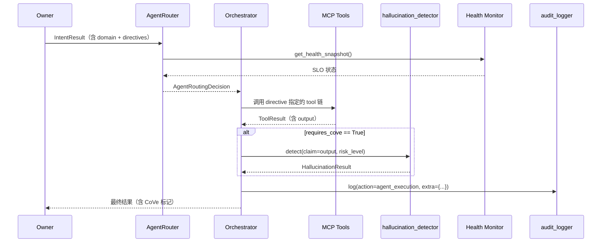

# ADR-0032：Agent 编排架构

## 1. 状态（Status）

- **当前状态**：`accepted`
- **提议日期**：2026-04-24
- **拍板日期**：2026-04-24
- **决策者**：Claude Opus 4.7（终局裁决）+ Project Owner
- **关联任务**：T-2-26（Phase 2 验收 ✅）→ T-3-09（本 ADR）→ T-3-10（AgentRouter 原型实现）→ T-3-11（Orchestrator Phase 3 首版）
- **关联集成点**：
  - `src/zephyr/mcp/tool_contracts.yaml`（ADR-0033）
  - `src/zephyr/infra/hallucination_detector.py`（T-3-07，ADR-0039）
  - `src/zephyr/infra/intent_keyword_mapper.py`（ADR-0035 Stage 1）
  - `src/zephyr/infra/ai_behavior_audit_logger.py`（T-2-32）

## 2. 背景与问题（Context）

Phase 2 完成时，系统已具备七大基础设施（SQLite / ChromaDB / Intent 三阶段 / Deferred Queue / Observer / File-as-Task / Handoff），但以下多 Agent 协作问题仍然没有形式化答案：

1. **Agent 角色边界模糊**：同一个模型在同一个 session 里承担"规划 / 写代码 / 审查 / 写文档 / 跑审计"五种职责，切换规则分散在 rules/prompt 里，缺少统一编排层。
2. **路由策略零散**：IntentResult 给出 `primary_domain` 和 `suggested_directives`，但"domain → Agent 角色"与"Agent 角色 → 模型档位"两层映射由 rules 自然语言描述维护，无任何运行时校验。
3. **健康状态不可感知**：当 Sonnet 4.6 配额耗尽、GLM-5.1 限流、Opus 超时时，系统以"任务直接失败"告终，缺少主动降级与告警机制。
4. **CoVe 注入无统一入口**：ADR-0039 要求所有 L1 白名单 / H 级 risk 输出触发 CoVe，但如果每个 MCP tool / directive 自己处理，会导致"部分入口漏注入"——与 ADR-0039 §4.1 的强制矩阵违反。
5. **跨 Agent 失败无标准兜底**：Planner 失败应该回滚还是重试？Coder 失败是否走 Handoff？目前没有统一梯度。
6. **成本不可控**：没有统一的 Agent 账本，哪怕 CoVe / Intent Stage 3 各自有预算线，Agent 层面"一个任务总共花了多少"不可观测。

**关键风险**：若 Phase 3 直接用"五个 Agent 各自 new 一个 Orchestrator-like loop"方式实施，将复刻 Phase 1 的 rules/prompt 碎片化困境——每个 Agent 的限流 / 降级 / 审计都要重写，维护成本指数级扩散。

**关键机会**：2025-03 起 Cursor / Anthropic 的 Claude Code 均以"Single Orchestrator + Sub-Agent 工具化"范式交付；ZephyrAlpha 早期 Rationale Log R-AGENT-ORCHESTRATION 已对齐此方向，现在正是硬编码的时机。

## 3. 考虑过的方案（Options Considered）

### 方案 A：无编排层，每个 Agent 自己跑主循环

- **优点**：实现最快，与 Phase 1/2 既有写法一致
- **缺点**
  - ❌ 重复建设：5 份限流 / 5 份降级 / 5 份审计胶水代码
  - ❌ CoVe 注入漏项不可避免
  - ❌ 健康状态聚合只能事后跑脚本拼接 JSONL
  - ❌ 跨 Agent 的 context 传递靠 rules 自然语言描述
- **结论**：驳回

### 方案 B：完全自建 Multi-Agent Framework（如 AutoGen / CrewAI 克隆）

- **优点**：灵活度最高
- **缺点**
  - ❌ 个人开发，工作量 10×
  - ❌ 需维护调度器 / 任务队列 / Agent 注册表全栈
  - ❌ 与 ADR-0036（Deferred Queue）/ ADR-0033（MCP）存在设施重叠
- **结论**：驳回

### 方案 C：直接采用 LangGraph / AutoGen

- **优点**：开箱即用
- **缺点**
  - ❌ 引入重量级框架，违反 ADR-0031 "零运维额外依赖"
  - ❌ 其内置 Agent 协议与 MCP（ADR-0033）不兼容
  - ❌ 私有化部署与 classification=internal 冲突
- **结论**：驳回

### 方案 D：**AgentRouter + Orchestrator + Health Monitor + CoVe 后置注入（本 ADR 选定）**

- **思路**：复用已有 MCP / CoVe / Intent 三套基础设施，在它们之上新建 **薄编排层**：
  - **AgentRouter**：IntentResult → Agent Role 的无状态路由函数
  - **Orchestrator Agent**：无状态任务指挥者，编排 directive ↔ MCP tool chain，post-hook 统一注入 CoVe
  - **Health Monitor**：订阅 Observer（ADR-0035/016）事件，维护每个 Agent 的 SLO 状态
  - **降级梯度**：主模型 → 备用模型 → 本地规则 → Handoff
- **优点**
  - ✅ 不新增服务进程（沿用 ADR-0036 Deferred Queue）
  - ✅ CoVe 强制注入点唯一（Orchestrator post-hook）
  - ✅ 可观测性：Health Monitor 聚合 SLO，写入 `docs/09_audit/AI_BEHAVIOR/`
  - ✅ 与 ADR-0033 MCP / ADR-0039 CoVe / ADR-0041 Handoff 三条已有契约天然衔接
  - ✅ 每个 Agent 角色仍可被替换（Coder 从 Sonnet 降到 GLM，路由配置一行改）
- **权衡**
  - ⚠ 引入 AgentRouter + Orchestrator 两个新组件，Phase 3 需要 T-3-10 / T-3-11 两个 Task 交付
  - ⚠ Health Monitor 需要额外 Observer 事件订阅，但复用了已有管道

## 4. 决策（Decision）

**最终选择：方案 D —— AgentRouter + Orchestrator Agent + Health Monitor + CoVe 后置注入。**

### 4.1 Agent 角色与模型档位映射

| Agent Role | 主要职责 | 默认主模型 | 降级备模型 | 触发条件 |
|------------|---------|----------|-----------|---------|
| **Planner** | 任务拆解 / ADR 审查 / 架构设计 | Claude Opus 4.7 | Claude Sonnet 4.6 | 主模型 QPS 限流 / 配额耗尽 |
| **Coder** | 施工图 → src/ 代码实现 | Claude Sonnet 4.6 | GLM-5.1 | 主模型 5xx ≥ 3 次/分钟 |
| **Reviewer** | 代码审查 / CoVe 主模型 | Claude Sonnet 4.6 | GLM-5.1 | 同上 |
| **DocKeeper** | 文档写入 / INDEX 同步 / frontmatter 校验 | GLM-5.1 | Composer 2 | GLM 5xx / 限流 |
| **Auditor** | Sentinel L1 / Gate / 治理扫描 | Composer 2 + 本地脚本 | Composer 2（单模型 lite） | 本地脚本触发 → 不降级 |
| **Verifier** | CoVe 验证模型（异构） | GLM-5.1 | Qwen-3.6 / DeepSeek-V3 | GLM API 不可达 |

**映射规则（由 AgentRouter 实现）**：`IntentResult.primary_domain → Agent Role` 按 10 域默认规则（见 §5.1），支持 `IntentResult.override_agent` 字段做人工覆盖（仅 Owner 可设）。

### 4.2 AgentRouter 的职责与 API

- **无状态 / 幂等 / 纯函数**：输入 IntentResult + 当前 Health Snapshot，输出 AgentRoutingDecision（Agent role + 模型档位 + 降级标记）
- **决策依据**（按优先级）
  1. `IntentResult.override_agent`（Owner 显式指定）
  2. Health Monitor 标记"主模型不可达" → 切换备模型
  3. 预算告警 → Health Monitor 建议降档
  4. `IntentResult.primary_domain` 默认映射表
- **契约**：新增到 `src/zephyr/infra/agent_router.py`（T-3-10）

```python
class AgentRoutingDecision(BaseModel):
    model_config = BASE_CONFIG
    agent_role: Literal["planner","coder","reviewer","dockeeper","auditor","verifier"]
    model_tier: str                # "opus" | "sonnet" | "glm" | "composer"
    fallback_used: Optional[str]   # None | "primary_down" | "budget_downgrade"
    rationale: str                 # 为何路由到该 Agent 的一句话理由
    requires_cove: bool            # 是否需要 post-hook 注入 CoVe
```

### 4.3 Orchestrator Agent 的职责与调度链

Orchestrator 是 **无状态指挥者**，一次调度对应一次"directive 链 → MCP tool 链 → CoVe 后置检查"的端到端闭环：



**关键不变式**：
- Orchestrator **不**直接调用 LLM——所有 LLM 调用走 MCP tool 或 CoVe 调用者
- Orchestrator **必须**在任何返回 Owner 的路径前执行 CoVe 判定（由 AgentRoutingDecision.requires_cove 决定）
- Orchestrator **只**维护本次调度的局部 context，不持久化——持久化交给 SQLite（ADR-0030）+ Observer（ADR-0036）

### 4.4 Health Monitor 的 SLO 观测面

Health Monitor 订阅 `observer.py` 事件流，对每个 Agent Role 维护以下 5 项 SLO：

| SLO 指标 | 软阈值 | 硬阈值（触发降级） |
|---------|-------|-------------------|
| `latency_p95_ms` | 3000 | 8000（5 min 滑动窗口）|
| `cost_usd_today` | 预算 80% | 预算 100% |
| `error_rate` | 2% | 5%（1 min 滑动窗口）|
| `quota_remaining_pct` | 20% | 5% |
| `memory_rss_mb`（本地 Composer/脚本）| 500 | 1024 |

**事件产出（给 AgentRouter 消费）**：
- `primary_down`（硬阈值触发）→ Router 切换备模型
- `budget_warning`（软阈值 cost）→ Router 降档（Opus → Sonnet）
- `budget_critical`（硬阈值 cost）→ Router 拒绝除 H 级 risk 外的任务
- `quota_low` → Router 提前 Handoff

**落盘**：Health Monitor 状态每 30 s 覆盖写入 `docs/09_audit/reports/HEALTH_MONITOR_LATEST.json`（LATEST 模式，不按日期堆积）。
> ⚠️ v2.0（2026-05-03）：原路径 `docs/09_audit/state/` 已废弃——SQLite DB 迁移至 `data/zalpha_metadata.db`（ADR-0030 §4.1）。Health Monitor JSON 路径同步调整为 `reports/`，原 `state/` 目录不应再接收新写入。

### 4.5 三级降级梯度（统一 Agent 层）

```
主模型可达 ──────→ 正常执行
    │
    ├── 限流/5xx/超时（Health Monitor 告警 primary_down）
    │       │
    │       ▼
    ├── 切换备模型 ─── 仍不可达 ──→ Handoff 人工介入
    │       │
    │       ▼（备模型可用）
    │   继续执行（AgentRoutingDecision.fallback_used="primary_down"）
    │
    ├── 本日成本超 100%（硬阈值）
    │       │
    │       ▼
    │   L/M 级任务跳过（budget_skip），H 级强制执行并告警
    │
    └── CoVe 判定 is_hallucination=True + H 级
            │
            ▼
        强制 Handoff（复用 ADR-0041 HandoffPackage）
```

### 4.6 幻觉检测（CoVe）集成点

- **唯一入口**：Orchestrator post-hook（见 §4.3 sequenceDiagram）
- **触发判定**：AgentRoutingDecision.requires_cove 由 Router 根据 ADR-0039 §4.1 触发矩阵设置
- **失败路径**：CoVe 判定 `is_hallucination=True` + `risk_level=H` → Orchestrator **拒绝返回 output**，改返回 HandoffPackage
- **预算账本**：CoVe 自己的 $15/月预算（ADR-0039 §4.5）与 Agent 层预算 **独立计账**，互不抵扣

## 5. 集成点（Integration Contracts）

### 5.1 与 ADR-0035（Intent 三阶段）

- `IntentResult.primary_domain → Agent Role` 默认映射表（10 域）：

| primary_domain | 默认 Agent Role | 默认 risk_level（给 CoVe）|
|---------------|----------------|--------------------------|
| D0 / D8（meta / HMI） | Planner + DocKeeper | L |
| D1 / D7（audit / analytics） | Auditor | M |
| D2（architecture） | Planner | **H** |
| D3（codegen） | Coder + Reviewer | M |
| D4（strategy） | Planner + Reviewer | **H** |
| D5（risk） | Planner | **H** |
| D6（governance） | DocKeeper + Auditor | M |
| D9（debug） | Coder + Reviewer | M |

- AgentRouter 接收 `IntentResult.source_stage ∈ {semantic, llm}` 且 `confidence < 0.90` → 强制 `requires_cove=True`

### 5.2 与 ADR-0033（MCP）

- Orchestrator 调用 MCP tool 时必须使用 `tool_contracts.yaml` 登记的 tool_id；禁止绕过
- MCP tool output 进入 Orchestrator 后，由 Orchestrator 执行 post_check（如果 tool 声明了 `post_check: cove`）—— Orchestrator 是 post_check 的**唯一执行点**

### 5.3 与 ADR-0039（CoVe）

- CoVe 调用由 Orchestrator 通过 `hallucination_detector.detect(...)` 发起
- CoVe 的触发矩阵由 AgentRouter 在 `requires_cove` 字段中固化；`hallucination_detector` 不再二次判定触发
- CoVe 预算独立；Agent 层不干预其内部降级级联

### 5.4 与 ADR-0041（Handoff）

- 以下三种情况触发 Handoff：
  1. 备模型亦不可达（`primary_down` + `fallback_unreachable`）
  2. CoVe 判定 H 级幻觉（`is_hallucination=True + risk_level=H`）
  3. 预算 budget_critical 且任务是 H 级
- Handoff 走标准 `HandoffPackage`（schemas.py）；Orchestrator 负责组装 `next_actions` / `blocked_items`

### 5.5 与 ai_behavior_audit_logger（T-2-32）

- Orchestrator 每次调度结束记一条 `AuditAction=MODEL_CALL` + 一条 `AuditAction=GATE_DECISION`
- Health Monitor 事件作为 `AuditAction=RULE_TRIGGER` 落盘
- 若触发 CoVe，由 `hallucination_detector` 自身记 `AuditAction=HALLUCINATION_CHECK`（ADR-0039 §5.2）

## 6. 后果（Consequences）

### 6.1 正面后果

- 消灭"五个 Agent 五套限流逻辑"的重复建设
- CoVe 注入点唯一，漏注入风险归零
- Health Monitor + AgentRouter 让降级行为可预测、可观测、可回放
- Phase 4 新增 Agent 角色只需加一行路由映射，无需改底座
- 与 MCP / CoVe / Handoff 三条 ADR 的集成契约形式化，防漂移

### 6.2 负面后果 / 权衡

- 新增两个模块（AgentRouter / Orchestrator），Phase 3 需额外 2 个 Task
- Health Monitor 订阅 Observer 增加少量 IO 开销（<1% CPU）
- Orchestrator 每次调度增加 <50 ms 协调延迟（可接受）

### 6.3 未来需要重新审视的触发条件

| # | 触发条件 | 重审动作 |
|---|---------|---------|
| 1 | 主模型 API QPS 限制显著放宽（Anthropic/Zhipu 升配额） | 可能删除 Health Monitor 的 quota SLO |
| 2 | 出现多模型"同时可达但响应差异大"的竞争场景 | 引入 Agent-of-Agents 投票机制 |
| 3 | MCP 协议升级到 0.4+ 支持原生 tool composition | 可能把 Orchestrator 调度逻辑下沉到 MCP 侧 |
| 4 | Phase 4 引入 Cursor Cloud 远程 Agent | Health Monitor 扩展跨机器 SLO 聚合 |
| 5 | CoVe 的 H 级 FN 率连续 > 15% | 在 Orchestrator post-hook 叠加二次校验（RAG）|

## 7. 与其他 ADR 的边界速查

| ADR | 关系 | 关键契约 |
|-----|------|---------|
| ADR-0030（SQLite） | Agent 调度事件写 events 表 | `event_type=agent_execution, payload.role` |
| ADR-0031（ChromaDB） | Agent 失败模式写 failure_patterns | `metadata: category=agent_failure` |
| ADR-0033（MCP） | Orchestrator 调用 tool 的唯一途径 | §5.2 |
| ADR-0035（Intent 三阶段） | IntentResult → AgentRoutingDecision 入口 | §5.1 |
| ADR-0036（Deferred Queue） | 长任务 Agent 走异步唤醒 | Orchestrator 调度长任务时 enqueue |
| ADR-0038（File-as-Task） | DocKeeper Agent 写文件走 1:1 映射 | `safety_level=H` 触发 Planner 前置审查 |
| ADR-0039（CoVe） | 后置幻觉检测 | §5.3 |
| ADR-0040（Pydantic） | AgentRoutingDecision / HandoffPackage 契约 | model_config=BASE_CONFIG |
| ADR-0041（Handoff） | Agent 失败兜底通道 | §5.4 |

## 8. 落地动作（Implementation）

- [x] 本 ADR 落盘 `docs/02_enterprise_architecture/adr/ADR-0032.md`
- [ ] T-3-10：`src/zephyr/infra/agent_router.py`
  - [ ] AgentRoutingDecision Pydantic 契约
  - [ ] 10 域 × Agent Role 默认映射表
  - [ ] override_agent + Health Snapshot 合流逻辑
  - [ ] 单元测试 ≥ 12 条
- [ ] T-3-11：`src/zephyr/infra/orchestrator.py`（Phase 3 首版，单 directive 链）
  - [ ] 与 hallucination_detector / MCP tool 调用胶合
  - [ ] Handoff 兜底路径
  - [ ] post-hook CoVe 注入
- [ ] T-3-12：`src/zephyr/infra/health_monitor.py`
  - [ ] 5 项 SLO 聚合
  - [ ] 硬/软阈值事件发布
  - [ ] LATEST JSON 覆盖写
- [ ] Phase 4：Orchestrator 支持多 directive 链并行
- [ ] 在 `docs/02_enterprise_architecture/adr/index.md` 追加本 ADR 行（ADR-011 系列当前无独立 index，沿用目录文件枚举）
- [ ] `docs/02_enterprise_architecture/target-architecture/09-governance-architecture.md` 追加 §Agent 编排架构小节

## 9. 参考

- **相关 ADR**：
  - ADR-0033（MCP 协议）
  - ADR-0035（Intent 三阶段）
  - ADR-0036（Deferred Queue）
  - ADR-0038（File-as-Task）
  - ADR-0039（CoVe 幻觉检测）
  - ADR-0040（Pydantic 契约）
  - ADR-0041（Handoff 协议）
- **相关代码**：
  - `src/zephyr/infra/hallucination_detector.py`（T-3-07）
  - `src/zephyr/infra/ai_behavior_audit_logger.py`（T-2-32）
  - `src/zephyr/mcp/tool_contracts.yaml`（T-2-23-C）
- **外部参考**：
  - Anthropic 2025 "How We Build Multi-Agent Systems at Anthropic"（internal tech blog）
  - Cursor 2025.3 Release Notes § MCP Server 发现与调度
  - AutoGen / CrewAI / LangGraph 对比综述（R-AGENT-ORCHESTRATION rationale-log 节选）

## 10. 修订记录

| 日期 | 版本 | 变更 |
|------|------|------|
| 2026-04-24 | 1.0.0 | 初版：锁定 AgentRouter + Orchestrator + Health Monitor + CoVe 后置注入四组件编排架构；6 个 Agent 角色（Planner/Coder/Reviewer/DocKeeper/Auditor/Verifier）；10 域 × 角色默认映射；5 项 SLO；三级降级梯度；与 ADR-0033/010/011/013/018/019/020 七条契约边界。|
