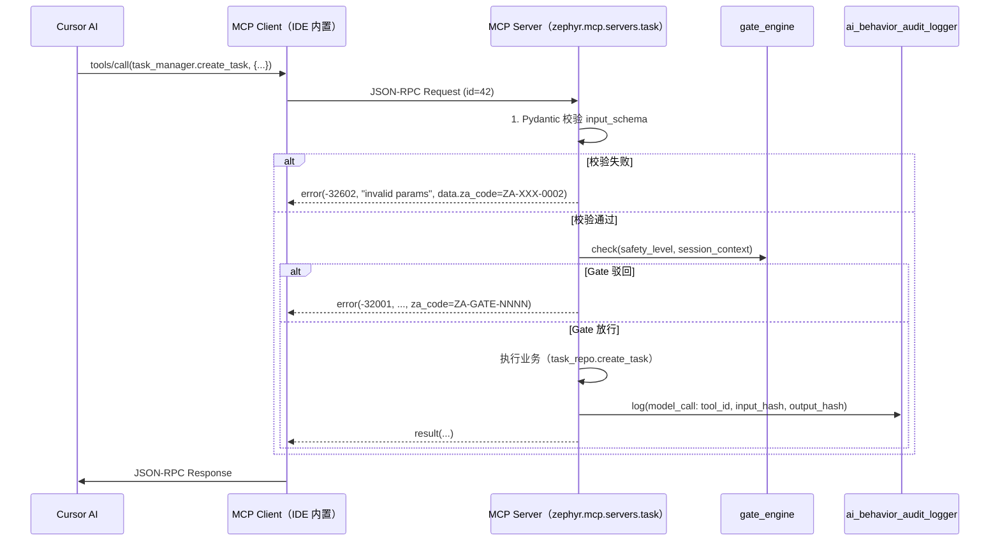

# ADR-0033：MCP（Model Context Protocol）在 ZephyrAlpha 的协议规范

## 1. 状态（Status）

- **当前状态**：`accepted`
- **提议日期**：2026-04-24
- **拍板日期**：2026-04-24
- **决策者**：Claude Opus 4.7（终局裁决）+ Project Owner
- **关联任务**：T-3-01（本 ADR）→ T-3-02（`requirements.txt` 登记 `mcp>=1.0.0`）→ T-3-03（`scripts/mcp/server_wrapper.py` 基类）→ T-3-04（5 MCP Server 实现）→ T-3-05（Cursor 端到端测试）
- **关联契约**：`src/zephyr/mcp/tool_contracts.yaml`（T-2-23-C，schema_version 1.0.0，spec_version MCP/0.3，frozen）
- **上游依赖**：ADR-0030（SQLite）、ADR-0031（ChromaDB）、ADR-0035（意图三阶段）、ADR-0038（File-as-Task）、ADR-0040（Pydantic）、ADR-0041（Handoff）

## 2. 背景与问题（Context）

Phase 2 完成后，ZephyrAlpha 已经形成七大基础设施：SQLite 元数据、ChromaDB 向量、意图三阶段、Deferred Queue、Observer、File-as-Task、Handoff Protocol。Phase 3 开始，Cursor / Trae 等 AI IDE 需要能**稳定、可发现、可审计地**调用这些基础设施的能力。当前面临的问题：

1. **调用协议碎片化**：目前 Cursor 通过 `@` 命令读文件、通过 "rules" 注入上下文、通过 shell 调脚本——三条不同路径、零统一契约；Trae 的 `.roomodes` 又是另一套。若 Phase 3 继续"一事一接口"，Phase 4 接入更多 Agent（Claude Code / Cursor Cloud / 自建脚本）时会指数级复杂化。
2. **工具发现不可达**：AI 不知道系统有哪些可调用的治理工具（`sentinel_l1_governance_scan.py` / `doc_guard_pre_commit.py` / `task_repo.py`），只能靠用户或 rules 手动提示——违反"AI 驱动自主迭代"目标（ADR-0005 KMS 架构 §3）。
3. **工具契约无强制校验**：即使封装 CLI，AI 调用前无法静态校验参数 schema，失败模式暴露在运行时而非调用前；与 T-2-29 `contract_template_manager.py` 的设计意图冲突。
4. **远程 Agent 接入无路径**：Phase 4 计划引入 Cursor Cloud / 自建 Worker，跨机器调用 ZephyrAlpha 工具必须有远程传输协议。
5. **与 DOS 指令系统耦合点不清**：`模块候选池/prompt库/DOS/` 定义了 4 × 10 域的 directive 链（000–999），每条 directive 会命令 AI 模型"调用 X 工具"——但 directive 与工具之间缺少形式化的绑定，目前靠自然语言描述。
6. **与意图三阶段（ADR-0035）的路由盲区**：`IntentResult.suggested_directives` 产出后，如何把"建议 directive"落到具体"调哪个 MCP 工具"没有规范。

**关键风险**：若此处选"不上协议，直接脚本 CLI 互调"，Phase 3 启动时 Cursor 只能把每个脚本当 shell 命令粘合，**工具契约、可发现性、错误码规范全失**，且未来换到 Claude Code / Cursor Cloud 时必须推倒重来。

**关键机会**：2024-11 Anthropic 发布 MCP 1.0，2025-03 Cursor 2025.3+ 原生支持 MCP Server 发现与调用，Trae CN 亦已在 2026 Q1 对齐 MCP/0.3。此刻采用 MCP 正好卡在"生态成熟、实现零成本、跨 IDE 可用"的时间窗口。

## 3. 考虑过的方案（Options Considered）

### 方案 A：LangChain Tools + Cursor 自定义命令

- **优点**
  - LangChain 生态成熟、有 `@tool` 装饰器
  - 本地即可跑
- **缺点**
  - ❌ **耦合 LangChain 运行时**（LLM 框架），但本项目 AI 模型在 IDE 侧而非服务端，LangChain 在这里是额外依赖
  - ❌ **无跨 IDE 标准**：Cursor / Trae 不会识别 LangChain `@tool`，需要每个 IDE 自己包装
  - ❌ **无资源（Resource）语义**：LangChain 只有 Tool 没有 Resource，File-as-Task（ADR-0038）的"文件即资源"模型无法自然表达
  - ❌ 违反 ADR-0030 / ADR-0031 的"零运维、零重额外依赖"原则

### 方案 B：OpenAI Function Calling Schema

- **优点**
  - 业界最广使用的工具调用 schema
- **缺点**
  - ❌ **仅是 JSON Schema 子集**，不含传输协议、不含发现机制、不含 Resource 类型
  - ❌ **与 Anthropic 生态割裂**：本项目主模型是 Claude Opus 4.7（D2-244 / D3-344），Sonnet 4.6（D3-325 / D3-356），Cursor 已走 MCP 路线
  - ❌ **多 IDE 支持弱**：Cursor 不原生支持 OpenAI Function Calling 作为外部工具发现通道

### 方案 C：自定义 HTTP/REST API（Flask / FastAPI）

- **优点**
  - 协议自由度最高
- **缺点**
  - ❌ **需常驻服务进程**（Flask/Uvicorn），违反 ADR-0036 的"零额外服务"原则
  - ❌ **自造轮子**：协议规范、发现机制、错误码体系全要自己设计，工作量 5×
  - ❌ **Cursor / Trae 无法自动发现**，必须用户手工配置每个 endpoint

### 方案 D：直接 shell 脚本 + 约定 stdin/stdout JSON

- **优点**
  - 零依赖、零框架
- **缺点**
  - ❌ **无 schema 校验**：参数错误只能运行时暴露
  - ❌ **无 Resource 概念**：`@file` 引用要自己实现
  - ❌ **无批量/流式输出**：长任务（Sentinel 全仓扫描）无法 progress 反馈
  - ❌ **IDE 不识别**，仍需在 Cursor 侧包装

### 方案 E：**Anthropic MCP（Model Context Protocol）1.0 + JSON-RPC 2.0（本 ADR 选定）**

- **思路**
  - 采用 MCP 作为**唯一**工具调用协议骨干
  - 消息格式固定为 JSON-RPC 2.0
  - 传输层分阶段：Phase 3 仅 stdio（本地零运维）；Phase 4 按需开 SSE（远程 Agent）
  - 每个 Server 通过 `tool_contracts.yaml` 静态声明 Resources + Tools，`server_wrapper.py` 装饰器运行时从 YAML 加载 schema 做输入校验
  - 5 Server 初始清单：`task_manager / doc_guard / knowledge_base / gate_engine / sentinel`
- **优点**
  - ✅ **Cursor 2025.3+ / Trae CN 原生发现**：零用户配置成本
  - ✅ **SDK 官方维护**（`pip install mcp>=1.0.0`）：不需要重造协议栈
  - ✅ **Resource + Tool 二分**：天然匹配 File-as-Task（文件 = Resource）与治理动作（action = Tool）
  - ✅ **stdio 模式零依赖**：不需要 HTTP 服务器，进程启动即注册，与 Observer（ADR-0037）完美共存
  - ✅ **JSON-RPC 2.0 错误码体系**：对齐本项目 `ZA-{SERVER}-{NNNN}` 命名空间（`tool_contracts.yaml` 已定义）
  - ✅ **跨 IDE 可移植**：同一套 Server 代码在 Cursor / Trae / Claude Code / 自建 Worker 都可复用
- **权衡**
  - ⚠ **协议锁定**：一旦 Anthropic 调整 MCP spec（0.3 → 0.4），需要 SDK 升级
    - **缓解**：`tool_contracts.yaml` 与 `mcp` SDK 解耦，schema 自管理，SDK 升级对用户无感
  - ⚠ **Cursor 以外的 AI 工具支持周期**：Claude Code / 自建 Worker 需要等 SDK 成熟
    - **缓解**：Phase 3 只对 Cursor 做端到端（T-3-05），Phase 4 再扩展

## 4. 决策（Decision）

**最终选择：方案 E —— 采用 Anthropic MCP 1.0 作为 ZephyrAlpha 全系 AI 工具调用协议，以 JSON-RPC 2.0 为消息格式，Phase 3 走 stdio 传输。**

### 4.1 协议栈四层边界

```
┌─────────────────────────────────────────────────────────────┐
│  Layer 4 · Application         · 业务工具（task_manager / …）│
│  Layer 3 · MCP Spec            · Tool / Resource / Prompt   │
│  Layer 2 · Message Format      · JSON-RPC 2.0               │
│  Layer 1 · Transport           · stdio（Phase 3）/ SSE（Phase 4）│
└─────────────────────────────────────────────────────────────┘
```

### 4.2 传输层（Transport Layer）

#### Phase 3 · stdio（必须）

- **通道**：子进程 stdin / stdout（MCP SDK 官方默认）
- **启动方式**：Cursor 在 `.cursor/mcp.json` 中声明 Server：

  ```json
  {
    "mcpServers": {
      "zephyr-task": {
        "command": "python",
        "args": ["-m", "zephyr.mcp.servers.task"],
        "env": {"ZEPHYR_HOME": "."}
      }
    }
  }
  ```

- **生命周期**：与 IDE 子进程同生死；不作守护进程；崩溃由 IDE 重新拉起
- **并发模型**：单 Server 单进程；多 Server 之间互不共享状态（通过 SQLite WAL 做底层事务一致性）
- **性能约束**：P95 单次调用 < 2 s（对齐 T-3-05 验收）；stdio 帧大小 ≤ 4 MiB（超出走 Resource 引用）

#### Phase 4 · SSE（可选）

- **触发条件**：当 ≥ 1 个远程 Agent（Cursor Cloud / 自建 Worker）需要访问 ZephyrAlpha 工具时启用
- **端口约定**：`127.0.0.1:7890`（本机默认）；远程走反向代理，不在本 ADR 固化
- **鉴权**：**本 ADR 不涉及鉴权方案**（留给独立 ADR-011-0??——Phase 4 启动前补）；在补之前 SSE **仅允许 localhost 绑定**（G5 风控门禁强制）
- **与 stdio 共存**：同一 Server 二进制同时支持两种 transport，由启动参数切换（`--transport stdio|sse`）

#### 禁止清单

- ❌ **禁止 HTTP/REST 自定义 endpoint**（除非未来 ADR 取代本决策）
- ❌ **禁止 WebSocket**（MCP spec 未标准化）
- ❌ **禁止通过 MCP 传输二进制大文件**（> 4 MiB 必须走 Resource URI 引用）

### 4.3 消息格式（JSON-RPC 2.0）

所有 MCP 消息遵循 JSON-RPC 2.0（RFC 规范），四种基本消息类型：

| 类型 | 方向 | 示例方法 |
|------|------|---------|
| Request | Client → Server | `tools/list` / `tools/call` / `resources/list` / `resources/read` |
| Response | Server → Client | `{jsonrpc, id, result}` 或 `{jsonrpc, id, error}` |
| Notification | 双向（无 id） | `notifications/progress` / `notifications/cancelled` |
| Error | Server → Client | `{jsonrpc, id, error: {code, message, data}}` |

#### 错误码映射（ZephyrAlpha 专属）

JSON-RPC 2.0 预留 `-32000 ~ -32099` 为"服务端自定义"；本项目把 `ZA-{SERVER}-{NNNN}` 映射为：

- **JSON-RPC `code` 字段**：固定使用 `-32001`（通用服务端错误），不按 server 细分
- **JSON-RPC `data` 字段**：必须包含 `{"za_code": "ZA-TSK-0001", "http_status": 404, "retryable": false}`
- **具体映射表**：见 `tool_contracts.yaml` 每个 server 的 `error_codes` 节

**示例**：

```json
{
  "jsonrpc": "2.0",
  "id": 42,
  "error": {
    "code": -32001,
    "message": "task_id not found",
    "data": {
      "za_code": "ZA-TSK-0001",
      "http_status": 404,
      "retryable": false,
      "tool_id": "task_manager.get_task",
      "input": {"task_id": "T-X-99"}
    }
  }
}
```

### 4.4 工具注册（Registration）

- **真源**：`src/zephyr/mcp/tool_contracts.yaml`（T-2-23-C，frozen SSoT）
- **注册时机**：Server 进程启动时（stdio 握手前）
- **注册流程**：

  ```
  1. BaseMCPServer.__init__() 读取 tool_contracts.yaml
  2. 定位本 server_id 节（如 task_manager）
  3. 遍历 tools[]：
     - 用 name 作为 tool_id
     - 用 input_schema 编译 Pydantic 模型（ADR-0040）
     - 注册到内部 dispatch 表
  4. 遍历 resources[]：
     - 解析 URI pattern
     - 注册到 resource 路由表
  5. 握手 initialize → 返回 capabilities
  ```

- **装饰器语法**（`server_wrapper.py` 提供）：

  ```python
  class TaskManagerServer(BaseMCPServer):
      server_id = "task_manager"

      @mcp_tool(name="task_manager.get_task")
      def get_task(self, task_id: str) -> dict: ...

      @mcp_resource(uri="zephyr://task_manager/tasks/{task_id}")
      def tasks_resource(self, task_id: str) -> dict: ...
  ```

- **frozen 契约保护**：任何新增 tool / 修改 schema 必须先改 `tool_contracts.yaml`（走 doc_guard 的 controlled-documents 门禁）；Server 代码层禁止硬编码 schema（pre-commit C-11 规则）。

### 4.5 工具发现（Discovery）

- **发现入口**：MCP `tools/list` 方法（协议自带）
- **输出字段**：name / description / input_schema / safety_level / stability / rate_limit（后三字段来自 `tool_contracts.yaml`，通过 MCP `_meta` 字段传递）
- **stability 可见性**：
  - `experimental` / `beta`：对 Cursor AI 可见，需在 description 末尾追加 `⚠ UNSTABLE`
  - `stable` / `frozen`：对 Cursor AI 可见，无警告
- **safety_level 调用门禁**（与 `gate-strategy.md` G4 对齐）：
  - L（只读）：AI 可自主调用
  - M（写入非关键）：AI 可调用，但需在 audit log 记录
  - H（写入关键/不可逆）：**必须**走 Handoff（ADR-0041）的 manual_event 通道，由 Owner 审批

### 4.6 工具调用（Invocation）

调用流程（mermaid）：



关键契约：

1. **每次调用必写 audit log**（ADR-0041 audit 整合 + T-2-32 `ai_behavior_audit_logger.py`）：action=model_call, target=tool_id, session_id 从 MCP `_meta` 取
2. **每次 H 级工具必过 Gate**（`gate-strategy.md` G4 / G5）
3. **Rate limit**：超出 `rate_limit_qps` 立即返回 `-32001 / ZA-{SRV}-RATE_LIMIT`，不入队等待
4. **超时**：默认 30 s；超时由 IDE 侧取消，Server 侧收到 `notifications/cancelled` 后释放资源
5. **幂等性**：凡 `idempotent: true` 的工具（见 `tool_contracts.yaml`），重复调用必须返回相同结果——业务层通过 `input_hash` + session 缓存实现

### 4.7 5 个首批 Server（Phase 3 落地清单）

与 `tool_contracts.yaml` 严格对齐：

| # | Server ID | 包装对象 | Phase 3 任务 |
|---|-----------|---------|-------------|
| 1 | `task_manager` | `task_repo.py` + `file_task_mapper.py` | T-3-04 |
| 2 | `doc_guard` | `doc_guard_pre_commit.py` | T-3-04 |
| 3 | `knowledge_base` | ChromaDB + `knowledge_indexer.py` | T-3-04 |
| 4 | `gate_engine` | `gate_engine.py`（ADR-011-??? G1-G6）| T-3-04 |
| 5 | `sentinel` | `sentinel_l1_governance_scan.py` | T-3-04 |

**每个 Server 最少 4 Resource + 4 Tool**（T-3-01 验收硬指标）。

### 4.8 版本演进策略

- **spec_version**：跟随 Anthropic MCP（当前 `MCP/0.3`）；升级时本 ADR 追加 Erratum，不新建 ADR
- **schema_version**：本项目独立版本号，遵循 semver
  - PATCH（1.0.x）：bug fix / description 澄清，Server 无需升级
  - MINOR（1.x.0）：新增 tool / resource，旧调用兼容
  - MAJOR（x.0.0）：Breaking change，必须走 Handoff 批准 + 同步升级所有 Server
- **version 锁定**：`mcp>=1.0.0,<2.0.0`（T-3-02 中落盘）

## 5. 集成边界（Integration Contracts）

### 5.1 与 ADR-0035（意图三阶段）的集成

**契约名**：`Intent → MCP Tool Chain`

**输入**：`IntentResult`（ADR-0035 §4.3）

**输出**：`list[MCPToolInvocation]`

**映射规则**：

```
IntentResult.primary_domain  →  候选 MCP Server 集合（按 domain 过滤 tool_contracts.yaml tags）
IntentResult.suggested_directives  →  按 directive 前缀路由：
    1xx (D1 audit)        → sentinel / doc_guard tools
    2xx (D2 architecture) → knowledge_base.query / task_manager.create_task
    3xx (D3 codegen)      → task_manager.update_task / gate_engine.check
    4xx (D4 strategy)     → knowledge_base.search_strategy
    ...
    9xx (compliance gate) → gate_engine.check（强制串联）
IntentResult.confidence   →  调用模式：
    ≥ 0.75  → 直接调用（AI 决策）
    < 0.75  → 返回建议列表（Handoff 给 Owner 确认）
```

**数据契约**（新增到 `src/zephyr/schemas.py`）：

```python
class MCPToolInvocation(BaseModel):
    server_id: str
    tool_id: str
    input: dict[str, Any]
    expected_safety_level: Literal["L", "M", "H"]
    source_directive: str | None = None  # e.g. "244"
    source_intent_confidence: float
    auto_invoke: bool                    # True 当 confidence ≥ 0.75 且 safety_level in [L, M]
```

**level 分层**：

- Stage 1（keyword, Phase 2）：直接基于 `matched_keywords` → `suggested_directives`，不跨 MCP
- Stage 2（embedding, Phase 3 启用 MCP 后）：可调用 `knowledge_base.semantic_search` 再产出 directive
- Stage 3（LLM, Phase 4）：允许 LLM 输出 MCP invocation 序列，但 H 级仍走 Handoff

**失败模式**：Intent 路由到不存在的 `tool_id` → 触发 `failure_pattern_detector`（T-2-33）记录模式 `FP-INTENT-UNMAPPED`，并在 `IntentResult.rationale` 注入 fallback 建议。

### 5.2 与 DOS 指令系统的集成（`模块候选池/prompt库/DOS/`）

> **说明**：原任务描述中将 ADR-0036 标注为"DOS 指令系统"，但当前仓库 ADR-0036 主题为 Deferred Queue（异步工作流）。DOS 指令系统目前驻留于 `模块候选池/prompt库/DOS/`（由 `architecture/overview.md` + `directives/*` 维护），其 ADR 化尚未立项（open question，待后续批次）。本节据此把 **DOS 集成契约**直接固化在本 ADR 中，待未来 DOS ADR 落盘后迁移。同时 §5.3 补全与 ADR-0036（Deferred Queue）的实际集成契约。

**契约名**：`Directive → MCP Tool Chain`

**输入**：directive 编号串（如 `"222+244+999"`，语法见 `模块候选池/prompt库/DOS/architecture/numbering-scheme.md`）

**输出**：按顺序执行的 `list[MCPToolInvocation]`，最后一项固定为 `gate_engine.check`（999 compliance gate）

**映射规范**：

| directive 前缀 | 代表域 | 典型 MCP 调用 |
|--------------|-------|--------------|
| `000` | D0-meta / task-router | `task_manager.get_phase_summary`；本身即 Intent Mapper 入口 |
| `011`/`022`/`033`/`044` | D0-knowledge | `knowledge_base.extract` / `.structure` / `.index` / `.review` |
| `111`/`122`/`133`/`144` | D1-audit | `sentinel.scan` / `sentinel.root_cause` / `doc_guard.check` / `gate_engine.final_rule` |
| `222`/`244` | D2-architecture | `knowledge_base.query_adr` / `task_manager.open_adr_task` |
| `313`/`325`/`344`/`356` | D3-codegen | `task_manager.update_code_task` + `gate_engine.check` |
| `411`–`944` | D4-D9 业务域 | 按 `tool_contracts.yaml` 标签检索 |
| `999` | compliance gate | `gate_engine.check`（**强制末位**） |

**编排语义**：

- `+` 表示**顺序**执行；前一步产出作为后一步 input 的上下文
- `|` 表示**并行**（Phase 4 启用，Phase 3 不支持）
- 末位必须是 `999`；缺 999 的 directive 链在 `directive_validator`（T-3-0??，Phase 3 追加）阶段被驳回

**与 DOS `closed-loop.md` 的对齐**：DOS 闭环"glm-发散 → kimi-结构 → qwen-落地 → opus-审核"四步映射到 MCP 四次调用；每一步的模型切换通过 Cursor / Trae 的模型选择 API 控制（不由 MCP 承担）；MCP 只负责"调用哪个工具"。

**审计**：每次 directive → MCP 展开必须记录到 `ai_behavior_audit_logger`（T-2-32），事件类型 `rule_trigger`，extra 字段携带原始 directive 串、展开后的 tool chain、每步的 za_code。

### 5.3 与 ADR-0036（Deferred Queue）的集成

**契约名**：`Long-Running MCP Tool → Deferred Queue`

**触发条件**：MCP 工具预估执行时间 > 5 s（由 `tool_contracts.yaml` 扩展字段 `estimated_duration_ms` 标注；本 ADR 同步要求 T-2-23-C 追加该字段）

**流程**：

1. Server 收到 `tools/call`
2. 若目标 tool `estimated_duration_ms > 5000`：
   - 立即在 `tasks` 表插入 WAITING 记录（status=WAITING, waiting_for=`mcp_result:{invocation_id}`）
   - 返回 `result={"invocation_id": "...", "status": "deferred"}`，P95 < 100 ms
3. Server 派发执行到后台线程；完成后：
   - 写结果到 `events` 表（ADR-0030）
   - 发 Observer event（ADR-0037）：`mcp_result:{invocation_id}`
4. DeferredQueue 批量唤醒 WAITING 任务（ADR-0036 §4.2）
5. AI 侧通过轮询 `tools/call: task_manager.get_task({task_id})` 获取最终 result

**前置约束**：

- Phase 3 先落同步路径（5 Server 全部同步返回）；异步仅作为**可选**扩展，Phase 3 末尾通过一次 P99 压测决定是否启用
- 异步入口仅对 safety_level=L/M 工具开放，H 级必须同步阻塞等待 Gate 决策

### 5.4 与其他 ADR 的边界速查

| ADR | 关系 | 关键契约字段 |
|-----|------|------------|
| ADR-0030（SQLite） | `events` 表记录每次 MCP 调用；`tasks` 表承载 Deferred invocation | `event_type=mcp_call, payload.tool_id, payload.za_code` |
| ADR-0031（ChromaDB） | `knowledge_base` Server 的后端 | collection 4 个（KE / Rules / Blueprints / FailurePatterns）|
| ADR-0037（Observer） | 异步 MCP 通过 Observer 回调 | event name = `mcp_result:{invocation_id}` |
| ADR-0038（File-as-Task） | MCP Resource URI 与 file path 双向映射 | `zephyr://...` ↔ `file://...`，由 `file_task_mapper` 双向解析 |
| ADR-0040（Pydantic） | 所有 MCP input/output 走 Pydantic v2 | `BASE_CONFIG`（`schemas.py`）必须被 MCPModel 基类继承 |
| ADR-0041（Handoff） | H 级工具通过 manual_event 通道 | Handoff event type = `mcp_approval_request` |
| gate-strategy.md §G4 | Safety level gate 在 Server 层执行 | `gate_engine.check(tool_id, session_context)` |
| gate-strategy.md §G5 | 成本 / 速率 / frontmatter / ruff / mypy 五类 gate | 每次 MCP 调用后立即执行 G5.1–G5.6 |

## 6. 后果（Consequences）

### 6.1 正面后果

- **单一工具调用协议**：Cursor / Trae / Claude Code / 未来 Worker 一律走 MCP，无二元分裂
- **AI 自主发现能力**：`tools/list` 使 Cursor 能主动看到"系统有什么工具"，进入 ADR-0005 KMS"自主迭代"轨道
- **与意图三阶段 / DOS / Gate 三大基础设施形成闭环**：Intent → Directive → MCP → Gate → Audit 完整链路
- **Phase 4 远程 Agent 零额外设计**：SSE 已预留
- **失败可观测**：每次调用必写 audit log + za_code，失败模式自动入库
- **契约 SSoT**：`tool_contracts.yaml` 成为工具世界的 schema 真源，避免代码/文档漂移

### 6.2 负面后果 / 权衡

- **新增 runtime 依赖 `mcp>=1.0.0`**：违反绝对零依赖理想
  - **缓解**：Anthropic 官方维护，语义稳定；T-3-02 固定 major 版本
- **首批 5 Server 工作量增加 ≈ 3 人日**：需要 BaseMCPServer + 5 个具体 Server
  - **缓解**：`server_wrapper.py` 一次性投入，后续 Server 扩展 ≤ 0.5 人日/个
- **stdio 单通道无法多路复用**：每个 Server 一个子进程，IDE 启动时会拉起 N 个 Python 进程
  - **缓解**：单 Server 内存 ≈ 80 MB × 5 = 400 MB，在开发机可接受；Phase 4 可合并为单进程多 server（MCP spec 支持）
- **JSON-RPC 2.0 不自带鉴权**：stdio 模式下无需鉴权（子进程隔离），SSE 模式需独立 ADR
  - **缓解**：Phase 3 不启 SSE；Phase 4 启用前硬阻断至鉴权 ADR 落地
- **与 DOS 指令系统的 ADR 尚未独立**：当前 §5.2 作为 placeholder，未来需迁出
  - **缓解**：开 open question OQ-MCP-DOS-ADR，跟踪到独立 ADR 落地

### 6.3 未来需要重新审视的触发条件（Review Triggers）

| # | 触发条件 | 重审动作 |
|---|---------|---------|
| 1 | Anthropic 发布 MCP 1.x（非兼容升级） | 本 ADR 追加 Erratum，`mcp` 依赖升级专项评估 |
| 2 | stdio Server 进程总内存 > 2 GB | 评估合并为单进程多 Server（MCP spec 原生支持）|
| 3 | 远程 Agent 接入需求达成（Phase 4 启动）| 立 ADR-011-0?? 鉴权方案，SSE 启用前置门禁 |
| 4 | 单次 MCP 调用 P99 > 5 s 频繁出现 | 强制启用 §5.3 Deferred 路径，P99 降至 100 ms |
| 5 | `tool_contracts.yaml` 中 H 级工具数量 > 30% | 重新评估 Gate 策略；可能需要引入中间层（M+） |
| 6 | 任一 IDE 主动取消 MCP 支持（Cursor / Trae） | 退化到方案 D（stdio shell）作为 fallback，保留 JSON-RPC 2.0 消息格式 |
| 7 | 本地 embedding 模型升级导致 KB Server 响应时间 > 2 s | 结合 ADR-0031 §6.3 重审；若 Gate G5.3 命中则限流 |

## 7. 落地动作（Implementation）

- [x] 本 ADR 落盘 `docs/02_enterprise_architecture/adr/ADR-0033.md`
- [x] `tool_contracts.yaml` v1.0.0 已就绪（T-2-23-C）
- [ ] T-3-02：`requirements.txt` 追加 `mcp>=1.0.0,<2.0.0`
- [ ] T-3-03：`scripts/mcp/server_wrapper.py` 实现 `BaseMCPServer` + `@mcp_tool` + `@mcp_resource` 装饰器 + YAML schema 加载
- [ ] T-3-04：5 Server 实现（`task / doc_guard / kb / gate / sentinel`）
- [ ] T-3-05：`tests/mcp/test_e2e.py` 端到端；验证 Cursor 2025.3+ 可发现并调用全部 5 Server × ≥ 4 tools
- [ ] §5.1 契约：`src/zephyr/schemas.py` 追加 `MCPToolInvocation`
- [ ] §5.3 契约：`tool_contracts.yaml` 全量追加 `estimated_duration_ms` 字段（升 schema_version → 1.1.0）
- [ ] `docs/02_enterprise_architecture/adr/index.md` 登记本 ADR
- [ ] `docs/02_enterprise_architecture/target-architecture/07-integration-architecture.md` 新增 §MCP 小节
- [ ] Phase 3 末尾：决定是否启用 §5.3 异步路径

## 8. 参考

- **相关 ADR**：
  - ADR-0030（SQLite · events / tasks 承载 MCP 调用台账）
  - ADR-0031（ChromaDB · knowledge_base Server 后端）
  - ADR-0035（Intent 三阶段 · §5.1 Intent → MCP 契约）
  - ADR-0036（Deferred Queue · §5.3 长任务异步契约）
  - ADR-0037（Observer · MCP 异步唤醒事件）
  - ADR-0038（File-as-Task · Resource URI 映射）
  - ADR-0040（Pydantic · 输入/输出契约）
  - ADR-0041（Handoff · H 级工具审批通道）
- **相关文档**：
  - `src/zephyr/mcp/tool_contracts.yaml`（SSoT）
  - `docs/02_enterprise_architecture/gate-strategy.md` §G4 / §G5
  - `模块候选池/prompt库/DOS/architecture/numbering-scheme.md`（directive 编号法）
  - `模块候选池/prompt库/DOS/architecture/closed-loop.md`（四模型闭环）
  - `模块候选池/开发流程/任务卡/phase-3-cards.md` §T-3-01 ~ §T-3-05
- **外部参考**：
  - Anthropic Model Context Protocol 规范 v0.3（2025-03）
  - JSON-RPC 2.0 specification（https://www.jsonrpc.org/specification）
  - Cursor 2025.3 MCP integration release notes
  - Trae CN 2026 Q1 MCP/0.3 对齐说明

## 9. 修订记录

| 日期 | 版本 | 变更 |
|------|------|------|
| 2026-04-24 | 1.0.0 | 初版：锁定 MCP 1.0 + JSON-RPC 2.0；传输层 Phase 3 stdio / Phase 4 SSE；5 Server 清单；与 Intent 三阶段 / DOS / Deferred Queue 三个集成契约（§5.1 / §5.2 / §5.3）；7 条重审触发条件。 |
