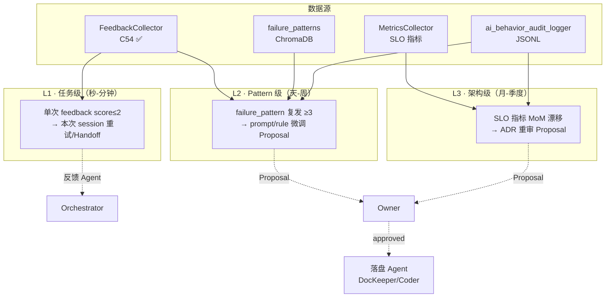

# ADR-0034：半自动进化架构

## 1. 状态（Status）

- **当前状态**：`accepted`
- **提议日期**：2026-04-24
- **拍板日期**：2026-04-24
- **决策者**：Claude Opus 4.7（终局裁决）+ Project Owner
- **关联任务**：T-2-26（Phase 2 验收 ✅）→ T-3-13（本 ADR）→ T-3-14（`evolve()` 接口实现）→ T-3-15（EvolutionProposal Pydantic 契约）→ T-4-xx（长期趋势看板）
- **关联集成点**：
  - `src/zephyr/infra/feedback_collector.py`（T-2-29 C54 ✅）
  - `src/zephyr/infra/ai_behavior_audit_logger.py`（T-2-32）
  - `src/zephyr/infra/hallucination_detector.py`（T-3-07，ADR-0039）
  - `src/zephyr/infra/metrics_collector.py`（T-2-25）
  - ADR-0032（Agent 编排，Health Monitor 集成）

## 2. 背景与问题（Context）

Phase 2 验收后系统进入稳定运行，但以下长期演化问题无答案：

1. **反馈数据已有、但无消费管道**：`FeedbackCollector`（C54 ✅）能收集 score / comment / tags，却没有统一的 "feedback → 行动" 映射；每次 Owner 要手动翻 JSON 提炼结论。
2. **failure_patterns 堆积而不复用**：`failure_pattern_detector`（T-2-33）产出的模式写入 ChromaDB，但没有任何订阅者把"某模式反复 30 次"转成可执行的 prompt/规则修改。
3. **SLO 长期漂移不可见**：MetricsCollector 记 retry_rate / latency / cost，缺乏 "本月比上月好还是坏" 的趋势比对；真正的架构级信号被噪声淹没。
4. **"自动改代码" vs "全人工" 的两难**：
   - 全自动改代码/prompt/rules = 失控风险（模型可能把自己的 hallucination 固化为"进化"）
   - 全人工调优 = 迭代速度跟不上 Phase 3/4 的任务密度
5. **CoVe 幻觉模式没有反哺通路**：ADR-0039 §5.2 要求 failure_patterns 沉淀 hallucination 案例，但如何把沉淀用到未来的 prompt 工程 / 阈值调整，没有形式化接口。
6. **acceptance drift 风险**：Owner 在 Phase 2 制定的验收标准（测试覆盖率 80% / mypy strict / ruff 0）可能在 Phase 3 高强度施工时被稀释（"这次就放过吧"），需要数字化警报。

**关键风险**：若"进化"既没有接口又没有审批闸门，系统要么长期停滞（Owner 精力不够），要么被 AI 悄悄改飞（失控）。

**关键原则（R-HUMAN-IN-LOOP）**：个人量化交易系统的风控底线是"Owner 永远在决策闭环内"——任何会改变架构 / 风控参数 / 落盘契约的进化动作都必须 Owner 显式 approve。

## 3. 考虑过的方案（Options Considered）

### 方案 A：全自动进化（Self-Rewriting Agents）

- **思路**：Agent 自己根据 failure_patterns 直接修改 rules / prompt / 代码
- **优点**：迭代最快
- **缺点**
  - ❌ **失控风险极大**（模型可能把自己的幻觉作为"进化证据"固化）
  - ❌ 违反 R-HUMAN-IN-LOOP 原则
  - ❌ 与 ADR-0039 的 CoVe "H 级 Handoff" 策略冲突
- **结论**：驳回

### 方案 B：纯人工调优（Status Quo）

- **优点**：完全可控
- **缺点**
  - ❌ 迭代速度跟不上 Phase 3/4 的任务量
  - ❌ 信号靠 Owner 手动挖掘，容易漏
  - ❌ 已有基础设施（FeedbackCollector / failure_patterns / MetricsCollector）无消费者
- **结论**：驳回

### 方案 C：RLHF / DPO 微调私有模型

- **优点**：学术界主流
- **缺点**
  - ❌ 个人开发无训练算力
  - ❌ 需维护训练数据管线
  - ❌ 与项目 "API 驱动、零本地模型" 方向冲突
- **结论**：驳回

### 方案 D：**半自动进化（evolve() 接口 + 三层反馈闭环 + Owner 审批门禁）—— 本 ADR 选定**

- **思路**：
  - 系统自身 **只产出提案**（EvolutionProposal），不直接改任何受版控资产
  - Owner 审批后 Agent（DocKeeper / Coder）落盘变更
  - 三层反馈闭环（L1/L2/L3）在不同时间尺度上收敛
- **优点**
  - ✅ R-HUMAN-IN-LOOP 硬遵守
  - ✅ 已有 FeedbackCollector / failure_patterns / MetricsCollector 全面复用
  - ✅ 可回放：每条 EvolutionProposal 都可追溯到源信号
  - ✅ 与 ADR-0032 Agent 编排、ADR-0039 CoVe 无缝衔接
  - ✅ 零新服务进程
- **权衡**
  - ⚠ 需要 Owner 定期审阅 Proposals（每周建议 1 次）
  - ⚠ 进化速度受 Owner 审批节奏限制（接受此权衡）

## 4. 决策（Decision）

**最终选择：方案 D —— 半自动进化（evolve() 接口 + 三层反馈闭环 + 审批门禁）。**

### 4.1 `evolve()` 接口签名

```python
def evolve(
    *,
    since: datetime,                       # 反馈窗口起点（默认 7 天）
    until: Optional[datetime] = None,      # 反馈窗口终点（默认 now）
    feedback_collector: FeedbackCollector, # 数据源 1：任务级 feedback（C54 契约）
    failure_patterns: Iterable[FailurePattern],  # 数据源 2：Pattern 级（ChromaDB 导出）
    metrics_snapshot: MetricsSnapshot,     # 数据源 3：SLO 指标（MetricsCollector）
    audit_log_dir: Path,                   # 数据源 4（可选）：AI 行为审计 JSONL
    output_path: Path,                     # 写提案 YAML 的目标路径
    min_recurrence: int = 3,               # L2 Pattern 聚合的最低复发次数
    dry_run: bool = True,                  # True 时只生成 YAML 不写文件
) -> list[EvolutionProposal]:
    """
    基于三源信号生成 EvolutionProposal 列表。

    规则：
    - 纯函数：只读输入，只写 output_path（dry_run=True 时亦不写）
    - 不触发任何 LLM 调用（进化判定基于规则 + 统计）
    - 不修改任何受版控资产（frozen 契约）
    - 每条 Proposal 必须含：signal_type / severity / rationale / proposed_change / affected_assets
    - 每条 Proposal 走 Owner 审批：approved / rejected / deferred
    """
```

### 4.2 EvolutionProposal Pydantic 契约

新增到 `src/zephyr/schemas.py`（与 T-3-15 协同）：

```python
class EvolutionSignalType(str, Enum):
    HIGH_RETRY_RATE = "high_retry_rate"
    LOW_KNOWLEDGE_HIT = "low_knowledge_hit"
    CONTEXT_OVERFLOW = "context_overflow"
    DEPENDENCY_BOTTLENECK = "dependency_bottleneck"
    ACCEPTANCE_DRIFT = "acceptance_drift"

class EvolutionSeverity(str, Enum):
    INFO = "info"       # 仅记录，不影响架构
    WARN = "warn"       # 建议本周审阅
    CRITICAL = "critical"  # 本月内必须响应；触发 ADR 重审

class EvolutionProposal(BaseModel):
    model_config = BASE_CONFIG
    proposal_id: str           # EV-YYYYMMDD-NNN
    signal_type: EvolutionSignalType
    severity: EvolutionSeverity
    detected_at: datetime
    window_from: datetime
    window_to: datetime
    rationale: str             # 为何该信号被触发的定量依据（min_length=1）
    proposed_change: str       # 建议的具体修改（prompt / rule / threshold / ADR 重审）
    affected_assets: list[str] # 受影响的文件路径（相对 repo root）
    evidence: list[str]        # 源数据引用（fb entry id / failure_pattern id / metrics snapshot key）
    owner_decision: Literal["pending","approved","rejected","deferred"] = "pending"
    decision_reason: Optional[str] = None
```

### 4.3 三层反馈闭环（Feedback Loop Tiers）



#### L1 · 任务级（实时）

- **触发源**：`FeedbackCollector.add()` 写入一条 `score ≤ 2` 的 feedback（Pydantic 1-5 Scale）
- **行为**：Orchestrator（ADR-0032）立即拉起本次 session 重试 or Handoff；**不**产生 Proposal
- **预算**：同步调用，无额外成本

#### L2 · Pattern 级（批处理，天/周）

- **触发源**：`failure_patterns.recurrence_count ≥ 3` 且 `resolved=False`
- **行为**：`evolve()` 聚合同类 pattern，产出 `EvolutionProposal(signal_type=...)`；写 YAML 等 Owner 审批
- **审批路径**：Owner 每周至少 1 次 review，approved 的 Proposal 由 DocKeeper Agent 落盘
- **典型案例**：
  - 同一个 CoVe 误报模式复发 5 次 → Proposal: "调整 inconsistency threshold"
  - 某 directive 失败 4 次 → Proposal: "增强 prompt 模板 §X"

#### L3 · 架构级（月度 / 季度）

- **触发源**：`MetricsSnapshot` 的 MoM / QoQ 漂移 ≥ 预设阈值
- **行为**：产出 severity=CRITICAL 的 Proposal，建议 **新开 ADR 或重审现有 ADR**
- **典型案例**：
  - CoVe H 级拦截率 MoM 下降 > 15% → Proposal: "重审 ADR-0039 §4.3 阈值"
  - Agent 月度 cost 漂移 > 预算 + 20% → Proposal: "重审 ADR-0032 §4.4 SLO 硬阈值"

### 4.4 五类进化信号（Signal Types）

| # | 信号类型 | 判定规则（默认阈值） | 数据源 | 关联层 |
|---|---------|--------------------|-------|-------|
| 1 | **high_retry_rate** | 窗口内任务 retry_rate > 20% | MetricsCollector + audit_log | L2 / L3 |
| 2 | **low_knowledge_hit** | knowledge_base.semantic_search 命中率 < 60% 连续 7 天 | MetricsCollector | L3 |
| 3 | **context_overflow** | Agent 单次 context 超过 80% budget > 5 次 / 天 | context_budget_tracker | L2 |
| 4 | **dependency_bottleneck** | 某 task_id 被 ≥ 3 个下游任务依赖且阻塞 > 24h | SQLite tasks 表 | L2 |
| 5 | **acceptance_drift** | 单次 session 验收放宽（例如 ruff 0 → 允许警告） | audit_log + session_log | L2 / L3 |

阈值可由 `evolve()` 参数覆盖。任一信号触发 severity：

- 单信号命中：severity=warn
- 多信号共现（≥ 2）：severity=critical
- 仅信息记录：severity=info（归档 90 天）

### 4.5 审批门禁（Governance Gate）

- **存放路径**：`docs/09_audit/EVOLUTION/proposals-YYYY-MM.yaml`（LATEST 覆盖每月一份）
- **审批状态流转**：
  ```
  pending → approved → (by DocKeeper/Coder) applied
        ↘ rejected
        ↘ deferred → (next month review)
  ```
- **不可绕过**：任何修改 frozen 资产（ADR-*.md、tool_contracts.yaml、config/risk/**）的 Proposal 必须 `severity=critical` + Owner 显式 `approved` + commit message 含 `evolution-approved: EV-XXXX` 前缀
- **审计留痕**：审批决策通过 `ai_behavior_audit_logger.log(action=RULE_TRIGGER, target=proposal_id, result=decision, extra={reason})` 落盘

### 4.6 与 feedback_collector.py（C54 ✅）的集成契约

| 契约点 | 当前 C54 已具备 | 本 ADR 新增依赖 |
|-------|----------------|----------------|
| `add(task_id, score, comment, tags)` | ✅ | `evolve()` 通过 `get_entries(task_id=None)` 批量拉取 |
| `summarize(task_id) -> FeedbackSummary` | ✅ | 用于计算 retry_rate 前置信号 |
| `flush()` / `load()` 持久化 | ✅ | `evolve()` 可选 pre-call `load()` 确保数据新鲜 |
| `tags: list[str]`（去重） | ✅ | 约定标签字典：`needs-review / slow / accurate / hallu-suspect / acceptance-loosened` |
| `score ≤ 2` 触发 L1 实时回路 | **本 ADR 新增** | Orchestrator 订阅 FeedbackCollector 的 add hook |

**新增一条 C54 的轻量扩展**（T-3-14 顺带完成）：`FeedbackCollector.add()` 触发时暴露一个可选的 `on_low_score` 回调（默认 None），让 Orchestrator 订阅实时反馈。

## 5. 集成点（Integration Contracts）

### 5.1 与 feedback_collector.py（T-2-29 C54 ✅）

- **数据流向**：`FeedbackCollector → evolve() → EvolutionProposal.yaml → Owner → Agent 落盘`
- **向后兼容**：本 ADR 不改 FeedbackEntry / FeedbackSummary 已有字段，只加可选 `on_low_score` hook
- **测试责任**：evolve() 的 L2 聚合逻辑必须有单元测试（T-3-14 交付 ≥ 12 条）

### 5.2 与 ADR-0032（Agent 编排）

- Orchestrator 订阅 FeedbackCollector 的 L1 回路（score ≤ 2 立即 Handoff 或重试）
- Health Monitor 的 SLO 指标作为 L3 架构信号源
- `evolve()` 的输出（Proposal）由 AgentRouter 路由给 DocKeeper Agent 落盘（Owner approved 后）

### 5.3 与 ADR-0039（CoVe 幻觉检测）

- CoVe 的 `failure_patterns:category=hallucination` 条目是 L2 的重点消费对象
- 进化信号 acceptance_drift 的判定里包含 "CoVe 从 H 级降级到 M 级" 的记录
- 若 L3 Proposal 触发 ADR-0039 §4.3 阈值调整，则升级为 ADR 重审路径

### 5.4 与 ADR-0040（Pydantic 契约）

- `EvolutionProposal` 必须登记到 schemas.py 并遵循 BASE_CONFIG（`extra=forbid`）
- 字段命名遵循 ADR-0040 §4.4 snake_case

### 5.5 与 ADR-0041（Handoff）

- 当 L2 Proposal 的 severity=critical 但 72h 内 Owner 未审批：
  - 由 Orchestrator 主动产出 `HandoffPackage(open_questions=[proposal_id])`
  - 防止 Proposal 在队列里僵尸化

### 5.6 与审计（T-2-32）

- 每次 `evolve()` 运行记一条 `AuditAction=RULE_TRIGGER, target="evolve()"`（含 proposals_count / time_window）
- 每个 Owner 审批决策记一条 `AuditAction=GATE_DECISION`（include proposal_id + decision）

## 6. 后果（Consequences）

### 6.1 正面后果

- 三套已有基础设施（FeedbackCollector / failure_patterns / MetricsCollector）从"数据孤岛"升级为"反馈闭环"
- Owner 审批门禁确保进化动作可控、可审计、可回放
- 五类信号覆盖 Phase 3/4 典型演化场景，不依赖主观直觉
- L3 信号机制自然触发 ADR 重审，防止架构文档陈旧
- `evolve()` 是纯函数，测试成本低，与 CoVe/Agent 编排独立

### 6.2 负面后果 / 权衡

- Owner 需要每周至少 1 次 review（建议安排在周末），成本是固定的
- 提案的 YAML 在 Owner 审批前可能堆积（缓解：severity=critical 有 72h 硬门禁走 Handoff）
- 规则 + 统计的进化判定可能漏掉"非结构化"灵感；需要 Phase 4 评估是否引入轻量 LLM 辅助（但这是新 ADR）

### 6.3 未来需要重新审视的触发条件

| # | 条件 | 重审动作 |
|---|------|---------|
| 1 | Proposal 月度堆积 > 20 条未审批 | 考虑把 L2 部分信号自动执行（仅针对 proposed_change 作用在 prompt/非代码资产时）|
| 2 | 五类信号覆盖率 < 60%（有漏报） | 新增信号类型（如 "low_user_satisfaction"）|
| 3 | 某类信号 critical 触发 > 5 次 / 月 | 该信号对应资产应升级到 `evolution_policy=frozen`（ADR-0040）|
| 4 | Phase 4 引入 RAG 方案 | evolve() 的 evidence 字段可直接从 KB 检索补全，Proposal 质量提升 |
| 5 | LLM 自省能力显著提升（Claude 5 / Opus 5 级）| 可开"全自动进化 for L1 only"的实验开关，但本 ADR 整体仍 semi-auto |

## 7. 与其他 ADR 的边界速查

| ADR | 关系 | 关键契约 |
|-----|------|---------|
| ADR-0030（SQLite） | Proposals 索引可选写入 events 表 | `event_type=evolution_proposal` |
| ADR-0031（ChromaDB） | failure_patterns 是 L2 主输入 | collection: failure_patterns |
| ADR-0032（Agent 编排） | Orchestrator 订阅 L1；Router 分发 DocKeeper 落盘 | §5.2 |
| ADR-0033（MCP） | evolve() 不调用 MCP tool（保持零 LLM 成本）| — |
| ADR-0035（Intent 三阶段） | low_knowledge_hit 信号对应 Stage 2 embedding 召回率 | §4.4 |
| ADR-0038（File-as-Task） | Proposal 落盘产出的任何新文件走 1:1 映射 | acceptance_drift 常常指向此 ADR |
| ADR-0039（CoVe） | hallucination failure_patterns 是 L2 信号 | §5.3 |
| ADR-0040（Pydantic） | EvolutionProposal 契约 | BASE_CONFIG |
| ADR-0041（Handoff） | 72h 未审批走 Handoff 兜底 | §5.5 |

## 8. 落地动作（Implementation）

- [x] 本 ADR 落盘 `docs/02_enterprise_architecture/adr/ADR-0034.md`
- [ ] T-3-14：`src/zephyr/infra/evolve.py`
  - [ ] `evolve()` 纯函数实现（五类信号 + 三层聚合）
  - [ ] 单元测试 ≥ 12 条
- [ ] T-3-15：`src/zephyr/schemas.py` 追加 `EvolutionProposal` / `EvolutionSignalType` / `EvolutionSeverity`
- [ ] T-3-16：`feedback_collector.py` 增加可选 `on_low_score` hook（向后兼容）
- [ ] T-3-17：`docs/09_audit/EVOLUTION/proposals-YYYY-MM.yaml` 模板 + Owner 审批 SOP
- [ ] Phase 4：T-4-xx 长期 SLO 趋势看板（L3 输入）
- [ ] `docs/02_enterprise_architecture/target-architecture/09-governance-architecture.md` 追加 §半自动进化 小节
- [ ] `docs/02_enterprise_architecture/adr/index.md`（ADR-011 系列）：目录枚举无需新增条目

## 9. 参考

- **相关 ADR**：
  - ADR-0030（SQLite · events）
  - ADR-0031（ChromaDB · failure_patterns）
  - ADR-0032（Agent 编排 · Orchestrator & Health Monitor）
  - ADR-0035（Intent 三阶段 · low_knowledge_hit 信号）
  - ADR-0038（File-as-Task · acceptance_drift 常见目标）
  - ADR-0039（CoVe · 幻觉 failure_patterns 通路）
  - ADR-0040（Pydantic · EvolutionProposal 契约）
  - ADR-0041（Handoff · 72h 超时兜底）
- **相关代码**：
  - `src/zephyr/infra/feedback_collector.py`（T-2-29 C54 ✅）
  - `src/zephyr/infra/metrics_collector.py`（T-2-25）
  - `src/zephyr/infra/context_budget_tracker.py`（T-2-27）
  - `src/zephyr/infra/ai_behavior_audit_logger.py`（T-2-32）
- **外部参考**：
  - R-HUMAN-IN-LOOP 原则（rationale-log）
  - Anthropic 2025 "Constitutional AI & Human Oversight" whitepaper
  - SRE "Error Budget Policy" 作为 L3 长周期信号建模参考

## 10. 修订记录

| 日期 | 版本 | 变更 |
|------|------|------|
| 2026-04-24 | 1.0.0 | 初版：锁定半自动进化范式；evolve() 纯函数接口签名；EvolutionProposal Pydantic 契约；三层反馈闭环 L1/L2/L3；五类进化信号（high_retry_rate / low_knowledge_hit / context_overflow / dependency_bottleneck / acceptance_drift）；Owner 审批门禁；与 feedback_collector.py（C54 ✅）的集成契约；与 ADR-0032 / 018 / 019 / 020 四条边界。|
