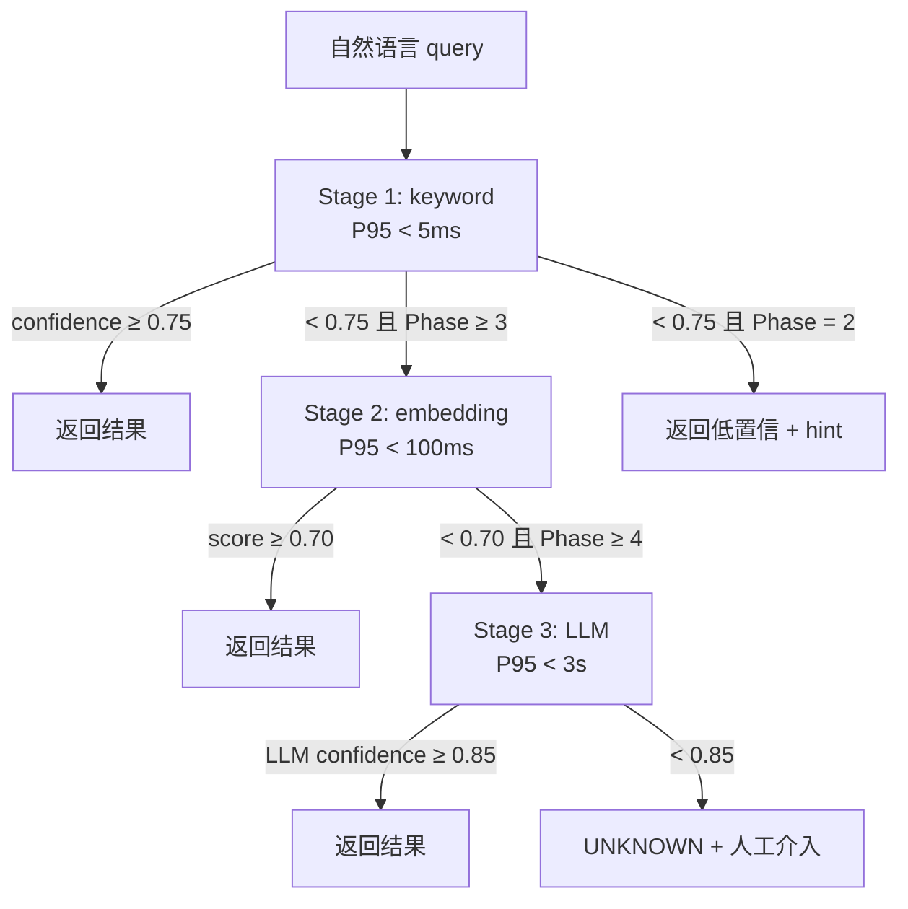

# ADR-0035：意图解析三阶段演进（keyword → embedding → LLM）

## 1. 状态（Status）

- **当前状态**：`accepted`
- **拍板日期**：2026-04-24
- **决策者**：Claude Opus 4.7（终局裁决）+ Project Owner
- **关联任务**：T-2-20（本 ADR）→ T-2-21（`scripts/infra/intent_keyword_mapper.py`）→ T-2-22（映射准确率测试）
- **关联实现**：`模块候选池/prompt库/DOS/directives/000-task-router.md`（10 域关键词信号源）

## 2. 背景与问题（Context）

ZephyrAlpha 引入 DOS 指令体系（D0-D9 十个域 × 每域若干 prompt directive），需要一个 **Intent Mapper** 回答：

> 「用户/上游 agent 说了一句自然语言，应该路由到哪个域？推荐哪些 directive？置信度多少？」

典型输入：

| 自然语言 | 期望域 | 期望 directive 链 |
|---------|-------|-----------------|
| "帮我审一下这份 ADR 有没有遗漏" | D2 architecture | 244 (opus-architecture-review) + 999 |
| "跑一遍 Sentinel L1 扫描" | D9 debug | 911 + 999 |
| "把这 3 份蓝图的价值评个级" | D2 / D6 | 222 + 244 + 999 |
| "给我写个 MA5 因子" | D4 strategy | 433 + 344 + 999 |
| "生成一份 session log" | D0 meta | 000 + 999 |

Phase 2 的现实约束：

1. **冷启动**：没有用户查询日志，无法做监督训练；
2. **成本预算**：月度 LLM API < $50（已在 Phase 3 门禁中明确）；
3. **延迟**：Intent 解析在 Handoff / DOS 启动器 / context_injector 三处高频调用，目标 P95 < 100 ms；
4. **可解释性**：Owner 需要能回答"为什么把这句路由到 D2 而不是 D3"——不能是黑盒；
5. **语料稀疏**：`000-task-router.md` 手工维护了 10 域关键词词典，≈ 20 词/域，合计 200 词，规模极小；
6. **ChromaDB 可用**（ADR-0031）：向量基础设施已铺好，Phase 3 可直接复用；
7. **模型降级链存在**（ADR-0041）：Opus → Sonnet → GLM → 本地，LLM-as-intent 可接入；
8. **10 域语义有重叠**：例如 D2 architecture 与 D6 governance-audit 在"审查 ADR"场景下语义接近，单纯 keyword 会误判。

**关键风险**：若此处选"一步到位用 LLM"，Phase 2 每日 Intent 调用约 100 次 × $0.002 ≈ $6/月（Sonnet），Phase 3 放量后可能超预算；若选"永远用 keyword"，Phase 4 用户用自然表达（如"给我看看昨天跑挂的那个"）会大量 miss。

## 3. 考虑过的方案（Options Considered）

### 方案 A：一步到位（Phase 2 直接 LLM-as-router）

- **思路**：所有 Intent 解析走 Sonnet / GLM 的 few-shot prompt，直接输出 `(domain, directives, confidence)` JSON。
- **优点**
  - 语义理解强，零词典维护
  - 支持多语言 / 错别字 / 隐喻
- **缺点**
  - ❌ **Phase 2 成本超标**：单次 intent ≈ 500 token × $0.004/K ≈ $0.002，假设 100 次/日 → $6/月。叠加其他 LLM 调用（context_injector / gate_engine P1 warning），Phase 2 就已逼近 $50 预算。
  - ❌ **延迟不可控**：Sonnet/Opus API P95 ≈ 2–5 s，远超 100 ms 目标
  - ❌ **冷启动故障点**：API 不可用时整个 DOS 启动器瘫痪
  - ❌ **可解释性弱**：Owner 难以调试"为何路由错了"

### 方案 B：永远 keyword（不演进）

- **优点**
  - 零成本、零延迟、纯离线
  - 完全可解释（词典即规则）
- **缺点**
  - ❌ **覆盖上限明显**：同义词（"ADR 审查" vs "架构决议复核"）需要人工扩词典
  - ❌ **无法扩展到跨语言 / 长句**
  - ❌ **Phase 4 失败模式分析需要语义相似度，keyword 不够**

### 方案 C：一步到位 embedding（全量向量检索）

- **思路**：每个 directive 写 embedding，query 来了就向量检索 Top-K。
- **优点**
  - 比 keyword 强的泛化
  - ChromaDB 已就绪（ADR-0031）
- **缺点**
  - ❌ **零成本优势丧失**：每次查询要算 query embedding（BGE-small CPU ≈ 30 ms），比 keyword 慢
  - ❌ **简单查询用向量过度**：`"帮我跑扫描"` 直接匹配 keyword `"跑扫描"` 即可，上 embedding 冗余
  - ❌ **向量调试成本高**：Owner 要解释"为何相似度 0.72 的被选、0.70 的被弃"比解释"keyword 命中与否"难 5×

### 方案 D：三阶段级联演进（**本 ADR 选定**）

- **思路**：keyword → embedding → LLM 三层级联，按置信度 cascade；每阶段升级由数值指标触发。
- **优点**
  - ✅ **Phase 2 零成本**：Stage 1 keyword 可完成 80%+ 高频查询，零 API 消耗
  - ✅ **Phase 3 按需升级**：Stage 2 embedding 在 keyword miss 时 fallback，利用已铺设的 ChromaDB
  - ✅ **Phase 4 LLM 兜底**：最后 5–10% 边缘查询走 LLM，总成本可控（$10/月以内）
  - ✅ **可观测演进**：每阶段可通过 `metrics` 表看「本阶段 hit 率 / miss 率 / 成本 / 延迟」，决定是否开下一级
  - ✅ **故障隔离**：LLM API 故障 → Stage 3 降级回 Stage 2；向量索引坏 → Stage 2 降级回 Stage 1
- **权衡**
  - ⚠ 实现复杂度 3×：需要三套后端 + 级联逻辑
  - ⚠ 需要黄金集评测保证升级收益真实（T-2-22 的准确率测试 + Phase 3 扩展）

## 4. 决策（Decision）

**最终选择：方案 D —— 三阶段级联演进。**

### 4.1 三阶段定义

#### Stage 1 · keyword 字典匹配（**Phase 2，T-2-21 实施**）

- **后端**：Python 纯字典查找 + jieba 分词（中英双语支持）
- **语料**：`000-task-router.md` 扩充到 10 域 × ≥ 20 关键词（T-2-21 验收）
- **算法**：对 query 分词 → 命中关键词计数 → 归一化得 `(domain, confidence)`；多域命中按计数排序返回 Top-3
- **性能**：P95 < 5 ms（单 session 内），零外部调用，零 API 成本
- **API**（与 T-2-21 acceptance 对齐）：
  ```python
  def map_intent(query: str) -> IntentResult:
      """返回 (primary_domain, secondary_domains[], confidence, matched_keywords[])。"""
  ```
- **置信度阈值**：
  - `confidence ≥ 0.75` → 高置信，直接返回，不触发 Stage 2
  - `confidence < 0.75` → fallback to Stage 2（Phase 3 启用后）；Phase 2 期间直接返回 `IntentResult(confidence=<0.75, fallback_hint="stage-1-only")`

#### Stage 2 · sentence-transformers embedding（**Phase 3**）

- **后端**：ChromaDB `vibe_rules` collection（已在 ADR-0031 §4.2 规划）
- **额外入库**：把 10 域 × 每域 directive 的「描述句 + 典型 query 示例」embedding 到同一 collection
- **算法**：Stage 1 confidence < 0.75 时，query embedding → collection.query(n_results=3) → 取 Top-1 score 作为 confidence
- **性能**：P95 < 100 ms（embedding 30 ms + 检索 30 ms + 开销）
- **置信度阈值**：
  - `score ≥ 0.70`（cosine）→ 采纳，返回
  - `score < 0.70` → fallback to Stage 3（Phase 4 启用）
- **升级触发**（Phase 2 → Phase 3 启动 Stage 2）：
  - **条件 A**：Stage 1 miss 率 > 20%（黄金集评测，由 T-2-22 采集）
  - **或条件 B**：Stage 1 误路由率 > 5%（Owner 手动标注）
  - **或时间条件**：Phase 3 正式启动

#### Stage 3 · LLM rerank / fallback（**Phase 4**）

- **后端**：primary = GLM-5.1（最便宜的 L 级）；fallback = Sonnet 4.6
- **Prompt**：few-shot，喂入 10 域的 directive 清单 + Stage 1/2 的候选 Top-3，让 LLM 做最终裁决并给出自然语言 rationale
- **性能**：P95 < 3 s（接受，因为这是最后一道兜底）
- **成本预算**：每日 ≤ 20 次 Stage 3 调用（通过 G5.6 Runtime Gate 强制）
- **置信度阈值**：
  - `LLM 输出 confidence ≥ 0.85` → 采纳
  - `< 0.85` → 返回 `IntentResult(domain="UNKNOWN", requires_human=True)`，emit `manual_event` 到 Handoff 通道
- **升级触发**（Phase 3 → Phase 4 启动 Stage 3）：
  - **条件 A**：Stage 2 miss 率 > 10%（ChromaDB 评测产出）
  - **或条件 B**：出现跨域意图（"帮我审完 ADR 后跑一遍 Sentinel" 需要 D2 + D6 组合），Stage 2 无法表达组合意图
  - **或时间条件**：Phase 4 正式启动 + 月度 API 预算尚有 ≥ $10 余量

### 4.2 级联流程图



### 4.3 关键数据契约

```python
class IntentResult(BaseModel):
    query: str
    primary_domain: Literal["D0","D1","D2","D3","D4","D5","D6","D7","D8","D9","UNKNOWN"]
    secondary_domains: list[str] = []
    confidence: float                      # 0.0–1.0
    matched_keywords: list[str] = []
    source_stage: Literal["keyword","embedding","llm"]
    suggested_directives: list[str] = []   # e.g. ["244","999"]
    requires_human: bool = False
    rationale: str | None = None           # Stage 3 LLM 给的自然语言解释
    latency_ms: int
    cost_usd: float = 0.0                  # Stage 1/2 = 0
```

契约入 `scripts/infra/schemas.py`（与 ADR-0040 对齐）。

### 4.4 黄金集评测（支撑升级决策）

- **黄金集位置**：`tests/fixtures/intent_golden_set.yaml`
- **规模**：Phase 2 启动时 ≥ 100 条（Owner 手标）；Phase 3 启动前扩到 ≥ 500 条
- **字段**：`query / expected_domain / expected_directives / notes`
- **评测脚本**：`tests/infra/test_intent_mapper.py`（持续集成时跑）
- **指标**：top-1 accuracy / top-3 recall / confusion matrix by domain

### 4.5 与其他 ADR 的边界

| ADR | 关系 |
|-----|------|
| ADR-0030（SQLite） | `metrics` 表记录每次 intent 调用（stage / latency / cost）；events 表记录 miss / unknown |
| ADR-0031（ChromaDB） | Stage 2 复用 `vibe_rules` collection + 新增 directive 入库 |
| ADR-0038（File-as-Task） | Intent 结果中若含文件相关操作，通过 domain 反向推导 task_id 前缀（`T-KE-*` / `T-BP-*` / `T-CP-*`） |
| ADR-0040（Pydantic） | `IntentResult` 模型契约化 |
| ADR-0041（Handoff） | `requires_human=True` 时走 Handoff 的 manual_event 通道 |
| gate-strategy.md §G5.6 | Stage 3 LLM 调用纳入月度成本门禁 |

## 5. 后果（Consequences）

### 5.1 正面后果

- Phase 2 零 API 成本启动 Intent Mapper；Sonnet B10/B11 可优先复用
- 每阶段升级有量化触发条件，不走"拍脑袋改架构"
- LLM 最终作为兜底，而非冷启动依赖 → 系统对 API 故障容忍度高
- 可解释性：Stage 1 matched_keywords / Stage 2 top-k score / Stage 3 rationale 三层都可向 Owner 展示
- 与 ChromaDB / DOS / Handoff 三大基础设施形成协同栈
- 黄金集评测让升级决策「可证伪」

### 5.2 负面后果 / 权衡

- **实现工作量增加**：Stage 2 / Stage 3 需要额外 1.5 + 2 人日（Phase 3 / Phase 4）
  - **缓解**：Phase 2 只需 T-2-21 的 Stage 1（0.5 人日），风险摊平
- **级联逻辑复杂**：三条路径需要单元测试覆盖
  - **缓解**：T-2-22 验收中明确含 3 条 fallback 路径的测试用例
- **黄金集冷启动维护成本**：≥ 100 条标注需要 Owner 人工
  - **缓解**：利用 `000-task-router.md` 现有示例起步；每次 Handoff 异常意图自动沉淀为黄金集候选

### 5.3 未来需要重新审视的触发条件（Review Triggers）

| # | 触发条件（数值化） | 重审 ADR |
|---|-----------------|---------|
| 1 | Stage 1 miss 率持续 2 周 > 20% | 提前启动 Stage 2 |
| 2 | Stage 2 开启后，Stage 1 + Stage 2 联合 top-1 accuracy < 70% | 提前启动 Stage 3 或扩词典 |
| 3 | Stage 3 月成本 > $30 或日调用 > 50 | 降档到本地小模型（Qwen-0.5B / phi-3-mini），重新评估 |
| 4 | 10 域分类不足以表达（Phase 5 出现新域如 D10-live_trading） | 扩充域数，重新制作黄金集 |
| 5 | embedding 模型升级（bge-small → bge-m3） | 重新评估 Stage 2 阈值（0.70 可能需调整） |

## 6. 落地动作（Implementation）

- [x] 本 ADR 落盘 `docs/02_enterprise_architecture/adr/adr-0035-intent-parsing-three-stage.md`（Stage F 后新树小写路径）
- [ ] T-2-21（GLM C46）：`scripts/infra/intent_keyword_mapper.py`（Stage 1）
- [ ] T-2-21：`000-task-router.md` 扩词到 10 域 × ≥ 20 关键词
- [ ] T-2-22（GLM C47）：`tests/infra/test_intent_mapper.py` + 黄金集 100 条
- [ ] Phase 3：`intent_embedding_mapper.py`（Stage 2）
- [ ] Phase 4：`intent_llm_router.py`（Stage 3）
- [ ] T-1-13（schemas.py）追加 `IntentResult`
- [x] `docs/02_enterprise_architecture/adr/index.md` 已登记本 ADR（Stage F 完成）

## 7. 参考

- 相关 ADR：
  - ADR-0030（SQLite —— metrics / events）
  - ADR-0031（ChromaDB —— Stage 2 向量层）
  - ADR-0038（File-as-Task —— 结果 → task_id 路由）
  - ADR-0040（Pydantic —— IntentResult）
  - ADR-0041（Handoff —— 人工介入通道）
- 相关文档：
  - `模块候选池/prompt库/DOS/directives/000-task-router.md`（关键词信号源）
  - `模块候选池/开发流程/任务卡/phase-2-cards.md` §T-2-20 / §T-2-21 / §T-2-22
  - `docs/02_enterprise_architecture/gate-strategy.md` §G5.6 成本门禁
- 外部参考：
  - "Intent Classification in Conversational AI" (Google Research, 2023)
  - LangChain Router chains 设计模式
  - Cascading classifiers 经典论文（Viola & Jones 2001 的思想迁移到 NLU）

## 8. 修订记录

| 日期 | 版本 | 变更 |
|------|------|------|
| 2026-04-24 | 1.0.0 | 初版：锁定三阶段级联；每阶段定义后端 / 阈值 / 升级触发条件；IntentResult 契约；5 条重审触发条件；黄金集评测机制。 |
