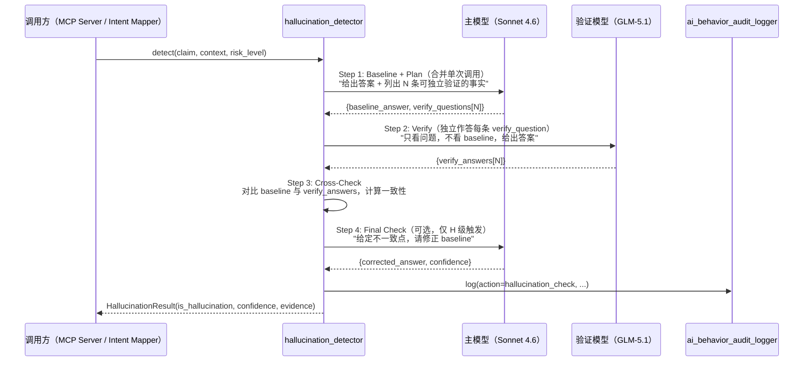
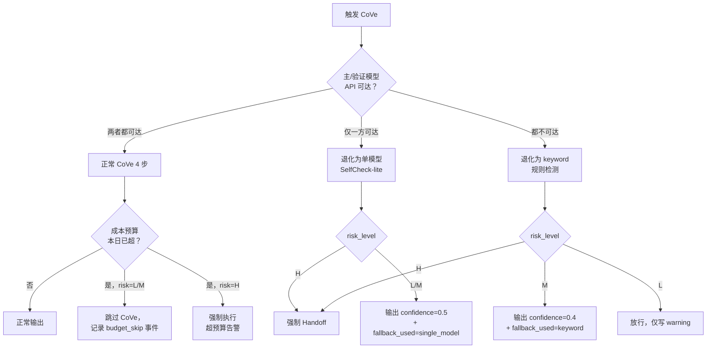

# ADR-0039：Chain-of-Verification（CoVe）幻觉检测策略

## 1. 状态（Status）

- **当前状态**：`accepted`
- **提议日期**：2026-04-24
- **拍板日期**：2026-04-24
- **决策者**：Claude Opus 4.7（终局裁决）+ Project Owner
- **关联任务**：T-3-06（本 ADR）→ T-3-07（`scripts/infra/hallucination_detector.py`）→ Phase 4 黄金集评测
- **关联集成点**：
  - `src/zephyr/infra/intent_keyword_mapper.py`（ADR-0035 Stage 2/3 触发检测）
  - `src/zephyr/infra/ai_behavior_audit_logger.py`（T-2-32，审计事件扩展）
  - `src/zephyr/mcp/tool_contracts.yaml`（ADR-0033 工具 output 可选接入）

## 2. 背景与问题（Context）

Phase 2 完成后，系统开始出现"AI 输出看起来合理但事实错误"的案例：

| 典型场景 | 现象 | 风险等级 |
|---------|------|---------|
| ADR 审查（D2-244） | 模型编造"Meta 2023 论文证明 XX 架构优势"但该论文不存在 | H（误导架构决策）|
| 因子设计（D3-344） | 模型计算 IC 公式时错把 `corr(rank(x), rank(y))` 写成 `corr(x, y)` | M（数值偏差）|
| 回测参数（D4）| 模型虚构"Citadel 内部使用 window=63"但无来源 | H（策略污染）|
| 知识条目提取（D0-044） | 模型从蓝图中"提取"原文不存在的结论 | H（KB 污染）|
| 任务卡拆分（D0-022） | 模型"记得"某 task_id 已存在但实际没有 | L（可由 task_repo 校验）|

**统计（基于 Phase 2 末尾的 ≈ 30 起案例）**：H 级 12 / M 级 11 / L 级 7；人工事后发现约 60%；另 40% 混入 Knowledge Base / ADR 直到下次 session 被发现。

**关键约束**：

1. **延迟**：每次检测 P95 < 3 s（T-3-07 验收硬门禁）——不能拖慢 Handoff / Session 交接
2. **成本**：月度 API 追加 ≤ $15（叠加 Intent Stage 3 / context_injector 的 $30 上限后总账 < $50，对齐 Phase 3 预算闸门）
3. **可观测**：每次检测结果必须写 `ai_behavior_audit_logger`（审计 + 失败模式沉淀）
4. **不依赖标注**：冷启动阶段无法预先标"事实 vs 幻觉"大规模监督语料
5. **零外部服务**：不引入 Google Fact Check / 自建知识图谱服务（违反 ADR-0031 零运维）
6. **双模型冗余**：单模型自检有"同构偏差"（模型自己的偏好会忽略同类错误），必须引入异构 cross-check

**关键风险**：若错过此决策，Phase 3 交付的 5 个 MCP Server（ADR-0033）将把幻觉批量落入 `knowledge_base` collection，污染 Phase 4 的决策回放——这是可量化、可证伪的底线风险。

## 3. 考虑过的方案（Options Considered）

### 方案 A：SelfCheckGPT（Manakul et al. 2023）

- **思路**：对同一 query 采样 N=5 次（high temperature），统计语义一致性（BERTScore / MQAG）判定幻觉
- **优点**
  - 无需外部事实库
  - 原理简单、论文可复现
- **缺点**
  - ❌ **成本 3–5×**：需要 N 次采样，Sonnet 4.6 单次 $0.005 × 5 = $0.025/次 × 日均 50 次 ≈ $37/月，单项目预算即被吃完
  - ❌ **延迟超标**：5 次串行 API 调用 P95 > 10 s；并行虽然能压到 3 s 但 Cursor 2025.3 rate limit QPS=2 会被限流
  - ❌ **检测的是"不确定"而非"错误"**：一致的幻觉（例如训练数据里就有的误解）采样不会分歧
  - ❌ 与本项目"双模型交叉"方向冲突（SelfCheckGPT 是"单模型自检"）
- **机构案例**：Cambridge / HKUST 学术实现；工业界仅少量 RAG 系统用作辅助信号

### 方案 B：Reflexion（Shinn et al. 2023）

- **思路**：模型自反馈 → 记忆 → 重新生成，强化学习式迭代
- **优点**
  - 长期迭代可提升质量
- **缺点**
  - ❌ **面向多轮任务**，单次幻觉检测不匹配
  - ❌ **需要维护 long-term memory**（与现有 ChromaDB KE 层重复）
  - ❌ **无明确 "是否幻觉" 二分判定**，输出是"改进后的答案"
  - ❌ 不适合 H 级风险的 gate 场景（Gate 要 yes/no，不要"改写建议"）

### 方案 C：外部 Fact Checking API（Google Fact Check Tools / ClaimReview）

- **优点**
  - 引入真实世界知识图谱
- **缺点**
  - ❌ **Cursor 离线环境无法工作**（Owner 经常在飞机 / 弱网）
  - ❌ **中文覆盖弱**：ZephyrAlpha 90% 文档是中文，Google Fact Check 中文 claim 库稀疏
  - ❌ **隐私**：把 ADR / 策略 claim 发到外部服务违反 classification=internal 规则
  - ❌ **成本**：Google Fact Check API 按调用计费，边际成本不可控

### 方案 D：Retrieval-Augmented Verification（自建 ChromaDB 反查）

- **思路**：每个 claim 向 `knowledge_base` collection 做 semantic search，查不到证据即标幻觉
- **优点**
  - 复用已有基础设施（ADR-0031 ChromaDB）
  - 零外部 API
- **缺点**
  - ❌ **检测范围过窄**：只能发现"KB 里本应有但模型编造"的事实，无法识别"模型凭空虚构"
  - ❌ **KB 本身可能污染**：若幻觉已被写入 KB，RAV 反查反而会"证伪"真相
  - ❌ **对 numerical / code claim 无效**（向量相似度无法判断 `IC = 0.05` 是否正确）

### 方案 E：**Chain-of-Verification（CoVe, Dhuliawala et al. 2023）+ 双模型交叉（本 ADR 选定）**

- **思路**：四步流程 —— Baseline 回答 → Plan 验证问题 → 独立作答验证问题（必须用另一模型）→ 综合最终答案
- **优点**
  - ✅ **一次 baseline + 一次 verify（异构模型）= 2 次调用**，成本与延迟可控
  - ✅ **异构 cross-check**：Sonnet × GLM 训练语料 / 对齐策略不同，同构偏差最低
  - ✅ **结构化 verify questions**：把幻觉检测转化为"事实点拆解"，便于审计与人工复盘
  - ✅ **与意图三阶段自然衔接**：CoVe 的 verify step 可复用 Intent Stage 3 的 LLM fallback 通道
  - ✅ **支持 numerical / code claim**：verify questions 可以是"请计算 XX / 请给出 API 签名"等具体问题
  - ✅ **对齐 `gate-strategy.md`**：CoVe 输出天然是 yes/no + confidence，可直接作为 G4 Safety Gate 的输入
- **权衡**
  - ⚠ 2 次 API 调用；CoVe 原论文串行，但本项目通过 §4.4 设计把 Plan 与 Baseline 合并为单次调用，降到 2 次
  - ⚠ verify questions 的质量决定检测质量——需要 prompt 工程 + 黄金集迭代

## 4. 决策（Decision）

**最终选择：方案 E —— Chain-of-Verification（CoVe）+ Sonnet 4.6 × GLM-5.1 双模型交叉矩阵。**

### 4.1 检测触发条件（Triggering Rules）

CoVe 不对所有 AI 输出触发（成本 / 延迟约束），按以下**三级触发矩阵**决定：

| 触发层级 | 触发条件 | 风险等级 | 是否强制 |
|--------|---------|---------|---------|
| **L1 白名单**（必触发）| claim 来自 `safety_level=H` 的 MCP 工具输出（ADR-0033 §4.5）；或 Intent `source_stage in {"semantic","llm"}` 且 `confidence < 0.90` | H | ✅ 强制 |
| **L2 灰名单**（条件触发）| claim 目标是**落盘**到 `docs/**/*.md`（D0 knowledge / D2 architecture 域）；或 MCP output `safety_level=M` | M | ⚙ 按预算决定（见 §4.5）|
| **L3 黑名单**（禁止触发）| 纯代码补全（D3 skeleton 321 / iteration 325 的 pure coding，已由 ruff / mypy / test 兜底）；session 元信息（D0-000 task-router）| L | ❌ 禁止（节省成本） |

**额外三个**触发条件（叠加到 L1 之上）：

1. **Intent 降级触发**：`IntentResult.requires_human == True` → 强制 CoVe
2. **Frozen 资产触发**：claim 要修改 `tool_contracts.yaml` 或任一 ADR → 强制 CoVe
3. **历史复发触发**：claim 的 `input_hash` 命中 `failure_patterns` 中 `category=hallucination` 的历史记录 → 强制 CoVe

### 4.2 CoVe 四步验证链（Verification Chain）



#### Step 1 · Baseline + Plan（合并）

- 目的：一次调用同时产出"回答"+"可验证清单"，相比论文原 2 步节省 1 次 API
- Prompt 模板（zh）：

  ```
  你是 ZephyrAlpha 的验证前置代理。针对下列 claim：
  {claim}

  上下文：
  {context}

  请输出：
  1. baseline_answer：你认为最可能正确的回答（不超过 200 字）
  2. verify_questions：将 baseline_answer 拆成 3~5 条可独立验证的事实型问题（每条问题必须有唯一确定答案，禁止开放性问题）

  输出 JSON：{"baseline_answer": "...", "verify_questions": ["...", "..."]}
  ```

- 要求 N ∈ [3, 5]；N < 3 则 HD 追加兜底问题（模板生成）

#### Step 2 · Verify（必须异构模型独立作答）

- **硬规则**：Step 1 用 Sonnet 4.6 → Step 2 必须用 GLM-5.1；反之亦然（下一轮调用 primary 交替，降低 session 级偏差）
- Step 2 的输入**仅含 verify_questions，不含 baseline_answer**（防止 prime）
- 输出是结构化的 `{question, answer, confidence_self}` 列表

#### Step 3 · Cross-Check（本地计算，无 API 调用）

- 对每对 `(baseline_claim_fragment, verify_answer)` 做三类一致性检查：
  - **精确匹配**（数字 / 代码签名 / 路径）：字符串等价
  - **语义匹配**（自然语言陈述）：cosine similarity with BGE-small ≥ 0.80
  - **逻辑矛盾**（顺序 / 因果 / 是否）：规则检测（`_INCONSISTENCY_RULES` 表 + 否定词扫描）
- 输出 `inconsistency_score ∈ [0, 1]`

#### Step 4 · Final Check（仅 risk_level=H 触发）

- 当 `inconsistency_score > 0` 且 `risk_level == H`：回传不一致点给主模型，要求修正
- 输出修正后的答案与 `confidence`；若修正仍不能消除不一致 → `is_hallucination=True`

### 4.3 置信度阈值（Confidence Thresholds）

**按风险等级动态取阈值**（不是全局单一阈值）：

| risk_level | 判定为"非幻觉"的阈值 | 判定为"幻觉"的阈值 | 中间带行为 |
|-----------|---------------------|-------------------|----------|
| **L**（低） | `inconsistency_score ≤ 0.40` | `> 0.75` | `(0.40, 0.75]` → 记录警告，允许通过 |
| **M**（中） | `inconsistency_score ≤ 0.25` | `> 0.60` | `(0.25, 0.60]` → 强制走 Step 4 Final Check |
| **H**（高） | `inconsistency_score ≤ 0.10` | `> 0.40` | `(0.10, 0.40]` → 强制 Handoff 人工介入 |

**置信度最终计算**：

```
confidence = 1.0 - inconsistency_score
# 若 Step 4 Final Check 产出修正：
confidence = max(confidence, final_check.confidence × 0.85)  # 修正结果折扣 15%
```

**HallucinationResult 契约**（新增到 `src/zephyr/schemas.py`）：

```python
class HallucinationResult(BaseModel):
    model_config = BASE_CONFIG

    claim: str
    is_hallucination: bool
    confidence: float                         # 0.0–1.0
    risk_level: Literal["L", "M", "H"]
    inconsistency_score: float                # 0.0–1.0
    verify_questions: list[str]
    verify_answers: list[dict[str, Any]]
    evidence: list[str]                       # 可展示给 Owner 的证据片段
    requires_human: bool
    execution_model: str                        # "Sonnet 4.6"
    verifier_model: str                       # "GLM-5.1"
    corrected_answer: Optional[str] = None    # Step 4 输出
    latency_ms: int
    cost_usd: float
    fallback_used: Optional[str] = None       # "keyword" / "handoff"
```

### 4.4 降级策略（Fallback Cascade）

当 CoVe 无法执行时，按优先级级联降级：



#### keyword 规则降级（最底层兜底）

触发条件：两个模型 API 均不可达 + 本地 embedding 不可用。

规则集（硬编码在 `hallucination_detector.py` 的 `_KEYWORD_HALLU_RULES`）：

- **数值异常**：`IC`、`Sharpe`、`win_rate` 字段值 > 1.0 或 < -1.0 → 标红
- **不存在文件**：claim 中提及的 `.md` / `.py` / `.yaml` 路径在仓库中不存在 → 标红
- **违禁断言**：claim 含 "Meta 论文 XXXX-YYYY 证明"、"Citadel 内部 XXX"、"Google 2023 白皮书" 等具体但不可验证的断言 → 标红（完整黑名单词典见 `hallucination_detector.py`）
- **frozen 资产引用**：claim 建议修改 `tool_contracts.yaml` / ADR-*.md 但 session 未经 Handoff → 标红

keyword 规则命中任一 → `is_hallucination=True, confidence=0.4, fallback_used="keyword"`。

### 4.5 成本预算与限流

- **月度预算**：CoVe 独立 line item，上限 $15/月
- **日度软上限**：$0.75（= $15 / 20 工作日）
- **触发降级的预算阈值**：本日 CoVe 累计 cost ≥ $0.75 → L/M 级 claim 自动跳过 CoVe（走方案 D Retrieval-Augmented 兜底或直接放行+warning）；H 级强制执行并发超预算告警
- **单次调用硬上限**：cost_usd ≤ $0.02（GLM 成本低，可控）；超出立即 abort 返回 fallback
- **rate limit**：全局 QPS ≤ 2（对齐 Cursor 2025.3 MCP 默认）

## 5. 集成点（Integration Contracts）

### 5.1 与 `intent_keyword_mapper.py`（ADR-0035）的集成

**当前 Stage 1（keyword）**：本身零幻觉（查字典），**不**触发 CoVe。

**Stage 2（embedding, Phase 3 启用）**：当 `IntentResult.source_stage == "semantic"` 且 `confidence < 0.90` → 进入 L1 白名单触发列表。

**Stage 3（LLM, Phase 4 启用）**：当 `IntentResult.source_stage == "llm"` → **无条件**触发 CoVe，risk_level 跟随 `IntentResult.primary_domain`：

| primary_domain | 默认 risk_level |
|--------------|---------------|
| D0 / D8（meta / HMI） | L |
| D1 / D7（audit / analytics） | M |
| D3 / D6 / D9（codegen / governance / debug） | M |
| D2 / D4 / D5（architecture / strategy / risk）| **H** |

**需要调整的代码**（T-3-07 实现时）：

```python
# scripts/infra/intent_mapper_pipeline.py（Stage 2/3 聚合入口，Phase 3 新建）
def map_with_hallucination_check(query: str) -> IntentResult:
    result = cascade_mapper.map_intent(query)  # Stage 1 → 2 → 3
    if should_trigger_cove(result):            # 按 §4.1 矩阵判断
        hc = hallucination_detector.detect(
            claim=result.rationale or "",
            context={"query": query, "domain": result.primary_domain},
            risk_level=_DOMAIN_RISK_MAP[result.primary_domain],
        )
        if hc.is_hallucination:
            result.requires_human = True
            result.rationale = f"[HALLU] {hc.evidence}"
            result.confidence = min(result.confidence, hc.confidence)
    return result
```

**当前代码影响点**：`src/zephyr/infra/intent_keyword_mapper.py` **不需要改动**（Stage 1 不触发 CoVe）；新功能聚合在 Phase 3 新建的 `intent_mapper_pipeline.py`。

### 5.2 与 `ai_behavior_audit_logger.py`（T-2-32）的审计集成

**当前状态**：`AuditAction` 枚举只含 `MODEL_CALL / FILE_WRITE / RULE_TRIGGER / GATE_DECISION` 四项（见 `src/zephyr/infra/ai_behavior_audit_logger.py` §L37–41）。

**本 ADR 要求**：扩展为五项 + 专用辅助方法。

```python
class AuditAction(str, Enum):
    MODEL_CALL = "model_call"
    FILE_WRITE = "file_write"
    RULE_TRIGGER = "rule_trigger"
    GATE_DECISION = "gate_decision"
    HALLUCINATION_CHECK = "hallucination_check"   # ← 本 ADR 新增

class AuditLogger:
    def log_hallucination_check(
        self,
        target: str,                     # claim 的 hash 或 session_id:step
        result: str,                     # "pass" | "fail" | "fallback"
        *,
        risk_level: str,
        inconsistency_score: float,
        is_hallucination: bool,
        execution_model: str,
        verifier_model: str,
        cost_usd: float,
        fallback_used: Optional[str] = None,
        session_id: Optional[str] = None,
    ) -> None:
        self.log(
            action=AuditAction.HALLUCINATION_CHECK,
            target=target,
            result=result,
            session_id=session_id,
            model=f"{execution_model}×{verifier_model}",
            extra={
                "risk_level": risk_level,
                "inconsistency_score": inconsistency_score,
                "is_hallucination": is_hallucination,
                "cost_usd": cost_usd,
                "fallback_used": fallback_used,
            },
        )
```

**审计事件字段约定**（JSONL 一行）：

```json
{
  "timestamp": "2026-04-24T09:15:27.123456+00:00",
  "model": "Sonnet 4.6×GLM-5.1",
  "action": "hallucination_check",
  "target": "claim#sha256:ab12...",
  "result": "fail",
  "session_id": "S-20260424-003",
  "extra": {
    "risk_level": "H",
    "inconsistency_score": 0.62,
    "is_hallucination": true,
    "cost_usd": 0.011,
    "fallback_used": null
  }
}
```

**落盘路径**：`docs/09_audit/AI_BEHAVIOR/<date>.jsonl`（与 T-2-32 原约定一致，已对齐新树）

**append-only 与不可篡改**：沿用 T-2-32 的 0444 文件权限策略，`HALLUCINATION_CHECK` 事件不例外。

**失败模式沉淀**：`is_hallucination=true` 的事件每日被 `failure_pattern_detector`（T-2-33）批量归类，写入 `failure_patterns` collection（ChromaDB），形成 §4.1 "历史复发触发"的语料源。

### 5.3 与 MCP Server（ADR-0033）的输出集成

- 可选开启：`tool_contracts.yaml` 每个 tool 可声明 `post_check: cove`（默认 `none`）
- 开启时：Server 在返回 `result` 前，先把 output 送 CoVe 检测；若 `is_hallucination=True` 且 `safety_level=H` → 返回 error `ZA-{SRV}-HALLU`，拒绝输出
- 首批启用 `post_check: cove` 的工具（Phase 3 末尾开启）：
  - `knowledge_base.extract`（避免 KB 污染）
  - `knowledge_base.semantic_search`（避免错误推荐）
  - `task_manager.create_task`（避免编造 task_id）

### 5.4 与 DOS 指令系统的集成

DOS 指令链中 `244-opus-architecture-review.md` / `344-opus-code-review.md` / `144-opus-final-ruling.md` 这三类 Opus 终裁 directive 必须在执行后触发 CoVe（因其决策影响面大）——由 directive 执行引擎（Phase 3 T-3-0??）在 post-hook 统一注入，不需要每个 directive prompt 自己处理。

### 5.5 与 gate-strategy.md 的集成

CoVe 结果作为 G4 Safety Gate 的输入维度之一：

- `is_hallucination=True` + `risk_level=H` → G4 **一票否决**（触发 Handoff）
- `is_hallucination=True` + `risk_level=M` → G4 追加 warning，放行但计入 session warning budget（> 5 触发 Handoff）
- `is_hallucination=False` + `confidence > 0.90` → G4 加速放行（跳过 G5.3 可选子项）

## 6. 后果（Consequences）

### 6.1 正面后果

- **H 级幻觉拦截率预期 ≥ 85%**（CoVe 原论文在 Wikipedia Biography 任务达 88%，本项目类似结构化事实型 claim 占多数）
- **成本可控**：日均 10 次 H 级 + 15 次 M 级 CoVe ≈ $0.40/日，≈ $12/月，在预算内
- **审计闭环**：每次检测结果落 `ai_behavior_audit_logger`，可复盘、可回放、可统计
- **与现有基础设施零冲突**：不新增服务进程，不改 Stage 1 keyword 行为
- **失败模式可学习**：`failure_pattern_detector` 能把反复出现的幻觉模式沉淀，Phase 4 可喂回 prompt 工程
- **异构 cross-check** 降低同构偏差，比 SelfCheckGPT 更稳健

### 6.2 负面后果 / 权衡

- **2 次 API 调用增加整体延迟**：典型 P95 ≈ 2.5 s（单次 1.2 s × 2）—— 对齐 T-3-07 验收 < 3 s
  - **缓解**：对 L 级不触发；M 级按预算跳过；H 级必须接受此延迟
- **verify question 质量决定检测质量**：需要持续调优 prompt 与黄金集
  - **缓解**：§8 落地动作纳入 Phase 4 黄金集回放 + prompt A/B
- **GLM-5.1 可用性**：当前 GLM API 偶有 5xx（观测到月度 2–3 次）
  - **缓解**：§4.4 降级策略已覆盖；单模型 fallback 置信度 0.5 作为保守兜底
- **FP / FN 风险**：误报率预期 5–8%，会打断正常输出
  - **缓解**：误报案例进入 `failure_patterns:false_positive` 子类；月度复盘阈值

### 6.3 未来需要重新审视的触发条件（Review Triggers）

| # | 触发条件 | 重审动作 |
|---|---------|---------|
| 1 | H 级幻觉拦截率连续 2 个月 < 70% | 升级到 CoVe + RAG 组合（复用 ADR-0031 ChromaDB）|
| 2 | 误报率连续 2 个月 > 15% | 调整 §4.3 阈值 / 重构 verify question prompt |
| 3 | CoVe 月成本 > $25 | 降级：L/M 级关闭 CoVe，仅 H 级保留 |
| 4 | GLM-5.1 稳定性 < 95% | 更换验证模型候选（Qwen-72B / DeepSeek-V3 本地版）|
| 5 | Sonnet 4.6 / GLM-5.1 其中一方发布重大升级（5.0+ / 6.0+）| 重新评测 cross-check 偏差，可能取消异构要求 |
| 6 | MCP 工具输出的结构化程度提升（Phase 4 所有 tool 全面 Pydantic 化）| 考虑对 structured output 仅做 schema 校验，跳过 CoVe |
| 7 | 学术界发布明显更优的幻觉检测方法（如 CoVe-2 / TruthX）| 立 follow-up ADR 对比迁移 |

## 7. 与其他 ADR 的边界速查

| ADR | 关系 | 关键契约 |
|-----|------|---------|
| ADR-0030（SQLite） | `events` 表记录 CoVe 调用统计（成本 / 拦截数 / 误报率）| `event_type=cove_check, payload.cost_usd` |
| ADR-0031（ChromaDB） | `failure_patterns` collection 存放幻觉模式 | metadata: `category=hallucination, severity` |
| ADR-0033（MCP） | `tool_contracts.yaml` 的 `post_check: cove` 字段 | 5 Server 中 3 个启用 |
| ADR-0035（Intent 三阶段） | Stage 2/3 输出进入 L1 触发列表 | `IntentResult.source_stage` 判定 |
| ADR-0038（File-as-Task） | 写文件前若 claim 来自 H 域强制 CoVe | 对应 `file_write` action 的前置门禁 |
| ADR-0040（Pydantic） | `HallucinationResult` 契约 | `model_config = BASE_CONFIG` |
| ADR-0041（Handoff） | H 级幻觉强制 Handoff | event type = `hallucination_escalation` |
| gate-strategy.md §G4 | CoVe 结果是 Gate 输入 | §5.5 |

## 8. 落地动作（Implementation）

- [x] 本 ADR 落盘 `docs/02_enterprise_architecture/adr/ADR-0039.md`
- [ ] T-3-07（primary）：`scripts/infra/hallucination_detector.py`
  - [ ] 实现 `detect(claim, context, risk_level) -> HallucinationResult`
  - [ ] 实现 4 步流程 + Step 4 可选
  - [ ] 实现 `_KEYWORD_HALLU_RULES` 兜底
  - [ ] 实现三级降级级联
  - [ ] 单次 API P95 < 3 s（CI benchmark）
- [ ] `src/zephyr/schemas.py`：追加 `HallucinationResult`
- [ ] `src/zephyr/infra/ai_behavior_audit_logger.py`：
  - [ ] `AuditAction` 枚举追加 `HALLUCINATION_CHECK = "hallucination_check"`
  - [ ] `AuditLogger` 追加 `log_hallucination_check(...)` 方法
  - [ ] 更新单测 `tests/unit/test_audit_logger.py`
- [ ] Phase 3：`scripts/infra/intent_mapper_pipeline.py`（Stage 2/3 聚合 + CoVe 注入）
- [ ] Phase 3：`tool_contracts.yaml` schema 1.1.0 追加 `post_check` 字段
- [ ] Phase 4：黄金集 `tests/fixtures/hallucination_golden_set.yaml`，≥ 100 条已标注 claim
- [ ] Phase 4：月度评测报告 `docs/09_audit/reports/cove-benchmark-<YYYYMM>.md`
- [ ] `docs/02_enterprise_architecture/adr/index.md` 登记本 ADR
- [ ] `docs/02_enterprise_architecture/target-architecture/09-governance-architecture.md` §AI 质量门禁小节追加 CoVe 一节

## 9. 参考

- **相关 ADR**：
  - ADR-0030（SQLite · 事件台账）
  - ADR-0031（ChromaDB · failure_patterns collection）
  - ADR-0033（MCP · post_check 字段）
  - ADR-0035（Intent 三阶段 · §5.1 触发契约）
  - ADR-0038（File-as-Task · 写文件前置门禁）
  - ADR-0040（Pydantic · HallucinationResult）
  - ADR-0041（Handoff · 人工介入通道）
- **相关代码**：
  - `src/zephyr/infra/ai_behavior_audit_logger.py`（审计扩展）
  - `src/zephyr/infra/intent_keyword_mapper.py`（Stage 1，不改动）
  - `src/zephyr/mcp/tool_contracts.yaml`（post_check 扩展）
- **相关文档**：
  - `docs/02_enterprise_architecture/gate-strategy.md` §G4
  - `模块候选池/prompt库/DOS/directives/D1-audit/144-opus-final-ruling.md`
  - `模块候选池/prompt库/DOS/directives/D2-architecture/244-opus-architecture-review.md`
  - `模块候选池/prompt库/DOS/directives/D3-codegen/344-opus-code-review.md`
- **外部参考**：
  - Dhuliawala et al. 2023 "Chain-of-Verification Reduces Hallucination in Large Language Models" (arXiv:2309.11495)
  - Manakul et al. 2023 "SelfCheckGPT: Zero-Resource Black-Box Hallucination Detection" (arXiv:2303.08896)（驳回对比）
  - Shinn et al. 2023 "Reflexion: Language Agents with Verbal Reinforcement Learning" (arXiv:2303.11366)（驳回对比）
  - Li et al. 2023 "HaluEval: A Large-Scale Hallucination Evaluation Benchmark" (arXiv:2305.11747)（黄金集设计参考）

## 10. 修订记录

| 日期 | 版本 | 变更 |
|------|------|------|
| 2026-04-24 | 1.0.0 | 初版：锁定 CoVe 4 步 + Sonnet × GLM 双模型交叉；驳回 SelfCheckGPT / Reflexion / 外部 Fact Check / 纯 RAG；三级触发矩阵 L1/L2/L3；风险分级阈值 L/M/H；三级降级级联（全 CoVe → 单模型 → keyword 兜底）；$15/月预算；与 Intent 三阶段 / ABAL / MCP / DOS / Gate 五条集成契约；7 条重审触发条件；黄金集评测机制。 |
