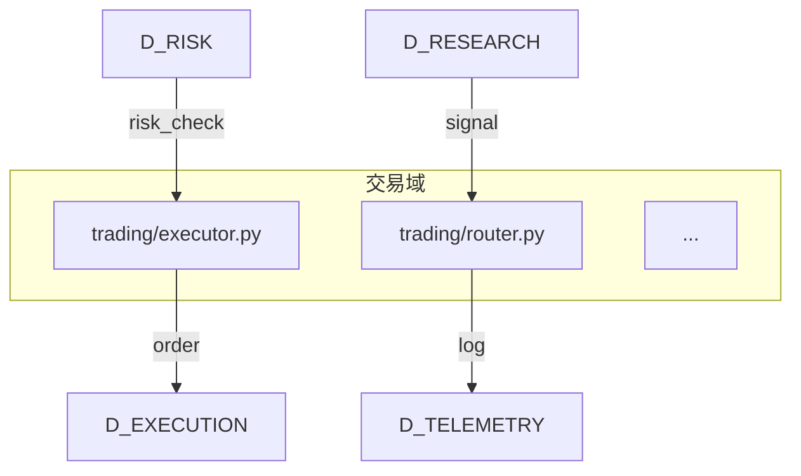
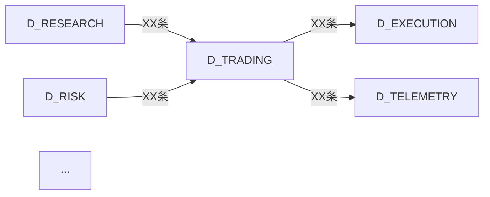

> **裁定 #ARCH-REN-001（2026-06-26）**：6 个域 ID 连字符→下划线改名：
> D-GOV-DOCS→D-GOV_DOCS, D-GOV-ENFORCEMENT→D-GOV_ENFORCEMENT, D-GOV-SCRIPTS→D-GOV_SCRIPTS,
> D-GOV_AUDIT_TESTS→D-AUDITTEST, D-INTEGRATION-GATEWAY→D-INTEGRATION_GATEWAY, D-SECURITY-LLM→D-SECURITY_LLM。
> 本文档中出现的旧域名均为历史记录，已由上述裁定更新。


# 架构图施工方案讨论

> **文档责任范围**:讨论 `docs/02_enterprise_architecture/` 全部文档的更新方案——archive清理 + target_architecture重构 + 架构图生成器设计。
> **核心原则**:全景图(depgraph.db)是唯一真源,所有架构图(MD视图+YAML+diagrams)应为全景图的派生物,零手工维护结构化数据。

---

## 一、问题陈述

### 1.1 当前架构文件夹结构

```
docs/02_enterprise_architecture/
├── archive/                          # 15个历史文档(含5对中英文重复)
├── target_architecture/
│   ├── architecture_model/           # YAML SSoT(与depgraph.db分裂)
│   │   ├── layers/                   # 14层YAML(16个文件,§2.1已裁定废弃)
│   │   ├── contracts/                # 跨层契约(引用14层)
│   │   ├── cross_cutting/            # 不变量+运行平面+能力热力图
│   │   ├── domain/                   # DDD模型
│   │   ├── events/                   # 领域事件
│   │   ├── frontend/                 # 前端模型(与depgraph重复)
│   │   ├── infra/                    # 基础设施(与depgraph重复)
│   │   ├── scripts/                  # 脚本模型(与depgraph重复)
│   │   └── technology/               # 技术雷达(独立SSoT)
│   ├── diagrams/                     # 28个.mmd图表(部分引用14层)
│   └── *.md                          # 16个架构视图MD
├── architecture_upgrade_discussion.md  # 项目导航(172KB,活跃)
├── dependency_architecture_panorama.md          # 能力定位(151KB,活跃)
├── ssot_authority_map.md               # SSoT映射
├── t18_implementation_plan.md          # T18(暂缓转阶段8)
├── migration_registry.yaml             # 迁移注册表
├── ai_team_mode_full_config.md                # AI团队配置
└── index.md                            # 目录索引
```

### 1.2 核心问题

| # | 问题 | 影响 | 证据 |
|---|------|------|------|
| 1 | **SSoT分裂** | target_architecture/architecture_model/ 的YAML与depgraph.db重复维护模块信息 | layers/l00-l13.yaml的模块定义 vs depgraph.db nodes表 |
| 2 | **14层vs43域冲突** | §2.1已裁定"43域唯一,14层降级为域属性",但target_architecture仍以14层为主框架 | overview.md "14层物理架构冻结" vs §2.1裁定 |
| 3 | **archive历史包袱** | 15个历史文档占用空间,5对中英文重复,6个已完成使命的决策记录 | 逐文件分析见§三 |
| 4 | **架构图手工维护** | 28个.mmd图表手工维护,与全景图脱节 | data_flow.mmd等14层为节点的图表需手工同步 |
| 5 | **异常文件** | mir_vxzd5an_.yaml(重复副本)、architecture_alignment_audit.md(内容错位) | 分析发现 |

### 1.3 全景图当前状态(2026-06-22)

| 指标 | 数值 | 来源 |
|------|------|------|
| 节点总数 | 14,383 | depgraph.db nodes表 |
| 边总数 | 22,605 | depgraph.db edges表 |
| 域总数 | 55(含重复,需清理到39) | depgraph.db domains表 |
| 业务表 | 24 + 1系统表 | depgraph.db schema |
| 生成器版本 | V3.2(12步完整流程) | 能力定位书§4.5 |
| P0-1~P0-7施工 | ✅ 全部完成 | architecture_upgrade_discussion.md §5.4 |

> **关键发现**:全景图已具备作为唯一真源的所有条件——24张业务表覆盖模块/依赖/路径/容量/约束,生成器已升级到V3.2,七批次施工全部完成。架构图应从全景图派生,而非独立维护。

---

## 二、核心裁定:完全派生模式

### 2.1 裁定:架构图 = 全景图的派生物

| 数据类型 | 真源 | 派生物 | 生成方式 |
|---------|------|--------|---------|
| 模块清单 | depgraph.db nodes表 | 架构视图MD中的模块清单 | SQL查询→生成 |
| 依赖关系 | depgraph.db edges表 | 数据流图/集成拓扑图 | SQL查询→生成.mmd |
| 域归属 | depgraph.db domains表 | 域架构视图 | SQL查询→生成 |
| 路径映射 | depgraph.db arch_directory_tree表 | 路径树图 | SQL查询→生成 |
| 容量信息 | depgraph.db arch_domain_capacity表 | 容量热力图 | SQL查询→生成 |
| 架构约束 | depgraph.db arch_constraints表 | 约束违规报告 | SQL查询→生成 |
| **架构原则** | architecture_principles.md | — | **手工维护(叙事性内容)** |
| **技术选型** | technology_landscape.yaml | — | **手工维护(决策性内容)** |
| **DDD模型** | ddd_model.yaml | — | **手工维护(设计模式)** |
| **领域事件** | domain_events.yaml | — | **手工维护(事件定义)** |
| **不变量** | invariants.yaml | — | **手工维护(约束定义)** |

### 2.2 SSoT分层

```
┌─────────────────────────────────────────────────────┐
│  L0 决策类数据(手工维护)                              │
│  - 架构原则/安全红线 → architecture_principles.md     │
│  - 技术选型 → technology_landscape.yaml              │
│  - DDD模型 → ddd_model.yaml                          │
│  - 领域事件 → domain_events.yaml                     │
│  - 不变量 → invariants.yaml                          │
├─────────────────────────────────────────────────────┤
│  L1 结构化数据(全景图真源)                            │
│  - 模块/依赖/域/路径/容量/约束 → depgraph.db          │
├─────────────────────────────────────────────────────┤
│  L2 派生视图(自动生成,零手工维护)                     │
│  - 架构视图MD中的模块清单/依赖矩阵/域映射             │
│  - 数据流图/拓扑图/热力图(.mmd)                      │
│  - 域索引/路径树(自动生成)                           │
└─────────────────────────────────────────────────────┘
```

### 2.3 与现有裁定的对齐

| 现有裁定 | 本方案对齐 |
|---------|-----------|
| §2.1 "43域唯一,14层降级为域属性" | ✅ 废弃14层YAML,架构视图按43域组织 |
| §2.1 "L00-L13层YAML文件废弃" | ✅ layers/目录16个YAML全部删除 |
| §3.4 "架构全景图:数据库为真源,生成MD格式" | ✅ 架构图从全景图生成MD格式 |
| 能力定位书§4.5 "生成器V3.2" | ✅ 生成器已具备数据基础 |
| D56 "YAML是唯一SSoT,MD副本不再需要" | ✅ 架构视图MD为派生物,非SSoT |

---

## 三、文件处置清单

### 3.1 archive/ 目录处置(15个文件)

#### 3.1.1 可直接删除(9个)

| 文件 | 删除原因 |
|------|---------|
| 全景图内容排查重造讨论.md | 中文版重复 |
| 域归并映射报告.md | 中文版重复 |
| 路径拆分设计方案.md | 中文版重复 |
| 阶段4搬家对齐方案.md | 中文版重复 |
| 搬家前全景图健康度报告.md | 中文版重复(分析时发现) |
| domain_merge_mapping_report.md | 43域方案已落地到depgraph.db |
| path_split_design_plan.md | 路径拆分已在阶段4完成 |
| phase4_migration_alignment_plan.md | 阶段4搬家对齐A-F全部完成 |
| pre_migration_panorama_health_report.md | 四维审计已达标,标准已在RULE-TEN体现 |

#### 3.1.2 提取价值后删除(6个)

| 文件 | 需提取的价值内容 | 沉淀目标 |
|------|----------------|---------|
| blueprint_effectiveness_report.md | 30 session模拟方法 + 三级金字塔评估模型 | architecture_upgrade_discussion.md 方法论章节 |
| d_security_split_execution_plan.md | 外部审查员7大类28项审查清单 + 域拆分6步标准流程 | RULE-TEN治理施工流程或独立审查方法论 |
| handover_review_document.md | Claude审查清单A-G七大类 + 6个必读文档清单 | 治理审查方法论 + 当前架构文档冷启动导航 |
| panorama_content_review_rebuild_discussion.md | sync脚本UPSERT折叠bug根因分析 | project_memory.md Lessons Learned |
| phase_e_rule_format_upgrade_proposal.md | YAML-SSoT+DB-Index架构方法论 + 6维验证方法 | 规则文件管理文档 |
| phase_f_yaml_rule_optimization_proposal.md | 10类问题分类清单Q1-Q10 + 4轮审查流程 | 规则文件审查方法论 |

#### 3.1.3 保留参考(1个)

| 文件 | 保留原因 |
|------|---------|
| depgraph_issue_registry.md | depgraph.db完整表结构参考 + Phase A-K问题因果链,未来depgraph维护参考 |

### 3.2 target_architecture/ 根目录MD处置(16个)

#### 3.2.1 重写(高优先级,4个)

| 文件 | 重写原因 | 重写方向 |
|------|---------|---------|
| overview.md | 14层为主框架 | 改为43域+全景图派生 |
| index.md | 14层分区体系 | 改为43域索引+派生视图说明 |
| application_architecture.md | 14层模块清单为核心 | 改为从全景图派生模块清单 |
| capability_heatmap.md | 14层×7域矩阵 | 改为43域×能力域矩阵 |

#### 3.2.2 保留(叙事视图,7个)

| 文件 | 保留原因 | 局部修订 |
|------|---------|---------|
| business_architecture.md | 业务视角叙事,14层引用少 | 无需修订 |
| information_architecture.md | 文档结构视角,14层引用少 | 无需修订 |
| data_architecture.md | 数据治理视角,14层引用少 | 无需修订 |
| security_architecture.md | 安全视角,14层引用少 | 无需修订 |
| operations_architecture.md | 运维视角(draft),14层引用少 | 无需修订 |
| frontend_architecture.md | 前端独立视角 | 无需修订 |
| runtime_planes.md | 正交视图(Hot/Warm/Cold与域无关) | 无需修订 |

#### 3.2.3 保留(独立SSoT,3个)

| 文件 | 保留原因 |
|------|---------|
| architecture_principles.md | 架构原则SSoT(安全红线R1-R4/BvB) |
| session_carryover_schema.md | Session接续Schema定义 |
| revision_history.md | 完整修订历史归档 |

#### 3.2.4 局部修订(2个)

| 文件 | 修订原因 | 修订内容 |
|------|---------|---------|
| technology_architecture.md | 运行时拓扑引用14层 | 拓扑图改为从全景图派生 |
| integration_architecture.md | EI系列引用14层 | 集成点改为域引用 |
| governance_architecture.md | 39系统分层+14层混合 | 统一为43域体系 |

#### 3.2.5 归档/重写(2个)

| 文件 | 处置 | 原因 |
|------|------|------|
| architecture_endgame_locked.md | 重写 | 引用14层体系(module_id基于层) |
| architecture_alignment_audit.md | 归档核实 | 内容错位(文件名是对齐审计,实际是知识库索引) |
| dimension_audit_matrix.md | 局部修订 | 引用各架构文档(含14层) |

### 3.3 target_architecture/architecture_model/ 处置

#### 3.3.1 删除(14层YAML,16个文件)

| 文件 | 删除原因 |
|------|---------|
| layers/l00_data_source.yaml ~ l13_experimentation.yaml (14个) | §2.1已裁定废弃,信息在depgraph.db |
| layers/shared.yaml | shared模块在depgraph.db |
| layers/b_mcp.yaml | 空占位文件 |

#### 3.3.2 删除(模块信息已入depgraph,6个)

| 文件 | 删除原因 |
|------|---------|
| frontend/frontend_model.yaml | 前端模块在depgraph.db D-FRONTEND域 |
| frontend/index.md | 随YAML删除 |
| scripts/scripts_model.yaml | 脚本模块在depgraph.db |
| scripts/index.md | 随YAML删除 |
| infra/core_services.yaml | 核心服务在depgraph.db |
| infra/shared_infra.yaml | 共享基础设施在depgraph.db |
| infra/index.md | 随YAML删除 |

#### 3.3.3 删除(异常文件,2个)

| 文件 | 删除原因 |
|------|---------|
| mir_vxzd5an_.yaml | module_id_registry.yaml的异常命名副本(138 vs 141) |
| layers/index.md | 随layers/目录删除 |

#### 3.3.4 重写(2个)

| 文件 | 重写原因 | 重写方向 |
|------|---------|---------|
| index.yaml | 24分区定义与43域冲突 | 改为43域索引+派生视图说明 |
| index.md | 14层分区体系 | 改为43域索引 |

#### 3.3.5 保留(独立SSoT,7个)

| 文件 | 保留原因 |
|------|---------|
| module_id_registry.yaml | 文档规则模块ID(GOV-/DOM-/OPS-/PS-),与depgraph.db MOD-*分工不同 |
| readme.md | 镜像说明(本树为交付视图) |
| cross_cutting/invariants.yaml | 架构不变量SSoT(owner字段需修订) |
| cross_cutting/runtime_planes.yaml | 运行平面SSoT(modules.layer需修订) |
| domain/ddd_model.yaml | DDD战术模式SSoT |
| events/domain_events.yaml | 领域事件SSoT |
| technology/technology_landscape.yaml | 技术雷达SSoT |
| technology/vibe_coding_infrastructure_tech_stack.yaml | Vibe Coding基建技术栈SSoT |
| 各目录的index.md | 导航元数据 |

#### 3.3.6 重写(2个)

| 文件 | 重写原因 | 重写方向 |
|------|---------|---------|
| cross_cutting/capability_heatmap.yaml | 14层×7域矩阵 | 改为43域×能力域矩阵 |
| contracts/cross_layer_contracts.yaml | source_layer引用14层 | layer引用改为domain |
| contracts/consumer_registry.yaml | layer字段引用14层 | layer→domain |

### 3.4 target_architecture/diagrams/ 处置(28个)

#### 3.4.1 保留(方法论图+序列图,18个)

| 文件 | 保留原因 |
|------|---------|
| togaf_layer_stack.mmd | TOGAF四层方法论图 |
| view_dependencies.mmd | 视图依赖关系图 |
| readme_view_dependency_graph.mmd | README视图依赖图 |
| governance_three_layers.mmd | 治理三层边界图 |
| governance_d2b_loop.mmd | 治理Design-to-Build闭环 |
| governance_activation_gantt.mmd | 治理激活甘特图 |
| business_value_stream.mmd | 业务价值流图 |
| docs_drawer_topology.mmd | docs/抽屉拓扑图 |
| scripts_topology.mmd | scripts/治理代码拓扑图 |
| frontend_mfe_topology.mmd | 前端微前端拓扑 |
| frontend_build_pipeline.mmd | 前端构建流水线 |
| deployment_experimental.mmd | experimental部署拓扑 |
| runtime_planes_topology.mmd | Runtime Planes三平面拓扑 |
| c4_l1_system_context.mmd | C4-L1系统上下文图 |
| seq_order_submit.mmd | 订单提交时序 |
| seq_fill_received.mmd | 成交回报时序 |
| seq_risk_trigger.mmd | 风控触发时序 |
| seq_rebalance.mmd | 组合再平衡时序 |
| seq_exception_handling.mmd | 异常处置时序 |

#### 3.4.2 删除(14层专属图,1个)

| 文件 | 删除原因 |
|------|---------|
| src_layer_stack.mmd | 14层分层图,14层已降级为属性,分层图无意义 |

#### 3.4.3 重写(可从全景图派生,9个)

| 文件 | 重写方向 | 派生数据源 |
|------|---------|-----------|
| data_flow.mmd | 14层节点→43域数据流 | edges表跨域依赖 |
| dataflow_terminal.mmd | 14层节点→43域终端数据流 | edges表跨域依赖 |
| runtime_topology.mmd | 14层节点→43域运行时拓扑 | nodes+edges表 |
| capability_heatmap_visual.mmd | 14层×7域→43域×能力域 | domains+capability评分 |
| c4_l2_containers.mmd | 14层标注→域标注 | nodes表域归属 |
| c4_l3_l00_data_source.mmd | L00→D-DATA域组件图 | nodes表D-DATA域 |
| c4_l3_l06_trade_execution.mmd | L06→D-EX-CORE域组件图 | nodes表D-EX-CORE域 |
| c4_l3_l11_ml_platform.mmd | L11→D-ML-TRAIN域组件图 | nodes表D-ML-TRAIN域 |
| integration_topology.mmd | 14层引用→域引用 | edges表集成依赖 |

### 3.5 根目录文件处置

| 文件 | 处置 | 原因 |
|------|------|------|
| architecture_upgrade_discussion.md | 保留,更新状态 | 项目导航图,核心文档 |
| dependency_architecture_panorama.md | 保留 | 能力定位真源 |
| architecture_decisions_pending.md | 已归档到_archive/ | 决策记录(T6/T7/T17已裁定,T18暂缓) |
| ssot_authority_map.md | 保留,更新 | SSoT映射,需对齐43域 |
| t18_implementation_plan.md | 归档到archive | T18暂缓转阶段8 |
| migration_registry.yaml | 保留 | 迁移注册表 |
| ai_team_mode_full_config.md | 保留 | AI团队配置 |
| index.md | 保留,更新 | 目录索引,需对齐新结构 |

### 3.6 处置统计

| 处置类型 | 文件数 | 说明 |
|---------|:---:|------|
| 删除 | ~28 | archive 9个 + layers 16个 + 模块重复 6个 + 异常 2个 + 14层图 1个 |
| 提取价值后删除 | 6 | archive中6个含独特方法论的文件 |
| 重写 | ~15 | 核心视图 4个 + 能力图 2个 + 数据流图 4个 + 契约 2个 + 其他 3个 |
| 保留 | ~35 | 方法论图 18个 + 独立SSoT 7个 + 叙事视图 7个 + 其他 3个 |
| 归档 | 2 | t18_implementation_plan.md + architecture_alignment_audit.md |

---

## 四、施工方案

### 4.1 四阶段施工

```
Phase 1: archive价值提取与清理
  ↓ 依赖:无
Phase 2: target_architecture 14层→43域迁移
  ↓ 依赖:Phase 1完成(避免交叉污染)
Phase 3: 架构图生成器开发
  ↓ 依赖:Phase 2完成(目标结构稳定)
Phase 4: 架构视图重写
  ↓ 依赖:Phase 3完成(生成器可用)
```

### 4.2 Phase 1: archive价值提取与清理

**目标**:提取6个文件的方法论价值,删除15个历史文档,保留1个参考文件。

**步骤**:

| STEP | 操作 | 验证 |
|------|------|------|
| 1.1 | 提取blueprint_effectiveness_report.md的30 session模拟方法+三级金字塔评估模型 → architecture_upgrade_discussion.md方法论章节 | Grep确认价值内容已沉淀 |
| 1.2 | 提取d_security_split_execution_plan.md的外部审查员7大类28项审查清单 → 独立审查方法论文档或RULE-TEN扩展 | Grep确认 |
| 1.3 | 提取handover_review_document.md的Claude审查清单A-G → 治理审查方法论 | Grep确认 |
| 1.4 | 提取panorama_content_review_rebuild_discussion.md的sync脚本UPSERT折叠bug根因 → project_memory.md Lessons Learned | Grep确认 |
| 1.5 | 提取phase_e_rule_format_upgrade_proposal.md的YAML-SSoT+DB-Index方法论 → 规则文件管理文档 | Grep确认 |
| 1.6 | 提取phase_f_yaml_rule_optimization_proposal.md的10类问题分类清单Q1-Q10 → 规则文件审查方法论 | Grep确认 |
| 1.7 | 删除archive/目录下全部15个文件(含depgraph_issue_registry.md,Owner决策全删) | LS确认archive/为空或已删除 |
| 1.8 | 删除archive/目录本身 | LS确认archive/不存在 |
| 1.9 | 更新index.md引用(移除archive/目录引用) | Grep确认无悬空引用 |

**安全措施**:
- 删除前 `git add -A && git commit -m "backup: archive before cleanup"`
- 每个文件删除前确认价值已提取(Grep验证)
- 遵循RULE-THREE三步审判

### 4.3 Phase 2: target_architecture 14层→43域迁移

**目标**:删除14层YAML体系,清理与depgraph.db重复的模块信息,保留独立SSoT。

**步骤**:

| STEP | 操作 | 验证 |
|------|------|------|
| 2.1 | 删除architecture_model/layers/目录(16个YAML+1个index.md) | LS确认layers/已删除 |
| 2.2 | 删除architecture_model/frontend/、scripts/、infra/目录(6个文件) | LS确认已删除 |
| 2.3 | 删除architecture_model/mir_vxzd5an_.yaml(异常重复文件) | LS确认已删除 |
| 2.4 | 重写architecture_model/index.yaml为43域索引 | YAML语法校验通过 |
| 2.5 | 重写architecture_model/index.md为43域索引说明 | Grep确认无14层引用 |
| 2.6 | 重写cross_cutting/capability_heatmap.yaml为43域×能力域矩阵 | YAML语法校验通过 |
| 2.7 | 修订contracts/cross_layer_contracts.yaml(source_layer→domain) | Grep确认无layer字段 |
| 2.8 | 修订contracts/consumer_registry.yaml(layer→domain) | Grep确认无layer字段 |
| 2.9 | 修订cross_cutting/invariants.yaml(owner字段引用) | Grep确认无14层引用 |
| 2.10 | 修订cross_cutting/runtime_planes.yaml(modules.layer字段) | Grep确认无14层引用 |
| 2.11 | 删除diagrams/src_layer_stack.mmd(14层分层图) | LS确认已删除 |
| 2.12 | 删除architecture_alignment_audit.md(Owner决策:内容错位,直接删除) | LS确认已删除 |

**安全措施**:
- 删除前 `git add -A && git commit -m "backup: target_architecture before 14layer cleanup"`
- 每个YAML删除前确认信息在depgraph.db中存在(SQL查询验证)
- 保留独立SSoT(module_id_registry/invariants/ddd_model/domain_events/technology)

### 4.4 Phase 3: 架构图生成器开发

**目标**:开发从depgraph.db自动生成架构图的脚本,实现"全景图变更→CI自动触发→重新生成→覆盖"。

**Owner效果需求**(2026-06-22确认):
1. 整个项目的中英文物理路径树状图
2. 一个功能域 = 一个MD文档(含该域模块清单+全景依赖图)
3. 每个功能域的全景依赖图
4. 所有功能域的集成依赖关系图
5. 先生成一个看效果,Owner认可后再批量生成

#### 4.4.1 生成器设计态注册(前置)

遵循项目规则"所有脚本/代码先创建设计态,再创建脚本,再升级为运营态":

| STEP | 操作 | 命令 |
|------|------|------|
| 3.0.1 | 在depgraph.db为每个生成器创建design节点(归属D-GOV-SCRIPTS域) | `python scripts/governance/apply_depgraph.py --add-design-node` |
| 3.0.2 | 设置启动方式:CI事件触发(depgraph.db变更)+ 手动触发 | 节点trigger_type字段 |
| 3.0.3 | 设置依赖:depgraph.db(数据源) | 节点dependencies字段 |
| 3.0.4 | 创建脚本(走scaffold.py) | `python scripts/scaffold.py script governance/d5_architecture/generators/generate_{name}` |
| 3.0.5 | 运行验证,Owner认可效果后升级为production | `python scripts/governance/apply_depgraph.py --upgrade-node` |

#### 4.4.2 生成器完整清单

| # | 生成器 | 输入(depgraph.db) | 输出 | 给谁看 | 优先级 |
|---|--------|------------------|------|--------|:---:|
| G1 | generate_path_tree.py | arch_directory_tree表 | 项目物理路径树状图(中英文) | 人 | **高(样板)** |
| G2 | generate_domain_doc.py | nodes表+edges表(指定域) | 一个功能域一个MD文档(含模块清单+依赖图) | 人 | **高(样板)** |
| G3 | generate_domain_dependency_diagram.py | edges表(指定域的跨域+域内依赖) | 每个功能域的全景依赖图(.mmd) | 人 | **高(样板)** |
| G4 | generate_integration_topology.py | edges表(所有跨域依赖) | 所有功能域的集成依赖关系图(.mmd) | 人 | **高(样板)** |
| G5 | generate_domain_index.py | domains表+nodes表(域聚合) | 43域总览索引MD | 人 | 中 |
| G6 | generate_cross_domain_matrix.py | edges表(跨域依赖矩阵) | 域间依赖矩阵表(39×39) | 人 | 中 |
| G7 | generate_capacity_report.py | arch_domain_capacity表 | 域容量报告(模块数/是否超容) | 人 | 中 |
| G8 | generate_design_vs_production.py | nodes表(design_maturity字段) | 设计态vs运营态统计报告 | 人 | 中 |
| G9 | generate_constraint_violations.py | arch_constraints表 | 架构约束违规报告 | 人 | 低 |

#### 4.4.3 生成器输出位置

```
docs/02_enterprise_architecture/
├── generated/                          # 新目录:所有生成器输出(给人看)
│   ├── full_project_tree_zh.md         # G1: 中文物理路径树
│   ├── full_project_tree_en.md         # G1: 英文物理路径树
│   ├── domains/                        # G2+G3: 每个域一个MD
│   │   ├── D_TRADING.md               #   含模块清单+该域全景依赖图
│   │   ├── D_RESEARCH.md
│   │   ├── D_RISK.md
│   │   └── ... (43个域)
│   ├── integration_topology.mmd        # G4: 所有域集成依赖图
│   ├── domain_index.md                 # G5: 43域总览索引
│   ├── cross_domain_matrix.md          # G6: 域间依赖矩阵
│   ├── capacity_report.md              # G7: 域容量报告
│   ├── design_vs_production.md         # G8: 设计态vs运营态
│   └── constraint_violations.md        # G9: 约束违规报告
├── target_architecture/                # 保留:手工叙事视图(不生成)
│   ├── overview.md                     #   人工维护叙事
│   ├── business_architecture.md        #   人工维护叙事
│   └── ...
└── architecture_model/                 # 保留:决策类SSoT(不生成)
    ├── module_id_registry.yaml         #   人工维护
    ├── cross_cutting/invariants.yaml   #   人工维护
    └── ...
```

**关键区分**:
- `generated/` 目录 = 生成器输出,给人看,depgraph.db变更时CI自动覆盖
- `target_architecture/` = 手工叙事视图(为什么/设计理由),不自动生成
- `architecture_model/` = 决策类SSoT(原则/不变量/技术选型),人工维护

#### 4.4.4 生成器规范

- **位置**:`scripts/governance/d5_architecture/generators/`
- **输入**:depgraph.db(SQL查询)
- **输出**:覆盖`docs/02_enterprise_architecture/generated/`下对应文件
- **格式**:.md(给人看)或.mmd(Mermaid图表)
- **幂等性**:相同输入→相同输出(可diff验证)
- **错误处理**:depgraph.db不存在时exit 1 + 明确错误信息
- **CI触发**:depgraph.db git commit → CI自动运行所有生成器 → git add generated/ → git commit

#### 4.4.5 样板先行策略(Owner要求)

**先生成一个样板,Owner认可后再批量**:

| STEP | 操作 | 验证 |
|------|------|------|
| 3.S.1 | 选择D-TRADING域作为样板(模块数适中,依赖关系典型) | — |
| 3.S.2 | 开发G2(generate_domain_doc.py)生成D-TRADING.md | 输出文件存在 |
| 3.S.3 | 开发G3(generate_domain_dependency_diagram.py)生成D-TRADING依赖图 | .mmd文件存在 |
| 3.S.4 | 开发G1(generate_path_tree.py)生成物理路径树(中英文) | 输出文件存在 |
| 3.S.5 | 开发G4(generate_integration_topology.py)生成集成依赖图 | .mmd文件存在 |
| 3.S.6 | **Owner审阅样板效果** | Owner认可 |
| 3.S.7 | Owner认可后,批量生成所有43个域的MD+依赖图 | 39个MD文件存在 |
| 3.S.8 | 开发G5-G9(中低优先级生成器) | 输出文件存在 |

#### 4.4.6 关键SQL查询模板

```sql
-- G1: 物理路径树(从arch_directory_tree表)
SELECT path, node_type, domain_id, depth
FROM arch_directory_tree
ORDER BY path;

-- G2: 指定域的模块清单(生成域MD文档)
SELECT n.node_id, n.path, n.blueprint_id, n.build_status, n.design_maturity
FROM nodes n
WHERE n.domain_id = 'D-TRADING'
ORDER BY n.path;

-- G3: 指定域的依赖关系(生成域全景依赖图)
SELECT e.from_node_id, n1.path as from_path, e.to_node_id, n2.path as to_path,
       e.dep_type, e.dep_strength
FROM edges e
JOIN nodes n1 ON e.from_node_id = n1.node_id
JOIN nodes n2 ON e.to_node_id = n2.node_id
WHERE n1.domain_id = 'D-TRADING' OR n2.domain_id = 'D-TRADING'
ORDER BY e.dep_strength DESC;

-- G4: 所有跨域依赖(生成集成依赖图)
SELECT n1.domain_id as from_domain, n2.domain_id as to_domain,
       COUNT(*) as edge_count, GROUP_CONCAT(DISTINCT e.dep_type) as dep_types
FROM edges e
JOIN nodes n1 ON e.from_node_id = n1.node_id
JOIN nodes n2 ON e.to_node_id = n2.node_id
WHERE n1.domain_id != n2.domain_id
GROUP BY n1.domain_id, n2.domain_id
ORDER BY edge_count DESC;

-- G6: 域间依赖矩阵(39×39)
SELECT from_domain, to_domain, edge_count FROM (
  SELECT n1.domain_id as from_domain, n2.domain_id as to_domain,
         COUNT(*) as edge_count
  FROM edges e
  JOIN nodes n1 ON e.from_node_id = n1.node_id
  JOIN nodes n2 ON e.to_node_id = n2.node_id
  WHERE n1.domain_id != n2.domain_id
  GROUP BY n1.domain_id, n2.domain_id
) ORDER BY from_domain, to_domain;
```

### 4.5 Phase 4: 架构视图重写

**目标**:基于43域和全景图派生数据,重写核心架构视图MD。

**步骤**:

| STEP | 操作 | 验证 |
|------|------|------|
| 4.1 | 重写overview.md(14层→43域+全景图派生) | Grep确认无14层为主框架的描述 |
| 4.2 | 重写index.md(14层分区→43域索引+派生视图说明) | Grep确认无14层分区 |
| 4.3 | 重写application_architecture.md(14层模块清单→全景图派生模块清单) | Grep确认模块清单来自depgraph.db |
| 4.4 | 重写capability_heatmap.md(14层×7域→43域×能力域) | Grep确认无14层维度 |
| 4.5 | 修订technology_architecture.md(运行时拓扑从全景图派生) | Grep确认拓扑图来自生成器 |
| 4.6 | 修订integration_architecture.md(EI系列引用改为域) | Grep确认无14层引用 |
| 4.7 | 修订governance_architecture.md(39系统分层+14层→统一43域) | Grep确认无14层引用 |
| 4.8 | 重写architecture_endgame_locked.md(引用14层→43域) | Grep确认无14层引用 |
| 4.9 | 修订dimension_audit_matrix.md(引用更新) | Grep确认无14层引用 |
| 4.10 | 重写diagrams/下9个14层相关图表(用Phase 3生成器) | 生成器运行成功+图表内容正确 |
| 4.11 | 更新ssot_authority_map.md(14层→43域对齐) | Grep确认无14层为主框架 |
| 4.12 | 更新index.md(根目录,反映新结构) | LS确认结构一致 |

**重写原则**:
- 叙事性内容(为什么/设计理由)保留
- 结构化数据(模块清单/依赖关系/域映射)从全景图派生
- 图表用生成器自动生成
- 每个MD文件头部标注"本文档结构化数据来自depgraph.db派生"

---

## 五、验证标准

### 5.1 Phase 1 验证

| 验证项 | 标准 | 命令 |
|--------|------|------|
| 价值提取完整性 | 6个文件的价值内容已沉淀到目标文档 | Grep关键词 |
| archive清理 | archive/目录已删除(Owner决策全删) | LS确认archive/不存在 |
| 无悬空引用 | index.md无archive/目录引用 | Grep "archive/" |

### 5.2 Phase 2 验证

| 验证项 | 标准 | 命令 |
|--------|------|------|
| 14层YAML删除 | layers/目录不存在 | LS architecture_model/ |
| 模块重复删除 | frontend/scripts/infra/不存在 | LS architecture_model/ |
| 异常文件删除 | mir_vxzd5an_.yaml + architecture_alignment_audit.md不存在 | LS确认 |
| 43域索引 | index.yaml含43域定义 | Read index.yaml |
| 无14层引用 | target_architecture/下无"L00-L13"作为主框架 | Grep "L00-L13" |

### 5.3 Phase 3 验证

| 验证项 | 标准 | 命令 |
|--------|------|------|
| 设计态注册 | 9个生成器在depgraph.db有design节点 | SQL查询nodes表 |
| 生成器存在 | 9个生成器脚本存在 | LS scripts/governance/d5_architecture/generators/ |
| 样板生成成功 | G1+G2+G3+G4生成D-TRADING样板 | LS generated/domains/D_TRADING.md |
| Owner认可样板 | Owner审阅样板效果通过 | Owner确认 |
| 批量生成成功 | 43个域MD+依赖图全部生成 | LS generated/domains/ (39个文件) |
| 幂等性 | 两次运行结果一致 | diff第一次输出vs第二次输出 |
| CI触发 | depgraph.db变更后generated/自动更新 | 模拟CI触发验证 |

### 5.4 Phase 4 验证

| 验证项 | 标准 | 命令 |
|--------|------|------|
| 核心视图重写 | overview/index/application/capability_heatmap无14层主框架 | Grep "14层" |
| 图表派生 | 9个重写图表来自生成器 | 对比生成器输出 |
| 无14层引用 | target_architecture/下无14层作为分类体系 | Grep "L00.*L13\|14层" |
| SSoT对齐 | ssot_authority_map.md无14层为主框架 | Read ssot_authority_map.md |

### 5.5 整体验证

| 验证项 | 标准 | 命令 |
|--------|------|------|
| 文件数减少 | 删除~30个文件,重写~15个,保留~35个 | LS统计 |
| SSoT统一 | 结构化数据唯一真源为depgraph.db | 人工确认 |
| 无双轨制 | 结构化数据YAML全部删除,仅保留决策类SSoT | LS architecture_model/ |
| 无悬空引用 | 所有引用指向存在的文件 | Grep验证 |
| depgraph.db健康 | 节点/边/域数量不变 | extract_depgraph.py --summary |

---

## 六、风险与缓解

| 风险 | 概率 | 影响 | 缓解措施 |
|------|:---:|:---:|---------|
| 价值提取遗漏 | 中 | 中 | 每个文件删除前Grep验证价值已沉淀 |
| 14层信息丢失 | 低 | 高 | 删除前确认信息在depgraph.db(SQL查询验证) |
| 生成器输出错误 | 中 | 高 | 生成器开发后人工抽查+SQL对比验证 |
| 引用链断裂 | 中 | 中 | 每次删除后Grep全项目搜索悬空引用 |
| depgraph.db域数不一致(55 vs 39) | 高 | 中 | Phase 2前先清理depgraph.db domains表到43域 |

### 6.1 关键依赖:depgraph.db域清理

**当前问题**:depgraph.db domains表有43域(含重复),但架构升级裁定43域。

**重复域示例**(从extract_depgraph.py输出发现):
- D-GOV_AUDIT vs D-GOV_AUDIT(下划线vs连字符)
- D-AUTONOMY_CORE vs D-AUTONOMY-CORE
- D-INFRA_OPS vs D-INFRA-OPS
- 空域:D-GOV-ENFORCEMENT/D-GOV-SCRIPTS/D-GOV_DRIFT/D-GOV_AUDIT/D-SECURITY-LLM等(module_count=0)

**前置条件**:Phase 2开始前,必须先清理depgraph.db domains表:
1. 合并连字符/下划线重复域
2. 删除空域(module_count=0且无设计态节点)
3. 验证域数=39(或当前实际有效域数)

---

## 七、执行顺序与优先级

### 7.1 推荐执行顺序(样板先行)

| 顺序 | Phase | 预计工作量 | 优先级 | 依赖 |
|:---:|-------|-----------|:---:|------|
| 0 | depgraph.db域清理(前置) | 中 | **高** | 无 |
| 1 | Phase 1: archive价值提取与清理 | 中 | **高** | 无 |
| 2 | Phase 2: 14层→43域迁移 | 高 | **高** | Phase 1 + 前置 |
| 3 | Phase 3-A: 生成器设计态注册+样板开发(G1+G2+G3+G4) | 高 | **高** | Phase 2 |
| 4 | **Owner审阅样板效果**(决策点) | — | **高** | Phase 3-A |
| 5 | Phase 3-B: 批量生成43域+开发G5-G9 | 高 | 中 | Owner认可样板 |
| 6 | Phase 4: 架构视图重写 | 高 | 中 | Phase 3-B |

### 7.2 样板先行策略(Owner要求)

**核心**:先生成一个样板(D-TRADING域),Owner认可效果后再批量生成。

```
Phase 3-A: 样板开发
  ├─ G1: generate_path_tree.py → full_project_tree_zh.md + full_project_tree_en.md
  ├─ G2: generate_domain_doc.py → domains/D_TRADING.md
  ├─ G3: generate_domain_dependency_diagram.py → domains/D_TRADING_dependency.mmd
  └─ G4: generate_integration_topology.py → integration_topology.mmd
       ↓
  Owner审阅样板效果
       ↓
  认可? ─ YES → Phase 3-B: 批量生成43域 + 开发G5-G9
       └─ NO → 调整生成器输出格式 → 重新生成样板 → 再次审阅
```

### 7.3 可并行项

- Phase 1(STEP 1.1-1.6价值提取)可并行执行
- Phase 3-A的4个样板生成器可并行开发
- Phase 3-B的43域批量生成可并行(G2+G3对每个域独立)
- Phase 4的视图重写可在生成器开发完成后并行

### 7.4 里程碑

| 里程碑 | 完成标志 |
|--------|---------|
| M1: archive清理完成 | archive/目录已删除 |
| M2: 14层体系清除 | target_architecture/无14层YAML |
| M3: 样板生成完成 | D-TRADING域MD+依赖图+路径树+集成图生成 |
| M4: Owner认可样板 | Owner确认效果符合预期 |
| M5: 批量生成完成 | 43个域MD+依赖图全部生成 |
| M6: 架构视图重写完成 | 所有视图基于43域+全景图派生 |

---

## 八、Owner决策记录(2026-06-22)

| # | 议题 | Owner决策 | 说明 |
|---|------|----------|------|
| 1 | archive/目录处理 | **完全删除**(含depgraph_issue_registry.md) | 历史价值已沉淀到核心文档,不再保留参考 |
| 2 | 生成器脚本位置 | **先在全景图(depgraph.db)设计态注册,再落盘脚本** | 遵循项目规则:所有脚本/代码先创建设计态,再创建脚本,再升级为运营态 |
| 3 | 重写后是否保留双轨制(YAML+MD) | **不保留双轨制** | 全景图(depgraph.db)是AI看的真源;MD格式是给人看的派生视图 |
| 4 | architecture_alignment_audit.md处理 | **直接删除** | 内容错位(文件名是架构对齐审计,实际是知识库索引),知识库索引应在docs/08_knowledge/下 |
| 5 | 生成器是否纳入CI | **纳入CI** | 全景图一变,架构图自动跟着重新生成,永远保持同步 |

### 8.1 双轨制废除说明

**废除前(双轨制)**:
- YAML文件(architecture_model/*.yaml) = 机器SSoT
- MD文件(target_architecture/*.md) = 人类可读副本
- 问题:YAML与MD需手工同步,易漂移

**废除后(单轨派生)**:
- depgraph.db = AI真源(机器直接读)
- MD文件 = 给人看的派生视图(从depgraph.db自动生成)
- YAML文件:仅保留决策类SSoT(架构原则/技术选型/DDD模型/领域事件/不变量),结构化数据YAML全部删除

### 8.2 生成器脚本设计态流程

遵循项目规则"所有脚本/代码先创建设计态,再创建脚本,再升级为运营态":

```
STEP 1: 在depgraph.db创建生成器的设计态节点
        - 每个生成器作为一个design节点,归属D-GOV-SCRIPTS域
        - 设置启动方式:CI事件触发(depgraph.db变更)+ 手动触发
        - 设置依赖:depgraph.db(数据源)

STEP 2: 创建生成器脚本(走scaffold.py)
        - 位置:scripts/governance/d5_architecture/generators/
        - 命名:generate_{output_type}.py
        - 注册到script-manifest.yaml

STEP 3: 运行生成器,验证输出正确
        - 先生成一个样板(见§7.2样板先行策略)
        - Owner认可效果后批量生成

STEP 4: 将生成器节点从design升级为production
        - 更新depgraph.db中节点的design_maturity
        - 纳入CI触发链
```

---

## 九、完整生成清单

> 本章节是Owner要求的"完整生成清单",列出所有生成器及其输出。

### 9.1 生成器清单(9个)

| # | 生成器 | 输入(depgraph.db) | 输出文件 | 给谁看 | 优先级 | 状态 |
|---|--------|------------------|---------|--------|:---:|:---:|
| G1 | generate_path_tree.py | arch_directory_tree表 | generated/full_project_tree_zh.md + full_project_tree_en.md | 人 | **高(样板)** | 待开发 |
| G2 | generate_domain_doc.py | nodes表+edges表(指定域) | generated/domains/{domain}.md (39个) | 人 | **高(样板)** | 待开发 |
| G3 | generate_domain_dependency_diagram.py | edges表(指定域依赖) | generated/domains/{domain}_dependency.mmd (39个) | 人 | **高(样板)** | 待开发 |
| G4 | generate_integration_topology.py | edges表(所有跨域依赖) | generated/integration_topology.mmd | 人 | **高(样板)** | 待开发 |
| G5 | generate_domain_index.py | domains表+nodes表(域聚合) | generated/domain_index.md | 人 | 中 | 待开发 |
| G6 | generate_cross_domain_matrix.py | edges表(跨域依赖矩阵) | generated/cross_domain_matrix.md | 人 | 中 | 待开发 |
| G7 | generate_capacity_report.py | arch_domain_capacity表 | generated/capacity_report.md | 人 | 中 | 待开发 |
| G8 | generate_design_vs_production.py | nodes表(design_maturity) | generated/design_vs_production.md | 人 | 中 | 待开发 |
| G9 | generate_constraint_violations.py | arch_constraints表 | generated/constraint_violations.md | 人 | 低 | 待开发 |

### 9.2 输出文件清单

```
docs/02_enterprise_architecture/generated/
├── full_project_tree_zh.md             # G1: 中文物理路径树
├── full_project_tree_en.md             # G1: 英文物理路径树
├── domains/                            # G2+G3: 每个域一个MD+依赖图
│   ├── D_TRADING.md                   #   域文档(模块清单+元数据)
│   ├── D_TRADING_dependency.mmd       #   该域全景依赖图
│   ├── D_RESEARCH.md
│   ├── D_RESEARCH_dependency.mmd
│   ├── D_RISK.md
│   ├── D_RISK_dependency.mmd
│   └── ... (43个域 × 2文件 = 78个文件)
├── integration_topology.mmd            # G4: 所有域集成依赖图
├── domain_index.md                     # G5: 43域总览索引
├── cross_domain_matrix.md              # G6: 域间依赖矩阵(39×39)
├── capacity_report.md                  # G7: 域容量报告
├── design_vs_production.md             # G8: 设计态vs运营态统计
└── constraint_violations.md            # G9: 约束违规报告
```

**总输出文件数**:约88个(2路径树 + 78域文档 + 1集成图 + 3报告 + 4其他)

### 9.3 各生成器输出内容详述

#### G1: 物理路径树(中英文)

**输出**:`full_project_tree_zh.md` + `full_project_tree_en.md`

**内容结构**:
```
# ZephyrAlpha 项目物理路径树

> 本文档由 generate_path_tree.py 从 depgraph.db 自动生成
> 最后更新: 2026-06-22 HH:MM:SS
> 数据源: depgraph.db arch_directory_tree表

## 完整路径树

D:\ZephyrAlpha\
├── docs/                              [D-DOCUMENTATION]
│   ├── 01_policies_and_standards/    [D-GOV_RULES]
│   ├── 02_enterprise_architecture/   [D-GOV-ARCHITECTURE]
│   └── ...
├── src/zephyr/                        [D-TRADING]
│   ├── trading/                      [D-TRADING]
│   ├── research/                     [D-RESEARCH]
│   └── ...
└── scripts/                           [D-GOV-SCRIPTS]

## 统计
- 总目录数: XXX
- 总文件数: XXX
- 域数: 39
```

#### G2: 域文档(一个域一个MD)

**输出**:`domains/{domain}.md`(39个)

**内容结构**(以D_TRADING.md为例):
```
# D-TRADING 交易域架构文档

> 本文档由 generate_domain_doc.py 从 depgraph.db 自动生成
> 最后更新: 2026-06-22 HH:MM:SS
> 数据源: depgraph.db nodes表 + edges表

## 域概览

| 属性 | 值 |
|------|-----|
| 域ID | D-TRADING |
| 域名称 | 交易域 |
| 模块数 | XXX |
| 设计态模块 | XXX |
| 运营态模块 | XXX |
| 容量状态 | 正常/超容 |

## 模块清单

| 模块路径 | 蓝图ID | 构建状态 | 设计成熟度 |
|---------|--------|---------|-----------|
| src/zephyr/trading/executor.py | MOD-EX-001 | production | production |
| src/zephyr/trading/router.py | MOD-EX-002 | production | production |
| ... | ... | ... | ... |

## 域内依赖

(见 D_TRADING_dependency.mmd)

## 跨域依赖

### 本域依赖的其他域

| 目标域 | 依赖数 | 依赖类型 |
|--------|:---:|---------|
| D-RISK | XX | import/call |
| D-RESEARCH | XX | import |

### 依赖本域的其他域

| 源域 | 依赖数 | 依赖类型 |
|------|:---:|---------|
| D-PORTFOLIO | XX | import |
| D-EXECUTION | XX | call |
```

#### G3: 域全景依赖图(一个域一个.mmd)

**输出**:`domains/{domain}_dependency.mmd`(39个)

**内容结构**(Mermaid格式):


#### G4: 集成依赖图(所有域)

**输出**:`integration_topology.mmd`

**内容结构**(Mermaid格式):


#### G5-G9: 报告类生成器

| 生成器 | 输出内容 | 格式 |
|--------|---------|------|
| G5 domain_index.md | 43域总览表(域ID/名称/模块数/容量状态) | MD表格 |
| G6 cross_domain_matrix.md | 39×43域间依赖矩阵(行列交叉=依赖数) | MD表格 |
| G7 capacity_report.md | 每域模块数+是否超容(>150警告) | MD表格 |
| G8 design_vs_production.md | 设计态vs运营态模块数统计 | MD表格+饼图 |
| G9 constraint_violations.md | 架构约束违规清单(跨包违规/循环依赖等) | MD表格 |

### 9.4 生成器开发优先级

| 批次 | 生成器 | 开发条件 | 验证 |
|:---:|--------|---------|------|
| **样板批** | G1+G2+G3+G4 | Phase 2完成 | Owner审阅样板效果 |
| **批量批** | G2+G3批量(43域) | Owner认可样板 | 43个域文件生成 |
| **报告批** | G5+G6+G7+G8+G9 | 批量批完成 | 报告内容正确 |

---

## 十、与现有规则的对齐

| 规则 | 对齐方式 |
|------|---------|
| RULE-ZERO(写入锁) | 每个文件修改前获取锁 |
| RULE-THREE(删除协议) | 每个文件删除前三步审判 |
| RULE-FOUR(创建协议) | 新建生成器脚本走scaffold.py |
| RULE-EIGHT(搜索先行) | Phase 3生成器开发前搜索现有生成器 |
| RULE-TEN(治理施工流程) | 14层→43域迁移遵循五步强制流程 |
| §2.1(43域裁定) | 本方案全面对齐43域 |
| D56(YAML唯一SSoT) | 架构图MD为派生物,非SSoT |
| 设计态先行 | 生成器脚本先在depgraph.db创建design节点,再落盘,再升级production |

---

## 十一、总结

**核心方案**:全景图(depgraph.db)是唯一真源,所有架构图应为派生物。

**四阶段施工**:
1. **Phase 1**: archive价值提取与清理(删除全部15个文件+目录)
2. **Phase 2**: 14层→43域迁移(删除~25个,重写~5个)
3. **Phase 3**: 架构图生成器开发(9个生成器,样板先行)
4. **Phase 4**: 架构视图重写(4个高优先级+8个中优先级)

**Owner决策已确定**:
- archive/完全删除
- 生成器先设计态注册再落盘
- 不保留双轨制(全景图=AI真源,MD=给人看)
- architecture_alignment_audit.md直接删除
- 生成器纳入CI(全景图变更→自动生成)

**样板先行**:先开发G1+G2+G3+G4生成D-TRADING样板,Owner认可后再批量生成43域+开发G5-G9。

**预期成果**:
- 架构文件夹从~80个文件精简到~40个(手工维护)+88个(自动生成)
- SSoT统一为depgraph.db(结构化数据)+7个独立SSoT(决策类数据)
- 架构图自动从全景图派生,CI保持同步,零手工维护结构化数据
- 14层体系彻底清除,全面对齐43域

**下一步**:开始Phase 1(archive价值提取与清理)。
