# 00 · 项目总览：整体架构与运行方式

> 本文档为 ZephyrAlpha 代码百科（code_wiki）总览篇，面向首次接触本项目的读者，回答三个问题：这个项目是什么、由哪些系统组成、如何跑起来。
> 所有论断均标注证据来源（相对路径 + 行号）。本文基于静态代码/配置审查撰写，未连接数据库实测。

## 目录

- [1. 项目定位与终极目标](#1-项目定位与终极目标)
- [2. 整体分层架构总览](#2-整体分层架构总览)
- [3. 核心系统清单与入口](#3-核心系统清单与入口)
- [4. 基础设施模块清单](#4-基础设施模块清单)
- [5. 配置体系（config/ 目录）](#5-配置体系config-目录)
- [6. 完整运行方式](#6-完整运行方式)
- [7. 本文未能验证/需注意之处](#7-本文未能验证需注意之处)

---

## 1. 项目定位与终极目标

**定位**：ZephyrAlpha v2.0.0 是一个"AI-native quantitative research platform"（AI 原生的量化研究平台），`pyproject.toml` 自我描述为 *"ZephyrAlpha 2.0 — AI-native quantitative research platform"*（`pyproject.toml` L9-L11），README 标题为"专业级量化交易系统"（`README.md` L1-L3）。当前阶段数据库仅用于**回测**，实盘交易为后续开发方向。

**治理特色**：项目自带一套严格的 AI 治理框架。根目录 `AGENTS.md` 是"AI Agent 接入宪法"，定义了 RULE-ENV（Python 环境对齐）、RULE-GUARDIAN（守护进程）、RULE-WORKTREE（会话隔离）、RULE-DEPGRAPH（依赖图防幻觉）、RULE-SSOT（真源分类）、RULE-DATA-OPS（数据库破坏性操作纪律）等强制规则（`AGENTS.md` 头部 RULE-* 各节）。项目定位的特殊之处在于：**AutoRuntime Core 是"系统大脑"**，负责三层运行时编排、节律调度、健康监控、审计日志、工作编排、自动接入（`AGENTS.md` §1 项目概述）。

**终极目标**（`AGENTS.md` §2，原文引用）：

> 接入项目里的所有模块、系统、脚本，能灵活运用所有东西。
> 衡量标准：孤儿率 = 未接入模块数 / 总模块数 → 目标 = **0%**

**技术栈**（`README.md` L50-L55 + `pyproject.toml` L31-L58）：

- 语言：Python >= 3.12（`pyproject.toml` L14 `requires-python = ">=3.12"`，ruff `target-version = "py312"` L121）
- 数据库：PostgreSQL 16（depgraph 依赖架构图库）+ ClickHouse 26.6.1（行情仓库，运行在 Hyper-V VM `172.24.30.100:9000`）+ ChromaDB（向量检索）+ SQLite（任务库 `governance.db`）（`README.md` L76-L82）
- 异步：asyncio；验证：Pydantic v2
- 可视化：Panel + HoloViz + plotly_resampler（v3.0.0 起的技术栈，`pyproject.toml` L45-L50 注释）
- 调度：APScheduler + SQLAlchemy JobStore（`pyproject.toml` L53-L55）

**运行环境**（`README.md` L61-L71）：宿主 Windows 11 Pro（启用 Hyper-V），ClickHouse 运行在 Ubuntu 22.04 Hyper-V VM 中；个人单用户单机部署。

## 2. 整体分层架构总览

项目代码集中在 `src/zephyr/` 包下，按域（Domain）组织。综合 `AGENTS.md` §3 核心系统表、基础设施表与各入口文件的治理头（`[DOMAIN]` 标签），整体分层如下：

```mermaid
flowchart TB
    subgraph Entry["入口层（Entry Points）"]
        CLI1["python -m zephyr.trading<br/>AutoRuntime Core 主入口<br/>(src/zephyr/trading/__main__.py)"]
        CLI2["integrator / python -m zephyr.data<br/>数据源集成器 CLI<br/>(src/zephyr/data/cli.py)"]
        DASH["panel serve app_panel.py<br/>Panel 仪表盘 :5006<br/>(src/zephyr/frontend/dashboard/app_panel.py)"]
        GOV["python scripts/governance/run_all.py<br/>治理审计统一入口"]
    end

    subgraph Brain["编排层 · AutoRuntime Core（系统大脑）"]
        ARC["AutoRuntimeCore<br/>(zephyr.trading.auto_runtime_core)"]
        HOOKS["boot_hooks.register_boot_hooks()<br/>事件钩子统一接线<br/>(zephyr.trading.boot_hooks)"]
        ORCH1["PipelineOrchestrator<br/>管线编排 M1-M11<br/>(zephyr.integration.pipeline_orchestrator)"]
        ORCH2["AgentOrchestrator<br/>Agent 生命周期<br/>(zephyr.trading.orchestrator)"]
        TASK["TaskRepository<br/>任务状态机（10 状态）<br/>(zephyr.governance.task_repo)"]
    end

    subgraph Gov["治理层（D_GOVERNANCE / gov_enforcement）"]
        GW["GitCommitGateway<br/>唯一合法 git commit 入口"]
        DEP["depgraph 依赖图（PostgreSQL）<br/>依赖关系唯一真源"]
        REG["31 个 registry 登记表<br/>(registry_master_index.yaml)"]
        LSG["LLM 安全网关 LSG<br/>L1-L8 十层纵深防御<br/>(zephyr.security.llm_defense...)"]
        KS["KillSwitch 系统级熔断器<br/>(zephyr.security.access_control.kill_switch)"]
    end

    subgraph Infra["基础设施层（D_INFRA_RUNTIME / D_INFRA_RECOVERY）"]
        BUS["EventBus 事件总线<br/>(zephyr.shared.event_bus)"]
        DB["DatabaseService<br/>统一 DB 访问（CH/PG）<br/>(zephyr.infrastructure.database_service)"]
        ES["EventStore SQLite 审计日志"]
        CT["CostTracker 成本监控"]
        SLA["SLAMonitor RTO/RPO"]
        HA["HealthAggregator 12 系统探针"]
        NF["Notifier 多渠道通知"]
        A2A["A2A Protocol Agent 间通信"]
        MCP["MCP 集群（11 Server + Gateway）<br/>scripts/mcp/launcher.py DAG 启动"]
    end

    subgraph Data["数据与前端域"]
        INT["Data Source Integrator<br/>8 源 61 任务自动下载<br/>(zephyr.data.*)"]
        CH[("ClickHouse<br/>c1_market / c3_fundamental")]
        PG[("PostgreSQL 16<br/>depgraph 28 表")]
        FE["Dashboard 10 Tab<br/>5 治理 + 5 交易/回测"]
    end

    CLI1 --> ARC --> HOOKS
    HOOKS --> BUS
    ARC --> ORCH1 & ORCH2 & TASK
    HOOKS -.自动接入.-> SLA & NF & HA & MCP
    ORCH1 --> DB --> CH & PG
    CLI2 --> INT --> DB
    DASH --> FE --> TASK
    GOV --> GW & DEP & REG
    BUS --> A2A
```



**架构要点**：

1. **事件驱动**：所有"永久系统"（reconciler / watchdog / boot_hooks）必须满足自动触发/自动运行/自动维护/自动关闭四要素，禁止时间触发（cron/Timer/sleep-loop），一切 reconciler 事件触发（`AGENTS.md` §3 基础设施表下方注记）。事件中枢是 `zephyr.shared.event_bus` 的 `bus` 单例。
2. **启动接线集中于 boot_hooks**：`register_boot_hooks()`（`src/zephyr/trading/boot_hooks.py` L546-L691）在 AutoRuntime Core 启动时统一注册：任务生命周期钩子、RBAC 钩子、共享监控模块、RollbackBootIntegration、SLAMonitor、Notifier、HealthAggregator、F5 弹性治理四组件、9 个 EventBus 消费方、红蓝对抗触发消费者、MCP 集群 daemon 线程。
3. **治理即代码**：每个源码文件头部带 `[BLUEPRINT]/[MODULE]/[DOMAIN]/[DEPENDENCIES]` 治理锚定注释（如 `src/zephyr/trading/boot_hooks.py` L1-L16），depgraph（PostgreSQL）是依赖关系唯一真源，施工前必须先登记（RULE-DEPGRAPH）。
4. **当前为 experimental 单机阶段**：`docker-compose.yml` 头部注释（L1-L7）明确说明其为 Post-Activation 预置配置，当前 Windows 本地单机阶段**不执行 `docker compose up`**；激活触发条件是"接入真实资金 / 外部投资人 / 多账户 / SRE 抽屉激活"。

## 3. 核心系统清单与入口

以下清单来自 `AGENTS.md` §3 核心系统表，并核对各入口文件实际存在：

| 系统 | 入口 | 职责 | 证据 |
|------|------|------|------|
| AutoRuntime Core | `python -m zephyr.trading` | 系统大脑，调度所有 AI 运行时 | `src/zephyr/trading/__main__.py` L21-L23；支持 `--once` / `--no-demo` / `--no-dream` / `--interval` 参数（L57-L60） |
| PipelineOrchestrator | `zephyr.integration.pipeline_orchestrator` | 管线编排（M1-M11） | `AGENTS.md` §3；boot_hooks 消费方列表 F14（`boot_hooks.py` L203） |
| AgentOrchestrator | `zephyr.trading.orchestrator` | Agent 生命周期管理 | `AGENTS.md` §3 |
| TaskRepository | `zephyr.governance.task_repo` | 任务状态机（10 状态） | `AGENTS.md` §3；boot_hooks 多处使用（`boot_hooks.py` L47-L49） |
| GitCommitGateway | `zephyr.gov_enforcement.rule_bridge.git_commit_gateway` | 全项目唯一合法 git commit 入口（串行锁 + stash 隔离 + GW 标记） | `AGENTS.md` §3 / RULE-WORKTREE |
| A2A Protocol | `zephyr.infrastructure.a2a_protocol` | Agent 间通信与冲突解决（MOD-INF-025） | `AGENTS.md` §3 |
| LLM 安全网关（LSG） | `zephyr.security.llm_defense.llm_security.gateway` | L1-L8 十层纵深防御，所有 LLM 调用必经安检 | `AGENTS.md` §3 |
| MCP Servers | `config/mcp.json` | MCP 服务器注册表（工具列表/安全等级/ACL/限流） | `config/mcp.json`（实测解析：1 个 Gateway + 12 个 server 条目，见 §5） |
| Trigger Router（6 触发器） | `config/trigger_router.yaml` | 事件驱动路由表 | `config/trigger_router.yaml` L45-L104：onboarding / drift_detected / compression_needed / cleanup_due / blueprint_published / blueprint_lookup |
| Dashboard (Panel) | `src/zephyr/frontend/dashboard/app_panel.py` | Panel+HoloViz 仪表盘主入口（v3.1.0, #ARCH-047），10 Tab 治理+交易/回测 | `app_panel.py` L17-L34 |
| Data Source Integrator | `integrator` / `python -m zephyr.data` | 数据源集成器 CLI（MOD-L00-004 §8.4），统一管理 8 源 61 任务的自动下载 + 断点续传 + 熔断 | `src/zephyr/data/cli.py` L18-L33 |

**关于 integrator 子命令数量的注意**：`AGENTS.md` §3 称"7 子命令"，但 `cli.py` 实际实现 **8 个子命令**——除蓝图 §8.4 的 7 个（status / list / run / rerun-failed / pause / resume / start）外，还有 §8.5 的 `speed-test`（数据源测速，选型主备源）（`cli.py` L20-L28 docstring、L347-L350 argparse 定义、L373-L382 handlers 字典）。

## 4. 基础设施模块清单

来自 `AGENTS.md` §3 基础设施层表（D_INFRA_RUNTIME / D_INFRA_RECOVERY / D_GOVERNANCE）：

| 模块 | 入口 | 职责 |
|------|------|------|
| DatabaseService | `zephyr.infrastructure.database_service` | 业务数据库统一访问（ClickHouse/PostgreSQL），禁止裸 `duckdb.connect`；唯一真源（MOD-INF-002） |
| EventBus (M-07) | `zephyr.shared.event_bus` → `bus` 单例 | 事件总线背压控制器 |
| EventStore (RI-13) | `zephyr.infrastructure.event_store` | SQLite 不可篡改审计日志（WAL + SHA256 checksum） |
| CostTracker (RI-15) | `zephyr.infrastructure.cost_tracker` | Token/API 调用成本实时监控 + 日预算告警 |
| SLAMonitor | `zephyr.infrastructure.sla.sla_monitor` | RTO/RPO 自动记录（事件驱动：pipeline_failed→rollback_completed）；目标见 `config/sla_targets.yaml` |
| HealthAggregator | `zephyr.infrastructure.system_telemetry.health_aggregator` | 12 系统三态探针（alive/ready/degraded），15s 轮询 |
| Notifier | `zephyr.infrastructure.observability.notifier` | 多渠道 Owner 通知（pipeline_failed / kill_switch_triggered 事件驱动） |
| RollbackBootIntegration | `zephyr.infrastructure.rollback.rollback_boot_integration` | WAL/Verifier 自动初始化 + 回滚完成后 WAL GC |
| FixScheduler | `zephyr.infrastructure.auto_fix_engine.fix_scheduler` | 自动修复调度（EVENT_DRIVEN 模式，CONTINUOUS 已弃用） |
| KillSwitch (SSoT) | `zephyr.security.access_control.kill_switch` | 系统级熔断器（canonical），`get_kill_switch()` 单例 |
| A2A Protocol | `zephyr.infrastructure.a2a_protocol` | Agent 间三层协调（通信/冲突/治理），AgentCard 注册 |
| BaseMCPServer | `zephyr.integration.mcp._base_server` | JSON-RPC 2.0 over stdio MCP 基类（工具版本化/废弃策略） |

**boot_hooks 中的启动接线实证**（`src/zephyr/trading/boot_hooks.py`）：

- RollbackBootIntegration 启动钩子注册（L598-L604）
- SLAMonitor 订阅 EventBus（L607-L613）
- Notifier 订阅 EventBus（L616-L622）
- HealthAggregator 订阅 EventBus（L625-L631）
- F5 弹性治理四组件（DeadlockDetector / EscalationEngine / DelegationEngine / Arbitrator）启动+关闭钩子（L637-L650）
- 9 个 EventBus 消费方统一订阅：budget_engine、f5_event_subscriber、rollback_boot_integration、pipeline_orchestrator、auto_fix_engine.event_hooks、validator_event_bridge、autopilot、drift_bridge、auto_task_generator（L175-L234）
- MCP 集群经 daemon 线程自动启动（L668-L691）

## 5. 配置体系（config/ 目录）

`config/` 目录含约 36 个 YAML/JSON 配置文件（实测 `ls config/`），关键文件：

### 5.1 `config/mcp.json` — MCP 服务器注册表（MOD-INF-013 SSoT）

实测解析（JSON）：顶层键为 `version / description / gateway / servers / rate_limit / circuit_breaker / audit / auth`，描述为 *"MCP Gateway + 11 Server 集中式配置"*。

- **Gateway**：`mcp_gateway` v1.0.0，"集中式治理节点（Auth/ACL + RateLimit + Route + Audit + Degrade）"
- **限流**：`default_qps: 10`，`default_burst: 30`，per-tool 独立桶
- **熔断**：`failure_threshold: 3`，`recovery_timeout_seconds: 30`，half-open 探测 1 次
- **servers 共 12 个条目**（含 gateway 配置块则结构略有差异）：`task_manager`、`knowledge_base`、`gate_engine`、`session_handoff`、`intent_router`、`blueprint_search`、`sandbox`、`governance`、`telemetry`、`vector_memory`、`red_blue_validator`、`rule_discovery`。各 server 声明了安全等级集合（如 sandbox 仅 H 级，blueprint_search 仅 L 级）；`red_blue_validator` 显式列出 4 个工具（run_adversarial / list_scenarios / get_report / check_convergence）。
- **DAG 分层启动**（`scripts/mcp/launcher.py` docstring L23-L27）：layer_1 基础服务（knowledge_base、gate_engine、blueprint_search、governance、vector_memory、telemetry）→ layer_2 task_manager → layer_3 session_handoff、intent_router → layer_4 gateway 最后启动。

> 注：`AGENTS.md` 称 "MCP Servers（10 个）"，launcher docstring 亦称 "10 个 MCP Server 按 4 层 DAG 启动"；`mcp.json` 的 `servers` 键实测含 12 个条目（含较新的 `red_blue_validator`、`rule_discovery`）。数字口径以 `mcp.json` 实际内容为准，文档与配置存在轻微漂移。

### 5.2 `config/trigger_router.yaml` — 事件触发路由表

6 个触发器（`config/trigger_router.yaml` L45-L104），每条含 handler（完全限定函数路径）、safety 等级（L/M/H）、enabled、priority、retry：

| 触发器 | handler | safety | 说明 |
|--------|---------|--------|------|
| onboarding | `zephyr.orchestrator.execution.trigger_router.handle_onboarding_stub` | M | 新会话/Agent 注册时加载上下文 |
| drift_detected | `...handle_drift_detected` | H | Drift Detector 报告偏移时触发恢复 |
| compression_needed | `zephyr.autonomy_core.context_budget_tracker.handle_compression_needed` | M | Token 预算紧张时压缩文档 |
| cleanup_due | `...handle_cleanup_stub` | L | 周期性清理 |
| blueprint_published | `...handle_blueprint_stub` | M | 新蓝图发布触发反思循环 |
| blueprint_lookup | `...handle_blueprint_lookup_stub` | L | 查询当前任务该读哪份蓝图 |

路由表修改属 Human-Gated 关键架构变更（文件头 L11-L14）。

### 5.3 `config/sla_targets.yaml` — SLA 目标（SSoT）

- `rto_target_s: 300`（恢复时间目标 300 秒）、`rpo_target_tasks: 1`（最多丢 1 个任务）（L18-L20）
- 违约升级：rto > 0.8×target → warning 日志；rto > target → 记录违约并通知 Owner（L22-L27）
- 消费者为 `zephyr.infrastructure.sla.sla_monitor`，改配置无需改代码（文件头注释 L9-L11）

### 5.4 其他配置文件（`ls config/` 实测）

`ai_capability_matrix.yaml`、`alert_rules.yaml`、`auto_fix_cron.yaml`、`budget_policy.yaml`、`capacity_slo.yaml`、`degradation_chain.yaml`、`dr_policy.yaml`、`error_budget_config.yaml`、`external_watchdog.yaml`、`flags.yaml`、`model_pricing.yaml`、`owner_offline_protocol.yaml`、`rbac_roles.yaml`、`resource_optimization.yaml`、`risk_params.yaml`、`sli_registry.yaml`、`tech_stack_manifest.yaml`、`worktree_state_machine.yaml` 等，以及 `config/data/`、`config/infra/`（Prometheus/Grafana provisioning）、`config/runtime/` 子目录。数据库连接凭据在 `config/.env.postgres`、`config/.env.clickhouse`（`README.md` L98-L103，不入库需 restore 提供）。

## 6. 完整运行方式

### 6.1 Python 版本与依赖安装

**版本要求**：`requires-python = ">=3.12"`（`pyproject.toml` L14）。RULE-ENV（`AGENTS.md` 头部）记录了环境对齐硬规则：AI 会话在任何 `python` 调用前必须先把 Python 3.12 目录前置到 PATH（PowerShell：`$env:PATH = "$env:LOCALAPPDATA\Programs\Python\Python312;..." + $env:PATH`），因为 TRAE IDE 会临时注入内置 Python 3.10.11 覆盖 PATH，导致 `datetime.UTC` 等 3.11+ 特性缺失而崩溃。

**依赖安装**（`README.md` L23-L32）：

```bash
cd D:\ZephyrAlpha
python -m venv .venv
.\.venv\Scripts\activate
pip install -r requirements.txt
pip install -r requirements-dev.txt
# 可选：端到端演示依赖（Akshare）
pip install -r requirements-demo.txt   # 或 pip install -e ".[demo]"
```

核心依赖（`pyproject.toml` L31-L58）：pydantic v2、pyyaml、pandas、psutil、chromadb、mcp、openai、sentence-transformers、structlog、pyarrow、psycopg2-binary、plotly、streamlit、panel、holoviews、datashader、hvplot、plotly_resampler、python-dotenv、apscheduler、sqlalchemy、exchange_calendars。

**包安装后提供两个 CLI 入口**（`pyproject.toml` L63-L65 `[project.scripts]`）：

- `zephyr` = `zephyr.trading.__main__:main`
- `integrator` = `zephyr.data.cli:main`

### 6.2 各系统启动命令

#### 6.2.1 AI 会话启动前置（治理强制）

```powershell
# RULE-GUARDIAN：守护进程检查（守护进程未运行 = 禁止任何写操作）
python scripts/lock_files.py cleanup && python scripts/ide_health_service.py --status
# running=false 时：
python scripts/ide_health_service.py --start
# RULE-WORKTREE：创建会话隔离 worktree（见 AGENTS.md RULE-WORKTREE 节）
```

#### 6.2.2 AutoRuntime Core（系统大脑）

```bash
python -m zephyr.trading                  # 常驻 reconcile 循环（默认 5s 间隔）
python -m zephyr.trading --once           # 只跑一个 reconcile 周期后退出
python -m zephyr.trading --no-dream       # 跳过 dream cycle
python -m zephyr.trading --interval 10    # 自定义轮询间隔（秒）
```

参数定义见 `src/zephyr/trading/__main__.py` L56-L61；启动流程：`AutoRuntimeCore(config).boot()` → 打印 status_panel → 信号处理（SIGINT/SIGTERM 优雅停止，L79-L86）→ reconcile 循环 → `core.shutdown()`。非容器运行时还会尝试设置 4GB RLIMIT_AS 内存上限（Unix only，Windows 静默跳过，L34-L51）。

#### 6.2.3 数据源集成器（integrator 8 子命令）

`integrator` 命令等价于 `python -m zephyr.data`（`src/zephyr/data/__main__.py` L17-L27 re-export `cli.main`）：

```bash
integrator status [task_id]      # 所有任务今日状态 / 单任务详情
integrator list [--source ifind] # 列出任务（可按源过滤）
integrator run <task_id>         # 手动触发单任务
integrator rerun-failed          # 重跑今日失败任务
integrator pause <source>        # 紧急熔断某源（enabled=False，该源任务全部跳过）
integrator resume <source>       # 恢复已熔断的源
integrator start                 # 启动常驻调度进程（APScheduler，Ctrl+C 优雅停止）
integrator speed-test [--source X] [--capability kline_daily]  # 数据源测速（蓝图 §8.5）
```

实现证据：子命令 docstring `src/zephyr/data/cli.py` L20-L28；argparse 定义 L313-L352；pause/resume 通过 PolicyRegistry 熔断（L211-L250）；start 为常驻进程，注册 SIGINT/SIGTERM 信号处理 + 策略热更新循环（L260-L295）。启动时自动加载项目根 `.env` 与 `.env.clickhouse`（L52-L71，CH 配置单真源加载，裁定 #ARCH-CH-017）。

#### 6.2.4 Dashboard（Panel 仪表盘）

```bash
# 方式 1（推荐）：panel serve
panel serve src/zephyr/frontend/dashboard/app_panel.py --show --port 5006
# 方式 2：python 直接运行
python src/zephyr/frontend/dashboard/app_panel.py
# 浏览器访问 http://localhost:5006
```

证据：`app_panel.py` docstring L36-L41。10 个 Tab：治理类 5 个（任务进度看板、知识库概览、门禁统计、Fitness Functions、OLAP 趋势）+ 交易/回测类 5 个（回测结果、Tick 回放、5档盘口、持仓监控、交易面板）（L22-L34）。数据源：TaskRepository（SQLite）、FitnessFunctionFramework、OLAPEngine（可选）、D_BACKTEST/D_EX_CORE/D_DATA（可选，未注入显示空状态）（L43-L47）。

#### 6.2.5 治理审计统一入口

```bash
python scripts/governance/run_all.py                    # 全维度扫描
python scripts/governance/run_all.py --dimensions D1 D3 # 指定维度
python scripts/governance/run_all.py --list             # 列出所有注册脚本
python scripts/governance/run_all.py --dry-run          # 预览不执行
```

证据：`scripts/governance/run_all.py` docstring L26-L31。退出码语义：0=全部通过，1=有 Finding，2=扫描失败，3=配置/真源错误（L33-L37）。

> ⚠️ **注意**：本任务指派审查的 `scripts/run_all.py` **不存在于该路径**（实测 Glob 与 ls 均无），实际文件为 `scripts/governance/run_all.py`（MOD-INF-005 蓝图 §4.4 的统一入口）。另存在 `scripts/arch_guard/run_all.py`（架构守卫专用）。

#### 6.2.6 MCP 集群

```bash
python scripts/mcp/launcher.py     # DAG 拓扑排序分层启动 10 个 Server
python scripts/mcp/start_all.py / status_all.py / stop_all.py
```

证据：`scripts/mcp/` 目录实测含 `launcher.py`、`start_all.py`、`status_all.py`、`stop_all.py`、`generate_ide_config.py`。launcher 按 4 层 DAG 启动、idle_timeout 600s 自动回收、atexit 优雅关闭（`launcher.py` 头部 INVARIANTS 注释）。AutoRuntime Core 启动时也会经 daemon 线程自动拉起 MCP 集群（`boot_hooks.py` L668-L691）。

#### 6.2.7 端到端演示

```bash
python scripts/demos/demo_e2e_pipeline.py   # 依赖网络与 Akshare
```

（`README.md` L34-L38；`scripts/demos/` 目录实测仅此一个 demo）

#### 6.2.8 Docker（Post-Activation 预置，当前阶段不启用）

`docker-compose.yml` 定义 4 个服务（L22-L139）：

| 服务 | 镜像/构建 | 端口 | 资源上限 |
|------|-----------|------|----------|
| zephyr-core | 本地 Dockerfile 构建 | 8000 | 2 CPU / 2g |
| prometheus | prom/prometheus:v2.52.0 | 9090 | 1 CPU / 1g |
| grafana | grafana/grafana:11.0.0 | 3000 | 0.5 CPU / 512m |
| node-exporter | prom/node-exporter:v1.8.1 | 9100 | 0.5 CPU / 256m |

**当前 experimental 阶段（Windows 本地单机）不执行 `docker compose up`**（文件头注释 L1-L7）；激活触发：接入真实资金 / 外部投资人 / 多账户 / SRE 抽屉激活。本地 dev 覆盖用法：`cp config/infra/docker-compose.override.example.yml docker-compose.override.yml`（L11-L20）。Dockerfile 仍被 `.github/workflows/governance.yml` 的 docker-build job 使用，勿删（L7）。

### 6.3 数据库环境

| 组件 | 版本 | 用途 | 连接 |
|------|------|------|------|
| PostgreSQL | 16 | depgraph 依赖架构图库（28 表，INFRA-DB-003） | `config/.env.postgres` |
| ClickHouse | 26.6.1 | c1_market 行情仓库 + c3_fundamental，Hyper-V VM `172.24.30.100:9000`（INFRA-DB-006） | `config/.env.clickhouse` |
| ChromaDB | 0.5.23 | 向量检索（`data/vector_db/`） | — |
| SQLite | 3.45.1 | 任务库 `governance.db` | — |

（`README.md` L76-L82）。本文未实测连接数据库，以上来自 README 与配置真源声明。

## 7. 本文未能验证/需注意之处

1. **数据库未连接实测**：ClickHouse（VM `172.24.30.100:9000`）与 PostgreSQL 16 是否在线未探测，表结构/数据量（如"3000 亿条行情"）仅为 README 声明，未验证。
2. **`scripts/run_all.py` 路径不存在**：任务指派的路径无此文件，实际统一入口为 `scripts/governance/run_all.py`。
3. **文档与配置的口径漂移**：MCP Server 数量——`AGENTS.md`/launcher docstring 称 "10 个"，`config/mcp.json` 实测 12 个 server 条目（含 red_blue_validator、rule_discovery）；integrator 子命令——`AGENTS.md` 称 "7 子命令"，`cli.py` 实际 8 个（含 speed-test）。以代码/配置为准。
4. **AutoRuntime Core 内部**（`auto_runtime_core.py` 的 boot 步骤明细、reconcile 循环语义、Dream Cycle）未深入展开，留待后续专题篇。
5. **治理头数字声明**（如 depgraph "28 表"、infrastructure "31 个 registry"）来自 AGENTS.md/README 引用，精确数量以各自真源文件字段为准（AGENTS.md RULE-REGISTRY 亦如此声明）。
