# 数据流图（dataflowgraph）索引

> 生成时间: 2026-07-06T11:58:14
> 真源: `dataflow_graph_registry.yaml` → PostgreSQL `dataflow_*` 表（ARCH-051）
> 数据库: depgraph (PostgreSQL)
> 生成器: `generate_dataflow_diagram.py`（Mermaid 图内嵌在本文档中，IDE 可直接渲染）

## 概述

数据流图（dataflowgraph）是与依赖图（depgraph）正交的第三维度全景图。
- depgraph 表达"谁依赖谁"（模块依赖）
- dataflowgraph 表达"数据从哪流到哪"（数据流向）
- 通过 `Job.source_code_ref` 引用 depgraph 模块 path，建立跨图关联

## 统计

| 类型 | 生产 (production) | 回测内部 (backtest_internal) | 合计 |
|------|-------------------|------------------------------|------|
| Dataset | 10 | 4 | 14 |
| Job | 8 | 5 | 13 |
| Edge | - | - | 28 |

## Mermaid 图表

> 图表内嵌在本文档中，IDE 可直接渲染显示。
>
> **图例说明**：
> - **dsProd**（蓝色底）/ **jobProd**（绿色底）= 生产 scope
> - **dsBacktest**（橙色底）/ **jobBacktest**（粉色底）= 回测内部 scope

### 全景图

```mermaid
flowchart LR
    DS195["backtest.fills<br/>[D_BACKTEST]"]:::dsBacktest
    DS196["backtest.nav_series<br/>[D_BACKTEST]"]:::dsBacktest
    DS194["backtest.target_weights<br/>[D_BACKTEST]"]:::dsBacktest
    DS193["backtest.tick_event<br/>[D_BACKTEST]"]:::dsBacktest
    DS192["backtest.result<br/>CTR: CTR-P1-016<br/>[D_BACKTEST]"]:::dsProd
    DS186["factor.momentum_20d<br/>CTR: CTR-002<br/>[D_FACTOR]"]:::dsProd
    DS185["factor.value_factor<br/>CTR: CTR-002<br/>[D_FACTOR]"]:::dsProd
    DS190["fill.executed<br/>CTR: CTR-005<br/>[D_EX_CORE]"]:::dsProd
    DS184["market_data.ohlc_bar<br/>CTR: CTR-001<br/>[D_MKT_DATA]"]:::dsProd
    DS183["market_data.tick<br/>CTR: CTR-001<br/>[D_MKT_DATA]"]:::dsProd
    DS189["order.target<br/>CTR: CTR-004<br/>[D_PF_CORE]"]:::dsProd
    DS191["position.snapshot<br/>CTR: CTR-006<br/>[D_EX_CORE]"]:::dsProd
    DS188["risk.limits<br/>CTR: CTR-003<br/>[D_RISK]"]:::dsProd
    DS187["signal.composite<br/>CTR: CTR-P1-015<br/>[D_SIGLEGACY]"]:::dsProd
    JOB184("backtest.calc_metrics<br/>trigger: manual"):::jobBacktest
    JOB182("backtest.match_fills<br/>trigger: event_driven"):::jobBacktest
    JOB180("backtest.replay_ticks<br/>trigger: manual"):::jobBacktest
    JOB181("backtest.run_event_driven<br/>trigger: event_driven"):::jobBacktest
    JOB183("backtest.update_portfolio<br/>trigger: event_driven"):::jobBacktest
    JOB173("aggregate.ohlc_bar<br/>trigger: event_driven"):::jobProd
    JOB177("check.risk_limits<br/>trigger: event_driven"):::jobProd
    JOB175("compute.momentum_20d<br/>trigger: event_driven"):::jobProd
    JOB174("compute.value_factor<br/>trigger: event_driven"):::jobProd
    JOB179("execute.order<br/>trigger: event_driven"):::jobProd
    JOB178("generate.order<br/>trigger: event_driven"):::jobProd
    JOB172("ingest.ifind_kline<br/>trigger: scheduled"):::jobProd
    JOB176("synthesize.signal<br/>trigger: event_driven"):::jobProd
    JOB172 -->|produces| DS183
    JOB173 -->|produces| DS184
    JOB174 -->|produces| DS185
    JOB175 -->|produces| DS186
    JOB176 -->|produces| DS187
    JOB177 -->|produces| DS188
    JOB178 -->|produces| DS189
    JOB179 -->|produces| DS190
    JOB179 -->|produces| DS191
    JOB184 -->|produces| DS192
    JOB180 -->|produces| DS193
    JOB181 -->|produces| DS194
    JOB182 -->|produces| DS195
    JOB183 -->|produces| DS196
    DS183 -->|consumed by| JOB173
    DS183 -->|consumed by| JOB180
    DS184 -->|consumed by| JOB174
    DS184 -->|consumed by| JOB175
    DS185 -->|consumed by| JOB176
    DS186 -->|consumed by| JOB176
    DS187 -->|consumed by| JOB177
    DS187 -->|consumed by| JOB178
    DS188 -->|consumed by| JOB178
    DS189 -->|consumed by| JOB179
    DS193 -->|consumed by| JOB181
    DS194 -->|consumed by| JOB182
    DS195 -->|consumed by| JOB183
    DS196 -->|consumed by| JOB184

    classDef dsProd fill:#e1f5fe,stroke:#01579b,stroke-width:2px
    classDef dsBacktest fill:#fff3e0,stroke:#e65100,stroke-width:2px
    classDef jobProd fill:#f1f8e9,stroke:#33691e,stroke-width:2px
    classDef jobBacktest fill:#fce4ec,stroke:#880e4f,stroke-width:2px
```

### 生产数据流图（scope=production）

```mermaid
flowchart LR
    DS192["backtest.result<br/>CTR: CTR-P1-016<br/>[D_BACKTEST]"]:::dsProd
    DS186["factor.momentum_20d<br/>CTR: CTR-002<br/>[D_FACTOR]"]:::dsProd
    DS185["factor.value_factor<br/>CTR: CTR-002<br/>[D_FACTOR]"]:::dsProd
    DS190["fill.executed<br/>CTR: CTR-005<br/>[D_EX_CORE]"]:::dsProd
    DS184["market_data.ohlc_bar<br/>CTR: CTR-001<br/>[D_MKT_DATA]"]:::dsProd
    DS183["market_data.tick<br/>CTR: CTR-001<br/>[D_MKT_DATA]"]:::dsProd
    DS189["order.target<br/>CTR: CTR-004<br/>[D_PF_CORE]"]:::dsProd
    DS191["position.snapshot<br/>CTR: CTR-006<br/>[D_EX_CORE]"]:::dsProd
    DS188["risk.limits<br/>CTR: CTR-003<br/>[D_RISK]"]:::dsProd
    DS187["signal.composite<br/>CTR: CTR-P1-015<br/>[D_SIGLEGACY]"]:::dsProd
    JOB173("aggregate.ohlc_bar<br/>trigger: event_driven"):::jobProd
    JOB177("check.risk_limits<br/>trigger: event_driven"):::jobProd
    JOB175("compute.momentum_20d<br/>trigger: event_driven"):::jobProd
    JOB174("compute.value_factor<br/>trigger: event_driven"):::jobProd
    JOB179("execute.order<br/>trigger: event_driven"):::jobProd
    JOB178("generate.order<br/>trigger: event_driven"):::jobProd
    JOB172("ingest.ifind_kline<br/>trigger: scheduled"):::jobProd
    JOB176("synthesize.signal<br/>trigger: event_driven"):::jobProd
    JOB172 -->|produces| DS183
    JOB173 -->|produces| DS184
    JOB174 -->|produces| DS185
    JOB175 -->|produces| DS186
    JOB176 -->|produces| DS187
    JOB177 -->|produces| DS188
    JOB178 -->|produces| DS189
    JOB179 -->|produces| DS190
    JOB179 -->|produces| DS191
    DS183 -->|consumed by| JOB173
    DS184 -->|consumed by| JOB174
    DS184 -->|consumed by| JOB175
    DS185 -->|consumed by| JOB176
    DS186 -->|consumed by| JOB176
    DS187 -->|consumed by| JOB177
    DS187 -->|consumed by| JOB178
    DS188 -->|consumed by| JOB178
    DS189 -->|consumed by| JOB179

    classDef dsProd fill:#e1f5fe,stroke:#01579b,stroke-width:2px
    classDef dsBacktest fill:#fff3e0,stroke:#e65100,stroke-width:2px
    classDef jobProd fill:#f1f8e9,stroke:#33691e,stroke-width:2px
    classDef jobBacktest fill:#fce4ec,stroke:#880e4f,stroke-width:2px
```

### 回测内部数据流图（scope=backtest_internal）

```mermaid
flowchart LR
    DS195["backtest.fills<br/>[D_BACKTEST]"]:::dsBacktest
    DS196["backtest.nav_series<br/>[D_BACKTEST]"]:::dsBacktest
    DS194["backtest.target_weights<br/>[D_BACKTEST]"]:::dsBacktest
    DS193["backtest.tick_event<br/>[D_BACKTEST]"]:::dsBacktest
    JOB184("backtest.calc_metrics<br/>trigger: manual"):::jobBacktest
    JOB182("backtest.match_fills<br/>trigger: event_driven"):::jobBacktest
    JOB180("backtest.replay_ticks<br/>trigger: manual"):::jobBacktest
    JOB181("backtest.run_event_driven<br/>trigger: event_driven"):::jobBacktest
    JOB183("backtest.update_portfolio<br/>trigger: event_driven"):::jobBacktest
    JOB180 -->|produces| DS193
    JOB181 -->|produces| DS194
    JOB182 -->|produces| DS195
    JOB183 -->|produces| DS196
    DS193 -->|consumed by| JOB181
    DS194 -->|consumed by| JOB182
    DS195 -->|consumed by| JOB183
    DS196 -->|consumed by| JOB184

    classDef dsProd fill:#e1f5fe,stroke:#01579b,stroke-width:2px
    classDef dsBacktest fill:#fff3e0,stroke:#e65100,stroke-width:2px
    classDef jobProd fill:#f1f8e9,stroke:#33691e,stroke-width:2px
    classDef jobBacktest fill:#fce4ec,stroke:#880e4f,stroke-width:2px
```

> 纯 Mermaid 文件（.mmd）也可直接打开渲染：
> - [dataflow_overview.mmd](dataflow_overview.mmd)
> - [dataflow_production.mmd](dataflow_production.mmd)
> - [dataflow_backtest.mmd](dataflow_backtest.mmd)

## Dataset 清单

| ID | entity_name | scope | contract_ref | domain | pit_policy | build_status |
|----|-------------|-------|--------------|--------|------------|--------------|
| DS-195 | backtest.fills | backtest_internal | - | D_BACKTEST | strict | generated |
| DS-196 | backtest.nav_series | backtest_internal | - | D_BACKTEST | strict | generated |
| DS-194 | backtest.target_weights | backtest_internal | - | D_BACKTEST | strict | generated |
| DS-193 | backtest.tick_event | backtest_internal | - | D_BACKTEST | strict | generated |
| DS-192 | backtest.result | production | CTR-P1-016 | D_BACKTEST | strict | generated |
| DS-186 | factor.momentum_20d | production | CTR-002 | D_FACTOR | strict | generated |
| DS-185 | factor.value_factor | production | CTR-002 | D_FACTOR | strict | generated |
| DS-190 | fill.executed | production | CTR-005 | D_EX_CORE | strict | generated |
| DS-184 | market_data.ohlc_bar | production | CTR-001 | D_MKT_DATA | strict | generated |
| DS-183 | market_data.tick | production | CTR-001 | D_MKT_DATA | strict | generated |
| DS-189 | order.target | production | CTR-004 | D_PF_CORE | strict | generated |
| DS-191 | position.snapshot | production | CTR-006 | D_EX_CORE | strict | generated |
| DS-188 | risk.limits | production | CTR-003 | D_RISK | strict | generated |
| DS-187 | signal.composite | production | CTR-P1-015 | D_SIGLEGACY | strict | generated |

## Job 清单

| ID | job_name | scope | source_code_ref | trigger_type | run_context | build_status |
|----|----------|-------|-----------------|--------------|-------------|--------------|
| JOB-184 | backtest.calc_metrics | backtest_internal | src/zephyr/backtest/metrics.py | manual | backtest_tick | generated |
| JOB-182 | backtest.match_fills | backtest_internal | src/zephyr/backtest/matching_logic.py | event_driven | backtest_tick | generated |
| JOB-180 | backtest.replay_ticks | backtest_internal | src/zephyr/backtest/tick_replay.py | manual | backtest_tick | generated |
| JOB-181 | backtest.run_event_driven | backtest_internal | src/zephyr/backtest/event_engine.py | event_driven | backtest_tick | generated |
| JOB-183 | backtest.update_portfolio | backtest_internal | src/zephyr/backtest/portfolio.py | event_driven | backtest_tick | generated |
| JOB-173 | aggregate.ohlc_bar | production | src/zephyr/data/aggregator.py | event_driven | production | generated |
| JOB-177 | check.risk_limits | production | src/zephyr/risk/risk_checker.py | event_driven | production | generated |
| JOB-175 | compute.momentum_20d | production | src/zephyr/factor/momentum.py | event_driven | production | generated |
| JOB-174 | compute.value_factor | production | src/zephyr/factor/value_factor.py | event_driven | production | generated |
| JOB-179 | execute.order | production | src/zephyr/ex_core/executor.py | event_driven | production | generated |
| JOB-178 | generate.order | production | src/zephyr/pf_core/order_generator.py | event_driven | production | generated |
| JOB-172 | ingest.ifind_kline | production | src/zephyr/data/ingest_ifind.py | scheduled | production | generated |
| JOB-176 | synthesize.signal | production | src/zephyr/signal_ashare/synthesizer.py | event_driven | production | generated |
