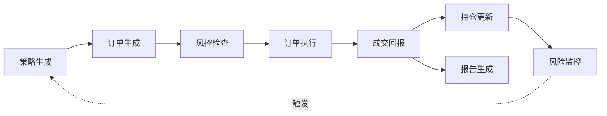

# 业务架构视图样板

> 这是给人看的业务架构视图——系统服务谁、做什么、核心流程是什么。
> TOGAF 第一层（业务架构），代表性视图。

---

## 利益相关者清单

| 角色 | 关注什么 | 当前谁承担 |
|------|---------|-----------|
| 投资者 | 收益、风险、资金安全 | 系统Owner |
| 交易员 | 交易执行、持仓管理 | 系统Owner |
| 风控经理 | 风险控制、合规检查 | 系统Owner |
| 运维工程师 | 系统稳定、性能、可恢复 | 系统Owner |
| 开发者 | 代码质量、可维护性 | AI + 系统Owner |
| 审计员 | 可追溯性、合规报告 | 系统Owner |

---

## 核心业务能力表

| 能力域 | 干什么 | 对应功能域 |
|--------|--------|-----------|
| 交易执行 | 生成、提交、执行订单 | D-TRADING |
| 风险管理 | 风控检查、风险监控 | D-RISK |
| 回测验证 | 策略回测、历史验证 | D-BACKTEST |
| 数据管理 | 行情数据、持仓数据 | D-DATA_ENG |
| 合规报告 | 合规检查、监管报告 | D-COMPLIANCE |
| 投资组合 | 组合管理、再平衡 | D-PORTFOLIO |
| 基础设施 | 运行时、部署、监控 | D_INFRA_OPS |
| 治理 | 规则、审计、质量 | D-GOVERNANCE |

---

## 端到端业务流程

### 流程输入输出表

| 阶段 | 输入 | 输出 | 负责域 |
|------|------|------|--------|
| 策略生成 | 市场数据、历史数据 | 交易信号 | D-STRATEGY |
| 订单生成 | 交易信号 | 订单请求 | D-TRADING |
| 风控检查 | 订单请求 | 风控结果 | D-RISK |
| 订单执行 | 风控通过的订单 | 执行结果 | D-TRADING |
| 成交回报 | 执行结果 | 成交记录 | D-TRADING |
| 持仓更新 | 成交记录 | 最新持仓 | D-TRADING |
| 风险监控 | 持仓、市场数据 | 风险指标 | D-RISK |
| 报告生成 | 交易记录、持仓 | 报告 | D-REPORTING |

---

## 非功能需求

| 维度 | 要求 | 大白话 |
|------|------|--------|
| 性能 | 订单延迟 < 100ms | 下单要快，不能卡 |
| 可用性 | 交易时段 99.9% | 交易时间不能挂 |
| 安全 | 资金安全、数据安全 | 钱不能错，数据不能丢 |
| 可审计 | 完整决策链记录 | 每个决策都能查到原因 |
| 可维护 | 模块化、文档齐全 | 能改、能修、能扩展 |

---

## 业务约束

| 约束 | 说明 |
|------|------|
| 交易时间 | 只在交易时段运行，非交易时段可停机维护 |
| 资金限制 | 单笔交易不超过总资金的 X% |
| 风控限制 | 最大回撤不超过 Y% |
| 合规要求 | 满足监管报告要求 |

---

## 说明

- **这是样板文件**：实际文件需人工维护
- **维护方式**：人工维护（架构师/Owner）
- **变更触发**：业务变化时
- **格式要求**：大白话+表格+流程图
