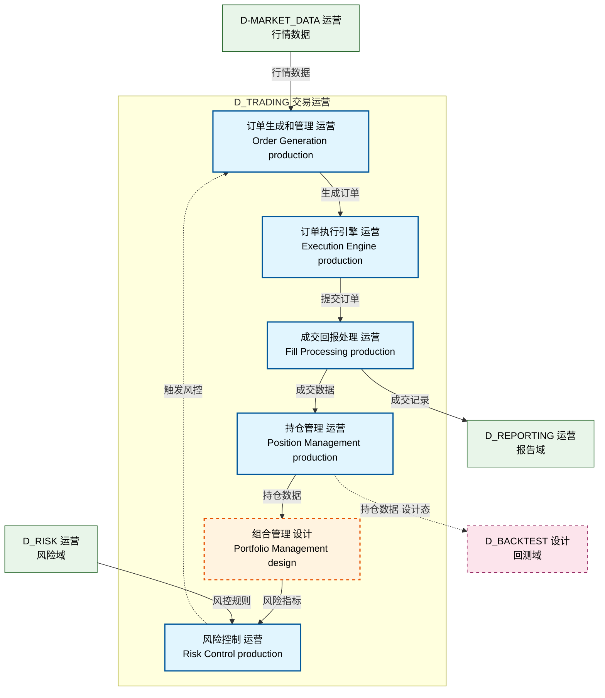

# 16_d_trading 域文档样板

> 这是给人看的功能域文档——这个域是干什么的、有哪些模块、模块之间怎么依赖。
> 依赖图内嵌在本文档中（Mermaid 代码块），IDE 可直接渲染显示。

---

## 域基本信息 / Domain Overview

| 字段 | 值 | Field | Value |
|------|------|-------|-------|
| 编号 | 16 | Number | 16 |
| 域ID | D_TRADING | Domain ID | D_TRADING |
| 域名称 | 交易运营 | Domain Name | Trading Operations |
| 层级 | L2_domain | Layer | L2_domain |
| 模块数 | 249 | Module Count | 249 |
| 域内依赖 | 180 | Internal Dependencies | 180 |
| 跨域入边 | 45 | Cross-domain Incoming | 45 |
| 跨域出边 | 30 | Cross-domain Outgoing | 30 |

---

## 域职责 / Domain Responsibilities

**中文**：交易运营域负责订单生命周期管理，包括订单生成、提交、成交回报、持仓更新、风险控制触发等核心交易流程。

**English**: The Trading Operations domain is responsible for order lifecycle management, including order generation, submission, fill reports, position updates, and risk control triggers.

---

## 模块清单 / Module List

| 模块路径 | 模块功能 | Module Path | Module Function |
|---------|---------|-------------|-----------------|
| `src/zephyr/trading/order/` | 订单生成和管理 / Order generation and management | `src/zephyr/trading/order/` | Order generation and management |
| `src/zephyr/trading/execution/` | 订单执行引擎 / Order execution engine | `src/zephyr/trading/execution/` | Order execution engine |
| `src/zephyr/trading/fill/` | 成交回报处理 / Fill report processing | `src/zephyr/trading/fill/` | Fill report processing |
| `src/zephyr/trading/position/` | 持仓管理 / Position management | `src/zephyr/trading/position/` | Position management |
| `src/zephyr/trading/risk/` | 风险控制 / Risk control | `src/zephyr/trading/risk/` | Risk control |
| ... | ... | ... | ... |

---

## 域内依赖图 / Internal Dependency Diagram

> 依赖图内嵌在本文档中，IDE 可直接渲染显示。
>
> **图例说明 / Legend**：
> - **实线边框 = 运营态模块**（production，已上线运行）
> - **虚线边框 = 设计态模块**（design，还在设计中）
> - **实线箭头 = 运营态依赖**（已生效的依赖关系）
> - **虚线箭头 = 设计态依赖**（计划中的依赖关系）

---

## 跨域依赖 / Cross-domain Dependencies

### 依赖的域 / Depends On

| 目标域 | 依赖数 | 主要依赖类型 | Target Domain | Dependency Count | Main Type |
|--------|:---:|------|-------|:---:|------|
| D-MARKET_DATA | 15 | 数据读取 / Data Read | D-MARKET_DATA | 15 | Data Read |
| D_RISK | 10 | 风控检查 / Risk Check | D_RISK | 10 | Risk Check |
| ... | ... | ... | ... | ... | ... |

### 被依赖的域 / Depended By

| 源域 | 依赖数 | 主要依赖类型 | Source Domain | Dependency Count | Main Type |
|------|:---:|------|-------|:---:|------|
| D_BACKTEST | 20 | 回测调用 / Backtest Call | D_BACKTEST | 20 | Backtest Call |
| D_REPORTING | 8 | 报告数据 / Report Data | D_REPORTING | 8 | Report Data |
| ... | ... | ... | ... | ... | ... |

---

## 说明

- **数据源**：`depgraph.db` 的 `nodes`、`edges`、`domains` 表
- **生成器**：`generate_domain_doc.py`
- **维护方式**：自动生成，全景图更新时刷新
- **格式要求**：中英文对照，模块功能一句话简介，Mermaid 依赖图内嵌在文档中
- **文件名规则**：`{编号}_{域ID小写}.md`，如 `16_d_trading.md`
