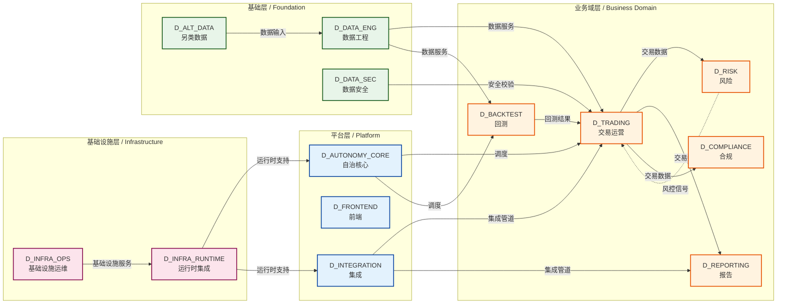

# 集成拓扑图样板 / Integration Topology Sample

> 这是给人看的所有功能域集成依赖关系图，用 Mermaid 格式可视化。
> IDE 可直接渲染显示。

---

## 集成拓扑图 / Integration Topology

---

## 说明

- **数据源**：`depgraph.db` 的 `edges` 表（跨域依赖）
- **生成器**：`generate_integration_topology.py`
- **维护方式**：自动生成，全景图更新时刷新
- **格式要求**：Mermaid 代码块内嵌在 .md 文件中，IDE 可直接渲染显示
- **文件名规则**：`integration_topology.md`（英文 snake_case）
