# ZephyrAlpha 全系统多价值流依赖流程图

> **版本**：v3.0.0 | **状态**：ACTIVE | **SSoT声明**：本文档为7条价值流线+跨线交叉点+模块归属的人类可读唯一真源。机器SSoT为 `cross-module-dependency-registry.yaml`。冲突时以YAML为准，本文档为可视化视图。

---

## §1 范围与权限

### 单一责任

本图回答且仅回答一个问题：从输入到产出，数据/控制/依赖经过哪些模块、怎么流转、在哪个点交叉？

| 本图负责 | 本图不负责 |
|---------|----------|
| 每条价值流线的起点（依赖什么）和终点（产出什么） | 模块内部实现细节（蓝图的职责） |
| 模块间的数据流方向和标注 | 数据字段级定义（契约YAML的职责） |
| 跨线交叉点的识别 | 交叉点的解决方案（架构决策的职责） |
| 容量升级新增依赖的标注 | 容量参数的具体值（capacity_params.yaml的职责） |
| 55模块的全局依赖拓扑 | 单个模块的功能描述（蓝图全清单的职责） |

### 与现有文档的边界

| 文档 | 关系 |
|------|------|
| SYS-MASTER-001 §四 | 保留概览级数据流（1条主线+3个集成点），本图提供7线详细展开 |
| DOM-GOV-001 G-CT契约 | 本图"线3:治理闭环线"展示8个治理模块在全局中的位置和流向，字段级细节仍由G-CT定义 |
| cross-module-dependency-registry.yaml | 机器SSoT（52条二元依赖），本图是人类视图。两者必须对账一致 |
| diagrams/data-flow.mmd | data-flow.mmd是C轨业务数据流详细图，本图"线7:业务价值线"引用其为详细展开 |

### SSoT层级

```
YAML注册表（机器SSoT，冲突时为准） > 本文档（人类视图） > 蓝图（施工依据）
```

更新顺序：先更新YAML → 再更新本文档 → `validate_ssot.py` 扩展校验一致性。7条价值流线是动态行为视角，蓝图6运行时平面是静态组织视角，两者互补。映射关系见 §2.0-A。

### 功能域映射

| 功能域 | 价值流线 | 核心模块 | 成熟度 |
|--------|---------|---------|:------:|
| 数据域 | 线7 | L00 数据接入 | T0 |
| 研究域 | 线7 | L02 Alpha因子 + L03 信号 + L13 实验 | T1/T2 |
| 交易域 | 线7 | L05 组合构建 + L06 交易执行 | T1/T0 |
| 风控域 | 线7 | L04 风险管理 | T1 |
| 治理域 | 线1+3+5 | MOD-INF-006/007/009/016/027/028/033/037/038 | stable |
| 运维域 | 线4+6 | MOD-INF-010/015/021/031/032 | stable |
| 安全域 | 线2+5 | MOD-INF-014/018/019 | stable |
| 前端域 | 线7 | L08 Dashboard | T0 |

7条价值流线是跨域的流，8个功能域是正交的分类。线可流经多个域，域可包含多条线的模块。

---

## §2 价值流线

### 2.0-A 价值流线与运行时平面映射

7条价值流线（动态行为视角）与蓝图6运行时平面（静态组织视角）互补，映射如下：

| 价值流线 | 对应运行时平面 | 差异 |
|---------|--------------|------|
| 线1: 任务执行 | 任务执行平面 + 执行平面 | 蓝图将"执行"独立为v0.14新增平面 |
| 线2: AI认知 | 知识平面 | 一致 |
| 线3: 治理闭环 | 安全平面（部分） | 安全平面还包含线5审计功能 |
| 线4: 自愈反馈 | 反馈平面 | 一致 |
| 线5: 审计合规 | 安全平面（部分）+ 数据平面（部分） | 蓝图未将审计独立为平面 |
| 线6: 运维保障 | 反馈平面（部分）+ 数据平面（部分） | 与线4共享反馈平面 |
| 线7: 业务价值 | C-Track 各层 | C-Track不归入运行时平面 |

### 2.0-B 层级架构

```
元层（Level 0）
  SYS-MASTER-001  ← 金字塔顶点，全局架构约束、冷启动分派、裁决链

域层（Level 1）+ 跨层
  MOD-MASTER-001  ← 基础设施域跨层集成蓝图（85条CT-*契约，cross_layer）
  DOM-GOV-001     ← 治理域集成蓝图
  ALPHA-SIGNAL-DOMAIN-001 ← Alpha信号域
  ML-EXPERIMENT-DOMAIN-001 ← ML实验域
  GOV-FSTR-001    ← 系统重组总蓝图

模块层（Level 2）
  MOD-INF-001~038 ← 31个基础设施模块
  MOD-KB-001      ← 知识库
  MOD-L00~L13     ← 12个C轨业务模块

共享基座（跨层）
  MOD-INF-016 共享核心  ← 公共工具箱
  MOD-INF-012 数据库    ← 数据持久化
  MOD-INF-035 系统大脑  ← 全局调度中心
  MOD-INF-002 运行时集成 ← 运行时桥接
  MOD-INF-013 MCP服务器  ← 对外接口层
```

### 2.0 全局概览图

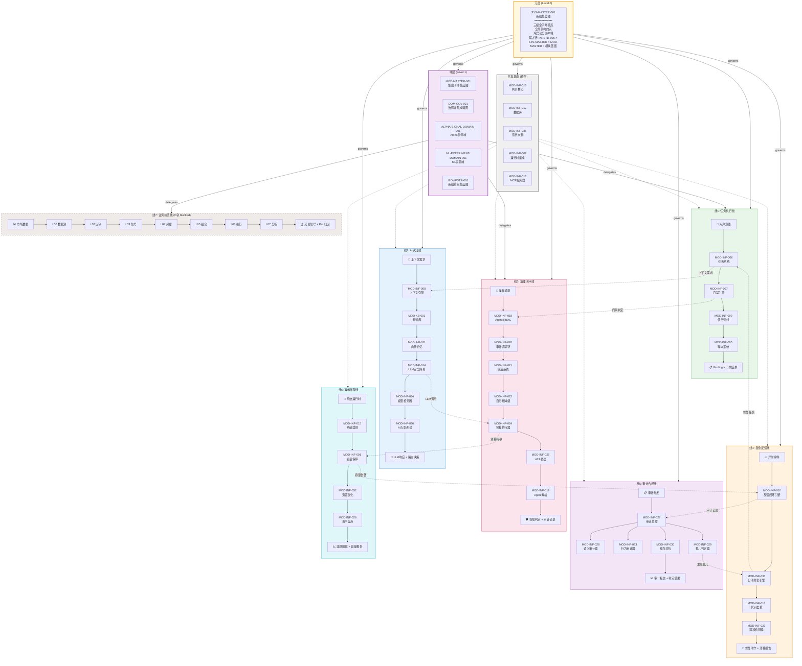
```mermaid
flowchart TB
    subgraph META["元层 (Level 0)"]
        SM["SYS-MASTER-001<br/>系统总蓝图<br/>━━━━━━━━━━<br/>三级金字塔顶点<br/>全局架构约束<br/>冷启动分派81域<br/>裁决链: PS-STD-005 > SYS-MASTER > MOD-MASTER > 模块蓝图"]
    end

    subgraph DOMAIN["域层 (Level 1)"]
        MM["MOD-MASTER-001<br/>集成闭环总蓝图"]
        DG["DOM-GOV-001<br/>治理域集成蓝图"]
        AS["ALPHA-SIGNAL-DOMAIN-001<br/>Alpha信号域"]
        ML["ML-EXPERIMENT-DOMAIN-001<br/>ML实验域"]
        RS["GOV-FSTR-001<br/>系统重组总蓝图"]
    end

    subgraph SHARED["共享基座 (跨层)"]
        SC["MOD-INF-016<br/>共享核心"]
        DB["MOD-INF-012<br/>数据库"]
        BRAIN["MOD-INF-035<br/>系统大脑"]
        RI["MOD-INF-002<br/>运行时集成"]
        MCP["MOD-INF-013<br/>MCP服务器"]
    end

    subgraph V1["线1: 任务执行线"]
        direction LR
        V1_IN["👤 用户意图"] --> V1_TS["MOD-INF-006<br/>任务系统"]
        V1_TS --> V1_GE["MOD-INF-007<br/>门禁引擎"]
        V1_GE --> V1_PL["MOD-INF-009<br/>任务管线"]
        V1_PL --> V1_SS["MOD-INF-005<br/>脚本系统"]
        V1_SS --> V1_OUT["📋 Finding + 门禁结果"]
    end

    subgraph V2["线2: AI认知线"]
        direction LR
        V2_IN["🧠 上下文需求"] --> V2_CE["MOD-INF-008<br/>上下文引擎"]
        V2_CE --> V2_KB["MOD-KB-001<br/>知识库"]
        V2_KB --> V2_VM["MOD-INF-011<br/>向量记忆"]
        V2_VM --> V2_LSG["MOD-INF-014<br/>LLM安全网关"]
        V2_LSG --> V2_MP["MOD-INF-034<br/>模型检测器"]
        V2_MP --> V2_EXAM["MOD-INF-036<br/>AI入职考试"]
        V2_EXAM --> V2_OUT["🤖 LLM响应 + 路由决策"]
    end

    subgraph V3["线3: 治理闭环线"]
        direction LR
        V3_IN["🔐 操作请求"] --> V3_RBAC["MOD-INF-018<br/>Agent RBAC"]
        V3_RBAC --> V3_AT["MOD-INF-020<br/>审计追踪链"]
        V3_AT --> V3_RB["MOD-INF-021<br/>回滚系统"]
        V3_RB --> V3_ESC["MOD-INF-022<br/>自治升降级"]
        V3_ESC --> V3_BUD["MOD-INF-024<br/>预算执行器"]
        V3_BUD --> V3_A2A["MOD-INF-025<br/>A2A协议"]
        V3_A2A --> V3_SPEC["MOD-INF-019<br/>Agent规格"]
        V3_SPEC --> V3_OUT["🛡️ 权限判定 + 审计记录"]
    end

    subgraph V4["线4: 自愈反馈线"]
        direction LR
        V4_IN["⚠️ 异常事件"] --> V4_FLE["MOD-INF-010<br/>反馈闭环引擎"]
        V4_FLE --> V4_FIX["MOD-INF-031<br/>自动修复引擎"]
        V4_FIX --> V4_DEDUP["MOD-INF-017<br/>代码去重"]
        V4_DEDUP --> V4_DRIFT["MOD-INF-023<br/>漂移检测器"]
        V4_DRIFT --> V4_OUT["🔧 修复动作 + 漂移报告"]
    end

    subgraph V5["线5: 审计合规线"]
        direction LR
        V5_IN["📋 审计触发"] --> V5_AO["MOD-INF-027<br/>审计总控"]
        V5_AO --> V5_SA["MOD-INF-028<br/>语义审计器"]
        V5_AO --> V5_BA["MOD-INF-033<br/>行为审计器"]
        V5_AO --> V5_OJ["MOD-INF-029<br/>孤儿判定器"]
        V5_AO --> V5_RB["MOD-INF-030<br/>红白对抗"]
        V5_RB --> V5_OUT["📊 审计报告 + 判定结果"]
    end

    subgraph V6["线6: 运维保障线"]
        direction LR
        V6_IN["📡 系统运行时"] --> V6_TEL["MOD-INF-015<br/>系统遥测"]
        V6_TEL --> V6_CAP["MOD-INF-001<br/>容量保障"]
        V6_CAP --> V6_RES["MOD-INF-032<br/>资源优化"]
        V6_RES --> V6_INV["MOD-INF-026<br/>资产盘点"]
        V6_INV --> V6_OUT["📈 遥测数据 + 容量报告"]
    end

    subgraph V7["线7: 业务价值线 (C轨 blocked)"]
        direction LR
        V7_IN["📊 市场数据"] --> V7_L00["L00 数据源"]
        V7_L00 --> V7_L02["L02 因子"]
        V7_L02 --> V7_L03["L03 信号"]
        V7_L03 --> V7_L04["L04 风控"]
        V7_L04 --> V7_L05["L05 组合"]
        V7_L05 --> V7_L06["L06 执行"]
        V7_L06 --> V7_L07["L07 分析"]
        V7_L07 --> V7_OUT["💰 交易信号 + PnL归因"]
    end

    META -->|governs| DOMAIN
    META -->|governs| SHARED
    META -->|governs| V1
    META -->|governs| V2
    META -->|governs| V3
    META -->|governs| V4
    META -->|governs| V5
    META -->|governs| V6

    DOMAIN -->|delegates| V1
    DOMAIN -->|delegates| V3
    DOMAIN -->|delegates| V7

    SHARED -.-> V1
    SHARED -.-> V2
    SHARED -.-> V3
    SHARED -.-> V4
    SHARED -.-> V5
    SHARED -.-> V6

    V1_GE -.->|"门禁判定"| V3_RBAC
    V1_TS -.->|"上下文需求"| V2_CE
    V2_LSG -.->|"LLM调用"| V3_BUD
    V4_FIX -.->|"修复任务"| V1_TS
    V4_FLE -.->|"审计记录"| V5_AO
    V6_CAP -.->|"容量告警"| V4_FLE
    V3_BUD -.->|"预算耗尽"| V6_CAP
    V5_OJ -.->|"发现孤儿"| V4_FIX

    style META fill:#fff8e1,stroke:#f9a825,stroke-width:3px
    style DOMAIN fill:#f3e5f5,stroke:#7b1fa2,stroke-width:2px
    style SHARED fill:#f0f0f0,stroke:#666,stroke-width:2px
    style V1 fill:#e8f5e9,stroke:#4caf50
    style V2 fill:#e3f2fd,stroke:#2196f3
    style V3 fill:#fce4ec,stroke:#e91e63
    style V4 fill:#fff3e0,stroke:#ff9800
    style V5 fill:#f3e5f5,stroke:#9c27b0
    style V6 fill:#e0f7fa,stroke:#00bcd4
    style V7 fill:#efebe9,stroke:#795548,stroke-dasharray: 5 5
```

### 2.1 线1：任务执行线

**目标**：把用户意图变成可审计的代码变更 | **起点**：用户意图/Git commit/AI操作 | **终点**：Finding+门禁判定+脚本报告 | **平面**：任务执行平面+执行平面(v0.14)

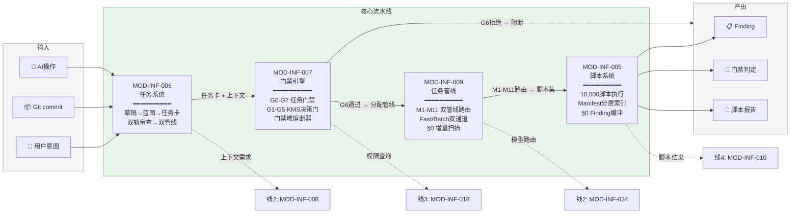
```mermaid
flowchart LR
    subgraph L1_INPUT["输入"]
        USER["👤 用户意图"]
        GIT["📦 Git commit"]
        AI["🤖 AI操作"]
    end

    subgraph L1_CORE["核心流水线"]
        TS["MOD-INF-006<br/>任务系统<br/>━━━━━━━━━━<br/>草稿→蓝图→任务卡<br/>双轨审查→双管线"]
        GE["MOD-INF-007<br/>门禁引擎<br/>━━━━━━━━━━<br/>G0-G7 任务门禁<br/>G1-G5 KMS决策门<br/>门禁域熔断器"]
        PL["MOD-INF-009<br/>任务管线<br/>━━━━━━━━━━<br/>M1-M11 双管线路由<br/>Fast/Batch双通道<br/>§0 增量扫描"]
        SS["MOD-INF-005<br/>脚本系统<br/>━━━━━━━━━━<br/>10,000脚本执行<br/>Manifest分层索引<br/>§0 Finding缓冲"]
    end

    subgraph L1_OUTPUT["产出"]
        FINDING["📋 Finding"]
        GATE_RESULT["🚦 门禁判定"]
        SCRIPT_REPORT["📜 脚本报告"]
    end

    USER --> TS
    GIT --> TS
    AI --> TS
    TS -->|"任务卡 + 上下文"| GE
    GE -->|"G6通过 → 分配管线"| PL
    GE -->|"G6拒绝 → 阻断"| L1_OUTPUT
    PL -->|"M1-M11路由 → 脚本集"| SS
    SS --> FINDING
    SS --> GATE_RESULT
    SS --> SCRIPT_REPORT

    GE -.->|"权限查询"| X_RBAC["线3: MOD-INF-018"]
    TS -.->|"上下文需求"| X_CE["线2: MOD-INF-008"]
    SS -.->|"脚本结果"| X_FLE["线4: MOD-INF-010"]
    PL -.->|"模型路由"| X_MP["线2: MOD-INF-034"]

    style L1_CORE fill:#e8f5e9,stroke:#4caf50
    style L1_INPUT fill:#f5f5f5,stroke:#999
    style L1_OUTPUT fill:#f5f5f5,stroke:#999
```

容量升级新增依赖：MOD-INF-005→ADR-0036(Manifest分层索引) / MOD-INF-005→ADR-0033(增量扫描依赖图) / MOD-INF-009→ADR-0032(双通道调度) / MOD-INF-009→MOD-INF-012 file_script_map(增量索引)

### 2.2 线2：AI认知线

**目标**：给AI喂正确的上下文，安全地调用LLM | **起点**：任务上下文需求 | **终点**：安全的LLM响应+上下文包+模型路由决策 | **平面**：知识平面

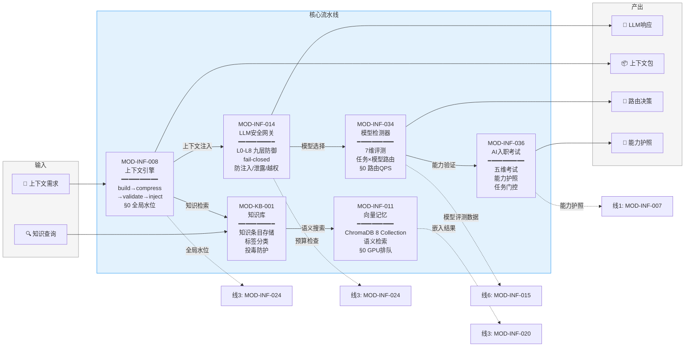
```mermaid
flowchart LR
    subgraph L2_INPUT["输入"]
        CTX_REQ["🧠 上下文需求"]
        QUERY["🔍 知识查询"]
    end

    subgraph L2_CORE["核心流水线"]
        CE["MOD-INF-008<br/>上下文引擎<br/>━━━━━━━━━━<br/>build→compress<br/>→validate→inject<br/>§0 全局水位"]
        KB["MOD-KB-001<br/>知识库<br/>━━━━━━━━━━<br/>知识条目存储<br/>标签分类<br/>投毒防护"]
        VM["MOD-INF-011<br/>向量记忆<br/>━━━━━━━━━━<br/>ChromaDB 8 Collection<br/>语义检索<br/>§0 GPU排队"]
        LSG["MOD-INF-014<br/>LLM安全网关<br/>━━━━━━━━━━<br/>L0-L8 九层防御<br/>fail-closed<br/>防注入/泄露/越权"]
        MP["MOD-INF-034<br/>模型检测器<br/>━━━━━━━━━━<br/>7维评测<br/>任务×模型路由<br/>§0 路由QPS"]
        EXAM["MOD-INF-036<br/>AI入职考试<br/>━━━━━━━━━━<br/>五维考试<br/>能力护照<br/>任务门控"]
    end

    subgraph L2_OUTPUT["产出"]
        LLM_RESP["🤖 LLM响应"]
        CTX_PKG["📦 上下文包"]
        ROUTE["🧭 路由决策"]
        PASSPORT["🎫 能力护照"]
    end

    CTX_REQ --> CE
    QUERY --> KB
    CE -->|"知识检索"| KB
    KB -->|"语义搜索"| VM
    CE -->|"上下文注入"| LSG
    LSG -->|"模型选择"| MP
    MP -->|"能力验证"| EXAM
    LSG --> LLM_RESP
    CE --> CTX_PKG
    MP --> ROUTE
    EXAM --> PASSPORT

    CE -.->|"全局水位"| X_BUDGET["线3: MOD-INF-024"]
    LSG -.->|"预算检查"| X_BUDGET2["线3: MOD-INF-024"]
    MP -.->|"模型评测数据"| X_TEL["线6: MOD-INF-015"]
    EXAM -.->|"能力护照"| X_GATE["线1: MOD-INF-007"]
    VM -.->|"嵌入结果"| X_AT["线3: MOD-INF-020"]

    style L2_CORE fill:#e3f2fd,stroke:#2196f3
    style L2_INPUT fill:#f5f5f5,stroke:#999
    style L2_OUTPUT fill:#f5f5f5,stroke:#999
```

容量升级新增依赖：MOD-INF-008→MOD-INF-016 context_budget.py(全局Context水位) / MOD-INF-011→GPU排队策略(单卡RTX 3090约束) / MOD-INF-034→100×路由查询QPS

### 2.3 线3：治理闭环线

**目标**：控制AI能干什么、花了多少钱、出了事能回退 | **起点**：AI操作请求 | **终点**：权限判定+审计记录+预算消耗+回滚点 | **平面**：安全平面（部分）

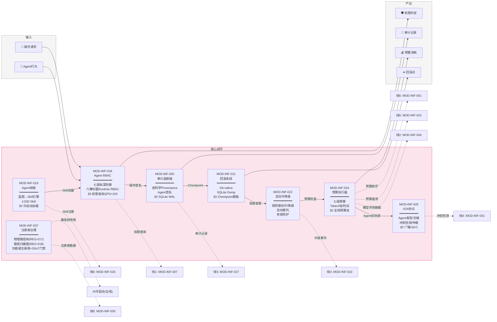
```mermaid
flowchart LR
    subgraph L3_INPUT["输入"]
        OP_REQ["🔐 操作请求"]
        AGENT_ACT["🤖 Agent行为"]
    end

    subgraph L3_CORE["核心闭环"]
        RBAC["MOD-INF-018<br/>Agent RBAC<br/>━━━━━━━━━━<br/>七层纵深防御<br/>六横切面Runtime RBAC<br/>§0 权限查询QPS×100"]
        AT["MOD-INF-020<br/>审计追踪链<br/>━━━━━━━━━━<br/>密码学Provenance<br/>Agent签名<br/>§0 SQLite WAL"]
        RB["MOD-INF-021<br/>回滚系统<br/>━━━━━━━━━━<br/>Git-native<br/>SQLite Dump<br/>§0 Checkpoint膨胀"]
        ESC["MOD-INF-022<br/>自治升降级<br/>━━━━━━━━━━<br/>规则驱动升/降级<br/>自动委托<br/>死锁防护"]
        BUD["MOD-INF-024<br/>预算执行器<br/>━━━━━━━━━━<br/>七级预算<br/>Token/钱/时间<br/>§0 全局预算池"]
        A2A["MOD-INF-025<br/>A2A协议<br/>━━━━━━━━━━<br/>Agent发现/交接<br/>冲突检测/仲裁<br/>§0 广播O(n²)"]
        SPEC["MOD-INF-019<br/>Agent规格<br/>━━━━━━━━━━<br/>蓝图→Skill引擎<br/>4,500 Skill<br/>§0 冷启动加载"]
        REGOV["MOD-INF-037<br/>注册表治理<br/>━━━━━━━━━━<br/>物理路径树(REG-017)<br/>路径归属图(REG-018)<br/>功能域注册表+SSoT门禁"]
    end

    subgraph L3_OUTPUT["产出"]
        PERM["🛡️ 权限判定"]
        AUDIT_REC["📝 审计记录"]
        BUDGET_USE["💰 预算消耗"]
        ROLLBACK_PT["⏪ 回滚点"]
    end

    OP_REQ --> RBAC
    AGENT_ACT --> RBAC
    RBAC -->|"操作签名"| AT
    AT -->|"Checkpoint"| RB
    RB -->|"权限变更"| ESC
    ESC -->|"预算检查"| BUD
    BUD -->|"Agent间协调"| A2A
    SPEC -->|"Skill加载"| RBAC
    RBAC --> PERM
    AT --> AUDIT_REC
    BUD --> BUDGET_USE
    RB --> ROLLBACK_PT

    RBAC -.->|"权限查询"| X_GATE["线1: MOD-INF-007"]
    AT -.->|"审计记录"| X_AO["线5: MOD-INF-027"]
    BUD -.->|"预算耗尽"| X_CAP["线6: MOD-INF-001"]
    BUD -.->|"预算遥测"| X_TEL["线6: MOD-INF-015"]
    BUD -.->|"模型评测数据"| X_MP["线2: MOD-INF-034"]
    ESC -.->|"升级事件"| X_FLE["线4: MOD-INF-010"]
    A2A -.->|"冲突检测"| X_FIX["线4: MOD-INF-031"]
    SPEC -.->|"Skill注册"| X_INV["线6: MOD-INF-026"]
    REGOV -.->|"路径树快照"| X_COLD["AI冷启动(全线)"]
    REGOV -.->|"注册表数据"| X_ASSET["线6: MOD-INF-026"]

    style L3_CORE fill:#fce4ec,stroke:#e91e63
    style L3_INPUT fill:#f5f5f5,stroke:#999
    style L3_OUTPUT fill:#f5f5f5,stroke:#999
```

**DOM-GOV G-CT 契约映射**：

| 本图中的流 | 对应 G-CT 契约 | 方向 | 类型 |
|-----------|---------------|------|------|
| RBAC → AT | G-CT-001 | RBAC → Audit | hard |
| AT → RB | G-CT-002 | Audit → Rollback | hard |
| RB → ESC | G-CT-003 | Rollback → Escalation | hard |
| ESC → RBAC | G-CT-004 | Escalation → RBAC（循环依赖，已裁定） | hard |
| DRIFT → RB | G-CT-005 | Drift → Rollback（旁路触发） | event |
| BUD → ESC | G-CT-006 | Budget → Escalation（事件驱动：BudgetAlert数据类消费，非代码import循环） | event |
| SPEC → RBAC/AT | G-CT-007 | Spec → RBAC + Audit | hard |
| A2A → RBAC/ESC | G-CT-008 | A2A → RBAC + Escalation（Protocol解耦+shared.constants，已修复） | event |
| REGOV → 全线冷启动 | G-CT-009 | 注册表治理 → AI冷启动路径树供给 | hard |
| REGOV → MOD-INF-026 | G-CT-010 | 注册表治理 → 资产盘点注册表数据供给 | hard |
| REGOV → G6_PT | G-CT-011 | 注册表治理 → 路径树刷新门禁(G6_PT) | hard |
| G6_PT → MOD-INF-007 | G-CT-012 | 路径树刷新门禁 → Gate Engine 执行 | hard |

容量升级新增依赖：MOD-INF-020→ADR-0038(SQLite写入缓冲) / MOD-INF-020→ADR-0037(ZephyrLock跨进程) / MOD-INF-024→MOD-INF-016 BudgetEngine(全局成本汇聚) / DEP-080: MOD-INF-024→MOD-INF-015(预算遥测/runtime/hard) / DEP-081: MOD-INF-024→MOD-INF-034(模型评测数据/data/soft)

### 2.4 线4：自愈反馈线

**目标**：系统异常时自动检测→诊断→修复→验证 | **起点**：异常事件/SLI越界/漂移告警 | **终点**：修复动作+漂移报告+进化记录 | **平面**：反馈平面

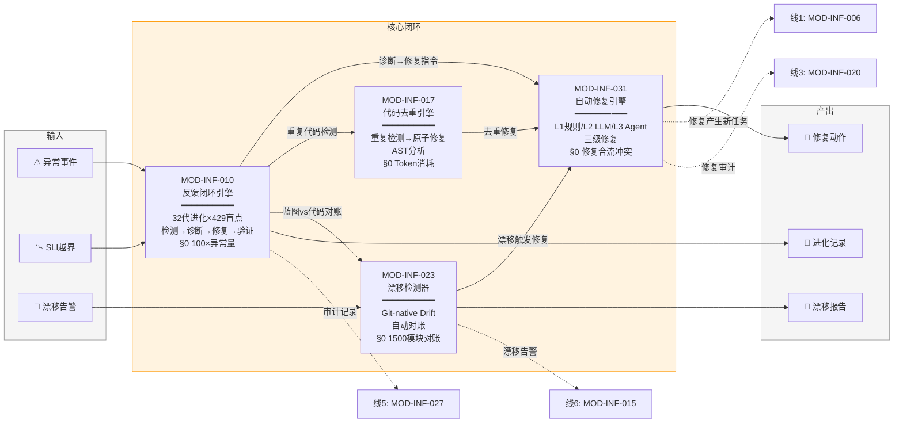
```mermaid
flowchart LR
    subgraph L4_INPUT["输入"]
        EXCEPTION["⚠️ 异常事件"]
        SLI_BREACH["📉 SLI越界"]
        DRIFT_ALERT["🔀 漂移告警"]
    end

    subgraph L4_CORE["核心闭环"]
        FLE["MOD-INF-010<br/>反馈闭环引擎<br/>━━━━━━━━━━<br/>32代进化×429盲点<br/>检测→诊断→修复→验证<br/>§0 100×异常量"]
        FIX["MOD-INF-031<br/>自动修复引擎<br/>━━━━━━━━━━<br/>L1规则/L2 LLM/L3 Agent<br/>三级修复<br/>§0 修复合流冲突"]
        DEDUP["MOD-INF-017<br/>代码去重引擎<br/>━━━━━━━━━━<br/>重复检测→原子修复<br/>AST分析<br/>§0 Token消耗"]
        DRIFT["MOD-INF-023<br/>漂移检测器<br/>━━━━━━━━━━<br/>Git-native Drift<br/>自动对账<br/>§0 1500模块对账"]
    end

    subgraph L4_OUTPUT["产出"]
        FIX_ACT["🔧 修复动作"]
        DRIFT_RPT["🔀 漂移报告"]
        EVO_REC["🧬 进化记录"]
    end

    EXCEPTION --> FLE
    SLI_BREACH --> FLE
    DRIFT_ALERT --> DRIFT
    FLE -->|"诊断→修复指令"| FIX
    FLE -->|"重复代码检测"| DEDUP
    FLE -->|"蓝图vs代码对账"| DRIFT
    DRIFT -->|"漂移触发修复"| FIX
    DEDUP -->|"去重修复"| FIX
    FIX --> FIX_ACT
    DRIFT --> DRIFT_RPT
    FLE --> EVO_REC

    FIX -.->|"修复产生新任务"| X_TS["线1: MOD-INF-006"]
    FLE -.->|"审计记录"| X_AO["线5: MOD-INF-027"]
    DRIFT -.->|"漂移告警"| X_TEL["线6: MOD-INF-015"]
    FIX -.->|"修复审计"| X_AT["线3: MOD-INF-020"]

    style L4_CORE fill:#fff3e0,stroke:#ff9800
    style L4_INPUT fill:#f5f5f5,stroke:#999
    style L4_OUTPUT fill:#f5f5f5,stroke:#999
```

### 2.5 线5：审计合规线

**目标**：全系统可审计、可追溯、可判定 | **起点**：审计事件流（L0） | **终点**：判定结果+修复执行+对抗验证+知识反馈 | **平面**：安全平面+数据平面+反馈平面 | **架构**：五层单向数据流（L0证据采集→L1分析引擎→L2编排调度→L3执行→L4知识反馈）

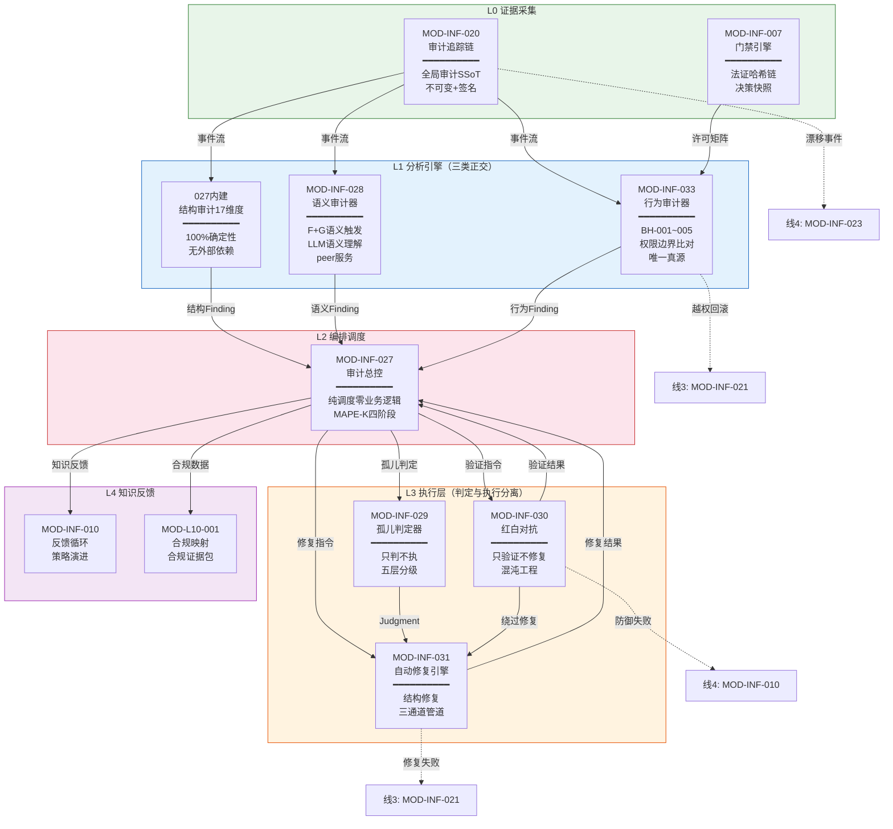
```mermaid
flowchart TB
    subgraph L5_L0["L0 证据采集"]
        AT["MOD-INF-020<br/>审计追踪链<br/>━━━━━━━━━━<br/>全局审计SSoT<br/>不可变+签名"]
        GE["MOD-INF-007<br/>门禁引擎<br/>━━━━━━━━━━<br/>法证哈希链<br/>决策快照"]
    end

    subgraph L5_L1["L1 分析引擎（三类正交）"]
        SA["MOD-INF-028<br/>语义审计器<br/>━━━━━━━━━━<br/>F+G语义触发<br/>LLM语义理解<br/>peer服务"]
        BA["MOD-INF-033<br/>行为审计器<br/>━━━━━━━━━━<br/>BH-001~005<br/>权限边界比对<br/>唯一真源"]
        STRUCT["027内建<br/>结构审计17维度<br/>━━━━━━━━━━<br/>100%确定性<br/>无外部依赖"]
    end

    subgraph L5_L2["L2 编排调度"]
        AO["MOD-INF-027<br/>审计总控<br/>━━━━━━━━━━<br/>纯调度零业务逻辑<br/>MAPE-K四阶段"]
    end

    subgraph L5_L3["L3 执行层（判定与执行分离）"]
        OJ["MOD-INF-029<br/>孤儿判定器<br/>━━━━━━━━━━<br/>只判不执<br/>五层分级"]
        FIX["MOD-INF-031<br/>自动修复引擎<br/>━━━━━━━━━━<br/>结构修复<br/>三通道管道"]
        RBV["MOD-INF-030<br/>红白对抗<br/>━━━━━━━━━━<br/>只验证不修复<br/>混沌工程"]
    end

    subgraph L5_L4["L4 知识反馈"]
        FLE["MOD-INF-010<br/>反馈循环<br/>策略演进"]
        COMP["MOD-L10-001<br/>合规映射<br/>合规证据包"]
    end

    AT -->|"事件流"| SA
    AT -->|"事件流"| BA
    AT -->|"事件流"| STRUCT
    GE -->|"许可矩阵"| BA
    STRUCT -->|"结构Finding"| AO
    SA -->|"语义Finding"| AO
    BA -->|"行为Finding"| AO
    AO -->|"孤儿判定"| OJ
    AO -->|"修复指令"| FIX
    AO -->|"验证指令"| RBV
    OJ -->|"Judgment"| FIX
    RBV -->|"绕过修复"| FIX
    FIX -->|"修复结果"| AO
    RBV -->|"验证结果"| AO
    AO -->|"知识反馈"| FLE
    AO -->|"合规数据"| COMP

    AT -.->|"漂移事件"| X_DD["线4: MOD-INF-023"]
    FIX -.->|"修复失败"| X_RB["线3: MOD-INF-021"]
    BA -.->|"越权回滚"| X_RB2["线3: MOD-INF-021"]
    RBV -.->|"防御失败"| X_FLE["线4: MOD-INF-010"]

    style L5_L0 fill:#e8f5e9,stroke:#2e7d32
    style L5_L1 fill:#e3f2fd,stroke:#1565c0
    style L5_L2 fill:#fce4ec,stroke:#c62828
    style L5_L3 fill:#fff3e0,stroke:#e65100
    style L5_L4 fill:#f3e5f5,stroke:#9c27b0
```

### 2.6 线6：运维保障线

**目标**：系统不超载、不崩溃、可观测 | **起点**：系统运行时 | **终点**：遥测数据+容量报告+资源优化建议 | **平面**：反馈平面（部分）+数据平面（部分）

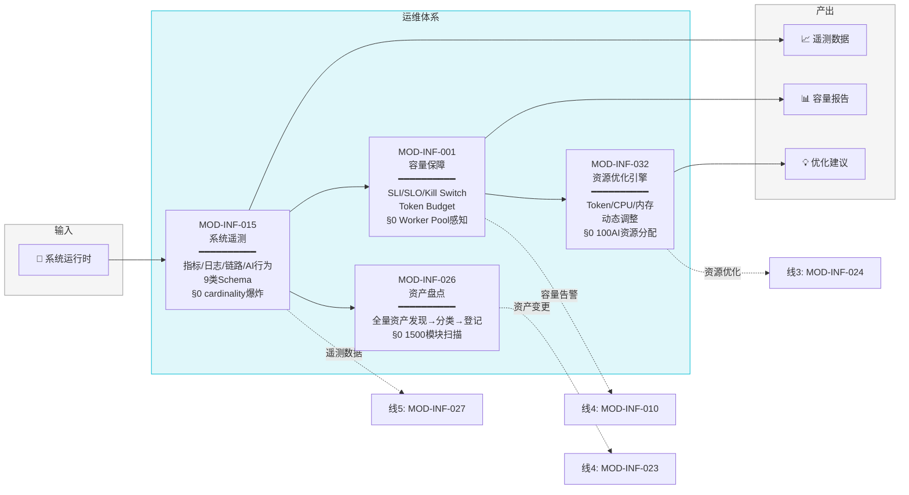
```mermaid
flowchart LR
    subgraph L6_INPUT["输入"]
        RUNTIME["📡 系统运行时"]
    end

    subgraph L6_CORE["运维体系"]
        TEL["MOD-INF-015<br/>系统遥测<br/>━━━━━━━━━━<br/>指标/日志/链路/AI行为<br/>9类Schema<br/>§0 cardinality爆炸"]
        CAP["MOD-INF-001<br/>容量保障<br/>━━━━━━━━━━<br/>SLI/SLO/Kill Switch<br/>Token Budget<br/>§0 Worker Pool感知"]
        RES["MOD-INF-032<br/>资源优化引擎<br/>━━━━━━━━━━<br/>Token/CPU/内存<br/>动态调整<br/>§0 100AI资源分配"]
        INV["MOD-INF-026<br/>资产盘点<br/>━━━━━━━━━━<br/>全量资产发现→分类→登记<br/>§0 1500模块扫描"]
    end

    subgraph L6_OUTPUT["产出"]
        TELEMETRY["📈 遥测数据"]
        CAP_RPT["📊 容量报告"]
        OPT_ADV["💡 优化建议"]
    end

    RUNTIME --> TEL
    TEL --> CAP
    CAP --> RES
    TEL --> INV
    TEL --> TELEMETRY
    CAP --> CAP_RPT
    RES --> OPT_ADV

    CAP -.->|"容量告警"| X_FLE["线4: MOD-INF-010"]
    TEL -.->|"遥测数据"| X_AO["线5: MOD-INF-027"]
    RES -.->|"资源优化"| X_BUD["线3: MOD-INF-024"]
    INV -.->|"资产变更"| X_DRIFT["线4: MOD-INF-023"]

    style L6_CORE fill:#e0f7fa,stroke:#00bcd4
    style L6_INPUT fill:#f5f5f5,stroke:#999
    style L6_OUTPUT fill:#f5f5f5,stroke:#999
```

容量升级新增依赖：MOD-INF-001→SYS-MASTER §〇 Worker Pool(多进程架构下的容量保障) / MOD-INF-015→MOD-INF-016 §〇 Metrics聚合(跨进程Metrics)

### 2.7 线7：业务价值线（C轨，blocked）

**目标**：从数据到交易到分析 | **起点**：外部市场数据 | **终点**：交易信号+组合+执行记录+PnL归因 | **状态**：blocked_by_infrastructure | **平面**：C-Track各层

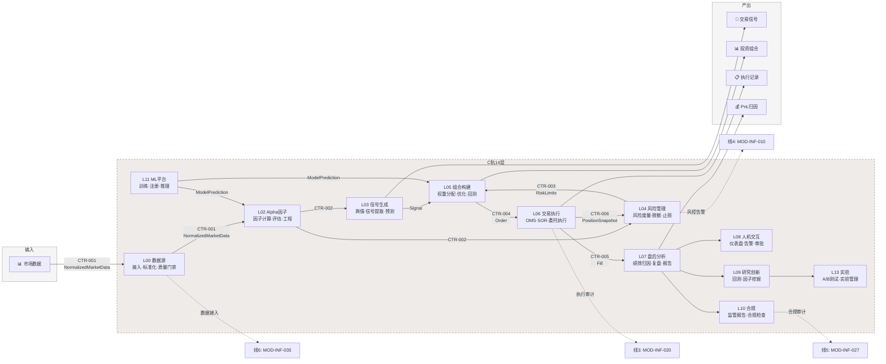
```mermaid
flowchart LR
    subgraph L7_INPUT["输入"]
        MKT["📊 市场数据"]
    end

    subgraph L7_CORE["C轨14层"]
        L00["L00 数据源<br/>接入·标准化·质量门禁"]
        L02["L02 Alpha因子<br/>因子计算·评估·工程"]
        L03["L03 信号生成<br/>舆情·信号提取·预测"]
        L04["L04 风险管理<br/>风险度量·限额·止损"]
        L05["L05 组合构建<br/>权重分配·优化·回测"]
        L06["L06 交易执行<br/>OMS·SOR·委托执行"]
        L07["L07 盘后分析<br/>绩效归因·复盘·报告"]
        L08["L08 人机交互<br/>仪表盘·告警·审批"]
        L09["L09 研究创新<br/>回测·因子挖掘"]
        L10["L10 合规<br/>监管报告·合规检查"]
        L11["L11 ML平台<br/>训练·注册·推理"]
        L13["L13 实验<br/>A/B测试·实验管理"]
    end

    subgraph L7_OUTPUT["产出"]
        SIGNAL["📡 交易信号"]
        PORTFOLIO["📊 投资组合"]
        EXEC["📋 执行记录"]
        PNL["💰 PnL归因"]
    end

    MKT -->|"CTR-001<br/>NormalizedMarketData"| L00
    L00 -->|"CTR-001<br/>NormalizedMarketData"| L02
    L02 -->|"CTR-002"| L03
    L02 -->|"CTR-002"| L04
    L03 -->|"Signal"| L05
    L04 -->|"CTR-003<br/>RiskLimits"| L05
    L05 -->|"CTR-004<br/>Order"| L06
    L06 -->|"CTR-005<br/>Fill"| L07
    L06 -->|"CTR-006<br/>PositionSnapshot"| L04
    L07 --> L08
    L07 --> L09
    L07 --> L10
    L11 -->|"ModelPrediction"| L02
    L11 -->|"ModelPrediction"| L05
    L09 --> L13

    L03 --> SIGNAL
    L05 --> PORTFOLIO
    L06 --> EXEC
    L07 --> PNL

    L00 -.->|"数据接入"| X_BRAIN["线6: MOD-INF-035"]
    L04 -.->|"风控告警"| X_FLE["线4: MOD-INF-010"]
    L06 -.->|"执行审计"| X_AT["线3: MOD-INF-020"]
    L10 -.->|"合规审计"| X_AO["线5: MOD-INF-027"]

    style L7_CORE fill:#efebe9,stroke:#795548,stroke-dasharray: 5 5
    style L7_INPUT fill:#f5f5f5,stroke:#999
    style L7_OUTPUT fill:#f5f5f5,stroke:#999
```

---

## §3 子模块级依赖图

> 以下20张子模块级依赖图覆盖B轨核心模块+C轨T0/T1层+域集成蓝图。

### 3.1 SYS-MASTER-001（Level 0 金字塔顶点·102章）

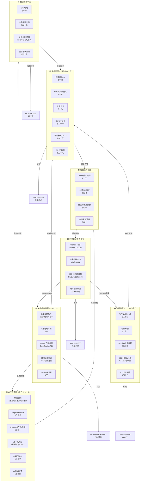
```mermaid
flowchart TB
    subgraph SM_CAP["🟦 容量升级平面 §〇"]
        SM_WP["Worker Pool<br/>ADR-0031/0034"]
        SM_DAG["增量扫描DAG<br/>ADR-0033"]
        SM_S100["100 AI生命周期<br/>HardwareShadow"]
        SM_HW["硬件感知调度<br/>CoreAffinity"]
    end

    subgraph SM_ARCH["🟩 架构约束平面 §一~§十一"]
        SM_TOPO["B/C双轨拓扑<br/>12系统架构 §一"]
        SM_PLANE["6运行时平面<br/>§八"]
        SM_GATES["G0-G7门禁体系<br/>GateEngine §四"]
        SM_DATAFLOW["跨模块数据流<br/>DEP依赖 §五"]
        SM_ADR["ADR决策索引<br/>§三"]
    end

    subgraph SM_GOV["🟧 治理平面 §十二~§四十五"]
        SM_SEC["安全纵深L1-L6<br/>§二十三"]
        SM_COMP["合规映射<br/>§二十二"]
        SM_SESS["Session生命周期<br/>§二十四"]
        SM_RB["回滚+KillSwitch<br/>L1-L5 §七十五"]
        SM_1P["1人运营保障<br/>§四十六"]
    end

    subgraph SM_OPS["🟥 运维平面 §十四~§六十三"]
        SM_START["启停6Phase<br/>§十四"]
        SM_FMEA["FMEA故障模式<br/>§十六"]
        SM_DR["灾难恢复<br/>§十八"]
        SM_DEPLOY["Canary部署<br/>§二十一"]
        SM_TOLER["容错模式T0-T4<br/>§六十三"]
        SM_SPOF["SPOF消除<br/>§三十八"]
    end

    subgraph SM_AI["🟪 AI工程平面 §十五~§九十九"]
        SM_VIBE["氛围编程<br/>§十五/§三十九/§四十四"]
        SM_PROV["AI provenance<br/>§六十八"]
        SM_PROMPT["Prompt全生命周期<br/>§七十一"]
        SM_CTX["上下文策略<br/>5级预算 §七十二"]
        SM_CONS["多模型共识<br/>§七十三"]
        SM_CODE["AI代码审查<br/>§五十四"]
    end

    subgraph SM_COST["🟫 容量核算平面"]
        SM_TOKEN["Token成本架构<br/>§十二"]
        SM_SLI["19项SLI面板<br/>§〇-B"]
        SM_BUDGET["全生命周期预算<br/>§七十"]
        SM_FATIGUE["决策疲劳管理<br/>§八十"]
    end

    subgraph SM_KNOW["⬜ 知识自愈平面"]
        SM_KB["知识管理<br/>§三十"]
        SM_HEAL["自愈闭环三层<br/>§六十七"]
        SM_CASCADE["级联风险防御<br/>AFS评分 §九十九"]
        SM_DRIFT["模型漂移监控<br/>§三十七"]
    end

    SM_CAP -->|Worker参数| SM_ARCH
    SM_CAP -->|Session容量| SM_GOV
    SM_ARCH -->|门禁约束| SM_AI
    SM_ARCH -->|6平面定义| SM_OPS
    SM_GOV -->|审计事件| SM_OPS
    SM_OPS -->|容量告警| SM_COST
    SM_AI -->|施工消耗| SM_COST
    SM_COST -.->|预算强制| SM_CAP
    SM_KNOW -->|自愈触发| SM_OPS
    SM_KNOW -->|知识注入| SM_AI

    SM_ARCH -->|引用| MM["MOD-MASTER-001<br/>CT-*契约"]
    SM_GOV -->|引用| DG["DOM-GOV-001<br/>G-CT-*"]
    SM_OPS -->|依赖| SC["MOD-INF-016<br/>共享核心"]
    SM_CAP -->|消费| BRAIN["MOD-INF-035<br/>系统大脑"]
    SM_KNOW -->|向量存储| KBEXT["MOD-KB-001<br/>知识库"]
```

### 3.2 MOD-MASTER-001（跨层集成蓝图·5300行）

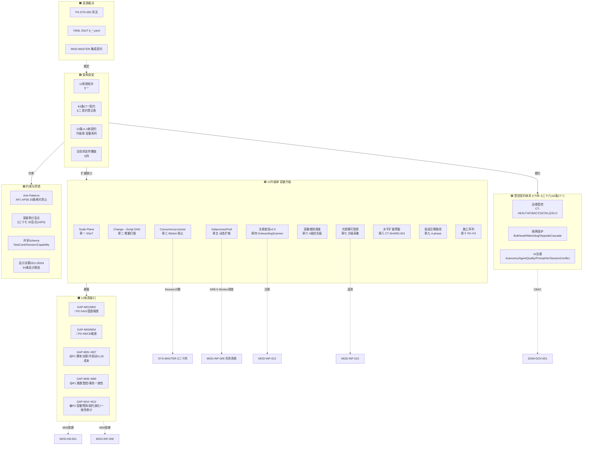
```mermaid
flowchart TB
    subgraph MM_ARCH["🟦 架构骨架"]
        MM_TOPO["12系统拓扑<br/>§一"]
        MM_REG["63条CT-*契约<br/>§二 契约登记表"]
        MM_22["22条v1.0新契约<br/>升级章 容量系列"]
        MM_PROP["全局状态传播链<br/>§四"]
    end

    subgraph MM_SCALE["🟩 10升级章 容量升级"]
        MM_SP["Scale Plane<br/>章一 SSoT"]
        MM_DAG["Change→Script DAG<br/>章二 增量扫描"]
        MM_CL["ConcurrencyLicense<br/>章三 80slot+抢占"]
        MM_DISC["注册发现v2.0<br/>章四 OnboardingScanner"]
        MM_POOL["SubprocessPool<br/>章五 动态扩缩"]
        MM_SCHED["容量感知调度<br/>章六 4级优先级"]
        MM_OBS["大规模可观测<br/>章七 分级采集"]
        MM_SHARD["水平扩展预留<br/>章八 CT-SHARD-001"]
        MM_MIGR["渐进迁移路径<br/>章九 4-phase"]
        MM_SEQ["施工序列<br/>章十 P0~P4"]
    end

    subgraph MM_GAP["🟧 12体系缺口"]
        MM_G1["GAP-M01/M02<br/>🔴P0 DAG/蓝图缩放"]
        MM_G2["GAP-M03/M04<br/>🔴P0 KB/CE缩放"]
        MM_G3["GAP-M05~M07<br/>🟡P1 脚本治理/冷启动/LLM成本"]
        MM_G4["GAP-M08~M09<br/>🟡P1 膨胀管控/事务一致性"]
        MM_G5["GAP-M10~M12<br/>🟢P2 容量预测/契约演化/一致性审计"]
    end

    subgraph MM_CTRL["🟥 管控契约体系 §十四~§三十六(40条CT-*)"]
        MM_HC["运维管控<br/>CT-HEALTH/CBAC/CDC/DLQ/SLO"]
        MM_ISO["隔离保护<br/>Bulkhead/Watchdog/DegradeCascade"]
        MM_AIG["AI治理<br/>Autonomy/AgentQuality/PromptVer/SessionConflict"]
    end

    subgraph MM_AP["🟪 约束与防错"]
        MM_APS["Anti-Patterns<br/>AP1-AP36 20条绝对禁止"]
        MM_BLIND["深度审计盲点<br/>§三十七 35盲点(16P0)"]
        MM_SCHEMA["共享Schema<br/>TaskCard/Session/Capability"]
        MM_DD["设计决策DD1-DD54<br/>54条设计理由"]
    end

    subgraph MM_ARB["🟫 真源裁决"]
        MM_L0["PS-STD-005 宪法"]
        MM_L1["YAML SSoT b_*.yaml"]
        MM_L2["MOD-MASTER 集成契约"]
    end

    MM_ARCH -->|扩展缺口| MM_SCALE
    MM_SCALE -->|暴露| MM_GAP
    MM_ARCH -->|细化| MM_CTRL
    MM_ARCH -->|约束| MM_AP
    MM_ARB -.->|裁定| MM_ARCH

    MM_CL -.->|Session计数| SYS["SYS-MASTER §二十四"]
    MM_POOL -.->|ARB-5 Worker调度| TS["MOD-INF-006 任务系统"]
    MM_DISC -.->|注册| DB["MOD-INF-012"]
    MM_OBS -.->|遥测| TEL["MOD-INF-015"]
    MM_CTRL -.->|CBAC| GOV["DOM-GOV-001"]
    MM_GAP -.->|M03依赖| KB["MOD-KB-001"]
    MM_GAP -.->|M04依赖| CE["MOD-INF-008"]
```

### 3.3 DOM-GOV-001（治理域集成蓝图·2256行）

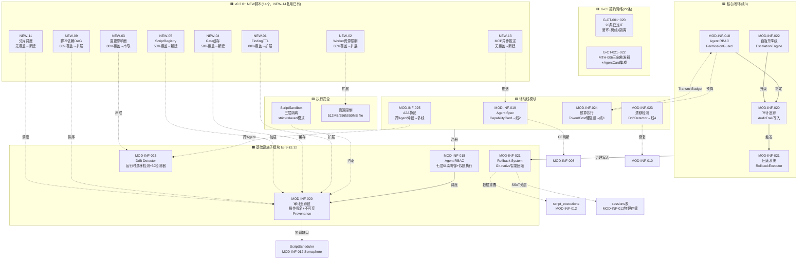
```mermaid
flowchart TB
    subgraph DG_CORE["🟦 核心闭环(线3)"]
        DG_RBAC["MOD-INF-018<br/>Agent RBAC<br/>PermissionGuard"]
        DG_AUDIT["MOD-INF-020<br/>审计追踪<br/>AuditTrail/写入"]
        DG_ROLL["MOD-INF-021<br/>回滚系统<br/>RollbackExecutor"]
        DG_ESC["MOD-INF-022<br/>自治升降级<br/>EscalationEngine"]
    end

    subgraph DG_AUX["🟩 辅助线模块"]
        DG_SPEC["MOD-INF-019<br/>Agent Spec<br/>CapabilityCard→线2"]
        DG_DRIFT["MOD-INF-023<br/>漂移检测<br/>DriftDetector→线4"]
        DG_BUD["MOD-INF-024<br/>预算执行<br/>Token/Cost硬阻断→线1"]
        DG_A2A["MOD-INF-025<br/>A2A协议<br/>跨Agent仲裁↔多线"]
    end

    subgraph DG_INFRA["🟧 基础设施子模块 §3.9-§3.12"]
        DG_REG["MOD-INF-018<br/>Agent RBAC<br/>七层纵深防御+权限执行"]
        DG_SCHED["MOD-INF-020<br/>审计追踪链<br/>操作签名+不可变Provenance"]
        DG_STATE["MOD-INF-021<br/>Rollback System<br/>Git-native智能回滚"]
        DG_COORD["MOD-INF-023<br/>Drift Detector<br/>运行时漂移检测+39检测器"]
    end

    subgraph DG_CONTRACTS["🟥 G-CT契约网络(22条)"]
        DG_CT_OLD["G-CT-001~020<br/>20条已定义<br/>闭环+跨线+隔离"]
        DG_CT_NEW["G-CT-021~022<br/>MTH-006三向触发器+AgentCard集成"]
    end

    subgraph DG_SANDBOX["🟪 执行安全"]
        DG_SBX["ScriptSandbox<br/>三层隔离<br/>strict/relaxed模式"]
        DG_RLIM["资源限制<br/>512MB/256fd/50MB file"]
    end

    subgraph DG_NEW["🟫 v0.3.0+ NEW脚本(14个，NEW-14复用已有)"]
        DG_N01["NEW-01<br/>FindingTTL<br/>80%覆盖→扩展"]
        DG_N02["NEW-02<br/>Worker资源限制<br/>80%覆盖→扩展"]
        DG_N03["NEW-03<br/>变更影响面<br/>80%覆盖→串联"]
        DG_N04["NEW-04<br/>Gate缓存<br/>50%覆盖→新建"]
        DG_N05["NEW-05<br/>ScriptRegistry<br/>50%覆盖→新建"]
        DG_N09["NEW-09<br/>脚本依赖DAG<br/>80%覆盖→扩展"]
        DG_N11["NEW-11<br/>分片调度<br/>无覆盖→新建"]
        DG_N13["NEW-13<br/>MCP异步推送<br/>无覆盖→新建"]
    end

    DG_RBAC -->|判定| DG_AUDIT
    DG_AUDIT -->|触发| DG_ROLL
    DG_ESC -->|升级| DG_AUDIT
    DG_RBAC -.->|预算| DG_BUD
    DG_SPEC -.->|CE刷新| CE["MOD-INF-008"]
    DG_DRIFT -.->|修复| FLE["MOD-INF-010"]
    DG_A2A -.->|跨Agent| DG_COORD

    DG_CORE -->|治理写入| DG_STATE
    DG_AUX -->|注册| DG_REG
    DG_REG -->|调度| DG_SCHED
    DG_SCHED -.->|协调缺口| DB_SCHED["ScriptScheduler<br/>MOD-INF-012 Semaphore"]
    DG_STATE -.->|数据重叠| DB_EXEC["script_executions<br/>MOD-INF-012"]
    DG_STATE -.->|SSoT分层| DB_SESS["sessions表<br/>MOD-INF-012物理存储"]
    DG_SBX -.->|约束| DG_SCHED
    DG_BUD -.->|TransmitBudget| DG_RBAC

    DG_N01 -.->|扩展| DG_SCHED
    DG_N02 -.->|扩展| DG_RLIM
    DG_N03 -.->|串联| DG_COORD
    DG_N04 -.->|缓存| DG_SCHED
    DG_N05 -.->|加载| DG_SCHED
    DG_N09 -.->|排序| DG_SCHED
    DG_N11 -.->|调度| DG_SCHED
    DG_N13 -.->|推送| DG_SPEC
```

### 3.4 MOD-INF-016（共享核心基座·30组件）

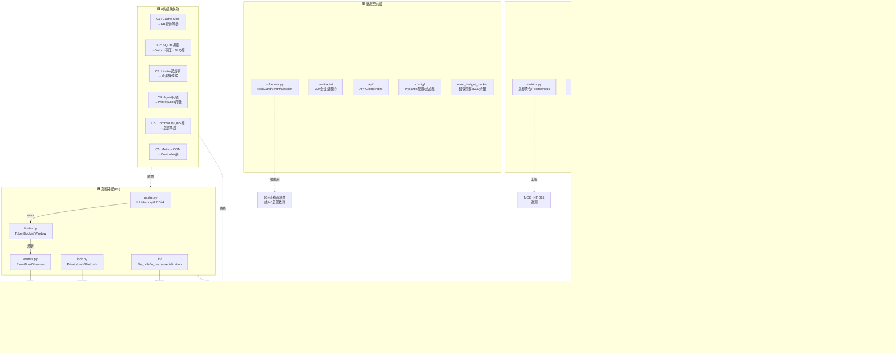
```mermaid
flowchart TB
    subgraph SC_HOT["🟦 高频路径(P0)"]
        SC_CACHE["cache.py<br/>L1 Memory/L2 Disk"]
        SC_LIMIT["limiter.py<br/>TokenBucket/Window"]
        SC_EVENT["events.py<br/>EventBus/Observer"]
        SC_LOCK["lock.py<br/>PriorityLock/FileLock"]
        SC_IO["io/<br/>file_utils/io_cache/serialization"]
    end

    subgraph SC_MID["🟩 中频路径(P1)"]
        SC_OUTBOX["outbox.py<br/>死信队列/DLQ重试"]
        SC_IDEM["IdempotencyStore<br/>幂等性/MD5去重"]
        SC_RESIL["resilience/<br/>熔断/重试/降级"]
        SC_LOG["logging.py<br/>异步日志/RotatingFile"]
        SC_ERR["errors.py<br/>AppError/ErrorCatalog"]
        SC_SEC["security/<br/>capability/secrets"]
    end

    subgraph SC_LOW["🟧 低频路径(P2)"]
        SC_MET["metrics.py<br/>指标聚合/Prometheus"]
        SC_OBSV["observability/<br/>logging/metrics"]
        SC_UTIL["utils/<br/>diff/migration/context/testing"]
        SC_LIFE["lifecycle/<br/>DaemonRegistry/ResourceOptimizer"]
        SC_INFRA["infra/<br/>cache/lock/limiter/outbox/idempotency"]
        SC_SESS_AUDIT["session_audit.py<br/>会话审计/SessionValidator"]
    end

    subgraph SC_DATA["🟥 数据契约层"]
        SC_SCH["schemas.py<br/>TaskCard/Event/Session"]
        SC_CT["contracts/<br/>30+企业级契约"]
        SC_API["api/<br/>API Client/Index"]
        SC_CFG["config/<br/>Pydantic配置/热加载"]
        SC_EBT["error_budget_tracker<br/>错误预算/SLO余量"]
    end

    subgraph SC_CASCADE["🟪 6条级联失效"]
        SC_C1["C1: Cache Miss<br/>→DB查询风暴"]
        SC_C2["C2: SQLite拥塞<br/>→Outbox积压→DLQ爆"]
        SC_C3["C3: Limiter误熔断<br/>→全集群停摆"]
        SC_C4["C4: Agent死锁<br/>→PriorityLock饥饿"]
        SC_C5["C5: ChromaDB QPS爆<br/>→全部降质"]
        SC_C6["C6: Metrics OOM<br/>→Controller崩"]
    end

    SC_CACHE -->|miss| SC_LIMIT
    SC_LIMIT -->|熔断| SC_EVENT
    SC_EVENT -->|emit| SC_OUTBOX
    SC_LOCK -->|跨进程| SC_RESIL
    SC_IO -->|持久化| SC_OUTBOX

    SC_SCH -.->|被引用| ALL["10+消费者模块<br/>线1-6全部依赖"]
    SC_CASCADE -.->|威胁| SC_HOT
    SC_CASCADE -.->|威胁| SC_MID

    SC_HOT -.->|依赖| DB["MOD-INF-012<br/>SQLite/PG"]
    SC_LOG -.->|写入| DB
    SC_MET -.->|上报| TEL["MOD-INF-015<br/>遥测"]
```

### 3.5 MOD-INF-012（数据库双层架构）

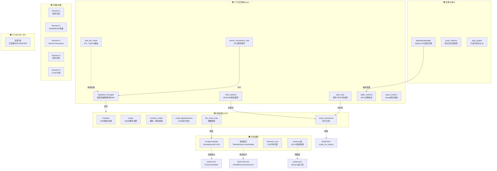
```mermaid
flowchart TB
    subgraph DB_CORE["🟦 7个已实现核心.py"]
        DB_MGR["database_manager<br/>连接池/健康检查/WAL"]
        DB_ROUTER["dual_db_router<br/>PG↔SQLite路由"]
        DB_BATCH["write_batcher<br/>100ms/50条批量写"]
        DB_ATM["atomic_transaction_mgr<br/>2PC跨库事务"]
        DB_TASK["task_repo<br/>任务CRUD/状态机"]
        DB_SQLITE["sqlite_schema<br/>DDL/迁移版本"]
        DB_QMET["query_metrics<br/>Query耗时追踪"]
    end

    subgraph DB_TABLES["🟩 6张新表(v3.0)"]
        DB_T1["modules<br/>1500模块注册"]
        DB_T2["scripts<br/>10000脚本注册"]
        DB_T3["module_scripts<br/>模块→脚本映射"]
        DB_T4["script_dependencies<br/>DAG执行拓扑"]
        DB_T5["file_script_map<br/>增量触发"]
        DB_T6["script_executions<br/>执行记录"]
    end

    subgraph DB_CONCUR["🟧 并发控制"]
        DB_SCHED["ScriptScheduler<br/>Semaphore(40-100)"]
        DB_PRESSURE["系统背压<br/>TokenBucket+ScanDedup"]
        DB_LOCK["Advisory Lock<br/>PG分布式锁"]
        DB_SESS["sessions表<br/>100 AI连接隔离"]
    end

    subgraph DB_MIGR["🟥 迁移与审计"]
        DB_MIG["MigrationManager<br/>SQLite+PG双轨迁移"]
        DB_AUDIT["audit_schema<br/>审计日志表结构"]
        DB_OLAP["olap_engine<br/>只读分析SQLite"]
    end

    subgraph DB_DECISIONS["🟪 5架构决策"]
        DB_D1["Decision 1<br/>双库分层"]
        DB_D2["Decision 2<br/>WriteBatcher批量"]
        DB_D3["Decision 3<br/>AtomicTransaction"]
        DB_D4["Decision 4<br/>双轨迁移"]
        DB_D5["Decision 5<br/>OLAP分离"]
    end

    subgraph DB_CONTRACTS["🟫 CT-DB-001~007"]
        DB_CT["全部7条<br/>已注册MOD-MASTER"]
    end

    DB_MGR -->|读写| DB_TABLES
    DB_ROUTER -.->|离线切换| DB_MGR
    DB_BATCH -->|批量写| DB_T6
    DB_ATM -->|2PC| DB_MGR
    DB_TASK -->|状态机| DB_T6
    DB_T5 -->|触发| DB_SCHED
    DB_MIG -->|版本管理| DB_SQLITE
    DB_SCHED -.->|协调缺口| DG_SCHED["DOM-GOV<br/>Script Scheduler"]
    DB_T6 -.->|重叠| DG_HIST["DOM-GOV<br/>script_run_history"]
    DB_SESS -.->|物理层| DG_SESS["DOM-GOV<br/>Session语义层"]
    DB_PRESSURE -.->|限流信号| SC["MOD-INF-016<br/>GlobalResourceGovernor"]
```

### 3.6 MOD-INF-035（系统大脑·五层同心圆·20子组件）

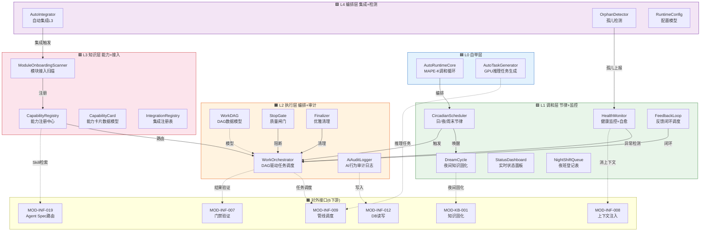
```mermaid
flowchart TB
    subgraph BRAIN_L0["🟦 L0 自举层"]
        BL0_ARC["AutoRuntimeCore<br/>MAPE-K调和循环"]
        BL0_AT["AutoTaskGenerator<br/>GPU推理任务生成"]
    end

    subgraph BRAIN_L1["🟩 L1 调和层 节律+监控"]
        BL1_CS["CircadianScheduler<br/>日/夜/周末节律"]
        BL1_DC["DreamCycle<br/>夜间知识固化"]
        BL1_HM["HealthMonitor<br/>健康监控+自愈"]
        BL1_FL["FeedbackLoop<br/>反馈闭环调度"]
        BL1_DASH["StatusDashboard<br/>实时状态面板"]
        BL1_NS["NightShiftQueue<br/>夜班登记表"]
    end

    subgraph BRAIN_L2["🟧 L2 执行层 编排+审计"]
        BL2_WO["WorkOrchestrator<br/>DAG驱动任务调度"]
        BL2_WD["WorkDAG<br/>DAG数据模型"]
        BL2_AUDIT["AiAuditLogger<br/>AI行为审计日志"]
        BL2_SG["StopGate<br/>质量闸门"]
        BL2_FIN["Finalizer<br/>优雅清理"]
    end

    subgraph BRAIN_L3["🟥 L3 知识层 能力+接入"]
        BL3_CR["CapabilityRegistry<br/>能力注册中心"]
        BL3_CC["CapabilityCard<br/>能力卡片数据模型"]
        BL3_SCAN["ModuleOnboardingScanner<br/>模块接入扫描"]
        BL3_IR["IntegrationRegistry<br/>集成注册表"]
    end

    subgraph BRAIN_L4["🟪 L4 编排层 集成+检测"]
        BL4_AI["AutoIntegrator<br/>自动集成L3"]
        BL4_OD["OrphanDetector<br/>孤儿检测"]
        BL4_RC["RuntimeConfig<br/>配置模型"]
    end

    subgraph BRAIN_EXT["🟫 对外接口(6下游)"]
        BE_DB["MOD-INF-012<br/>DB读写"]
        BE_CE["MOD-INF-008<br/>上下文注入"]
        BE_PIPE["MOD-INF-009<br/>管线调度"]
        BE_GATE["MOD-INF-007<br/>门禁验证"]
        BE_KB["MOD-KB-001<br/>知识固化"]
        BE_SPEC["MOD-INF-019<br/>Agent Spec路由"]
    end

    BL0_ARC -->|编排| BL1_CS
    BL1_CS -->|唤醒| BL1_DC
    BL1_CS -->|触发| BL2_WO
    BL1_HM -->|异常检测| BL2_WO
    BL1_FL -->|闭环| BL2_WO
    BL3_SCAN -->|注册| BL3_CR
    BL3_CR -->|路由| BL2_WO
    BL4_AI -->|集成触发| BL3_SCAN
    BL4_OD -->|孤儿上报| BL1_HM
    BL2_WD -.->|模型| BL2_WO
    BL2_SG -->|阻断| BL2_WO
    BL2_FIN -->|清理| BL2_WO

    BL2_WO -.->|任务调度| BE_PIPE
    BL2_AUDIT -.->|写入| BE_DB
    BL1_DC -.->|夜间固化| BE_KB
    BL2_WO -.->|结果验证| BE_GATE
    BL3_CR -.->|Skill检索| BE_SPEC
    BL1_HM -.->|消上下文| BE_CE
    BL0_AT -.->|推理任务| BE_PIPE

    style BRAIN_L0 fill:#e3f2fd,stroke:#1565c0
    style BRAIN_L1 fill:#e8f5e9,stroke:#2e7d32
    style BRAIN_L2 fill:#fff3e0,stroke:#e65100
    style BRAIN_L3 fill:#fce4ec,stroke:#c62828
    style BRAIN_L4 fill:#f3e5f5,stroke:#6a1b9a
```

### 3.7 L08 人机交互层（C轨 T0先行）

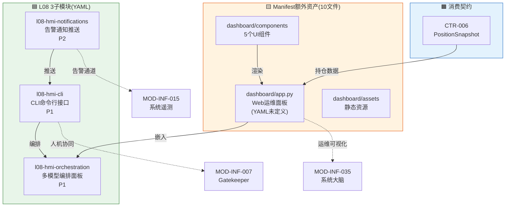
```mermaid
flowchart TB
    subgraph L08_CORE["🟦 L08 3子模块(YAML)"]
        L08_CLI["l08-hmi-cli<br/>CLI命令行接口<br/>P1"]
        L08_ORCH["l08-hmi-orchestration<br/>多模型编排面板<br/>P1"]
        L08_NOTIF["l08-hmi-notifications<br/>告警通知推送<br/>P2"]
    end

    subgraph L08_EXTRA["🟨 Manifest额外资产(10文件)"]
        L08_DASH["dashboard/app.py<br/>Web运维面板<br/>(YAML未定义)"]
        L08_DC1["dashboard/components<br/>5个UI组件"]
        L08_DC2["dashboard/assets<br/>静态资源"]
    end

    subgraph L08_CONTRACTS["🟫 消费契约"]
        L08_CT006["CTR-006<br/>PositionSnapshot"]
    end

    L08_CLI -->|编排| L08_ORCH
    L08_NOTIF -->|推送| L08_CLI
    L08_DASH -->|嵌入| L08_ORCH
    L08_DC1 -->|渲染| L08_DASH
    L08_CT006 -->|持仓数据| L08_DASH

    L08_DASH -.->|运维可视化| BE_BRAIN["MOD-INF-035<br/>系统大脑"]
    L08_CLI -.->|人机协同| BE_GATE["MOD-INF-007<br/>Gatekeeper"]
    L08_NOTIF -.->|告警通道| BE_TELE["MOD-INF-015<br/>系统遥测"]

    style L08_CORE fill:#e8f5e9,stroke:#2e7d32
    style L08_EXTRA fill:#fff3e0,stroke:#e65100
    style L08_CONTRACTS fill:#e3f2fd,stroke:#1565c0
```

### 3.8 L00 数据接入层（C轨 T0先行）

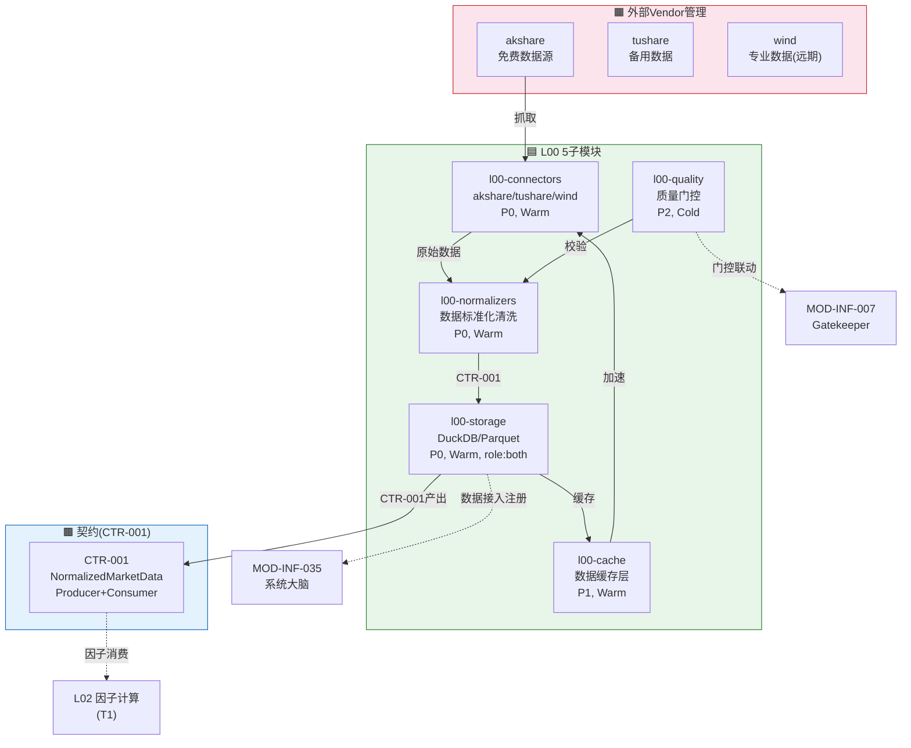
```mermaid
flowchart TB
    subgraph L00_CORE["🟦 L00 5子模块"]
        L00_CONN["l00-connectors<br/>akshare/tushare/wind<br/>P0, Warm"]
        L00_NORM["l00-normalizers<br/>数据标准化清洗<br/>P0, Warm"]
        L00_STOR["l00-storage<br/>DuckDB/Parquet<br/>P0, Warm, role:both"]
        L00_CACHE["l00-cache<br/>数据缓存层<br/>P1, Warm"]
        L00_QUAL["l00-quality<br/>质量门控<br/>P2, Cold"]
    end

    subgraph L00_CTR["🟫 契约(CTR-001)"]
        L00_CTR1["CTR-001<br/>NormalizedMarketData<br/>Producer+Consumer"]
    end

    subgraph L00_VENDORS["🟧 外部Vendor管理"]
        L00_AK["akshare<br/>免费数据源"]
        L00_TS["tushare<br/>备用数据"]
        L00_WD["wind<br/>专业数据(远期)"]
    end

    L00_AK -->|抓取| L00_CONN
    L00_CONN -->|原始数据| L00_NORM
    L00_NORM -->|CTR-001| L00_STOR
    L00_STOR -->|缓存| L00_CACHE
    L00_QUAL -->|校验| L00_NORM
    L00_CACHE -->|加速| L00_CONN
    L00_STOR -->|CTR-001产出| L00_CTR1

    L00_CTR1 -.->|因子消费| CL_L02["L02 因子计算<br/>(T1)"]
    L00_STOR -.->|数据接入注册| BE_BRAIN["MOD-INF-035<br/>系统大脑"]
    L00_QUAL -.->|门控联动| BE_GATE["MOD-INF-007<br/>Gatekeeper"]

    style L00_CORE fill:#e8f5e9,stroke:#2e7d32
    style L00_VENDORS fill:#fce4ec,stroke:#c62828
    style L00_CTR fill:#e3f2fd,stroke:#1565c0
```

### 3.9 L06 交易执行层（C轨 T0先行）

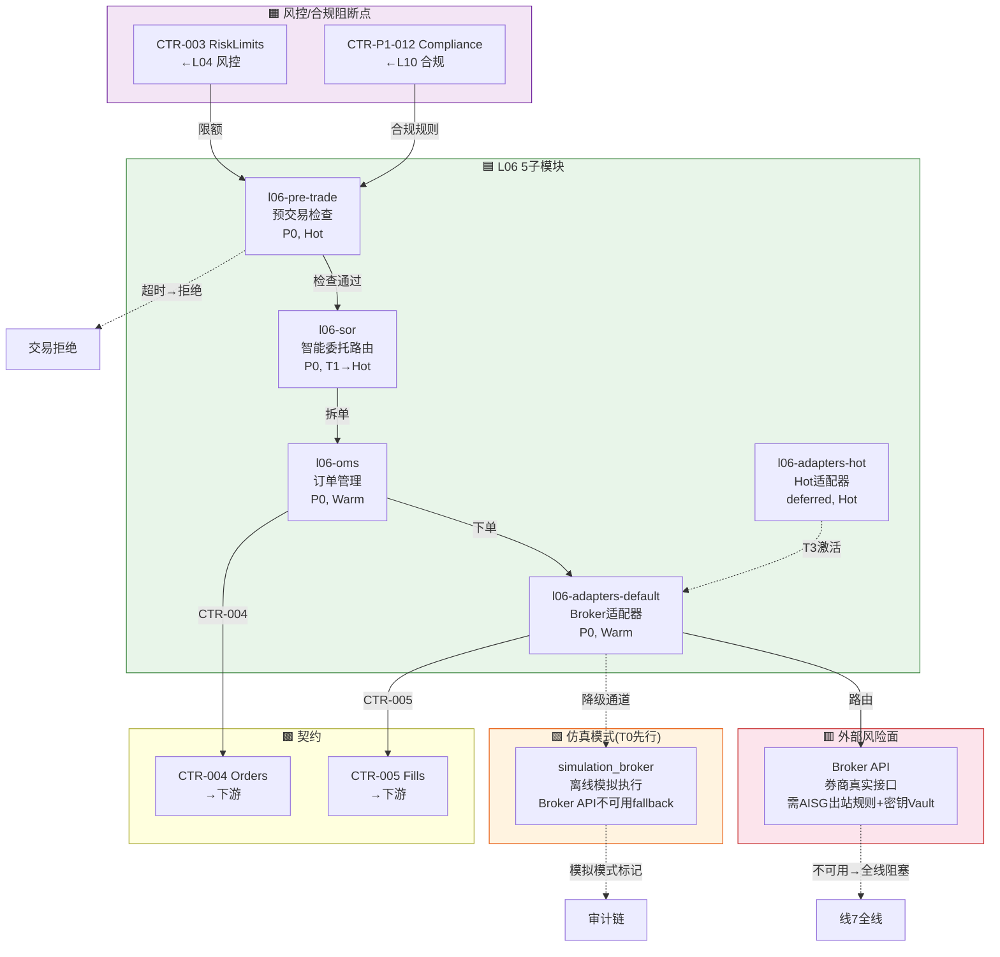
```mermaid
flowchart TB
    subgraph L06_CORE["🟦 L06 5子模块"]
        L06_OMS["l06-oms<br/>订单管理<br/>P0, Warm"]
        L06_SOR["l06-sor<br/>智能委托路由<br/>P0, T1→Hot"]
        L06_PRE["l06-pre-trade<br/>预交易检查<br/>P0, Hot"]
        L06_ADEF["l06-adapters-default<br/>Broker适配器<br/>P0, Warm"]
        L06_AHOT["l06-adapters-hot<br/>Hot适配器<br/>deferred, Hot"]
    end

    subgraph L06_SIM["🟩 仿真模式(T0先行)"]
        L06_SIMB["simulation_broker<br/>离线模拟执行<br/>Broker API不可用fallback"]
    end

    subgraph L06_CHECKS["🟧 风控/合规阻断点"]
        L06_CT003["CTR-003 RiskLimits<br/>←L04 风控"]
        L06_CT012["CTR-P1-012 Compliance<br/>←L10 合规"]
    end

    subgraph L06_CONTRACTS["🟫 契约"]
        L06_CT004["CTR-004 Orders<br/>→下游"]
        L06_CT005["CTR-005 Fills<br/>→下游"]
    end

    subgraph L06_EXTERNAL["🟥 外部风险面"]
        L06_BAPI["Broker API<br/>券商真实接口<br/>需AISG出站规则+密钥Vault"]
    end

    L06_SOR -->|拆单| L06_OMS
    L06_PRE -->|检查通过| L06_SOR
    L06_OMS -->|下单| L06_ADEF
    L06_ADEF -->|路由| L06_BAPI
    L06_CT003 -->|限额| L06_PRE
    L06_CT012 -->|合规规则| L06_PRE
    L06_ADEF -.->|降级通道| L06_SIMB
    L06_OMS -->|CTR-004| L06_CT004
    L06_ADEF -->|CTR-005| L06_CT005
    L06_AHOT -.->|T3激活| L06_ADEF

    L06_BAPI -.->|不可用→全线阻塞| CL_ALL["线7全线"]
    L06_PRE -.->|超时→拒绝| CL_ORD["交易拒绝"]
    L06_SIMB -.->|模拟模式标记| BE_AUDIT["审计链"]

    style L06_CORE fill:#e8f5e9,stroke:#2e7d32
    style L06_SIM fill:#fff3e0,stroke:#e65100
    style L06_EXTERNAL fill:#fce4ec,stroke:#c62828
    style L06_CHECKS fill:#f3e5f5,stroke:#6a1b9a
```

### 3.10 L04 风险管理层（C轨 T1核心）

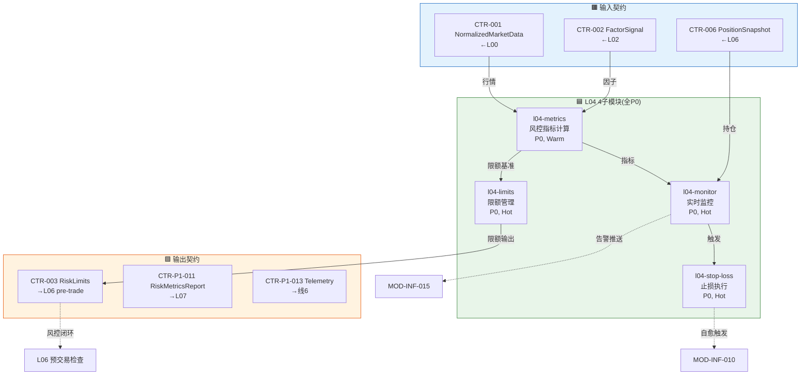
```mermaid
flowchart TB
    subgraph L04_CORE["🟦 L04 4子模块(全P0)"]
        L04_MET["l04-metrics<br/>风控指标计算<br/>P0, Warm"]
        L04_LIM["l04-limits<br/>限额管理<br/>P0, Hot"]
        L04_STOP["l04-stop-loss<br/>止损执行<br/>P0, Hot"]
        L04_MON["l04-monitor<br/>实时监控<br/>P0, Hot"]
    end

    subgraph L04_IN["🟫 输入契约"]
        L04_C001["CTR-001 NormalizedMarketData<br/>←L00"]
        L04_C002["CTR-002 FactorSignal<br/>←L02"]
        L04_C006["CTR-006 PositionSnapshot<br/>←L06"]
    end

    subgraph L04_OUT["🟩 输出契约"]
        L04_O003["CTR-003 RiskLimits<br/>→L06 pre-trade"]
        L04_O011["CTR-P1-011 RiskMetricsReport<br/>→L07"]
        L04_O013["CTR-P1-013 Telemetry<br/>→线6"]
    end

    L04_MET -->|指标| L04_MON
    L04_MET -->|限额基准| L04_LIM
    L04_MON -->|触发| L04_STOP
    L04_LIM -->|限额输出| L04_O003
    L04_C001 -->|行情| L04_MET
    L04_C002 -->|因子| L04_MET
    L04_C006 -->|持仓| L04_MON

    L04_O003 -.->|风控闭环| CL_L06C["L06 预交易检查"]
    L04_STOP -.->|自愈触发| BE_HEAL["MOD-INF-010"]
    L04_MON -.->|告警推送| BE_TELE["MOD-INF-015"]

    style L04_CORE fill:#e8f5e9,stroke:#2e7d32
    style L04_IN fill:#e3f2fd,stroke:#1565c0
    style L04_OUT fill:#fff3e0,stroke:#e65100
```

### 3.11 L02 Alpha因子层（C轨 T1核心）

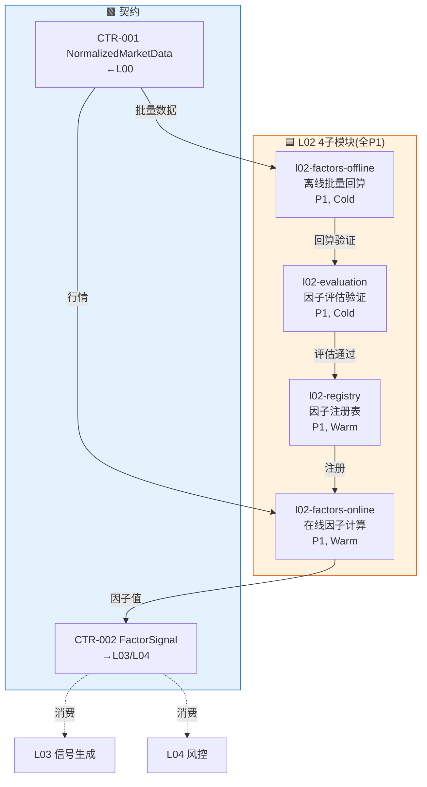
```mermaid
flowchart TB
    subgraph L02_CORE["🟦 L02 4子模块(全P1)"]
        L02_ON["l02-factors-online<br/>在线因子计算<br/>P1, Warm"]
        L02_OFF["l02-factors-offline<br/>离线批量回算<br/>P1, Cold"]
        L02_EVAL["l02-evaluation<br/>因子评估验证<br/>P1, Cold"]
        L02_REG["l02-registry<br/>因子注册表<br/>P1, Warm"]
    end

    subgraph L02_CTR["🟫 契约"]
        L02_C001["CTR-001 NormalizedMarketData<br/>←L00"]
        L02_P002["CTR-002 FactorSignal<br/>→L03/L04"]
    end

    L02_C001 -->|行情| L02_ON
    L02_C001 -->|批量数据| L02_OFF
    L02_ON -->|因子值| L02_P002
    L02_OFF -->|回算验证| L02_EVAL
    L02_EVAL -->|评估通过| L02_REG
    L02_REG -->|注册| L02_ON

    L02_P002 -.->|消费| CL_L03["L03 信号生成"]
    L02_P002 -.->|消费| CL_L04["L04 风控"]

    style L02_CORE fill:#fff3e0,stroke:#e65100
    style L02_CTR fill:#e3f2fd,stroke:#1565c0
```

### 3.12 L05 组合构建层（C轨 T1核心）

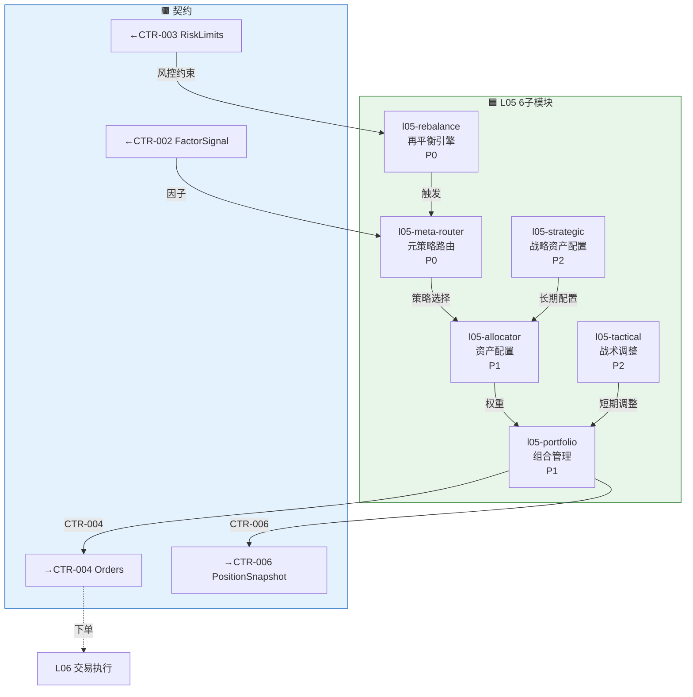
```mermaid
flowchart TB
    subgraph L05_CORE["🟦 L05 6子模块"]
        L05_REB["l05-rebalance<br/>再平衡引擎<br/>P0"]
        L05_META["l05-meta-router<br/>元策略路由<br/>P0"]
        L05_ALLOC["l05-allocator<br/>资产配置<br/>P1"]
        L05_PORT["l05-portfolio<br/>组合管理<br/>P1"]
        L05_STRAT["l05-strategic<br/>战略资产配置<br/>P2"]
        L05_TACT["l05-tactical<br/>战术调整<br/>P2"]
    end

    subgraph L05_CTR["🟫 契约"]
        L05_C002["←CTR-002 FactorSignal"]
        L05_C003["←CTR-003 RiskLimits"]
        L05_P004["→CTR-004 Orders"]
        L05_P006["→CTR-006 PositionSnapshot"]
    end

    L05_META -->|策略选择| L05_ALLOC
    L05_REB -->|触发| L05_META
    L05_ALLOC -->|权重| L05_PORT
    L05_STRAT -->|长期配置| L05_ALLOC
    L05_TACT -->|短期调整| L05_PORT
    L05_C002 -->|因子| L05_META
    L05_C003 -->|风控约束| L05_REB
    L05_PORT -->|CTR-004| L05_P004
    L05_PORT -->|CTR-006| L05_P006

    L05_P004 -.->|下单| CL_L06["L06 交易执行"]

    style L05_CORE fill:#e8f5e9,stroke:#2e7d32
    style L05_CTR fill:#e3f2fd,stroke:#1565c0
```

### 3.13 L11 ML平台（C轨 T1核心）

```mermaid
flowchart TB
    subgraph L11_CORE["🟦 L11 6子模块"]
        L11_TR["l11-training<br/>模型训练<br/>P1, Cold"]
        L11_VAL["l11-validation<br/>模型验证<br/>P2, Cold"]
        L11_SD["l11-serving-default<br/>默认推理<br/>P1, Warm"]
        L11_SH["l11-serving-hot<br/>高频推理<br/>P1, T3→Hot"]
        L11_EVAL["l11-evaluation<br/>模型评估<br/>P2, Cold"]
        L11_SCT["l11-scout<br/>Scout Agent<br/>P2"]
    end

    subgraph L11_CTR["🟫 契约"]
        L11_MP["ModelPrediction<br/>→L02/L05"]
        L11_CT006["CTR-006 PositionSnapshot<br/>←消费"]
        L11_CT013["CTR-P1-013 Telemetry<br/>→线6"]
    end

    subgraph L11_EXTERNAL["🟥 Scout外部访问"]
        L11_ARX["arXiv/SSRN/GitHub<br/>需AISG出站白名单"]
    end

    L11_TR -->|模型| L11_VAL
    L11_VAL -->|验证通过| L11_SD
    L11_SD -->|升级| L11_SH
    L11_EVAL -->|监控| L11_SD
    L11_SD -->|推理| L11_MP
    L11_SCT -->|资讯喂入| L11_TR
    L11_SCT -->|抓取| L11_ARX

    L11_MP -.->|因子增强| CL_L02["L02 因子"]
    L11_MP -.->|组合增强| CL_L05["L05 组合"]

    style L11_CORE fill:#e8f5e9,stroke:#2e7d32
    style L11_CTR fill:#e3f2fd,stroke:#1565c0
    style L11_EXTERNAL fill:#fce4ec,stroke:#c62828
```

### 3.14 C轨线7 子模块级全览（三梯队总图）

```mermaid
flowchart LR
    subgraph T0["🟢 T0先行(3层)"]
        L00_S["L00 数据接入<br/>5子模块"]
        L06_S["L06 交易执行<br/>5+1子模块"]
        L08_S["L08 人机交互<br/>3+1子模块"]
    end

    subgraph T1["🟡 T1核心(4层)"]
        L02_S["L02 Alpha因子<br/>4子模块"]
        L04_S["L04 风险管理<br/>4子模块(全P0)"]
        L05_S["L05 组合构建<br/>6子模块"]
        L11_S["L11 ML平台<br/>6子模块"]
    end

    subgraph T2["🔴 T2+延后(5层)"]
        L03_S["L03 信号生成<br/>3子模块"]
        L07_S["L07 盘后分析<br/>3子模块"]
        L09_S["L09 研究创新<br/>3子模块"]
        L10_S["L10 合规<br/>3子模块"]
        L13_S["L13 实验管线<br/>4子模块"]
    end

    subgraph B_TRACK["🟦 B轨集成点"]
        INF_035["MOD-INF-035<br/>系统大脑"]
        INF_010["MOD-INF-010<br/>自愈引擎"]
        INF_020["MOD-INF-020<br/>审计追踪"]
        INF_013["MOD-INF-013<br/>MCP服务器"]
    end

    L00_S -->|CTR-001| L02_S
    L02_S -->|CTR-002| L04_S
    L02_S -->|CTR-002| L03_S
    L03_S -->|Signal| L05_S
    L05_S -->|CTR-004| L06_S
    L06_S -->|CTR-006| L04_S
    L06_S -->|CTR-005| L07_S
    L04_S -->|CTR-003| L06_S
    L11_S -.->|ModelPrediction| L02_S
    L11_S -.->|ModelPrediction| L05_S
    L09_S -.->|因子发现| L02_S
    L09_S -->|实验| L13_S
    L10_S -.->|CTR-P1-012| L04_S
    L10_S -.->|CTR-P1-012| L06_S

    L00_S -.->|数据接入注册| INF_035
    L04_S -.->|风控告警| INF_010
    L06_S -.->|Broker安全| INF_013
    L07_S -.->|审计写入| INF_020

    style T0 fill:#e8f5e9,stroke:#2e7d32
    style T1 fill:#fff3e0,stroke:#e65100
    style T2 fill:#fce4ec,stroke:#c62828
    style B_TRACK fill:#e3f2fd,stroke:#1565c0
```

### 3.15 审计系统五层架构（L0证据采集→L1分析引擎→L2编排调度→L3执行→L4知识反馈）

```mermaid
flowchart TB
    subgraph AUDIT_L0["🟦 L0 证据采集层"]
        SRC_LOGGER["AiAuditLogger<br/>唯一写入入口"]
        SRC_EVENTS["MOD-INF-012.events<br/>不可变权威存储<br/>P99&lt;10ms"]
        SRC_GATE["MOD-INF-007<br/>Gate Engine<br/>法证哈希链"]
    end

    subgraph AUDIT_L1["🟩 L1 分析引擎层（三类正交）"]
        L1_STRUCT["027内建结构审计<br/>17维度规则引擎<br/>100%确定性"]
        L1_SEM["MOD-INF-028<br/>SemanticAuditor<br/>F+G语义触发<br/>peer服务"]
        L1_BEH["MOD-INF-033<br/>BehavioralAuditor<br/>BH-001~005<br/>行为审计唯一真源"]
    end

    subgraph AUDIT_L2["🟥 L2 编排调度层"]
        ORCH_027["MOD-INF-027<br/>AuditOrchestrator<br/>纯调度零业务逻辑<br/>MAPE-K四阶段"]
    end

    subgraph AUDIT_L3["🟧 L3 执行层"]
        L3_OJ["MOD-INF-029<br/>OrphanJudge<br/>只判不执"]
        L3_FIX["MOD-INF-031<br/>AutoFixEngine<br/>结构修复"]
        L3_RB["MOD-INF-030<br/>RedBlueValidator<br/>只验证不修复"]
    end

    subgraph AUDIT_EXPORT["🟪 导出视图(非独立存储)"]
        EXP_L10["L10 policy_decision_ledger<br/>events表JSONL物化"]
        EXP_020["MOD-INF-020 审计追踪链<br/>events表查询视图"]
    end

    SRC_LOGGER -->|同步写| SRC_EVENTS
    SRC_EVENTS -->|事件流| L1_STRUCT
    SRC_EVENTS -->|事件流| L1_SEM
    SRC_EVENTS -->|事件流| L1_BEH
    SRC_GATE -->|许可矩阵| L1_BEH
    L1_STRUCT -->|结构Finding| ORCH_027
    L1_SEM -->|语义Finding| ORCH_027
    L1_BEH -->|行为Finding| ORCH_027
    ORCH_027 -->|孤儿判定| L3_OJ
    ORCH_027 -->|修复指令| L3_FIX
    ORCH_027 -->|验证指令| L3_RB
    L3_OJ -->|Judgment| L3_FIX
    L3_RB -->|绕过修复| L3_FIX
    L3_FIX -->|修复结果| ORCH_027
    L3_RB -->|验证结果| ORCH_027
    SRC_EVENTS -->|物化导出| EXP_L10
    SRC_EVENTS -->|查询视图| EXP_020

    ORCH_027 -.->|SLO监控| BE_TELE["MOD-INF-015<br/>系统遥测"]
    L1_SEM -.->|语义修复闭环| L1_SEM_SH["SelfHealer<br/>028内部闭环"]

    style AUDIT_L0 fill:#e8f5e9,stroke:#2e7d32
    style AUDIT_L1 fill:#e3f2fd,stroke:#1565c0
    style AUDIT_L2 fill:#fce4ec,stroke:#c62828
    style AUDIT_L3 fill:#fff3e0,stroke:#e65100
    style AUDIT_EXPORT fill:#f3e5f5,stroke:#9c27b0
```

### 3.16 权限判定链（五步串联）

```mermaid
flowchart LR
    subgraph PERM_S1["① Agent身份"]
        S1_RBAC["MOD-INF-018<br/>Agent RBAC<br/>角色验证"]
    end

    subgraph PERM_S2["② 能力授权"]
        S2_CBAC["MOD-MASTER-004 §十五<br/>CBAC能力矩阵<br/>48项能力授权"]
    end

    subgraph PERM_S3["③ 门禁评估"]
        S3_GATE["MOD-INF-007<br/>Gatekeeper<br/>唯一放行决策点<br/>44条规则评估"]
        S3_CONCUR["MOD-INF-016<br/>PermissionGuard<br/>并发原语(非决策者)"]
    end

    subgraph PERM_S4["④ 合规检查"]
        S4_COMP["L10 Compliance<br/>CTR-P1-012<br/>合规规则求值"]
    end

    subgraph PERM_S5["⑤ 审计记录"]
        S5_AUDIT["AiAuditLogger<br/>全链路事件<br/>写入events表"]
    end

    S1_RBAC -->|身份确认| S2_CBAC
    S2_CBAC -->|能力清单| S3_GATE
    S3_CONCUR -->|AbstractLock| S3_GATE
    S3_GATE -->|放行| S4_COMP
    S4_COMP -->|合规通过| S5_AUDIT
    S5_AUDIT -->|审计记录| PERM_DB["MOD-INF-012<br/>events表"]

    S3_GATE -.->|拒绝→阻断| REJ["退回Agent<br/>写入拒绝审计"]
    S4_COMP -.->|合规违规→同步阻断| S3_GATE

    style PERM_S1 fill:#e8f5e9,stroke:#2e7d32
    style PERM_S2 fill:#e3f2fd,stroke:#1565c0
    style PERM_S3 fill:#fff3e0,stroke:#e65100
    style PERM_S4 fill:#f3e5f5,stroke:#6a1b9a
    style PERM_S5 fill:#fce4ec,stroke:#c62828
```

### 3.17 调度权归属

```mermaid
flowchart TB
    subgraph SCHED_CORE["🟦 调度SSoT"]
        SCHED_SS["MOD-INF-012<br/>ScriptScheduler<br/>Semaphore(40-100)<br/>唯一调度入口"]
        SCHED_PQ["PriorityQueue<br/>4级优先级"]
    end

    subgraph TASK_CORE["🟩 任务状态机"]
        TASK_TR["MOD-INF-006<br/>TaskRepository<br/>10状态状态机<br/>tasks表唯一写入口"]
        TASK_CT["CT-TASK-001~005<br/>已注册MOD-MASTER-001"]
    end

    subgraph CONSUMERS["🟧 调度消费者"]
        CONS_PIPE["MOD-INF-009<br/>PipelineOrchestrator<br/>DAG编排"]
        CONS_GOV["DOM-GOV<br/>治理扫描<br/>预留8槽位"]
        CONS_ROLL["RollbackExecutor<br/>乐观锁(version字段)"]
    end

    subgraph SCALE["🟪 容量感知"]
        SCALE_DD["DD150 Scale Contract<br/>感知Semaphore上限"]
    end

    SCHED_SS -->|优先级调度| SCHED_PQ
    SCHED_PQ -->|分配槽位| CONS_PIPE
    SCHED_PQ -->|governance槽位| CONS_GOV
    TASK_TR -->|状态变更| SCHED_SS
    CONS_PIPE -->|任务提交| TASK_TR
    CONS_GOV -->|扫描结果| TASK_TR
    CONS_ROLL -->|乐观锁写| TASK_TR
    SCALE_DD -->|容量约束| SCHED_SS

    style SCHED_CORE fill:#e8f5e9,stroke:#2e7d32
    style TASK_CORE fill:#e3f2fd,stroke:#1565c0
    style CONSUMERS fill:#fff3e0,stroke:#e65100
```

### 3.18 Alpha信号域内部数据流

```mermaid
flowchart TB
    subgraph DOMAIN["🟪 ALPHA-SIGNAL-DOMAIN-001"]
        L02["L02 Alpha因子层"]
        L03["L03 信号生成层"]
        L04["L04 风险管理层"]
        L06["L06 交易执行层"]
    end

    L02 -->|"因子值流"| L03
    L03 -->|"信号触发"| L04
    L04 -->|"风控通过→下单"| L06
    L04 -->|"风控拒绝→阻断"| L02

    MOD-INF-035["MOD-INF-035<br/>系统大脑"] -->|"调度指令"| L02
    MOD-INF-011["MOD-INF-011<br/>向量记忆"] -->|"因子语义检索"| L02
    MOD-KB-001["MOD-KB-001<br/>知识库"] -->|"因子知识"| L02
    MOD-INF-015["MOD-INF-015<br/>系统遥测"] -->|"容量感知"| L04

    L06 -->|"PositionSnapshot"| MOD-INF-027["MOD-INF-027<br/>审计总控"]
    L04 -->|"风控事件"| MOD-INF-027

    style DOMAIN fill:#f3e5f5,stroke:#6a1b9a
```

### 3.19 ML实验域内部数据流

```mermaid
flowchart TB
    subgraph DOMAIN["🟪 ML-EXPERIMENT-DOMAIN-001"]
        L11["L11 ML平台层"]
        L13["L13 实验管线层"]
        L09["L09 研究创新层"]
    end

    L09 -->|"研究假设"| L11
    L11 -->|"模型产出"| L13
    L13 -->|"冠军模型→部署"| L11
    L13 -->|"实验结论→新假设"| L09

    MOD-INF-035["MOD-INF-035<br/>系统大脑"] -->|"调度指令"| L11
    MOD-INF-011["MOD-INF-011<br/>向量记忆"] -->|"模型语义检索"| L11
    MOD-KB-001["MOD-KB-001<br/>知识库"] -->|"实验知识"| L13
    L02["L02 Alpha因子层"] -->|"因子特征"| L11

    L11 -->|"模型服务指标"| MOD-INF-015["MOD-INF-015<br/>系统遥测"]
    L13 -->|"实验审计日志"| MOD-INF-027["MOD-INF-027<br/>审计总控"]

    style DOMAIN fill:#f3e5f5,stroke:#6a1b9a
```

### 3.20 系统重组总蓝图内部数据流

```mermaid
flowchart TB
    subgraph DOMAIN["🟫 GOV-FSTR-001"]
        SCAN["重组扫描器"]
        PLAN["重组规划器"]
        EXEC["重组执行器"]
        VERIFY["重组验证器"]
    end

    SCAN -->|"搬迁需求"| PLAN
    PLAN -->|"搬迁计划"| EXEC
    EXEC -->|"搬迁结果"| VERIFY
    VERIFY -->|"校验失败→回滚"| EXEC

    MOD-INF-023["MOD-INF-023<br/>漂移检测器"] -->|"蓝图vs代码偏差"| SCAN
    MOD-INF-029["MOD-INF-029<br/>孤儿判定器"] -->|"孤儿文件"| SCAN
    DOM-GOV-001["DOM-GOV-001<br/>治理域"] -->|"重组策略"| PLAN

    EXEC -->|"注册表更新"| MOD-INF-012["MOD-INF-012<br/>数据库"]
    EXEC -->|"manifest更新"| scripts["scripts/<br/>script_manifest.yaml"]
    VERIFY -->|"重组审计"| MOD-INF-027["MOD-INF-027<br/>审计总控"]

    style DOMAIN fill:#efebe9,stroke:#4e342e
```

---

## §4 跨线交叉点

| 编号 | 交叉点 | 源线 → 目标线 | 触发条件 | 数据流 | 容量影响 |
|------|--------|-------------|---------|--------|---------|
| X-01 | 门禁→权限 | 线1 → 线3 | 任务过门禁 | 门禁判定请求 → RBAC权限查询 | 700次/秒 |
| X-02 | 任务→上下文 | 线1 → 线2 | 任务需要AI上下文 | 上下文需求 → 上下文注入 | 400次/分钟 |
| X-03 | LLM→预算 | 线2 → 线3 | LLM调用过安全网关 | 安全检查 + 预算检查 | 900次/调用 |
| X-04 | 自愈→任务 | 线4 → 线1 | 自愈产生新任务 | 修复指令 → 新任务卡 | 异常量100× |
| X-05 | 自愈→审计 | 线4 → 线5 | 自愈过程需审计 | 修复记录 → 审计日志 | 异常量100× |
| X-06 | 容量→自愈 | 线6 → 线4 | 容量超限 | SLI越界 → 反馈触发 | 容量告警频率100× |
| X-07 | 预算→容量 | 线3 → 线6 | 预算耗尽 | 预算告警 → 容量保障 | 全局预算池争抢 |
| X-08 | 审计→自愈 | 线5 → 线4 | 审计发现异常 | 孤儿/语义断裂 → 修复触发 | 与模块数成正比 |
| X-09 | 数据脊 | DB ↔ ALL | 任何模块读写数据 | 全系统唯一结构化数据真源 | PG连接池50+WriteBatcher 2000rps |

```mermaid
flowchart LR
    V1["线1<br/>任务执行"]
    V2["线2<br/>AI认知"]
    V3["线3<br/>治理闭环"]
    V4["线4<br/>自愈反馈"]
    V5["线5<br/>审计合规"]
    V6["线6<br/>运维保障"]
    V7["线7<br/>业务价值"]
    DB[("🗄️ DB<br/>MOD-INF-012")]

    V1 -->|"X-01"| V3
    V1 -->|"X-02"| V2
    V2 -->|"X-03"| V3
    V4 -->|"X-04"| V1
    V4 -->|"X-05"| V5
    V6 -->|"X-06"| V4
    V3 -->|"X-07"| V6
    V5 -->|"X-08"| V4
    V7 -.->|"blocked"| V1
    V1 & V2 & V3 & V4 & V5 & V6 & V7 -.->|"X-09"| DB

    style V1 fill:#e8f5e9,stroke:#4caf50
    style V2 fill:#e3f2fd,stroke:#2196f3
    style V3 fill:#fce4ec,stroke:#e91e63
    style V4 fill:#fff3e0,stroke:#ff9800
    style V5 fill:#f3e5f5,stroke:#9c27b0
    style V6 fill:#e0f7fa,stroke:#00bcd4
    style V7 fill:#efebe9,stroke:#795548,stroke-dasharray: 5 5
    style DB fill:#ffecb3,stroke:#ffc107,stroke-width:2px
```

---

## §5 模块归属表

| 模块ID | 中文名 | 代码路径 | 蓝图路径 | 层级 | 价值流线 | 线内角色 | 管理权 | 决策权 | 被依赖线 | 生命周期 | 备注 |
|--------|-------|------|------|------|---------|---------|--------|--------|---------|---------|------|
| SYS-MASTER-001 | 系统总蓝图 | docs/03_modules/_sys-master/ | docs/03_modules/_sys-master/blueprint.md | 元层(L0) | — | 全局架构约束 | Owner | ARB终裁 | 线1-7 | stable | |
| MOD-INF-016 | 共享核心 | src/zephyr/shared/ + core/ | docs/03_modules/_cross_layer/shared-core/blueprint.md | 共享基座 | — | 公共工具箱 | MOD-MASTER-001 | MOD-MASTER-001 | 线1-7 | stable | |
| MOD-INF-012 | 数据库 | src/zephyr/db/ | docs/03_modules/_cross_layer/database/blueprint.md | 共享基座 | — | 数据持久化+脚本注册+增量扫描+Session管理+分布式锁 | MOD-MASTER-001 | MOD-MASTER-001 | 线1-7 | stable | |
| MOD-INF-035 | 系统大脑 | src/zephyr/runtime/ | docs/03_modules/_cross_layer/auto-runtime-core/blueprint.md | 共享基座 | — | 全局调度中心 | MOD-MASTER-001 | MOD-MASTER-001 | 线1-7 | stable | MOD-INF-035 ⊂ MOD-INF-002 |
| MOD-INF-002 | 运行时集成 | src/zephyr/_cross_layer/ | docs/03_modules/l01_infrastructure/runtime-integration/blueprint.md | 共享基座 | — | 运行时桥接 | MOD-MASTER-001 | MOD-MASTER-001 | 线1-7 | stable | |
| MOD-INF-013 | MCP服务器 | src/zephyr/mcp/ | docs/03_modules/_cross_layer/mcp-servers/blueprint.md | 共享基座 | — | 对外接口层 | MOD-MASTER-001 | MOD-MASTER-001 | 线1-7 | stable | |
| MOD-MASTER-001 | 集成闭环总蓝图 | docs/03_modules/_master-blueprint/ | docs/03_modules/_master-blueprint/blueprint.md | 跨层 | — | 基础设施域跨层集成契约(85条CT-*) | Owner | ARB终裁 | 线1-7 | stable | |
| DOM-GOV-001 | 治理域集成蓝图 | docs/03_modules/_domain-governance/ | docs/03_modules/_domain-governance/blueprint.md | 域层(L1) | 线3 | 治理域集成契约(G-CT-001~022) + NEW-01~15(v0.3.0+) | Owner | ARB终裁 | 线3/5/6 | evolving | 容量升级已拆分至DOM-GOV-CAP-001 |
| DOM-GOV-CAP-001 | 治理域容量升级蓝图 | docs/03_modules/_domain-governance/capacity-upgrade/ | docs/03_modules/_domain-governance/capacity-upgrade/blueprint.md | 域层(L1) | 线3 | SLO/分片存储/GPU加速/施工路线图 | DOM-GOV-001 | DOM-GOV-001 | 线3/5/6 | evolving | 从DOM-GOV-001拆分 |
| ALPHA-SIGNAL-DOMAIN-001 | Alpha信号域 | docs/03_modules/ | docs/03_modules/_alpha-signal-domain/blueprint.md | 域层(L1) | 线7 | 因子→信号集成 | L02-001 | L02-001 | 线7 | stable | |
| ML-EXPERIMENT-DOMAIN-001 | ML实验域 | docs/03_modules/ | docs/03_modules/_ml-experiment-domain/blueprint.md | 域层(L1) | 线7 | ML→实验集成 | L11-001 | L11-001 | 线7 | stable | |
| GOV-FSTR-001 | 系统重组总蓝图 | docs/03_modules/ | docs/03_modules/_restructuring/blueprint.md | 域层(L1) | — | 代码搬家 | SYS-MASTER-001 | SYS-MASTER-001 | 线1-7 | stable | |
| MOD-INF-006 | 任务系统 | src/zephyr/task_system/ + orchestrator/ | docs/03_modules/l01_infrastructure/task-system/blueprint.md | 模块层(L2) | 线1 | 任务创建→分派 | MOD-MASTER-001 | MOD-MASTER-001 | 线1/4 | stable | 状态机委托MOD-INF-038;RULE-ZERO-TASK硬阻断(Task.source_blueprint) |
| MOD-INF-007 | 门禁引擎 | src/zephyr/gate_engine/ + gates/ | docs/03_modules/_cross_layer/gate-engine/blueprint.md | 模块层(L2) | 线1 | 门禁判定 | MOD-MASTER-001 | MOD-MASTER-001 | 线1/3 | stable | |
| MOD-INF-009 | 任务管线 | src/zephyr/pipeline/ | docs/03_modules/_cross_layer/pipeline/blueprint.md | 模块层(L2) | 线1 | 管线路由 | MOD-MASTER-001 | MOD-MASTER-001 | 线1 | stable | |
| MOD-INF-005 | 脚本系统 | src/zephyr/script_system/ | docs/03_modules/l01_infrastructure/governance-automation/blueprint.md | 模块层(L2) | 线1 | 脚本执行 | MOD-MASTER-001 | MOD-MASTER-001 | 线1/3 | stable | |
| MOD-INF-008 | 上下文引擎 | src/zephyr/context_engine/ | docs/03_modules/_cross_layer/context-engine/blueprint.md | 模块层(L2) | 线2 | 上下文注入 | MOD-MASTER-001 | MOD-MASTER-001 | 线1/2 | stable | |
| MOD-KB-001 | 知识库 | src/zephyr/kb/ | docs/03_modules/l01_infrastructure/knowledge-base/blueprint.md | 模块层(L2) | 线2 | 知识检索 | MOD-MASTER-001 | MOD-MASTER-001 | 线2/7 | stable | |
| MOD-INF-011 | 向量记忆 | src/zephyr/vector_memory/ | docs/03_modules/l01_infrastructure/vector-memory/blueprint.md | 模块层(L2) | 线2 | 语义搜索 | MOD-MASTER-001,MOD-INF-039 | MOD-MASTER-001 | 线2/5 | stable | 依赖MOD-INF-039嵌入路由；5文件已拆分为re-export兼容层 |
| MOD-INF-014 | LLM安全网关 | src/zephyr/llm_security/ | docs/03_modules/_cross_layer/llm-security/blueprint.md | 模块层(L2) | 线2 | 安全防御 | MOD-MASTER-001 | MOD-MASTER-001 | 线2/3 | stable | |
| MOD-INF-034 | 模型检测器 | src/zephyr/model_profiler/ | docs/03_modules/_cross_layer/model-profiler/blueprint.md | 模块层(L2) | 线2 | 模型路由 | MOD-MASTER-001 | MOD-MASTER-001 | 线2 | stable | |
| MOD-INF-036 | AI入职考试 | src/zephyr/model_capability_exam/ | docs/03_modules/_cross_layer/model-capability-exam/blueprint.md | 模块层(L2) | 线2 | 能力验证 | MOD-MASTER-001 | MOD-MASTER-001 | 线2 | beta | |
| MOD-INF-037 | 注册表治理 | src/zephyr/l01_infrastructure/ + scripts/governance/generate_project_path_tree.py + generate_path_ownership_map.py + src/zephyr/gates/g6_path_tree_freshness.yaml | docs/03_modules/l01_infrastructure/registry-governance/blueprint.md | 模块层(L2) | 线3 | 功能域注册表+SSoT门禁+物理路径树(REG-017)+路径归属图(REG-018)+路径树刷新门禁(G6_PT) | DOM-GOV-001 | DOM-GOV-001 | 线1-7 | evolving | AI冷启动+Session关门均消费路径树 |
| MOD-INF-038 | 状态机引擎 | src/zephyr/shared/state_machine.py | docs/03_modules/l01_infrastructure/state-machine-engine/blueprint.md | 模块层(L2) | 线1+3 | 通用状态机VO+全项目状态机实例治理 | MOD-MASTER-001 | MOD-MASTER-001 | 线1-7 | evolving | 11+状态机实例统一基类 |
| MOD-INF-039 | 本地模型推理 | src/zephyr/local_model/ | docs/03_modules/l01_infrastructure/local-model/blueprint.md | 模块层(L2) | 线3 | BGE-M3嵌入+Ollama推理+调度+缓存 | MOD-MASTER-001 | MOD-MASTER-001 | 线2/3 | stable | 从MOD-INF-011拆分；VMS/agent_spec/pipeline/runtime均依赖 |
| MOD-INF-018 | Agent RBAC | src/zephyr/agent_rbac/ | docs/03_modules/l01_infrastructure/agent-rbac/blueprint.md | 模块层(L2) | 线3 | 权限判定 | DOM-GOV-001 | ARB终裁(ARB-9) | 线1-7 | stable | |
| MOD-INF-020 | 审计追踪链 | src/zephyr/audit_trail/ | docs/03_modules/l01_infrastructure/audit-trail/blueprint.md | L0_证据采集 | 线3 | 全局审计SSoT;不可变+签名 | DOM-GOV-001 | DOM-GOV-001 | 线3/4/5/7 | evolving | |
| MOD-INF-021 | 回滚系统 | src/zephyr/rollback/ | docs/03_modules/l01_infrastructure/rollback-system/blueprint.md | 模块层(L2) | 线3 | 回滚点 | DOM-GOV-001 | DOM-GOV-001 | 线3/4 | stable | |
| MOD-INF-022 | 自治升降级 | src/zephyr/escalation_engine/ | docs/03_modules/l01_infrastructure/escalation-protocol/blueprint.md | 模块层(L2) | 线3 | 自治升降级;委托链SSoT;死锁检测SSoT;Per-escalation成本门控 | DOM-GOV-001 | DOM-GOV-001 | 线3 | evolving | 子蓝图:MOD-INF-022-VC(Vibe Coding安全),MOD-INF-022-QT(量化交易特化) |
| MOD-INF-024 | 预算执行器 | src/zephyr/budget_enforcer/ | docs/03_modules/l01_infrastructure/budget-enforcer/blueprint.md | 模块层(L2) | 线3 | 预算控制 | DOM-GOV-001 | DOM-GOV-001 | 线2/3/6 | evolving | |
| MOD-INF-025 | A2A协议 | src/zephyr/l01_infrastructure/a2a_protocol/ | docs/03_modules/l01_infrastructure/a2a-protocol/blueprint.md | 模块层(L2) | 线3 | Agent间通信 | DOM-GOV-001 | DOM-GOV-001 | 线3 | beta | |
| MOD-INF-019 | Agent规格 | src/zephyr/agent_spec/ | docs/03_modules/l01_infrastructure/agent-spec/blueprint.md | 模块层(L2) | 线3 | Skill加载+语义路由(BGE-M3) | DOM-GOV-001 | DOM-GOV-001 | 线2/3 | stable | 新增019→011(vector_memory)语义路由依赖 |
| MOD-INF-010 | 反馈闭环引擎 | src/zephyr/feedback_loop/ | docs/03_modules/_cross_layer/feedback-loop/blueprint.md | 模块层(L2) | 线4 | 异常检测→诊断 | MOD-MASTER-001 | MOD-MASTER-001 | 线4/6 | stable | 新增010→011(vector_memory)失败模式持久化依赖 |
| MOD-INF-031 | 自动修复引擎 | src/zephyr/auto_fix_engine/ | docs/03_modules/_cross_layer/auto-fix-engine/blueprint.md | L3_执行层 | 线4/5 | 结构修复;三通道管道 | MOD-MASTER-001 | MOD-MASTER-001 | 线4/5 | design_only | 仅结构修复，不覆盖MOD-INF-028 SelfHealer语义修复 |
| MOD-INF-017 | 代码去重引擎 | src/zephyr/l01_infrastructure/code_dedup_engine/ | docs/03_modules/l01_infrastructure/code-dedup-engine/blueprint.md | 跨层 | 线4 | 重复检测→原子修复 | DOM-GOV-001 | DOM-GOV-001 | 线4/5 | evolving | v0.15.0;Wave3部分完成;67个.py已实现 |
| MOD-INF-023 | 漂移检测器 | src/zephyr/behavioral_auditor/ | docs/03_modules/l01_infrastructure/drift-detector/blueprint.md | 跨层 | 线4 | 蓝图vs代码对账 | DOM-GOV-001 | DOM-GOV-001 | 线4 | stable | |
| MOD-INF-027 | 审计总控 | src/zephyr/audit_orchestrator/ | docs/03_modules/_cross_layer/audit-orchestrator/blueprint.md | L2_编排调度 | 线5 | 纯调度零业务逻辑;MAPE-K四阶段 | DOM-GOV-001 | ARB终裁(ARB-8) | 线5/6 | stable | 纯调度，不内建分析check，不内建修复代码 |
| MOD-INF-028 | 语义审计器 | src/zephyr/semantic_auditor/ | docs/03_modules/_cross_layer/semantic-auditor/blueprint.md | L1_分析引擎 | 线5 | F+G语义触发;LLM语义理解;peer服务 | DOM-GOV-001 | DOM-GOV-001 | 线5 | stable | SelfHealer仅限语义修复文本应用，不覆盖MOD-INF-031结构修复 |
| MOD-INF-033 | 行为审计器 | src/zephyr/behavioral_auditor/ | docs/03_modules/_cross_layer/behavioral-auditor/blueprint.md | L1_分析引擎 | 线5 | BH-001~005;权限边界比对;唯一真源 | DOM-GOV-001 | DOM-GOV-001 | 线5 | design_only | 行为审计唯一真源，027不内建行为审计check |
| MOD-INF-029 | 孤儿判定器 | src/zephyr/orphan_judge/ | docs/03_modules/_cross_layer/orphan-judge/blueprint.md | L3_执行层 | 线5 | 只判不执;五层分级 | DOM-GOV-001 | DOM-GOV-001 | 线5 | scaffold | belongs_to: MOD-INF-027 |
| MOD-INF-030 | 红白对抗 | src/zephyr/red_blue_validator/ | docs/03_modules/_cross_layer/red-blue-validator/blueprint.md | L3_执行层 | 线5 | 只验证不修复;混沌工程 | DOM-GOV-001 | DOM-GOV-001 | 线5 | beta | |
| MOD-INF-015 | 系统遥测 | src/zephyr/system_telemetry/ | docs/03_modules/l01_infrastructure/system-telemetry/blueprint.md | 模块层(L2) | 线6 | 可观测性 | MOD-MASTER-001 | MOD-MASTER-001 | 线6/7 | stable | |
| MOD-INF-001 | 容量保障 | src/zephyr/capacity_assurance/ | docs/03_modules/l01_infrastructure/capacity-assurance/blueprint.md | 模块层(L2) | 线6 | 容量底线 | MOD-MASTER-001 | ARB终裁(ARB-12) | 线1-7 | stable | |
| MOD-INF-032 | 资源优化引擎 | src/zephyr/lifecycle_manager/ | docs/03_modules/_cross_layer/resource-optimization-engine/blueprint.md | 模块层(L2) | 线6 | 资源优化 | MOD-MASTER-001 | MOD-MASTER-001 | 线6 | stable | |
| MOD-INF-026 | 资产盘点 | src/zephyr/asset_inventory/ | docs/03_modules/l01_infrastructure/asset-inventory/blueprint.md | 模块层(L2) | 线6 | 库存管理 | MOD-MASTER-001 | MOD-MASTER-001 | 线6 | stable | |
| MOD-L00-001 | 数据接入层 | src/zephyr/l00_data_source/ | docs/03_modules/l00_data_source/datasource-core/blueprint.md | 模块层(L2) | 线7 | 数据接入 | L00-001 | L00-001 | 线7 | T0-active | |
| MOD-L02-001 | Alpha因子层 | src/zephyr/l02_alpha_factor/ | docs/03_modules/l02_alpha_factor/alpha-factor-core/blueprint.md | 模块层(L2) | 线7 | 因子计算 | L02-001 | L02-001 | 线7 | T1-active | |
| MOD-L03-001 | 信号生成层 | src/zephyr/l03_signal_generation/ | docs/03_modules/l03_signal_generation/signal-generation-core/blueprint.md | 模块层(L2) | 线7 | 信号生成 | L03-001 | L03-001 | 线7 | T2-deferred | |
| MOD-L04-001 | 风险管理层 | src/zephyr/l04_risk_management/ | docs/03_modules/l04_risk_management/risk-management-core/blueprint.md | 模块层(L2) | 线7 | 风险管理 | L04-001 | L04-001 | 线7 | T1-active | |
| MOD-L05-001 | 组合构建层 | src/zephyr/l05_portfolio_construction/ | docs/03_modules/l05_portfolio_construction/portfolio-core/blueprint.md | 模块层(L2) | 线7 | 组合构建 | L05-001 | L05-001 | 线7 | T1-active | |
| MOD-L06-001 | 交易执行层 | src/zephyr/l06_trade_execution/ | docs/03_modules/l06_trade_execution/execution-core/blueprint.md | 模块层(L2) | 线7 | 交易执行 | L06-001 | L06-001 | 线7 | T0-active | |
| MOD-L07-001 | 盘后分析层 | src/zephyr/l07_post_trade_analytics/ | docs/03_modules/l07_post_trade_analytics/analytics-core/blueprint.md | 模块层(L2) | 线7 | 盘后分析 | L07-001 | L07-001 | 线7 | T2-deferred | |
| MOD-L08-001 | 人机交互层 | src/zephyr/l08_human_ai_interface/ | docs/03_modules/l08_human_ai_interface/hmi-core/blueprint.md | 模块层(L2) | 线7 | 人机交互 | L08-001 | L08-001 | 线7 | T0-active | |
| MOD-L09-001 | 研究创新层 | src/zephyr/l09_research_innovation/ | docs/03_modules/l09_research_innovation/research-core/blueprint.md | 模块层(L2) | 线7 | 研究创新 | L09-001 | L09-001 | 线7 | T2-deferred | |
| MOD-L10-001 | 合规层 | src/zephyr/l10_compliance/ | docs/03_modules/l10_compliance/compliance-core/blueprint.md | 模块层(L2) | 线7 | 合规 | L10-001 | L10-001 | 线7 | T2-deferred | |
| MOD-L11-001 | ML平台层 | src/zephyr/l11_ml_platform/ | docs/03_modules/l11_ml_platform/ml-core/blueprint.md | 模块层(L2) | 线7 | ML平台 | L11-001 | L11-001 | 线7 | T1-active | |
| MOD-L13-001 | 实验管线层 | src/zephyr/l13_experimentation/ | docs/03_modules/l13_experimentation/experiment-core/blueprint.md | 模块层(L2) | 线7 | 实验管理 | L13-001 | L13-001 | 线7 | T2-deferred | |

---

## §6 数据流协议+故障模式

| 线 | 连接 | 数据流内容 | 协议 | 故障模式 | 降级策略 |
|:--:|------|-----------|:----:|---------|---------|
| 线1 | 用户意图→TaskRepo | TaskCard创建 | sync | TaskRepo不可用→任务丢失 | 内存队列缓冲+重试3次 |
| 线1 | TaskRepo→GateEngine | 门禁判定请求 | sync | Gate超时→任务挂起 | 默认deny+人工review |
| 线1 | GateEngine→Pipeline | 管线路由 | sync | Pipeline阻塞→任务排队 | Semaphore限流+优先级队列 |
| 线1 | Pipeline→ScriptExec | 脚本执行 | async | 脚本崩溃→TaskCard失败 | 自动retry 1次+标记failed |
| 线1 | ScriptExec→Finding | 执行结果 | event | 结果丢失→审计缺口 | AiAuditLogger双写 |
| 线2 | TaskCard→ContextEngine | 上下文注入 | sync | CE超时→AI无上下文 | 空上下文降级+告警 |
| 线2 | ContextEngine→VMS | 语义检索 | sync | VMS不可用→无语义增强 | 关键词检索降级 |
| 线2 | ContextEngine→KB | 知识检索 | async | KB超时→无知识注入 | 本地缓存fallback |
| 线2 | LLM GW→LLM API | LLM推理 | sync | API限流→推理失败 | 队列+退避+本地模型fallback |
| 线2 | ModelDetector→路由 | 模型选择 | sync | 检测失败→默认模型 | 默认qwen3:8b |
| 线3 | Gate→RBAC | 权限判定 | sync | RBAC超时→默认deny | 缓存最近判定结果5min |
| 线3 | RBAC→AuditChain | 操作签名 | event | 签名失败→审计缺口 | 本地缓冲+异步补签 |
| 线3 | BudgetExec→LLM GW | 预算检查 | sync | 预算超限→调用拒绝 | 降级到本地模型 |
| 线3 | Escalation→RBAC | 权限变更 | event | 变更丢失→权限过期 | 定期全量同步 |
| 线4 | FeedbackEngine→异常检测 | 异常信号 | event | 检测延迟→异常扩散 | 阈值告警+人工介入 |
| 线4 | FeedbackEngine→VMS | 失败模式持久化 | async | VMS不可用→教训丢失 | 内存暂存+下次tick补写 |
| 线4 | SelfHealing→新TaskCard | 修复任务 | async | 修复失败→异常持续 | 升级人工(飞书通知L08) |
| 线4 | DriftDetector→Diff | 漂移报告 | event | 报告丢失→漂移累积 | 日频cron兜底扫描 |
| 线5 | AuditController→ShardRouter | 审计分发 | async | Router不可用→审计丢失 | 本地SQLite缓冲+重放 |
| 线5 | SemanticAudit→GPU | 语义分析 | async | GPU排队→分析延迟 | 批处理+优先级队列 |
| 线5 | BehaviorAudit→events表 | 行为记录 | event | 写入失败→行为不可追溯 | 双写+重试队列 |
| 线6 | Telemetry→CapacityGuard | 容量指标 | event | 指标延迟→容量盲区 | 30s心跳超时→告警 |
| 线6 | CapacityGuard→KillSwitch | 容量超限 | sync | Kill失败→系统过载 | 强制kill+误触保护 |
| 线6 | ResourceOptimizer→GPU | 资源调度 | async | 调度冲突→GPU争抢 | 优先级队列RT>Online>Batch |
| 线7 | L00→L02 | 原始数据 | async | 数据源断连→因子缺值 | 缓存最近值+标记stale |
| 线7 | L02→L03 | 因子值流 | event | 因子计算延迟→信号滞后 | 超时→跳过+告警 |
| 线7 | L03→L04 | 信号触发 | event | 信号丢失→交易机会错失 | 定时轮询兜底 |
| 线7 | L04→L06 | 风控通过→下单 | sync | 风控超时→不下单 | 默认拒绝+人工override |
| 线7 | L06→L07 | 成交数据 | event | 成交丢失→盘后分析缺数据 | 审计日志补全 |

### 审计事件Schema统一规范

三审计子系统（027/028/033）输出统一写入 MOD-INF-012 events 表，Schema 遵循：

| 字段 | 类型 | 说明 |
|------|------|------|
| event_id | UUID | 全局唯一 |
| event_type | ENUM | audit_semantic / audit_behavioral / audit_orchestration |
| source_module | STR | MOD-INF-027/028/033 |
| session_id | STR | session-YYYYMMDD-NNN |
| timestamp | ISO8601 | 事件时间 |
| payload | JSONB | 模块特定数据 |
| severity | ENUM | info/warning/critical |

写入路径：各子系统→AiAuditLogger(MOD-INF-016)唯一入口→events表。错误处理策略统一：SemanticAuditor 和 BehavioralAuditor 对同一错误必须产出相同 severity 级别。

### 契约注册缺口汇总

| 契约 | 生产者 | 消费者 | 注册状态 |
|------|--------|--------|:--------:|
| CT-AO-DB-001 | MOD-INF-027 | MOD-INF-012 | 待注册 |
| CT-SEM-001 | MOD-INF-028 | MOD-INF-012 | 待注册 |
| CT-TASK-001~005 | MOD-INF-006 | MOD-INF-009/012 | 待注册(ARB-7) |
| CT-TEL-001~004 | MOD-INF-015 | MOD-INF-001/032 | 待注册(ARB-14) |
| CTR-007~012 | L05/L03/L13 | L06/L04/L11 | 待注册(ARB-20) |

---

## §7 启动DAG+安全门控

### B轨启动拓扑

| Phase | 组件 | 依赖 | 超时 |
|:--:|------|------|:--:|
| P1a | PostgreSQL Docker | 无 | 15s |
| P1b | Database (SQLite + DualDBRouter), Secrets | P1a | 5s |
| P2 | Context Engine, Gate Engine | P1b | 10s |
| P3 | Market Data Pipeline | P1 | 30s |
| P4 | Factor Engine, Signal Generator | P3 | 60s |
| P5 | OMS, Risk Controller | P4 | 30s |
| P6 | Dashboard, Telemetry | P5 | 10s |

安全关机：逆序 P6→P1，每步10s grace，总≤60s。

### C轨启动DAG（ARB-22裁定）

| Phase | 启动层 | 依赖 | 安全门控 |
|:--:|------|------|---------|
| Phase1 | L00 数据接入 | B轨P2就绪 | L00-quality readiness |
| Phase2 | L02因子 + L04风控（并行） | Phase1就绪 | L04-limits必须报告ready=True |
| Phase3 | L06交易 | L04-limits就绪 | L04未就绪→L06永久阻塞+告警 |
| Phase4 | L03信号 + L05组合 | L02+L04就绪 | — |
| Phase5 | L07盘后 + L08交互 + L11 ML | Phase4就绪 | — |
| Phase6 | L09研究 + L10合规 + L13实验 | Phase5就绪 | — |

T1同步编排：启动L00→等L00 ready→启动L04→等L04 ready→启动L06→宣布T1 Hot。

stop-loss响应路径：L04-stop-loss直接执行（硬实时，绕过INF-010反馈闭环）→事后通知INF-010归档。cancel操作必须通过L06-oms状态机接口。

---

## §8 容量基线

### 硬件基线

i7-12700KF 12C20T(8P+4E) / RTX 3090 24GB / 64GB DDR4 / 1TB NVMe SSD

### 三维容量验证

| 容量目标 | 存储 | 计算 | 内存 | I/O | 治理 | 综合 |
|---------|:---:|:---:|:---:|:---:|:---:|:---:|
| 10,000 脚本 | ✅ | ⚠️ | ✅ | ✅ | ⚠️ | ✅ |
| 1,500 模块 | ✅ | ✅ | ✅ | ✅ | ⚠️ | ✅ |
| 100 AI 并发 | ⚠️ | 🔴 | ⚠️ | ⚠️ | 🔴 | ⚠️ |

### ARB-12: 容量验证裁定

| 条目 | 裁定 |
|------|------|
| Session模型 | Session Pool: 4个长生命Session×25 Slot=100 AI |
| PG连接池 | PgBouncer transaction pooling, 50物理→500虚拟 |
| GPU调度 | BGE-M3批处理(batch=32)+优先级队列RT>Online>Batch |
| 内存预算 | OS 4+PG 0.5+ChromaDB 2+Ollama 14+Worker 4+Context 5+HotManifest 0.1+Buffer 34.4=64GB |
| DEP自生成 | 自动生成工具(扫描YAML接口→生成DEP)，1,500模块手动维护不可行 |

### 容量升级新增依赖（14项）

| 编号 | 新依赖 | 来源蓝图 | 影响模块 |
|------|--------|---------|---------|
| CAP-01 | Worker Pool 多进程架构 | SYS-MASTER §〇 ADR-0031 | 所有模块 |
| CAP-02 | 脚本并发调度架构 | SYS-MASTER §〇 | MOD-INF-005, MOD-INF-009 |
| CAP-03 | 增量扫描依赖图 | SYS-MASTER ADR-0033 | MOD-INF-005, MOD-INF-009 |
| CAP-04 | 100-AI Session 并发生命周期 | SYS-MASTER ADR-0039 | MOD-INF-006, MOD-INF-035 |
| CAP-05 | 硬件感知资源调度器 | SYS-MASTER ADR-0034 | MOD-INF-009, MOD-INF-035 |
| CAP-06 | 拥塞控制与背压机制 | SYS-MASTER ADR-0035 | MOD-INF-009, MOD-INF-005 |
| CAP-07 | Manifest 分层索引 | SYS-MASTER ADR-0036 | MOD-INF-005 |
| CAP-08 | 容量 SLI/SLO 体系重校准 | SYS-MASTER ADR-0040 | MOD-INF-001, MOD-INF-015 |
| CAP-09 | 系统级降级架构 | SYS-MASTER ADR-0041 | MOD-INF-001, MOD-INF-009 |
| CAP-10 | SQLite 写入架构 | SYS-MASTER ADR-0038 | 所有 SQLite 写入模块 |
| CAP-11 | ZephyrLock 跨进程 | SYS-MASTER ADR-0037 | 所有写操作模块 |
| CAP-12 | 全量扫描独立调度通道 | SYS-MASTER ADR-0032 | MOD-INF-009 |
| CAP-13 | PostgreSQL 双库 | MOD-INF-012 §〇 | MOD-INF-012, 所有写入模块 |
| CAP-14 | 全局 Context 水位 + 多进程 Metrics | MOD-INF-016 §〇 | MOD-INF-008, MOD-INF-015 |

### 容量 SLI 面板（23项）

| # | 黄金信号 | SLI指标 | SLO目标 |
|:--:|------|------|:--:|
| 1 | 延迟 | E2E AI请求延迟(P50) | <3s |
| 2 | 延迟 | 蓝图读取耗时(P95) | <500ms |
| 3 | 延迟 | 门禁执行总延迟(P99) | <2s |
| 4 | 流量 | AI Session启动数/天 | <=100 |
| 5 | 流量 | Script执行吞吐量/min | >=40 |
| 6 | 错误 | Gate失败率(G0-G7) | <10% |
| 7 | 错误 | Script执行错误率 | <5% |
| 8 | 错误 | 契约漂移检出率 | >95% |
| 9 | 饱和度 | Token预算利用率 | <80% |
| 10 | 饱和度 | SQLite WAL深度 | <1000页 |
| 11 | 饱和度 | Session锁争用率 | <5% |
| 12 | 饱和度 | Worker Pool利用率 | <80% |
| 13 | 延迟 | 增量扫描完成耗时(P99) | <90s |
| 14 | 饱和度 | 扫描队列深度 | <500 |
| 15 | 饱和度 | GPU显存利用率 | <80% |
| 16 | 饱和度 | 系统内存使用率 | <85% |
| 17 | 延迟 | Session上下文加载耗时(P95) | <2s |
| 18 | 错误 | ZephyrLock僵死锁数 | 0 |
| 19 | 流量 | 全量扫描队列深度 | <200 |
| 20 | 饱和度 | PG连接池使用率 | <80% |
| 21 | 延迟 | PG statement timeout | <5s |
| 22 | 饱和度 | WriteBatcher buffer深度 | <1,000 |
| 23 | 错误 | 离线模式激活率 | <1% |

### 容量风险裁定摘要

| # | 风险 | 裁定 |
|---|------|------|
| R1 | 1,500脚本并发 vs 160槽位 | ThreadPoolExecutor(max_workers=8)×20 Worker=160并发槽位，脚本排队+I/O等待释放GIL(ARB-19) |
| R2 | Phase1仅20槽位 | 渐进扩容：Phase1=20→Phase2=80→Phase3=160，每Phase验收24h稳定(ARB-19) |
| R3 | GPU单卡串行 | BGE-M3批处理(batch=32)+优先级队列RT>Online>Batch(ARB-12) |
| R4 | SQLite→PG迁移跨蓝图缺口 | SYS-MASTER §〇-F补PG迁移条目 + MOD-INF-016补PG Docker 0.5GB预算(ARB-17) |
| R5 | 内存64GB是否够 | OS 4+PG 0.5+ChromaDB 2+Ollama 14+Worker 4+Context 5+HotManifest 0.1+Buffer 34.4=64GB ✅(ARB-12) |
| R6 | 治理40 Worker与系统Semaphore关系 | 治理通过ScriptScheduler Semaphore提交，20线程(非40进程)，预留8 gov槽位(ARB-18) |
| R7 | 治理子模块3/4未实现 | MOD-INF-021 Phase3接入 / MOD-INF-018/MOD-INF-020/MOD-INF-023 Phase4设计+Phase5实现(ARB-18) |
| R8 | G-CT契约DEP注册盲区50% | 21条全部补注册 + DEP自生成工具(ARB-18) |

### SPOF警告

| # | 单点 | 影响 | 缓解 |
|---|------|------|------|
| X-09 | MOD-INF-012 SQLite单文件 | 写锁竞争→全系统阻塞 | PgBouncer transaction pooling + WriteBatcher + 16分片 |
| X-10 | MOD-INF-035 单进程调度 | 进程崩溃→全系统停摆 | Watchdog自动重启 + Checkpoint恢复 |
| X-11 | RTX 3090 单卡GPU | GPU故障→embedding/推理全停 | CPU fallback(降级模式) + 优先级队列 |
| X-12 | MOD-INF-027 审计总控(in-degree=10) | 审计调度崩溃→5条线审计能力全停 | 三审计子系统独立运行(ARB-8) + 审计降级模式 |
| X-13 | MOD-INF-015 系统遥测(in-degree=8) | 遥测崩溃→8模块无指标→容量盲区 | 本地指标缓存 + 遥测降级模式(仅关键指标) |

### GPU VRAM预算分配（5模块共享24GB）

| 模块 | 用途 | 预估VRAM | 优先级 |
|------|------|:--------:|:------:|
| MOD-INF-011 向量记忆 | ChromaDB索引 | ~4GB | RT |
| MOD-INF-039 本地模型 | BGE-M3 embedding+Ollama推理 | ~6GB | RT |
| MOD-INF-033 行为审计 | 多模型共识推理 | ~4GB | Online |
| MOD-INF-034 模型检测器 | 7维评测+路由推理 | ~3GB | Online |
| MOD-INF-036 AI入职考试 | 五维考试推理 | ~2GB | Batch |
| 系统预留 | CUDA上下文+框架开销 | ~5GB | — |

调度策略：优先级队列 RT>Online>Batch，低优先级请求排队等待GPU释放，超时降级到CPU推理。

---


## §9 安全边界

```mermaid
flowchart TB
    subgraph EXTERNAL["🔴 外部信任边界"]
        IDE["IDE/Trae<br/>外部AI客户端"]
        DATA_SRC["akshare等<br/>外部数据源"]
        LLM_API["DeepSeek/Claude<br/>外部LLM API"]
    end

    subgraph PERIMETER["🟧 信任边界网关"]
        MCP["MOD-INF-013<br/>MCP服务器<br/>外部入口唯一关卡"]
        LLM_GW["MOD-INF-014<br/>LLM安全网关<br/>API调用唯一关卡"]
        L00_CONN["L00-connectors<br/>数据接入适配器<br/>数据入口关卡"]
    end

    subgraph INTERNAL["🟩 内部信任域"]
        RBAC["MOD-INF-018<br/>Agent RBAC<br/>权限判定唯一入口"]
        GATE["MOD-INF-007<br/>门禁引擎<br/>操作审批唯一入口"]
        AUDIT["MOD-INF-027<br/>审计总控<br/>操作记录唯一出口"]
    end

    subgraph CORE["🟦 核心信任域（最高敏感度）"]
        DB["MOD-INF-012<br/>数据库<br/>持久化唯一入口"]
        BRAIN["MOD-INF-035<br/>系统大脑<br/>调度唯一入口"]
    end

    IDE -->|"MCP协议<br/>🔴→🟧"| MCP
    DATA_SRC -->|"HTTP pull<br/>🔴→🟧"| L00_CONN
    LLM_API -->|"HTTPS<br/>🔴→🟧"| LLM_GW

    MCP -->|"认证+鉴权<br/>🟧→🟩"| RBAC
    LLM_GW -->|"预算检查<br/>🟧→🟩"| GATE
    L00_CONN -->|"数据校验<br/>🟧→🟩"| GATE

    RBAC -->|"权限通过<br/>🟩→🟦"| DB
    GATE -->|"门禁通过<br/>🟩→🟦"| BRAIN
    RBAC -->|"操作签名<br/>🟩→🟩审计"| AUDIT

    style EXTERNAL fill:#ffebee,stroke:#c62828
    style PERIMETER fill:#fff3e0,stroke:#e65100
    style INTERNAL fill:#e8f5e9,stroke:#2e7d32
    style CORE fill:#e3f2fd,stroke:#1565c0
```

---

## §10 依赖深度热力表

| 深度 | 模块 | 最长依赖链 | 风险 |
|:---:|------|-----------|:----:|
| 5 | MOD-INF-019 Agent规格 | 019→018→007→005→012 | 🔴 |
| 5 | MOD-INF-036 AI入职考试 | 036→034→014→016→012 | 🔴 |
| 4 | MOD-INF-025 A2A协议 | 025→018→007→005 | 🟧 |
| 5 | MOD-INF-024 预算执行器 | 024→015→014→016→012 | 🔴 |
| 4 | MOD-INF-022 自治升降级 | 022→018→007→005 | 🟧 |
| 4 | MOD-INF-021 回滚系统 | 021→012→016→035 | 🟧 |
| 4 | MOD-INF-033 行为审计器 | 033→028→027→012 | 🟧 |
| 3 | MOD-INF-037 注册表治理 | 037→005→012 | 🟩 |
| 3 | MOD-INF-031 自动修复 | 031→010→015→001 | 🟩 |
| 3 | MOD-INF-023 漂移检测器 | 023→029→027→012 | 🟩 |
| 3 | MOD-INF-017 代码去重 | 017→027→012 | 🟩 |
| 2 | MOD-INF-008 上下文引擎 | 008→011→012 | ✅ |
| 3 | MOD-INF-006 任务系统 | 006→038→016→012 | 🟩 |
| 1 | MOD-INF-016 共享核心 | 016→012 | ✅ |
| 1 | MOD-INF-035 系统大脑 | 035→012 | ✅ |
| 1 | MOD-INF-038 状态机引擎 | 038→016→012 | ✅ |

深度≥4的模块为高风险——链路中任一节点故障都会传导。降级策略：深度≥4的模块必须实现circuit breaker + 本地缓存fallback。

---

## §11 图例

| 符号 | 含义 |
|------|------|
| 🟦 蓝色填充 | 元层/核心层（SYS-MASTER / MOD-MASTER / 共享基座） |
| 🟩 绿色填充 | 模块层B轨（MOD-INF-*） |
| 🟧 橙色填充 | 域层/边界层（DOM-GOV / 域蓝图 / 入口关卡） |
| 🟥 红色填充 | 外部系统/高风险/阻断项 |
| 🟪 紫色填充 | C轨业务层（L00-L13） |
| 🟫 棕色填充 | 治理工具（GOV-RSTR / 重组） |
| 实线箭头 `──▶` | 硬依赖（hard）——运行时必须存在 |
| 虚线箭头 `- -▶` | 软依赖（soft）——运行时可选/降级可用 |
| 点线箭头 `···▶` | 事件驱动（event）——异步通知 |
| 粗箭头 `━━▶` | 数据脊/全系统瓶颈路径 |
| `[sync]` | 同步调用（阻塞等待响应） |
| `[async]` | 异步调用（非阻塞，回调/队列） |
| `[event]` | 事件发布（pub/sub，解耦） |
| 🔴 信任边界 | 外部系统→内部系统的安全关卡 |
| 🟧 信任边界 | 边界网关→内部域的权限关卡 |

---

## §12 ARB裁决

| ARB | 主题 | 裁定结论 |
|-----|------|----------|
| ARB-1 | Session并发矛盾 | 矛盾: §四十六 ≤4 Session vs §〇 100 AI；裁定: 100 AI是目标，§四十六过时需更新。日常≤4 Session，系统容量支持100 AI并发 |
| ARB-2 | ConcurrencyLicense缺口 | 矛盾: ConcurrencyLicense 80 slot vs 100 AI；裁定: 保持80+超分配策略。Semaphore(40-100)已覆盖脚本并发，80 slot常态+弹性超分配到100 |
| ARB-3 | PG引入 vs 1人运维 | 矛盾: PostgreSQL引入增加运维负担 vs §四十六"1人运营"基线；裁定: PG可选，默认SQLite。日常用SQLite+16分片+WriteBatcher优化；容量压力时一键切换PG。PG运维自动化方案作为Phase 2交付 |
| ARB-4 | sessions表SSoT归属 | 矛盾: MOD-INF-012 vs DOM-GOV-001 均声称对Session有管理权；裁定: 物理存储归DB(MOD-INF-012)，生命周期归治理(DOM-GOV-001)，通过CT-DB-00x合同连接 |
| ARB-5 | Worker Pool归属 | 矛盾: MOD-INF-012 vs MOD-INF-006 功能域重叠；裁定: 归MOD-INF-006任务系统。ScriptScheduler从MOD-INF-012迁移到MOD-INF-006，MOD-INF-035的WorkOrchestrator作为上层编排器 |
| ARB-6 | Session生命周期集成契约统一 | Session SSoT边界: 物理存储: MOD-INF-012.sessions(唯一权威) / 生命周期状态机: DOM-GOV-001 §3.10 / 并发许可: MOD-MASTER-001 ConcurrencyLicense / Agent协调: A2A Protocol；G-CT-021新建: DOM-GOV §3.10追加physical_storage: MOD-INF-012.sessions + depends_on追加MOD-INF-012；session_id格式统一为session-YYYYMMDD-NNN；script_run_history去重: DOM-GOV script_run_history = 消费端视图（源: MOD-INF-012.script_executions WHERE script_type='governance'），不独立采集，不双写；三级锁分层: L1 PriorityLock(进程内)→L2 ZephyrLock(进程间,ADR-0037)→L3 PG Advisory Lock(跨主机)；AbstractLock Protocol为统一接口；DD150容量感知: 感知ScriptScheduler Semaphore上限 + 按Session L1/L2/L3层分配资源配额(关联DD144 GlobalResourceGovernor) |
| ARB-7 | 调度权统一归属 | 调度SSoT声明: 脚本调度: MOD-INF-012 ScriptScheduler(唯一入口) / 任务状态机: MOD-INF-006 TaskRepository / 管线编排: MOD-INF-009 PipelineOrchestrator(DAG编排) / 调度权接口: ScriptScheduler对外暴露Semaphore，其他模块不独立创建Worker池；DOM-GOV Worker池整合: DOM-GOV不维护独立Worker池；治理扫描作业通过ScriptScheduler Semaphore提交；governance专用槽位: 预留8个；tasks表写权限收敛: tasks表唯一写入口: MOD-INF-006 TaskRepository；RollbackExecutor通过TaskRepository回写(不直接写DB)；引入乐观锁(version字段)；TaskSystem契约注册: CT-TASK-001~005补注册到MOD-MASTER-001注册表 |
| ARB-8 | 审计数据流端到端架构统一 | 审计SSoT声明: 写入端: AiAuditLogger(MOD-INF-016)唯一入口 / 存储端: MOD-INF-012.events表不可变权威存储 / DOM-GOV shard SQLite audit_entries = events表治理域物化视图(异步同步) / L10 policy_decision_ledger合并入events表；审计系统五层架构(v2.0): L0证据采集: MOD-INF-020(全局审计SSoT)+MOD-INF-007(门禁法证链)+MOD-INF-015(遥测) / L1分析引擎(三类正交): 027内建结构审计17维度+MOD-INF-028(F+G语义触发,peer)+MOD-INF-033(BH-001~005,唯一真源) / L2编排调度: MOD-INF-027(纯调度零业务逻辑,MAPE-K四阶段) / L3执行层(判定与执行分离): MOD-INF-029(只判不执)+MOD-INF-031(结构修复)+MOD-INF-030(只验证不修复) / L4知识反馈: MOD-INF-010+MOD-L10-001+MOD-INF-023；修复边界: MOD-INF-031=结构修复 / MOD-INF-028 SelfHealer=语义修复文本应用(028内部闭环) / 行为类=永不自动修复(Block+Alert+Rollback)；依赖关系: 027↔028为peer references(非depends_on) / 029/030/031 belongs_to 027 / 033 depends_on 020 references 027；统一架构图: SYS-MASTER-001新增§二十三-A"审计数据流端到端架构"；双日志合并: L10 policy_decision_ledger.jsonl→events表JSONL物化导出(非独立系统)；MOD-INF-020审计追踪链→events表高层级查询视图(不独立存储) |
| ARB-9 | 权限判定链统一编排 | 调用链: 五步串联：Agent身份验证(018 RBAC)→能力授权(MASTER CBAC)→门禁评估(007 Gatekeeper)→合规检查(L10 CTR-P1-012)→审计记录(016 AiAuditLogger)。007 Gatekeeper为唯一放行决策点；SSoT归属: 角色定义: MOD-INF-018 / 能力矩阵: MOD-MASTER-004 §十五 / 门禁规则: MOD-INF-007 / PermissionGuard: MOD-INF-016提供并发原语；准入控制分层: GateEngine=业务规则层 / AdmissionController=系统限流层 / 限流拒绝=系统保护(记指标) / 规则拒绝=业务拒绝(记审计)；统一章节: MOD-MASTER-001新增§十五-A"权限判定链统一编排"；合规联动: L10合规违规→同步阻断Gatekeeper→阻止违规脚本执行 |
| ARB-10 | 知识检索三角集成 | 检索链: KB查询(001)→向量化检索(011 BGE-M3+ChromaDB)→上下文装配(008 五级预算)→注入Agent。三模块共享统一knowledge_id；SSoT归属: 知识存储: MOD-KB-001 / 向量索引: MOD-INF-011 / 上下文策略: MOD-INF-008(五级预算8K/16K/32K)；集成架构图: MOD-MASTER-001新增§三十-A"知识检索端到端架构"，检索SLO: 召回率>90%, P99<200ms |
| ARB-11 | C轨渐进式激活策略 | 占位策略终结: 12层分三梯队渐进激活；T0先行(3层): L08 dashboard+L00数据接入+L06 simulation_broker → blocked→partial, POC代码@experimental；T1核心(4层): L02因子+L04风控+L05组合+L11 ML serving → 依赖B轨容量升级完成(CAP-C01~C03)；T2+延后(5层): L03信号/L07分析/L09研究/L10合规/L13实验 → 保持blocked, 代码归档_experimental/；运行时平面: C轨归入平面体系; L08 Hot/L06 Warm/L00 Warm；DEP注册: 先注册T0 3层核心DEP(~12条), T1/T2随激活补充；容量预算: 新增CAP-C01(L04 Hot CPU)/CAP-C02(L06 SOR延迟)/CAP-C03(Cold平面调度)；1人运维前置: blocked解除前置: health_check+auto_recovery+rollback就绪 |
| ARB-12 | 容量验证裁定 | （见§8） |
| ARB-13 | 线5B审计四件套契约补全 | 审计SSoT边界: MOD-INF-017→治理域脚本去重结果写入AiAuditLogger / MOD-INF-029→孤儿判定结果写入AiAuditLogger, 触发AutoOnboarder / MOD-INF-030→红白对抗结果→MOD-INF-028语义审计消费 / MOD-INF-033→三层审计的L3行为分析,消费MOD-INF-028输出；DEP补全: MOD-INF-029 3条CT-ORPHAN→补注册 / MOD-INF-030 7条G-CT/CT-RB→补注册 / MOD-INF-033 16条depends_on→补注册 / MOD-INF-017 6条待补全；容量设计: MOD-INF-017: max_concurrent=4 / MOD-INF-029: 日频cron / MOD-INF-030: GPU batch复用BGE-M3, max_batch=32 / MOD-INF-033: P99<5s；契约统一: 统一CT-Naming前缀：CT-DD-*(017), CT-ORPHAN-*(029), CT-RB-*(030), CT-BEH-*(033) / 全部注册到MOD-MASTER-001 |
| ARB-14 | 线6运维保障线完整性 | 遥测契约: MOD-INF-015补CT-TEL-001~004 / 遥测消费者: MOD-INF-001+MOD-INF-032；Kill Switch自愈: Kill Switch触发→MOD-INF-031三级自动修复(restart/degrade/reallocate)→失败升级人工 / 误触阈值：5分钟内被kill 3次→标记erratic→暂停kill→人工review；GPU VRAM双主人: 统一GPUMetricsProvider / MOD-INF-032为唯一GPU调度SSoT / MOD-INF-015只读不写VRAM分配；域蓝图容量: ALPHA-SIGNAL-DOMAIN→归入C轨L02 / ML-EXPERIMENT-DOMAIN→归入C轨L11；A2A协议注册: MOD-INF-025→DEP补全全部G-CT依赖注册 / G-CT-022 AgentCard↔CapabilityRegistry集成契约 |
| ARB-15 | C轨第二轮发现补裁决 | DEP注册(C轨): 按ARB-11三梯队顺序注册:T0 3层先注册~12条DEP / T1随激活补充 / T2+归档后补；manifest代码矛盾: 承认"占位蓝图+预研代码"的dual reality / blocked=不开工施工,仅预研；Phase1契约: CTR-P1-011~013补注册到MOD-MASTER-001；OCP扩展点: OCP-001~003归入extension-point-registry.yaml；L06安全边界: L06 pre-trade check是Gatekeeper的前置 / Broker API访问走MOD-INF-014 AISG |
| ARB-16 | 架构风格裁定 — 7线SSoT确立 | MOD-INF-002/013归属: 保留现有分类：MOD-INF-002归于共享基座 / MOD-INF-013归于独立入口基础设施；MOD-MASTER-001归属: 确认为蓝图层——既是线1元定义蓝图,也为B轨全域提供顶层蓝图索引；线3拆分: 不拆分。ARB-9+ARB-8已在架构层面解耦；7线vs5线: 保持7线。7线=行为视角→与蓝图6平面(能力)正交 / 两者不合并；蓝图承认7线: SYS-MASTER §四补充引用本图,作为"跨层价值流分解" |
| ARB-17 | 数据流微观 + PG迁移归属 | 线1→线2"上下文需求": 传递：TaskCard.blueprint_path + TaskCard.module_ids + CapabilityCard引导上下文注入；线4→线1"修复任务": 创建新TaskCard(subtype: healing, priority: P0, parent: 原task_id)→重新走线1流程；线6→线4"容量告警": 同步通知(非阻断)：发布CapacityAlert事件→MOD-INF-031异步评估后触发修复 / 告警触发Semaphore收紧；PG迁移归属: SYS-MASTER §〇-F补PG迁移条目 + MOD-INF-016补PG Docker 0.5GB预算；CTR-006裁定: L06-oms为PositionSnapshot唯一producer→fan-out到9个consumer |
| ARB-18 | 治理闭环 — Worker池+子模块+DEP | Worker池: 治理通过ScriptScheduler Semaphore提交,预留8个gov槽位 / 治理=4层5 Worker/层(线程池),总计20线程(非40进程)；子模块3/4实现: MOD-INF-021→Phase 3优先接入 / MOD-INF-018/MOD-INF-020/MOD-INF-023→Phase 4设计+Phase 5实现；DEP注册50%盲区: 21条G-CT→全部补注册到cross-module-dependency-registry.yaml / DEP自生成工具缓解盲区；权限三角编排: ARB-9已裁决:五步链=统一编排契约 / DOM-GOV §3新增G-CT-008a(权限编排契约)；审计端到端: ARB-8已裁决:三层审计架构+events表唯一权威 / L10 policy_decision_ledger合并入events表 |
| ARB-19 | 脚本并发裁定 | 1,500脚本≠1,500并发: ThreadPoolExecutor(max_workers=8)×20 Worker=160并发槽位,脚本排队+I/O等待释放GIL,实际并发需求≈160(非1,500)；渐进扩容: Phase1=20槽位验证稳定性→Phase2扩至80→Phase3扩至160→每Phase验收24h稳定 |
| ARB-20 | C轨价值链断链修复 | L05输出: 产出CTR-007(TargetPortfolio),非CTR-004(Order) / L06-oms将CTR-007转化为CTR-004；L03输出: 创建CTR-008(CompositeSignal) / L03-signals-default为唯一producer；L13契约体系: 入站CTR-009(ModelInference)+CTR-010(CandidateStrategy) / 内部CTR-011(ExperimentResult) / 出站CTR-012(PromotedStrategy)；26/53接口空白: T0/T1层子模块开工前补全interfaces / T2层YAML标注placeholder |
| ARB-21 | 事件传递基础架构 | 传递机制: asyncio.Event + 进程内回调——C轨在同一Python进程内运行 / 跨进程走MOD-INF-016 SharedCore函数调用接口；序列化: Pydantic V2 BaseModel JSON序列化 / 每条CTR契约定义对应EventModel / 注册到MOD-INF-012 events表；因果序: CTR-004(Order) MUST arrive before CTR-005(Fill) / 因果序通过OMS内部状态机保证；失败处理: DLQ = MOD-INF-012 dlq表 / at-least-once delivery / 3次重试后入DLQ / DLQ消费需人工review；事件route表: 注册到cross-module-dependency-registry.yaml / 格式: event_name→producer→consumer_list→protocol→serialization |
| ARB-22 | C轨启动DAG + 安全门控 | （见§7 C轨启动DAG） |
| ARB-23 | YAML-磁盘双重现实 | 全局策略: 混合策略——YAML保持架构终局SSoT / 新增actual_disk_path字段 / actual_disk_path为空=YAML路径即磁盘路径 / actual_disk_path≠YAML路径=待重构项,列入GOV-FSTR-001；目录命名规范: 统一为l{NN}-{功能名}-core / 现有4种命名模式逐步迁移；85%悬空处理: 悬空≠错误=待施工 / T0/T1层开工时按YAML路径创建子目录 / T2层YAML标注actual_disk_path=待定 |
| ARB-24 | INV-001技术可行性 + Kill Switch豁免 | INV-001延迟目标: P95<10ms(进程内asyncio回调) / P99<50ms(跨进程信号) / 保留<1ms为远期目标(需Rust/C扩展)；INV-001 vs INV-012: Kill Switch豁免INV-012的Hot Path Python禁令 / 豁免条件:Kill Switch代码路径不得有IO操作+不得有锁竞争+必须可中断；INV fitness验证: 20条INV fitness function脚本纳入CI pre-commit gate / 不通过=禁止合并 |
| ARB-25 | 跨轨职责分工 | 业务门禁vs系统门禁: L00-quality+L06-pre-trade=业务规则层 / MOD-INF-007 Gatekeeper=系统规则层 / 请求流:业务门禁→系统门禁→执行 / 业务门禁拒绝=业务拒绝(不记审计) / 系统门禁拒绝=安全拒绝(记审计)；双调度分工: L08-orchestration=业务调度 / MOD-INF-035=系统调度 / 冲突时INF-035优先(系统安全>业务便利)；C轨DEP注册: 创建DEP-100~DEP-199约20条核心DEP / 按ARB-11三梯队顺序注册；C轨ADR系列: 启动ADR-0100~ADR-0199 / 首条ADR-0100: C轨占位决策依据与开工条件 |
| ARB-26 | 三层积压破除 | 根因: 三层积压(蓝图+变更+治理)形成"记录→不执行→验证缺失"恶性循环；Choke Point 1: CI pre-commit gate: INV fitness通过 + DEP覆盖率≥80% + changes/目录非空 + frontmatter ttl≠evolving / 任一不通过=禁止合并；Choke Point 2: ADR auto-discovery: kb_ref引用的ADR物理文件必须可追踪 / 不可追踪=CI warning；Choke Point 3: DEP coverage checker: 每月governance drift report包含DEP覆盖率 / C轨目标: T0层100% / T1层80% / T2层50%；Choke Point 4: INV fitness auto-run: 纳入CI / 不通过=禁止合并；Choke Point 5: changes/强制: 蓝图变更必须同步更新changes/目录 / 空changes/=CI error；SSoT冲突裁定: layer字段格式: PS-STD-001为准 / ssot-authority-map对齐PS-STD-001 / priority字段扩展: priority(主值)+priority_distribution(YAML子模块分布,可选)；终局建议: 不再启动v7审查→聚焦执行v1-v6的570条修复 / 6个月后评估drift score→未收敛则启动v7专项 |

## §13 冲突注册表

| # | 冲突 | 涉及模块/章节 | 严重度 | 裁定 | 状态 |
|---|------|-------------|:----:|------|:----:|
| C1 | PG引入vs1人运维 | SYS-MASTER §四十六 + MOD-INF-012 §0.5 | critical | ARB-3: PG可选默认SQLite | OPEN |
| C2 | sessions表SSoT归属 | MOD-INF-012 §28 + DOM-GOV-001 §3.10 | critical | ARB-4+6: 物理存储归DB，生命周期归治理 | RESOLVED |
| C3 | ConcurrencyLicense 80 vs 100 | MOD-MASTER-001 升级章三 + SYS-MASTER §〇 | critical | ARB-2+12: 80+超分配策略 | OPEN |
| C4 | Worker Pool归属 | MOD-INF-012 §0.8 + MOD-INF-006 | critical | ARB-5+7: 归MOD-INF-006任务系统 | RESOLVED |
| C5 | CT-DB缺注册 | MOD-INF-012 + MOD-MASTER-001 | high | ARB-13: CT-DB-001~007补注册 | OPEN |
| C6 | FMEA缺级联路径 | MOD-INF-016 §8.4.3 + SYS-MASTER §十六 | high | ARB-18: FMEA新增6行级联路径 | OPEN |
| C7 | FTS5双索引一致性 | MOD-INF-012 §0.10 + §0.15 | medium | ARB-3: PG pg_trgm为主，FTS5为缓存 | OPEN |
| C8 | 施工周期vs1人 | MOD-INF-012 §0.5 + SYS-MASTER §四十六 | medium | ARB-3+26: 分阶段交付 | OPEN |
| C9 | FMEA三章重叠无交叉引用 | SYS-MASTER §16+§63+§99 | high | ARB-18: 统一故障模型，级联路径SSoT | OPEN |
| C10 | 三套错误处理缺优先级仲裁 | SYS-MASTER §63+§70+§75 | critical | ARB-26: CI pre-commit gate强制执行 | OPEN |
| C11 | 权限架构分散无统一章节 | SYS-MASTER §23 + AGENTS.md + Enforcement Matrix | high | ARB-9: 五步链统一编排 | RESOLVED |
| C12 | 审计数据流三角无统一架构 | SYS-MASTER §23+§63+§67 + MOD-INF-016+MOD-INF-012 | medium | ARB-8: 三层审计架构，events表唯一权威 | RESOLVED |
| C13 | permission_guard.py双重归属 | MOD-INF-018 agent_rbac/ + MOD-INF-016 shared/ | high | ARB-9: GateEngine唯一决策点，归入agent_rbac | RESOLVED |
| C14 | context_budget.py双重归属 | MOD-INF-008 context_engine/ + MOD-INF-016 shared/ | medium | 归入MOD-INF-008 | RESOLVED |
| C15 | MOD-INF-020蓝图与ARB-8裁定矛盾 | MOD-INF-020蓝图描述独立存储 vs ARB-8裁定为查询视图 | high | audit_trail=events表查询视图 | RESOLVED |
| C16 | MOD-INF-035子组件数三处不一致 | 蓝图§3=24 / frontmatter=26 / SSoT§3.6=20 | high | 统一为24个，补4个缺失组件 | OPEN |
| C17 | SYS-MASTER §1.3缺8个模块 | §1.3 B轨表缺MOD-INF-029~036 | medium | §1.3表补8行 | RESOLVED |
| C18 | MOD-INF-015目录名与C轨编号冲突 | 代码已迁移至system_telemetry/，L12副本已删除 | medium | 重命名为system_telemetry/ | RESOLVED |
| C19 | C轨12蓝图全空壳+51孤儿代码 | L00~L13蓝图仅占位，代码路径与YAML不匹配 | high | YAML SSoT路径重组代码 | OPEN |
| C20 | GOV-FSTR-001注册但无蓝图文件 | blueprint-registry.yaml有注册，无物理文件 | high | 创建蓝图文件 | OPEN |
| C21 | C轨域蓝图契约命名与SSoT无映射 | AS-CT-*/ME-CT-* vs CTR-* | medium | 创建契约命名映射表 | OPEN |
| C22 | 委托链管理SSoT归属 | MOD-INF-022(委托链SSoT) vs MOD-INF-025(a2a_delegation_chain.py) | high | 022为SSoT，025改为兼容别名 | RESOLVED(ARB-AUTO) |
| C23 | 经济护栏SSoT归属 | MOD-INF-022(经济护栏scope) vs MOD-INF-024(预算SSoT) | high | 024为预算SSoT，022仅保留per-escalation成本门控 | RESOLVED(ARB-AUTO) |
| C24 | 022↔024双向依赖未裁定 | G-CT-006双向：022→024预算检查+024→022预算超限升级 | high | 非循环依赖：024零import from 022，仅022单向消费BudgetAlert数据类 | RESOLVED(ARB-AUTO) |
| C25 | 022→024→025→022三节点环未裁定 | G-CT-006+G-CT-008形成三节点环 | high | 已修复：①governance/a2a_failure.py改Protocol解耦 ②A2A arbitrator改从shared.constants导入EscalationLevel | RESOLVED(ARB-AUTO) |

---
## §17 模块接口清单

> 每个模块的输入/输出/健康检查/生命周期。K8s-style API 规范。

| 模块 | 输入契约 | 输出契约 | 健康检查 | 生命周期 |
|------|---------|---------|---------|---------|
| MOD-INF-012 | CT-DB-001~007 | events表/sessions表/tasks表 | SQLite WAL checkpoint<1s | 持久运行 |
| MOD-INF-016 | CT-SHARED-* | AiAuditLogger/PermissionGuard/IdempotencyStore | 内存<80% | 持久运行 |
| MOD-INF-035 | — | 调度命令/健康状态 | Watchdog心跳 | 持久运行 |
| MOD-INF-007 | CTR-P1-001~006 | Gate判定(PASS/FAIL/WARNING) | 规则加载<500ms | 持久运行 |
| MOD-INF-006 | CT-TASK-001~005 | 任务状态转换 | 队列深度<100 | 持久运行 |
| MOD-INF-009 | CT-PIPE-* | DAG编排结果 | Pipeline完成率>99% | 按需启动 |
| MOD-INF-027 | AO→SA/BA/OJ/RBV | 审计结果聚合 | 三子系统心跳 | 持久运行 |
| MOD-INF-015 | CT-TEL-001~004 | 指标/日志/链路 | 指标采集延迟<1s | 持久运行 |
| MOD-INF-011 | — | embedding/semantic search/write/health_check | GPU可用+VRAM>4GB | 持久运行 |
| MOD-INF-018 | — | RBAC判定(ALLOW/DENY) | 规则缓存命中率>95% | 持久运行 |
| L00 | CTR-001 | NormalizedMarketData | 数据新鲜度<5s | 交易时段运行 |
| L02 | CTR-001 | CTR-002 FactorSignal | 因子计算延迟<100ms | 交易时段运行 |
| L03 | CTR-002 | CTR-008 CompositeSignal | 信号生成延迟<50ms | 交易时段运行 |
| L04 | CTR-003/008 | CTR-P1-004 RiskMetrics | 风控计算P95<10ms | 交易时段运行 |
| L05 | CTR-007 | CTR-004 TargetPortfolio | 组合构建<1s | 交易时段运行 |
| L06 | CTR-004/005 | CTR-006 ExecutionReport | 下单延迟<100ms | 交易时段运行 |

---

## §18 业务连续性

| 价值流线 | RTO | RPO | SPOF | 降级策略 |
|---------|:---:|:---:|------|---------|
| 线1 任务执行 | 5min | 0 | MOD-INF-012 | 任务队列持久化+重启恢复 |
| 线2 AI认知 | 30s | 1min | RTX 3090 | CPU fallback+本地模型降级 |
| 线3 治理闭环 | 1min | 0 | MOD-INF-007 | 门禁规则缓存+本地判定 |
| 线4 自愈反馈 | 5min | 1min | MOD-INF-010 | 修复队列持久化+人工接管 |
| 线5 审计合规 | 1min | 0 | MOD-INF-027(X-12) | 三子系统独立运行 |
| 线6 运维保障 | 30s | 30s | MOD-INF-015(X-13) | 本地指标缓存+关键指标模式 |
| 线7 业务价值 | 10s | 0 | L00数据源 | 数据重播+缓存行情 |


## §19 实体级依赖图（全项目文件级）

> **graph_id**: PROJECT-ENTITY-DEPGRAPH-001 | **version**: 2.1.0 | **scope**: 全项目实体级依赖图（全覆盖）
> **total_nodes**: 8051 | **total_edges**: 6830
> 生成脚本: `scripts/governance/generate_project_depgraph.py`

### §19.1 节点统计

| 类型 | 数量 |
|------|:----:|
| blueprint | 59 |
| config | 153 |
| contract | 3 |
| data | 134 |
| diagram | 29 |
| doc | 4348 |
| gate | 31 |
| infra | 5 |
| module | 2157 |
| policy | 89 |
| registry | 58 |
| schema | 2 |
| script | 413 |
| standard | 4 |
| template | 12 |
| test | 554 |
| **合计** | **8051** |

### §19.2 边统计

| 边类型 | 数量 | 含义 |
|--------|:----:|------|
| imports | 2940 | Python import 依赖 |
| owned_by | 2131 | 文件归属蓝图 |
| references | 1759 | YAML/MD/JSON 中引用 ID |
| **合计** | **6830** | |

### §19.3 Top 20 被依赖节点

| # | 节点 | 被依赖次数 | 类型 | 蓝图 |
|---|------|:---------:|------|------|
| 1 | _domain-governance/blueprint.md | 575 | blueprint | DOM-GOV-001 |
| 2 | feedback-loop/blueprint.md | 365 | blueprint | MOD-INF-010 |
| 3 | escalation-protocol/blueprint.md | 338 | blueprint | MOD-INF-022 |
| 4 | shared-core/blueprint.md | 294 | blueprint | MOD-INF-016 |
| 5 | gate-engine/blueprint.md | 256 | blueprint | MOD-INF-007 |
| 6 | audit-trail/blueprint.md | 187 | blueprint | MOD-INF-020 |
| 7 | budget-enforcer/blueprint.md | 175 | blueprint | MOD-INF-024 |
| 8 | agent-spec/blueprint.md | 156 | blueprint | MOD-INF-019 |
| 9 | rollback-system/blueprint.md | 145 | blueprint | MOD-INF-021 |
| 10 | schema/schemas.py | 137 | module | MOD-INF-016 |
| 11 | code-dedup-engine/blueprint.md | 1700 | blueprint | MOD-INF-017 |
| 12 | knowledge-base/blueprint.md | 134 | blueprint | MOD-KB-001 |
| 13 | task-system/blueprint.md | 133 | blueprint | MOD-INF-006 |
| 14 | drift-detector/blueprint.md | 127 | blueprint | MOD-INF-023 |
| 15 | system-telemetry/blueprint.md | 120 | blueprint | MOD-INF-015 |
| 16 | vector-memory/blueprint.md | 103 | blueprint | MOD-INF-011 |
| 17 | _sys-master/blueprint.md | 89 | blueprint | SYS-MASTER-001 |
| 18 | governance-automation/blueprint.md | 81 | blueprint | MOD-INF-005 |
| 19 | pipeline/blueprint.md | 74 | blueprint | MOD-INF-009 |
| 20 | database/blueprint.md | 70 | blueprint | MOD-INF-012 |

### §19.4 孤儿节点（无入边无出边）

共 50 个孤儿节点（仅列前 50 个）：

- `agent_rbac/anti_pattern_guard.py` (module) [MOD-INF-018]
- `agent_rbac/bootstrap_superadmin.py` (module) [MOD-INF-018]
- `agent_rbac/build_sanitizer.py` (module) [MOD-INF-018]
- `agent_rbac/bootstrap_verifier.py` (module) [MOD-INF-018]
- `agent_rbac/cascading_failure_isolator.py` (module) [MOD-INF-018]
- `agent_rbac/compliance_matrix.py` (module) [MOD-INF-018]
- `agent_rbac/continuous_verifier.py` (module) [MOD-INF-018]
- `agent_rbac/defense_depth.py` (module) [MOD-INF-018]
- `agent_rbac/escalation_handler.py` (module) [MOD-INF-018]
- `agent_rbac/environment_manager.py` (module) [MOD-INF-018]
- `agent_rbac/key_hierarchy.py` (module) [MOD-INF-018]
- `agent_rbac/microstructure_defense.py` (module) [MOD-INF-018]
- `agent_rbac/micro_verifier.py` (module) [MOD-INF-018]
- `agent_rbac/permission_mode_manager.py` (module) [MOD-INF-018]
- `agent_rbac/post_action_verifier.py` (module) [MOD-INF-018]
- `agent_rbac/phase_executor.py` (module) [MOD-INF-018]
- `agent_rbac/session_concurrency.py` (module) [MOD-INF-018]
- `agent_rbac/secrets_lifecycle.py` (module) [MOD-INF-018]
- `agent_rbac/session_lifecycle.py` (module) [MOD-INF-018]
- `agent_rbac/__init__.py` (module) [MOD-INF-018]
- `capacity_assurance/risk_mitigation.py` (module) [MOD-INF-001]
- `capacity_assurance/schema.py` (module) [MOD-INF-001]
- `capacity_assurance/cross_module_integration.py` (module) [MOD-INF-001]
- `capacity_assurance/__init__.py` (module) [MOD-INF-001]
- `capacity_assurance/tech_stack.py` (module) [MOD-INF-001]
- `capacity_assurance/sli_instrumentation.py` (module) [MOD-INF-001]
- `modules/cold_start_estimator.py` (module) [MOD-INF-001]
- `modules/ai_skill_monitor.py` (module) [MOD-INF-001]
- `modules/cliff_detector.py` (module) [MOD-INF-001]
- `modules/capacity_testing_harness.py` (module) [MOD-INF-001]
- `modules/config_reload_semantic.py` (module) [MOD-INF-001]
- `modules/context_budget_guard.py` (module) [MOD-INF-001]
- `modules/degradation_spiral_detector.py` (module) [MOD-INF-001]
- `modules/dr_drill_scheduler.py` (module) [MOD-INF-001]
- `modules/hawthorne_blind.py` (module) [MOD-INF-001]
- `modules/multi_model_vendor_risk.py` (module) [MOD-INF-001]
- `modules/graceful_shutdown.py` (module) [MOD-INF-001]
- `modules/owner_health_monitor.py` (module) [MOD-INF-001]
- `modules/per_task_token_budget.py` (module) [MOD-INF-001]
- `modules/startup_guard.py` (module) [MOD-INF-001]
- `modules/observer_effect_compensator.py` (module) [MOD-INF-001]
- `modules/sunk_cost_intervention.py` (module) [MOD-INF-001]
- `modules/token_value_attribution.py` (module) [MOD-INF-001]
- `modules/time_partitioned_slo.py` (module) [MOD-INF-001]
- `modules/winfs_defense.py` (module) [MOD-INF-001]
- `modules/trace_capacity_injector.py` (module) [MOD-INF-001]
- `context_engine/adversarial_robustness.py` (module) [MOD-INF-008]
- `modules/__init__.py` (module) [MOD-INF-001]
- `context_engine/alignment_scorer.py` (module) [MOD-INF-008]
- `context_engine/budget_forecaster.py` (module) [MOD-INF-008]

### §19.5 按蓝图分组视图

```mermaid
flowchart TB
    subgraph            # MOD_INF_XXX / MOD_LXX_XXX / DOM_XXX_XXX["           # MOD-INF-XXX / MOD-LXX-XXX / DOM-XXX-XXX (1)"]
        docs__01_policies_and_standards__templates__blueprint-construction-template_md["templates/blueprint-construction-template.md<br/>(template)"]
    end
    subgraph AI_ENG_CTX_001["AI-ENG-CTX-001 (1)"]
        docs__03_modules___b_track_interfaces__context-engine-interface_md["_b_track_interfaces/context-engine-interface.md<br/>(doc)"]
    end
    subgraph AI_ENG_FLE_001["AI-ENG-FLE-001 (1)"]
        docs__03_modules___b_track_interfaces__feedback-loop-engine-interface_md["_b_track_interfaces/feedback-loop-engine-interface.md<br/>(doc)"]
    end
    subgraph AI_ENG_LSG_001["AI-ENG-LSG-001 (1)"]
        docs__03_modules___b_track_interfaces__llm-security-gateway-interface_md["_b_track_interfaces/llm-security-gateway-interface.md<br/>(doc)"]
    end
    subgraph AI_ENG_ORC_001["AI-ENG-ORC-001 (1)"]
        docs__03_modules___b_track_interfaces__agent-orchestrator-interface_md["_b_track_interfaces/agent-orchestrator-interface.md<br/>(doc)"]
    end
    subgraph AI_ENG_PIP_001["AI-ENG-PIP-001 (1)"]
        docs__03_modules___b_track_interfaces__task-pipeline-service-interface_md["_b_track_interfaces/task-pipeline-service-interface.md<br/>(doc)"]
    end
    subgraph AI_ENG_VMS_001["AI-ENG-VMS-001 (1)"]
        docs__03_modules___b_track_interfaces__vector-memory-service-interface_md["_b_track_interfaces/vector-memory-service-interface.md<br/>(doc)"]
    end
    subgraph ARCH_ENDGAME_001["ARCH-ENDGAME-001 (1)"]
        docs__02_enterprise_architecture__target-architecture__architecture-endgame-locked_md["target-architecture/architecture-endgame-locked.md<br/>(doc)"]
    end
    subgraph AUD_FINDINGS_IDX["AUD-FINDINGS-IDX (1)"]
        docs__09_audit__findings__index_md["findings/index.md<br/>(doc)"]
    end
    subgraph AUD_INDEX_001["AUD-INDEX-001 (1)"]
        docs__09_audit__index_md["09_audit/index.md<br/>(doc)"]
    end
    subgraph AUDIT_ARCH_ALIGN_001["AUDIT-ARCH-ALIGN-001 (1)"]
        docs__09_audit__reports__architecture-alignment-audit_md["reports/architecture-alignment-audit.md<br/>(doc)"]
    end
    subgraph AUDIT_REPORTS_IDX_001["AUDIT-REPORTS-IDX-001 (1)"]
        docs__09_audit__reports__index_md["reports/index.md<br/>(doc)"]
    end
    subgraph AUDIT_STATE_IDX_001["AUDIT-STATE-IDX-001 (1)"]
        docs__09_audit__STATE__index_md["STATE/index.md<br/>(doc)"]
    end
    subgraph BTRACK_IFACE_INDEX_001["BTRACK-IFACE-INDEX-001 (1)"]
        docs__03_modules___b_track_interfaces__index_md["_b_track_interfaces/index.md<br/>(doc)"]
    end
    subgraph CAT_IDX_001["CAT-IDX-001 (1)"]
        docs__01_policies_and_standards___registry__catalogs__index_md["catalogs/index.md<br/>(doc)"]
    end
    subgraph CROSS_LAYER_INDEX["CROSS-LAYER-INDEX (1)"]
        docs__03_modules___cross_layer__index_md["_cross_layer/index.md<br/>(doc)"]
    end
    subgraph DEPRECATED_GOV_AI_001["DEPRECATED-GOV-AI-001 (1)"]
        docs__01_policies_and_standards__governance__ai__ai-autonomy-authority-registry_md["ai/ai-autonomy-authority-registry.md<br/>(policy)"]
    end
    subgraph DOM_GOV_001["DOM-GOV-001 (523)"]
        src__zephyr__governance__agent_debate_py["governance/agent_debate.py<br/>(module)"]
        src__zephyr__governance__ai_self_diagnosis_py["governance/ai_self_diagnosis.py<br/>(module)"]
        src__zephyr__governance__agent_dispatch_py["governance/agent_dispatch.py<br/>(module)"]
        src__zephyr__governance__anti_pattern_guard_py["governance/anti_pattern_guard.py<br/>(module)"]
        src__zephyr__governance__ai_code_standards_py["governance/ai_code_standards.py<br/>(module)"]
        src__zephyr__governance__architecture_contracts_py["governance/architecture_contracts.py<br/>(module)"]
        src__zephyr__governance__api_lifecycle_py["governance/api_lifecycle.py<br/>(module)"]
        src__zephyr__governance__architecture_principles_py["governance/architecture_principles.py<br/>(module)"]
        src__zephyr__governance__bus_factor_defense_py["governance/bus_factor_defense.py<br/>(module)"]
        src__zephyr__governance__broker_resilience_py["governance/broker_resilience.py<br/>(module)"]
        DOM_GOV_001_more["... +513 more"]
    end
    subgraph DOM_GOV_CAP_001["DOM-GOV-CAP-001 (1)"]
        docs__03_modules___domain-governance__capacity-upgrade__blueprint_md["capacity-upgrade/blueprint.md<br/>(blueprint)"]
    end
    subgraph DOM_IDX_001["DOM-IDX-001 (1)"]
        docs__01_policies_and_standards__domains__index_md["domains/index.md<br/>(policy)"]
    end
    subgraph DOM_L00_000["DOM-L00-000 (1)"]
        docs__01_policies_and_standards__domains__L00_data_source__index_md["L00_data_source/index.md<br/>(policy)"]
    end
    subgraph DOM_L00_001["DOM-L00-001 (1)"]
        docs__01_policies_and_standards__domains__L00_data_source__governance__data-source-connection-policy_md["governance/data-source-connection-policy.md<br/>(policy)"]
    end
    subgraph DOM_L00_002["DOM-L00-002 (1)"]
        docs__01_policies_and_standards__domains__L00_data_source__operational__connector-onboarding-runbook_md["operational/connector-onboarding-runbook.md<br/>(policy)"]
    end
    subgraph DOM_L00_GOV_IDX["DOM-L00-GOV-IDX (1)"]
        docs__01_policies_and_standards__domains__L00_data_source__governance__index_md["governance/index.md<br/>(policy)"]
    end
    subgraph DOM_L00_OPS_IDX["DOM-L00-OPS-IDX (1)"]
        docs__01_policies_and_standards__domains__L00_data_source__operational__index_md["operational/index.md<br/>(policy)"]
    end
    subgraph DOM_L02_001["DOM-L02-001 (1)"]
        docs__01_policies_and_standards__domains__L02_alpha_factor__governance__factor-quality-policy_md["governance/factor-quality-policy.md<br/>(policy)"]
    end
    subgraph DOM_L02_002["DOM-L02-002 (1)"]
        docs__01_policies_and_standards__domains__L02_alpha_factor__operational__factor-onboarding-runbook_md["operational/factor-onboarding-runbook.md<br/>(policy)"]
    end
    subgraph DOM_L02_GOV_IDX["DOM-L02-GOV-IDX (1)"]
        docs__01_policies_and_standards__domains__L02_alpha_factor__governance__index_md["governance/index.md<br/>(policy)"]
    end
    subgraph DOM_L02_IDX["DOM-L02-IDX (1)"]
        docs__01_policies_and_standards__domains__L02_alpha_factor__index_md["L02_alpha_factor/index.md<br/>(policy)"]
    end
    subgraph DOM_L02_OPS_IDX["DOM-L02-OPS-IDX (1)"]
        docs__01_policies_and_standards__domains__L02_alpha_factor__operational__index_md["operational/index.md<br/>(policy)"]
    end
    subgraph DOM_L04_000["DOM-L04-000 (1)"]
        docs__01_policies_and_standards__domains__L04_risk_management__index_md["L04_risk_management/index.md<br/>(policy)"]
    end
    subgraph DOM_L04_001["DOM-L04-001 (1)"]
        docs__01_policies_and_standards__domains__L04_risk_management__governance__risk-limits-policy_md["governance/risk-limits-policy.md<br/>(policy)"]
    end
    subgraph DOM_L04_002["DOM-L04-002 (1)"]
        docs__01_policies_and_standards__domains__L04_risk_management__operational__stop-loss-config-runbook_md["operational/stop-loss-config-runbook.md<br/>(policy)"]
    end
    subgraph DOM_L04_GOV_IDX["DOM-L04-GOV-IDX (1)"]
        docs__01_policies_and_standards__domains__L04_risk_management__governance__index_md["governance/index.md<br/>(policy)"]
    end
    subgraph DOM_L04_OPS_IDX["DOM-L04-OPS-IDX (1)"]
        docs__01_policies_and_standards__domains__L04_risk_management__operational__index_md["operational/index.md<br/>(policy)"]
    end
    subgraph DOM_L07_000["DOM-L07-000 (1)"]
        docs__01_policies_and_standards__domains__L07_post_trade_analytics__index_md["L07_post_trade_analytics/index.md<br/>(policy)"]
    end
    subgraph DOM_L07_001["DOM-L07-001 (1)"]
        docs__01_policies_and_standards__domains__L07_post_trade_analytics__governance__post-trade-reporting-policy_md["governance/post-trade-reporting-policy.md<br/>(policy)"]
    end
    subgraph DOM_L07_002["DOM-L07-002 (1)"]
        docs__01_policies_and_standards__domains__L07_post_trade_analytics__operational__analytics-pipeline-runbook_md["operational/analytics-pipeline-runbook.md<br/>(policy)"]
    end
    subgraph DOM_L07_GOV_IDX["DOM-L07-GOV-IDX (1)"]
        docs__01_policies_and_standards__domains__L07_post_trade_analytics__governance__index_md["governance/index.md<br/>(policy)"]
    end
    subgraph DOM_L07_OPS_IDX["DOM-L07-OPS-IDX (1)"]
        docs__01_policies_and_standards__domains__L07_post_trade_analytics__operational__index_md["operational/index.md<br/>(policy)"]
    end
    subgraph DW_RISK_TEMPLATE["DW-RISK-TEMPLATE (1)"]
        docs__01_policies_and_standards__templates__risk-register-template_md["templates/risk-register-template.md<br/>(template)"]
    end
    subgraph DW_ROADMAP_TEMPLATE["DW-ROADMAP-TEMPLATE (1)"]
        docs__01_policies_and_standards__templates__roadmap-template_md["templates/roadmap-template.md<br/>(template)"]
    end
    subgraph EA_ARCH_MODEL_CONTRACTS_INDEX["EA-ARCH-MODEL-CONTRACTS-INDEX (1)"]
        docs__02_enterprise_architecture__target-architecture__architecture-model__contracts__index_md["contracts/index.md<br/>(doc)"]
    end
    subgraph EA_ARCH_MODEL_CROSS_CUTTING_INDEX["EA-ARCH-MODEL-CROSS-CUTTING-INDEX (1)"]
        docs__02_enterprise_architecture__target-architecture__architecture-model__cross-cutting__index_md["cross-cutting/index.md<br/>(doc)"]
    end
    subgraph EA_ARCH_MODEL_INDEX["EA-ARCH-MODEL-INDEX (1)"]
        docs__02_enterprise_architecture__target-architecture__architecture-model__index_md["architecture-model/index.md<br/>(doc)"]
    end
    subgraph EA_ARCH_MODEL_LAYERS_INDEX["EA-ARCH-MODEL-LAYERS-INDEX (1)"]
        docs__02_enterprise_architecture__target-architecture__architecture-model__layers__index_md["layers/index.md<br/>(doc)"]
    end
    subgraph EA_DIAGRAMS_INDEX["EA-DIAGRAMS-INDEX (1)"]
        docs__02_enterprise_architecture__target-architecture__diagrams__index_md["diagrams/index.md<br/>(doc)"]
    end
    subgraph EA_INDEX["EA-INDEX (1)"]
        docs__02_enterprise_architecture__index_md["02_enterprise_architecture/index.md<br/>(doc)"]
    end
    subgraph EA_REV_HIST["EA-REV-HIST (1)"]
        docs__02_enterprise_architecture__target-architecture__revision-history_md["target-architecture/revision-history.md<br/>(doc)"]
    end
    subgraph GOV_AI_000["GOV-AI-000 (1)"]
        docs__01_policies_and_standards__governance__ai__index_md["ai/index.md<br/>(policy)"]
    end
    subgraph GOV_AI_001["GOV-AI-001 (1)"]
        docs__01_policies_and_standards___registry__catalogs__ai-autonomy-authority-registry_md["catalogs/ai-autonomy-authority-registry.md<br/>(doc)"]
    end
    subgraph GOV_AI_002["GOV-AI-002 (1)"]
        docs__01_policies_and_standards__governance__ai__model-routing-policy_md["ai/model-routing-policy.md<br/>(policy)"]
    end
    subgraph GOV_AI_003["GOV-AI-003 (1)"]
        docs__01_policies_and_standards__governance__ai__ai-hallucination-self-check-policy_md["ai/ai-hallucination-self-check-policy.md<br/>(policy)"]
    end
    subgraph GOV_AI_004["GOV-AI-004 (1)"]
        docs__01_policies_and_standards__governance__ai__dual-editor-collaboration-policy_md["ai/dual-editor-collaboration-policy.md<br/>(policy)"]
    end
    subgraph GOV_AI_008["GOV-AI-008 (1)"]
        docs__01_policies_and_standards__governance__ai__handoff-protocol_md["ai/handoff-protocol.md<br/>(policy)"]
    end
    subgraph GOV_AI_009["GOV-AI-009 (1)"]
        docs__01_policies_and_standards__governance__ai__ai-hallucination-detection-rules_md["ai/ai-hallucination-detection-rules.md<br/>(policy)"]
    end
    subgraph GOV_ARCH_000["GOV-ARCH-000 (1)"]
        docs__01_policies_and_standards__governance__architecture__index_md["architecture/index.md<br/>(policy)"]
    end
    subgraph GOV_ARCH_002["GOV-ARCH-002 (1)"]
        docs__01_policies_and_standards__governance__architecture__architecture-review-policy_md["architecture/architecture-review-policy.md<br/>(policy)"]
    end
    subgraph GOV_ARCH_003["GOV-ARCH-003 (1)"]
        docs__01_policies_and_standards__governance__architecture__architecture-versioning-policy_md["architecture/architecture-versioning-policy.md<br/>(policy)"]
    end
    subgraph GOV_ARCH_004["GOV-ARCH-004 (1)"]
        docs__01_policies_and_standards__governance__architecture__system-qualification-standard_md["architecture/system-qualification-standard.md<br/>(policy)"]
    end
    subgraph GOV_ARCH_005["GOV-ARCH-005 (1)"]
        docs__01_policies_and_standards__governance__architecture__phase-transition-protocol_md["architecture/phase-transition-protocol.md<br/>(policy)"]
    end
    subgraph GOV_ARCH_006["GOV-ARCH-006 (1)"]
        docs__01_policies_and_standards__governance__architecture__gate-strategy-standard_md["architecture/gate-strategy-standard.md<br/>(policy)"]
    end
    subgraph GOV_CMP_000["GOV-CMP-000 (1)"]
        docs__01_policies_and_standards__governance__compliance__index_md["compliance/index.md<br/>(policy)"]
    end
    subgraph GOV_CMP_001["GOV-CMP-001 (1)"]
        docs__01_policies_and_standards__governance__compliance__regulatory-taxonomy-policy_md["compliance/regulatory-taxonomy-policy.md<br/>(policy)"]
    end
    subgraph GOV_CMP_002["GOV-CMP-002 (1)"]
        docs__01_policies_and_standards__governance__compliance__audit-trail-policy_md["compliance/audit-trail-policy.md<br/>(policy)"]
    end
    subgraph GOV_CMP_003["GOV-CMP-003 (1)"]
        docs__01_policies_and_standards__governance__compliance__audit-protocol_md["compliance/audit-protocol.md<br/>(policy)"]
    end
    subgraph GOV_D10_README["GOV-D10-README (1)"]
        scripts__governance__d10_performance__README_md["d10_performance/README.md<br/>(doc)"]
    end
    subgraph GOV_DATA_000["GOV-DATA-000 (1)"]
        docs__01_policies_and_standards__governance__data__index_md["data/index.md<br/>(policy)"]
    end
    subgraph GOV_DATA_001["GOV-DATA-001 (1)"]
        docs__01_policies_and_standards__governance__data__data-quality-policy_md["data/data-quality-policy.md<br/>(policy)"]
    end
    subgraph GOV_DATA_002["GOV-DATA-002 (1)"]
        docs__01_policies_and_standards__governance__data__data-lineage-policy_md["data/data-lineage-policy.md<br/>(policy)"]
    end
    subgraph GOV_DATA_003["GOV-DATA-003 (1)"]
        docs__01_policies_and_standards__governance__data__data-retention-policy_md["data/data-retention-policy.md<br/>(policy)"]
    end
    subgraph GOV_DOC_000["GOV-DOC-000 (1)"]
        docs__01_policies_and_standards__governance__document__index_md["document/index.md<br/>(policy)"]
    end
    subgraph GOV_DOC_001["GOV-DOC-001 (1)"]
        docs__01_policies_and_standards__governance__document__unified-numbering-standard_md["document/unified-numbering-standard.md<br/>(policy)"]
    end
    subgraph GOV_DOC_003["GOV-DOC-003 (1)"]
        docs__01_policies_and_standards__governance__document__file-naming-standard_md["document/file-naming-standard.md<br/>(policy)"]
    end
    subgraph GOV_DOC_004["GOV-DOC-004 (1)"]
        docs__01_policies_and_standards__governance__document__file-path-standard_md["document/file-path-standard.md<br/>(policy)"]
    end
    subgraph GOV_DOC_005["GOV-DOC-005 (1)"]
        docs__01_policies_and_standards__governance__document__encoding-safety-standard_md["document/encoding-safety-standard.md<br/>(policy)"]
    end
    subgraph GOV_DOC_006["GOV-DOC-006 (1)"]
        docs__01_policies_and_standards__governance__document__document-lifecycle-standard_md["document/document-lifecycle-standard.md<br/>(policy)"]
    end
    subgraph GOV_DOC_007["GOV-DOC-007 (1)"]
        docs__01_policies_and_standards__governance__document__file-operation-safety-policy_md["document/file-operation-safety-policy.md<br/>(policy)"]
    end
    subgraph GOV_DOC_009["GOV-DOC-009 (1)"]
        docs__01_policies_and_standards__governance__document__document-control-policy_md["document/document-control-policy.md<br/>(policy)"]
    end
    subgraph GOV_DOC_010["GOV-DOC-010 (1)"]
        docs__01_policies_and_standards__governance__document__document-discovery-policy_md["document/document-discovery-policy.md<br/>(policy)"]
    end
    subgraph GOV_DOC_011["GOV-DOC-011 (2)"]
        config__compression__policy_yaml["compression/policy.yaml<br/>(config)"]
        docs__01_policies_and_standards__governance__document__compression-workflow-standard_md["document/compression-workflow-standard.md<br/>(policy)"]
    end
    subgraph GOV_ENG_001["GOV-ENG-001 (1)"]
        docs__01_policies_and_standards__governance__engineering__code-construction-standards_md["engineering/code-construction-standards.md<br/>(standard)"]
    end
    subgraph GOV_ENG_002["GOV-ENG-002 (2)"]
        docs__01_policies_and_standards__governance__engineering__code-restructuring-safety-policy_md["engineering/code-restructuring-safety-policy.md<br/>(standard)"]
        docs__01_policies_and_standards__governance__engineering__file-header-standard_md["engineering/file-header-standard.md<br/>(standard)"]
    end
    subgraph GOV_IDX_001["GOV-IDX-001 (1)"]
        docs__01_policies_and_standards__governance__index_md["governance/index.md<br/>(policy)"]
    end
    subgraph GOV_MOD_000["GOV-MOD-000 (1)"]
        docs__01_policies_and_standards__governance__module__index_md["module/index.md<br/>(policy)"]
    end
    subgraph GOV_MOD_001["GOV-MOD-001 (1)"]
        docs__01_policies_and_standards__governance__module__module-admission-policy_md["module/module-admission-policy.md<br/>(policy)"]
    end
    subgraph GOV_MOD_002["GOV-MOD-002 (1)"]
        docs__01_policies_and_standards__governance__module__ai-behavior-iron-policy_md["module/ai-behavior-iron-policy.md<br/>(policy)"]
    end
    subgraph GOV_MOD_003["GOV-MOD-003 (1)"]
        docs__01_policies_and_standards__governance__module__module-lifecycle-policy_md["module/module-lifecycle-policy.md<br/>(policy)"]
    end
    subgraph GOV_MOD_004["GOV-MOD-004 (1)"]
        docs__01_policies_and_standards__governance__module__module-interface-contract-policy_md["module/module-interface-contract-policy.md<br/>(policy)"]
    end
    subgraph GOV_MOD_007["GOV-MOD-007 (1)"]
        docs__01_policies_and_standards__governance__module__multi-registry-synchronization-standard_md["module/multi-registry-synchronization-standard.md<br/>(policy)"]
    end
    subgraph GOV_SEC_000["GOV-SEC-000 (1)"]
        docs__01_policies_and_standards__governance__security__index_md["security/index.md<br/>(policy)"]
    end
    subgraph GOV_SEC_001["GOV-SEC-001 (1)"]
        docs__01_policies_and_standards__governance__security__secret-management-policy_md["security/secret-management-policy.md<br/>(policy)"]
    end
    subgraph GOV_SEC_002["GOV-SEC-002 (1)"]
        docs__01_policies_and_standards__governance__security__access-control-policy_md["security/access-control-policy.md<br/>(policy)"]
    end
    subgraph GOV_SEC_003["GOV-SEC-003 (1)"]
        docs__01_policies_and_standards__governance__security__security-incident-response-policy_md["security/security-incident-response-policy.md<br/>(policy)"]
    end
    subgraph GOV_TASK_000["GOV-TASK-000 (1)"]
        docs__01_policies_and_standards__governance__task__index_md["task/index.md<br/>(policy)"]
    end
    subgraph GOV_TASK_001["GOV-TASK-001 (1)"]
        docs__01_policies_and_standards__governance__task__task-card-standard_md["task/task-card-standard.md<br/>(policy)"]
    end
    subgraph GOV_TASK_004["GOV-TASK-004 (1)"]
        docs__01_policies_and_standards__governance__task__task-lifecycle-standard_md["task/task-lifecycle-standard.md<br/>(policy)"]
    end
    subgraph GOV_TASK_005["GOV-TASK-005 (1)"]
        docs__01_policies_and_standards__governance__task__task-closure-standard_md["task/task-closure-standard.md<br/>(policy)"]
    end
    subgraph IDX_L00["IDX-L00 (1)"]
        docs__03_modules__l00_data_source__index_md["l00_data_source/index.md<br/>(doc)"]
    end
    subgraph IDX_L02["IDX-L02 (1)"]
        docs__03_modules__l02_alpha_factor__index_md["l02_alpha_factor/index.md<br/>(doc)"]
    end
    subgraph IDX_L03["IDX-L03 (1)"]
        docs__03_modules__l03_signal_generation__index_md["l03_signal_generation/index.md<br/>(doc)"]
    end
    subgraph IDX_L04["IDX-L04 (1)"]
        docs__03_modules__l04_risk_management__index_md["l04_risk_management/index.md<br/>(doc)"]
    end
    subgraph IDX_L05["IDX-L05 (1)"]
        docs__03_modules__l05_portfolio_construction__index_md["l05_portfolio_construction/index.md<br/>(doc)"]
    end
    subgraph IDX_L06["IDX-L06 (1)"]
        docs__03_modules__l06_trade_execution__index_md["l06_trade_execution/index.md<br/>(doc)"]
    end
    subgraph IDX_L07["IDX-L07 (1)"]
        docs__03_modules__l07_post_trade_analytics__index_md["l07_post_trade_analytics/index.md<br/>(doc)"]
    end
    subgraph IDX_L08["IDX-L08 (1)"]
        docs__03_modules__l08_human_ai_interface__index_md["l08_human_ai_interface/index.md<br/>(doc)"]
    end
    subgraph IDX_L09["IDX-L09 (1)"]
        docs__03_modules__l09_research_innovation__index_md["l09_research_innovation/index.md<br/>(doc)"]
    end
    subgraph IDX_L10["IDX-L10 (1)"]
        docs__03_modules__l10_compliance__index_md["l10_compliance/index.md<br/>(doc)"]
    end
    subgraph IDX_L11["IDX-L11 (1)"]
        docs__03_modules__l11_ml_platform__index_md["l11_ml_platform/index.md<br/>(doc)"]
    end
    subgraph IDX_L13["IDX-L13 (1)"]
        docs__03_modules__l13_experimentation__index_md["l13_experimentation/index.md<br/>(doc)"]
    end
    subgraph KE_agent_inst_1_005["KE-agent_inst-1-005 (1)"]
        docs__08_knowledge__01_raw_intake__KE-agent_inst-1-005_md["01_raw_intake/KE-agent_inst-1-005.md<br/>(doc)"]
    end
    subgraph KE_agent_inst_4_005["KE-agent_inst-4-005 (1)"]
        docs__08_knowledge__01_raw_intake__KE-agent_inst-4-005_md["01_raw_intake/KE-agent_inst-4-005.md<br/>(doc)"]
    end
    subgraph KE_agent_inst_5_1_vibe_coding_ai_003["KE-agent_inst-5_1_vibe_coding_ai-003 (1)"]
        docs__08_knowledge__01_raw_intake__KE-agent_inst-5_1_vibe_coding_ai-003_md["01_raw_intake/KE-agent_inst-5_1_vibe_coding_ai-003.md<br/>(doc)"]
    end
    subgraph KE_agent_inst_5_2_1_003["KE-agent_inst-5_2_1-003 (1)"]
        docs__08_knowledge__01_raw_intake__KE-agent_inst-5_2_1-003_md["01_raw_intake/KE-agent_inst-5_2_1-003.md<br/>(doc)"]
    end
    subgraph KE_agent_inst_5_2_2_001["KE-agent_inst-5_2_2-001 (1)"]
        docs__08_knowledge__01_raw_intake__KE-agent_inst-5_2_2-001_md["01_raw_intake/KE-agent_inst-5_2_2-001.md<br/>(doc)"]
    end
    subgraph KE_agent_inst_5_2_3_000["KE-agent_inst-5_2_3-000 (1)"]
        docs__08_knowledge__01_raw_intake__KE-agent_inst-5_2_3-000_md["01_raw_intake/KE-agent_inst-5_2_3-000.md<br/>(doc)"]
    end
    subgraph KE_agent_inst_5_2_4_008["KE-agent_inst-5_2_4-008 (1)"]
        docs__08_knowledge__01_raw_intake__KE-agent_inst-5_2_4-008_md["01_raw_intake/KE-agent_inst-5_2_4-008.md<br/>(doc)"]
    end
    subgraph KE_agent_inst_5_2___________audit___gate_ent_003["KE-agent_inst-5_2___________audit___gate_ent-003 (1)"]
        docs__08_knowledge__01_raw_intake__KE-agent_inst-5_2___________audit___gate_ent-003_md["01_raw_intake/KE-agent_inst-5_2___________audit___gate_ent-003.md<br/>(doc)"]
    end
    subgraph KE_agent_inst_5_3_1_session_003["KE-agent_inst-5_3_1_session-003 (1)"]
        docs__08_knowledge__01_raw_intake__KE-agent_inst-5_3_1_session-003_md["01_raw_intake/KE-agent_inst-5_3_1_session-003.md<br/>(doc)"]
    end
    subgraph KE_agent_inst_5_3_2_session_000["KE-agent_inst-5_3_2_session-000 (1)"]
        docs__08_knowledge__01_raw_intake__KE-agent_inst-5_3_2_session-000_md["01_raw_intake/KE-agent_inst-5_3_2_session-000.md<br/>(doc)"]
    end
    subgraph KE_agent_inst_5_3_3_ai_000["KE-agent_inst-5_3_3_ai-000 (1)"]
        docs__08_knowledge__01_raw_intake__KE-agent_inst-5_3_3_ai-000_md["01_raw_intake/KE-agent_inst-5_3_3_ai-000.md<br/>(doc)"]
    end
    subgraph KE_agent_inst_5_3_4___handoff_protocol_md_003["KE-agent_inst-5_3_4___handoff-protocol_md-003 (1)"]
        docs__08_knowledge__01_raw_intake__KE-agent_inst-5_3_4___handoff-protocol_md-003_md["01_raw_intake/KE-agent_inst-5_3_4___handoff-protocol_md-003.md<br/>(doc)"]
    end
    subgraph KE_agent_inst_5_3_5___mandatory_zr___session_005["KE-agent_inst-5_3_5___mandatory-zr___session-005 (1)"]
        docs__08_knowledge__01_raw_intake__KE-agent_inst-5_3_5___mandatory-zr___session-005_md["01_raw_intake/KE-agent_inst-5_3_5___mandatory-zr___session-005.md<br/>(doc)"]
    end
    subgraph KE_agent_inst_5_3_session_continuity_000["KE-agent_inst-5_3_session_continuity-000 (1)"]
        docs__08_knowledge__01_raw_intake__KE-agent_inst-5_3_session_continuity-000_md["01_raw_intake/KE-agent_inst-5_3_session_continuity-000.md<br/>(doc)"]
    end
    subgraph KE_agent_inst_5__owner_001["KE-agent_inst-5__owner-001 (1)"]
        docs__08_knowledge__01_raw_intake__KE-agent_inst-5__owner-001_md["01_raw_intake/KE-agent_inst-5__owner-001.md<br/>(doc)"]
    end
    subgraph KE_agent_inst_6_10__________two_level_alignm_006["KE-agent_inst-6_10__________two-level_alignm-006 (1)"]
        docs__08_knowledge__01_raw_intake__KE-agent_inst-6_10__________two-level_alignm-006_md["01_raw_intake/KE-agent_inst-6_10__________two-level_alignm-006.md<br/>(doc)"]
    end
    subgraph KE_agent_inst_6_11_____________index_reality_003["KE-agent_inst-6_11___-_________index-reality-003 (1)"]
        docs__08_knowledge__01_raw_intake__KE-agent_inst-6_11___-_________index-reality-003_md["01_raw_intake/KE-agent_inst-6_11___-_________index-reality-003.md<br/>(doc)"]
    end
    subgraph KE_agent_inst_6_12_ai________ai_first_audien_006["KE-agent_inst-6_12_ai________ai-first_audien-006 (1)"]
        docs__08_knowledge__01_raw_intake__KE-agent_inst-6_12_ai________ai-first_audien-006_md["01_raw_intake/KE-agent_inst-6_12_ai________ai-first_audien-006.md<br/>(doc)"]
    end
    subgraph KE_agent_inst_6_13__________enum_auto_deriva_006["KE-agent_inst-6_13__________enum_auto-deriva-006 (1)"]
        docs__08_knowledge__01_raw_intake__KE-agent_inst-6_13__________enum_auto-deriva-006_md["01_raw_intake/KE-agent_inst-6_13__________enum_auto-deriva-006.md<br/>(doc)"]
    end
    subgraph KE_agent_inst_6_14_____________blueprint_cod_006["KE-agent_inst-6_14___-_________blueprint-cod-006 (1)"]
        docs__08_knowledge__01_raw_intake__KE-agent_inst-6_14___-_________blueprint-cod-006_md["01_raw_intake/KE-agent_inst-6_14___-_________blueprint-cod-006.md<br/>(doc)"]
    end
    subgraph KE_agent_inst_6_15__________drift_immune_arc_006["KE-agent_inst-6_15__________drift-immune_arc-006 (1)"]
        docs__08_knowledge__01_raw_intake__KE-agent_inst-6_15__________drift-immune_arc-006_md["01_raw_intake/KE-agent_inst-6_15__________drift-immune_arc-006.md<br/>(doc)"]
    end
    subgraph KE_agent_inst_6_16____________static_manifes_000["KE-agent_inst-6_16____________static_manifes-000 (1)"]
        docs__08_knowledge__01_raw_intake__KE-agent_inst-6_16____________static_manifes-000_md["01_raw_intake/KE-agent_inst-6_16____________static_manifes-000.md<br/>(doc)"]
    end
    subgraph KE_agent_inst_6_17_canonical________canonica_002["KE-agent_inst-6_17_canonical________canonica-002 (1)"]
        docs__08_knowledge__01_raw_intake__KE-agent_inst-6_17_canonical________canonica-002_md["01_raw_intake/KE-agent_inst-6_17_canonical________canonica-002.md<br/>(doc)"]
    end
    subgraph KE_agent_inst_6_18_ai____________ai_load_pat_005["KE-agent_inst-6_18_ai____________ai_load_pat-005 (1)"]
        docs__08_knowledge__01_raw_intake__KE-agent_inst-6_18_ai____________ai_load_pat-005_md["01_raw_intake/KE-agent_inst-6_18_ai____________ai_load_pat-005.md<br/>(doc)"]
    end
    subgraph KE_agent_inst_6_19______________gate_registr_005["KE-agent_inst-6_19___-__________gate-registr-005 (1)"]
        docs__08_knowledge__01_raw_intake__KE-agent_inst-6_19___-__________gate-registr-005_md["01_raw_intake/KE-agent_inst-6_19___-__________gate-registr-005.md<br/>(doc)"]
    end
    subgraph KE_agent_inst_6_1__________professional_refe_001["KE-agent_inst-6_1__________professional_refe-001 (1)"]
        docs__08_knowledge__01_raw_intake__KE-agent_inst-6_1__________professional_refe-001_md["01_raw_intake/KE-agent_inst-6_1__________professional_refe-001.md<br/>(doc)"]
    end
    subgraph KE_agent_inst_6_2________atomic_transaction__005["KE-agent_inst-6_2________atomic_transaction_-005 (1)"]
        docs__08_knowledge__01_raw_intake__KE-agent_inst-6_2________atomic_transaction_-005_md["01_raw_intake/KE-agent_inst-6_2________atomic_transaction_-005.md<br/>(doc)"]
    end
    subgraph KE_agent_inst_6_3________forward_cost_assess_001["KE-agent_inst-6_3________forward_cost_assess-001 (1)"]
        docs__08_knowledge__01_raw_intake__KE-agent_inst-6_3________forward_cost_assess-001_md["01_raw_intake/KE-agent_inst-6_3________forward_cost_assess-001.md<br/>(doc)"]
    end
    subgraph KE_agent_inst_6_4______ai_______ai_construct_000["KE-agent_inst-6_4______ai_______ai-construct-000 (1)"]
        docs__08_knowledge__01_raw_intake__KE-agent_inst-6_4______ai_______ai-construct-000_md["01_raw_intake/KE-agent_inst-6_4______ai_______ai-construct-000.md<br/>(doc)"]
    end
    subgraph KE_agent_inst_6_5____________self_created_sc_005["KE-agent_inst-6_5____________self-created_sc-005 (1)"]
        docs__08_knowledge__01_raw_intake__KE-agent_inst-6_5____________self-created_sc-005_md["01_raw_intake/KE-agent_inst-6_5____________self-created_sc-005.md<br/>(doc)"]
    end
    subgraph KE_agent_inst_6_6_1_000["KE-agent_inst-6_6_1-000 (1)"]
        docs__08_knowledge__01_raw_intake__KE-agent_inst-6_6_1-000_md["01_raw_intake/KE-agent_inst-6_6_1-000.md<br/>(doc)"]
    end
    subgraph KE_agent_inst_6_6_2_doc_type_000["KE-agent_inst-6_6_2_doc_type-000 (1)"]
        docs__08_knowledge__01_raw_intake__KE-agent_inst-6_6_2_doc_type-000_md["01_raw_intake/KE-agent_inst-6_6_2_doc_type-000.md<br/>(doc)"]
    end
    subgraph KE_agent_inst_6_6_3_version___schema_version_001["KE-agent_inst-6_6_3_version___schema_version-001 (1)"]
        docs__08_knowledge__01_raw_intake__KE-agent_inst-6_6_3_version___schema_version-001_md["01_raw_intake/KE-agent_inst-6_6_3_version___schema_version-001.md<br/>(doc)"]
    end
    subgraph KE_agent_inst_6_6_4_003["KE-agent_inst-6_6_4-003 (1)"]
        docs__08_knowledge__01_raw_intake__KE-agent_inst-6_6_4-003_md["01_raw_intake/KE-agent_inst-6_6_4-003.md<br/>(doc)"]
    end
    subgraph KE_agent_inst_6_6_5_000["KE-agent_inst-6_6_5-000 (1)"]
        docs__08_knowledge__01_raw_intake__KE-agent_inst-6_6_5-000_md["01_raw_intake/KE-agent_inst-6_6_5-000.md<br/>(doc)"]
    end
    subgraph KE_agent_inst_6_6___________registry_creatio_002["KE-agent_inst-6_6___________registry_creatio-002 (1)"]
        docs__08_knowledge__01_raw_intake__KE-agent_inst-6_6___________registry_creatio-002_md["01_raw_intake/KE-agent_inst-6_6___________registry_creatio-002.md<br/>(doc)"]
    end
    subgraph KE_agent_inst_6_7__________audit_script_enco_005["KE-agent_inst-6_7__________audit_script_enco-005 (1)"]
        docs__08_knowledge__01_raw_intake__KE-agent_inst-6_7__________audit_script_enco-005_md["01_raw_intake/KE-agent_inst-6_7__________audit_script_enco-005.md<br/>(doc)"]
    end
    subgraph KE_agent_inst_6_7a__________code_transformat_005["KE-agent_inst-6_7a__________code_transformat-005 (1)"]
        docs__08_knowledge__01_raw_intake__KE-agent_inst-6_7a__________code_transformat-005_md["01_raw_intake/KE-agent_inst-6_7a__________code_transformat-005.md<br/>(doc)"]
    end
    subgraph KE_agent_inst_6_8____________file_deletion_q_006["KE-agent_inst-6_8____________file_deletion_q-006 (1)"]
        docs__08_knowledge__01_raw_intake__KE-agent_inst-6_8____________file_deletion_q-006_md["01_raw_intake/KE-agent_inst-6_8____________file_deletion_q-006.md<br/>(doc)"]
    end
    subgraph KE_agent_inst_6_9______canonical_ssot____arc_006["KE-agent_inst-6_9______canonical_ssot____arc-006 (1)"]
        docs__08_knowledge__01_raw_intake__KE-agent_inst-6_9______canonical_ssot____arc-006_md["01_raw_intake/KE-agent_inst-6_9______canonical_ssot____arc-006.md<br/>(doc)"]
    end
    subgraph KE_agent_inst_6__ai_003["KE-agent_inst-6__ai-003 (1)"]
        docs__08_knowledge__01_raw_intake__KE-agent_inst-6__ai-003_md["01_raw_intake/KE-agent_inst-6__ai-003.md<br/>(doc)"]
    end
    subgraph KE_agent_inst_7_1_________chief_architect_id_001["KE-agent_inst-7_1_________chief_architect_id-001 (1)"]
        docs__08_knowledge__01_raw_intake__KE-agent_inst-7_1_________chief_architect_id-001_md["01_raw_intake/KE-agent_inst-7_1_________chief_architect_id-001.md<br/>(doc)"]
    end
    subgraph KE_agent_inst_7_2_______________root_cause_f_000["KE-agent_inst-7_2_______________root_cause_f-000 (1)"]
        docs__08_knowledge__01_raw_intake__KE-agent_inst-7_2_______________root_cause_f-000_md["01_raw_intake/KE-agent_inst-7_2_______________root_cause_f-000.md<br/>(doc)"]
    end
    subgraph KE_agent_inst_7_3______bidirectional_deep_di_001["KE-agent_inst-7_3______bidirectional_deep_di-001 (1)"]
        docs__08_knowledge__01_raw_intake__KE-agent_inst-7_3______bidirectional_deep_di-001_md["01_raw_intake/KE-agent_inst-7_3______bidirectional_deep_di-001.md<br/>(doc)"]
    end
    subgraph KE_agent_inst_7_4________professional_refere_003["KE-agent_inst-7_4________professional_refere-003 (1)"]
        docs__08_knowledge__01_raw_intake__KE-agent_inst-7_4________professional_refere-003_md["01_raw_intake/KE-agent_inst-7_4________professional_refere-003.md<br/>(doc)"]
    end
    subgraph KE_agent_inst_7_5________thinking_pattern_qu_006["KE-agent_inst-7_5________thinking_pattern_qu-006 (1)"]
        docs__08_knowledge__01_raw_intake__KE-agent_inst-7_5________thinking_pattern_qu-006_md["01_raw_intake/KE-agent_inst-7_5________thinking_pattern_qu-006.md<br/>(doc)"]
    end
    subgraph KE_agent_inst_8_003["KE-agent_inst-8-003 (1)"]
        docs__08_knowledge__01_raw_intake__KE-agent_inst-8-003_md["01_raw_intake/KE-agent_inst-8-003.md<br/>(doc)"]
    end
    subgraph KE_agent_inst_8_1_002["KE-agent_inst-8_1-002 (1)"]
        docs__08_knowledge__01_raw_intake__KE-agent_inst-8_1-002_md["01_raw_intake/KE-agent_inst-8_1-002.md<br/>(doc)"]
    end
    subgraph KE_agent_inst_8_2_006["KE-agent_inst-8_2-006 (1)"]
        docs__08_knowledge__01_raw_intake__KE-agent_inst-8_2-006_md["01_raw_intake/KE-agent_inst-8_2-006.md<br/>(doc)"]
    end
    subgraph KE_agent_inst_zephyralpha____ai_002["KE-agent_inst-zephyralpha____ai-002 (1)"]
        docs__08_knowledge__01_raw_intake__KE-agent_inst-zephyralpha____ai-002_md["01_raw_intake/KE-agent_inst-zephyralpha____ai-002.md<br/>(doc)"]
    end
    subgraph KE_documentat_____000["KE-documentat-----000 (1)"]
        docs__08_knowledge__01_raw_intake__KE-documentat-----000_md["01_raw_intake/KE-documentat-----000.md<br/>(doc)"]
    end
    subgraph KE_documentat_____004["KE-documentat-----004 (1)"]
        docs__08_knowledge__01_raw_intake__KE-documentat-----004_md["01_raw_intake/KE-documentat-----004.md<br/>(doc)"]
    end
    subgraph KE_documentat_0_001["KE-documentat-0-001 (1)"]
        docs__08_knowledge__01_raw_intake__KE-documentat-0-001_md["01_raw_intake/KE-documentat-0-001.md<br/>(doc)"]
    end
    subgraph KE_documentat_0_003["KE-documentat-0-003 (1)"]
        docs__08_knowledge__01_raw_intake__KE-documentat-0-003_md["01_raw_intake/KE-documentat-0-003.md<br/>(doc)"]
    end
    subgraph KE_documentat_0_004["KE-documentat-0-004 (1)"]
        docs__08_knowledge__01_raw_intake__KE-documentat-0-004_md["01_raw_intake/KE-documentat-0-004.md<br/>(doc)"]
    end
    subgraph KE_documentat_02_enterprise_architecture_001["KE-documentat-02_enterprise_architecture-001 (1)"]
        docs__08_knowledge__01_raw_intake__KE-documentat-02_enterprise_architecture-001_md["01_raw_intake/KE-documentat-02_enterprise_architecture-001.md<br/>(doc)"]
    end
    subgraph KE_documentat_02_enterprise_architecture_tar_006["KE-documentat-02_enterprise_architecture_tar-006 (1)"]
        docs__08_knowledge__01_raw_intake__KE-documentat-02_enterprise_architecture_tar-006_md["01_raw_intake/KE-documentat-02_enterprise_architecture_tar-006.md<br/>(doc)"]
    end
    subgraph KE_documentat_0_1_003["KE-documentat-0_1-003 (1)"]
        docs__08_knowledge__01_raw_intake__KE-documentat-0_1-003_md["01_raw_intake/KE-documentat-0_1-003.md<br/>(doc)"]
    end
    subgraph KE_documentat_0_2_003["KE-documentat-0_2-003 (1)"]
        docs__08_knowledge__01_raw_intake__KE-documentat-0_2-003_md["01_raw_intake/KE-documentat-0_2-003.md<br/>(doc)"]
    end
    subgraph KE_documentat_0_2_004["KE-documentat-0_2-004 (1)"]
        docs__08_knowledge__01_raw_intake__KE-documentat-0_2-004_md["01_raw_intake/KE-documentat-0_2-004.md<br/>(doc)"]
    end
    subgraph KE_documentat_0_3_001["KE-documentat-0_3-001 (1)"]
        docs__08_knowledge__01_raw_intake__KE-documentat-0_3-001_md["01_raw_intake/KE-documentat-0_3-001.md<br/>(doc)"]
    end
    subgraph KE_documentat_0__executive_summary_001["KE-documentat-0__executive_summary-001 (1)"]
        docs__08_knowledge__01_raw_intake__KE-documentat-0__executive_summary-001_md["01_raw_intake/KE-documentat-0__executive_summary-001.md<br/>(doc)"]
    end
    subgraph KE_documentat_1_000["KE-documentat-1-000 (1)"]
        docs__08_knowledge__01_raw_intake__KE-documentat-1-000_md["01_raw_intake/KE-documentat-1-000.md<br/>(doc)"]
    end
    subgraph KE_documentat_1_001["KE-documentat-1-001 (1)"]
        docs__08_knowledge__01_raw_intake__KE-documentat-1-001_md["01_raw_intake/KE-documentat-1-001.md<br/>(doc)"]
    end
    subgraph KE_documentat_1_002["KE-documentat-1-002 (1)"]
        docs__08_knowledge__01_raw_intake__KE-documentat-1-002_md["01_raw_intake/KE-documentat-1-002.md<br/>(doc)"]
    end
    subgraph KE_documentat_1_003["KE-documentat-1-003 (1)"]
        docs__08_knowledge__01_raw_intake__KE-documentat-1-003_md["01_raw_intake/KE-documentat-1-003.md<br/>(doc)"]
    end
    subgraph KE_documentat_10_001["KE-documentat-10-001 (1)"]
        docs__08_knowledge__01_raw_intake__KE-documentat-10-001_md["01_raw_intake/KE-documentat-10-001.md<br/>(doc)"]
    end
    subgraph KE_documentat_10_002["KE-documentat-10-002 (1)"]
        docs__08_knowledge__01_raw_intake__KE-documentat-10-002_md["01_raw_intake/KE-documentat-10-002.md<br/>(doc)"]
    end
    subgraph KE_documentat_10_003["KE-documentat-10-003 (1)"]
        docs__08_knowledge__01_raw_intake__KE-documentat-10-003_md["01_raw_intake/KE-documentat-10-003.md<br/>(doc)"]
    end
    subgraph KE_documentat_10_006["KE-documentat-10-006 (1)"]
        docs__08_knowledge__01_raw_intake__KE-documentat-10-006_md["01_raw_intake/KE-documentat-10-006.md<br/>(doc)"]
    end
    subgraph KE_documentat_10_1_001["KE-documentat-10_1-001 (1)"]
        docs__08_knowledge__01_raw_intake__KE-documentat-10_1-001_md["01_raw_intake/KE-documentat-10_1-001.md<br/>(doc)"]
    end
    subgraph KE_documentat_10_1_metrics_000["KE-documentat-10_1_metrics-000 (1)"]
        docs__08_knowledge__01_raw_intake__KE-documentat-10_1_metrics-000_md["01_raw_intake/KE-documentat-10_1_metrics-000.md<br/>(doc)"]
    end
    subgraph KE_documentat_10_1_phase________phase_transi_003["KE-documentat-10_1_phase________phase-transi-003 (1)"]
        docs__08_knowledge__01_raw_intake__KE-documentat-10_1_phase________phase-transi-003_md["01_raw_intake/KE-documentat-10_1_phase________phase-transi-003.md<br/>(doc)"]
    end
    subgraph KE_documentat_10_2_______da_vs_ia_000["KE-documentat-10_2_______da_vs_ia-000 (1)"]
        docs__08_knowledge__01_raw_intake__KE-documentat-10_2_______da_vs_ia-000_md["01_raw_intake/KE-documentat-10_2_______da_vs_ia-000.md<br/>(doc)"]
    end
    subgraph KE_documentat_10_2_logs_002["KE-documentat-10_2_logs-002 (1)"]
        docs__08_knowledge__01_raw_intake__KE-documentat-10_2_logs-002_md["01_raw_intake/KE-documentat-10_2_logs-002.md<br/>(doc)"]
    end
    subgraph KE_documentat_10_2_phase_000["KE-documentat-10_2_phase-000 (1)"]
        docs__08_knowledge__01_raw_intake__KE-documentat-10_2_phase-000_md["01_raw_intake/KE-documentat-10_2_phase-000.md<br/>(doc)"]
    end
    subgraph KE_documentat_10_3_da_000["KE-documentat-10_3_da-000 (1)"]
        docs__08_knowledge__01_raw_intake__KE-documentat-10_3_da-000_md["01_raw_intake/KE-documentat-10_3_da-000.md<br/>(doc)"]
    end
    subgraph KE_documentat_10_3_traces_000["KE-documentat-10_3_traces-000 (1)"]
        docs__08_knowledge__01_raw_intake__KE-documentat-10_3_traces-000_md["01_raw_intake/KE-documentat-10_3_traces-000.md<br/>(doc)"]
    end
    subgraph KE_documentat_10_4_otel_integration_000["KE-documentat-10_4_otel_integration-000 (1)"]
        docs__08_knowledge__01_raw_intake__KE-documentat-10_4_otel_integration-000_md["01_raw_intake/KE-documentat-10_4_otel_integration-000.md<br/>(doc)"]
    end
    subgraph KE_documentat_10__ai_003["KE-documentat-10__ai-003 (1)"]
        docs__08_knowledge__01_raw_intake__KE-documentat-10__ai-003_md["01_raw_intake/KE-documentat-10__ai-003.md<br/>(doc)"]
    end
    subgraph KE_documentat_10__observability_architecture_001["KE-documentat-10__observability_architecture-001 (1)"]
        docs__08_knowledge__01_raw_intake__KE-documentat-10__observability_architecture-001_md["01_raw_intake/KE-documentat-10__observability_architecture-001.md<br/>(doc)"]
    end
    subgraph KE_documentat_10__relationship_to_other_view_000["KE-documentat-10__relationship_to_other_view-000 (1)"]
        docs__08_knowledge__01_raw_intake__KE-documentat-10__relationship_to_other_view-000_md["01_raw_intake/KE-documentat-10__relationship_to_other_view-000.md<br/>(doc)"]
    end
    subgraph KE_documentat_10__revision_history_001["KE-documentat-10__revision_history-001 (1)"]
        docs__08_knowledge__01_raw_intake__KE-documentat-10__revision_history-001_md["01_raw_intake/KE-documentat-10__revision_history-001.md<br/>(doc)"]
    end
    subgraph KE_documentat_10__revision_history_006["KE-documentat-10__revision_history-006 (1)"]
        docs__08_knowledge__01_raw_intake__KE-documentat-10__revision_history-006_md["01_raw_intake/KE-documentat-10__revision_history-006.md<br/>(doc)"]
    end
    subgraph KE_documentat_10_activation_triggers_000["KE-documentat-10_activation_triggers-000 (1)"]
        docs__08_knowledge__01_raw_intake__KE-documentat-10_activation_triggers-000_md["01_raw_intake/KE-documentat-10_activation_triggers-000.md<br/>(doc)"]
    end
    subgraph KE_documentat_11_000["KE-documentat-11-000 (1)"]
        docs__08_knowledge__01_raw_intake__KE-documentat-11-000_md["01_raw_intake/KE-documentat-11-000.md<br/>(doc)"]
    end
    subgraph KE_documentat_11_003["KE-documentat-11-003 (1)"]
        docs__08_knowledge__01_raw_intake__KE-documentat-11-003_md["01_raw_intake/KE-documentat-11-003.md<br/>(doc)"]
    end
    subgraph KE_documentat_11_1___14_______experimental_000["KE-documentat-11_1___14_______experimental-000 (1)"]
        docs__08_knowledge__01_raw_intake__KE-documentat-11_1___14_______experimental-000_md["01_raw_intake/KE-documentat-11_1___14_______experimental-000.md<br/>(doc)"]
    end
    subgraph KE_documentat_11_1_experimental_003["KE-documentat-11_1_experimental-003 (1)"]
        docs__08_knowledge__01_raw_intake__KE-documentat-11_1_experimental-003_md["01_raw_intake/KE-documentat-11_1_experimental-003.md<br/>(doc)"]
    end
    subgraph KE_documentat_11_2_llm_token_000["KE-documentat-11_2_llm_token-000 (1)"]
        docs__08_knowledge__01_raw_intake__KE-documentat-11_2_llm_token-000_md["01_raw_intake/KE-documentat-11_2_llm_token-000.md<br/>(doc)"]
    end
    subgraph KE_documentat_11_2_runbook____experimental_p_000["KE-documentat-11_2_runbook____experimental_p-000 (1)"]
        docs__08_knowledge__01_raw_intake__KE-documentat-11_2_runbook____experimental_p-000_md["01_raw_intake/KE-documentat-11_2_runbook____experimental_p-000.md<br/>(doc)"]
    end
    subgraph KE_documentat_11_3_000["KE-documentat-11_3-000 (1)"]
        docs__08_knowledge__01_raw_intake__KE-documentat-11_3-000_md["01_raw_intake/KE-documentat-11_3-000.md<br/>(doc)"]
    end
    subgraph KE_documentat_11__architecture_runway_001["KE-documentat-11__architecture_runway-001 (1)"]
        docs__08_knowledge__01_raw_intake__KE-documentat-11__architecture_runway-001_md["01_raw_intake/KE-documentat-11__architecture_runway-001.md<br/>(doc)"]
    end
    subgraph KE_documentat_11__architecture_runway_006["KE-documentat-11__architecture_runway-006 (1)"]
        docs__08_knowledge__01_raw_intake__KE-documentat-11__architecture_runway-006_md["01_raw_intake/KE-documentat-11__architecture_runway-006.md<br/>(doc)"]
    end
    subgraph KE_documentat_11__revision_history_000["KE-documentat-11__revision_history-000 (1)"]
        docs__08_knowledge__01_raw_intake__KE-documentat-11__revision_history-000_md["01_raw_intake/KE-documentat-11__revision_history-000.md<br/>(doc)"]
    end
    subgraph KE_documentat_11__ttl_000["KE-documentat-11__ttl-000 (1)"]
        docs__08_knowledge__01_raw_intake__KE-documentat-11__ttl-000_md["01_raw_intake/KE-documentat-11__ttl-000.md<br/>(doc)"]
    end
    subgraph KE_documentat_12_000["KE-documentat-12-000 (1)"]
        docs__08_knowledge__01_raw_intake__KE-documentat-12-000_md["01_raw_intake/KE-documentat-12-000.md<br/>(doc)"]
    end
    subgraph KE_documentat_12_005["KE-documentat-12-005 (1)"]
        docs__08_knowledge__01_raw_intake__KE-documentat-12-005_md["01_raw_intake/KE-documentat-12-005.md<br/>(doc)"]
    end
    subgraph KE_documentat_12_007["KE-documentat-12-007 (1)"]
        docs__08_knowledge__01_raw_intake__KE-documentat-12-007_md["01_raw_intake/KE-documentat-12-007.md<br/>(doc)"]
    end
    subgraph KE_documentat_12_1_000["KE-documentat-12_1-000 (1)"]
        docs__08_knowledge__01_raw_intake__KE-documentat-12_1-000_md["01_raw_intake/KE-documentat-12_1-000.md<br/>(doc)"]
    end
    subgraph KE_documentat_12_2_002["KE-documentat-12_2-002 (1)"]
        docs__08_knowledge__01_raw_intake__KE-documentat-12_2-002_md["01_raw_intake/KE-documentat-12_2-002.md<br/>(doc)"]
    end
    subgraph KE_documentat_12_3_000["KE-documentat-12_3-000 (1)"]
        docs__08_knowledge__01_raw_intake__KE-documentat-12_3-000_md["01_raw_intake/KE-documentat-12_3-000.md<br/>(doc)"]
    end
    subgraph KE_documentat_12_4_000["KE-documentat-12_4-000 (1)"]
        docs__08_knowledge__01_raw_intake__KE-documentat-12_4-000_md["01_raw_intake/KE-documentat-12_4-000.md<br/>(doc)"]
    end
    subgraph KE_documentat_12__cost_architecture_001["KE-documentat-12__cost_architecture-001 (1)"]
        docs__08_knowledge__01_raw_intake__KE-documentat-12__cost_architecture-001_md["01_raw_intake/KE-documentat-12__cost_architecture-001.md<br/>(doc)"]
    end
    subgraph KE_documentat_12_revision_history_003["KE-documentat-12_revision_history-003 (1)"]
        docs__08_knowledge__01_raw_intake__KE-documentat-12_revision_history-003_md["01_raw_intake/KE-documentat-12_revision_history-003.md<br/>(doc)"]
    end
    subgraph KE_documentat_13_003["KE-documentat-13-003 (1)"]
        docs__08_knowledge__01_raw_intake__KE-documentat-13-003_md["01_raw_intake/KE-documentat-13-003.md<br/>(doc)"]
    end
    subgraph KE_documentat_13____ps_std_001_000["KE-documentat-13____ps-std-001-000 (1)"]
        docs__08_knowledge__01_raw_intake__KE-documentat-13____ps-std-001-000_md["01_raw_intake/KE-documentat-13____ps-std-001-000.md<br/>(doc)"]
    end
    subgraph KE_documentat_13___ps_std_001_000["KE-documentat-13___ps-std-001-000 (1)"]
        docs__08_knowledge__01_raw_intake__KE-documentat-13___ps-std-001-000_md["01_raw_intake/KE-documentat-13___ps-std-001-000.md<br/>(doc)"]
    end
    subgraph KE_documentat_13__revision_history_003["KE-documentat-13__revision_history-003 (1)"]
        docs__08_knowledge__01_raw_intake__KE-documentat-13__revision_history-003_md["01_raw_intake/KE-documentat-13__revision_history-003.md<br/>(doc)"]
    end
    subgraph KE_documentat_13_open_questions_000["KE-documentat-13_open_questions-000 (1)"]
        docs__08_knowledge__01_raw_intake__KE-documentat-13_open_questions-000_md["01_raw_intake/KE-documentat-13_open_questions-000.md<br/>(doc)"]
    end
    subgraph KE_documentat_14_000["KE-documentat-14-000 (1)"]
        docs__08_knowledge__01_raw_intake__KE-documentat-14-000_md["01_raw_intake/KE-documentat-14-000.md<br/>(doc)"]
    end
    subgraph KE_documentat_14_005["KE-documentat-14-005 (1)"]
        docs__08_knowledge__01_raw_intake__KE-documentat-14-005_md["01_raw_intake/KE-documentat-14-005.md<br/>(doc)"]
    end
    subgraph KE_documentat_14__architecture_runway_001["KE-documentat-14__architecture_runway-001 (1)"]
        docs__08_knowledge__01_raw_intake__KE-documentat-14__architecture_runway-001_md["01_raw_intake/KE-documentat-14__architecture_runway-001.md<br/>(doc)"]
    end
    subgraph KE_documentat_15_005["KE-documentat-15-005 (1)"]
        docs__08_knowledge__01_raw_intake__KE-documentat-15-005_md["01_raw_intake/KE-documentat-15-005.md<br/>(doc)"]
    end
    subgraph KE_documentat_15_ai_005["KE-documentat-15_ai-005 (1)"]
        docs__08_knowledge__01_raw_intake__KE-documentat-15_ai-005_md["01_raw_intake/KE-documentat-15_ai-005.md<br/>(doc)"]
    end
    subgraph KE_documentat_16_006["KE-documentat-16-006 (1)"]
        docs__08_knowledge__01_raw_intake__KE-documentat-16-006_md["01_raw_intake/KE-documentat-16-006.md<br/>(doc)"]
    end
    subgraph KE_documentat_16_ai_005["KE-documentat-16_ai-005 (1)"]
        docs__08_knowledge__01_raw_intake__KE-documentat-16_ai-005_md["01_raw_intake/KE-documentat-16_ai-005.md<br/>(doc)"]
    end
    subgraph KE_documentat_17_005["KE-documentat-17-005 (1)"]
        docs__08_knowledge__01_raw_intake__KE-documentat-17-005_md["01_raw_intake/KE-documentat-17-005.md<br/>(doc)"]
    end
    subgraph KE_documentat_18_000["KE-documentat-18-000 (1)"]
        docs__08_knowledge__01_raw_intake__KE-documentat-18-000_md["01_raw_intake/KE-documentat-18-000.md<br/>(doc)"]
    end
    subgraph KE_documentat_1_0_________1000_token_004["KE-documentat-1_0_________1000_token-004 (1)"]
        docs__08_knowledge__01_raw_intake__KE-documentat-1_0_________1000_token-004_md["01_raw_intake/KE-documentat-1_0_________1000_token-004.md<br/>(doc)"]
    end
    subgraph KE_documentat_1_1_000["KE-documentat-1_1-000 (1)"]
        docs__08_knowledge__01_raw_intake__KE-documentat-1_1-000_md["01_raw_intake/KE-documentat-1_1-000.md<br/>(doc)"]
    end
    subgraph KE_documentat_1_1_001["KE-documentat-1_1-001 (1)"]
        docs__08_knowledge__01_raw_intake__KE-documentat-1_1-001_md["01_raw_intake/KE-documentat-1_1-001.md<br/>(doc)"]
    end
    subgraph KE_documentat_1_1_002["KE-documentat-1_1-002 (1)"]
        docs__08_knowledge__01_raw_intake__KE-documentat-1_1-002_md["01_raw_intake/KE-documentat-1_1-002.md<br/>(doc)"]
    end
    subgraph KE_documentat_1_1_003["KE-documentat-1_1-003 (1)"]
        docs__08_knowledge__01_raw_intake__KE-documentat-1_1-003_md["01_raw_intake/KE-documentat-1_1-003.md<br/>(doc)"]
    end
    subgraph KE_documentat_1_1_006["KE-documentat-1_1-006 (1)"]
        docs__08_knowledge__01_raw_intake__KE-documentat-1_1-006_md["01_raw_intake/KE-documentat-1_1-006.md<br/>(doc)"]
    end
    subgraph KE_documentat_1_1_1_000["KE-documentat-1_1_1-000 (1)"]
        docs__08_knowledge__01_raw_intake__KE-documentat-1_1_1-000_md["01_raw_intake/KE-documentat-1_1_1-000.md<br/>(doc)"]
    end
    subgraph KE_documentat_1_1_2_000["KE-documentat-1_1_2-000 (1)"]
        docs__08_knowledge__01_raw_intake__KE-documentat-1_1_2-000_md["01_raw_intake/KE-documentat-1_1_2-000.md<br/>(doc)"]
    end
    subgraph KE_documentat_1_1_3______________3_10_000["KE-documentat-1_1_3______________3-10-000 (1)"]
        docs__08_knowledge__01_raw_intake__KE-documentat-1_1_3______________3-10-000_md["01_raw_intake/KE-documentat-1_1_3______________3-10-000.md<br/>(doc)"]
    end
    subgraph KE_documentat_1_1______cobit_2019_003["KE-documentat-1_1______cobit_2019-003 (1)"]
        docs__08_knowledge__01_raw_intake__KE-documentat-1_1______cobit_2019-003_md["01_raw_intake/KE-documentat-1_1______cobit_2019-003.md<br/>(doc)"]
    end
    subgraph KE_documentat_1_1_three_standard_composite_000["KE-documentat-1_1_three-standard_composite-000 (1)"]
        docs__08_knowledge__01_raw_intake__KE-documentat-1_1_three-standard_composite-000_md["01_raw_intake/KE-documentat-1_1_three-standard_composite-000.md<br/>(doc)"]
    end
    subgraph KE_documentat_1_2_000["KE-documentat-1_2-000 (1)"]
        docs__08_knowledge__01_raw_intake__KE-documentat-1_2-000_md["01_raw_intake/KE-documentat-1_2-000.md<br/>(doc)"]
    end
    subgraph KE_documentat_1_2_001["KE-documentat-1_2-001 (1)"]
        docs__08_knowledge__01_raw_intake__KE-documentat-1_2-001_md["01_raw_intake/KE-documentat-1_2-001.md<br/>(doc)"]
    end
    subgraph KE_documentat_1_2_003["KE-documentat-1_2-003 (1)"]
        docs__08_knowledge__01_raw_intake__KE-documentat-1_2-003_md["01_raw_intake/KE-documentat-1_2-003.md<br/>(doc)"]
    end
    subgraph KE_documentat_1_2___04_ta__6_001["KE-documentat-1_2___04-ta__6-001 (1)"]
        docs__08_knowledge__01_raw_intake__KE-documentat-1_2___04-ta__6-001_md["01_raw_intake/KE-documentat-1_2___04-ta__6-001.md<br/>(doc)"]
    end
    subgraph KE_documentat_1_2_________________14_001["KE-documentat-1_2_________________14-001 (1)"]
        docs__08_knowledge__01_raw_intake__KE-documentat-1_2_________________14-001_md["01_raw_intake/KE-documentat-1_2_________________14-001.md<br/>(doc)"]
    end
    subgraph KE_documentat_1_2___ai_000["KE-documentat-1_2___ai-000 (1)"]
        docs__08_knowledge__01_raw_intake__KE-documentat-1_2___ai-000_md["01_raw_intake/KE-documentat-1_2___ai-000.md<br/>(doc)"]
    end
    subgraph KE_documentat_1_2_iso_42010_four_elements____004["KE-documentat-1_2_iso_42010_four_elements___-004 (1)"]
        docs__08_knowledge__01_raw_intake__KE-documentat-1_2_iso_42010_four_elements___-004_md["01_raw_intake/KE-documentat-1_2_iso_42010_four_elements___-004.md<br/>(doc)"]
    end
    subgraph KE_documentat_1_3_000["KE-documentat-1_3-000 (1)"]
        docs__08_knowledge__01_raw_intake__KE-documentat-1_3-000_md["01_raw_intake/KE-documentat-1_3-000.md<br/>(doc)"]
    end
    subgraph KE_documentat_1_3_001["KE-documentat-1_3-001 (1)"]
        docs__08_knowledge__01_raw_intake__KE-documentat-1_3-001_md["01_raw_intake/KE-documentat-1_3-001.md<br/>(doc)"]
    end
    subgraph KE_documentat_1_3_003["KE-documentat-1_3-003 (1)"]
        docs__08_knowledge__01_raw_intake__KE-documentat-1_3-003_md["01_raw_intake/KE-documentat-1_3-003.md<br/>(doc)"]
    end
    subgraph KE_documentat_1_3_004["KE-documentat-1_3-004 (1)"]
        docs__08_knowledge__01_raw_intake__KE-documentat-1_3-004_md["01_raw_intake/KE-documentat-1_3-004.md<br/>(doc)"]
    end
    subgraph KE_documentat_1_3_005["KE-documentat-1_3-005 (1)"]
        docs__08_knowledge__01_raw_intake__KE-documentat-1_3-005_md["01_raw_intake/KE-documentat-1_3-005.md<br/>(doc)"]
    end
    subgraph KE_documentat_1_3_1_yaml_003["KE-documentat-1_3_1_yaml-003 (1)"]
        docs__08_knowledge__01_raw_intake__KE-documentat-1_3_1_yaml-003_md["01_raw_intake/KE-documentat-1_3_1_yaml-003.md<br/>(doc)"]
    end
    subgraph KE_documentat_1_3_2_001["KE-documentat-1_3_2-001 (1)"]
        docs__08_knowledge__01_raw_intake__KE-documentat-1_3_2-001_md["01_raw_intake/KE-documentat-1_3_2-001.md<br/>(doc)"]
    end
    subgraph KE_documentat_1_3____03_aa_003["KE-documentat-1_3____03-aa-003 (1)"]
        docs__08_knowledge__01_raw_intake__KE-documentat-1_3____03-aa-003_md["01_raw_intake/KE-documentat-1_3____03-aa-003.md<br/>(doc)"]
    end
    subgraph KE_documentat_1_3_current_phase_positioning__004["KE-documentat-1_3_current_phase_positioning_-004 (1)"]
        docs__08_knowledge__01_raw_intake__KE-documentat-1_3_current_phase_positioning_-004_md["01_raw_intake/KE-documentat-1_3_current_phase_positioning_-004.md<br/>(doc)"]
    end
    subgraph KE_documentat_1_4_000["KE-documentat-1_4-000 (1)"]
        docs__08_knowledge__01_raw_intake__KE-documentat-1_4-000_md["01_raw_intake/KE-documentat-1_4-000.md<br/>(doc)"]
    end
    subgraph KE_documentat_1_4_003["KE-documentat-1_4-003 (1)"]
        docs__08_knowledge__01_raw_intake__KE-documentat-1_4-003_md["01_raw_intake/KE-documentat-1_4-003.md<br/>(doc)"]
    end
    subgraph KE_documentat_1_4_007["KE-documentat-1_4-007 (1)"]
        docs__08_knowledge__01_raw_intake__KE-documentat-1_4-007_md["01_raw_intake/KE-documentat-1_4-007.md<br/>(doc)"]
    end
    subgraph KE_documentat_1_4_ssot_003["KE-documentat-1_4_ssot-003 (1)"]
        docs__08_knowledge__01_raw_intake__KE-documentat-1_4_ssot-003_md["01_raw_intake/KE-documentat-1_4_ssot-003.md<br/>(doc)"]
    end
    subgraph KE_documentat_1_5_000["KE-documentat-1_5-000 (1)"]
        docs__08_knowledge__01_raw_intake__KE-documentat-1_5-000_md["01_raw_intake/KE-documentat-1_5-000.md<br/>(doc)"]
    end
    subgraph KE_documentat_1_5_003["KE-documentat-1_5-003 (1)"]
        docs__08_knowledge__01_raw_intake__KE-documentat-1_5-003_md["01_raw_intake/KE-documentat-1_5-003.md<br/>(doc)"]
    end
    subgraph KE_documentat_1_5_1_tier_1_003["KE-documentat-1_5_1_tier_1-003 (1)"]
        docs__08_knowledge__01_raw_intake__KE-documentat-1_5_1_tier_1-003_md["01_raw_intake/KE-documentat-1_5_1_tier_1-003.md<br/>(doc)"]
    end
    subgraph KE_documentat_1_5_2_tier_2_003["KE-documentat-1_5_2_tier_2-003 (1)"]
        docs__08_knowledge__01_raw_intake__KE-documentat-1_5_2_tier_2-003_md["01_raw_intake/KE-documentat-1_5_2_tier_2-003.md<br/>(doc)"]
    end
    subgraph KE_documentat_1_5_4_tier_4_000["KE-documentat-1_5_4_tier_4-000 (1)"]
        docs__08_knowledge__01_raw_intake__KE-documentat-1_5_4_tier_4-000_md["01_raw_intake/KE-documentat-1_5_4_tier_4-000.md<br/>(doc)"]
    end
    subgraph KE_documentat_1_5_5_adr_002["KE-documentat-1_5_5_adr-002 (1)"]
        docs__08_knowledge__01_raw_intake__KE-documentat-1_5_5_adr-002_md["01_raw_intake/KE-documentat-1_5_5_adr-002.md<br/>(doc)"]
    end
    subgraph KE_documentat_1_5_6_003["KE-documentat-1_5_6-003 (1)"]
        docs__08_knowledge__01_raw_intake__KE-documentat-1_5_6-003_md["01_raw_intake/KE-documentat-1_5_6-003.md<br/>(doc)"]
    end
    subgraph KE_documentat_1_______safety_red_lines_006["KE-documentat-1_______safety_red_lines-006 (1)"]
        docs__08_knowledge__01_raw_intake__KE-documentat-1_______safety_red_lines-006_md["01_raw_intake/KE-documentat-1_______safety_red_lines-006.md<br/>(doc)"]
    end
    subgraph KE_documentat_1__purpose_of_this_view_001["KE-documentat-1__purpose_of_this_view-001 (1)"]
        docs__08_knowledge__01_raw_intake__KE-documentat-1__purpose_of_this_view-001_md["01_raw_intake/KE-documentat-1__purpose_of_this_view-001.md<br/>(doc)"]
    end
    subgraph KE_documentat_1__purpose_of_this_view_004["KE-documentat-1__purpose_of_this_view-004 (1)"]
        docs__08_knowledge__01_raw_intake__KE-documentat-1__purpose_of_this_view-004_md["01_raw_intake/KE-documentat-1__purpose_of_this_view-004.md<br/>(doc)"]
    end
    subgraph KE_documentat_1__what_is_this_document_set_001["KE-documentat-1__what_is_this_document_set-001 (1)"]
        docs__08_knowledge__01_raw_intake__KE-documentat-1__what_is_this_document_set-001_md["01_raw_intake/KE-documentat-1__what_is_this_document_set-001.md<br/>(doc)"]
    end
    subgraph KE_documentat_1_open_source_first_003["KE-documentat-1_open_source_first-003 (1)"]
        docs__08_knowledge__01_raw_intake__KE-documentat-1_open_source_first-003_md["01_raw_intake/KE-documentat-1_open_source_first-003.md<br/>(doc)"]
    end
    subgraph KE_documentat_1_purpose_001["KE-documentat-1_purpose-001 (1)"]
        docs__08_knowledge__01_raw_intake__KE-documentat-1_purpose-001_md["01_raw_intake/KE-documentat-1_purpose-001.md<br/>(doc)"]
    end
    subgraph KE_documentat_1bis______ci_004["KE-documentat-1bis______ci-004 (1)"]
        docs__08_knowledge__01_raw_intake__KE-documentat-1bis______ci-004_md["01_raw_intake/KE-documentat-1bis______ci-004.md<br/>(doc)"]
    end
    subgraph KE_documentat_1ter__orthogonal_views_001["KE-documentat-1ter__orthogonal_views-001 (1)"]
        docs__08_knowledge__01_raw_intake__KE-documentat-1ter__orthogonal_views-001_md["01_raw_intake/KE-documentat-1ter__orthogonal_views-001.md<br/>(doc)"]
    end
    subgraph KE_documentat_2_000["KE-documentat-2-000 (1)"]
        docs__08_knowledge__01_raw_intake__KE-documentat-2-000_md["01_raw_intake/KE-documentat-2-000.md<br/>(doc)"]
    end
    subgraph KE_documentat_2_001["KE-documentat-2-001 (1)"]
        docs__08_knowledge__01_raw_intake__KE-documentat-2-001_md["01_raw_intake/KE-documentat-2-001.md<br/>(doc)"]
    end
    subgraph KE_documentat_2_004["KE-documentat-2-004 (1)"]
        docs__08_knowledge__01_raw_intake__KE-documentat-2-004_md["01_raw_intake/KE-documentat-2-004.md<br/>(doc)"]
    end
    subgraph KE_documentat_2_006["KE-documentat-2-006 (1)"]
        docs__08_knowledge__01_raw_intake__KE-documentat-2-006_md["01_raw_intake/KE-documentat-2-006.md<br/>(doc)"]
    end
    subgraph KE_documentat_2026_4_000["KE-documentat-2026_4-000 (1)"]
        docs__08_knowledge__01_raw_intake__KE-documentat-2026_4-000_md["01_raw_intake/KE-documentat-2026_4-000.md<br/>(doc)"]
    end
    subgraph KE_documentat_20_________19_006["KE-documentat-20_________19-006 (1)"]
        docs__08_knowledge__01_raw_intake__KE-documentat-20_________19-006_md["01_raw_intake/KE-documentat-20_________19-006.md<br/>(doc)"]
    end
    subgraph KE_documentat_21_004["KE-documentat-21-004 (1)"]
        docs__08_knowledge__01_raw_intake__KE-documentat-21-004_md["01_raw_intake/KE-documentat-21-004.md<br/>(doc)"]
    end
    subgraph KE_documentat_2_1_000["KE-documentat-2_1-000 (1)"]
        docs__08_knowledge__01_raw_intake__KE-documentat-2_1-000_md["01_raw_intake/KE-documentat-2_1-000.md<br/>(doc)"]
    end
    subgraph KE_documentat_2_1_001["KE-documentat-2_1-001 (1)"]
        docs__08_knowledge__01_raw_intake__KE-documentat-2_1-001_md["01_raw_intake/KE-documentat-2_1-001.md<br/>(doc)"]
    end
    subgraph KE_documentat_2_1_003["KE-documentat-2_1-003 (1)"]
        docs__08_knowledge__01_raw_intake__KE-documentat-2_1-003_md["01_raw_intake/KE-documentat-2_1-003.md<br/>(doc)"]
    end
    subgraph KE_documentat_2_1_005["KE-documentat-2_1-005 (1)"]
        docs__08_knowledge__01_raw_intake__KE-documentat-2_1-005_md["01_raw_intake/KE-documentat-2_1-005.md<br/>(doc)"]
    end
    subgraph KE_documentat_2_1_006["KE-documentat-2_1-006 (1)"]
        docs__08_knowledge__01_raw_intake__KE-documentat-2_1-006_md["01_raw_intake/KE-documentat-2_1-006.md<br/>(doc)"]
    end
    subgraph KE_documentat_2_10________cbac___cbg___align_002["KE-documentat-2_10________cbac___cbg___align-002 (1)"]
        docs__08_knowledge__01_raw_intake__KE-documentat-2_10________cbac___cbg___align-002_md["01_raw_intake/KE-documentat-2_10________cbac___cbg___align-002.md<br/>(doc)"]
    end
    subgraph KE_documentat_2_11__________cl_017_021___wav_003["KE-documentat-2_11__________cl-017_021___wav-003 (1)"]
        docs__08_knowledge__01_raw_intake__KE-documentat-2_11__________cl-017_021___wav-003_md["01_raw_intake/KE-documentat-2_11__________cl-017_021___wav-003.md<br/>(doc)"]
    end
    subgraph KE_documentat_2_1________c___l00_l13_000["KE-documentat-2_1________c___l00-l13-000 (1)"]
        docs__08_knowledge__01_raw_intake__KE-documentat-2_1________c___l00-l13-000_md["01_raw_intake/KE-documentat-2_1________c___l00-l13-000.md<br/>(doc)"]
    end
    subgraph KE_documentat_2_1_______c___14_005["KE-documentat-2_1_______c___14-005 (1)"]
        docs__08_knowledge__01_raw_intake__KE-documentat-2_1_______c___14-005_md["01_raw_intake/KE-documentat-2_1_______c___14-005.md<br/>(doc)"]
    end
    subgraph KE_documentat_2_1____policy_standard_______f_000["KE-documentat-2_1____policy_standard_______f-000 (1)"]
        docs__08_knowledge__01_raw_intake__KE-documentat-2_1____policy_standard_______f-000_md["01_raw_intake/KE-documentat-2_1____policy_standard_______f-000.md<br/>(doc)"]
    end
    subgraph KE_documentat_2_1_actor_list_001["KE-documentat-2_1_actor_list-001 (1)"]
        docs__08_knowledge__01_raw_intake__KE-documentat-2_1_actor_list-001_md["01_raw_intake/KE-documentat-2_1_actor_list-001.md<br/>(doc)"]
    end
    subgraph KE_documentat_2_1_already_decided_003["KE-documentat-2_1_already_decided-003 (1)"]
        docs__08_knowledge__01_raw_intake__KE-documentat-2_1_already_decided-003_md["01_raw_intake/KE-documentat-2_1_already_decided-003.md<br/>(doc)"]
    end
    subgraph KE_documentat_2_1_market_data_000["KE-documentat-2_1_market_data-000 (1)"]
        docs__08_knowledge__01_raw_intake__KE-documentat-2_1_market_data-000_md["01_raw_intake/KE-documentat-2_1_market_data-000.md<br/>(doc)"]
    end
    subgraph KE_documentat_2_1_stakeholder_roster_006["KE-documentat-2_1_stakeholder_roster-006 (1)"]
        docs__08_knowledge__01_raw_intake__KE-documentat-2_1_stakeholder_roster-006_md["01_raw_intake/KE-documentat-2_1_stakeholder_roster-006.md<br/>(doc)"]
    end
    subgraph KE_documentat_2_1b_vibe_coding_2_0_ai________006["KE-documentat-2_1b_vibe_coding_2_0_ai_______-006 (1)"]
        docs__08_knowledge__01_raw_intake__KE-documentat-2_1b_vibe_coding_2_0_ai_______-006_md["01_raw_intake/KE-documentat-2_1b_vibe_coding_2_0_ai_______-006.md<br/>(doc)"]
    end
    subgraph KE_documentat_2_2_002["KE-documentat-2_2-002 (1)"]
        docs__08_knowledge__01_raw_intake__KE-documentat-2_2-002_md["01_raw_intake/KE-documentat-2_2-002.md<br/>(doc)"]
    end
    subgraph KE_documentat_2_2_003["KE-documentat-2_2-003 (1)"]
        docs__08_knowledge__01_raw_intake__KE-documentat-2_2-003_md["01_raw_intake/KE-documentat-2_2-003.md<br/>(doc)"]
    end
    subgraph KE_documentat_2_2_006["KE-documentat-2_2-006 (1)"]
        docs__08_knowledge__01_raw_intake__KE-documentat-2_2-006_md["01_raw_intake/KE-documentat-2_2-006.md<br/>(doc)"]
    end
    subgraph KE_documentat_2_2_008["KE-documentat-2_2-008 (1)"]
        docs__08_knowledge__01_raw_intake__KE-documentat-2_2-008_md["01_raw_intake/KE-documentat-2_2-008.md<br/>(doc)"]
    end
    subgraph KE_documentat_2_2_______56___yaml____vs_000["KE-documentat-2_2_______56___yaml____vs-000 (1)"]
        docs__08_knowledge__01_raw_intake__KE-documentat-2_2_______56___yaml____vs-000_md["01_raw_intake/KE-documentat-2_2_______56___yaml____vs-000.md<br/>(doc)"]
    end
    subgraph KE_documentat_2_2__________slo_000["KE-documentat-2_2__________slo-000 (1)"]
        docs__08_knowledge__01_raw_intake__KE-documentat-2_2__________slo-000_md["01_raw_intake/KE-documentat-2_2__________slo-000.md<br/>(doc)"]
    end
    subgraph KE_documentat_2_2________frontmatter_000["KE-documentat-2_2________frontmatter-000 (1)"]
        docs__08_knowledge__01_raw_intake__KE-documentat-2_2________frontmatter-000_md["01_raw_intake/KE-documentat-2_2________frontmatter-000.md<br/>(doc)"]
    end
    subgraph KE_documentat_2_2_______b_000["KE-documentat-2_2_______b-000 (1)"]
        docs__08_knowledge__01_raw_intake__KE-documentat-2_2_______b-000_md["01_raw_intake/KE-documentat-2_2_______b-000.md<br/>(doc)"]
    end
    subgraph KE_documentat_2_2_decided_technology_decisio_000["KE-documentat-2_2_decided_technology_decisio-000 (1)"]
        docs__08_knowledge__01_raw_intake__KE-documentat-2_2_decided_technology_decisio-000_md["01_raw_intake/KE-documentat-2_2_decided_technology_decisio-000.md<br/>(doc)"]
    end
    subgraph KE_documentat_2_2_external_system_list_003["KE-documentat-2_2_external_system_list-003 (1)"]
        docs__08_knowledge__01_raw_intake__KE-documentat-2_2_external_system_list-003_md["01_raw_intake/KE-documentat-2_2_external_system_list-003.md<br/>(doc)"]
    end
    subgraph KE_documentat_2_2_reference___master_data_000["KE-documentat-2_2_reference___master_data-000 (1)"]
        docs__08_knowledge__01_raw_intake__KE-documentat-2_2_reference___master_data-000_md["01_raw_intake/KE-documentat-2_2_reference___master_data-000.md<br/>(doc)"]
    end
    subgraph KE_documentat_2_2_responsibility_assignment__003["KE-documentat-2_2_responsibility_assignment_-003 (1)"]
        docs__08_knowledge__01_raw_intake__KE-documentat-2_2_responsibility_assignment_-003_md["01_raw_intake/KE-documentat-2_2_responsibility_assignment_-003.md<br/>(doc)"]
    end
    subgraph KE_documentat_2_2_zephyralpha_000["KE-documentat-2_2_zephyralpha-000 (1)"]
        docs__08_knowledge__01_raw_intake__KE-documentat-2_2_zephyralpha-000_md["01_raw_intake/KE-documentat-2_2_zephyralpha-000.md<br/>(doc)"]
    end
    subgraph KE_documentat_2_3_000["KE-documentat-2_3-000 (1)"]
        docs__08_knowledge__01_raw_intake__KE-documentat-2_3-000_md["01_raw_intake/KE-documentat-2_3-000.md<br/>(doc)"]
    end
    subgraph KE_documentat_2_3_003["KE-documentat-2_3-003 (1)"]
        docs__08_knowledge__01_raw_intake__KE-documentat-2_3-003_md["01_raw_intake/KE-documentat-2_3-003.md<br/>(doc)"]
    end
    subgraph KE_documentat_2_3_005["KE-documentat-2_3-005 (1)"]
        docs__08_knowledge__01_raw_intake__KE-documentat-2_3-005_md["01_raw_intake/KE-documentat-2_3-005.md<br/>(doc)"]
    end
    subgraph KE_documentat_2_3_______beta_002["KE-documentat-2_3_______beta-002 (1)"]
        docs__08_knowledge__01_raw_intake__KE-documentat-2_3_______beta-002_md["01_raw_intake/KE-documentat-2_3_______beta-002.md<br/>(doc)"]
    end
    subgraph KE_documentat_2_3__single_operator___ai_005["KE-documentat-2_3__single_operator___ai-005 (1)"]
        docs__08_knowledge__01_raw_intake__KE-documentat-2_3__single_operator___ai-005_md["01_raw_intake/KE-documentat-2_3__single_operator___ai-005.md<br/>(doc)"]
    end
    subgraph KE_documentat_2_3_b______________p1_006["KE-documentat-2_3_b______________p1-006 (1)"]
        docs__08_knowledge__01_raw_intake__KE-documentat-2_3_b______________p1-006_md["01_raw_intake/KE-documentat-2_3_b______________p1-006.md<br/>(doc)"]
    end
    subgraph KE_documentat_2_3_frontmatter_000["KE-documentat-2_3_frontmatter-000 (1)"]
        docs__08_knowledge__01_raw_intake__KE-documentat-2_3_frontmatter-000_md["01_raw_intake/KE-documentat-2_3_frontmatter-000.md<br/>(doc)"]
    end
    subgraph KE_documentat_2_3_pending_technology_decisio_003["KE-documentat-2_3_pending_technology_decisio-003 (1)"]
        docs__08_knowledge__01_raw_intake__KE-documentat-2_3_pending_technology_decisio-003_md["01_raw_intake/KE-documentat-2_3_pending_technology_decisio-003.md<br/>(doc)"]
    end
    subgraph KE_documentat_2_3_research___factor_000["KE-documentat-2_3_research___factor-000 (1)"]
        docs__08_knowledge__01_raw_intake__KE-documentat-2_3_research___factor-000_md["01_raw_intake/KE-documentat-2_3_research___factor-000.md<br/>(doc)"]
    end
    subgraph KE_documentat_2_3_system_context_diagram_000["KE-documentat-2_3_system_context_diagram-000 (1)"]
        docs__08_knowledge__01_raw_intake__KE-documentat-2_3_system_context_diagram-000_md["01_raw_intake/KE-documentat-2_3_system_context_diagram-000.md<br/>(doc)"]
    end
    subgraph KE_documentat_2_3_vibe_coding________m1_m11_003["KE-documentat-2_3_vibe_coding________m1-m11-003 (1)"]
        docs__08_knowledge__01_raw_intake__KE-documentat-2_3_vibe_coding________m1-m11-003_md["01_raw_intake/KE-documentat-2_3_vibe_coding________m1-m11-003.md<br/>(doc)"]
    end
    subgraph KE_documentat_2_4_000["KE-documentat-2_4-000 (1)"]
        docs__08_knowledge__01_raw_intake__KE-documentat-2_4-000_md["01_raw_intake/KE-documentat-2_4-000.md<br/>(doc)"]
    end
    subgraph KE_documentat_2_4_001["KE-documentat-2_4-001 (1)"]
        docs__08_knowledge__01_raw_intake__KE-documentat-2_4-001_md["01_raw_intake/KE-documentat-2_4-001.md<br/>(doc)"]
    end
    subgraph KE_documentat_2_4_003["KE-documentat-2_4-003 (1)"]
        docs__08_knowledge__01_raw_intake__KE-documentat-2_4-003_md["01_raw_intake/KE-documentat-2_4-003.md<br/>(doc)"]
    end
    subgraph KE_documentat_2_4________b3_003["KE-documentat-2_4________b3-003 (1)"]
        docs__08_knowledge__01_raw_intake__KE-documentat-2_4________b3-003_md["01_raw_intake/KE-documentat-2_4________b3-003.md<br/>(doc)"]
    end
    subgraph KE_documentat_2_4___other_views_004["KE-documentat-2_4___other_views-004 (1)"]
        docs__08_knowledge__01_raw_intake__KE-documentat-2_4___other_views-004_md["01_raw_intake/KE-documentat-2_4___other_views-004.md<br/>(doc)"]
    end
    subgraph KE_documentat_2_4_interface_classification_000["KE-documentat-2_4_interface_classification-000 (1)"]
        docs__08_knowledge__01_raw_intake__KE-documentat-2_4_interface_classification-000_md["01_raw_intake/KE-documentat-2_4_interface_classification-000.md<br/>(doc)"]
    end
    subgraph KE_documentat_2_4_shared____3________yaml_000["KE-documentat-2_4_shared____3________yaml-000 (1)"]
        docs__08_knowledge__01_raw_intake__KE-documentat-2_4_shared____3________yaml-000_md["01_raw_intake/KE-documentat-2_4_shared____3________yaml-000.md<br/>(doc)"]
    end
    subgraph KE_documentat_2_4_signal___strategy_000["KE-documentat-2_4_signal___strategy-000 (1)"]
        docs__08_knowledge__01_raw_intake__KE-documentat-2_4_signal___strategy-000_md["01_raw_intake/KE-documentat-2_4_signal___strategy-000.md<br/>(doc)"]
    end
    subgraph KE_documentat_2_4_yaml_003["KE-documentat-2_4_yaml-003 (1)"]
        docs__08_knowledge__01_raw_intake__KE-documentat-2_4_yaml-003_md["01_raw_intake/KE-documentat-2_4_yaml-003.md<br/>(doc)"]
    end
    subgraph KE_documentat_2_5________b4_003["KE-documentat-2_5________b4-003 (1)"]
        docs__08_knowledge__01_raw_intake__KE-documentat-2_5________b4-003_md["01_raw_intake/KE-documentat-2_5________b4-003.md<br/>(doc)"]
    end
    subgraph KE_documentat_2_5____layer__________8_____p2_000["KE-documentat-2_5____layer__________8_____p2-000 (1)"]
        docs__08_knowledge__01_raw_intake__KE-documentat-2_5____layer__________8_____p2-000_md["01_raw_intake/KE-documentat-2_5____layer__________8_____p2-000.md<br/>(doc)"]
    end
    subgraph KE_documentat_2_5___doc_type_005["KE-documentat-2_5___doc_type-005 (1)"]
        docs__08_knowledge__01_raw_intake__KE-documentat-2_5___doc_type-005_md["01_raw_intake/KE-documentat-2_5___doc_type-005.md<br/>(doc)"]
    end
    subgraph KE_documentat_2_5_ai_005["KE-documentat-2_5_ai-005 (1)"]
        docs__08_knowledge__01_raw_intake__KE-documentat-2_5_ai-005_md["01_raw_intake/KE-documentat-2_5_ai-005.md<br/>(doc)"]
    end
    subgraph KE_documentat_2_5_execution___position_000["KE-documentat-2_5_execution___position-000 (1)"]
        docs__08_knowledge__01_raw_intake__KE-documentat-2_5_execution___position-000_md["01_raw_intake/KE-documentat-2_5_execution___position-000.md<br/>(doc)"]
    end
    subgraph KE_documentat_2_6_000["KE-documentat-2_6-000 (1)"]
        docs__08_knowledge__01_raw_intake__KE-documentat-2_6-000_md["01_raw_intake/KE-documentat-2_6-000.md<br/>(doc)"]
    end
    subgraph KE_documentat_2_6_008["KE-documentat-2_6-008 (1)"]
        docs__08_knowledge__01_raw_intake__KE-documentat-2_6-008_md["01_raw_intake/KE-documentat-2_6-008.md<br/>(doc)"]
    end
    subgraph KE_documentat_2_6_______b4_003["KE-documentat-2_6_______b4-003 (1)"]
        docs__08_knowledge__01_raw_intake__KE-documentat-2_6_______b4-003_md["01_raw_intake/KE-documentat-2_6_______b4-003.md<br/>(doc)"]
    end
    subgraph KE_documentat_2_6_risk___pnl_000["KE-documentat-2_6_risk___pnl-000 (1)"]
        docs__08_knowledge__01_raw_intake__KE-documentat-2_6_risk___pnl-000_md["01_raw_intake/KE-documentat-2_6_risk___pnl-000.md<br/>(doc)"]
    end
    subgraph KE_documentat_2_7_001["KE-documentat-2_7-001 (1)"]
        docs__08_knowledge__01_raw_intake__KE-documentat-2_7-001_md["01_raw_intake/KE-documentat-2_7-001.md<br/>(doc)"]
    end
    subgraph KE_documentat_2_7_____________b5_004["KE-documentat-2_7_____________b5-004 (1)"]
        docs__08_knowledge__01_raw_intake__KE-documentat-2_7_____________b5-004_md["01_raw_intake/KE-documentat-2_7_____________b5-004.md<br/>(doc)"]
    end
    subgraph KE_documentat_2_7_frontmatter_000["KE-documentat-2_7_frontmatter-000 (1)"]
        docs__08_knowledge__01_raw_intake__KE-documentat-2_7_frontmatter-000_md["01_raw_intake/KE-documentat-2_7_frontmatter-000.md<br/>(doc)"]
    end
    subgraph KE_documentat_2_8_004["KE-documentat-2_8-004 (1)"]
        docs__08_knowledge__01_raw_intake__KE-documentat-2_8-004_md["01_raw_intake/KE-documentat-2_8-004.md<br/>(doc)"]
    end
    subgraph KE_documentat_2_8_frontmatter_003["KE-documentat-2_8_frontmatter-003 (1)"]
        docs__08_knowledge__01_raw_intake__KE-documentat-2_8_frontmatter-003_md["01_raw_intake/KE-documentat-2_8_frontmatter-003.md<br/>(doc)"]
    end
    subgraph KE_documentat_2_9________ri_01_07___wave_1_r_003["KE-documentat-2_9________ri-01_07___wave_1_r-003 (1)"]
        docs__08_knowledge__01_raw_intake__KE-documentat-2_9________ri-01_07___wave_1_r-003_md["01_raw_intake/KE-documentat-2_9________ri-01_07___wave_1_r-003.md<br/>(doc)"]
    end
    subgraph KE_documentat_2_________frontend_architectur_003["KE-documentat-2_________frontend_architectur-003 (1)"]
        docs__08_knowledge__01_raw_intake__KE-documentat-2_________frontend_architectur-003_md["01_raw_intake/KE-documentat-2_________frontend_architectur-003.md<br/>(doc)"]
    end
    subgraph KE_documentat_2___docs___complete_drawer_tax_006["KE-documentat-2___docs___complete_drawer_tax-006 (1)"]
        docs__08_knowledge__01_raw_intake__KE-documentat-2___docs___complete_drawer_tax-006_md["01_raw_intake/KE-documentat-2___docs___complete_drawer_tax-006.md<br/>(doc)"]
    end
    subgraph KE_documentat_2__data_entity_catalog_000["KE-documentat-2__data_entity_catalog-000 (1)"]
        docs__08_knowledge__01_raw_intake__KE-documentat-2__data_entity_catalog-000_md["01_raw_intake/KE-documentat-2__data_entity_catalog-000.md<br/>(doc)"]
    end
    subgraph KE_documentat_2__document_inventory_006["KE-documentat-2__document_inventory-006 (1)"]
        docs__08_knowledge__01_raw_intake__KE-documentat-2__document_inventory-006_md["01_raw_intake/KE-documentat-2__document_inventory-006.md<br/>(doc)"]
    end
    subgraph KE_documentat_2__ssot_000["KE-documentat-2__ssot-000 (1)"]
        docs__08_knowledge__01_raw_intake__KE-documentat-2__ssot-000_md["01_raw_intake/KE-documentat-2__ssot-000.md<br/>(doc)"]
    end
    subgraph KE_documentat_2__ssot_003["KE-documentat-2__ssot-003 (1)"]
        docs__08_knowledge__01_raw_intake__KE-documentat-2__ssot-003_md["01_raw_intake/KE-documentat-2__ssot-003.md<br/>(doc)"]
    end
    subgraph KE_documentat_2__togaf_four_layers___togaf_001["KE-documentat-2__togaf_four_layers___togaf-001 (1)"]
        docs__08_knowledge__01_raw_intake__KE-documentat-2__togaf_four_layers___togaf-001_md["01_raw_intake/KE-documentat-2__togaf_four_layers___togaf-001.md<br/>(doc)"]
    end
    subgraph KE_documentat_2_operations_domains_000["KE-documentat-2_operations_domains-000 (1)"]
        docs__08_knowledge__01_raw_intake__KE-documentat-2_operations_domains-000_md["01_raw_intake/KE-documentat-2_operations_domains-000.md<br/>(doc)"]
    end
    subgraph KE_documentat_2_ssot_000["KE-documentat-2_ssot-000 (1)"]
        docs__08_knowledge__01_raw_intake__KE-documentat-2_ssot-000_md["01_raw_intake/KE-documentat-2_ssot-000.md<br/>(doc)"]
    end
    subgraph KE_documentat_2_thin_adapter_over_thick_impl_002["KE-documentat-2_thin_adapter_over_thick_impl-002 (1)"]
        docs__08_knowledge__01_raw_intake__KE-documentat-2_thin_adapter_over_thick_impl-002_md["01_raw_intake/KE-documentat-2_thin_adapter_over_thick_impl-002.md<br/>(doc)"]
    end
    subgraph KE_documentat_3_000["KE-documentat-3-000 (1)"]
        docs__08_knowledge__01_raw_intake__KE-documentat-3-000_md["01_raw_intake/KE-documentat-3-000.md<br/>(doc)"]
    end
    subgraph KE_documentat_3_002["KE-documentat-3-002 (1)"]
        docs__08_knowledge__01_raw_intake__KE-documentat-3-002_md["01_raw_intake/KE-documentat-3-002.md<br/>(doc)"]
    end
    subgraph KE_documentat_3_003["KE-documentat-3-003 (1)"]
        docs__08_knowledge__01_raw_intake__KE-documentat-3-003_md["01_raw_intake/KE-documentat-3-003.md<br/>(doc)"]
    end
    subgraph KE_documentat_3_1_000["KE-documentat-3_1-000 (1)"]
        docs__08_knowledge__01_raw_intake__KE-documentat-3_1-000_md["01_raw_intake/KE-documentat-3_1-000.md<br/>(doc)"]
    end
    subgraph KE_documentat_3_1_001["KE-documentat-3_1-001 (1)"]
        docs__08_knowledge__01_raw_intake__KE-documentat-3_1-001_md["01_raw_intake/KE-documentat-3_1-001.md<br/>(doc)"]
    end
    subgraph KE_documentat_3_1_002["KE-documentat-3_1-002 (1)"]
        docs__08_knowledge__01_raw_intake__KE-documentat-3_1-002_md["01_raw_intake/KE-documentat-3_1-002.md<br/>(doc)"]
    end
    subgraph KE_documentat_3_1_003["KE-documentat-3_1-003 (1)"]
        docs__08_knowledge__01_raw_intake__KE-documentat-3_1-003_md["01_raw_intake/KE-documentat-3_1-003.md<br/>(doc)"]
    end
    subgraph KE_documentat_3_1_004["KE-documentat-3_1-004 (1)"]
        docs__08_knowledge__01_raw_intake__KE-documentat-3_1-004_md["01_raw_intake/KE-documentat-3_1-004.md<br/>(doc)"]
    end
    subgraph KE_documentat_3_10_001["KE-documentat-3_10-001 (1)"]
        docs__08_knowledge__01_raw_intake__KE-documentat-3_10-001_md["01_raw_intake/KE-documentat-3_10-001.md<br/>(doc)"]
    end
    subgraph KE_documentat_3_11_002["KE-documentat-3_11-002 (1)"]
        docs__08_knowledge__01_raw_intake__KE-documentat-3_11-002_md["01_raw_intake/KE-documentat-3_11-002.md<br/>(doc)"]
    end
    subgraph KE_documentat_3_12_003["KE-documentat-3_12-003 (1)"]
        docs__08_knowledge__01_raw_intake__KE-documentat-3_12-003_md["01_raw_intake/KE-documentat-3_12-003.md<br/>(doc)"]
    end
    subgraph KE_documentat_3_13_003["KE-documentat-3_13-003 (1)"]
        docs__08_knowledge__01_raw_intake__KE-documentat-3_13-003_md["01_raw_intake/KE-documentat-3_13-003.md<br/>(doc)"]
    end
    subgraph KE_documentat_3_14_ai_000["KE-documentat-3_14_ai-000 (1)"]
        docs__08_knowledge__01_raw_intake__KE-documentat-3_14_ai-000_md["01_raw_intake/KE-documentat-3_14_ai-000.md<br/>(doc)"]
    end
    subgraph KE_documentat_3_15_ai_003["KE-documentat-3_15_ai-003 (1)"]
        docs__08_knowledge__01_raw_intake__KE-documentat-3_15_ai-003_md["01_raw_intake/KE-documentat-3_15_ai-003.md<br/>(doc)"]
    end
    subgraph KE_documentat_3_16_005["KE-documentat-3_16-005 (1)"]
        docs__08_knowledge__01_raw_intake__KE-documentat-3_16-005_md["01_raw_intake/KE-documentat-3_16-005.md<br/>(doc)"]
    end
    subgraph KE_documentat_3_1_7_003["KE-documentat-3_1_7-003 (1)"]
        docs__08_knowledge__01_raw_intake__KE-documentat-3_1_7-003_md["01_raw_intake/KE-documentat-3_1_7-003.md<br/>(doc)"]
    end
    subgraph KE_documentat_3_1______3_001["KE-documentat-3_1______3-001 (1)"]
        docs__08_knowledge__01_raw_intake__KE-documentat-3_1______3-001_md["01_raw_intake/KE-documentat-3_1______3-001.md<br/>(doc)"]
    end
    subgraph KE_documentat_3_1_____constitution_005["KE-documentat-3_1_____constitution-005 (1)"]
        docs__08_knowledge__01_raw_intake__KE-documentat-3_1_____constitution-005_md["01_raw_intake/KE-documentat-3_1_____constitution-005.md<br/>(doc)"]
    end
    subgraph KE_documentat_3_1_ai_005["KE-documentat-3_1_ai-005 (1)"]
        docs__08_knowledge__01_raw_intake__KE-documentat-3_1_ai-005_md["01_raw_intake/KE-documentat-3_1_ai-005.md<br/>(doc)"]
    end
    subgraph KE_documentat_3_1_container_categories_000["KE-documentat-3_1_container_categories-000 (1)"]
        docs__08_knowledge__01_raw_intake__KE-documentat-3_1_container_categories-000_md["01_raw_intake/KE-documentat-3_1_container_categories-000.md<br/>(doc)"]
    end
    subgraph KE_documentat_3_1_phase_000["KE-documentat-3_1_phase-000 (1)"]
        docs__08_knowledge__01_raw_intake__KE-documentat-3_1_phase-000_md["01_raw_intake/KE-documentat-3_1_phase-000.md<br/>(doc)"]
    end
    subgraph KE_documentat_3_1_process_inventory_000["KE-documentat-3_1_process_inventory-000 (1)"]
        docs__08_knowledge__01_raw_intake__KE-documentat-3_1_process_inventory-000_md["01_raw_intake/KE-documentat-3_1_process_inventory-000.md<br/>(doc)"]
    end
    subgraph KE_documentat_3_1_stride_lite_003["KE-documentat-3_1_stride-lite-003 (1)"]
        docs__08_knowledge__01_raw_intake__KE-documentat-3_1_stride-lite-003_md["01_raw_intake/KE-documentat-3_1_stride-lite-003.md<br/>(doc)"]
    end
    subgraph KE_documentat_3_2_000["KE-documentat-3_2-000 (1)"]
        docs__08_knowledge__01_raw_intake__KE-documentat-3_2-000_md["01_raw_intake/KE-documentat-3_2-000.md<br/>(doc)"]
    end
    subgraph KE_documentat_3_2_002["KE-documentat-3_2-002 (1)"]
        docs__08_knowledge__01_raw_intake__KE-documentat-3_2-002_md["01_raw_intake/KE-documentat-3_2-002.md<br/>(doc)"]
    end
    subgraph KE_documentat_3_2_004["KE-documentat-3_2-004 (1)"]
        docs__08_knowledge__01_raw_intake__KE-documentat-3_2-004_md["01_raw_intake/KE-documentat-3_2-004.md<br/>(doc)"]
    end
    subgraph KE_documentat_3_2_005["KE-documentat-3_2-005 (1)"]
        docs__08_knowledge__01_raw_intake__KE-documentat-3_2-005_md["01_raw_intake/KE-documentat-3_2-005.md<br/>(doc)"]
    end
    subgraph KE_documentat_3_2_006["KE-documentat-3_2-006 (1)"]
        docs__08_knowledge__01_raw_intake__KE-documentat-3_2-006_md["01_raw_intake/KE-documentat-3_2-006.md<br/>(doc)"]
    end
    subgraph KE_documentat_3_2_1______common_core_005["KE-documentat-3_2_1______common_core-005 (1)"]
        docs__08_knowledge__01_raw_intake__KE-documentat-3_2_1______common_core-005_md["01_raw_intake/KE-documentat-3_2_1______common_core-005.md<br/>(doc)"]
    end
    subgraph KE_documentat_3_2_2_______conditional_chapte_003["KE-documentat-3_2_2_______conditional_chapte-003 (1)"]
        docs__08_knowledge__01_raw_intake__KE-documentat-3_2_2_______conditional_chapte-003_md["01_raw_intake/KE-documentat-3_2_2_______conditional_chapte-003.md<br/>(doc)"]
    end
    subgraph KE_documentat_3_2_2_policy_vs_standard_vs_op_003["KE-documentat-3_2_2_policy_vs_standard_vs_op-003 (1)"]
        docs__08_knowledge__01_raw_intake__KE-documentat-3_2_2_policy_vs_standard_vs_op-003_md["01_raw_intake/KE-documentat-3_2_2_policy_vs_standard_vs_op-003.md<br/>(doc)"]
    end
    subgraph KE_documentat_3_2_3_005["KE-documentat-3_2_3-005 (1)"]
        docs__08_knowledge__01_raw_intake__KE-documentat-3_2_3-005_md["01_raw_intake/KE-documentat-3_2_3-005.md<br/>(doc)"]
    end
    subgraph KE_documentat_3_2_3_protocol_vs_policy_003["KE-documentat-3_2_3_protocol_vs_policy-003 (1)"]
        docs__08_knowledge__01_raw_intake__KE-documentat-3_2_3_protocol_vs_policy-003_md["01_raw_intake/KE-documentat-3_2_3_protocol_vs_policy-003.md<br/>(doc)"]
    end
    subgraph KE_documentat_3_2_4_005["KE-documentat-3_2_4-005 (1)"]
        docs__08_knowledge__01_raw_intake__KE-documentat-3_2_4-005_md["01_raw_intake/KE-documentat-3_2_4-005.md<br/>(doc)"]
    end
    subgraph KE_documentat_3_2_____14_003["KE-documentat-3_2_____14-003 (1)"]
        docs__08_knowledge__01_raw_intake__KE-documentat-3_2_____14-003_md["01_raw_intake/KE-documentat-3_2_____14-003.md<br/>(doc)"]
    end
    subgraph KE_documentat_3_2_________ei_003["KE-documentat-3_2_________ei-003 (1)"]
        docs__08_knowledge__01_raw_intake__KE-documentat-3_2_________ei-003_md["01_raw_intake/KE-documentat-3_2_________ei-003.md<br/>(doc)"]
    end
    subgraph KE_documentat_3_2______registry_004["KE-documentat-3_2______registry-004 (1)"]
        docs__08_knowledge__01_raw_intake__KE-documentat-3_2______registry-004_md["01_raw_intake/KE-documentat-3_2______registry-004.md<br/>(doc)"]
    end
    subgraph KE_documentat_3_2____phase_003["KE-documentat-3_2____phase-003 (1)"]
        docs__08_knowledge__01_raw_intake__KE-documentat-3_2____phase-003_md["01_raw_intake/KE-documentat-3_2____phase-003.md<br/>(doc)"]
    end
    subgraph KE_documentat_3_2_container_inventory_004["KE-documentat-3_2_container_inventory-004 (1)"]
        docs__08_knowledge__01_raw_intake__KE-documentat-3_2_container_inventory-004_md["01_raw_intake/KE-documentat-3_2_container_inventory-004.md<br/>(doc)"]
    end
    subgraph KE_documentat_3_2_l1_000["KE-documentat-3_2_l1-000 (1)"]
        docs__08_knowledge__01_raw_intake__KE-documentat-3_2_l1-000_md["01_raw_intake/KE-documentat-3_2_l1-000.md<br/>(doc)"]
    end
    subgraph KE_documentat_3_2_owasp_llm_top_10____2023_2_002["KE-documentat-3_2_owasp_llm_top_10____2023_2-002 (1)"]
        docs__08_knowledge__01_raw_intake__KE-documentat-3_2_owasp_llm_top_10____2023_2-002_md["01_raw_intake/KE-documentat-3_2_owasp_llm_top_10____2023_2-002.md<br/>(doc)"]
    end
    subgraph KE_documentat_3_2_runtime_topology_diagram_000["KE-documentat-3_2_runtime_topology_diagram-000 (1)"]
        docs__08_knowledge__01_raw_intake__KE-documentat-3_2_runtime_topology_diagram-000_md["01_raw_intake/KE-documentat-3_2_runtime_topology_diagram-000.md<br/>(doc)"]
    end
    subgraph KE_documentat_3_2_v1_0_0_______2026_04_19_001["KE-documentat-3_2_v1_0_0_______2026-04-19-001 (1)"]
        docs__08_knowledge__01_raw_intake__KE-documentat-3_2_v1_0_0_______2026-04-19-001_md["01_raw_intake/KE-documentat-3_2_v1_0_0_______2026-04-19-001.md<br/>(doc)"]
    end
    subgraph KE_documentat_3_3_000["KE-documentat-3_3-000 (1)"]
        docs__08_knowledge__01_raw_intake__KE-documentat-3_3-000_md["01_raw_intake/KE-documentat-3_3-000.md<br/>(doc)"]
    end
    subgraph KE_documentat_3_3_001["KE-documentat-3_3-001 (1)"]
        docs__08_knowledge__01_raw_intake__KE-documentat-3_3-001_md["01_raw_intake/KE-documentat-3_3-001.md<br/>(doc)"]
    end
    subgraph KE_documentat_3_3_003["KE-documentat-3_3-003 (1)"]
        docs__08_knowledge__01_raw_intake__KE-documentat-3_3-003_md["01_raw_intake/KE-documentat-3_3-003.md<br/>(doc)"]
    end
    subgraph KE_documentat_3_3_005["KE-documentat-3_3-005 (1)"]
        docs__08_knowledge__01_raw_intake__KE-documentat-3_3-005_md["01_raw_intake/KE-documentat-3_3-005.md<br/>(doc)"]
    end
    subgraph KE_documentat_3_3_______________p0_000["KE-documentat-3_3_______________p0-000 (1)"]
        docs__08_knowledge__01_raw_intake__KE-documentat-3_3_______________p0-000_md["01_raw_intake/KE-documentat-3_3_______________p0-000.md<br/>(doc)"]
    end
    subgraph KE_documentat_3_3___________ai_000["KE-documentat-3_3___________ai-000 (1)"]
        docs__08_knowledge__01_raw_intake__KE-documentat-3_3___________ai-000_md["01_raw_intake/KE-documentat-3_3___________ai-000.md<br/>(doc)"]
    end
    subgraph KE_documentat_3_3__governance___vs__operatio_004["KE-documentat-3_3__governance___vs__operatio-004 (1)"]
        docs__08_knowledge__01_raw_intake__KE-documentat-3_3__governance___vs__operatio-004_md["01_raw_intake/KE-documentat-3_3__governance___vs__operatio-004.md<br/>(doc)"]
    end
    subgraph KE_documentat_3_3_container_diagram_000["KE-documentat-3_3_container_diagram-000 (1)"]
        docs__08_knowledge__01_raw_intake__KE-documentat-3_3_container_diagram-000_md["01_raw_intake/KE-documentat-3_3_container_diagram-000.md<br/>(doc)"]
    end
    subgraph KE_documentat_3_3_doc_type___layer_006["KE-documentat-3_3_doc_type___layer-006 (1)"]
        docs__08_knowledge__01_raw_intake__KE-documentat-3_3_doc_type___layer-006_md["01_raw_intake/KE-documentat-3_3_doc_type___layer-006.md<br/>(doc)"]
    end
    subgraph KE_documentat_3_3_network_boundary_000["KE-documentat-3_3_network_boundary-000 (1)"]
        docs__08_knowledge__01_raw_intake__KE-documentat-3_3_network_boundary-000_md["01_raw_intake/KE-documentat-3_3_network_boundary-000.md<br/>(doc)"]
    end
    subgraph KE_documentat_3_3_v1_0_0_001["KE-documentat-3_3_v1_0_0-001 (1)"]
        docs__08_knowledge__01_raw_intake__KE-documentat-3_3_v1_0_0-001_md["01_raw_intake/KE-documentat-3_3_v1_0_0-001.md<br/>(doc)"]
    end
    subgraph KE_documentat_3_4_000["KE-documentat-3_4-000 (1)"]
        docs__08_knowledge__01_raw_intake__KE-documentat-3_4-000_md["01_raw_intake/KE-documentat-3_4-000.md<br/>(doc)"]
    end
    subgraph KE_documentat_3_4____10_fe_001["KE-documentat-3_4____10-fe-001 (1)"]
        docs__08_knowledge__01_raw_intake__KE-documentat-3_4____10-fe-001_md["01_raw_intake/KE-documentat-3_4____10-fe-001.md<br/>(doc)"]
    end
    subgraph KE_documentat_3_4_____mermaid________v1_0_0_000["KE-documentat-3_4_____mermaid________v1_0_0-000 (1)"]
        docs__08_knowledge__01_raw_intake__KE-documentat-3_4_____mermaid________v1_0_0-000_md["01_raw_intake/KE-documentat-3_4_____mermaid________v1_0_0-000.md<br/>(doc)"]
    end
    subgraph KE_documentat_3_4_communication_protocol_tab_003["KE-documentat-3_4_communication_protocol_tab-003 (1)"]
        docs__08_knowledge__01_raw_intake__KE-documentat-3_4_communication_protocol_tab-003_md["01_raw_intake/KE-documentat-3_4_communication_protocol_tab-003.md<br/>(doc)"]
    end
    subgraph KE_documentat_3_4_doc_type_006["KE-documentat-3_4_doc_type-006 (1)"]
        docs__08_knowledge__01_raw_intake__KE-documentat-3_4_doc_type-006_md["01_raw_intake/KE-documentat-3_4_doc_type-006.md<br/>(doc)"]
    end
    subgraph KE_documentat_3_5_____09_gov_004["KE-documentat-3_5_____09-gov-004 (1)"]
        docs__08_knowledge__01_raw_intake__KE-documentat-3_5_____09-gov-004_md["01_raw_intake/KE-documentat-3_5_____09-gov-004.md<br/>(doc)"]
    end
    subgraph KE_documentat_3_5____doc_type_000["KE-documentat-3_5____doc_type-000 (1)"]
        docs__08_knowledge__01_raw_intake__KE-documentat-3_5____doc_type-000_md["01_raw_intake/KE-documentat-3_5____doc_type-000.md<br/>(doc)"]
    end
    subgraph KE_documentat_3_5_c4_level_3___component_dia_001["KE-documentat-3_5_c4_level_3___component_dia-001 (1)"]
        docs__08_knowledge__01_raw_intake__KE-documentat-3_5_c4_level_3___component_dia-001_md["01_raw_intake/KE-documentat-3_5_c4_level_3___component_dia-001.md<br/>(doc)"]
    end
    subgraph KE_documentat_3_5_git_000["KE-documentat-3_5_git-000 (1)"]
        docs__08_knowledge__01_raw_intake__KE-documentat-3_5_git-000_md["01_raw_intake/KE-documentat-3_5_git-000.md<br/>(doc)"]
    end
    subgraph KE_documentat_3_6_003["KE-documentat-3_6-003 (1)"]
        docs__08_knowledge__01_raw_intake__KE-documentat-3_6-003_md["01_raw_intake/KE-documentat-3_6-003.md<br/>(doc)"]
    end
    subgraph KE_documentat_3_6_doc_type_003["KE-documentat-3_6_doc_type-003 (1)"]
        docs__08_knowledge__01_raw_intake__KE-documentat-3_6_doc_type-003_md["01_raw_intake/KE-documentat-3_6_doc_type-003.md<br/>(doc)"]
    end
    subgraph KE_documentat_3_7_005["KE-documentat-3_7-005 (1)"]
        docs__08_knowledge__01_raw_intake__KE-documentat-3_7-005_md["01_raw_intake/KE-documentat-3_7-005.md<br/>(doc)"]
    end
    subgraph KE_documentat_3_8_ai______prompt_injection_000["KE-documentat-3_8_ai______prompt_injection-000 (1)"]
        docs__08_knowledge__01_raw_intake__KE-documentat-3_8_ai______prompt_injection-000_md["01_raw_intake/KE-documentat-3_8_ai______prompt_injection-000.md<br/>(doc)"]
    end
    subgraph KE_documentat_3_9_002["KE-documentat-3_9-002 (1)"]
        docs__08_knowledge__01_raw_intake__KE-documentat-3_9-002_md["01_raw_intake/KE-documentat-3_9-002.md<br/>(doc)"]
    end
    subgraph KE_documentat_3_______ai_003["KE-documentat-3_______ai-003 (1)"]
        docs__08_knowledge__01_raw_intake__KE-documentat-3_______ai-003_md["01_raw_intake/KE-documentat-3_______ai-003.md<br/>(doc)"]
    end
    subgraph KE_documentat_3_______frontend_layering_001["KE-documentat-3_______frontend_layering-001 (1)"]
        docs__08_knowledge__01_raw_intake__KE-documentat-3_______frontend_layering-001_md["01_raw_intake/KE-documentat-3_______frontend_layering-001.md<br/>(doc)"]
    end
    subgraph KE_documentat_3__business_capability_map_004["KE-documentat-3__business_capability_map-004 (1)"]
        docs__08_knowledge__01_raw_intake__KE-documentat-3__business_capability_map-004_md["01_raw_intake/KE-documentat-3__business_capability_map-004.md<br/>(doc)"]
    end
    subgraph KE_documentat_3__c4_model_complement___c4_001["KE-documentat-3__c4_model_complement___c4-001 (1)"]
        docs__08_knowledge__01_raw_intake__KE-documentat-3__c4_model_complement___c4-001_md["01_raw_intake/KE-documentat-3__c4_model_complement___c4-001.md<br/>(doc)"]
    end
    subgraph KE_documentat_3__data_classification_000["KE-documentat-3__data_classification-000 (1)"]
        docs__08_knowledge__01_raw_intake__KE-documentat-3__data_classification-000_md["01_raw_intake/KE-documentat-3__data_classification-000.md<br/>(doc)"]
    end
    subgraph KE_documentat_3__drawer_classification_ratio_006["KE-documentat-3__drawer_classification_ratio-006 (1)"]
        docs__08_knowledge__01_raw_intake__KE-documentat-3__drawer_classification_ratio-006_md["01_raw_intake/KE-documentat-3__drawer_classification_ratio-006.md<br/>(doc)"]
    end
    subgraph KE_documentat_3__l1_000["KE-documentat-3__l1-000 (1)"]
        docs__08_knowledge__01_raw_intake__KE-documentat-3__l1-000_md["01_raw_intake/KE-documentat-3__l1-000.md<br/>(doc)"]
    end
    subgraph KE_documentat_3__reading_order_006["KE-documentat-3__reading_order-006 (1)"]
        docs__08_knowledge__01_raw_intake__KE-documentat-3__reading_order-006_md["01_raw_intake/KE-documentat-3__reading_order-006.md<br/>(doc)"]
    end
    subgraph KE_documentat_3__runtime_topology_001["KE-documentat-3__runtime_topology-001 (1)"]
        docs__08_knowledge__01_raw_intake__KE-documentat-3__runtime_topology-001_md["01_raw_intake/KE-documentat-3__runtime_topology-001.md<br/>(doc)"]
    end
    subgraph KE_documentat_3_d1___deployment_001["KE-documentat-3_d1___deployment-001 (1)"]
        docs__08_knowledge__01_raw_intake__KE-documentat-3_d1___deployment-001_md["01_raw_intake/KE-documentat-3_d1___deployment-001.md<br/>(doc)"]
    end
    subgraph KE_documentat_3_license_as_code_000["KE-documentat-3_license-as-code-000 (1)"]
        docs__08_knowledge__01_raw_intake__KE-documentat-3_license-as-code-000_md["01_raw_intake/KE-documentat-3_license-as-code-000.md<br/>(doc)"]
    end
    subgraph KE_documentat_4_000["KE-documentat-4-000 (1)"]
        docs__08_knowledge__01_raw_intake__KE-documentat-4-000_md["01_raw_intake/KE-documentat-4-000.md<br/>(doc)"]
    end
    subgraph KE_documentat_4_003["KE-documentat-4-003 (1)"]
        docs__08_knowledge__01_raw_intake__KE-documentat-4-003_md["01_raw_intake/KE-documentat-4-003.md<br/>(doc)"]
    end
    subgraph KE_documentat_4_008["KE-documentat-4-008 (1)"]
        docs__08_knowledge__01_raw_intake__KE-documentat-4-008_md["01_raw_intake/KE-documentat-4-008.md<br/>(doc)"]
    end
    subgraph KE_documentat_4_0_runtime_plane_attribution_001["KE-documentat-4_0_runtime_plane_attribution-001 (1)"]
        docs__08_knowledge__01_raw_intake__KE-documentat-4_0_runtime_plane_attribution-001_md["01_raw_intake/KE-documentat-4_0_runtime_plane_attribution-001.md<br/>(doc)"]
    end
    subgraph KE_documentat_4_1_000["KE-documentat-4_1-000 (1)"]
        docs__08_knowledge__01_raw_intake__KE-documentat-4_1-000_md["01_raw_intake/KE-documentat-4_1-000.md<br/>(doc)"]
    end
    subgraph KE_documentat_4_1_001["KE-documentat-4_1-001 (1)"]
        docs__08_knowledge__01_raw_intake__KE-documentat-4_1-001_md["01_raw_intake/KE-documentat-4_1-001.md<br/>(doc)"]
    end
    subgraph KE_documentat_4_1_002["KE-documentat-4_1-002 (1)"]
        docs__08_knowledge__01_raw_intake__KE-documentat-4_1-002_md["01_raw_intake/KE-documentat-4_1-002.md<br/>(doc)"]
    end
    subgraph KE_documentat_4_1_003["KE-documentat-4_1-003 (1)"]
        docs__08_knowledge__01_raw_intake__KE-documentat-4_1-003_md["01_raw_intake/KE-documentat-4_1-003.md<br/>(doc)"]
    end
    subgraph KE_documentat_4_10_005["KE-documentat-4_10-005 (1)"]
        docs__08_knowledge__01_raw_intake__KE-documentat-4_10-005_md["01_raw_intake/KE-documentat-4_10-005.md<br/>(doc)"]
    end
    subgraph KE_documentat_4_10_d10_001["KE-documentat-4_10_d10-001 (1)"]
        docs__08_knowledge__01_raw_intake__KE-documentat-4_10_d10-001_md["01_raw_intake/KE-documentat-4_10_d10-001.md<br/>(doc)"]
    end
    subgraph KE_documentat_4_11_d11_000["KE-documentat-4_11_d11-000 (1)"]
        docs__08_knowledge__01_raw_intake__KE-documentat-4_11_d11-000_md["01_raw_intake/KE-documentat-4_11_d11-000.md<br/>(doc)"]
    end
    subgraph KE_documentat_4_11_ssot___schema_002["KE-documentat-4_11_ssot___schema-002 (1)"]
        docs__08_knowledge__01_raw_intake__KE-documentat-4_11_ssot___schema-002_md["01_raw_intake/KE-documentat-4_11_ssot___schema-002.md<br/>(doc)"]
    end
    subgraph KE_documentat_4_12_ai_005["KE-documentat-4_12_ai-005 (1)"]
        docs__08_knowledge__01_raw_intake__KE-documentat-4_12_ai-005_md["01_raw_intake/KE-documentat-4_12_ai-005.md<br/>(doc)"]
    end
    subgraph KE_documentat_4_12_d12_003["KE-documentat-4_12_d12-003 (1)"]
        docs__08_knowledge__01_raw_intake__KE-documentat-4_12_d12-003_md["01_raw_intake/KE-documentat-4_12_d12-003.md<br/>(doc)"]
    end
    subgraph KE_documentat_4_13_003["KE-documentat-4_13-003 (1)"]
        docs__08_knowledge__01_raw_intake__KE-documentat-4_13-003_md["01_raw_intake/KE-documentat-4_13-003.md<br/>(doc)"]
    end
    subgraph KE_documentat_4_1_14_layer_taxonomy___14_006["KE-documentat-4_1_14-layer_taxonomy___14-006 (1)"]
        docs__08_knowledge__01_raw_intake__KE-documentat-4_1_14-layer_taxonomy___14-006_md["01_raw_intake/KE-documentat-4_1_14-layer_taxonomy___14-006.md<br/>(doc)"]
    end
    subgraph KE_documentat_4_1_1__________lifecycle_refer_005["KE-documentat-4_1_1__________lifecycle_refer-005 (1)"]
        docs__08_knowledge__01_raw_intake__KE-documentat-4_1_1__________lifecycle_refer-005_md["01_raw_intake/KE-documentat-4_1_1__________lifecycle_refer-005.md<br/>(doc)"]
    end
    subgraph KE_documentat_4_1______gov_sec_001__3_000["KE-documentat-4_1______gov-sec-001__3-000 (1)"]
        docs__08_knowledge__01_raw_intake__KE-documentat-4_1______gov-sec-001__3-000_md["01_raw_intake/KE-documentat-4_1______gov-sec-001__3-000.md<br/>(doc)"]
    end
    subgraph KE_documentat_4_1___ai_session_003["KE-documentat-4_1___ai_session-003 (1)"]
        docs__08_knowledge__01_raw_intake__KE-documentat-4_1___ai_session-003_md["01_raw_intake/KE-documentat-4_1___ai_session-003.md<br/>(doc)"]
    end
    subgraph KE_documentat_4_1_canonical_value_stream_____000["KE-documentat-4_1_canonical_value_stream____-000 (1)"]
        docs__08_knowledge__01_raw_intake__KE-documentat-4_1_canonical_value_stream____-000_md["01_raw_intake/KE-documentat-4_1_canonical_value_stream____-000.md<br/>(doc)"]
    end
    subgraph KE_documentat_4_1_d1_001["KE-documentat-4_1_d1-001 (1)"]
        docs__08_knowledge__01_raw_intake__KE-documentat-4_1_d1-001_md["01_raw_intake/KE-documentat-4_1_d1-001.md<br/>(doc)"]
    end
    subgraph KE_documentat_4_1_docstatus___a____frontmatt_005["KE-documentat-4_1_docstatus___a____frontmatt-005 (1)"]
        docs__08_knowledge__01_raw_intake__KE-documentat-4_1_docstatus___a____frontmatt-005_md["01_raw_intake/KE-documentat-4_1_docstatus___a____frontmatt-005.md<br/>(doc)"]
    end
    subgraph KE_documentat_4_1_pit___________schema_002["KE-documentat-4_1_pit___________schema-002 (1)"]
        docs__08_knowledge__01_raw_intake__KE-documentat-4_1_pit___________schema-002_md["01_raw_intake/KE-documentat-4_1_pit___________schema-002.md<br/>(doc)"]
    end
    subgraph KE_documentat_4_1_t1___________sprint_12_000["KE-documentat-4_1_t1___________sprint_12-000 (1)"]
        docs__08_knowledge__01_raw_intake__KE-documentat-4_1_t1___________sprint_12-000_md["01_raw_intake/KE-documentat-4_1_t1___________sprint_12-000.md<br/>(doc)"]
    end
    subgraph KE_documentat_4_2_000["KE-documentat-4_2-000 (1)"]
        docs__08_knowledge__01_raw_intake__KE-documentat-4_2-000_md["01_raw_intake/KE-documentat-4_2-000.md<br/>(doc)"]
    end
    subgraph KE_documentat_4_2_003["KE-documentat-4_2-003 (1)"]
        docs__08_knowledge__01_raw_intake__KE-documentat-4_2-003_md["01_raw_intake/KE-documentat-4_2-003.md<br/>(doc)"]
    end
    subgraph KE_documentat_4_2_005["KE-documentat-4_2-005 (1)"]
        docs__08_knowledge__01_raw_intake__KE-documentat-4_2-005_md["01_raw_intake/KE-documentat-4_2-005.md<br/>(doc)"]
    end
    subgraph KE_documentat_4_2_breaking_change_001["KE-documentat-4_2_breaking_change-001 (1)"]
        docs__08_knowledge__01_raw_intake__KE-documentat-4_2_breaking_change-001_md["01_raw_intake/KE-documentat-4_2_breaking_change-001.md<br/>(doc)"]
    end
    subgraph KE_documentat_4_2_d2_003["KE-documentat-4_2_d2-003 (1)"]
        docs__08_knowledge__01_raw_intake__KE-documentat-4_2_d2-003_md["01_raw_intake/KE-documentat-4_2_d2-003.md<br/>(doc)"]
    end
    subgraph KE_documentat_4_2_experimental_sli_slo____p0_003["KE-documentat-4_2_experimental_sli_slo____p0-003 (1)"]
        docs__08_knowledge__01_raw_intake__KE-documentat-4_2_experimental_sli_slo____p0-003_md["01_raw_intake/KE-documentat-4_2_experimental_sli_slo____p0-003.md<br/>(doc)"]
    end
    subgraph KE_documentat_4_2_layer_dependency_diagram_000["KE-documentat-4_2_layer_dependency_diagram-000 (1)"]
        docs__08_knowledge__01_raw_intake__KE-documentat-4_2_layer_dependency_diagram-000_md["01_raw_intake/KE-documentat-4_2_layer_dependency_diagram-000.md<br/>(doc)"]
    end
    subgraph KE_documentat_4_2_mfe______activation_004["KE-documentat-4_2_mfe______activation-004 (1)"]
        docs__08_knowledge__01_raw_intake__KE-documentat-4_2_mfe______activation-004_md["01_raw_intake/KE-documentat-4_2_mfe______activation-004.md<br/>(doc)"]
    end
    subgraph KE_documentat_4_2_p0__________bom______front_000["KE-documentat-4_2_p0__________bom______front-000 (1)"]
        docs__08_knowledge__01_raw_intake__KE-documentat-4_2_p0__________bom______front-000_md["01_raw_intake/KE-documentat-4_2_p0__________bom______front-000.md<br/>(doc)"]
    end
    subgraph KE_documentat_4_2_pit_002["KE-documentat-4_2_pit-002 (1)"]
        docs__08_knowledge__01_raw_intake__KE-documentat-4_2_pit-002_md["01_raw_intake/KE-documentat-4_2_pit-002.md<br/>(doc)"]
    end
    subgraph KE_documentat_4_2_stage_level_metrics_002["KE-documentat-4_2_stage-level_metrics-002 (1)"]
        docs__08_knowledge__01_raw_intake__KE-documentat-4_2_stage-level_metrics-002_md["01_raw_intake/KE-documentat-4_2_stage-level_metrics-002.md<br/>(doc)"]
    end
    subgraph KE_documentat_4_2_t3_ai_________sprint_14_000["KE-documentat-4_2_t3_ai_________sprint_14-000 (1)"]
        docs__08_knowledge__01_raw_intake__KE-documentat-4_2_t3_ai_________sprint_14-000_md["01_raw_intake/KE-documentat-4_2_t3_ai_________sprint_14-000.md<br/>(doc)"]
    end
    subgraph KE_documentat_4_2_taskstatus___b_000["KE-documentat-4_2_taskstatus___b-000 (1)"]
        docs__08_knowledge__01_raw_intake__KE-documentat-4_2_taskstatus___b-000_md["01_raw_intake/KE-documentat-4_2_taskstatus___b-000.md<br/>(doc)"]
    end
    subgraph KE_documentat_4_3_000["KE-documentat-4_3-000 (1)"]
        docs__08_knowledge__01_raw_intake__KE-documentat-4_3-000_md["01_raw_intake/KE-documentat-4_3-000.md<br/>(doc)"]
    end
    subgraph KE_documentat_4_3_002["KE-documentat-4_3-002 (1)"]
        docs__08_knowledge__01_raw_intake__KE-documentat-4_3-002_md["01_raw_intake/KE-documentat-4_3-002.md<br/>(doc)"]
    end
    subgraph KE_documentat_4_3_003["KE-documentat-4_3-003 (1)"]
        docs__08_knowledge__01_raw_intake__KE-documentat-4_3-003_md["01_raw_intake/KE-documentat-4_3-003.md<br/>(doc)"]
    end
    subgraph KE_documentat_4_3_______shared_contracts_run_000["KE-documentat-4_3_______shared_contracts_run-000 (1)"]
        docs__08_knowledge__01_raw_intake__KE-documentat-4_3_______shared_contracts_run-000_md["01_raw_intake/KE-documentat-4_3_______shared_contracts_run-000.md<br/>(doc)"]
    end
    subgraph KE_documentat_4_3______deprecation_policy_001["KE-documentat-4_3______deprecation_policy-001 (1)"]
        docs__08_knowledge__01_raw_intake__KE-documentat-4_3______deprecation_policy-001_md["01_raw_intake/KE-documentat-4_3______deprecation_policy-001.md<br/>(doc)"]
    end
    subgraph KE_documentat_4_3_d3_004["KE-documentat-4_3_d3-004 (1)"]
        docs__08_knowledge__01_raw_intake__KE-documentat-4_3_d3-004_md["01_raw_intake/KE-documentat-4_3_d3-004.md<br/>(doc)"]
    end
    subgraph KE_documentat_4_3_kestatus___c_000["KE-documentat-4_3_kestatus___c-000 (1)"]
        docs__08_knowledge__01_raw_intake__KE-documentat-4_3_kestatus___c-000_md["01_raw_intake/KE-documentat-4_3_kestatus___c-000.md<br/>(doc)"]
    end
    subgraph KE_documentat_4_3_key_handoffs_002["KE-documentat-4_3_key_handoffs-002 (1)"]
        docs__08_knowledge__01_raw_intake__KE-documentat-4_3_key_handoffs-002_md["01_raw_intake/KE-documentat-4_3_key_handoffs-002.md<br/>(doc)"]
    end
    subgraph KE_documentat_4_3_kill_switch_000["KE-documentat-4_3_kill_switch-000 (1)"]
        docs__08_knowledge__01_raw_intake__KE-documentat-4_3_kill_switch-000_md["01_raw_intake/KE-documentat-4_3_kill_switch-000.md<br/>(doc)"]
    end
    subgraph KE_documentat_4_3_layer_classification_ratio_000["KE-documentat-4_3_layer_classification_ratio-000 (1)"]
        docs__08_knowledge__01_raw_intake__KE-documentat-4_3_layer_classification_ratio-000_md["01_raw_intake/KE-documentat-4_3_layer_classification_ratio-000.md<br/>(doc)"]
    end
    subgraph KE_documentat_4_3_p1___________28_006["KE-documentat-4_3_p1___________28-006 (1)"]
        docs__08_knowledge__01_raw_intake__KE-documentat-4_3_p1___________28-006_md["01_raw_intake/KE-documentat-4_3_p1___________28-006.md<br/>(doc)"]
    end
    subgraph KE_documentat_4_3_pit_001["KE-documentat-4_3_pit-001 (1)"]
        docs__08_knowledge__01_raw_intake__KE-documentat-4_3_pit-001_md["01_raw_intake/KE-documentat-4_3_pit-001.md<br/>(doc)"]
    end
    subgraph KE_documentat_4_3_remote_000["KE-documentat-4_3_remote-000 (1)"]
        docs__08_knowledge__01_raw_intake__KE-documentat-4_3_remote-000_md["01_raw_intake/KE-documentat-4_3_remote-000.md<br/>(doc)"]
    end
    subgraph KE_documentat_4_3_t_endgame________sprint_30_000["KE-documentat-4_3_t-endgame________sprint_30-000 (1)"]
        docs__08_knowledge__01_raw_intake__KE-documentat-4_3_t-endgame________sprint_30-000_md["01_raw_intake/KE-documentat-4_3_t-endgame________sprint_30-000.md<br/>(doc)"]
    end
    subgraph KE_documentat_4_4_000["KE-documentat-4_4-000 (1)"]
        docs__08_knowledge__01_raw_intake__KE-documentat-4_4-000_md["01_raw_intake/KE-documentat-4_4-000.md<br/>(doc)"]
    end
    subgraph KE_documentat_4_4_003["KE-documentat-4_4-003 (1)"]
        docs__08_knowledge__01_raw_intake__KE-documentat-4_4-003_md["01_raw_intake/KE-documentat-4_4-003.md<br/>(doc)"]
    end
    subgraph KE_documentat_4_4____status_000["KE-documentat-4_4____status-000 (1)"]
        docs__08_knowledge__01_raw_intake__KE-documentat-4_4____status-000_md["01_raw_intake/KE-documentat-4_4____status-000.md<br/>(doc)"]
    end
    subgraph KE_documentat_4_4_bottlenecks__amp__waste_003["KE-documentat-4_4_bottlenecks__amp__waste-003 (1)"]
        docs__08_knowledge__01_raw_intake__KE-documentat-4_4_bottlenecks__amp__waste-003_md["01_raw_intake/KE-documentat-4_4_bottlenecks__amp__waste-003.md<br/>(doc)"]
    end
    subgraph KE_documentat_4_4_d4_001["KE-documentat-4_4_d4-001 (1)"]
        docs__08_knowledge__01_raw_intake__KE-documentat-4_4_d4-001_md["01_raw_intake/KE-documentat-4_4_d4-001.md<br/>(doc)"]
    end
    subgraph KE_documentat_4_4_ocp_extension_points_001["KE-documentat-4_4_ocp_extension_points-001 (1)"]
        docs__08_knowledge__01_raw_intake__KE-documentat-4_4_ocp_extension_points-001_md["01_raw_intake/KE-documentat-4_4_ocp_extension_points-001.md<br/>(doc)"]
    end
    subgraph KE_documentat_4_4_p1_____frontmatter___3_000["KE-documentat-4_4_p1_____frontmatter___3-000 (1)"]
        docs__08_knowledge__01_raw_intake__KE-documentat-4_4_p1_____frontmatter___3-000_md["01_raw_intake/KE-documentat-4_4_p1_____frontmatter___3-000.md<br/>(doc)"]
    end
    subgraph KE_documentat_4_5_003["KE-documentat-4_5-003 (1)"]
        docs__08_knowledge__01_raw_intake__KE-documentat-4_5-003_md["01_raw_intake/KE-documentat-4_5-003.md<br/>(doc)"]
    end
    subgraph KE_documentat_4_5_1_005["KE-documentat-4_5_1-005 (1)"]
        docs__08_knowledge__01_raw_intake__KE-documentat-4_5_1-005_md["01_raw_intake/KE-documentat-4_5_1-005.md<br/>(doc)"]
    end
    subgraph KE_documentat_4_5_2_005["KE-documentat-4_5_2-005 (1)"]
        docs__08_knowledge__01_raw_intake__KE-documentat-4_5_2-005_md["01_raw_intake/KE-documentat-4_5_2-005.md<br/>(doc)"]
    end
    subgraph KE_documentat_4_5_3_000["KE-documentat-4_5_3-000 (1)"]
        docs__08_knowledge__01_raw_intake__KE-documentat-4_5_3-000_md["01_raw_intake/KE-documentat-4_5_3-000.md<br/>(doc)"]
    end
    subgraph KE_documentat_4_5_4_002["KE-documentat-4_5_4-002 (1)"]
        docs__08_knowledge__01_raw_intake__KE-documentat-4_5_4-002_md["01_raw_intake/KE-documentat-4_5_4-002.md<br/>(doc)"]
    end
    subgraph KE_documentat_4_5_5_003["KE-documentat-4_5_5-003 (1)"]
        docs__08_knowledge__01_raw_intake__KE-documentat-4_5_5-003_md["01_raw_intake/KE-documentat-4_5_5-003.md<br/>(doc)"]
    end
    subgraph KE_documentat_4_5_cross_cutting_governance_005["KE-documentat-4_5_cross-cutting_governance-005 (1)"]
        docs__08_knowledge__01_raw_intake__KE-documentat-4_5_cross-cutting_governance-005_md["01_raw_intake/KE-documentat-4_5_cross-cutting_governance-005.md<br/>(doc)"]
    end
    subgraph KE_documentat_4_5_d5_mcp_000["KE-documentat-4_5_d5_mcp-000 (1)"]
        docs__08_knowledge__01_raw_intake__KE-documentat-4_5_d5_mcp-000_md["01_raw_intake/KE-documentat-4_5_d5_mcp-000.md<br/>(doc)"]
    end
    subgraph KE_documentat_4_6_000["KE-documentat-4_6-000 (1)"]
        docs__08_knowledge__01_raw_intake__KE-documentat-4_6-000_md["01_raw_intake/KE-documentat-4_6-000.md<br/>(doc)"]
    end
    subgraph KE_documentat_4_6_classification___a_______b_002["KE-documentat-4_6_classification___a_______b-002 (1)"]
        docs__08_knowledge__01_raw_intake__KE-documentat-4_6_classification___a_______b-002_md["01_raw_intake/KE-documentat-4_6_classification___a_______b-002.md<br/>(doc)"]
    end
    subgraph KE_documentat_4_6_d6_001["KE-documentat-4_6_d6-001 (1)"]
        docs__08_knowledge__01_raw_intake__KE-documentat-4_6_d6-001_md["01_raw_intake/KE-documentat-4_6_d6-001.md<br/>(doc)"]
    end
    subgraph KE_documentat_4_6_p2_______module_id__28_004["KE-documentat-4_6_p2_______module_id__28-004 (1)"]
        docs__08_knowledge__01_raw_intake__KE-documentat-4_6_p2_______module_id__28-004_md["01_raw_intake/KE-documentat-4_6_p2_______module_id__28-004.md<br/>(doc)"]
    end
    subgraph KE_documentat_4_7____________frontmatter_5_000["KE-documentat-4_7____________frontmatter_5-000 (1)"]
        docs__08_knowledge__01_raw_intake__KE-documentat-4_7____________frontmatter_5-000_md["01_raw_intake/KE-documentat-4_7____________frontmatter_5-000.md<br/>(doc)"]
    end
    subgraph KE_documentat_4_7_ai_000["KE-documentat-4_7_ai-000 (1)"]
        docs__08_knowledge__01_raw_intake__KE-documentat-4_7_ai-000_md["01_raw_intake/KE-documentat-4_7_ai-000.md<br/>(doc)"]
    end
    subgraph KE_documentat_4_7_d7_agent_003["KE-documentat-4_7_d7_agent-003 (1)"]
        docs__08_knowledge__01_raw_intake__KE-documentat-4_7_d7_agent-003_md["01_raw_intake/KE-documentat-4_7_d7_agent-003.md<br/>(doc)"]
    end
    subgraph KE_documentat_4_8_000["KE-documentat-4_8-000 (1)"]
        docs__08_knowledge__01_raw_intake__KE-documentat-4_8-000_md["01_raw_intake/KE-documentat-4_8-000.md<br/>(doc)"]
    end
    subgraph KE_documentat_4_8_d8_003["KE-documentat-4_8_d8-003 (1)"]
        docs__08_knowledge__01_raw_intake__KE-documentat-4_8_d8-003_md["01_raw_intake/KE-documentat-4_8_d8-003.md<br/>(doc)"]
    end
    subgraph KE_documentat_4_9_006["KE-documentat-4_9-006 (1)"]
        docs__08_knowledge__01_raw_intake__KE-documentat-4_9-006_md["01_raw_intake/KE-documentat-4_9-006.md<br/>(doc)"]
    end
    subgraph KE_documentat_4_9_d9_001["KE-documentat-4_9_d9-001 (1)"]
        docs__08_knowledge__01_raw_intake__KE-documentat-4_9_d9-001_md["01_raw_intake/KE-documentat-4_9_d9-001.md<br/>(doc)"]
    end
    subgraph KE_documentat_4___src_zephyr_____14_layer_co_001["KE-documentat-4___src_zephyr_____14-layer_co-001 (1)"]
        docs__08_knowledge__01_raw_intake__KE-documentat-4___src_zephyr_____14-layer_co-001_md["01_raw_intake/KE-documentat-4___src_zephyr_____14-layer_co-001.md<br/>(doc)"]
    end
    subgraph KE_documentat_4__cross_domain_core_data_flow_004["KE-documentat-4__cross-domain_core_data_flow-004 (1)"]
        docs__08_knowledge__01_raw_intake__KE-documentat-4__cross-domain_core_data_flow-004_md["01_raw_intake/KE-documentat-4__cross-domain_core_data_flow-004.md<br/>(doc)"]
    end
    subgraph KE_documentat_4__drawer_relationship_diagram_004["KE-documentat-4__drawer_relationship_diagram-004 (1)"]
        docs__08_knowledge__01_raw_intake__KE-documentat-4__drawer_relationship_diagram-004_md["01_raw_intake/KE-documentat-4__drawer_relationship_diagram-004.md<br/>(doc)"]
    end
    subgraph KE_documentat_4__end_to_end_core_process___v_000["KE-documentat-4__end-to-end_core_process___v-000 (1)"]
        docs__08_knowledge__01_raw_intake__KE-documentat-4__end-to-end_core_process___v-000_md["01_raw_intake/KE-documentat-4__end-to-end_core_process___v-000.md<br/>(doc)"]
    end
    subgraph KE_documentat_4__l2_000["KE-documentat-4__l2-000 (1)"]
        docs__08_knowledge__01_raw_intake__KE-documentat-4__l2-000_md["01_raw_intake/KE-documentat-4__l2-000.md<br/>(doc)"]
    end
    subgraph KE_documentat_4__point_in_time__pit__archite_001["KE-documentat-4__point-in-time__pit__archite-001 (1)"]
        docs__08_knowledge__01_raw_intake__KE-documentat-4__point-in-time__pit__archite-001_md["01_raw_intake/KE-documentat-4__point-in-time__pit__archite-001.md<br/>(doc)"]
    end
    subgraph KE_documentat_4__status_000["KE-documentat-4__status-000 (1)"]
        docs__08_knowledge__01_raw_intake__KE-documentat-4__status-000_md["01_raw_intake/KE-documentat-4__status-000.md<br/>(doc)"]
    end
    subgraph KE_documentat_4__three_trees_001["KE-documentat-4__three_trees-001 (1)"]
        docs__08_knowledge__01_raw_intake__KE-documentat-4__three_trees-001_md["01_raw_intake/KE-documentat-4__three_trees-001.md<br/>(doc)"]
    end
    subgraph KE_documentat_4__view_dependencies_001["KE-documentat-4__view_dependencies-001 (1)"]
        docs__08_knowledge__01_raw_intake__KE-documentat-4__view_dependencies-001_md["01_raw_intake/KE-documentat-4__view_dependencies-001.md<br/>(doc)"]
    end
    subgraph KE_documentat_4_contribute_back_when_patched_002["KE-documentat-4_contribute_back_when_patched-002 (1)"]
        docs__08_knowledge__01_raw_intake__KE-documentat-4_contribute_back_when_patched-002_md["01_raw_intake/KE-documentat-4_contribute_back_when_patched-002.md<br/>(doc)"]
    end
    subgraph KE_documentat_4a_1_002["KE-documentat-4a_1-002 (1)"]
        docs__08_knowledge__01_raw_intake__KE-documentat-4a_1-002_md["01_raw_intake/KE-documentat-4a_1-002.md<br/>(doc)"]
    end
    subgraph KE_documentat_4a_2_______dag_003["KE-documentat-4a_2_______dag-003 (1)"]
        docs__08_knowledge__01_raw_intake__KE-documentat-4a_2_______dag-003_md["01_raw_intake/KE-documentat-4a_2_______dag-003.md<br/>(doc)"]
    end
    subgraph KE_documentat_4a_3___14_002["KE-documentat-4a_3___14-002 (1)"]
        docs__08_knowledge__01_raw_intake__KE-documentat-4a_3___14-002_md["01_raw_intake/KE-documentat-4a_3___14-002.md<br/>(doc)"]
    end
    subgraph KE_documentat_4a_4_ocp_______v2_1_0_003["KE-documentat-4a_4_ocp_______v2_1_0-003 (1)"]
        docs__08_knowledge__01_raw_intake__KE-documentat-4a_4_ocp_______v2_1_0-003_md["01_raw_intake/KE-documentat-4a_4_ocp_______v2_1_0-003.md<br/>(doc)"]
    end
    subgraph KE_documentat_4a_5_001["KE-documentat-4a_5-001 (1)"]
        docs__08_knowledge__01_raw_intake__KE-documentat-4a_5-001_md["01_raw_intake/KE-documentat-4a_5-001.md<br/>(doc)"]
    end
    subgraph KE_documentat_4a_6_003["KE-documentat-4a_6-003 (1)"]
        docs__08_knowledge__01_raw_intake__KE-documentat-4a_6-003_md["01_raw_intake/KE-documentat-4a_6-003.md<br/>(doc)"]
    end
    subgraph KE_documentat_4a__vibe_coding_2_0_infrastruc_000["KE-documentat-4a__vibe_coding_2_0_infrastruc-000 (1)"]
        docs__08_knowledge__01_raw_intake__KE-documentat-4a__vibe_coding_2_0_infrastruc-000_md["01_raw_intake/KE-documentat-4a__vibe_coding_2_0_infrastruc-000.md<br/>(doc)"]
    end
    subgraph KE_documentat_4bis__view_status_001["KE-documentat-4bis__view_status-001 (1)"]
        docs__08_knowledge__01_raw_intake__KE-documentat-4bis__view_status-001_md["01_raw_intake/KE-documentat-4bis__view_status-001.md<br/>(doc)"]
    end
    subgraph KE_documentat_4ter____________09_governance__006["KE-documentat-4ter____________09-governance--006 (1)"]
        docs__08_knowledge__01_raw_intake__KE-documentat-4ter____________09-governance--006_md["01_raw_intake/KE-documentat-4ter____________09-governance--006.md<br/>(doc)"]
    end
    subgraph KE_documentat_5_000["KE-documentat-5-000 (1)"]
        docs__08_knowledge__01_raw_intake__KE-documentat-5-000_md["01_raw_intake/KE-documentat-5-000.md<br/>(doc)"]
    end
    subgraph KE_documentat_5_001["KE-documentat-5-001 (1)"]
        docs__08_knowledge__01_raw_intake__KE-documentat-5-001_md["01_raw_intake/KE-documentat-5-001.md<br/>(doc)"]
    end
    subgraph KE_documentat_5_003["KE-documentat-5-003 (1)"]
        docs__08_knowledge__01_raw_intake__KE-documentat-5-003_md["01_raw_intake/KE-documentat-5-003.md<br/>(doc)"]
    end
    subgraph KE_documentat_5_005["KE-documentat-5-005 (1)"]
        docs__08_knowledge__01_raw_intake__KE-documentat-5-005_md["01_raw_intake/KE-documentat-5-005.md<br/>(doc)"]
    end
    subgraph KE_documentat_5_1_000["KE-documentat-5_1-000 (1)"]
        docs__08_knowledge__01_raw_intake__KE-documentat-5_1-000_md["01_raw_intake/KE-documentat-5_1-000.md<br/>(doc)"]
    end
    subgraph KE_documentat_5_1_002["KE-documentat-5_1-002 (1)"]
        docs__08_knowledge__01_raw_intake__KE-documentat-5_1-002_md["01_raw_intake/KE-documentat-5_1-002.md<br/>(doc)"]
    end
    subgraph KE_documentat_5_1_003["KE-documentat-5_1-003 (1)"]
        docs__08_knowledge__01_raw_intake__KE-documentat-5_1-003_md["01_raw_intake/KE-documentat-5_1-003.md<br/>(doc)"]
    end
    subgraph KE_documentat_5_1_005["KE-documentat-5_1-005 (1)"]
        docs__08_knowledge__01_raw_intake__KE-documentat-5_1-005_md["01_raw_intake/KE-documentat-5_1-005.md<br/>(doc)"]
    end
    subgraph KE_documentat_5_1_____0_10_000["KE-documentat-5_1_____0-10-000 (1)"]
        docs__08_knowledge__01_raw_intake__KE-documentat-5_1_____0-10-000_md["01_raw_intake/KE-documentat-5_1_____0-10-000.md<br/>(doc)"]
    end
    subgraph KE_documentat_5_1____acl_001["KE-documentat-5_1____acl-001 (1)"]
        docs__08_knowledge__01_raw_intake__KE-documentat-5_1____acl-001_md["01_raw_intake/KE-documentat-5_1____acl-001.md<br/>(doc)"]
    end
    subgraph KE_documentat_5_1_docs_001["KE-documentat-5_1_docs-001 (1)"]
        docs__08_knowledge__01_raw_intake__KE-documentat-5_1_docs-001_md["01_raw_intake/KE-documentat-5_1_docs-001.md<br/>(doc)"]
    end
    subgraph KE_documentat_5_1_qualitative_nfr_summary____003["KE-documentat-5_1_qualitative_nfr_summary___-003 (1)"]
        docs__08_knowledge__01_raw_intake__KE-documentat-5_1_qualitative_nfr_summary___-003_md["01_raw_intake/KE-documentat-5_1_qualitative_nfr_summary___-003.md<br/>(doc)"]
    end
    subgraph KE_documentat_5_1_state_000["KE-documentat-5_1_state-000 (1)"]
        docs__08_knowledge__01_raw_intake__KE-documentat-5_1_state-000_md["01_raw_intake/KE-documentat-5_1_state-000.md<br/>(doc)"]
    end
    subgraph KE_documentat_5_1_v1_0_0____gap________t1_001["KE-documentat-5_1_v1_0_0____gap________t1-001 (1)"]
        docs__08_knowledge__01_raw_intake__KE-documentat-5_1_v1_0_0____gap________t1-001_md["01_raw_intake/KE-documentat-5_1_v1_0_0____gap________t1-001.md<br/>(doc)"]
    end
    subgraph KE_documentat_5_2_000["KE-documentat-5_2-000 (1)"]
        docs__08_knowledge__01_raw_intake__KE-documentat-5_2-000_md["01_raw_intake/KE-documentat-5_2-000.md<br/>(doc)"]
    end
    subgraph KE_documentat_5_2_002["KE-documentat-5_2-002 (1)"]
        docs__08_knowledge__01_raw_intake__KE-documentat-5_2-002_md["01_raw_intake/KE-documentat-5_2-002.md<br/>(doc)"]
    end
    subgraph KE_documentat_5_2_1_____domain_23_004["KE-documentat-5_2_1_____domain_23-004 (1)"]
        docs__08_knowledge__01_raw_intake__KE-documentat-5_2_1_____domain_23-004_md["01_raw_intake/KE-documentat-5_2_1_____domain_23-004.md<br/>(doc)"]
    end
    subgraph KE_documentat_5_2_2_domain_003["KE-documentat-5_2_2_domain-003 (1)"]
        docs__08_knowledge__01_raw_intake__KE-documentat-5_2_2_domain-003_md["01_raw_intake/KE-documentat-5_2_2_domain-003.md<br/>(doc)"]
    end
    subgraph KE_documentat_5_2_3_004["KE-documentat-5_2_3-004 (1)"]
        docs__08_knowledge__01_raw_intake__KE-documentat-5_2_3-004_md["01_raw_intake/KE-documentat-5_2_3-004.md<br/>(doc)"]
    end
    subgraph KE_documentat_5_2_4____domain_000["KE-documentat-5_2_4____domain-000 (1)"]
        docs__08_knowledge__01_raw_intake__KE-documentat-5_2_4____domain-000_md["01_raw_intake/KE-documentat-5_2_4____domain-000.md<br/>(doc)"]
    end
    subgraph KE_documentat_5_2____tech_radar________archi_001["KE-documentat-5_2____tech_radar________archi-001 (1)"]
        docs__08_knowledge__01_raw_intake__KE-documentat-5_2____tech_radar________archi-001_md["01_raw_intake/KE-documentat-5_2____tech_radar________archi-001.md<br/>(doc)"]
    end
    subgraph KE_documentat_5_2_acl___________adapter_faca_000["KE-documentat-5_2_acl___________adapter_faca-000 (1)"]
        docs__08_knowledge__01_raw_intake__KE-documentat-5_2_acl___________adapter_faca-000_md["01_raw_intake/KE-documentat-5_2_acl___________adapter_faca-000.md<br/>(doc)"]
    end
    subgraph KE_documentat_5_2_experimental____windows_ac_003["KE-documentat-5_2_experimental____windows_ac-003 (1)"]
        docs__08_knowledge__01_raw_intake__KE-documentat-5_2_experimental____windows_ac-003_md["01_raw_intake/KE-documentat-5_2_experimental____windows_ac-003.md<br/>(doc)"]
    end
    subgraph KE_documentat_5_2_p0_000["KE-documentat-5_2_p0-000 (1)"]
        docs__08_knowledge__01_raw_intake__KE-documentat-5_2_p0-000_md["01_raw_intake/KE-documentat-5_2_p0-000.md<br/>(doc)"]
    end
    subgraph KE_documentat_5_2_sla___slo___sli_matrix_003["KE-documentat-5_2_sla___slo___sli_matrix-003 (1)"]
        docs__08_knowledge__01_raw_intake__KE-documentat-5_2_sla___slo___sli_matrix-003_md["01_raw_intake/KE-documentat-5_2_sla___slo___sli_matrix-003.md<br/>(doc)"]
    end
    subgraph KE_documentat_5_2_src_zephyr_000["KE-documentat-5_2_src_zephyr-000 (1)"]
        docs__08_knowledge__01_raw_intake__KE-documentat-5_2_src_zephyr-000_md["01_raw_intake/KE-documentat-5_2_src_zephyr-000.md<br/>(doc)"]
    end
    subgraph KE_documentat_5_2_trigger_topology_003["KE-documentat-5_2_trigger_topology-003 (1)"]
        docs__08_knowledge__01_raw_intake__KE-documentat-5_2_trigger_topology-003_md["01_raw_intake/KE-documentat-5_2_trigger_topology-003.md<br/>(doc)"]
    end
    subgraph KE_documentat_5_3_000["KE-documentat-5_3-000 (1)"]
        docs__08_knowledge__01_raw_intake__KE-documentat-5_3-000_md["01_raw_intake/KE-documentat-5_3-000.md<br/>(doc)"]
    end
    subgraph KE_documentat_5_3_002["KE-documentat-5_3-002 (1)"]
        docs__08_knowledge__01_raw_intake__KE-documentat-5_3-002_md["01_raw_intake/KE-documentat-5_3-002.md<br/>(doc)"]
    end
    subgraph KE_documentat_5_3___04_ta_001["KE-documentat-5_3___04-ta-001 (1)"]
        docs__08_knowledge__01_raw_intake__KE-documentat-5_3___04-ta-001_md["01_raw_intake/KE-documentat-5_3___04-ta-001.md<br/>(doc)"]
    end
    subgraph KE_documentat_5_3____acl______h8_001["KE-documentat-5_3____acl______h8-001 (1)"]
        docs__08_knowledge__01_raw_intake__KE-documentat-5_3____acl______h8-001_md["01_raw_intake/KE-documentat-5_3____acl______h8-001.md<br/>(doc)"]
    end
    subgraph KE_documentat_5_3_auth_003["KE-documentat-5_3_auth-003 (1)"]
        docs__08_knowledge__01_raw_intake__KE-documentat-5_3_auth-003_md["01_raw_intake/KE-documentat-5_3_auth-003.md<br/>(doc)"]
    end
    subgraph KE_documentat_5_3_docs_000["KE-documentat-5_3_docs-000 (1)"]
        docs__08_knowledge__01_raw_intake__KE-documentat-5_3_docs-000_md["01_raw_intake/KE-documentat-5_3_docs-000.md<br/>(doc)"]
    end
    subgraph KE_documentat_5_3_p1____g_5___g_7_000["KE-documentat-5_3_p1____g-5___g-7-000 (1)"]
        docs__08_knowledge__01_raw_intake__KE-documentat-5_3_p1____g-5___g-7-000_md["01_raw_intake/KE-documentat-5_3_p1____g-5___g-7-000.md<br/>(doc)"]
    end
    subgraph KE_documentat_5_3_sla_vs_slo___current_phase_000["KE-documentat-5_3_sla_vs_slo___current_phase-000 (1)"]
        docs__08_knowledge__01_raw_intake__KE-documentat-5_3_sla_vs_slo___current_phase-000_md["01_raw_intake/KE-documentat-5_3_sla_vs_slo___current_phase-000.md<br/>(doc)"]
    end
    subgraph KE_documentat_5_4_______revision_trigger___s_003["KE-documentat-5_4_______revision_trigger___s-003 (1)"]
        docs__08_knowledge__01_raw_intake__KE-documentat-5_4_______revision_trigger___s-003_md["01_raw_intake/KE-documentat-5_4_______revision_trigger___s-003.md<br/>(doc)"]
    end
    subgraph KE_documentat_5_4______defense_in_depth_005["KE-documentat-5_4______defense_in_depth-005 (1)"]
        docs__08_knowledge__01_raw_intake__KE-documentat-5_4______defense_in_depth-005_md["01_raw_intake/KE-documentat-5_4______defense_in_depth-005.md<br/>(doc)"]
    end
    subgraph KE_documentat_5_4____ultra_hot_000["KE-documentat-5_4____ultra-hot-000 (1)"]
        docs__08_knowledge__01_raw_intake__KE-documentat-5_4____ultra-hot-000_md["01_raw_intake/KE-documentat-5_4____ultra-hot-000.md<br/>(doc)"]
    end
    subgraph KE_documentat_5_4___pit_000["KE-documentat-5_4___pit-000 (1)"]
        docs__08_knowledge__01_raw_intake__KE-documentat-5_4___pit-000_md["01_raw_intake/KE-documentat-5_4___pit-000.md<br/>(doc)"]
    end
    subgraph KE_documentat_5_4_p2____g_8___g_10_000["KE-documentat-5_4_p2____g-8___g-10-000 (1)"]
        docs__08_knowledge__01_raw_intake__KE-documentat-5_4_p2____g-8___g-10-000_md["01_raw_intake/KE-documentat-5_4_p2____g-8___g-10-000.md<br/>(doc)"]
    end
    subgraph KE_documentat_5_5_001["KE-documentat-5_5-001 (1)"]
        docs__08_knowledge__01_raw_intake__KE-documentat-5_5-001_md["01_raw_intake/KE-documentat-5_5-001.md<br/>(doc)"]
    end
    subgraph KE_documentat_5_________rec_008["KE-documentat-5_________rec-008 (1)"]
        docs__08_knowledge__01_raw_intake__KE-documentat-5_________rec-008_md["01_raw_intake/KE-documentat-5_________rec-008.md<br/>(doc)"]
    end
    subgraph KE_documentat_5___scripts_____governance_cod_004["KE-documentat-5___scripts_____governance_cod-004 (1)"]
        docs__08_knowledge__01_raw_intake__KE-documentat-5___scripts_____governance_cod-004_md["01_raw_intake/KE-documentat-5___scripts_____governance_cod-004.md<br/>(doc)"]
    end
    subgraph KE_documentat_5__ai_000["KE-documentat-5__ai-000 (1)"]
        docs__08_knowledge__01_raw_intake__KE-documentat-5__ai-000_md["01_raw_intake/KE-documentat-5__ai-000.md<br/>(doc)"]
    end
    subgraph KE_documentat_5__ai_003["KE-documentat-5__ai-003 (1)"]
        docs__08_knowledge__01_raw_intake__KE-documentat-5__ai-003_md["01_raw_intake/KE-documentat-5__ai-003.md<br/>(doc)"]
    end
    subgraph KE_documentat_5__document_lifecycle_000["KE-documentat-5__document_lifecycle-000 (1)"]
        docs__08_knowledge__01_raw_intake__KE-documentat-5__document_lifecycle-000_md["01_raw_intake/KE-documentat-5__document_lifecycle-000.md<br/>(doc)"]
    end
    subgraph KE_documentat_5__key_adr_summary______adr_002["KE-documentat-5__key_adr_summary______adr-002 (1)"]
        docs__08_knowledge__01_raw_intake__KE-documentat-5__key_adr_summary______adr-002_md["01_raw_intake/KE-documentat-5__key_adr_summary______adr-002.md<br/>(doc)"]
    end
    subgraph KE_documentat_5__l3_002["KE-documentat-5__l3-002 (1)"]
        docs__08_knowledge__01_raw_intake__KE-documentat-5__l3-002_md["01_raw_intake/KE-documentat-5__l3-002.md<br/>(doc)"]
    end
    subgraph KE_documentat_5__survivorship_bias_000["KE-documentat-5__survivorship_bias-000 (1)"]
        docs__08_knowledge__01_raw_intake__KE-documentat-5__survivorship_bias-000_md["01_raw_intake/KE-documentat-5__survivorship_bias-000.md<br/>(doc)"]
    end
    subgraph KE_documentat_5__third_party_integrations_000["KE-documentat-5__third-party_integrations-000 (1)"]
        docs__08_knowledge__01_raw_intake__KE-documentat-5__third-party_integrations-000_md["01_raw_intake/KE-documentat-5__third-party_integrations-000.md<br/>(doc)"]
    end
    subgraph KE_documentat_5__view_vs_yaml_ssot___key_dis_001["KE-documentat-5__view_vs_yaml_ssot___key_dis-001 (1)"]
        docs__08_knowledge__01_raw_intake__KE-documentat-5__view_vs_yaml_ssot___key_dis-001_md["01_raw_intake/KE-documentat-5__view_vs_yaml_ssot___key_dis-001.md<br/>(doc)"]
    end
    subgraph KE_documentat_5_d3___backup___data_recovery_000["KE-documentat-5_d3___backup___data_recovery-000 (1)"]
        docs__08_knowledge__01_raw_intake__KE-documentat-5_d3___backup___data_recovery-000_md["01_raw_intake/KE-documentat-5_d3___backup___data_recovery-000.md<br/>(doc)"]
    end
    subgraph KE_documentat_5_replace_ability_before_adopt_000["KE-documentat-5_replace-ability_before_adopt-000 (1)"]
        docs__08_knowledge__01_raw_intake__KE-documentat-5_replace-ability_before_adopt-000_md["01_raw_intake/KE-documentat-5_replace-ability_before_adopt-000.md<br/>(doc)"]
    end
    subgraph KE_documentat_5a_1_6_000["KE-documentat-5a_1_6-000 (1)"]
        docs__08_knowledge__01_raw_intake__KE-documentat-5a_1_6-000_md["01_raw_intake/KE-documentat-5a_1_6-000.md<br/>(doc)"]
    end
    subgraph KE_documentat_5a_2___14_001["KE-documentat-5a_2___14-001 (1)"]
        docs__08_knowledge__01_raw_intake__KE-documentat-5a_2___14-001_md["01_raw_intake/KE-documentat-5a_2___14-001.md<br/>(doc)"]
    end
    subgraph KE_documentat_5a_3_001["KE-documentat-5a_3-001 (1)"]
        docs__08_knowledge__01_raw_intake__KE-documentat-5a_3-001_md["01_raw_intake/KE-documentat-5a_3-001.md<br/>(doc)"]
    end
    subgraph KE_documentat_5a__vibe_coding_2_0_infrastruc_001["KE-documentat-5a__vibe_coding_2_0_infrastruc-001 (1)"]
        docs__08_knowledge__01_raw_intake__KE-documentat-5a__vibe_coding_2_0_infrastruc-001_md["01_raw_intake/KE-documentat-5a__vibe_coding_2_0_infrastruc-001.md<br/>(doc)"]
    end
    subgraph KE_documentat_6_000["KE-documentat-6-000 (1)"]
        docs__08_knowledge__01_raw_intake__KE-documentat-6-000_md["01_raw_intake/KE-documentat-6-000.md<br/>(doc)"]
    end
    subgraph KE_documentat_6_003["KE-documentat-6-003 (1)"]
        docs__08_knowledge__01_raw_intake__KE-documentat-6-003_md["01_raw_intake/KE-documentat-6-003.md<br/>(doc)"]
    end
    subgraph KE_documentat_6_005["KE-documentat-6-005 (1)"]
        docs__08_knowledge__01_raw_intake__KE-documentat-6-005_md["01_raw_intake/KE-documentat-6-005.md<br/>(doc)"]
    end
    subgraph KE_documentat_6_1_000["KE-documentat-6_1-000 (1)"]
        docs__08_knowledge__01_raw_intake__KE-documentat-6_1-000_md["01_raw_intake/KE-documentat-6_1-000.md<br/>(doc)"]
    end
    subgraph KE_documentat_6_1_003["KE-documentat-6_1-003 (1)"]
        docs__08_knowledge__01_raw_intake__KE-documentat-6_1-003_md["01_raw_intake/KE-documentat-6_1-003.md<br/>(doc)"]
    end
    subgraph KE_documentat_6_1_ai_003["KE-documentat-6_1_ai-003 (1)"]
        docs__08_knowledge__01_raw_intake__KE-documentat-6_1_ai-003_md["01_raw_intake/KE-documentat-6_1_ai-003.md<br/>(doc)"]
    end
    subgraph KE_documentat_6_1_design_system_000["KE-documentat-6_1_design_system-000 (1)"]
        docs__08_knowledge__01_raw_intake__KE-documentat-6_1_design_system-000_md["01_raw_intake/KE-documentat-6_1_design_system-000.md<br/>(doc)"]
    end
    subgraph KE_documentat_6_1_diagrams_000["KE-documentat-6_1_diagrams-000 (1)"]
        docs__08_knowledge__01_raw_intake__KE-documentat-6_1_diagrams-000_md["01_raw_intake/KE-documentat-6_1_diagrams-000.md<br/>(doc)"]
    end
    subgraph KE_documentat_6_1_ps_std_003_000["KE-documentat-6_1_ps-std-003-000 (1)"]
        docs__08_knowledge__01_raw_intake__KE-documentat-6_1_ps-std-003-000_md["01_raw_intake/KE-documentat-6_1_ps-std-003-000.md<br/>(doc)"]
    end
    subgraph KE_documentat_6_2_000["KE-documentat-6_2-000 (1)"]
        docs__08_knowledge__01_raw_intake__KE-documentat-6_2-000_md["01_raw_intake/KE-documentat-6_2-000.md<br/>(doc)"]
    end
    subgraph KE_documentat_6_2_003["KE-documentat-6_2-003 (1)"]
        docs__08_knowledge__01_raw_intake__KE-documentat-6_2-003_md["01_raw_intake/KE-documentat-6_2-003.md<br/>(doc)"]
    end
    subgraph KE_documentat_6_2______fail_closed_000["KE-documentat-6_2______fail-closed-000 (1)"]
        docs__08_knowledge__01_raw_intake__KE-documentat-6_2______fail-closed-000_md["01_raw_intake/KE-documentat-6_2______fail-closed-000.md<br/>(doc)"]
    end
    subgraph KE_documentat_6_2____t1_000["KE-documentat-6_2____t1-000 (1)"]
        docs__08_knowledge__01_raw_intake__KE-documentat-6_2____t1-000_md["01_raw_intake/KE-documentat-6_2____t1-000.md<br/>(doc)"]
    end
    subgraph KE_documentat_6_2_ai_000["KE-documentat-6_2_ai-000 (1)"]
        docs__08_knowledge__01_raw_intake__KE-documentat-6_2_ai-000_md["01_raw_intake/KE-documentat-6_2_ai-000.md<br/>(doc)"]
    end
    subgraph KE_documentat_6_2_cli______json_lines_000["KE-documentat-6_2_cli______json_lines-000 (1)"]
        docs__08_knowledge__01_raw_intake__KE-documentat-6_2_cli______json_lines-000_md["01_raw_intake/KE-documentat-6_2_cli______json_lines-000.md<br/>(doc)"]
    end
    subgraph KE_documentat_6_2_factor_lineage_000["KE-documentat-6_2_factor_lineage-000 (1)"]
        docs__08_knowledge__01_raw_intake__KE-documentat-6_2_factor_lineage-000_md["01_raw_intake/KE-documentat-6_2_factor_lineage-000.md<br/>(doc)"]
    end
    subgraph KE_documentat_6_2_post_activation_000["KE-documentat-6_2_post-activation-000 (1)"]
        docs__08_knowledge__01_raw_intake__KE-documentat-6_2_post-activation-000_md["01_raw_intake/KE-documentat-6_2_post-activation-000.md<br/>(doc)"]
    end
    subgraph KE_documentat_6_2_ps_reg_001_003["KE-documentat-6_2_ps-reg-001-003 (1)"]
        docs__08_knowledge__01_raw_intake__KE-documentat-6_2_ps-reg-001-003_md["01_raw_intake/KE-documentat-6_2_ps-reg-001-003.md<br/>(doc)"]
    end
    subgraph KE_documentat_6_2_versioning_003["KE-documentat-6_2_versioning-003 (1)"]
        docs__08_knowledge__01_raw_intake__KE-documentat-6_2_versioning-003_md["01_raw_intake/KE-documentat-6_2_versioning-003.md<br/>(doc)"]
    end
    subgraph KE_documentat_6_3_000["KE-documentat-6_3-000 (1)"]
        docs__08_knowledge__01_raw_intake__KE-documentat-6_3-000_md["01_raw_intake/KE-documentat-6_3-000.md<br/>(doc)"]
    end
    subgraph KE_documentat_6_3_003["KE-documentat-6_3-003 (1)"]
        docs__08_knowledge__01_raw_intake__KE-documentat-6_3-003_md["01_raw_intake/KE-documentat-6_3-003.md<br/>(doc)"]
    end
    subgraph KE_documentat_6_3______ant_design_000["KE-documentat-6_3______ant_design-000 (1)"]
        docs__08_knowledge__01_raw_intake__KE-documentat-6_3______ant_design-000_md["01_raw_intake/KE-documentat-6_3______ant_design-000.md<br/>(doc)"]
    end
    subgraph KE_documentat_6_3____t_endgame_000["KE-documentat-6_3____t-endgame-000 (1)"]
        docs__08_knowledge__01_raw_intake__KE-documentat-6_3____t-endgame-000_md["01_raw_intake/KE-documentat-6_3____t-endgame-000.md<br/>(doc)"]
    end
    subgraph KE_documentat_6_3___fle_001["KE-documentat-6_3___fle-001 (1)"]
        docs__08_knowledge__01_raw_intake__KE-documentat-6_3___fle-001_md["01_raw_intake/KE-documentat-6_3___fle-001.md<br/>(doc)"]
    end
    subgraph KE_documentat_6_3_ai_000["KE-documentat-6_3_ai-000 (1)"]
        docs__08_knowledge__01_raw_intake__KE-documentat-6_3_ai-000_md["01_raw_intake/KE-documentat-6_3_ai-000.md<br/>(doc)"]
    end
    subgraph KE_documentat_6_3_naming_004["KE-documentat-6_3_naming-004 (1)"]
        docs__08_knowledge__01_raw_intake__KE-documentat-6_3_naming-004_md["01_raw_intake/KE-documentat-6_3_naming-004.md<br/>(doc)"]
    end
    subgraph KE_documentat_6_3_security___ops_000["KE-documentat-6_3_security___ops-000 (1)"]
        docs__08_knowledge__01_raw_intake__KE-documentat-6_3_security___ops-000_md["01_raw_intake/KE-documentat-6_3_security___ops-000.md<br/>(doc)"]
    end
    subgraph KE_documentat_6_4_000["KE-documentat-6_4-000 (1)"]
        docs__08_knowledge__01_raw_intake__KE-documentat-6_4-000_md["01_raw_intake/KE-documentat-6_4-000.md<br/>(doc)"]
    end
    subgraph KE_documentat_6_4_____fitness_function_000["KE-documentat-6_4_____fitness_function-000 (1)"]
        docs__08_knowledge__01_raw_intake__KE-documentat-6_4_____fitness_function-000_md["01_raw_intake/KE-documentat-6_4_____fitness_function-000.md<br/>(doc)"]
    end
    subgraph KE_documentat_6_4_beta_000["KE-documentat-6_4_beta-000 (1)"]
        docs__08_knowledge__01_raw_intake__KE-documentat-6_4_beta-000_md["01_raw_intake/KE-documentat-6_4_beta-000.md<br/>(doc)"]
    end
    subgraph KE_documentat_6__ai_003["KE-documentat-6__ai-003 (1)"]
        docs__08_knowledge__01_raw_intake__KE-documentat-6__ai-003_md["01_raw_intake/KE-documentat-6__ai-003.md<br/>(doc)"]
    end
    subgraph KE_documentat_6__business_constraints_002["KE-documentat-6__business_constraints-002 (1)"]
        docs__08_knowledge__01_raw_intake__KE-documentat-6__business_constraints-002_md["01_raw_intake/KE-documentat-6__business_constraints-002.md<br/>(doc)"]
    end
    subgraph KE_documentat_6__data_lineage_000["KE-documentat-6__data_lineage-000 (1)"]
        docs__08_knowledge__01_raw_intake__KE-documentat-6__data_lineage-000_md["01_raw_intake/KE-documentat-6__data_lineage-000.md<br/>(doc)"]
    end
    subgraph KE_documentat_6__diagrams_000["KE-documentat-6__diagrams-000 (1)"]
        docs__08_knowledge__01_raw_intake__KE-documentat-6__diagrams-000_md["01_raw_intake/KE-documentat-6__diagrams-000.md<br/>(doc)"]
    end
    subgraph KE_documentat_6__future_platform_modules___e_001["KE-documentat-6__future_platform_modules___e-001 (1)"]
        docs__08_knowledge__01_raw_intake__KE-documentat-6__future_platform_modules___e-001_md["01_raw_intake/KE-documentat-6__future_platform_modules___e-001.md<br/>(doc)"]
    end
    subgraph KE_documentat_6__l4_003["KE-documentat-6__l4-003 (1)"]
        docs__08_knowledge__01_raw_intake__KE-documentat-6__l4-003_md["01_raw_intake/KE-documentat-6__l4-003.md<br/>(doc)"]
    end
    subgraph KE_documentat_6__organizational_memory_syste_003["KE-documentat-6__organizational_memory_syste-003 (1)"]
        docs__08_knowledge__01_raw_intake__KE-documentat-6__organizational_memory_syste-003_md["01_raw_intake/KE-documentat-6__organizational_memory_syste-003.md<br/>(doc)"]
    end
    subgraph KE_documentat_6__p1_000["KE-documentat-6__p1-000 (1)"]
        docs__08_knowledge__01_raw_intake__KE-documentat-6__p1-000_md["01_raw_intake/KE-documentat-6__p1-000.md<br/>(doc)"]
    end
    subgraph KE_documentat_6__ttl_000["KE-documentat-6__ttl-000 (1)"]
        docs__08_knowledge__01_raw_intake__KE-documentat-6__ttl-000_md["01_raw_intake/KE-documentat-6__ttl-000.md<br/>(doc)"]
    end
    subgraph KE_documentat_6_d4___disaster_recovery___bcp_001["KE-documentat-6_d4___disaster_recovery___bcp-001 (1)"]
        docs__08_knowledge__01_raw_intake__KE-documentat-6_d4___disaster_recovery___bcp-001_md["01_raw_intake/KE-documentat-6_d4___disaster_recovery___bcp-001.md<br/>(doc)"]
    end
    subgraph KE_documentat_7_000["KE-documentat-7-000 (1)"]
        docs__08_knowledge__01_raw_intake__KE-documentat-7-000_md["01_raw_intake/KE-documentat-7-000.md<br/>(doc)"]
    end
    subgraph KE_documentat_7_003["KE-documentat-7-003 (1)"]
        docs__08_knowledge__01_raw_intake__KE-documentat-7-003_md["01_raw_intake/KE-documentat-7-003.md<br/>(doc)"]
    end
    subgraph KE_documentat_7_1_000["KE-documentat-7_1-000 (1)"]
        docs__08_knowledge__01_raw_intake__KE-documentat-7_1-000_md["01_raw_intake/KE-documentat-7_1-000.md<br/>(doc)"]
    end
    subgraph KE_documentat_7_1_003["KE-documentat-7_1-003 (1)"]
        docs__08_knowledge__01_raw_intake__KE-documentat-7_1-003_md["01_raw_intake/KE-documentat-7_1-003.md<br/>(doc)"]
    end
    subgraph KE_documentat_7_1_ai_003["KE-documentat-7_1_ai-003 (1)"]
        docs__08_knowledge__01_raw_intake__KE-documentat-7_1_ai-003_md["01_raw_intake/KE-documentat-7_1_ai-003.md<br/>(doc)"]
    end
    subgraph KE_documentat_7_1_experimental_000["KE-documentat-7_1_experimental-000 (1)"]
        docs__08_knowledge__01_raw_intake__KE-documentat-7_1_experimental-000_md["01_raw_intake/KE-documentat-7_1_experimental-000.md<br/>(doc)"]
    end
    subgraph KE_documentat_7_1_p0_001["KE-documentat-7_1_p0-001 (1)"]
        docs__08_knowledge__01_raw_intake__KE-documentat-7_1_p0-001_md["01_raw_intake/KE-documentat-7_1_p0-001.md<br/>(doc)"]
    end
    subgraph KE_documentat_7_1_review_001["KE-documentat-7_1_review-001 (1)"]
        docs__08_knowledge__01_raw_intake__KE-documentat-7_1_review-001_md["01_raw_intake/KE-documentat-7_1_review-001.md<br/>(doc)"]
    end
    subgraph KE_documentat_7_2_000["KE-documentat-7_2-000 (1)"]
        docs__08_knowledge__01_raw_intake__KE-documentat-7_2-000_md["01_raw_intake/KE-documentat-7_2-000.md<br/>(doc)"]
    end
    subgraph KE_documentat_7_2_001["KE-documentat-7_2-001 (1)"]
        docs__08_knowledge__01_raw_intake__KE-documentat-7_2-001_md["01_raw_intake/KE-documentat-7_2-001.md<br/>(doc)"]
    end
    subgraph KE_documentat_7_2_003["KE-documentat-7_2-003 (1)"]
        docs__08_knowledge__01_raw_intake__KE-documentat-7_2-003_md["01_raw_intake/KE-documentat-7_2-003.md<br/>(doc)"]
    end
    subgraph KE_documentat_7_2_ai_000["KE-documentat-7_2_ai-000 (1)"]
        docs__08_knowledge__01_raw_intake__KE-documentat-7_2_ai-000_md["01_raw_intake/KE-documentat-7_2_ai-000.md<br/>(doc)"]
    end
    subgraph KE_documentat_7_2_ai_agent______experimental_000["KE-documentat-7_2_ai_agent______experimental-000 (1)"]
        docs__08_knowledge__01_raw_intake__KE-documentat-7_2_ai_agent______experimental-000_md["01_raw_intake/KE-documentat-7_2_ai_agent______experimental-000.md<br/>(doc)"]
    end
    subgraph KE_documentat_7_2_review____5_004["KE-documentat-7_2_review____5-004 (1)"]
        docs__08_knowledge__01_raw_intake__KE-documentat-7_2_review____5-004_md["01_raw_intake/KE-documentat-7_2_review____5-004.md<br/>(doc)"]
    end
    subgraph KE_documentat_7_3_002["KE-documentat-7_3-002 (1)"]
        docs__08_knowledge__01_raw_intake__KE-documentat-7_3-002_md["01_raw_intake/KE-documentat-7_3-002.md<br/>(doc)"]
    end
    subgraph KE_documentat_7_3_003["KE-documentat-7_3-003 (1)"]
        docs__08_knowledge__01_raw_intake__KE-documentat-7_3-003_md["01_raw_intake/KE-documentat-7_3-003.md<br/>(doc)"]
    end
    subgraph KE_documentat_7_3________04_ta__9_environmen_000["KE-documentat-7_3________04-ta__9_environmen-000 (1)"]
        docs__08_knowledge__01_raw_intake__KE-documentat-7_3________04-ta__9_environmen-000_md["01_raw_intake/KE-documentat-7_3________04-ta__9_environmen-000.md<br/>(doc)"]
    end
    subgraph KE_documentat_7_3_____l00_m5__catalog_000["KE-documentat-7_3_____l00-m5__catalog-000 (1)"]
        docs__08_knowledge__01_raw_intake__KE-documentat-7_3_____l00-m5__catalog-000_md["01_raw_intake/KE-documentat-7_3_____l00-m5__catalog-000.md<br/>(doc)"]
    end
    subgraph KE_documentat_7_3___open_questions_register_000["KE-documentat-7_3___open-questions-register-000 (1)"]
        docs__08_knowledge__01_raw_intake__KE-documentat-7_3___open-questions-register-000_md["01_raw_intake/KE-documentat-7_3___open-questions-register-000.md<br/>(doc)"]
    end
    subgraph KE_documentat_7_3_ai_000["KE-documentat-7_3_ai-000 (1)"]
        docs__08_knowledge__01_raw_intake__KE-documentat-7_3_ai-000_md["01_raw_intake/KE-documentat-7_3_ai-000.md<br/>(doc)"]
    end
    subgraph KE_documentat_7_3_beta_000["KE-documentat-7_3_beta-000 (1)"]
        docs__08_knowledge__01_raw_intake__KE-documentat-7_3_beta-000_md["01_raw_intake/KE-documentat-7_3_beta-000.md<br/>(doc)"]
    end
    subgraph KE_documentat_7_3_external_interface_contrac_000["KE-documentat-7_3_external_interface_contrac-000 (1)"]
        docs__08_knowledge__01_raw_intake__KE-documentat-7_3_external_interface_contrac-000_md["01_raw_intake/KE-documentat-7_3_external_interface_contrac-000.md<br/>(doc)"]
    end
    subgraph KE_documentat_7_4_002["KE-documentat-7_4-002 (1)"]
        docs__08_knowledge__01_raw_intake__KE-documentat-7_4-002_md["01_raw_intake/KE-documentat-7_4-002.md<br/>(doc)"]
    end
    subgraph KE_documentat_7_4_003["KE-documentat-7_4-003 (1)"]
        docs__08_knowledge__01_raw_intake__KE-documentat-7_4-003_md["01_raw_intake/KE-documentat-7_4-003.md<br/>(doc)"]
    end
    subgraph KE_documentat_7_4_event_bus_001["KE-documentat-7_4_event_bus-001 (1)"]
        docs__08_knowledge__01_raw_intake__KE-documentat-7_4_event_bus-001_md["01_raw_intake/KE-documentat-7_4_event_bus-001.md<br/>(doc)"]
    end
    subgraph KE_documentat_7_5_1_001["KE-documentat-7_5_1-001 (1)"]
        docs__08_knowledge__01_raw_intake__KE-documentat-7_5_1-001_md["01_raw_intake/KE-documentat-7_5_1-001.md<br/>(doc)"]
    end
    subgraph KE_documentat_7_5_2____hot_path_000["KE-documentat-7_5_2____hot_path-000 (1)"]
        docs__08_knowledge__01_raw_intake__KE-documentat-7_5_2____hot_path-000_md["01_raw_intake/KE-documentat-7_5_2____hot_path-000.md<br/>(doc)"]
    end
    subgraph KE_documentat_7_5_3____cold_path_000["KE-documentat-7_5_3____cold_path-000 (1)"]
        docs__08_knowledge__01_raw_intake__KE-documentat-7_5_3____cold_path-000_md["01_raw_intake/KE-documentat-7_5_3____cold_path-000.md<br/>(doc)"]
    end
    subgraph KE_documentat_7_5_4____04bis_runtime_planes__005["KE-documentat-7_5_4____04bis-runtime-planes_-005 (1)"]
        docs__08_knowledge__01_raw_intake__KE-documentat-7_5_4____04bis-runtime-planes_-005_md["01_raw_intake/KE-documentat-7_5_4____04bis-runtime-planes_-005.md<br/>(doc)"]
    end
    subgraph KE_documentat_7_5_contract_versioning_003["KE-documentat-7_5_contract_versioning-003 (1)"]
        docs__08_knowledge__01_raw_intake__KE-documentat-7_5_contract_versioning-003_md["01_raw_intake/KE-documentat-7_5_contract_versioning-003.md<br/>(doc)"]
    end
    subgraph KE_documentat_7_5_runtime_plane____v1_1_0____000["KE-documentat-7_5_runtime_plane____v1_1_0___-000 (1)"]
        docs__08_knowledge__01_raw_intake__KE-documentat-7_5_runtime_plane____v1_1_0___-000_md["01_raw_intake/KE-documentat-7_5_runtime_plane____v1_1_0___-000.md<br/>(doc)"]
    end
    subgraph KE_documentat_7_______ssot_003["KE-documentat-7_______ssot-003 (1)"]
        docs__08_knowledge__01_raw_intake__KE-documentat-7_______ssot-003_md["01_raw_intake/KE-documentat-7_______ssot-003.md<br/>(doc)"]
    end
    subgraph KE_documentat_7__ai_000["KE-documentat-7__ai-000 (1)"]
        docs__08_knowledge__01_raw_intake__KE-documentat-7__ai-000_md["01_raw_intake/KE-documentat-7__ai-000.md<br/>(doc)"]
    end
    subgraph KE_documentat_7__ai_003["KE-documentat-7__ai-003 (1)"]
        docs__08_knowledge__01_raw_intake__KE-documentat-7__ai-003_md["01_raw_intake/KE-documentat-7__ai-003.md<br/>(doc)"]
    end
    subgraph KE_documentat_7__current_workspace_key_navig_004["KE-documentat-7__current_workspace_key_navig-004 (1)"]
        docs__08_knowledge__01_raw_intake__KE-documentat-7__current_workspace_key_navig-004_md["01_raw_intake/KE-documentat-7__current_workspace_key_navig-004.md<br/>(doc)"]
    end
    subgraph KE_documentat_7__deferred_technology_decisio_000["KE-documentat-7__deferred_technology_decisio-000 (1)"]
        docs__08_knowledge__01_raw_intake__KE-documentat-7__deferred_technology_decisio-000_md["01_raw_intake/KE-documentat-7__deferred_technology_decisio-000.md<br/>(doc)"]
    end
    subgraph KE_documentat_7__key_integration_points_001["KE-documentat-7__key_integration_points-001 (1)"]
        docs__08_knowledge__01_raw_intake__KE-documentat-7__key_integration_points-001_md["01_raw_intake/KE-documentat-7__key_integration_points-001.md<br/>(doc)"]
    end
    subgraph KE_documentat_7__master_data_management_000["KE-documentat-7__master_data_management-000 (1)"]
        docs__08_knowledge__01_raw_intake__KE-documentat-7__master_data_management-000_md["01_raw_intake/KE-documentat-7__master_data_management-000.md<br/>(doc)"]
    end
    subgraph KE_documentat_7__p2_000["KE-documentat-7__p2-000 (1)"]
        docs__08_knowledge__01_raw_intake__KE-documentat-7__p2-000_md["01_raw_intake/KE-documentat-7__p2-000.md<br/>(doc)"]
    end
    subgraph KE_documentat_7__provenance_001["KE-documentat-7__provenance-001 (1)"]
        docs__08_knowledge__01_raw_intake__KE-documentat-7__provenance-001_md["01_raw_intake/KE-documentat-7__provenance-001.md<br/>(doc)"]
    end
    subgraph KE_documentat_7__revision_history_001["KE-documentat-7__revision_history-001 (1)"]
        docs__08_knowledge__01_raw_intake__KE-documentat-7__revision_history-001_md["01_raw_intake/KE-documentat-7__revision_history-001.md<br/>(doc)"]
    end
    subgraph KE_documentat_7__revision_history_003["KE-documentat-7__revision_history-003 (1)"]
        docs__08_knowledge__01_raw_intake__KE-documentat-7__revision_history-003_md["01_raw_intake/KE-documentat-7__revision_history-003.md<br/>(doc)"]
    end
    subgraph KE_documentat_7__ssot_003["KE-documentat-7__ssot-003 (1)"]
        docs__08_knowledge__01_raw_intake__KE-documentat-7__ssot-003_md["01_raw_intake/KE-documentat-7__ssot-003.md<br/>(doc)"]
    end
    subgraph KE_documentat_7_d5___change_management_004["KE-documentat-7_d5___change_management-004 (1)"]
        docs__08_knowledge__01_raw_intake__KE-documentat-7_d5___change_management-004_md["01_raw_intake/KE-documentat-7_d5___change_management-004.md<br/>(doc)"]
    end
    subgraph KE_documentat_7_link_to_catalogs_001["KE-documentat-7_link_to_catalogs-001 (1)"]
        docs__08_knowledge__01_raw_intake__KE-documentat-7_link_to_catalogs-001_md["01_raw_intake/KE-documentat-7_link_to_catalogs-001.md<br/>(doc)"]
    end
    subgraph KE_documentat_8_000["KE-documentat-8-000 (1)"]
        docs__08_knowledge__01_raw_intake__KE-documentat-8-000_md["01_raw_intake/KE-documentat-8-000.md<br/>(doc)"]
    end
    subgraph KE_documentat_8_001["KE-documentat-8-001 (1)"]
        docs__08_knowledge__01_raw_intake__KE-documentat-8-001_md["01_raw_intake/KE-documentat-8-001.md<br/>(doc)"]
    end
    subgraph KE_documentat_8_003["KE-documentat-8-003 (1)"]
        docs__08_knowledge__01_raw_intake__KE-documentat-8-003_md["01_raw_intake/KE-documentat-8-003.md<br/>(doc)"]
    end
    subgraph KE_documentat_8_1_000["KE-documentat-8_1-000 (1)"]
        docs__08_knowledge__01_raw_intake__KE-documentat-8_1-000_md["01_raw_intake/KE-documentat-8_1-000.md<br/>(doc)"]
    end
    subgraph KE_documentat_8_1_001["KE-documentat-8_1-001 (1)"]
        docs__08_knowledge__01_raw_intake__KE-documentat-8_1-001_md["01_raw_intake/KE-documentat-8_1-001.md<br/>(doc)"]
    end
    subgraph KE_documentat_8_1______experimental_002["KE-documentat-8_1______experimental-002 (1)"]
        docs__08_knowledge__01_raw_intake__KE-documentat-8_1______experimental-002_md["01_raw_intake/KE-documentat-8_1______experimental-002.md<br/>(doc)"]
    end
    subgraph KE_documentat_8_1_____runway_001["KE-documentat-8_1_____runway-001 (1)"]
        docs__08_knowledge__01_raw_intake__KE-documentat-8_1_____runway-001_md["01_raw_intake/KE-documentat-8_1_____runway-001.md<br/>(doc)"]
    end
    subgraph KE_documentat_8_1_ai____abs_003["KE-documentat-8_1_ai____abs-003 (1)"]
        docs__08_knowledge__01_raw_intake__KE-documentat-8_1_ai____abs-003_md["01_raw_intake/KE-documentat-8_1_ai____abs-003.md<br/>(doc)"]
    end
    subgraph KE_documentat_8_1_rto___rpo_000["KE-documentat-8_1_rto___rpo-000 (1)"]
        docs__08_knowledge__01_raw_intake__KE-documentat-8_1_rto___rpo-000_md["01_raw_intake/KE-documentat-8_1_rto___rpo-000.md<br/>(doc)"]
    end
    subgraph KE_documentat_8_2_000["KE-documentat-8_2-000 (1)"]
        docs__08_knowledge__01_raw_intake__KE-documentat-8_2-000_md["01_raw_intake/KE-documentat-8_2-000.md<br/>(doc)"]
    end
    subgraph KE_documentat_8_2_002["KE-documentat-8_2-002 (1)"]
        docs__08_knowledge__01_raw_intake__KE-documentat-8_2-002_md["01_raw_intake/KE-documentat-8_2-002.md<br/>(doc)"]
    end
    subgraph KE_documentat_8_2_003["KE-documentat-8_2-003 (1)"]
        docs__08_knowledge__01_raw_intake__KE-documentat-8_2-003_md["01_raw_intake/KE-documentat-8_2-003.md<br/>(doc)"]
    end
    subgraph KE_documentat_8_2_004["KE-documentat-8_2-004 (1)"]
        docs__08_knowledge__01_raw_intake__KE-documentat-8_2-004_md["01_raw_intake/KE-documentat-8_2-004.md<br/>(doc)"]
    end
    subgraph KE_documentat_8_2__capability_heatmap_yaml_001["KE-documentat-8_2__capability-heatmap_yaml-001 (1)"]
        docs__08_knowledge__01_raw_intake__KE-documentat-8_2__capability-heatmap_yaml-001_md["01_raw_intake/KE-documentat-8_2__capability-heatmap_yaml-001.md<br/>(doc)"]
    end
    subgraph KE_documentat_8_2_experimental_002["KE-documentat-8_2_experimental-002 (1)"]
        docs__08_knowledge__01_raw_intake__KE-documentat-8_2_experimental-002_md["01_raw_intake/KE-documentat-8_2_experimental-002.md<br/>(doc)"]
    end
    subgraph KE_documentat_8_3_000["KE-documentat-8_3-000 (1)"]
        docs__08_knowledge__01_raw_intake__KE-documentat-8_3-000_md["01_raw_intake/KE-documentat-8_3-000.md<br/>(doc)"]
    end
    subgraph KE_documentat_8_3_001["KE-documentat-8_3-001 (1)"]
        docs__08_knowledge__01_raw_intake__KE-documentat-8_3-001_md["01_raw_intake/KE-documentat-8_3-001.md<br/>(doc)"]
    end
    subgraph KE_documentat_8_3_________________04_ta_000["KE-documentat-8_3_________________04-ta-000 (1)"]
        docs__08_knowledge__01_raw_intake__KE-documentat-8_3_________________04-ta-000_md["01_raw_intake/KE-documentat-8_3_________________04-ta-000.md<br/>(doc)"]
    end
    subgraph KE_documentat_8_4_001["KE-documentat-8_4-001 (1)"]
        docs__08_knowledge__01_raw_intake__KE-documentat-8_4-001_md["01_raw_intake/KE-documentat-8_4-001.md<br/>(doc)"]
    end
    subgraph KE_documentat_8_4___03_aa___scripts_000["KE-documentat-8_4___03-aa___scripts-000 (1)"]
        docs__08_knowledge__01_raw_intake__KE-documentat-8_4___03-aa___scripts-000_md["01_raw_intake/KE-documentat-8_4___03-aa___scripts-000.md<br/>(doc)"]
    end
    subgraph KE_documentat_8__ai_003["KE-documentat-8__ai-003 (1)"]
        docs__08_knowledge__01_raw_intake__KE-documentat-8__ai-003_md["01_raw_intake/KE-documentat-8__ai-003.md<br/>(doc)"]
    end
    subgraph KE_documentat_8__architecture_runway_004["KE-documentat-8__architecture_runway-004 (1)"]
        docs__08_knowledge__01_raw_intake__KE-documentat-8__architecture_runway-004_md["01_raw_intake/KE-documentat-8__architecture_runway-004.md<br/>(doc)"]
    end
    subgraph KE_documentat_8__architecture_runway_index_001["KE-documentat-8__architecture_runway_index-001 (1)"]
        docs__08_knowledge__01_raw_intake__KE-documentat-8__architecture_runway_index-001_md["01_raw_intake/KE-documentat-8__architecture_runway_index-001.md<br/>(doc)"]
    end
    subgraph KE_documentat_8__data_quality_gates_000["KE-documentat-8__data_quality_gates-000 (1)"]
        docs__08_knowledge__01_raw_intake__KE-documentat-8__data_quality_gates-000_md["01_raw_intake/KE-documentat-8__data_quality_gates-000.md<br/>(doc)"]
    end
    subgraph KE_documentat_8__metadata_standard_005["KE-documentat-8__metadata_standard-005 (1)"]
        docs__08_knowledge__01_raw_intake__KE-documentat-8__metadata_standard-005_md["01_raw_intake/KE-documentat-8__metadata_standard-005.md<br/>(doc)"]
    end
    subgraph KE_documentat_8__revision_history_001["KE-documentat-8__revision_history-001 (1)"]
        docs__08_knowledge__01_raw_intake__KE-documentat-8__revision_history-001_md["01_raw_intake/KE-documentat-8__revision_history-001.md<br/>(doc)"]
    end
    subgraph KE_documentat_8__ttl_000["KE-documentat-8__ttl-000 (1)"]
        docs__08_knowledge__01_raw_intake__KE-documentat-8__ttl-000_md["01_raw_intake/KE-documentat-8__ttl-000.md<br/>(doc)"]
    end
    subgraph KE_documentat_8_d6___incident_management_001["KE-documentat-8_d6___incident_management-001 (1)"]
        docs__08_knowledge__01_raw_intake__KE-documentat-8_d6___incident_management-001_md["01_raw_intake/KE-documentat-8_d6___incident_management-001.md<br/>(doc)"]
    end
    subgraph KE_documentat_8_relationship_to_other_views_000["KE-documentat-8_relationship_to_other_views-000 (1)"]
        docs__08_knowledge__01_raw_intake__KE-documentat-8_relationship_to_other_views-000_md["01_raw_intake/KE-documentat-8_relationship_to_other_views-000.md<br/>(doc)"]
    end
    subgraph KE_documentat_8a_1________experimental_000["KE-documentat-8a_1________experimental-000 (1)"]
        docs__08_knowledge__01_raw_intake__KE-documentat-8a_1________experimental-000_md["01_raw_intake/KE-documentat-8a_1________experimental-000.md<br/>(doc)"]
    end
    subgraph KE_documentat_8a_2_003["KE-documentat-8a_2-003 (1)"]
        docs__08_knowledge__01_raw_intake__KE-documentat-8a_2-003_md["01_raw_intake/KE-documentat-8a_2-003.md<br/>(doc)"]
    end
    subgraph KE_documentat_8a_3_003["KE-documentat-8a_3-003 (1)"]
        docs__08_knowledge__01_raw_intake__KE-documentat-8a_3-003_md["01_raw_intake/KE-documentat-8a_3-003.md<br/>(doc)"]
    end
    subgraph KE_documentat_8a_4_000["KE-documentat-8a_4-000 (1)"]
        docs__08_knowledge__01_raw_intake__KE-documentat-8a_4-000_md["01_raw_intake/KE-documentat-8a_4-000.md<br/>(doc)"]
    end
    subgraph KE_documentat_8a_5________experimental_p0_000["KE-documentat-8a_5________experimental_p0-000 (1)"]
        docs__08_knowledge__01_raw_intake__KE-documentat-8a_5________experimental_p0-000_md["01_raw_intake/KE-documentat-8a_5________experimental_p0-000.md<br/>(doc)"]
    end
    subgraph KE_documentat_8a_6_core_services___runtime_o_000["KE-documentat-8a_6_core_services___runtime_o-000 (1)"]
        docs__08_knowledge__01_raw_intake__KE-documentat-8a_6_core_services___runtime_o-000_md["01_raw_intake/KE-documentat-8a_6_core_services___runtime_o-000.md<br/>(doc)"]
    end
    subgraph KE_documentat_9_000["KE-documentat-9-000 (1)"]
        docs__08_knowledge__01_raw_intake__KE-documentat-9-000_md["01_raw_intake/KE-documentat-9-000.md<br/>(doc)"]
    end
    subgraph KE_documentat_9_003["KE-documentat-9-003 (1)"]
        docs__08_knowledge__01_raw_intake__KE-documentat-9-003_md["01_raw_intake/KE-documentat-9-003.md<br/>(doc)"]
    end
    subgraph KE_documentat_9_008["KE-documentat-9-008 (1)"]
        docs__08_knowledge__01_raw_intake__KE-documentat-9-008_md["01_raw_intake/KE-documentat-9-008.md<br/>(doc)"]
    end
    subgraph KE_documentat_9_1_000["KE-documentat-9_1-000 (1)"]
        docs__08_knowledge__01_raw_intake__KE-documentat-9_1-000_md["01_raw_intake/KE-documentat-9_1-000.md<br/>(doc)"]
    end
    subgraph KE_documentat_9_1_001["KE-documentat-9_1-001 (1)"]
        docs__08_knowledge__01_raw_intake__KE-documentat-9_1-001_md["01_raw_intake/KE-documentat-9_1-001.md<br/>(doc)"]
    end
    subgraph KE_documentat_9_1_ai_000["KE-documentat-9_1_ai-000 (1)"]
        docs__08_knowledge__01_raw_intake__KE-documentat-9_1_ai-000_md["01_raw_intake/KE-documentat-9_1_ai-000.md<br/>(doc)"]
    end
    subgraph KE_documentat_9_1_normative_003["KE-documentat-9_1_normative-003 (1)"]
        docs__08_knowledge__01_raw_intake__KE-documentat-9_1_normative-003_md["01_raw_intake/KE-documentat-9_1_normative-003.md<br/>(doc)"]
    end
    subgraph KE_documentat_9_2_000["KE-documentat-9_2-000 (1)"]
        docs__08_knowledge__01_raw_intake__KE-documentat-9_2-000_md["01_raw_intake/KE-documentat-9_2-000.md<br/>(doc)"]
    end
    subgraph KE_documentat_9_2_005["KE-documentat-9_2-005 (1)"]
        docs__08_knowledge__01_raw_intake__KE-documentat-9_2-005_md["01_raw_intake/KE-documentat-9_2-005.md<br/>(doc)"]
    end
    subgraph KE_documentat_9_2_4______6_002["KE-documentat-9_2_4______6-002 (1)"]
        docs__08_knowledge__01_raw_intake__KE-documentat-9_2_4______6-002_md["01_raw_intake/KE-documentat-9_2_4______6-002.md<br/>(doc)"]
    end
    subgraph KE_documentat_9_2______experimental_000["KE-documentat-9_2______experimental-000 (1)"]
        docs__08_knowledge__01_raw_intake__KE-documentat-9_2______experimental-000_md["01_raw_intake/KE-documentat-9_2______experimental-000.md<br/>(doc)"]
    end
    subgraph KE_documentat_9_2_informative_003["KE-documentat-9_2_informative-003 (1)"]
        docs__08_knowledge__01_raw_intake__KE-documentat-9_2_informative-003_md["01_raw_intake/KE-documentat-9_2_informative-003.md<br/>(doc)"]
    end
    subgraph KE_documentat_9_3_000["KE-documentat-9_3-000 (1)"]
        docs__08_knowledge__01_raw_intake__KE-documentat-9_3-000_md["01_raw_intake/KE-documentat-9_3-000.md<br/>(doc)"]
    end
    subgraph KE_documentat_9_3_002["KE-documentat-9_3-002 (1)"]
        docs__08_knowledge__01_raw_intake__KE-documentat-9_3-002_md["01_raw_intake/KE-documentat-9_3-002.md<br/>(doc)"]
    end
    subgraph KE_documentat_9_3_________adr_002["KE-documentat-9_3_________adr-002 (1)"]
        docs__08_knowledge__01_raw_intake__KE-documentat-9_3_________adr-002_md["01_raw_intake/KE-documentat-9_3_________adr-002.md<br/>(doc)"]
    end
    subgraph KE_documentat_9_3_______experimental______be_000["KE-documentat-9_3_______experimental______be-000 (1)"]
        docs__08_knowledge__01_raw_intake__KE-documentat-9_3_______experimental______be-000_md["01_raw_intake/KE-documentat-9_3_______experimental______be-000.md<br/>(doc)"]
    end
    subgraph KE_documentat_9_4_000["KE-documentat-9_4-000 (1)"]
        docs__08_knowledge__01_raw_intake__KE-documentat-9_4-000_md["01_raw_intake/KE-documentat-9_4-000.md<br/>(doc)"]
    end
    subgraph KE_documentat_9_4________oq_072_004["KE-documentat-9_4________oq-072-004 (1)"]
        docs__08_knowledge__01_raw_intake__KE-documentat-9_4________oq-072-004_md["01_raw_intake/KE-documentat-9_4________oq-072-004.md<br/>(doc)"]
    end
    subgraph KE_documentat_9__activation_triggers_000["KE-documentat-9__activation_triggers-000 (1)"]
        docs__08_knowledge__01_raw_intake__KE-documentat-9__activation_triggers-000_md["01_raw_intake/KE-documentat-9__activation_triggers-000.md<br/>(doc)"]
    end
    subgraph KE_documentat_9__drawer_maturity_status_006["KE-documentat-9__drawer_maturity_status-006 (1)"]
        docs__08_knowledge__01_raw_intake__KE-documentat-9__drawer_maturity_status-006_md["01_raw_intake/KE-documentat-9__drawer_maturity_status-006.md<br/>(doc)"]
    end
    subgraph KE_documentat_9__revision_history_005["KE-documentat-9__revision_history-005 (1)"]
        docs__08_knowledge__01_raw_intake__KE-documentat-9__revision_history-005_md["01_raw_intake/KE-documentat-9__revision_history-005.md<br/>(doc)"]
    end
    subgraph KE_documentat_9__revision_history_008["KE-documentat-9__revision_history-008 (1)"]
        docs__08_knowledge__01_raw_intake__KE-documentat-9__revision_history-008_md["01_raw_intake/KE-documentat-9__revision_history-008.md<br/>(doc)"]
    end
    subgraph KE_documentat_9__ttl_000["KE-documentat-9__ttl-000 (1)"]
        docs__08_knowledge__01_raw_intake__KE-documentat-9__ttl-000_md["01_raw_intake/KE-documentat-9__ttl-000.md<br/>(doc)"]
    end
    subgraph KE_documentat_9_runbook_catalog_000["KE-documentat-9_runbook_catalog-000 (1)"]
        docs__08_knowledge__01_raw_intake__KE-documentat-9_runbook_catalog-000_md["01_raw_intake/KE-documentat-9_runbook_catalog-000.md<br/>(doc)"]
    end
    subgraph KE_documentat_a_14_001["KE-documentat-a_14-001 (1)"]
        docs__08_knowledge__01_raw_intake__KE-documentat-a_14-001_md["01_raw_intake/KE-documentat-a_14-001.md<br/>(doc)"]
    end
    subgraph KE_documentat_abs__nnn_000["KE-documentat-abs-_nnn-000 (1)"]
        docs__08_knowledge__01_raw_intake__KE-documentat-abs-_nnn-000_md["01_raw_intake/KE-documentat-abs-_nnn-000.md<br/>(doc)"]
    end
    subgraph KE_documentat_abs__nnn_003["KE-documentat-abs-_nnn-003 (1)"]
        docs__08_knowledge__01_raw_intake__KE-documentat-abs-_nnn-003_md["01_raw_intake/KE-documentat-abs-_nnn-003.md<br/>(doc)"]
    end
    subgraph KE_documentat_active_001["KE-documentat-active-001 (1)"]
        docs__08_knowledge__01_raw_intake__KE-documentat-active-001_md["01_raw_intake/KE-documentat-active-001.md<br/>(doc)"]
    end
    subgraph KE_documentat_adr_0010_005["KE-documentat-adr-0010-005 (1)"]
        docs__08_knowledge__01_raw_intake__KE-documentat-adr-0010-005_md["01_raw_intake/KE-documentat-adr-0010-005.md<br/>(doc)"]
    end
    subgraph KE_documentat_adr_authority_003["KE-documentat-adr_authority-003 (1)"]
        docs__08_knowledge__01_raw_intake__KE-documentat-adr_authority-003_md["01_raw_intake/KE-documentat-adr_authority-003.md<br/>(doc)"]
    end
    subgraph KE_documentat_ai_000["KE-documentat-ai-000 (1)"]
        docs__08_knowledge__01_raw_intake__KE-documentat-ai-000_md["01_raw_intake/KE-documentat-ai-000.md<br/>(doc)"]
    end
    subgraph KE_documentat_ai_003["KE-documentat-ai-003 (1)"]
        docs__08_knowledge__01_raw_intake__KE-documentat-ai-003_md["01_raw_intake/KE-documentat-ai-003.md<br/>(doc)"]
    end
    subgraph KE_documentat_anti_corruption_layer___acl____001["KE-documentat-anti-corruption_layer___acl___-001 (1)"]
        docs__08_knowledge__01_raw_intake__KE-documentat-anti-corruption_layer___acl___-001_md["01_raw_intake/KE-documentat-anti-corruption_layer___acl___-001.md<br/>(doc)"]
    end
    subgraph KE_documentat_architecture_model_004["KE-documentat-architecture-model-004 (1)"]
        docs__08_knowledge__01_raw_intake__KE-documentat-architecture-model-004_md["01_raw_intake/KE-documentat-architecture-model-004.md<br/>(doc)"]
    end
    subgraph KE_documentat_audit_04________architecture_m_004["KE-documentat-audit-04________architecture-m-004 (1)"]
        docs__08_knowledge__01_raw_intake__KE-documentat-audit-04________architecture-m-004_md["01_raw_intake/KE-documentat-audit-04________architecture-m-004.md<br/>(doc)"]
    end
    subgraph KE_documentat_backlog_003["KE-documentat-backlog-003 (1)"]
        docs__08_knowledge__01_raw_intake__KE-documentat-backlog-003_md["01_raw_intake/KE-documentat-backlog-003.md<br/>(doc)"]
    end
    subgraph KE_documentat_c4_000["KE-documentat-c4-000 (1)"]
        docs__08_knowledge__01_raw_intake__KE-documentat-c4-000_md["01_raw_intake/KE-documentat-c4-000.md<br/>(doc)"]
    end
    subgraph KE_documentat_catalog_004["KE-documentat-catalog-004 (1)"]
        docs__08_knowledge__01_raw_intake__KE-documentat-catalog-004_md["01_raw_intake/KE-documentat-catalog-004.md<br/>(doc)"]
    end
    subgraph KE_documentat_cond__nnn_000["KE-documentat-cond-_nnn-000 (1)"]
        docs__08_knowledge__01_raw_intake__KE-documentat-cond-_nnn-000_md["01_raw_intake/KE-documentat-cond-_nnn-000.md<br/>(doc)"]
    end
    subgraph KE_documentat_cond__nnn_003["KE-documentat-cond-_nnn-003 (1)"]
        docs__08_knowledge__01_raw_intake__KE-documentat-cond-_nnn-003_md["01_raw_intake/KE-documentat-cond-_nnn-003.md<br/>(doc)"]
    end
    subgraph KE_documentat_d_align___________yaml_006["KE-documentat-d-align___________yaml-006 (1)"]
        docs__08_knowledge__01_raw_intake__KE-documentat-d-align___________yaml-006_md["01_raw_intake/KE-documentat-d-align___________yaml-006.md<br/>(doc)"]
    end
    subgraph KE_documentat_d_deps_001["KE-documentat-d-deps-001 (1)"]
        docs__08_knowledge__01_raw_intake__KE-documentat-d-deps-001_md["01_raw_intake/KE-documentat-d-deps-001.md<br/>(doc)"]
    end
    subgraph KE_documentat_d_hdebt_000["KE-documentat-d-hdebt-000 (1)"]
        docs__08_knowledge__01_raw_intake__KE-documentat-d-hdebt-000_md["01_raw_intake/KE-documentat-d-hdebt-000.md<br/>(doc)"]
    end
    subgraph KE_documentat_d_noise_000["KE-documentat-d-noise-000 (1)"]
        docs__08_knowledge__01_raw_intake__KE-documentat-d-noise-000_md["01_raw_intake/KE-documentat-d-noise-000.md<br/>(doc)"]
    end
    subgraph KE_documentat_d_owner_owner_001["KE-documentat-d-owner_owner-001 (1)"]
        docs__08_knowledge__01_raw_intake__KE-documentat-d-owner_owner-001_md["01_raw_intake/KE-documentat-d-owner_owner-001.md<br/>(doc)"]
    end
    subgraph KE_documentat_d_rules_004["KE-documentat-d-rules-004 (1)"]
        docs__08_knowledge__01_raw_intake__KE-documentat-d-rules-004_md["01_raw_intake/KE-documentat-d-rules-004.md<br/>(doc)"]
    end
    subgraph KE_documentat_d_sec_001["KE-documentat-d-sec-001 (1)"]
        docs__08_knowledge__01_raw_intake__KE-documentat-d-sec-001_md["01_raw_intake/KE-documentat-d-sec-001.md<br/>(doc)"]
    end
    subgraph KE_documentat_d_ssot_ssot_001["KE-documentat-d-ssot_ssot-001 (1)"]
        docs__08_knowledge__01_raw_intake__KE-documentat-d-ssot_ssot-001_md["01_raw_intake/KE-documentat-d-ssot_ssot-001.md<br/>(doc)"]
    end
    subgraph KE_documentat_d_tdebt______endgame_001["KE-documentat-d-tdebt______endgame-001 (1)"]
        docs__08_knowledge__01_raw_intake__KE-documentat-d-tdebt______endgame-001_md["01_raw_intake/KE-documentat-d-tdebt______endgame-001.md<br/>(doc)"]
    end
    subgraph KE_documentat_d_test_001["KE-documentat-d-test-001 (1)"]
        docs__08_knowledge__01_raw_intake__KE-documentat-d-test-001_md["01_raw_intake/KE-documentat-d-test-001.md<br/>(doc)"]
    end
    subgraph KE_documentat_dashboard____markdown_004["KE-documentat-dashboard____markdown-004 (1)"]
        docs__08_knowledge__01_raw_intake__KE-documentat-dashboard____markdown-004_md["01_raw_intake/KE-documentat-dashboard____markdown-004.md<br/>(doc)"]
    end
    subgraph KE_documentat_dev_prod_000["KE-documentat-dev_prod-000 (1)"]
        docs__08_knowledge__01_raw_intake__KE-documentat-dev_prod-000_md["01_raw_intake/KE-documentat-dev_prod-000.md<br/>(doc)"]
    end
    subgraph KE_documentat_domains_000["KE-documentat-domains-000 (1)"]
        docs__08_knowledge__01_raw_intake__KE-documentat-domains-000_md["01_raw_intake/KE-documentat-domains-000.md<br/>(doc)"]
    end
    subgraph KE_documentat_emergency_change_board_003["KE-documentat-emergency_change_board-003 (1)"]
        docs__08_knowledge__01_raw_intake__KE-documentat-emergency_change_board-003_md["01_raw_intake/KE-documentat-emergency_change_board-003.md<br/>(doc)"]
    end
    subgraph KE_documentat_event_backbone_000["KE-documentat-event_backbone-000 (1)"]
        docs__08_knowledge__01_raw_intake__KE-documentat-event_backbone-000_md["01_raw_intake/KE-documentat-event_backbone-000.md<br/>(doc)"]
    end
    subgraph KE_documentat_findings___finding_000["KE-documentat-findings___finding-000 (1)"]
        docs__08_knowledge__01_raw_intake__KE-documentat-findings___finding-000_md["01_raw_intake/KE-documentat-findings___finding-000.md<br/>(doc)"]
    end
    subgraph KE_documentat_g7_005["KE-documentat-g7-005 (1)"]
        docs__08_knowledge__01_raw_intake__KE-documentat-g7-005_md["01_raw_intake/KE-documentat-g7-005.md<br/>(doc)"]
    end
    subgraph KE_documentat_g8_003["KE-documentat-g8-003 (1)"]
        docs__08_knowledge__01_raw_intake__KE-documentat-g8-003_md["01_raw_intake/KE-documentat-g8-003.md<br/>(doc)"]
    end
    subgraph KE_documentat_g9_005["KE-documentat-g9-005 (1)"]
        docs__08_knowledge__01_raw_intake__KE-documentat-g9-005_md["01_raw_intake/KE-documentat-g9-005.md<br/>(doc)"]
    end
    subgraph KE_documentat_in_scope_000["KE-documentat-in_scope-000 (1)"]
        docs__08_knowledge__01_raw_intake__KE-documentat-in_scope-000_md["01_raw_intake/KE-documentat-in_scope-000.md<br/>(doc)"]
    end
    subgraph KE_documentat_in_scope_003["KE-documentat-in_scope-003 (1)"]
        docs__08_knowledge__01_raw_intake__KE-documentat-in_scope-003_md["01_raw_intake/KE-documentat-in_scope-003.md<br/>(doc)"]
    end
    subgraph KE_documentat_informative_000["KE-documentat-informative-000 (1)"]
        docs__08_knowledge__01_raw_intake__KE-documentat-informative-000_md["01_raw_intake/KE-documentat-informative-000.md<br/>(doc)"]
    end
    subgraph KE_documentat_informative_002["KE-documentat-informative-002 (1)"]
        docs__08_knowledge__01_raw_intake__KE-documentat-informative-002_md["01_raw_intake/KE-documentat-informative-002.md<br/>(doc)"]
    end
    subgraph KE_documentat_j5_l00_acl_________oq_001["KE-documentat-j5_l00_acl_________oq-001 (1)"]
        docs__08_knowledge__01_raw_intake__KE-documentat-j5_l00_acl_________oq-001_md["01_raw_intake/KE-documentat-j5_l00_acl_________oq-001.md<br/>(doc)"]
    end
    subgraph KE_documentat_l00________data_source_000["KE-documentat-l00________data_source-000 (1)"]
        docs__08_knowledge__01_raw_intake__KE-documentat-l00________data_source-000_md["01_raw_intake/KE-documentat-l00________data_source-000.md<br/>(doc)"]
    end
    subgraph KE_documentat_l02___alpha_____alpha_factor_000["KE-documentat-l02___alpha_____alpha_factor-000 (1)"]
        docs__08_knowledge__01_raw_intake__KE-documentat-l02___alpha_____alpha_factor-000_md["01_raw_intake/KE-documentat-l02___alpha_____alpha_factor-000.md<br/>(doc)"]
    end
    subgraph KE_documentat_l04_________risk_management_003["KE-documentat-l04_________risk_management-003 (1)"]
        docs__08_knowledge__01_raw_intake__KE-documentat-l04_________risk_management-003_md["01_raw_intake/KE-documentat-l04_________risk_management-003.md<br/>(doc)"]
    end
    subgraph KE_documentat_l1_______policy___standard___a_005["KE-documentat-l1_______policy___standard___a-005 (1)"]
        docs__08_knowledge__01_raw_intake__KE-documentat-l1_______policy___standard___a-005_md["01_raw_intake/KE-documentat-l1_______policy___standard___a-005.md<br/>(doc)"]
    end
    subgraph KE_documentat_l2_______blueprint___design____006["KE-documentat-l2_______blueprint___design___-006 (1)"]
        docs__08_knowledge__01_raw_intake__KE-documentat-l2_______blueprint___design___-006_md["01_raw_intake/KE-documentat-l2_______blueprint___design___-006.md<br/>(doc)"]
    end
    subgraph KE_documentat_l3_______adr________doc_type_008["KE-documentat-l3_______adr________doc_type-008 (1)"]
        docs__08_knowledge__01_raw_intake__KE-documentat-l3_______adr________doc_type-008_md["01_raw_intake/KE-documentat-l3_______adr________doc_type-008.md<br/>(doc)"]
    end
    subgraph KE_documentat_layer_authority_004["KE-documentat-layer_authority-004 (1)"]
        docs__08_knowledge__01_raw_intake__KE-documentat-layer_authority-004_md["01_raw_intake/KE-documentat-layer_authority-004.md<br/>(doc)"]
    end
    subgraph KE_documentat_m1_000["KE-documentat-m1-000 (1)"]
        docs__08_knowledge__01_raw_intake__KE-documentat-m1-000_md["01_raw_intake/KE-documentat-m1-000.md<br/>(doc)"]
    end
    subgraph KE_documentat_md_003["KE-documentat-md-003 (1)"]
        docs__08_knowledge__01_raw_intake__KE-documentat-md-003_md["01_raw_intake/KE-documentat-md-003.md<br/>(doc)"]
    end
    subgraph KE_documentat_migration_000["KE-documentat-migration-000 (1)"]
        docs__08_knowledge__01_raw_intake__KE-documentat-migration-000_md["01_raw_intake/KE-documentat-migration-000.md<br/>(doc)"]
    end
    subgraph KE_documentat_module_id_004["KE-documentat-module_id-004 (1)"]
        docs__08_knowledge__01_raw_intake__KE-documentat-module_id-004_md["01_raw_intake/KE-documentat-module_id-004.md<br/>(doc)"]
    end
    subgraph KE_documentat_normative_000["KE-documentat-normative-000 (1)"]
        docs__08_knowledge__01_raw_intake__KE-documentat-normative-000_md["01_raw_intake/KE-documentat-normative-000.md<br/>(doc)"]
    end
    subgraph KE_documentat_normative_003["KE-documentat-normative-003 (1)"]
        docs__08_knowledge__01_raw_intake__KE-documentat-normative-003_md["01_raw_intake/KE-documentat-normative-003.md<br/>(doc)"]
    end
    subgraph KE_documentat_operational_000["KE-documentat-operational-000 (1)"]
        docs__08_knowledge__01_raw_intake__KE-documentat-operational-000_md["01_raw_intake/KE-documentat-operational-000.md<br/>(doc)"]
    end
    subgraph KE_documentat_out_of_scope_000["KE-documentat-out_of_scope-000 (1)"]
        docs__08_knowledge__01_raw_intake__KE-documentat-out_of_scope-000_md["01_raw_intake/KE-documentat-out_of_scope-000.md<br/>(doc)"]
    end
    subgraph KE_documentat_out_of_scope_003["KE-documentat-out_of_scope-003 (1)"]
        docs__08_knowledge__01_raw_intake__KE-documentat-out_of_scope-003_md["01_raw_intake/KE-documentat-out_of_scope-003.md<br/>(doc)"]
    end
    subgraph KE_documentat_priority_authority_003["KE-documentat-priority_authority-003 (1)"]
        docs__08_knowledge__01_raw_intake__KE-documentat-priority_authority-003_md["01_raw_intake/KE-documentat-priority_authority-003.md<br/>(doc)"]
    end
    subgraph KE_documentat_r15_r22___superseded_002["KE-documentat-r15-r22___superseded-002 (1)"]
        docs__08_knowledge__01_raw_intake__KE-documentat-r15-r22___superseded-002_md["01_raw_intake/KE-documentat-r15-r22___superseded-002.md<br/>(doc)"]
    end
    subgraph KE_documentat_r33_l12__________l12_system_te_001["KE-documentat-r33_l12__________l12_system_te-001 (1)"]
        docs__08_knowledge__01_raw_intake__KE-documentat-r33_l12__________l12_system_te-001_md["01_raw_intake/KE-documentat-r33_l12__________l12_system_te-001.md<br/>(doc)"]
    end
    subgraph KE_documentat_r34_14______________________cl_001["KE-documentat-r34_14______________________cl-001 (1)"]
        docs__08_knowledge__01_raw_intake__KE-documentat-r34_14______________________cl-001_md["01_raw_intake/KE-documentat-r34_14______________________cl-001.md<br/>(doc)"]
    end
    subgraph KE_documentat_r35_meta_strategy_____l05_meta_001["KE-documentat-r35_meta_strategy_____l05_meta-001 (1)"]
        docs__08_knowledge__01_raw_intake__KE-documentat-r35_meta_strategy_____l05_meta-001_md["01_raw_intake/KE-documentat-r35_meta_strategy_____l05_meta-001.md<br/>(doc)"]
    end
    subgraph KE_documentat_r36_data_architecture_______v1_003["KE-documentat-r36_data_architecture_______v1-003 (1)"]
        docs__08_knowledge__01_raw_intake__KE-documentat-r36_data_architecture_______v1-003_md["01_raw_intake/KE-documentat-r36_data_architecture_______v1-003.md<br/>(doc)"]
    end
    subgraph KE_documentat_r59___r60___r61_________2026_0_005["KE-documentat-r59___r60___r61_________2026-0-005 (1)"]
        docs__08_knowledge__01_raw_intake__KE-documentat-r59___r60___r61_________2026-0-005_md["01_raw_intake/KE-documentat-r59___r60___r61_________2026-0-005.md<br/>(doc)"]
    end
    subgraph KE_documentat_revision_history_000["KE-documentat-revision_history-000 (1)"]
        docs__08_knowledge__01_raw_intake__KE-documentat-revision_history-000_md["01_raw_intake/KE-documentat-revision_history-000.md<br/>(doc)"]
    end
    subgraph KE_documentat_shared_contracts_runtime_plane_002["KE-documentat-shared_contracts_runtime_plane-002 (1)"]
        docs__08_knowledge__01_raw_intake__KE-documentat-shared_contracts_runtime_plane-002_md["01_raw_intake/KE-documentat-shared_contracts_runtime_plane-002.md<br/>(doc)"]
    end
    subgraph KE_documentat_single_responsibility_000["KE-documentat-single_responsibility-000 (1)"]
        docs__08_knowledge__01_raw_intake__KE-documentat-single_responsibility-000_md["01_raw_intake/KE-documentat-single_responsibility-000.md<br/>(doc)"]
    end
    subgraph KE_documentat_single_responsibility_001["KE-documentat-single_responsibility-001 (1)"]
        docs__08_knowledge__01_raw_intake__KE-documentat-single_responsibility-001_md["01_raw_intake/KE-documentat-single_responsibility-001.md<br/>(doc)"]
    end
    subgraph KE_documentat_single_responsibility_002["KE-documentat-single_responsibility-002 (1)"]
        docs__08_knowledge__01_raw_intake__KE-documentat-single_responsibility-002_md["01_raw_intake/KE-documentat-single_responsibility-002.md<br/>(doc)"]
    end
    subgraph KE_documentat_single_responsibility_003["KE-documentat-single_responsibility-003 (1)"]
        docs__08_knowledge__01_raw_intake__KE-documentat-single_responsibility-003_md["01_raw_intake/KE-documentat-single_responsibility-003.md<br/>(doc)"]
    end
    subgraph KE_documentat_single_responsibility_006["KE-documentat-single_responsibility-006 (1)"]
        docs__08_knowledge__01_raw_intake__KE-documentat-single_responsibility-006_md["01_raw_intake/KE-documentat-single_responsibility-006.md<br/>(doc)"]
    end
    subgraph KE_documentat_ssot_002["KE-documentat-ssot-002 (1)"]
        docs__08_knowledge__01_raw_intake__KE-documentat-ssot-002_md["01_raw_intake/KE-documentat-ssot-002.md<br/>(doc)"]
    end
    subgraph KE_documentat_stage_1_000["KE-documentat-stage_1-000 (1)"]
        docs__08_knowledge__01_raw_intake__KE-documentat-stage_1-000_md["01_raw_intake/KE-documentat-stage_1-000.md<br/>(doc)"]
    end
    subgraph KE_documentat_stage_10____________p0_p1_p2_003["KE-documentat-stage_10____________p0_p1_p2-003 (1)"]
        docs__08_knowledge__01_raw_intake__KE-documentat-stage_10____________p0_p1_p2-003_md["01_raw_intake/KE-documentat-stage_10____________p0_p1_p2-003.md<br/>(doc)"]
    end
    subgraph KE_documentat_stage_11___p0_p1_p2_004["KE-documentat-stage_11___p0_p1_p2-004 (1)"]
        docs__08_knowledge__01_raw_intake__KE-documentat-stage_11___p0_p1_p2-004_md["01_raw_intake/KE-documentat-stage_11___p0_p1_p2-004.md<br/>(doc)"]
    end
    subgraph KE_documentat_stage_12__________________cano_003["KE-documentat-stage_12__________________cano-003 (1)"]
        docs__08_knowledge__01_raw_intake__KE-documentat-stage_12__________________cano-003_md["01_raw_intake/KE-documentat-stage_12__________________cano-003.md<br/>(doc)"]
    end
    subgraph KE_documentat_stage_13_004["KE-documentat-stage_13-004 (1)"]
        docs__08_knowledge__01_raw_intake__KE-documentat-stage_13-004_md["01_raw_intake/KE-documentat-stage_13-004.md<br/>(doc)"]
    end
    subgraph KE_documentat_stage_14__________2026_04_17___006["KE-documentat-stage_14__________2026-04-17__-006 (1)"]
        docs__08_knowledge__01_raw_intake__KE-documentat-stage_14__________2026-04-17__-006_md["01_raw_intake/KE-documentat-stage_14__________2026-04-17__-006.md<br/>(doc)"]
    end
    subgraph KE_documentat_stage_15_src_14_________2026_0_006["KE-documentat-stage_15_src_14_________2026-0-006 (1)"]
        docs__08_knowledge__01_raw_intake__KE-documentat-stage_15_src_14_________2026-0-006_md["01_raw_intake/KE-documentat-stage_15_src_14_________2026-0-006.md<br/>(doc)"]
    end
    subgraph KE_documentat_stage_16_03_aa______oq____s14__001["KE-documentat-stage_16_03-aa______oq____s14_-001 (1)"]
        docs__08_knowledge__01_raw_intake__KE-documentat-stage_16_03-aa______oq____s14_-001_md["01_raw_intake/KE-documentat-stage_16_03-aa______oq____s14_-001.md<br/>(doc)"]
    end
    subgraph KE_documentat_stage_17_g1______data_architec_001["KE-documentat-stage_17_g1______data_architec-001 (1)"]
        docs__08_knowledge__01_raw_intake__KE-documentat-stage_17_g1______data_architec-001_md["01_raw_intake/KE-documentat-stage_17_g1______data_architec-001.md<br/>(doc)"]
    end
    subgraph KE_documentat_stage_2_000["KE-documentat-stage_2-000 (1)"]
        docs__08_knowledge__01_raw_intake__KE-documentat-stage_2-000_md["01_raw_intake/KE-documentat-stage_2-000.md<br/>(doc)"]
    end
    subgraph KE_documentat_stage_3_000["KE-documentat-stage_3-000 (1)"]
        docs__08_knowledge__01_raw_intake__KE-documentat-stage_3-000_md["01_raw_intake/KE-documentat-stage_3-000.md<br/>(doc)"]
    end
    subgraph KE_documentat_stage_4_001["KE-documentat-stage_4-001 (1)"]
        docs__08_knowledge__01_raw_intake__KE-documentat-stage_4-001_md["01_raw_intake/KE-documentat-stage_4-001.md<br/>(doc)"]
    end
    subgraph KE_documentat_stage_5_001["KE-documentat-stage_5-001 (1)"]
        docs__08_knowledge__01_raw_intake__KE-documentat-stage_5-001_md["01_raw_intake/KE-documentat-stage_5-001.md<br/>(doc)"]
    end
    subgraph KE_documentat_stage_6_____________________v0_001["KE-documentat-stage_6_____________________v0-001 (1)"]
        docs__08_knowledge__01_raw_intake__KE-documentat-stage_6_____________________v0-001_md["01_raw_intake/KE-documentat-stage_6_____________________v0-001.md<br/>(doc)"]
    end
    subgraph KE_documentat_stage_7_______v0_003["KE-documentat-stage_7_______v0-003 (1)"]
        docs__08_knowledge__01_raw_intake__KE-documentat-stage_7_______v0-003_md["01_raw_intake/KE-documentat-stage_7_______v0-003.md<br/>(doc)"]
    end
    subgraph KE_documentat_stage_8_001["KE-documentat-stage_8-001 (1)"]
        docs__08_knowledge__01_raw_intake__KE-documentat-stage_8-001_md["01_raw_intake/KE-documentat-stage_8-001.md<br/>(doc)"]
    end
    subgraph KE_documentat_stage_9_________________canoni_005["KE-documentat-stage_9_________________canoni-005 (1)"]
        docs__08_knowledge__01_raw_intake__KE-documentat-stage_9_________________canoni-005_md["01_raw_intake/KE-documentat-stage_9_________________canoni-005.md<br/>(doc)"]
    end
    subgraph KE_documentat_status_authority_001["KE-documentat-status_authority-001 (1)"]
        docs__08_knowledge__01_raw_intake__KE-documentat-status_authority-001_md["01_raw_intake/KE-documentat-status_authority-001.md<br/>(doc)"]
    end
    subgraph KE_documentat_step_0_000["KE-documentat-step_0-000 (1)"]
        docs__08_knowledge__01_raw_intake__KE-documentat-step_0-000_md["01_raw_intake/KE-documentat-step_0-000.md<br/>(doc)"]
    end
    subgraph KE_documentat_step_1_000["KE-documentat-step_1-000 (1)"]
        docs__08_knowledge__01_raw_intake__KE-documentat-step_1-000_md["01_raw_intake/KE-documentat-step_1-000.md<br/>(doc)"]
    end
    subgraph KE_documentat_step_2_000["KE-documentat-step_2-000 (1)"]
        docs__08_knowledge__01_raw_intake__KE-documentat-step_2-000_md["01_raw_intake/KE-documentat-step_2-000.md<br/>(doc)"]
    end
    subgraph KE_documentat_step_3_000["KE-documentat-step_3-000 (1)"]
        docs__08_knowledge__01_raw_intake__KE-documentat-step_3-000_md["01_raw_intake/KE-documentat-step_3-000.md<br/>(doc)"]
    end
    subgraph KE_documentat_step_3_5_000["KE-documentat-step_3_5-000 (1)"]
        docs__08_knowledge__01_raw_intake__KE-documentat-step_3_5-000_md["01_raw_intake/KE-documentat-step_3_5-000.md<br/>(doc)"]
    end
    subgraph KE_documentat_step_3_5____kill_switch_000["KE-documentat-step_3_5____kill_switch-000 (1)"]
        docs__08_knowledge__01_raw_intake__KE-documentat-step_3_5____kill_switch-000_md["01_raw_intake/KE-documentat-step_3_5____kill_switch-000.md<br/>(doc)"]
    end
    subgraph KE_documentat_step_4_000["KE-documentat-step_4-000 (1)"]
        docs__08_knowledge__01_raw_intake__KE-documentat-step_4-000_md["01_raw_intake/KE-documentat-step_4-000.md<br/>(doc)"]
    end
    subgraph KE_documentat_step_5_000["KE-documentat-step_5-000 (1)"]
        docs__08_knowledge__01_raw_intake__KE-documentat-step_5-000_md["01_raw_intake/KE-documentat-step_5-000.md<br/>(doc)"]
    end
    subgraph KE_documentat_step_6_000["KE-documentat-step_6-000 (1)"]
        docs__08_knowledge__01_raw_intake__KE-documentat-step_6-000_md["01_raw_intake/KE-documentat-step_6-000.md<br/>(doc)"]
    end
    subgraph KE_documentat_step_6_003["KE-documentat-step_6-003 (1)"]
        docs__08_knowledge__01_raw_intake__KE-documentat-step_6-003_md["01_raw_intake/KE-documentat-step_6-003.md<br/>(doc)"]
    end
    subgraph KE_documentat_unknown_000["KE-documentat-unknown-000 (1)"]
        docs__08_knowledge__01_raw_intake__KE-documentat-unknown-000_md["01_raw_intake/KE-documentat-unknown-000.md<br/>(doc)"]
    end
    subgraph KE_documentat_unknown_001["KE-documentat-unknown-001 (1)"]
        docs__08_knowledge__01_raw_intake__KE-documentat-unknown-001_md["01_raw_intake/KE-documentat-unknown-001.md<br/>(doc)"]
    end
    subgraph KE_documentat_unknown_002["KE-documentat-unknown-002 (1)"]
        docs__08_knowledge__01_raw_intake__KE-documentat-unknown-002_md["01_raw_intake/KE-documentat-unknown-002.md<br/>(doc)"]
    end
    subgraph KE_documentat_unknown_003["KE-documentat-unknown-003 (1)"]
        docs__08_knowledge__01_raw_intake__KE-documentat-unknown-003_md["01_raw_intake/KE-documentat-unknown-003.md<br/>(doc)"]
    end
    subgraph KE_documentat_unknown_004["KE-documentat-unknown-004 (1)"]
        docs__08_knowledge__01_raw_intake__KE-documentat-unknown-004_md["01_raw_intake/KE-documentat-unknown-004.md<br/>(doc)"]
    end
    subgraph KE_documentat_unknown_005["KE-documentat-unknown-005 (1)"]
        docs__08_knowledge__01_raw_intake__KE-documentat-unknown-005_md["01_raw_intake/KE-documentat-unknown-005.md<br/>(doc)"]
    end
    subgraph KE_documentat_unknown_006["KE-documentat-unknown-006 (1)"]
        docs__08_knowledge__01_raw_intake__KE-documentat-unknown-006_md["01_raw_intake/KE-documentat-unknown-006.md<br/>(doc)"]
    end
    subgraph KE_documentat_unknown_007["KE-documentat-unknown-007 (1)"]
        docs__08_knowledge__01_raw_intake__KE-documentat-unknown-007_md["01_raw_intake/KE-documentat-unknown-007.md<br/>(doc)"]
    end
    subgraph KE_documentat_unknown_008["KE-documentat-unknown-008 (1)"]
        docs__08_knowledge__01_raw_intake__KE-documentat-unknown-008_md["01_raw_intake/KE-documentat-unknown-008.md<br/>(doc)"]
    end
    subgraph KE_documentat_v1_1_0_2026_05_06___session_004["KE-documentat-v1_1_0_2026-05-06___session-004 (1)"]
        docs__08_knowledge__01_raw_intake__KE-documentat-v1_1_0_2026-05-06___session-004_md["01_raw_intake/KE-documentat-v1_1_0_2026-05-06___session-004.md<br/>(doc)"]
    end
    subgraph KE_documentat_vendor_registry_000["KE-documentat-vendor_registry-000 (1)"]
        docs__08_knowledge__01_raw_intake__KE-documentat-vendor_registry-000_md["01_raw_intake/KE-documentat-vendor_registry-000.md<br/>(doc)"]
    end
    subgraph KE_documentat_vendor_registry_002["KE-documentat-vendor_registry-002 (1)"]
        docs__08_knowledge__01_raw_intake__KE-documentat-vendor_registry-002_md["01_raw_intake/KE-documentat-vendor_registry-002.md<br/>(doc)"]
    end
    subgraph KE_documentat_view_11_003["KE-documentat-view-11-003 (1)"]
        docs__08_knowledge__01_raw_intake__KE-documentat-view-11-003_md["01_raw_intake/KE-documentat-view-11-003.md<br/>(doc)"]
    end
    subgraph KE_documentat_yaml_schema_000["KE-documentat-yaml_schema-000 (1)"]
        docs__08_knowledge__01_raw_intake__KE-documentat-yaml_schema-000_md["01_raw_intake/KE-documentat-yaml_schema-000.md<br/>(doc)"]
    end
    subgraph KE_documentat_zephyralpha_003["KE-documentat-zephyralpha-003 (1)"]
        docs__08_knowledge__01_raw_intake__KE-documentat-zephyralpha-003_md["01_raw_intake/KE-documentat-zephyralpha-003.md<br/>(doc)"]
    end
    subgraph KE_documentat_zephyralpha_007["KE-documentat-zephyralpha-007 (1)"]
        docs__08_knowledge__01_raw_intake__KE-documentat-zephyralpha-007_md["01_raw_intake/KE-documentat-zephyralpha-007.md<br/>(doc)"]
    end
    subgraph KE_documentat_zephyralpha_2_0_000["KE-documentat-zephyralpha_2_0-000 (1)"]
        docs__08_knowledge__01_raw_intake__KE-documentat-zephyralpha_2_0-000_md["01_raw_intake/KE-documentat-zephyralpha_2_0-000.md<br/>(doc)"]
    end
    subgraph KE_documentat_zephyralpha_2_0_001["KE-documentat-zephyralpha_2_0-001 (1)"]
        docs__08_knowledge__01_raw_intake__KE-documentat-zephyralpha_2_0-001_md["01_raw_intake/KE-documentat-zephyralpha_2_0-001.md<br/>(doc)"]
    end
    subgraph KE_documentat_zephyralpha_2_0_004["KE-documentat-zephyralpha_2_0-004 (1)"]
        docs__08_knowledge__01_raw_intake__KE-documentat-zephyralpha_2_0-004_md["01_raw_intake/KE-documentat-zephyralpha_2_0-004.md<br/>(doc)"]
    end
    subgraph KE_documentat_zephyralpha_ssot______single_s_006["KE-documentat-zephyralpha_ssot______single_s-006 (1)"]
        docs__08_knowledge__01_raw_intake__KE-documentat-zephyralpha_ssot______single_s-006_md["01_raw_intake/KE-documentat-zephyralpha_ssot______single_s-006.md<br/>(doc)"]
    end
    subgraph KE_governance_____005["KE-governance-----005 (1)"]
        docs__08_knowledge__01_raw_intake__KE-governance-----005_md["01_raw_intake/KE-governance-----005.md<br/>(doc)"]
    end
    subgraph KE_governance_________________000["KE-governance-----_______-----000 (1)"]
        docs__08_knowledge__01_raw_intake__KE-governance-----_______-----000_md["01_raw_intake/KE-governance-----_______-----000.md<br/>(doc)"]
    end
    subgraph KE_governance_____________________003["KE-governance-----___________-----003 (1)"]
        docs__08_knowledge__01_raw_intake__KE-governance-----___________-----003_md["01_raw_intake/KE-governance-----___________-----003.md<br/>(doc)"]
    end
    subgraph KE_governance_0_001["KE-governance-0-001 (1)"]
        docs__08_knowledge__01_raw_intake__KE-governance-0-001_md["01_raw_intake/KE-governance-0-001.md<br/>(doc)"]
    end
    subgraph KE_governance_09__governance_architecture_006["KE-governance-09__governance_architecture-006 (1)"]
        docs__08_knowledge__01_raw_intake__KE-governance-09__governance_architecture-006_md["01_raw_intake/KE-governance-09__governance_architecture-006.md<br/>(doc)"]
    end
    subgraph KE_governance_0_1_003["KE-governance-0_1-003 (1)"]
        docs__08_knowledge__01_raw_intake__KE-governance-0_1-003_md["01_raw_intake/KE-governance-0_1-003.md<br/>(doc)"]
    end
    subgraph KE_governance_0_2_003["KE-governance-0_2-003 (1)"]
        docs__08_knowledge__01_raw_intake__KE-governance-0_2-003_md["01_raw_intake/KE-governance-0_2-003.md<br/>(doc)"]
    end
    subgraph KE_governance_0_2_004["KE-governance-0_2-004 (1)"]
        docs__08_knowledge__01_raw_intake__KE-governance-0_2-004_md["01_raw_intake/KE-governance-0_2-004.md<br/>(doc)"]
    end
    subgraph KE_governance_1_000["KE-governance-1-000 (1)"]
        docs__08_knowledge__01_raw_intake__KE-governance-1-000_md["01_raw_intake/KE-governance-1-000.md<br/>(doc)"]
    end
    subgraph KE_governance_1_001["KE-governance-1-001 (1)"]
        docs__08_knowledge__01_raw_intake__KE-governance-1-001_md["01_raw_intake/KE-governance-1-001.md<br/>(doc)"]
    end
    subgraph KE_governance_1_002["KE-governance-1-002 (1)"]
        docs__08_knowledge__01_raw_intake__KE-governance-1-002_md["01_raw_intake/KE-governance-1-002.md<br/>(doc)"]
    end
    subgraph KE_governance_1_003["KE-governance-1-003 (1)"]
        docs__08_knowledge__01_raw_intake__KE-governance-1-003_md["01_raw_intake/KE-governance-1-003.md<br/>(doc)"]
    end
    subgraph KE_governance_1_004["KE-governance-1-004 (1)"]
        docs__08_knowledge__01_raw_intake__KE-governance-1-004_md["01_raw_intake/KE-governance-1-004.md<br/>(doc)"]
    end
    subgraph KE_governance_1_006["KE-governance-1-006 (1)"]
        docs__08_knowledge__01_raw_intake__KE-governance-1-006_md["01_raw_intake/KE-governance-1-006.md<br/>(doc)"]
    end
    subgraph KE_governance_10_000["KE-governance-10-000 (1)"]
        docs__08_knowledge__01_raw_intake__KE-governance-10-000_md["01_raw_intake/KE-governance-10-000.md<br/>(doc)"]
    end
    subgraph KE_governance_10_001["KE-governance-10-001 (1)"]
        docs__08_knowledge__01_raw_intake__KE-governance-10-001_md["01_raw_intake/KE-governance-10-001.md<br/>(doc)"]
    end
    subgraph KE_governance_10_002["KE-governance-10-002 (1)"]
        docs__08_knowledge__01_raw_intake__KE-governance-10-002_md["01_raw_intake/KE-governance-10-002.md<br/>(doc)"]
    end
    subgraph KE_governance_10_003["KE-governance-10-003 (1)"]
        docs__08_knowledge__01_raw_intake__KE-governance-10-003_md["01_raw_intake/KE-governance-10-003.md<br/>(doc)"]
    end
    subgraph KE_governance_10_1____stability_003["KE-governance-10_1____stability-003 (1)"]
        docs__08_knowledge__01_raw_intake__KE-governance-10_1____stability-003_md["01_raw_intake/KE-governance-10_1____stability-003.md<br/>(doc)"]
    end
    subgraph KE_governance_10_2___stability____layer_003["KE-governance-10_2___stability____layer-003 (1)"]
        docs__08_knowledge__01_raw_intake__KE-governance-10_2___stability____layer-003_md["01_raw_intake/KE-governance-10_2___stability____layer-003.md<br/>(doc)"]
    end
    subgraph KE_governance_10_3_003["KE-governance-10_3-003 (1)"]
        docs__08_knowledge__01_raw_intake__KE-governance-10_3-003_md["01_raw_intake/KE-governance-10_3-003.md<br/>(doc)"]
    end
    subgraph KE_governance_10__ai_003["KE-governance-10__ai-003 (1)"]
        docs__08_knowledge__01_raw_intake__KE-governance-10__ai-003_md["01_raw_intake/KE-governance-10__ai-003.md<br/>(doc)"]
    end
    subgraph KE_governance_10__ssot_003["KE-governance-10__ssot-003 (1)"]
        docs__08_knowledge__01_raw_intake__KE-governance-10__ssot-003_md["01_raw_intake/KE-governance-10__ssot-003.md<br/>(doc)"]
    end
    subgraph KE_governance_11_000["KE-governance-11-000 (1)"]
        docs__08_knowledge__01_raw_intake__KE-governance-11-000_md["01_raw_intake/KE-governance-11-000.md<br/>(doc)"]
    end
    subgraph KE_governance_11_002["KE-governance-11-002 (1)"]
        docs__08_knowledge__01_raw_intake__KE-governance-11-002_md["01_raw_intake/KE-governance-11-002.md<br/>(doc)"]
    end
    subgraph KE_governance_11_003["KE-governance-11-003 (1)"]
        docs__08_knowledge__01_raw_intake__KE-governance-11-003_md["01_raw_intake/KE-governance-11-003.md<br/>(doc)"]
    end
    subgraph KE_governance_11_005["KE-governance-11-005 (1)"]
        docs__08_knowledge__01_raw_intake__KE-governance-11-005_md["01_raw_intake/KE-governance-11-005.md<br/>(doc)"]
    end
    subgraph KE_governance_11_1_______normative_003["KE-governance-11_1_______normative-003 (1)"]
        docs__08_knowledge__01_raw_intake__KE-governance-11_1_______normative-003_md["01_raw_intake/KE-governance-11_1_______normative-003.md<br/>(doc)"]
    end
    subgraph KE_governance_11_2_______informative_001["KE-governance-11_2_______informative-001 (1)"]
        docs__08_knowledge__01_raw_intake__KE-governance-11_2_______informative-001_md["01_raw_intake/KE-governance-11_2_______informative-001.md<br/>(doc)"]
    end
    subgraph KE_governance_11__ai_003["KE-governance-11__ai-003 (1)"]
        docs__08_knowledge__01_raw_intake__KE-governance-11__ai-003_md["01_raw_intake/KE-governance-11__ai-003.md<br/>(doc)"]
    end
    subgraph KE_governance_12_000["KE-governance-12-000 (1)"]
        docs__08_knowledge__01_raw_intake__KE-governance-12-000_md["01_raw_intake/KE-governance-12-000.md<br/>(doc)"]
    end
    subgraph KE_governance_12_002["KE-governance-12-002 (1)"]
        docs__08_knowledge__01_raw_intake__KE-governance-12-002_md["01_raw_intake/KE-governance-12-002.md<br/>(doc)"]
    end
    subgraph KE_governance_12_003["KE-governance-12-003 (1)"]
        docs__08_knowledge__01_raw_intake__KE-governance-12-003_md["01_raw_intake/KE-governance-12-003.md<br/>(doc)"]
    end
    subgraph KE_governance_12_005["KE-governance-12-005 (1)"]
        docs__08_knowledge__01_raw_intake__KE-governance-12-005_md["01_raw_intake/KE-governance-12-005.md<br/>(doc)"]
    end
    subgraph KE_governance_12_1________minimum_reading_pa_000["KE-governance-12_1________minimum_reading_pa-000 (1)"]
        docs__08_knowledge__01_raw_intake__KE-governance-12_1________minimum_reading_pa-000_md["01_raw_intake/KE-governance-12_1________minimum_reading_pa-000.md<br/>(doc)"]
    end
    subgraph KE_governance_12_2_token_000["KE-governance-12_2_token-000 (1)"]
        docs__08_knowledge__01_raw_intake__KE-governance-12_2_token-000_md["01_raw_intake/KE-governance-12_2_token-000.md<br/>(doc)"]
    end
    subgraph KE_governance_12_3_002["KE-governance-12_3-002 (1)"]
        docs__08_knowledge__01_raw_intake__KE-governance-12_3-002_md["01_raw_intake/KE-governance-12_3-002.md<br/>(doc)"]
    end
    subgraph KE_governance_12__ssot_003["KE-governance-12__ssot-003 (1)"]
        docs__08_knowledge__01_raw_intake__KE-governance-12__ssot-003_md["01_raw_intake/KE-governance-12__ssot-003.md<br/>(doc)"]
    end
    subgraph KE_governance_13_000["KE-governance-13-000 (1)"]
        docs__08_knowledge__01_raw_intake__KE-governance-13-000_md["01_raw_intake/KE-governance-13-000.md<br/>(doc)"]
    end
    subgraph KE_governance_13_003["KE-governance-13-003 (1)"]
        docs__08_knowledge__01_raw_intake__KE-governance-13-003_md["01_raw_intake/KE-governance-13-003.md<br/>(doc)"]
    end
    subgraph KE_governance_13_005["KE-governance-13-005 (1)"]
        docs__08_knowledge__01_raw_intake__KE-governance-13-005_md["01_raw_intake/KE-governance-13-005.md<br/>(doc)"]
    end
    subgraph KE_governance_13____ps_std_001_000["KE-governance-13____ps-std-001-000 (1)"]
        docs__08_knowledge__01_raw_intake__KE-governance-13____ps-std-001-000_md["01_raw_intake/KE-governance-13____ps-std-001-000.md<br/>(doc)"]
    end
    subgraph KE_governance_14_003["KE-governance-14-003 (1)"]
        docs__08_knowledge__01_raw_intake__KE-governance-14-003_md["01_raw_intake/KE-governance-14-003.md<br/>(doc)"]
    end
    subgraph KE_governance_14_004["KE-governance-14-004 (1)"]
        docs__08_knowledge__01_raw_intake__KE-governance-14-004_md["01_raw_intake/KE-governance-14-004.md<br/>(doc)"]
    end
    subgraph KE_governance_14_005["KE-governance-14-005 (1)"]
        docs__08_knowledge__01_raw_intake__KE-governance-14-005_md["01_raw_intake/KE-governance-14-005.md<br/>(doc)"]
    end
    subgraph KE_governance_14_1_normative_000["KE-governance-14_1_normative-000 (1)"]
        docs__08_knowledge__01_raw_intake__KE-governance-14_1_normative-000_md["01_raw_intake/KE-governance-14_1_normative-000.md<br/>(doc)"]
    end
    subgraph KE_governance_14_2_informative_003["KE-governance-14_2_informative-003 (1)"]
        docs__08_knowledge__01_raw_intake__KE-governance-14_2_informative-003_md["01_raw_intake/KE-governance-14_2_informative-003.md<br/>(doc)"]
    end
    subgraph KE_governance_15_002["KE-governance-15-002 (1)"]
        docs__08_knowledge__01_raw_intake__KE-governance-15-002_md["01_raw_intake/KE-governance-15-002.md<br/>(doc)"]
    end
    subgraph KE_governance_15_003["KE-governance-15-003 (1)"]
        docs__08_knowledge__01_raw_intake__KE-governance-15-003_md["01_raw_intake/KE-governance-15-003.md<br/>(doc)"]
    end
    subgraph KE_governance_15_005["KE-governance-15-005 (1)"]
        docs__08_knowledge__01_raw_intake__KE-governance-15-005_md["01_raw_intake/KE-governance-15-005.md<br/>(doc)"]
    end
    subgraph KE_governance_15_1__scope_003["KE-governance-15_1__scope-003 (1)"]
        docs__08_knowledge__01_raw_intake__KE-governance-15_1__scope-003_md["01_raw_intake/KE-governance-15_1__scope-003.md<br/>(doc)"]
    end
    subgraph KE_governance_15_1_ai_003["KE-governance-15_1_ai-003 (1)"]
        docs__08_knowledge__01_raw_intake__KE-governance-15_1_ai-003_md["01_raw_intake/KE-governance-15_1_ai-003.md<br/>(doc)"]
    end
    subgraph KE_governance_15_2__stability_006["KE-governance-15_2__stability-006 (1)"]
        docs__08_knowledge__01_raw_intake__KE-governance-15_2__stability-006_md["01_raw_intake/KE-governance-15_2__stability-006.md<br/>(doc)"]
    end
    subgraph KE_governance_15_3___________ai_session_000["KE-governance-15_3___________ai_session-000 (1)"]
        docs__08_knowledge__01_raw_intake__KE-governance-15_3___________ai_session-000_md["01_raw_intake/KE-governance-15_3___________ai_session-000.md<br/>(doc)"]
    end
    subgraph KE_governance_15_4_token_000["KE-governance-15_4_token-000 (1)"]
        docs__08_knowledge__01_raw_intake__KE-governance-15_4_token-000_md["01_raw_intake/KE-governance-15_4_token-000.md<br/>(doc)"]
    end
    subgraph KE_governance_15_5_ai_005["KE-governance-15_5_ai-005 (1)"]
        docs__08_knowledge__01_raw_intake__KE-governance-15_5_ai-005_md["01_raw_intake/KE-governance-15_5_ai-005.md<br/>(doc)"]
    end
    subgraph KE_governance_15__ai_003["KE-governance-15__ai-003 (1)"]
        docs__08_knowledge__01_raw_intake__KE-governance-15__ai-003_md["01_raw_intake/KE-governance-15__ai-003.md<br/>(doc)"]
    end
    subgraph KE_governance_16_000["KE-governance-16-000 (1)"]
        docs__08_knowledge__01_raw_intake__KE-governance-16-000_md["01_raw_intake/KE-governance-16-000.md<br/>(doc)"]
    end
    subgraph KE_governance_16_003["KE-governance-16-003 (1)"]
        docs__08_knowledge__01_raw_intake__KE-governance-16-003_md["01_raw_intake/KE-governance-16-003.md<br/>(doc)"]
    end
    subgraph KE_governance_16_004["KE-governance-16-004 (1)"]
        docs__08_knowledge__01_raw_intake__KE-governance-16-004_md["01_raw_intake/KE-governance-16-004.md<br/>(doc)"]
    end
    subgraph KE_governance_16_005["KE-governance-16-005 (1)"]
        docs__08_knowledge__01_raw_intake__KE-governance-16-005_md["01_raw_intake/KE-governance-16-005.md<br/>(doc)"]
    end
    subgraph KE_governance_17_001["KE-governance-17-001 (1)"]
        docs__08_knowledge__01_raw_intake__KE-governance-17-001_md["01_raw_intake/KE-governance-17-001.md<br/>(doc)"]
    end
    subgraph KE_governance_17_003["KE-governance-17-003 (1)"]
        docs__08_knowledge__01_raw_intake__KE-governance-17-003_md["01_raw_intake/KE-governance-17-003.md<br/>(doc)"]
    end
    subgraph KE_governance_17_005["KE-governance-17-005 (1)"]
        docs__08_knowledge__01_raw_intake__KE-governance-17-005_md["01_raw_intake/KE-governance-17-005.md<br/>(doc)"]
    end
    subgraph KE_governance_18_002["KE-governance-18-002 (1)"]
        docs__08_knowledge__01_raw_intake__KE-governance-18-002_md["01_raw_intake/KE-governance-18-002.md<br/>(doc)"]
    end
    subgraph KE_governance_18_003["KE-governance-18-003 (1)"]
        docs__08_knowledge__01_raw_intake__KE-governance-18-003_md["01_raw_intake/KE-governance-18-003.md<br/>(doc)"]
    end
    subgraph KE_governance_18_005["KE-governance-18-005 (1)"]
        docs__08_knowledge__01_raw_intake__KE-governance-18-005_md["01_raw_intake/KE-governance-18-005.md<br/>(doc)"]
    end
    subgraph KE_governance_18_006["KE-governance-18-006 (1)"]
        docs__08_knowledge__01_raw_intake__KE-governance-18-006_md["01_raw_intake/KE-governance-18-006.md<br/>(doc)"]
    end
    subgraph KE_governance_19_005["KE-governance-19-005 (1)"]
        docs__08_knowledge__01_raw_intake__KE-governance-19-005_md["01_raw_intake/KE-governance-19-005.md<br/>(doc)"]
    end
    subgraph KE_governance_19_007["KE-governance-19-007 (1)"]
        docs__08_knowledge__01_raw_intake__KE-governance-19-007_md["01_raw_intake/KE-governance-19-007.md<br/>(doc)"]
    end
    subgraph KE_governance_19____ps_std_001_003["KE-governance-19____ps-std-001-003 (1)"]
        docs__08_knowledge__01_raw_intake__KE-governance-19____ps-std-001-003_md["01_raw_intake/KE-governance-19____ps-std-001-003.md<br/>(doc)"]
    end
    subgraph KE_governance_1_1_000["KE-governance-1_1-000 (1)"]
        docs__08_knowledge__01_raw_intake__KE-governance-1_1-000_md["01_raw_intake/KE-governance-1_1-000.md<br/>(doc)"]
    end
    subgraph KE_governance_1_1_001["KE-governance-1_1-001 (1)"]
        docs__08_knowledge__01_raw_intake__KE-governance-1_1-001_md["01_raw_intake/KE-governance-1_1-001.md<br/>(doc)"]
    end
    subgraph KE_governance_1_1_003["KE-governance-1_1-003 (1)"]
        docs__08_knowledge__01_raw_intake__KE-governance-1_1-003_md["01_raw_intake/KE-governance-1_1-003.md<br/>(doc)"]
    end
    subgraph KE_governance_1_1_006["KE-governance-1_1-006 (1)"]
        docs__08_knowledge__01_raw_intake__KE-governance-1_1-006_md["01_raw_intake/KE-governance-1_1-006.md<br/>(doc)"]
    end
    subgraph KE_governance_1_2_000["KE-governance-1_2-000 (1)"]
        docs__08_knowledge__01_raw_intake__KE-governance-1_2-000_md["01_raw_intake/KE-governance-1_2-000.md<br/>(doc)"]
    end
    subgraph KE_governance_1_2_001["KE-governance-1_2-001 (1)"]
        docs__08_knowledge__01_raw_intake__KE-governance-1_2-001_md["01_raw_intake/KE-governance-1_2-001.md<br/>(doc)"]
    end
    subgraph KE_governance_1_2_003["KE-governance-1_2-003 (1)"]
        docs__08_knowledge__01_raw_intake__KE-governance-1_2-003_md["01_raw_intake/KE-governance-1_2-003.md<br/>(doc)"]
    end
    subgraph KE_governance_1_2_004["KE-governance-1_2-004 (1)"]
        docs__08_knowledge__01_raw_intake__KE-governance-1_2-004_md["01_raw_intake/KE-governance-1_2-004.md<br/>(doc)"]
    end
    subgraph KE_governance_1_2_005["KE-governance-1_2-005 (1)"]
        docs__08_knowledge__01_raw_intake__KE-governance-1_2-005_md["01_raw_intake/KE-governance-1_2-005.md<br/>(doc)"]
    end
    subgraph KE_governance_1_2_006["KE-governance-1_2-006 (1)"]
        docs__08_knowledge__01_raw_intake__KE-governance-1_2-006_md["01_raw_intake/KE-governance-1_2-006.md<br/>(doc)"]
    end
    subgraph KE_governance_1_2_________owasp_asvs_l1_l3_000["KE-governance-1_2_________owasp_asvs_l1-l3-000 (1)"]
        docs__08_knowledge__01_raw_intake__KE-governance-1_2_________owasp_asvs_l1-l3-000_md["01_raw_intake/KE-governance-1_2_________owasp_asvs_l1-l3-000.md<br/>(doc)"]
    end
    subgraph KE_governance_1_2bis_runtime_plane______v1_2_003["KE-governance-1_2bis_runtime_plane______v1_2-003 (1)"]
        docs__08_knowledge__01_raw_intake__KE-governance-1_2bis_runtime_plane______v1_2-003_md["01_raw_intake/KE-governance-1_2bis_runtime_plane______v1_2-003.md<br/>(doc)"]
    end
    subgraph KE_governance_1_3_000["KE-governance-1_3-000 (1)"]
        docs__08_knowledge__01_raw_intake__KE-governance-1_3-000_md["01_raw_intake/KE-governance-1_3-000.md<br/>(doc)"]
    end
    subgraph KE_governance_1_3_001["KE-governance-1_3-001 (1)"]
        docs__08_knowledge__01_raw_intake__KE-governance-1_3-001_md["01_raw_intake/KE-governance-1_3-001.md<br/>(doc)"]
    end
    subgraph KE_governance_1_3_002["KE-governance-1_3-002 (1)"]
        docs__08_knowledge__01_raw_intake__KE-governance-1_3-002_md["01_raw_intake/KE-governance-1_3-002.md<br/>(doc)"]
    end
    subgraph KE_governance_1_3_003["KE-governance-1_3-003 (1)"]
        docs__08_knowledge__01_raw_intake__KE-governance-1_3-003_md["01_raw_intake/KE-governance-1_3-003.md<br/>(doc)"]
    end
    subgraph KE_governance_1_3_004["KE-governance-1_3-004 (1)"]
        docs__08_knowledge__01_raw_intake__KE-governance-1_3-004_md["01_raw_intake/KE-governance-1_3-004.md<br/>(doc)"]
    end
    subgraph KE_governance_1_3_005["KE-governance-1_3-005 (1)"]
        docs__08_knowledge__01_raw_intake__KE-governance-1_3-005_md["01_raw_intake/KE-governance-1_3-005.md<br/>(doc)"]
    end
    subgraph KE_governance_1_3_________________exclusions_005["KE-governance-1_3_________________exclusions-005 (1)"]
        docs__08_knowledge__01_raw_intake__KE-governance-1_3_________________exclusions-005_md["01_raw_intake/KE-governance-1_3_________________exclusions-005.md<br/>(doc)"]
    end
    subgraph KE_governance_1_3___document_lifecycle_stand_003["KE-governance-1_3___document-lifecycle-stand-003 (1)"]
        docs__08_knowledge__01_raw_intake__KE-governance-1_3___document-lifecycle-stand-003_md["01_raw_intake/KE-governance-1_3___document-lifecycle-stand-003.md<br/>(doc)"]
    end
    subgraph KE_governance_1_3_ssot_000["KE-governance-1_3_ssot-000 (1)"]
        docs__08_knowledge__01_raw_intake__KE-governance-1_3_ssot-000_md["01_raw_intake/KE-governance-1_3_ssot-000.md<br/>(doc)"]
    end
    subgraph KE_governance_1_4_000["KE-governance-1_4-000 (1)"]
        docs__08_knowledge__01_raw_intake__KE-governance-1_4-000_md["01_raw_intake/KE-governance-1_4-000.md<br/>(doc)"]
    end
    subgraph KE_governance_1_4_004["KE-governance-1_4-004 (1)"]
        docs__08_knowledge__01_raw_intake__KE-governance-1_4-004_md["01_raw_intake/KE-governance-1_4-004.md<br/>(doc)"]
    end
    subgraph KE_governance_1_5_001["KE-governance-1_5-001 (1)"]
        docs__08_knowledge__01_raw_intake__KE-governance-1_5-001_md["01_raw_intake/KE-governance-1_5-001.md<br/>(doc)"]
    end
    subgraph KE_governance_1_5_003["KE-governance-1_5-003 (1)"]
        docs__08_knowledge__01_raw_intake__KE-governance-1_5-003_md["01_raw_intake/KE-governance-1_5-003.md<br/>(doc)"]
    end
    subgraph KE_governance_1_handoffpackage_8_005["KE-governance-1_handoffpackage_8-005 (1)"]
        docs__08_knowledge__01_raw_intake__KE-governance-1_handoffpackage_8-005_md["01_raw_intake/KE-governance-1_handoffpackage_8-005.md<br/>(doc)"]
    end
    subgraph KE_governance_2_000["KE-governance-2-000 (1)"]
        docs__08_knowledge__01_raw_intake__KE-governance-2-000_md["01_raw_intake/KE-governance-2-000.md<br/>(doc)"]
    end
    subgraph KE_governance_2_001["KE-governance-2-001 (1)"]
        docs__08_knowledge__01_raw_intake__KE-governance-2-001_md["01_raw_intake/KE-governance-2-001.md<br/>(doc)"]
    end
    subgraph KE_governance_2_002["KE-governance-2-002 (1)"]
        docs__08_knowledge__01_raw_intake__KE-governance-2-002_md["01_raw_intake/KE-governance-2-002.md<br/>(doc)"]
    end
    subgraph KE_governance_2_003["KE-governance-2-003 (1)"]
        docs__08_knowledge__01_raw_intake__KE-governance-2-003_md["01_raw_intake/KE-governance-2-003.md<br/>(doc)"]
    end
    subgraph KE_governance_2_004["KE-governance-2-004 (1)"]
        docs__08_knowledge__01_raw_intake__KE-governance-2-004_md["01_raw_intake/KE-governance-2-004.md<br/>(doc)"]
    end
    subgraph KE_governance_2_005["KE-governance-2-005 (1)"]
        docs__08_knowledge__01_raw_intake__KE-governance-2-005_md["01_raw_intake/KE-governance-2-005.md<br/>(doc)"]
    end
    subgraph KE_governance_2_006["KE-governance-2-006 (1)"]
        docs__08_knowledge__01_raw_intake__KE-governance-2-006_md["01_raw_intake/KE-governance-2-006.md<br/>(doc)"]
    end
    subgraph KE_governance_20_000["KE-governance-20-000 (1)"]
        docs__08_knowledge__01_raw_intake__KE-governance-20-000_md["01_raw_intake/KE-governance-20-000.md<br/>(doc)"]
    end
    subgraph KE_governance_20_003["KE-governance-20-003 (1)"]
        docs__08_knowledge__01_raw_intake__KE-governance-20-003_md["01_raw_intake/KE-governance-20-003.md<br/>(doc)"]
    end
    subgraph KE_governance_21_002["KE-governance-21-002 (1)"]
        docs__08_knowledge__01_raw_intake__KE-governance-21-002_md["01_raw_intake/KE-governance-21-002.md<br/>(doc)"]
    end
    subgraph KE_governance_21_003["KE-governance-21-003 (1)"]
        docs__08_knowledge__01_raw_intake__KE-governance-21-003_md["01_raw_intake/KE-governance-21-003.md<br/>(doc)"]
    end
    subgraph KE_governance_22_003["KE-governance-22-003 (1)"]
        docs__08_knowledge__01_raw_intake__KE-governance-22-003_md["01_raw_intake/KE-governance-22-003.md<br/>(doc)"]
    end
    subgraph KE_governance_23_005["KE-governance-23-005 (1)"]
        docs__08_knowledge__01_raw_intake__KE-governance-23-005_md["01_raw_intake/KE-governance-23-005.md<br/>(doc)"]
    end
    subgraph KE_governance_2_1_000["KE-governance-2_1-000 (1)"]
        docs__08_knowledge__01_raw_intake__KE-governance-2_1-000_md["01_raw_intake/KE-governance-2_1-000.md<br/>(doc)"]
    end
    subgraph KE_governance_2_1_003["KE-governance-2_1-003 (1)"]
        docs__08_knowledge__01_raw_intake__KE-governance-2_1-003_md["01_raw_intake/KE-governance-2_1-003.md<br/>(doc)"]
    end
    subgraph KE_governance_2_1_005["KE-governance-2_1-005 (1)"]
        docs__08_knowledge__01_raw_intake__KE-governance-2_1-005_md["01_raw_intake/KE-governance-2_1-005.md<br/>(doc)"]
    end
    subgraph KE_governance_2_10_d10_004["KE-governance-2_10_d10-004 (1)"]
        docs__08_knowledge__01_raw_intake__KE-governance-2_10_d10-004_md["01_raw_intake/KE-governance-2_10_d10-004.md<br/>(doc)"]
    end
    subgraph KE_governance_2_11_d11________3___p0___5___p_005["KE-governance-2_11_d11________3___p0___5___p-005 (1)"]
        docs__08_knowledge__01_raw_intake__KE-governance-2_11_d11________3___p0___5___p-005_md["01_raw_intake/KE-governance-2_11_d11________3___p0___5___p-005.md<br/>(doc)"]
    end
    subgraph KE_governance_2_12_d12___ai_______2___p2___2_003["KE-governance-2_12_d12___ai_______2___p2___2-003 (1)"]
        docs__08_knowledge__01_raw_intake__KE-governance-2_12_d12___ai_______2___p2___2-003_md["01_raw_intake/KE-governance-2_12_d12___ai_______2___p2___2-003.md<br/>(doc)"]
    end
    subgraph KE_governance_2_13_001["KE-governance-2_13-001 (1)"]
        docs__08_knowledge__01_raw_intake__KE-governance-2_13-001_md["01_raw_intake/KE-governance-2_13-001.md<br/>(doc)"]
    end
    subgraph KE_governance_2_1_d1___________9___p0___4____003["KE-governance-2_1_d1___________9___p0___4___-003 (1)"]
        docs__08_knowledge__01_raw_intake__KE-governance-2_1_d1___________9___p0___4___-003_md["01_raw_intake/KE-governance-2_1_d1___________9___p0___4___-003.md<br/>(doc)"]
    end
    subgraph KE_governance_2_1_exit_criteria_stage_003["KE-governance-2_1_exit_criteria_stage-003 (1)"]
        docs__08_knowledge__01_raw_intake__KE-governance-2_1_exit_criteria_stage-003_md["01_raw_intake/KE-governance-2_1_exit_criteria_stage-003.md<br/>(doc)"]
    end
    subgraph KE_governance_2_1_kms_000["KE-governance-2_1_kms-000 (1)"]
        docs__08_knowledge__01_raw_intake__KE-governance-2_1_kms-000_md["01_raw_intake/KE-governance-2_1_kms-000.md<br/>(doc)"]
    end
    subgraph KE_governance_2_1_kpi_003["KE-governance-2_1_kpi-003 (1)"]
        docs__08_knowledge__01_raw_intake__KE-governance-2_1_kpi-003_md["01_raw_intake/KE-governance-2_1_kpi-003.md<br/>(doc)"]
    end
    subgraph KE_governance_2_1_session_log_000["KE-governance-2_1_session_log-000 (1)"]
        docs__08_knowledge__01_raw_intake__KE-governance-2_1_session_log-000_md["01_raw_intake/KE-governance-2_1_session_log-000.md<br/>(doc)"]
    end
    subgraph KE_governance_2_1_v1_003["KE-governance-2_1_v1-003 (1)"]
        docs__08_knowledge__01_raw_intake__KE-governance-2_1_v1-003_md["01_raw_intake/KE-governance-2_1_v1-003.md<br/>(doc)"]
    end
    subgraph KE_governance_2_2_000["KE-governance-2_2-000 (1)"]
        docs__08_knowledge__01_raw_intake__KE-governance-2_2-000_md["01_raw_intake/KE-governance-2_2-000.md<br/>(doc)"]
    end
    subgraph KE_governance_2_2_003["KE-governance-2_2-003 (1)"]
        docs__08_knowledge__01_raw_intake__KE-governance-2_2-003_md["01_raw_intake/KE-governance-2_2-003.md<br/>(doc)"]
    end
    subgraph KE_governance_2_2_004["KE-governance-2_2-004 (1)"]
        docs__08_knowledge__01_raw_intake__KE-governance-2_2-004_md["01_raw_intake/KE-governance-2_2-004.md<br/>(doc)"]
    end
    subgraph KE_governance_2_2_006["KE-governance-2_2-006 (1)"]
        docs__08_knowledge__01_raw_intake__KE-governance-2_2-006_md["01_raw_intake/KE-governance-2_2-006.md<br/>(doc)"]
    end
    subgraph KE_governance_2_2_1_005["KE-governance-2_2_1-005 (1)"]
        docs__08_knowledge__01_raw_intake__KE-governance-2_2_1-005_md["01_raw_intake/KE-governance-2_2_1-005.md<br/>(doc)"]
    end
    subgraph KE_governance_2_2_1________l00_l13_003["KE-governance-2_2_1________l00-l13-003 (1)"]
        docs__08_knowledge__01_raw_intake__KE-governance-2_2_1________l00-l13-003_md["01_raw_intake/KE-governance-2_2_1________l00-l13-003.md<br/>(doc)"]
    end
    subgraph KE_governance_2_2_2_000["KE-governance-2_2_2-000 (1)"]
        docs__08_knowledge__01_raw_intake__KE-governance-2_2_2-000_md["01_raw_intake/KE-governance-2_2_2-000.md<br/>(doc)"]
    end
    subgraph KE_governance_2_2_2_frontmatter__module_id_003["KE-governance-2_2_2_frontmatter__module_id-003 (1)"]
        docs__08_knowledge__01_raw_intake__KE-governance-2_2_2_frontmatter__module_id-003_md["01_raw_intake/KE-governance-2_2_2_frontmatter__module_id-003.md<br/>(doc)"]
    end
    subgraph KE_governance_2_2_3__________________archite_001["KE-governance-2_2_3__________________archite-001 (1)"]
        docs__08_knowledge__01_raw_intake__KE-governance-2_2_3__________________archite-001_md["01_raw_intake/KE-governance-2_2_3__________________archite-001.md<br/>(doc)"]
    end
    subgraph KE_governance_2_2_3_____vs_module_id_002["KE-governance-2_2_3_____vs_module_id-002 (1)"]
        docs__08_knowledge__01_raw_intake__KE-governance-2_2_3_____vs_module_id-002_md["01_raw_intake/KE-governance-2_2_3_____vs_module_id-002.md<br/>(doc)"]
    end
    subgraph KE_governance_2_2_4_____________append_only_002["KE-governance-2_2_4_____________append-only-002 (1)"]
        docs__08_knowledge__01_raw_intake__KE-governance-2_2_4_____________append-only-002_md["01_raw_intake/KE-governance-2_2_4_____________append-only-002.md<br/>(doc)"]
    end
    subgraph KE_governance_2_2_5_000["KE-governance-2_2_5-000 (1)"]
        docs__08_knowledge__01_raw_intake__KE-governance-2_2_5-000_md["01_raw_intake/KE-governance-2_2_5-000.md<br/>(doc)"]
    end
    subgraph KE_governance_2_2_5______adr_003["KE-governance-2_2_5______adr-003 (1)"]
        docs__08_knowledge__01_raw_intake__KE-governance-2_2_5______adr-003_md["01_raw_intake/KE-governance-2_2_5______adr-003.md<br/>(doc)"]
    end
    subgraph KE_governance_2_2_architecture_decision_reco_006["KE-governance-2_2_architecture_decision_reco-006 (1)"]
        docs__08_knowledge__01_raw_intake__KE-governance-2_2_architecture_decision_reco-006_md["01_raw_intake/KE-governance-2_2_architecture_decision_reco-006.md<br/>(doc)"]
    end
    subgraph KE_governance_2_2_d2_________2_004["KE-governance-2_2_d2_________2-004 (1)"]
        docs__08_knowledge__01_raw_intake__KE-governance-2_2_d2_________2-004_md["01_raw_intake/KE-governance-2_2_d2_________2-004.md<br/>(doc)"]
    end
    subgraph KE_governance_2_2_k1_003["KE-governance-2_2_k1-003 (1)"]
        docs__08_knowledge__01_raw_intake__KE-governance-2_2_k1-003_md["01_raw_intake/KE-governance-2_2_k1-003.md<br/>(doc)"]
    end
    subgraph KE_governance_2_2_next_stage_entry_criteria__003["KE-governance-2_2_next_stage_entry_criteria_-003 (1)"]
        docs__08_knowledge__01_raw_intake__KE-governance-2_2_next_stage_entry_criteria_-003_md["01_raw_intake/KE-governance-2_2_next_stage_entry_criteria_-003.md<br/>(doc)"]
    end
    subgraph KE_governance_2_2_v2_003["KE-governance-2_2_v2-003 (1)"]
        docs__08_knowledge__01_raw_intake__KE-governance-2_2_v2-003_md["01_raw_intake/KE-governance-2_2_v2-003.md<br/>(doc)"]
    end
    subgraph KE_governance_2_2_vibe_coding_ai_003["KE-governance-2_2_vibe_coding_ai-003 (1)"]
        docs__08_knowledge__01_raw_intake__KE-governance-2_2_vibe_coding_ai-003_md["01_raw_intake/KE-governance-2_2_vibe_coding_ai-003.md<br/>(doc)"]
    end
    subgraph KE_governance_2_3_000["KE-governance-2_3-000 (1)"]
        docs__08_knowledge__01_raw_intake__KE-governance-2_3-000_md["01_raw_intake/KE-governance-2_3-000.md<br/>(doc)"]
    end
    subgraph KE_governance_2_3_003["KE-governance-2_3-003 (1)"]
        docs__08_knowledge__01_raw_intake__KE-governance-2_3-003_md["01_raw_intake/KE-governance-2_3-003.md<br/>(doc)"]
    end
    subgraph KE_governance_2_3_________mermaid_004["KE-governance-2_3_________mermaid-004 (1)"]
        docs__08_knowledge__01_raw_intake__KE-governance-2_3_________mermaid-004_md["01_raw_intake/KE-governance-2_3_________mermaid-004.md<br/>(doc)"]
    end
    subgraph KE_governance_2_3______yaml_001["KE-governance-2_3______yaml-001 (1)"]
        docs__08_knowledge__01_raw_intake__KE-governance-2_3______yaml-001_md["01_raw_intake/KE-governance-2_3______yaml-001.md<br/>(doc)"]
    end
    subgraph KE_governance_2_3_d3_________7___p0___8___p1_004["KE-governance-2_3_d3_________7___p0___8___p1-004 (1)"]
        docs__08_knowledge__01_raw_intake__KE-governance-2_3_d3_________7___p0___8___p1-004_md["01_raw_intake/KE-governance-2_3_d3_________7___p0___8___p1-004.md<br/>(doc)"]
    end
    subgraph KE_governance_2_3_k2_005["KE-governance-2_3_k2-005 (1)"]
        docs__08_knowledge__01_raw_intake__KE-governance-2_3_k2-005_md["01_raw_intake/KE-governance-2_3_k2-005.md<br/>(doc)"]
    end
    subgraph KE_governance_2_3_v3_000["KE-governance-2_3_v3-000 (1)"]
        docs__08_knowledge__01_raw_intake__KE-governance-2_3_v3-000_md["01_raw_intake/KE-governance-2_3_v3-000.md<br/>(doc)"]
    end
    subgraph KE_governance_2_4_000["KE-governance-2_4-000 (1)"]
        docs__08_knowledge__01_raw_intake__KE-governance-2_4-000_md["01_raw_intake/KE-governance-2_4-000.md<br/>(doc)"]
    end
    subgraph KE_governance_2_4______latest_001["KE-governance-2_4______latest-001 (1)"]
        docs__08_knowledge__01_raw_intake__KE-governance-2_4______latest-001_md["01_raw_intake/KE-governance-2_4______latest-001.md<br/>(doc)"]
    end
    subgraph KE_governance_2_4_d4________3___p0___2___p2__003["KE-governance-2_4_d4________3___p0___2___p2_-003 (1)"]
        docs__08_knowledge__01_raw_intake__KE-governance-2_4_d4________3___p0___2___p2_-003_md["01_raw_intake/KE-governance-2_4_d4________3___p0___2___p2_-003.md<br/>(doc)"]
    end
    subgraph KE_governance_2_4_k3_003["KE-governance-2_4_k3-003 (1)"]
        docs__08_knowledge__01_raw_intake__KE-governance-2_4_k3-003_md["01_raw_intake/KE-governance-2_4_k3-003.md<br/>(doc)"]
    end
    subgraph KE_governance_2_4_v4_003["KE-governance-2_4_v4-003 (1)"]
        docs__08_knowledge__01_raw_intake__KE-governance-2_4_v4-003_md["01_raw_intake/KE-governance-2_4_v4-003.md<br/>(doc)"]
    end
    subgraph KE_governance_2_5_000["KE-governance-2_5-000 (1)"]
        docs__08_knowledge__01_raw_intake__KE-governance-2_5-000_md["01_raw_intake/KE-governance-2_5-000.md<br/>(doc)"]
    end
    subgraph KE_governance_2_5_d5____________________9____006["KE-governance-2_5_d5____________________9___-006 (1)"]
        docs__08_knowledge__01_raw_intake__KE-governance-2_5_d5____________________9___-006_md["01_raw_intake/KE-governance-2_5_d5____________________9___-006.md<br/>(doc)"]
    end
    subgraph KE_governance_2_5_k4_003["KE-governance-2_5_k4-003 (1)"]
        docs__08_knowledge__01_raw_intake__KE-governance-2_5_k4-003_md["01_raw_intake/KE-governance-2_5_k4-003.md<br/>(doc)"]
    end
    subgraph KE_governance_2_5_p0_000["KE-governance-2_5_p0-000 (1)"]
        docs__08_knowledge__01_raw_intake__KE-governance-2_5_p0-000_md["01_raw_intake/KE-governance-2_5_p0-000.md<br/>(doc)"]
    end
    subgraph KE_governance_2_6_003["KE-governance-2_6-003 (1)"]
        docs__08_knowledge__01_raw_intake__KE-governance-2_6-003_md["01_raw_intake/KE-governance-2_6-003.md<br/>(doc)"]
    end
    subgraph KE_governance_2_6_d6________9___p0___2___p2__003["KE-governance-2_6_d6________9___p0___2___p2_-003 (1)"]
        docs__08_knowledge__01_raw_intake__KE-governance-2_6_d6________9___p0___2___p2_-003_md["01_raw_intake/KE-governance-2_6_d6________9___p0___2___p2_-003.md<br/>(doc)"]
    end
    subgraph KE_governance_2_6_k5_002["KE-governance-2_6_k5-002 (1)"]
        docs__08_knowledge__01_raw_intake__KE-governance-2_6_k5-002_md["01_raw_intake/KE-governance-2_6_k5-002.md<br/>(doc)"]
    end
    subgraph KE_governance_2_6_python_000["KE-governance-2_6_python-000 (1)"]
        docs__08_knowledge__01_raw_intake__KE-governance-2_6_python-000_md["01_raw_intake/KE-governance-2_6_python-000.md<br/>(doc)"]
    end
    subgraph KE_governance_2_7_000["KE-governance-2_7-000 (1)"]
        docs__08_knowledge__01_raw_intake__KE-governance-2_7-000_md["01_raw_intake/KE-governance-2_7-000.md<br/>(doc)"]
    end
    subgraph KE_governance_2_7_002["KE-governance-2_7-002 (1)"]
        docs__08_knowledge__01_raw_intake__KE-governance-2_7-002_md["01_raw_intake/KE-governance-2_7-002.md<br/>(doc)"]
    end
    subgraph KE_governance_2_7_d7________1___p0___5___p1__005["KE-governance-2_7_d7________1___p0___5___p1_-005 (1)"]
        docs__08_knowledge__01_raw_intake__KE-governance-2_7_d7________1___p0___5___p1_-005_md["01_raw_intake/KE-governance-2_7_d7________1___p0___5___p1_-005.md<br/>(doc)"]
    end
    subgraph KE_governance_2_7_k6_ssot_000["KE-governance-2_7_k6_ssot-000 (1)"]
        docs__08_knowledge__01_raw_intake__KE-governance-2_7_k6_ssot-000_md["01_raw_intake/KE-governance-2_7_k6_ssot-000.md<br/>(doc)"]
    end
    subgraph KE_governance_2_8______________n_02_005["KE-governance-2_8______________n-02-005 (1)"]
        docs__08_knowledge__01_raw_intake__KE-governance-2_8______________n-02-005_md["01_raw_intake/KE-governance-2_8______________n-02-005.md<br/>(doc)"]
    end
    subgraph KE_governance_2_8_d8________2___p1___2___p2__003["KE-governance-2_8_d8________2___p1___2___p2_-003 (1)"]
        docs__08_knowledge__01_raw_intake__KE-governance-2_8_d8________2___p1___2___p2_-003_md["01_raw_intake/KE-governance-2_8_d8________2___p1___2___p2_-003.md<br/>(doc)"]
    end
    subgraph KE_governance_2_9_d9________1___p1___1___p2__003["KE-governance-2_9_d9________1___p1___1___p2_-003 (1)"]
        docs__08_knowledge__01_raw_intake__KE-governance-2_9_d9________1___p1___1___p2_-003_md["01_raw_intake/KE-governance-2_9_d9________1___p1___1___p2_-003.md<br/>(doc)"]
    end
    subgraph KE_governance_2__12_003["KE-governance-2__12-003 (1)"]
        docs__08_knowledge__01_raw_intake__KE-governance-2__12-003_md["01_raw_intake/KE-governance-2__12-003.md<br/>(doc)"]
    end
    subgraph KE_governance_2________governance_task_003["KE-governance-2________governance_task-003 (1)"]
        docs__08_knowledge__01_raw_intake__KE-governance-2________governance_task-003_md["01_raw_intake/KE-governance-2________governance_task-003.md<br/>(doc)"]
    end
    subgraph KE_governance_2____id_000["KE-governance-2____id-000 (1)"]
        docs__08_knowledge__01_raw_intake__KE-governance-2____id-000_md["01_raw_intake/KE-governance-2____id-000.md<br/>(doc)"]
    end
    subgraph KE_governance_2__meta_005["KE-governance-2__meta-005 (1)"]
        docs__08_knowledge__01_raw_intake__KE-governance-2__meta-005_md["01_raw_intake/KE-governance-2__meta-005.md<br/>(doc)"]
    end
    subgraph KE_governance_2__ssot_001["KE-governance-2__ssot-001 (1)"]
        docs__08_knowledge__01_raw_intake__KE-governance-2__ssot-001_md["01_raw_intake/KE-governance-2__ssot-001.md<br/>(doc)"]
    end
    subgraph KE_governance_2__ssot_003["KE-governance-2__ssot-003 (1)"]
        docs__08_knowledge__01_raw_intake__KE-governance-2__ssot-003_md["01_raw_intake/KE-governance-2__ssot-003.md<br/>(doc)"]
    end
    subgraph KE_governance_2__ssot_004["KE-governance-2__ssot-004 (1)"]
        docs__08_knowledge__01_raw_intake__KE-governance-2__ssot-004_md["01_raw_intake/KE-governance-2__ssot-004.md<br/>(doc)"]
    end
    subgraph KE_governance_3_000["KE-governance-3-000 (1)"]
        docs__08_knowledge__01_raw_intake__KE-governance-3-000_md["01_raw_intake/KE-governance-3-000.md<br/>(doc)"]
    end
    subgraph KE_governance_3_001["KE-governance-3-001 (1)"]
        docs__08_knowledge__01_raw_intake__KE-governance-3-001_md["01_raw_intake/KE-governance-3-001.md<br/>(doc)"]
    end
    subgraph KE_governance_3_002["KE-governance-3-002 (1)"]
        docs__08_knowledge__01_raw_intake__KE-governance-3-002_md["01_raw_intake/KE-governance-3-002.md<br/>(doc)"]
    end
    subgraph KE_governance_3_003["KE-governance-3-003 (1)"]
        docs__08_knowledge__01_raw_intake__KE-governance-3-003_md["01_raw_intake/KE-governance-3-003.md<br/>(doc)"]
    end
    subgraph KE_governance_3_004["KE-governance-3-004 (1)"]
        docs__08_knowledge__01_raw_intake__KE-governance-3-004_md["01_raw_intake/KE-governance-3-004.md<br/>(doc)"]
    end
    subgraph KE_governance_3_005["KE-governance-3-005 (1)"]
        docs__08_knowledge__01_raw_intake__KE-governance-3-005_md["01_raw_intake/KE-governance-3-005.md<br/>(doc)"]
    end
    subgraph KE_governance_3_006["KE-governance-3-006 (1)"]
        docs__08_knowledge__01_raw_intake__KE-governance-3-006_md["01_raw_intake/KE-governance-3-006.md<br/>(doc)"]
    end
    subgraph KE_governance_3_1_000["KE-governance-3_1-000 (1)"]
        docs__08_knowledge__01_raw_intake__KE-governance-3_1-000_md["01_raw_intake/KE-governance-3_1-000.md<br/>(doc)"]
    end
    subgraph KE_governance_3_1_001["KE-governance-3_1-001 (1)"]
        docs__08_knowledge__01_raw_intake__KE-governance-3_1-001_md["01_raw_intake/KE-governance-3_1-001.md<br/>(doc)"]
    end
    subgraph KE_governance_3_1_002["KE-governance-3_1-002 (1)"]
        docs__08_knowledge__01_raw_intake__KE-governance-3_1-002_md["01_raw_intake/KE-governance-3_1-002.md<br/>(doc)"]
    end
    subgraph KE_governance_3_1_004["KE-governance-3_1-004 (1)"]
        docs__08_knowledge__01_raw_intake__KE-governance-3_1-004_md["01_raw_intake/KE-governance-3_1-004.md<br/>(doc)"]
    end
    subgraph KE_governance_3_1_d2_b_000["KE-governance-3_1_d2-b-000 (1)"]
        docs__08_knowledge__01_raw_intake__KE-governance-3_1_d2-b-000_md["01_raw_intake/KE-governance-3_1_d2-b-000.md<br/>(doc)"]
    end
    subgraph KE_governance_3_2_000["KE-governance-3_2-000 (1)"]
        docs__08_knowledge__01_raw_intake__KE-governance-3_2-000_md["01_raw_intake/KE-governance-3_2-000.md<br/>(doc)"]
    end
    subgraph KE_governance_3_2_003["KE-governance-3_2-003 (1)"]
        docs__08_knowledge__01_raw_intake__KE-governance-3_2-003_md["01_raw_intake/KE-governance-3_2-003.md<br/>(doc)"]
    end
    subgraph KE_governance_3_2____1_index_md_003["KE-governance-3_2____1_index_md-003 (1)"]
        docs__08_knowledge__01_raw_intake__KE-governance-3_2____1_index_md-003_md["01_raw_intake/KE-governance-3_2____1_index_md-003.md<br/>(doc)"]
    end
    subgraph KE_governance_3_3_000["KE-governance-3_3-000 (1)"]
        docs__08_knowledge__01_raw_intake__KE-governance-3_3-000_md["01_raw_intake/KE-governance-3_3-000.md<br/>(doc)"]
    end
    subgraph KE_governance_3_3____2_003["KE-governance-3_3____2-003 (1)"]
        docs__08_knowledge__01_raw_intake__KE-governance-3_3____2-003_md["01_raw_intake/KE-governance-3_3____2-003.md<br/>(doc)"]
    end
    subgraph KE_governance_3_3___________opa_gatekeeper_2_005["KE-governance-3_3___________opa_gatekeeper_2-005 (1)"]
        docs__08_knowledge__01_raw_intake__KE-governance-3_3___________opa_gatekeeper_2-005_md["01_raw_intake/KE-governance-3_3___________opa_gatekeeper_2-005.md<br/>(doc)"]
    end
    subgraph KE_governance_3_3_docs_006["KE-governance-3_3_docs-006 (1)"]
        docs__08_knowledge__01_raw_intake__KE-governance-3_3_docs-006_md["01_raw_intake/KE-governance-3_3_docs-006.md<br/>(doc)"]
    end
    subgraph KE_governance_3_4_000["KE-governance-3_4-000 (1)"]
        docs__08_knowledge__01_raw_intake__KE-governance-3_4-000_md["01_raw_intake/KE-governance-3_4-000.md<br/>(doc)"]
    end
    subgraph KE_governance_3_4_004["KE-governance-3_4-004 (1)"]
        docs__08_knowledge__01_raw_intake__KE-governance-3_4-004_md["01_raw_intake/KE-governance-3_4-004.md<br/>(doc)"]
    end
    subgraph KE_governance_3_4____3_000["KE-governance-3_4____3-000 (1)"]
        docs__08_knowledge__01_raw_intake__KE-governance-3_4____3-000_md["01_raw_intake/KE-governance-3_4____3-000.md<br/>(doc)"]
    end
    subgraph KE_governance_3_4__decimal_____timestamp_____002["KE-governance-3_4__decimal_____timestamp____-002 (1)"]
        docs__08_knowledge__01_raw_intake__KE-governance-3_4__decimal_____timestamp____-002_md["01_raw_intake/KE-governance-3_4__decimal_____timestamp____-002.md<br/>(doc)"]
    end
    subgraph KE_governance_3_5_000["KE-governance-3_5-000 (1)"]
        docs__08_knowledge__01_raw_intake__KE-governance-3_5-000_md["01_raw_intake/KE-governance-3_5-000.md<br/>(doc)"]
    end
    subgraph KE_governance_3_5_stable_____phase_000["KE-governance-3_5_stable_____phase-000 (1)"]
        docs__08_knowledge__01_raw_intake__KE-governance-3_5_stable_____phase-000_md["01_raw_intake/KE-governance-3_5_stable_____phase-000.md<br/>(doc)"]
    end
    subgraph KE_governance_3____head_000["KE-governance-3____head-000 (1)"]
        docs__08_knowledge__01_raw_intake__KE-governance-3____head-000_md["01_raw_intake/KE-governance-3____head-000.md<br/>(doc)"]
    end
    subgraph KE_governance_3___head_000["KE-governance-3___head-000 (1)"]
        docs__08_knowledge__01_raw_intake__KE-governance-3___head-000_md["01_raw_intake/KE-governance-3___head-000.md<br/>(doc)"]
    end
    subgraph KE_governance_3__code_005["KE-governance-3__code-005 (1)"]
        docs__08_knowledge__01_raw_intake__KE-governance-3__code-005_md["01_raw_intake/KE-governance-3__code-005.md<br/>(doc)"]
    end
    subgraph KE_governance_3_yaml_003["KE-governance-3_yaml-003 (1)"]
        docs__08_knowledge__01_raw_intake__KE-governance-3_yaml-003_md["01_raw_intake/KE-governance-3_yaml-003.md<br/>(doc)"]
    end
    subgraph KE_governance_4_000["KE-governance-4-000 (1)"]
        docs__08_knowledge__01_raw_intake__KE-governance-4-000_md["01_raw_intake/KE-governance-4-000.md<br/>(doc)"]
    end
    subgraph KE_governance_4_001["KE-governance-4-001 (1)"]
        docs__08_knowledge__01_raw_intake__KE-governance-4-001_md["01_raw_intake/KE-governance-4-001.md<br/>(doc)"]
    end
    subgraph KE_governance_4_002["KE-governance-4-002 (1)"]
        docs__08_knowledge__01_raw_intake__KE-governance-4-002_md["01_raw_intake/KE-governance-4-002.md<br/>(doc)"]
    end
    subgraph KE_governance_4_003["KE-governance-4-003 (1)"]
        docs__08_knowledge__01_raw_intake__KE-governance-4-003_md["01_raw_intake/KE-governance-4-003.md<br/>(doc)"]
    end
    subgraph KE_governance_4_004["KE-governance-4-004 (1)"]
        docs__08_knowledge__01_raw_intake__KE-governance-4-004_md["01_raw_intake/KE-governance-4-004.md<br/>(doc)"]
    end
    subgraph KE_governance_4_005["KE-governance-4-005 (1)"]
        docs__08_knowledge__01_raw_intake__KE-governance-4-005_md["01_raw_intake/KE-governance-4-005.md<br/>(doc)"]
    end
    subgraph KE_governance_4_006["KE-governance-4-006 (1)"]
        docs__08_knowledge__01_raw_intake__KE-governance-4-006_md["01_raw_intake/KE-governance-4-006.md<br/>(doc)"]
    end
    subgraph KE_governance_4_1_000["KE-governance-4_1-000 (1)"]
        docs__08_knowledge__01_raw_intake__KE-governance-4_1-000_md["01_raw_intake/KE-governance-4_1-000.md<br/>(doc)"]
    end
    subgraph KE_governance_4_1_001["KE-governance-4_1-001 (1)"]
        docs__08_knowledge__01_raw_intake__KE-governance-4_1-001_md["01_raw_intake/KE-governance-4_1-001.md<br/>(doc)"]
    end
    subgraph KE_governance_4_1_003["KE-governance-4_1-003 (1)"]
        docs__08_knowledge__01_raw_intake__KE-governance-4_1-003_md["01_raw_intake/KE-governance-4_1-003.md<br/>(doc)"]
    end
    subgraph KE_governance_4_1_007["KE-governance-4_1-007 (1)"]
        docs__08_knowledge__01_raw_intake__KE-governance-4_1-007_md["01_raw_intake/KE-governance-4_1-007.md<br/>(doc)"]
    end
    subgraph KE_governance_4_1_1_000["KE-governance-4_1_1-000 (1)"]
        docs__08_knowledge__01_raw_intake__KE-governance-4_1_1-000_md["01_raw_intake/KE-governance-4_1_1-000.md<br/>(doc)"]
    end
    subgraph KE_governance_4_1_2_________g1_ingest_yaml_000["KE-governance-4_1_2_________g1_ingest_yaml-000 (1)"]
        docs__08_knowledge__01_raw_intake__KE-governance-4_1_2_________g1_ingest_yaml-000_md["01_raw_intake/KE-governance-4_1_2_________g1_ingest_yaml-000.md<br/>(doc)"]
    end
    subgraph KE_governance_4_1_3_000["KE-governance-4_1_3-000 (1)"]
        docs__08_knowledge__01_raw_intake__KE-governance-4_1_3-000_md["01_raw_intake/KE-governance-4_1_3-000.md<br/>(doc)"]
    end
    subgraph KE_governance_4_1____stage_taskbook___frontm_000["KE-governance-4_1____stage_taskbook___frontm-000 (1)"]
        docs__08_knowledge__01_raw_intake__KE-governance-4_1____stage_taskbook___frontm-000_md["01_raw_intake/KE-governance-4_1____stage_taskbook___frontm-000.md<br/>(doc)"]
    end
    subgraph KE_governance_4_1_a_________21_003["KE-governance-4_1_a_________21-003 (1)"]
        docs__08_knowledge__01_raw_intake__KE-governance-4_1_a_________21-003_md["01_raw_intake/KE-governance-4_1_a_________21-003.md<br/>(doc)"]
    end
    subgraph KE_governance_4_1_module_id_003["KE-governance-4_1_module_id-003 (1)"]
        docs__08_knowledge__01_raw_intake__KE-governance-4_1_module_id-003_md["01_raw_intake/KE-governance-4_1_module_id-003.md<br/>(doc)"]
    end
    subgraph KE_governance_4_1_p0_000["KE-governance-4_1_p0-000 (1)"]
        docs__08_knowledge__01_raw_intake__KE-governance-4_1_p0-000_md["01_raw_intake/KE-governance-4_1_p0-000.md<br/>(doc)"]
    end
    subgraph KE_governance_4_1_step_1_000["KE-governance-4_1_step_1-000 (1)"]
        docs__08_knowledge__01_raw_intake__KE-governance-4_1_step_1-000_md["01_raw_intake/KE-governance-4_1_step_1-000.md<br/>(doc)"]
    end
    subgraph KE_governance_4_2_001["KE-governance-4_2-001 (1)"]
        docs__08_knowledge__01_raw_intake__KE-governance-4_2-001_md["01_raw_intake/KE-governance-4_2-001.md<br/>(doc)"]
    end
    subgraph KE_governance_4_2_002["KE-governance-4_2-002 (1)"]
        docs__08_knowledge__01_raw_intake__KE-governance-4_2-002_md["01_raw_intake/KE-governance-4_2-002.md<br/>(doc)"]
    end
    subgraph KE_governance_4_2_003["KE-governance-4_2-003 (1)"]
        docs__08_knowledge__01_raw_intake__KE-governance-4_2-003_md["01_raw_intake/KE-governance-4_2-003.md<br/>(doc)"]
    end
    subgraph KE_governance_4_2_004["KE-governance-4_2-004 (1)"]
        docs__08_knowledge__01_raw_intake__KE-governance-4_2-004_md["01_raw_intake/KE-governance-4_2-004.md<br/>(doc)"]
    end
    subgraph KE_governance_4_2_1_003["KE-governance-4_2_1-003 (1)"]
        docs__08_knowledge__01_raw_intake__KE-governance-4_2_1-003_md["01_raw_intake/KE-governance-4_2_1-003.md<br/>(doc)"]
    end
    subgraph KE_governance_4_2_2_________g2_triage_yaml_003["KE-governance-4_2_2_________g2_triage_yaml-003 (1)"]
        docs__08_knowledge__01_raw_intake__KE-governance-4_2_2_________g2_triage_yaml-003_md["01_raw_intake/KE-governance-4_2_2_________g2_triage_yaml-003.md<br/>(doc)"]
    end
    subgraph KE_governance_4_2_3_003["KE-governance-4_2_3-003 (1)"]
        docs__08_knowledge__01_raw_intake__KE-governance-4_2_3-003_md["01_raw_intake/KE-governance-4_2_3-003.md<br/>(doc)"]
    end
    subgraph KE_governance_4_2_b________1_003["KE-governance-4_2_b________1-003 (1)"]
        docs__08_knowledge__01_raw_intake__KE-governance-4_2_b________1-003_md["01_raw_intake/KE-governance-4_2_b________1-003.md<br/>(doc)"]
    end
    subgraph KE_governance_4_2_p1_002["KE-governance-4_2_p1-002 (1)"]
        docs__08_knowledge__01_raw_intake__KE-governance-4_2_p1-002_md["01_raw_intake/KE-governance-4_2_p1-002.md<br/>(doc)"]
    end
    subgraph KE_governance_4_2_schema____scaffold_003["KE-governance-4_2_schema____scaffold-003 (1)"]
        docs__08_knowledge__01_raw_intake__KE-governance-4_2_schema____scaffold-003_md["01_raw_intake/KE-governance-4_2_schema____scaffold-003.md<br/>(doc)"]
    end
    subgraph KE_governance_4_2_step_2_000["KE-governance-4_2_step_2-000 (1)"]
        docs__08_knowledge__01_raw_intake__KE-governance-4_2_step_2-000_md["01_raw_intake/KE-governance-4_2_step_2-000.md<br/>(doc)"]
    end
    subgraph KE_governance_4_3_001["KE-governance-4_3-001 (1)"]
        docs__08_knowledge__01_raw_intake__KE-governance-4_3-001_md["01_raw_intake/KE-governance-4_3-001.md<br/>(doc)"]
    end
    subgraph KE_governance_4_3_1_000["KE-governance-4_3_1-000 (1)"]
        docs__08_knowledge__01_raw_intake__KE-governance-4_3_1-000_md["01_raw_intake/KE-governance-4_3_1-000.md<br/>(doc)"]
    end
    subgraph KE_governance_4_3_2_________g3_evaluate_yaml_003["KE-governance-4_3_2_________g3_evaluate_yaml-003 (1)"]
        docs__08_knowledge__01_raw_intake__KE-governance-4_3_2_________g3_evaluate_yaml-003_md["01_raw_intake/KE-governance-4_3_2_________g3_evaluate_yaml-003.md<br/>(doc)"]
    end
    subgraph KE_governance_4_3_3___________g3_evaluate_ya_000["KE-governance-4_3_3___________g3_evaluate_ya-000 (1)"]
        docs__08_knowledge__01_raw_intake__KE-governance-4_3_3___________g3_evaluate_ya-000_md["01_raw_intake/KE-governance-4_3_3___________g3_evaluate_ya-000.md<br/>(doc)"]
    end
    subgraph KE_governance_4_3_4_000["KE-governance-4_3_4-000 (1)"]
        docs__08_knowledge__01_raw_intake__KE-governance-4_3_4-000_md["01_raw_intake/KE-governance-4_3_4-000.md<br/>(doc)"]
    end
    subgraph KE_governance_4_3_c___________17___vib_003["KE-governance-4_3_c___________17___vib-003 (1)"]
        docs__08_knowledge__01_raw_intake__KE-governance-4_3_c___________17___vib-003_md["01_raw_intake/KE-governance-4_3_c___________17___vib-003.md<br/>(doc)"]
    end
    subgraph KE_governance_4_3_p2_p3_000["KE-governance-4_3_p2_p3-000 (1)"]
        docs__08_knowledge__01_raw_intake__KE-governance-4_3_p2_p3-000_md["01_raw_intake/KE-governance-4_3_p2_p3-000.md<br/>(doc)"]
    end
    subgraph KE_governance_4_3_step_3_003["KE-governance-4_3_step_3-003 (1)"]
        docs__08_knowledge__01_raw_intake__KE-governance-4_3_step_3-003_md["01_raw_intake/KE-governance-4_3_step_3-003.md<br/>(doc)"]
    end
    subgraph KE_governance_4_4_000["KE-governance-4_4-000 (1)"]
        docs__08_knowledge__01_raw_intake__KE-governance-4_4-000_md["01_raw_intake/KE-governance-4_4-000.md<br/>(doc)"]
    end
    subgraph KE_governance_4_4_1_000["KE-governance-4_4_1-000 (1)"]
        docs__08_knowledge__01_raw_intake__KE-governance-4_4_1-000_md["01_raw_intake/KE-governance-4_4_1-000.md<br/>(doc)"]
    end
    subgraph KE_governance_4_4_2_________g4_activate_yaml_000["KE-governance-4_4_2_________g4_activate_yaml-000 (1)"]
        docs__08_knowledge__01_raw_intake__KE-governance-4_4_2_________g4_activate_yaml-000_md["01_raw_intake/KE-governance-4_4_2_________g4_activate_yaml-000.md<br/>(doc)"]
    end
    subgraph KE_governance_4_4_3_deferred_queue_002["KE-governance-4_4_3_deferred_queue-002 (1)"]
        docs__08_knowledge__01_raw_intake__KE-governance-4_4_3_deferred_queue-002_md["01_raw_intake/KE-governance-4_4_3_deferred_queue-002.md<br/>(doc)"]
    end
    subgraph KE_governance_4_4_4_000["KE-governance-4_4_4-000 (1)"]
        docs__08_knowledge__01_raw_intake__KE-governance-4_4_4-000_md["01_raw_intake/KE-governance-4_4_4-000.md<br/>(doc)"]
    end
    subgraph KE_governance_4_4_vibe_base_________1_003["KE-governance-4_4_vibe-base_________1-003 (1)"]
        docs__08_knowledge__01_raw_intake__KE-governance-4_4_vibe-base_________1-003_md["01_raw_intake/KE-governance-4_4_vibe-base_________1-003.md<br/>(doc)"]
    end
    subgraph KE_governance_4_5_1_000["KE-governance-4_5_1-000 (1)"]
        docs__08_knowledge__01_raw_intake__KE-governance-4_5_1-000_md["01_raw_intake/KE-governance-4_5_1-000.md<br/>(doc)"]
    end
    subgraph KE_governance_4_5_2_________g5_extract_yaml_000["KE-governance-4_5_2_________g5_extract_yaml-000 (1)"]
        docs__08_knowledge__01_raw_intake__KE-governance-4_5_2_________g5_extract_yaml-000_md["01_raw_intake/KE-governance-4_5_2_________g5_extract_yaml-000.md<br/>(doc)"]
    end
    subgraph KE_governance_4_5_3______post_extraction_che_000["KE-governance-4_5_3______post_extraction_che-000 (1)"]
        docs__08_knowledge__01_raw_intake__KE-governance-4_5_3______post_extraction_che-000_md["01_raw_intake/KE-governance-4_5_3______post_extraction_che-000.md<br/>(doc)"]
    end
    subgraph KE_governance_4_5_4_000["KE-governance-4_5_4-000 (1)"]
        docs__08_knowledge__01_raw_intake__KE-governance-4_5_4-000_md["01_raw_intake/KE-governance-4_5_4-000.md<br/>(doc)"]
    end
    subgraph KE_governance_4_5_d____ai________6_____v1_1__005["KE-governance-4_5_d____ai________6_____v1_1_-005 (1)"]
        docs__08_knowledge__01_raw_intake__KE-governance-4_5_d____ai________6_____v1_1_-005_md["01_raw_intake/KE-governance-4_5_d____ai________6_____v1_1_-005.md<br/>(doc)"]
    end
    subgraph KE_governance_4_6______39_45_000["KE-governance-4_6______39_45-000 (1)"]
        docs__08_knowledge__01_raw_intake__KE-governance-4_6______39_45-000_md["01_raw_intake/KE-governance-4_6______39_45-000.md<br/>(doc)"]
    end
    subgraph KE_governance_4_7_005["KE-governance-4_7-005 (1)"]
        docs__08_knowledge__01_raw_intake__KE-governance-4_7-005_md["01_raw_intake/KE-governance-4_7-005.md<br/>(doc)"]
    end
    subgraph KE_governance_4__46___________v1_2_0___45____000["KE-governance-4__46___________v1_2_0___45___-000 (1)"]
        docs__08_knowledge__01_raw_intake__KE-governance-4__46___________v1_2_0___45___-000_md["01_raw_intake/KE-governance-4__46___________v1_2_0___45___-000.md<br/>(doc)"]
    end
    subgraph KE_governance_4_________7_003["KE-governance-4_________7-003 (1)"]
        docs__08_knowledge__01_raw_intake__KE-governance-4_________7-003_md["01_raw_intake/KE-governance-4_________7-003.md<br/>(doc)"]
    end
    subgraph KE_governance_4________________package_000["KE-governance-4________________package-000 (1)"]
        docs__08_knowledge__01_raw_intake__KE-governance-4________________package-000_md["01_raw_intake/KE-governance-4________________package-000.md<br/>(doc)"]
    end
    subgraph KE_governance_4__________check_encoding_py___000["KE-governance-4__________check_encoding_py__-000 (1)"]
        docs__08_knowledge__01_raw_intake__KE-governance-4__________check_encoding_py__-000_md["01_raw_intake/KE-governance-4__________check_encoding_py__-000.md<br/>(doc)"]
    end
    subgraph KE_governance_4___ai_003["KE-governance-4___ai-003 (1)"]
        docs__08_knowledge__01_raw_intake__KE-governance-4___ai-003_md["01_raw_intake/KE-governance-4___ai-003.md<br/>(doc)"]
    end
    subgraph KE_governance_4___ai_006["KE-governance-4___ai-006 (1)"]
        docs__08_knowledge__01_raw_intake__KE-governance-4___ai-006_md["01_raw_intake/KE-governance-4___ai-006.md<br/>(doc)"]
    end
    subgraph KE_governance_4__arch_008["KE-governance-4__arch-008 (1)"]
        docs__08_knowledge__01_raw_intake__KE-governance-4__arch-008_md["01_raw_intake/KE-governance-4__arch-008.md<br/>(doc)"]
    end
    subgraph KE_governance_5_000["KE-governance-5-000 (1)"]
        docs__08_knowledge__01_raw_intake__KE-governance-5-000_md["01_raw_intake/KE-governance-5-000.md<br/>(doc)"]
    end
    subgraph KE_governance_5_003["KE-governance-5-003 (1)"]
        docs__08_knowledge__01_raw_intake__KE-governance-5-003_md["01_raw_intake/KE-governance-5-003.md<br/>(doc)"]
    end
    subgraph KE_governance_5_004["KE-governance-5-004 (1)"]
        docs__08_knowledge__01_raw_intake__KE-governance-5-004_md["01_raw_intake/KE-governance-5-004.md<br/>(doc)"]
    end
    subgraph KE_governance_5_008["KE-governance-5-008 (1)"]
        docs__08_knowledge__01_raw_intake__KE-governance-5-008_md["01_raw_intake/KE-governance-5-008.md<br/>(doc)"]
    end
    subgraph KE_governance_5_1_000["KE-governance-5_1-000 (1)"]
        docs__08_knowledge__01_raw_intake__KE-governance-5_1-000_md["01_raw_intake/KE-governance-5_1-000.md<br/>(doc)"]
    end
    subgraph KE_governance_5_1_001["KE-governance-5_1-001 (1)"]
        docs__08_knowledge__01_raw_intake__KE-governance-5_1-001_md["01_raw_intake/KE-governance-5_1-001.md<br/>(doc)"]
    end
    subgraph KE_governance_5_1_003["KE-governance-5_1-003 (1)"]
        docs__08_knowledge__01_raw_intake__KE-governance-5_1-003_md["01_raw_intake/KE-governance-5_1-003.md<br/>(doc)"]
    end
    subgraph KE_governance_5_1_006["KE-governance-5_1-006 (1)"]
        docs__08_knowledge__01_raw_intake__KE-governance-5_1-006_md["01_raw_intake/KE-governance-5_1-006.md<br/>(doc)"]
    end
    subgraph KE_governance_5_1_1_governance_operational_003["KE-governance-5_1_1_governance_operational-003 (1)"]
        docs__08_knowledge__01_raw_intake__KE-governance-5_1_1_governance_operational-003_md["01_raw_intake/KE-governance-5_1_1_governance_operational-003.md<br/>(doc)"]
    end
    subgraph KE_governance_5_1_2_006["KE-governance-5_1_2-006 (1)"]
        docs__08_knowledge__01_raw_intake__KE-governance-5_1_2-006_md["01_raw_intake/KE-governance-5_1_2-006.md<br/>(doc)"]
    end
    subgraph KE_governance_5_1__01_policies_and_standards_004["KE-governance-5_1__01_policies_and_standards-004 (1)"]
        docs__08_knowledge__01_raw_intake__KE-governance-5_1__01_policies_and_standards-004_md["01_raw_intake/KE-governance-5_1__01_policies_and_standards-004.md<br/>(doc)"]
    end
    subgraph KE_governance_5_1_d3_b_003["KE-governance-5_1_d3-b-003 (1)"]
        docs__08_knowledge__01_raw_intake__KE-governance-5_1_d3-b-003_md["01_raw_intake/KE-governance-5_1_d3-b-003.md<br/>(doc)"]
    end
    subgraph KE_governance_5_1_mrs_001_____008["KE-governance-5_1_mrs-001___--008 (1)"]
        docs__08_knowledge__01_raw_intake__KE-governance-5_1_mrs-001___--008_md["01_raw_intake/KE-governance-5_1_mrs-001___--008.md<br/>(doc)"]
    end
    subgraph KE_governance_5_1_src_003["KE-governance-5_1_src-003 (1)"]
        docs__08_knowledge__01_raw_intake__KE-governance-5_1_src-003_md["01_raw_intake/KE-governance-5_1_src-003.md<br/>(doc)"]
    end
    subgraph KE_governance_5_2_000["KE-governance-5_2-000 (1)"]
        docs__08_knowledge__01_raw_intake__KE-governance-5_2-000_md["01_raw_intake/KE-governance-5_2-000.md<br/>(doc)"]
    end
    subgraph KE_governance_5_2_002["KE-governance-5_2-002 (1)"]
        docs__08_knowledge__01_raw_intake__KE-governance-5_2-002_md["01_raw_intake/KE-governance-5_2-002.md<br/>(doc)"]
    end
    subgraph KE_governance_5_2_003["KE-governance-5_2-003 (1)"]
        docs__08_knowledge__01_raw_intake__KE-governance-5_2-003_md["01_raw_intake/KE-governance-5_2-003.md<br/>(doc)"]
    end
    subgraph KE_governance_5_2__02_enterprise_architectur_006["KE-governance-5_2__02_enterprise_architectur-006 (1)"]
        docs__08_knowledge__01_raw_intake__KE-governance-5_2__02_enterprise_architectur-006_md["01_raw_intake/KE-governance-5_2__02_enterprise_architectur-006.md<br/>(doc)"]
    end
    subgraph KE_governance_5_2____ai_003["KE-governance-5_2____ai-003 (1)"]
        docs__08_knowledge__01_raw_intake__KE-governance-5_2____ai-003_md["01_raw_intake/KE-governance-5_2____ai-003.md<br/>(doc)"]
    end
    subgraph KE_governance_5_2_docs_003["KE-governance-5_2_docs-003 (1)"]
        docs__08_knowledge__01_raw_intake__KE-governance-5_2_docs-003_md["01_raw_intake/KE-governance-5_2_docs-003.md<br/>(doc)"]
    end
    subgraph KE_governance_5_3_000["KE-governance-5_3-000 (1)"]
        docs__08_knowledge__01_raw_intake__KE-governance-5_3-000_md["01_raw_intake/KE-governance-5_3-000.md<br/>(doc)"]
    end
    subgraph KE_governance_5_3_003["KE-governance-5_3-003 (1)"]
        docs__08_knowledge__01_raw_intake__KE-governance-5_3-003_md["01_raw_intake/KE-governance-5_3-003.md<br/>(doc)"]
    end
    subgraph KE_governance_5_3__03_modules____c_004["KE-governance-5_3__03_modules____c-004 (1)"]
        docs__08_knowledge__01_raw_intake__KE-governance-5_3__03_modules____c-004_md["01_raw_intake/KE-governance-5_3__03_modules____c-004.md<br/>(doc)"]
    end
    subgraph KE_governance_5_3______json_lines_000["KE-governance-5_3______json_lines-000 (1)"]
        docs__08_knowledge__01_raw_intake__KE-governance-5_3______json_lines-000_md["01_raw_intake/KE-governance-5_3______json_lines-000.md<br/>(doc)"]
    end
    subgraph KE_governance_5_3___frontmatter_____scope_003["KE-governance-5_3___frontmatter_____scope-003 (1)"]
        docs__08_knowledge__01_raw_intake__KE-governance-5_3___frontmatter_____scope-003_md["01_raw_intake/KE-governance-5_3___frontmatter_____scope-003.md<br/>(doc)"]
    end
    subgraph KE_governance_5_3_ai________v1_2_0_39_46_____000["KE-governance-5_3_ai________v1_2_0_39_46____-000 (1)"]
        docs__08_knowledge__01_raw_intake__KE-governance-5_3_ai________v1_2_0_39_46____-000_md["01_raw_intake/KE-governance-5_3_ai________v1_2_0_39_46____-000.md<br/>(doc)"]
    end
    subgraph KE_governance_5_3_architecture_model_yaml_004["KE-governance-5_3_architecture_model_yaml-004 (1)"]
        docs__08_knowledge__01_raw_intake__KE-governance-5_3_architecture_model_yaml-004_md["01_raw_intake/KE-governance-5_3_architecture_model_yaml-004.md<br/>(doc)"]
    end
    subgraph KE_governance_5_3_sla_002["KE-governance-5_3_sla-002 (1)"]
        docs__08_knowledge__01_raw_intake__KE-governance-5_3_sla-002_md["01_raw_intake/KE-governance-5_3_sla-002.md<br/>(doc)"]
    end
    subgraph KE_governance_5_4__03_modules__b_track_inter_003["KE-governance-5_4__03_modules__b_track_inter-003 (1)"]
        docs__08_knowledge__01_raw_intake__KE-governance-5_4__03_modules__b_track_inter-003_md["01_raw_intake/KE-governance-5_4__03_modules__b_track_inter-003.md<br/>(doc)"]
    end
    subgraph KE_governance_5_4_mermaid_004["KE-governance-5_4_mermaid-004 (1)"]
        docs__08_knowledge__01_raw_intake__KE-governance-5_4_mermaid-004_md["01_raw_intake/KE-governance-5_4_mermaid-004.md<br/>(doc)"]
    end
    subgraph KE_governance_5_4_mrs_002_005["KE-governance-5_4_mrs-002-005 (1)"]
        docs__08_knowledge__01_raw_intake__KE-governance-5_4_mrs-002-005_md["01_raw_intake/KE-governance-5_4_mrs-002-005.md<br/>(doc)"]
    end
    subgraph KE_governance_5_5__03_modules__cross_layer_003["KE-governance-5_5__03_modules__cross_layer-003 (1)"]
        docs__08_knowledge__01_raw_intake__KE-governance-5_5__03_modules__cross_layer-003_md["01_raw_intake/KE-governance-5_5__03_modules__cross_layer-003.md<br/>(doc)"]
    end
    subgraph KE_governance_5_5_adr_003["KE-governance-5_5_adr-003 (1)"]
        docs__08_knowledge__01_raw_intake__KE-governance-5_5_adr-003_md["01_raw_intake/KE-governance-5_5_adr-003.md<br/>(doc)"]
    end
    subgraph KE_governance_5_5_mrs_003_008["KE-governance-5_5_mrs-003-008 (1)"]
        docs__08_knowledge__01_raw_intake__KE-governance-5_5_mrs-003-008_md["01_raw_intake/KE-governance-5_5_mrs-003-008.md<br/>(doc)"]
    end
    subgraph KE_governance_5_6_000["KE-governance-5_6-000 (1)"]
        docs__08_knowledge__01_raw_intake__KE-governance-5_6-000_md["01_raw_intake/KE-governance-5_6-000.md<br/>(doc)"]
    end
    subgraph KE_governance_5_6__09_audit_004["KE-governance-5_6__09_audit-004 (1)"]
        docs__08_knowledge__01_raw_intake__KE-governance-5_6__09_audit-004_md["01_raw_intake/KE-governance-5_6__09_audit-004.md<br/>(doc)"]
    end
    subgraph KE_governance_5_7____id_000["KE-governance-5_7____id-000 (1)"]
        docs__08_knowledge__01_raw_intake__KE-governance-5_7____id-000_md["01_raw_intake/KE-governance-5_7____id-000.md<br/>(doc)"]
    end
    subgraph KE_governance_5_8______id_003["KE-governance-5_8______id-003 (1)"]
        docs__08_knowledge__01_raw_intake__KE-governance-5_8______id-003_md["01_raw_intake/KE-governance-5_8______id-003.md<br/>(doc)"]
    end
    subgraph KE_governance_5________2026_000["KE-governance-5________2026-000 (1)"]
        docs__08_knowledge__01_raw_intake__KE-governance-5________2026-000_md["01_raw_intake/KE-governance-5________2026-000.md<br/>(doc)"]
    end
    subgraph KE_governance_5___ai_004["KE-governance-5___ai-004 (1)"]
        docs__08_knowledge__01_raw_intake__KE-governance-5___ai-004_md["01_raw_intake/KE-governance-5___ai-004.md<br/>(doc)"]
    end
    subgraph KE_governance_5__doc_005["KE-governance-5__doc-005 (1)"]
        docs__08_knowledge__01_raw_intake__KE-governance-5__doc-005_md["01_raw_intake/KE-governance-5__doc-005.md<br/>(doc)"]
    end
    subgraph KE_governance_5__ssot_005["KE-governance-5__ssot-005 (1)"]
        docs__08_knowledge__01_raw_intake__KE-governance-5__ssot-005_md["01_raw_intake/KE-governance-5__ssot-005.md<br/>(doc)"]
    end
    subgraph KE_governance_5_ssot_000["KE-governance-5_ssot-000 (1)"]
        docs__08_knowledge__01_raw_intake__KE-governance-5_ssot-000_md["01_raw_intake/KE-governance-5_ssot-000.md<br/>(doc)"]
    end
    subgraph KE_governance_6_000["KE-governance-6-000 (1)"]
        docs__08_knowledge__01_raw_intake__KE-governance-6-000_md["01_raw_intake/KE-governance-6-000.md<br/>(doc)"]
    end
    subgraph KE_governance_6_003["KE-governance-6-003 (1)"]
        docs__08_knowledge__01_raw_intake__KE-governance-6-003_md["01_raw_intake/KE-governance-6-003.md<br/>(doc)"]
    end
    subgraph KE_governance_6_004["KE-governance-6-004 (1)"]
        docs__08_knowledge__01_raw_intake__KE-governance-6-004_md["01_raw_intake/KE-governance-6-004.md<br/>(doc)"]
    end
    subgraph KE_governance_6_1_000["KE-governance-6_1-000 (1)"]
        docs__08_knowledge__01_raw_intake__KE-governance-6_1-000_md["01_raw_intake/KE-governance-6_1-000.md<br/>(doc)"]
    end
    subgraph KE_governance_6_1_001["KE-governance-6_1-001 (1)"]
        docs__08_knowledge__01_raw_intake__KE-governance-6_1-001_md["01_raw_intake/KE-governance-6_1-001.md<br/>(doc)"]
    end
    subgraph KE_governance_6_1_002["KE-governance-6_1-002 (1)"]
        docs__08_knowledge__01_raw_intake__KE-governance-6_1-002_md["01_raw_intake/KE-governance-6_1-002.md<br/>(doc)"]
    end
    subgraph KE_governance_6_1_d4_001["KE-governance-6_1_d4-001 (1)"]
        docs__08_knowledge__01_raw_intake__KE-governance-6_1_d4-001_md["01_raw_intake/KE-governance-6_1_d4-001.md<br/>(doc)"]
    end
    subgraph KE_governance_6_1_hil_000["KE-governance-6_1_hil-000 (1)"]
        docs__08_knowledge__01_raw_intake__KE-governance-6_1_hil-000_md["01_raw_intake/KE-governance-6_1_hil-000.md<br/>(doc)"]
    end
    subgraph KE_governance_6_1_script_005["KE-governance-6_1_script-005 (1)"]
        docs__08_knowledge__01_raw_intake__KE-governance-6_1_script-005_md["01_raw_intake/KE-governance-6_1_script-005.md<br/>(doc)"]
    end
    subgraph KE_governance_6_1_stage_f_______2026_04_25_002["KE-governance-6_1_stage_f_______2026-04-25-002 (1)"]
        docs__08_knowledge__01_raw_intake__KE-governance-6_1_stage_f_______2026-04-25-002_md["01_raw_intake/KE-governance-6_1_stage_f_______2026-04-25-002.md<br/>(doc)"]
    end
    subgraph KE_governance_6_2_000["KE-governance-6_2-000 (1)"]
        docs__08_knowledge__01_raw_intake__KE-governance-6_2-000_md["01_raw_intake/KE-governance-6_2-000.md<br/>(doc)"]
    end
    subgraph KE_governance_6_2_002["KE-governance-6_2-002 (1)"]
        docs__08_knowledge__01_raw_intake__KE-governance-6_2-002_md["01_raw_intake/KE-governance-6_2-002.md<br/>(doc)"]
    end
    subgraph KE_governance_6_2_003["KE-governance-6_2-003 (1)"]
        docs__08_knowledge__01_raw_intake__KE-governance-6_2-003_md["01_raw_intake/KE-governance-6_2-003.md<br/>(doc)"]
    end
    subgraph KE_governance_6_2_005["KE-governance-6_2-005 (1)"]
        docs__08_knowledge__01_raw_intake__KE-governance-6_2-005_md["01_raw_intake/KE-governance-6_2-005.md<br/>(doc)"]
    end
    subgraph KE_governance_6_2________v2_0_0______sonnet_000["KE-governance-6_2________v2_0_0______sonnet-000 (1)"]
        docs__08_knowledge__01_raw_intake__KE-governance-6_2________v2_0_0______sonnet-000_md["01_raw_intake/KE-governance-6_2________v2_0_0______sonnet-000.md<br/>(doc)"]
    end
    subgraph KE_governance_6_2_stage_g________gate_11_____006["KE-governance-6_2_stage_g________gate-11____-006 (1)"]
        docs__08_knowledge__01_raw_intake__KE-governance-6_2_stage_g________gate-11____-006_md["01_raw_intake/KE-governance-6_2_stage_g________gate-11____-006.md<br/>(doc)"]
    end
    subgraph KE_governance_6_2_trae___ai_session_005["KE-governance-6_2_trae___ai_session-005 (1)"]
        docs__08_knowledge__01_raw_intake__KE-governance-6_2_trae___ai_session-005_md["01_raw_intake/KE-governance-6_2_trae___ai_session-005.md<br/>(doc)"]
    end
    subgraph KE_governance_6_3_000["KE-governance-6_3-000 (1)"]
        docs__08_knowledge__01_raw_intake__KE-governance-6_3-000_md["01_raw_intake/KE-governance-6_3-000.md<br/>(doc)"]
    end
    subgraph KE_governance_6_3_002["KE-governance-6_3-002 (1)"]
        docs__08_knowledge__01_raw_intake__KE-governance-6_3-002_md["01_raw_intake/KE-governance-6_3-002.md<br/>(doc)"]
    end
    subgraph KE_governance_6_3__________t0_t6_004["KE-governance-6_3__________t0-t6-004 (1)"]
        docs__08_knowledge__01_raw_intake__KE-governance-6_3__________t0-t6-004_md["01_raw_intake/KE-governance-6_3__________t0-t6-004.md<br/>(doc)"]
    end
    subgraph KE_governance_6_3___frontmatter_____stabilit_006["KE-governance-6_3___frontmatter_____stabilit-006 (1)"]
        docs__08_knowledge__01_raw_intake__KE-governance-6_3___frontmatter_____stabilit-006_md["01_raw_intake/KE-governance-6_3___frontmatter_____stabilit-006.md<br/>(doc)"]
    end
    subgraph KE_governance_6_4____taskstatus_000["KE-governance-6_4____taskstatus-000 (1)"]
        docs__08_knowledge__01_raw_intake__KE-governance-6_4____taskstatus-000_md["01_raw_intake/KE-governance-6_4____taskstatus-000.md<br/>(doc)"]
    end
    subgraph KE_governance_6_4_t0___ssot_validator_scaffo_008["KE-governance-6_4_t0___ssot_validator_scaffo-008 (1)"]
        docs__08_knowledge__01_raw_intake__KE-governance-6_4_t0___ssot_validator_scaffo-008_md["01_raw_intake/KE-governance-6_4_t0___ssot_validator_scaffo-008.md<br/>(doc)"]
    end
    subgraph KE_governance_6_5_6_003["KE-governance-6_5_6-003 (1)"]
        docs__08_knowledge__01_raw_intake__KE-governance-6_5_6-003_md["01_raw_intake/KE-governance-6_5_6-003.md<br/>(doc)"]
    end
    subgraph KE_governance_6_6_002["KE-governance-6_6-002 (1)"]
        docs__08_knowledge__01_raw_intake__KE-governance-6_6-002_md["01_raw_intake/KE-governance-6_6-002.md<br/>(doc)"]
    end
    subgraph KE_governance_6_7_cl_023_v_15_truthsourcecas_003["KE-governance-6_7_cl-023_v-15_truthsourcecas-003 (1)"]
        docs__08_knowledge__01_raw_intake__KE-governance-6_7_cl-023_v-15_truthsourcecas-003_md["01_raw_intake/KE-governance-6_7_cl-023_v-15_truthsourcecas-003.md<br/>(doc)"]
    end
    subgraph KE_governance_6_ai_002["KE-governance-6_ai-002 (1)"]
        docs__08_knowledge__01_raw_intake__KE-governance-6_ai-002_md["01_raw_intake/KE-governance-6_ai-002.md<br/>(doc)"]
    end
    subgraph KE_governance_7_000["KE-governance-7-000 (1)"]
        docs__08_knowledge__01_raw_intake__KE-governance-7-000_md["01_raw_intake/KE-governance-7-000.md<br/>(doc)"]
    end
    subgraph KE_governance_7_003["KE-governance-7-003 (1)"]
        docs__08_knowledge__01_raw_intake__KE-governance-7-003_md["01_raw_intake/KE-governance-7-003.md<br/>(doc)"]
    end
    subgraph KE_governance_7_1_003["KE-governance-7_1-003 (1)"]
        docs__08_knowledge__01_raw_intake__KE-governance-7_1-003_md["01_raw_intake/KE-governance-7_1-003.md<br/>(doc)"]
    end
    subgraph KE_governance_7_1_005["KE-governance-7_1-005 (1)"]
        docs__08_knowledge__01_raw_intake__KE-governance-7_1-005_md["01_raw_intake/KE-governance-7_1-005.md<br/>(doc)"]
    end
    subgraph KE_governance_7_1____________7__5_000["KE-governance-7_1____________7__5-000 (1)"]
        docs__08_knowledge__01_raw_intake__KE-governance-7_1____________7__5-000_md["01_raw_intake/KE-governance-7_1____________7__5-000.md<br/>(doc)"]
    end
    subgraph KE_governance_7_1_____docs_006["KE-governance-7_1_____docs-006 (1)"]
        docs__08_knowledge__01_raw_intake__KE-governance-7_1_____docs-006_md["01_raw_intake/KE-governance-7_1_____docs-006.md<br/>(doc)"]
    end
    subgraph KE_governance_7_1___ssot_validator_000["KE-governance-7_1___ssot_validator-000 (1)"]
        docs__08_knowledge__01_raw_intake__KE-governance-7_1___ssot_validator-000_md["01_raw_intake/KE-governance-7_1___ssot_validator-000.md<br/>(doc)"]
    end
    subgraph KE_governance_7_1_g0_000["KE-governance-7_1_g0-000 (1)"]
        docs__08_knowledge__01_raw_intake__KE-governance-7_1_g0-000_md["01_raw_intake/KE-governance-7_1_g0-000.md<br/>(doc)"]
    end
    subgraph KE_governance_7_2_000["KE-governance-7_2-000 (1)"]
        docs__08_knowledge__01_raw_intake__KE-governance-7_2-000_md["01_raw_intake/KE-governance-7_2-000.md<br/>(doc)"]
    end
    subgraph KE_governance_7_2_003["KE-governance-7_2-003 (1)"]
        docs__08_knowledge__01_raw_intake__KE-governance-7_2-003_md["01_raw_intake/KE-governance-7_2-003.md<br/>(doc)"]
    end
    subgraph KE_governance_7_2_006["KE-governance-7_2-006 (1)"]
        docs__08_knowledge__01_raw_intake__KE-governance-7_2-006_md["01_raw_intake/KE-governance-7_2-006.md<br/>(doc)"]
    end
    subgraph KE_governance_7_2_____src_zephyr_____c___or__003["KE-governance-7_2_____src_zephyr_____c___or_-003 (1)"]
        docs__08_knowledge__01_raw_intake__KE-governance-7_2_____src_zephyr_____c___or_-003_md["01_raw_intake/KE-governance-7_2_____src_zephyr_____c___or_-003.md<br/>(doc)"]
    end
    subgraph KE_governance_7_2____reorganization_master_p_001["KE-governance-7_2____reorganization-master-p-001 (1)"]
        docs__08_knowledge__01_raw_intake__KE-governance-7_2____reorganization-master-p-001_md["01_raw_intake/KE-governance-7_2____reorganization-master-p-001.md<br/>(doc)"]
    end
    subgraph KE_governance_7_2__entry_conditions__________002["KE-governance-7_2__entry_conditions_________-002 (1)"]
        docs__08_knowledge__01_raw_intake__KE-governance-7_2__entry_conditions_________-002_md["01_raw_intake/KE-governance-7_2__entry_conditions_________-002.md<br/>(doc)"]
    end
    subgraph KE_governance_7_2_g5_000["KE-governance-7_2_g5-000 (1)"]
        docs__08_knowledge__01_raw_intake__KE-governance-7_2_g5-000_md["01_raw_intake/KE-governance-7_2_g5-000.md<br/>(doc)"]
    end
    subgraph KE_governance_7_3_000["KE-governance-7_3-000 (1)"]
        docs__08_knowledge__01_raw_intake__KE-governance-7_3-000_md["01_raw_intake/KE-governance-7_3-000.md<br/>(doc)"]
    end
    subgraph KE_governance_7_3_003["KE-governance-7_3-003 (1)"]
        docs__08_knowledge__01_raw_intake__KE-governance-7_3-003_md["01_raw_intake/KE-governance-7_3-003.md<br/>(doc)"]
    end
    subgraph KE_governance_7_4_schema_002["KE-governance-7_4_schema-002 (1)"]
        docs__08_knowledge__01_raw_intake__KE-governance-7_4_schema-002_md["01_raw_intake/KE-governance-7_4_schema-002.md<br/>(doc)"]
    end
    subgraph KE_governance_7_5_yaml_schema______t_2_17_003["KE-governance-7_5_yaml_schema______t-2-17-003 (1)"]
        docs__08_knowledge__01_raw_intake__KE-governance-7_5_yaml_schema______t-2-17-003_md["01_raw_intake/KE-governance-7_5_yaml_schema______t-2-17-003.md<br/>(doc)"]
    end
    subgraph KE_governance_7___________v5_003["KE-governance-7___________v5-003 (1)"]
        docs__08_knowledge__01_raw_intake__KE-governance-7___________v5-003_md["01_raw_intake/KE-governance-7___________v5-003.md<br/>(doc)"]
    end
    subgraph KE_governance_7____gov_mod_005_003["KE-governance-7____gov-mod-005-003 (1)"]
        docs__08_knowledge__01_raw_intake__KE-governance-7____gov-mod-005-003_md["01_raw_intake/KE-governance-7____gov-mod-005-003.md<br/>(doc)"]
    end
    subgraph KE_governance_7__revision_history_008["KE-governance-7__revision_history-008 (1)"]
        docs__08_knowledge__01_raw_intake__KE-governance-7__revision_history-008_md["01_raw_intake/KE-governance-7__revision_history-008.md<br/>(doc)"]
    end
    subgraph KE_governance_8_000["KE-governance-8-000 (1)"]
        docs__08_knowledge__01_raw_intake__KE-governance-8-000_md["01_raw_intake/KE-governance-8-000.md<br/>(doc)"]
    end
    subgraph KE_governance_8_002["KE-governance-8-002 (1)"]
        docs__08_knowledge__01_raw_intake__KE-governance-8-002_md["01_raw_intake/KE-governance-8-002.md<br/>(doc)"]
    end
    subgraph KE_governance_8_003["KE-governance-8-003 (1)"]
        docs__08_knowledge__01_raw_intake__KE-governance-8-003_md["01_raw_intake/KE-governance-8-003.md<br/>(doc)"]
    end
    subgraph KE_governance_8_004["KE-governance-8-004 (1)"]
        docs__08_knowledge__01_raw_intake__KE-governance-8-004_md["01_raw_intake/KE-governance-8-004.md<br/>(doc)"]
    end
    subgraph KE_governance_8_005["KE-governance-8-005 (1)"]
        docs__08_knowledge__01_raw_intake__KE-governance-8-005_md["01_raw_intake/KE-governance-8-005.md<br/>(doc)"]
    end
    subgraph KE_governance_8_006["KE-governance-8-006 (1)"]
        docs__08_knowledge__01_raw_intake__KE-governance-8-006_md["01_raw_intake/KE-governance-8-006.md<br/>(doc)"]
    end
    subgraph KE_governance_8_1_000["KE-governance-8_1-000 (1)"]
        docs__08_knowledge__01_raw_intake__KE-governance-8_1-000_md["01_raw_intake/KE-governance-8_1-000.md<br/>(doc)"]
    end
    subgraph KE_governance_8_1_meta_003["KE-governance-8_1_meta-003 (1)"]
        docs__08_knowledge__01_raw_intake__KE-governance-8_1_meta-003_md["01_raw_intake/KE-governance-8_1_meta-003.md<br/>(doc)"]
    end
    subgraph KE_governance_8_1_owasp_asvs_001["KE-governance-8_1_owasp_asvs-001 (1)"]
        docs__08_knowledge__01_raw_intake__KE-governance-8_1_owasp_asvs-001_md["01_raw_intake/KE-governance-8_1_owasp_asvs-001.md<br/>(doc)"]
    end
    subgraph KE_governance_8_2__details__json_schema_000["KE-governance-8_2__details__json_schema-000 (1)"]
        docs__08_knowledge__01_raw_intake__KE-governance-8_2__details__json_schema-000_md["01_raw_intake/KE-governance-8_2__details__json_schema-000.md<br/>(doc)"]
    end
    subgraph KE_governance_8_2_governance_document_003["KE-governance-8_2_governance_document-003 (1)"]
        docs__08_knowledge__01_raw_intake__KE-governance-8_2_governance_document-003_md["01_raw_intake/KE-governance-8_2_governance_document-003.md<br/>(doc)"]
    end
    subgraph KE_governance_8_2_openssf_best_practices_bad_000["KE-governance-8_2_openssf_best_practices_bad-000 (1)"]
        docs__08_knowledge__01_raw_intake__KE-governance-8_2_openssf_best_practices_bad-000_md["01_raw_intake/KE-governance-8_2_openssf_best_practices_bad-000.md<br/>(doc)"]
    end
    subgraph KE_governance_8_3_003["KE-governance-8_3-003 (1)"]
        docs__08_knowledge__01_raw_intake__KE-governance-8_3-003_md["01_raw_intake/KE-governance-8_3-003.md<br/>(doc)"]
    end
    subgraph KE_governance_8_3_governance_ai_003["KE-governance-8_3_governance_ai-003 (1)"]
        docs__08_knowledge__01_raw_intake__KE-governance-8_3_governance_ai-003_md["01_raw_intake/KE-governance-8_3_governance_ai-003.md<br/>(doc)"]
    end
    subgraph KE_governance_8_3_nasa_kaiaulu_001["KE-governance-8_3_nasa_kaiaulu-001 (1)"]
        docs__08_knowledge__01_raw_intake__KE-governance-8_3_nasa_kaiaulu-001_md["01_raw_intake/KE-governance-8_3_nasa_kaiaulu-001.md<br/>(doc)"]
    end
    subgraph KE_governance_8_4_governance_task_003["KE-governance-8_4_governance_task-003 (1)"]
        docs__08_knowledge__01_raw_intake__KE-governance-8_4_governance_task-003_md["01_raw_intake/KE-governance-8_4_governance_task-003.md<br/>(doc)"]
    end
    subgraph KE_governance_8_5_operational_000["KE-governance-8_5_operational-000 (1)"]
        docs__08_knowledge__01_raw_intake__KE-governance-8_5_operational-000_md["01_raw_intake/KE-governance-8_5_operational-000.md<br/>(doc)"]
    end
    subgraph KE_governance_8_____kpi_003["KE-governance-8_____kpi-003 (1)"]
        docs__08_knowledge__01_raw_intake__KE-governance-8_____kpi-003_md["01_raw_intake/KE-governance-8_____kpi-003.md<br/>(doc)"]
    end
    subgraph KE_governance_8__ai_003["KE-governance-8__ai-003 (1)"]
        docs__08_knowledge__01_raw_intake__KE-governance-8__ai-003_md["01_raw_intake/KE-governance-8__ai-003.md<br/>(doc)"]
    end
    subgraph KE_governance_8__p0_006["KE-governance-8__p0-006 (1)"]
        docs__08_knowledge__01_raw_intake__KE-governance-8__p0-006_md["01_raw_intake/KE-governance-8__p0-006.md<br/>(doc)"]
    end
    subgraph KE_governance_8__ssot_005["KE-governance-8__ssot-005 (1)"]
        docs__08_knowledge__01_raw_intake__KE-governance-8__ssot-005_md["01_raw_intake/KE-governance-8__ssot-005.md<br/>(doc)"]
    end
    subgraph KE_governance_9_000["KE-governance-9-000 (1)"]
        docs__08_knowledge__01_raw_intake__KE-governance-9-000_md["01_raw_intake/KE-governance-9-000.md<br/>(doc)"]
    end
    subgraph KE_governance_9_002["KE-governance-9-002 (1)"]
        docs__08_knowledge__01_raw_intake__KE-governance-9-002_md["01_raw_intake/KE-governance-9-002.md<br/>(doc)"]
    end
    subgraph KE_governance_9_003["KE-governance-9-003 (1)"]
        docs__08_knowledge__01_raw_intake__KE-governance-9-003_md["01_raw_intake/KE-governance-9-003.md<br/>(doc)"]
    end
    subgraph KE_governance_9_005["KE-governance-9-005 (1)"]
        docs__08_knowledge__01_raw_intake__KE-governance-9-005_md["01_raw_intake/KE-governance-9-005.md<br/>(doc)"]
    end
    subgraph KE_governance_9_1_000["KE-governance-9_1-000 (1)"]
        docs__08_knowledge__01_raw_intake__KE-governance-9_1-000_md["01_raw_intake/KE-governance-9_1-000.md<br/>(doc)"]
    end
    subgraph KE_governance_9_1_______normative_003["KE-governance-9_1_______normative-003 (1)"]
        docs__08_knowledge__01_raw_intake__KE-governance-9_1_______normative-003_md["01_raw_intake/KE-governance-9_1_______normative-003.md<br/>(doc)"]
    end
    subgraph KE_governance_9_2_000["KE-governance-9_2-000 (1)"]
        docs__08_knowledge__01_raw_intake__KE-governance-9_2-000_md["01_raw_intake/KE-governance-9_2-000.md<br/>(doc)"]
    end
    subgraph KE_governance_9_2_______informative_003["KE-governance-9_2_______informative-003 (1)"]
        docs__08_knowledge__01_raw_intake__KE-governance-9_2_______informative-003_md["01_raw_intake/KE-governance-9_2_______informative-003.md<br/>(doc)"]
    end
    subgraph KE_governance_9_3_000["KE-governance-9_3-000 (1)"]
        docs__08_knowledge__01_raw_intake__KE-governance-9_3-000_md["01_raw_intake/KE-governance-9_3-000.md<br/>(doc)"]
    end
    subgraph KE_governance_9__ai_004["KE-governance-9__ai-004 (1)"]
        docs__08_knowledge__01_raw_intake__KE-governance-9__ai-004_md["01_raw_intake/KE-governance-9__ai-004.md<br/>(doc)"]
    end
    subgraph KE_governance_a_006["KE-governance-a-006 (1)"]
        docs__08_knowledge__01_raw_intake__KE-governance-a-006_md["01_raw_intake/KE-governance-a-006.md<br/>(doc)"]
    end
    subgraph KE_governance_a_1_003["KE-governance-a_1-003 (1)"]
        docs__08_knowledge__01_raw_intake__KE-governance-a_1-003_md["01_raw_intake/KE-governance-a_1-003.md<br/>(doc)"]
    end
    subgraph KE_governance_a________3_________1_3_000["KE-governance-a________3_________1_3-000 (1)"]
        docs__08_knowledge__01_raw_intake__KE-governance-a________3_________1_3-000_md["01_raw_intake/KE-governance-a________3_________1_3-000.md<br/>(doc)"]
    end
    subgraph KE_governance_a___lifecycle_guards_002["KE-governance-a___lifecycle_guards-002 (1)"]
        docs__08_knowledge__01_raw_intake__KE-governance-a___lifecycle_guards-002_md["01_raw_intake/KE-governance-a___lifecycle_guards-002.md<br/>(doc)"]
    end
    subgraph KE_governance_abs_001_000["KE-governance-abs-001-000 (1)"]
        docs__08_knowledge__01_raw_intake__KE-governance-abs-001-000_md["01_raw_intake/KE-governance-abs-001-000.md<br/>(doc)"]
    end
    subgraph KE_governance_abs_001_003["KE-governance-abs-001-003 (1)"]
        docs__08_knowledge__01_raw_intake__KE-governance-abs-001-003_md["01_raw_intake/KE-governance-abs-001-003.md<br/>(doc)"]
    end
    subgraph KE_governance_abs_002_000["KE-governance-abs-002-000 (1)"]
        docs__08_knowledge__01_raw_intake__KE-governance-abs-002-000_md["01_raw_intake/KE-governance-abs-002-000.md<br/>(doc)"]
    end
    subgraph KE_governance_abs_002_003["KE-governance-abs-002-003 (1)"]
        docs__08_knowledge__01_raw_intake__KE-governance-abs-002-003_md["01_raw_intake/KE-governance-abs-002-003.md<br/>(doc)"]
    end
    subgraph KE_governance_abs_003_000["KE-governance-abs-003-000 (1)"]
        docs__08_knowledge__01_raw_intake__KE-governance-abs-003-000_md["01_raw_intake/KE-governance-abs-003-000.md<br/>(doc)"]
    end
    subgraph KE_governance_abs_004["KE-governance-abs-004 (1)"]
        docs__08_knowledge__01_raw_intake__KE-governance-abs-004_md["01_raw_intake/KE-governance-abs-004.md<br/>(doc)"]
    end
    subgraph KE_governance_abs_004_000["KE-governance-abs-004-000 (1)"]
        docs__08_knowledge__01_raw_intake__KE-governance-abs-004-000_md["01_raw_intake/KE-governance-abs-004-000.md<br/>(doc)"]
    end
    subgraph KE_governance_acs_001_003["KE-governance-acs-001-003 (1)"]
        docs__08_knowledge__01_raw_intake__KE-governance-acs-001-003_md["01_raw_intake/KE-governance-acs-001-003.md<br/>(doc)"]
    end
    subgraph KE_governance_acs_002_003["KE-governance-acs-002-003 (1)"]
        docs__08_knowledge__01_raw_intake__KE-governance-acs-002-003_md["01_raw_intake/KE-governance-acs-002-003.md<br/>(doc)"]
    end
    subgraph KE_governance_acs_003_ai_003["KE-governance-acs-003_ai-003 (1)"]
        docs__08_knowledge__01_raw_intake__KE-governance-acs-003_ai-003_md["01_raw_intake/KE-governance-acs-003_ai-003.md<br/>(doc)"]
    end
    subgraph KE_governance_acs_004_003["KE-governance-acs-004-003 (1)"]
        docs__08_knowledge__01_raw_intake__KE-governance-acs-004-003_md["01_raw_intake/KE-governance-acs-004-003.md<br/>(doc)"]
    end
    subgraph KE_governance_acs_005_003["KE-governance-acs-005-003 (1)"]
        docs__08_knowledge__01_raw_intake__KE-governance-acs-005-003_md["01_raw_intake/KE-governance-acs-005-003.md<br/>(doc)"]
    end
    subgraph KE_governance_adr_0022__3_2_006["KE-governance-adr-0022__3_2-006 (1)"]
        docs__08_knowledge__01_raw_intake__KE-governance-adr-0022__3_2-006_md["01_raw_intake/KE-governance-adr-0022__3_2-006.md<br/>(doc)"]
    end
    subgraph KE_governance_adr_____kb_decisions____docs_0_003["KE-governance-adr_____kb_decisions____docs_0-003 (1)"]
        docs__08_knowledge__01_raw_intake__KE-governance-adr_____kb_decisions____docs_0-003_md["01_raw_intake/KE-governance-adr_____kb_decisions____docs_0-003.md<br/>(doc)"]
    end
    subgraph KE_governance_ai_000["KE-governance-ai-000 (1)"]
        docs__08_knowledge__01_raw_intake__KE-governance-ai-000_md["01_raw_intake/KE-governance-ai-000.md<br/>(doc)"]
    end
    subgraph KE_governance_ai_001["KE-governance-ai-001 (1)"]
        docs__08_knowledge__01_raw_intake__KE-governance-ai-001_md["01_raw_intake/KE-governance-ai-001.md<br/>(doc)"]
    end
    subgraph KE_governance_ai_002["KE-governance-ai-002 (1)"]
        docs__08_knowledge__01_raw_intake__KE-governance-ai-002_md["01_raw_intake/KE-governance-ai-002.md<br/>(doc)"]
    end
    subgraph KE_governance_ai_003["KE-governance-ai-003 (1)"]
        docs__08_knowledge__01_raw_intake__KE-governance-ai-003_md["01_raw_intake/KE-governance-ai-003.md<br/>(doc)"]
    end
    subgraph KE_governance_ai_004["KE-governance-ai-004 (1)"]
        docs__08_knowledge__01_raw_intake__KE-governance-ai-004_md["01_raw_intake/KE-governance-ai-004.md<br/>(doc)"]
    end
    subgraph KE_governance_ai_autonomy_authority_registry_000["KE-governance-ai-autonomy-authority-registry-000 (1)"]
        docs__08_knowledge__01_raw_intake__KE-governance-ai-autonomy-authority-registry-000_md["01_raw_intake/KE-governance-ai-autonomy-authority-registry-000.md<br/>(doc)"]
    end
    subgraph KE_governance_any_000["KE-governance-any-000 (1)"]
        docs__08_knowledge__01_raw_intake__KE-governance-any-000_md["01_raw_intake/KE-governance-any-000.md<br/>(doc)"]
    end
    subgraph KE_governance_api_000["KE-governance-api-000 (1)"]
        docs__08_knowledge__01_raw_intake__KE-governance-api-000_md["01_raw_intake/KE-governance-api-000.md<br/>(doc)"]
    end
    subgraph KE_governance_archived_000["KE-governance-archived-000 (1)"]
        docs__08_knowledge__01_raw_intake__KE-governance-archived-000_md["01_raw_intake/KE-governance-archived-000.md<br/>(doc)"]
    end
    subgraph KE_governance_arg_001_004["KE-governance-arg-001-004 (1)"]
        docs__08_knowledge__01_raw_intake__KE-governance-arg-001-004_md["01_raw_intake/KE-governance-arg-001-004.md<br/>(doc)"]
    end
    subgraph KE_governance_arg_002_004["KE-governance-arg-002-004 (1)"]
        docs__08_knowledge__01_raw_intake__KE-governance-arg-002-004_md["01_raw_intake/KE-governance-arg-002-004.md<br/>(doc)"]
    end
    subgraph KE_governance_arg_003_005["KE-governance-arg-003-005 (1)"]
        docs__08_knowledge__01_raw_intake__KE-governance-arg-003-005_md["01_raw_intake/KE-governance-arg-003-005.md<br/>(doc)"]
    end
    subgraph KE_governance_arg_004_004["KE-governance-arg-004-004 (1)"]
        docs__08_knowledge__01_raw_intake__KE-governance-arg-004-004_md["01_raw_intake/KE-governance-arg-004-004.md<br/>(doc)"]
    end
    subgraph KE_governance_arg_005_004["KE-governance-arg-005-004 (1)"]
        docs__08_knowledge__01_raw_intake__KE-governance-arg-005-004_md["01_raw_intake/KE-governance-arg-005-004.md<br/>(doc)"]
    end
    subgraph KE_governance_aud_001_003["KE-governance-aud-001-003 (1)"]
        docs__08_knowledge__01_raw_intake__KE-governance-aud-001-003_md["01_raw_intake/KE-governance-aud-001-003.md<br/>(doc)"]
    end
    subgraph KE_governance_aud_002_003["KE-governance-aud-002-003 (1)"]
        docs__08_knowledge__01_raw_intake__KE-governance-aud-002-003_md["01_raw_intake/KE-governance-aud-002-003.md<br/>(doc)"]
    end
    subgraph KE_governance_aud_003_003["KE-governance-aud-003-003 (1)"]
        docs__08_knowledge__01_raw_intake__KE-governance-aud-003-003_md["01_raw_intake/KE-governance-aud-003-003.md<br/>(doc)"]
    end
    subgraph KE_governance_aud_004_003["KE-governance-aud-004-003 (1)"]
        docs__08_knowledge__01_raw_intake__KE-governance-aud-004-003_md["01_raw_intake/KE-governance-aud-004-003.md<br/>(doc)"]
    end
    subgraph KE_governance_avp_001_004["KE-governance-avp-001-004 (1)"]
        docs__08_knowledge__01_raw_intake__KE-governance-avp-001-004_md["01_raw_intake/KE-governance-avp-001-004.md<br/>(doc)"]
    end
    subgraph KE_governance_avp_002_004["KE-governance-avp-002-004 (1)"]
        docs__08_knowledge__01_raw_intake__KE-governance-avp-002-004_md["01_raw_intake/KE-governance-avp-002-004.md<br/>(doc)"]
    end
    subgraph KE_governance_avp_003_003["KE-governance-avp-003-003 (1)"]
        docs__08_knowledge__01_raw_intake__KE-governance-avp-003-003_md["01_raw_intake/KE-governance-avp-003-003.md<br/>(doc)"]
    end
    subgraph KE_governance_avp_004_006["KE-governance-avp-004-006 (1)"]
        docs__08_knowledge__01_raw_intake__KE-governance-avp-004-006_md["01_raw_intake/KE-governance-avp-004-006.md<br/>(doc)"]
    end
    subgraph KE_governance_b_______4_________4_4_003["KE-governance-b_______4_________4_4-003 (1)"]
        docs__08_knowledge__01_raw_intake__KE-governance-b_______4_________4_4-003_md["01_raw_intake/KE-governance-b_______4_________4_4-003.md<br/>(doc)"]
    end
    subgraph KE_governance_best_first_principle_004["KE-governance-best-first_principle-004 (1)"]
        docs__08_knowledge__01_raw_intake__KE-governance-best-first_principle-004_md["01_raw_intake/KE-governance-best-first_principle-004.md<br/>(doc)"]
    end
    subgraph KE_governance_beta_entry_criteria_000["KE-governance-beta_entry_criteria-000 (1)"]
        docs__08_knowledge__01_raw_intake__KE-governance-beta_entry_criteria-000_md["01_raw_intake/KE-governance-beta_entry_criteria-000.md<br/>(doc)"]
    end
    subgraph KE_governance_beta_exit_criteria_003["KE-governance-beta_exit_criteria-003 (1)"]
        docs__08_knowledge__01_raw_intake__KE-governance-beta_exit_criteria-003_md["01_raw_intake/KE-governance-beta_exit_criteria-003.md<br/>(doc)"]
    end
    subgraph KE_governance_c_______3_________3_3_000["KE-governance-c_______3_________3_3-000 (1)"]
        docs__08_knowledge__01_raw_intake__KE-governance-c_______3_________3_3-000_md["01_raw_intake/KE-governance-c_______3_________3_3-000.md<br/>(doc)"]
    end
    subgraph KE_governance_c__________v3_5_0_004["KE-governance-c__________v3_5_0-004 (1)"]
        docs__08_knowledge__01_raw_intake__KE-governance-c__________v3_5_0-004_md["01_raw_intake/KE-governance-c__________v3_5_0-004.md<br/>(doc)"]
    end
    subgraph KE_governance_cbac_003["KE-governance-cbac-003 (1)"]
        docs__08_knowledge__01_raw_intake__KE-governance-cbac-003_md["01_raw_intake/KE-governance-cbac-003.md<br/>(doc)"]
    end
    subgraph KE_governance_claude_004["KE-governance-claude-004 (1)"]
        docs__08_knowledge__01_raw_intake__KE-governance-claude-004_md["01_raw_intake/KE-governance-claude-004.md<br/>(doc)"]
    end
    subgraph KE_governance_cmr_001_003["KE-governance-cmr-001-003 (1)"]
        docs__08_knowledge__01_raw_intake__KE-governance-cmr-001-003_md["01_raw_intake/KE-governance-cmr-001-003.md<br/>(doc)"]
    end
    subgraph KE_governance_cmr_002_003["KE-governance-cmr-002-003 (1)"]
        docs__08_knowledge__01_raw_intake__KE-governance-cmr-002-003_md["01_raw_intake/KE-governance-cmr-002-003.md<br/>(doc)"]
    end
    subgraph KE_governance_cmr_003_003["KE-governance-cmr-003-003 (1)"]
        docs__08_knowledge__01_raw_intake__KE-governance-cmr-003-003_md["01_raw_intake/KE-governance-cmr-003-003.md<br/>(doc)"]
    end
    subgraph KE_governance_cond_001_000["KE-governance-cond-001-000 (1)"]
        docs__08_knowledge__01_raw_intake__KE-governance-cond-001-000_md["01_raw_intake/KE-governance-cond-001-000.md<br/>(doc)"]
    end
    subgraph KE_governance_cond_001____________sla_000["KE-governance-cond-001____________sla-000 (1)"]
        docs__08_knowledge__01_raw_intake__KE-governance-cond-001____________sla-000_md["01_raw_intake/KE-governance-cond-001____________sla-000.md<br/>(doc)"]
    end
    subgraph KE_governance_cond_001________owner_002["KE-governance-cond-001________owner-002 (1)"]
        docs__08_knowledge__01_raw_intake__KE-governance-cond-001________owner-002_md["01_raw_intake/KE-governance-cond-001________owner-002.md<br/>(doc)"]
    end
    subgraph KE_governance_cond_002_000["KE-governance-cond-002-000 (1)"]
        docs__08_knowledge__01_raw_intake__KE-governance-cond-002-000_md["01_raw_intake/KE-governance-cond-002-000.md<br/>(doc)"]
    end
    subgraph KE_governance_cond_003_000["KE-governance-cond-003-000 (1)"]
        docs__08_knowledge__01_raw_intake__KE-governance-cond-003-000_md["01_raw_intake/KE-governance-cond-003-000.md<br/>(doc)"]
    end
    subgraph KE_governance_cond_004_000["KE-governance-cond-004-000 (1)"]
        docs__08_knowledge__01_raw_intake__KE-governance-cond-004-000_md["01_raw_intake/KE-governance-cond-004-000.md<br/>(doc)"]
    end
    subgraph KE_governance_config_000["KE-governance-config-000 (1)"]
        docs__08_knowledge__01_raw_intake__KE-governance-config-000_md["01_raw_intake/KE-governance-config-000.md<br/>(doc)"]
    end
    subgraph KE_governance_ctr_000["KE-governance-ctr-000 (1)"]
        docs__08_knowledge__01_raw_intake__KE-governance-ctr-000_md["01_raw_intake/KE-governance-ctr-000.md<br/>(doc)"]
    end
    subgraph KE_governance_cursor_000["KE-governance-cursor-000 (1)"]
        docs__08_knowledge__01_raw_intake__KE-governance-cursor-000_md["01_raw_intake/KE-governance-cursor-000.md<br/>(doc)"]
    end
    subgraph KE_governance_cursor_vs_trae_003["KE-governance-cursor_vs_trae-003 (1)"]
        docs__08_knowledge__01_raw_intake__KE-governance-cursor_vs_trae-003_md["01_raw_intake/KE-governance-cursor_vs_trae-003.md<br/>(doc)"]
    end
    subgraph KE_governance_d_______2_________2_2_000["KE-governance-d_______2_________2_2-000 (1)"]
        docs__08_knowledge__01_raw_intake__KE-governance-d_______2_________2_2-000_md["01_raw_intake/KE-governance-d_______2_________2_2-000.md<br/>(doc)"]
    end
    subgraph KE_governance_decision_flow_map_001["KE-governance-decision_flow_map-001 (1)"]
        docs__08_knowledge__01_raw_intake__KE-governance-decision_flow_map-001_md["01_raw_intake/KE-governance-decision_flow_map-001.md<br/>(doc)"]
    end
    subgraph KE_governance_depends_on_000["KE-governance-depends_on-000 (1)"]
        docs__08_knowledge__01_raw_intake__KE-governance-depends_on-000_md["01_raw_intake/KE-governance-depends_on-000.md<br/>(doc)"]
    end
    subgraph KE_governance_deprecated_000["KE-governance-deprecated-000 (1)"]
        docs__08_knowledge__01_raw_intake__KE-governance-deprecated-000_md["01_raw_intake/KE-governance-deprecated-000.md<br/>(doc)"]
    end
    subgraph KE_governance_dlg_001_004["KE-governance-dlg-001-004 (1)"]
        docs__08_knowledge__01_raw_intake__KE-governance-dlg-001-004_md["01_raw_intake/KE-governance-dlg-001-004.md<br/>(doc)"]
    end
    subgraph KE_governance_dlg_002_003["KE-governance-dlg-002-003 (1)"]
        docs__08_knowledge__01_raw_intake__KE-governance-dlg-002-003_md["01_raw_intake/KE-governance-dlg-002-003.md<br/>(doc)"]
    end
    subgraph KE_governance_dlg_003_003["KE-governance-dlg-003-003 (1)"]
        docs__08_knowledge__01_raw_intake__KE-governance-dlg-003-003_md["01_raw_intake/KE-governance-dlg-003-003.md<br/>(doc)"]
    end
    subgraph KE_governance_doc_001_ssot____single_source__004["KE-governance-doc-001_ssot____single_source_-004 (1)"]
        docs__08_knowledge__01_raw_intake__KE-governance-doc-001_ssot____single_source_-004_md["01_raw_intake/KE-governance-doc-001_ssot____single_source_-004.md<br/>(doc)"]
    end
    subgraph KE_governance_doc_002_______clear_accountabi_003["KE-governance-doc-002_______clear_accountabi-003 (1)"]
        docs__08_knowledge__01_raw_intake__KE-governance-doc-002_______clear_accountabi-003_md["01_raw_intake/KE-governance-doc-002_______clear_accountabi-003.md<br/>(doc)"]
    end
    subgraph KE_governance_doc_003______safe_deletion_003["KE-governance-doc-003______safe_deletion-003 (1)"]
        docs__08_knowledge__01_raw_intake__KE-governance-doc-003______safe_deletion-003_md["01_raw_intake/KE-governance-doc-003______safe_deletion-003.md<br/>(doc)"]
    end
    subgraph KE_governance_doc_004________full_path_trace_003["KE-governance-doc-004________full_path_trace-003 (1)"]
        docs__08_knowledge__01_raw_intake__KE-governance-doc-004________full_path_trace-003_md["01_raw_intake/KE-governance-doc-004________full_path_trace-003.md<br/>(doc)"]
    end
    subgraph KE_governance_doc_005_______pre_creation_che_004["KE-governance-doc-005_______pre-creation_che-004 (1)"]
        docs__08_knowledge__01_raw_intake__KE-governance-doc-005_______pre-creation_che-004_md["01_raw_intake/KE-governance-doc-005_______pre-creation_che-004.md<br/>(doc)"]
    end
    subgraph KE_governance_doc_006______read_before_modif_003["KE-governance-doc-006______read-before-modif-003 (1)"]
        docs__08_knowledge__01_raw_intake__KE-governance-doc-006______read-before-modif-003_md["01_raw_intake/KE-governance-doc-006______read-before-modif-003.md<br/>(doc)"]
    end
    subgraph KE_governance_doc_007_______reference__don_t_003["KE-governance-doc-007_______reference__don_t-003 (1)"]
        docs__08_knowledge__01_raw_intake__KE-governance-doc-007_______reference__don_t-003_md["01_raw_intake/KE-governance-doc-007_______reference__don_t-003.md<br/>(doc)"]
    end
    subgraph KE_governance_doc_008_________context_budget_003["KE-governance-doc-008_________context_budget-003 (1)"]
        docs__08_knowledge__01_raw_intake__KE-governance-doc-008_________context_budget-003_md["01_raw_intake/KE-governance-doc-008_________context_budget-003.md<br/>(doc)"]
    end
    subgraph KE_governance_doc_009________reference_chain_003["KE-governance-doc-009________reference_chain-003 (1)"]
        docs__08_knowledge__01_raw_intake__KE-governance-doc-009________reference_chain-003_md["01_raw_intake/KE-governance-doc-009________reference_chain-003.md<br/>(doc)"]
    end
    subgraph KE_governance_docs_006["KE-governance-docs-006 (1)"]
        docs__08_knowledge__01_raw_intake__KE-governance-docs-006_md["01_raw_intake/KE-governance-docs-006.md<br/>(doc)"]
    end
    subgraph KE_governance_dqa_001_003["KE-governance-dqa-001-003 (1)"]
        docs__08_knowledge__01_raw_intake__KE-governance-dqa-001-003_md["01_raw_intake/KE-governance-dqa-001-003.md<br/>(doc)"]
    end
    subgraph KE_governance_dqa_002_003["KE-governance-dqa-002-003 (1)"]
        docs__08_knowledge__01_raw_intake__KE-governance-dqa-002-003_md["01_raw_intake/KE-governance-dqa-002-003.md<br/>(doc)"]
    end
    subgraph KE_governance_dqa_003_003["KE-governance-dqa-003-003 (1)"]
        docs__08_knowledge__01_raw_intake__KE-governance-dqa-003-003_md["01_raw_intake/KE-governance-dqa-003-003.md<br/>(doc)"]
    end
    subgraph KE_governance_drp_001_003["KE-governance-drp-001-003 (1)"]
        docs__08_knowledge__01_raw_intake__KE-governance-drp-001-003_md["01_raw_intake/KE-governance-drp-001-003.md<br/>(doc)"]
    end
    subgraph KE_governance_drp_002_003["KE-governance-drp-002-003 (1)"]
        docs__08_knowledge__01_raw_intake__KE-governance-drp-002-003_md["01_raw_intake/KE-governance-drp-002-003.md<br/>(doc)"]
    end
    subgraph KE_governance_drp_003_003["KE-governance-drp-003-003 (1)"]
        docs__08_knowledge__01_raw_intake__KE-governance-drp-003-003_md["01_raw_intake/KE-governance-drp-003-003.md<br/>(doc)"]
    end
    subgraph KE_governance_experimental_entry_criteria_002["KE-governance-experimental_entry_criteria-002 (1)"]
        docs__08_knowledge__01_raw_intake__KE-governance-experimental_entry_criteria-002_md["01_raw_intake/KE-governance-experimental_entry_criteria-002.md<br/>(doc)"]
    end
    subgraph KE_governance_experimental_exit_criteria_003["KE-governance-experimental_exit_criteria-003 (1)"]
        docs__08_knowledge__01_raw_intake__KE-governance-experimental_exit_criteria-003_md["01_raw_intake/KE-governance-experimental_exit_criteria-003.md<br/>(doc)"]
    end
    subgraph KE_governance_file_retirement_principle_003["KE-governance-file_retirement_principle-003 (1)"]
        docs__08_knowledge__01_raw_intake__KE-governance-file_retirement_principle-003_md["01_raw_intake/KE-governance-file_retirement_principle-003.md<br/>(doc)"]
    end
    subgraph KE_governance_first_read_____________________004["KE-governance-first-read____________________-004 (1)"]
        docs__08_knowledge__01_raw_intake__KE-governance-first-read____________________-004_md["01_raw_intake/KE-governance-first-read____________________-004.md<br/>(doc)"]
    end
    subgraph KE_governance_full_000["KE-governance-full-000 (1)"]
        docs__08_knowledge__01_raw_intake__KE-governance-full-000_md["01_raw_intake/KE-governance-full-000.md<br/>(doc)"]
    end
    subgraph KE_governance_git_mv_000["KE-governance-git_mv-000 (1)"]
        docs__08_knowledge__01_raw_intake__KE-governance-git_mv-000_md["01_raw_intake/KE-governance-git_mv-000.md<br/>(doc)"]
    end
    subgraph KE_governance_gov_ai_003_000["KE-governance-gov-ai-003-000 (1)"]
        docs__08_knowledge__01_raw_intake__KE-governance-gov-ai-003-000_md["01_raw_intake/KE-governance-gov-ai-003-000.md<br/>(doc)"]
    end
    subgraph KE_governance_ifc_001_p0_000["KE-governance-ifc-001_p0-000 (1)"]
        docs__08_knowledge__01_raw_intake__KE-governance-ifc-001_p0-000_md["01_raw_intake/KE-governance-ifc-001_p0-000.md<br/>(doc)"]
    end
    subgraph KE_governance_ifc_002_________adr_002["KE-governance-ifc-002_________adr-002 (1)"]
        docs__08_knowledge__01_raw_intake__KE-governance-ifc-002_________adr-002_md["01_raw_intake/KE-governance-ifc-002_________adr-002.md<br/>(doc)"]
    end
    subgraph KE_governance_ifc_003_002["KE-governance-ifc-003-002 (1)"]
        docs__08_knowledge__01_raw_intake__KE-governance-ifc-003-002_md["01_raw_intake/KE-governance-ifc-003-002.md<br/>(doc)"]
    end
    subgraph KE_governance_ifc_004_cross_layer_contracts__000["KE-governance-ifc-004_cross-layer-contracts_-000 (1)"]
        docs__08_knowledge__01_raw_intake__KE-governance-ifc-004_cross-layer-contracts_-000_md["01_raw_intake/KE-governance-ifc-004_cross-layer-contracts_-000.md<br/>(doc)"]
    end
    subgraph KE_governance_ifc_005_003["KE-governance-ifc-005-003 (1)"]
        docs__08_knowledge__01_raw_intake__KE-governance-ifc-005-003_md["01_raw_intake/KE-governance-ifc-005-003.md<br/>(doc)"]
    end
    subgraph KE_governance_ifc_006_003["KE-governance-ifc-006-003 (1)"]
        docs__08_knowledge__01_raw_intake__KE-governance-ifc-006-003_md["01_raw_intake/KE-governance-ifc-006-003.md<br/>(doc)"]
    end
    subgraph KE_governance_ifc_007_provider_003["KE-governance-ifc-007_provider-003 (1)"]
        docs__08_knowledge__01_raw_intake__KE-governance-ifc-007_provider-003_md["01_raw_intake/KE-governance-ifc-007_provider-003.md<br/>(doc)"]
    end
    subgraph KE_governance_in_design_000["KE-governance-in_design-000 (1)"]
        docs__08_knowledge__01_raw_intake__KE-governance-in_design-000_md["01_raw_intake/KE-governance-in_design-000.md<br/>(doc)"]
    end
    subgraph KE_governance_informative_000["KE-governance-informative-000 (1)"]
        docs__08_knowledge__01_raw_intake__KE-governance-informative-000_md["01_raw_intake/KE-governance-informative-000.md<br/>(doc)"]
    end
    subgraph KE_governance_informative_002["KE-governance-informative-002 (1)"]
        docs__08_knowledge__01_raw_intake__KE-governance-informative-002_md["01_raw_intake/KE-governance-informative-002.md<br/>(doc)"]
    end
    subgraph KE_governance_informative_003["KE-governance-informative-003 (1)"]
        docs__08_knowledge__01_raw_intake__KE-governance-informative-003_md["01_raw_intake/KE-governance-informative-003.md<br/>(doc)"]
    end
    subgraph KE_governance_informative_006["KE-governance-informative-006 (1)"]
        docs__08_knowledge__01_raw_intake__KE-governance-informative-006_md["01_raw_intake/KE-governance-informative-006.md<br/>(doc)"]
    end
    subgraph KE_governance_irn_001________1_000["KE-governance-irn-001________1-000 (1)"]
        docs__08_knowledge__01_raw_intake__KE-governance-irn-001________1-000_md["01_raw_intake/KE-governance-irn-001________1-000.md<br/>(doc)"]
    end
    subgraph KE_governance_irn_002_session______2_003["KE-governance-irn-002_session______2-003 (1)"]
        docs__08_knowledge__01_raw_intake__KE-governance-irn-002_session______2-003_md["01_raw_intake/KE-governance-irn-002_session______2-003.md<br/>(doc)"]
    end
    subgraph KE_governance_irn_003_ssot______3_001["KE-governance-irn-003_ssot______3-001 (1)"]
        docs__08_knowledge__01_raw_intake__KE-governance-irn-003_ssot______3-001_md["01_raw_intake/KE-governance-irn-003_ssot______3-001.md<br/>(doc)"]
    end
    subgraph KE_governance_irn_004________4_000["KE-governance-irn-004________4-000 (1)"]
        docs__08_knowledge__01_raw_intake__KE-governance-irn-004________4-000_md["01_raw_intake/KE-governance-irn-004________4-000.md<br/>(doc)"]
    end
    subgraph KE_governance_irn_005_phase_gate___5_000["KE-governance-irn-005_phase_gate___5-000 (1)"]
        docs__08_knowledge__01_raw_intake__KE-governance-irn-005_phase_gate___5-000_md["01_raw_intake/KE-governance-irn-005_phase_gate___5-000.md<br/>(doc)"]
    end
    subgraph KE_governance_irn_006__________6_000["KE-governance-irn-006__________6-000 (1)"]
        docs__08_knowledge__01_raw_intake__KE-governance-irn-006__________6-000_md["01_raw_intake/KE-governance-irn-006__________6-000.md<br/>(doc)"]
    end
    subgraph KE_governance_irn_007__________7_001["KE-governance-irn-007__________7-001 (1)"]
        docs__08_knowledge__01_raw_intake__KE-governance-irn-007__________7-001_md["01_raw_intake/KE-governance-irn-007__________7-001.md<br/>(doc)"]
    end
    subgraph KE_governance_irn_008________8_000["KE-governance-irn-008________8-000 (1)"]
        docs__08_knowledge__01_raw_intake__KE-governance-irn-008________8-000_md["01_raw_intake/KE-governance-irn-008________8-000.md<br/>(doc)"]
    end
    subgraph KE_governance_irn_009_________9_000["KE-governance-irn-009_________9-000 (1)"]
        docs__08_knowledge__01_raw_intake__KE-governance-irn-009_________9-000_md["01_raw_intake/KE-governance-irn-009_________9-000.md<br/>(doc)"]
    end
    subgraph KE_governance_irn_010____________10_001["KE-governance-irn-010____________10-001 (1)"]
        docs__08_knowledge__01_raw_intake__KE-governance-irn-010____________10-001_md["01_raw_intake/KE-governance-irn-010____________10-001.md<br/>(doc)"]
    end
    subgraph KE_governance_irn_011_________11_006["KE-governance-irn-011_________11-006 (1)"]
        docs__08_knowledge__01_raw_intake__KE-governance-irn-011_________11-006_md["01_raw_intake/KE-governance-irn-011_________11-006.md<br/>(doc)"]
    end
    subgraph KE_governance_latest_000["KE-governance-latest-000 (1)"]
        docs__08_knowledge__01_raw_intake__KE-governance-latest-000_md["01_raw_intake/KE-governance-latest-000.md<br/>(doc)"]
    end
    subgraph KE_governance_lfc_001_003["KE-governance-lfc-001-003 (1)"]
        docs__08_knowledge__01_raw_intake__KE-governance-lfc-001-003_md["01_raw_intake/KE-governance-lfc-001-003.md<br/>(doc)"]
    end
    subgraph KE_governance_lfc_002________superseded_by_003["KE-governance-lfc-002________superseded_by-003 (1)"]
        docs__08_knowledge__01_raw_intake__KE-governance-lfc-002________superseded_by-003_md["01_raw_intake/KE-governance-lfc-002________superseded_by-003.md<br/>(doc)"]
    end
    subgraph KE_governance_lfc_003________5_______owner_000["KE-governance-lfc-003________5_______owner-000 (1)"]
        docs__08_knowledge__01_raw_intake__KE-governance-lfc-003________5_______owner-000_md["01_raw_intake/KE-governance-lfc-003________5_______owner-000.md<br/>(doc)"]
    end
    subgraph KE_governance_lpc________spine_and_wings_006["KE-governance-lpc________spine-and-wings-006 (1)"]
        docs__08_knowledge__01_raw_intake__KE-governance-lpc________spine-and-wings-006_md["01_raw_intake/KE-governance-lpc________spine-and-wings-006.md<br/>(doc)"]
    end
    subgraph KE_governance_mad_001_______mod_p1_001["KE-governance-mad-001_______mod-p1-001 (1)"]
        docs__08_knowledge__01_raw_intake__KE-governance-mad-001_______mod-p1-001_md["01_raw_intake/KE-governance-mad-001_______mod-p1-001.md<br/>(doc)"]
    end
    subgraph KE_governance_mad_002_phase_____mod_p2_000["KE-governance-mad-002_phase_____mod-p2-000 (1)"]
        docs__08_knowledge__01_raw_intake__KE-governance-mad-002_phase_____mod-p2-000_md["01_raw_intake/KE-governance-mad-002_phase_____mod-p2-000.md<br/>(doc)"]
    end
    subgraph KE_governance_mad_003________mod_p3_003["KE-governance-mad-003________mod-p3-003 (1)"]
        docs__08_knowledge__01_raw_intake__KE-governance-mad-003________mod-p3-003_md["01_raw_intake/KE-governance-mad-003________mod-p3-003.md<br/>(doc)"]
    end
    subgraph KE_governance_mad_004________mod_p4_000["KE-governance-mad-004________mod-p4-000 (1)"]
        docs__08_knowledge__01_raw_intake__KE-governance-mad-004________mod-p4-000_md["01_raw_intake/KE-governance-mad-004________mod-p4-000.md<br/>(doc)"]
    end
    subgraph KE_governance_mad_005_p0_002["KE-governance-mad-005_p0-002 (1)"]
        docs__08_knowledge__01_raw_intake__KE-governance-mad-005_p0-002_md["01_raw_intake/KE-governance-mad-005_p0-002.md<br/>(doc)"]
    end
    subgraph KE_governance_map_000["KE-governance-map-000 (1)"]
        docs__08_knowledge__01_raw_intake__KE-governance-map-000_md["01_raw_intake/KE-governance-map-000.md<br/>(doc)"]
    end
    subgraph KE_governance_mlc_001_000["KE-governance-mlc-001-000 (1)"]
        docs__08_knowledge__01_raw_intake__KE-governance-mlc-001-000_md["01_raw_intake/KE-governance-mlc-001-000.md<br/>(doc)"]
    end
    subgraph KE_governance_mlc_002_000["KE-governance-mlc-002-000 (1)"]
        docs__08_knowledge__01_raw_intake__KE-governance-mlc-002-000_md["01_raw_intake/KE-governance-mlc-002-000.md<br/>(doc)"]
    end
    subgraph KE_governance_mlc_003_000["KE-governance-mlc-003-000 (1)"]
        docs__08_knowledge__01_raw_intake__KE-governance-mlc-003-000_md["01_raw_intake/KE-governance-mlc-003-000.md<br/>(doc)"]
    end
    subgraph KE_governance_mrs_004_005["KE-governance-mrs-004-005 (1)"]
        docs__08_knowledge__01_raw_intake__KE-governance-mrs-004-005_md["01_raw_intake/KE-governance-mrs-004-005.md<br/>(doc)"]
    end
    subgraph KE_governance_mth_001_003["KE-governance-mth-001-003 (1)"]
        docs__08_knowledge__01_raw_intake__KE-governance-mth-001-003_md["01_raw_intake/KE-governance-mth-001-003.md<br/>(doc)"]
    end
    subgraph KE_governance_mth_002__________must_006["KE-governance-mth-002__________must-006 (1)"]
        docs__08_knowledge__01_raw_intake__KE-governance-mth-002__________must-006_md["01_raw_intake/KE-governance-mth-002__________must-006.md<br/>(doc)"]
    end
    subgraph KE_governance_mth_003_006["KE-governance-mth-003-006 (1)"]
        docs__08_knowledge__01_raw_intake__KE-governance-mth-003-006_md["01_raw_intake/KE-governance-mth-003-006.md<br/>(doc)"]
    end
    subgraph KE_governance_mth_004_004["KE-governance-mth-004-004 (1)"]
        docs__08_knowledge__01_raw_intake__KE-governance-mth-004-004_md["01_raw_intake/KE-governance-mth-004-004.md<br/>(doc)"]
    end
    subgraph KE_governance_mth_005_004["KE-governance-mth-005-004 (1)"]
        docs__08_knowledge__01_raw_intake__KE-governance-mth-005-004_md["01_raw_intake/KE-governance-mth-005-004.md<br/>(doc)"]
    end
    subgraph KE_governance_mth_006_003["KE-governance-mth-006-003 (1)"]
        docs__08_knowledge__01_raw_intake__KE-governance-mth-006-003_md["01_raw_intake/KE-governance-mth-006-003.md<br/>(doc)"]
    end
    subgraph KE_governance_mth_006_________must_006["KE-governance-mth-006_________must-006 (1)"]
        docs__08_knowledge__01_raw_intake__KE-governance-mth-006_________must-006_md["01_raw_intake/KE-governance-mth-006_________must-006.md<br/>(doc)"]
    end
    subgraph KE_governance_mth_007_________must______owne_003["KE-governance-mth-007_________must______owne-003 (1)"]
        docs__08_knowledge__01_raw_intake__KE-governance-mth-007_________must______owne-003_md["01_raw_intake/KE-governance-mth-007_________must______owne-003.md<br/>(doc)"]
    end
    subgraph KE_governance_mth_008_ssot________single_sou_003["KE-governance-mth-008_ssot________single_sou-003 (1)"]
        docs__08_knowledge__01_raw_intake__KE-governance-mth-008_ssot________single_sou-003_md["01_raw_intake/KE-governance-mth-008_ssot________single_sou-003.md<br/>(doc)"]
    end
    subgraph KE_governance_mth_009__________must_005["KE-governance-mth-009__________must-005 (1)"]
        docs__08_knowledge__01_raw_intake__KE-governance-mth-009__________must-005_md["01_raw_intake/KE-governance-mth-009__________must-005.md<br/>(doc)"]
    end
    subgraph KE_governance_mth_010____________rule_system_004["KE-governance-mth-010____________rule_system-004 (1)"]
        docs__08_knowledge__01_raw_intake__KE-governance-mth-010____________rule_system-004_md["01_raw_intake/KE-governance-mth-010____________rule_system-004.md<br/>(doc)"]
    end
    subgraph KE_governance_mth_011_000["KE-governance-mth-011-000 (1)"]
        docs__08_knowledge__01_raw_intake__KE-governance-mth-011-000_md["01_raw_intake/KE-governance-mth-011-000.md<br/>(doc)"]
    end
    subgraph KE_governance_mth_011_012_000["KE-governance-mth-011_012-000 (1)"]
        docs__08_knowledge__01_raw_intake__KE-governance-mth-011_012-000_md["01_raw_intake/KE-governance-mth-011_012-000.md<br/>(doc)"]
    end
    subgraph KE_governance_mth_011____________content_red_003["KE-governance-mth-011____________content_red-003 (1)"]
        docs__08_knowledge__01_raw_intake__KE-governance-mth-011____________content_red-003_md["01_raw_intake/KE-governance-mth-011____________content_red-003.md<br/>(doc)"]
    end
    subgraph KE_governance_mth_012_________emergent_desig_001["KE-governance-mth-012_________emergent_desig-001 (1)"]
        docs__08_knowledge__01_raw_intake__KE-governance-mth-012_________emergent_desig-001_md["01_raw_intake/KE-governance-mth-012_________emergent_desig-001.md<br/>(doc)"]
    end
    subgraph KE_governance_mth_013____________path_archit_003["KE-governance-mth-013____________path_archit-003 (1)"]
        docs__08_knowledge__01_raw_intake__KE-governance-mth-013____________path_archit-003_md["01_raw_intake/KE-governance-mth-013____________path_archit-003.md<br/>(doc)"]
    end
    subgraph KE_governance_must_002["KE-governance-must-002 (1)"]
        docs__08_knowledge__01_raw_intake__KE-governance-must-002_md["01_raw_intake/KE-governance-must-002.md<br/>(doc)"]
    end
    subgraph KE_governance_must_005["KE-governance-must-005 (1)"]
        docs__08_knowledge__01_raw_intake__KE-governance-must-005_md["01_raw_intake/KE-governance-must-005.md<br/>(doc)"]
    end
    subgraph KE_governance_normative_000["KE-governance-normative-000 (1)"]
        docs__08_knowledge__01_raw_intake__KE-governance-normative-000_md["01_raw_intake/KE-governance-normative-000.md<br/>(doc)"]
    end
    subgraph KE_governance_normative_003["KE-governance-normative-003 (1)"]
        docs__08_knowledge__01_raw_intake__KE-governance-normative-003_md["01_raw_intake/KE-governance-normative-003.md<br/>(doc)"]
    end
    subgraph KE_governance_p0_000["KE-governance-p0-000 (1)"]
        docs__08_knowledge__01_raw_intake__KE-governance-p0-000_md["01_raw_intake/KE-governance-p0-000.md<br/>(doc)"]
    end
    subgraph KE_governance_p1_000["KE-governance-p1-000 (1)"]
        docs__08_knowledge__01_raw_intake__KE-governance-p1-000_md["01_raw_intake/KE-governance-p1-000.md<br/>(doc)"]
    end
    subgraph KE_governance_p1_p3_000["KE-governance-p1_p3-000 (1)"]
        docs__08_knowledge__01_raw_intake__KE-governance-p1_p3-000_md["01_raw_intake/KE-governance-p1_p3-000.md<br/>(doc)"]
    end
    subgraph KE_governance_phase_____schema_003["KE-governance-phase_____schema-003 (1)"]
        docs__08_knowledge__01_raw_intake__KE-governance-phase_____schema-003_md["01_raw_intake/KE-governance-phase_____schema-003.md<br/>(doc)"]
    end
    subgraph KE_governance_phase_taskbook_000["KE-governance-phase_taskbook-000 (1)"]
        docs__08_knowledge__01_raw_intake__KE-governance-phase_taskbook-000_md["01_raw_intake/KE-governance-phase_taskbook-000.md<br/>(doc)"]
    end
    subgraph KE_governance_pre_op_________________________005["KE-governance-pre-op________________________-005 (1)"]
        docs__08_knowledge__01_raw_intake__KE-governance-pre-op________________________-005_md["01_raw_intake/KE-governance-pre-op________________________-005.md<br/>(doc)"]
    end
    subgraph KE_governance_project_cleanliness_principle_003["KE-governance-project_cleanliness_principle-003 (1)"]
        docs__08_knowledge__01_raw_intake__KE-governance-project_cleanliness_principle-003_md["01_raw_intake/KE-governance-project_cleanliness_principle-003.md<br/>(doc)"]
    end
    subgraph KE_governance_quick_decision_checklist_000["KE-governance-quick_decision_checklist-000 (1)"]
        docs__08_knowledge__01_raw_intake__KE-governance-quick_decision_checklist-000_md["01_raw_intake/KE-governance-quick_decision_checklist-000.md<br/>(doc)"]
    end
    subgraph KE_governance_reg_llm_001_000["KE-governance-reg-llm-001-000 (1)"]
        docs__08_knowledge__01_raw_intake__KE-governance-reg-llm-001-000_md["01_raw_intake/KE-governance-reg-llm-001-000.md<br/>(doc)"]
    end
    subgraph KE_governance_rule_five______________________005["KE-governance-rule-five_____________________-005 (1)"]
        docs__08_knowledge__01_raw_intake__KE-governance-rule-five_____________________-005_md["01_raw_intake/KE-governance-rule-five_____________________-005.md<br/>(doc)"]
    end
    subgraph KE_governance_rule_four______________________005["KE-governance-rule-four_____________________-005 (1)"]
        docs__08_knowledge__01_raw_intake__KE-governance-rule-four_____________________-005_md["01_raw_intake/KE-governance-rule-four_____________________-005.md<br/>(doc)"]
    end
    subgraph KE_governance_rule_one_python______________r_003["KE-governance-rule-one_python______________r-003 (1)"]
        docs__08_knowledge__01_raw_intake__KE-governance-rule-one_python______________r-003_md["01_raw_intake/KE-governance-rule-one_python______________r-003.md<br/>(doc)"]
    end
    subgraph KE_governance_rule_six____________________ru_003["KE-governance-rule-six____________________ru-003 (1)"]
        docs__08_knowledge__01_raw_intake__KE-governance-rule-six____________________ru-003_md["01_raw_intake/KE-governance-rule-six____________________ru-003.md<br/>(doc)"]
    end
    subgraph KE_governance_rule_three_____________________003["KE-governance-rule-three____________________-003 (1)"]
        docs__08_knowledge__01_raw_intake__KE-governance-rule-three____________________-003_md["01_raw_intake/KE-governance-rule-three____________________-003.md<br/>(doc)"]
    end
    subgraph KE_governance_rule_two_______________________003["KE-governance-rule-two______________________-003 (1)"]
        docs__08_knowledge__01_raw_intake__KE-governance-rule-two______________________-003_md["01_raw_intake/KE-governance-rule-two______________________-003.md<br/>(doc)"]
    end
    subgraph KE_governance_rule_zero_005["KE-governance-rule-zero-005 (1)"]
        docs__08_knowledge__01_raw_intake__KE-governance-rule-zero-005_md["01_raw_intake/KE-governance-rule-zero-005.md<br/>(doc)"]
    end
    subgraph KE_governance_scaffold_exit_criteria_004["KE-governance-scaffold_exit_criteria-004 (1)"]
        docs__08_knowledge__01_raw_intake__KE-governance-scaffold_exit_criteria-004_md["01_raw_intake/KE-governance-scaffold_exit_criteria-004.md<br/>(doc)"]
    end
    subgraph KE_governance_scripts_governance_audit_regis_003["KE-governance-scripts_governance_audit_regis-003 (1)"]
        docs__08_knowledge__01_raw_intake__KE-governance-scripts_governance_audit_regis-003_md["01_raw_intake/KE-governance-scripts_governance_audit_regis-003.md<br/>(doc)"]
    end
    subgraph KE_governance_scripts_scaffold_py_002["KE-governance-scripts_scaffold_py-002 (1)"]
        docs__08_knowledge__01_raw_intake__KE-governance-scripts_scaffold_py-002_md["01_raw_intake/KE-governance-scripts_scaffold_py-002.md<br/>(doc)"]
    end
    subgraph KE_governance_sec_001_003["KE-governance-sec-001-003 (1)"]
        docs__08_knowledge__01_raw_intake__KE-governance-sec-001-003_md["01_raw_intake/KE-governance-sec-001-003.md<br/>(doc)"]
    end
    subgraph KE_governance_sec_002_003["KE-governance-sec-002-003 (1)"]
        docs__08_knowledge__01_raw_intake__KE-governance-sec-002-003_md["01_raw_intake/KE-governance-sec-002-003.md<br/>(doc)"]
    end
    subgraph KE_governance_sec_003___env__________gitigno_003["KE-governance-sec-003___env__________gitigno-003 (1)"]
        docs__08_knowledge__01_raw_intake__KE-governance-sec-003___env__________gitigno-003_md["01_raw_intake/KE-governance-sec-003___env__________gitigno-003.md<br/>(doc)"]
    end
    subgraph KE_governance_sec_004_005["KE-governance-sec-004-005 (1)"]
        docs__08_knowledge__01_raw_intake__KE-governance-sec-004-005_md["01_raw_intake/KE-governance-sec-004-005.md<br/>(doc)"]
    end
    subgraph KE_governance_sec_005_003["KE-governance-sec-005-003 (1)"]
        docs__08_knowledge__01_raw_intake__KE-governance-sec-005-003_md["01_raw_intake/KE-governance-sec-005-003.md<br/>(doc)"]
    end
    subgraph KE_governance_sec_006_003["KE-governance-sec-006-003 (1)"]
        docs__08_knowledge__01_raw_intake__KE-governance-sec-006-003_md["01_raw_intake/KE-governance-sec-006-003.md<br/>(doc)"]
    end
    subgraph KE_governance_session_001["KE-governance-session-001 (1)"]
        docs__08_knowledge__01_raw_intake__KE-governance-session-001_md["01_raw_intake/KE-governance-session-001.md<br/>(doc)"]
    end
    subgraph KE_governance_session_____must_002["KE-governance-session_____must-002 (1)"]
        docs__08_knowledge__01_raw_intake__KE-governance-session_____must-002_md["01_raw_intake/KE-governance-session_____must-002.md<br/>(doc)"]
    end
    subgraph KE_governance_session_____must_005["KE-governance-session_____must-005 (1)"]
        docs__08_knowledge__01_raw_intake__KE-governance-session_____must-005_md["01_raw_intake/KE-governance-session_____must-005.md<br/>(doc)"]
    end
    subgraph KE_governance_session_garbage_005["KE-governance-session_garbage-005 (1)"]
        docs__08_knowledge__01_raw_intake__KE-governance-session_garbage-005_md["01_raw_intake/KE-governance-session_garbage-005.md<br/>(doc)"]
    end
    subgraph KE_governance_session_handoff_protocol_003["KE-governance-session_handoff_protocol-003 (1)"]
        docs__08_knowledge__01_raw_intake__KE-governance-session_handoff_protocol-003_md["01_raw_intake/KE-governance-session_handoff_protocol-003.md<br/>(doc)"]
    end
    subgraph KE_governance_session_id_000["KE-governance-session_id-000 (1)"]
        docs__08_knowledge__01_raw_intake__KE-governance-session_id-000_md["01_raw_intake/KE-governance-session_id-000.md<br/>(doc)"]
    end
    subgraph KE_governance_sir_001_p0_003["KE-governance-sir-001_p0-003 (1)"]
        docs__08_knowledge__01_raw_intake__KE-governance-sir-001_p0-003_md["01_raw_intake/KE-governance-sir-001_p0-003.md<br/>(doc)"]
    end
    subgraph KE_governance_sir_002_003["KE-governance-sir-002-003 (1)"]
        docs__08_knowledge__01_raw_intake__KE-governance-sir-002-003_md["01_raw_intake/KE-governance-sir-002-003.md<br/>(doc)"]
    end
    subgraph KE_governance_sir_003_p0_003["KE-governance-sir-003_p0-003 (1)"]
        docs__08_knowledge__01_raw_intake__KE-governance-sir-003_p0-003_md["01_raw_intake/KE-governance-sir-003_p0-003.md<br/>(doc)"]
    end
    subgraph KE_governance_sir_004_003["KE-governance-sir-004-003 (1)"]
        docs__08_knowledge__01_raw_intake__KE-governance-sir-004-003_md["01_raw_intake/KE-governance-sir-004-003.md<br/>(doc)"]
    end
    subgraph KE_governance_src_zephyr________lpc_007["KE-governance-src_zephyr________lpc-007 (1)"]
        docs__08_knowledge__01_raw_intake__KE-governance-src_zephyr________lpc-007_md["01_raw_intake/KE-governance-src_zephyr________lpc-007.md<br/>(doc)"]
    end
    subgraph KE_governance_src_zephyr_db_task_repo_py_447_000["KE-governance-src_zephyr_db_task_repo_py_447-000 (1)"]
        docs__08_knowledge__01_raw_intake__KE-governance-src_zephyr_db_task_repo_py_447-000_md["01_raw_intake/KE-governance-src_zephyr_db_task_repo_py_447-000.md<br/>(doc)"]
    end
    subgraph KE_governance_src_zephyr_gates__id__yaml_003["KE-governance-src_zephyr_gates__id__yaml-003 (1)"]
        docs__08_knowledge__01_raw_intake__KE-governance-src_zephyr_gates__id__yaml-003_md["01_raw_intake/KE-governance-src_zephyr_gates__id__yaml-003.md<br/>(doc)"]
    end
    subgraph KE_governance_stability_transition_protocol_005["KE-governance-stability_transition_protocol-005 (1)"]
        docs__08_knowledge__01_raw_intake__KE-governance-stability_transition_protocol-005_md["01_raw_intake/KE-governance-stability_transition_protocol-005.md<br/>(doc)"]
    end
    subgraph KE_governance_stable_entry_criteria_000["KE-governance-stable_entry_criteria-000 (1)"]
        docs__08_knowledge__01_raw_intake__KE-governance-stable_entry_criteria-000_md["01_raw_intake/KE-governance-stable_entry_criteria-000.md<br/>(doc)"]
    end
    subgraph KE_governance_stage_g_gate_11_005["KE-governance-stage_g_gate-11-005 (1)"]
        docs__08_knowledge__01_raw_intake__KE-governance-stage_g_gate-11-005_md["01_raw_intake/KE-governance-stage_g_gate-11-005.md<br/>(doc)"]
    end
    subgraph KE_governance_suspended_000["KE-governance-suspended-000 (1)"]
        docs__08_knowledge__01_raw_intake__KE-governance-suspended-000_md["01_raw_intake/KE-governance-suspended-000.md<br/>(doc)"]
    end
    subgraph KE_governance_trae_000["KE-governance-trae-000 (1)"]
        docs__08_knowledge__01_raw_intake__KE-governance-trae-000_md["01_raw_intake/KE-governance-trae-000.md<br/>(doc)"]
    end
    subgraph KE_governance_trae_002["KE-governance-trae-002 (1)"]
        docs__08_knowledge__01_raw_intake__KE-governance-trae-002_md["01_raw_intake/KE-governance-trae-002.md<br/>(doc)"]
    end
    subgraph KE_governance_ttl_003["KE-governance-ttl-003 (1)"]
        docs__08_knowledge__01_raw_intake__KE-governance-ttl-003_md["01_raw_intake/KE-governance-ttl-003.md<br/>(doc)"]
    end
    subgraph KE_governance_unknown_000["KE-governance-unknown-000 (1)"]
        docs__08_knowledge__01_raw_intake__KE-governance-unknown-000_md["01_raw_intake/KE-governance-unknown-000.md<br/>(doc)"]
    end
    subgraph KE_governance_unknown_001["KE-governance-unknown-001 (1)"]
        docs__08_knowledge__01_raw_intake__KE-governance-unknown-001_md["01_raw_intake/KE-governance-unknown-001.md<br/>(doc)"]
    end
    subgraph KE_governance_unknown_002["KE-governance-unknown-002 (1)"]
        docs__08_knowledge__01_raw_intake__KE-governance-unknown-002_md["01_raw_intake/KE-governance-unknown-002.md<br/>(doc)"]
    end
    subgraph KE_governance_unknown_003["KE-governance-unknown-003 (1)"]
        docs__08_knowledge__01_raw_intake__KE-governance-unknown-003_md["01_raw_intake/KE-governance-unknown-003.md<br/>(doc)"]
    end
    subgraph KE_governance_unknown_004["KE-governance-unknown-004 (1)"]
        docs__08_knowledge__01_raw_intake__KE-governance-unknown-004_md["01_raw_intake/KE-governance-unknown-004.md<br/>(doc)"]
    end
    subgraph KE_governance_unknown_005["KE-governance-unknown-005 (1)"]
        docs__08_knowledge__01_raw_intake__KE-governance-unknown-005_md["01_raw_intake/KE-governance-unknown-005.md<br/>(doc)"]
    end
    subgraph KE_governance_unknown_006["KE-governance-unknown-006 (1)"]
        docs__08_knowledge__01_raw_intake__KE-governance-unknown-006_md["01_raw_intake/KE-governance-unknown-006.md<br/>(doc)"]
    end
    subgraph KE_governance_unknown_007["KE-governance-unknown-007 (1)"]
        docs__08_knowledge__01_raw_intake__KE-governance-unknown-007_md["01_raw_intake/KE-governance-unknown-007.md<br/>(doc)"]
    end
    subgraph KE_governance_unknown_008["KE-governance-unknown-008 (1)"]
        docs__08_knowledge__01_raw_intake__KE-governance-unknown-008_md["01_raw_intake/KE-governance-unknown-008.md<br/>(doc)"]
    end
    subgraph KE_governance_v1_v2_000["KE-governance-v1_v2-000 (1)"]
        docs__08_knowledge__01_raw_intake__KE-governance-v1_v2-000_md["01_raw_intake/KE-governance-v1_v2-000.md<br/>(doc)"]
    end
    subgraph KE_governance_v2_000["KE-governance-v2-000 (1)"]
        docs__08_knowledge__01_raw_intake__KE-governance-v2-000_md["01_raw_intake/KE-governance-v2-000.md<br/>(doc)"]
    end
    subgraph KE_governance_v2_0_0_000["KE-governance-v2_0_0-000 (1)"]
        docs__08_knowledge__01_raw_intake__KE-governance-v2_0_0-000_md["01_raw_intake/KE-governance-v2_0_0-000.md<br/>(doc)"]
    end
    subgraph KE_governance_v2_5_0_008["KE-governance-v2_5_0-008 (1)"]
        docs__08_knowledge__01_raw_intake__KE-governance-v2_5_0-008_md["01_raw_intake/KE-governance-v2_5_0-008.md<br/>(doc)"]
    end
    subgraph KE_governance_vibe_coding_000["KE-governance-vibe_coding-000 (1)"]
        docs__08_knowledge__01_raw_intake__KE-governance-vibe_coding-000_md["01_raw_intake/KE-governance-vibe_coding-000.md<br/>(doc)"]
    end
    subgraph KE_governance_zephyralpha_000["KE-governance-zephyralpha-000 (1)"]
        docs__08_knowledge__01_raw_intake__KE-governance-zephyralpha-000_md["01_raw_intake/KE-governance-zephyralpha-000.md<br/>(doc)"]
    end
    subgraph KE_governance_zephyralpha_003["KE-governance-zephyralpha-003 (1)"]
        docs__08_knowledge__01_raw_intake__KE-governance-zephyralpha-003_md["01_raw_intake/KE-governance-zephyralpha-003.md<br/>(doc)"]
    end
    subgraph KE_governance_zephyralpha_006["KE-governance-zephyralpha-006 (1)"]
        docs__08_knowledge__01_raw_intake__KE-governance-zephyralpha-006_md["01_raw_intake/KE-governance-zephyralpha-006.md<br/>(doc)"]
    end
    subgraph KE_governance_zephyralpha_5_______kms_004["KE-governance-zephyralpha_5_______kms-004 (1)"]
        docs__08_knowledge__01_raw_intake__KE-governance-zephyralpha_5_______kms-004_md["01_raw_intake/KE-governance-zephyralpha_5_______kms-004.md<br/>(doc)"]
    end
    subgraph KE_governance_zephyralpha_project_rules_trae_003["KE-governance-zephyralpha_project_rules_trae-003 (1)"]
        docs__08_knowledge__01_raw_intake__KE-governance-zephyralpha_project_rules_trae-003_md["01_raw_intake/KE-governance-zephyralpha_project_rules_trae-003.md<br/>(doc)"]
    end
    subgraph KE_knowledge__ke_003["KE-knowledge_-ke-003 (1)"]
        docs__08_knowledge__01_raw_intake__KE-knowledge_-ke-003_md["01_raw_intake/KE-knowledge_-ke-003.md<br/>(doc)"]
    end
    subgraph KE_knowledge__single_responsibility_000["KE-knowledge_-single_responsibility-000 (1)"]
        docs__08_knowledge__01_raw_intake__KE-knowledge_-single_responsibility-000_md["01_raw_intake/KE-knowledge_-single_responsibility-000.md<br/>(doc)"]
    end
    subgraph KE_knowledge__unknown_002["KE-knowledge_-unknown-002 (1)"]
        docs__08_knowledge__01_raw_intake__KE-knowledge_-unknown-002_md["01_raw_intake/KE-knowledge_-unknown-002.md<br/>(doc)"]
    end
    subgraph KE_knowledge__unknown_003["KE-knowledge_-unknown-003 (1)"]
        docs__08_knowledge__01_raw_intake__KE-knowledge_-unknown-003_md["01_raw_intake/KE-knowledge_-unknown-003.md<br/>(doc)"]
    end
    subgraph KE_knowledge__unknown_004["KE-knowledge_-unknown-004 (1)"]
        docs__08_knowledge__01_raw_intake__KE-knowledge_-unknown-004_md["01_raw_intake/KE-knowledge_-unknown-004.md<br/>(doc)"]
    end
    subgraph KE_module_blu_____003["KE-module_blu-----003 (1)"]
        docs__08_knowledge__01_raw_intake__KE-module_blu-----003_md["01_raw_intake/KE-module_blu-----003.md<br/>(doc)"]
    end
    subgraph KE_module_blu_____004["KE-module_blu-----004 (1)"]
        docs__08_knowledge__01_raw_intake__KE-module_blu-----004_md["01_raw_intake/KE-module_blu-----004.md<br/>(doc)"]
    end
    subgraph KE_module_blu___000["KE-module_blu---000 (1)"]
        docs__08_knowledge__01_raw_intake__KE-module_blu---000_md["01_raw_intake/KE-module_blu---000.md<br/>(doc)"]
    end
    subgraph KE_module_blu_0_1_000["KE-module_blu-0_1-000 (1)"]
        docs__08_knowledge__01_raw_intake__KE-module_blu-0_1-000_md["01_raw_intake/KE-module_blu-0_1-000.md<br/>(doc)"]
    end
    subgraph KE_module_blu_0_1_004["KE-module_blu-0_1-004 (1)"]
        docs__08_knowledge__01_raw_intake__KE-module_blu-0_1-004_md["01_raw_intake/KE-module_blu-0_1-004.md<br/>(doc)"]
    end
    subgraph KE_module_blu_0_1_token_001["KE-module_blu-0_1_token-001 (1)"]
        docs__08_knowledge__01_raw_intake__KE-module_blu-0_1_token-001_md["01_raw_intake/KE-module_blu-0_1_token-001.md<br/>(doc)"]
    end
    subgraph KE_module_blu_0_2_000["KE-module_blu-0_2-000 (1)"]
        docs__08_knowledge__01_raw_intake__KE-module_blu-0_2-000_md["01_raw_intake/KE-module_blu-0_2-000.md<br/>(doc)"]
    end
    subgraph KE_module_blu_0_2_002["KE-module_blu-0_2-002 (1)"]
        docs__08_knowledge__01_raw_intake__KE-module_blu-0_2-002_md["01_raw_intake/KE-module_blu-0_2-002.md<br/>(doc)"]
    end
    subgraph KE_module_blu_0_2_003["KE-module_blu-0_2-003 (1)"]
        docs__08_knowledge__01_raw_intake__KE-module_blu-0_2-003_md["01_raw_intake/KE-module_blu-0_2-003.md<br/>(doc)"]
    end
    subgraph KE_module_blu_0_2_004["KE-module_blu-0_2-004 (1)"]
        docs__08_knowledge__01_raw_intake__KE-module_blu-0_2-004_md["01_raw_intake/KE-module_blu-0_2-004.md<br/>(doc)"]
    end
    subgraph KE_module_blu_0_2_ai_agent_000["KE-module_blu-0_2_ai_agent-000 (1)"]
        docs__08_knowledge__01_raw_intake__KE-module_blu-0_2_ai_agent-000_md["01_raw_intake/KE-module_blu-0_2_ai_agent-000.md<br/>(doc)"]
    end
    subgraph KE_module_blu_0_3_000["KE-module_blu-0_3-000 (1)"]
        docs__08_knowledge__01_raw_intake__KE-module_blu-0_3-000_md["01_raw_intake/KE-module_blu-0_3-000.md<br/>(doc)"]
    end
    subgraph KE_module_blu_1_000["KE-module_blu-1-000 (1)"]
        docs__08_knowledge__01_raw_intake__KE-module_blu-1-000_md["01_raw_intake/KE-module_blu-1-000.md<br/>(doc)"]
    end
    subgraph KE_module_blu_1_001["KE-module_blu-1-001 (1)"]
        docs__08_knowledge__01_raw_intake__KE-module_blu-1-001_md["01_raw_intake/KE-module_blu-1-001.md<br/>(doc)"]
    end
    subgraph KE_module_blu_1_002["KE-module_blu-1-002 (1)"]
        docs__08_knowledge__01_raw_intake__KE-module_blu-1-002_md["01_raw_intake/KE-module_blu-1-002.md<br/>(doc)"]
    end
    subgraph KE_module_blu_1_003["KE-module_blu-1-003 (1)"]
        docs__08_knowledge__01_raw_intake__KE-module_blu-1-003_md["01_raw_intake/KE-module_blu-1-003.md<br/>(doc)"]
    end
    subgraph KE_module_blu_1_004["KE-module_blu-1-004 (1)"]
        docs__08_knowledge__01_raw_intake__KE-module_blu-1-004_md["01_raw_intake/KE-module_blu-1-004.md<br/>(doc)"]
    end
    subgraph KE_module_blu_1__20_001["KE-module_blu-1-_20-001 (1)"]
        docs__08_knowledge__01_raw_intake__KE-module_blu-1-_20-001_md["01_raw_intake/KE-module_blu-1-_20-001.md<br/>(doc)"]
    end
    subgraph KE_module_blu_10_000["KE-module_blu-10-000 (1)"]
        docs__08_knowledge__01_raw_intake__KE-module_blu-10-000_md["01_raw_intake/KE-module_blu-10-000.md<br/>(doc)"]
    end
    subgraph KE_module_blu_10_002["KE-module_blu-10-002 (1)"]
        docs__08_knowledge__01_raw_intake__KE-module_blu-10-002_md["01_raw_intake/KE-module_blu-10-002.md<br/>(doc)"]
    end
    subgraph KE_module_blu_10_003["KE-module_blu-10-003 (1)"]
        docs__08_knowledge__01_raw_intake__KE-module_blu-10-003_md["01_raw_intake/KE-module_blu-10-003.md<br/>(doc)"]
    end
    subgraph KE_module_blu_10_005["KE-module_blu-10-005 (1)"]
        docs__08_knowledge__01_raw_intake__KE-module_blu-10-005_md["01_raw_intake/KE-module_blu-10-005.md<br/>(doc)"]
    end
    subgraph KE_module_blu_100______7_000["KE-module_blu-100______7-000 (1)"]
        docs__08_knowledge__01_raw_intake__KE-module_blu-100______7-000_md["01_raw_intake/KE-module_blu-100______7-000.md<br/>(doc)"]
    end
    subgraph KE_module_blu_10_1_000["KE-module_blu-10_1-000 (1)"]
        docs__08_knowledge__01_raw_intake__KE-module_blu-10_1-000_md["01_raw_intake/KE-module_blu-10_1-000.md<br/>(doc)"]
    end
    subgraph KE_module_blu_10_1_003["KE-module_blu-10_1-003 (1)"]
        docs__08_knowledge__01_raw_intake__KE-module_blu-10_1-003_md["01_raw_intake/KE-module_blu-10_1-003.md<br/>(doc)"]
    end
    subgraph KE_module_blu_10_1___________b1_000["KE-module_blu-10_1___-_______b1-000 (1)"]
        docs__08_knowledge__01_raw_intake__KE-module_blu-10_1___-_______b1-000_md["01_raw_intake/KE-module_blu-10_1___-_______b1-000.md<br/>(doc)"]
    end
    subgraph KE_module_blu_10_1____a_trae_ide_000["KE-module_blu-10_1____a_trae_ide-000 (1)"]
        docs__08_knowledge__01_raw_intake__KE-module_blu-10_1____a_trae_ide-000_md["01_raw_intake/KE-module_blu-10_1____a_trae_ide-000.md<br/>(doc)"]
    end
    subgraph KE_module_blu_10_1____slo_experimental_chrom_000["KE-module_blu-10_1____slo_experimental_chrom-000 (1)"]
        docs__08_knowledge__01_raw_intake__KE-module_blu-10_1____slo_experimental_chrom-000_md["01_raw_intake/KE-module_blu-10_1____slo_experimental_chrom-000.md<br/>(doc)"]
    end
    subgraph KE_module_blu_10_1_kill_switch_000["KE-module_blu-10_1_kill_switch-000 (1)"]
        docs__08_knowledge__01_raw_intake__KE-module_blu-10_1_kill_switch-000_md["01_raw_intake/KE-module_blu-10_1_kill_switch-000.md<br/>(doc)"]
    end
    subgraph KE_module_blu_10_2_001["KE-module_blu-10_2-001 (1)"]
        docs__08_knowledge__01_raw_intake__KE-module_blu-10_2-001_md["01_raw_intake/KE-module_blu-10_2-001.md<br/>(doc)"]
    end
    subgraph KE_module_blu_10_2_003["KE-module_blu-10_2-003 (1)"]
        docs__08_knowledge__01_raw_intake__KE-module_blu-10_2-003_md["01_raw_intake/KE-module_blu-10_2-003.md<br/>(doc)"]
    end
    subgraph KE_module_blu_10_2_______4________fail_close_003["KE-module_blu-10_2_______4________fail-close-003 (1)"]
        docs__08_knowledge__01_raw_intake__KE-module_blu-10_2_______4________fail-close-003_md["01_raw_intake/KE-module_blu-10_2_______4________fail-close-003.md<br/>(doc)"]
    end
    subgraph KE_module_blu_10_2______b5_b12_000["KE-module_blu-10_2______b5-b12-000 (1)"]
        docs__08_knowledge__01_raw_intake__KE-module_blu-10_2______b5-b12-000_md["01_raw_intake/KE-module_blu-10_2______b5-b12-000.md<br/>(doc)"]
    end
    subgraph KE_module_blu_10_2______out_of_scope_for_v0__000["KE-module_blu-10_2______out_of_scope_for_v0_-000 (1)"]
        docs__08_knowledge__01_raw_intake__KE-module_blu-10_2______out_of_scope_for_v0_-000_md["01_raw_intake/KE-module_blu-10_2______out_of_scope_for_v0_-000.md<br/>(doc)"]
    end
    subgraph KE_module_blu_10_2_____slo_000["KE-module_blu-10_2_____slo-000 (1)"]
        docs__08_knowledge__01_raw_intake__KE-module_blu-10_2_____slo-000_md["01_raw_intake/KE-module_blu-10_2_____slo-000.md<br/>(doc)"]
    end
    subgraph KE_module_blu_10_2____b_roo_code______agent__000["KE-module_blu-10_2____b_roo_code______agent_-000 (1)"]
        docs__08_knowledge__01_raw_intake__KE-module_blu-10_2____b_roo_code______agent_-000_md["01_raw_intake/KE-module_blu-10_2____b_roo_code______agent_-000.md<br/>(doc)"]
    end
    subgraph KE_module_blu_10_2___ct__003["KE-module_blu-10_2___ct--003 (1)"]
        docs__08_knowledge__01_raw_intake__KE-module_blu-10_2___ct--003_md["01_raw_intake/KE-module_blu-10_2___ct--003.md<br/>(doc)"]
    end
    subgraph KE_module_blu_10_2_p0_______3_006["KE-module_blu-10_2_p0_______3-006 (1)"]
        docs__08_knowledge__01_raw_intake__KE-module_blu-10_2_p0_______3-006_md["01_raw_intake/KE-module_blu-10_2_p0_______3-006.md<br/>(doc)"]
    end
    subgraph KE_module_blu_10_3_000["KE-module_blu-10_3-000 (1)"]
        docs__08_knowledge__01_raw_intake__KE-module_blu-10_3-000_md["01_raw_intake/KE-module_blu-10_3-000.md<br/>(doc)"]
    end
    subgraph KE_module_blu_10_3_003["KE-module_blu-10_3-003 (1)"]
        docs__08_knowledge__01_raw_intake__KE-module_blu-10_3-003_md["01_raw_intake/KE-module_blu-10_3-003.md<br/>(doc)"]
    end
    subgraph KE_module_blu_10_3_004["KE-module_blu-10_3-004 (1)"]
        docs__08_knowledge__01_raw_intake__KE-module_blu-10_3-004_md["01_raw_intake/KE-module_blu-10_3-004.md<br/>(doc)"]
    end
    subgraph KE_module_blu_10_3______b13_b15_b16_b19_003["KE-module_blu-10_3______b13_b15_b16_b19-003 (1)"]
        docs__08_knowledge__01_raw_intake__KE-module_blu-10_3______b13_b15_b16_b19-003_md["01_raw_intake/KE-module_blu-10_3______b13_b15_b16_b19-003.md<br/>(doc)"]
    end
    subgraph KE_module_blu_10_3______degraded_000["KE-module_blu-10_3______degraded-000 (1)"]
        docs__08_knowledge__01_raw_intake__KE-module_blu-10_3______degraded-000_md["01_raw_intake/KE-module_blu-10_3______degraded-000.md<br/>(doc)"]
    end
    subgraph KE_module_blu_10_3____c_____api_000["KE-module_blu-10_3____c_____api-000 (1)"]
        docs__08_knowledge__01_raw_intake__KE-module_blu-10_3____c_____api-000_md["01_raw_intake/KE-module_blu-10_3____c_____api-000.md<br/>(doc)"]
    end
    subgraph KE_module_blu_10_3_ci_000["KE-module_blu-10_3_ci-000 (1)"]
        docs__08_knowledge__01_raw_intake__KE-module_blu-10_3_ci-000_md["01_raw_intake/KE-module_blu-10_3_ci-000.md<br/>(doc)"]
    end
    subgraph KE_module_blu_10_3_g6_000["KE-module_blu-10_3_g6-000 (1)"]
        docs__08_knowledge__01_raw_intake__KE-module_blu-10_3_g6-000_md["01_raw_intake/KE-module_blu-10_3_g6-000.md<br/>(doc)"]
    end
    subgraph KE_module_blu_10_4_4_002["KE-module_blu-10_4_4-002 (1)"]
        docs__08_knowledge__01_raw_intake__KE-module_blu-10_4_4-002_md["01_raw_intake/KE-module_blu-10_4_4-002.md<br/>(doc)"]
    end
    subgraph KE_module_blu_10_4______b4_000["KE-module_blu-10_4______b4-000 (1)"]
        docs__08_knowledge__01_raw_intake__KE-module_blu-10_4______b4-000_md["01_raw_intake/KE-module_blu-10_4______b4-000.md<br/>(doc)"]
    end
    subgraph KE_module_blu_10_4_fail_closed___owasp_llm10_000["KE-module_blu-10_4_fail-closed___owasp_llm10-000 (1)"]
        docs__08_knowledge__01_raw_intake__KE-module_blu-10_4_fail-closed___owasp_llm10-000_md["01_raw_intake/KE-module_blu-10_4_fail-closed___owasp_llm10-000.md<br/>(doc)"]
    end
    subgraph KE_module_blu_10_5_000["KE-module_blu-10_5-000 (1)"]
        docs__08_knowledge__01_raw_intake__KE-module_blu-10_5-000_md["01_raw_intake/KE-module_blu-10_5-000.md<br/>(doc)"]
    end
    subgraph KE_module_blu_10_5_003["KE-module_blu-10_5-003 (1)"]
        docs__08_knowledge__01_raw_intake__KE-module_blu-10_5-003_md["01_raw_intake/KE-module_blu-10_5-003.md<br/>(doc)"]
    end
    subgraph KE_module_blu_10_5_beta_30_session_002["KE-module_blu-10_5_beta_30_session-002 (1)"]
        docs__08_knowledge__01_raw_intake__KE-module_blu-10_5_beta_30_session-002_md["01_raw_intake/KE-module_blu-10_5_beta_30_session-002.md<br/>(doc)"]
    end
    subgraph KE_module_blu_10_6_beta___beta_000["KE-module_blu-10_6_beta___beta-000 (1)"]
        docs__08_knowledge__01_raw_intake__KE-module_blu-10_6_beta___beta-000_md["01_raw_intake/KE-module_blu-10_6_beta___beta-000.md<br/>(doc)"]
    end
    subgraph KE_module_blu_10_____consequences_000["KE-module_blu-10_____consequences-000 (1)"]
        docs__08_knowledge__01_raw_intake__KE-module_blu-10_____consequences-000_md["01_raw_intake/KE-module_blu-10_____consequences-000.md<br/>(doc)"]
    end
    subgraph KE_module_blu_10_____phase_000["KE-module_blu-10_____phase-000 (1)"]
        docs__08_knowledge__01_raw_intake__KE-module_blu-10_____phase-000_md["01_raw_intake/KE-module_blu-10_____phase-000.md<br/>(doc)"]
    end
    subgraph KE_module_blu_10____b494_b503_000["KE-module_blu-10____b494-b503-000 (1)"]
        docs__08_knowledge__01_raw_intake__KE-module_blu-10____b494-b503-000_md["01_raw_intake/KE-module_blu-10____b494-b503-000.md<br/>(doc)"]
    end
    subgraph KE_module_blu_10__kill_switch___sandbox_v2_0_000["KE-module_blu-10__kill_switch___sandbox_v2_0-000 (1)"]
        docs__08_knowledge__01_raw_intake__KE-module_blu-10__kill_switch___sandbox_v2_0-000_md["01_raw_intake/KE-module_blu-10__kill_switch___sandbox_v2_0-000.md<br/>(doc)"]
    end
    subgraph KE_module_blu_11_000["KE-module_blu-11-000 (1)"]
        docs__08_knowledge__01_raw_intake__KE-module_blu-11-000_md["01_raw_intake/KE-module_blu-11-000.md<br/>(doc)"]
    end
    subgraph KE_module_blu_11_003["KE-module_blu-11-003 (1)"]
        docs__08_knowledge__01_raw_intake__KE-module_blu-11-003_md["01_raw_intake/KE-module_blu-11-003.md<br/>(doc)"]
    end
    subgraph KE_module_blu_11_1_000["KE-module_blu-11_1-000 (1)"]
        docs__08_knowledge__01_raw_intake__KE-module_blu-11_1-000_md["01_raw_intake/KE-module_blu-11_1-000.md<br/>(doc)"]
    end
    subgraph KE_module_blu_11_1_003["KE-module_blu-11_1-003 (1)"]
        docs__08_knowledge__01_raw_intake__KE-module_blu-11_1-003_md["01_raw_intake/KE-module_blu-11_1-003.md<br/>(doc)"]
    end
    subgraph KE_module_blu_11_1____intent_000["KE-module_blu-11_1____intent-000 (1)"]
        docs__08_knowledge__01_raw_intake__KE-module_blu-11_1____intent-000_md["01_raw_intake/KE-module_blu-11_1____intent-000.md<br/>(doc)"]
    end
    subgraph KE_module_blu_11_1____slo_000["KE-module_blu-11_1____slo-000 (1)"]
        docs__08_knowledge__01_raw_intake__KE-module_blu-11_1____slo-000_md["01_raw_intake/KE-module_blu-11_1____slo-000.md<br/>(doc)"]
    end
    subgraph KE_module_blu_11_1____slo_experimental_vms_003["KE-module_blu-11_1____slo_experimental_vms-003 (1)"]
        docs__08_knowledge__01_raw_intake__KE-module_blu-11_1____slo_experimental_vms-003_md["01_raw_intake/KE-module_blu-11_1____slo_experimental_vms-003.md<br/>(doc)"]
    end
    subgraph KE_module_blu_11_1_ingestion___sync_p0_000["KE-module_blu-11_1_ingestion___sync_p0-000 (1)"]
        docs__08_knowledge__01_raw_intake__KE-module_blu-11_1_ingestion___sync_p0-000_md["01_raw_intake/KE-module_blu-11_1_ingestion___sync_p0-000.md<br/>(doc)"]
    end
    subgraph KE_module_blu_11_2_000["KE-module_blu-11_2-000 (1)"]
        docs__08_knowledge__01_raw_intake__KE-module_blu-11_2-000_md["01_raw_intake/KE-module_blu-11_2-000.md<br/>(doc)"]
    end
    subgraph KE_module_blu_11_2_001["KE-module_blu-11_2-001 (1)"]
        docs__08_knowledge__01_raw_intake__KE-module_blu-11_2-001_md["01_raw_intake/KE-module_blu-11_2-001.md<br/>(doc)"]
    end
    subgraph KE_module_blu_11_2_002["KE-module_blu-11_2-002 (1)"]
        docs__08_knowledge__01_raw_intake__KE-module_blu-11_2-002_md["01_raw_intake/KE-module_blu-11_2-002.md<br/>(doc)"]
    end
    subgraph KE_module_blu_11_2______1_000["KE-module_blu-11_2______1-000 (1)"]
        docs__08_knowledge__01_raw_intake__KE-module_blu-11_2______1-000_md["01_raw_intake/KE-module_blu-11_2______1-000.md<br/>(doc)"]
    end
    subgraph KE_module_blu_11_2_____slo_003["KE-module_blu-11_2_____slo-003 (1)"]
        docs__08_knowledge__01_raw_intake__KE-module_blu-11_2_____slo-003_md["01_raw_intake/KE-module_blu-11_2_____slo-003.md<br/>(doc)"]
    end
    subgraph KE_module_blu_11_2_p0_000["KE-module_blu-11_2_p0-000 (1)"]
        docs__08_knowledge__01_raw_intake__KE-module_blu-11_2_p0-000_md["01_raw_intake/KE-module_blu-11_2_p0-000.md<br/>(doc)"]
    end
    subgraph KE_module_blu_11_2_p0_______2_000["KE-module_blu-11_2_p0_______2-000 (1)"]
        docs__08_knowledge__01_raw_intake__KE-module_blu-11_2_p0_______2-000_md["01_raw_intake/KE-module_blu-11_2_p0_______2-000.md<br/>(doc)"]
    end
    subgraph KE_module_blu_11_2_retrieval_p0_002["KE-module_blu-11_2_retrieval_p0-002 (1)"]
        docs__08_knowledge__01_raw_intake__KE-module_blu-11_2_retrieval_p0-002_md["01_raw_intake/KE-module_blu-11_2_retrieval_p0-002.md<br/>(doc)"]
    end
    subgraph KE_module_blu_11_3_000["KE-module_blu-11_3-000 (1)"]
        docs__08_knowledge__01_raw_intake__KE-module_blu-11_3-000_md["01_raw_intake/KE-module_blu-11_3-000.md<br/>(doc)"]
    end
    subgraph KE_module_blu_11_3_003["KE-module_blu-11_3-003 (1)"]
        docs__08_knowledge__01_raw_intake__KE-module_blu-11_3-003_md["01_raw_intake/KE-module_blu-11_3-003.md<br/>(doc)"]
    end
    subgraph KE_module_blu_11_3___doccompressor_000["KE-module_blu-11_3___doccompressor-000 (1)"]
        docs__08_knowledge__01_raw_intake__KE-module_blu-11_3___doccompressor-000_md["01_raw_intake/KE-module_blu-11_3___doccompressor-000.md<br/>(doc)"]
    end
    subgraph KE_module_blu_11_3_cascade___delete_p0_002["KE-module_blu-11_3_cascade___delete_p0-002 (1)"]
        docs__08_knowledge__01_raw_intake__KE-module_blu-11_3_cascade___delete_p0-002_md["01_raw_intake/KE-module_blu-11_3_cascade___delete_p0-002.md<br/>(doc)"]
    end
    subgraph KE_module_blu_11_4_000["KE-module_blu-11_4-000 (1)"]
        docs__08_knowledge__01_raw_intake__KE-module_blu-11_4-000_md["01_raw_intake/KE-module_blu-11_4-000.md<br/>(doc)"]
    end
    subgraph KE_module_blu_11_4________p0_000["KE-module_blu-11_4________p0-000 (1)"]
        docs__08_knowledge__01_raw_intake__KE-module_blu-11_4________p0-000_md["01_raw_intake/KE-module_blu-11_4________p0-000.md<br/>(doc)"]
    end
    subgraph KE_module_blu_11_5_000["KE-module_blu-11_5-000 (1)"]
        docs__08_knowledge__01_raw_intake__KE-module_blu-11_5-000_md["01_raw_intake/KE-module_blu-11_5-000.md<br/>(doc)"]
    end
    subgraph KE_module_blu_11_5_____p0__10_2_slo_000["KE-module_blu-11_5_____p0__10_2_slo-000 (1)"]
        docs__08_knowledge__01_raw_intake__KE-module_blu-11_5_____p0__10_2_slo-000_md["01_raw_intake/KE-module_blu-11_5_____p0__10_2_slo-000.md<br/>(doc)"]
    end
    subgraph KE_module_blu_11_5_beta___stable_000["KE-module_blu-11_5_beta___stable-000 (1)"]
        docs__08_knowledge__01_raw_intake__KE-module_blu-11_5_beta___stable-000_md["01_raw_intake/KE-module_blu-11_5_beta___stable-000.md<br/>(doc)"]
    end
    subgraph KE_module_blu_11_6_000["KE-module_blu-11_6-000 (1)"]
        docs__08_knowledge__01_raw_intake__KE-module_blu-11_6-000_md["01_raw_intake/KE-module_blu-11_6-000.md<br/>(doc)"]
    end
    subgraph KE_module_blu_11_6______p0__9_2_degrade_001_000["KE-module_blu-11_6______p0__9_2_degrade-001-000 (1)"]
        docs__08_knowledge__01_raw_intake__KE-module_blu-11_6______p0__9_2_degrade-001-000_md["01_raw_intake/KE-module_blu-11_6______p0__9_2_degrade-001-000.md<br/>(doc)"]
    end
    subgraph KE_module_blu_11___________ps_std_003["KE-module_blu-11___________ps-std-003 (1)"]
        docs__08_knowledge__01_raw_intake__KE-module_blu-11___________ps-std-003_md["01_raw_intake/KE-module_blu-11___________ps-std-003.md<br/>(doc)"]
    end
    subgraph KE_module_blu_11_____consequences_004["KE-module_blu-11_____consequences-004 (1)"]
        docs__08_knowledge__01_raw_intake__KE-module_blu-11_____consequences-004_md["01_raw_intake/KE-module_blu-11_____consequences-004.md<br/>(doc)"]
    end
    subgraph KE_module_blu_11____mod_inf_027_auditorchest_003["KE-module_blu-11____mod-inf-027_auditorchest-003 (1)"]
        docs__08_knowledge__01_raw_intake__KE-module_blu-11____mod-inf-027_auditorchest-003_md["01_raw_intake/KE-module_blu-11____mod-inf-027_auditorchest-003.md<br/>(doc)"]
    end
    subgraph KE_module_blu_11__graceful_degradation_______000["KE-module_blu-11__graceful_degradation______-000 (1)"]
        docs__08_knowledge__01_raw_intake__KE-module_blu-11__graceful_degradation______-000_md["01_raw_intake/KE-module_blu-11__graceful_degradation______-000.md<br/>(doc)"]
    end
    subgraph KE_module_blu_11__l2a_001["KE-module_blu-11__l2a-001 (1)"]
        docs__08_knowledge__01_raw_intake__KE-module_blu-11__l2a-001_md["01_raw_intake/KE-module_blu-11__l2a-001.md<br/>(doc)"]
    end
    subgraph KE_module_blu_12_000["KE-module_blu-12-000 (1)"]
        docs__08_knowledge__01_raw_intake__KE-module_blu-12-000_md["01_raw_intake/KE-module_blu-12-000.md<br/>(doc)"]
    end
    subgraph KE_module_blu_12_002["KE-module_blu-12-002 (1)"]
        docs__08_knowledge__01_raw_intake__KE-module_blu-12-002_md["01_raw_intake/KE-module_blu-12-002.md<br/>(doc)"]
    end
    subgraph KE_module_blu_12_003["KE-module_blu-12-003 (1)"]
        docs__08_knowledge__01_raw_intake__KE-module_blu-12-003_md["01_raw_intake/KE-module_blu-12-003.md<br/>(doc)"]
    end
    subgraph KE_module_blu_12_005["KE-module_blu-12-005 (1)"]
        docs__08_knowledge__01_raw_intake__KE-module_blu-12-005_md["01_raw_intake/KE-module_blu-12-005.md<br/>(doc)"]
    end
    subgraph KE_module_blu_12_1_000["KE-module_blu-12_1-000 (1)"]
        docs__08_knowledge__01_raw_intake__KE-module_blu-12_1-000_md["01_raw_intake/KE-module_blu-12_1-000.md<br/>(doc)"]
    end
    subgraph KE_module_blu_12_1_001["KE-module_blu-12_1-001 (1)"]
        docs__08_knowledge__01_raw_intake__KE-module_blu-12_1-001_md["01_raw_intake/KE-module_blu-12_1-001.md<br/>(doc)"]
    end
    subgraph KE_module_blu_12_1_003["KE-module_blu-12_1-003 (1)"]
        docs__08_knowledge__01_raw_intake__KE-module_blu-12_1-003_md["01_raw_intake/KE-module_blu-12_1-003.md<br/>(doc)"]
    end
    subgraph KE_module_blu_12_1______15___4_005["KE-module_blu-12_1______15___4-005 (1)"]
        docs__08_knowledge__01_raw_intake__KE-module_blu-12_1______15___4-005_md["01_raw_intake/KE-module_blu-12_1______15___4-005.md<br/>(doc)"]
    end
    subgraph KE_module_blu_12_1_________per_1m_token_003["KE-module_blu-12_1_________per_1m_token-003 (1)"]
        docs__08_knowledge__01_raw_intake__KE-module_blu-12_1_________per_1m_token-003_md["01_raw_intake/KE-module_blu-12_1_________per_1m_token-003.md<br/>(doc)"]
    end
    subgraph KE_module_blu_12_1____slo_003["KE-module_blu-12_1____slo-003 (1)"]
        docs__08_knowledge__01_raw_intake__KE-module_blu-12_1____slo-003_md["01_raw_intake/KE-module_blu-12_1____slo-003.md<br/>(doc)"]
    end
    subgraph KE_module_blu_12_1_build_p0_000["KE-module_blu-12_1_build_p0-000 (1)"]
        docs__08_knowledge__01_raw_intake__KE-module_blu-12_1_build_p0-000_md["01_raw_intake/KE-module_blu-12_1_build_p0-000.md<br/>(doc)"]
    end
    subgraph KE_module_blu_12_1_reasoning_spans_000["KE-module_blu-12_1_reasoning_spans-000 (1)"]
        docs__08_knowledge__01_raw_intake__KE-module_blu-12_1_reasoning_spans-000_md["01_raw_intake/KE-module_blu-12_1_reasoning_spans-000.md<br/>(doc)"]
    end
    subgraph KE_module_blu_12_2_000["KE-module_blu-12_2-000 (1)"]
        docs__08_knowledge__01_raw_intake__KE-module_blu-12_2-000_md["01_raw_intake/KE-module_blu-12_2-000.md<br/>(doc)"]
    end
    subgraph KE_module_blu_12_2_____slo_000["KE-module_blu-12_2_____slo-000 (1)"]
        docs__08_knowledge__01_raw_intake__KE-module_blu-12_2_____slo-000_md["01_raw_intake/KE-module_blu-12_2_____slo-000.md<br/>(doc)"]
    end
    subgraph KE_module_blu_12_2_compress_p0_003["KE-module_blu-12_2_compress_p0-003 (1)"]
        docs__08_knowledge__01_raw_intake__KE-module_blu-12_2_compress_p0-003_md["01_raw_intake/KE-module_blu-12_2_compress_p0-003.md<br/>(doc)"]
    end
    subgraph KE_module_blu_12_2_l2____p0_000["KE-module_blu-12_2_l2____p0-000 (1)"]
        docs__08_knowledge__01_raw_intake__KE-module_blu-12_2_l2____p0-000_md["01_raw_intake/KE-module_blu-12_2_l2____p0-000.md<br/>(doc)"]
    end
    subgraph KE_module_blu_12_2_session_000["KE-module_blu-12_2_session-000 (1)"]
        docs__08_knowledge__01_raw_intake__KE-module_blu-12_2_session-000_md["01_raw_intake/KE-module_blu-12_2_session-000.md<br/>(doc)"]
    end
    subgraph KE_module_blu_12_2_w3c_tracecontext_000["KE-module_blu-12_2_w3c_tracecontext-000 (1)"]
        docs__08_knowledge__01_raw_intake__KE-module_blu-12_2_w3c_tracecontext-000_md["01_raw_intake/KE-module_blu-12_2_w3c_tracecontext-000.md<br/>(doc)"]
    end
    subgraph KE_module_blu_12_3_000["KE-module_blu-12_3-000 (1)"]
        docs__08_knowledge__01_raw_intake__KE-module_blu-12_3-000_md["01_raw_intake/KE-module_blu-12_3-000.md<br/>(doc)"]
    end
    subgraph KE_module_blu_12_3_001["KE-module_blu-12_3-001 (1)"]
        docs__08_knowledge__01_raw_intake__KE-module_blu-12_3-001_md["01_raw_intake/KE-module_blu-12_3-001.md<br/>(doc)"]
    end
    subgraph KE_module_blu_12_3_003["KE-module_blu-12_3-003 (1)"]
        docs__08_knowledge__01_raw_intake__KE-module_blu-12_3-003_md["01_raw_intake/KE-module_blu-12_3-003.md<br/>(doc)"]
    end
    subgraph KE_module_blu_12_3_____001["KE-module_blu-12_3___--001 (1)"]
        docs__08_knowledge__01_raw_intake__KE-module_blu-12_3___--001_md["01_raw_intake/KE-module_blu-12_3___--001.md<br/>(doc)"]
    end
    subgraph KE_module_blu_12_3_l3_schema_p0_000["KE-module_blu-12_3_l3_schema_p0-000 (1)"]
        docs__08_knowledge__01_raw_intake__KE-module_blu-12_3_l3_schema_p0-000_md["01_raw_intake/KE-module_blu-12_3_l3_schema_p0-000.md<br/>(doc)"]
    end
    subgraph KE_module_blu_12_3_validate___inject_p0_002["KE-module_blu-12_3_validate___inject_p0-002 (1)"]
        docs__08_knowledge__01_raw_intake__KE-module_blu-12_3_validate___inject_p0-002_md["01_raw_intake/KE-module_blu-12_3_validate___inject_p0-002.md<br/>(doc)"]
    end
    subgraph KE_module_blu_12_4_000["KE-module_blu-12_4-000 (1)"]
        docs__08_knowledge__01_raw_intake__KE-module_blu-12_4-000_md["01_raw_intake/KE-module_blu-12_4-000.md<br/>(doc)"]
    end
    subgraph KE_module_blu_12_4_003["KE-module_blu-12_4-003 (1)"]
        docs__08_knowledge__01_raw_intake__KE-module_blu-12_4-003_md["01_raw_intake/KE-module_blu-12_4-003.md<br/>(doc)"]
    end
    subgraph KE_module_blu_12_4_adjust_strategy_p0_____5_000["KE-module_blu-12_4_adjust_strategy_p0_____5-000 (1)"]
        docs__08_knowledge__01_raw_intake__KE-module_blu-12_4_adjust_strategy_p0_____5-000_md["01_raw_intake/KE-module_blu-12_4_adjust_strategy_p0_____5-000.md<br/>(doc)"]
    end
    subgraph KE_module_blu_12_4_l4______p0_000["KE-module_blu-12_4_l4______p0-000 (1)"]
        docs__08_knowledge__01_raw_intake__KE-module_blu-12_4_l4______p0-000_md["01_raw_intake/KE-module_blu-12_4_l4______p0-000.md<br/>(doc)"]
    end
    subgraph KE_module_blu_12_4_tco_000["KE-module_blu-12_4_tco-000 (1)"]
        docs__08_knowledge__01_raw_intake__KE-module_blu-12_4_tco-000_md["01_raw_intake/KE-module_blu-12_4_tco-000.md<br/>(doc)"]
    end
    subgraph KE_module_blu_12_5_000["KE-module_blu-12_5-000 (1)"]
        docs__08_knowledge__01_raw_intake__KE-module_blu-12_5-000_md["01_raw_intake/KE-module_blu-12_5-000.md<br/>(doc)"]
    end
    subgraph KE_module_blu_12_5_____p0__11_2_003["KE-module_blu-12_5_____p0__11_2-003 (1)"]
        docs__08_knowledge__01_raw_intake__KE-module_blu-12_5_____p0__11_2-003_md["01_raw_intake/KE-module_blu-12_5_____p0__11_2-003.md<br/>(doc)"]
    end
    subgraph KE_module_blu_12_5_fail_closed_p0_003["KE-module_blu-12_5_fail-closed_p0-003 (1)"]
        docs__08_knowledge__01_raw_intake__KE-module_blu-12_5_fail-closed_p0-003_md["01_raw_intake/KE-module_blu-12_5_fail-closed_p0-003.md<br/>(doc)"]
    end
    subgraph KE_module_blu_12_6______p0_003["KE-module_blu-12_6______p0-003 (1)"]
        docs__08_knowledge__01_raw_intake__KE-module_blu-12_6______p0-003_md["01_raw_intake/KE-module_blu-12_6______p0-003.md<br/>(doc)"]
    end
    subgraph KE_module_blu_12_6_strictness____p0_000["KE-module_blu-12_6_strictness____p0-000 (1)"]
        docs__08_knowledge__01_raw_intake__KE-module_blu-12_6_strictness____p0-000_md["01_raw_intake/KE-module_blu-12_6_strictness____p0-000.md<br/>(doc)"]
    end
    subgraph KE_module_blu_12_7____corpus_000["KE-module_blu-12_7____corpus-000 (1)"]
        docs__08_knowledge__01_raw_intake__KE-module_blu-12_7____corpus-000_md["01_raw_intake/KE-module_blu-12_7____corpus-000.md<br/>(doc)"]
    end
    subgraph KE_module_blu_12_8_____p0_003["KE-module_blu-12_8_____p0-003 (1)"]
        docs__08_knowledge__01_raw_intake__KE-module_blu-12_8_____p0-003_md["01_raw_intake/KE-module_blu-12_8_____p0-003.md<br/>(doc)"]
    end
    subgraph KE_module_blu_12___________________2026_05_0_000["KE-module_blu-12___________________2026-05-0-000 (1)"]
        docs__08_knowledge__01_raw_intake__KE-module_blu-12___________________2026-05-0-000_md["01_raw_intake/KE-module_blu-12___________________2026-05-0-000.md<br/>(doc)"]
    end
    subgraph KE_module_blu_12_______interface_contracts_000["KE-module_blu-12_______interface_contracts-000 (1)"]
        docs__08_knowledge__01_raw_intake__KE-module_blu-12_______interface_contracts-000_md["01_raw_intake/KE-module_blu-12_______interface_contracts-000.md<br/>(doc)"]
    end
    subgraph KE_module_blu_12__fail_closed_000["KE-module_blu-12__fail-closed-000 (1)"]
        docs__08_knowledge__01_raw_intake__KE-module_blu-12__fail-closed-000_md["01_raw_intake/KE-module_blu-12__fail-closed-000.md<br/>(doc)"]
    end
    subgraph KE_module_blu_12__mcp_gateway____phase_5_001["KE-module_blu-12__mcp_gateway____phase_5-001 (1)"]
        docs__08_knowledge__01_raw_intake__KE-module_blu-12__mcp_gateway____phase_5-001_md["01_raw_intake/KE-module_blu-12__mcp_gateway____phase_5-001.md<br/>(doc)"]
    end
    subgraph KE_module_blu_12__otel_ai_agent________v2_0__000["KE-module_blu-12__otel_ai_agent________v2_0_-000 (1)"]
        docs__08_knowledge__01_raw_intake__KE-module_blu-12__otel_ai_agent________v2_0_-000_md["01_raw_intake/KE-module_blu-12__otel_ai_agent________v2_0_-000.md<br/>(doc)"]
    end
    subgraph KE_module_blu_13_000["KE-module_blu-13-000 (1)"]
        docs__08_knowledge__01_raw_intake__KE-module_blu-13-000_md["01_raw_intake/KE-module_blu-13-000.md<br/>(doc)"]
    end
    subgraph KE_module_blu_13_002["KE-module_blu-13-002 (1)"]
        docs__08_knowledge__01_raw_intake__KE-module_blu-13-002_md["01_raw_intake/KE-module_blu-13-002.md<br/>(doc)"]
    end
    subgraph KE_module_blu_13_003["KE-module_blu-13-003 (1)"]
        docs__08_knowledge__01_raw_intake__KE-module_blu-13-003_md["01_raw_intake/KE-module_blu-13-003.md<br/>(doc)"]
    end
    subgraph KE_module_blu_130_003["KE-module_blu-130-003 (1)"]
        docs__08_knowledge__01_raw_intake__KE-module_blu-130-003_md["01_raw_intake/KE-module_blu-130-003.md<br/>(doc)"]
    end
    subgraph KE_module_blu_13_1_000["KE-module_blu-13_1-000 (1)"]
        docs__08_knowledge__01_raw_intake__KE-module_blu-13_1-000_md["01_raw_intake/KE-module_blu-13_1-000.md<br/>(doc)"]
    end
    subgraph KE_module_blu_13_1_001["KE-module_blu-13_1-001 (1)"]
        docs__08_knowledge__01_raw_intake__KE-module_blu-13_1-001_md["01_raw_intake/KE-module_blu-13_1-001.md<br/>(doc)"]
    end
    subgraph KE_module_blu_13_1_004["KE-module_blu-13_1-004 (1)"]
        docs__08_knowledge__01_raw_intake__KE-module_blu-13_1-004_md["01_raw_intake/KE-module_blu-13_1-004.md<br/>(doc)"]
    end
    subgraph KE_module_blu_13_10_i________2_______finops__000["KE-module_blu-13_10_i________2_______finops_-000 (1)"]
        docs__08_knowledge__01_raw_intake__KE-module_blu-13_10_i________2_______finops_-000_md["01_raw_intake/KE-module_blu-13_10_i________2_______finops_-000.md<br/>(doc)"]
    end
    subgraph KE_module_blu_13_11_j________2_______pinecon_000["KE-module_blu-13_11_j________2_______pinecon-000 (1)"]
        docs__08_knowledge__01_raw_intake__KE-module_blu-13_11_j________2_______pinecon-000_md["01_raw_intake/KE-module_blu-13_11_j________2_______pinecon-000.md<br/>(doc)"]
    end
    subgraph KE_module_blu_13_12_33_000["KE-module_blu-13_12_33-000 (1)"]
        docs__08_knowledge__01_raw_intake__KE-module_blu-13_12_33-000_md["01_raw_intake/KE-module_blu-13_12_33-000.md<br/>(doc)"]
    end
    subgraph KE_module_blu_13_13_vms_001["KE-module_blu-13_13_vms-001 (1)"]
        docs__08_knowledge__01_raw_intake__KE-module_blu-13_13_vms-001_md["01_raw_intake/KE-module_blu-13_13_vms-001.md<br/>(doc)"]
    end
    subgraph KE_module_blu_13_1______10_003["KE-module_blu-13_1______10-003 (1)"]
        docs__08_knowledge__01_raw_intake__KE-module_blu-13_1______10-003_md["01_raw_intake/KE-module_blu-13_1______10-003.md<br/>(doc)"]
    end
    subgraph KE_module_blu_13_1_____p0_000["KE-module_blu-13_1_____p0-000 (1)"]
        docs__08_knowledge__01_raw_intake__KE-module_blu-13_1_____p0-000_md["01_raw_intake/KE-module_blu-13_1_____p0-000.md<br/>(doc)"]
    end
    subgraph KE_module_blu_13_1_ai_005["KE-module_blu-13_1_ai-005 (1)"]
        docs__08_knowledge__01_raw_intake__KE-module_blu-13_1_ai-005_md["01_raw_intake/KE-module_blu-13_1_ai-005.md<br/>(doc)"]
    end
    subgraph KE_module_blu_13_1_anthropic___context_engin_002["KE-module_blu-13_1_anthropic___context_engin-002 (1)"]
        docs__08_knowledge__01_raw_intake__KE-module_blu-13_1_anthropic___context_engin-002_md["01_raw_intake/KE-module_blu-13_1_anthropic___context_engin-002.md<br/>(doc)"]
    end
    subgraph KE_module_blu_13_1_os_000["KE-module_blu-13_1_os-000 (1)"]
        docs__08_knowledge__01_raw_intake__KE-module_blu-13_1_os-000_md["01_raw_intake/KE-module_blu-13_1_os-000.md<br/>(doc)"]
    end
    subgraph KE_module_blu_13_1_sink_p0_000["KE-module_blu-13_1_sink_p0-000 (1)"]
        docs__08_knowledge__01_raw_intake__KE-module_blu-13_1_sink_p0-000_md["01_raw_intake/KE-module_blu-13_1_sink_p0-000.md<br/>(doc)"]
    end
    subgraph KE_module_blu_13_2_000["KE-module_blu-13_2-000 (1)"]
        docs__08_knowledge__01_raw_intake__KE-module_blu-13_2-000_md["01_raw_intake/KE-module_blu-13_2-000.md<br/>(doc)"]
    end
    subgraph KE_module_blu_13_2_005["KE-module_blu-13_2-005 (1)"]
        docs__08_knowledge__01_raw_intake__KE-module_blu-13_2-005_md["01_raw_intake/KE-module_blu-13_2-005.md<br/>(doc)"]
    end
    subgraph KE_module_blu_13_2_____p0_000["KE-module_blu-13_2_____p0-000 (1)"]
        docs__08_knowledge__01_raw_intake__KE-module_blu-13_2_____p0-000_md["01_raw_intake/KE-module_blu-13_2_____p0-000.md<br/>(doc)"]
    end
    subgraph KE_module_blu_13_2____p0_000["KE-module_blu-13_2____p0-000 (1)"]
        docs__08_knowledge__01_raw_intake__KE-module_blu-13_2____p0-000_md["01_raw_intake/KE-module_blu-13_2____p0-000.md<br/>(doc)"]
    end
    subgraph KE_module_blu_13_2_a__________4_______anthro_000["KE-module_blu-13_2_a__________4_______anthro-000 (1)"]
        docs__08_knowledge__01_raw_intake__KE-module_blu-13_2_a__________4_______anthro-000_md["01_raw_intake/KE-module_blu-13_2_a__________4_______anthro-000.md<br/>(doc)"]
    end
    subgraph KE_module_blu_13_2_gate_000["KE-module_blu-13_2_gate-000 (1)"]
        docs__08_knowledge__01_raw_intake__KE-module_blu-13_2_gate-000_md["01_raw_intake/KE-module_blu-13_2_gate-000.md<br/>(doc)"]
    end
    subgraph KE_module_blu_13_2_google___vertex_ai_contex_004["KE-module_blu-13_2_google___vertex_ai_contex-004 (1)"]
        docs__08_knowledge__01_raw_intake__KE-module_blu-13_2_google___vertex_ai_contex-004_md["01_raw_intake/KE-module_blu-13_2_google___vertex_ai_contex-004.md<br/>(doc)"]
    end
    subgraph KE_module_blu_13_3_000["KE-module_blu-13_3-000 (1)"]
        docs__08_knowledge__01_raw_intake__KE-module_blu-13_3-000_md["01_raw_intake/KE-module_blu-13_3-000.md<br/>(doc)"]
    end
    subgraph KE_module_blu_13_3_003["KE-module_blu-13_3-003 (1)"]
        docs__08_knowledge__01_raw_intake__KE-module_blu-13_3-003_md["01_raw_intake/KE-module_blu-13_3-003.md<br/>(doc)"]
    end
    subgraph KE_module_blu_13_3______p0_000["KE-module_blu-13_3______p0-000 (1)"]
        docs__08_knowledge__01_raw_intake__KE-module_blu-13_3______p0-000_md["01_raw_intake/KE-module_blu-13_3______p0-000.md<br/>(doc)"]
    end
    subgraph KE_module_blu_13_3______p0_003["KE-module_blu-13_3______p0-003 (1)"]
        docs__08_knowledge__01_raw_intake__KE-module_blu-13_3______p0-003_md["01_raw_intake/KE-module_blu-13_3______p0-003.md<br/>(doc)"]
    end
    subgraph KE_module_blu_13_3_____safety_level_000["KE-module_blu-13_3_____safety_level-000 (1)"]
        docs__08_knowledge__01_raw_intake__KE-module_blu-13_3_____safety_level-000_md["01_raw_intake/KE-module_blu-13_3_____safety_level-000.md<br/>(doc)"]
    end
    subgraph KE_module_blu_13_3_b_______4_______pinecone__004["KE-module_blu-13_3_b_______4_______pinecone_-004 (1)"]
        docs__08_knowledge__01_raw_intake__KE-module_blu-13_3_b_______4_______pinecone_-004_md["01_raw_intake/KE-module_blu-13_3_b_______4_______pinecone_-004.md<br/>(doc)"]
    end
    subgraph KE_module_blu_13_4_000["KE-module_blu-13_4-000 (1)"]
        docs__08_knowledge__01_raw_intake__KE-module_blu-13_4-000_md["01_raw_intake/KE-module_blu-13_4-000.md<br/>(doc)"]
    end
    subgraph KE_module_blu_13_4____p0_000["KE-module_blu-13_4____p0-000 (1)"]
        docs__08_knowledge__01_raw_intake__KE-module_blu-13_4____p0-000_md["01_raw_intake/KE-module_blu-13_4____p0-000.md<br/>(doc)"]
    end
    subgraph KE_module_blu_13_4_c________4_______shopify__000["KE-module_blu-13_4_c________4_______shopify_-000 (1)"]
        docs__08_knowledge__01_raw_intake__KE-module_blu-13_4_c________4_______shopify_-000_md["01_raw_intake/KE-module_blu-13_4_c________4_______shopify_-000.md<br/>(doc)"]
    end
    subgraph KE_module_blu_13_4_protocol____p0________5_003["KE-module_blu-13_4_protocol____p0________5-003 (1)"]
        docs__08_knowledge__01_raw_intake__KE-module_blu-13_4_protocol____p0________5-003_md["01_raw_intake/KE-module_blu-13_4_protocol____p0________5-003.md<br/>(doc)"]
    end
    subgraph KE_module_blu_13_5_003["KE-module_blu-13_5-003 (1)"]
        docs__08_knowledge__01_raw_intake__KE-module_blu-13_5-003_md["01_raw_intake/KE-module_blu-13_5-003.md<br/>(doc)"]
    end
    subgraph KE_module_blu_13_5____p0_000["KE-module_blu-13_5____p0-000 (1)"]
        docs__08_knowledge__01_raw_intake__KE-module_blu-13_5____p0-000_md["01_raw_intake/KE-module_blu-13_5____p0-000.md<br/>(doc)"]
    end
    subgraph KE_module_blu_13_5_d________3_______pinecone_003["KE-module_blu-13_5_d________3_______pinecone-003 (1)"]
        docs__08_knowledge__01_raw_intake__KE-module_blu-13_5_d________3_______pinecone-003_md["01_raw_intake/KE-module_blu-13_5_d________3_______pinecone-003.md<br/>(doc)"]
    end
    subgraph KE_module_blu_13_5_outcome____p0_000["KE-module_blu-13_5_outcome____p0-000 (1)"]
        docs__08_knowledge__01_raw_intake__KE-module_blu-13_5_outcome____p0-000_md["01_raw_intake/KE-module_blu-13_5_outcome____p0-000.md<br/>(doc)"]
    end
    subgraph KE_module_blu_13_6_____p0_000["KE-module_blu-13_6_____p0-000 (1)"]
        docs__08_knowledge__01_raw_intake__KE-module_blu-13_6_____p0-000_md["01_raw_intake/KE-module_blu-13_6_____p0-000.md<br/>(doc)"]
    end
    subgraph KE_module_blu_13_6____p0_003["KE-module_blu-13_6____p0-003 (1)"]
        docs__08_knowledge__01_raw_intake__KE-module_blu-13_6____p0-003_md["01_raw_intake/KE-module_blu-13_6____p0-003.md<br/>(doc)"]
    end
    subgraph KE_module_blu_13_6_e_________4_______anthrop_003["KE-module_blu-13_6_e_________4_______anthrop-003 (1)"]
        docs__08_knowledge__01_raw_intake__KE-module_blu-13_6_e_________4_______anthrop-003_md["01_raw_intake/KE-module_blu-13_6_e_________4_______anthrop-003.md<br/>(doc)"]
    end
    subgraph KE_module_blu_13_7_____p0_000["KE-module_blu-13_7_____p0-000 (1)"]
        docs__08_knowledge__01_raw_intake__KE-module_blu-13_7_____p0-000_md["01_raw_intake/KE-module_blu-13_7_____p0-000.md<br/>(doc)"]
    end
    subgraph KE_module_blu_13_7_f________3_______owasp_ll_005["KE-module_blu-13_7_f________3_______owasp_ll-005 (1)"]
        docs__08_knowledge__01_raw_intake__KE-module_blu-13_7_f________3_______owasp_ll-005_md["01_raw_intake/KE-module_blu-13_7_f________3_______owasp_ll-005.md<br/>(doc)"]
    end
    subgraph KE_module_blu_13_8_g__1__ai___4_______sqlite_000["KE-module_blu-13_8_g__1__ai___4_______sqlite-000 (1)"]
        docs__08_knowledge__01_raw_intake__KE-module_blu-13_8_g__1__ai___4_______sqlite-000_md["01_raw_intake/KE-module_blu-13_8_g__1__ai___4_______sqlite-000.md<br/>(doc)"]
    end
    subgraph KE_module_blu_13_9_h_________3_______pinecon_000["KE-module_blu-13_9_h_________3_______pinecon-000 (1)"]
        docs__08_knowledge__01_raw_intake__KE-module_blu-13_9_h_________3_______pinecon-000_md["01_raw_intake/KE-module_blu-13_9_h_________3_______pinecon-000.md<br/>(doc)"]
    end
    subgraph KE_module_blu_13_________________10___33_000["KE-module_blu-13_________________10___33-000 (1)"]
        docs__08_knowledge__01_raw_intake__KE-module_blu-13_________________10___33-000_md["01_raw_intake/KE-module_blu-13_________________10___33-000.md<br/>(doc)"]
    end
    subgraph KE_module_blu_13___________________2026_05_0_000["KE-module_blu-13___________________2026-05-0-000 (1)"]
        docs__08_knowledge__01_raw_intake__KE-module_blu-13___________________2026-05-0-000_md["01_raw_intake/KE-module_blu-13___________________2026-05-0-000.md<br/>(doc)"]
    end
    subgraph KE_module_blu_13__________________ai_session_003["KE-module_blu-13__________________ai_session-003 (1)"]
        docs__08_knowledge__01_raw_intake__KE-module_blu-13__________________ai_session-003_md["01_raw_intake/KE-module_blu-13__________________ai_session-003.md<br/>(doc)"]
    end
    subgraph KE_module_blu_13________________vs_000["KE-module_blu-13________________vs-000 (1)"]
        docs__08_knowledge__01_raw_intake__KE-module_blu-13________________vs-000_md["01_raw_intake/KE-module_blu-13________________vs-000.md<br/>(doc)"]
    end
    subgraph KE_module_blu_13___________v0_4_0____v0_6_0__003["KE-module_blu-13___________v0_4_0____v0_6_0_-003 (1)"]
        docs__08_knowledge__01_raw_intake__KE-module_blu-13___________v0_4_0____v0_6_0_-003_md["01_raw_intake/KE-module_blu-13___________v0_4_0____v0_6_0_-003.md<br/>(doc)"]
    end
    subgraph KE_module_blu_14_000["KE-module_blu-14-000 (1)"]
        docs__08_knowledge__01_raw_intake__KE-module_blu-14-000_md["01_raw_intake/KE-module_blu-14-000.md<br/>(doc)"]
    end
    subgraph KE_module_blu_14_002["KE-module_blu-14-002 (1)"]
        docs__08_knowledge__01_raw_intake__KE-module_blu-14-002_md["01_raw_intake/KE-module_blu-14-002.md<br/>(doc)"]
    end
    subgraph KE_module_blu_14_003["KE-module_blu-14-003 (1)"]
        docs__08_knowledge__01_raw_intake__KE-module_blu-14-003_md["01_raw_intake/KE-module_blu-14-003.md<br/>(doc)"]
    end
    subgraph KE_module_blu_14_005["KE-module_blu-14-005 (1)"]
        docs__08_knowledge__01_raw_intake__KE-module_blu-14-005_md["01_raw_intake/KE-module_blu-14-005.md<br/>(doc)"]
    end
    subgraph KE_module_blu_14_007["KE-module_blu-14-007 (1)"]
        docs__08_knowledge__01_raw_intake__KE-module_blu-14-007_md["01_raw_intake/KE-module_blu-14-007.md<br/>(doc)"]
    end
    subgraph KE_module_blu_143__157_003["KE-module_blu-143-_157-003 (1)"]
        docs__08_knowledge__01_raw_intake__KE-module_blu-143-_157-003_md["01_raw_intake/KE-module_blu-143-_157-003.md<br/>(doc)"]
    end
    subgraph KE_module_blu_14_1_000["KE-module_blu-14_1-000 (1)"]
        docs__08_knowledge__01_raw_intake__KE-module_blu-14_1-000_md["01_raw_intake/KE-module_blu-14_1-000.md<br/>(doc)"]
    end
    subgraph KE_module_blu_14_1_003["KE-module_blu-14_1-003 (1)"]
        docs__08_knowledge__01_raw_intake__KE-module_blu-14_1-003_md["01_raw_intake/KE-module_blu-14_1-003.md<br/>(doc)"]
    end
    subgraph KE_module_blu_14_1______6_002["KE-module_blu-14_1______6-002 (1)"]
        docs__08_knowledge__01_raw_intake__KE-module_blu-14_1______6-002_md["01_raw_intake/KE-module_blu-14_1______6-002.md<br/>(doc)"]
    end
    subgraph KE_module_blu_14_1_______6_phase_000["KE-module_blu-14_1_______6_phase-000 (1)"]
        docs__08_knowledge__01_raw_intake__KE-module_blu-14_1_______6_phase-000_md["01_raw_intake/KE-module_blu-14_1_______6_phase-000.md<br/>(doc)"]
    end
    subgraph KE_module_blu_14_2_000["KE-module_blu-14_2-000 (1)"]
        docs__08_knowledge__01_raw_intake__KE-module_blu-14_2-000_md["01_raw_intake/KE-module_blu-14_2-000.md<br/>(doc)"]
    end
    subgraph KE_module_blu_14_2_002["KE-module_blu-14_2-002 (1)"]
        docs__08_knowledge__01_raw_intake__KE-module_blu-14_2-002_md["01_raw_intake/KE-module_blu-14_2-002.md<br/>(doc)"]
    end
    subgraph KE_module_blu_14_2______________ai_000["KE-module_blu-14_2______________ai-000 (1)"]
        docs__08_knowledge__01_raw_intake__KE-module_blu-14_2______________ai-000_md["01_raw_intake/KE-module_blu-14_2______________ai-000.md<br/>(doc)"]
    end
    subgraph KE_module_blu_14_2_k__chromadb______4________002["KE-module_blu-14_2_k__chromadb______4_______-002 (1)"]
        docs__08_knowledge__01_raw_intake__KE-module_blu-14_2_k__chromadb______4_______-002_md["01_raw_intake/KE-module_blu-14_2_k__chromadb______4_______-002.md<br/>(doc)"]
    end
    subgraph KE_module_blu_14_3_000["KE-module_blu-14_3-000 (1)"]
        docs__08_knowledge__01_raw_intake__KE-module_blu-14_3-000_md["01_raw_intake/KE-module_blu-14_3-000.md<br/>(doc)"]
    end
    subgraph KE_module_blu_14_3_l__________3_______huggin_000["KE-module_blu-14_3_l__________3_______huggin-000 (1)"]
        docs__08_knowledge__01_raw_intake__KE-module_blu-14_3_l__________3_______huggin-000_md["01_raw_intake/KE-module_blu-14_3_l__________3_______huggin-000.md<br/>(doc)"]
    end
    subgraph KE_module_blu_14_3_shared_003["KE-module_blu-14_3_shared-003 (1)"]
        docs__08_knowledge__01_raw_intake__KE-module_blu-14_3_shared-003_md["01_raw_intake/KE-module_blu-14_3_shared-003.md<br/>(doc)"]
    end
    subgraph KE_module_blu_14_4_ui__________ai_000["KE-module_blu-14_4_ui__________ai-000 (1)"]
        docs__08_knowledge__01_raw_intake__KE-module_blu-14_4_ui__________ai-000_md["01_raw_intake/KE-module_blu-14_4_ui__________ai-000.md<br/>(doc)"]
    end
    subgraph KE_module_blu_14_5_000["KE-module_blu-14_5-000 (1)"]
        docs__08_knowledge__01_raw_intake__KE-module_blu-14_5-000_md["01_raw_intake/KE-module_blu-14_5-000.md<br/>(doc)"]
    end
    subgraph KE_module_blu_14___________1__ai_100__vibe_c_000["KE-module_blu-14___________1__ai_100__vibe_c-000 (1)"]
        docs__08_knowledge__01_raw_intake__KE-module_blu-14___________1__ai_100__vibe_c-000_md["01_raw_intake/KE-module_blu-14___________1__ai_100__vibe_c-000.md<br/>(doc)"]
    end
    subgraph KE_module_blu_14___________________2026_05_0_002["KE-module_blu-14___________________2026-05-0-002 (1)"]
        docs__08_knowledge__01_raw_intake__KE-module_blu-14___________________2026-05-0-002_md["01_raw_intake/KE-module_blu-14___________________2026-05-0-002.md<br/>(doc)"]
    end
    subgraph KE_module_blu_14____________________8___22___000["KE-module_blu-14____________________8___22__-000 (1)"]
        docs__08_knowledge__01_raw_intake__KE-module_blu-14____________________8___22__-000_md["01_raw_intake/KE-module_blu-14____________________8___22__-000.md<br/>(doc)"]
    end
    subgraph KE_module_blu_14________v2_0_0_003["KE-module_blu-14________v2_0_0-003 (1)"]
        docs__08_knowledge__01_raw_intake__KE-module_blu-14________v2_0_0-003_md["01_raw_intake/KE-module_blu-14________v2_0_0-003.md<br/>(doc)"]
    end
    subgraph KE_module_blu_14__ai_005["KE-module_blu-14__ai-005 (1)"]
        docs__08_knowledge__01_raw_intake__KE-module_blu-14__ai-005_md["01_raw_intake/KE-module_blu-14__ai-005.md<br/>(doc)"]
    end
    subgraph KE_module_blu_14__server____dag_000["KE-module_blu-14__server____dag-000 (1)"]
        docs__08_knowledge__01_raw_intake__KE-module_blu-14__server____dag-000_md["01_raw_intake/KE-module_blu-14__server____dag-000.md<br/>(doc)"]
    end
    subgraph KE_module_blu_14_a_1_001["KE-module_blu-14_a_1-001 (1)"]
        docs__08_knowledge__01_raw_intake__KE-module_blu-14_a_1-001_md["01_raw_intake/KE-module_blu-14_a_1-001.md<br/>(doc)"]
    end
    subgraph KE_module_blu_14_a_2_001["KE-module_blu-14_a_2-001 (1)"]
        docs__08_knowledge__01_raw_intake__KE-module_blu-14_a_2-001_md["01_raw_intake/KE-module_blu-14_a_2-001.md<br/>(doc)"]
    end
    subgraph KE_module_blu_14_a_3___________2026_004["KE-module_blu-14_a_3___________2026-004 (1)"]
        docs__08_knowledge__01_raw_intake__KE-module_blu-14_a_3___________2026-004_md["01_raw_intake/KE-module_blu-14_a_3___________2026-004.md<br/>(doc)"]
    end
    subgraph KE_module_blu_15_000["KE-module_blu-15-000 (1)"]
        docs__08_knowledge__01_raw_intake__KE-module_blu-15-000_md["01_raw_intake/KE-module_blu-15-000.md<br/>(doc)"]
    end
    subgraph KE_module_blu_15_003["KE-module_blu-15-003 (1)"]
        docs__08_knowledge__01_raw_intake__KE-module_blu-15-003_md["01_raw_intake/KE-module_blu-15-003.md<br/>(doc)"]
    end
    subgraph KE_module_blu_15_005["KE-module_blu-15-005 (1)"]
        docs__08_knowledge__01_raw_intake__KE-module_blu-15-005_md["01_raw_intake/KE-module_blu-15-005.md<br/>(doc)"]
    end
    subgraph KE_module_blu_1500_000["KE-module_blu-1500-000 (1)"]
        docs__08_knowledge__01_raw_intake__KE-module_blu-1500-000_md["01_raw_intake/KE-module_blu-1500-000.md<br/>(doc)"]
    end
    subgraph KE_module_blu_158__167_____hooks_001["KE-module_blu-158-_167_____hooks-001 (1)"]
        docs__08_knowledge__01_raw_intake__KE-module_blu-158-_167_____hooks-001_md["01_raw_intake/KE-module_blu-158-_167_____hooks-001.md<br/>(doc)"]
    end
    subgraph KE_module_blu_15_1_000["KE-module_blu-15_1-000 (1)"]
        docs__08_knowledge__01_raw_intake__KE-module_blu-15_1-000_md["01_raw_intake/KE-module_blu-15_1-000.md<br/>(doc)"]
    end
    subgraph KE_module_blu_15_1_002["KE-module_blu-15_1-002 (1)"]
        docs__08_knowledge__01_raw_intake__KE-module_blu-15_1-002_md["01_raw_intake/KE-module_blu-15_1-002.md<br/>(doc)"]
    end
    subgraph KE_module_blu_15_1_003["KE-module_blu-15_1-003 (1)"]
        docs__08_knowledge__01_raw_intake__KE-module_blu-15_1-003_md["01_raw_intake/KE-module_blu-15_1-003.md<br/>(doc)"]
    end
    subgraph KE_module_blu_15_1_agents_md_____ai_002["KE-module_blu-15_1_agents_md_____ai-002 (1)"]
        docs__08_knowledge__01_raw_intake__KE-module_blu-15_1_agents_md_____ai-002_md["01_raw_intake/KE-module_blu-15_1_agents_md_____ai-002.md<br/>(doc)"]
    end
    subgraph KE_module_blu_15_1_beta_a________contextrot__000["KE-module_blu-15_1_beta_a________contextrot_-000 (1)"]
        docs__08_knowledge__01_raw_intake__KE-module_blu-15_1_beta_a________contextrot_-000_md["01_raw_intake/KE-module_blu-15_1_beta_a________contextrot_-000.md<br/>(doc)"]
    end
    subgraph KE_module_blu_15_2_000["KE-module_blu-15_2-000 (1)"]
        docs__08_knowledge__01_raw_intake__KE-module_blu-15_2-000_md["01_raw_intake/KE-module_blu-15_2-000.md<br/>(doc)"]
    end
    subgraph KE_module_blu_15_22_beta_v____________bootst_000["KE-module_blu-15_22_beta_v_--_________bootst-000 (1)"]
        docs__08_knowledge__01_raw_intake__KE-module_blu-15_22_beta_v_--_________bootst-000_md["01_raw_intake/KE-module_blu-15_22_beta_v_--_________bootst-000.md<br/>(doc)"]
    end
    subgraph KE_module_blu_15_23_beta_w___________canary__000["KE-module_blu-15_23_beta_w_--________canary_-000 (1)"]
        docs__08_knowledge__01_raw_intake__KE-module_blu-15_23_beta_w_--________canary_-000_md["01_raw_intake/KE-module_blu-15_23_beta_w_--________canary_-000.md<br/>(doc)"]
    end
    subgraph KE_module_blu_15_2_beta_b________curation_lo_000["KE-module_blu-15_2_beta_b________curation_lo-000 (1)"]
        docs__08_knowledge__01_raw_intake__KE-module_blu-15_2_beta_b________curation_lo-000_md["01_raw_intake/KE-module_blu-15_2_beta_b________curation_lo-000.md<br/>(doc)"]
    end
    subgraph KE_module_blu_15_2_ide_000["KE-module_blu-15_2_ide-000 (1)"]
        docs__08_knowledge__01_raw_intake__KE-module_blu-15_2_ide-000_md["01_raw_intake/KE-module_blu-15_2_ide-000.md<br/>(doc)"]
    end
    subgraph KE_module_blu_15_3_000["KE-module_blu-15_3-000 (1)"]
        docs__08_knowledge__01_raw_intake__KE-module_blu-15_3-000_md["01_raw_intake/KE-module_blu-15_3-000.md<br/>(doc)"]
    end
    subgraph KE_module_blu_15_3_beta_c_____________memory_000["KE-module_blu-15_3_beta_c_____________memory-000 (1)"]
        docs__08_knowledge__01_raw_intake__KE-module_blu-15_3_beta_c_____________memory-000_md["01_raw_intake/KE-module_blu-15_3_beta_c_____________memory-000.md<br/>(doc)"]
    end
    subgraph KE_module_blu_15_4_003["KE-module_blu-15_4-003 (1)"]
        docs__08_knowledge__01_raw_intake__KE-module_blu-15_4-003_md["01_raw_intake/KE-module_blu-15_4-003.md<br/>(doc)"]
    end
    subgraph KE_module_blu_15_4_prompt_library_001["KE-module_blu-15_4_prompt_library-001 (1)"]
        docs__08_knowledge__01_raw_intake__KE-module_blu-15_4_prompt_library-001_md["01_raw_intake/KE-module_blu-15_4_prompt_library-001.md<br/>(doc)"]
    end
    subgraph KE_module_blu_15_5_000["KE-module_blu-15_5-000 (1)"]
        docs__08_knowledge__01_raw_intake__KE-module_blu-15_5-000_md["01_raw_intake/KE-module_blu-15_5-000.md<br/>(doc)"]
    end
    subgraph KE_module_blu_15_6_token_000["KE-module_blu-15_6_token-000 (1)"]
        docs__08_knowledge__01_raw_intake__KE-module_blu-15_6_token-000_md["01_raw_intake/KE-module_blu-15_6_token-000.md<br/>(doc)"]
    end
    subgraph KE_module_blu_15__9_____1_000["KE-module_blu-15__9_____1-000 (1)"]
        docs__08_knowledge__01_raw_intake__KE-module_blu-15__9_____1-000_md["01_raw_intake/KE-module_blu-15__9_____1-000.md<br/>(doc)"]
    end
    subgraph KE_module_blu_15____________________2026_05__000["KE-module_blu-15____________________2026-05--000 (1)"]
        docs__08_knowledge__01_raw_intake__KE-module_blu-15____________________2026-05--000_md["01_raw_intake/KE-module_blu-15____________________2026-05--000.md<br/>(doc)"]
    end
    subgraph KE_module_blu_16_000["KE-module_blu-16-000 (1)"]
        docs__08_knowledge__01_raw_intake__KE-module_blu-16-000_md["01_raw_intake/KE-module_blu-16-000.md<br/>(doc)"]
    end
    subgraph KE_module_blu_16_006["KE-module_blu-16-006 (1)"]
        docs__08_knowledge__01_raw_intake__KE-module_blu-16-006_md["01_raw_intake/KE-module_blu-16-006.md<br/>(doc)"]
    end
    subgraph KE_module_blu_16_expanded______________dd75__000["KE-module_blu-16-expanded______________dd75--000 (1)"]
        docs__08_knowledge__01_raw_intake__KE-module_blu-16-expanded______________dd75--000_md["01_raw_intake/KE-module_blu-16-expanded______________dd75--000.md<br/>(doc)"]
    end
    subgraph KE_module_blu_16_1_000["KE-module_blu-16_1-000 (1)"]
        docs__08_knowledge__01_raw_intake__KE-module_blu-16_1-000_md["01_raw_intake/KE-module_blu-16_1-000.md<br/>(doc)"]
    end
    subgraph KE_module_blu_16_1_ai_003["KE-module_blu-16_1_ai-003 (1)"]
        docs__08_knowledge__01_raw_intake__KE-module_blu-16_1_ai-003_md["01_raw_intake/KE-module_blu-16_1_ai-003.md<br/>(doc)"]
    end
    subgraph KE_module_blu_16_1_ibm_contextforge_gateway_001["KE-module_blu-16_1_ibm_contextforge_gateway-001 (1)"]
        docs__08_knowledge__01_raw_intake__KE-module_blu-16_1_ibm_contextforge_gateway-001_md["01_raw_intake/KE-module_blu-16_1_ibm_contextforge_gateway-001.md<br/>(doc)"]
    end
    subgraph KE_module_blu_16_2_000["KE-module_blu-16_2-000 (1)"]
        docs__08_knowledge__01_raw_intake__KE-module_blu-16_2-000_md["01_raw_intake/KE-module_blu-16_2-000.md<br/>(doc)"]
    end
    subgraph KE_module_blu_16_2_kaman_research____functio_000["KE-module_blu-16_2_kaman_research____functio-000 (1)"]
        docs__08_knowledge__01_raw_intake__KE-module_blu-16_2_kaman_research____functio-000_md["01_raw_intake/KE-module_blu-16_2_kaman_research____functio-000.md<br/>(doc)"]
    end
    subgraph KE_module_blu_16_3_000["KE-module_blu-16_3-000 (1)"]
        docs__08_knowledge__01_raw_intake__KE-module_blu-16_3-000_md["01_raw_intake/KE-module_blu-16_3-000.md<br/>(doc)"]
    end
    subgraph KE_module_blu_16_3_mintmcp_000["KE-module_blu-16_3_mintmcp-000 (1)"]
        docs__08_knowledge__01_raw_intake__KE-module_blu-16_3_mintmcp-000_md["01_raw_intake/KE-module_blu-16_3_mintmcp-000.md<br/>(doc)"]
    end
    subgraph KE_module_blu_16_4_000["KE-module_blu-16_4-000 (1)"]
        docs__08_knowledge__01_raw_intake__KE-module_blu-16_4-000_md["01_raw_intake/KE-module_blu-16_4-000.md<br/>(doc)"]
    end
    subgraph KE_module_blu_16_4_dr_000["KE-module_blu-16_4_dr-000 (1)"]
        docs__08_knowledge__01_raw_intake__KE-module_blu-16_4_dr-000_md["01_raw_intake/KE-module_blu-16_4_dr-000.md<br/>(doc)"]
    end
    subgraph KE_module_blu_16_4_vibe_coder_mcp_freshtechb_000["KE-module_blu-16_4_vibe_coder_mcp_freshtechb-000 (1)"]
        docs__08_knowledge__01_raw_intake__KE-module_blu-16_4_vibe_coder_mcp_freshtechb-000_md["01_raw_intake/KE-module_blu-16_4_vibe_coder_mcp_freshtechb-000.md<br/>(doc)"]
    end
    subgraph KE_module_blu_16_5_000["KE-module_blu-16_5-000 (1)"]
        docs__08_knowledge__01_raw_intake__KE-module_blu-16_5-000_md["01_raw_intake/KE-module_blu-16_5-000.md<br/>(doc)"]
    end
    subgraph KE_module_blu_16_6_000["KE-module_blu-16_6-000 (1)"]
        docs__08_knowledge__01_raw_intake__KE-module_blu-16_6-000_md["01_raw_intake/KE-module_blu-16_6-000.md<br/>(doc)"]
    end
    subgraph KE_module_blu_16_7_001["KE-module_blu-16_7-001 (1)"]
        docs__08_knowledge__01_raw_intake__KE-module_blu-16_7-001_md["01_raw_intake/KE-module_blu-16_7-001.md<br/>(doc)"]
    end
    subgraph KE_module_blu_16_8_000["KE-module_blu-16_8-000 (1)"]
        docs__08_knowledge__01_raw_intake__KE-module_blu-16_8-000_md["01_raw_intake/KE-module_blu-16_8-000.md<br/>(doc)"]
    end
    subgraph KE_module_blu_16_______dr____v2_1_0_000["KE-module_blu-16_______dr____v2_1_0-000 (1)"]
        docs__08_knowledge__01_raw_intake__KE-module_blu-16_______dr____v2_1_0-000_md["01_raw_intake/KE-module_blu-16_______dr____v2_1_0-000.md<br/>(doc)"]
    end
    subgraph KE_module_blu_16__adr__________architecture__003["KE-module_blu-16__adr__________architecture_-003 (1)"]
        docs__08_knowledge__01_raw_intake__KE-module_blu-16__adr__________architecture_-003_md["01_raw_intake/KE-module_blu-16__adr__________architecture_-003.md<br/>(doc)"]
    end
    subgraph KE_module_blu_17_1_000["KE-module_blu-17_1-000 (1)"]
        docs__08_knowledge__01_raw_intake__KE-module_blu-17_1-000_md["01_raw_intake/KE-module_blu-17_1-000.md<br/>(doc)"]
    end
    subgraph KE_module_blu_17_1_005["KE-module_blu-17_1-005 (1)"]
        docs__08_knowledge__01_raw_intake__KE-module_blu-17_1-005_md["01_raw_intake/KE-module_blu-17_1-005.md<br/>(doc)"]
    end
    subgraph KE_module_blu_17_1______ce_000["KE-module_blu-17_1______ce-000 (1)"]
        docs__08_knowledge__01_raw_intake__KE-module_blu-17_1______ce-000_md["01_raw_intake/KE-module_blu-17_1______ce-000.md<br/>(doc)"]
    end
    subgraph KE_module_blu_17_2_000["KE-module_blu-17_2-000 (1)"]
        docs__08_knowledge__01_raw_intake__KE-module_blu-17_2-000_md["01_raw_intake/KE-module_blu-17_2-000.md<br/>(doc)"]
    end
    subgraph KE_module_blu_17_2_1__ai_000["KE-module_blu-17_2_1__ai-000 (1)"]
        docs__08_knowledge__01_raw_intake__KE-module_blu-17_2_1__ai-000_md["01_raw_intake/KE-module_blu-17_2_1__ai-000.md<br/>(doc)"]
    end
    subgraph KE_module_blu_17_3_000["KE-module_blu-17_3-000 (1)"]
        docs__08_knowledge__01_raw_intake__KE-module_blu-17_3-000_md["01_raw_intake/KE-module_blu-17_3-000.md<br/>(doc)"]
    end
    subgraph KE_module_blu_17_3_gatecontext_003["KE-module_blu-17_3_gatecontext-003 (1)"]
        docs__08_knowledge__01_raw_intake__KE-module_blu-17_3_gatecontext-003_md["01_raw_intake/KE-module_blu-17_3_gatecontext-003.md<br/>(doc)"]
    end
    subgraph KE_module_blu_17_4_ai_000["KE-module_blu-17_4_ai-000 (1)"]
        docs__08_knowledge__01_raw_intake__KE-module_blu-17_4_ai-000_md["01_raw_intake/KE-module_blu-17_4_ai-000.md<br/>(doc)"]
    end
    subgraph KE_module_blu_17____________b1_b25_002["KE-module_blu-17____________b1-b25-002 (1)"]
        docs__08_knowledge__01_raw_intake__KE-module_blu-17____________b1-b25-002_md["01_raw_intake/KE-module_blu-17____________b1-b25-002.md<br/>(doc)"]
    end
    subgraph KE_module_blu_17_________v2_1_0_000["KE-module_blu-17_________v2_1_0-000 (1)"]
        docs__08_knowledge__01_raw_intake__KE-module_blu-17_________v2_1_0-000_md["01_raw_intake/KE-module_blu-17_________v2_1_0-000.md<br/>(doc)"]
    end
    subgraph KE_module_blu_18_1______self_healing_000["KE-module_blu-18_1______self-healing-000 (1)"]
        docs__08_knowledge__01_raw_intake__KE-module_blu-18_1______self-healing-000_md["01_raw_intake/KE-module_blu-18_1______self-healing-000.md<br/>(doc)"]
    end
    subgraph KE_module_blu_18_1_shadow_mode_000["KE-module_blu-18_1_shadow_mode-000 (1)"]
        docs__08_knowledge__01_raw_intake__KE-module_blu-18_1_shadow_mode-000_md["01_raw_intake/KE-module_blu-18_1_shadow_mode-000.md<br/>(doc)"]
    end
    subgraph KE_module_blu_18_2_003["KE-module_blu-18_2-003 (1)"]
        docs__08_knowledge__01_raw_intake__KE-module_blu-18_2-003_md["01_raw_intake/KE-module_blu-18_2-003.md<br/>(doc)"]
    end
    subgraph KE_module_blu_18_3_000["KE-module_blu-18_3-000 (1)"]
        docs__08_knowledge__01_raw_intake__KE-module_blu-18_3-000_md["01_raw_intake/KE-module_blu-18_3-000.md<br/>(doc)"]
    end
    subgraph KE_module_blu_18_3_________database_as_code_000["KE-module_blu-18_3_________database-as-code-000 (1)"]
        docs__08_knowledge__01_raw_intake__KE-module_blu-18_3_________database-as-code-000_md["01_raw_intake/KE-module_blu-18_3_________database-as-code-000.md<br/>(doc)"]
    end
    subgraph KE_module_blu_18_4________backup_restore_dri_000["KE-module_blu-18_4________backup_restore_dri-000 (1)"]
        docs__08_knowledge__01_raw_intake__KE-module_blu-18_4________backup_restore_dri-000_md["01_raw_intake/KE-module_blu-18_4________backup_restore_dri-000.md<br/>(doc)"]
    end
    subgraph KE_module_blu_18_5________chaos_engineering__000["KE-module_blu-18_5________chaos_engineering_-000 (1)"]
        docs__08_knowledge__01_raw_intake__KE-module_blu-18_5________chaos_engineering_-000_md["01_raw_intake/KE-module_blu-18_5________chaos_engineering_-000.md<br/>(doc)"]
    end
    subgraph KE_module_blu_18____________b26_b35_000["KE-module_blu-18____________b26-b35-000 (1)"]
        docs__08_knowledge__01_raw_intake__KE-module_blu-18____________b26-b35-000_md["01_raw_intake/KE-module_blu-18____________b26-b35-000.md<br/>(doc)"]
    end
    subgraph KE_module_blu_18____________vibe_coding_oper_000["KE-module_blu-18____________vibe_coding_oper-000 (1)"]
        docs__08_knowledge__01_raw_intake__KE-module_blu-18____________vibe_coding_oper-000_md["01_raw_intake/KE-module_blu-18____________vibe_coding_oper-000.md<br/>(doc)"]
    end
    subgraph KE_module_blu_18__________v2_1_0_000["KE-module_blu-18__________v2_1_0-000 (1)"]
        docs__08_knowledge__01_raw_intake__KE-module_blu-18__________v2_1_0-000_md["01_raw_intake/KE-module_blu-18__________v2_1_0-000.md<br/>(doc)"]
    end
    subgraph KE_module_blu_18________v0_5_0_twelfth_round_000["KE-module_blu-18________v0_5_0_twelfth_round-000 (1)"]
        docs__08_knowledge__01_raw_intake__KE-module_blu-18________v0_5_0_twelfth_round-000_md["01_raw_intake/KE-module_blu-18________v0_5_0_twelfth_round-000.md<br/>(doc)"]
    end
    subgraph KE_module_blu_19_1_003["KE-module_blu-19_1-003 (1)"]
        docs__08_knowledge__01_raw_intake__KE-module_blu-19_1-003_md["01_raw_intake/KE-module_blu-19_1-003.md<br/>(doc)"]
    end
    subgraph KE_module_blu_19____________b36_b46_000["KE-module_blu-19____________b36-b46-000 (1)"]
        docs__08_knowledge__01_raw_intake__KE-module_blu-19____________b36-b46-000_md["01_raw_intake/KE-module_blu-19____________b36-b46-000.md<br/>(doc)"]
    end
    subgraph KE_module_blu_1_1_000["KE-module_blu-1_1-000 (1)"]
        docs__08_knowledge__01_raw_intake__KE-module_blu-1_1-000_md["01_raw_intake/KE-module_blu-1_1-000.md<br/>(doc)"]
    end
    subgraph KE_module_blu_1_1_001["KE-module_blu-1_1-001 (1)"]
        docs__08_knowledge__01_raw_intake__KE-module_blu-1_1-001_md["01_raw_intake/KE-module_blu-1_1-001.md<br/>(doc)"]
    end
    subgraph KE_module_blu_1_1_002["KE-module_blu-1_1-002 (1)"]
        docs__08_knowledge__01_raw_intake__KE-module_blu-1_1-002_md["01_raw_intake/KE-module_blu-1_1-002.md<br/>(doc)"]
    end
    subgraph KE_module_blu_1_1_003["KE-module_blu-1_1-003 (1)"]
        docs__08_knowledge__01_raw_intake__KE-module_blu-1_1-003_md["01_raw_intake/KE-module_blu-1_1-003.md<br/>(doc)"]
    end
    subgraph KE_module_blu_1_1_004["KE-module_blu-1_1-004 (1)"]
        docs__08_knowledge__01_raw_intake__KE-module_blu-1_1-004_md["01_raw_intake/KE-module_blu-1_1-004.md<br/>(doc)"]
    end
    subgraph KE_module_blu_1_1_005["KE-module_blu-1_1-005 (1)"]
        docs__08_knowledge__01_raw_intake__KE-module_blu-1_1-005_md["01_raw_intake/KE-module_blu-1_1-005.md<br/>(doc)"]
    end
    subgraph KE_module_blu_1_1_m_11_m_16__________6_1_000["KE-module_blu-1_1_m-11_m-16__________6_1-000 (1)"]
        docs__08_knowledge__01_raw_intake__KE-module_blu-1_1_m-11_m-16__________6_1-000_md["01_raw_intake/KE-module_blu-1_1_m-11_m-16__________6_1-000.md<br/>(doc)"]
    end
    subgraph KE_module_blu_1_1_m_25_m_27_____6_2_v2_0_0_000["KE-module_blu-1_1_m-25_m-27_____6_2_v2_0_0-000 (1)"]
        docs__08_knowledge__01_raw_intake__KE-module_blu-1_1_m-25_m-27_____6_2_v2_0_0-000_md["01_raw_intake/KE-module_blu-1_1_m-25_m-27_____6_2_v2_0_0-000.md<br/>(doc)"]
    end
    subgraph KE_module_blu_1_2_000["KE-module_blu-1_2-000 (1)"]
        docs__08_knowledge__01_raw_intake__KE-module_blu-1_2-000_md["01_raw_intake/KE-module_blu-1_2-000.md<br/>(doc)"]
    end
    subgraph KE_module_blu_1_2_001["KE-module_blu-1_2-001 (1)"]
        docs__08_knowledge__01_raw_intake__KE-module_blu-1_2-001_md["01_raw_intake/KE-module_blu-1_2-001.md<br/>(doc)"]
    end
    subgraph KE_module_blu_1_2_003["KE-module_blu-1_2-003 (1)"]
        docs__08_knowledge__01_raw_intake__KE-module_blu-1_2-003_md["01_raw_intake/KE-module_blu-1_2-003.md<br/>(doc)"]
    end
    subgraph KE_module_blu_1_2_004["KE-module_blu-1_2-004 (1)"]
        docs__08_knowledge__01_raw_intake__KE-module_blu-1_2-004_md["01_raw_intake/KE-module_blu-1_2-004.md<br/>(doc)"]
    end
    subgraph KE_module_blu_1_2_005["KE-module_blu-1_2-005 (1)"]
        docs__08_knowledge__01_raw_intake__KE-module_blu-1_2-005_md["01_raw_intake/KE-module_blu-1_2-005.md<br/>(doc)"]
    end
    subgraph KE_module_blu_1_2_____________6_3_000["KE-module_blu-1_2_____________6_3-000 (1)"]
        docs__08_knowledge__01_raw_intake__KE-module_blu-1_2_____________6_3-000_md["01_raw_intake/KE-module_blu-1_2_____________6_3-000.md<br/>(doc)"]
    end
    subgraph KE_module_blu_1_2_hold_000["KE-module_blu-1_2_hold-000 (1)"]
        docs__08_knowledge__01_raw_intake__KE-module_blu-1_2_hold-000_md["01_raw_intake/KE-module_blu-1_2_hold-000.md<br/>(doc)"]
    end
    subgraph KE_module_blu_1_2_m_21_m_24_v2_0_0________6__000["KE-module_blu-1_2_m-21_m-24_v2_0_0________6_-000 (1)"]
        docs__08_knowledge__01_raw_intake__KE-module_blu-1_2_m-21_m-24_v2_0_0________6_-000_md["01_raw_intake/KE-module_blu-1_2_m-21_m-24_v2_0_0________6_-000.md<br/>(doc)"]
    end
    subgraph KE_module_blu_1_3_000["KE-module_blu-1_3-000 (1)"]
        docs__08_knowledge__01_raw_intake__KE-module_blu-1_3-000_md["01_raw_intake/KE-module_blu-1_3-000.md<br/>(doc)"]
    end
    subgraph KE_module_blu_1_3_003["KE-module_blu-1_3-003 (1)"]
        docs__08_knowledge__01_raw_intake__KE-module_blu-1_3-003_md["01_raw_intake/KE-module_blu-1_3-003.md<br/>(doc)"]
    end
    subgraph KE_module_blu_1_3_005["KE-module_blu-1_3-005 (1)"]
        docs__08_knowledge__01_raw_intake__KE-module_blu-1_3-005_md["01_raw_intake/KE-module_blu-1_3-005.md<br/>(doc)"]
    end
    subgraph KE_module_blu_1_3________v0_4_0_000["KE-module_blu-1_3________v0_4_0-000 (1)"]
        docs__08_knowledge__01_raw_intake__KE-module_blu-1_3________v0_4_0-000_md["01_raw_intake/KE-module_blu-1_3________v0_4_0-000.md<br/>(doc)"]
    end
    subgraph KE_module_blu_1_3______protocol_003["KE-module_blu-1_3______protocol-003 (1)"]
        docs__08_knowledge__01_raw_intake__KE-module_blu-1_3______protocol-003_md["01_raw_intake/KE-module_blu-1_3______protocol-003.md<br/>(doc)"]
    end
    subgraph KE_module_blu_1_3___auditorchestrator_003["KE-module_blu-1_3___auditorchestrator-003 (1)"]
        docs__08_knowledge__01_raw_intake__KE-module_blu-1_3___auditorchestrator-003_md["01_raw_intake/KE-module_blu-1_3___auditorchestrator-003.md<br/>(doc)"]
    end
    subgraph KE_module_blu_1_3___shared_core__mod_inf_016_003["KE-module_blu-1_3___shared_core__mod-inf-016-003 (1)"]
        docs__08_knowledge__01_raw_intake__KE-module_blu-1_3___shared_core__mod-inf-016-003_md["01_raw_intake/KE-module_blu-1_3___shared_core__mod-inf-016-003.md<br/>(doc)"]
    end
    subgraph KE_module_blu_1_3_b_track_003["KE-module_blu-1_3_b-track-003 (1)"]
        docs__08_knowledge__01_raw_intake__KE-module_blu-1_3_b-track-003_md["01_raw_intake/KE-module_blu-1_3_b-track-003.md<br/>(doc)"]
    end
    subgraph KE_module_blu_1_3_v0_7_0_000["KE-module_blu-1_3_v0_7_0-000 (1)"]
        docs__08_knowledge__01_raw_intake__KE-module_blu-1_3_v0_7_0-000_md["01_raw_intake/KE-module_blu-1_3_v0_7_0-000.md<br/>(doc)"]
    end
    subgraph KE_module_blu_1_4_000["KE-module_blu-1_4-000 (1)"]
        docs__08_knowledge__01_raw_intake__KE-module_blu-1_4-000_md["01_raw_intake/KE-module_blu-1_4-000.md<br/>(doc)"]
    end
    subgraph KE_module_blu_1_4_001["KE-module_blu-1_4-001 (1)"]
        docs__08_knowledge__01_raw_intake__KE-module_blu-1_4-001_md["01_raw_intake/KE-module_blu-1_4-001.md<br/>(doc)"]
    end
    subgraph KE_module_blu_1_4_002["KE-module_blu-1_4-002 (1)"]
        docs__08_knowledge__01_raw_intake__KE-module_blu-1_4-002_md["01_raw_intake/KE-module_blu-1_4-002.md<br/>(doc)"]
    end
    subgraph KE_module_blu_1_4_005["KE-module_blu-1_4-005 (1)"]
        docs__08_knowledge__01_raw_intake__KE-module_blu-1_4-005_md["01_raw_intake/KE-module_blu-1_4-005.md<br/>(doc)"]
    end
    subgraph KE_module_blu_1_4________v0_6_0_003["KE-module_blu-1_4________v0_6_0-003 (1)"]
        docs__08_knowledge__01_raw_intake__KE-module_blu-1_4________v0_6_0-003_md["01_raw_intake/KE-module_blu-1_4________v0_6_0-003.md<br/>(doc)"]
    end
    subgraph KE_module_blu_1_5_003["KE-module_blu-1_5-003 (1)"]
        docs__08_knowledge__01_raw_intake__KE-module_blu-1_5-003_md["01_raw_intake/KE-module_blu-1_5-003.md<br/>(doc)"]
    end
    subgraph KE_module_blu_1_5____vs_agent_spec_000["KE-module_blu-1_5____vs_agent_spec-000 (1)"]
        docs__08_knowledge__01_raw_intake__KE-module_blu-1_5____vs_agent_spec-000_md["01_raw_intake/KE-module_blu-1_5____vs_agent_spec-000.md<br/>(doc)"]
    end
    subgraph KE_module_blu_1_6_000["KE-module_blu-1_6-000 (1)"]
        docs__08_knowledge__01_raw_intake__KE-module_blu-1_6-000_md["01_raw_intake/KE-module_blu-1_6-000.md<br/>(doc)"]
    end
    subgraph KE_module_blu_1_7_000["KE-module_blu-1_7-000 (1)"]
        docs__08_knowledge__01_raw_intake__KE-module_blu-1_7-000_md["01_raw_intake/KE-module_blu-1_7-000.md<br/>(doc)"]
    end
    subgraph KE_module_blu_1________7_003["KE-module_blu-1________7-003 (1)"]
        docs__08_knowledge__01_raw_intake__KE-module_blu-1________7-003_md["01_raw_intake/KE-module_blu-1________7-003.md<br/>(doc)"]
    end
    subgraph KE_module_blu_1___________6_1_004["KE-module_blu-1___________6_1-004 (1)"]
        docs__08_knowledge__01_raw_intake__KE-module_blu-1___________6_1-004_md["01_raw_intake/KE-module_blu-1___________6_1-004.md<br/>(doc)"]
    end
    subgraph KE_module_blu_1______lines_48_52_000["KE-module_blu-1______lines_48-52-000 (1)"]
        docs__08_knowledge__01_raw_intake__KE-module_blu-1______lines_48-52-000_md["01_raw_intake/KE-module_blu-1______lines_48-52-000.md<br/>(doc)"]
    end
    subgraph KE_module_blu_1___models_py_v0_3_0_000["KE-module_blu-1___models_py_v0_3_0-000 (1)"]
        docs__08_knowledge__01_raw_intake__KE-module_blu-1___models_py_v0_3_0-000_md["01_raw_intake/KE-module_blu-1___models_py_v0_3_0-000.md<br/>(doc)"]
    end
    subgraph KE_module_blu_1__a______m1_m5_000["KE-module_blu-1__a______m1-m5-000 (1)"]
        docs__08_knowledge__01_raw_intake__KE-module_blu-1__a______m1-m5-000_md["01_raw_intake/KE-module_blu-1__a______m1-m5-000.md<br/>(doc)"]
    end
    subgraph KE_module_blu_1__ai______v3_v4_v5_000["KE-module_blu-1__ai______v3_v4_v5-000 (1)"]
        docs__08_knowledge__01_raw_intake__KE-module_blu-1__ai______v3_v4_v5-000_md["01_raw_intake/KE-module_blu-1__ai______v3_v4_v5-000.md<br/>(doc)"]
    end
    subgraph KE_module_blu_1__blindreviewresult_000["KE-module_blu-1__blindreviewresult-000 (1)"]
        docs__08_knowledge__01_raw_intake__KE-module_blu-1__blindreviewresult-000_md["01_raw_intake/KE-module_blu-1__blindreviewresult-000.md<br/>(doc)"]
    end
    subgraph KE_module_blu_1__conditional_execution_b100_000["KE-module_blu-1__conditional_execution_b100-000 (1)"]
        docs__08_knowledge__01_raw_intake__KE-module_blu-1__conditional_execution_b100-000_md["01_raw_intake/KE-module_blu-1__conditional_execution_b100-000.md<br/>(doc)"]
    end
    subgraph KE_module_blu_1__decision_log_b101_003["KE-module_blu-1__decision_log_b101-003 (1)"]
        docs__08_knowledge__01_raw_intake__KE-module_blu-1__decision_log_b101-003_md["01_raw_intake/KE-module_blu-1__decision_log_b101-003.md<br/>(doc)"]
    end
    subgraph KE_module_blu_1__descheduler_000["KE-module_blu-1__descheduler-000 (1)"]
        docs__08_knowledge__01_raw_intake__KE-module_blu-1__descheduler-000_md["01_raw_intake/KE-module_blu-1__descheduler-000.md<br/>(doc)"]
    end
    subgraph KE_module_blu_1__dispatch_000["KE-module_blu-1__dispatch-000 (1)"]
        docs__08_knowledge__01_raw_intake__KE-module_blu-1__dispatch-000_md["01_raw_intake/KE-module_blu-1__dispatch-000.md<br/>(doc)"]
    end
    subgraph KE_module_blu_1__kill_switch______b95_000["KE-module_blu-1__kill_switch______b95-000 (1)"]
        docs__08_knowledge__01_raw_intake__KE-module_blu-1__kill_switch______b95-000_md["01_raw_intake/KE-module_blu-1__kill_switch______b95-000.md<br/>(doc)"]
    end
    subgraph KE_module_blu_1__lifecycleaware_000["KE-module_blu-1__lifecycleaware-000 (1)"]
        docs__08_knowledge__01_raw_intake__KE-module_blu-1__lifecycleaware-000_md["01_raw_intake/KE-module_blu-1__lifecycleaware-000.md<br/>(doc)"]
    end
    subgraph KE_module_blu_1__m_role_000["KE-module_blu-1__m_role-000 (1)"]
        docs__08_knowledge__01_raw_intake__KE-module_blu-1__m_role-000_md["01_raw_intake/KE-module_blu-1__m_role-000.md<br/>(doc)"]
    end
    subgraph KE_module_blu_1__pipelineartifact_000["KE-module_blu-1__pipelineartifact-000 (1)"]
        docs__08_knowledge__01_raw_intake__KE-module_blu-1__pipelineartifact-000_md["01_raw_intake/KE-module_blu-1__pipelineartifact-000.md<br/>(doc)"]
    end
    subgraph KE_module_blu_1__pipelinedag_000["KE-module_blu-1__pipelinedag-000 (1)"]
        docs__08_knowledge__01_raw_intake__KE-module_blu-1__pipelinedag-000_md["01_raw_intake/KE-module_blu-1__pipelinedag-000.md<br/>(doc)"]
    end
    subgraph KE_module_blu_1__pipelinelock_000["KE-module_blu-1__pipelinelock-000 (1)"]
        docs__08_knowledge__01_raw_intake__KE-module_blu-1__pipelinelock-000_md["01_raw_intake/KE-module_blu-1__pipelinelock-000.md<br/>(doc)"]
    end
    subgraph KE_module_blu_1__preemptionrecord_000["KE-module_blu-1__preemptionrecord-000 (1)"]
        docs__08_knowledge__01_raw_intake__KE-module_blu-1__preemptionrecord-000_md["01_raw_intake/KE-module_blu-1__preemptionrecord-000.md<br/>(doc)"]
    end
    subgraph KE_module_blu_1__purpose_000["KE-module_blu-1__purpose-000 (1)"]
        docs__08_knowledge__01_raw_intake__KE-module_blu-1__purpose-000_md["01_raw_intake/KE-module_blu-1__purpose-000.md<br/>(doc)"]
    end
    subgraph KE_module_blu_1__zone_crossing_000["KE-module_blu-1__zone_crossing-000 (1)"]
        docs__08_knowledge__01_raw_intake__KE-module_blu-1__zone_crossing-000_md["01_raw_intake/KE-module_blu-1__zone_crossing-000.md<br/>(doc)"]
    end
    subgraph KE_module_blu_2_000["KE-module_blu-2-000 (1)"]
        docs__08_knowledge__01_raw_intake__KE-module_blu-2-000_md["01_raw_intake/KE-module_blu-2-000.md<br/>(doc)"]
    end
    subgraph KE_module_blu_2_001["KE-module_blu-2-001 (1)"]
        docs__08_knowledge__01_raw_intake__KE-module_blu-2-001_md["01_raw_intake/KE-module_blu-2-001.md<br/>(doc)"]
    end
    subgraph KE_module_blu_2_002["KE-module_blu-2-002 (1)"]
        docs__08_knowledge__01_raw_intake__KE-module_blu-2-002_md["01_raw_intake/KE-module_blu-2-002.md<br/>(doc)"]
    end
    subgraph KE_module_blu_2_003["KE-module_blu-2-003 (1)"]
        docs__08_knowledge__01_raw_intake__KE-module_blu-2-003_md["01_raw_intake/KE-module_blu-2-003.md<br/>(doc)"]
    end
    subgraph KE_module_blu_2_004["KE-module_blu-2-004 (1)"]
        docs__08_knowledge__01_raw_intake__KE-module_blu-2-004_md["01_raw_intake/KE-module_blu-2-004.md<br/>(doc)"]
    end
    subgraph KE_module_blu_2_005["KE-module_blu-2-005 (1)"]
        docs__08_knowledge__01_raw_intake__KE-module_blu-2-005_md["01_raw_intake/KE-module_blu-2-005.md<br/>(doc)"]
    end
    subgraph KE_module_blu_2_006["KE-module_blu-2-006 (1)"]
        docs__08_knowledge__01_raw_intake__KE-module_blu-2-006_md["01_raw_intake/KE-module_blu-2-006.md<br/>(doc)"]
    end
    subgraph KE_module_blu_2026_05_07_000["KE-module_blu-2026-05-07-000 (1)"]
        docs__08_knowledge__01_raw_intake__KE-module_blu-2026-05-07-000_md["01_raw_intake/KE-module_blu-2026-05-07-000.md<br/>(doc)"]
    end
    subgraph KE_module_blu_2026_05_07_001["KE-module_blu-2026-05-07-001 (1)"]
        docs__08_knowledge__01_raw_intake__KE-module_blu-2026-05-07-001_md["01_raw_intake/KE-module_blu-2026-05-07-001.md<br/>(doc)"]
    end
    subgraph KE_module_blu_2026_05_08_004["KE-module_blu-2026-05-08-004 (1)"]
        docs__08_knowledge__01_raw_intake__KE-module_blu-2026-05-08-004_md["01_raw_intake/KE-module_blu-2026-05-08-004.md<br/>(doc)"]
    end
    subgraph KE_module_blu_20____________b47_b56_003["KE-module_blu-20____________b47-b56-003 (1)"]
        docs__08_knowledge__01_raw_intake__KE-module_blu-20____________b47-b56-003_md["01_raw_intake/KE-module_blu-20____________b47-b56-003.md<br/>(doc)"]
    end
    subgraph KE_module_blu_21__40_005["KE-module_blu-21-_40-005 (1)"]
        docs__08_knowledge__01_raw_intake__KE-module_blu-21-_40-005_md["01_raw_intake/KE-module_blu-21-_40-005.md<br/>(doc)"]
    end
    subgraph KE_module_blu_21____________b57_b66_005["KE-module_blu-21____________b57-b66-005 (1)"]
        docs__08_knowledge__01_raw_intake__KE-module_blu-21____________b57-b66-005_md["01_raw_intake/KE-module_blu-21____________b57-b66-005.md<br/>(doc)"]
    end
    subgraph KE_module_blu_22____________b67_b76_001["KE-module_blu-22____________b67-b76-001 (1)"]
        docs__08_knowledge__01_raw_intake__KE-module_blu-22____________b67-b76-001_md["01_raw_intake/KE-module_blu-22____________b67-b76-001.md<br/>(doc)"]
    end
    subgraph KE_module_blu_23____________b77_b86_002["KE-module_blu-23____________b77-b86-002 (1)"]
        docs__08_knowledge__01_raw_intake__KE-module_blu-23____________b77-b86-002_md["01_raw_intake/KE-module_blu-23____________b77-b86-002.md<br/>(doc)"]
    end
    subgraph KE_module_blu_24____________b87_b96_001["KE-module_blu-24____________b87-b96-001 (1)"]
        docs__08_knowledge__01_raw_intake__KE-module_blu-24____________b87-b96-001_md["01_raw_intake/KE-module_blu-24____________b87-b96-001.md<br/>(doc)"]
    end
    subgraph KE_module_blu_26_1_000["KE-module_blu-26_1-000 (1)"]
        docs__08_knowledge__01_raw_intake__KE-module_blu-26_1-000_md["01_raw_intake/KE-module_blu-26_1-000.md<br/>(doc)"]
    end
    subgraph KE_module_blu_26_26_000["KE-module_blu-26_26-000 (1)"]
        docs__08_knowledge__01_raw_intake__KE-module_blu-26_26-000_md["01_raw_intake/KE-module_blu-26_26-000.md<br/>(doc)"]
    end
    subgraph KE_module_blu_27______7_001["KE-module_blu-27______7-001 (1)"]
        docs__08_knowledge__01_raw_intake__KE-module_blu-27______7-001_md["01_raw_intake/KE-module_blu-27______7-001.md<br/>(doc)"]
    end
    subgraph KE_module_blu_28_28___dd_000["KE-module_blu-28_28___dd-000 (1)"]
        docs__08_knowledge__01_raw_intake__KE-module_blu-28_28___dd-000_md["01_raw_intake/KE-module_blu-28_28___dd-000.md<br/>(doc)"]
    end
    subgraph KE_module_blu_29_______10_000["KE-module_blu-29_______10-000 (1)"]
        docs__08_knowledge__01_raw_intake__KE-module_blu-29_______10-000_md["01_raw_intake/KE-module_blu-29_______10-000.md<br/>(doc)"]
    end
    subgraph KE_module_blu_2_0_003["KE-module_blu-2_0-003 (1)"]
        docs__08_knowledge__01_raw_intake__KE-module_blu-2_0-003_md["01_raw_intake/KE-module_blu-2_0-003.md<br/>(doc)"]
    end
    subgraph KE_module_blu_2_1_000["KE-module_blu-2_1-000 (1)"]
        docs__08_knowledge__01_raw_intake__KE-module_blu-2_1-000_md["01_raw_intake/KE-module_blu-2_1-000.md<br/>(doc)"]
    end
    subgraph KE_module_blu_2_1_005["KE-module_blu-2_1-005 (1)"]
        docs__08_knowledge__01_raw_intake__KE-module_blu-2_1-005_md["01_raw_intake/KE-module_blu-2_1-005.md<br/>(doc)"]
    end
    subgraph KE_module_blu_2_1_006["KE-module_blu-2_1-006 (1)"]
        docs__08_knowledge__01_raw_intake__KE-module_blu-2_1-006_md["01_raw_intake/KE-module_blu-2_1-006.md<br/>(doc)"]
    end
    subgraph KE_module_blu_2_10_000["KE-module_blu-2_10-000 (1)"]
        docs__08_knowledge__01_raw_intake__KE-module_blu-2_10-000_md["01_raw_intake/KE-module_blu-2_10-000.md<br/>(doc)"]
    end
    subgraph KE_module_blu_2_10_______________d_023_17_002["KE-module_blu-2_10_______________d-023-17-002 (1)"]
        docs__08_knowledge__01_raw_intake__KE-module_blu-2_10_______________d-023-17-002_md["01_raw_intake/KE-module_blu-2_10_______________d-023-17-002.md<br/>(doc)"]
    end
    subgraph KE_module_blu_2_10__________d_020_16_000["KE-module_blu-2_10__________d-020-16-000 (1)"]
        docs__08_knowledge__01_raw_intake__KE-module_blu-2_10__________d-020-16-000_md["01_raw_intake/KE-module_blu-2_10__________d-020-16-000.md<br/>(doc)"]
    end
    subgraph KE_module_blu_2_10_______owasp_asi07_________000["KE-module_blu-2_10_______owasp_asi07________-000 (1)"]
        docs__08_knowledge__01_raw_intake__KE-module_blu-2_10_______owasp_asi07________-000_md["01_raw_intake/KE-module_blu-2_10_______owasp_asi07________-000.md<br/>(doc)"]
    end
    subgraph KE_module_blu_2_10_budget_pool________agent_000["KE-module_blu-2_10_budget_pool________agent-000 (1)"]
        docs__08_knowledge__01_raw_intake__KE-module_blu-2_10_budget_pool________agent-000_md["01_raw_intake/KE-module_blu-2_10_budget_pool________agent-000.md<br/>(doc)"]
    end
    subgraph KE_module_blu_2_10_ct_orc_gate_001_003["KE-module_blu-2_10_ct-orc-gate-001-003 (1)"]
        docs__08_knowledge__01_raw_intake__KE-module_blu-2_10_ct-orc-gate-001-003_md["01_raw_intake/KE-module_blu-2_10_ct-orc-gate-001-003.md<br/>(doc)"]
    end
    subgraph KE_module_blu_2_10_l7___testing___dry_run____003["KE-module_blu-2_10_l7___testing___dry-run___-003 (1)"]
        docs__08_knowledge__01_raw_intake__KE-module_blu-2_10_l7___testing___dry-run___-003_md["01_raw_intake/KE-module_blu-2_10_l7___testing___dry-run___-003.md<br/>(doc)"]
    end
    subgraph KE_module_blu_2_11_000["KE-module_blu-2_11-000 (1)"]
        docs__08_knowledge__01_raw_intake__KE-module_blu-2_11-000_md["01_raw_intake/KE-module_blu-2_11-000.md<br/>(doc)"]
    end
    subgraph KE_module_blu_2_11________________d_023_18_002["KE-module_blu-2_11________________d-023-18-002 (1)"]
        docs__08_knowledge__01_raw_intake__KE-module_blu-2_11________________d-023-18-002_md["01_raw_intake/KE-module_blu-2_11________________d-023-18-002.md<br/>(doc)"]
    end
    subgraph KE_module_blu_2_11___________d_018_02_000["KE-module_blu-2_11___________d-018-02-000 (1)"]
        docs__08_knowledge__01_raw_intake__KE-module_blu-2_11___________d-018-02-000_md["01_raw_intake/KE-module_blu-2_11___________d-018-02-000.md<br/>(doc)"]
    end
    subgraph KE_module_blu_2_11___________d_020_17_003["KE-module_blu-2_11___________d-020-17-003 (1)"]
        docs__08_knowledge__01_raw_intake__KE-module_blu-2_11___________d-020-17-003_md["01_raw_intake/KE-module_blu-2_11___________d-020-17-003.md<br/>(doc)"]
    end
    subgraph KE_module_blu_2_11__________agent_002["KE-module_blu-2_11__________agent-002 (1)"]
        docs__08_knowledge__01_raw_intake__KE-module_blu-2_11__________agent-002_md["01_raw_intake/KE-module_blu-2_11__________agent-002.md<br/>(doc)"]
    end
    subgraph KE_module_blu_2_11_ct_ce_lsg_001_________llm_000["KE-module_blu-2_11_ct-ce-lsg-001_________llm-000 (1)"]
        docs__08_knowledge__01_raw_intake__KE-module_blu-2_11_ct-ce-lsg-001_________llm-000_md["01_raw_intake/KE-module_blu-2_11_ct-ce-lsg-001_________llm-000.md<br/>(doc)"]
    end
    subgraph KE_module_blu_2_12_003["KE-module_blu-2_12-003 (1)"]
        docs__08_knowledge__01_raw_intake__KE-module_blu-2_12-003_md["01_raw_intake/KE-module_blu-2_12-003.md<br/>(doc)"]
    end
    subgraph KE_module_blu_2_12_______________d_023_19_000["KE-module_blu-2_12_______________d-023-19-000 (1)"]
        docs__08_knowledge__01_raw_intake__KE-module_blu-2_12_______________d-023-19-000_md["01_raw_intake/KE-module_blu-2_12_______________d-023-19-000.md<br/>(doc)"]
    end
    subgraph KE_module_blu_2_12_____________d_020_18_003["KE-module_blu-2_12_____________d-020-18-003 (1)"]
        docs__08_knowledge__01_raw_intake__KE-module_blu-2_12_____________d-020-18-003_md["01_raw_intake/KE-module_blu-2_12_____________d-020-18-003.md<br/>(doc)"]
    end
    subgraph KE_module_blu_2_12_________agent____token_003["KE-module_blu-2_12_________agent____token-003 (1)"]
        docs__08_knowledge__01_raw_intake__KE-module_blu-2_12_________agent____token-003_md["01_raw_intake/KE-module_blu-2_12_________agent____token-003.md<br/>(doc)"]
    end
    subgraph KE_module_blu_2_12______vs_000["KE-module_blu-2_12______vs-000 (1)"]
        docs__08_knowledge__01_raw_intake__KE-module_blu-2_12______vs-000_md["01_raw_intake/KE-module_blu-2_12______vs-000.md<br/>(doc)"]
    end
    subgraph KE_module_blu_2_12_ct_kb_vms_001_004["KE-module_blu-2_12_ct-kb-vms-001-004 (1)"]
        docs__08_knowledge__01_raw_intake__KE-module_blu-2_12_ct-kb-vms-001-004_md["01_raw_intake/KE-module_blu-2_12_ct-kb-vms-001-004.md<br/>(doc)"]
    end
    subgraph KE_module_blu_2_12_gov_ai_001_________d_018__003["KE-module_blu-2_12_gov-ai-001_________d-018--003 (1)"]
        docs__08_knowledge__01_raw_intake__KE-module_blu-2_12_gov-ai-001_________d-018--003_md["01_raw_intake/KE-module_blu-2_12_gov-ai-001_________d-018--003.md<br/>(doc)"]
    end
    subgraph KE_module_blu_2_13_000["KE-module_blu-2_13-000 (1)"]
        docs__08_knowledge__01_raw_intake__KE-module_blu-2_13-000_md["01_raw_intake/KE-module_blu-2_13-000.md<br/>(doc)"]
    end
    subgraph KE_module_blu_2_13________________d_023_20_003["KE-module_blu-2_13________________d-023-20-003 (1)"]
        docs__08_knowledge__01_raw_intake__KE-module_blu-2_13________________d-023-20-003_md["01_raw_intake/KE-module_blu-2_13________________d-023-20-003.md<br/>(doc)"]
    end
    subgraph KE_module_blu_2_13________crescendo______d_0_005["KE-module_blu-2_13________crescendo______d-0-005 (1)"]
        docs__08_knowledge__01_raw_intake__KE-module_blu-2_13________crescendo______d-0-005_md["01_raw_intake/KE-module_blu-2_13________crescendo______d-0-005.md<br/>(doc)"]
    end
    subgraph KE_module_blu_2_13_______stream_abort_guard_000["KE-module_blu-2_13_______stream_abort_guard-000 (1)"]
        docs__08_knowledge__01_raw_intake__KE-module_blu-2_13_______stream_abort_guard-000_md["01_raw_intake/KE-module_blu-2_13_______stream_abort_guard-000.md<br/>(doc)"]
    end
    subgraph KE_module_blu_2_13___ide____________d_020_19_000["KE-module_blu-2_13___ide____________d-020-19-000 (1)"]
        docs__08_knowledge__01_raw_intake__KE-module_blu-2_13___ide____________d-020-19-000_md["01_raw_intake/KE-module_blu-2_13___ide____________d-020-19-000.md<br/>(doc)"]
    end
    subgraph KE_module_blu_2_13_agent________ide_000["KE-module_blu-2_13_agent________ide-000 (1)"]
        docs__08_knowledge__01_raw_intake__KE-module_blu-2_13_agent________ide-000_md["01_raw_intake/KE-module_blu-2_13_agent________ide-000.md<br/>(doc)"]
    end
    subgraph KE_module_blu_2_13_ct_fle_db_001_000["KE-module_blu-2_13_ct-fle-db-001-000 (1)"]
        docs__08_knowledge__01_raw_intake__KE-module_blu-2_13_ct-fle-db-001-000_md["01_raw_intake/KE-module_blu-2_13_ct-fle-db-001-000.md<br/>(doc)"]
    end
    subgraph KE_module_blu_2_14_______________________d_0_000["KE-module_blu-2_14_______________________d-0-000 (1)"]
        docs__08_knowledge__01_raw_intake__KE-module_blu-2_14_______________________d-0-000_md["01_raw_intake/KE-module_blu-2_14_______________________d-0-000.md<br/>(doc)"]
    end
    subgraph KE_module_blu_2_14_____________________d_023_003["KE-module_blu-2_14_____________________d-023-003 (1)"]
        docs__08_knowledge__01_raw_intake__KE-module_blu-2_14_____________________d-023-003_md["01_raw_intake/KE-module_blu-2_14_____________________d-023-003.md<br/>(doc)"]
    end
    subgraph KE_module_blu_2_14________________d_025_11_000["KE-module_blu-2_14________________d-025-11-000 (1)"]
        docs__08_knowledge__01_raw_intake__KE-module_blu-2_14________________d-025-11-000_md["01_raw_intake/KE-module_blu-2_14________________d-025-11-000.md<br/>(doc)"]
    end
    subgraph KE_module_blu_2_14________sandboxing____os___003["KE-module_blu-2_14________sandboxing____os__-003 (1)"]
        docs__08_knowledge__01_raw_intake__KE-module_blu-2_14________sandboxing____os__-003_md["01_raw_intake/KE-module_blu-2_14________sandboxing____os__-003.md<br/>(doc)"]
    end
    subgraph KE_module_blu_2_14_______output_quality_gate_003["KE-module_blu-2_14_______output_quality_gate-003 (1)"]
        docs__08_knowledge__01_raw_intake__KE-module_blu-2_14_______output_quality_gate-003_md["01_raw_intake/KE-module_blu-2_14_______output_quality_gate-003.md<br/>(doc)"]
    end
    subgraph KE_module_blu_2_14_permission_guard__________000["KE-module_blu-2_14_permission_guard_________-000 (1)"]
        docs__08_knowledge__01_raw_intake__KE-module_blu-2_14_permission_guard_________-000_md["01_raw_intake/KE-module_blu-2_14_permission_guard_________-000.md<br/>(doc)"]
    end
    subgraph KE_module_blu_2_15___________d_018_13_000["KE-module_blu-2_15___________d-018-13-000 (1)"]
        docs__08_knowledge__01_raw_intake__KE-module_blu-2_15___________d-018-13-000_md["01_raw_intake/KE-module_blu-2_15___________d-018-13-000.md<br/>(doc)"]
    end
    subgraph KE_module_blu_2_15___________owner_________d_005["KE-module_blu-2_15___________owner_________d-005 (1)"]
        docs__08_knowledge__01_raw_intake__KE-module_blu-2_15___________owner_________d-005_md["01_raw_intake/KE-module_blu-2_15___________owner_________d-005.md<br/>(doc)"]
    end
    subgraph KE_module_blu_2_15________drift_detector_____002["KE-module_blu-2_15________drift_detector____-002 (1)"]
        docs__08_knowledge__01_raw_intake__KE-module_blu-2_15________drift_detector____-002_md["01_raw_intake/KE-module_blu-2_15________drift_detector____-002.md<br/>(doc)"]
    end
    subgraph KE_module_blu_2_15________profile_000["KE-module_blu-2_15________profile-000 (1)"]
        docs__08_knowledge__01_raw_intake__KE-module_blu-2_15________profile-000_md["01_raw_intake/KE-module_blu-2_15________profile-000.md<br/>(doc)"]
    end
    subgraph KE_module_blu_2_15_vibe_coding___1__ai_______005["KE-module_blu-2_15_vibe_coding___1__ai______-005 (1)"]
        docs__08_knowledge__01_raw_intake__KE-module_blu-2_15_vibe_coding___1__ai______-005_md["01_raw_intake/KE-module_blu-2_15_vibe_coding___1__ai______-005.md<br/>(doc)"]
    end
    subgraph KE_module_blu_2_16_000["KE-module_blu-2_16-000 (1)"]
        docs__08_knowledge__01_raw_intake__KE-module_blu-2_16-000_md["01_raw_intake/KE-module_blu-2_16-000.md<br/>(doc)"]
    end
    subgraph KE_module_blu_2_16___________________________000["KE-module_blu-2_16__________________________-000 (1)"]
        docs__08_knowledge__01_raw_intake__KE-module_blu-2_16__________________________-000_md["01_raw_intake/KE-module_blu-2_16__________________________-000.md<br/>(doc)"]
    end
    subgraph KE_module_blu_2_16___________________________003["KE-module_blu-2_16__________________________-003 (1)"]
        docs__08_knowledge__01_raw_intake__KE-module_blu-2_16__________________________-003_md["01_raw_intake/KE-module_blu-2_16__________________________-003.md<br/>(doc)"]
    end
    subgraph KE_module_blu_2_16_________the_bootstrap_tru_003["KE-module_blu-2_16_________the_bootstrap_tru-003 (1)"]
        docs__08_knowledge__01_raw_intake__KE-module_blu-2_16_________the_bootstrap_tru-003_md["01_raw_intake/KE-module_blu-2_16_________the_bootstrap_tru-003.md<br/>(doc)"]
    end
    subgraph KE_module_blu_2_16______meta_confidence_003["KE-module_blu-2_16______meta-confidence-003 (1)"]
        docs__08_knowledge__01_raw_intake__KE-module_blu-2_16______meta-confidence-003_md["01_raw_intake/KE-module_blu-2_16______meta-confidence-003.md<br/>(doc)"]
    end
    subgraph KE_module_blu_2_16_multi_agent____________d__004["KE-module_blu-2_16_multi-agent____________d--004 (1)"]
        docs__08_knowledge__01_raw_intake__KE-module_blu-2_16_multi-agent____________d--004_md["01_raw_intake/KE-module_blu-2_16_multi-agent____________d--004.md<br/>(doc)"]
    end
    subgraph KE_module_blu_2_17_000["KE-module_blu-2_17-000 (1)"]
        docs__08_knowledge__01_raw_intake__KE-module_blu-2_17-000_md["01_raw_intake/KE-module_blu-2_17-000.md<br/>(doc)"]
    end
    subgraph KE_module_blu_2_17_003["KE-module_blu-2_17-003 (1)"]
        docs__08_knowledge__01_raw_intake__KE-module_blu-2_17-003_md["01_raw_intake/KE-module_blu-2_17-003.md<br/>(doc)"]
    end
    subgraph KE_module_blu_2_17________________d_023_26_000["KE-module_blu-2_17________________d-023-26-000 (1)"]
        docs__08_knowledge__01_raw_intake__KE-module_blu-2_17________________d-023-26-000_md["01_raw_intake/KE-module_blu-2_17________________d-023-26-000.md<br/>(doc)"]
    end
    subgraph KE_module_blu_2_17______________d_025_14_003["KE-module_blu-2_17______________d-025-14-003 (1)"]
        docs__08_knowledge__01_raw_intake__KE-module_blu-2_17______________d-025-14-003_md["01_raw_intake/KE-module_blu-2_17______________d-025-14-003.md<br/>(doc)"]
    end
    subgraph KE_module_blu_2_17_________pre_post_onblocke_000["KE-module_blu-2_17_________pre_post_onblocke-000 (1)"]
        docs__08_knowledge__01_raw_intake__KE-module_blu-2_17_________pre_post_onblocke-000_md["01_raw_intake/KE-module_blu-2_17_________pre_post_onblocke-000.md<br/>(doc)"]
    end
    subgraph KE_module_blu_2_18_005["KE-module_blu-2_18-005 (1)"]
        docs__08_knowledge__01_raw_intake__KE-module_blu-2_18-005_md["01_raw_intake/KE-module_blu-2_18-005.md<br/>(doc)"]
    end
    subgraph KE_module_blu_2_18________________________d__002["KE-module_blu-2_18________________________d--002 (1)"]
        docs__08_knowledge__01_raw_intake__KE-module_blu-2_18________________________d--002_md["01_raw_intake/KE-module_blu-2_18________________________d--002.md<br/>(doc)"]
    end
    subgraph KE_module_blu_2_18________instruction_bloat__003["KE-module_blu-2_18________instruction_bloat_-003 (1)"]
        docs__08_knowledge__01_raw_intake__KE-module_blu-2_18________instruction_bloat_-003_md["01_raw_intake/KE-module_blu-2_18________instruction_bloat_-003.md<br/>(doc)"]
    end
    subgraph KE_module_blu_2_18________saga_______d_025_1_000["KE-module_blu-2_18________saga_______d-025-1-000 (1)"]
        docs__08_knowledge__01_raw_intake__KE-module_blu-2_18________saga_______d-025-1-000_md["01_raw_intake/KE-module_blu-2_18________saga_______d-025-1-000.md<br/>(doc)"]
    end
    subgraph KE_module_blu_2_18_agent___________agent_000["KE-module_blu-2_18_agent___________agent-000 (1)"]
        docs__08_knowledge__01_raw_intake__KE-module_blu-2_18_agent___________agent-000_md["01_raw_intake/KE-module_blu-2_18_agent___________agent-000.md<br/>(doc)"]
    end
    subgraph KE_module_blu_2_19___________________________002["KE-module_blu-2_19__________________________-002 (1)"]
        docs__08_knowledge__01_raw_intake__KE-module_blu-2_19__________________________-002_md["01_raw_intake/KE-module_blu-2_19__________________________-002.md<br/>(doc)"]
    end
    subgraph KE_module_blu_2_19_________________________d_000["KE-module_blu-2_19_________________________d-000 (1)"]
        docs__08_knowledge__01_raw_intake__KE-module_blu-2_19_________________________d-000_md["01_raw_intake/KE-module_blu-2_19_________________________d-000.md<br/>(doc)"]
    end
    subgraph KE_module_blu_2_19_________conversation_hist_000["KE-module_blu-2_19_________conversation_hist-000 (1)"]
        docs__08_knowledge__01_raw_intake__KE-module_blu-2_19_________conversation_hist-000_md["01_raw_intake/KE-module_blu-2_19_________conversation_hist-000.md<br/>(doc)"]
    end
    subgraph KE_module_blu_2_19___agent____________d_025__005["KE-module_blu-2_19___agent____________d-025--005 (1)"]
        docs__08_knowledge__01_raw_intake__KE-module_blu-2_19___agent____________d-025--005_md["01_raw_intake/KE-module_blu-2_19___agent____________d-025--005.md<br/>(doc)"]
    end
    subgraph KE_module_blu_2_19_agent_003["KE-module_blu-2_19_agent-003 (1)"]
        docs__08_knowledge__01_raw_intake__KE-module_blu-2_19_agent-003_md["01_raw_intake/KE-module_blu-2_19_agent-003.md<br/>(doc)"]
    end
    subgraph KE_module_blu_2_1_1_asset_type_003["KE-module_blu-2_1_1_asset_type-003 (1)"]
        docs__08_knowledge__01_raw_intake__KE-module_blu-2_1_1_asset_type-003_md["01_raw_intake/KE-module_blu-2_1_1_asset_type-003.md<br/>(doc)"]
    end
    subgraph KE_module_blu_2_1_2_layer_______c___l00_l13__000["KE-module_blu-2_1_2_layer_______c___l00_l13_-000 (1)"]
        docs__08_knowledge__01_raw_intake__KE-module_blu-2_1_2_layer_______c___l00_l13_-000_md["01_raw_intake/KE-module_blu-2_1_2_layer_______c___l00_l13_-000.md<br/>(doc)"]
    end
    subgraph KE_module_blu_2_1_3_status_000["KE-module_blu-2_1_3_status-000 (1)"]
        docs__08_knowledge__01_raw_intake__KE-module_blu-2_1_3_status-000_md["01_raw_intake/KE-module_blu-2_1_3_status-000.md<br/>(doc)"]
    end
    subgraph KE_module_blu_2_1_4_priority______p0_p3_003["KE-module_blu-2_1_4_priority______p0_p3-003 (1)"]
        docs__08_knowledge__01_raw_intake__KE-module_blu-2_1_4_priority______p0_p3-003_md["01_raw_intake/KE-module_blu-2_1_4_priority______p0_p3-003.md<br/>(doc)"]
    end
    subgraph KE_module_blu_2_1__53__codeeconomyanalyzer_000["KE-module_blu-2_1__53__codeeconomyanalyzer-000 (1)"]
        docs__08_knowledge__01_raw_intake__KE-module_blu-2_1__53__codeeconomyanalyzer-000_md["01_raw_intake/KE-module_blu-2_1__53__codeeconomyanalyzer-000.md<br/>(doc)"]
    end
    subgraph KE_module_blu_2_1________4_000["KE-module_blu-2_1________4-000 (1)"]
        docs__08_knowledge__01_raw_intake__KE-module_blu-2_1________4-000_md["01_raw_intake/KE-module_blu-2_1________4-000.md<br/>(doc)"]
    end
    subgraph KE_module_blu_2_1________________d_023_01_000["KE-module_blu-2_1________________d-023-01-000 (1)"]
        docs__08_knowledge__01_raw_intake__KE-module_blu-2_1________________d-023-01-000_md["01_raw_intake/KE-module_blu-2_1________________d-023-01-000.md<br/>(doc)"]
    end
    subgraph KE_module_blu_2_1_____________d_025_01___v0__006["KE-module_blu-2_1_____________d-025-01___v0_-006 (1)"]
        docs__08_knowledge__01_raw_intake__KE-module_blu-2_1_____________d-025-01___v0_-006_md["01_raw_intake/KE-module_blu-2_1_____________d-025-01___v0_-006.md<br/>(doc)"]
    end
    subgraph KE_module_blu_2_1___________d_019_01_004["KE-module_blu-2_1___________d-019-01-004 (1)"]
        docs__08_knowledge__01_raw_intake__KE-module_blu-2_1___________d-019-01-004_md["01_raw_intake/KE-module_blu-2_1___________d-019-01-004.md<br/>(doc)"]
    end
    subgraph KE_module_blu_2_1___________d_020_01_000["KE-module_blu-2_1___________d-020-01-000 (1)"]
        docs__08_knowledge__01_raw_intake__KE-module_blu-2_1___________d-020-01-000_md["01_raw_intake/KE-module_blu-2_1___________d-020-01-000.md<br/>(doc)"]
    end
    subgraph KE_module_blu_2_1___________d_022_01_004["KE-module_blu-2_1___________d-022-01-004 (1)"]
        docs__08_knowledge__01_raw_intake__KE-module_blu-2_1___________d-022-01-004_md["01_raw_intake/KE-module_blu-2_1___________d-022-01-004.md<br/>(doc)"]
    end
    subgraph KE_module_blu_2_1_________capacity_slo_yaml_000["KE-module_blu-2_1_________capacity_slo_yaml-000 (1)"]
        docs__08_knowledge__01_raw_intake__KE-module_blu-2_1_________capacity_slo_yaml-000_md["01_raw_intake/KE-module_blu-2_1_________capacity_slo_yaml-000.md<br/>(doc)"]
    end
    subgraph KE_module_blu_2_1_________d_019_06_000["KE-module_blu-2_1_________d-019-06-000 (1)"]
        docs__08_knowledge__01_raw_intake__KE-module_blu-2_1_________d-019-06-000_md["01_raw_intake/KE-module_blu-2_1_________d-019-06-000.md<br/>(doc)"]
    end
    subgraph KE_module_blu_2_1_________init___py_000["KE-module_blu-2_1_________init___py-000 (1)"]
        docs__08_knowledge__01_raw_intake__KE-module_blu-2_1_________init___py-000_md["01_raw_intake/KE-module_blu-2_1_________init___py-000.md<br/>(doc)"]
    end
    subgraph KE_module_blu_2_1_________phase_000["KE-module_blu-2_1_________phase-000 (1)"]
        docs__08_knowledge__01_raw_intake__KE-module_blu-2_1_________phase-000_md["01_raw_intake/KE-module_blu-2_1_________phase-000.md<br/>(doc)"]
    end
    subgraph KE_module_blu_2_1________ai_session____kb_001["KE-module_blu-2_1________ai_session____kb-001 (1)"]
        docs__08_knowledge__01_raw_intake__KE-module_blu-2_1________ai_session____kb-001_md["01_raw_intake/KE-module_blu-2_1________ai_session____kb-001.md<br/>(doc)"]
    end
    subgraph KE_module_blu_2_1________asset_taxonomy_003["KE-module_blu-2_1________asset_taxonomy-003 (1)"]
        docs__08_knowledge__01_raw_intake__KE-module_blu-2_1________asset_taxonomy-003_md["01_raw_intake/KE-module_blu-2_1________asset_taxonomy-003.md<br/>(doc)"]
    end
    subgraph KE_module_blu_2_1________ps_std_005_000["KE-module_blu-2_1________ps-std-005-000 (1)"]
        docs__08_knowledge__01_raw_intake__KE-module_blu-2_1________ps-std-005-000_md["01_raw_intake/KE-module_blu-2_1________ps-std-005-000.md<br/>(doc)"]
    end
    subgraph KE_module_blu_2_1________token___cost___time_002["KE-module_blu-2_1________token___cost___time-002 (1)"]
        docs__08_knowledge__01_raw_intake__KE-module_blu-2_1________token___cost___time-002_md["01_raw_intake/KE-module_blu-2_1________token___cost___time-002.md<br/>(doc)"]
    end
    subgraph KE_module_blu_2_1_____tech_stack_manifest_ya_003["KE-module_blu-2_1_____tech_stack_manifest_ya-003 (1)"]
        docs__08_knowledge__01_raw_intake__KE-module_blu-2_1_____tech_stack_manifest_ya-003_md["01_raw_intake/KE-module_blu-2_1_____tech_stack_manifest_ya-003.md<br/>(doc)"]
    end
    subgraph KE_module_blu_2_1____ddl_sql_003["KE-module_blu-2_1____ddl_sql-003 (1)"]
        docs__08_knowledge__01_raw_intake__KE-module_blu-2_1____ddl_sql-003_md["01_raw_intake/KE-module_blu-2_1____ddl_sql-003.md<br/>(doc)"]
    end
    subgraph KE_module_blu_2_1____risk_register_yaml_000["KE-module_blu-2_1____risk_register_yaml-000 (1)"]
        docs__08_knowledge__01_raw_intake__KE-module_blu-2_1____risk_register_yaml-000_md["01_raw_intake/KE-module_blu-2_1____risk_register_yaml-000.md<br/>(doc)"]
    end
    subgraph KE_module_blu_2_1_a2a_state_py___taskstate_000["KE-module_blu-2_1_a2a_state_py___taskstate-000 (1)"]
        docs__08_knowledge__01_raw_intake__KE-module_blu-2_1_a2a_state_py___taskstate-000_md["01_raw_intake/KE-module_blu-2_1_a2a_state_py___taskstate-000.md<br/>(doc)"]
    end
    subgraph KE_module_blu_2_1_a_______m1_m5_000["KE-module_blu-2_1_a_______m1-m5-000 (1)"]
        docs__08_knowledge__01_raw_intake__KE-module_blu-2_1_a_______m1-m5-000_md["01_raw_intake/KE-module_blu-2_1_a_______m1-m5-000.md<br/>(doc)"]
    end
    subgraph KE_module_blu_2_1_agent_card_py___pydantic_v_000["KE-module_blu-2_1_agent_card_py___pydantic_v-000 (1)"]
        docs__08_knowledge__01_raw_intake__KE-module_blu-2_1_agent_card_py___pydantic_v-000_md["01_raw_intake/KE-module_blu-2_1_agent_card_py___pydantic_v-000.md<br/>(doc)"]
    end
    subgraph KE_module_blu_2_1_audit_trail_000["KE-module_blu-2_1_audit_trail-000 (1)"]
        docs__08_knowledge__01_raw_intake__KE-module_blu-2_1_audit_trail-000_md["01_raw_intake/KE-module_blu-2_1_audit_trail-000.md<br/>(doc)"]
    end
    subgraph KE_module_blu_2_1_batch_1_________15_000["KE-module_blu-2_1_batch_1_________15-000 (1)"]
        docs__08_knowledge__01_raw_intake__KE-module_blu-2_1_batch_1_________15-000_md["01_raw_intake/KE-module_blu-2_1_batch_1_________15-000.md<br/>(doc)"]
    end
    subgraph KE_module_blu_2_1_build______context_assembl_004["KE-module_blu-2_1_build______context_assembl-004 (1)"]
        docs__08_knowledge__01_raw_intake__KE-module_blu-2_1_build______context_assembl-004_md["01_raw_intake/KE-module_blu-2_1_build______context_assembl-004.md<br/>(doc)"]
    end
    subgraph KE_module_blu_2_1_collection_005["KE-module_blu-2_1_collection-005 (1)"]
        docs__08_knowledge__01_raw_intake__KE-module_blu-2_1_collection-005_md["01_raw_intake/KE-module_blu-2_1_collection-005.md<br/>(doc)"]
    end
    subgraph KE_module_blu_2_1_conflict_detector_py_000["KE-module_blu-2_1_conflict_detector_py-000 (1)"]
        docs__08_knowledge__01_raw_intake__KE-module_blu-2_1_conflict_detector_py-000_md["01_raw_intake/KE-module_blu-2_1_conflict_detector_py-000.md<br/>(doc)"]
    end
    subgraph KE_module_blu_2_1_error_budget_config_yaml_000["KE-module_blu-2_1_error_budget_config_yaml-000 (1)"]
        docs__08_knowledge__01_raw_intake__KE-module_blu-2_1_error_budget_config_yaml-000_md["01_raw_intake/KE-module_blu-2_1_error_budget_config_yaml-000.md<br/>(doc)"]
    end
    subgraph KE_module_blu_2_1_g0_g7_000["KE-module_blu-2_1_g0-g7-000 (1)"]
        docs__08_knowledge__01_raw_intake__KE-module_blu-2_1_g0-g7-000_md["01_raw_intake/KE-module_blu-2_1_g0-g7-000.md<br/>(doc)"]
    end
    subgraph KE_module_blu_2_1_git_commit___sqlite_dump___003["KE-module_blu-2_1_git_commit___sqlite_dump__-003 (1)"]
        docs__08_knowledge__01_raw_intake__KE-module_blu-2_1_git_commit___sqlite_dump__-003_md["01_raw_intake/KE-module_blu-2_1_git_commit___sqlite_dump__-003.md<br/>(doc)"]
    end
    subgraph KE_module_blu_2_1_ide_000["KE-module_blu-2_1_ide-000 (1)"]
        docs__08_knowledge__01_raw_intake__KE-module_blu-2_1_ide-000_md["01_raw_intake/KE-module_blu-2_1_ide-000.md<br/>(doc)"]
    end
    subgraph KE_module_blu_2_1_l0____________d_018_04_003["KE-module_blu-2_1_l0____________d-018-04-003 (1)"]
        docs__08_knowledge__01_raw_intake__KE-module_blu-2_1_l0____________d-018-04-003_md["01_raw_intake/KE-module_blu-2_1_l0____________d-018-04-003.md<br/>(doc)"]
    end
    subgraph KE_module_blu_2_1_phase_000["KE-module_blu-2_1_phase-000 (1)"]
        docs__08_knowledge__01_raw_intake__KE-module_blu-2_1_phase-000_md["01_raw_intake/KE-module_blu-2_1_phase-000.md<br/>(doc)"]
    end
    subgraph KE_module_blu_2_1_shared_contracts_000["KE-module_blu-2_1_shared-contracts-000 (1)"]
        docs__08_knowledge__01_raw_intake__KE-module_blu-2_1_shared-contracts-000_md["01_raw_intake/KE-module_blu-2_1_shared-contracts-000.md<br/>(doc)"]
    end
    subgraph KE_module_blu_2_1_skill_economics__d_019_10_000["KE-module_blu-2_1_skill_economics__d-019-10-000 (1)"]
        docs__08_knowledge__01_raw_intake__KE-module_blu-2_1_skill_economics__d-019-10-000_md["01_raw_intake/KE-module_blu-2_1_skill_economics__d-019-10-000.md<br/>(doc)"]
    end
    subgraph KE_module_blu_2_1_skillloader_progressive_lo_003["KE-module_blu-2_1_skillloader_progressive_lo-003 (1)"]
        docs__08_knowledge__01_raw_intake__KE-module_blu-2_1_skillloader_progressive_lo-003_md["01_raw_intake/KE-module_blu-2_1_skillloader_progressive_lo-003.md<br/>(doc)"]
    end
    subgraph KE_module_blu_2_1_trigger_monitor_py_003["KE-module_blu-2_1_trigger_monitor_py-003 (1)"]
        docs__08_knowledge__01_raw_intake__KE-module_blu-2_1_trigger_monitor_py-003_md["01_raw_intake/KE-module_blu-2_1_trigger_monitor_py-003.md<br/>(doc)"]
    end
    subgraph KE_module_blu_2_1_v4_0_0_________55______202_000["KE-module_blu-2_1_v4_0_0_________55______202-000 (1)"]
        docs__08_knowledge__01_raw_intake__KE-module_blu-2_1_v4_0_0_________55______202-000_md["01_raw_intake/KE-module_blu-2_1_v4_0_0_________55______202-000.md<br/>(doc)"]
    end
    subgraph KE_module_blu_2_2_000["KE-module_blu-2_2-000 (1)"]
        docs__08_knowledge__01_raw_intake__KE-module_blu-2_2-000_md["01_raw_intake/KE-module_blu-2_2-000.md<br/>(doc)"]
    end
    subgraph KE_module_blu_2_2_002["KE-module_blu-2_2-002 (1)"]
        docs__08_knowledge__01_raw_intake__KE-module_blu-2_2-002_md["01_raw_intake/KE-module_blu-2_2-002.md<br/>(doc)"]
    end
    subgraph KE_module_blu_2_2_003["KE-module_blu-2_2-003 (1)"]
        docs__08_knowledge__01_raw_intake__KE-module_blu-2_2-003_md["01_raw_intake/KE-module_blu-2_2-003.md<br/>(doc)"]
    end
    subgraph KE_module_blu_2_20_005["KE-module_blu-2_20-005 (1)"]
        docs__08_knowledge__01_raw_intake__KE-module_blu-2_20-005_md["01_raw_intake/KE-module_blu-2_20-005.md<br/>(doc)"]
    end
    subgraph KE_module_blu_2_20_________owner___jit_______000["KE-module_blu-2_20_________owner___jit______-000 (1)"]
        docs__08_knowledge__01_raw_intake__KE-module_blu-2_20_________owner___jit______-000_md["01_raw_intake/KE-module_blu-2_20_________owner___jit______-000.md<br/>(doc)"]
    end
    subgraph KE_module_blu_2_20_agent______________d_025__003["KE-module_blu-2_20_agent______________d-025--003 (1)"]
        docs__08_knowledge__01_raw_intake__KE-module_blu-2_20_agent______________d-025--003_md["01_raw_intake/KE-module_blu-2_20_agent______________d-025--003.md<br/>(doc)"]
    end
    subgraph KE_module_blu_2_20_owner_______1_____________003["KE-module_blu-2_20_owner_______1____________-003 (1)"]
        docs__08_knowledge__01_raw_intake__KE-module_blu-2_20_owner_______1____________-003_md["01_raw_intake/KE-module_blu-2_20_owner_______1____________-003.md<br/>(doc)"]
    end
    subgraph KE_module_blu_2_20_timeout_guard_000["KE-module_blu-2_20_timeout_guard-000 (1)"]
        docs__08_knowledge__01_raw_intake__KE-module_blu-2_20_timeout_guard-000_md["01_raw_intake/KE-module_blu-2_20_timeout_guard-000.md<br/>(doc)"]
    end
    subgraph KE_module_blu_2_211_immutable_core_guard___i_002["KE-module_blu-2_211_immutable_core_guard_-_i-002 (1)"]
        docs__08_knowledge__01_raw_intake__KE-module_blu-2_211_immutable_core_guard_-_i-002_md["01_raw_intake/KE-module_blu-2_211_immutable_core_guard_-_i-002.md<br/>(doc)"]
    end
    subgraph KE_module_blu_2_212_decision_justification_q_000["KE-module_blu-2_212_decision_justification_q-000 (1)"]
        docs__08_knowledge__01_raw_intake__KE-module_blu-2_212_decision_justification_q-000_md["01_raw_intake/KE-module_blu-2_212_decision_justification_q-000.md<br/>(doc)"]
    end
    subgraph KE_module_blu_2_213_regulatory_change_monito_003["KE-module_blu-2_213_regulatory_change_monito-003 (1)"]
        docs__08_knowledge__01_raw_intake__KE-module_blu-2_213_regulatory_change_monito-003_md["01_raw_intake/KE-module_blu-2_213_regulatory_change_monito-003.md<br/>(doc)"]
    end
    subgraph KE_module_blu_2_214_operational_window_enfor_005["KE-module_blu-2_214_operational_window_enfor-005 (1)"]
        docs__08_knowledge__01_raw_intake__KE-module_blu-2_214_operational_window_enfor-005_md["01_raw_intake/KE-module_blu-2_214_operational_window_enfor-005.md<br/>(doc)"]
    end
    subgraph KE_module_blu_2_215_skill_atrophy_detector___002["KE-module_blu-2_215_skill_atrophy_detector_--002 (1)"]
        docs__08_knowledge__01_raw_intake__KE-module_blu-2_215_skill_atrophy_detector_--002_md["01_raw_intake/KE-module_blu-2_215_skill_atrophy_detector_--002.md<br/>(doc)"]
    end
    subgraph KE_module_blu_2_216_fle_self_health_dashboar_000["KE-module_blu-2_216_fle_self-health_dashboar-000 (1)"]
        docs__08_knowledge__01_raw_intake__KE-module_blu-2_216_fle_self-health_dashboar-000_md["01_raw_intake/KE-module_blu-2_216_fle_self-health_dashboar-000.md<br/>(doc)"]
    end
    subgraph KE_module_blu_2_217_second_order_impact_mode_000["KE-module_blu-2_217_second-order_impact_mode-000 (1)"]
        docs__08_knowledge__01_raw_intake__KE-module_blu-2_217_second-order_impact_mode-000_md["01_raw_intake/KE-module_blu-2_217_second-order_impact_mode-000.md<br/>(doc)"]
    end
    subgraph KE_module_blu_2_218_owner_absence_mode___own_000["KE-module_blu-2_218_owner_absence_mode_-_own-000 (1)"]
        docs__08_knowledge__01_raw_intake__KE-module_blu-2_218_owner_absence_mode_-_own-000_md["01_raw_intake/KE-module_blu-2_218_owner_absence_mode_-_own-000.md<br/>(doc)"]
    end
    subgraph KE_module_blu_2_219_edge_case_regression_tes_003["KE-module_blu-2_219_edge_case_regression_tes-003 (1)"]
        docs__08_knowledge__01_raw_intake__KE-module_blu-2_219_edge_case_regression_tes-003_md["01_raw_intake/KE-module_blu-2_219_edge_case_regression_tes-003.md<br/>(doc)"]
    end
    subgraph KE_module_blu_2_21___________________________003["KE-module_blu-2_21__________________________-003 (1)"]
        docs__08_knowledge__01_raw_intake__KE-module_blu-2_21__________________________-003_md["01_raw_intake/KE-module_blu-2_21__________________________-003.md<br/>(doc)"]
    end
    subgraph KE_module_blu_2_21_______________________d_0_000["KE-module_blu-2_21_______________________d-0-000 (1)"]
        docs__08_knowledge__01_raw_intake__KE-module_blu-2_21_______________________d-0-000_md["01_raw_intake/KE-module_blu-2_21_______________________d-0-000.md<br/>(doc)"]
    end
    subgraph KE_module_blu_2_21______________________d_02_006["KE-module_blu-2_21______________________d-02-006 (1)"]
        docs__08_knowledge__01_raw_intake__KE-module_blu-2_21______________________d-02-006_md["01_raw_intake/KE-module_blu-2_21______________________d-02-006.md<br/>(doc)"]
    end
    subgraph KE_module_blu_2_21_______________d_025_18_004["KE-module_blu-2_21_______________d-025-18-004 (1)"]
        docs__08_knowledge__01_raw_intake__KE-module_blu-2_21_______________d-025-18-004_md["01_raw_intake/KE-module_blu-2_21_______________d-025-18-004.md<br/>(doc)"]
    end
    subgraph KE_module_blu_2_21_self_budget__budget_enfor_005["KE-module_blu-2_21_self-budget__budget_enfor-005 (1)"]
        docs__08_knowledge__01_raw_intake__KE-module_blu-2_21_self-budget__budget_enfor-005_md["01_raw_intake/KE-module_blu-2_21_self-budget__budget_enfor-005.md<br/>(doc)"]
    end
    subgraph KE_module_blu_2_220_action_dry_run_simulator_000["KE-module_blu-2_220_action_dry-run_simulator-000 (1)"]
        docs__08_knowledge__01_raw_intake__KE-module_blu-2_220_action_dry-run_simulator-000_md["01_raw_intake/KE-module_blu-2_220_action_dry-run_simulator-000.md<br/>(doc)"]
    end
    subgraph KE_module_blu_2_221_prompt_effectiveness_ana_003["KE-module_blu-2_221_prompt_effectiveness_ana-003 (1)"]
        docs__08_knowledge__01_raw_intake__KE-module_blu-2_221_prompt_effectiveness_ana-003_md["01_raw_intake/KE-module_blu-2_221_prompt_effectiveness_ana-003.md<br/>(doc)"]
    end
    subgraph KE_module_blu_2_223_observer_effect_monitor__000["KE-module_blu-2_223_observer_effect_monitor_-000 (1)"]
        docs__08_knowledge__01_raw_intake__KE-module_blu-2_223_observer_effect_monitor_-000_md["01_raw_intake/KE-module_blu-2_223_observer_effect_monitor_-000.md<br/>(doc)"]
    end
    subgraph KE_module_blu_2_224_multi_hypothesis_tracker_000["KE-module_blu-2_224_multi-hypothesis_tracker-000 (1)"]
        docs__08_knowledge__01_raw_intake__KE-module_blu-2_224_multi-hypothesis_tracker-000_md["01_raw_intake/KE-module_blu-2_224_multi-hypothesis_tracker-000.md<br/>(doc)"]
    end
    subgraph KE_module_blu_2_225_counterfactual_reasoning_000["KE-module_blu-2_225_counterfactual_reasoning-000 (1)"]
        docs__08_knowledge__01_raw_intake__KE-module_blu-2_225_counterfactual_reasoning-000_md["01_raw_intake/KE-module_blu-2_225_counterfactual_reasoning-000.md<br/>(doc)"]
    end
    subgraph KE_module_blu_2_226_fle_state_checkpoint___r_000["KE-module_blu-2_226_fle_state_checkpoint___r-000 (1)"]
        docs__08_knowledge__01_raw_intake__KE-module_blu-2_226_fle_state_checkpoint___r-000_md["01_raw_intake/KE-module_blu-2_226_fle_state_checkpoint___r-000.md<br/>(doc)"]
    end
    subgraph KE_module_blu_2_227_action_atomicity_manager_005["KE-module_blu-2_227_action_atomicity_manager-005 (1)"]
        docs__08_knowledge__01_raw_intake__KE-module_blu-2_227_action_atomicity_manager-005_md["01_raw_intake/KE-module_blu-2_227_action_atomicity_manager-005.md<br/>(doc)"]
    end
    subgraph KE_module_blu_2_228_decision_entropy_monitor_000["KE-module_blu-2_228_decision_entropy_monitor-000 (1)"]
        docs__08_knowledge__01_raw_intake__KE-module_blu-2_228_decision_entropy_monitor-000_md["01_raw_intake/KE-module_blu-2_228_decision_entropy_monitor-000.md<br/>(doc)"]
    end
    subgraph KE_module_blu_2_229_data_freshness_weighted__000["KE-module_blu-2_229_data_freshness-weighted_-000 (1)"]
        docs__08_knowledge__01_raw_intake__KE-module_blu-2_229_data_freshness-weighted_-000_md["01_raw_intake/KE-module_blu-2_229_data_freshness-weighted_-000.md<br/>(doc)"]
    end
    subgraph KE_module_blu_2_22______________d_025_19_000["KE-module_blu-2_22______________d-025-19-000 (1)"]
        docs__08_knowledge__01_raw_intake__KE-module_blu-2_22______________d-025-19-000_md["01_raw_intake/KE-module_blu-2_22______________d-025-19-000.md<br/>(doc)"]
    end
    subgraph KE_module_blu_2_22__________ibac______d______000["KE-module_blu-2_22__________ibac______d_____-000 (1)"]
        docs__08_knowledge__01_raw_intake__KE-module_blu-2_22__________ibac______d_____-000_md["01_raw_intake/KE-module_blu-2_22__________ibac______d_____-000.md<br/>(doc)"]
    end
    subgraph KE_module_blu_2_22_slo___________________d_0_003["KE-module_blu-2_22_slo___________________d-0-003 (1)"]
        docs__08_knowledge__01_raw_intake__KE-module_blu-2_22_slo___________________d-0-003_md["01_raw_intake/KE-module_blu-2_22_slo___________________d-0-003.md<br/>(doc)"]
    end
    subgraph KE_module_blu_2_22_token_spiral________token_002["KE-module_blu-2_22_token_spiral________token-002 (1)"]
        docs__08_knowledge__01_raw_intake__KE-module_blu-2_22_token_spiral________token-002_md["01_raw_intake/KE-module_blu-2_22_token_spiral________token-002.md<br/>(doc)"]
    end
    subgraph KE_module_blu_2_230_fle_survivability___self_000["KE-module_blu-2_230_fle_survivability___self-000 (1)"]
        docs__08_knowledge__01_raw_intake__KE-module_blu-2_230_fle_survivability___self-000_md["01_raw_intake/KE-module_blu-2_230_fle_survivability___self-000.md<br/>(doc)"]
    end
    subgraph KE_module_blu_2_231_structured_fle_owner_com_003["KE-module_blu-2_231_structured_fle-owner_com-003 (1)"]
        docs__08_knowledge__01_raw_intake__KE-module_blu-2_231_structured_fle-owner_com-003_md["01_raw_intake/KE-module_blu-2_231_structured_fle-owner_com-003.md<br/>(doc)"]
    end
    subgraph KE_module_blu_2_233_fle_self_slo_sla_definit_000["KE-module_blu-2_233_fle_self-slo_sla_definit-000 (1)"]
        docs__08_knowledge__01_raw_intake__KE-module_blu-2_233_fle_self-slo_sla_definit-000_md["01_raw_intake/KE-module_blu-2_233_fle_self-slo_sla_definit-000.md<br/>(doc)"]
    end
    subgraph KE_module_blu_2_234_prompt_chain_error_ampli_000["KE-module_blu-2_234_prompt_chain_error_ampli-000 (1)"]
        docs__08_knowledge__01_raw_intake__KE-module_blu-2_234_prompt_chain_error_ampli-000_md["01_raw_intake/KE-module_blu-2_234_prompt_chain_error_ampli-000.md<br/>(doc)"]
    end
    subgraph KE_module_blu_2_235_multi_source_market_data_003["KE-module_blu-2_235_multi-source_market_data-003 (1)"]
        docs__08_knowledge__01_raw_intake__KE-module_blu-2_235_multi-source_market_data-003_md["01_raw_intake/KE-module_blu-2_235_multi-source_market_data-003.md<br/>(doc)"]
    end
    subgraph KE_module_blu_2_236_fle_internal_api_contrac_000["KE-module_blu-2_236_fle_internal_api_contrac-000 (1)"]
        docs__08_knowledge__01_raw_intake__KE-module_blu-2_236_fle_internal_api_contrac-000_md["01_raw_intake/KE-module_blu-2_236_fle_internal_api_contrac-000.md<br/>(doc)"]
    end
    subgraph KE_module_blu_2_237_execution_quality_impact_003["KE-module_blu-2_237_execution_quality_impact-003 (1)"]
        docs__08_knowledge__01_raw_intake__KE-module_blu-2_237_execution_quality_impact-003_md["01_raw_intake/KE-module_blu-2_237_execution_quality_impact-003.md<br/>(doc)"]
    end
    subgraph KE_module_blu_2_238_fle_learning_rate_decay__001["KE-module_blu-2_238_fle_learning_rate_decay_-001 (1)"]
        docs__08_knowledge__01_raw_intake__KE-module_blu-2_238_fle_learning_rate_decay_-001_md["01_raw_intake/KE-module_blu-2_238_fle_learning_rate_decay_-001.md<br/>(doc)"]
    end
    subgraph KE_module_blu_2_239_rumor_noise_aware_anomal_000["KE-module_blu-2_239_rumor_noise-aware_anomal-000 (1)"]
        docs__08_knowledge__01_raw_intake__KE-module_blu-2_239_rumor_noise-aware_anomal-000_md["01_raw_intake/KE-module_blu-2_239_rumor_noise-aware_anomal-000.md<br/>(doc)"]
    end
    subgraph KE_module_blu_2_23_a2a_______________d_025_2_005["KE-module_blu-2_23_a2a_______________d-025-2-005 (1)"]
        docs__08_knowledge__01_raw_intake__KE-module_blu-2_23_a2a_______________d-025-2-005_md["01_raw_intake/KE-module_blu-2_23_a2a_______________d-025-2-005.md<br/>(doc)"]
    end
    subgraph KE_module_blu_2_23_agent__________d_022_16_003["KE-module_blu-2_23_agent__________d-022-16-003 (1)"]
        docs__08_knowledge__01_raw_intake__KE-module_blu-2_23_agent__________d-022-16-003_md["01_raw_intake/KE-module_blu-2_23_agent__________d-022-16-003.md<br/>(doc)"]
    end
    subgraph KE_module_blu_2_23_context_drift_____________000["KE-module_blu-2_23_context_drift____________-000 (1)"]
        docs__08_knowledge__01_raw_intake__KE-module_blu-2_23_context_drift____________-000_md["01_raw_intake/KE-module_blu-2_23_context_drift____________-000.md<br/>(doc)"]
    end
    subgraph KE_module_blu_2_23_context_poisoning_cascade_000["KE-module_blu-2_23_context_poisoning_cascade-000 (1)"]
        docs__08_knowledge__01_raw_intake__KE-module_blu-2_23_context_poisoning_cascade-000_md["01_raw_intake/KE-module_blu-2_23_context_poisoning_cascade-000.md<br/>(doc)"]
    end
    subgraph KE_module_blu_2_240_fle_self_operational_run_000["KE-module_blu-2_240_fle_self-operational_run-000 (1)"]
        docs__08_knowledge__01_raw_intake__KE-module_blu-2_240_fle_self-operational_run-000_md["01_raw_intake/KE-module_blu-2_240_fle_self-operational_run-000.md<br/>(doc)"]
    end
    subgraph KE_module_blu_2_241_owner_causal_trace_query_000["KE-module_blu-2_241_owner_causal_trace_query-000 (1)"]
        docs__08_knowledge__01_raw_intake__KE-module_blu-2_241_owner_causal_trace_query-000_md["01_raw_intake/KE-module_blu-2_241_owner_causal_trace_query-000.md<br/>(doc)"]
    end
    subgraph KE_module_blu_2_244_emergent_behavioral_patt_000["KE-module_blu-2_244_emergent_behavioral_patt-000 (1)"]
        docs__08_knowledge__01_raw_intake__KE-module_blu-2_244_emergent_behavioral_patt-000_md["01_raw_intake/KE-module_blu-2_244_emergent_behavioral_patt-000.md<br/>(doc)"]
    end
    subgraph KE_module_blu_2_245_internal_model_ensemble__000["KE-module_blu-2_245_internal_model_ensemble_-000 (1)"]
        docs__08_knowledge__01_raw_intake__KE-module_blu-2_245_internal_model_ensemble_-000_md["01_raw_intake/KE-module_blu-2_245_internal_model_ensemble_-000.md<br/>(doc)"]
    end
    subgraph KE_module_blu_2_246_data_pipeline_backpressu_000["KE-module_blu-2_246_data_pipeline_backpressu-000 (1)"]
        docs__08_knowledge__01_raw_intake__KE-module_blu-2_246_data_pipeline_backpressu-000_md["01_raw_intake/KE-module_blu-2_246_data_pipeline_backpressu-000.md<br/>(doc)"]
    end
    subgraph KE_module_blu_2_247_adversarial_self_test_en_000["KE-module_blu-2_247_adversarial_self-test_en-000 (1)"]
        docs__08_knowledge__01_raw_intake__KE-module_blu-2_247_adversarial_self-test_en-000_md["01_raw_intake/KE-module_blu-2_247_adversarial_self-test_en-000.md<br/>(doc)"]
    end
    subgraph KE_module_blu_2_248_cross_version_performanc_000["KE-module_blu-2_248_cross-version_performanc-000 (1)"]
        docs__08_knowledge__01_raw_intake__KE-module_blu-2_248_cross-version_performanc-000_md["01_raw_intake/KE-module_blu-2_248_cross-version_performanc-000.md<br/>(doc)"]
    end
    subgraph KE_module_blu_2_249_decision_outcome_delay_a_000["KE-module_blu-2_249_decision_outcome_delay_a-000 (1)"]
        docs__08_knowledge__01_raw_intake__KE-module_blu-2_249_decision_outcome_delay_a-000_md["01_raw_intake/KE-module_blu-2_249_decision_outcome_delay_a-000.md<br/>(doc)"]
    end
    subgraph KE_module_blu_2_24_____________agent_________000["KE-module_blu-2_24_____________agent________-000 (1)"]
        docs__08_knowledge__01_raw_intake__KE-module_blu-2_24_____________agent________-000_md["01_raw_intake/KE-module_blu-2_24_____________agent________-000.md<br/>(doc)"]
    end
    subgraph KE_module_blu_2_24____________anp_1_0____d_0_003["KE-module_blu-2_24____________anp_1_0____d-0-003 (1)"]
        docs__08_knowledge__01_raw_intake__KE-module_blu-2_24____________anp_1_0____d-0-003_md["01_raw_intake/KE-module_blu-2_24____________anp_1_0____d-0-003.md<br/>(doc)"]
    end
    subgraph KE_module_blu_2_24_hierarchical_parent_child_003["KE-module_blu-2_24_hierarchical_parent-child-003 (1)"]
        docs__08_knowledge__01_raw_intake__KE-module_blu-2_24_hierarchical_parent-child-003_md["01_raw_intake/KE-module_blu-2_24_hierarchical_parent-child-003.md<br/>(doc)"]
    end
    subgraph KE_module_blu_2_24_vigil____________d_022_17_004["KE-module_blu-2_24_vigil____________d-022-17-004 (1)"]
        docs__08_knowledge__01_raw_intake__KE-module_blu-2_24_vigil____________d-022-17-004_md["01_raw_intake/KE-module_blu-2_24_vigil____________d-022-17-004.md<br/>(doc)"]
    end
    subgraph KE_module_blu_2_250_diagnostic_self_consiste_000["KE-module_blu-2_250_diagnostic_self-consiste-000 (1)"]
        docs__08_knowledge__01_raw_intake__KE-module_blu-2_250_diagnostic_self-consiste-000_md["01_raw_intake/KE-module_blu-2_250_diagnostic_self-consiste-000.md<br/>(doc)"]
    end
    subgraph KE_module_blu_2_251_knowledge_provenance_fre_001["KE-module_blu-2_251_knowledge_provenance_fre-001 (1)"]
        docs__08_knowledge__01_raw_intake__KE-module_blu-2_251_knowledge_provenance_fre-001_md["01_raw_intake/KE-module_blu-2_251_knowledge_provenance_fre-001.md<br/>(doc)"]
    end
    subgraph KE_module_blu_2_252_fle_operational_ontology_000["KE-module_blu-2_252_fle_operational_ontology-000 (1)"]
        docs__08_knowledge__01_raw_intake__KE-module_blu-2_252_fle_operational_ontology-000_md["01_raw_intake/KE-module_blu-2_252_fle_operational_ontology-000.md<br/>(doc)"]
    end
    subgraph KE_module_blu_2_253_inter_module_latency_bud_002["KE-module_blu-2_253_inter-module_latency_bud-002 (1)"]
        docs__08_knowledge__01_raw_intake__KE-module_blu-2_253_inter-module_latency_bud-002_md["01_raw_intake/KE-module_blu-2_253_inter-module_latency_bud-002.md<br/>(doc)"]
    end
    subgraph KE_module_blu_2_25________________d_022_18_000["KE-module_blu-2_25________________d-022-18-000 (1)"]
        docs__08_knowledge__01_raw_intake__KE-module_blu-2_25________________d-022-18-000_md["01_raw_intake/KE-module_blu-2_25________________d-022-18-000.md<br/>(doc)"]
    end
    subgraph KE_module_blu_2_25___________tla__coq____d_0_003["KE-module_blu-2_25___________tla__coq____d-0-003 (1)"]
        docs__08_knowledge__01_raw_intake__KE-module_blu-2_25___________tla__coq____d-0-003_md["01_raw_intake/KE-module_blu-2_25___________tla__coq____d-0-003.md<br/>(doc)"]
    end
    subgraph KE_module_blu_2_25__________claude_code_5____000["KE-module_blu-2_25__________claude_code_5___-000 (1)"]
        docs__08_knowledge__01_raw_intake__KE-module_blu-2_25__________claude_code_5___-000_md["01_raw_intake/KE-module_blu-2_25__________claude_code_5___-000.md<br/>(doc)"]
    end
    subgraph KE_module_blu_2_25______think_time________ll_000["KE-module_blu-2_25______think-time________ll-000 (1)"]
        docs__08_knowledge__01_raw_intake__KE-module_blu-2_25______think-time________ll-000_md["01_raw_intake/KE-module_blu-2_25______think-time________ll-000.md<br/>(doc)"]
    end
    subgraph KE_module_blu_2_26_________agent___cascading_000["KE-module_blu-2_26_________agent___cascading-000 (1)"]
        docs__08_knowledge__01_raw_intake__KE-module_blu-2_26_________agent___cascading-000_md["01_raw_intake/KE-module_blu-2_26_________agent___cascading-000.md<br/>(doc)"]
    end
    subgraph KE_module_blu_2_26_____agent________d_025_23_000["KE-module_blu-2_26_____agent________d-025-23-000 (1)"]
        docs__08_knowledge__01_raw_intake__KE-module_blu-2_26_____agent________d-025-23-000_md["01_raw_intake/KE-module_blu-2_26_____agent________d-025-23-000.md<br/>(doc)"]
    end
    subgraph KE_module_blu_2_26__ide_000["KE-module_blu-2_26__ide-000 (1)"]
        docs__08_knowledge__01_raw_intake__KE-module_blu-2_26__ide-000_md["01_raw_intake/KE-module_blu-2_26__ide-000.md<br/>(doc)"]
    end
    subgraph KE_module_blu_2_27____________trustflow____d_000["KE-module_blu-2_27____________trustflow____d-000 (1)"]
        docs__08_knowledge__01_raw_intake__KE-module_blu-2_27____________trustflow____d-000_md["01_raw_intake/KE-module_blu-2_27____________trustflow____d-000.md<br/>(doc)"]
    end
    subgraph KE_module_blu_2_27___api_provider__________d_001["KE-module_blu-2_27___api_provider__________d-001 (1)"]
        docs__08_knowledge__01_raw_intake__KE-module_blu-2_27___api_provider__________d-001_md["01_raw_intake/KE-module_blu-2_27___api_provider__________d-001.md<br/>(doc)"]
    end
    subgraph KE_module_blu_2_28____________d_025_25_001["KE-module_blu-2_28____________d-025-25-001 (1)"]
        docs__08_knowledge__01_raw_intake__KE-module_blu-2_28____________d-025-25-001_md["01_raw_intake/KE-module_blu-2_28____________d-025-25-001.md<br/>(doc)"]
    end
    subgraph KE_module_blu_2_28_api________________d_022__005["KE-module_blu-2_28_api________________d-022--005 (1)"]
        docs__08_knowledge__01_raw_intake__KE-module_blu-2_28_api________________d-022--005_md["01_raw_intake/KE-module_blu-2_28_api________________d-022--005.md<br/>(doc)"]
    end
    subgraph KE_module_blu_2_28_ipi_aware_budget_defense_000["KE-module_blu-2_28_ipi-aware_budget_defense-000 (1)"]
        docs__08_knowledge__01_raw_intake__KE-module_blu-2_28_ipi-aware_budget_defense-000_md["01_raw_intake/KE-module_blu-2_28_ipi-aware_budget_defense-000.md<br/>(doc)"]
    end
    subgraph KE_module_blu_2_29_000["KE-module_blu-2_29-000 (1)"]
        docs__08_knowledge__01_raw_intake__KE-module_blu-2_29-000_md["01_raw_intake/KE-module_blu-2_29-000.md<br/>(doc)"]
    end
    subgraph KE_module_blu_2_29____________________d_022__003["KE-module_blu-2_29____________________d-022--003 (1)"]
        docs__08_knowledge__01_raw_intake__KE-module_blu-2_29____________________d-022--003_md["01_raw_intake/KE-module_blu-2_29____________________d-022--003.md<br/>(doc)"]
    end
    subgraph KE_module_blu_2_29___________d_025_26_003["KE-module_blu-2_29___________d-025-26-003 (1)"]
        docs__08_knowledge__01_raw_intake__KE-module_blu-2_29___________d-025-26-003_md["01_raw_intake/KE-module_blu-2_29___________d-025-26-003.md<br/>(doc)"]
    end
    subgraph KE_module_blu_2_2__54__modulebirthregistry_000["KE-module_blu-2_2__54__modulebirthregistry-000 (1)"]
        docs__08_knowledge__01_raw_intake__KE-module_blu-2_2__54__modulebirthregistry-000_md["01_raw_intake/KE-module_blu-2_2__54__modulebirthregistry-000.md<br/>(doc)"]
    end
    subgraph KE_module_blu_2_2____________________d_021_0_000["KE-module_blu-2_2____________________d-021-0-000 (1)"]
        docs__08_knowledge__01_raw_intake__KE-module_blu-2_2____________________d-021-0-000_md["01_raw_intake/KE-module_blu-2_2____________________d-021-0-000.md<br/>(doc)"]
    end
    subgraph KE_module_blu_2_2____________d_023_03_000["KE-module_blu-2_2____________d-023-03-000 (1)"]
        docs__08_knowledge__01_raw_intake__KE-module_blu-2_2____________d-023-03-000_md["01_raw_intake/KE-module_blu-2_2____________d-023-03-000.md<br/>(doc)"]
    end
    subgraph KE_module_blu_2_2___________d_022_02_004["KE-module_blu-2_2___________d-022-02-004 (1)"]
        docs__08_knowledge__01_raw_intake__KE-module_blu-2_2___________d-022-02-004_md["01_raw_intake/KE-module_blu-2_2___________d-022-02-004.md<br/>(doc)"]
    end
    subgraph KE_module_blu_2_2_____schema_py_000["KE-module_blu-2_2_____schema_py-000 (1)"]
        docs__08_knowledge__01_raw_intake__KE-module_blu-2_2_____schema_py-000_md["01_raw_intake/KE-module_blu-2_2_____schema_py-000.md<br/>(doc)"]
    end
    subgraph KE_module_blu_2_2_____tech_stack_py_000["KE-module_blu-2_2_____tech_stack_py-000 (1)"]
        docs__08_knowledge__01_raw_intake__KE-module_blu-2_2_____tech_stack_py-000_md["01_raw_intake/KE-module_blu-2_2_____tech_stack_py-000.md<br/>(doc)"]
    end
    subgraph KE_module_blu_2_2____defense_in_depth__d_019_000["KE-module_blu-2_2____defense_in_depth__d-019-000 (1)"]
        docs__08_knowledge__01_raw_intake__KE-module_blu-2_2____defense_in_depth__d-019-000_md["01_raw_intake/KE-module_blu-2_2____defense_in_depth__d-019-000.md<br/>(doc)"]
    end
    subgraph KE_module_blu_2_2____module_registry_yaml_000["KE-module_blu-2_2____module-registry_yaml-000 (1)"]
        docs__08_knowledge__01_raw_intake__KE-module_blu-2_2____module-registry_yaml-000_md["01_raw_intake/KE-module_blu-2_2____module-registry_yaml-000.md<br/>(doc)"]
    end
    subgraph KE_module_blu_2_2____sli_instrumentation_py_000["KE-module_blu-2_2____sli_instrumentation_py-000 (1)"]
        docs__08_knowledge__01_raw_intake__KE-module_blu-2_2____sli_instrumentation_py-000_md["01_raw_intake/KE-module_blu-2_2____sli_instrumentation_py-000.md<br/>(doc)"]
    end
    subgraph KE_module_blu_2_2_a2a_registry_py___agents_m_000["KE-module_blu-2_2_a2a_registry_py___agents_m-000 (1)"]
        docs__08_knowledge__01_raw_intake__KE-module_blu-2_2_a2a_registry_py___agents_m-000_md["01_raw_intake/KE-module_blu-2_2_a2a_registry_py___agents_m-000.md<br/>(doc)"]
    end
    subgraph KE_module_blu_2_2_agent_card____________d_02_001["KE-module_blu-2_2_agent_card____________d-02-001 (1)"]
        docs__08_knowledge__01_raw_intake__KE-module_blu-2_2_agent_card____________d-02-001_md["01_raw_intake/KE-module_blu-2_2_agent_card____________d-02-001.md<br/>(doc)"]
    end
    subgraph KE_module_blu_2_2_b_______m6_m11_002["KE-module_blu-2_2_b_______m6-m11-002 (1)"]
        docs__08_knowledge__01_raw_intake__KE-module_blu-2_2_b_______m6-m11-002_md["01_raw_intake/KE-module_blu-2_2_b_______m6-m11-002.md<br/>(doc)"]
    end
    subgraph KE_module_blu_2_2_batch_2_______15_003["KE-module_blu-2_2_batch_2_______15-003 (1)"]
        docs__08_knowledge__01_raw_intake__KE-module_blu-2_2_batch_2_______15-003_md["01_raw_intake/KE-module_blu-2_2_batch_2_______15-003.md<br/>(doc)"]
    end
    subgraph KE_module_blu_2_2_compress______doc_compress_003["KE-module_blu-2_2_compress______doc_compress-003 (1)"]
        docs__08_knowledge__01_raw_intake__KE-module_blu-2_2_compress______doc_compress-003_md["01_raw_intake/KE-module_blu-2_2_compress______doc_compress-003.md<br/>(doc)"]
    end
    subgraph KE_module_blu_2_2_ct_orc_script_001_003["KE-module_blu-2_2_ct-orc-script-001-003 (1)"]
        docs__08_knowledge__01_raw_intake__KE-module_blu-2_2_ct-orc-script-001-003_md["01_raw_intake/KE-module_blu-2_2_ct-orc-script-001-003.md<br/>(doc)"]
    end
    subgraph KE_module_blu_2_2_depends_on_000["KE-module_blu-2_2_depends_on-000 (1)"]
        docs__08_knowledge__01_raw_intake__KE-module_blu-2_2_depends_on-000_md["01_raw_intake/KE-module_blu-2_2_depends_on-000.md<br/>(doc)"]
    end
    subgraph KE_module_blu_2_2_deprecation_lifecycle__d_0_000["KE-module_blu-2_2_deprecation_lifecycle__d-0-000 (1)"]
        docs__08_knowledge__01_raw_intake__KE-module_blu-2_2_deprecation_lifecycle__d-0-000_md["01_raw_intake/KE-module_blu-2_2_deprecation_lifecycle__d-0-000.md<br/>(doc)"]
    end
    subgraph KE_module_blu_2_2_g1_g5_kms_000["KE-module_blu-2_2_g1-g5_kms-000 (1)"]
        docs__08_knowledge__01_raw_intake__KE-module_blu-2_2_g1-g5_kms-000_md["01_raw_intake/KE-module_blu-2_2_g1-g5_kms-000.md<br/>(doc)"]
    end
    subgraph KE_module_blu_2_2_jsonl___________________d__003["KE-module_blu-2_2_jsonl___________________d--003 (1)"]
        docs__08_knowledge__01_raw_intake__KE-module_blu-2_2_jsonl___________________d--003_md["01_raw_intake/KE-module_blu-2_2_jsonl___________________d--003.md<br/>(doc)"]
    end
    subgraph KE_module_blu_2_2_l0___kill_switch_________d_000["KE-module_blu-2_2_l0___kill_switch_________d-000 (1)"]
        docs__08_knowledge__01_raw_intake__KE-module_blu-2_2_l0___kill_switch_________d-000_md["01_raw_intake/KE-module_blu-2_2_l0___kill_switch_________d-000.md<br/>(doc)"]
    end
    subgraph KE_module_blu_2_2_phase_000["KE-module_blu-2_2_phase-000 (1)"]
        docs__08_knowledge__01_raw_intake__KE-module_blu-2_2_phase-000_md["01_raw_intake/KE-module_blu-2_2_phase-000.md<br/>(doc)"]
    end
    subgraph KE_module_blu_2_2_pre_flight_gate_005["KE-module_blu-2_2_pre-flight_gate-005 (1)"]
        docs__08_knowledge__01_raw_intake__KE-module_blu-2_2_pre-flight_gate-005_md["01_raw_intake/KE-module_blu-2_2_pre-flight_gate-005.md<br/>(doc)"]
    end
    subgraph KE_module_blu_2_2_r1____wal_002["KE-module_blu-2_2_r1____wal-002 (1)"]
        docs__08_knowledge__01_raw_intake__KE-module_blu-2_2_r1____wal-002_md["01_raw_intake/KE-module_blu-2_2_r1____wal-002.md<br/>(doc)"]
    end
    subgraph KE_module_blu_2_2_rollback_003["KE-module_blu-2_2_rollback-003 (1)"]
        docs__08_knowledge__01_raw_intake__KE-module_blu-2_2_rollback-003_md["01_raw_intake/KE-module_blu-2_2_rollback-003.md<br/>(doc)"]
    end
    subgraph KE_module_blu_2_2_shared_infra_000["KE-module_blu-2_2_shared-infra-000 (1)"]
        docs__08_knowledge__01_raw_intake__KE-module_blu-2_2_shared-infra-000_md["01_raw_intake/KE-module_blu-2_2_shared-infra-000.md<br/>(doc)"]
    end
    subgraph KE_module_blu_2_2_skill_____trigger_table____004["KE-module_blu-2_2_skill_____trigger_table___-004 (1)"]
        docs__08_knowledge__01_raw_intake__KE-module_blu-2_2_skill_____trigger_table___-004_md["01_raw_intake/KE-module_blu-2_2_skill_____trigger_table___-004.md<br/>(doc)"]
    end
    subgraph KE_module_blu_2_2_skill_md_000["KE-module_blu-2_2_skill_md-000 (1)"]
        docs__08_knowledge__01_raw_intake__KE-module_blu-2_2_skill_md-000_md["01_raw_intake/KE-module_blu-2_2_skill_md-000.md<br/>(doc)"]
    end
    subgraph KE_module_blu_2_2_skill_model_py_000["KE-module_blu-2_2_skill_model_py-000 (1)"]
        docs__08_knowledge__01_raw_intake__KE-module_blu-2_2_skill_model_py-000_md["01_raw_intake/KE-module_blu-2_2_skill_model_py-000.md<br/>(doc)"]
    end
    subgraph KE_module_blu_2_2_skillfactory_000["KE-module_blu-2_2_skillfactory-000 (1)"]
        docs__08_knowledge__01_raw_intake__KE-module_blu-2_2_skillfactory-000_md["01_raw_intake/KE-module_blu-2_2_skillfactory-000.md<br/>(doc)"]
    end
    subgraph KE_module_blu_2_2_token_budget_yaml_000["KE-module_blu-2_2_token_budget_yaml-000 (1)"]
        docs__08_knowledge__01_raw_intake__KE-module_blu-2_2_token_budget_yaml-000_md["01_raw_intake/KE-module_blu-2_2_token_budget_yaml-000.md<br/>(doc)"]
    end
    subgraph KE_module_blu_2_2_trigger_router_py_003["KE-module_blu-2_2_trigger_router_py-003 (1)"]
        docs__08_knowledge__01_raw_intake__KE-module_blu-2_2_trigger_router_py-003_md["01_raw_intake/KE-module_blu-2_2_trigger_router_py-003.md<br/>(doc)"]
    end
    subgraph KE_module_blu_2_3_000["KE-module_blu-2_3-000 (1)"]
        docs__08_knowledge__01_raw_intake__KE-module_blu-2_3-000_md["01_raw_intake/KE-module_blu-2_3-000.md<br/>(doc)"]
    end
    subgraph KE_module_blu_2_3_001["KE-module_blu-2_3-001 (1)"]
        docs__08_knowledge__01_raw_intake__KE-module_blu-2_3-001_md["01_raw_intake/KE-module_blu-2_3-001.md<br/>(doc)"]
    end
    subgraph KE_module_blu_2_3_003["KE-module_blu-2_3-003 (1)"]
        docs__08_knowledge__01_raw_intake__KE-module_blu-2_3-003_md["01_raw_intake/KE-module_blu-2_3-003.md<br/>(doc)"]
    end
    subgraph KE_module_blu_2_30________bootstrapping_cali_000["KE-module_blu-2_30________bootstrapping_cali-000 (1)"]
        docs__08_knowledge__01_raw_intake__KE-module_blu-2_30________bootstrapping_cali-000_md["01_raw_intake/KE-module_blu-2_30________bootstrapping_cali-000.md<br/>(doc)"]
    end
    subgraph KE_module_blu_2_30_______owner_000["KE-module_blu-2_30_______owner-000 (1)"]
        docs__08_knowledge__01_raw_intake__KE-module_blu-2_30_______owner-000_md["01_raw_intake/KE-module_blu-2_30_______owner-000.md<br/>(doc)"]
    end
    subgraph KE_module_blu_2_30_vibe_coding________2026___004["KE-module_blu-2_30_vibe_coding________2026__-004 (1)"]
        docs__08_knowledge__01_raw_intake__KE-module_blu-2_30_vibe_coding________2026__-004_md["01_raw_intake/KE-module_blu-2_30_vibe_coding________2026__-004.md<br/>(doc)"]
    end
    subgraph KE_module_blu_2_31_003["KE-module_blu-2_31-003 (1)"]
        docs__08_knowledge__01_raw_intake__KE-module_blu-2_31-003_md["01_raw_intake/KE-module_blu-2_31-003.md<br/>(doc)"]
    end
    subgraph KE_module_blu_2_31_______critic_with_veto____006["KE-module_blu-2_31_______critic-with-veto___-006 (1)"]
        docs__08_knowledge__01_raw_intake__KE-module_blu-2_31_______critic-with-veto___-006_md["01_raw_intake/KE-module_blu-2_31_______critic-with-veto___-006.md<br/>(doc)"]
    end
    subgraph KE_module_blu_2_32______________________d_02_006["KE-module_blu-2_32______________________d-02-006 (1)"]
        docs__08_knowledge__01_raw_intake__KE-module_blu-2_32______________________d-02-006_md["01_raw_intake/KE-module_blu-2_32______________________d-02-006.md<br/>(doc)"]
    end
    subgraph KE_module_blu_2_33__________________d_022_23_005["KE-module_blu-2_33__________________d-022-23-005 (1)"]
        docs__08_knowledge__01_raw_intake__KE-module_blu-2_33__________________d-022-23-005_md["01_raw_intake/KE-module_blu-2_33__________________d-022-23-005.md<br/>(doc)"]
    end
    subgraph KE_module_blu_2_33_____________agent_________008["KE-module_blu-2_33_____________agent________-008 (1)"]
        docs__08_knowledge__01_raw_intake__KE-module_blu-2_33_____________agent________-008_md["01_raw_intake/KE-module_blu-2_33_____________agent________-008.md<br/>(doc)"]
    end
    subgraph KE_module_blu_2_34___________________________002["KE-module_blu-2_34__________________________-002 (1)"]
        docs__08_knowledge__01_raw_intake__KE-module_blu-2_34__________________________-002_md["01_raw_intake/KE-module_blu-2_34__________________________-002.md<br/>(doc)"]
    end
    subgraph KE_module_blu_2_34_____________witness_______004["KE-module_blu-2_34_____________witness______-004 (1)"]
        docs__08_knowledge__01_raw_intake__KE-module_blu-2_34_____________witness______-004_md["01_raw_intake/KE-module_blu-2_34_____________witness______-004.md<br/>(doc)"]
    end
    subgraph KE_module_blu_2_36_003["KE-module_blu-2_36-003 (1)"]
        docs__08_knowledge__01_raw_intake__KE-module_blu-2_36-003_md["01_raw_intake/KE-module_blu-2_36-003.md<br/>(doc)"]
    end
    subgraph KE_module_blu_2_36_agent_____________________000["KE-module_blu-2_36_agent____________________-000 (1)"]
        docs__08_knowledge__01_raw_intake__KE-module_blu-2_36_agent____________________-000_md["01_raw_intake/KE-module_blu-2_36_agent____________________-000.md<br/>(doc)"]
    end
    subgraph KE_module_blu_2_37___________________________004["KE-module_blu-2_37__________________________-004 (1)"]
        docs__08_knowledge__01_raw_intake__KE-module_blu-2_37__________________________-004_md["01_raw_intake/KE-module_blu-2_37__________________________-004.md<br/>(doc)"]
    end
    subgraph KE_module_blu_2_3_14_000["KE-module_blu-2_3_14-000 (1)"]
        docs__08_knowledge__01_raw_intake__KE-module_blu-2_3_14-000_md["01_raw_intake/KE-module_blu-2_3_14-000.md<br/>(doc)"]
    end
    subgraph KE_module_blu_2_3__________d_023_04_003["KE-module_blu-2_3__________d-023-04-003 (1)"]
        docs__08_knowledge__01_raw_intake__KE-module_blu-2_3__________d-023-04-003_md["01_raw_intake/KE-module_blu-2_3__________d-023-04-003.md<br/>(doc)"]
    end
    subgraph KE_module_blu_2_3________gov_ai_002_000["KE-module_blu-2_3________gov-ai-002-000 (1)"]
        docs__08_knowledge__01_raw_intake__KE-module_blu-2_3________gov-ai-002-000_md["01_raw_intake/KE-module_blu-2_3________gov-ai-002-000.md<br/>(doc)"]
    end
    subgraph KE_module_blu_2_3________model_router_001["KE-module_blu-2_3________model_router-001 (1)"]
        docs__08_knowledge__01_raw_intake__KE-module_blu-2_3________model_router-001_md["01_raw_intake/KE-module_blu-2_3________model_router-001.md<br/>(doc)"]
    end
    subgraph KE_module_blu_2_3_______g0_______d_021_03_000["KE-module_blu-2_3_______g0_______d-021-03-000 (1)"]
        docs__08_knowledge__01_raw_intake__KE-module_blu-2_3_______g0_______d-021-03-000_md["01_raw_intake/KE-module_blu-2_3_______g0_______d-021-03-000.md<br/>(doc)"]
    end
    subgraph KE_module_blu_2_3____blueprint_registry_yaml_000["KE-module_blu-2_3____blueprint-registry_yaml-000 (1)"]
        docs__08_knowledge__01_raw_intake__KE-module_blu-2_3____blueprint-registry_yaml-000_md["01_raw_intake/KE-module_blu-2_3____blueprint-registry_yaml-000.md<br/>(doc)"]
    end
    subgraph KE_module_blu_2_3____metricswritebuffer______000["KE-module_blu-2_3____metricswritebuffer_____-000 (1)"]
        docs__08_knowledge__01_raw_intake__KE-module_blu-2_3____metricswritebuffer_____-000_md["01_raw_intake/KE-module_blu-2_3____metricswritebuffer_____-000.md<br/>(doc)"]
    end
    subgraph KE_module_blu_2_3____provenance____d_020_03_005["KE-module_blu-2_3____provenance____d-020-03-005 (1)"]
        docs__08_knowledge__01_raw_intake__KE-module_blu-2_3____provenance____d-020-03-005_md["01_raw_intake/KE-module_blu-2_3____provenance____d-020-03-005.md<br/>(doc)"]
    end
    subgraph KE_module_blu_2_3_a2a__________d_025_03_002["KE-module_blu-2_3_a2a__________d-025-03-002 (1)"]
        docs__08_knowledge__01_raw_intake__KE-module_blu-2_3_a2a__________d-025-03-002_md["01_raw_intake/KE-module_blu-2_3_a2a__________d-025-03-002.md<br/>(doc)"]
    end
    subgraph KE_module_blu_2_3_anti_pattern_003["KE-module_blu-2_3_anti-pattern-003 (1)"]
        docs__08_knowledge__01_raw_intake__KE-module_blu-2_3_anti-pattern-003_md["01_raw_intake/KE-module_blu-2_3_anti-pattern-003.md<br/>(doc)"]
    end
    subgraph KE_module_blu_2_3_autonomy_spectrum__d_019_1_000["KE-module_blu-2_3_autonomy_spectrum__d-019-1-000 (1)"]
        docs__08_knowledge__01_raw_intake__KE-module_blu-2_3_autonomy_spectrum__d-019-1-000_md["01_raw_intake/KE-module_blu-2_3_autonomy_spectrum__d-019-1-000.md<br/>(doc)"]
    end
    subgraph KE_module_blu_2_3_batch_3_______14_000["KE-module_blu-2_3_batch_3_______14-000 (1)"]
        docs__08_knowledge__01_raw_intake__KE-module_blu-2_3_batch_3_______14-000_md["01_raw_intake/KE-module_blu-2_3_batch_3_______14-000.md<br/>(doc)"]
    end
    subgraph KE_module_blu_2_3_ct_orc_ce_001_orchestrator_003["KE-module_blu-2_3_ct-orc-ce-001_orchestrator-003 (1)"]
        docs__08_knowledge__01_raw_intake__KE-module_blu-2_3_ct-orc-ce-001_orchestrator-003_md["01_raw_intake/KE-module_blu-2_3_ct-orc-ce-001_orchestrator-003.md<br/>(doc)"]
    end
    subgraph KE_module_blu_2_3_depends_on_002["KE-module_blu-2_3_depends_on-002 (1)"]
        docs__08_knowledge__01_raw_intake__KE-module_blu-2_3_depends_on-002_md["01_raw_intake/KE-module_blu-2_3_depends_on-002.md<br/>(doc)"]
    end
    subgraph KE_module_blu_2_3_feedback_loop_000["KE-module_blu-2_3_feedback_loop-000 (1)"]
        docs__08_knowledge__01_raw_intake__KE-module_blu-2_3_feedback_loop-000_md["01_raw_intake/KE-module_blu-2_3_feedback_loop-000.md<br/>(doc)"]
    end
    subgraph KE_module_blu_2_3_identity_verifier_py___jwt_000["KE-module_blu-2_3_identity_verifier_py___jwt-000 (1)"]
        docs__08_knowledge__01_raw_intake__KE-module_blu-2_3_identity_verifier_py___jwt-000_md["01_raw_intake/KE-module_blu-2_3_identity_verifier_py___jwt-000.md<br/>(doc)"]
    end
    subgraph KE_module_blu_2_3_l0___engine_________d_018__002["KE-module_blu-2_3_l0___engine_________d-018--002 (1)"]
        docs__08_knowledge__01_raw_intake__KE-module_blu-2_3_l0___engine_________d-018--002_md["01_raw_intake/KE-module_blu-2_3_l0___engine_________d-018--002.md<br/>(doc)"]
    end
    subgraph KE_module_blu_2_3_multi_skill_chaining__d_01_000["KE-module_blu-2_3_multi-skill_chaining__d-01-000 (1)"]
        docs__08_knowledge__01_raw_intake__KE-module_blu-2_3_multi-skill_chaining__d-01-000_md["01_raw_intake/KE-module_blu-2_3_multi-skill_chaining__d-01-000.md<br/>(doc)"]
    end
    subgraph KE_module_blu_2_3_progressive_disclosure_____003["KE-module_blu-2_3_progressive_disclosure____-003 (1)"]
        docs__08_knowledge__01_raw_intake__KE-module_blu-2_3_progressive_disclosure____-003_md["01_raw_intake/KE-module_blu-2_3_progressive_disclosure____-003.md<br/>(doc)"]
    end
    subgraph KE_module_blu_2_3_r2_000["KE-module_blu-2_3_r2-000 (1)"]
        docs__08_knowledge__01_raw_intake__KE-module_blu-2_3_r2-000_md["01_raw_intake/KE-module_blu-2_3_r2-000.md<br/>(doc)"]
    end
    subgraph KE_module_blu_2_3_sandbox_policy_yaml_000["KE-module_blu-2_3_sandbox_policy_yaml-000 (1)"]
        docs__08_knowledge__01_raw_intake__KE-module_blu-2_3_sandbox_policy_yaml-000_md["01_raw_intake/KE-module_blu-2_3_sandbox_policy_yaml-000.md<br/>(doc)"]
    end
    subgraph KE_module_blu_2_3_shared_errors_000["KE-module_blu-2_3_shared-errors-000 (1)"]
        docs__08_knowledge__01_raw_intake__KE-module_blu-2_3_shared-errors-000_md["01_raw_intake/KE-module_blu-2_3_shared-errors-000.md<br/>(doc)"]
    end
    subgraph KE_module_blu_2_3_skill_loader_py_000["KE-module_blu-2_3_skill_loader_py-000 (1)"]
        docs__08_knowledge__01_raw_intake__KE-module_blu-2_3_skill_loader_py-000_md["01_raw_intake/KE-module_blu-2_3_skill_loader_py-000.md<br/>(doc)"]
    end
    subgraph KE_module_blu_2_3_validate________prompt_reg_000["KE-module_blu-2_3_validate________prompt_reg-000 (1)"]
        docs__08_knowledge__01_raw_intake__KE-module_blu-2_3_validate________prompt_reg-000_md["01_raw_intake/KE-module_blu-2_3_validate________prompt_reg-000.md<br/>(doc)"]
    end
    subgraph KE_module_blu_2_4_000["KE-module_blu-2_4-000 (1)"]
        docs__08_knowledge__01_raw_intake__KE-module_blu-2_4-000_md["01_raw_intake/KE-module_blu-2_4-000.md<br/>(doc)"]
    end
    subgraph KE_module_blu_2_4_005["KE-module_blu-2_4-005 (1)"]
        docs__08_knowledge__01_raw_intake__KE-module_blu-2_4-005_md["01_raw_intake/KE-module_blu-2_4-005.md<br/>(doc)"]
    end
    subgraph KE_module_blu_2_4_______13_001["KE-module_blu-2_4_______13-001 (1)"]
        docs__08_knowledge__01_raw_intake__KE-module_blu-2_4_______13-001_md["01_raw_intake/KE-module_blu-2_4_______13-001.md<br/>(doc)"]
    end
    subgraph KE_module_blu_2_4_______________ssot_000["KE-module_blu-2_4_______________ssot-000 (1)"]
        docs__08_knowledge__01_raw_intake__KE-module_blu-2_4_______________ssot-000_md["01_raw_intake/KE-module_blu-2_4_______________ssot-000.md<br/>(doc)"]
    end
    subgraph KE_module_blu_2_4_________slo____d_023_05_000["KE-module_blu-2_4_________slo____d-023-05-000 (1)"]
        docs__08_knowledge__01_raw_intake__KE-module_blu-2_4_________slo____d-023-05-000_md["01_raw_intake/KE-module_blu-2_4_________slo____d-023-05-000.md<br/>(doc)"]
    end
    subgraph KE_module_blu_2_4_________token___________d__003["KE-module_blu-2_4_________token___________d--003 (1)"]
        docs__08_knowledge__01_raw_intake__KE-module_blu-2_4_________token___________d--003_md["01_raw_intake/KE-module_blu-2_4_________token___________d--003.md<br/>(doc)"]
    end
    subgraph KE_module_blu_2_4______fallback___gov_ai_002_000["KE-module_blu-2_4______fallback___gov-ai-002-000 (1)"]
        docs__08_knowledge__01_raw_intake__KE-module_blu-2_4______fallback___gov-ai-002-000_md["01_raw_intake/KE-module_blu-2_4______fallback___gov-ai-002-000.md<br/>(doc)"]
    end
    subgraph KE_module_blu_2_4_a2a_card_registry_py_002["KE-module_blu-2_4_a2a_card_registry_py-002 (1)"]
        docs__08_knowledge__01_raw_intake__KE-module_blu-2_4_a2a_card_registry_py-002_md["01_raw_intake/KE-module_blu-2_4_a2a_card_registry_py-002.md<br/>(doc)"]
    end
    subgraph KE_module_blu_2_4_canary_deployment__d_019_0_000["KE-module_blu-2_4_canary_deployment__d-019-0-000 (1)"]
        docs__08_knowledge__01_raw_intake__KE-module_blu-2_4_canary_deployment__d-019-0-000_md["01_raw_intake/KE-module_blu-2_4_canary_deployment__d-019-0-000.md<br/>(doc)"]
    end
    subgraph KE_module_blu_2_4_ct_script_kb_001_003["KE-module_blu-2_4_ct-script-kb-001-003 (1)"]
        docs__08_knowledge__01_raw_intake__KE-module_blu-2_4_ct-script-kb-001-003_md["01_raw_intake/KE-module_blu-2_4_ct-script-kb-001-003.md<br/>(doc)"]
    end
    subgraph KE_module_blu_2_4_degradation_chain_yaml_000["KE-module_blu-2_4_degradation_chain_yaml-000 (1)"]
        docs__08_knowledge__01_raw_intake__KE-module_blu-2_4_degradation_chain_yaml-000_md["01_raw_intake/KE-module_blu-2_4_degradation_chain_yaml-000.md<br/>(doc)"]
    end
    subgraph KE_module_blu_2_4_inject______context_inject_000["KE-module_blu-2_4_inject______context_inject-000 (1)"]
        docs__08_knowledge__01_raw_intake__KE-module_blu-2_4_inject______context_inject-000_md["01_raw_intake/KE-module_blu-2_4_inject______context_inject-000.md<br/>(doc)"]
    end
    subgraph KE_module_blu_2_4_l1___rbac___________d_018__001["KE-module_blu-2_4_l1___rbac___________d-018--001 (1)"]
        docs__08_knowledge__01_raw_intake__KE-module_blu-2_4_l1___rbac___________d-018--001_md["01_raw_intake/KE-module_blu-2_4_l1___rbac___________d-018--001.md<br/>(doc)"]
    end
    subgraph KE_module_blu_2_4_lineage__d_019_13_000["KE-module_blu-2_4_lineage__d-019-13-000 (1)"]
        docs__08_knowledge__01_raw_intake__KE-module_blu-2_4_lineage__d-019-13-000_md["01_raw_intake/KE-module_blu-2_4_lineage__d-019-13-000.md<br/>(doc)"]
    end
    subgraph KE_module_blu_2_4_r3_000["KE-module_blu-2_4_r3-000 (1)"]
        docs__08_knowledge__01_raw_intake__KE-module_blu-2_4_r3-000_md["01_raw_intake/KE-module_blu-2_4_r3-000.md<br/>(doc)"]
    end
    subgraph KE_module_blu_2_4_rbac_000["KE-module_blu-2_4_rbac-000 (1)"]
        docs__08_knowledge__01_raw_intake__KE-module_blu-2_4_rbac-000_md["01_raw_intake/KE-module_blu-2_4_rbac-000.md<br/>(doc)"]
    end
    subgraph KE_module_blu_2_4_shared_constants____re_exp_000["KE-module_blu-2_4_shared-constants____re-exp-000 (1)"]
        docs__08_knowledge__01_raw_intake__KE-module_blu-2_4_shared-constants____re-exp-000_md["01_raw_intake/KE-module_blu-2_4_shared-constants____re-exp-000.md<br/>(doc)"]
    end
    subgraph KE_module_blu_2_4_skill_factory__________d_0_004["KE-module_blu-2_4_skill_factory__________d-0-004 (1)"]
        docs__08_knowledge__01_raw_intake__KE-module_blu-2_4_skill_factory__________d-0-004_md["01_raw_intake/KE-module_blu-2_4_skill_factory__________d-0-004.md<br/>(doc)"]
    end
    subgraph KE_module_blu_2_4_skill_registry_yaml_000["KE-module_blu-2_4_skill_registry_yaml-000 (1)"]
        docs__08_knowledge__01_raw_intake__KE-module_blu-2_4_skill_registry_yaml-000_md["01_raw_intake/KE-module_blu-2_4_skill_registry_yaml-000.md<br/>(doc)"]
    end
    subgraph KE_module_blu_2_5________________ai______d_0_003["KE-module_blu-2_5________________ai______d-0-003 (1)"]
        docs__08_knowledge__01_raw_intake__KE-module_blu-2_5________________ai______d-0-003_md["01_raw_intake/KE-module_blu-2_5________________ai______d-0-003.md<br/>(doc)"]
    end
    subgraph KE_module_blu_2_5___________d_023_02_000["KE-module_blu-2_5___________d-023-02-000 (1)"]
        docs__08_knowledge__01_raw_intake__KE-module_blu-2_5___________d-023-02-000_md["01_raw_intake/KE-module_blu-2_5___________d-023-02-000.md<br/>(doc)"]
    end
    subgraph KE_module_blu_2_5_________action_history_wit_003["KE-module_blu-2_5_________action_history_wit-003 (1)"]
        docs__08_knowledge__01_raw_intake__KE-module_blu-2_5_________action_history_wit-003_md["01_raw_intake/KE-module_blu-2_5_________action_history_wit-003.md<br/>(doc)"]
    end
    subgraph KE_module_blu_2_5_________ide__________d_020_003["KE-module_blu-2_5_________ide__________d-020-003 (1)"]
        docs__08_knowledge__01_raw_intake__KE-module_blu-2_5_________ide__________d-020-003_md["01_raw_intake/KE-module_blu-2_5_________ide__________d-020-003.md<br/>(doc)"]
    end
    subgraph KE_module_blu_2_5_affinity___anti_affinity___000["KE-module_blu-2_5_affinity___anti-affinity__-000 (1)"]
        docs__08_knowledge__01_raw_intake__KE-module_blu-2_5_affinity___anti-affinity__-000_md["01_raw_intake/KE-module_blu-2_5_affinity___anti-affinity__-000.md<br/>(doc)"]
    end
    subgraph KE_module_blu_2_5_budget_enforcer_003["KE-module_blu-2_5_budget_enforcer-003 (1)"]
        docs__08_knowledge__01_raw_intake__KE-module_blu-2_5_budget_enforcer-003_md["01_raw_intake/KE-module_blu-2_5_budget_enforcer-003.md<br/>(doc)"]
    end
    subgraph KE_module_blu_2_5_l2___abac_________d_018_07_004["KE-module_blu-2_5_l2___abac_________d-018-07-004 (1)"]
        docs__08_knowledge__01_raw_intake__KE-module_blu-2_5_l2___abac_________d-018-07-004_md["01_raw_intake/KE-module_blu-2_5_l2___abac_________d-018-07-004.md<br/>(doc)"]
    end
    subgraph KE_module_blu_2_5_otel_000["KE-module_blu-2_5_otel-000 (1)"]
        docs__08_knowledge__01_raw_intake__KE-module_blu-2_5_otel-000_md["01_raw_intake/KE-module_blu-2_5_otel-000.md<br/>(doc)"]
    end
    subgraph KE_module_blu_2_5_r4_r8_000["KE-module_blu-2_5_r4-r8-000 (1)"]
        docs__08_knowledge__01_raw_intake__KE-module_blu-2_5_r4-r8-000_md["01_raw_intake/KE-module_blu-2_5_r4-r8-000.md<br/>(doc)"]
    end
    subgraph KE_module_blu_2_5_shared_events_____schema_000["KE-module_blu-2_5_shared-events_____schema-000 (1)"]
        docs__08_knowledge__01_raw_intake__KE-module_blu-2_5_shared-events_____schema-000_md["01_raw_intake/KE-module_blu-2_5_shared-events_____schema-000.md<br/>(doc)"]
    end
    subgraph KE_module_blu_2_5_supervisor_coordinator_____003["KE-module_blu-2_5_supervisor_coordinator____-003 (1)"]
        docs__08_knowledge__01_raw_intake__KE-module_blu-2_5_supervisor_coordinator____-003_md["01_raw_intake/KE-module_blu-2_5_supervisor_coordinator____-003.md<br/>(doc)"]
    end
    subgraph KE_module_blu_2_6_000["KE-module_blu-2_6-000 (1)"]
        docs__08_knowledge__01_raw_intake__KE-module_blu-2_6-000_md["01_raw_intake/KE-module_blu-2_6-000.md<br/>(doc)"]
    end
    subgraph KE_module_blu_2_6________________d_023_06_000["KE-module_blu-2_6________________d-023-06-000 (1)"]
        docs__08_knowledge__01_raw_intake__KE-module_blu-2_6________________d-023-06-000_md["01_raw_intake/KE-module_blu-2_6________________d-023-06-000.md<br/>(doc)"]
    end
    subgraph KE_module_blu_2_6_______________d_022_05_003["KE-module_blu-2_6_______________d-022-05-003 (1)"]
        docs__08_knowledge__01_raw_intake__KE-module_blu-2_6_______________d-022-05-003_md["01_raw_intake/KE-module_blu-2_6_______________d-022-05-003.md<br/>(doc)"]
    end
    subgraph KE_module_blu_2_6___________d_020_10_004["KE-module_blu-2_6___________d-020-10-004 (1)"]
        docs__08_knowledge__01_raw_intake__KE-module_blu-2_6___________d-020-10-004_md["01_raw_intake/KE-module_blu-2_6___________d-020-10-004.md<br/>(doc)"]
    end
    subgraph KE_module_blu_2_6______semantic_cache_000["KE-module_blu-2_6______semantic_cache-000 (1)"]
        docs__08_knowledge__01_raw_intake__KE-module_blu-2_6______semantic_cache-000_md["01_raw_intake/KE-module_blu-2_6______semantic_cache-000.md<br/>(doc)"]
    end
    subgraph KE_module_blu_2_6_ct_ce_vms_001_ce___vms_003["KE-module_blu-2_6_ct-ce-vms-001_ce___vms-003 (1)"]
        docs__08_knowledge__01_raw_intake__KE-module_blu-2_6_ct-ce-vms-001_ce___vms-003_md["01_raw_intake/KE-module_blu-2_6_ct-ce-vms-001_ce___vms-003.md<br/>(doc)"]
    end
    subgraph KE_module_blu_2_6_dr_000["KE-module_blu-2_6_dr-000 (1)"]
        docs__08_knowledge__01_raw_intake__KE-module_blu-2_6_dr-000_md["01_raw_intake/KE-module_blu-2_6_dr-000.md<br/>(doc)"]
    end
    subgraph KE_module_blu_2_6_l3___input_guard_________d_003["KE-module_blu-2_6_l3___input_guard_________d-003 (1)"]
        docs__08_knowledge__01_raw_intake__KE-module_blu-2_6_l3___input_guard_________d-003_md["01_raw_intake/KE-module_blu-2_6_l3___input_guard_________d-003.md<br/>(doc)"]
    end
    subgraph KE_module_blu_2_6_living_spec_______d_025_06_000["KE-module_blu-2_6_living_spec_______d-025-06-000 (1)"]
        docs__08_knowledge__01_raw_intake__KE-module_blu-2_6_living_spec_______d-025-06-000_md["01_raw_intake/KE-module_blu-2_6_living_spec_______d-025-06-000.md<br/>(doc)"]
    end
    subgraph KE_module_blu_2_6_shared_resilience_000["KE-module_blu-2_6_shared-resilience-000 (1)"]
        docs__08_knowledge__01_raw_intake__KE-module_blu-2_6_shared-resilience-000_md["01_raw_intake/KE-module_blu-2_6_shared-resilience-000.md<br/>(doc)"]
    end
    subgraph KE_module_blu_2_7_000["KE-module_blu-2_7-000 (1)"]
        docs__08_knowledge__01_raw_intake__KE-module_blu-2_7-000_md["01_raw_intake/KE-module_blu-2_7-000.md<br/>(doc)"]
    end
    subgraph KE_module_blu_2_7______1__ai_000["KE-module_blu-2_7______1__ai-000 (1)"]
        docs__08_knowledge__01_raw_intake__KE-module_blu-2_7______1__ai-000_md["01_raw_intake/KE-module_blu-2_7______1__ai-000.md<br/>(doc)"]
    end
    subgraph KE_module_blu_2_7____________________d_025_0_005["KE-module_blu-2_7____________________d-025-0-005 (1)"]
        docs__08_knowledge__01_raw_intake__KE-module_blu-2_7____________________d-025-0-005_md["01_raw_intake/KE-module_blu-2_7____________________d-025-0-005.md<br/>(doc)"]
    end
    subgraph KE_module_blu_2_7________cost_attribution_000["KE-module_blu-2_7________cost_attribution-000 (1)"]
        docs__08_knowledge__01_raw_intake__KE-module_blu-2_7________cost_attribution-000_md["01_raw_intake/KE-module_blu-2_7________cost_attribution-000.md<br/>(doc)"]
    end
    subgraph KE_module_blu_2_7________watcher___watcher___000["KE-module_blu-2_7________watcher___watcher__-000 (1)"]
        docs__08_knowledge__01_raw_intake__KE-module_blu-2_7________watcher___watcher__-000_md["01_raw_intake/KE-module_blu-2_7________watcher___watcher__-000.md<br/>(doc)"]
    end
    subgraph KE_module_blu_2_7__agent________d_022_06_005["KE-module_blu-2_7__agent________d-022-06-005 (1)"]
        docs__08_knowledge__01_raw_intake__KE-module_blu-2_7__agent________d-022-06-005_md["01_raw_intake/KE-module_blu-2_7__agent________d-022-06-005.md<br/>(doc)"]
    end
    subgraph KE_module_blu_2_7_ct_pipe_orc_001_pipeline___003["KE-module_blu-2_7_ct-pipe-orc-001_pipeline__-003 (1)"]
        docs__08_knowledge__01_raw_intake__KE-module_blu-2_7_ct-pipe-orc-001_pipeline__-003_md["01_raw_intake/KE-module_blu-2_7_ct-pipe-orc-001_pipeline__-003.md<br/>(doc)"]
    end
    subgraph KE_module_blu_2_7_l4___sequence_guard________005["KE-module_blu-2_7_l4___sequence_guard_______-005 (1)"]
        docs__08_knowledge__01_raw_intake__KE-module_blu-2_7_l4___sequence_guard_______-005_md["01_raw_intake/KE-module_blu-2_7_l4___sequence_guard_______-005.md<br/>(doc)"]
    end
    subgraph KE_module_blu_2_7_shared_lifecycle_003["KE-module_blu-2_7_shared-lifecycle-003 (1)"]
        docs__08_knowledge__01_raw_intake__KE-module_blu-2_7_shared-lifecycle-003_md["01_raw_intake/KE-module_blu-2_7_shared-lifecycle-003.md<br/>(doc)"]
    end
    subgraph KE_module_blu_2_8_000["KE-module_blu-2_8-000 (1)"]
        docs__08_knowledge__01_raw_intake__KE-module_blu-2_8-000_md["01_raw_intake/KE-module_blu-2_8-000.md<br/>(doc)"]
    end
    subgraph KE_module_blu_2_8_003["KE-module_blu-2_8-003 (1)"]
        docs__08_knowledge__01_raw_intake__KE-module_blu-2_8-003_md["01_raw_intake/KE-module_blu-2_8-003.md<br/>(doc)"]
    end
    subgraph KE_module_blu_2_8___________drift_detector___003["KE-module_blu-2_8___________drift_detector__-003 (1)"]
        docs__08_knowledge__01_raw_intake__KE-module_blu-2_8___________drift_detector__-003_md["01_raw_intake/KE-module_blu-2_8___________drift_detector__-003.md<br/>(doc)"]
    end
    subgraph KE_module_blu_2_8_________d_025_08_005["KE-module_blu-2_8_________d-025-08-005 (1)"]
        docs__08_knowledge__01_raw_intake__KE-module_blu-2_8_________d-025-08-005_md["01_raw_intake/KE-module_blu-2_8_________d-025-08-005.md<br/>(doc)"]
    end
    subgraph KE_module_blu_2_8_agent_________________d_02_000["KE-module_blu-2_8_agent_________________d-02-000 (1)"]
        docs__08_knowledge__01_raw_intake__KE-module_blu-2_8_agent_________________d-02-000_md["01_raw_intake/KE-module_blu-2_8_agent_________________d-02-000.md<br/>(doc)"]
    end
    subgraph KE_module_blu_2_8_ct_script_gate_001_________003["KE-module_blu-2_8_ct-script-gate-001________-003 (1)"]
        docs__08_knowledge__01_raw_intake__KE-module_blu-2_8_ct-script-gate-001________-003_md["01_raw_intake/KE-module_blu-2_8_ct-script-gate-001________-003.md<br/>(doc)"]
    end
    subgraph KE_module_blu_2_8_l5___output_guard__________003["KE-module_blu-2_8_l5___output_guard_________-003 (1)"]
        docs__08_knowledge__01_raw_intake__KE-module_blu-2_8_l5___output_guard_________-003_md["01_raw_intake/KE-module_blu-2_8_l5___output_guard_________-003.md<br/>(doc)"]
    end
    subgraph KE_module_blu_2_8_shared_feature_flags_000["KE-module_blu-2_8_shared-feature-flags-000 (1)"]
        docs__08_knowledge__01_raw_intake__KE-module_blu-2_8_shared-feature-flags-000_md["01_raw_intake/KE-module_blu-2_8_shared-feature-flags-000.md<br/>(doc)"]
    end
    subgraph KE_module_blu_2_8_token_roi_000["KE-module_blu-2_8_token_roi-000 (1)"]
        docs__08_knowledge__01_raw_intake__KE-module_blu-2_8_token_roi-000_md["01_raw_intake/KE-module_blu-2_8_token_roi-000.md<br/>(doc)"]
    end
    subgraph KE_module_blu_2_9______________d_023_12_005["KE-module_blu-2_9______________d-023-12-005 (1)"]
        docs__08_knowledge__01_raw_intake__KE-module_blu-2_9______________d-023-12-005_md["01_raw_intake/KE-module_blu-2_9______________d-023-12-005.md<br/>(doc)"]
    end
    subgraph KE_module_blu_2_9____________d_025_09_005["KE-module_blu-2_9____________d-025-09-005 (1)"]
        docs__08_knowledge__01_raw_intake__KE-module_blu-2_9____________d-025-09-005_md["01_raw_intake/KE-module_blu-2_9____________d-025-09-005.md<br/>(doc)"]
    end
    subgraph KE_module_blu_2_9__________owner_003["KE-module_blu-2_9__________owner-003 (1)"]
        docs__08_knowledge__01_raw_intake__KE-module_blu-2_9__________owner-003_md["01_raw_intake/KE-module_blu-2_9__________owner-003.md<br/>(doc)"]
    end
    subgraph KE_module_blu_2_9_burn_rate_000["KE-module_blu-2_9_burn_rate-000 (1)"]
        docs__08_knowledge__01_raw_intake__KE-module_blu-2_9_burn_rate-000_md["01_raw_intake/KE-module_blu-2_9_burn_rate-000.md<br/>(doc)"]
    end
    subgraph KE_module_blu_2_9_ct_orc_vms_001_000["KE-module_blu-2_9_ct-orc-vms-001-000 (1)"]
        docs__08_knowledge__01_raw_intake__KE-module_blu-2_9_ct-orc-vms-001-000_md["01_raw_intake/KE-module_blu-2_9_ct-orc-vms-001-000.md<br/>(doc)"]
    end
    subgraph KE_module_blu_2_9_l6___observability_________003["KE-module_blu-2_9_l6___observability________-003 (1)"]
        docs__08_knowledge__01_raw_intake__KE-module_blu-2_9_l6___observability________-003_md["01_raw_intake/KE-module_blu-2_9_l6___observability________-003.md<br/>(doc)"]
    end
    subgraph KE_module_blu_2_9_llm_____cot_______d_020_15_000["KE-module_blu-2_9_llm_____cot_______d-020-15-000 (1)"]
        docs__08_knowledge__01_raw_intake__KE-module_blu-2_9_llm_____cot_______d-020-15-000_md["01_raw_intake/KE-module_blu-2_9_llm_____cot_______d-020-15-000.md<br/>(doc)"]
    end
    subgraph KE_module_blu_2_9_shared_utilities_000["KE-module_blu-2_9_shared-utilities-000 (1)"]
        docs__08_knowledge__01_raw_intake__KE-module_blu-2_9_shared-utilities-000_md["01_raw_intake/KE-module_blu-2_9_shared-utilities-000.md<br/>(doc)"]
    end
    subgraph KE_module_blu_2__15_ri_003["KE-module_blu-2__15_ri-003 (1)"]
        docs__08_knowledge__01_raw_intake__KE-module_blu-2__15_ri-003_md["01_raw_intake/KE-module_blu-2__15_ri-003.md<br/>(doc)"]
    end
    subgraph KE_module_blu_2__27_005["KE-module_blu-2__27-005 (1)"]
        docs__08_knowledge__01_raw_intake__KE-module_blu-2__27-005_md["01_raw_intake/KE-module_blu-2__27-005.md<br/>(doc)"]
    end
    subgraph KE_module_blu_2__3_trace_spans_000["KE-module_blu-2__3_trace_spans-000 (1)"]
        docs__08_knowledge__01_raw_intake__KE-module_blu-2__3_trace_spans-000_md["01_raw_intake/KE-module_blu-2__3_trace_spans-000.md<br/>(doc)"]
    end
    subgraph KE_module_blu_2______000["KE-module_blu-2____--000 (1)"]
        docs__08_knowledge__01_raw_intake__KE-module_blu-2____--000_md["01_raw_intake/KE-module_blu-2____--000.md<br/>(doc)"]
    end
    subgraph KE_module_blu_2_____________15_003["KE-module_blu-2_____________15-003 (1)"]
        docs__08_knowledge__01_raw_intake__KE-module_blu-2_____________15-003_md["01_raw_intake/KE-module_blu-2_____________15-003.md<br/>(doc)"]
    end
    subgraph KE_module_blu_2_________lines_54_65_003["KE-module_blu-2_________lines_54-65-003 (1)"]
        docs__08_knowledge__01_raw_intake__KE-module_blu-2_________lines_54-65-003_md["01_raw_intake/KE-module_blu-2_________lines_54-65-003.md<br/>(doc)"]
    end
    subgraph KE_module_blu_2________m_01_m_27________19_1_004["KE-module_blu-2________m-01_m-27________19_1-004 (1)"]
        docs__08_knowledge__01_raw_intake__KE-module_blu-2________m-01_m-27________19_1-004_md["01_raw_intake/KE-module_blu-2________m-01_m-27________19_1-004.md<br/>(doc)"]
    end
    subgraph KE_module_blu_2_______d_019_01___d_019_84_001["KE-module_blu-2_______d-019-01___d-019-84-001 (1)"]
        docs__08_knowledge__01_raw_intake__KE-module_blu-2_______d-019-01___d-019-84-001_md["01_raw_intake/KE-module_blu-2_______d-019-01___d-019-84-001.md<br/>(doc)"]
    end
    subgraph KE_module_blu_2______models_000["KE-module_blu-2______models-000 (1)"]
        docs__08_knowledge__01_raw_intake__KE-module_blu-2______models-000_md["01_raw_intake/KE-module_blu-2______models-000.md<br/>(doc)"]
    end
    subgraph KE_module_blu_2_____collection_schema_003["KE-module_blu-2_____collection_schema-003 (1)"]
        docs__08_knowledge__01_raw_intake__KE-module_blu-2_____collection_schema-003_md["01_raw_intake/KE-module_blu-2_____collection_schema-003.md<br/>(doc)"]
    end
    subgraph KE_module_blu_2_____mcp_000["KE-module_blu-2_____mcp-000 (1)"]
        docs__08_knowledge__01_raw_intake__KE-module_blu-2_____mcp-000_md["01_raw_intake/KE-module_blu-2_____mcp-000.md<br/>(doc)"]
    end
    subgraph KE_module_blu_2____init___py_000["KE-module_blu-2____init___py-000 (1)"]
        docs__08_knowledge__01_raw_intake__KE-module_blu-2____init___py-000_md["01_raw_intake/KE-module_blu-2____init___py-000.md<br/>(doc)"]
    end
    subgraph KE_module_blu_2__anthropic_context_engineeri_005["KE-module_blu-2__anthropic_context_engineeri-005 (1)"]
        docs__08_knowledge__01_raw_intake__KE-module_blu-2__anthropic_context_engineeri-005_md["01_raw_intake/KE-module_blu-2__anthropic_context_engineeri-005.md<br/>(doc)"]
    end
    subgraph KE_module_blu_2__ap_protection_implementatio_000["KE-module_blu-2__ap_protection_implementatio-000 (1)"]
        docs__08_knowledge__01_raw_intake__KE-module_blu-2__ap_protection_implementatio-000_md["01_raw_intake/KE-module_blu-2__ap_protection_implementatio-000.md<br/>(doc)"]
    end
    subgraph KE_module_blu_2__b______m6_m11_002["KE-module_blu-2__b______m6-m11-002 (1)"]
        docs__08_knowledge__01_raw_intake__KE-module_blu-2__b______m6-m11-002_md["01_raw_intake/KE-module_blu-2__b______m6-m11-002.md<br/>(doc)"]
    end
    subgraph KE_module_blu_2__beta_a_________contextrot___000["KE-module_blu-2__beta_a_________contextrot__-000 (1)"]
        docs__08_knowledge__01_raw_intake__KE-module_blu-2__beta_a_________contextrot__-000_md["01_raw_intake/KE-module_blu-2__beta_a_________contextrot__-000.md<br/>(doc)"]
    end
    subgraph KE_module_blu_2__blindspot_summary_b23_b38_000["KE-module_blu-2__blindspot_summary_b23-b38-000 (1)"]
        docs__08_knowledge__01_raw_intake__KE-module_blu-2__blindspot_summary_b23-b38-000_md["01_raw_intake/KE-module_blu-2__blindspot_summary_b23-b38-000.md<br/>(doc)"]
    end
    subgraph KE_module_blu_2__blindspots_b1_b12_001["KE-module_blu-2__blindspots_b1-b12-001 (1)"]
        docs__08_knowledge__01_raw_intake__KE-module_blu-2__blindspots_b1-b12-001_md["01_raw_intake/KE-module_blu-2__blindspots_b1-b12-001.md<br/>(doc)"]
    end
    subgraph KE_module_blu_2__blindspots_b39_b48_000["KE-module_blu-2__blindspots_b39-b48-000 (1)"]
        docs__08_knowledge__01_raw_intake__KE-module_blu-2__blindspots_b39-b48-000_md["01_raw_intake/KE-module_blu-2__blindspots_b39-b48-000.md<br/>(doc)"]
    end
    subgraph KE_module_blu_2__claude_rescue_____5_000["KE-module_blu-2__claude_rescue_____5-000 (1)"]
        docs__08_knowledge__01_raw_intake__KE-module_blu-2__claude_rescue_____5-000_md["01_raw_intake/KE-module_blu-2__claude_rescue_____5-000.md<br/>(doc)"]
    end
    subgraph KE_module_blu_2__core_implementation___conte_000["KE-module_blu-2__core_implementation___conte-000 (1)"]
        docs__08_knowledge__01_raw_intake__KE-module_blu-2__core_implementation___conte-000_md["01_raw_intake/KE-module_blu-2__core_implementation___conte-000.md<br/>(doc)"]
    end
    subgraph KE_module_blu_2__core_implementation___conte_004["KE-module_blu-2__core_implementation___conte-004 (1)"]
        docs__08_knowledge__01_raw_intake__KE-module_blu-2__core_implementation___conte-004_md["01_raw_intake/KE-module_blu-2__core_implementation___conte-004.md<br/>(doc)"]
    end
    subgraph KE_module_blu_2__decision_checklist_003["KE-module_blu-2__decision_checklist-003 (1)"]
        docs__08_knowledge__01_raw_intake__KE-module_blu-2__decision_checklist-003_md["01_raw_intake/KE-module_blu-2__decision_checklist-003.md<br/>(doc)"]
    end
    subgraph KE_module_blu_2__dry_run_000["KE-module_blu-2__dry_run-000 (1)"]
        docs__08_knowledge__01_raw_intake__KE-module_blu-2__dry_run-000_md["01_raw_intake/KE-module_blu-2__dry_run-000.md<br/>(doc)"]
    end
    subgraph KE_module_blu_2__fatal_vulnerabilities_b13_b_000["KE-module_blu-2__fatal_vulnerabilities_b13-b-000 (1)"]
        docs__08_knowledge__01_raw_intake__KE-module_blu-2__fatal_vulnerabilities_b13-b-000_md["01_raw_intake/KE-module_blu-2__fatal_vulnerabilities_b13-b-000.md<br/>(doc)"]
    end
    subgraph KE_module_blu_2__implementation_000["KE-module_blu-2__implementation-000 (1)"]
        docs__08_knowledge__01_raw_intake__KE-module_blu-2__implementation-000_md["01_raw_intake/KE-module_blu-2__implementation-000.md<br/>(doc)"]
    end
    subgraph KE_module_blu_2__integration_contracts_000["KE-module_blu-2__integration_contracts-000 (1)"]
        docs__08_knowledge__01_raw_intake__KE-module_blu-2__integration_contracts-000_md["01_raw_intake/KE-module_blu-2__integration_contracts-000.md<br/>(doc)"]
    end
    subgraph KE_module_blu_2__ke_authority_chain__b21_____000["KE-module_blu-2__ke_authority_chain__b21____-000 (1)"]
        docs__08_knowledge__01_raw_intake__KE-module_blu-2__ke_authority_chain__b21____-000_md["01_raw_intake/KE-module_blu-2__ke_authority_chain__b21____-000.md<br/>(doc)"]
    end
    subgraph KE_module_blu_2__m6______ap2_boundary_stamp_000["KE-module_blu-2__m6______ap2_boundary_stamp-000 (1)"]
        docs__08_knowledge__01_raw_intake__KE-module_blu-2__m6______ap2_boundary_stamp-000_md["01_raw_intake/KE-module_blu-2__m6______ap2_boundary_stamp-000.md<br/>(doc)"]
    end
    subgraph KE_module_blu_2__memorylockbackend_000["KE-module_blu-2__memorylockbackend-000 (1)"]
        docs__08_knowledge__01_raw_intake__KE-module_blu-2__memorylockbackend-000_md["01_raw_intake/KE-module_blu-2__memorylockbackend-000.md<br/>(doc)"]
    end
    subgraph KE_module_blu_2__owasp_top_10_for_llm_2025_000["KE-module_blu-2__owasp_top_10_for_llm_2025-000 (1)"]
        docs__08_knowledge__01_raw_intake__KE-module_blu-2__owasp_top_10_for_llm_2025-000_md["01_raw_intake/KE-module_blu-2__owasp_top_10_for_llm_2025-000.md<br/>(doc)"]
    end
    subgraph KE_module_blu_2__phase__000["KE-module_blu-2__phase--000 (1)"]
        docs__08_knowledge__01_raw_intake__KE-module_blu-2__phase--000_md["01_raw_intake/KE-module_blu-2__phase--000.md<br/>(doc)"]
    end
    subgraph KE_module_blu_2__pipelineagentbridge_000["KE-module_blu-2__pipelineagentbridge-000 (1)"]
        docs__08_knowledge__01_raw_intake__KE-module_blu-2__pipelineagentbridge-000_md["01_raw_intake/KE-module_blu-2__pipelineagentbridge-000.md<br/>(doc)"]
    end
    subgraph KE_module_blu_2__pipelineartifactmanifest_000["KE-module_blu-2__pipelineartifactmanifest-000 (1)"]
        docs__08_knowledge__01_raw_intake__KE-module_blu-2__pipelineartifactmanifest-000_md["01_raw_intake/KE-module_blu-2__pipelineartifactmanifest-000.md<br/>(doc)"]
    end
    subgraph KE_module_blu_2__scheduling_profiles_003["KE-module_blu-2__scheduling_profiles-003 (1)"]
        docs__08_knowledge__01_raw_intake__KE-module_blu-2__scheduling_profiles-003_md["01_raw_intake/KE-module_blu-2__scheduling_profiles-003.md<br/>(doc)"]
    end
    subgraph KE_module_blu_2__source_file_verification____001["KE-module_blu-2__source_file_verification___-001 (1)"]
        docs__08_knowledge__01_raw_intake__KE-module_blu-2__source_file_verification___-001_md["01_raw_intake/KE-module_blu-2__source_file_verification___-001.md<br/>(doc)"]
    end
    subgraph KE_module_blu_2__ssot_003["KE-module_blu-2__ssot-003 (1)"]
        docs__08_knowledge__01_raw_intake__KE-module_blu-2__ssot-003_md["01_raw_intake/KE-module_blu-2__ssot-003.md<br/>(doc)"]
    end
    subgraph KE_module_blu_2__three_tier_degradation_stra_003["KE-module_blu-2__three-tier_degradation_stra-003 (1)"]
        docs__08_knowledge__01_raw_intake__KE-module_blu-2__three-tier_degradation_stra-003_md["01_raw_intake/KE-module_blu-2__three-tier_degradation_stra-003.md<br/>(doc)"]
    end
    subgraph KE_module_blu_2__token_budget____b113_000["KE-module_blu-2__token_budget____b113-000 (1)"]
        docs__08_knowledge__01_raw_intake__KE-module_blu-2__token_budget____b113-000_md["01_raw_intake/KE-module_blu-2__token_budget____b113-000.md<br/>(doc)"]
    end
    subgraph KE_module_blu_2__token_budget___context_budg_003["KE-module_blu-2__token_budget___context_budg-003 (1)"]
        docs__08_knowledge__01_raw_intake__KE-module_blu-2__token_budget___context_budg-003_md["01_raw_intake/KE-module_blu-2__token_budget___context_budg-003.md<br/>(doc)"]
    end
    subgraph KE_module_blu_2__version_history_audit_000["KE-module_blu-2__version_history_audit-000 (1)"]
        docs__08_knowledge__01_raw_intake__KE-module_blu-2__version_history_audit-000_md["01_raw_intake/KE-module_blu-2__version_history_audit-000.md<br/>(doc)"]
    end
    subgraph KE_module_blu_2__vibe_coding_specific_requir_000["KE-module_blu-2__vibe_coding_specific_requir-000 (1)"]
        docs__08_knowledge__01_raw_intake__KE-module_blu-2__vibe_coding_specific_requir-000_md["01_raw_intake/KE-module_blu-2__vibe_coding_specific_requir-000.md<br/>(doc)"]
    end
    subgraph KE_module_blu_2b______use_000["KE-module_blu-2b______use-000 (1)"]
        docs__08_knowledge__01_raw_intake__KE-module_blu-2b______use-000_md["01_raw_intake/KE-module_blu-2b______use-000.md<br/>(doc)"]
    end
    subgraph KE_module_blu_2c_______annotations_000["KE-module_blu-2c_______annotations-000 (1)"]
        docs__08_knowledge__01_raw_intake__KE-module_blu-2c_______annotations-000_md["01_raw_intake/KE-module_blu-2c_______annotations-000.md<br/>(doc)"]
    end
    subgraph KE_module_blu_2d_000["KE-module_blu-2d-000 (1)"]
        docs__08_knowledge__01_raw_intake__KE-module_blu-2d-000_md["01_raw_intake/KE-module_blu-2d-000.md<br/>(doc)"]
    end
    subgraph KE_module_blu_2e__featureflag_002["KE-module_blu-2e__featureflag-002 (1)"]
        docs__08_knowledge__01_raw_intake__KE-module_blu-2e__featureflag-002_md["01_raw_intake/KE-module_blu-2e__featureflag-002.md<br/>(doc)"]
    end
    subgraph KE_module_blu_2f__opentelemetry_genai___ai_a_000["KE-module_blu-2f__opentelemetry_genai___ai_a-000 (1)"]
        docs__08_knowledge__01_raw_intake__KE-module_blu-2f__opentelemetry_genai___ai_a-000_md["01_raw_intake/KE-module_blu-2f__opentelemetry_genai___ai_a-000.md<br/>(doc)"]
    end
    subgraph KE_module_blu_2g__telemetry_004["KE-module_blu-2g__telemetry-004 (1)"]
        docs__08_knowledge__01_raw_intake__KE-module_blu-2g__telemetry-004_md["01_raw_intake/KE-module_blu-2g__telemetry-004.md<br/>(doc)"]
    end
    subgraph KE_module_blu_2h__observability_as_code_000["KE-module_blu-2h__observability-as-code-000 (1)"]
        docs__08_knowledge__01_raw_intake__KE-module_blu-2h__observability-as-code-000_md["01_raw_intake/KE-module_blu-2h__observability-as-code-000.md<br/>(doc)"]
    end
    subgraph KE_module_blu_3_000["KE-module_blu-3-000 (1)"]
        docs__08_knowledge__01_raw_intake__KE-module_blu-3-000_md["01_raw_intake/KE-module_blu-3-000.md<br/>(doc)"]
    end
    subgraph KE_module_blu_3_001["KE-module_blu-3-001 (1)"]
        docs__08_knowledge__01_raw_intake__KE-module_blu-3-001_md["01_raw_intake/KE-module_blu-3-001.md<br/>(doc)"]
    end
    subgraph KE_module_blu_3_002["KE-module_blu-3-002 (1)"]
        docs__08_knowledge__01_raw_intake__KE-module_blu-3-002_md["01_raw_intake/KE-module_blu-3-002.md<br/>(doc)"]
    end
    subgraph KE_module_blu_3_003["KE-module_blu-3-003 (1)"]
        docs__08_knowledge__01_raw_intake__KE-module_blu-3-003_md["01_raw_intake/KE-module_blu-3-003.md<br/>(doc)"]
    end
    subgraph KE_module_blu_3_004["KE-module_blu-3-004 (1)"]
        docs__08_knowledge__01_raw_intake__KE-module_blu-3-004_md["01_raw_intake/KE-module_blu-3-004.md<br/>(doc)"]
    end
    subgraph KE_module_blu_3_005["KE-module_blu-3-005 (1)"]
        docs__08_knowledge__01_raw_intake__KE-module_blu-3-005_md["01_raw_intake/KE-module_blu-3-005.md<br/>(doc)"]
    end
    subgraph KE_module_blu_3_007["KE-module_blu-3-007 (1)"]
        docs__08_knowledge__01_raw_intake__KE-module_blu-3-007_md["01_raw_intake/KE-module_blu-3-007.md<br/>(doc)"]
    end
    subgraph KE_module_blu_38_000["KE-module_blu-38-000 (1)"]
        docs__08_knowledge__01_raw_intake__KE-module_blu-38-000_md["01_raw_intake/KE-module_blu-38-000.md<br/>(doc)"]
    end
    subgraph KE_module_blu_3_1_000["KE-module_blu-3_1-000 (1)"]
        docs__08_knowledge__01_raw_intake__KE-module_blu-3_1-000_md["01_raw_intake/KE-module_blu-3_1-000.md<br/>(doc)"]
    end
    subgraph KE_module_blu_3_1_001["KE-module_blu-3_1-001 (1)"]
        docs__08_knowledge__01_raw_intake__KE-module_blu-3_1-001_md["01_raw_intake/KE-module_blu-3_1-001.md<br/>(doc)"]
    end
    subgraph KE_module_blu_3_1_003["KE-module_blu-3_1-003 (1)"]
        docs__08_knowledge__01_raw_intake__KE-module_blu-3_1-003_md["01_raw_intake/KE-module_blu-3_1-003.md<br/>(doc)"]
    end
    subgraph KE_module_blu_3_10__34__drdrillscheduler_000["KE-module_blu-3_10__34__drdrillscheduler-000 (1)"]
        docs__08_knowledge__01_raw_intake__KE-module_blu-3_10__34__drdrillscheduler-000_md["01_raw_intake/KE-module_blu-3_10__34__drdrillscheduler-000.md<br/>(doc)"]
    end
    subgraph KE_module_blu_3_10__48__dependencycapacitygu_000["KE-module_blu-3_10__48__dependencycapacitygu-000 (1)"]
        docs__08_knowledge__01_raw_intake__KE-module_blu-3_10__48__dependencycapacitygu-000_md["01_raw_intake/KE-module_blu-3_10__48__dependencycapacitygu-000.md<br/>(doc)"]
    end
    subgraph KE_module_blu_3_10__64__ownertrustgauge__m_4_000["KE-module_blu-3_10__64__ownertrustgauge__m-4-000 (1)"]
        docs__08_knowledge__01_raw_intake__KE-module_blu-3_10__64__ownertrustgauge__m-4-000_md["01_raw_intake/KE-module_blu-3_10__64__ownertrustgauge__m-4-000.md<br/>(doc)"]
    end
    subgraph KE_module_blu_3_10____________v0_6_0______wa_003["KE-module_blu-3_10____________v0_6_0______wa-003 (1)"]
        docs__08_knowledge__01_raw_intake__KE-module_blu-3_10____________v0_6_0______wa-003_md["01_raw_intake/KE-module_blu-3_10____________v0_6_0______wa-003.md<br/>(doc)"]
    end
    subgraph KE_module_blu_3_10_ko_knowledge_observation_003["KE-module_blu-3_10_ko_knowledge_observation-003 (1)"]
        docs__08_knowledge__01_raw_intake__KE-module_blu-3_10_ko_knowledge_observation-003_md["01_raw_intake/KE-module_blu-3_10_ko_knowledge_observation-003.md<br/>(doc)"]
    end
    subgraph KE_module_blu_3_11__35__winfsdefense_000["KE-module_blu-3_11__35__winfsdefense-000 (1)"]
        docs__08_knowledge__01_raw_intake__KE-module_blu-3_11__35__winfsdefense-000_md["01_raw_intake/KE-module_blu-3_11__35__winfsdefense-000.md<br/>(doc)"]
    end
    subgraph KE_module_blu_3_11__49__capacitydigitaltwin__000["KE-module_blu-3_11__49__capacitydigitaltwin_-000 (1)"]
        docs__08_knowledge__01_raw_intake__KE-module_blu-3_11__49__capacitydigitaltwin_-000_md["01_raw_intake/KE-module_blu-3_11__49__capacitydigitaltwin_-000.md<br/>(doc)"]
    end
    subgraph KE_module_blu_3_11__65_000["KE-module_blu-3_11__65-000 (1)"]
        docs__08_knowledge__01_raw_intake__KE-module_blu-3_11__65-000_md["01_raw_intake/KE-module_blu-3_11__65-000.md<br/>(doc)"]
    end
    subgraph KE_module_blu_3_11_import________shared_burd_000["KE-module_blu-3_11_import________shared_burd-000 (1)"]
        docs__08_knowledge__01_raw_intake__KE-module_blu-3_11_import________shared_burd-000_md["01_raw_intake/KE-module_blu-3_11_import________shared_burd-000.md<br/>(doc)"]
    end
    subgraph KE_module_blu_3_11_kb_knowledge_base_rule_007["KE-module_blu-3_11_kb_knowledge_base_rule-007 (1)"]
        docs__08_knowledge__01_raw_intake__KE-module_blu-3_11_kb_knowledge_base_rule-007_md["01_raw_intake/KE-module_blu-3_11_kb_knowledge_base_rule-007.md<br/>(doc)"]
    end
    subgraph KE_module_blu_3_12__29__timepartitionedslo_000["KE-module_blu-3_12__29__timepartitionedslo-000 (1)"]
        docs__08_knowledge__01_raw_intake__KE-module_blu-3_12__29__timepartitionedslo-000_md["01_raw_intake/KE-module_blu-3_12__29__timepartitionedslo-000.md<br/>(doc)"]
    end
    subgraph KE_module_blu_3_12__50__meta_slo_003["KE-module_blu-3_12__50__meta-slo-003 (1)"]
        docs__08_knowledge__01_raw_intake__KE-module_blu-3_12__50__meta-slo-003_md["01_raw_intake/KE-module_blu-3_12__50__meta-slo-003.md<br/>(doc)"]
    end
    subgraph KE_module_blu_3_12__66__windows_wer_000["KE-module_blu-3_12__66__windows_wer-000 (1)"]
        docs__08_knowledge__01_raw_intake__KE-module_blu-3_12__66__windows_wer-000_md["01_raw_intake/KE-module_blu-3_12__66__windows_wer-000.md<br/>(doc)"]
    end
    subgraph KE_module_blu_3_12_monoculture_______________000["KE-module_blu-3_12_monoculture______________-000 (1)"]
        docs__08_knowledge__01_raw_intake__KE-module_blu-3_12_monoculture______________-000_md["01_raw_intake/KE-module_blu-3_12_monoculture______________-000.md<br/>(doc)"]
    end
    subgraph KE_module_blu_3_13__38__multimodelvendorrisk_000["KE-module_blu-3_13__38__multimodelvendorrisk-000 (1)"]
        docs__08_knowledge__01_raw_intake__KE-module_blu-3_13__38__multimodelvendorrisk-000_md["01_raw_intake/KE-module_blu-3_13__38__multimodelvendorrisk-000.md<br/>(doc)"]
    end
    subgraph KE_module_blu_3_13__51__alertescalation_000["KE-module_blu-3_13__51__alertescalation-000 (1)"]
        docs__08_knowledge__01_raw_intake__KE-module_blu-3_13__51__alertescalation-000_md["01_raw_intake/KE-module_blu-3_13__51__alertescalation-000.md<br/>(doc)"]
    end
    subgraph KE_module_blu_3_13__67_002["KE-module_blu-3_13__67-002 (1)"]
        docs__08_knowledge__01_raw_intake__KE-module_blu-3_13__67-002_md["01_raw_intake/KE-module_blu-3_13__67-002.md<br/>(doc)"]
    end
    subgraph KE_module_blu_3_13_grandfather_______________001["KE-module_blu-3_13_grandfather______________-001 (1)"]
        docs__08_knowledge__01_raw_intake__KE-module_blu-3_13_grandfather______________-001_md["01_raw_intake/KE-module_blu-3_13_grandfather______________-001.md<br/>(doc)"]
    end
    subgraph KE_module_blu_3_14__52__coreintegrityguard___000["KE-module_blu-3_14__52__coreintegrityguard__-000 (1)"]
        docs__08_knowledge__01_raw_intake__KE-module_blu-3_14__52__coreintegrityguard__-000_md["01_raw_intake/KE-module_blu-3_14__52__coreintegrityguard__-000.md<br/>(doc)"]
    end
    subgraph KE_module_blu_3_14__________________v0_7_0___000["KE-module_blu-3_14__________________v0_7_0__-000 (1)"]
        docs__08_knowledge__01_raw_intake__KE-module_blu-3_14__________________v0_7_0__-000_md["01_raw_intake/KE-module_blu-3_14__________________v0_7_0__-000.md<br/>(doc)"]
    end
    subgraph KE_module_blu_3_15__53__codeeconomyanalyzer_003["KE-module_blu-3_15__53__codeeconomyanalyzer-003 (1)"]
        docs__08_knowledge__01_raw_intake__KE-module_blu-3_15__53__codeeconomyanalyzer-003_md["01_raw_intake/KE-module_blu-3_15__53__codeeconomyanalyzer-003.md<br/>(doc)"]
    end
    subgraph KE_module_blu_3_15__________________v0_7_0___003["KE-module_blu-3_15__________________v0_7_0__-003 (1)"]
        docs__08_knowledge__01_raw_intake__KE-module_blu-3_15__________________v0_7_0__-003_md["01_raw_intake/KE-module_blu-3_15__________________v0_7_0__-003.md<br/>(doc)"]
    end
    subgraph KE_module_blu_3_16__54__modulebirthregistry_000["KE-module_blu-3_16__54__modulebirthregistry-000 (1)"]
        docs__08_knowledge__01_raw_intake__KE-module_blu-3_16__54__modulebirthregistry-000_md["01_raw_intake/KE-module_blu-3_16__54__modulebirthregistry-000.md<br/>(doc)"]
    end
    subgraph KE_module_blu_3_16_shadow_manifest______ai___000["KE-module_blu-3_16_shadow_manifest______ai__-000 (1)"]
        docs__08_knowledge__01_raw_intake__KE-module_blu-3_16_shadow_manifest______ai__-000_md["01_raw_intake/KE-module_blu-3_16_shadow_manifest______ai__-000.md<br/>(doc)"]
    end
    subgraph KE_module_blu_3_17_temporal_signature_drift_000["KE-module_blu-3_17_temporal_signature_drift-000 (1)"]
        docs__08_knowledge__01_raw_intake__KE-module_blu-3_17_temporal_signature_drift-000_md["01_raw_intake/KE-module_blu-3_17_temporal_signature_drift-000.md<br/>(doc)"]
    end
    subgraph KE_module_blu_3_18___________________________000["KE-module_blu-3_18__________________________-000 (1)"]
        docs__08_knowledge__01_raw_intake__KE-module_blu-3_18__________________________-000_md["01_raw_intake/KE-module_blu-3_18__________________________-000.md<br/>(doc)"]
    end
    subgraph KE_module_blu_3_19_____________________v0_8__003["KE-module_blu-3_19_____________________v0_8_-003 (1)"]
        docs__08_knowledge__01_raw_intake__KE-module_blu-3_19_____________________v0_8_-003_md["01_raw_intake/KE-module_blu-3_19_____________________v0_8_-003.md<br/>(doc)"]
    end
    subgraph KE_module_blu_3_1_1_______blueprintdecompose_002["KE-module_blu-3_1_1_______blueprintdecompose-002 (1)"]
        docs__08_knowledge__01_raw_intake__KE-module_blu-3_1_1_______blueprintdecompose-002_md["01_raw_intake/KE-module_blu-3_1_1_______blueprintdecompose-002.md<br/>(doc)"]
    end
    subgraph KE_module_blu_3_1_2_000["KE-module_blu-3_1_2-000 (1)"]
        docs__08_knowledge__01_raw_intake__KE-module_blu-3_1_2-000_md["01_raw_intake/KE-module_blu-3_1_2-000.md<br/>(doc)"]
    end
    subgraph KE_module_blu_3_1_2026_05_04________r90_001["KE-module_blu-3_1_2026-05-04________r90-001 (1)"]
        docs__08_knowledge__01_raw_intake__KE-module_blu-3_1_2026-05-04________r90-001_md["01_raw_intake/KE-module_blu-3_1_2026-05-04________r90-001.md<br/>(doc)"]
    end
    subgraph KE_module_blu_3_1_3_______pipelineorchestrat_000["KE-module_blu-3_1_3_______pipelineorchestrat-000 (1)"]
        docs__08_knowledge__01_raw_intake__KE-module_blu-3_1_3_______pipelineorchestrat-000_md["01_raw_intake/KE-module_blu-3_1_3_______pipelineorchestrat-000.md<br/>(doc)"]
    end
    subgraph KE_module_blu_3_1__12____3__alertmanager_003["KE-module_blu-3_1__12____3__alertmanager-003 (1)"]
        docs__08_knowledge__01_raw_intake__KE-module_blu-3_1__12____3__alertmanager-003_md["01_raw_intake/KE-module_blu-3_1__12____3__alertmanager-003.md<br/>(doc)"]
    end
    subgraph KE_module_blu_3_1__17__contextbudgetguard_000["KE-module_blu-3_1__17__contextbudgetguard-000 (1)"]
        docs__08_knowledge__01_raw_intake__KE-module_blu-3_1__17__contextbudgetguard-000_md["01_raw_intake/KE-module_blu-3_1__17__contextbudgetguard-000.md<br/>(doc)"]
    end
    subgraph KE_module_blu_3_1__26__startupguard__m_31_000["KE-module_blu-3_1__26__startupguard__m-31-000 (1)"]
        docs__08_knowledge__01_raw_intake__KE-module_blu-3_1__26__startupguard__m-31-000_md["01_raw_intake/KE-module_blu-3_1__26__startupguard__m-31-000.md<br/>(doc)"]
    end
    subgraph KE_module_blu_3_1__39__capacityfingerprint___000["KE-module_blu-3_1__39__capacityfingerprint__-000 (1)"]
        docs__08_knowledge__01_raw_intake__KE-module_blu-3_1__39__capacityfingerprint__-000_md["01_raw_intake/KE-module_blu-3_1__39__capacityfingerprint__-000.md<br/>(doc)"]
    end
    subgraph KE_module_blu_3_1__55__external_watchdog___h_005["KE-module_blu-3_1__55__external_watchdog___h-005 (1)"]
        docs__08_knowledge__01_raw_intake__KE-module_blu-3_1__55__external_watchdog___h-005_md["01_raw_intake/KE-module_blu-3_1__55__external_watchdog___h-005.md<br/>(doc)"]
    end
    subgraph KE_module_blu_3_1______6_000["KE-module_blu-3_1______6-000 (1)"]
        docs__08_knowledge__01_raw_intake__KE-module_blu-3_1______6-000_md["01_raw_intake/KE-module_blu-3_1______6-000.md<br/>(doc)"]
    end
    subgraph KE_module_blu_3_1____api_000["KE-module_blu-3_1____api-000 (1)"]
        docs__08_knowledge__01_raw_intake__KE-module_blu-3_1____api-000_md["01_raw_intake/KE-module_blu-3_1____api-000.md<br/>(doc)"]
    end
    subgraph KE_module_blu_3_1_audit_trail_______mod_inf__000["KE-module_blu-3_1_audit_trail_______mod-inf--000 (1)"]
        docs__08_knowledge__01_raw_intake__KE-module_blu-3_1_audit_trail_______mod-inf--000_md["01_raw_intake/KE-module_blu-3_1_audit_trail_______mod-inf--000.md<br/>(doc)"]
    end
    subgraph KE_module_blu_3_1_collection____4_003["KE-module_blu-3_1_collection____4-003 (1)"]
        docs__08_knowledge__01_raw_intake__KE-module_blu-3_1_collection____4-003_md["01_raw_intake/KE-module_blu-3_1_collection____4-003.md<br/>(doc)"]
    end
    subgraph KE_module_blu_3_1_correctness_dependencies_003["KE-module_blu-3_1_correctness_dependencies-003 (1)"]
        docs__08_knowledge__01_raw_intake__KE-module_blu-3_1_correctness_dependencies-003_md["01_raw_intake/KE-module_blu-3_1_correctness_dependencies-003.md<br/>(doc)"]
    end
    subgraph KE_module_blu_3_1_protocol_003["KE-module_blu-3_1_protocol-003 (1)"]
        docs__08_knowledge__01_raw_intake__KE-module_blu-3_1_protocol-003_md["01_raw_intake/KE-module_blu-3_1_protocol-003.md<br/>(doc)"]
    end
    subgraph KE_module_blu_3_1_slot_006["KE-module_blu-3_1_slot-006 (1)"]
        docs__08_knowledge__01_raw_intake__KE-module_blu-3_1_slot-006_md["01_raw_intake/KE-module_blu-3_1_slot-006.md<br/>(doc)"]
    end
    subgraph KE_module_blu_3_1_taskcard_orc_pipeline_gate_005["KE-module_blu-3_1_taskcard_orc_pipeline_gate-005 (1)"]
        docs__08_knowledge__01_raw_intake__KE-module_blu-3_1_taskcard_orc_pipeline_gate-005_md["01_raw_intake/KE-module_blu-3_1_taskcard_orc_pipeline_gate-005.md<br/>(doc)"]
    end
    subgraph KE_module_blu_3_2_000["KE-module_blu-3_2-000 (1)"]
        docs__08_knowledge__01_raw_intake__KE-module_blu-3_2-000_md["01_raw_intake/KE-module_blu-3_2-000.md<br/>(doc)"]
    end
    subgraph KE_module_blu_3_2_002["KE-module_blu-3_2-002 (1)"]
        docs__08_knowledge__01_raw_intake__KE-module_blu-3_2-002_md["01_raw_intake/KE-module_blu-3_2-002.md<br/>(doc)"]
    end
    subgraph KE_module_blu_3_2_003["KE-module_blu-3_2-003 (1)"]
        docs__08_knowledge__01_raw_intake__KE-module_blu-3_2-003_md["01_raw_intake/KE-module_blu-3_2-003.md<br/>(doc)"]
    end
    subgraph KE_module_blu_3_20_____________________v0_8__000["KE-module_blu-3_20_____________________v0_8_-000 (1)"]
        docs__08_knowledge__01_raw_intake__KE-module_blu-3_20_____________________v0_8_-000_md["01_raw_intake/KE-module_blu-3_20_____________________v0_8_-000.md<br/>(doc)"]
    end
    subgraph KE_module_blu_3_21_____________________v0_8__000["KE-module_blu-3_21_____________________v0_8_-000 (1)"]
        docs__08_knowledge__01_raw_intake__KE-module_blu-3_21_____________________v0_8_-000_md["01_raw_intake/KE-module_blu-3_21_____________________v0_8_-000.md<br/>(doc)"]
    end
    subgraph KE_module_blu_3_22_________________50________000["KE-module_blu-3_22_________________50_______-000 (1)"]
        docs__08_knowledge__01_raw_intake__KE-module_blu-3_22_________________50_______-000_md["01_raw_intake/KE-module_blu-3_22_________________50_______-000.md<br/>(doc)"]
    end
    subgraph KE_module_blu_3_2_1_ke_id_000["KE-module_blu-3_2_1_ke_id-000 (1)"]
        docs__08_knowledge__01_raw_intake__KE-module_blu-3_2_1_ke_id-000_md["01_raw_intake/KE-module_blu-3_2_1_ke_id-000.md<br/>(doc)"]
    end
    subgraph KE_module_blu_3_2_1_taskcard_vibe_coding_008["KE-module_blu-3_2_1_taskcard_vibe_coding-008 (1)"]
        docs__08_knowledge__01_raw_intake__KE-module_blu-3_2_1_taskcard_vibe_coding-008_md["01_raw_intake/KE-module_blu-3_2_1_taskcard_vibe_coding-008.md<br/>(doc)"]
    end
    subgraph KE_module_blu_3_2_2_000["KE-module_blu-3_2_2-000 (1)"]
        docs__08_knowledge__01_raw_intake__KE-module_blu-3_2_2-000_md["01_raw_intake/KE-module_blu-3_2_2-000.md<br/>(doc)"]
    end
    subgraph KE_module_blu_3_2_2_ke________markdown_004["KE-module_blu-3_2_2_ke________markdown-004 (1)"]
        docs__08_knowledge__01_raw_intake__KE-module_blu-3_2_2_ke________markdown-004_md["01_raw_intake/KE-module_blu-3_2_2_ke________markdown-004.md<br/>(doc)"]
    end
    subgraph KE_module_blu_3_2__18__pertasktokenbudget_000["KE-module_blu-3_2__18__pertasktokenbudget-000 (1)"]
        docs__08_knowledge__01_raw_intake__KE-module_blu-3_2__18__pertasktokenbudget-000_md["01_raw_intake/KE-module_blu-3_2__18__pertasktokenbudget-000.md<br/>(doc)"]
    end
    subgraph KE_module_blu_3_2__27__coldstartestimator_000["KE-module_blu-3_2__27__coldstartestimator-000 (1)"]
        docs__08_knowledge__01_raw_intake__KE-module_blu-3_2__27__coldstartestimator-000_md["01_raw_intake/KE-module_blu-3_2__27__coldstartestimator-000.md<br/>(doc)"]
    end
    subgraph KE_module_blu_3_2__40__budgetawarepromptmerg_000["KE-module_blu-3_2__40__budgetawarepromptmerg-000 (1)"]
        docs__08_knowledge__01_raw_intake__KE-module_blu-3_2__40__budgetawarepromptmerg-000_md["01_raw_intake/KE-module_blu-3_2__40__budgetawarepromptmerg-000.md<br/>(doc)"]
    end
    subgraph KE_module_blu_3_2__56__blueprintcodeauditor__000["KE-module_blu-3_2__56__blueprintcodeauditor_-000 (1)"]
        docs__08_knowledge__01_raw_intake__KE-module_blu-3_2__56__blueprintcodeauditor_-000_md["01_raw_intake/KE-module_blu-3_2__56__blueprintcodeauditor_-000.md<br/>(doc)"]
    end
    subgraph KE_module_blu_3_2__6__adaptivesampler_002["KE-module_blu-3_2__6__adaptivesampler-002 (1)"]
        docs__08_knowledge__01_raw_intake__KE-module_blu-3_2__6__adaptivesampler-002_md["01_raw_intake/KE-module_blu-3_2__6__adaptivesampler-002.md<br/>(doc)"]
    end
    subgraph KE_module_blu_3_2________ci_002["KE-module_blu-3_2________ci-002 (1)"]
        docs__08_knowledge__01_raw_intake__KE-module_blu-3_2________ci-002_md["01_raw_intake/KE-module_blu-3_2________ci-002.md<br/>(doc)"]
    end
    subgraph KE_module_blu_3_2________hybridretriever_001["KE-module_blu-3_2________hybridretriever-001 (1)"]
        docs__08_knowledge__01_raw_intake__KE-module_blu-3_2________hybridretriever-001_md["01_raw_intake/KE-module_blu-3_2________hybridretriever-001.md<br/>(doc)"]
    end
    subgraph KE_module_blu_3_2______ke___knowledge_entry__006["KE-module_blu-3_2______ke___knowledge_entry_-006 (1)"]
        docs__08_knowledge__01_raw_intake__KE-module_blu-3_2______ke___knowledge_entry_-006_md["01_raw_intake/KE-module_blu-3_2______ke___knowledge_entry_-006.md<br/>(doc)"]
    end
    subgraph KE_module_blu_3_2_execution_dependencies_000["KE-module_blu-3_2_execution_dependencies-000 (1)"]
        docs__08_knowledge__01_raw_intake__KE-module_blu-3_2_execution_dependencies-000_md["01_raw_intake/KE-module_blu-3_2_execution_dependencies-000.md<br/>(doc)"]
    end
    subgraph KE_module_blu_3_2_finding_script_system_orch_003["KE-module_blu-3_2_finding_script_system_orch-003 (1)"]
        docs__08_knowledge__01_raw_intake__KE-module_blu-3_2_finding_script_system_orch-003_md["01_raw_intake/KE-module_blu-3_2_finding_script_system_orch-003.md<br/>(doc)"]
    end
    subgraph KE_module_blu_3_2_gate_000["KE-module_blu-3_2_gate-000 (1)"]
        docs__08_knowledge__01_raw_intake__KE-module_blu-3_2_gate-000_md["01_raw_intake/KE-module_blu-3_2_gate-000.md<br/>(doc)"]
    end
    subgraph KE_module_blu_3_2_rollback_______mod_inf_021_003["KE-module_blu-3_2_rollback_______mod-inf-021-003 (1)"]
        docs__08_knowledge__01_raw_intake__KE-module_blu-3_2_rollback_______mod-inf-021-003_md["01_raw_intake/KE-module_blu-3_2_rollback_______mod-inf-021-003.md<br/>(doc)"]
    end
    subgraph KE_module_blu_3_3_000["KE-module_blu-3_3-000 (1)"]
        docs__08_knowledge__01_raw_intake__KE-module_blu-3_3-000_md["01_raw_intake/KE-module_blu-3_3-000.md<br/>(doc)"]
    end
    subgraph KE_module_blu_3_3_002["KE-module_blu-3_3-002 (1)"]
        docs__08_knowledge__01_raw_intake__KE-module_blu-3_3-002_md["01_raw_intake/KE-module_blu-3_3-002.md<br/>(doc)"]
    end
    subgraph KE_module_blu_3_3_004["KE-module_blu-3_3-004 (1)"]
        docs__08_knowledge__01_raw_intake__KE-module_blu-3_3-004_md["01_raw_intake/KE-module_blu-3_3-004.md<br/>(doc)"]
    end
    subgraph KE_module_blu_3_3__23__aiskillmonitor__m_28_000["KE-module_blu-3_3__23__aiskillmonitor__m-28-000 (1)"]
        docs__08_knowledge__01_raw_intake__KE-module_blu-3_3__23__aiskillmonitor__m-28-000_md["01_raw_intake/KE-module_blu-3_3__23__aiskillmonitor__m-28-000.md<br/>(doc)"]
    end
    subgraph KE_module_blu_3_3__28__gracefulshutdown__m_3_000["KE-module_blu-3_3__28__gracefulshutdown__m-3-000 (1)"]
        docs__08_knowledge__01_raw_intake__KE-module_blu-3_3__28__gracefulshutdown__m-3-000_md["01_raw_intake/KE-module_blu-3_3__28__gracefulshutdown__m-3-000.md<br/>(doc)"]
    end
    subgraph KE_module_blu_3_3__41__vibeexperimenttracker_000["KE-module_blu-3_3__41__vibeexperimenttracker-000 (1)"]
        docs__08_knowledge__01_raw_intake__KE-module_blu-3_3__41__vibeexperimenttracker-000_md["01_raw_intake/KE-module_blu-3_3__41__vibeexperimenttracker-000.md<br/>(doc)"]
    end
    subgraph KE_module_blu_3_3__57__modelcapacityprobe__m_000["KE-module_blu-3_3__57__modelcapacityprobe__m-000 (1)"]
        docs__08_knowledge__01_raw_intake__KE-module_blu-3_3__57__modelcapacityprobe__m-000_md["01_raw_intake/KE-module_blu-3_3__57__modelcapacityprobe__m-000.md<br/>(doc)"]
    end
    subgraph KE_module_blu_3_3__5__sloreviewassistant_000["KE-module_blu-3_3__5__sloreviewassistant-000 (1)"]
        docs__08_knowledge__01_raw_intake__KE-module_blu-3_3__5__sloreviewassistant-000_md["01_raw_intake/KE-module_blu-3_3__5__sloreviewassistant-000.md<br/>(doc)"]
    end
    subgraph KE_module_blu_3_3________________creation_tr_005["KE-module_blu-3_3________________creation_tr-005 (1)"]
        docs__08_knowledge__01_raw_intake__KE-module_blu-3_3________________creation_tr-005_md["01_raw_intake/KE-module_blu-3_3________________creation_tr-005.md<br/>(doc)"]
    end
    subgraph KE_module_blu_3_3_distribution_dependencies_000["KE-module_blu-3_3_distribution_dependencies-000 (1)"]
        docs__08_knowledge__01_raw_intake__KE-module_blu-3_3_distribution_dependencies-000_md["01_raw_intake/KE-module_blu-3_3_distribution_dependencies-000.md<br/>(doc)"]
    end
    subgraph KE_module_blu_3_3_feedback_loop_______mod_in_000["KE-module_blu-3_3_feedback_loop_______mod-in-000 (1)"]
        docs__08_knowledge__01_raw_intake__KE-module_blu-3_3_feedback_loop_______mod-in-000_md["01_raw_intake/KE-module_blu-3_3_feedback_loop_______mod-in-000.md<br/>(doc)"]
    end
    subgraph KE_module_blu_3_3_gate_engine_003["KE-module_blu-3_3_gate_engine-003 (1)"]
        docs__08_knowledge__01_raw_intake__KE-module_blu-3_3_gate_engine-003_md["01_raw_intake/KE-module_blu-3_3_gate_engine-003.md<br/>(doc)"]
    end
    subgraph KE_module_blu_3_3_ke_____10_004["KE-module_blu-3_3_ke_____10-004 (1)"]
        docs__08_knowledge__01_raw_intake__KE-module_blu-3_3_ke_____10-004_md["01_raw_intake/KE-module_blu-3_3_ke_____10-004.md<br/>(doc)"]
    end
    subgraph KE_module_blu_3_3_ke_kb_ce_vms_script_system_005["KE-module_blu-3_3_ke_kb_ce_vms_script_system-005 (1)"]
        docs__08_knowledge__01_raw_intake__KE-module_blu-3_3_ke_kb_ce_vms_script_system-005_md["01_raw_intake/KE-module_blu-3_3_ke_kb_ce_vms_script_system-005.md<br/>(doc)"]
    end
    subgraph KE_module_blu_3_3_l2_system_prompt_000["KE-module_blu-3_3_l2_system_prompt-000 (1)"]
        docs__08_knowledge__01_raw_intake__KE-module_blu-3_3_l2_system_prompt-000_md["01_raw_intake/KE-module_blu-3_3_l2_system_prompt-000.md<br/>(doc)"]
    end
    subgraph KE_module_blu_3_3_mcp_000["KE-module_blu-3_3_mcp-000 (1)"]
        docs__08_knowledge__01_raw_intake__KE-module_blu-3_3_mcp-000_md["01_raw_intake/KE-module_blu-3_3_mcp-000.md<br/>(doc)"]
    end
    subgraph KE_module_blu_3_4_000["KE-module_blu-3_4-000 (1)"]
        docs__08_knowledge__01_raw_intake__KE-module_blu-3_4-000_md["01_raw_intake/KE-module_blu-3_4-000.md<br/>(doc)"]
    end
    subgraph KE_module_blu_3_4_001["KE-module_blu-3_4-001 (1)"]
        docs__08_knowledge__01_raw_intake__KE-module_blu-3_4-001_md["01_raw_intake/KE-module_blu-3_4-001.md<br/>(doc)"]
    end
    subgraph KE_module_blu_3_4__13__aiunderstandabilityco_000["KE-module_blu-3_4__13__aiunderstandabilityco-000 (1)"]
        docs__08_knowledge__01_raw_intake__KE-module_blu-3_4__13__aiunderstandabilityco-000_md["01_raw_intake/KE-module_blu-3_4__13__aiunderstandabilityco-000.md<br/>(doc)"]
    end
    subgraph KE_module_blu_3_4__19__degradationspiraldete_002["KE-module_blu-3_4__19__degradationspiraldete-002 (1)"]
        docs__08_knowledge__01_raw_intake__KE-module_blu-3_4__19__degradationspiraldete-002_md["01_raw_intake/KE-module_blu-3_4__19__degradationspiraldete-002.md<br/>(doc)"]
    end
    subgraph KE_module_blu_3_4__30__observereffectcompens_000["KE-module_blu-3_4__30__observereffectcompens-000 (1)"]
        docs__08_knowledge__01_raw_intake__KE-module_blu-3_4__30__observereffectcompens-000_md["01_raw_intake/KE-module_blu-3_4__30__observereffectcompens-000.md<br/>(doc)"]
    end
    subgraph KE_module_blu_3_4__42__vacation_mode_003["KE-module_blu-3_4__42__vacation_mode-003 (1)"]
        docs__08_knowledge__01_raw_intake__KE-module_blu-3_4__42__vacation_mode-003_md["01_raw_intake/KE-module_blu-3_4__42__vacation_mode-003.md<br/>(doc)"]
    end
    subgraph KE_module_blu_3_4__58__combinatorialgate_000["KE-module_blu-3_4__58__combinatorialgate-000 (1)"]
        docs__08_knowledge__01_raw_intake__KE-module_blu-3_4__58__combinatorialgate-000_md["01_raw_intake/KE-module_blu-3_4__58__combinatorialgate-000.md<br/>(doc)"]
    end
    subgraph KE_module_blu_3_4______dim_discover_001_000["KE-module_blu-3_4______dim-discover-001-000 (1)"]
        docs__08_knowledge__01_raw_intake__KE-module_blu-3_4______dim-discover-001-000_md["01_raw_intake/KE-module_blu-3_4______dim-discover-001-000.md<br/>(doc)"]
    end
    subgraph KE_module_blu_3_4____slo_003["KE-module_blu-3_4____slo-003 (1)"]
        docs__08_knowledge__01_raw_intake__KE-module_blu-3_4____slo-003_md["01_raw_intake/KE-module_blu-3_4____slo-003.md<br/>(doc)"]
    end
    subgraph KE_module_blu_3_4_ke_000["KE-module_blu-3_4_ke-000 (1)"]
        docs__08_knowledge__01_raw_intake__KE-module_blu-3_4_ke-000_md["01_raw_intake/KE-module_blu-3_4_ke-000.md<br/>(doc)"]
    end
    subgraph KE_module_blu_3_4_rbac_______mod_inf_018_____000["KE-module_blu-3_4_rbac_______mod-inf-018____-000 (1)"]
        docs__08_knowledge__01_raw_intake__KE-module_blu-3_4_rbac_______mod-inf-018____-000_md["01_raw_intake/KE-module_blu-3_4_rbac_______mod-inf-018____-000.md<br/>(doc)"]
    end
    subgraph KE_module_blu_3_5_000["KE-module_blu-3_5-000 (1)"]
        docs__08_knowledge__01_raw_intake__KE-module_blu-3_5-000_md["01_raw_intake/KE-module_blu-3_5-000.md<br/>(doc)"]
    end
    subgraph KE_module_blu_3_5_003["KE-module_blu-3_5-003 (1)"]
        docs__08_knowledge__01_raw_intake__KE-module_blu-3_5-003_md["01_raw_intake/KE-module_blu-3_5-003.md<br/>(doc)"]
    end
    subgraph KE_module_blu_3_5_1___________multi_signal_f_005["KE-module_blu-3_5_1___________multi-signal_f-005 (1)"]
        docs__08_knowledge__01_raw_intake__KE-module_blu-3_5_1___________multi-signal_f-005_md["01_raw_intake/KE-module_blu-3_5_1___________multi-signal_f-005.md<br/>(doc)"]
    end
    subgraph KE_module_blu_3_5__24__tokenvalueattribution_000["KE-module_blu-3_5__24__tokenvalueattribution-000 (1)"]
        docs__08_knowledge__01_raw_intake__KE-module_blu-3_5__24__tokenvalueattribution-000_md["01_raw_intake/KE-module_blu-3_5__24__tokenvalueattribution-000.md<br/>(doc)"]
    end
    subgraph KE_module_blu_3_5__36__cliffdetector__m_34_000["KE-module_blu-3_5__36__cliffdetector__m-34-000 (1)"]
        docs__08_knowledge__01_raw_intake__KE-module_blu-3_5__36__cliffdetector__m-34-000_md["01_raw_intake/KE-module_blu-3_5__36__cliffdetector__m-34-000.md<br/>(doc)"]
    end
    subgraph KE_module_blu_3_5__43__modelcapacityprofile__000["KE-module_blu-3_5__43__modelcapacityprofile_-000 (1)"]
        docs__08_knowledge__01_raw_intake__KE-module_blu-3_5__43__modelcapacityprofile_-000_md["01_raw_intake/KE-module_blu-3_5__43__modelcapacityprofile_-000.md<br/>(doc)"]
    end
    subgraph KE_module_blu_3_5__59__kill_switch_emergency_000["KE-module_blu-3_5__59__kill_switch_emergency-000 (1)"]
        docs__08_knowledge__01_raw_intake__KE-module_blu-3_5__59__kill_switch_emergency-000_md["01_raw_intake/KE-module_blu-3_5__59__kill_switch_emergency-000.md<br/>(doc)"]
    end
    subgraph KE_module_blu_3_5__________itil_004["KE-module_blu-3_5__________itil-004 (1)"]
        docs__08_knowledge__01_raw_intake__KE-module_blu-3_5__________itil-004_md["01_raw_intake/KE-module_blu-3_5__________itil-004.md<br/>(doc)"]
    end
    subgraph KE_module_blu_3_5_____yaml__________wave_3___000["KE-module_blu-3_5_____yaml__________wave_3__-000 (1)"]
        docs__08_knowledge__01_raw_intake__KE-module_blu-3_5_____yaml__________wave_3__-000_md["01_raw_intake/KE-module_blu-3_5_____yaml__________wave_3__-000.md<br/>(doc)"]
    end
    subgraph KE_module_blu_3_5_alert_governance_003["KE-module_blu-3_5_alert_governance-003 (1)"]
        docs__08_knowledge__01_raw_intake__KE-module_blu-3_5_alert_governance-003_md["01_raw_intake/KE-module_blu-3_5_alert_governance-003.md<br/>(doc)"]
    end
    subgraph KE_module_blu_3_5_budget_enforcer_______mod__003["KE-module_blu-3_5_budget_enforcer_______mod--003 (1)"]
        docs__08_knowledge__01_raw_intake__KE-module_blu-3_5_budget_enforcer_______mod--003_md["01_raw_intake/KE-module_blu-3_5_budget_enforcer_______mod--003.md<br/>(doc)"]
    end
    subgraph KE_module_blu_3_5_mcp_000["KE-module_blu-3_5_mcp-000 (1)"]
        docs__08_knowledge__01_raw_intake__KE-module_blu-3_5_mcp-000_md["01_raw_intake/KE-module_blu-3_5_mcp-000.md<br/>(doc)"]
    end
    subgraph KE_module_blu_3_6_000["KE-module_blu-3_6-000 (1)"]
        docs__08_knowledge__01_raw_intake__KE-module_blu-3_6-000_md["01_raw_intake/KE-module_blu-3_6-000.md<br/>(doc)"]
    end
    subgraph KE_module_blu_3_6__22__ownerhealthmonitor_000["KE-module_blu-3_6__22__ownerhealthmonitor-000 (1)"]
        docs__08_knowledge__01_raw_intake__KE-module_blu-3_6__22__ownerhealthmonitor-000_md["01_raw_intake/KE-module_blu-3_6__22__ownerhealthmonitor-000.md<br/>(doc)"]
    end
    subgraph KE_module_blu_3_6__37__sunkcostintervention__000["KE-module_blu-3_6__37__sunkcostintervention_-000 (1)"]
        docs__08_knowledge__01_raw_intake__KE-module_blu-3_6__37__sunkcostintervention_-000_md["01_raw_intake/KE-module_blu-3_6__37__sunkcostintervention_-000.md<br/>(doc)"]
    end
    subgraph KE_module_blu_3_6__44__capacityrunbookgenera_000["KE-module_blu-3_6__44__capacityrunbookgenera-000 (1)"]
        docs__08_knowledge__01_raw_intake__KE-module_blu-3_6__44__capacityrunbookgenera-000_md["01_raw_intake/KE-module_blu-3_6__44__capacityrunbookgenera-000.md<br/>(doc)"]
    end
    subgraph KE_module_blu_3_6__60__progressivecapacityca_000["KE-module_blu-3_6__60__progressivecapacityca-000 (1)"]
        docs__08_knowledge__01_raw_intake__KE-module_blu-3_6__60__progressivecapacityca-000_md["01_raw_intake/KE-module_blu-3_6__60__progressivecapacityca-000.md<br/>(doc)"]
    end
    subgraph KE_module_blu_3_6___________suitability_scor_000["KE-module_blu-3_6___________suitability_scor-000 (1)"]
        docs__08_knowledge__01_raw_intake__KE-module_blu-3_6___________suitability_scor-000_md["01_raw_intake/KE-module_blu-3_6___________suitability_scor-000.md<br/>(doc)"]
    end
    subgraph KE_module_blu_3_6_______k8s_conformance_003["KE-module_blu-3_6_______k8s_conformance-003 (1)"]
        docs__08_knowledge__01_raw_intake__KE-module_blu-3_6_______k8s_conformance-003_md["01_raw_intake/KE-module_blu-3_6_______k8s_conformance-003.md<br/>(doc)"]
    end
    subgraph KE_module_blu_3_6_ko_ke_kb_007["KE-module_blu-3_6_ko_ke_kb-007 (1)"]
        docs__08_knowledge__01_raw_intake__KE-module_blu-3_6_ko_ke_kb-007_md["01_raw_intake/KE-module_blu-3_6_ko_ke_kb-007.md<br/>(doc)"]
    end
    subgraph KE_module_blu_3_6_script_system_______mod_in_000["KE-module_blu-3_6_script_system_______mod-in-000 (1)"]
        docs__08_knowledge__01_raw_intake__KE-module_blu-3_6_script_system_______mod-in-000_md["01_raw_intake/KE-module_blu-3_6_script_system_______mod-in-000.md<br/>(doc)"]
    end
    subgraph KE_module_blu_3_7__25__tracecapacityinjector_000["KE-module_blu-3_7__25__tracecapacityinjector-000 (1)"]
        docs__08_knowledge__01_raw_intake__KE-module_blu-3_7__25__tracecapacityinjector-000_md["01_raw_intake/KE-module_blu-3_7__25__tracecapacityinjector-000.md<br/>(doc)"]
    end
    subgraph KE_module_blu_3_7__31__hawthorneblind_001["KE-module_blu-3_7__31__hawthorneblind-001 (1)"]
        docs__08_knowledge__01_raw_intake__KE-module_blu-3_7__31__hawthorneblind-001_md["01_raw_intake/KE-module_blu-3_7__31__hawthorneblind-001.md<br/>(doc)"]
    end
    subgraph KE_module_blu_3_7__45__alertprecisiontracker_003["KE-module_blu-3_7__45__alertprecisiontracker-003 (1)"]
        docs__08_knowledge__01_raw_intake__KE-module_blu-3_7__45__alertprecisiontracker-003_md["01_raw_intake/KE-module_blu-3_7__45__alertprecisiontracker-003.md<br/>(doc)"]
    end
    subgraph KE_module_blu_3_7__61__dualchannelalertmanag_000["KE-module_blu-3_7__61__dualchannelalertmanag-000 (1)"]
        docs__08_knowledge__01_raw_intake__KE-module_blu-3_7__61__dualchannelalertmanag-000_md["01_raw_intake/KE-module_blu-3_7__61__dualchannelalertmanag-000.md<br/>(doc)"]
    end
    subgraph KE_module_blu_3_7_________________v0_5_0_____000["KE-module_blu-3_7_________________v0_5_0____-000 (1)"]
        docs__08_knowledge__01_raw_intake__KE-module_blu-3_7_________________v0_5_0____-000_md["01_raw_intake/KE-module_blu-3_7_________________v0_5_0____-000.md<br/>(doc)"]
    end
    subgraph KE_module_blu_3_7_escalation_protocol________004["KE-module_blu-3_7_escalation_protocol_______-004 (1)"]
        docs__08_knowledge__01_raw_intake__KE-module_blu-3_7_escalation_protocol_______-004_md["01_raw_intake/KE-module_blu-3_7_escalation_protocol_______-004.md<br/>(doc)"]
    end
    subgraph KE_module_blu_3_7_ke_003["KE-module_blu-3_7_ke-003 (1)"]
        docs__08_knowledge__01_raw_intake__KE-module_blu-3_7_ke-003_md["01_raw_intake/KE-module_blu-3_7_ke-003.md<br/>(doc)"]
    end
    subgraph KE_module_blu_3_8_000["KE-module_blu-3_8-000 (1)"]
        docs__08_knowledge__01_raw_intake__KE-module_blu-3_8-000_md["01_raw_intake/KE-module_blu-3_8-000.md<br/>(doc)"]
    end
    subgraph KE_module_blu_3_8__32__configreloadsemantic_002["KE-module_blu-3_8__32__configreloadsemantic-002 (1)"]
        docs__08_knowledge__01_raw_intake__KE-module_blu-3_8__32__configreloadsemantic-002_md["01_raw_intake/KE-module_blu-3_8__32__configreloadsemantic-002.md<br/>(doc)"]
    end
    subgraph KE_module_blu_3_8__46__longevitymonitor__m_3_000["KE-module_blu-3_8__46__longevitymonitor__m-3-000 (1)"]
        docs__08_knowledge__01_raw_intake__KE-module_blu-3_8__46__longevitymonitor__m-3-000_md["01_raw_intake/KE-module_blu-3_8__46__longevitymonitor__m-3-000.md<br/>(doc)"]
    end
    subgraph KE_module_blu_3_8__62__blueprintaccessfilter_000["KE-module_blu-3_8__62__blueprintaccessfilter-000 (1)"]
        docs__08_knowledge__01_raw_intake__KE-module_blu-3_8__62__blueprintaccessfilter-000_md["01_raw_intake/KE-module_blu-3_8__62__blueprintaccessfilter-000.md<br/>(doc)"]
    end
    subgraph KE_module_blu_3_8____18_004["KE-module_blu-3_8____18-004 (1)"]
        docs__08_knowledge__01_raw_intake__KE-module_blu-3_8____18-004_md["01_raw_intake/KE-module_blu-3_8____18-004.md<br/>(doc)"]
    end
    subgraph KE_module_blu_3_8_______dogfooding_v0_6_0____000["KE-module_blu-3_8_______dogfooding_v0_6_0___-000 (1)"]
        docs__08_knowledge__01_raw_intake__KE-module_blu-3_8_______dogfooding_v0_6_0___-000_md["01_raw_intake/KE-module_blu-3_8_______dogfooding_v0_6_0___-000.md<br/>(doc)"]
    end
    subgraph KE_module_blu_3_8_knowledge_base_______mod_k_000["KE-module_blu-3_8_knowledge_base_______mod-k-000 (1)"]
        docs__08_knowledge__01_raw_intake__KE-module_blu-3_8_knowledge_base_______mod-k-000_md["01_raw_intake/KE-module_blu-3_8_knowledge_base_______mod-k-000.md<br/>(doc)"]
    end
    subgraph KE_module_blu_3_9_000["KE-module_blu-3_9-000 (1)"]
        docs__08_knowledge__01_raw_intake__KE-module_blu-3_9-000_md["01_raw_intake/KE-module_blu-3_9-000.md<br/>(doc)"]
    end
    subgraph KE_module_blu_3_9_1______7_003["KE-module_blu-3_9_1______7-003 (1)"]
        docs__08_knowledge__01_raw_intake__KE-module_blu-3_9_1______7-003_md["01_raw_intake/KE-module_blu-3_9_1______7-003.md<br/>(doc)"]
    end
    subgraph KE_module_blu_3_9_2_session_log_000["KE-module_blu-3_9_2_session_log-000 (1)"]
        docs__08_knowledge__01_raw_intake__KE-module_blu-3_9_2_session_log-000_md["01_raw_intake/KE-module_blu-3_9_2_session_log-000.md<br/>(doc)"]
    end
    subgraph KE_module_blu_3_9_3____________chat_to_ke_ex_004["KE-module_blu-3_9_3____________chat-to-ke_ex-004 (1)"]
        docs__08_knowledge__01_raw_intake__KE-module_blu-3_9_3____________chat-to-ke_ex-004_md["01_raw_intake/KE-module_blu-3_9_3____________chat-to-ke_ex-004.md<br/>(doc)"]
    end
    subgraph KE_module_blu_3_9_4______ke_003["KE-module_blu-3_9_4______ke-003 (1)"]
        docs__08_knowledge__01_raw_intake__KE-module_blu-3_9_4______ke-003_md["01_raw_intake/KE-module_blu-3_9_4______ke-003.md<br/>(doc)"]
    end
    subgraph KE_module_blu_3_9_5_______________adr_006["KE-module_blu-3_9_5_______________adr-006 (1)"]
        docs__08_knowledge__01_raw_intake__KE-module_blu-3_9_5_______________adr-006_md["01_raw_intake/KE-module_blu-3_9_5_______________adr-006.md<br/>(doc)"]
    end
    subgraph KE_module_blu_3_9_6___session________session_005["KE-module_blu-3_9_6___session________session-005 (1)"]
        docs__08_knowledge__01_raw_intake__KE-module_blu-3_9_6___session________session-005_md["01_raw_intake/KE-module_blu-3_9_6___session________session-005.md<br/>(doc)"]
    end
    subgraph KE_module_blu_3_9__33__capacitytestingharnes_000["KE-module_blu-3_9__33__capacitytestingharnes-000 (1)"]
        docs__08_knowledge__01_raw_intake__KE-module_blu-3_9__33__capacitytestingharnes-000_md["01_raw_intake/KE-module_blu-3_9__33__capacitytestingharnes-000.md<br/>(doc)"]
    end
    subgraph KE_module_blu_3_9__47__git_000["KE-module_blu-3_9__47__git-000 (1)"]
        docs__08_knowledge__01_raw_intake__KE-module_blu-3_9__47__git-000_md["01_raw_intake/KE-module_blu-3_9__47__git-000.md<br/>(doc)"]
    end
    subgraph KE_module_blu_3_9__63__taskheartbeatmonitor__000["KE-module_blu-3_9__63__taskheartbeatmonitor_-000 (1)"]
        docs__08_knowledge__01_raw_intake__KE-module_blu-3_9__63__taskheartbeatmonitor_-000_md["01_raw_intake/KE-module_blu-3_9__63__taskheartbeatmonitor_-000.md<br/>(doc)"]
    end
    subgraph KE_module_blu_3_9_doom_loop___________v0_6_0_000["KE-module_blu-3_9_doom_loop___________v0_6_0-000 (1)"]
        docs__08_knowledge__01_raw_intake__KE-module_blu-3_9_doom_loop___________v0_6_0-000_md["01_raw_intake/KE-module_blu-3_9_doom_loop___________v0_6_0-000.md<br/>(doc)"]
    end
    subgraph KE_module_blu_3________________24_3__56_000["KE-module_blu-3____-___________24_3__56-000 (1)"]
        docs__08_knowledge__01_raw_intake__KE-module_blu-3____-___________24_3__56-000_md["01_raw_intake/KE-module_blu-3____-___________24_3__56-000.md<br/>(doc)"]
    end
    subgraph KE_module_blu_3________8_000["KE-module_blu-3________8-000 (1)"]
        docs__08_knowledge__01_raw_intake__KE-module_blu-3________8-000_md["01_raw_intake/KE-module_blu-3________8-000.md<br/>(doc)"]
    end
    subgraph KE_module_blu_3___________19_2____6_3_000["KE-module_blu-3___________19_2____6_3-000 (1)"]
        docs__08_knowledge__01_raw_intake__KE-module_blu-3___________19_2____6_3-000_md["01_raw_intake/KE-module_blu-3___________19_2____6_3-000.md<br/>(doc)"]
    end
    subgraph KE_module_blu_3_____________7_001["KE-module_blu-3_____________7-001 (1)"]
        docs__08_knowledge__01_raw_intake__KE-module_blu-3_____________7-001_md["01_raw_intake/KE-module_blu-3_____________7-001.md<br/>(doc)"]
    end
    subgraph KE_module_blu_3_________lines_67_142_000["KE-module_blu-3_________lines_67-142-000 (1)"]
        docs__08_knowledge__01_raw_intake__KE-module_blu-3_________lines_67-142-000_md["01_raw_intake/KE-module_blu-3_________lines_67-142-000.md<br/>(doc)"]
    end
    subgraph KE_module_blu_3________ct_pipe_orc_001_003["KE-module_blu-3________ct-pipe-orc-001-003 (1)"]
        docs__08_knowledge__01_raw_intake__KE-module_blu-3________ct-pipe-orc-001-003_md["01_raw_intake/KE-module_blu-3________ct-pipe-orc-001-003.md<br/>(doc)"]
    end
    subgraph KE_module_blu_3_______ct_001_011_002["KE-module_blu-3_______ct-001_011-002 (1)"]
        docs__08_knowledge__01_raw_intake__KE-module_blu-3_______ct-001_011-002_md["01_raw_intake/KE-module_blu-3_______ct-001_011-002.md<br/>(doc)"]
    end
    subgraph KE_module_blu_3_______ct_001___ct_011_002["KE-module_blu-3_______ct-001___ct-011-002 (1)"]
        docs__08_knowledge__01_raw_intake__KE-module_blu-3_______ct-001___ct-011-002_md["01_raw_intake/KE-module_blu-3_______ct-001___ct-011-002.md<br/>(doc)"]
    end
    subgraph KE_module_blu_3_____slo_000["KE-module_blu-3_____slo-000 (1)"]
        docs__08_knowledge__01_raw_intake__KE-module_blu-3_____slo-000_md["01_raw_intake/KE-module_blu-3_____slo-000.md<br/>(doc)"]
    end
    subgraph KE_module_blu_3__acceptance_criteria_000["KE-module_blu-3__acceptance_criteria-000 (1)"]
        docs__08_knowledge__01_raw_intake__KE-module_blu-3__acceptance_criteria-000_md["01_raw_intake/KE-module_blu-3__acceptance_criteria-000.md<br/>(doc)"]
    end
    subgraph KE_module_blu_3__affinity_anti_affinity______000["KE-module_blu-3__affinity_anti-affinity_____-000 (1)"]
        docs__08_knowledge__01_raw_intake__KE-module_blu-3__affinity_anti-affinity_____-000_md["01_raw_intake/KE-module_blu-3__affinity_anti-affinity_____-000.md<br/>(doc)"]
    end
    subgraph KE_module_blu_3__affinity_enforcement__2_5_000["KE-module_blu-3__affinity_enforcement__2_5-000 (1)"]
        docs__08_knowledge__01_raw_intake__KE-module_blu-3__affinity_enforcement__2_5-000_md["01_raw_intake/KE-module_blu-3__affinity_enforcement__2_5-000.md<br/>(doc)"]
    end
    subgraph KE_module_blu_3__anti_affinity_000["KE-module_blu-3__anti-affinity-000 (1)"]
        docs__08_knowledge__01_raw_intake__KE-module_blu-3__anti-affinity-000_md["01_raw_intake/KE-module_blu-3__anti-affinity-000.md<br/>(doc)"]
    end
    subgraph KE_module_blu_3__anti_patterns_ap10_ap21___7_000["KE-module_blu-3__anti-patterns_ap10-ap21___7-000 (1)"]
        docs__08_knowledge__01_raw_intake__KE-module_blu-3__anti-patterns_ap10-ap21___7-000_md["01_raw_intake/KE-module_blu-3__anti-patterns_ap10-ap21___7-000.md<br/>(doc)"]
    end
    subgraph KE_module_blu_3__atm_v2_0_000["KE-module_blu-3__atm_v2_0-000 (1)"]
        docs__08_knowledge__01_raw_intake__KE-module_blu-3__atm_v2_0-000_md["01_raw_intake/KE-module_blu-3__atm_v2_0-000.md<br/>(doc)"]
    end
    subgraph KE_module_blu_3__b_dag_000["KE-module_blu-3__b_dag-000 (1)"]
        docs__08_knowledge__01_raw_intake__KE-module_blu-3__b_dag-000_md["01_raw_intake/KE-module_blu-3__b_dag-000.md<br/>(doc)"]
    end
    subgraph KE_module_blu_3__beta_ac__4_files___upgrades_000["KE-module_blu-3__beta_ac__4_files___upgrades-000 (1)"]
        docs__08_knowledge__01_raw_intake__KE-module_blu-3__beta_ac__4_files___upgrades-000_md["01_raw_intake/KE-module_blu-3__beta_ac__4_files___upgrades-000.md<br/>(doc)"]
    end
    subgraph KE_module_blu_3__beta_b_________curation_loo_000["KE-module_blu-3__beta_b_________curation_loo-000 (1)"]
        docs__08_knowledge__01_raw_intake__KE-module_blu-3__beta_b_________curation_loo-000_md["01_raw_intake/KE-module_blu-3__beta_b_________curation_loo-000.md<br/>(doc)"]
    end
    subgraph KE_module_blu_3__beta_y__4_files_000["KE-module_blu-3__beta_y__4_files-000 (1)"]
        docs__08_knowledge__01_raw_intake__KE-module_blu-3__beta_y__4_files-000_md["01_raw_intake/KE-module_blu-3__beta_y__4_files-000.md<br/>(doc)"]
    end
    subgraph KE_module_blu_3__ce_orc_precedence__b22____d_000["KE-module_blu-3__ce-orc_precedence__b22____d-000 (1)"]
        docs__08_knowledge__01_raw_intake__KE-module_blu-3__ce-orc_precedence__b22____d-000_md["01_raw_intake/KE-module_blu-3__ce-orc_precedence__b22____d-000.md<br/>(doc)"]
    end
    subgraph KE_module_blu_3__cli_implementation_000["KE-module_blu-3__cli_implementation-000 (1)"]
        docs__08_knowledge__01_raw_intake__KE-module_blu-3__cli_implementation-000_md["01_raw_intake/KE-module_blu-3__cli_implementation-000.md<br/>(doc)"]
    end
    subgraph KE_module_blu_3__core____1______2_000["KE-module_blu-3__core____1______2-000 (1)"]
        docs__08_knowledge__01_raw_intake__KE-module_blu-3__core____1______2-000_md["01_raw_intake/KE-module_blu-3__core____1______2-000.md<br/>(doc)"]
    end
    subgraph KE_module_blu_3__doccompressor___doc_compres_003["KE-module_blu-3__doccompressor___doc_compres-003 (1)"]
        docs__08_knowledge__01_raw_intake__KE-module_blu-3__doccompressor___doc_compres-003_md["01_raw_intake/KE-module_blu-3__doccompressor___doc_compres-003.md<br/>(doc)"]
    end
    subgraph KE_module_blu_3__filelockbackend_____b133_000["KE-module_blu-3__filelockbackend_____b133-000 (1)"]
        docs__08_knowledge__01_raw_intake__KE-module_blu-3__filelockbackend_____b133-000_md["01_raw_intake/KE-module_blu-3__filelockbackend_____b133-000.md<br/>(doc)"]
    end
    subgraph KE_module_blu_3__four_layer_structured_injec_003["KE-module_blu-3__four-layer_structured_injec-003 (1)"]
        docs__08_knowledge__01_raw_intake__KE-module_blu-3__four-layer_structured_injec-003_md["01_raw_intake/KE-module_blu-3__four-layer_structured_injec-003.md<br/>(doc)"]
    end
    subgraph KE_module_blu_3__frontmatter_fields_to_verif_000["KE-module_blu-3__frontmatter_fields_to_verif-000 (1)"]
        docs__08_knowledge__01_raw_intake__KE-module_blu-3__frontmatter_fields_to_verif-000_md["01_raw_intake/KE-module_blu-3__frontmatter_fields_to_verif-000.md<br/>(doc)"]
    end
    subgraph KE_module_blu_3__google_context_caching___13_000["KE-module_blu-3__google_context_caching___13-000 (1)"]
        docs__08_knowledge__01_raw_intake__KE-module_blu-3__google_context_caching___13-000_md["01_raw_intake/KE-module_blu-3__google_context_caching___13-000.md<br/>(doc)"]
    end
    subgraph KE_module_blu_3__graceful_degradation_000["KE-module_blu-3__graceful_degradation-000 (1)"]
        docs__08_knowledge__01_raw_intake__KE-module_blu-3__graceful_degradation-000_md["01_raw_intake/KE-module_blu-3__graceful_degradation-000.md<br/>(doc)"]
    end
    subgraph KE_module_blu_3__intent_parser___intent_pars_000["KE-module_blu-3__intent_parser___intent_pars-000 (1)"]
        docs__08_knowledge__01_raw_intake__KE-module_blu-3__intent_parser___intent_pars-000_md["01_raw_intake/KE-module_blu-3__intent_parser___intent_pars-000.md<br/>(doc)"]
    end
    subgraph KE_module_blu_3__missing_file_implementation_000["KE-module_blu-3__missing_file_implementation-000 (1)"]
        docs__08_knowledge__01_raw_intake__KE-module_blu-3__missing_file_implementation-000_md["01_raw_intake/KE-module_blu-3__missing_file_implementation-000.md<br/>(doc)"]
    end
    subgraph KE_module_blu_3__module_identity___1_000["KE-module_blu-3__module_identity___1-000 (1)"]
        docs__08_knowledge__01_raw_intake__KE-module_blu-3__module_identity___1-000_md["01_raw_intake/KE-module_blu-3__module_identity___1-000.md<br/>(doc)"]
    end
    subgraph KE_module_blu_3__moduleinput_000["KE-module_blu-3__moduleinput-000 (1)"]
        docs__08_knowledge__01_raw_intake__KE-module_blu-3__moduleinput-000_md["01_raw_intake/KE-module_blu-3__moduleinput-000.md<br/>(doc)"]
    end
    subgraph KE_module_blu_3__observer_003["KE-module_blu-3__observer-003 (1)"]
        docs__08_knowledge__01_raw_intake__KE-module_blu-3__observer-003_md["01_raw_intake/KE-module_blu-3__observer-003.md<br/>(doc)"]
    end
    subgraph KE_module_blu_3__pattern_library___pattern_l_000["KE-module_blu-3__pattern_library___pattern_l-000 (1)"]
        docs__08_knowledge__01_raw_intake__KE-module_blu-3__pattern_library___pattern_l-000_md["01_raw_intake/KE-module_blu-3__pattern_library___pattern_l-000.md<br/>(doc)"]
    end
    subgraph KE_module_blu_3__preempt_check___resume_000["KE-module_blu-3__preempt_check___resume-000 (1)"]
        docs__08_knowledge__01_raw_intake__KE-module_blu-3__preempt_check___resume-000_md["01_raw_intake/KE-module_blu-3__preempt_check___resume-000.md<br/>(doc)"]
    end
    subgraph KE_module_blu_3__risk_mitigation___9_000["KE-module_blu-3__risk_mitigation___9-000 (1)"]
        docs__08_knowledge__01_raw_intake__KE-module_blu-3__risk_mitigation___9-000_md["01_raw_intake/KE-module_blu-3__risk_mitigation___9-000.md<br/>(doc)"]
    end
    subgraph KE_module_blu_3__script_manifest_yaml_003["KE-module_blu-3__script_manifest_yaml-003 (1)"]
        docs__08_knowledge__01_raw_intake__KE-module_blu-3__script_manifest_yaml-003_md["01_raw_intake/KE-module_blu-3__script_manifest_yaml-003.md<br/>(doc)"]
    end
    subgraph KE_module_blu_3__silent_failure_matrix_cover_000["KE-module_blu-3__silent_failure_matrix_cover-000 (1)"]
        docs__08_knowledge__01_raw_intake__KE-module_blu-3__silent_failure_matrix_cover-000_md["01_raw_intake/KE-module_blu-3__silent_failure_matrix_cover-000.md<br/>(doc)"]
    end
    subgraph KE_module_blu_3__solo_maintainer_003["KE-module_blu-3__solo_maintainer-003 (1)"]
        docs__08_knowledge__01_raw_intake__KE-module_blu-3__solo_maintainer-003_md["01_raw_intake/KE-module_blu-3__solo_maintainer-003.md<br/>(doc)"]
    end
    subgraph KE_module_blu_3__telemetryemitter_000["KE-module_blu-3__telemetryemitter-000 (1)"]
        docs__08_knowledge__01_raw_intake__KE-module_blu-3__telemetryemitter-000_md["01_raw_intake/KE-module_blu-3__telemetryemitter-000.md<br/>(doc)"]
    end
    subgraph KE_module_blu_3__zone_000["KE-module_blu-3__zone-000 (1)"]
        docs__08_knowledge__01_raw_intake__KE-module_blu-3__zone-000_md["01_raw_intake/KE-module_blu-3__zone-000.md<br/>(doc)"]
    end
    subgraph KE_module_blu_3b____shared_000["KE-module_blu-3b____shared-000 (1)"]
        docs__08_knowledge__01_raw_intake__KE-module_blu-3b____shared-000_md["01_raw_intake/KE-module_blu-3b____shared-000.md<br/>(doc)"]
    end
    subgraph KE_module_blu_3c_______dx_000["KE-module_blu-3c_______dx-000 (1)"]
        docs__08_knowledge__01_raw_intake__KE-module_blu-3c_______dx-000_md["01_raw_intake/KE-module_blu-3c_______dx-000.md<br/>(doc)"]
    end
    subgraph KE_module_blu_3d_000["KE-module_blu-3d-000 (1)"]
        docs__08_knowledge__01_raw_intake__KE-module_blu-3d-000_md["01_raw_intake/KE-module_blu-3d-000.md<br/>(doc)"]
    end
    subgraph KE_module_blu_3e_000["KE-module_blu-3e-000 (1)"]
        docs__08_knowledge__01_raw_intake__KE-module_blu-3e-000_md["01_raw_intake/KE-module_blu-3e-000.md<br/>(doc)"]
    end
    subgraph KE_module_blu_4_000["KE-module_blu-4-000 (1)"]
        docs__08_knowledge__01_raw_intake__KE-module_blu-4-000_md["01_raw_intake/KE-module_blu-4-000.md<br/>(doc)"]
    end
    subgraph KE_module_blu_4_002["KE-module_blu-4-002 (1)"]
        docs__08_knowledge__01_raw_intake__KE-module_blu-4-002_md["01_raw_intake/KE-module_blu-4-002.md<br/>(doc)"]
    end
    subgraph KE_module_blu_4_003["KE-module_blu-4-003 (1)"]
        docs__08_knowledge__01_raw_intake__KE-module_blu-4-003_md["01_raw_intake/KE-module_blu-4-003.md<br/>(doc)"]
    end
    subgraph KE_module_blu_44_000["KE-module_blu-44-000 (1)"]
        docs__08_knowledge__01_raw_intake__KE-module_blu-44-000_md["01_raw_intake/KE-module_blu-44-000.md<br/>(doc)"]
    end
    subgraph KE_module_blu_4_0___________data_____________000["KE-module_blu-4_0___________data____________-000 (1)"]
        docs__08_knowledge__01_raw_intake__KE-module_blu-4_0___________data____________-000_md["01_raw_intake/KE-module_blu-4_0___________data____________-000.md<br/>(doc)"]
    end
    subgraph KE_module_blu_4_1_000["KE-module_blu-4_1-000 (1)"]
        docs__08_knowledge__01_raw_intake__KE-module_blu-4_1-000_md["01_raw_intake/KE-module_blu-4_1-000.md<br/>(doc)"]
    end
    subgraph KE_module_blu_4_1_001["KE-module_blu-4_1-001 (1)"]
        docs__08_knowledge__01_raw_intake__KE-module_blu-4_1-001_md["01_raw_intake/KE-module_blu-4_1-001.md<br/>(doc)"]
    end
    subgraph KE_module_blu_4_1_003["KE-module_blu-4_1-003 (1)"]
        docs__08_knowledge__01_raw_intake__KE-module_blu-4_1-003_md["01_raw_intake/KE-module_blu-4_1-003.md<br/>(doc)"]
    end
    subgraph KE_module_blu_4_1_005["KE-module_blu-4_1-005 (1)"]
        docs__08_knowledge__01_raw_intake__KE-module_blu-4_1-005_md["01_raw_intake/KE-module_blu-4_1-005.md<br/>(doc)"]
    end
    subgraph KE_module_blu_4_1_007["KE-module_blu-4_1-007 (1)"]
        docs__08_knowledge__01_raw_intake__KE-module_blu-4_1-007_md["01_raw_intake/KE-module_blu-4_1-007.md<br/>(doc)"]
    end
    subgraph KE_module_blu_4_10_v0_14_0_000["KE-module_blu-4_10_v0_14_0-000 (1)"]
        docs__08_knowledge__01_raw_intake__KE-module_blu-4_10_v0_14_0-000_md["01_raw_intake/KE-module_blu-4_10_v0_14_0-000.md<br/>(doc)"]
    end
    subgraph KE_module_blu_4_11_v0_15_0_000["KE-module_blu-4_11_v0_15_0-000 (1)"]
        docs__08_knowledge__01_raw_intake__KE-module_blu-4_11_v0_15_0-000_md["01_raw_intake/KE-module_blu-4_11_v0_15_0-000.md<br/>(doc)"]
    end
    subgraph KE_module_blu_4_12_v0_16_0_003["KE-module_blu-4_12_v0_16_0-003 (1)"]
        docs__08_knowledge__01_raw_intake__KE-module_blu-4_12_v0_16_0-003_md["01_raw_intake/KE-module_blu-4_12_v0_16_0-003.md<br/>(doc)"]
    end
    subgraph KE_module_blu_4_1________p0_1_r90_003["KE-module_blu-4_1________p0-1_r90-003 (1)"]
        docs__08_knowledge__01_raw_intake__KE-module_blu-4_1________p0-1_r90-003_md["01_raw_intake/KE-module_blu-4_1________p0-1_r90-003.md<br/>(doc)"]
    end
    subgraph KE_module_blu_4_1_______ai_000["KE-module_blu-4_1_______ai-000 (1)"]
        docs__08_knowledge__01_raw_intake__KE-module_blu-4_1_______ai-000_md["01_raw_intake/KE-module_blu-4_1_______ai-000.md<br/>(doc)"]
    end
    subgraph KE_module_blu_4_1______src_zephyr_kb_000["KE-module_blu-4_1______src_zephyr_kb-000 (1)"]
        docs__08_knowledge__01_raw_intake__KE-module_blu-4_1______src_zephyr_kb-000_md["01_raw_intake/KE-module_blu-4_1______src_zephyr_kb-000.md<br/>(doc)"]
    end
    subgraph KE_module_blu_4_1____api_000["KE-module_blu-4_1____api-000 (1)"]
        docs__08_knowledge__01_raw_intake__KE-module_blu-4_1____api-000_md["01_raw_intake/KE-module_blu-4_1____api-000.md<br/>(doc)"]
    end
    subgraph KE_module_blu_4_1_python___api_experimental_003["KE-module_blu-4_1_python___api_experimental-003 (1)"]
        docs__08_knowledge__01_raw_intake__KE-module_blu-4_1_python___api_experimental-003_md["01_raw_intake/KE-module_blu-4_1_python___api_experimental-003.md<br/>(doc)"]
    end
    subgraph KE_module_blu_4_2_000["KE-module_blu-4_2-000 (1)"]
        docs__08_knowledge__01_raw_intake__KE-module_blu-4_2-000_md["01_raw_intake/KE-module_blu-4_2-000.md<br/>(doc)"]
    end
    subgraph KE_module_blu_4_2_003["KE-module_blu-4_2-003 (1)"]
        docs__08_knowledge__01_raw_intake__KE-module_blu-4_2-003_md["01_raw_intake/KE-module_blu-4_2-003.md<br/>(doc)"]
    end
    subgraph KE_module_blu_4_2________8_003["KE-module_blu-4_2________8-003 (1)"]
        docs__08_knowledge__01_raw_intake__KE-module_blu-4_2________8-003_md["01_raw_intake/KE-module_blu-4_2________8-003.md<br/>(doc)"]
    end
    subgraph KE_module_blu_4_2________docs_08_knowledge___006["KE-module_blu-4_2________docs_08_knowledge__-006 (1)"]
        docs__08_knowledge__01_raw_intake__KE-module_blu-4_2________docs_08_knowledge__-006_md["01_raw_intake/KE-module_blu-4_2________docs_08_knowledge__-006.md<br/>(doc)"]
    end
    subgraph KE_module_blu_4_2________must_005["KE-module_blu-4_2________must-005 (1)"]
        docs__08_knowledge__01_raw_intake__KE-module_blu-4_2________must-005_md["01_raw_intake/KE-module_blu-4_2________must-005.md<br/>(doc)"]
    end
    subgraph KE_module_blu_4_2______a_003["KE-module_blu-4_2______a-003 (1)"]
        docs__08_knowledge__01_raw_intake__KE-module_blu-4_2______a-003_md["01_raw_intake/KE-module_blu-4_2______a-003.md<br/>(doc)"]
    end
    subgraph KE_module_blu_4_2_agent_api_003["KE-module_blu-4_2_agent_api-003 (1)"]
        docs__08_knowledge__01_raw_intake__KE-module_blu-4_2_agent_api-003_md["01_raw_intake/KE-module_blu-4_2_agent_api-003.md<br/>(doc)"]
    end
    subgraph KE_module_blu_4_2_http_api_beta_000["KE-module_blu-4_2_http_api_beta-000 (1)"]
        docs__08_knowledge__01_raw_intake__KE-module_blu-4_2_http_api_beta-000_md["01_raw_intake/KE-module_blu-4_2_http_api_beta-000.md<br/>(doc)"]
    end
    subgraph KE_module_blu_4_2_mcp______p0_2_r90_000["KE-module_blu-4_2_mcp______p0-2_r90-000 (1)"]
        docs__08_knowledge__01_raw_intake__KE-module_blu-4_2_mcp______p0-2_r90-000_md["01_raw_intake/KE-module_blu-4_2_mcp______p0-2_r90-000.md<br/>(doc)"]
    end
    subgraph KE_module_blu_4_3_000["KE-module_blu-4_3-000 (1)"]
        docs__08_knowledge__01_raw_intake__KE-module_blu-4_3-000_md["01_raw_intake/KE-module_blu-4_3-000.md<br/>(doc)"]
    end
    subgraph KE_module_blu_4_3_003["KE-module_blu-4_3-003 (1)"]
        docs__08_knowledge__01_raw_intake__KE-module_blu-4_3-003_md["01_raw_intake/KE-module_blu-4_3-003.md<br/>(doc)"]
    end
    subgraph KE_module_blu_4_3_005["KE-module_blu-4_3-005 (1)"]
        docs__08_knowledge__01_raw_intake__KE-module_blu-4_3-005_md["01_raw_intake/KE-module_blu-4_3-005.md<br/>(doc)"]
    end
    subgraph KE_module_blu_4_3________17_000["KE-module_blu-4_3________17-000 (1)"]
        docs__08_knowledge__01_raw_intake__KE-module_blu-4_3________17-000_md["01_raw_intake/KE-module_blu-4_3________17-000.md<br/>(doc)"]
    end
    subgraph KE_module_blu_4_3____________d_020_24_005["KE-module_blu-4_3____________d-020-24-005 (1)"]
        docs__08_knowledge__01_raw_intake__KE-module_blu-4_3____________d-020-24-005_md["01_raw_intake/KE-module_blu-4_3____________d-020-24-005.md<br/>(doc)"]
    end
    subgraph KE_module_blu_4_3___________mod_inf_028_sema_000["KE-module_blu-4_3___________mod-inf-028_sema-000 (1)"]
        docs__08_knowledge__01_raw_intake__KE-module_blu-4_3___________mod-inf-028_sema-000_md["01_raw_intake/KE-module_blu-4_3___________mod-inf-028_sema-000.md<br/>(doc)"]
    end
    subgraph KE_module_blu_4_3_________must_005["KE-module_blu-4_3_________must-005 (1)"]
        docs__08_knowledge__01_raw_intake__KE-module_blu-4_3_________must-005_md["01_raw_intake/KE-module_blu-4_3_________must-005.md<br/>(doc)"]
    end
    subgraph KE_module_blu_4_3______b_003["KE-module_blu-4_3______b-003 (1)"]
        docs__08_knowledge__01_raw_intake__KE-module_blu-4_3______b-003_md["01_raw_intake/KE-module_blu-4_3______b-003.md<br/>(doc)"]
    end
    subgraph KE_module_blu_4_3____api_003["KE-module_blu-4_3____api-003 (1)"]
        docs__08_knowledge__01_raw_intake__KE-module_blu-4_3____api-003_md["01_raw_intake/KE-module_blu-4_3____api-003.md<br/>(doc)"]
    end
    subgraph KE_module_blu_4_3_http_api_beta_000["KE-module_blu-4_3_http_api_beta-000 (1)"]
        docs__08_knowledge__01_raw_intake__KE-module_blu-4_3_http_api_beta-000_md["01_raw_intake/KE-module_blu-4_3_http_api_beta-000.md<br/>(doc)"]
    end
    subgraph KE_module_blu_4_4_005["KE-module_blu-4_4-005 (1)"]
        docs__08_knowledge__01_raw_intake__KE-module_blu-4_4-005_md["01_raw_intake/KE-module_blu-4_4-005.md<br/>(doc)"]
    end
    subgraph KE_module_blu_4_4_____________d_020_25_000["KE-module_blu-4_4_____________d-020-25-000 (1)"]
        docs__08_knowledge__01_raw_intake__KE-module_blu-4_4_____________d-020-25-000_md["01_raw_intake/KE-module_blu-4_4_____________d-020-25-000.md<br/>(doc)"]
    end
    subgraph KE_module_blu_4_4______c_003["KE-module_blu-4_4______c-003 (1)"]
        docs__08_knowledge__01_raw_intake__KE-module_blu-4_4______c-003_md["01_raw_intake/KE-module_blu-4_4______c-003.md<br/>(doc)"]
    end
    subgraph KE_module_blu_4_4_claude_000["KE-module_blu-4_4_claude-000 (1)"]
        docs__08_knowledge__01_raw_intake__KE-module_blu-4_4_claude-000_md["01_raw_intake/KE-module_blu-4_4_claude-000.md<br/>(doc)"]
    end
    subgraph KE_module_blu_4_4_http_api_beta_000["KE-module_blu-4_4_http_api_beta-000 (1)"]
        docs__08_knowledge__01_raw_intake__KE-module_blu-4_4_http_api_beta-000_md["01_raw_intake/KE-module_blu-4_4_http_api_beta-000.md<br/>(doc)"]
    end
    subgraph KE_module_blu_4_5_000["KE-module_blu-4_5-000 (1)"]
        docs__08_knowledge__01_raw_intake__KE-module_blu-4_5-000_md["01_raw_intake/KE-module_blu-4_5-000.md<br/>(doc)"]
    end
    subgraph KE_module_blu_4_5_003["KE-module_blu-4_5-003 (1)"]
        docs__08_knowledge__01_raw_intake__KE-module_blu-4_5-003_md["01_raw_intake/KE-module_blu-4_5-003.md<br/>(doc)"]
    end
    subgraph KE_module_blu_4_5________plugin_contract_000["KE-module_blu-4_5________plugin_contract-000 (1)"]
        docs__08_knowledge__01_raw_intake__KE-module_blu-4_5________plugin_contract-000_md["01_raw_intake/KE-module_blu-4_5________plugin_contract-000.md<br/>(doc)"]
    end
    subgraph KE_module_blu_4_5_affinity_________k8s_podaf_000["KE-module_blu-4_5_affinity_________k8s_podaf-000 (1)"]
        docs__08_knowledge__01_raw_intake__KE-module_blu-4_5_affinity_________k8s_podaf-000_md["01_raw_intake/KE-module_blu-4_5_affinity_________k8s_podaf-000.md<br/>(doc)"]
    end
    subgraph KE_module_blu_4_6_v0_9_0_000["KE-module_blu-4_6_v0_9_0-000 (1)"]
        docs__08_knowledge__01_raw_intake__KE-module_blu-4_6_v0_9_0-000_md["01_raw_intake/KE-module_blu-4_6_v0_9_0-000.md<br/>(doc)"]
    end
    subgraph KE_module_blu_4_6_v0_9_0___8_000["KE-module_blu-4_6_v0_9_0___8-000 (1)"]
        docs__08_knowledge__01_raw_intake__KE-module_blu-4_6_v0_9_0___8-000_md["01_raw_intake/KE-module_blu-4_6_v0_9_0___8-000.md<br/>(doc)"]
    end
    subgraph KE_module_blu_4_7_v0_10_0_003["KE-module_blu-4_7_v0_10_0-003 (1)"]
        docs__08_knowledge__01_raw_intake__KE-module_blu-4_7_v0_10_0-003_md["01_raw_intake/KE-module_blu-4_7_v0_10_0-003.md<br/>(doc)"]
    end
    subgraph KE_module_blu_4_8_v0_11_0_005["KE-module_blu-4_8_v0_11_0-005 (1)"]
        docs__08_knowledge__01_raw_intake__KE-module_blu-4_8_v0_11_0-005_md["01_raw_intake/KE-module_blu-4_8_v0_11_0-005.md<br/>(doc)"]
    end
    subgraph KE_module_blu_4_9_v0_12_0_000["KE-module_blu-4_9_v0_12_0-000 (1)"]
        docs__08_knowledge__01_raw_intake__KE-module_blu-4_9_v0_12_0-000_md["01_raw_intake/KE-module_blu-4_9_v0_12_0-000.md<br/>(doc)"]
    end
    subgraph KE_module_blu_4__18_000["KE-module_blu-4__18-000 (1)"]
        docs__08_knowledge__01_raw_intake__KE-module_blu-4__18-000_md["01_raw_intake/KE-module_blu-4__18-000.md<br/>(doc)"]
    end
    subgraph KE_module_blu_4__________19_4_000["KE-module_blu-4__________19_4-000 (1)"]
        docs__08_knowledge__01_raw_intake__KE-module_blu-4__________19_4-000_md["01_raw_intake/KE-module_blu-4__________19_4-000.md<br/>(doc)"]
    end
    subgraph KE_module_blu_4___________17_003["KE-module_blu-4___________17-003 (1)"]
        docs__08_knowledge__01_raw_intake__KE-module_blu-4___________17-003_md["01_raw_intake/KE-module_blu-4___________17-003.md<br/>(doc)"]
    end
    subgraph KE_module_blu_4_______________24_9__62_000["KE-module_blu-4_______________24_9__62-000 (1)"]
        docs__08_knowledge__01_raw_intake__KE-module_blu-4_______________24_9__62-000_md["01_raw_intake/KE-module_blu-4_______________24_9__62-000.md<br/>(doc)"]
    end
    subgraph KE_module_blu_4_________lines_144_160_000["KE-module_blu-4_________lines_144-160-000 (1)"]
        docs__08_knowledge__01_raw_intake__KE-module_blu-4_________lines_144-160-000_md["01_raw_intake/KE-module_blu-4_________lines_144-160-000.md<br/>(doc)"]
    end
    subgraph KE_module_blu_4_______b1_b156_000["KE-module_blu-4_______b1-b156-000 (1)"]
        docs__08_knowledge__01_raw_intake__KE-module_blu-4_______b1-b156-000_md["01_raw_intake/KE-module_blu-4_______b1-b156-000.md<br/>(doc)"]
    end
    subgraph KE_module_blu_4_______ide_mcp_________2026_0_000["KE-module_blu-4_______ide_mcp_________2026-0-000 (1)"]
        docs__08_knowledge__01_raw_intake__KE-module_blu-4_______ide_mcp_________2026-0-000_md["01_raw_intake/KE-module_blu-4_______ide_mcp_________2026-0-000.md<br/>(doc)"]
    end
    subgraph KE_module_blu_4_____phase_000["KE-module_blu-4_____phase-000 (1)"]
        docs__08_knowledge__01_raw_intake__KE-module_blu-4_____phase-000_md["01_raw_intake/KE-module_blu-4_____phase-000.md<br/>(doc)"]
    end
    subgraph KE_module_blu_4_____phase_003["KE-module_blu-4_____phase-003 (1)"]
        docs__08_knowledge__01_raw_intake__KE-module_blu-4_____phase-003_md["01_raw_intake/KE-module_blu-4_____phase-003.md<br/>(doc)"]
    end
    subgraph KE_module_blu_4_____phase_005["KE-module_blu-4_____phase-005 (1)"]
        docs__08_knowledge__01_raw_intake__KE-module_blu-4_____phase-005_md["01_raw_intake/KE-module_blu-4_____phase-005.md<br/>(doc)"]
    end
    subgraph KE_module_blu_4_____phase_006["KE-module_blu-4_____phase-006 (1)"]
        docs__08_knowledge__01_raw_intake__KE-module_blu-4_____phase-006_md["01_raw_intake/KE-module_blu-4_____phase-006.md<br/>(doc)"]
    end
    subgraph KE_module_blu_4_____phase__________7_000["KE-module_blu-4_____phase__________7-000 (1)"]
        docs__08_knowledge__01_raw_intake__KE-module_blu-4_____phase__________7-000_md["01_raw_intake/KE-module_blu-4_____phase__________7-000.md<br/>(doc)"]
    end
    subgraph KE_module_blu_4____mod_master_001_000["KE-module_blu-4____mod-master-001-000 (1)"]
        docs__08_knowledge__01_raw_intake__KE-module_blu-4____mod-master-001-000_md["01_raw_intake/KE-module_blu-4____mod-master-001-000.md<br/>(doc)"]
    end
    subgraph KE_module_blu_4__acceptance_criteria_000["KE-module_blu-4__acceptance_criteria-000 (1)"]
        docs__08_knowledge__01_raw_intake__KE-module_blu-4__acceptance_criteria-000_md["01_raw_intake/KE-module_blu-4__acceptance_criteria-000.md<br/>(doc)"]
    end
    subgraph KE_module_blu_4__anti_patterns_000["KE-module_blu-4__anti-patterns-000 (1)"]
        docs__08_knowledge__01_raw_intake__KE-module_blu-4__anti-patterns-000_md["01_raw_intake/KE-module_blu-4__anti-patterns-000.md<br/>(doc)"]
    end
    subgraph KE_module_blu_4__beta_ad__3_files_____sessio_000["KE-module_blu-4__beta_ad__3_files_____sessio-000 (1)"]
        docs__08_knowledge__01_raw_intake__KE-module_blu-4__beta_ad__3_files_____sessio-000_md["01_raw_intake/KE-module_blu-4__beta_ad__3_files_____sessio-000.md<br/>(doc)"]
    end
    subgraph KE_module_blu_4__beta_c____________memory_ba_000["KE-module_blu-4__beta_c____________memory_ba-000 (1)"]
        docs__08_knowledge__01_raw_intake__KE-module_blu-4__beta_c____________memory_ba-000_md["01_raw_intake/KE-module_blu-4__beta_c____________memory_ba-000.md<br/>(doc)"]
    end
    subgraph KE_module_blu_4__beta_v__5_files_000["KE-module_blu-4__beta_v__5_files-000 (1)"]
        docs__08_knowledge__01_raw_intake__KE-module_blu-4__beta_v__5_files-000_md["01_raw_intake/KE-module_blu-4__beta_v__5_files-000.md<br/>(doc)"]
    end
    subgraph KE_module_blu_4__beta_z__6_files_000["KE-module_blu-4__beta_z__6_files-000 (1)"]
        docs__08_knowledge__01_raw_intake__KE-module_blu-4__beta_z__6_files-000_md["01_raw_intake/KE-module_blu-4__beta_z__6_files-000.md<br/>(doc)"]
    end
    subgraph KE_module_blu_4__blueprint_completeness_000["KE-module_blu-4__blueprint_completeness-000 (1)"]
        docs__08_knowledge__01_raw_intake__KE-module_blu-4__blueprint_completeness-000_md["01_raw_intake/KE-module_blu-4__blueprint_completeness-000.md<br/>(doc)"]
    end
    subgraph KE_module_blu_4__claude____backlog_v0_10_0_b_000["KE-module_blu-4__claude____backlog_v0_10_0_b-000 (1)"]
        docs__08_knowledge__01_raw_intake__KE-module_blu-4__claude____backlog_v0_10_0_b-000_md["01_raw_intake/KE-module_blu-4__claude____backlog_v0_10_0_b-000.md<br/>(doc)"]
    end
    subgraph KE_module_blu_4__construction_phase_mapping__000["KE-module_blu-4__construction_phase_mapping_-000 (1)"]
        docs__08_knowledge__01_raw_intake__KE-module_blu-4__construction_phase_mapping_-000_md["01_raw_intake/KE-module_blu-4__construction_phase_mapping_-000.md<br/>(doc)"]
    end
    subgraph KE_module_blu_4__ct_pipe_routing_py_000["KE-module_blu-4__ct_pipe_routing_py-000 (1)"]
        docs__08_knowledge__01_raw_intake__KE-module_blu-4__ct_pipe_routing_py-000_md["01_raw_intake/KE-module_blu-4__ct_pipe_routing_py-000.md<br/>(doc)"]
    end
    subgraph KE_module_blu_4__injection_verification___5__000["KE-module_blu-4__injection_verification___5_-000 (1)"]
        docs__08_knowledge__01_raw_intake__KE-module_blu-4__injection_verification___5_-000_md["01_raw_intake/KE-module_blu-4__injection_verification___5_-000.md<br/>(doc)"]
    end
    subgraph KE_module_blu_4__key_design_decisions_003["KE-module_blu-4__key_design_decisions-003 (1)"]
        docs__08_knowledge__01_raw_intake__KE-module_blu-4__key_design_decisions-003_md["01_raw_intake/KE-module_blu-4__key_design_decisions-003.md<br/>(doc)"]
    end
    subgraph KE_module_blu_4__keyword_mapper___intent_key_000["KE-module_blu-4__keyword_mapper___intent_key-000 (1)"]
        docs__08_knowledge__01_raw_intake__KE-module_blu-4__keyword_mapper___intent_key-000_md["01_raw_intake/KE-module_blu-4__keyword_mapper___intent_key-000.md<br/>(doc)"]
    end
    subgraph KE_module_blu_4__lock_ttl______b167_000["KE-module_blu-4__lock_ttl______b167-000 (1)"]
        docs__08_knowledge__01_raw_intake__KE-module_blu-4__lock_ttl______b167-000_md["01_raw_intake/KE-module_blu-4__lock_ttl______b167-000.md<br/>(doc)"]
    end
    subgraph KE_module_blu_4__lsg_________2_3____5_3_000["KE-module_blu-4__lsg_________2_3____5_3-000 (1)"]
        docs__08_knowledge__01_raw_intake__KE-module_blu-4__lsg_________2_3____5_3-000_md["01_raw_intake/KE-module_blu-4__lsg_________2_3____5_3-000.md<br/>(doc)"]
    end
    subgraph KE_module_blu_4__m_42_m_46_000["KE-module_blu-4__m-42_m-46-000 (1)"]
        docs__08_knowledge__01_raw_intake__KE-module_blu-4__m-42_m-46-000_md["01_raw_intake/KE-module_blu-4__m-42_m-46-000.md<br/>(doc)"]
    end
    subgraph KE_module_blu_4__m3_m7_antiaffinity_000["KE-module_blu-4__m3_m7_antiaffinity-000 (1)"]
        docs__08_knowledge__01_raw_intake__KE-module_blu-4__m3_m7_antiaffinity-000_md["01_raw_intake/KE-module_blu-4__m3_m7_antiaffinity-000.md<br/>(doc)"]
    end
    subgraph KE_module_blu_4__otel_000["KE-module_blu-4__otel-000 (1)"]
        docs__08_knowledge__01_raw_intake__KE-module_blu-4__otel-000_md["01_raw_intake/KE-module_blu-4__otel-000.md<br/>(doc)"]
    end
    subgraph KE_module_blu_4__phase_000["KE-module_blu-4__phase-000 (1)"]
        docs__08_knowledge__01_raw_intake__KE-module_blu-4__phase-000_md["01_raw_intake/KE-module_blu-4__phase-000.md<br/>(doc)"]
    end
    subgraph KE_module_blu_4__solo_dev_operations___17_2_000["KE-module_blu-4__solo-dev_operations___17_2-000 (1)"]
        docs__08_knowledge__01_raw_intake__KE-module_blu-4__solo-dev_operations___17_2-000_md["01_raw_intake/KE-module_blu-4__solo-dev_operations___17_2-000.md<br/>(doc)"]
    end
    subgraph KE_module_blu_4__task_repo_py_v2_0_000["KE-module_blu-4__task_repo_py_v2_0-000 (1)"]
        docs__08_knowledge__01_raw_intake__KE-module_blu-4__task_repo_py_v2_0-000_md["01_raw_intake/KE-module_blu-4__task_repo_py_v2_0-000.md<br/>(doc)"]
    end
    subgraph KE_module_blu_4__vibe_coding_community_patte_003["KE-module_blu-4__vibe_coding_community_patte-003 (1)"]
        docs__08_knowledge__01_raw_intake__KE-module_blu-4__vibe_coding_community_patte-003_md["01_raw_intake/KE-module_blu-4__vibe_coding_community_patte-003.md<br/>(doc)"]
    end
    subgraph KE_module_blu_5_000["KE-module_blu-5-000 (1)"]
        docs__08_knowledge__01_raw_intake__KE-module_blu-5-000_md["01_raw_intake/KE-module_blu-5-000.md<br/>(doc)"]
    end
    subgraph KE_module_blu_5_002["KE-module_blu-5-002 (1)"]
        docs__08_knowledge__01_raw_intake__KE-module_blu-5-002_md["01_raw_intake/KE-module_blu-5-002.md<br/>(doc)"]
    end
    subgraph KE_module_blu_5_003["KE-module_blu-5-003 (1)"]
        docs__08_knowledge__01_raw_intake__KE-module_blu-5-003_md["01_raw_intake/KE-module_blu-5-003.md<br/>(doc)"]
    end
    subgraph KE_module_blu_5_004["KE-module_blu-5-004 (1)"]
        docs__08_knowledge__01_raw_intake__KE-module_blu-5-004_md["01_raw_intake/KE-module_blu-5-004.md<br/>(doc)"]
    end
    subgraph KE_module_blu_5_005["KE-module_blu-5-005 (1)"]
        docs__08_knowledge__01_raw_intake__KE-module_blu-5-005_md["01_raw_intake/KE-module_blu-5-005.md<br/>(doc)"]
    end
    subgraph KE_module_blu_56__70_003["KE-module_blu-56-_70-003 (1)"]
        docs__08_knowledge__01_raw_intake__KE-module_blu-56-_70-003_md["01_raw_intake/KE-module_blu-56-_70-003.md<br/>(doc)"]
    end
    subgraph KE_module_blu_5_1_000["KE-module_blu-5_1-000 (1)"]
        docs__08_knowledge__01_raw_intake__KE-module_blu-5_1-000_md["01_raw_intake/KE-module_blu-5_1-000.md<br/>(doc)"]
    end
    subgraph KE_module_blu_5_1_001["KE-module_blu-5_1-001 (1)"]
        docs__08_knowledge__01_raw_intake__KE-module_blu-5_1-001_md["01_raw_intake/KE-module_blu-5_1-001.md<br/>(doc)"]
    end
    subgraph KE_module_blu_5_1_002["KE-module_blu-5_1-002 (1)"]
        docs__08_knowledge__01_raw_intake__KE-module_blu-5_1-002_md["01_raw_intake/KE-module_blu-5_1-002.md<br/>(doc)"]
    end
    subgraph KE_module_blu_5_1_003["KE-module_blu-5_1-003 (1)"]
        docs__08_knowledge__01_raw_intake__KE-module_blu-5_1-003_md["01_raw_intake/KE-module_blu-5_1-003.md<br/>(doc)"]
    end
    subgraph KE_module_blu_5_1_004["KE-module_blu-5_1-004 (1)"]
        docs__08_knowledge__01_raw_intake__KE-module_blu-5_1-004_md["01_raw_intake/KE-module_blu-5_1-004.md<br/>(doc)"]
    end
    subgraph KE_module_blu_5_1_14_001["KE-module_blu-5_1_14-001 (1)"]
        docs__08_knowledge__01_raw_intake__KE-module_blu-5_1_14-001_md["01_raw_intake/KE-module_blu-5_1_14-001.md<br/>(doc)"]
    end
    subgraph KE_module_blu_5_1______________d_023_08_003["KE-module_blu-5_1______________d-023-08-003 (1)"]
        docs__08_knowledge__01_raw_intake__KE-module_blu-5_1______________d-023-08-003_md["01_raw_intake/KE-module_blu-5_1______________d-023-08-003.md<br/>(doc)"]
    end
    subgraph KE_module_blu_5_1___________kb_001["KE-module_blu-5_1___________kb-001 (1)"]
        docs__08_knowledge__01_raw_intake__KE-module_blu-5_1___________kb-001_md["01_raw_intake/KE-module_blu-5_1___________kb-001.md<br/>(doc)"]
    end
    subgraph KE_module_blu_5_1_______v2_0_0_003["KE-module_blu-5_1_______v2_0_0-003 (1)"]
        docs__08_knowledge__01_raw_intake__KE-module_blu-5_1_______v2_0_0-003_md["01_raw_intake/KE-module_blu-5_1_______v2_0_0-003.md<br/>(doc)"]
    end
    subgraph KE_module_blu_5_1_______v3_0_0_003["KE-module_blu-5_1_______v3_0_0-003 (1)"]
        docs__08_knowledge__01_raw_intake__KE-module_blu-5_1_______v3_0_0-003_md["01_raw_intake/KE-module_blu-5_1_______v3_0_0-003.md<br/>(doc)"]
    end
    subgraph KE_module_blu_5_1_ai___________d_020_07_000["KE-module_blu-5_1_ai___________d-020-07-000 (1)"]
        docs__08_knowledge__01_raw_intake__KE-module_blu-5_1_ai___________d-020-07-000_md["01_raw_intake/KE-module_blu-5_1_ai___________d-020-07-000.md<br/>(doc)"]
    end
    subgraph KE_module_blu_5_1_g0_003["KE-module_blu-5_1_g0-003 (1)"]
        docs__08_knowledge__01_raw_intake__KE-module_blu-5_1_g0-003_md["01_raw_intake/KE-module_blu-5_1_g0-003.md<br/>(doc)"]
    end
    subgraph KE_module_blu_5_1_id_000["KE-module_blu-5_1_id-000 (1)"]
        docs__08_knowledge__01_raw_intake__KE-module_blu-5_1_id-000_md["01_raw_intake/KE-module_blu-5_1_id-000.md<br/>(doc)"]
    end
    subgraph KE_module_blu_5_2_000["KE-module_blu-5_2-000 (1)"]
        docs__08_knowledge__01_raw_intake__KE-module_blu-5_2-000_md["01_raw_intake/KE-module_blu-5_2-000.md<br/>(doc)"]
    end
    subgraph KE_module_blu_5_2_001["KE-module_blu-5_2-001 (1)"]
        docs__08_knowledge__01_raw_intake__KE-module_blu-5_2-001_md["01_raw_intake/KE-module_blu-5_2-001.md<br/>(doc)"]
    end
    subgraph KE_module_blu_5_2_003["KE-module_blu-5_2-003 (1)"]
        docs__08_knowledge__01_raw_intake__KE-module_blu-5_2-003_md["01_raw_intake/KE-module_blu-5_2-003.md<br/>(doc)"]
    end
    subgraph KE_module_blu_5_2_006["KE-module_blu-5_2-006 (1)"]
        docs__08_knowledge__01_raw_intake__KE-module_blu-5_2-006_md["01_raw_intake/KE-module_blu-5_2-006.md<br/>(doc)"]
    end
    subgraph KE_module_blu_5_2_1_000["KE-module_blu-5_2_1-000 (1)"]
        docs__08_knowledge__01_raw_intake__KE-module_blu-5_2_1-000_md["01_raw_intake/KE-module_blu-5_2_1-000.md<br/>(doc)"]
    end
    subgraph KE_module_blu_5_2_2_000["KE-module_blu-5_2_2-000 (1)"]
        docs__08_knowledge__01_raw_intake__KE-module_blu-5_2_2-000_md["01_raw_intake/KE-module_blu-5_2_2-000.md<br/>(doc)"]
    end
    subgraph KE_module_blu_5_2_3_000["KE-module_blu-5_2_3-000 (1)"]
        docs__08_knowledge__01_raw_intake__KE-module_blu-5_2_3-000_md["01_raw_intake/KE-module_blu-5_2_3-000.md<br/>(doc)"]
    end
    subgraph KE_module_blu_5_2___________d_020_06_000["KE-module_blu-5_2___________d-020-06-000 (1)"]
        docs__08_knowledge__01_raw_intake__KE-module_blu-5_2___________d-020-06-000_md["01_raw_intake/KE-module_blu-5_2___________d-020-06-000.md<br/>(doc)"]
    end
    subgraph KE_module_blu_5_2_________d_023_09_001["KE-module_blu-5_2_________d-023-09-001 (1)"]
        docs__08_knowledge__01_raw_intake__KE-module_blu-5_2_________d-023-09-001_md["01_raw_intake/KE-module_blu-5_2_________d-023-09-001.md<br/>(doc)"]
    end
    subgraph KE_module_blu_5_2_________orphanjudge_000["KE-module_blu-5_2_________orphanjudge-000 (1)"]
        docs__08_knowledge__01_raw_intake__KE-module_blu-5_2_________orphanjudge-000_md["01_raw_intake/KE-module_blu-5_2_________orphanjudge-000.md<br/>(doc)"]
    end
    subgraph KE_module_blu_5_2______id_005["KE-module_blu-5_2______id-005 (1)"]
        docs__08_knowledge__01_raw_intake__KE-module_blu-5_2______id-005_md["01_raw_intake/KE-module_blu-5_2______id-005.md<br/>(doc)"]
    end
    subgraph KE_module_blu_5_2______v3_0_0_000["KE-module_blu-5_2______v3_0_0-000 (1)"]
        docs__08_knowledge__01_raw_intake__KE-module_blu-5_2______v3_0_0-000_md["01_raw_intake/KE-module_blu-5_2______v3_0_0-000.md<br/>(doc)"]
    end
    subgraph KE_module_blu_5_2_____collection_________vms_005["KE-module_blu-5_2_____collection_________vms-005 (1)"]
        docs__08_knowledge__01_raw_intake__KE-module_blu-5_2_____collection_________vms-005_md["01_raw_intake/KE-module_blu-5_2_____collection_________vms-005.md<br/>(doc)"]
    end
    subgraph KE_module_blu_5_2_____schema_003["KE-module_blu-5_2_____schema-003 (1)"]
        docs__08_knowledge__01_raw_intake__KE-module_blu-5_2_____schema-003_md["01_raw_intake/KE-module_blu-5_2_____schema-003.md<br/>(doc)"]
    end
    subgraph KE_module_blu_5_2_g1_g3_000["KE-module_blu-5_2_g1-g3-000 (1)"]
        docs__08_knowledge__01_raw_intake__KE-module_blu-5_2_g1-g3-000_md["01_raw_intake/KE-module_blu-5_2_g1-g3-000.md<br/>(doc)"]
    end
    subgraph KE_module_blu_5_2_python___________pyproject_000["KE-module_blu-5_2_python___________pyproject-000 (1)"]
        docs__08_knowledge__01_raw_intake__KE-module_blu-5_2_python___________pyproject-000_md["01_raw_intake/KE-module_blu-5_2_python___________pyproject-000.md<br/>(doc)"]
    end
    subgraph KE_module_blu_5_3_000["KE-module_blu-5_3-000 (1)"]
        docs__08_knowledge__01_raw_intake__KE-module_blu-5_3-000_md["01_raw_intake/KE-module_blu-5_3-000.md<br/>(doc)"]
    end
    subgraph KE_module_blu_5_3_003["KE-module_blu-5_3-003 (1)"]
        docs__08_knowledge__01_raw_intake__KE-module_blu-5_3-003_md["01_raw_intake/KE-module_blu-5_3-003.md<br/>(doc)"]
    end
    subgraph KE_module_blu_5_3______________policy____d_0_005["KE-module_blu-5_3______________policy____d-0-005 (1)"]
        docs__08_knowledge__01_raw_intake__KE-module_blu-5_3______________policy____d-0-005_md["01_raw_intake/KE-module_blu-5_3______________policy____d-0-005.md<br/>(doc)"]
    end
    subgraph KE_module_blu_5_3_contractbus_003["KE-module_blu-5_3_contractbus-003 (1)"]
        docs__08_knowledge__01_raw_intake__KE-module_blu-5_3_contractbus-003_md["01_raw_intake/KE-module_blu-5_3_contractbus-003.md<br/>(doc)"]
    end
    subgraph KE_module_blu_5_3_g4_g6_000["KE-module_blu-5_3_g4-g6-000 (1)"]
        docs__08_knowledge__01_raw_intake__KE-module_blu-5_3_g4-g6-000_md["01_raw_intake/KE-module_blu-5_3_g4-g6-000.md<br/>(doc)"]
    end
    subgraph KE_module_blu_5_3_vms_003["KE-module_blu-5_3_vms-003 (1)"]
        docs__08_knowledge__01_raw_intake__KE-module_blu-5_3_vms-003_md["01_raw_intake/KE-module_blu-5_3_vms-003.md<br/>(doc)"]
    end
    subgraph KE_module_blu_5_4_002["KE-module_blu-5_4-002 (1)"]
        docs__08_knowledge__01_raw_intake__KE-module_blu-5_4-002_md["01_raw_intake/KE-module_blu-5_4-002.md<br/>(doc)"]
    end
    subgraph KE_module_blu_5_4_003["KE-module_blu-5_4-003 (1)"]
        docs__08_knowledge__01_raw_intake__KE-module_blu-5_4-003_md["01_raw_intake/KE-module_blu-5_4-003.md<br/>(doc)"]
    end
    subgraph KE_module_blu_5_4______________d_020_20_000["KE-module_blu-5_4______________d-020-20-000 (1)"]
        docs__08_knowledge__01_raw_intake__KE-module_blu-5_4______________d-020-20-000_md["01_raw_intake/KE-module_blu-5_4______________d-020-20-000.md<br/>(doc)"]
    end
    subgraph KE_module_blu_5_4______________d_023_13_000["KE-module_blu-5_4______________d-023-13-000 (1)"]
        docs__08_knowledge__01_raw_intake__KE-module_blu-5_4______________d-023-13-000_md["01_raw_intake/KE-module_blu-5_4______________d-023-13-000.md<br/>(doc)"]
    end
    subgraph KE_module_blu_5_4_g7_000["KE-module_blu-5_4_g7-000 (1)"]
        docs__08_knowledge__01_raw_intake__KE-module_blu-5_4_g7-000_md["01_raw_intake/KE-module_blu-5_4_g7-000.md<br/>(doc)"]
    end
    subgraph KE_module_blu_5_5_000["KE-module_blu-5_5-000 (1)"]
        docs__08_knowledge__01_raw_intake__KE-module_blu-5_5-000_md["01_raw_intake/KE-module_blu-5_5-000.md<br/>(doc)"]
    end
    subgraph KE_module_blu_5_5_002["KE-module_blu-5_5-002 (1)"]
        docs__08_knowledge__01_raw_intake__KE-module_blu-5_5-002_md["01_raw_intake/KE-module_blu-5_5-002.md<br/>(doc)"]
    end
    subgraph KE_module_blu_5_5_003["KE-module_blu-5_5-003 (1)"]
        docs__08_knowledge__01_raw_intake__KE-module_blu-5_5-003_md["01_raw_intake/KE-module_blu-5_5-003.md<br/>(doc)"]
    end
    subgraph KE_module_blu_5_5___________d_020_21_000["KE-module_blu-5_5___________d-020-21-000 (1)"]
        docs__08_knowledge__01_raw_intake__KE-module_blu-5_5___________d-020-21-000_md["01_raw_intake/KE-module_blu-5_5___________d-020-21-000.md<br/>(doc)"]
    end
    subgraph KE_module_blu_5_5____roi__________d_023_14_003["KE-module_blu-5_5____roi__________d-023-14-003 (1)"]
        docs__08_knowledge__01_raw_intake__KE-module_blu-5_5____roi__________d-023-14-003_md["01_raw_intake/KE-module_blu-5_5____roi__________d-023-14-003.md<br/>(doc)"]
    end
    subgraph KE_module_blu_5_6_000["KE-module_blu-5_6-000 (1)"]
        docs__08_knowledge__01_raw_intake__KE-module_blu-5_6-000_md["01_raw_intake/KE-module_blu-5_6-000.md<br/>(doc)"]
    end
    subgraph KE_module_blu_5_6____________d_020_26_000["KE-module_blu-5_6____________d-020-26-000 (1)"]
        docs__08_knowledge__01_raw_intake__KE-module_blu-5_6____________d-020-26-000_md["01_raw_intake/KE-module_blu-5_6____________d-020-26-000.md<br/>(doc)"]
    end
    subgraph KE_module_blu_5_6_______git_bisect_______d_0_000["KE-module_blu-5_6_______git_bisect_______d-0-000 (1)"]
        docs__08_knowledge__01_raw_intake__KE-module_blu-5_6_______git_bisect_______d-0-000_md["01_raw_intake/KE-module_blu-5_6_______git_bisect_______d-0-000.md<br/>(doc)"]
    end
    subgraph KE_module_blu_5_8____________v5_0_0_000["KE-module_blu-5_8____________v5_0_0-000 (1)"]
        docs__08_knowledge__01_raw_intake__KE-module_blu-5_8____________v5_0_0-000_md["01_raw_intake/KE-module_blu-5_8____________v5_0_0-000.md<br/>(doc)"]
    end
    subgraph KE_module_blu_5_9__________v5_0_0_005["KE-module_blu-5_9__________v5_0_0-005 (1)"]
        docs__08_knowledge__01_raw_intake__KE-module_blu-5_9__________v5_0_0-005_md["01_raw_intake/KE-module_blu-5_9__________v5_0_0-005.md<br/>(doc)"]
    end
    subgraph KE_module_blu_5__________protocol________5_003["KE-module_blu-5__________protocol________5-003 (1)"]
        docs__08_knowledge__01_raw_intake__KE-module_blu-5__________protocol________5-003_md["01_raw_intake/KE-module_blu-5__________protocol________5-003.md<br/>(doc)"]
    end
    subgraph KE_module_blu_5_________lines_162_169_000["KE-module_blu-5_________lines_162-169-000 (1)"]
        docs__08_knowledge__01_raw_intake__KE-module_blu-5_________lines_162-169-000_md["01_raw_intake/KE-module_blu-5_________lines_162-169-000.md<br/>(doc)"]
    end
    subgraph KE_module_blu_5_______r1_r90_000["KE-module_blu-5_______r1-r90-000 (1)"]
        docs__08_knowledge__01_raw_intake__KE-module_blu-5_______r1-r90-000_md["01_raw_intake/KE-module_blu-5_______r1-r90-000.md<br/>(doc)"]
    end
    subgraph KE_module_blu_5_____phase_000["KE-module_blu-5_____phase-000 (1)"]
        docs__08_knowledge__01_raw_intake__KE-module_blu-5_____phase-000_md["01_raw_intake/KE-module_blu-5_____phase-000.md<br/>(doc)"]
    end
    subgraph KE_module_blu_5_____phase_004["KE-module_blu-5_____phase-004 (1)"]
        docs__08_knowledge__01_raw_intake__KE-module_blu-5_____phase-004_md["01_raw_intake/KE-module_blu-5_____phase-004.md<br/>(doc)"]
    end
    subgraph KE_module_blu_5__acceptance_criteria_000["KE-module_blu-5__acceptance_criteria-000 (1)"]
        docs__08_knowledge__01_raw_intake__KE-module_blu-5__acceptance_criteria-000_md["01_raw_intake/KE-module_blu-5__acceptance_criteria-000.md<br/>(doc)"]
    end
    subgraph KE_module_blu_5__acceptance_criteria_001["KE-module_blu-5__acceptance_criteria-001 (1)"]
        docs__08_knowledge__01_raw_intake__KE-module_blu-5__acceptance_criteria-001_md["01_raw_intake/KE-module_blu-5__acceptance_criteria-001.md<br/>(doc)"]
    end
    subgraph KE_module_blu_5__acceptance_criteria_003["KE-module_blu-5__acceptance_criteria-003 (1)"]
        docs__08_knowledge__01_raw_intake__KE-module_blu-5__acceptance_criteria-003_md["01_raw_intake/KE-module_blu-5__acceptance_criteria-003.md<br/>(doc)"]
    end
    subgraph KE_module_blu_5__beta_aa__5_files_000["KE-module_blu-5__beta_aa__5_files-000 (1)"]
        docs__08_knowledge__01_raw_intake__KE-module_blu-5__beta_aa__5_files-000_md["01_raw_intake/KE-module_blu-5__beta_aa__5_files-000.md<br/>(doc)"]
    end
    subgraph KE_module_blu_5__beta_w__6_files_000["KE-module_blu-5__beta_w__6_files-000 (1)"]
        docs__08_knowledge__01_raw_intake__KE-module_blu-5__beta_w__6_files-000_md["01_raw_intake/KE-module_blu-5__beta_w__6_files-000.md<br/>(doc)"]
    end
    subgraph KE_module_blu_5__m_36_m_41____________6_003["KE-module_blu-5__m-36_m-41____________6-003 (1)"]
        docs__08_knowledge__01_raw_intake__KE-module_blu-5__m-36_m-41____________6-003_md["01_raw_intake/KE-module_blu-5__m-36_m-41____________6-003.md<br/>(doc)"]
    end
    subgraph KE_module_blu_5__owasp_llm_top_10_2026_03_000["KE-module_blu-5__owasp_llm_top_10_2026_03-000 (1)"]
        docs__08_knowledge__01_raw_intake__KE-module_blu-5__owasp_llm_top_10_2026_03-000_md["01_raw_intake/KE-module_blu-5__owasp_llm_top_10_2026_03-000.md<br/>(doc)"]
    end
    subgraph KE_module_blu_5__owner__________24_11__64_000["KE-module_blu-5__owner__________24_11__64-000 (1)"]
        docs__08_knowledge__01_raw_intake__KE-module_blu-5__owner__________24_11__64-000_md["01_raw_intake/KE-module_blu-5__owner__________24_11__64-000.md<br/>(doc)"]
    end
    subgraph KE_module_blu_5__source_validation____5_3_va_000["KE-module_blu-5__source_validation____5_3_va-000 (1)"]
        docs__08_knowledge__01_raw_intake__KE-module_blu-5__source_validation____5_3_va-000_md["01_raw_intake/KE-module_blu-5__source_validation____5_3_va-000.md<br/>(doc)"]
    end
    subgraph KE_module_blu_5__test_requirements_000["KE-module_blu-5__test_requirements-000 (1)"]
        docs__08_knowledge__01_raw_intake__KE-module_blu-5__test_requirements-000_md["01_raw_intake/KE-module_blu-5__test_requirements-000.md<br/>(doc)"]
    end
    subgraph KE_module_blu_5_circular_dependency_ruling_000["KE-module_blu-5_circular_dependency_ruling-000 (1)"]
        docs__08_knowledge__01_raw_intake__KE-module_blu-5_circular_dependency_ruling-000_md["01_raw_intake/KE-module_blu-5_circular_dependency_ruling-000.md<br/>(doc)"]
    end
    subgraph KE_module_blu_5_feedback_loop___context_engi_000["KE-module_blu-5_feedback_loop___context_engi-000 (1)"]
        docs__08_knowledge__01_raw_intake__KE-module_blu-5_feedback_loop___context_engi-000_md["01_raw_intake/KE-module_blu-5_feedback_loop___context_engi-000.md<br/>(doc)"]
    end
    subgraph KE_module_blu_6_000["KE-module_blu-6-000 (1)"]
        docs__08_knowledge__01_raw_intake__KE-module_blu-6-000_md["01_raw_intake/KE-module_blu-6-000.md<br/>(doc)"]
    end
    subgraph KE_module_blu_6_001["KE-module_blu-6-001 (1)"]
        docs__08_knowledge__01_raw_intake__KE-module_blu-6-001_md["01_raw_intake/KE-module_blu-6-001.md<br/>(doc)"]
    end
    subgraph KE_module_blu_6_002["KE-module_blu-6-002 (1)"]
        docs__08_knowledge__01_raw_intake__KE-module_blu-6-002_md["01_raw_intake/KE-module_blu-6-002.md<br/>(doc)"]
    end
    subgraph KE_module_blu_6_003["KE-module_blu-6-003 (1)"]
        docs__08_knowledge__01_raw_intake__KE-module_blu-6-003_md["01_raw_intake/KE-module_blu-6-003.md<br/>(doc)"]
    end
    subgraph KE_module_blu_6_005["KE-module_blu-6-005 (1)"]
        docs__08_knowledge__01_raw_intake__KE-module_blu-6-005_md["01_raw_intake/KE-module_blu-6-005.md<br/>(doc)"]
    end
    subgraph KE_module_blu_6_006["KE-module_blu-6-006 (1)"]
        docs__08_knowledge__01_raw_intake__KE-module_blu-6-006_md["01_raw_intake/KE-module_blu-6-006.md<br/>(doc)"]
    end
    subgraph KE_module_blu_65_000["KE-module_blu-65-000 (1)"]
        docs__08_knowledge__01_raw_intake__KE-module_blu-65-000_md["01_raw_intake/KE-module_blu-65-000.md<br/>(doc)"]
    end
    subgraph KE_module_blu_6_1_000["KE-module_blu-6_1-000 (1)"]
        docs__08_knowledge__01_raw_intake__KE-module_blu-6_1-000_md["01_raw_intake/KE-module_blu-6_1-000.md<br/>(doc)"]
    end
    subgraph KE_module_blu_6_1_002["KE-module_blu-6_1-002 (1)"]
        docs__08_knowledge__01_raw_intake__KE-module_blu-6_1-002_md["01_raw_intake/KE-module_blu-6_1-002.md<br/>(doc)"]
    end
    subgraph KE_module_blu_6_10_000["KE-module_blu-6_10-000 (1)"]
        docs__08_knowledge__01_raw_intake__KE-module_blu-6_10-000_md["01_raw_intake/KE-module_blu-6_10-000.md<br/>(doc)"]
    end
    subgraph KE_module_blu_6_10_______b41_b55_000["KE-module_blu-6_10_______b41-b55-000 (1)"]
        docs__08_knowledge__01_raw_intake__KE-module_blu-6_10_______b41-b55-000_md["01_raw_intake/KE-module_blu-6_10_______b41-b55-000.md<br/>(doc)"]
    end
    subgraph KE_module_blu_6_11_000["KE-module_blu-6_11-000 (1)"]
        docs__08_knowledge__01_raw_intake__KE-module_blu-6_11-000_md["01_raw_intake/KE-module_blu-6_11-000.md<br/>(doc)"]
    end
    subgraph KE_module_blu_6_11__________canary_deploymen_000["KE-module_blu-6_11__________canary_deploymen-000 (1)"]
        docs__08_knowledge__01_raw_intake__KE-module_blu-6_11__________canary_deploymen-000_md["01_raw_intake/KE-module_blu-6_11__________canary_deploymen-000.md<br/>(doc)"]
    end
    subgraph KE_module_blu_6_12_______b56_b75___self_sove_001["KE-module_blu-6_12_______b56-b75___self-sove-001 (1)"]
        docs__08_knowledge__01_raw_intake__KE-module_blu-6_12_______b56-b75___self-sove-001_md["01_raw_intake/KE-module_blu-6_12_______b56-b75___self-sove-001.md<br/>(doc)"]
    end
    subgraph KE_module_blu_6_12______ai_002["KE-module_blu-6_12______ai-002 (1)"]
        docs__08_knowledge__01_raw_intake__KE-module_blu-6_12______ai-002_md["01_raw_intake/KE-module_blu-6_12______ai-002.md<br/>(doc)"]
    end
    subgraph KE_module_blu_6_13_000["KE-module_blu-6_13-000 (1)"]
        docs__08_knowledge__01_raw_intake__KE-module_blu-6_13-000_md["01_raw_intake/KE-module_blu-6_13-000.md<br/>(doc)"]
    end
    subgraph KE_module_blu_6_13_______b76_b95___meta_cogn_000["KE-module_blu-6_13_______b76-b95___meta-cogn-000 (1)"]
        docs__08_knowledge__01_raw_intake__KE-module_blu-6_13_______b76-b95___meta-cogn-000_md["01_raw_intake/KE-module_blu-6_13_______b76-b95___meta-cogn-000.md<br/>(doc)"]
    end
    subgraph KE_module_blu_6_14_______b96_b110_000["KE-module_blu-6_14_______b96-b110-000 (1)"]
        docs__08_knowledge__01_raw_intake__KE-module_blu-6_14_______b96-b110-000_md["01_raw_intake/KE-module_blu-6_14_______b96-b110-000.md<br/>(doc)"]
    end
    subgraph KE_module_blu_6_1___________d_020_11_000["KE-module_blu-6_1___________d-020-11-000 (1)"]
        docs__08_knowledge__01_raw_intake__KE-module_blu-6_1___________d-020-11-000_md["01_raw_intake/KE-module_blu-6_1___________d-020-11-000.md<br/>(doc)"]
    end
    subgraph KE_module_blu_6_1______m_01_m_20_004["KE-module_blu-6_1______m-01_m-20-004 (1)"]
        docs__08_knowledge__01_raw_intake__KE-module_blu-6_1______m-01_m-20-004_md["01_raw_intake/KE-module_blu-6_1______m-01_m-20-004.md<br/>(doc)"]
    end
    subgraph KE_module_blu_6_1__belongs_to_____must_002["KE-module_blu-6_1__belongs_to_____must-002 (1)"]
        docs__08_knowledge__01_raw_intake__KE-module_blu-6_1__belongs_to_____must-002_md["01_raw_intake/KE-module_blu-6_1__belongs_to_____must-002.md<br/>(doc)"]
    end
    subgraph KE_module_blu_6_1_case_1_master_001__________001["KE-module_blu-6_1_case_1_master-001_________-001 (1)"]
        docs__08_knowledge__01_raw_intake__KE-module_blu-6_1_case_1_master-001_________-001_md["01_raw_intake/KE-module_blu-6_1_case_1_master-001_________-001.md<br/>(doc)"]
    end
    subgraph KE_module_blu_6_1_ema_000["KE-module_blu-6_1_ema-000 (1)"]
        docs__08_knowledge__01_raw_intake__KE-module_blu-6_1_ema-000_md["01_raw_intake/KE-module_blu-6_1_ema-000.md<br/>(doc)"]
    end
    subgraph KE_module_blu_6_1_evolution_engine_________d_000["KE-module_blu-6_1_evolution_engine_________d-000 (1)"]
        docs__08_knowledge__01_raw_intake__KE-module_blu-6_1_evolution_engine_________d-000_md["01_raw_intake/KE-module_blu-6_1_evolution_engine_________d-000.md<br/>(doc)"]
    end
    subgraph KE_module_blu_6_1_ide_agent___mcp_server_000["KE-module_blu-6_1_ide_agent___mcp_server-000 (1)"]
        docs__08_knowledge__01_raw_intake__KE-module_blu-6_1_ide_agent___mcp_server-000_md["01_raw_intake/KE-module_blu-6_1_ide_agent___mcp_server-000.md<br/>(doc)"]
    end
    subgraph KE_module_blu_6_1_metadata_registry_yaml_003["KE-module_blu-6_1_metadata-registry_yaml-003 (1)"]
        docs__08_knowledge__01_raw_intake__KE-module_blu-6_1_metadata-registry_yaml-003_md["01_raw_intake/KE-module_blu-6_1_metadata-registry_yaml-003.md<br/>(doc)"]
    end
    subgraph KE_module_blu_6_1_windows_acl________experim_003["KE-module_blu-6_1_windows_acl________experim-003 (1)"]
        docs__08_knowledge__01_raw_intake__KE-module_blu-6_1_windows_acl________experim-003_md["01_raw_intake/KE-module_blu-6_1_windows_acl________experim-003.md<br/>(doc)"]
    end
    subgraph KE_module_blu_6_2_000["KE-module_blu-6_2-000 (1)"]
        docs__08_knowledge__01_raw_intake__KE-module_blu-6_2-000_md["01_raw_intake/KE-module_blu-6_2-000.md<br/>(doc)"]
    end
    subgraph KE_module_blu_6_2_002["KE-module_blu-6_2-002 (1)"]
        docs__08_knowledge__01_raw_intake__KE-module_blu-6_2-002_md["01_raw_intake/KE-module_blu-6_2-002.md<br/>(doc)"]
    end
    subgraph KE_module_blu_6_2____________d_020_12_000["KE-module_blu-6_2____________d-020-12-000 (1)"]
        docs__08_knowledge__01_raw_intake__KE-module_blu-6_2____________d-020-12-000_md["01_raw_intake/KE-module_blu-6_2____________d-020-12-000.md<br/>(doc)"]
    end
    subgraph KE_module_blu_6_2_______belongs_to__must_002["KE-module_blu-6_2_______belongs_to__must-002 (1)"]
        docs__08_knowledge__01_raw_intake__KE-module_blu-6_2_______belongs_to__must-002_md["01_raw_intake/KE-module_blu-6_2_______belongs_to__must-002.md<br/>(doc)"]
    end
    subgraph KE_module_blu_6_2___server______agent_000["KE-module_blu-6_2___server______agent-000 (1)"]
        docs__08_knowledge__01_raw_intake__KE-module_blu-6_2___server______agent-000_md["01_raw_intake/KE-module_blu-6_2___server______agent-000.md<br/>(doc)"]
    end
    subgraph KE_module_blu_6_2_budget_enforcer_blueprint__000["KE-module_blu-6_2_budget-enforcer_blueprint_-000 (1)"]
        docs__08_knowledge__01_raw_intake__KE-module_blu-6_2_budget-enforcer_blueprint_-000_md["01_raw_intake/KE-module_blu-6_2_budget-enforcer_blueprint_-000.md<br/>(doc)"]
    end
    subgraph KE_module_blu_6_2_case_2_inf_006_____________000["KE-module_blu-6_2_case_2_inf-006____________-000 (1)"]
        docs__08_knowledge__01_raw_intake__KE-module_blu-6_2_case_2_inf-006____________-000_md["01_raw_intake/KE-module_blu-6_2_case_2_inf-006____________-000.md<br/>(doc)"]
    end
    subgraph KE_module_blu_6_2_docker_desktop_000["KE-module_blu-6_2_docker_desktop-000 (1)"]
        docs__08_knowledge__01_raw_intake__KE-module_blu-6_2_docker_desktop-000_md["01_raw_intake/KE-module_blu-6_2_docker_desktop-000.md<br/>(doc)"]
    end
    subgraph KE_module_blu_6_2_python_000["KE-module_blu-6_2_python-000 (1)"]
        docs__08_knowledge__01_raw_intake__KE-module_blu-6_2_python-000_md["01_raw_intake/KE-module_blu-6_2_python-000.md<br/>(doc)"]
    end
    subgraph KE_module_blu_6_2_v2_0_0______m_21_m_27_000["KE-module_blu-6_2_v2_0_0______m-21_m-27-000 (1)"]
        docs__08_knowledge__01_raw_intake__KE-module_blu-6_2_v2_0_0______m-21_m-27-000_md["01_raw_intake/KE-module_blu-6_2_v2_0_0______m-21_m-27-000.md<br/>(doc)"]
    end
    subgraph KE_module_blu_6_3_000["KE-module_blu-6_3-000 (1)"]
        docs__08_knowledge__01_raw_intake__KE-module_blu-6_3-000_md["01_raw_intake/KE-module_blu-6_3-000.md<br/>(doc)"]
    end
    subgraph KE_module_blu_6_3_003["KE-module_blu-6_3-003 (1)"]
        docs__08_knowledge__01_raw_intake__KE-module_blu-6_3-003_md["01_raw_intake/KE-module_blu-6_3-003.md<br/>(doc)"]
    end
    subgraph KE_module_blu_6_3________rollback_system_v8__000["KE-module_blu-6_3________rollback_system_v8_-000 (1)"]
        docs__08_knowledge__01_raw_intake__KE-module_blu-6_3________rollback_system_v8_-000_md["01_raw_intake/KE-module_blu-6_3________rollback_system_v8_-000.md<br/>(doc)"]
    end
    subgraph KE_module_blu_6_3__references_____should_000["KE-module_blu-6_3__references_____should-000 (1)"]
        docs__08_knowledge__01_raw_intake__KE-module_blu-6_3__references_____should-000_md["01_raw_intake/KE-module_blu-6_3__references_____should-000.md<br/>(doc)"]
    end
    subgraph KE_module_blu_6_3_case_3_kb_001_________kms__003["KE-module_blu-6_3_case_3_kb-001_________kms_-003 (1)"]
        docs__08_knowledge__01_raw_intake__KE-module_blu-6_3_case_3_kb-001_________kms_-003_md["01_raw_intake/KE-module_blu-6_3_case_3_kb-001_________kms_-003.md<br/>(doc)"]
    end
    subgraph KE_module_blu_6_3_cold_start_000["KE-module_blu-6_3_cold_start-000 (1)"]
        docs__08_knowledge__01_raw_intake__KE-module_blu-6_3_cold_start-000_md["01_raw_intake/KE-module_blu-6_3_cold_start-000.md<br/>(doc)"]
    end
    subgraph KE_module_blu_6_3_db_schema_000["KE-module_blu-6_3_db_schema-000 (1)"]
        docs__08_knowledge__01_raw_intake__KE-module_blu-6_3_db_schema-000_md["01_raw_intake/KE-module_blu-6_3_db_schema-000.md<br/>(doc)"]
    end
    subgraph KE_module_blu_6_3_finding_000["KE-module_blu-6_3_finding-000 (1)"]
        docs__08_knowledge__01_raw_intake__KE-module_blu-6_3_finding-000_md["01_raw_intake/KE-module_blu-6_3_finding-000.md<br/>(doc)"]
    end
    subgraph KE_module_blu_6_3_flatline_000["KE-module_blu-6_3_flatline-000 (1)"]
        docs__08_knowledge__01_raw_intake__KE-module_blu-6_3_flatline-000_md["01_raw_intake/KE-module_blu-6_3_flatline-000.md<br/>(doc)"]
    end
    subgraph KE_module_blu_6_4_000["KE-module_blu-6_4-000 (1)"]
        docs__08_knowledge__01_raw_intake__KE-module_blu-6_4-000_md["01_raw_intake/KE-module_blu-6_4-000.md<br/>(doc)"]
    end
    subgraph KE_module_blu_6_4_003["KE-module_blu-6_4-003 (1)"]
        docs__08_knowledge__01_raw_intake__KE-module_blu-6_4-003_md["01_raw_intake/KE-module_blu-6_4-003.md<br/>(doc)"]
    end
    subgraph KE_module_blu_6_4_005["KE-module_blu-6_4-005 (1)"]
        docs__08_knowledge__01_raw_intake__KE-module_blu-6_4-005_md["01_raw_intake/KE-module_blu-6_4-005.md<br/>(doc)"]
    end
    subgraph KE_module_blu_6_4_git_________________d_020__000["KE-module_blu-6_4_git_________________d-020--000 (1)"]
        docs__08_knowledge__01_raw_intake__KE-module_blu-6_4_git_________________d-020--000_md["01_raw_intake/KE-module_blu-6_4_git_________________d-020--000.md<br/>(doc)"]
    end
    subgraph KE_module_blu_6_4_task_id_000["KE-module_blu-6_4_task_id-000 (1)"]
        docs__08_knowledge__01_raw_intake__KE-module_blu-6_4_task_id-000_md["01_raw_intake/KE-module_blu-6_4_task_id-000.md<br/>(doc)"]
    end
    subgraph KE_module_blu_6_5_000["KE-module_blu-6_5-000 (1)"]
        docs__08_knowledge__01_raw_intake__KE-module_blu-6_5-000_md["01_raw_intake/KE-module_blu-6_5-000.md<br/>(doc)"]
    end
    subgraph KE_module_blu_6_5_003["KE-module_blu-6_5-003 (1)"]
        docs__08_knowledge__01_raw_intake__KE-module_blu-6_5-003_md["01_raw_intake/KE-module_blu-6_5-003.md<br/>(doc)"]
    end
    subgraph KE_module_blu_6_5_finding_schema______recomm_000["KE-module_blu-6_5_finding_schema______recomm-000 (1)"]
        docs__08_knowledge__01_raw_intake__KE-module_blu-6_5_finding_schema______recomm-000_md["01_raw_intake/KE-module_blu-6_5_finding_schema______recomm-000.md<br/>(doc)"]
    end
    subgraph KE_module_blu_6_5_knowledge_base_________d_0_000["KE-module_blu-6_5_knowledge_base_________d-0-000 (1)"]
        docs__08_knowledge__01_raw_intake__KE-module_blu-6_5_knowledge_base_________d-0-000_md["01_raw_intake/KE-module_blu-6_5_knowledge_base_________d-0-000.md<br/>(doc)"]
    end
    subgraph KE_module_blu_6_6_000["KE-module_blu-6_6-000 (1)"]
        docs__08_knowledge__01_raw_intake__KE-module_blu-6_6-000_md["01_raw_intake/KE-module_blu-6_6-000.md<br/>(doc)"]
    end
    subgraph KE_module_blu_6_6_____000["KE-module_blu-6_6___--000 (1)"]
        docs__08_knowledge__01_raw_intake__KE-module_blu-6_6___--000_md["01_raw_intake/KE-module_blu-6_6___--000.md<br/>(doc)"]
    end
    subgraph KE_module_blu_6_6_______b21_b30_000["KE-module_blu-6_6_______b21-b30-000 (1)"]
        docs__08_knowledge__01_raw_intake__KE-module_blu-6_6_______b21-b30-000_md["01_raw_intake/KE-module_blu-6_6_______b21-b30-000.md<br/>(doc)"]
    end
    subgraph KE_module_blu_6_7_000["KE-module_blu-6_7-000 (1)"]
        docs__08_knowledge__01_raw_intake__KE-module_blu-6_7-000_md["01_raw_intake/KE-module_blu-6_7-000.md<br/>(doc)"]
    end
    subgraph KE_module_blu_6_7_001["KE-module_blu-6_7-001 (1)"]
        docs__08_knowledge__01_raw_intake__KE-module_blu-6_7-001_md["01_raw_intake/KE-module_blu-6_7-001.md<br/>(doc)"]
    end
    subgraph KE_module_blu_6_8_______b31_b35_________os_000["KE-module_blu-6_8_______b31-b35_________os-000 (1)"]
        docs__08_knowledge__01_raw_intake__KE-module_blu-6_8_______b31-b35_________os-000_md["01_raw_intake/KE-module_blu-6_8_______b31-b35_________os-000.md<br/>(doc)"]
    end
    subgraph KE_module_blu_6_8_ai_________________d_023_1_000["KE-module_blu-6_8_ai_________________d-023-1-000 (1)"]
        docs__08_knowledge__01_raw_intake__KE-module_blu-6_8_ai_________________d-023-1-000_md["01_raw_intake/KE-module_blu-6_8_ai_________________d-023-1-000.md<br/>(doc)"]
    end
    subgraph KE_module_blu_6_9_002["KE-module_blu-6_9-002 (1)"]
        docs__08_knowledge__01_raw_intake__KE-module_blu-6_9-002_md["01_raw_intake/KE-module_blu-6_9-002.md<br/>(doc)"]
    end
    subgraph KE_module_blu_6_9_______b36_b40_000["KE-module_blu-6_9_______b36-b40-000 (1)"]
        docs__08_knowledge__01_raw_intake__KE-module_blu-6_9_______b36-b40-000_md["01_raw_intake/KE-module_blu-6_9_______b36-b40-000.md<br/>(doc)"]
    end
    subgraph KE_module_blu_6__62_003["KE-module_blu-6__62-003 (1)"]
        docs__08_knowledge__01_raw_intake__KE-module_blu-6__62-003_md["01_raw_intake/KE-module_blu-6__62-003.md<br/>(doc)"]
    end
    subgraph KE_module_blu_6_____________placeholder_003["KE-module_blu-6_____________placeholder-003 (1)"]
        docs__08_knowledge__01_raw_intake__KE-module_blu-6_____________placeholder-003_md["01_raw_intake/KE-module_blu-6_____________placeholder-003.md<br/>(doc)"]
    end
    subgraph KE_module_blu_6____________v1_0_000["KE-module_blu-6____________v1_0-000 (1)"]
        docs__08_knowledge__01_raw_intake__KE-module_blu-6____________v1_0-000_md["01_raw_intake/KE-module_blu-6____________v1_0-000.md<br/>(doc)"]
    end
    subgraph KE_module_blu_6_________adr_006["KE-module_blu-6_________adr-006 (1)"]
        docs__08_knowledge__01_raw_intake__KE-module_blu-6_________adr-006_md["01_raw_intake/KE-module_blu-6_________adr-006.md<br/>(doc)"]
    end
    subgraph KE_module_blu_6________ap1_ap43_000["KE-module_blu-6________ap1-ap43-000 (1)"]
        docs__08_knowledge__01_raw_intake__KE-module_blu-6________ap1-ap43-000_md["01_raw_intake/KE-module_blu-6________ap1-ap43-000.md<br/>(doc)"]
    end
    subgraph KE_module_blu_6________lines_171_177_000["KE-module_blu-6________lines_171-177-000 (1)"]
        docs__08_knowledge__01_raw_intake__KE-module_blu-6________lines_171-177-000_md["01_raw_intake/KE-module_blu-6________lines_171-177-000.md<br/>(doc)"]
    end
    subgraph KE_module_blu_6________vms_006["KE-module_blu-6________vms-006 (1)"]
        docs__08_knowledge__01_raw_intake__KE-module_blu-6________vms-006_md["01_raw_intake/KE-module_blu-6________vms-006.md<br/>(doc)"]
    end
    subgraph KE_module_blu_6____b532_b537_005["KE-module_blu-6____b532-b537-005 (1)"]
        docs__08_knowledge__01_raw_intake__KE-module_blu-6____b532-b537-005_md["01_raw_intake/KE-module_blu-6____b532-b537-005.md<br/>(doc)"]
    end
    subgraph KE_module_blu_6____b538_b543_002["KE-module_blu-6____b538-b543-002 (1)"]
        docs__08_knowledge__01_raw_intake__KE-module_blu-6____b538-b543-002_md["01_raw_intake/KE-module_blu-6____b538-b543-002.md<br/>(doc)"]
    end
    subgraph KE_module_blu_6__acceptance_criteria_000["KE-module_blu-6__acceptance_criteria-000 (1)"]
        docs__08_knowledge__01_raw_intake__KE-module_blu-6__acceptance_criteria-000_md["01_raw_intake/KE-module_blu-6__acceptance_criteria-000.md<br/>(doc)"]
    end
    subgraph KE_module_blu_6__acceptance_criteria_003["KE-module_blu-6__acceptance_criteria-003 (1)"]
        docs__08_knowledge__01_raw_intake__KE-module_blu-6__acceptance_criteria-003_md["01_raw_intake/KE-module_blu-6__acceptance_criteria-003.md<br/>(doc)"]
    end
    subgraph KE_module_blu_6__beta_ab__3_files_000["KE-module_blu-6__beta_ab__3_files-000 (1)"]
        docs__08_knowledge__01_raw_intake__KE-module_blu-6__beta_ab__3_files-000_md["01_raw_intake/KE-module_blu-6__beta_ab__3_files-000.md<br/>(doc)"]
    end
    subgraph KE_module_blu_6__beta_af__4_test_files_000["KE-module_blu-6__beta_af__4_test_files-000 (1)"]
        docs__08_knowledge__01_raw_intake__KE-module_blu-6__beta_af__4_test_files-000_md["01_raw_intake/KE-module_blu-6__beta_af__4_test_files-000.md<br/>(doc)"]
    end
    subgraph KE_module_blu_6__rollback_instructions_000["KE-module_blu-6__rollback_instructions-000 (1)"]
        docs__08_knowledge__01_raw_intake__KE-module_blu-6__rollback_instructions-000_md["01_raw_intake/KE-module_blu-6__rollback_instructions-000.md<br/>(doc)"]
    end
    subgraph KE_module_blu_7_000["KE-module_blu-7-000 (1)"]
        docs__08_knowledge__01_raw_intake__KE-module_blu-7-000_md["01_raw_intake/KE-module_blu-7-000.md<br/>(doc)"]
    end
    subgraph KE_module_blu_7_002["KE-module_blu-7-002 (1)"]
        docs__08_knowledge__01_raw_intake__KE-module_blu-7-002_md["01_raw_intake/KE-module_blu-7-002.md<br/>(doc)"]
    end
    subgraph KE_module_blu_7_005["KE-module_blu-7-005 (1)"]
        docs__08_knowledge__01_raw_intake__KE-module_blu-7-005_md["01_raw_intake/KE-module_blu-7-005.md<br/>(doc)"]
    end
    subgraph KE_module_blu_7_expanded_____________ap10_ap_000["KE-module_blu-7-expanded_____________ap10-ap-000 (1)"]
        docs__08_knowledge__01_raw_intake__KE-module_blu-7-expanded_____________ap10-ap-000_md["01_raw_intake/KE-module_blu-7-expanded_____________ap10-ap-000.md<br/>(doc)"]
    end
    subgraph KE_module_blu_70_002["KE-module_blu-70-002 (1)"]
        docs__08_knowledge__01_raw_intake__KE-module_blu-70-002_md["01_raw_intake/KE-module_blu-70-002.md<br/>(doc)"]
    end
    subgraph KE_module_blu_78_78_000["KE-module_blu-78_78-000 (1)"]
        docs__08_knowledge__01_raw_intake__KE-module_blu-78_78-000_md["01_raw_intake/KE-module_blu-78_78-000.md<br/>(doc)"]
    end
    subgraph KE_module_blu_7_1_000["KE-module_blu-7_1-000 (1)"]
        docs__08_knowledge__01_raw_intake__KE-module_blu-7_1-000_md["01_raw_intake/KE-module_blu-7_1-000.md<br/>(doc)"]
    end
    subgraph KE_module_blu_7_1_003["KE-module_blu-7_1-003 (1)"]
        docs__08_knowledge__01_raw_intake__KE-module_blu-7_1-003_md["01_raw_intake/KE-module_blu-7_1-003.md<br/>(doc)"]
    end
    subgraph KE_module_blu_7_1_005["KE-module_blu-7_1-005 (1)"]
        docs__08_knowledge__01_raw_intake__KE-module_blu-7_1-005_md["01_raw_intake/KE-module_blu-7_1-005.md<br/>(doc)"]
    end
    subgraph KE_module_blu_7_1______3__agents_md__6_3_006["KE-module_blu-7_1______3__agents_md__6_3-006 (1)"]
        docs__08_knowledge__01_raw_intake__KE-module_blu-7_1______3__agents_md__6_3-006_md["01_raw_intake/KE-module_blu-7_1______3__agents_md__6_3-006.md<br/>(doc)"]
    end
    subgraph KE_module_blu_7_1_______________shared_core_005["KE-module_blu-7_1_______________shared_core-005 (1)"]
        docs__08_knowledge__01_raw_intake__KE-module_blu-7_1_______________shared_core-005_md["01_raw_intake/KE-module_blu-7_1_______________shared_core-005.md<br/>(doc)"]
    end
    subgraph KE_module_blu_7_1______v2_0_0_003["KE-module_blu-7_1______v2_0_0-003 (1)"]
        docs__08_knowledge__01_raw_intake__KE-module_blu-7_1______v2_0_0-003_md["01_raw_intake/KE-module_blu-7_1______v2_0_0-003.md<br/>(doc)"]
    end
    subgraph KE_module_blu_7_1____writers_000["KE-module_blu-7_1____writers-000 (1)"]
        docs__08_knowledge__01_raw_intake__KE-module_blu-7_1____writers-000_md["01_raw_intake/KE-module_blu-7_1____writers-000.md<br/>(doc)"]
    end
    subgraph KE_module_blu_7_1___session_000["KE-module_blu-7_1___session-000 (1)"]
        docs__08_knowledge__01_raw_intake__KE-module_blu-7_1___session-000_md["01_raw_intake/KE-module_blu-7_1___session-000.md<br/>(doc)"]
    end
    subgraph KE_module_blu_7_2_000["KE-module_blu-7_2-000 (1)"]
        docs__08_knowledge__01_raw_intake__KE-module_blu-7_2-000_md["01_raw_intake/KE-module_blu-7_2-000.md<br/>(doc)"]
    end
    subgraph KE_module_blu_7_2_002["KE-module_blu-7_2-002 (1)"]
        docs__08_knowledge__01_raw_intake__KE-module_blu-7_2-002_md["01_raw_intake/KE-module_blu-7_2-002.md<br/>(doc)"]
    end
    subgraph KE_module_blu_7_2_003["KE-module_blu-7_2-003 (1)"]
        docs__08_knowledge__01_raw_intake__KE-module_blu-7_2-003_md["01_raw_intake/KE-module_blu-7_2-003.md<br/>(doc)"]
    end
    subgraph KE_module_blu_7_2______3__agents_md__6_3_002["KE-module_blu-7_2______3__agents_md__6_3-002 (1)"]
        docs__08_knowledge__01_raw_intake__KE-module_blu-7_2______3__agents_md__6_3-002_md["01_raw_intake/KE-module_blu-7_2______3__agents_md__6_3-002.md<br/>(doc)"]
    end
    subgraph KE_module_blu_7_2_____________must_002["KE-module_blu-7_2_____________must-002 (1)"]
        docs__08_knowledge__01_raw_intake__KE-module_blu-7_2_____________must-002_md["01_raw_intake/KE-module_blu-7_2_____________must-002.md<br/>(doc)"]
    end
    subgraph KE_module_blu_7_2____readers_000["KE-module_blu-7_2____readers-000 (1)"]
        docs__08_knowledge__01_raw_intake__KE-module_blu-7_2____readers-000_md["01_raw_intake/KE-module_blu-7_2____readers-000.md<br/>(doc)"]
    end
    subgraph KE_module_blu_7_2_phase_____v2_0_0_003["KE-module_blu-7_2_phase_____v2_0_0-003 (1)"]
        docs__08_knowledge__01_raw_intake__KE-module_blu-7_2_phase_____v2_0_0-003_md["01_raw_intake/KE-module_blu-7_2_phase_____v2_0_0-003.md<br/>(doc)"]
    end
    subgraph KE_module_blu_7_2_session_resume_003["KE-module_blu-7_2_session_resume-003 (1)"]
        docs__08_knowledge__01_raw_intake__KE-module_blu-7_2_session_resume-003_md["01_raw_intake/KE-module_blu-7_2_session_resume-003.md<br/>(doc)"]
    end
    subgraph KE_module_blu_7_2_token______should_003["KE-module_blu-7_2_token______should-003 (1)"]
        docs__08_knowledge__01_raw_intake__KE-module_blu-7_2_token______should-003_md["01_raw_intake/KE-module_blu-7_2_token______should-003.md<br/>(doc)"]
    end
    subgraph KE_module_blu_7_3_000["KE-module_blu-7_3-000 (1)"]
        docs__08_knowledge__01_raw_intake__KE-module_blu-7_3-000_md["01_raw_intake/KE-module_blu-7_3-000.md<br/>(doc)"]
    end
    subgraph KE_module_blu_7_3_002["KE-module_blu-7_3-002 (1)"]
        docs__08_knowledge__01_raw_intake__KE-module_blu-7_3-002_md["01_raw_intake/KE-module_blu-7_3-002.md<br/>(doc)"]
    end
    subgraph KE_module_blu_7_3______________consequences_000["KE-module_blu-7_3______________consequences-000 (1)"]
        docs__08_knowledge__01_raw_intake__KE-module_blu-7_3______________consequences-000_md["01_raw_intake/KE-module_blu-7_3______________consequences-000.md<br/>(doc)"]
    end
    subgraph KE_module_blu_7_3_collection______git_hook_003["KE-module_blu-7_3_collection______git_hook-003 (1)"]
        docs__08_knowledge__01_raw_intake__KE-module_blu-7_3_collection______git_hook-003_md["01_raw_intake/KE-module_blu-7_3_collection______git_hook-003.md<br/>(doc)"]
    end
    subgraph KE_module_blu_7_3_scaffold______v2_0_0_004["KE-module_blu-7_3_scaffold______v2_0_0-004 (1)"]
        docs__08_knowledge__01_raw_intake__KE-module_blu-7_3_scaffold______v2_0_0-004_md["01_raw_intake/KE-module_blu-7_3_scaffold______v2_0_0-004.md<br/>(doc)"]
    end
    subgraph KE_module_blu_7_3_skill_diff_000["KE-module_blu-7_3_skill_diff-000 (1)"]
        docs__08_knowledge__01_raw_intake__KE-module_blu-7_3_skill_diff-000_md["01_raw_intake/KE-module_blu-7_3_skill_diff-000.md<br/>(doc)"]
    end
    subgraph KE_module_blu_7_4_000["KE-module_blu-7_4-000 (1)"]
        docs__08_knowledge__01_raw_intake__KE-module_blu-7_4-000_md["01_raw_intake/KE-module_blu-7_4-000.md<br/>(doc)"]
    end
    subgraph KE_module_blu_7_4_ai______v2_0_0_005["KE-module_blu-7_4_ai______v2_0_0-005 (1)"]
        docs__08_knowledge__01_raw_intake__KE-module_blu-7_4_ai______v2_0_0-005_md["01_raw_intake/KE-module_blu-7_4_ai______v2_0_0-005.md<br/>(doc)"]
    end
    subgraph KE_module_blu_7_5_000["KE-module_blu-7_5-000 (1)"]
        docs__08_knowledge__01_raw_intake__KE-module_blu-7_5-000_md["01_raw_intake/KE-module_blu-7_5-000.md<br/>(doc)"]
    end
    subgraph KE_module_blu_7_____________placeholder_003["KE-module_blu-7_____________placeholder-003 (1)"]
        docs__08_knowledge__01_raw_intake__KE-module_blu-7_____________placeholder-003_md["01_raw_intake/KE-module_blu-7_____________placeholder-003.md<br/>(doc)"]
    end
    subgraph KE_module_blu_7___________codified_context_000["KE-module_blu-7___________codified_context-000 (1)"]
        docs__08_knowledge__01_raw_intake__KE-module_blu-7___________codified_context-000_md["01_raw_intake/KE-module_blu-7___________codified_context-000.md<br/>(doc)"]
    end
    subgraph KE_module_blu_7_______lines_179_183_000["KE-module_blu-7_______lines_179-183-000 (1)"]
        docs__08_knowledge__01_raw_intake__KE-module_blu-7_______lines_179-183-000_md["01_raw_intake/KE-module_blu-7_______lines_179-183-000.md<br/>(doc)"]
    end
    subgraph KE_module_blu_7_______v2_1_000["KE-module_blu-7_______v2_1-000 (1)"]
        docs__08_knowledge__01_raw_intake__KE-module_blu-7_______v2_1-000_md["01_raw_intake/KE-module_blu-7_______v2_1-000.md<br/>(doc)"]
    end
    subgraph KE_module_blu_7_____phase_000["KE-module_blu-7_____phase-000 (1)"]
        docs__08_knowledge__01_raw_intake__KE-module_blu-7_____phase-000_md["01_raw_intake/KE-module_blu-7_____phase-000.md<br/>(doc)"]
    end
    subgraph KE_module_blu_7__acceptance_criteria_000["KE-module_blu-7__acceptance_criteria-000 (1)"]
        docs__08_knowledge__01_raw_intake__KE-module_blu-7__acceptance_criteria-000_md["01_raw_intake/KE-module_blu-7__acceptance_criteria-000.md<br/>(doc)"]
    end
    subgraph KE_module_blu_7__ai_agent_003["KE-module_blu-7__ai_agent-003 (1)"]
        docs__08_knowledge__01_raw_intake__KE-module_blu-7__ai_agent-003_md["01_raw_intake/KE-module_blu-7__ai_agent-003.md<br/>(doc)"]
    end
    subgraph KE_module_blu_7__anti_patterns___ai_agent_003["KE-module_blu-7__anti-patterns___ai_agent-003 (1)"]
        docs__08_knowledge__01_raw_intake__KE-module_blu-7__anti-patterns___ai_agent-003_md["01_raw_intake/KE-module_blu-7__anti-patterns___ai_agent-003.md<br/>(doc)"]
    end
    subgraph KE_module_blu_7__key_design_decisions_000["KE-module_blu-7__key_design_decisions-000 (1)"]
        docs__08_knowledge__01_raw_intake__KE-module_blu-7__key_design_decisions-000_md["01_raw_intake/KE-module_blu-7__key_design_decisions-000.md<br/>(doc)"]
    end
    subgraph KE_module_blu_7__stage_5_000["KE-module_blu-7__stage_5-000 (1)"]
        docs__08_knowledge__01_raw_intake__KE-module_blu-7__stage_5-000_md["01_raw_intake/KE-module_blu-7__stage_5-000.md<br/>(doc)"]
    end
    subgraph KE_module_blu_8_000["KE-module_blu-8-000 (1)"]
        docs__08_knowledge__01_raw_intake__KE-module_blu-8-000_md["01_raw_intake/KE-module_blu-8-000.md<br/>(doc)"]
    end
    subgraph KE_module_blu_8_001["KE-module_blu-8-001 (1)"]
        docs__08_knowledge__01_raw_intake__KE-module_blu-8-001_md["01_raw_intake/KE-module_blu-8-001.md<br/>(doc)"]
    end
    subgraph KE_module_blu_8_002["KE-module_blu-8-002 (1)"]
        docs__08_knowledge__01_raw_intake__KE-module_blu-8-002_md["01_raw_intake/KE-module_blu-8-002.md<br/>(doc)"]
    end
    subgraph KE_module_blu_8_003["KE-module_blu-8-003 (1)"]
        docs__08_knowledge__01_raw_intake__KE-module_blu-8-003_md["01_raw_intake/KE-module_blu-8-003.md<br/>(doc)"]
    end
    subgraph KE_module_blu_8_1_000["KE-module_blu-8_1-000 (1)"]
        docs__08_knowledge__01_raw_intake__KE-module_blu-8_1-000_md["01_raw_intake/KE-module_blu-8_1-000.md<br/>(doc)"]
    end
    subgraph KE_module_blu_8_1_001["KE-module_blu-8_1-001 (1)"]
        docs__08_knowledge__01_raw_intake__KE-module_blu-8_1-001_md["01_raw_intake/KE-module_blu-8_1-001.md<br/>(doc)"]
    end
    subgraph KE_module_blu_8_1_003["KE-module_blu-8_1-003 (1)"]
        docs__08_knowledge__01_raw_intake__KE-module_blu-8_1-003_md["01_raw_intake/KE-module_blu-8_1-003.md<br/>(doc)"]
    end
    subgraph KE_module_blu_8_10__________mod_inf_014_llm__000["KE-module_blu-8_10__________mod-inf-014_llm_-000 (1)"]
        docs__08_knowledge__01_raw_intake__KE-module_blu-8_10__________mod-inf-014_llm_-000_md["01_raw_intake/KE-module_blu-8_10__________mod-inf-014_llm_-000.md<br/>(doc)"]
    end
    subgraph KE_module_blu_8_1______mcp_server_000["KE-module_blu-8_1______mcp_server-000 (1)"]
        docs__08_knowledge__01_raw_intake__KE-module_blu-8_1______mcp_server-000_md["01_raw_intake/KE-module_blu-8_1______mcp_server-000.md<br/>(doc)"]
    end
    subgraph KE_module_blu_8_1__blueprint_registry_yaml___002["KE-module_blu-8_1__blueprint-registry_yaml__-002 (1)"]
        docs__08_knowledge__01_raw_intake__KE-module_blu-8_1__blueprint-registry_yaml__-002_md["01_raw_intake/KE-module_blu-8_1__blueprint-registry_yaml__-002.md<br/>(doc)"]
    end
    subgraph KE_module_blu_8_1_ct_script_gate_001___exit__000["KE-module_blu-8_1_ct-script-gate-001___exit_-000 (1)"]
        docs__08_knowledge__01_raw_intake__KE-module_blu-8_1_ct-script-gate-001___exit_-000_md["01_raw_intake/KE-module_blu-8_1_ct-script-gate-001___exit_-000.md<br/>(doc)"]
    end
    subgraph KE_module_blu_8_1_skill_testing___evaluation_000["KE-module_blu-8_1_skill_testing___evaluation-000 (1)"]
        docs__08_knowledge__01_raw_intake__KE-module_blu-8_1_skill_testing___evaluation-000_md["01_raw_intake/KE-module_blu-8_1_skill_testing___evaluation-000.md<br/>(doc)"]
    end
    subgraph KE_module_blu_8_1_v0_3_0__1__20________8_2_v_000["KE-module_blu-8_1_v0_3_0__1__20________8_2_v-000 (1)"]
        docs__08_knowledge__01_raw_intake__KE-module_blu-8_1_v0_3_0__1__20________8_2_v-000_md["01_raw_intake/KE-module_blu-8_1_v0_3_0__1__20________8_2_v-000.md<br/>(doc)"]
    end
    subgraph KE_module_blu_8_1_v0_3_0______1__20_000["KE-module_blu-8_1_v0_3_0______1__20-000 (1)"]
        docs__08_knowledge__01_raw_intake__KE-module_blu-8_1_v0_3_0______1__20-000_md["01_raw_intake/KE-module_blu-8_1_v0_3_0______1__20-000.md<br/>(doc)"]
    end
    subgraph KE_module_blu_8_2_000["KE-module_blu-8_2-000 (1)"]
        docs__08_knowledge__01_raw_intake__KE-module_blu-8_2-000_md["01_raw_intake/KE-module_blu-8_2-000.md<br/>(doc)"]
    end
    subgraph KE_module_blu_8_2__module_registry_yaml______000["KE-module_blu-8_2__module-registry_yaml_____-000 (1)"]
        docs__08_knowledge__01_raw_intake__KE-module_blu-8_2__module-registry_yaml_____-000_md["01_raw_intake/KE-module_blu-8_2__module-registry_yaml_____-000.md<br/>(doc)"]
    end
    subgraph KE_module_blu_8_2_ct_orc_gate_001_000["KE-module_blu-8_2_ct-orc-gate-001-000 (1)"]
        docs__08_knowledge__01_raw_intake__KE-module_blu-8_2_ct-orc-gate-001-000_md["01_raw_intake/KE-module_blu-8_2_ct-orc-gate-001-000.md<br/>(doc)"]
    end
    subgraph KE_module_blu_8_2_skill_security_threat_mode_003["KE-module_blu-8_2_skill_security_threat_mode-003 (1)"]
        docs__08_knowledge__01_raw_intake__KE-module_blu-8_2_skill_security_threat_mode-003_md["01_raw_intake/KE-module_blu-8_2_skill_security_threat_mode-003.md<br/>(doc)"]
    end
    subgraph KE_module_blu_8_2_v0_4_0______21__43_003["KE-module_blu-8_2_v0_4_0______21__43-003 (1)"]
        docs__08_knowledge__01_raw_intake__KE-module_blu-8_2_v0_4_0______21__43-003_md["01_raw_intake/KE-module_blu-8_2_v0_4_0______21__43-003.md<br/>(doc)"]
    end
    subgraph KE_module_blu_8_3_001["KE-module_blu-8_3-001 (1)"]
        docs__08_knowledge__01_raw_intake__KE-module_blu-8_3-001_md["01_raw_intake/KE-module_blu-8_3-001.md<br/>(doc)"]
    end
    subgraph KE_module_blu_8_3_________nonconvergencehand_000["KE-module_blu-8_3_________nonconvergencehand-000 (1)"]
        docs__08_knowledge__01_raw_intake__KE-module_blu-8_3_________nonconvergencehand-000_md["01_raw_intake/KE-module_blu-8_3_________nonconvergencehand-000.md<br/>(doc)"]
    end
    subgraph KE_module_blu_8_3_____burn_rate_000["KE-module_blu-8_3_____burn_rate-000 (1)"]
        docs__08_knowledge__01_raw_intake__KE-module_blu-8_3_____burn_rate-000_md["01_raw_intake/KE-module_blu-8_3_____burn_rate-000.md<br/>(doc)"]
    end
    subgraph KE_module_blu_8_3___agent_sandbox_adr_0018_002["KE-module_blu-8_3___agent_sandbox_adr-0018-002 (1)"]
        docs__08_knowledge__01_raw_intake__KE-module_blu-8_3___agent_sandbox_adr-0018-002_md["01_raw_intake/KE-module_blu-8_3___agent_sandbox_adr-0018-002.md<br/>(doc)"]
    end
    subgraph KE_module_blu_8_3___ct_____mock_000["KE-module_blu-8_3___ct-____mock-000 (1)"]
        docs__08_knowledge__01_raw_intake__KE-module_blu-8_3___ct-____mock-000_md["01_raw_intake/KE-module_blu-8_3___ct-____mock-000.md<br/>(doc)"]
    end
    subgraph KE_module_blu_8_3_multi_skill_chaining___con_003["KE-module_blu-8_3_multi-skill_chaining___con-003 (1)"]
        docs__08_knowledge__01_raw_intake__KE-module_blu-8_3_multi-skill_chaining___con-003_md["01_raw_intake/KE-module_blu-8_3_multi-skill_chaining___con-003.md<br/>(doc)"]
    end
    subgraph KE_module_blu_8_3_prompt_____________llm_003["KE-module_blu-8_3_prompt_____________llm-003 (1)"]
        docs__08_knowledge__01_raw_intake__KE-module_blu-8_3_prompt_____________llm-003_md["01_raw_intake/KE-module_blu-8_3_prompt_____________llm-003.md<br/>(doc)"]
    end
    subgraph KE_module_blu_8_3_v0_5_0______44__56_000["KE-module_blu-8_3_v0_5_0______44__56-000 (1)"]
        docs__08_knowledge__01_raw_intake__KE-module_blu-8_3_v0_5_0______44__56-000_md["01_raw_intake/KE-module_blu-8_3_v0_5_0______44__56-000.md<br/>(doc)"]
    end
    subgraph KE_module_blu_8_4_000["KE-module_blu-8_4-000 (1)"]
        docs__08_knowledge__01_raw_intake__KE-module_blu-8_4-000_md["01_raw_intake/KE-module_blu-8_4-000.md<br/>(doc)"]
    end
    subgraph KE_module_blu_8_4___kill_switch_____v2_1_0_000["KE-module_blu-8_4___kill_switch_____v2_1_0-000 (1)"]
        docs__08_knowledge__01_raw_intake__KE-module_blu-8_4___kill_switch_____v2_1_0-000_md["01_raw_intake/KE-module_blu-8_4___kill_switch_____v2_1_0-000.md<br/>(doc)"]
    end
    subgraph KE_module_blu_8_4_skill_canary_deployment____000["KE-module_blu-8_4_skill_canary_deployment___-000 (1)"]
        docs__08_knowledge__01_raw_intake__KE-module_blu-8_4_skill_canary_deployment___-000_md["01_raw_intake/KE-module_blu-8_4_skill_canary_deployment___-000.md<br/>(doc)"]
    end
    subgraph KE_module_blu_8_4_sla_slo_000["KE-module_blu-8_4_sla_slo-000 (1)"]
        docs__08_knowledge__01_raw_intake__KE-module_blu-8_4_sla_slo-000_md["01_raw_intake/KE-module_blu-8_4_sla_slo-000.md<br/>(doc)"]
    end
    subgraph KE_module_blu_8_4_v0_6_0______57__68_002["KE-module_blu-8_4_v0_6_0______57__68-002 (1)"]
        docs__08_knowledge__01_raw_intake__KE-module_blu-8_4_v0_6_0______57__68-002_md["01_raw_intake/KE-module_blu-8_4_v0_6_0______57__68-002.md<br/>(doc)"]
    end
    subgraph KE_module_blu_8_5_000["KE-module_blu-8_5-000 (1)"]
        docs__08_knowledge__01_raw_intake__KE-module_blu-8_5-000_md["01_raw_intake/KE-module_blu-8_5-000.md<br/>(doc)"]
    end
    subgraph KE_module_blu_8_5_skill_execution_telemetry__000["KE-module_blu-8_5_skill_execution_telemetry_-000 (1)"]
        docs__08_knowledge__01_raw_intake__KE-module_blu-8_5_skill_execution_telemetry_-000_md["01_raw_intake/KE-module_blu-8_5_skill_execution_telemetry_-000.md<br/>(doc)"]
    end
    subgraph KE_module_blu_8_6_cross_ide_skill_translatio_003["KE-module_blu-8_6_cross-ide_skill_translatio-003 (1)"]
        docs__08_knowledge__01_raw_intake__KE-module_blu-8_6_cross-ide_skill_translatio-003_md["01_raw_intake/KE-module_blu-8_6_cross-ide_skill_translatio-003.md<br/>(doc)"]
    end
    subgraph KE_module_blu_8_7_skill_failure_recovery___m_004["KE-module_blu-8_7_skill_failure_recovery___m-004 (1)"]
        docs__08_knowledge__01_raw_intake__KE-module_blu-8_7_skill_failure_recovery___m-004_md["01_raw_intake/KE-module_blu-8_7_skill_failure_recovery___m-004.md<br/>(doc)"]
    end
    subgraph KE_module_blu_8_8_skill_semantic_version_con_003["KE-module_blu-8_8_skill_semantic_version_con-003 (1)"]
        docs__08_knowledge__01_raw_intake__KE-module_blu-8_8_skill_semantic_version_con-003_md["01_raw_intake/KE-module_blu-8_8_skill_semantic_version_con-003.md<br/>(doc)"]
    end
    subgraph KE_module_blu_8_9_skill_discovery___recommen_003["KE-module_blu-8_9_skill_discovery___recommen-003 (1)"]
        docs__08_knowledge__01_raw_intake__KE-module_blu-8_9_skill_discovery___recommen-003_md["01_raw_intake/KE-module_blu-8_9_skill_discovery___recommen-003.md<br/>(doc)"]
    end
    subgraph KE_module_blu_8_____________placeholder_003["KE-module_blu-8_____________placeholder-003 (1)"]
        docs__08_knowledge__01_raw_intake__KE-module_blu-8_____________placeholder-003_md["01_raw_intake/KE-module_blu-8_____________placeholder-003.md<br/>(doc)"]
    end
    subgraph KE_module_blu_8____________v2_1_003["KE-module_blu-8____________v2_1-003 (1)"]
        docs__08_knowledge__01_raw_intake__KE-module_blu-8____________v2_1-003_md["01_raw_intake/KE-module_blu-8____________v2_1-003.md<br/>(doc)"]
    end
    subgraph KE_module_blu_8___________security___evaluat_004["KE-module_blu-8___________security___evaluat-004 (1)"]
        docs__08_knowledge__01_raw_intake__KE-module_blu-8___________security___evaluat-004_md["01_raw_intake/KE-module_blu-8___________security___evaluat-004.md<br/>(doc)"]
    end
    subgraph KE_module_blu_8______p0__lines_185_203_000["KE-module_blu-8______p0__lines_185-203-000 (1)"]
        docs__08_knowledge__01_raw_intake__KE-module_blu-8______p0__lines_185-203-000_md["01_raw_intake/KE-module_blu-8______p0__lines_185-203-000.md<br/>(doc)"]
    end
    subgraph KE_module_blu_8____b504_b511_003["KE-module_blu-8____b504-b511-003 (1)"]
        docs__08_knowledge__01_raw_intake__KE-module_blu-8____b504-b511-003_md["01_raw_intake/KE-module_blu-8____b504-b511-003.md<br/>(doc)"]
    end
    subgraph KE_module_blu_8____b512_b519_000["KE-module_blu-8____b512-b519-000 (1)"]
        docs__08_knowledge__01_raw_intake__KE-module_blu-8____b512-b519-000_md["01_raw_intake/KE-module_blu-8____b512-b519-000.md<br/>(doc)"]
    end
    subgraph KE_module_blu_8____moduleoutput_000["KE-module_blu-8____moduleoutput-000 (1)"]
        docs__08_knowledge__01_raw_intake__KE-module_blu-8____moduleoutput-000_md["01_raw_intake/KE-module_blu-8____moduleoutput-000.md<br/>(doc)"]
    end
    subgraph KE_module_blu_8__acceptance_criteria_000["KE-module_blu-8__acceptance_criteria-000 (1)"]
        docs__08_knowledge__01_raw_intake__KE-module_blu-8__acceptance_criteria-000_md["01_raw_intake/KE-module_blu-8__acceptance_criteria-000.md<br/>(doc)"]
    end
    subgraph KE_module_blu_8__error_budget________v2_0_0__000["KE-module_blu-8__error_budget________v2_0_0_-000 (1)"]
        docs__08_knowledge__01_raw_intake__KE-module_blu-8__error_budget________v2_0_0_-000_md["01_raw_intake/KE-module_blu-8__error_budget________v2_0_0_-000.md<br/>(doc)"]
    end
    subgraph KE_module_blu_9_000["KE-module_blu-9-000 (1)"]
        docs__08_knowledge__01_raw_intake__KE-module_blu-9-000_md["01_raw_intake/KE-module_blu-9-000.md<br/>(doc)"]
    end
    subgraph KE_module_blu_9_002["KE-module_blu-9-002 (1)"]
        docs__08_knowledge__01_raw_intake__KE-module_blu-9-002_md["01_raw_intake/KE-module_blu-9-002.md<br/>(doc)"]
    end
    subgraph KE_module_blu_9_003["KE-module_blu-9-003 (1)"]
        docs__08_knowledge__01_raw_intake__KE-module_blu-9-003_md["01_raw_intake/KE-module_blu-9-003.md<br/>(doc)"]
    end
    subgraph KE_module_blu_9_005["KE-module_blu-9-005 (1)"]
        docs__08_knowledge__01_raw_intake__KE-module_blu-9-005_md["01_raw_intake/KE-module_blu-9-005.md<br/>(doc)"]
    end
    subgraph KE_module_blu_9_008["KE-module_blu-9-008 (1)"]
        docs__08_knowledge__01_raw_intake__KE-module_blu-9-008_md["01_raw_intake/KE-module_blu-9-008.md<br/>(doc)"]
    end
    subgraph KE_module_blu_95_4_1_______11_000["KE-module_blu-95_4_1_______11-000 (1)"]
        docs__08_knowledge__01_raw_intake__KE-module_blu-95_4_1_______11-000_md["01_raw_intake/KE-module_blu-95_4_1_______11-000.md<br/>(doc)"]
    end
    subgraph KE_module_blu_9_1_000["KE-module_blu-9_1-000 (1)"]
        docs__08_knowledge__01_raw_intake__KE-module_blu-9_1-000_md["01_raw_intake/KE-module_blu-9_1-000.md<br/>(doc)"]
    end
    subgraph KE_module_blu_9_1_003["KE-module_blu-9_1-003 (1)"]
        docs__08_knowledge__01_raw_intake__KE-module_blu-9_1-003_md["01_raw_intake/KE-module_blu-9_1-003.md<br/>(doc)"]
    end
    subgraph KE_module_blu_9_1______python_000["KE-module_blu-9_1______python-000 (1)"]
        docs__08_knowledge__01_raw_intake__KE-module_blu-9_1______python-000_md["01_raw_intake/KE-module_blu-9_1______python-000.md<br/>(doc)"]
    end
    subgraph KE_module_blu_9_1____metric_sources_000["KE-module_blu-9_1____metric_sources-000 (1)"]
        docs__08_knowledge__01_raw_intake__KE-module_blu-9_1____metric_sources-000_md["01_raw_intake/KE-module_blu-9_1____metric_sources-000.md<br/>(doc)"]
    end
    subgraph KE_module_blu_9_1_skill_economics___token_co_003["KE-module_blu-9_1_skill_economics___token_co-003 (1)"]
        docs__08_knowledge__01_raw_intake__KE-module_blu-9_1_skill_economics___token_co-003_md["01_raw_intake/KE-module_blu-9_1_skill_economics___token_co-003.md<br/>(doc)"]
    end
    subgraph KE_module_blu_9_2_000["KE-module_blu-9_2-000 (1)"]
        docs__08_knowledge__01_raw_intake__KE-module_blu-9_2-000_md["01_raw_intake/KE-module_blu-9_2-000.md<br/>(doc)"]
    end
    subgraph KE_module_blu_9_2_003["KE-module_blu-9_2-003 (1)"]
        docs__08_knowledge__01_raw_intake__KE-module_blu-9_2-003_md["01_raw_intake/KE-module_blu-9_2-003.md<br/>(doc)"]
    end
    subgraph KE_module_blu_9_2_________________3_003["KE-module_blu-9_2_________________3-003 (1)"]
        docs__08_knowledge__01_raw_intake__KE-module_blu-9_2_________________3-003_md["01_raw_intake/KE-module_blu-9_2_________________3-003.md<br/>(doc)"]
    end
    subgraph KE_module_blu_9_2_p0_002["KE-module_blu-9_2_p0-002 (1)"]
        docs__08_knowledge__01_raw_intake__KE-module_blu-9_2_p0-002_md["01_raw_intake/KE-module_blu-9_2_p0-002.md<br/>(doc)"]
    end
    subgraph KE_module_blu_9_2_pre_flight_estimation_000["KE-module_blu-9_2_pre-flight_estimation-000 (1)"]
        docs__08_knowledge__01_raw_intake__KE-module_blu-9_2_pre-flight_estimation-000_md["01_raw_intake/KE-module_blu-9_2_pre-flight_estimation-000.md<br/>(doc)"]
    end
    subgraph KE_module_blu_9_2_skill_deprecation___retire_000["KE-module_blu-9_2_skill_deprecation___retire-000 (1)"]
        docs__08_knowledge__01_raw_intake__KE-module_blu-9_2_skill_deprecation___retire-000_md["01_raw_intake/KE-module_blu-9_2_skill_deprecation___retire-000.md<br/>(doc)"]
    end
    subgraph KE_module_blu_9_3_000["KE-module_blu-9_3-000 (1)"]
        docs__08_knowledge__01_raw_intake__KE-module_blu-9_3-000_md["01_raw_intake/KE-module_blu-9_3-000.md<br/>(doc)"]
    end
    subgraph KE_module_blu_9_3_dashboard_000["KE-module_blu-9_3_dashboard-000 (1)"]
        docs__08_knowledge__01_raw_intake__KE-module_blu-9_3_dashboard-000_md["01_raw_intake/KE-module_blu-9_3_dashboard-000.md<br/>(doc)"]
    end
    subgraph KE_module_blu_9_3_gate_16_000["KE-module_blu-9_3_gate-16-000 (1)"]
        docs__08_knowledge__01_raw_intake__KE-module_blu-9_3_gate-16-000_md["01_raw_intake/KE-module_blu-9_3_gate-16-000.md<br/>(doc)"]
    end
    subgraph KE_module_blu_9_3_skill_as_code_gitops_ci_cd_000["KE-module_blu-9_3_skill-as-code_gitops_ci_cd-000 (1)"]
        docs__08_knowledge__01_raw_intake__KE-module_blu-9_3_skill-as-code_gitops_ci_cd-000_md["01_raw_intake/KE-module_blu-9_3_skill-as-code_gitops_ci_cd-000.md<br/>(doc)"]
    end
    subgraph KE_module_blu_9_4_000["KE-module_blu-9_4-000 (1)"]
        docs__08_knowledge__01_raw_intake__KE-module_blu-9_4-000_md["01_raw_intake/KE-module_blu-9_4-000.md<br/>(doc)"]
    end
    subgraph KE_module_blu_9_4_002["KE-module_blu-9_4-002 (1)"]
        docs__08_knowledge__01_raw_intake__KE-module_blu-9_4-002_md["01_raw_intake/KE-module_blu-9_4-002.md<br/>(doc)"]
    end
    subgraph KE_module_blu_9_4_human_ai_autonomy_spectrum_005["KE-module_blu-9_4_human-ai_autonomy_spectrum-005 (1)"]
        docs__08_knowledge__01_raw_intake__KE-module_blu-9_4_human-ai_autonomy_spectrum-005_md["01_raw_intake/KE-module_blu-9_4_human-ai_autonomy_spectrum-005.md<br/>(doc)"]
    end
    subgraph KE_module_blu_9_5___codified_context_002["KE-module_blu-9_5___codified_context-002 (1)"]
        docs__08_knowledge__01_raw_intake__KE-module_blu-9_5___codified_context-002_md["01_raw_intake/KE-module_blu-9_5___codified_context-002.md<br/>(doc)"]
    end
    subgraph KE_module_blu_9_5_zero_trust_skill_architect_004["KE-module_blu-9_5_zero-trust_skill_architect-004 (1)"]
        docs__08_knowledge__01_raw_intake__KE-module_blu-9_5_zero-trust_skill_architect-004_md["01_raw_intake/KE-module_blu-9_5_zero-trust_skill_architect-004.md<br/>(doc)"]
    end
    subgraph KE_module_blu_9_6_incident___skill_postmorte_003["KE-module_blu-9_6_incident___skill_postmorte-003 (1)"]
        docs__08_knowledge__01_raw_intake__KE-module_blu-9_6_incident___skill_postmorte-003_md["01_raw_intake/KE-module_blu-9_6_incident___skill_postmorte-003.md<br/>(doc)"]
    end
    subgraph KE_module_blu_9_7_skill_lineage___provenance_001["KE-module_blu-9_7_skill_lineage___provenance-001 (1)"]
        docs__08_knowledge__01_raw_intake__KE-module_blu-9_7_skill_lineage___provenance-001_md["01_raw_intake/KE-module_blu-9_7_skill_lineage___provenance-001.md<br/>(doc)"]
    end
    subgraph KE_module_blu_9_8_skill_knowledge_distillati_000["KE-module_blu-9_8_skill_knowledge_distillati-000 (1)"]
        docs__08_knowledge__01_raw_intake__KE-module_blu-9_8_skill_knowledge_distillati-000_md["01_raw_intake/KE-module_blu-9_8_skill_knowledge_distillati-000.md<br/>(doc)"]
    end
    subgraph KE_module_blu_9_9_skill_cold_start___onboard_001["KE-module_blu-9_9_skill_cold_start___onboard-001 (1)"]
        docs__08_knowledge__01_raw_intake__KE-module_blu-9_9_skill_cold_start___onboard-001_md["01_raw_intake/KE-module_blu-9_9_skill_cold_start___onboard-001.md<br/>(doc)"]
    end
    subgraph KE_module_blu_9__30_session________2026_05_0_003["KE-module_blu-9__30_session________2026-05-0-003 (1)"]
        docs__08_knowledge__01_raw_intake__KE-module_blu-9__30_session________2026-05-0-003_md["01_raw_intake/KE-module_blu-9__30_session________2026-05-0-003.md<br/>(doc)"]
    end
    subgraph KE_module_blu_9___________economics___lifecy_000["KE-module_blu-9___________economics___lifecy-000 (1)"]
        docs__08_knowledge__01_raw_intake__KE-module_blu-9___________economics___lifecy-000_md["01_raw_intake/KE-module_blu-9___________economics___lifecy-000.md<br/>(doc)"]
    end
    subgraph KE_module_blu_9__________v0_4_0_008["KE-module_blu-9__________v0_4_0-008 (1)"]
        docs__08_knowledge__01_raw_intake__KE-module_blu-9__________v0_4_0-008_md["01_raw_intake/KE-module_blu-9__________v0_4_0-008.md<br/>(doc)"]
    end
    subgraph KE_module_blu_9_________v1_1_0_003["KE-module_blu-9_________v1_1_0-003 (1)"]
        docs__08_knowledge__01_raw_intake__KE-module_blu-9_________v1_1_0-003_md["01_raw_intake/KE-module_blu-9_________v1_1_0-003.md<br/>(doc)"]
    end
    subgraph KE_module_blu_9_____token_budget_v2_0_0_000["KE-module_blu-9_____token_budget_v2_0_0-000 (1)"]
        docs__08_knowledge__01_raw_intake__KE-module_blu-9_____token_budget_v2_0_0-000_md["01_raw_intake/KE-module_blu-9_____token_budget_v2_0_0-000.md<br/>(doc)"]
    end
    subgraph KE_module_blu_a_003["KE-module_blu-a-003 (1)"]
        docs__08_knowledge__01_raw_intake__KE-module_blu-a-003_md["01_raw_intake/KE-module_blu-a-003.md<br/>(doc)"]
    end
    subgraph KE_module_blu_a2a__________agent_to_agent_003["KE-module_blu-a2a__________agent-to-agent-003 (1)"]
        docs__08_knowledge__01_raw_intake__KE-module_blu-a2a__________agent-to-agent-003_md["01_raw_intake/KE-module_blu-a2a__________agent-to-agent-003.md<br/>(doc)"]
    end
    subgraph KE_module_blu_a2a_governance_adapter_py_003["KE-module_blu-a2a_governance_adapter_py-003 (1)"]
        docs__08_knowledge__01_raw_intake__KE-module_blu-a2a_governance_adapter_py-003_md["01_raw_intake/KE-module_blu-a2a_governance_adapter_py-003.md<br/>(doc)"]
    end
    subgraph KE_module_blu_a____________b4_a01_a10_003["KE-module_blu-a____________b4-a01_a10-003 (1)"]
        docs__08_knowledge__01_raw_intake__KE-module_blu-a____________b4-a01_a10-003_md["01_raw_intake/KE-module_blu-a____________b4-a01_a10-003.md<br/>(doc)"]
    end
    subgraph KE_module_blu_adversarial_robustness__d_019__003["KE-module_blu-adversarial_robustness__d-019--003 (1)"]
        docs__08_knowledge__01_raw_intake__KE-module_blu-adversarial_robustness__d-019--003_md["01_raw_intake/KE-module_blu-adversarial_robustness__d-019--003.md<br/>(doc)"]
    end
    subgraph KE_module_blu_agent_000["KE-module_blu-agent-000 (1)"]
        docs__08_knowledge__01_raw_intake__KE-module_blu-agent-000_md["01_raw_intake/KE-module_blu-agent-000.md<br/>(doc)"]
    end
    subgraph KE_module_blu_agent________________72__96_v0_003["KE-module_blu-agent________________72-_96_v0-003 (1)"]
        docs__08_knowledge__01_raw_intake__KE-module_blu-agent________________72-_96_v0-003_md["01_raw_intake/KE-module_blu-agent________________72-_96_v0-003.md<br/>(doc)"]
    end
    subgraph KE_module_blu_agent__________________________000["KE-module_blu-agent_________________________-000 (1)"]
        docs__08_knowledge__01_raw_intake__KE-module_blu-agent_________________________-000_md["01_raw_intake/KE-module_blu-agent_________________________-000.md<br/>(doc)"]
    end
    subgraph KE_module_blu_agent____n___agentprogress_obs_003["KE-module_blu-agent____n___agentprogress_obs-003 (1)"]
        docs__08_knowledge__01_raw_intake__KE-module_blu-agent____n___agentprogress_obs-003_md["01_raw_intake/KE-module_blu-agent____n___agentprogress_obs-003.md<br/>(doc)"]
    end
    subgraph KE_module_blu_agent_creation_policy_yaml___a_003["KE-module_blu-agent_creation_policy_yaml___a-003 (1)"]
        docs__08_knowledge__01_raw_intake__KE-module_blu-agent_creation_policy_yaml___a-003_md["01_raw_intake/KE-module_blu-agent_creation_policy_yaml___a-003.md<br/>(doc)"]
    end
    subgraph KE_module_blu_agent_drift__d_019_54_000["KE-module_blu-agent_drift__d-019-54-000 (1)"]
        docs__08_knowledge__01_raw_intake__KE-module_blu-agent_drift__d-019-54-000_md["01_raw_intake/KE-module_blu-agent_drift__d-019-54-000.md<br/>(doc)"]
    end
    subgraph KE_module_blu_agent_orchestrator_interface___000["KE-module_blu-agent_orchestrator_interface__-000 (1)"]
        docs__08_knowledge__01_raw_intake__KE-module_blu-agent_orchestrator_interface__-000_md["01_raw_intake/KE-module_blu-agent_orchestrator_interface__-000.md<br/>(doc)"]
    end
    subgraph KE_module_blu_agent_spec_________skill_000["KE-module_blu-agent_spec_________skill-000 (1)"]
        docs__08_knowledge__01_raw_intake__KE-module_blu-agent_spec_________skill-000_md["01_raw_intake/KE-module_blu-agent_spec_________skill-000.md<br/>(doc)"]
    end
    subgraph KE_module_blu_agenttrace_3_surface_telemetry_000["KE-module_blu-agenttrace_3-surface_telemetry-000 (1)"]
        docs__08_knowledge__01_raw_intake__KE-module_blu-agenttrace_3-surface_telemetry-000_md["01_raw_intake/KE-module_blu-agenttrace_3-surface_telemetry-000.md<br/>(doc)"]
    end
    subgraph KE_module_blu_ai_000["KE-module_blu-ai-000 (1)"]
        docs__08_knowledge__01_raw_intake__KE-module_blu-ai-000_md["01_raw_intake/KE-module_blu-ai-000.md<br/>(doc)"]
    end
    subgraph KE_module_blu_ai_001["KE-module_blu-ai-001 (1)"]
        docs__08_knowledge__01_raw_intake__KE-module_blu-ai-001_md["01_raw_intake/KE-module_blu-ai-001.md<br/>(doc)"]
    end
    subgraph KE_module_blu_ai_002["KE-module_blu-ai-002 (1)"]
        docs__08_knowledge__01_raw_intake__KE-module_blu-ai-002_md["01_raw_intake/KE-module_blu-ai-002.md<br/>(doc)"]
    end
    subgraph KE_module_blu_ai_004["KE-module_blu-ai-004 (1)"]
        docs__08_knowledge__01_raw_intake__KE-module_blu-ai-004_md["01_raw_intake/KE-module_blu-ai-004.md<br/>(doc)"]
    end
    subgraph KE_module_blu_ai_______v5_0_0_000["KE-module_blu-ai_______v5_0_0-000 (1)"]
        docs__08_knowledge__01_raw_intake__KE-module_blu-ai_______v5_0_0-000_md["01_raw_intake/KE-module_blu-ai_______v5_0_0-000.md<br/>(doc)"]
    end
    subgraph KE_module_blu_ai______featureflag_002["KE-module_blu-ai______featureflag-002 (1)"]
        docs__08_knowledge__01_raw_intake__KE-module_blu-ai______featureflag-002_md["01_raw_intake/KE-module_blu-ai______featureflag-002.md<br/>(doc)"]
    end
    subgraph KE_module_blu_ai______oac_005["KE-module_blu-ai______oac-005 (1)"]
        docs__08_knowledge__01_raw_intake__KE-module_blu-ai______oac-005_md["01_raw_intake/KE-module_blu-ai______oac-005.md<br/>(doc)"]
    end
    subgraph KE_module_blu_ai_agent_000["KE-module_blu-ai_agent-000 (1)"]
        docs__08_knowledge__01_raw_intake__KE-module_blu-ai_agent-000_md["01_raw_intake/KE-module_blu-ai_agent-000.md<br/>(doc)"]
    end
    subgraph KE_module_blu_ai_behavior_000["KE-module_blu-ai_behavior-000 (1)"]
        docs__08_knowledge__01_raw_intake__KE-module_blu-ai_behavior-000_md["01_raw_intake/KE-module_blu-ai_behavior-000.md<br/>(doc)"]
    end
    subgraph KE_module_blu_ai_session_000["KE-module_blu-ai_session-000 (1)"]
        docs__08_knowledge__01_raw_intake__KE-module_blu-ai_session-000_md["01_raw_intake/KE-module_blu-ai_session-000.md<br/>(doc)"]
    end
    subgraph KE_module_blu_alpha______________c_004["KE-module_blu-alpha______________c-004 (1)"]
        docs__08_knowledge__01_raw_intake__KE-module_blu-alpha______________c-004_md["01_raw_intake/KE-module_blu-alpha______________c-004.md<br/>(doc)"]
    end
    subgraph KE_module_blu_anti_pattern_003["KE-module_blu-anti-pattern-003 (1)"]
        docs__08_knowledge__01_raw_intake__KE-module_blu-anti-pattern-003_md["01_raw_intake/KE-module_blu-anti-pattern-003.md<br/>(doc)"]
    end
    subgraph KE_module_blu_anti_patterns____ai_agent_003["KE-module_blu-anti-patterns____ai_agent-003 (1)"]
        docs__08_knowledge__01_raw_intake__KE-module_blu-anti-patterns____ai_agent-003_md["01_raw_intake/KE-module_blu-anti-patterns____ai_agent-003.md<br/>(doc)"]
    end
    subgraph KE_module_blu_anti_patterns___ai_agent_003["KE-module_blu-anti-patterns___ai_agent-003 (1)"]
        docs__08_knowledge__01_raw_intake__KE-module_blu-anti-patterns___ai_agent-003_md["01_raw_intake/KE-module_blu-anti-patterns___ai_agent-003.md<br/>(doc)"]
    end
    subgraph KE_module_blu_ap_____44_000["KE-module_blu-ap_____44-000 (1)"]
        docs__08_knowledge__01_raw_intake__KE-module_blu-ap_____44-000_md["01_raw_intake/KE-module_blu-ap_____44-000.md<br/>(doc)"]
    end
    subgraph KE_module_blu_api_000["KE-module_blu-api-000 (1)"]
        docs__08_knowledge__01_raw_intake__KE-module_blu-api-000_md["01_raw_intake/KE-module_blu-api-000.md<br/>(doc)"]
    end
    subgraph KE_module_blu_atm_v2_0_000["KE-module_blu-atm_v2_0-000 (1)"]
        docs__08_knowledge__01_raw_intake__KE-module_blu-atm_v2_0-000_md["01_raw_intake/KE-module_blu-atm_v2_0-000.md<br/>(doc)"]
    end
    subgraph KE_module_blu_attention_economics__d_019_20_000["KE-module_blu-attention_economics__d-019-20-000 (1)"]
        docs__08_knowledge__01_raw_intake__KE-module_blu-attention_economics__d-019-20-000_md["01_raw_intake/KE-module_blu-attention_economics__d-019-20-000.md<br/>(doc)"]
    end
    subgraph KE_module_blu_audit_trail_000["KE-module_blu-audit-trail-000 (1)"]
        docs__08_knowledge__01_raw_intake__KE-module_blu-audit-trail-000_md["01_raw_intake/KE-module_blu-audit-trail-000.md<br/>(doc)"]
    end
    subgraph KE_module_blu_auto_decide_engine_000["KE-module_blu-auto-decide_engine-000 (1)"]
        docs__08_knowledge__01_raw_intake__KE-module_blu-auto-decide_engine-000_md["01_raw_intake/KE-module_blu-auto-decide_engine-000.md<br/>(doc)"]
    end
    subgraph KE_module_blu_auto_maintenance_yaml_005["KE-module_blu-auto_maintenance_yaml-005 (1)"]
        docs__08_knowledge__01_raw_intake__KE-module_blu-auto_maintenance_yaml-005_md["01_raw_intake/KE-module_blu-auto_maintenance_yaml-005.md<br/>(doc)"]
    end
    subgraph KE_module_blu_b_003["KE-module_blu-b-003 (1)"]
        docs__08_knowledge__01_raw_intake__KE-module_blu-b-003_md["01_raw_intake/KE-module_blu-b-003.md<br/>(doc)"]
    end
    subgraph KE_module_blu_b_005["KE-module_blu-b-005 (1)"]
        docs__08_knowledge__01_raw_intake__KE-module_blu-b-005_md["01_raw_intake/KE-module_blu-b-005.md<br/>(doc)"]
    end
    subgraph KE_module_blu_b3___2_001["KE-module_blu-b3___2-001 (1)"]
        docs__08_knowledge__01_raw_intake__KE-module_blu-b3___2-001_md["01_raw_intake/KE-module_blu-b3___2-001.md<br/>(doc)"]
    end
    subgraph KE_module_blu_b_____________b4_b01_b08_000["KE-module_blu-b_____________b4-b01_b08-000 (1)"]
        docs__08_knowledge__01_raw_intake__KE-module_blu-b_____________b4-b01_b08-000_md["01_raw_intake/KE-module_blu-b_____________b4-b01_b08-000.md<br/>(doc)"]
    end
    subgraph KE_module_blu_backpressurepropagation_000["KE-module_blu-backpressurepropagation-000 (1)"]
        docs__08_knowledge__01_raw_intake__KE-module_blu-backpressurepropagation-000_md["01_raw_intake/KE-module_blu-backpressurepropagation-000.md<br/>(doc)"]
    end
    subgraph KE_module_blu_bcdr__d_019_64_000["KE-module_blu-bcdr__d-019-64-000 (1)"]
        docs__08_knowledge__01_raw_intake__KE-module_blu-bcdr__d-019-64-000_md["01_raw_intake/KE-module_blu-bcdr__d-019-64-000.md<br/>(doc)"]
    end
    subgraph KE_module_blu_beta____src_zephyr_kb_agent_co_000["KE-module_blu-beta____src_zephyr_kb_agent_co-000 (1)"]
        docs__08_knowledge__01_raw_intake__KE-module_blu-beta____src_zephyr_kb_agent_co-000_md["01_raw_intake/KE-module_blu-beta____src_zephyr_kb_agent_co-000.md<br/>(doc)"]
    end
    subgraph KE_module_blu_bulkhead_000["KE-module_blu-bulkhead-000 (1)"]
        docs__08_knowledge__01_raw_intake__KE-module_blu-bulkhead-000_md["01_raw_intake/KE-module_blu-bulkhead-000.md<br/>(doc)"]
    end
    subgraph KE_module_blu_c_000["KE-module_blu-c-000 (1)"]
        docs__08_knowledge__01_raw_intake__KE-module_blu-c-000_md["01_raw_intake/KE-module_blu-c-000.md<br/>(doc)"]
    end
    subgraph KE_module_blu_c_001["KE-module_blu-c-001 (1)"]
        docs__08_knowledge__01_raw_intake__KE-module_blu-c-001_md["01_raw_intake/KE-module_blu-c-001.md<br/>(doc)"]
    end
    subgraph KE_module_blu_c__________b4_c01_c06_000["KE-module_blu-c__________b4-c01_c06-000 (1)"]
        docs__08_knowledge__01_raw_intake__KE-module_blu-c__________b4-c01_c06-000_md["01_raw_intake/KE-module_blu-c__________b4-c01_c06-000.md<br/>(doc)"]
    end
    subgraph KE_module_blu_c__ai_005["KE-module_blu-c__ai-005 (1)"]
        docs__08_knowledge__01_raw_intake__KE-module_blu-c__ai-005_md["01_raw_intake/KE-module_blu-c__ai-005.md<br/>(doc)"]
    end
    subgraph KE_module_blu_cache_invalidation_py_000["KE-module_blu-cache_invalidation_py-000 (1)"]
        docs__08_knowledge__01_raw_intake__KE-module_blu-cache_invalidation_py-000_md["01_raw_intake/KE-module_blu-cache_invalidation_py-000.md<br/>(doc)"]
    end
    subgraph KE_module_blu_cache_policy_yaml_000["KE-module_blu-cache_policy_yaml-000 (1)"]
        docs__08_knowledge__01_raw_intake__KE-module_blu-cache_policy_yaml-000_md["01_raw_intake/KE-module_blu-cache_policy_yaml-000.md<br/>(doc)"]
    end
    subgraph KE_module_blu_call_model_000["KE-module_blu-call_model-000 (1)"]
        docs__08_knowledge__01_raw_intake__KE-module_blu-call_model-000_md["01_raw_intake/KE-module_blu-call_model-000.md<br/>(doc)"]
    end
    subgraph KE_module_blu_canary_report_yaml_000["KE-module_blu-canary_report_yaml-000 (1)"]
        docs__08_knowledge__01_raw_intake__KE-module_blu-canary_report_yaml-000_md["01_raw_intake/KE-module_blu-canary_report_yaml-000.md<br/>(doc)"]
    end
    subgraph KE_module_blu_capacity_predictor_py_beta_000["KE-module_blu-capacity_predictor_py_beta-000 (1)"]
        docs__08_knowledge__01_raw_intake__KE-module_blu-capacity_predictor_py_beta-000_md["01_raw_intake/KE-module_blu-capacity_predictor_py_beta-000.md<br/>(doc)"]
    end
    subgraph KE_module_blu_capacity_slo_yaml____v2_0_0____003["KE-module_blu-capacity_slo_yaml____v2_0_0___-003 (1)"]
        docs__08_knowledge__01_raw_intake__KE-module_blu-capacity_slo_yaml____v2_0_0___-003_md["01_raw_intake/KE-module_blu-capacity_slo_yaml____v2_0_0___-003.md<br/>(doc)"]
    end
    subgraph KE_module_blu_checklist_000["KE-module_blu-checklist-000 (1)"]
        docs__08_knowledge__01_raw_intake__KE-module_blu-checklist-000_md["01_raw_intake/KE-module_blu-checklist-000.md<br/>(doc)"]
    end
    subgraph KE_module_blu_ci_cd_003["KE-module_blu-ci_cd-003 (1)"]
        docs__08_knowledge__01_raw_intake__KE-module_blu-ci_cd-003_md["01_raw_intake/KE-module_blu-ci_cd-003.md<br/>(doc)"]
    end
    subgraph KE_module_blu_ci_hook___pipeline_000["KE-module_blu-ci_hook___pipeline-000 (1)"]
        docs__08_knowledge__01_raw_intake__KE-module_blu-ci_hook___pipeline-000_md["01_raw_intake/KE-module_blu-ci_hook___pipeline-000.md<br/>(doc)"]
    end
    subgraph KE_module_blu_code_dedup_engine______monocul_002["KE-module_blu-code_dedup_engine______monocul-002 (1)"]
        docs__08_knowledge__01_raw_intake__KE-module_blu-code_dedup_engine______monocul-002_md["01_raw_intake/KE-module_blu-code_dedup_engine______monocul-002.md<br/>(doc)"]
    end
    subgraph KE_module_blu_code_implementation_status_000["KE-module_blu-code_implementation_status-000 (1)"]
        docs__08_knowledge__01_raw_intake__KE-module_blu-code_implementation_status-000_md["01_raw_intake/KE-module_blu-code_implementation_status-000.md<br/>(doc)"]
    end
    subgraph KE_module_blu_codegen________________diff_000["KE-module_blu-codegen________________diff-000 (1)"]
        docs__08_knowledge__01_raw_intake__KE-module_blu-codegen________________diff-000_md["01_raw_intake/KE-module_blu-codegen________________diff-000.md<br/>(doc)"]
    end
    subgraph KE_module_blu_cognitive_memory__d_019_38_000["KE-module_blu-cognitive_memory__d-019-38-000 (1)"]
        docs__08_knowledge__01_raw_intake__KE-module_blu-cognitive_memory__d-019-38-000_md["01_raw_intake/KE-module_blu-cognitive_memory__d-019-38-000.md<br/>(doc)"]
    end
    subgraph KE_module_blu_compliance_architecture__d_019_006["KE-module_blu-compliance_architecture__d-019-006 (1)"]
        docs__08_knowledge__01_raw_intake__KE-module_blu-compliance_architecture__d-019-006_md["01_raw_intake/KE-module_blu-compliance_architecture__d-019-006.md<br/>(doc)"]
    end
    subgraph KE_module_blu_concordia_negotiation__d_019_4_000["KE-module_blu-concordia_negotiation__d-019-4-000 (1)"]
        docs__08_knowledge__01_raw_intake__KE-module_blu-concordia_negotiation__d-019-4-000_md["01_raw_intake/KE-module_blu-concordia_negotiation__d-019-4-000.md<br/>(doc)"]
    end
    subgraph KE_module_blu_config_capacity_error_budget_c_000["KE-module_blu-config_capacity_error_budget_c-000 (1)"]
        docs__08_knowledge__01_raw_intake__KE-module_blu-config_capacity_error_budget_c-000_md["01_raw_intake/KE-module_blu-config_capacity_error_budget_c-000.md<br/>(doc)"]
    end
    subgraph KE_module_blu_config_db_config_yaml_003["KE-module_blu-config_db_config_yaml-003 (1)"]
        docs__08_knowledge__01_raw_intake__KE-module_blu-config_db_config_yaml-003_md["01_raw_intake/KE-module_blu-config_db_config_yaml-003.md<br/>(doc)"]
    end
    subgraph KE_module_blu_config_llm_security_patterns_y_003["KE-module_blu-config_llm_security_patterns_y-003 (1)"]
        docs__08_knowledge__01_raw_intake__KE-module_blu-config_llm_security_patterns_y-003_md["01_raw_intake/KE-module_blu-config_llm_security_patterns_y-003.md<br/>(doc)"]
    end
    subgraph KE_module_blu_context_drift_detector_py______000["KE-module_blu-context_drift_detector_py_____-000 (1)"]
        docs__08_knowledge__01_raw_intake__KE-module_blu-context_drift_detector_py_____-000_md["01_raw_intake/KE-module_blu-context_drift_detector_py_____-000.md<br/>(doc)"]
    end
    subgraph KE_module_blu_context_engine_004["KE-module_blu-context_engine-004 (1)"]
        docs__08_knowledge__01_raw_intake__KE-module_blu-context_engine-004_md["01_raw_intake/KE-module_blu-context_engine-004.md<br/>(doc)"]
    end
    subgraph KE_module_blu_context_engine_interface_000["KE-module_blu-context_engine_interface-000 (1)"]
        docs__08_knowledge__01_raw_intake__KE-module_blu-context_engine_interface-000_md["01_raw_intake/KE-module_blu-context_engine_interface-000.md<br/>(doc)"]
    end
    subgraph KE_module_blu_continuous_verifier_py_________000["KE-module_blu-continuous_verifier_py________-000 (1)"]
        docs__08_knowledge__01_raw_intake__KE-module_blu-continuous_verifier_py________-000_md["01_raw_intake/KE-module_blu-continuous_verifier_py________-000.md<br/>(doc)"]
    end
    subgraph KE_module_blu_cross_layer________b2___3_000["KE-module_blu-cross-layer________b2___3-000 (1)"]
        docs__08_knowledge__01_raw_intake__KE-module_blu-cross-layer________b2___3-000_md["01_raw_intake/KE-module_blu-cross-layer________b2___3-000.md<br/>(doc)"]
    end
    subgraph KE_module_blu_cross_model_portability__d_019_000["KE-module_blu-cross-model_portability__d-019-000 (1)"]
        docs__08_knowledge__01_raw_intake__KE-module_blu-cross-model_portability__d-019-000_md["01_raw_intake/KE-module_blu-cross-model_portability__d-019-000.md<br/>(doc)"]
    end
    subgraph KE_module_blu_cross_layer_000["KE-module_blu-cross_layer-000 (1)"]
        docs__08_knowledge__01_raw_intake__KE-module_blu-cross_layer-000_md["01_raw_intake/KE-module_blu-cross_layer-000.md<br/>(doc)"]
    end
    subgraph KE_module_blu_crypto_shredding_000["KE-module_blu-crypto-shredding-000 (1)"]
        docs__08_knowledge__01_raw_intake__KE-module_blu-crypto-shredding-000_md["01_raw_intake/KE-module_blu-crypto-shredding-000.md<br/>(doc)"]
    end
    subgraph KE_module_blu_ct_db_001_task_repo_crud_000["KE-module_blu-ct-db-001_task_repo_crud-000 (1)"]
        docs__08_knowledge__01_raw_intake__KE-module_blu-ct-db-001_task_repo_crud-000_md["01_raw_intake/KE-module_blu-ct-db-001_task_repo_crud-000.md<br/>(doc)"]
    end
    subgraph KE_module_blu_ct_db_002_atm_000["KE-module_blu-ct-db-002_atm-000 (1)"]
        docs__08_knowledge__01_raw_intake__KE-module_blu-ct-db-002_atm-000_md["01_raw_intake/KE-module_blu-ct-db-002_atm-000.md<br/>(doc)"]
    end
    subgraph KE_module_blu_ct_db_003_olap_000["KE-module_blu-ct-db-003_olap-000 (1)"]
        docs__08_knowledge__01_raw_intake__KE-module_blu-ct-db-003_olap-000_md["01_raw_intake/KE-module_blu-ct-db-003_olap-000.md<br/>(doc)"]
    end
    subgraph KE_module_blu_ct_db_004_000["KE-module_blu-ct-db-004-000 (1)"]
        docs__08_knowledge__01_raw_intake__KE-module_blu-ct-db-004-000_md["01_raw_intake/KE-module_blu-ct-db-004-000.md<br/>(doc)"]
    end
    subgraph KE_module_blu_ct_script_gate_001_000["KE-module_blu-ct-script-gate-001-000 (1)"]
        docs__08_knowledge__01_raw_intake__KE-module_blu-ct-script-gate-001-000_md["01_raw_intake/KE-module_blu-ct-script-gate-001-000.md<br/>(doc)"]
    end
    subgraph KE_module_blu_d_022_01_003["KE-module_blu-d-022-01-003 (1)"]
        docs__08_knowledge__01_raw_intake__KE-module_blu-d-022-01-003_md["01_raw_intake/KE-module_blu-d-022-01-003.md<br/>(doc)"]
    end
    subgraph KE_module_blu_d_022_02_003["KE-module_blu-d-022-02-003 (1)"]
        docs__08_knowledge__01_raw_intake__KE-module_blu-d-022-02-003_md["01_raw_intake/KE-module_blu-d-022-02-003.md<br/>(doc)"]
    end
    subgraph KE_module_blu_d_022_03_003["KE-module_blu-d-022-03-003 (1)"]
        docs__08_knowledge__01_raw_intake__KE-module_blu-d-022-03-003_md["01_raw_intake/KE-module_blu-d-022-03-003.md<br/>(doc)"]
    end
    subgraph KE_module_blu_d_022_04_003["KE-module_blu-d-022-04-003 (1)"]
        docs__08_knowledge__01_raw_intake__KE-module_blu-d-022-04-003_md["01_raw_intake/KE-module_blu-d-022-04-003.md<br/>(doc)"]
    end
    subgraph KE_module_blu_d_022_05___d_022_06___fail_saf_003["KE-module_blu-d-022-05___d-022-06___fail-saf-003 (1)"]
        docs__08_knowledge__01_raw_intake__KE-module_blu-d-022-05___d-022-06___fail-saf-003_md["01_raw_intake/KE-module_blu-d-022-05___d-022-06___fail-saf-003.md<br/>(doc)"]
    end
    subgraph KE_module_blu_d_022_07_003["KE-module_blu-d-022-07-003 (1)"]
        docs__08_knowledge__01_raw_intake__KE-module_blu-d-022-07-003_md["01_raw_intake/KE-module_blu-d-022-07-003.md<br/>(doc)"]
    end
    subgraph KE_module_blu_d_022_08___sandboxing_003["KE-module_blu-d-022-08___sandboxing-003 (1)"]
        docs__08_knowledge__01_raw_intake__KE-module_blu-d-022-08___sandboxing-003_md["01_raw_intake/KE-module_blu-d-022-08___sandboxing-003.md<br/>(doc)"]
    end
    subgraph KE_module_blu_d_022_09_003["KE-module_blu-d-022-09-003 (1)"]
        docs__08_knowledge__01_raw_intake__KE-module_blu-d-022-09-003_md["01_raw_intake/KE-module_blu-d-022-09-003.md<br/>(doc)"]
    end
    subgraph KE_module_blu_d_022_10_meta_confidence_003["KE-module_blu-d-022-10_meta-confidence-003 (1)"]
        docs__08_knowledge__01_raw_intake__KE-module_blu-d-022-10_meta-confidence-003_md["01_raw_intake/KE-module_blu-d-022-10_meta-confidence-003.md<br/>(doc)"]
    end
    subgraph KE_module_blu_d_022_11_004["KE-module_blu-d-022-11-004 (1)"]
        docs__08_knowledge__01_raw_intake__KE-module_blu-d-022-11-004_md["01_raw_intake/KE-module_blu-d-022-11-004.md<br/>(doc)"]
    end
    subgraph KE_module_blu_d_022_12_slo_003["KE-module_blu-d-022-12_slo-003 (1)"]
        docs__08_knowledge__01_raw_intake__KE-module_blu-d-022-12_slo-003_md["01_raw_intake/KE-module_blu-d-022-12_slo-003.md<br/>(doc)"]
    end
    subgraph KE_module_blu_d_022_13_003["KE-module_blu-d-022-13-003 (1)"]
        docs__08_knowledge__01_raw_intake__KE-module_blu-d-022-13-003_md["01_raw_intake/KE-module_blu-d-022-13-003.md<br/>(doc)"]
    end
    subgraph KE_module_blu_d_022_14_____ai_003["KE-module_blu-d-022-14_____ai-003 (1)"]
        docs__08_knowledge__01_raw_intake__KE-module_blu-d-022-14_____ai-003_md["01_raw_intake/KE-module_blu-d-022-14_____ai-003.md<br/>(doc)"]
    end
    subgraph KE_module_blu_d_022_15_003["KE-module_blu-d-022-15-003 (1)"]
        docs__08_knowledge__01_raw_intake__KE-module_blu-d-022-15-003_md["01_raw_intake/KE-module_blu-d-022-15-003.md<br/>(doc)"]
    end
    subgraph KE_module_blu_d_022_16_agent_003["KE-module_blu-d-022-16_agent-003 (1)"]
        docs__08_knowledge__01_raw_intake__KE-module_blu-d-022-16_agent-003_md["01_raw_intake/KE-module_blu-d-022-16_agent-003.md<br/>(doc)"]
    end
    subgraph KE_module_blu_d_022_17_vigil_003["KE-module_blu-d-022-17_vigil-003 (1)"]
        docs__08_knowledge__01_raw_intake__KE-module_blu-d-022-17_vigil-003_md["01_raw_intake/KE-module_blu-d-022-17_vigil-003.md<br/>(doc)"]
    end
    subgraph KE_module_blu_d_022_18_003["KE-module_blu-d-022-18-003 (1)"]
        docs__08_knowledge__01_raw_intake__KE-module_blu-d-022-18-003_md["01_raw_intake/KE-module_blu-d-022-18-003.md<br/>(doc)"]
    end
    subgraph KE_module_blu_d_022_19__provider_003["KE-module_blu-d-022-19__provider-003 (1)"]
        docs__08_knowledge__01_raw_intake__KE-module_blu-d-022-19__provider-003_md["01_raw_intake/KE-module_blu-d-022-19__provider-003.md<br/>(doc)"]
    end
    subgraph KE_module_blu_d_022_20_003["KE-module_blu-d-022-20-003 (1)"]
        docs__08_knowledge__01_raw_intake__KE-module_blu-d-022-20-003_md["01_raw_intake/KE-module_blu-d-022-20-003.md<br/>(doc)"]
    end
    subgraph KE_module_blu_d_022_21_003["KE-module_blu-d-022-21-003 (1)"]
        docs__08_knowledge__01_raw_intake__KE-module_blu-d-022-21-003_md["01_raw_intake/KE-module_blu-d-022-21-003.md<br/>(doc)"]
    end
    subgraph KE_module_blu_d_022_22_003["KE-module_blu-d-022-22-003 (1)"]
        docs__08_knowledge__01_raw_intake__KE-module_blu-d-022-22-003_md["01_raw_intake/KE-module_blu-d-022-22-003.md<br/>(doc)"]
    end
    subgraph KE_module_blu_d_022_23_003["KE-module_blu-d-022-23-003 (1)"]
        docs__08_knowledge__01_raw_intake__KE-module_blu-d-022-23-003_md["01_raw_intake/KE-module_blu-d-022-23-003.md<br/>(doc)"]
    end
    subgraph KE_module_blu_d_022_24____witness_003["KE-module_blu-d-022-24____witness-003 (1)"]
        docs__08_knowledge__01_raw_intake__KE-module_blu-d-022-24____witness-003_md["01_raw_intake/KE-module_blu-d-022-24____witness-003.md<br/>(doc)"]
    end
    subgraph KE_module_blu_d_022_25_vibe_coding_003["KE-module_blu-d-022-25_vibe_coding-003 (1)"]
        docs__08_knowledge__01_raw_intake__KE-module_blu-d-022-25_vibe_coding-003_md["01_raw_intake/KE-module_blu-d-022-25_vibe_coding-003.md<br/>(doc)"]
    end
    subgraph KE_module_blu_d_022_26_003["KE-module_blu-d-022-26-003 (1)"]
        docs__08_knowledge__01_raw_intake__KE-module_blu-d-022-26-003_md["01_raw_intake/KE-module_blu-d-022-26-003.md<br/>(doc)"]
    end
    subgraph KE_module_blu_d_022_27_003["KE-module_blu-d-022-27-003 (1)"]
        docs__08_knowledge__01_raw_intake__KE-module_blu-d-022-27-003_md["01_raw_intake/KE-module_blu-d-022-27-003.md<br/>(doc)"]
    end
    subgraph KE_module_blu_d_022_28_003["KE-module_blu-d-022-28-003 (1)"]
        docs__08_knowledge__01_raw_intake__KE-module_blu-d-022-28-003_md["01_raw_intake/KE-module_blu-d-022-28-003.md<br/>(doc)"]
    end
    subgraph KE_module_blu_d_022_29_003["KE-module_blu-d-022-29-003 (1)"]
        docs__08_knowledge__01_raw_intake__KE-module_blu-d-022-29-003_md["01_raw_intake/KE-module_blu-d-022-29-003.md<br/>(doc)"]
    end
    subgraph KE_module_blu_d_022_30_003["KE-module_blu-d-022-30-003 (1)"]
        docs__08_knowledge__01_raw_intake__KE-module_blu-d-022-30-003_md["01_raw_intake/KE-module_blu-d-022-30-003.md<br/>(doc)"]
    end
    subgraph KE_module_blu_d____________b4_d01_d08_000["KE-module_blu-d____________b4-d01_d08-000 (1)"]
        docs__08_knowledge__01_raw_intake__KE-module_blu-d____________b4-d01_d08-000_md["01_raw_intake/KE-module_blu-d____________b4-d01_d08-000.md<br/>(doc)"]
    end
    subgraph KE_module_blu_data_cache_doom_loop_freeze_li_000["KE-module_blu-data_cache_doom_loop_freeze_li-000 (1)"]
        docs__08_knowledge__01_raw_intake__KE-module_blu-data_cache_doom_loop_freeze_li-000_md["01_raw_intake/KE-module_blu-data_cache_doom_loop_freeze_li-000.md<br/>(doc)"]
    end
    subgraph KE_module_blu_database____v2_2_001["KE-module_blu-database____v2_2-001 (1)"]
        docs__08_knowledge__01_raw_intake__KE-module_blu-database____v2_2-001_md["01_raw_intake/KE-module_blu-database____v2_2-001.md<br/>(doc)"]
    end
    subgraph KE_module_blu_db_025_0016_task_repo_crud_____000["KE-module_blu-db-025-0016_task_repo_crud____-000 (1)"]
        docs__08_knowledge__01_raw_intake__KE-module_blu-db-025-0016_task_repo_crud____-000_md["01_raw_intake/KE-module_blu-db-025-0016_task_repo_crud____-000.md<br/>(doc)"]
    end
    subgraph KE_module_blu_db_025_0017_task_repo_json1____000["KE-module_blu-db-025-0017_task_repo_json1___-000 (1)"]
        docs__08_knowledge__01_raw_intake__KE-module_blu-db-025-0017_task_repo_json1___-000_md["01_raw_intake/KE-module_blu-db-025-0017_task_repo_json1___-000.md<br/>(doc)"]
    end
    subgraph KE_module_blu_db_025_0018_scaffold_phase_000["KE-module_blu-db-025-0018_scaffold_phase-000 (1)"]
        docs__08_knowledge__01_raw_intake__KE-module_blu-db-025-0018_scaffold_phase-000_md["01_raw_intake/KE-module_blu-db-025-0018_scaffold_phase-000.md<br/>(doc)"]
    end
    subgraph KE_module_blu_db_025_0019_v2_0_phase_000["KE-module_blu-db-025-0019_v2_0_phase-000 (1)"]
        docs__08_knowledge__01_raw_intake__KE-module_blu-db-025-0019_v2_0_phase-000_md["01_raw_intake/KE-module_blu-db-025-0019_v2_0_phase-000.md<br/>(doc)"]
    end
    subgraph KE_module_blu_db_025_0020____________6_1_000["KE-module_blu-db-025-0020____________6_1-000 (1)"]
        docs__08_knowledge__01_raw_intake__KE-module_blu-db-025-0020____________6_1-000_md["01_raw_intake/KE-module_blu-db-025-0020____________6_1-000.md<br/>(doc)"]
    end
    subgraph KE_module_blu_db_025_0021____________6_2_000["KE-module_blu-db-025-0021____________6_2-000 (1)"]
        docs__08_knowledge__01_raw_intake__KE-module_blu-db-025-0021____________6_2-000_md["01_raw_intake/KE-module_blu-db-025-0021____________6_2-000.md<br/>(doc)"]
    end
    subgraph KE_module_blu_db_025_0022____________6_3_000["KE-module_blu-db-025-0022____________6_3-000 (1)"]
        docs__08_knowledge__01_raw_intake__KE-module_blu-db-025-0022____________6_3-000_md["01_raw_intake/KE-module_blu-db-025-0022____________6_3-000.md<br/>(doc)"]
    end
    subgraph KE_module_blu_db_025_0023_ct_db_001_task_rep_000["KE-module_blu-db-025-0023_ct-db-001_task_rep-000 (1)"]
        docs__08_knowledge__01_raw_intake__KE-module_blu-db-025-0023_ct-db-001_task_rep-000_md["01_raw_intake/KE-module_blu-db-025-0023_ct-db-001_task_rep-000.md<br/>(doc)"]
    end
    subgraph KE_module_blu_db_025_0024_ct_db_002_atm_000["KE-module_blu-db-025-0024_ct-db-002_atm-000 (1)"]
        docs__08_knowledge__01_raw_intake__KE-module_blu-db-025-0024_ct-db-002_atm-000_md["01_raw_intake/KE-module_blu-db-025-0024_ct-db-002_atm-000.md<br/>(doc)"]
    end
    subgraph KE_module_blu_db_025_0025_ct_db_003_olap_000["KE-module_blu-db-025-0025_ct-db-003_olap-000 (1)"]
        docs__08_knowledge__01_raw_intake__KE-module_blu-db-025-0025_ct-db-003_olap-000_md["01_raw_intake/KE-module_blu-db-025-0025_ct-db-003_olap-000.md<br/>(doc)"]
    end
    subgraph KE_module_blu_db_025_0026_ct_db_004_000["KE-module_blu-db-025-0026_ct-db-004-000 (1)"]
        docs__08_knowledge__01_raw_intake__KE-module_blu-db-025-0026_ct-db-004-000_md["01_raw_intake/KE-module_blu-db-025-0026_ct-db-004-000.md<br/>(doc)"]
    end
    subgraph KE_module_blu_db_025_0027_____task_system__m_000["KE-module_blu-db-025-0027_____task-system__m-000 (1)"]
        docs__08_knowledge__01_raw_intake__KE-module_blu-db-025-0027_____task-system__m-000_md["01_raw_intake/KE-module_blu-db-025-0027_____task-system__m-000.md<br/>(doc)"]
    end
    subgraph KE_module_blu_db_025_0028_____pipeline__mod__000["KE-module_blu-db-025-0028_____pipeline__mod--000 (1)"]
        docs__08_knowledge__01_raw_intake__KE-module_blu-db-025-0028_____pipeline__mod--000_md["01_raw_intake/KE-module_blu-db-025-0028_____pipeline__mod--000.md<br/>(doc)"]
    end
    subgraph KE_module_blu_db_025_0029_____mcp_servers__m_000["KE-module_blu-db-025-0029_____mcp-servers__m-000 (1)"]
        docs__08_knowledge__01_raw_intake__KE-module_blu-db-025-0029_____mcp-servers__m-000_md["01_raw_intake/KE-module_blu-db-025-0029_____mcp-servers__m-000.md<br/>(doc)"]
    end
    subgraph KE_module_blu_db_025_0030_____feedback_loop__000["KE-module_blu-db-025-0030_____feedback-loop_-000 (1)"]
        docs__08_knowledge__01_raw_intake__KE-module_blu-db-025-0030_____feedback-loop_-000_md["01_raw_intake/KE-module_blu-db-025-0030_____feedback-loop_-000.md<br/>(doc)"]
    end
    subgraph KE_module_blu_db_025_0031_____system_telemet_000["KE-module_blu-db-025-0031_____system-telemet-000 (1)"]
        docs__08_knowledge__01_raw_intake__KE-module_blu-db-025-0031_____system-telemet-000_md["01_raw_intake/KE-module_blu-db-025-0031_____system-telemet-000.md<br/>(doc)"]
    end
    subgraph KE_module_blu_db_025_0032_____audit_trail__m_000["KE-module_blu-db-025-0032_____audit-trail__m-000 (1)"]
        docs__08_knowledge__01_raw_intake__KE-module_blu-db-025-0032_____audit-trail__m-000_md["01_raw_intake/KE-module_blu-db-025-0032_____audit-trail__m-000.md<br/>(doc)"]
    end
    subgraph KE_module_blu_db_025_0033_____gate_engine__m_000["KE-module_blu-db-025-0033_____gate-engine__m-000 (1)"]
        docs__08_knowledge__01_raw_intake__KE-module_blu-db-025-0033_____gate-engine__m-000_md["01_raw_intake/KE-module_blu-db-025-0033_____gate-engine__m-000.md<br/>(doc)"]
    end
    subgraph KE_module_blu_db_025_0034_____capacity_assur_000["KE-module_blu-db-025-0034_____capacity-assur-000 (1)"]
        docs__08_knowledge__01_raw_intake__KE-module_blu-db-025-0034_____capacity-assur-000_md["01_raw_intake/KE-module_blu-db-025-0034_____capacity-assur-000.md<br/>(doc)"]
    end
    subgraph KE_module_blu_db_025_0035_related_update_1_000["KE-module_blu-db-025-0035_related_update_1-000 (1)"]
        docs__08_knowledge__01_raw_intake__KE-module_blu-db-025-0035_related_update_1-000_md["01_raw_intake/KE-module_blu-db-025-0035_related_update_1-000.md<br/>(doc)"]
    end
    subgraph KE_module_blu_db_025_0036_related_update_2___000["KE-module_blu-db-025-0036_related_update_2__-000 (1)"]
        docs__08_knowledge__01_raw_intake__KE-module_blu-db-025-0036_related_update_2__-000_md["01_raw_intake/KE-module_blu-db-025-0036_related_update_2__-000.md<br/>(doc)"]
    end
    subgraph KE_module_blu_db_025_0037_related_update_3___000["KE-module_blu-db-025-0037_related_update_3__-000 (1)"]
        docs__08_knowledge__01_raw_intake__KE-module_blu-db-025-0037_related_update_3__-000_md["01_raw_intake/KE-module_blu-db-025-0037_related_update_3__-000.md<br/>(doc)"]
    end
    subgraph KE_module_blu_db_025_0039_related_update_5___000["KE-module_blu-db-025-0039_related_update_5__-000 (1)"]
        docs__08_knowledge__01_raw_intake__KE-module_blu-db-025-0039_related_update_5__-000_md["01_raw_intake/KE-module_blu-db-025-0039_related_update_5__-000.md<br/>(doc)"]
    end
    subgraph KE_module_blu_db_025_0040_r01_____sqlite_000["KE-module_blu-db-025-0040_r01_____sqlite-000 (1)"]
        docs__08_knowledge__01_raw_intake__KE-module_blu-db-025-0040_r01_____sqlite-000_md["01_raw_intake/KE-module_blu-db-025-0040_r01_____sqlite-000.md<br/>(doc)"]
    end
    subgraph KE_module_blu_db_025_0041_r02_____wal_000["KE-module_blu-db-025-0041_r02_____wal-000 (1)"]
        docs__08_knowledge__01_raw_intake__KE-module_blu-db-025-0041_r02_____wal-000_md["01_raw_intake/KE-module_blu-db-025-0041_r02_____wal-000.md<br/>(doc)"]
    end
    subgraph KE_module_blu_db_025_0042_r03_____schema_000["KE-module_blu-db-025-0042_r03_____schema-000 (1)"]
        docs__08_knowledge__01_raw_intake__KE-module_blu-db-025-0042_r03_____schema-000_md["01_raw_intake/KE-module_blu-db-025-0042_r03_____schema-000.md<br/>(doc)"]
    end
    subgraph KE_module_blu_db_025_0043_r04_000["KE-module_blu-db-025-0043_r04-000 (1)"]
        docs__08_knowledge__01_raw_intake__KE-module_blu-db-025-0043_r04-000_md["01_raw_intake/KE-module_blu-db-025-0043_r04-000.md<br/>(doc)"]
    end
    subgraph KE_module_blu_db_025_0044_r05_____duckdb_sql_000["KE-module_blu-db-025-0044_r05_____duckdb_sql-000 (1)"]
        docs__08_knowledge__01_raw_intake__KE-module_blu-db-025-0044_r05_____duckdb_sql-000_md["01_raw_intake/KE-module_blu-db-025-0044_r05_____duckdb_sql-000.md<br/>(doc)"]
    end
    subgraph KE_module_blu_db_025_0045_r06_____3_000["KE-module_blu-db-025-0045_r06_____3-000 (1)"]
        docs__08_knowledge__01_raw_intake__KE-module_blu-db-025-0045_r06_____3-000_md["01_raw_intake/KE-module_blu-db-025-0045_r06_____3-000.md<br/>(doc)"]
    end
    subgraph KE_module_blu_db_025_0046_r07_____b_db_yaml__000["KE-module_blu-db-025-0046_r07_____b_db_yaml_-000 (1)"]
        docs__08_knowledge__01_raw_intake__KE-module_blu-db-025-0046_r07_____b_db_yaml_-000_md["01_raw_intake/KE-module_blu-db-025-0046_r07_____b_db_yaml_-000.md<br/>(doc)"]
    end
    subgraph KE_module_blu_db_025_0047_r08_000["KE-module_blu-db-025-0047_r08-000 (1)"]
        docs__08_knowledge__01_raw_intake__KE-module_blu-db-025-0047_r08-000_md["01_raw_intake/KE-module_blu-db-025-0047_r08-000.md<br/>(doc)"]
    end
    subgraph KE_module_blu_db_025_0048_r09_000["KE-module_blu-db-025-0048_r09-000 (1)"]
        docs__08_knowledge__01_raw_intake__KE-module_blu-db-025-0048_r09-000_md["01_raw_intake/KE-module_blu-db-025-0048_r09-000.md<br/>(doc)"]
    end
    subgraph KE_module_blu_db_025_0049_r10_000["KE-module_blu-db-025-0049_r10-000 (1)"]
        docs__08_knowledge__01_raw_intake__KE-module_blu-db-025-0049_r10-000_md["01_raw_intake/KE-module_blu-db-025-0049_r10-000.md<br/>(doc)"]
    end
    subgraph KE_module_blu_db_025_0050_r11_000["KE-module_blu-db-025-0050_r11-000 (1)"]
        docs__08_knowledge__01_raw_intake__KE-module_blu-db-025-0050_r11-000_md["01_raw_intake/KE-module_blu-db-025-0050_r11-000.md<br/>(doc)"]
    end
    subgraph KE_module_blu_db_025_0051_r12_000["KE-module_blu-db-025-0051_r12-000 (1)"]
        docs__08_knowledge__01_raw_intake__KE-module_blu-db-025-0051_r12-000_md["01_raw_intake/KE-module_blu-db-025-0051_r12-000.md<br/>(doc)"]
    end
    subgraph KE_module_blu_db_025_0052_r13_000["KE-module_blu-db-025-0052_r13-000 (1)"]
        docs__08_knowledge__01_raw_intake__KE-module_blu-db-025-0052_r13-000_md["01_raw_intake/KE-module_blu-db-025-0052_r13-000.md<br/>(doc)"]
    end
    subgraph KE_module_blu_db_025_0053_ap1_________sql__i_002["KE-module_blu-db-025-0053_ap1_________sql__i-002 (1)"]
        docs__08_knowledge__01_raw_intake__KE-module_blu-db-025-0053_ap1_________sql__i-002_md["01_raw_intake/KE-module_blu-db-025-0053_ap1_________sql__i-002.md<br/>(doc)"]
    end
    subgraph KE_module_blu_db_025_0055_ap3_________init_d_000["KE-module_blu-db-025-0055_ap3_________init_d-000 (1)"]
        docs__08_knowledge__01_raw_intake__KE-module_blu-db-025-0055_ap3_________init_d-000_md["01_raw_intake/KE-module_blu-db-025-0055_ap3_________init_d-000.md<br/>(doc)"]
    end
    subgraph KE_module_blu_db_025_0056_ap4_______ddl_000["KE-module_blu-db-025-0056_ap4_______ddl-000 (1)"]
        docs__08_knowledge__01_raw_intake__KE-module_blu-db-025-0056_ap4_______ddl-000_md["01_raw_intake/KE-module_blu-db-025-0056_ap4_______ddl-000.md<br/>(doc)"]
    end
    subgraph KE_module_blu_db_025_0057__________10______5_000["KE-module_blu-db-025-0057__________10______5-000 (1)"]
        docs__08_knowledge__01_raw_intake__KE-module_blu-db-025-0057__________10______5-000_md["01_raw_intake/KE-module_blu-db-025-0057__________10______5-000.md<br/>(doc)"]
    end
    subgraph KE_module_blu_db_025_0058__________10______3_000["KE-module_blu-db-025-0058__________10______3-000 (1)"]
        docs__08_knowledge__01_raw_intake__KE-module_blu-db-025-0058__________10______3-000_md["01_raw_intake/KE-module_blu-db-025-0058__________10______3-000.md<br/>(doc)"]
    end
    subgraph KE_module_blu_db_025_0059_v2_0__________11_p_000["KE-module_blu-db-025-0059_v2_0__________11_p-000 (1)"]
        docs__08_knowledge__01_raw_intake__KE-module_blu-db-025-0059_v2_0__________11_p-000_md["01_raw_intake/KE-module_blu-db-025-0059_v2_0__________11_p-000.md<br/>(doc)"]
    end
    subgraph KE_module_blu_db_025_0063________13_3_000["KE-module_blu-db-025-0063________13_3-000 (1)"]
        docs__08_knowledge__01_raw_intake__KE-module_blu-db-025-0063________13_3-000_md["01_raw_intake/KE-module_blu-db-025-0063________13_3-000.md<br/>(doc)"]
    end
    subgraph KE_module_blu_db_025_0064____________14_000["KE-module_blu-db-025-0064____________14-000 (1)"]
        docs__08_knowledge__01_raw_intake__KE-module_blu-db-025-0064____________14-000_md["01_raw_intake/KE-module_blu-db-025-0064____________14-000.md<br/>(doc)"]
    end
    subgraph KE_module_blu_db_025_0065__________15_000["KE-module_blu-db-025-0065__________15-000 (1)"]
        docs__08_knowledge__01_raw_intake__KE-module_blu-db-025-0065__________15-000_md["01_raw_intake/KE-module_blu-db-025-0065__________15-000.md<br/>(doc)"]
    end
    subgraph KE_module_blu_db_025_0066_______16_1__16_8_000["KE-module_blu-db-025-0066_______16_1-_16_8-000 (1)"]
        docs__08_knowledge__01_raw_intake__KE-module_blu-db-025-0066_______16_1-_16_8-000_md["01_raw_intake/KE-module_blu-db-025-0066_______16_1-_16_8-000.md<br/>(doc)"]
    end
    subgraph KE_module_blu_db_025_0067_t_db_001_____test__000["KE-module_blu-db-025-0067_t-db-001_____test_-000 (1)"]
        docs__08_knowledge__01_raw_intake__KE-module_blu-db-025-0067_t-db-001_____test_-000_md["01_raw_intake/KE-module_blu-db-025-0067_t-db-001_____test_-000.md<br/>(doc)"]
    end
    subgraph KE_module_blu_db_025_0068_t_db_002_____test__000["KE-module_blu-db-025-0068_t-db-002_____test_-000 (1)"]
        docs__08_knowledge__01_raw_intake__KE-module_blu-db-025-0068_t-db-002_____test_-000_md["01_raw_intake/KE-module_blu-db-025-0068_t-db-002_____test_-000.md<br/>(doc)"]
    end
    subgraph KE_module_blu_db_025_0069_t_db_003_____test__000["KE-module_blu-db-025-0069_t-db-003_____test_-000 (1)"]
        docs__08_knowledge__01_raw_intake__KE-module_blu-db-025-0069_t-db-003_____test_-000_md["01_raw_intake/KE-module_blu-db-025-0069_t-db-003_____test_-000.md<br/>(doc)"]
    end
    subgraph KE_module_blu_db_025_0070_t_db_004_____b_db__000["KE-module_blu-db-025-0070_t-db-004_____b_db_-000 (1)"]
        docs__08_knowledge__01_raw_intake__KE-module_blu-db-025-0070_t-db-004_____b_db_-000_md["01_raw_intake/KE-module_blu-db-025-0070_t-db-004_____b_db_-000.md<br/>(doc)"]
    end
    subgraph KE_module_blu_db_025_0071_t_db_005__verify_b_000["KE-module_blu-db-025-0071_t-db-005__verify_b-000 (1)"]
        docs__08_knowledge__01_raw_intake__KE-module_blu-db-025-0071_t-db-005__verify_b-000_md["01_raw_intake/KE-module_blu-db-025-0071_t-db-005__verify_b-000.md<br/>(doc)"]
    end
    subgraph KE_module_blu_db_025_0072_t_db_006__dead_let_000["KE-module_blu-db-025-0072_t-db-006__dead_let-000 (1)"]
        docs__08_knowledge__01_raw_intake__KE-module_blu-db-025-0072_t-db-006__dead_let-000_md["01_raw_intake/KE-module_blu-db-025-0072_t-db-006__dead_let-000.md<br/>(doc)"]
    end
    subgraph KE_module_blu_db_025_0073_t_db_007__explain__000["KE-module_blu-db-025-0073_t-db-007__explain_-000 (1)"]
        docs__08_knowledge__01_raw_intake__KE-module_blu-db-025-0073_t-db-007__explain_-000_md["01_raw_intake/KE-module_blu-db-025-0073_t-db-007__explain_-000.md<br/>(doc)"]
    end
    subgraph KE_module_blu_db_025_0074_t_db_008__migratio_000["KE-module_blu-db-025-0074_t-db-008__migratio-000 (1)"]
        docs__08_knowledge__01_raw_intake__KE-module_blu-db-025-0074_t-db-008__migratio-000_md["01_raw_intake/KE-module_blu-db-025-0074_t-db-008__migratio-000.md<br/>(doc)"]
    end
    subgraph KE_module_blu_db_025_0075_t_db_009__promethe_000["KE-module_blu-db-025-0075_t-db-009__promethe-000 (1)"]
        docs__08_knowledge__01_raw_intake__KE-module_blu-db-025-0075_t-db-009__promethe-000_md["01_raw_intake/KE-module_blu-db-025-0075_t-db-009__promethe-000.md<br/>(doc)"]
    end
    subgraph KE_module_blu_db_025_0077_t_db_011__connecti_000["KE-module_blu-db-025-0077_t-db-011__connecti-000 (1)"]
        docs__08_knowledge__01_raw_intake__KE-module_blu-db-025-0077_t-db-011__connecti-000_md["01_raw_intake/KE-module_blu-db-025-0077_t-db-011__connecti-000.md<br/>(doc)"]
    end
    subgraph KE_module_blu_db_025_0079_ssot___________17__003["KE-module_blu-db-025-0079_ssot___________17_-003 (1)"]
        docs__08_knowledge__01_raw_intake__KE-module_blu-db-025-0079_ssot___________17_-003_md["01_raw_intake/KE-module_blu-db-025-0079_ssot___________17_-003.md<br/>(doc)"]
    end
    subgraph KE_module_blu_db_025_0081_ai_______18_2__pyt_000["KE-module_blu-db-025-0081_ai_______18_2__pyt-000 (1)"]
        docs__08_knowledge__01_raw_intake__KE-module_blu-db-025-0081_ai_______18_2__pyt-000_md["01_raw_intake/KE-module_blu-db-025-0081_ai_______18_2__pyt-000.md<br/>(doc)"]
    end
    subgraph KE_module_blu_db_025_0082_database_as_code___003["KE-module_blu-db-025-0082_database-as-code__-003 (1)"]
        docs__08_knowledge__01_raw_intake__KE-module_blu-db-025-0082_database-as-code__-003_md["01_raw_intake/KE-module_blu-db-025-0082_database-as-code__-003.md<br/>(doc)"]
    end
    subgraph KE_module_blu_db_025_0083_________18_4__yaml_000["KE-module_blu-db-025-0083_________18_4__yaml-000 (1)"]
        docs__08_knowledge__01_raw_intake__KE-module_blu-db-025-0083_________18_4__yaml-000_md["01_raw_intake/KE-module_blu-db-025-0083_________18_4__yaml-000.md<br/>(doc)"]
    end
    subgraph KE_module_blu_db_025_0084_______18_5__python_000["KE-module_blu-db-025-0084_______18_5__python-000 (1)"]
        docs__08_knowledge__01_raw_intake__KE-module_blu-db-025-0084_______18_5__python-000_md["01_raw_intake/KE-module_blu-db-025-0084_______18_5__python-000.md<br/>(doc)"]
    end
    subgraph KE_module_blu_db_025_0085__________19_10_002["KE-module_blu-db-025-0085__________19_10-002 (1)"]
        docs__08_knowledge__01_raw_intake__KE-module_blu-db-025-0085__________19_10-002_md["01_raw_intake/KE-module_blu-db-025-0085__________19_10-002.md<br/>(doc)"]
    end
    subgraph KE_module_blu_db_025_0088______________6___s_003["KE-module_blu-db-025-0088______________6___s-003 (1)"]
        docs__08_knowledge__01_raw_intake__KE-module_blu-db-025-0088______________6___s-003_md["01_raw_intake/KE-module_blu-db-025-0088______________6___s-003.md<br/>(doc)"]
    end
    subgraph KE_module_blu_db_025_0091_________v0_1_0_v2__000["KE-module_blu-db-025-0091_________v0_1_0_v2_-000 (1)"]
        docs__08_knowledge__01_raw_intake__KE-module_blu-db-025-0091_________v0_1_0_v2_-000_md["01_raw_intake/KE-module_blu-db-025-0091_________v0_1_0_v2_-000.md<br/>(doc)"]
    end
    subgraph KE_module_blu_db_025_0092___________10_000["KE-module_blu-db-025-0092___________10-000 (1)"]
        docs__08_knowledge__01_raw_intake__KE-module_blu-db-025-0092___________10-000_md["01_raw_intake/KE-module_blu-db-025-0092___________10-000.md<br/>(doc)"]
    end
    subgraph KE_module_blu_dead_module_report_yaml____sha_000["KE-module_blu-dead_module_report_yaml____sha-000 (1)"]
        docs__08_knowledge__01_raw_intake__KE-module_blu-dead_module_report_yaml____sha-000_md["01_raw_intake/KE-module_blu-dead_module_report_yaml____sha-000.md<br/>(doc)"]
    end
    subgraph KE_module_blu_deadlock_guard_py_000["KE-module_blu-deadlock_guard_py-000 (1)"]
        docs__08_knowledge__01_raw_intake__KE-module_blu-deadlock_guard_py-000_md["01_raw_intake/KE-module_blu-deadlock_guard_py-000.md<br/>(doc)"]
    end
    subgraph KE_module_blu_dedup_report_yaml_003["KE-module_blu-dedup_report_yaml-003 (1)"]
        docs__08_knowledge__01_raw_intake__KE-module_blu-dedup_report_yaml-003_md["01_raw_intake/KE-module_blu-dedup_report_yaml-003.md<br/>(doc)"]
    end
    subgraph KE_module_blu_degradation_chain_yaml_000["KE-module_blu-degradation_chain_yaml-000 (1)"]
        docs__08_knowledge__01_raw_intake__KE-module_blu-degradation_chain_yaml-000_md["01_raw_intake/KE-module_blu-degradation_chain_yaml-000.md<br/>(doc)"]
    end
    subgraph KE_module_blu_deliverysemantics_003["KE-module_blu-deliverysemantics-003 (1)"]
        docs__08_knowledge__01_raw_intake__KE-module_blu-deliverysemantics-003_md["01_raw_intake/KE-module_blu-deliverysemantics-003.md<br/>(doc)"]
    end
    subgraph KE_module_blu_detector_registry_yaml_________001["KE-module_blu-detector_registry_yaml________-001 (1)"]
        docs__08_knowledge__01_raw_intake__KE-module_blu-detector_registry_yaml________-001_md["01_raw_intake/KE-module_blu-detector_registry_yaml________-001.md<br/>(doc)"]
    end
    subgraph KE_module_blu_dispatch_000["KE-module_blu-dispatch-000 (1)"]
        docs__08_knowledge__01_raw_intake__KE-module_blu-dispatch-000_md["01_raw_intake/KE-module_blu-dispatch-000.md<br/>(doc)"]
    end
    subgraph KE_module_blu_dom_gov_001_003["KE-module_blu-dom-gov-001-003 (1)"]
        docs__08_knowledge__01_raw_intake__KE-module_blu-dom-gov-001-003_md["01_raw_intake/KE-module_blu-dom-gov-001-003.md<br/>(doc)"]
    end
    subgraph KE_module_blu_dom_gov_001_dependency_crossch_000["KE-module_blu-dom-gov-001_dependency_crossch-000 (1)"]
        docs__08_knowledge__01_raw_intake__KE-module_blu-dom-gov-001_dependency_crossch-000_md["01_raw_intake/KE-module_blu-dom-gov-001_dependency_crossch-000.md<br/>(doc)"]
    end
    subgraph KE_module_blu_dom_gov_001_downstream_anchor__003["KE-module_blu-dom-gov-001_downstream_anchor_-003 (1)"]
        docs__08_knowledge__01_raw_intake__KE-module_blu-dom-gov-001_downstream_anchor_-003_md["01_raw_intake/KE-module_blu-dom-gov-001_downstream_anchor_-003.md<br/>(doc)"]
    end
    subgraph KE_module_blu_domain_governance_003["KE-module_blu-domain-governance-003 (1)"]
        docs__08_knowledge__01_raw_intake__KE-module_blu-domain-governance-003_md["01_raw_intake/KE-module_blu-domain-governance-003.md<br/>(doc)"]
    end
    subgraph KE_module_blu_domain_skill_000["KE-module_blu-domain_skill-000 (1)"]
        docs__08_knowledge__01_raw_intake__KE-module_blu-domain_skill-000_md["01_raw_intake/KE-module_blu-domain_skill-000.md<br/>(doc)"]
    end
    subgraph KE_module_blu_drift_into_failure_000["KE-module_blu-drift_into_failure-000 (1)"]
        docs__08_knowledge__01_raw_intake__KE-module_blu-drift_into_failure-000_md["01_raw_intake/KE-module_blu-drift_into_failure-000.md<br/>(doc)"]
    end
    subgraph KE_module_blu_drift_registry_yaml____cache_m_000["KE-module_blu-drift_registry_yaml____cache_m-000 (1)"]
        docs__08_knowledge__01_raw_intake__KE-module_blu-drift_registry_yaml____cache_m-000_md["01_raw_intake/KE-module_blu-drift_registry_yaml____cache_m-000.md<br/>(doc)"]
    end
    subgraph KE_module_blu_dx_000["KE-module_blu-dx-000 (1)"]
        docs__08_knowledge__01_raw_intake__KE-module_blu-dx-000_md["01_raw_intake/KE-module_blu-dx-000.md<br/>(doc)"]
    end
    subgraph KE_module_blu_e_______ai________b4_e01_e12_002["KE-module_blu-e_______ai________b4-e01_e12-002 (1)"]
        docs__08_knowledge__01_raw_intake__KE-module_blu-e_______ai________b4-e01_e12-002_md["01_raw_intake/KE-module_blu-e_______ai________b4-e01_e12-002.md<br/>(doc)"]
    end
    subgraph KE_module_blu_emergency_override_py_000["KE-module_blu-emergency_override_py-000 (1)"]
        docs__08_knowledge__01_raw_intake__KE-module_blu-emergency_override_py-000_md["01_raw_intake/KE-module_blu-emergency_override_py-000.md<br/>(doc)"]
    end
    subgraph KE_module_blu_emergency_trading_kill_switch_000["KE-module_blu-emergency_trading_kill_switch-000 (1)"]
        docs__08_knowledge__01_raw_intake__KE-module_blu-emergency_trading_kill_switch-000_md["01_raw_intake/KE-module_blu-emergency_trading_kill_switch-000.md<br/>(doc)"]
    end
    subgraph KE_module_blu_encryption_at_rest_000["KE-module_blu-encryption_at_rest-000 (1)"]
        docs__08_knowledge__01_raw_intake__KE-module_blu-encryption_at_rest-000_md["01_raw_intake/KE-module_blu-encryption_at_rest-000.md<br/>(doc)"]
    end
    subgraph KE_module_blu_escalation_protocol_003["KE-module_blu-escalation-protocol-003 (1)"]
        docs__08_knowledge__01_raw_intake__KE-module_blu-escalation-protocol-003_md["01_raw_intake/KE-module_blu-escalation-protocol-003.md<br/>(doc)"]
    end
    subgraph KE_module_blu_eventbus_003["KE-module_blu-eventbus-003 (1)"]
        docs__08_knowledge__01_raw_intake__KE-module_blu-eventbus-003_md["01_raw_intake/KE-module_blu-eventbus-003.md<br/>(doc)"]
    end
    subgraph KE_module_blu_f__1__ai________b4_f01_f10_003["KE-module_blu-f__1__ai________b4-f01_f10-003 (1)"]
        docs__08_knowledge__01_raw_intake__KE-module_blu-f__1__ai________b4-f01_f10-003_md["01_raw_intake/KE-module_blu-f__1__ai________b4-f01_f10-003.md<br/>(doc)"]
    end
    subgraph KE_module_blu_fail_closed___fail_safe_000["KE-module_blu-fail-closed___fail-safe-000 (1)"]
        docs__08_knowledge__01_raw_intake__KE-module_blu-fail-closed___fail-safe-000_md["01_raw_intake/KE-module_blu-fail-closed___fail-safe-000.md<br/>(doc)"]
    end
    subgraph KE_module_blu_failure_archetypes__d_019_53_000["KE-module_blu-failure_archetypes__d-019-53-000 (1)"]
        docs__08_knowledge__01_raw_intake__KE-module_blu-failure_archetypes__d-019-53-000_md["01_raw_intake/KE-module_blu-failure_archetypes__d-019-53-000.md<br/>(doc)"]
    end
    subgraph KE_module_blu_feedback_loop_engine______vibe_001["KE-module_blu-feedback_loop_engine______vibe-001 (1)"]
        docs__08_knowledge__01_raw_intake__KE-module_blu-feedback_loop_engine______vibe-001_md["01_raw_intake/KE-module_blu-feedback_loop_engine______vibe-001.md<br/>(doc)"]
    end
    subgraph KE_module_blu_feedback_loop_engine_interface_001["KE-module_blu-feedback_loop_engine_interface-001 (1)"]
        docs__08_knowledge__01_raw_intake__KE-module_blu-feedback_loop_engine_interface-001_md["01_raw_intake/KE-module_blu-feedback_loop_engine_interface-001.md<br/>(doc)"]
    end
    subgraph KE_module_blu_fix_plan_yaml____auto_fixer_py_000["KE-module_blu-fix_plan_yaml____auto_fixer_py-000 (1)"]
        docs__08_knowledge__01_raw_intake__KE-module_blu-fix_plan_yaml____auto_fixer_py-000_md["01_raw_intake/KE-module_blu-fix_plan_yaml____auto_fixer_py-000.md<br/>(doc)"]
    end
    subgraph KE_module_blu_fle___feedbackloopengine_conte_003["KE-module_blu-fle___feedbackloopengine_conte-003 (1)"]
        docs__08_knowledge__01_raw_intake__KE-module_blu-fle___feedbackloopengine_conte-003_md["01_raw_intake/KE-module_blu-fle___feedbackloopengine_conte-003.md<br/>(doc)"]
    end
    subgraph KE_module_blu_fle___record_metric____try_exc_003["KE-module_blu-fle___record_metric____try_exc-003 (1)"]
        docs__08_knowledge__01_raw_intake__KE-module_blu-fle___record_metric____try_exc-003_md["01_raw_intake/KE-module_blu-fle___record_metric____try_exc-003.md<br/>(doc)"]
    end
    subgraph KE_module_blu_fmea_000["KE-module_blu-fmea-000 (1)"]
        docs__08_knowledge__01_raw_intake__KE-module_blu-fmea-000_md["01_raw_intake/KE-module_blu-fmea-000.md<br/>(doc)"]
    end
    subgraph KE_module_blu_four_layer_intelligence__d_019_002["KE-module_blu-four-layer_intelligence__d-019-002 (1)"]
        docs__08_knowledge__01_raw_intake__KE-module_blu-four-layer_intelligence__d-019-002_md["01_raw_intake/KE-module_blu-four-layer_intelligence__d-019-002.md<br/>(doc)"]
    end
    subgraph KE_module_blu_frontmatter_000["KE-module_blu-frontmatter-000 (1)"]
        docs__08_knowledge__01_raw_intake__KE-module_blu-frontmatter-000_md["01_raw_intake/KE-module_blu-frontmatter-000.md<br/>(doc)"]
    end
    subgraph KE_module_blu_frontmatter_____beta_000["KE-module_blu-frontmatter_____beta-000 (1)"]
        docs__08_knowledge__01_raw_intake__KE-module_blu-frontmatter_____beta-000_md["01_raw_intake/KE-module_blu-frontmatter_____beta-000.md<br/>(doc)"]
    end
    subgraph KE_module_blu_frontmatter__lines_1_24_003["KE-module_blu-frontmatter__lines_1-24-003 (1)"]
        docs__08_knowledge__01_raw_intake__KE-module_blu-frontmatter__lines_1-24-003_md["01_raw_intake/KE-module_blu-frontmatter__lines_1-24-003.md<br/>(doc)"]
    end
    subgraph KE_module_blu_frozen_003["KE-module_blu-frozen-003 (1)"]
        docs__08_knowledge__01_raw_intake__KE-module_blu-frozen-003_md["01_raw_intake/KE-module_blu-frozen-003.md<br/>(doc)"]
    end
    subgraph KE_module_blu_g_ct_002["KE-module_blu-g-ct-002 (1)"]
        docs__08_knowledge__01_raw_intake__KE-module_blu-g-ct-002_md["01_raw_intake/KE-module_blu-g-ct-002.md<br/>(doc)"]
    end
    subgraph KE_module_blu_g_ct_________lines_26_39_000["KE-module_blu-g-ct_________lines_26-39-000 (1)"]
        docs__08_knowledge__01_raw_intake__KE-module_blu-g-ct_________lines_26-39-000_md["01_raw_intake/KE-module_blu-g-ct_________lines_26-39-000.md<br/>(doc)"]
    end
    subgraph KE_module_blu_g0_g7_003["KE-module_blu-g0-g7-003 (1)"]
        docs__08_knowledge__01_raw_intake__KE-module_blu-g0-g7-003_md["01_raw_intake/KE-module_blu-g0-g7-003.md<br/>(doc)"]
    end
    subgraph KE_module_blu_g7_yaml_003["KE-module_blu-g7_yaml-003 (1)"]
        docs__08_knowledge__01_raw_intake__KE-module_blu-g7_yaml-003_md["01_raw_intake/KE-module_blu-g7_yaml-003.md<br/>(doc)"]
    end
    subgraph KE_module_blu_g_________b4_g01_g06_000["KE-module_blu-g_________b4-g01_g06-000 (1)"]
        docs__08_knowledge__01_raw_intake__KE-module_blu-g_________b4-g01_g06-000_md["01_raw_intake/KE-module_blu-g_________b4-g01_g06-000.md<br/>(doc)"]
    end
    subgraph KE_module_blu_gate_engine______g0_g7_______g_001["KE-module_blu-gate_engine______g0-g7_______g-001 (1)"]
        docs__08_knowledge__01_raw_intake__KE-module_blu-gate_engine______g0-g7_______g-001_md["01_raw_intake/KE-module_blu-gate_engine______g0-g7_______g-001.md<br/>(doc)"]
    end
    subgraph KE_module_blu_gct_contract_crosscheck_003["KE-module_blu-gct_contract_crosscheck-003 (1)"]
        docs__08_knowledge__01_raw_intake__KE-module_blu-gct_contract_crosscheck-003_md["01_raw_intake/KE-module_blu-gct_contract_crosscheck-003.md<br/>(doc)"]
    end
    subgraph KE_module_blu_gct_contract_verification_stat_000["KE-module_blu-gct_contract_verification_stat-000 (1)"]
        docs__08_knowledge__01_raw_intake__KE-module_blu-gct_contract_verification_stat-000_md["01_raw_intake/KE-module_blu-gct_contract_verification_stat-000.md<br/>(doc)"]
    end
    subgraph KE_module_blu_generation_process_000["KE-module_blu-generation_process-000 (1)"]
        docs__08_knowledge__01_raw_intake__KE-module_blu-generation_process-000_md["01_raw_intake/KE-module_blu-generation_process-000.md<br/>(doc)"]
    end
    subgraph KE_module_blu_git_native_checkpoint_000["KE-module_blu-git-native_checkpoint-000 (1)"]
        docs__08_knowledge__01_raw_intake__KE-module_blu-git-native_checkpoint-000_md["01_raw_intake/KE-module_blu-git-native_checkpoint-000.md<br/>(doc)"]
    end
    subgraph KE_module_blu_git_native_drift_detection_000["KE-module_blu-git-native_drift_detection-000 (1)"]
        docs__08_knowledge__01_raw_intake__KE-module_blu-git-native_drift_detection-000_md["01_raw_intake/KE-module_blu-git-native_drift_detection-000.md<br/>(doc)"]
    end
    subgraph KE_module_blu_golden_test_000["KE-module_blu-golden_test-000 (1)"]
        docs__08_knowledge__01_raw_intake__KE-module_blu-golden_test-000_md["01_raw_intake/KE-module_blu-golden_test-000.md<br/>(doc)"]
    end
    subgraph KE_module_blu_graceful_shutdown_002["KE-module_blu-graceful_shutdown-002 (1)"]
        docs__08_knowledge__01_raw_intake__KE-module_blu-graceful_shutdown-002_md["01_raw_intake/KE-module_blu-graceful_shutdown-002.md<br/>(doc)"]
    end
    subgraph KE_module_blu_grandfather_registry_yaml____c_001["KE-module_blu-grandfather_registry_yaml____c-001 (1)"]
        docs__08_knowledge__01_raw_intake__KE-module_blu-grandfather_registry_yaml____c-001_md["01_raw_intake/KE-module_blu-grandfather_registry_yaml____c-001.md<br/>(doc)"]
    end
    subgraph KE_module_blu_h___________b4_h01_h05_000["KE-module_blu-h___________b4-h01_h05-000 (1)"]
        docs__08_knowledge__01_raw_intake__KE-module_blu-h___________b4-h01_h05-000_md["01_raw_intake/KE-module_blu-h___________b4-h01_h05-000.md<br/>(doc)"]
    end
    subgraph KE_module_blu_hypothesis______________taskca_000["KE-module_blu-hypothesis______________taskca-000 (1)"]
        docs__08_knowledge__01_raw_intake__KE-module_blu-hypothesis______________taskca-000_md["01_raw_intake/KE-module_blu-hypothesis______________taskca-000.md<br/>(doc)"]
    end
    subgraph KE_module_blu_i__api______b4_i01_i04_000["KE-module_blu-i__api______b4-i01_i04-000 (1)"]
        docs__08_knowledge__01_raw_intake__KE-module_blu-i__api______b4-i01_i04-000_md["01_raw_intake/KE-module_blu-i__api______b4-i01_i04-000.md<br/>(doc)"]
    end
    subgraph KE_module_blu_identity_py_000["KE-module_blu-identity_py-000 (1)"]
        docs__08_knowledge__01_raw_intake__KE-module_blu-identity_py-000_md["01_raw_intake/KE-module_blu-identity_py-000.md<br/>(doc)"]
    end
    subgraph KE_module_blu_illegalstatetransitionerr_000["KE-module_blu-illegalstatetransitionerr-000 (1)"]
        docs__08_knowledge__01_raw_intake__KE-module_blu-illegalstatetransitionerr-000_md["01_raw_intake/KE-module_blu-illegalstatetransitionerr-000.md<br/>(doc)"]
    end
    subgraph KE_module_blu_immutable_core_py_000["KE-module_blu-immutable_core_py-000 (1)"]
        docs__08_knowledge__01_raw_intake__KE-module_blu-immutable_core_py-000_md["01_raw_intake/KE-module_blu-immutable_core_py-000.md<br/>(doc)"]
    end
    subgraph KE_module_blu_in_scope_004["KE-module_blu-in-scope-004 (1)"]
        docs__08_knowledge__01_raw_intake__KE-module_blu-in-scope-004_md["01_raw_intake/KE-module_blu-in-scope-004.md<br/>(doc)"]
    end
    subgraph KE_module_blu_ingle_responsibility_000["KE-module_blu-ingle_responsibility-000 (1)"]
        docs__08_knowledge__01_raw_intake__KE-module_blu-ingle_responsibility-000_md["01_raw_intake/KE-module_blu-ingle_responsibility-000.md<br/>(doc)"]
    end
    subgraph KE_module_blu_integration_contract_registry_000["KE-module_blu-integration_contract_registry-000 (1)"]
        docs__08_knowledge__01_raw_intake__KE-module_blu-integration_contract_registry-000_md["01_raw_intake/KE-module_blu-integration_contract_registry-000.md<br/>(doc)"]
    end
    subgraph KE_module_blu_intent_binder_py___________d_000["KE-module_blu-intent_binder_py___________d-000 (1)"]
        docs__08_knowledge__01_raw_intake__KE-module_blu-intent_binder_py___________d-000_md["01_raw_intake/KE-module_blu-intent_binder_py___________d-000.md<br/>(doc)"]
    end
    subgraph KE_module_blu_j________1____b4_j01_j06_000["KE-module_blu-j________1____b4-j01_j06-000 (1)"]
        docs__08_knowledge__01_raw_intake__KE-module_blu-j________1____b4-j01_j06-000_md["01_raw_intake/KE-module_blu-j________1____b4-j01_j06-000.md<br/>(doc)"]
    end
    subgraph KE_module_blu_k____________b5_k01_k12_003["KE-module_blu-k____________b5-k01_k12-003 (1)"]
        docs__08_knowledge__01_raw_intake__KE-module_blu-k____________b5-k01_k12-003_md["01_raw_intake/KE-module_blu-k____________b5-k01_k12-003.md<br/>(doc)"]
    end
    subgraph KE_module_blu_ke_042_ruff___pylint____10_100_000["KE-module_blu-ke-042_ruff___pylint____10-100-000 (1)"]
        docs__08_knowledge__01_raw_intake__KE-module_blu-ke-042_ruff___pylint____10-100-000_md["01_raw_intake/KE-module_blu-ke-042_ruff___pylint____10-100-000.md<br/>(doc)"]
    end
    subgraph KE_module_blu_key_artifacts_003["KE-module_blu-key_artifacts-003 (1)"]
        docs__08_knowledge__01_raw_intake__KE-module_blu-key_artifacts-003_md["01_raw_intake/KE-module_blu-key_artifacts-003.md<br/>(doc)"]
    end
    subgraph KE_module_blu_knowledge_base_001["KE-module_blu-knowledge_base-001 (1)"]
        docs__08_knowledge__01_raw_intake__KE-module_blu-knowledge_base-001_md["01_raw_intake/KE-module_blu-knowledge_base-001.md<br/>(doc)"]
    end
    subgraph KE_module_blu_kya_protocol__d_019_15_003["KE-module_blu-kya_protocol__d-019-15-003 (1)"]
        docs__08_knowledge__01_raw_intake__KE-module_blu-kya_protocol__d-019-15-003_md["01_raw_intake/KE-module_blu-kya_protocol__d-019-15-003.md<br/>(doc)"]
    end
    subgraph KE_module_blu_l01____________infrastructure_000["KE-module_blu-l01____________infrastructure-000 (1)"]
        docs__08_knowledge__01_raw_intake__KE-module_blu-l01____________infrastructure-000_md["01_raw_intake/KE-module_blu-l01____________infrastructure-000.md<br/>(doc)"]
    end
    subgraph KE_module_blu_l12_system_telemetry_000["KE-module_blu-l12_system_telemetry-000 (1)"]
        docs__08_knowledge__01_raw_intake__KE-module_blu-l12_system_telemetry-000_md["01_raw_intake/KE-module_blu-l12_system_telemetry-000.md<br/>(doc)"]
    end
    subgraph KE_module_blu_l___________b5_l01_l08_000["KE-module_blu-l___________b5-l01_l08-000 (1)"]
        docs__08_knowledge__01_raw_intake__KE-module_blu-l___________b5-l01_l08-000_md["01_raw_intake/KE-module_blu-l___________b5-l01_l08-000.md<br/>(doc)"]
    end
    subgraph KE_module_blu_leader_election_via_sqlite_lea_000["KE-module_blu-leader_election_via_sqlite_lea-000 (1)"]
        docs__08_knowledge__01_raw_intake__KE-module_blu-leader_election_via_sqlite_lea-000_md["01_raw_intake/KE-module_blu-leader_election_via_sqlite_lea-000.md<br/>(doc)"]
    end
    subgraph KE_module_blu_level_0________system_master_b_003["KE-module_blu-level_0________system_master_b-003 (1)"]
        docs__08_knowledge__01_raw_intake__KE-module_blu-level_0________system_master_b-003_md["01_raw_intake/KE-module_blu-level_0________system_master_b-003.md<br/>(doc)"]
    end
    subgraph KE_module_blu_level_1_________domain_integra_003["KE-module_blu-level_1_________domain_integra-003 (1)"]
        docs__08_knowledge__01_raw_intake__KE-module_blu-level_1_________domain_integra-003_md["01_raw_intake/KE-module_blu-level_1_________domain_integra-003.md<br/>(doc)"]
    end
    subgraph KE_module_blu_level_2_______module_blueprint_003["KE-module_blu-level_2_______module_blueprint-003 (1)"]
        docs__08_knowledge__01_raw_intake__KE-module_blu-level_2_______module_blueprint-003_md["01_raw_intake/KE-module_blu-level_2_______module_blueprint-003.md<br/>(doc)"]
    end
    subgraph KE_module_blu_llm_gateway__d_019_78_000["KE-module_blu-llm_gateway__d-019-78-000 (1)"]
        docs__08_knowledge__01_raw_intake__KE-module_blu-llm_gateway__d-019-78-000_md["01_raw_intake/KE-module_blu-llm_gateway__d-019-78-000.md<br/>(doc)"]
    end
    subgraph KE_module_blu_llm_security_gateway_000["KE-module_blu-llm_security_gateway-000 (1)"]
        docs__08_knowledge__01_raw_intake__KE-module_blu-llm_security_gateway-000_md["01_raw_intake/KE-module_blu-llm_security_gateway-000.md<br/>(doc)"]
    end
    subgraph KE_module_blu_llm_security_gateway__mod_inf__000["KE-module_blu-llm_security_gateway__mod-inf--000 (1)"]
        docs__08_knowledge__01_raw_intake__KE-module_blu-llm_security_gateway__mod-inf--000_md["01_raw_intake/KE-module_blu-llm_security_gateway__mod-inf--000.md<br/>(doc)"]
    end
    subgraph KE_module_blu_llm_security_gateway_interface_005["KE-module_blu-llm_security_gateway_interface-005 (1)"]
        docs__08_knowledge__01_raw_intake__KE-module_blu-llm_security_gateway_interface-005_md["01_raw_intake/KE-module_blu-llm_security_gateway_interface-005.md<br/>(doc)"]
    end
    subgraph KE_module_blu_loadshedder_003["KE-module_blu-loadshedder-003 (1)"]
        docs__08_knowledge__01_raw_intake__KE-module_blu-loadshedder-003_md["01_raw_intake/KE-module_blu-loadshedder-003.md<br/>(doc)"]
    end
    subgraph KE_module_blu_logs_______shared_logging_000["KE-module_blu-logs_______shared_logging-000 (1)"]
        docs__08_knowledge__01_raw_intake__KE-module_blu-logs_______shared_logging-000_md["01_raw_intake/KE-module_blu-logs_______shared_logging-000.md<br/>(doc)"]
    end
    subgraph KE_module_blu_m___________b5_m01_m06_000["KE-module_blu-m___________b5-m01_m06-000 (1)"]
        docs__08_knowledge__01_raw_intake__KE-module_blu-m___________b5-m01_m06-000_md["01_raw_intake/KE-module_blu-m___________b5-m01_m06-000.md<br/>(doc)"]
    end
    subgraph KE_module_blu_mcp_servers_004["KE-module_blu-mcp_servers-004 (1)"]
        docs__08_knowledge__01_raw_intake__KE-module_blu-mcp_servers-004_md["01_raw_intake/KE-module_blu-mcp_servers-004.md<br/>(doc)"]
    end
    subgraph KE_module_blu_mdiae_000["KE-module_blu-mdiae-000 (1)"]
        docs__08_knowledge__01_raw_intake__KE-module_blu-mdiae-000_md["01_raw_intake/KE-module_blu-mdiae-000.md<br/>(doc)"]
    end
    subgraph KE_module_blu_merkle_audit_trail__d_019_59_000["KE-module_blu-merkle_audit_trail__d-019-59-000 (1)"]
        docs__08_knowledge__01_raw_intake__KE-module_blu-merkle_audit_trail__d-019-59-000_md["01_raw_intake/KE-module_blu-merkle_audit_trail__d-019-59-000.md<br/>(doc)"]
    end
    subgraph KE_module_blu_metric_discovery_api_000["KE-module_blu-metric_discovery_api-000 (1)"]
        docs__08_knowledge__01_raw_intake__KE-module_blu-metric_discovery_api-000_md["01_raw_intake/KE-module_blu-metric_discovery_api-000.md<br/>(doc)"]
    end
    subgraph KE_module_blu_metrics_000["KE-module_blu-metrics-000 (1)"]
        docs__08_knowledge__01_raw_intake__KE-module_blu-metrics-000_md["01_raw_intake/KE-module_blu-metrics-000.md<br/>(doc)"]
    end
    subgraph KE_module_blu_ml______________c_000["KE-module_blu-ml______________c-000 (1)"]
        docs__08_knowledge__01_raw_intake__KE-module_blu-ml______________c-000_md["01_raw_intake/KE-module_blu-ml______________c-000.md<br/>(doc)"]
    end
    subgraph KE_module_blu_mod_inf_013_000["KE-module_blu-mod-inf-013-000 (1)"]
        docs__08_knowledge__01_raw_intake__KE-module_blu-mod-inf-013-000_md["01_raw_intake/KE-module_blu-mod-inf-013-000.md<br/>(doc)"]
    end
    subgraph KE_module_blu_mod_inf_014___llm_security_gat_000["KE-module_blu-mod-inf-014___llm_security_gat-000 (1)"]
        docs__08_knowledge__01_raw_intake__KE-module_blu-mod-inf-014___llm_security_gat-000_md["01_raw_intake/KE-module_blu-mod-inf-014___llm_security_gat-000.md<br/>(doc)"]
    end
    subgraph KE_module_blu_mod_inf_021_000["KE-module_blu-mod-inf-021-000 (1)"]
        docs__08_knowledge__01_raw_intake__KE-module_blu-mod-inf-021-000_md["01_raw_intake/KE-module_blu-mod-inf-021-000.md<br/>(doc)"]
    end
    subgraph KE_module_blu_mod_inf_023___drift_detector_000["KE-module_blu-mod-inf-023___drift_detector-000 (1)"]
        docs__08_knowledge__01_raw_intake__KE-module_blu-mod-inf-023___drift_detector-000_md["01_raw_intake/KE-module_blu-mod-inf-023___drift_detector-000.md<br/>(doc)"]
    end
    subgraph KE_module_blu_mod_kb_001_004["KE-module_blu-mod-kb-001-004 (1)"]
        docs__08_knowledge__01_raw_intake__KE-module_blu-mod-kb-001-004_md["01_raw_intake/KE-module_blu-mod-kb-001-004.md<br/>(doc)"]
    end
    subgraph KE_module_blu_mod_master_001_000["KE-module_blu-mod-master-001-000 (1)"]
        docs__08_knowledge__01_raw_intake__KE-module_blu-mod-master-001-000_md["01_raw_intake/KE-module_blu-mod-master-001-000.md<br/>(doc)"]
    end
    subgraph KE_module_blu_mod_master_001_consistency_000["KE-module_blu-mod-master-001_consistency-000 (1)"]
        docs__08_knowledge__01_raw_intake__KE-module_blu-mod-master-001_consistency-000_md["01_raw_intake/KE-module_blu-mod-master-001_consistency-000.md<br/>(doc)"]
    end
    subgraph KE_module_blu_model_evolution__d_019_23_000["KE-module_blu-model_evolution__d-019-23-000 (1)"]
        docs__08_knowledge__01_raw_intake__KE-module_blu-model_evolution__d-019-23-000_md["01_raw_intake/KE-module_blu-model_evolution__d-019-23-000.md<br/>(doc)"]
    end
    subgraph KE_module_blu_module_id_000["KE-module_blu-module_id-000 (1)"]
        docs__08_knowledge__01_raw_intake__KE-module_blu-module_id-000_md["01_raw_intake/KE-module_blu-module_id-000.md<br/>(doc)"]
    end
    subgraph KE_module_blu_module_sandbox_000["KE-module_blu-module_sandbox-000 (1)"]
        docs__08_knowledge__01_raw_intake__KE-module_blu-module_sandbox-000_md["01_raw_intake/KE-module_blu-module_sandbox-000.md<br/>(doc)"]
    end
    subgraph KE_module_blu_module_status_003["KE-module_blu-module_status-003 (1)"]
        docs__08_knowledge__01_raw_intake__KE-module_blu-module_status-003_md["01_raw_intake/KE-module_blu-module_status-003.md<br/>(doc)"]
    end
    subgraph KE_module_blu_monoculture_risk_yaml____healt_000["KE-module_blu-monoculture_risk_yaml____healt-000 (1)"]
        docs__08_knowledge__01_raw_intake__KE-module_blu-monoculture_risk_yaml____healt-000_md["01_raw_intake/KE-module_blu-monoculture_risk_yaml____healt-000.md<br/>(doc)"]
    end
    subgraph KE_module_blu_mvp_003["KE-module_blu-mvp-003 (1)"]
        docs__08_knowledge__01_raw_intake__KE-module_blu-mvp-003_md["01_raw_intake/KE-module_blu-mvp-003.md<br/>(doc)"]
    end
    subgraph KE_module_blu_mvp_gate__d_019_84_002["KE-module_blu-mvp_gate__d-019-84-002 (1)"]
        docs__08_knowledge__01_raw_intake__KE-module_blu-mvp_gate__d-019-84-002_md["01_raw_intake/KE-module_blu-mvp_gate__d-019-84-002.md<br/>(doc)"]
    end
    subgraph KE_module_blu_n________________b5_n01_n06_000["KE-module_blu-n________________b5-n01_n06-000 (1)"]
        docs__08_knowledge__01_raw_intake__KE-module_blu-n________________b5-n01_n06-000_md["01_raw_intake/KE-module_blu-n________________b5-n01_n06-000.md<br/>(doc)"]
    end
    subgraph KE_module_blu_o__ai___________b5_o01_o08_008["KE-module_blu-o__ai___________b5-o01_o08-008 (1)"]
        docs__08_knowledge__01_raw_intake__KE-module_blu-o__ai___________b5-o01_o08-008_md["01_raw_intake/KE-module_blu-o__ai___________b5-o01_o08-008.md<br/>(doc)"]
    end
    subgraph KE_module_blu_observation_window_yaml____ato_000["KE-module_blu-observation_window_yaml____ato-000 (1)"]
        docs__08_knowledge__01_raw_intake__KE-module_blu-observation_window_yaml____ato-000_md["01_raw_intake/KE-module_blu-observation_window_yaml____ato-000.md<br/>(doc)"]
    end
    subgraph KE_module_blu_opa_test_003["KE-module_blu-opa_test-003 (1)"]
        docs__08_knowledge__01_raw_intake__KE-module_blu-opa_test-003_md["01_raw_intake/KE-module_blu-opa_test-003.md<br/>(doc)"]
    end
    subgraph KE_module_blu_orchestrator_000["KE-module_blu-orchestrator-000 (1)"]
        docs__08_knowledge__01_raw_intake__KE-module_blu-orchestrator-000_md["01_raw_intake/KE-module_blu-orchestrator-000.md<br/>(doc)"]
    end
    subgraph KE_module_blu_orchestrator_003["KE-module_blu-orchestrator-003 (1)"]
        docs__08_knowledge__01_raw_intake__KE-module_blu-orchestrator-003_md["01_raw_intake/KE-module_blu-orchestrator-003.md<br/>(doc)"]
    end
    subgraph KE_module_blu_otel_ai_agent________rfc_2025__002["KE-module_blu-otel_ai_agent________rfc_2025--002 (1)"]
        docs__08_knowledge__01_raw_intake__KE-module_blu-otel_ai_agent________rfc_2025--002_md["01_raw_intake/KE-module_blu-otel_ai_agent________rfc_2025--002.md<br/>(doc)"]
    end
    subgraph KE_module_blu_otel_genai_metrics_000["KE-module_blu-otel_genai_metrics-000 (1)"]
        docs__08_knowledge__01_raw_intake__KE-module_blu-otel_genai_metrics-000_md["01_raw_intake/KE-module_blu-otel_genai_metrics-000.md<br/>(doc)"]
    end
    subgraph KE_module_blu_otel_genai_span_______7_ai_beh_000["KE-module_blu-otel_genai_span_______7_ai_beh-000 (1)"]
        docs__08_knowledge__01_raw_intake__KE-module_blu-otel_genai_span_______7_ai_beh-000_md["01_raw_intake/KE-module_blu-otel_genai_span_______7_ai_beh-000.md<br/>(doc)"]
    end
    subgraph KE_module_blu_out_of_scope_000["KE-module_blu-out-of-scope-000 (1)"]
        docs__08_knowledge__01_raw_intake__KE-module_blu-out-of-scope-000_md["01_raw_intake/KE-module_blu-out-of-scope-000.md<br/>(doc)"]
    end
    subgraph KE_module_blu_owasp_mcp08_2025_002["KE-module_blu-owasp_mcp08_2025-002 (1)"]
        docs__08_knowledge__01_raw_intake__KE-module_blu-owasp_mcp08_2025-002_md["01_raw_intake/KE-module_blu-owasp_mcp08_2025-002.md<br/>(doc)"]
    end
    subgraph KE_module_blu_owner_000["KE-module_blu-owner-000 (1)"]
        docs__08_knowledge__01_raw_intake__KE-module_blu-owner-000_md["01_raw_intake/KE-module_blu-owner-000.md<br/>(doc)"]
    end
    subgraph KE_module_blu_owner_003["KE-module_blu-owner-003 (1)"]
        docs__08_knowledge__01_raw_intake__KE-module_blu-owner-003_md["01_raw_intake/KE-module_blu-owner-003.md<br/>(doc)"]
    end
    subgraph KE_module_blu_owner____________ai_003["KE-module_blu-owner____________ai-003 (1)"]
        docs__08_knowledge__01_raw_intake__KE-module_blu-owner____________ai-003_md["01_raw_intake/KE-module_blu-owner____________ai-003.md<br/>(doc)"]
    end
    subgraph KE_module_blu_p0_000["KE-module_blu-p0-000 (1)"]
        docs__08_knowledge__01_raw_intake__KE-module_blu-p0-000_md["01_raw_intake/KE-module_blu-p0-000.md<br/>(doc)"]
    end
    subgraph KE_module_blu_p0_002["KE-module_blu-p0-002 (1)"]
        docs__08_knowledge__01_raw_intake__KE-module_blu-p0-002_md["01_raw_intake/KE-module_blu-p0-002.md<br/>(doc)"]
    end
    subgraph KE_module_blu_p0_____8_000["KE-module_blu-p0_____8-000 (1)"]
        docs__08_knowledge__01_raw_intake__KE-module_blu-p0_____8-000_md["01_raw_intake/KE-module_blu-p0_____8-000.md<br/>(doc)"]
    end
    subgraph KE_module_blu_p0_____8_002["KE-module_blu-p0_____8-002 (1)"]
        docs__08_knowledge__01_raw_intake__KE-module_blu-p0_____8-002_md["01_raw_intake/KE-module_blu-p0_____8-002.md<br/>(doc)"]
    end
    subgraph KE_module_blu_p1_000["KE-module_blu-p1-000 (1)"]
        docs__08_knowledge__01_raw_intake__KE-module_blu-p1-000_md["01_raw_intake/KE-module_blu-p1-000.md<br/>(doc)"]
    end
    subgraph KE_module_blu_p1_001["KE-module_blu-p1-001 (1)"]
        docs__08_knowledge__01_raw_intake__KE-module_blu-p1-001_md["01_raw_intake/KE-module_blu-p1-001.md<br/>(doc)"]
    end
    subgraph KE_module_blu_p2_000["KE-module_blu-p2-000 (1)"]
        docs__08_knowledge__01_raw_intake__KE-module_blu-p2-000_md["01_raw_intake/KE-module_blu-p2-000.md<br/>(doc)"]
    end
    subgraph KE_module_blu_p2_002["KE-module_blu-p2-002 (1)"]
        docs__08_knowledge__01_raw_intake__KE-module_blu-p2-002_md["01_raw_intake/KE-module_blu-p2-002.md<br/>(doc)"]
    end
    subgraph KE_module_blu_p2_003["KE-module_blu-p2-003 (1)"]
        docs__08_knowledge__01_raw_intake__KE-module_blu-p2-003_md["01_raw_intake/KE-module_blu-p2-003.md<br/>(doc)"]
    end
    subgraph KE_module_blu_permission_hooks_py_002["KE-module_blu-permission_hooks_py-002 (1)"]
        docs__08_knowledge__01_raw_intake__KE-module_blu-permission_hooks_py-002_md["01_raw_intake/KE-module_blu-permission_hooks_py-002.md<br/>(doc)"]
    end
    subgraph KE_module_blu_permission_hooks_yaml_003["KE-module_blu-permission_hooks_yaml-003 (1)"]
        docs__08_knowledge__01_raw_intake__KE-module_blu-permission_hooks_yaml-003_md["01_raw_intake/KE-module_blu-permission_hooks_yaml-003.md<br/>(doc)"]
    end
    subgraph KE_module_blu_permission_mode_manager_py_____000["KE-module_blu-permission_mode_manager_py____-000 (1)"]
        docs__08_knowledge__01_raw_intake__KE-module_blu-permission_mode_manager_py____-000_md["01_raw_intake/KE-module_blu-permission_mode_manager_py____-000.md<br/>(doc)"]
    end
    subgraph KE_module_blu_permission_modes_yaml__________001["KE-module_blu-permission_modes_yaml_________-001 (1)"]
        docs__08_knowledge__01_raw_intake__KE-module_blu-permission_modes_yaml_________-001_md["01_raw_intake/KE-module_blu-permission_modes_yaml_________-001.md<br/>(doc)"]
    end
    subgraph KE_module_blu_phase_000["KE-module_blu-phase-000 (1)"]
        docs__08_knowledge__01_raw_intake__KE-module_blu-phase-000_md["01_raw_intake/KE-module_blu-phase-000.md<br/>(doc)"]
    end
    subgraph KE_module_blu_phase_003["KE-module_blu-phase-003 (1)"]
        docs__08_knowledge__01_raw_intake__KE-module_blu-phase-003_md["01_raw_intake/KE-module_blu-phase-003.md<br/>(doc)"]
    end
    subgraph KE_module_blu_phase_0_000["KE-module_blu-phase_0-000 (1)"]
        docs__08_knowledge__01_raw_intake__KE-module_blu-phase_0-000_md["01_raw_intake/KE-module_blu-phase_0-000.md<br/>(doc)"]
    end
    subgraph KE_module_blu_phase_0_003["KE-module_blu-phase_0-003 (1)"]
        docs__08_knowledge__01_raw_intake__KE-module_blu-phase_0-003_md["01_raw_intake/KE-module_blu-phase_0-003.md<br/>(doc)"]
    end
    subgraph KE_module_blu_phase_0________p0_000["KE-module_blu-phase_0________p0-000 (1)"]
        docs__08_knowledge__01_raw_intake__KE-module_blu-phase_0________p0-000_md["01_raw_intake/KE-module_blu-phase_0________p0-000.md<br/>(doc)"]
    end
    subgraph KE_module_blu_phase_0__p0__3_5_003["KE-module_blu-phase_0__p0__3-5-003 (1)"]
        docs__08_knowledge__01_raw_intake__KE-module_blu-phase_0__p0__3-5-003_md["01_raw_intake/KE-module_blu-phase_0__p0__3-5-003.md<br/>(doc)"]
    end
    subgraph KE_module_blu_phase_1_000["KE-module_blu-phase_1-000 (1)"]
        docs__08_knowledge__01_raw_intake__KE-module_blu-phase_1-000_md["01_raw_intake/KE-module_blu-phase_1-000.md<br/>(doc)"]
    end
    subgraph KE_module_blu_phase_1_001["KE-module_blu-phase_1-001 (1)"]
        docs__08_knowledge__01_raw_intake__KE-module_blu-phase_1-001_md["01_raw_intake/KE-module_blu-phase_1-001.md<br/>(doc)"]
    end
    subgraph KE_module_blu_phase_1__________p1_000["KE-module_blu-phase_1__________p1-000 (1)"]
        docs__08_knowledge__01_raw_intake__KE-module_blu-phase_1__________p1-000_md["01_raw_intake/KE-module_blu-phase_1__________p1-000.md<br/>(doc)"]
    end
    subgraph KE_module_blu_phase_1__p0__3_5_000["KE-module_blu-phase_1__p0__3-5-000 (1)"]
        docs__08_knowledge__01_raw_intake__KE-module_blu-phase_1__p0__3-5-000_md["01_raw_intake/KE-module_blu-phase_1__p0__3-5-000.md<br/>(doc)"]
    end
    subgraph KE_module_blu_phase_2_003["KE-module_blu-phase_2-003 (1)"]
        docs__08_knowledge__01_raw_intake__KE-module_blu-phase_2-003_md["01_raw_intake/KE-module_blu-phase_2-003.md<br/>(doc)"]
    end
    subgraph KE_module_blu_phase_2_8_collection_003["KE-module_blu-phase_2_8_collection-003 (1)"]
        docs__08_knowledge__01_raw_intake__KE-module_blu-phase_2_8_collection-003_md["01_raw_intake/KE-module_blu-phase_2_8_collection-003.md<br/>(doc)"]
    end
    subgraph KE_module_blu_phase_2________p2_000["KE-module_blu-phase_2________p2-000 (1)"]
        docs__08_knowledge__01_raw_intake__KE-module_blu-phase_2________p2-000_md["01_raw_intake/KE-module_blu-phase_2________p2-000.md<br/>(doc)"]
    end
    subgraph KE_module_blu_phase_2__p1__2_3_000["KE-module_blu-phase_2__p1__2-3-000 (1)"]
        docs__08_knowledge__01_raw_intake__KE-module_blu-phase_2__p1__2-3-000_md["01_raw_intake/KE-module_blu-phase_2__p1__2-3-000.md<br/>(doc)"]
    end
    subgraph KE_module_blu_phase_3_000["KE-module_blu-phase_3-000 (1)"]
        docs__08_knowledge__01_raw_intake__KE-module_blu-phase_3-000_md["01_raw_intake/KE-module_blu-phase_3-000.md<br/>(doc)"]
    end
    subgraph KE_module_blu_phase_3__p2__2_3___optional_000["KE-module_blu-phase_3__p2__2-3___optional-000 (1)"]
        docs__08_knowledge__01_raw_intake__KE-module_blu-phase_3__p2__2-3___optional-000_md["01_raw_intake/KE-module_blu-phase_3__p2__2-3___optional-000.md<br/>(doc)"]
    end
    subgraph KE_module_blu_phase_4_003["KE-module_blu-phase_4-003 (1)"]
        docs__08_knowledge__01_raw_intake__KE-module_blu-phase_4-003_md["01_raw_intake/KE-module_blu-phase_4-003.md<br/>(doc)"]
    end
    subgraph KE_module_blu_phase_a___4_000["KE-module_blu-phase_a___4-000 (1)"]
        docs__08_knowledge__01_raw_intake__KE-module_blu-phase_a___4-000_md["01_raw_intake/KE-module_blu-phase_a___4-000.md<br/>(doc)"]
    end
    subgraph KE_module_blu_phase_gate_check_py_000["KE-module_blu-phase_gate_check_py-000 (1)"]
        docs__08_knowledge__01_raw_intake__KE-module_blu-phase_gate_check_py-000_md["01_raw_intake/KE-module_blu-phase_gate_check_py-000.md<br/>(doc)"]
    end
    subgraph KE_module_blu_phase_gates_000["KE-module_blu-phase_gates-000 (1)"]
        docs__08_knowledge__01_raw_intake__KE-module_blu-phase_gates-000_md["01_raw_intake/KE-module_blu-phase_gates-000.md<br/>(doc)"]
    end
    subgraph KE_module_blu_phase_manifest_yaml_000["KE-module_blu-phase_manifest_yaml-000 (1)"]
        docs__08_knowledge__01_raw_intake__KE-module_blu-phase_manifest_yaml-000_md["01_raw_intake/KE-module_blu-phase_manifest_yaml-000.md<br/>(doc)"]
    end
    subgraph KE_module_blu_phase_scaffold_005["KE-module_blu-phase_scaffold-005 (1)"]
        docs__08_knowledge__01_raw_intake__KE-module_blu-phase_scaffold-005_md["01_raw_intake/KE-module_blu-phase_scaffold-005.md<br/>(doc)"]
    end
    subgraph KE_module_blu_pii_003["KE-module_blu-pii-003 (1)"]
        docs__08_knowledge__01_raw_intake__KE-module_blu-pii-003_md["01_raw_intake/KE-module_blu-pii-003.md<br/>(doc)"]
    end
    subgraph KE_module_blu_pipeline_000["KE-module_blu-pipeline-000 (1)"]
        docs__08_knowledge__01_raw_intake__KE-module_blu-pipeline-000_md["01_raw_intake/KE-module_blu-pipeline-000.md<br/>(doc)"]
    end
    subgraph KE_module_blu_pipeline_orchestrator_000["KE-module_blu-pipeline-orchestrator-000 (1)"]
        docs__08_knowledge__01_raw_intake__KE-module_blu-pipeline-orchestrator-000_md["01_raw_intake/KE-module_blu-pipeline-orchestrator-000.md<br/>(doc)"]
    end
    subgraph KE_module_blu_pipeline_complete____9_000["KE-module_blu-pipeline_complete____9-000 (1)"]
        docs__08_knowledge__01_raw_intake__KE-module_blu-pipeline_complete____9-000_md["01_raw_intake/KE-module_blu-pipeline_complete____9-000.md<br/>(doc)"]
    end
    subgraph KE_module_blu_pipeline_gate_000["KE-module_blu-pipeline_gate-000 (1)"]
        docs__08_knowledge__01_raw_intake__KE-module_blu-pipeline_gate-000_md["01_raw_intake/KE-module_blu-pipeline_gate-000.md<br/>(doc)"]
    end
    subgraph KE_module_blu_plugin_contract_v1_0_003["KE-module_blu-plugin_contract_v1_0-003 (1)"]
        docs__08_knowledge__01_raw_intake__KE-module_blu-plugin_contract_v1_0-003_md["01_raw_intake/KE-module_blu-plugin_contract_v1_0-003.md<br/>(doc)"]
    end
    subgraph KE_module_blu_prompt_cache___token_budget____000["KE-module_blu-prompt_cache___token_budget___-000 (1)"]
        docs__08_knowledge__01_raw_intake__KE-module_blu-prompt_cache___token_budget___-000_md["01_raw_intake/KE-module_blu-prompt_cache___token_budget___-000.md<br/>(doc)"]
    end
    subgraph KE_module_blu_provenance___age_003["KE-module_blu-provenance___age-003 (1)"]
        docs__08_knowledge__01_raw_intake__KE-module_blu-provenance___age-003_md["01_raw_intake/KE-module_blu-provenance___age-003.md<br/>(doc)"]
    end
    subgraph KE_module_blu_prs_reliability_gap__d_019_57_000["KE-module_blu-prs_reliability_gap__d-019-57-000 (1)"]
        docs__08_knowledge__01_raw_intake__KE-module_blu-prs_reliability_gap__d-019-57-000_md["01_raw_intake/KE-module_blu-prs_reliability_gap__d-019-57-000.md<br/>(doc)"]
    end
    subgraph KE_module_blu_py_007["KE-module_blu-py-007 (1)"]
        docs__08_knowledge__01_raw_intake__KE-module_blu-py-007_md["01_raw_intake/KE-module_blu-py-007.md<br/>(doc)"]
    end
    subgraph KE_module_blu_pydantic_000["KE-module_blu-pydantic-000 (1)"]
        docs__08_knowledge__01_raw_intake__KE-module_blu-pydantic-000_md["01_raw_intake/KE-module_blu-pydantic-000.md<br/>(doc)"]
    end
    subgraph KE_module_blu_pyproject_toml_000["KE-module_blu-pyproject_toml-000 (1)"]
        docs__08_knowledge__01_raw_intake__KE-module_blu-pyproject_toml-000_md["01_raw_intake/KE-module_blu-pyproject_toml-000.md<br/>(doc)"]
    end
    subgraph KE_module_blu_python_003["KE-module_blu-python-003 (1)"]
        docs__08_knowledge__01_raw_intake__KE-module_blu-python-003_md["01_raw_intake/KE-module_blu-python-003.md<br/>(doc)"]
    end
    subgraph KE_module_blu_python_______29_files__________000["KE-module_blu-python_______29_files_________-000 (1)"]
        docs__08_knowledge__01_raw_intake__KE-module_blu-python_______29_files_________-000_md["01_raw_intake/KE-module_blu-python_______29_files_________-000.md<br/>(doc)"]
    end
    subgraph KE_module_blu_r_003["KE-module_blu-r-003 (1)"]
        docs__08_knowledge__01_raw_intake__KE-module_blu-r-003_md["01_raw_intake/KE-module_blu-r-003.md<br/>(doc)"]
    end
    subgraph KE_module_blu_ragen_echotrap_detector__d_019_000["KE-module_blu-ragen_echotrap_detector__d-019-000 (1)"]
        docs__08_knowledge__01_raw_intake__KE-module_blu-ragen_echotrap_detector__d-019-000_md["01_raw_intake/KE-module_blu-ragen_echotrap_detector__d-019-000.md<br/>(doc)"]
    end
    subgraph KE_module_blu_rbac_roles_yaml____security_000["KE-module_blu-rbac_roles_yaml____security-000 (1)"]
        docs__08_knowledge__01_raw_intake__KE-module_blu-rbac_roles_yaml____security-000_md["01_raw_intake/KE-module_blu-rbac_roles_yaml____security-000.md<br/>(doc)"]
    end
    subgraph KE_module_blu_references__l3__on_demand_000["KE-module_blu-references__l3__on-demand-000 (1)"]
        docs__08_knowledge__01_raw_intake__KE-module_blu-references__l3__on-demand-000_md["01_raw_intake/KE-module_blu-references__l3__on-demand-000.md<br/>(doc)"]
    end
    subgraph KE_module_blu_resolve_route_________decision_000["KE-module_blu-resolve_route_________decision-000 (1)"]
        docs__08_knowledge__01_raw_intake__KE-module_blu-resolve_route_________decision-000_md["01_raw_intake/KE-module_blu-resolve_route_________decision-000.md<br/>(doc)"]
    end
    subgraph KE_module_blu_retrybudget_000["KE-module_blu-retrybudget-000 (1)"]
        docs__08_knowledge__01_raw_intake__KE-module_blu-retrybudget-000_md["01_raw_intake/KE-module_blu-retrybudget-000.md<br/>(doc)"]
    end
    subgraph KE_module_blu_risk_management_core_000["KE-module_blu-risk-management-core-000 (1)"]
        docs__08_knowledge__01_raw_intake__KE-module_blu-risk-management-core-000_md["01_raw_intake/KE-module_blu-risk-management-core-000.md<br/>(doc)"]
    end
    subgraph KE_module_blu_risks_000["KE-module_blu-risks-000 (1)"]
        docs__08_knowledge__01_raw_intake__KE-module_blu-risks-000_md["01_raw_intake/KE-module_blu-risks-000.md<br/>(doc)"]
    end
    subgraph KE_module_blu_roi_000["KE-module_blu-roi-000 (1)"]
        docs__08_knowledge__01_raw_intake__KE-module_blu-roi-000_md["01_raw_intake/KE-module_blu-roi-000.md<br/>(doc)"]
    end
    subgraph KE_module_blu_role_skill_000["KE-module_blu-role_skill-000 (1)"]
        docs__08_knowledge__01_raw_intake__KE-module_blu-role_skill-000_md["01_raw_intake/KE-module_blu-role_skill-000.md<br/>(doc)"]
    end
    subgraph KE_module_blu_rule_document_registry_yaml_003["KE-module_blu-rule_document_registry_yaml-003 (1)"]
        docs__08_knowledge__01_raw_intake__KE-module_blu-rule_document_registry_yaml-003_md["01_raw_intake/KE-module_blu-rule_document_registry_yaml-003.md<br/>(doc)"]
    end
    subgraph KE_module_blu_runtime_integration___mod_inf__000["KE-module_blu-runtime_integration___mod-inf--000 (1)"]
        docs__08_knowledge__01_raw_intake__KE-module_blu-runtime_integration___mod-inf--000_md["01_raw_intake/KE-module_blu-runtime_integration___mod-inf--000.md<br/>(doc)"]
    end
    subgraph KE_module_blu_s_003["KE-module_blu-s-003 (1)"]
        docs__08_knowledge__01_raw_intake__KE-module_blu-s-003_md["01_raw_intake/KE-module_blu-s-003.md<br/>(doc)"]
    end
    subgraph KE_module_blu_safety_gates_l1_l67__task_0023_000["KE-module_blu-safety_gates_l1-l67__task-0023-000 (1)"]
        docs__08_knowledge__01_raw_intake__KE-module_blu-safety_gates_l1-l67__task-0023-000_md["01_raw_intake/KE-module_blu-safety_gates_l1-l67__task-0023-000.md<br/>(doc)"]
    end
    subgraph KE_module_blu_saga_coordinator_000["KE-module_blu-saga_coordinator-000 (1)"]
        docs__08_knowledge__01_raw_intake__KE-module_blu-saga_coordinator-000_md["01_raw_intake/KE-module_blu-saga_coordinator-000.md<br/>(doc)"]
    end
    subgraph KE_module_blu_sandbox_policy_yaml_003["KE-module_blu-sandbox_policy_yaml-003 (1)"]
        docs__08_knowledge__01_raw_intake__KE-module_blu-sandbox_policy_yaml-003_md["01_raw_intake/KE-module_blu-sandbox_policy_yaml-003.md<br/>(doc)"]
    end
    subgraph KE_module_blu_scaffold_py_000["KE-module_blu-scaffold_py-000 (1)"]
        docs__08_knowledge__01_raw_intake__KE-module_blu-scaffold_py-000_md["01_raw_intake/KE-module_blu-scaffold_py-000.md<br/>(doc)"]
    end
    subgraph KE_module_blu_schema_000["KE-module_blu-schema-000 (1)"]
        docs__08_knowledge__01_raw_intake__KE-module_blu-schema-000_md["01_raw_intake/KE-module_blu-schema-000.md<br/>(doc)"]
    end
    subgraph KE_module_blu_schema_003["KE-module_blu-schema-003 (1)"]
        docs__08_knowledge__01_raw_intake__KE-module_blu-schema-003_md["01_raw_intake/KE-module_blu-schema-003.md<br/>(doc)"]
    end
    subgraph KE_module_blu_schema____________ssot_000["KE-module_blu-schema____________ssot-000 (1)"]
        docs__08_knowledge__01_raw_intake__KE-module_blu-schema____________ssot-000_md["01_raw_intake/KE-module_blu-schema____________ssot-000.md<br/>(doc)"]
    end
    subgraph KE_module_blu_schema_registry__d_019_67_000["KE-module_blu-schema_registry__d-019-67-000 (1)"]
        docs__08_knowledge__01_raw_intake__KE-module_blu-schema_registry__d-019-67-000_md["01_raw_intake/KE-module_blu-schema_registry__d-019-67-000.md<br/>(doc)"]
    end
    subgraph KE_module_blu_scripts_governance_run_all_py_003["KE-module_blu-scripts_governance_run_all_py-003 (1)"]
        docs__08_knowledge__01_raw_intake__KE-module_blu-scripts_governance_run_all_py-003_md["01_raw_intake/KE-module_blu-scripts_governance_run_all_py-003.md<br/>(doc)"]
    end
    subgraph KE_module_blu_self_correction__d_019_45_000["KE-module_blu-self-correction__d-019-45-000 (1)"]
        docs__08_knowledge__01_raw_intake__KE-module_blu-self-correction__d-019-45-000_md["01_raw_intake/KE-module_blu-self-correction__d-019-45-000.md<br/>(doc)"]
    end
    subgraph KE_module_blu_semantic_alignment__d_019_52_003["KE-module_blu-semantic_alignment__d-019-52-003 (1)"]
        docs__08_knowledge__01_raw_intake__KE-module_blu-semantic_alignment__d-019-52-003_md["01_raw_intake/KE-module_blu-semantic_alignment__d-019-52-003.md<br/>(doc)"]
    end
    subgraph KE_module_blu_sensitivity_sweep_report_yaml__000["KE-module_blu-sensitivity_sweep_report_yaml_-000 (1)"]
        docs__08_knowledge__01_raw_intake__KE-module_blu-sensitivity_sweep_report_yaml_-000_md["01_raw_intake/KE-module_blu-sensitivity_sweep_report_yaml_-000.md<br/>(doc)"]
    end
    subgraph KE_module_blu_session_000["KE-module_blu-session-000 (1)"]
        docs__08_knowledge__01_raw_intake__KE-module_blu-session-000_md["01_raw_intake/KE-module_blu-session-000.md<br/>(doc)"]
    end
    subgraph KE_module_blu_session______auto_handoff_log__005["KE-module_blu-session______auto-handoff-log_-005 (1)"]
        docs__08_knowledge__01_raw_intake__KE-module_blu-session______auto-handoff-log_-005_md["01_raw_intake/KE-module_blu-session______auto-handoff-log_-005.md<br/>(doc)"]
    end
    subgraph KE_module_blu_severity_classification_000["KE-module_blu-severity_classification-000 (1)"]
        docs__08_knowledge__01_raw_intake__KE-module_blu-severity_classification-000_md["01_raw_intake/KE-module_blu-severity_classification-000.md<br/>(doc)"]
    end
    subgraph KE_module_blu_shadow_trust_yaml____shadow_va_000["KE-module_blu-shadow_trust_yaml____shadow_va-000 (1)"]
        docs__08_knowledge__01_raw_intake__KE-module_blu-shadow_trust_yaml____shadow_va-000_md["01_raw_intake/KE-module_blu-shadow_trust_yaml____shadow_va-000.md<br/>(doc)"]
    end
    subgraph KE_module_blu_shared___core_001["KE-module_blu-shared___core-001 (1)"]
        docs__08_knowledge__01_raw_intake__KE-module_blu-shared___core-001_md["01_raw_intake/KE-module_blu-shared___core-001.md<br/>(doc)"]
    end
    subgraph KE_module_blu_shared_burden_yaml____health_m_000["KE-module_blu-shared_burden_yaml____health_m-000 (1)"]
        docs__08_knowledge__01_raw_intake__KE-module_blu-shared_burden_yaml____health_m-000_md["01_raw_intake/KE-module_blu-shared_burden_yaml____health_m-000.md<br/>(doc)"]
    end
    subgraph KE_module_blu_shared_lifecycle_yaml__________000["KE-module_blu-shared_lifecycle_yaml_________-000 (1)"]
        docs__08_knowledge__01_raw_intake__KE-module_blu-shared_lifecycle_yaml_________-000_md["01_raw_intake/KE-module_blu-shared_lifecycle_yaml_________-000.md<br/>(doc)"]
    end
    subgraph KE_module_blu_signal_generation_core_000["KE-module_blu-signal-generation-core-000 (1)"]
        docs__08_knowledge__01_raw_intake__KE-module_blu-signal-generation-core-000_md["01_raw_intake/KE-module_blu-signal-generation-core-000.md<br/>(doc)"]
    end
    subgraph KE_module_blu_silent_failure_detection__d_01_000["KE-module_blu-silent_failure_detection__d-01-000 (1)"]
        docs__08_knowledge__01_raw_intake__KE-module_blu-silent_failure_detection__d-01-000_md["01_raw_intake/KE-module_blu-silent_failure_detection__d-01-000.md<br/>(doc)"]
    end
    subgraph KE_module_blu_simplicity_audit_yaml____healt_000["KE-module_blu-simplicity_audit_yaml____healt-000 (1)"]
        docs__08_knowledge__01_raw_intake__KE-module_blu-simplicity_audit_yaml____healt-000_md["01_raw_intake/KE-module_blu-simplicity_audit_yaml____healt-000.md<br/>(doc)"]
    end
    subgraph KE_module_blu_single_responsibility_000["KE-module_blu-single_responsibility-000 (1)"]
        docs__08_knowledge__01_raw_intake__KE-module_blu-single_responsibility-000_md["01_raw_intake/KE-module_blu-single_responsibility-000.md<br/>(doc)"]
    end
    subgraph KE_module_blu_single_responsibility_003["KE-module_blu-single_responsibility-003 (1)"]
        docs__08_knowledge__01_raw_intake__KE-module_blu-single_responsibility-003_md["01_raw_intake/KE-module_blu-single_responsibility-003.md<br/>(doc)"]
    end
    subgraph KE_module_blu_skill_construction__d_019_80_000["KE-module_blu-skill_construction__d-019-80-000 (1)"]
        docs__08_knowledge__01_raw_intake__KE-module_blu-skill_construction__d-019-80-000_md["01_raw_intake/KE-module_blu-skill_construction__d-019-80-000.md<br/>(doc)"]
    end
    subgraph KE_module_blu_skill_package__d_019_81_000["KE-module_blu-skill_package__d-019-81-000 (1)"]
        docs__08_knowledge__01_raw_intake__KE-module_blu-skill_package__d-019-81-000_md["01_raw_intake/KE-module_blu-skill_package__d-019-81-000.md<br/>(doc)"]
    end
    subgraph KE_module_blu_skill_topology_dag__d_019_63_000["KE-module_blu-skill_topology_dag__d-019-63-000 (1)"]
        docs__08_knowledge__01_raw_intake__KE-module_blu-skill_topology_dag__d-019-63-000_md["01_raw_intake/KE-module_blu-skill_topology_dag__d-019-63-000.md<br/>(doc)"]
    end
    subgraph KE_module_blu_skillsbench_efficacy__d_019_72_000["KE-module_blu-skillsbench_efficacy__d-019-72-000 (1)"]
        docs__08_knowledge__01_raw_intake__KE-module_blu-skillsbench_efficacy__d-019-72-000_md["01_raw_intake/KE-module_blu-skillsbench_efficacy__d-019-72-000.md<br/>(doc)"]
    end
    subgraph KE_module_blu_sleep_time_protocol_003["KE-module_blu-sleep-time_protocol-003 (1)"]
        docs__08_knowledge__01_raw_intake__KE-module_blu-sleep-time_protocol-003_md["01_raw_intake/KE-module_blu-sleep-time_protocol-003.md<br/>(doc)"]
    end
    subgraph KE_module_blu_solo_triage__d_019_77_000["KE-module_blu-solo_triage__d-019-77-000 (1)"]
        docs__08_knowledge__01_raw_intake__KE-module_blu-solo_triage__d-019-77-000_md["01_raw_intake/KE-module_blu-solo_triage__d-019-77-000.md<br/>(doc)"]
    end
    subgraph KE_module_blu_speculative_execution_000["KE-module_blu-speculative_execution-000 (1)"]
        docs__08_knowledge__01_raw_intake__KE-module_blu-speculative_execution-000_md["01_raw_intake/KE-module_blu-speculative_execution-000.md<br/>(doc)"]
    end
    subgraph KE_module_blu_sqlite_000["KE-module_blu-sqlite-000 (1)"]
        docs__08_knowledge__01_raw_intake__KE-module_blu-sqlite-000_md["01_raw_intake/KE-module_blu-sqlite-000.md<br/>(doc)"]
    end
    subgraph KE_module_blu_sqs_marketplace__d_019_42_000["KE-module_blu-sqs_marketplace__d-019-42-000 (1)"]
        docs__08_knowledge__01_raw_intake__KE-module_blu-sqs_marketplace__d-019-42-000_md["01_raw_intake/KE-module_blu-sqs_marketplace__d-019-42-000.md<br/>(doc)"]
    end
    subgraph KE_module_blu_src_zephyr_bootstrap_py_003["KE-module_blu-src_zephyr_bootstrap_py-003 (1)"]
        docs__08_knowledge__01_raw_intake__KE-module_blu-src_zephyr_bootstrap_py-003_md["01_raw_intake/KE-module_blu-src_zephyr_bootstrap_py-003.md<br/>(doc)"]
    end
    subgraph KE_module_blu_src_zephyr_context_engine_ide__000["KE-module_blu-src_zephyr_context_engine_ide_-000 (1)"]
        docs__08_knowledge__01_raw_intake__KE-module_blu-src_zephyr_context_engine_ide_-000_md["01_raw_intake/KE-module_blu-src_zephyr_context_engine_ide_-000.md<br/>(doc)"]
    end
    subgraph KE_module_blu_src_zephyr_context_engine_in_p_006["KE-module_blu-src_zephyr_context_engine_in_p-006 (1)"]
        docs__08_knowledge__01_raw_intake__KE-module_blu-src_zephyr_context_engine_in_p-006_md["01_raw_intake/KE-module_blu-src_zephyr_context_engine_in_p-006.md<br/>(doc)"]
    end
    subgraph KE_module_blu_src_zephyr_context_engine_prot_003["KE-module_blu-src_zephyr_context_engine_prot-003 (1)"]
        docs__08_knowledge__01_raw_intake__KE-module_blu-src_zephyr_context_engine_prot-003_md["01_raw_intake/KE-module_blu-src_zephyr_context_engine_prot-003.md<br/>(doc)"]
    end
    subgraph KE_module_blu_src_zephyr_context_engine_sche_003["KE-module_blu-src_zephyr_context_engine_sche-003 (1)"]
        docs__08_knowledge__01_raw_intake__KE-module_blu-src_zephyr_context_engine_sche-003_md["01_raw_intake/KE-module_blu-src_zephyr_context_engine_sche-003.md<br/>(doc)"]
    end
    subgraph KE_module_blu_src_zephyr_feedback_loop_actio_003["KE-module_blu-src_zephyr_feedback_loop_actio-003 (1)"]
        docs__08_knowledge__01_raw_intake__KE-module_blu-src_zephyr_feedback_loop_actio-003_md["01_raw_intake/KE-module_blu-src_zephyr_feedback_loop_actio-003.md<br/>(doc)"]
    end
    subgraph KE_module_blu_src_zephyr_feedback_loop_adapt_003["KE-module_blu-src_zephyr_feedback_loop_adapt-003 (1)"]
        docs__08_knowledge__01_raw_intake__KE-module_blu-src_zephyr_feedback_loop_adapt-003_md["01_raw_intake/KE-module_blu-src_zephyr_feedback_loop_adapt-003.md<br/>(doc)"]
    end
    subgraph KE_module_blu_src_zephyr_feedback_loop_proto_003["KE-module_blu-src_zephyr_feedback_loop_proto-003 (1)"]
        docs__08_knowledge__01_raw_intake__KE-module_blu-src_zephyr_feedback_loop_proto-003_md["01_raw_intake/KE-module_blu-src_zephyr_feedback_loop_proto-003.md<br/>(doc)"]
    end
    subgraph KE_module_blu_src_zephyr_feedback_loop_schem_000["KE-module_blu-src_zephyr_feedback_loop_schem-000 (1)"]
        docs__08_knowledge__01_raw_intake__KE-module_blu-src_zephyr_feedback_loop_schem-000_md["01_raw_intake/KE-module_blu-src_zephyr_feedback_loop_schem-000.md<br/>(doc)"]
    end
    subgraph KE_module_blu_src_zephyr_llm_security_classi_002["KE-module_blu-src_zephyr_llm_security_classi-002 (1)"]
        docs__08_knowledge__01_raw_intake__KE-module_blu-src_zephyr_llm_security_classi-002_md["01_raw_intake/KE-module_blu-src_zephyr_llm_security_classi-002.md<br/>(doc)"]
    end
    subgraph KE_module_blu_src_zephyr_llm_security_layers_000["KE-module_blu-src_zephyr_llm_security_layers-000 (1)"]
        docs__08_knowledge__01_raw_intake__KE-module_blu-src_zephyr_llm_security_layers-000_md["01_raw_intake/KE-module_blu-src_zephyr_llm_security_layers-000.md<br/>(doc)"]
    end
    subgraph KE_module_blu_src_zephyr_llm_security_layers_003["KE-module_blu-src_zephyr_llm_security_layers-003 (1)"]
        docs__08_knowledge__01_raw_intake__KE-module_blu-src_zephyr_llm_security_layers-003_md["01_raw_intake/KE-module_blu-src_zephyr_llm_security_layers-003.md<br/>(doc)"]
    end
    subgraph KE_module_blu_src_zephyr_llm_security_patter_000["KE-module_blu-src_zephyr_llm_security_patter-000 (1)"]
        docs__08_knowledge__01_raw_intake__KE-module_blu-src_zephyr_llm_security_patter-000_md["01_raw_intake/KE-module_blu-src_zephyr_llm_security_patter-000.md<br/>(doc)"]
    end
    subgraph KE_module_blu_src_zephyr_llm_security_protoc_003["KE-module_blu-src_zephyr_llm_security_protoc-003 (1)"]
        docs__08_knowledge__01_raw_intake__KE-module_blu-src_zephyr_llm_security_protoc-003_md["01_raw_intake/KE-module_blu-src_zephyr_llm_security_protoc-003.md<br/>(doc)"]
    end
    subgraph KE_module_blu_src_zephyr_llm_security_sandbo_000["KE-module_blu-src_zephyr_llm_security_sandbo-000 (1)"]
        docs__08_knowledge__01_raw_intake__KE-module_blu-src_zephyr_llm_security_sandbo-000_md["01_raw_intake/KE-module_blu-src_zephyr_llm_security_sandbo-000.md<br/>(doc)"]
    end
    subgraph KE_module_blu_src_zephyr_llm_security_schema_003["KE-module_blu-src_zephyr_llm_security_schema-003 (1)"]
        docs__08_knowledge__01_raw_intake__KE-module_blu-src_zephyr_llm_security_schema-003_md["01_raw_intake/KE-module_blu-src_zephyr_llm_security_schema-003.md<br/>(doc)"]
    end
    subgraph KE_module_blu_src_zephyr_orchestrator_feedba_003["KE-module_blu-src_zephyr_orchestrator_feedba-003 (1)"]
        docs__08_knowledge__01_raw_intake__KE-module_blu-src_zephyr_orchestrator_feedba-003_md["01_raw_intake/KE-module_blu-src_zephyr_orchestrator_feedba-003.md<br/>(doc)"]
    end
    subgraph KE_module_blu_src_zephyr_orchestrator_protoc_003["KE-module_blu-src_zephyr_orchestrator_protoc-003 (1)"]
        docs__08_knowledge__01_raw_intake__KE-module_blu-src_zephyr_orchestrator_protoc-003_md["01_raw_intake/KE-module_blu-src_zephyr_orchestrator_protoc-003.md<br/>(doc)"]
    end
    subgraph KE_module_blu_src_zephyr_orchestrator_schema_003["KE-module_blu-src_zephyr_orchestrator_schema-003 (1)"]
        docs__08_knowledge__01_raw_intake__KE-module_blu-src_zephyr_orchestrator_schema-003_md["01_raw_intake/KE-module_blu-src_zephyr_orchestrator_schema-003.md<br/>(doc)"]
    end
    subgraph KE_module_blu_src_zephyr_orchestrator_state__000["KE-module_blu-src_zephyr_orchestrator_state_-000 (1)"]
        docs__08_knowledge__01_raw_intake__KE-module_blu-src_zephyr_orchestrator_state_-000_md["01_raw_intake/KE-module_blu-src_zephyr_orchestrator_state_-000.md<br/>(doc)"]
    end
    subgraph KE_module_blu_src_zephyr_vector_memory_casca_002["KE-module_blu-src_zephyr_vector_memory_casca-002 (1)"]
        docs__08_knowledge__01_raw_intake__KE-module_blu-src_zephyr_vector_memory_casca-002_md["01_raw_intake/KE-module_blu-src_zephyr_vector_memory_casca-002.md<br/>(doc)"]
    end
    subgraph KE_module_blu_src_zephyr_vector_memory_in_pr_005["KE-module_blu-src_zephyr_vector_memory_in_pr-005 (1)"]
        docs__08_knowledge__01_raw_intake__KE-module_blu-src_zephyr_vector_memory_in_pr-005_md["01_raw_intake/KE-module_blu-src_zephyr_vector_memory_in_pr-005.md<br/>(doc)"]
    end
    subgraph KE_module_blu_src_zephyr_vector_memory_proto_003["KE-module_blu-src_zephyr_vector_memory_proto-003 (1)"]
        docs__08_knowledge__01_raw_intake__KE-module_blu-src_zephyr_vector_memory_proto-003_md["01_raw_intake/KE-module_blu-src_zephyr_vector_memory_proto-003.md<br/>(doc)"]
    end
    subgraph KE_module_blu_src_zephyr_vector_memory_schem_001["KE-module_blu-src_zephyr_vector_memory_schem-001 (1)"]
        docs__08_knowledge__01_raw_intake__KE-module_blu-src_zephyr_vector_memory_schem-001_md["01_raw_intake/KE-module_blu-src_zephyr_vector_memory_schem-001.md<br/>(doc)"]
    end
    subgraph KE_module_blu_ssot_001["KE-module_blu-ssot-001 (1)"]
        docs__08_knowledge__01_raw_intake__KE-module_blu-ssot-001_md["01_raw_intake/KE-module_blu-ssot-001.md<br/>(doc)"]
    end
    subgraph KE_module_blu_stage_1_000["KE-module_blu-stage_1-000 (1)"]
        docs__08_knowledge__01_raw_intake__KE-module_blu-stage_1-000_md["01_raw_intake/KE-module_blu-stage_1-000.md<br/>(doc)"]
    end
    subgraph KE_module_blu_stage_2_003["KE-module_blu-stage_2-003 (1)"]
        docs__08_knowledge__01_raw_intake__KE-module_blu-stage_2-003_md["01_raw_intake/KE-module_blu-stage_2-003.md<br/>(doc)"]
    end
    subgraph KE_module_blu_stage_3_000["KE-module_blu-stage_3-000 (1)"]
        docs__08_knowledge__01_raw_intake__KE-module_blu-stage_3-000_md["01_raw_intake/KE-module_blu-stage_3-000.md<br/>(doc)"]
    end
    subgraph KE_module_blu_stage_4_000["KE-module_blu-stage_4-000 (1)"]
        docs__08_knowledge__01_raw_intake__KE-module_blu-stage_4-000_md["01_raw_intake/KE-module_blu-stage_4-000.md<br/>(doc)"]
    end
    subgraph KE_module_blu_stage_6_000["KE-module_blu-stage_6-000 (1)"]
        docs__08_knowledge__01_raw_intake__KE-module_blu-stage_6-000_md["01_raw_intake/KE-module_blu-stage_6-000.md<br/>(doc)"]
    end
    subgraph KE_module_blu_stategraph_workflow__d_019_31_002["KE-module_blu-stategraph_workflow__d-019-31-002 (1)"]
        docs__08_knowledge__01_raw_intake__KE-module_blu-stategraph_workflow__d-019-31-002_md["01_raw_intake/KE-module_blu-stategraph_workflow__d-019-31-002.md<br/>(doc)"]
    end
    subgraph KE_module_blu_strictness_current____1_0______000["KE-module_blu-strictness_current____1_0_____-000 (1)"]
        docs__08_knowledge__01_raw_intake__KE-module_blu-strictness_current____1_0_____-000_md["01_raw_intake/KE-module_blu-strictness_current____1_0_____-000.md<br/>(doc)"]
    end
    subgraph KE_module_blu_suitability_score_000["KE-module_blu-suitability_score-000 (1)"]
        docs__08_knowledge__01_raw_intake__KE-module_blu-suitability_score-000_md["01_raw_intake/KE-module_blu-suitability_score-000.md<br/>(doc)"]
    end
    subgraph KE_module_blu_sys_master_001_consistency_000["KE-module_blu-sys-master-001_consistency-000 (1)"]
        docs__08_knowledge__01_raw_intake__KE-module_blu-sys-master-001_consistency-000_md["01_raw_intake/KE-module_blu-sys-master-001_consistency-000.md<br/>(doc)"]
    end
    subgraph KE_module_blu_system_telemetry_001["KE-module_blu-system_telemetry-001 (1)"]
        docs__08_knowledge__01_raw_intake__KE-module_blu-system_telemetry-001_md["01_raw_intake/KE-module_blu-system_telemetry-001.md<br/>(doc)"]
    end
    subgraph KE_module_blu_t_000["KE-module_blu-t-000 (1)"]
        docs__08_knowledge__01_raw_intake__KE-module_blu-t-000_md["01_raw_intake/KE-module_blu-t-000.md<br/>(doc)"]
    end
    subgraph KE_module_blu_tamper_evident_logging_000["KE-module_blu-tamper-evident_logging-000 (1)"]
        docs__08_knowledge__01_raw_intake__KE-module_blu-tamper-evident_logging-000_md["01_raw_intake/KE-module_blu-tamper-evident_logging-000.md<br/>(doc)"]
    end
    subgraph KE_module_blu_task_0001_003["KE-module_blu-task-0001-003 (1)"]
        docs__08_knowledge__01_raw_intake__KE-module_blu-task-0001-003_md["01_raw_intake/KE-module_blu-task-0001-003.md<br/>(doc)"]
    end
    subgraph KE_module_blu_task_0002_000["KE-module_blu-task-0002-000 (1)"]
        docs__08_knowledge__01_raw_intake__KE-module_blu-task-0002-000_md["01_raw_intake/KE-module_blu-task-0002-000.md<br/>(doc)"]
    end
    subgraph KE_module_blu_task_0003_003["KE-module_blu-task-0003-003 (1)"]
        docs__08_knowledge__01_raw_intake__KE-module_blu-task-0003-003_md["01_raw_intake/KE-module_blu-task-0003-003.md<br/>(doc)"]
    end
    subgraph KE_module_blu_task_ds_0004_datasource_core_000["KE-module_blu-task-ds-0004_datasource-core-000 (1)"]
        docs__08_knowledge__01_raw_intake__KE-module_blu-task-ds-0004_datasource-core-000_md["01_raw_intake/KE-module_blu-task-ds-0004_datasource-core-000.md<br/>(doc)"]
    end
    subgraph KE_module_blu_task_pipeline______m1_m11_008["KE-module_blu-task_pipeline______m1-m11-008 (1)"]
        docs__08_knowledge__01_raw_intake__KE-module_blu-task_pipeline______m1-m11-008_md["01_raw_intake/KE-module_blu-task_pipeline______m1-m11-008.md<br/>(doc)"]
    end
    subgraph KE_module_blu_task_pipeline_service_interfac_000["KE-module_blu-task_pipeline_service_interfac-000 (1)"]
        docs__08_knowledge__01_raw_intake__KE-module_blu-task_pipeline_service_interfac-000_md["01_raw_intake/KE-module_blu-task_pipeline_service_interfac-000.md<br/>(doc)"]
    end
    subgraph KE_module_blu_telemetry_000["KE-module_blu-telemetry-000 (1)"]
        docs__08_knowledge__01_raw_intake__KE-module_blu-telemetry-000_md["01_raw_intake/KE-module_blu-telemetry-000.md<br/>(doc)"]
    end
    subgraph KE_module_blu_telemetry______shared_002["KE-module_blu-telemetry______shared-002 (1)"]
        docs__08_knowledge__01_raw_intake__KE-module_blu-telemetry______shared-002_md["01_raw_intake/KE-module_blu-telemetry______shared-002.md<br/>(doc)"]
    end
    subgraph KE_module_blu_telemetry_____shared_003["KE-module_blu-telemetry_____shared-003 (1)"]
        docs__08_knowledge__01_raw_intake__KE-module_blu-telemetry_____shared-003_md["01_raw_intake/KE-module_blu-telemetry_____shared-003.md<br/>(doc)"]
    end
    subgraph KE_module_blu_tests_integration_test_integra_000["KE-module_blu-tests_integration_test_integra-000 (1)"]
        docs__08_knowledge__01_raw_intake__KE-module_blu-tests_integration_test_integra-000_md["01_raw_intake/KE-module_blu-tests_integration_test_integra-000.md<br/>(doc)"]
    end
    subgraph KE_module_blu_thematic_summary_yaml____healt_000["KE-module_blu-thematic_summary_yaml____healt-000 (1)"]
        docs__08_knowledge__01_raw_intake__KE-module_blu-thematic_summary_yaml____healt-000_md["01_raw_intake/KE-module_blu-thematic_summary_yaml____healt-000.md<br/>(doc)"]
    end
    subgraph KE_module_blu_three_tier_prompt_cache__d_019_000["KE-module_blu-three-tier_prompt_cache__d-019-000 (1)"]
        docs__08_knowledge__01_raw_intake__KE-module_blu-three-tier_prompt_cache__d-019-000_md["01_raw_intake/KE-module_blu-three-tier_prompt_cache__d-019-000.md<br/>(doc)"]
    end
    subgraph KE_module_blu_three_questions_002["KE-module_blu-three_questions-002 (1)"]
        docs__08_knowledge__01_raw_intake__KE-module_blu-three_questions-002_md["01_raw_intake/KE-module_blu-three_questions-002.md<br/>(doc)"]
    end
    subgraph KE_module_blu_toctou_000["KE-module_blu-toctou-000 (1)"]
        docs__08_knowledge__01_raw_intake__KE-module_blu-toctou-000_md["01_raw_intake/KE-module_blu-toctou-000.md<br/>(doc)"]
    end
    subgraph KE_module_blu_token_001["KE-module_blu-token-001 (1)"]
        docs__08_knowledge__01_raw_intake__KE-module_blu-token-001_md["01_raw_intake/KE-module_blu-token-001.md<br/>(doc)"]
    end
    subgraph KE_module_blu_token_cost_time_005["KE-module_blu-token_cost_time-005 (1)"]
        docs__08_knowledge__01_raw_intake__KE-module_blu-token_cost_time-005_md["01_raw_intake/KE-module_blu-token_cost_time-005.md<br/>(doc)"]
    end
    subgraph KE_module_blu_traces__________________trace__000["KE-module_blu-traces__________________trace_-000 (1)"]
        docs__08_knowledge__01_raw_intake__KE-module_blu-traces__________________trace_-000_md["01_raw_intake/KE-module_blu-traces__________________trace_-000.md<br/>(doc)"]
    end
    subgraph KE_module_blu_track_a_vibe_coding______8_008["KE-module_blu-track_a_vibe_coding______8-008 (1)"]
        docs__08_knowledge__01_raw_intake__KE-module_blu-track_a_vibe_coding______8-008_md["01_raw_intake/KE-module_blu-track_a_vibe_coding______8-008.md<br/>(doc)"]
    end
    subgraph KE_module_blu_track_b________7_003["KE-module_blu-track_b________7-003 (1)"]
        docs__08_knowledge__01_raw_intake__KE-module_blu-track_b________7-003_md["01_raw_intake/KE-module_blu-track_b________7-003.md<br/>(doc)"]
    end
    subgraph KE_module_blu_track_c_owner______3_005["KE-module_blu-track_c_owner______3-005 (1)"]
        docs__08_knowledge__01_raw_intake__KE-module_blu-track_c_owner______3-005_md["01_raw_intake/KE-module_blu-track_c_owner______3-005.md<br/>(doc)"]
    end
    subgraph KE_module_blu_track_d_ai_ai______beta_005["KE-module_blu-track_d_ai-ai______beta-005 (1)"]
        docs__08_knowledge__01_raw_intake__KE-module_blu-track_d_ai-ai______beta-005_md["01_raw_intake/KE-module_blu-track_d_ai-ai______beta-005.md<br/>(doc)"]
    end
    subgraph KE_module_blu_trading_mode_000["KE-module_blu-trading_mode-000 (1)"]
        docs__08_knowledge__01_raw_intake__KE-module_blu-trading_mode-000_md["01_raw_intake/KE-module_blu-trading_mode-000.md<br/>(doc)"]
    end
    subgraph KE_module_blu_transition_to_hallucinating____000["KE-module_blu-transition_to_hallucinating___-000 (1)"]
        docs__08_knowledge__01_raw_intake__KE-module_blu-transition_to_hallucinating___-000_md["01_raw_intake/KE-module_blu-transition_to_hallucinating___-000.md<br/>(doc)"]
    end
    subgraph KE_module_blu_trust_tiers__d_019_82_000["KE-module_blu-trust_tiers__d-019-82-000 (1)"]
        docs__08_knowledge__01_raw_intake__KE-module_blu-trust_tiers__d-019-82-000_md["01_raw_intake/KE-module_blu-trust_tiers__d-019-82-000.md<br/>(doc)"]
    end
    subgraph KE_module_blu_truth_source_precedence_001["KE-module_blu-truth_source_precedence-001 (1)"]
        docs__08_knowledge__01_raw_intake__KE-module_blu-truth_source_precedence-001_md["01_raw_intake/KE-module_blu-truth_source_precedence-001.md<br/>(doc)"]
    end
    subgraph KE_module_blu_u_003["KE-module_blu-u-003 (1)"]
        docs__08_knowledge__01_raw_intake__KE-module_blu-u-003_md["01_raw_intake/KE-module_blu-u-003.md<br/>(doc)"]
    end
    subgraph KE_module_blu_unknown_000["KE-module_blu-unknown-000 (1)"]
        docs__08_knowledge__01_raw_intake__KE-module_blu-unknown-000_md["01_raw_intake/KE-module_blu-unknown-000.md<br/>(doc)"]
    end
    subgraph KE_module_blu_unknown_001["KE-module_blu-unknown-001 (1)"]
        docs__08_knowledge__01_raw_intake__KE-module_blu-unknown-001_md["01_raw_intake/KE-module_blu-unknown-001.md<br/>(doc)"]
    end
    subgraph KE_module_blu_unknown_002["KE-module_blu-unknown-002 (1)"]
        docs__08_knowledge__01_raw_intake__KE-module_blu-unknown-002_md["01_raw_intake/KE-module_blu-unknown-002.md<br/>(doc)"]
    end
    subgraph KE_module_blu_unknown_003["KE-module_blu-unknown-003 (1)"]
        docs__08_knowledge__01_raw_intake__KE-module_blu-unknown-003_md["01_raw_intake/KE-module_blu-unknown-003.md<br/>(doc)"]
    end
    subgraph KE_module_blu_unknown_004["KE-module_blu-unknown-004 (1)"]
        docs__08_knowledge__01_raw_intake__KE-module_blu-unknown-004_md["01_raw_intake/KE-module_blu-unknown-004.md<br/>(doc)"]
    end
    subgraph KE_module_blu_unknown_005["KE-module_blu-unknown-005 (1)"]
        docs__08_knowledge__01_raw_intake__KE-module_blu-unknown-005_md["01_raw_intake/KE-module_blu-unknown-005.md<br/>(doc)"]
    end
    subgraph KE_module_blu_unknown_006["KE-module_blu-unknown-006 (1)"]
        docs__08_knowledge__01_raw_intake__KE-module_blu-unknown-006_md["01_raw_intake/KE-module_blu-unknown-006.md<br/>(doc)"]
    end
    subgraph KE_module_blu_unknown_007["KE-module_blu-unknown-007 (1)"]
        docs__08_knowledge__01_raw_intake__KE-module_blu-unknown-007_md["01_raw_intake/KE-module_blu-unknown-007.md<br/>(doc)"]
    end
    subgraph KE_module_blu_unknown_008["KE-module_blu-unknown-008 (1)"]
        docs__08_knowledge__01_raw_intake__KE-module_blu-unknown-008_md["01_raw_intake/KE-module_blu-unknown-008.md<br/>(doc)"]
    end
    subgraph KE_module_blu_v_000["KE-module_blu-v-000 (1)"]
        docs__08_knowledge__01_raw_intake__KE-module_blu-v-000_md["01_raw_intake/KE-module_blu-v-000.md<br/>(doc)"]
    end
    subgraph KE_module_blu_v0_10_0__2026_05_07_000["KE-module_blu-v0_10_0__2026-05-07-000 (1)"]
        docs__08_knowledge__01_raw_intake__KE-module_blu-v0_10_0__2026-05-07-000_md["01_raw_intake/KE-module_blu-v0_10_0__2026-05-07-000.md<br/>(doc)"]
    end
    subgraph KE_module_blu_v0_14_0___resilience___securit_000["KE-module_blu-v0_14_0___resilience___securit-000 (1)"]
        docs__08_knowledge__01_raw_intake__KE-module_blu-v0_14_0___resilience___securit-000_md["01_raw_intake/KE-module_blu-v0_14_0___resilience___securit-000.md<br/>(doc)"]
    end
    subgraph KE_module_blu_v0_15_0___forensic_vault___cry_000["KE-module_blu-v0_15_0___forensic_vault___cry-000 (1)"]
        docs__08_knowledge__01_raw_intake__KE-module_blu-v0_15_0___forensic_vault___cry-000_md["01_raw_intake/KE-module_blu-v0_15_0___forensic_vault___cry-000.md<br/>(doc)"]
    end
    subgraph KE_module_blu_v0_1_0__2026_05_06_001["KE-module_blu-v0_1_0__2026-05-06-001 (1)"]
        docs__08_knowledge__01_raw_intake__KE-module_blu-v0_1_0__2026-05-06-001_md["01_raw_intake/KE-module_blu-v0_1_0__2026-05-06-001.md<br/>(doc)"]
    end
    subgraph KE_module_blu_v0_2_0__2026_05_06_000["KE-module_blu-v0_2_0__2026-05-06-000 (1)"]
        docs__08_knowledge__01_raw_intake__KE-module_blu-v0_2_0__2026-05-06-000_md["01_raw_intake/KE-module_blu-v0_2_0__2026-05-06-000.md<br/>(doc)"]
    end
    subgraph KE_module_blu_v0_3_0__2026_05_06_000["KE-module_blu-v0_3_0__2026-05-06-000 (1)"]
        docs__08_knowledge__01_raw_intake__KE-module_blu-v0_3_0__2026-05-06-000_md["01_raw_intake/KE-module_blu-v0_3_0__2026-05-06-000.md<br/>(doc)"]
    end
    subgraph KE_module_blu_v0_4_0__2026_05_07_000["KE-module_blu-v0_4_0__2026-05-07-000 (1)"]
        docs__08_knowledge__01_raw_intake__KE-module_blu-v0_4_0__2026-05-07-000_md["01_raw_intake/KE-module_blu-v0_4_0__2026-05-07-000.md<br/>(doc)"]
    end
    subgraph KE_module_blu_v0_5_0__2026_05_07_000["KE-module_blu-v0_5_0__2026-05-07-000 (1)"]
        docs__08_knowledge__01_raw_intake__KE-module_blu-v0_5_0__2026-05-07-000_md["01_raw_intake/KE-module_blu-v0_5_0__2026-05-07-000.md<br/>(doc)"]
    end
    subgraph KE_module_blu_v0_5_0_______________oracle_ru_000["KE-module_blu-v0_5_0_______________oracle_ru-000 (1)"]
        docs__08_knowledge__01_raw_intake__KE-module_blu-v0_5_0_______________oracle_ru-000_md["01_raw_intake/KE-module_blu-v0_5_0_______________oracle_ru-000.md<br/>(doc)"]
    end
    subgraph KE_module_blu_v0_5_0____time_budget_000["KE-module_blu-v0_5_0____time_budget-000 (1)"]
        docs__08_knowledge__01_raw_intake__KE-module_blu-v0_5_0____time_budget-000_md["01_raw_intake/KE-module_blu-v0_5_0____time_budget-000.md<br/>(doc)"]
    end
    subgraph KE_module_blu_v0_6_0__2026_05_07_000["KE-module_blu-v0_6_0__2026-05-07-000 (1)"]
        docs__08_knowledge__01_raw_intake__KE-module_blu-v0_6_0__2026-05-07-000_md["01_raw_intake/KE-module_blu-v0_6_0__2026-05-07-000.md<br/>(doc)"]
    end
    subgraph KE_module_blu_v0_6_0_guard________llm_depend_000["KE-module_blu-v0_6_0_guard________llm-depend-000 (1)"]
        docs__08_knowledge__01_raw_intake__KE-module_blu-v0_6_0_guard________llm-depend-000_md["01_raw_intake/KE-module_blu-v0_6_0_guard________llm-depend-000.md<br/>(doc)"]
    end
    subgraph KE_module_blu_v0_7_0_000["KE-module_blu-v0_7_0-000 (1)"]
        docs__08_knowledge__01_raw_intake__KE-module_blu-v0_7_0-000_md["01_raw_intake/KE-module_blu-v0_7_0-000.md<br/>(doc)"]
    end
    subgraph KE_module_blu_v0_7_0_002["KE-module_blu-v0_7_0-002 (1)"]
        docs__08_knowledge__01_raw_intake__KE-module_blu-v0_7_0-002_md["01_raw_intake/KE-module_blu-v0_7_0-002.md<br/>(doc)"]
    end
    subgraph KE_module_blu_v0_7_0__2026_05_07_000["KE-module_blu-v0_7_0__2026-05-07-000 (1)"]
        docs__08_knowledge__01_raw_intake__KE-module_blu-v0_7_0__2026-05-07-000_md["01_raw_intake/KE-module_blu-v0_7_0__2026-05-07-000.md<br/>(doc)"]
    end
    subgraph KE_module_blu_v0_8_0__2026_05_07_000["KE-module_blu-v0_8_0__2026-05-07-000 (1)"]
        docs__08_knowledge__01_raw_intake__KE-module_blu-v0_8_0__2026-05-07-000_md["01_raw_intake/KE-module_blu-v0_8_0__2026-05-07-000.md<br/>(doc)"]
    end
    subgraph KE_module_blu_v2_1_0_000["KE-module_blu-v2_1_0-000 (1)"]
        docs__08_knowledge__01_raw_intake__KE-module_blu-v2_1_0-000_md["01_raw_intake/KE-module_blu-v2_1_0-000.md<br/>(doc)"]
    end
    subgraph KE_module_blu_v5_0_0_000["KE-module_blu-v5_0_0-000 (1)"]
        docs__08_knowledge__01_raw_intake__KE-module_blu-v5_0_0-000_md["01_raw_intake/KE-module_blu-v5_0_0-000.md<br/>(doc)"]
    end
    subgraph KE_module_blu_v5_0_0_003["KE-module_blu-v5_0_0-003 (1)"]
        docs__08_knowledge__01_raw_intake__KE-module_blu-v5_0_0-003_md["01_raw_intake/KE-module_blu-v5_0_0-003.md<br/>(doc)"]
    end
    subgraph KE_module_blu_validate_import_style_______ki_003["KE-module_blu-validate_import_style_______ki-003 (1)"]
        docs__08_knowledge__01_raw_intake__KE-module_blu-validate_import_style_______ki-003_md["01_raw_intake/KE-module_blu-validate_import_style_______ki-003.md<br/>(doc)"]
    end
    subgraph KE_module_blu_validate_module_output_000["KE-module_blu-validate_module_output-000 (1)"]
        docs__08_knowledge__01_raw_intake__KE-module_blu-validate_module_output-000_md["01_raw_intake/KE-module_blu-validate_module_output-000.md<br/>(doc)"]
    end
    subgraph KE_module_blu_vector_memory_service_003["KE-module_blu-vector_memory_service-003 (1)"]
        docs__08_knowledge__01_raw_intake__KE-module_blu-vector_memory_service-003_md["01_raw_intake/KE-module_blu-vector_memory_service-003.md<br/>(doc)"]
    end
    subgraph KE_module_blu_vector_memory_service_interfac_000["KE-module_blu-vector_memory_service_interfac-000 (1)"]
        docs__08_knowledge__01_raw_intake__KE-module_blu-vector_memory_service_interfac-000_md["01_raw_intake/KE-module_blu-vector_memory_service_interfac-000.md<br/>(doc)"]
    end
    subgraph KE_module_blu_vibe_coding_000["KE-module_blu-vibe_coding-000 (1)"]
        docs__08_knowledge__01_raw_intake__KE-module_blu-vibe_coding-000_md["01_raw_intake/KE-module_blu-vibe_coding-000.md<br/>(doc)"]
    end
    subgraph KE_module_blu_vibe_coding_001["KE-module_blu-vibe_coding-001 (1)"]
        docs__08_knowledge__01_raw_intake__KE-module_blu-vibe_coding-001_md["01_raw_intake/KE-module_blu-vibe_coding-001.md<br/>(doc)"]
    end
    subgraph KE_module_blu_vibe_coding_____ide_____41__55_006["KE-module_blu-vibe_coding_____ide_____41-_55-006 (1)"]
        docs__08_knowledge__01_raw_intake__KE-module_blu-vibe_coding_____ide_____41-_55-006_md["01_raw_intake/KE-module_blu-vibe_coding_____ide_____41-_55-006.md<br/>(doc)"]
    end
    subgraph KE_module_blu_vibe_coding_quality_gate__d_01_000["KE-module_blu-vibe_coding_quality_gate__d-01-000 (1)"]
        docs__08_knowledge__01_raw_intake__KE-module_blu-vibe_coding_quality_gate__d-01-000_md["01_raw_intake/KE-module_blu-vibe_coding_quality_gate__d-01-000.md<br/>(doc)"]
    end
    subgraph KE_module_blu_w3c_tracecontext_000["KE-module_blu-w3c_tracecontext-000 (1)"]
        docs__08_knowledge__01_raw_intake__KE-module_blu-w3c_tracecontext-000_md["01_raw_intake/KE-module_blu-w3c_tracecontext-000.md<br/>(doc)"]
    end
    subgraph KE_module_blu_w__1__ai_000["KE-module_blu-w__1__ai-000 (1)"]
        docs__08_knowledge__01_raw_intake__KE-module_blu-w__1__ai-000_md["01_raw_intake/KE-module_blu-w__1__ai-000.md<br/>(doc)"]
    end
    subgraph KE_module_blu_window_sec_____________60s_004["KE-module_blu-window_sec_____________60s-004 (1)"]
        docs__08_knowledge__01_raw_intake__KE-module_blu-window_sec_____________60s-004_md["01_raw_intake/KE-module_blu-window_sec_____________60s-004.md<br/>(doc)"]
    end
    subgraph KE_module_blu_x_000["KE-module_blu-x-000 (1)"]
        docs__08_knowledge__01_raw_intake__KE-module_blu-x-000_md["01_raw_intake/KE-module_blu-x-000.md<br/>(doc)"]
    end
    subgraph KE_module_blu_xai_decision_audit__d_019_25_000["KE-module_blu-xai_decision_audit__d-019-25-000 (1)"]
        docs__08_knowledge__01_raw_intake__KE-module_blu-xai_decision_audit__d-019-25-000_md["01_raw_intake/KE-module_blu-xai_decision_audit__d-019-25-000.md<br/>(doc)"]
    end
    subgraph KE_module_blu_yaml______50__blocks_000["KE-module_blu-yaml______50__blocks-000 (1)"]
        docs__08_knowledge__01_raw_intake__KE-module_blu-yaml______50__blocks-000_md["01_raw_intake/KE-module_blu-yaml______50__blocks-000.md<br/>(doc)"]
    end
    subgraph KE_module_blu_yaml___python_000["KE-module_blu-yaml___python-000 (1)"]
        docs__08_knowledge__01_raw_intake__KE-module_blu-yaml___python-000_md["01_raw_intake/KE-module_blu-yaml___python-000.md<br/>(doc)"]
    end
    subgraph KE_module_blu_zephyralpha_000["KE-module_blu-zephyralpha-000 (1)"]
        docs__08_knowledge__01_raw_intake__KE-module_blu-zephyralpha-000_md["01_raw_intake/KE-module_blu-zephyralpha-000.md<br/>(doc)"]
    end
    subgraph KE_module_blu_zephyralpha_001["KE-module_blu-zephyralpha-001 (1)"]
        docs__08_knowledge__01_raw_intake__KE-module_blu-zephyralpha-001_md["01_raw_intake/KE-module_blu-zephyralpha-001.md<br/>(doc)"]
    end
    subgraph KE_module_blu_zephyralpha_004["KE-module_blu-zephyralpha-004 (1)"]
        docs__08_knowledge__01_raw_intake__KE-module_blu-zephyralpha-004_md["01_raw_intake/KE-module_blu-zephyralpha-004.md<br/>(doc)"]
    end
    subgraph KE_session_lo_0_001["KE-session_lo-0-001 (1)"]
        docs__08_knowledge__01_raw_intake__KE-session_lo-0-001_md["01_raw_intake/KE-session_lo-0-001.md<br/>(doc)"]
    end
    subgraph KE_session_lo_0_2_001["KE-session_lo-0_2-001 (1)"]
        docs__08_knowledge__01_raw_intake__KE-session_lo-0_2-001_md["01_raw_intake/KE-session_lo-0_2-001.md<br/>(doc)"]
    end
    subgraph KE_session_lo_10_000["KE-session_lo-10-000 (1)"]
        docs__08_knowledge__01_raw_intake__KE-session_lo-10-000_md["01_raw_intake/KE-session_lo-10-000.md<br/>(doc)"]
    end
    subgraph KE_session_lo_1_1_000["KE-session_lo-1_1-000 (1)"]
        docs__08_knowledge__01_raw_intake__KE-session_lo-1_1-000_md["01_raw_intake/KE-session_lo-1_1-000.md<br/>(doc)"]
    end
    subgraph KE_session_lo_1_2_session_carryover_000["KE-session_lo-1_2_session_carryover-000 (1)"]
        docs__08_knowledge__01_raw_intake__KE-session_lo-1_2_session_carryover-000_md["01_raw_intake/KE-session_lo-1_2_session_carryover-000.md<br/>(doc)"]
    end
    subgraph KE_session_lo_1_3_002["KE-session_lo-1_3-002 (1)"]
        docs__08_knowledge__01_raw_intake__KE-session_lo-1_3-002_md["01_raw_intake/KE-session_lo-1_3-002.md<br/>(doc)"]
    end
    subgraph KE_session_lo_2_1_json_schema_005["KE-session_lo-2_1_json_schema-005 (1)"]
        docs__08_knowledge__01_raw_intake__KE-session_lo-2_1_json_schema-005_md["01_raw_intake/KE-session_lo-2_1_json_schema-005.md<br/>(doc)"]
    end
    subgraph KE_session_lo_3_001["KE-session_lo-3-001 (1)"]
        docs__08_knowledge__01_raw_intake__KE-session_lo-3-001_md["01_raw_intake/KE-session_lo-3-001.md<br/>(doc)"]
    end
    subgraph KE_session_lo_3_1_002["KE-session_lo-3_1-002 (1)"]
        docs__08_knowledge__01_raw_intake__KE-session_lo-3_1-002_md["01_raw_intake/KE-session_lo-3_1-002.md<br/>(doc)"]
    end
    subgraph KE_session_lo_4_1_000["KE-session_lo-4_1-000 (1)"]
        docs__08_knowledge__01_raw_intake__KE-session_lo-4_1-000_md["01_raw_intake/KE-session_lo-4_1-000.md<br/>(doc)"]
    end
    subgraph KE_session_lo_4_3_002["KE-session_lo-4_3-002 (1)"]
        docs__08_knowledge__01_raw_intake__KE-session_lo-4_3-002_md["01_raw_intake/KE-session_lo-4_3-002.md<br/>(doc)"]
    end
    subgraph KE_session_lo_5_1_000["KE-session_lo-5_1-000 (1)"]
        docs__08_knowledge__01_raw_intake__KE-session_lo-5_1-000_md["01_raw_intake/KE-session_lo-5_1-000.md<br/>(doc)"]
    end
    subgraph KE_session_lo_5_2_000["KE-session_lo-5_2-000 (1)"]
        docs__08_knowledge__01_raw_intake__KE-session_lo-5_2-000_md["01_raw_intake/KE-session_lo-5_2-000.md<br/>(doc)"]
    end
    subgraph KE_session_lo_5_3_000["KE-session_lo-5_3-000 (1)"]
        docs__08_knowledge__01_raw_intake__KE-session_lo-5_3-000_md["01_raw_intake/KE-session_lo-5_3-000.md<br/>(doc)"]
    end
    subgraph KE_session_lo_6_2_context_engine_000["KE-session_lo-6_2_context_engine-000 (1)"]
        docs__08_knowledge__01_raw_intake__KE-session_lo-6_2_context_engine-000_md["01_raw_intake/KE-session_lo-6_2_context_engine-000.md<br/>(doc)"]
    end
    subgraph KE_session_lo_6_3_000["KE-session_lo-6_3-000 (1)"]
        docs__08_knowledge__01_raw_intake__KE-session_lo-6_3-000_md["01_raw_intake/KE-session_lo-6_3-000.md<br/>(doc)"]
    end
    subgraph KE_session_lo_7_005["KE-session_lo-7-005 (1)"]
        docs__08_knowledge__01_raw_intake__KE-session_lo-7-005_md["01_raw_intake/KE-session_lo-7-005.md<br/>(doc)"]
    end
    subgraph KE_session_lo_8_1_schema_version_002["KE-session_lo-8_1_schema_version-002 (1)"]
        docs__08_knowledge__01_raw_intake__KE-session_lo-8_1_schema_version-002_md["01_raw_intake/KE-session_lo-8_1_schema_version-002.md<br/>(doc)"]
    end
    subgraph KE_session_lo_8_2_003["KE-session_lo-8_2-003 (1)"]
        docs__08_knowledge__01_raw_intake__KE-session_lo-8_2-003_md["01_raw_intake/KE-session_lo-8_2-003.md<br/>(doc)"]
    end
    subgraph KE_session_lo_8_3_005["KE-session_lo-8_3-005 (1)"]
        docs__08_knowledge__01_raw_intake__KE-session_lo-8_3-005_md["01_raw_intake/KE-session_lo-8_3-005.md<br/>(doc)"]
    end
    subgraph KE_session_lo_9_000["KE-session_lo-9-000 (1)"]
        docs__08_knowledge__01_raw_intake__KE-session_lo-9-000_md["01_raw_intake/KE-session_lo-9-000.md<br/>(doc)"]
    end
    subgraph KE_session_lo_adr_frontmatter_002["KE-session_lo-adr_frontmatter-002 (1)"]
        docs__08_knowledge__01_raw_intake__KE-session_lo-adr_frontmatter-002_md["01_raw_intake/KE-session_lo-adr_frontmatter-002.md<br/>(doc)"]
    end
    subgraph KE_session_lo_architecture_model_valid_from_003["KE-session_lo-architecture-model_valid_from-003 (1)"]
        docs__08_knowledge__01_raw_intake__KE-session_lo-architecture-model_valid_from-003_md["01_raw_intake/KE-session_lo-architecture-model_valid_from-003.md<br/>(doc)"]
    end
    subgraph KE_session_lo_architecture_model_yaml___md_001["KE-session_lo-architecture-model_yaml___md-001 (1)"]
        docs__08_knowledge__01_raw_intake__KE-session_lo-architecture-model_yaml___md-001_md["01_raw_intake/KE-session_lo-architecture-model_yaml___md-001.md<br/>(doc)"]
    end
    subgraph KE_session_lo_bug_000["KE-session_lo-bug-000 (1)"]
        docs__08_knowledge__01_raw_intake__KE-session_lo-bug-000_md["01_raw_intake/KE-session_lo-bug-000.md<br/>(doc)"]
    end
    subgraph KE_session_lo_bug__1__4___contract_dataclass_000["KE-session_lo-bug__1__4___contract_dataclass-000 (1)"]
        docs__08_knowledge__01_raw_intake__KE-session_lo-bug__1__4___contract_dataclass-000_md["01_raw_intake/KE-session_lo-bug__1__4___contract_dataclass-000.md<br/>(doc)"]
    end
    subgraph KE_session_lo_bug__1__inputsanitizer___init__000["KE-session_lo-bug__1__inputsanitizer___init_-000 (1)"]
        docs__08_knowledge__01_raw_intake__KE-session_lo-bug__1__inputsanitizer___init_-000_md["01_raw_intake/KE-session_lo-bug__1__inputsanitizer___init_-000.md<br/>(doc)"]
    end
    subgraph KE_session_lo_bug__2__inputsanitizer____sani_000["KE-session_lo-bug__2__inputsanitizer____sani-000 (1)"]
        docs__08_knowledge__01_raw_intake__KE-session_lo-bug__2__inputsanitizer____sani-000_md["01_raw_intake/KE-session_lo-bug__2__inputsanitizer____sani-000.md<br/>(doc)"]
    end
    subgraph KE_session_lo_bug__3__auditdecision_003["KE-session_lo-bug__3__auditdecision-003 (1)"]
        docs__08_knowledge__01_raw_intake__KE-session_lo-bug__3__auditdecision-003_md["01_raw_intake/KE-session_lo-bug__3__auditdecision-003.md<br/>(doc)"]
    end
    subgraph KE_session_lo_bug__4__aisgsandbox_scan_conte_003["KE-session_lo-bug__4__aisgsandbox_scan_conte-003 (1)"]
        docs__08_knowledge__01_raw_intake__KE-session_lo-bug__4__aisgsandbox_scan_conte-003_md["01_raw_intake/KE-session_lo-bug__4__aisgsandbox_scan_conte-003.md<br/>(doc)"]
    end
    subgraph KE_session_lo_bug__5__gateengine______invari_003["KE-session_lo-bug__5__gateengine______invari-003 (1)"]
        docs__08_knowledge__01_raw_intake__KE-session_lo-bug__5__gateengine______invari-003_md["01_raw_intake/KE-session_lo-bug__5__gateengine______invari-003.md<br/>(doc)"]
    end
    subgraph KE_session_lo_codegen______bug_000["KE-session_lo-codegen______bug-000 (1)"]
        docs__08_knowledge__01_raw_intake__KE-session_lo-codegen______bug-000_md["01_raw_intake/KE-session_lo-codegen______bug-000.md<br/>(doc)"]
    end
    subgraph KE_session_lo_context_engine_interface_md__3_003["KE-session_lo-context-engine-interface_md__3-003 (1)"]
        docs__08_knowledge__01_raw_intake__KE-session_lo-context-engine-interface_md__3-003_md["01_raw_intake/KE-session_lo-context-engine-interface_md__3-003.md<br/>(doc)"]
    end
    subgraph KE_session_lo_g6_violations_002["KE-session_lo-g6_violations-002 (1)"]
        docs__08_knowledge__01_raw_intake__KE-session_lo-g6_violations-002_md["01_raw_intake/KE-session_lo-g6_violations-002.md<br/>(doc)"]
    end
    subgraph KE_session_lo_l00_data_source_3_000["KE-session_lo-l00_data_source_3-000 (1)"]
        docs__08_knowledge__01_raw_intake__KE-session_lo-l00_data_source_3-000_md["01_raw_intake/KE-session_lo-l00_data_source_3-000.md<br/>(doc)"]
    end
    subgraph KE_session_lo_l03_signal_generation_3_000["KE-session_lo-l03_signal_generation_3-000 (1)"]
        docs__08_knowledge__01_raw_intake__KE-session_lo-l03_signal_generation_3-000_md["01_raw_intake/KE-session_lo-l03_signal_generation_3-000.md<br/>(doc)"]
    end
    subgraph KE_session_lo_l04_risk_management_5_000["KE-session_lo-l04_risk_management_5-000 (1)"]
        docs__08_knowledge__01_raw_intake__KE-session_lo-l04_risk_management_5-000_md["01_raw_intake/KE-session_lo-l04_risk_management_5-000.md<br/>(doc)"]
    end
    subgraph KE_session_lo_l05_portfolio_construction_2_000["KE-session_lo-l05_portfolio_construction_2-000 (1)"]
        docs__08_knowledge__01_raw_intake__KE-session_lo-l05_portfolio_construction_2-000_md["01_raw_intake/KE-session_lo-l05_portfolio_construction_2-000.md<br/>(doc)"]
    end
    subgraph KE_session_lo_l06_trade_execution_3_000["KE-session_lo-l06_trade_execution_3-000 (1)"]
        docs__08_knowledge__01_raw_intake__KE-session_lo-l06_trade_execution_3-000_md["01_raw_intake/KE-session_lo-l06_trade_execution_3-000.md<br/>(doc)"]
    end
    subgraph KE_session_lo_l07_post_trade_analytics_3_000["KE-session_lo-l07_post-trade_analytics_3-000 (1)"]
        docs__08_knowledge__01_raw_intake__KE-session_lo-l07_post-trade_analytics_3-000_md["01_raw_intake/KE-session_lo-l07_post-trade_analytics_3-000.md<br/>(doc)"]
    end
    subgraph KE_session_lo_l09_research___innovation_2_000["KE-session_lo-l09_research___innovation_2-000 (1)"]
        docs__08_knowledge__01_raw_intake__KE-session_lo-l09_research___innovation_2-000_md["01_raw_intake/KE-session_lo-l09_research___innovation_2-000.md<br/>(doc)"]
    end
    subgraph KE_session_lo_l10_compliance_2_000["KE-session_lo-l10_compliance_2-000 (1)"]
        docs__08_knowledge__01_raw_intake__KE-session_lo-l10_compliance_2-000_md["01_raw_intake/KE-session_lo-l10_compliance_2-000.md<br/>(doc)"]
    end
    subgraph KE_session_lo_l11_ml_platform_2_000["KE-session_lo-l11_ml_platform_2-000 (1)"]
        docs__08_knowledge__01_raw_intake__KE-session_lo-l11_ml_platform_2-000_md["01_raw_intake/KE-session_lo-l11_ml_platform_2-000.md<br/>(doc)"]
    end
    subgraph KE_session_lo_l13_experimentation_2_000["KE-session_lo-l13_experimentation_2-000 (1)"]
        docs__08_knowledge__01_raw_intake__KE-session_lo-l13_experimentation_2-000_md["01_raw_intake/KE-session_lo-l13_experimentation_2-000.md<br/>(doc)"]
    end
    subgraph KE_session_lo_phase_a_e_001["KE-session_lo-phase_a-e-001 (1)"]
        docs__08_knowledge__01_raw_intake__KE-session_lo-phase_a-e-001_md["01_raw_intake/KE-session_lo-phase_a-e-001.md<br/>(doc)"]
    end
    subgraph KE_session_lo_phase_b_000["KE-session_lo-phase_b-000 (1)"]
        docs__08_knowledge__01_raw_intake__KE-session_lo-phase_b-000_md["01_raw_intake/KE-session_lo-phase_b-000.md<br/>(doc)"]
    end
    subgraph KE_session_lo_phase_c_000["KE-session_lo-phase_c-000 (1)"]
        docs__08_knowledge__01_raw_intake__KE-session_lo-phase_c-000_md["01_raw_intake/KE-session_lo-phase_c-000.md<br/>(doc)"]
    end
    subgraph KE_session_lo_phase_c_003["KE-session_lo-phase_c-003 (1)"]
        docs__08_knowledge__01_raw_intake__KE-session_lo-phase_c-003_md["01_raw_intake/KE-session_lo-phase_c-003.md<br/>(doc)"]
    end
    subgraph KE_session_lo_phase_d_000["KE-session_lo-phase_d-000 (1)"]
        docs__08_knowledge__01_raw_intake__KE-session_lo-phase_d-000_md["01_raw_intake/KE-session_lo-phase_d-000.md<br/>(doc)"]
    end
    subgraph KE_session_lo_phase_e_003["KE-session_lo-phase_e-003 (1)"]
        docs__08_knowledge__01_raw_intake__KE-session_lo-phase_e-003_md["01_raw_intake/KE-session_lo-phase_e-003.md<br/>(doc)"]
    end
    subgraph KE_session_lo_phase_f_000["KE-session_lo-phase_f-000 (1)"]
        docs__08_knowledge__01_raw_intake__KE-session_lo-phase_f-000_md["01_raw_intake/KE-session_lo-phase_f-000.md<br/>(doc)"]
    end
    subgraph KE_session_lo_registry_yaml_001["KE-session_lo-registry_yaml-001 (1)"]
        docs__08_knowledge__01_raw_intake__KE-session_lo-registry_yaml-001_md["01_raw_intake/KE-session_lo-registry_yaml-001.md<br/>(doc)"]
    end
    subgraph KE_session_lo_session_000["KE-session_lo-session-000 (1)"]
        docs__08_knowledge__01_raw_intake__KE-session_lo-session-000_md["01_raw_intake/KE-session_lo-session-000.md<br/>(doc)"]
    end
    subgraph KE_session_lo_session_001["KE-session_lo-session-001 (1)"]
        docs__08_knowledge__01_raw_intake__KE-session_lo-session-001_md["01_raw_intake/KE-session_lo-session-001.md<br/>(doc)"]
    end
    subgraph KE_session_lo_session_002["KE-session_lo-session-002 (1)"]
        docs__08_knowledge__01_raw_intake__KE-session_lo-session-002_md["01_raw_intake/KE-session_lo-session-002.md<br/>(doc)"]
    end
    subgraph KE_session_lo_session_003["KE-session_lo-session-003 (1)"]
        docs__08_knowledge__01_raw_intake__KE-session_lo-session-003_md["01_raw_intake/KE-session_lo-session-003.md<br/>(doc)"]
    end
    subgraph KE_session_lo_session_006["KE-session_lo-session-006 (1)"]
        docs__08_knowledge__01_raw_intake__KE-session_lo-session-006_md["01_raw_intake/KE-session_lo-session-006.md<br/>(doc)"]
    end
    subgraph KE_session_lo_src_zephyr_context_engine_sess_003["KE-session_lo-src_zephyr_context_engine_sess-003 (1)"]
        docs__08_knowledge__01_raw_intake__KE-session_lo-src_zephyr_context_engine_sess-003_md["01_raw_intake/KE-session_lo-src_zephyr_context_engine_sess-003.md<br/>(doc)"]
    end
    subgraph KE_session_lo_strategybase___strategyregist_000["KE-session_lo-strategybase___strategyregist-000 (1)"]
        docs__08_knowledge__01_raw_intake__KE-session_lo-strategybase___strategyregist-000_md["01_raw_intake/KE-session_lo-strategybase___strategyregist-000.md<br/>(doc)"]
    end
    subgraph KE_session_lo_test_e2e_pipeline_py_17_tests_000["KE-session_lo-test_e2e_pipeline_py_17_tests-000 (1)"]
        docs__08_knowledge__01_raw_intake__KE-session_lo-test_e2e_pipeline_py_17_tests-000_md["01_raw_intake/KE-session_lo-test_e2e_pipeline_py_17_tests-000.md<br/>(doc)"]
    end
    subgraph KE_session_lo_test_phase_c_import_chain_py_1_000["KE-session_lo-test_phase_c_import_chain_py_1-000 (1)"]
        docs__08_knowledge__01_raw_intake__KE-session_lo-test_phase_c_import_chain_py_1-000_md["01_raw_intake/KE-session_lo-test_phase_c_import_chain_py_1-000.md<br/>(doc)"]
    end
    subgraph KE_session_lo_test_stop_loss_py_14_tests_000["KE-session_lo-test_stop_loss_py_14_tests-000 (1)"]
        docs__08_knowledge__01_raw_intake__KE-session_lo-test_stop_loss_py_14_tests-000_md["01_raw_intake/KE-session_lo-test_stop_loss_py_14_tests-000.md<br/>(doc)"]
    end
    subgraph KE_session_lo_unknown_000["KE-session_lo-unknown-000 (1)"]
        docs__08_knowledge__01_raw_intake__KE-session_lo-unknown-000_md["01_raw_intake/KE-session_lo-unknown-000.md<br/>(doc)"]
    end
    subgraph KE_session_lo_unknown_001["KE-session_lo-unknown-001 (1)"]
        docs__08_knowledge__01_raw_intake__KE-session_lo-unknown-001_md["01_raw_intake/KE-session_lo-unknown-001.md<br/>(doc)"]
    end
    subgraph KE_session_lo_unknown_002["KE-session_lo-unknown-002 (1)"]
        docs__08_knowledge__01_raw_intake__KE-session_lo-unknown-002_md["01_raw_intake/KE-session_lo-unknown-002.md<br/>(doc)"]
    end
    subgraph KE_session_lo_unknown_003["KE-session_lo-unknown-003 (1)"]
        docs__08_knowledge__01_raw_intake__KE-session_lo-unknown-003_md["01_raw_intake/KE-session_lo-unknown-003.md<br/>(doc)"]
    end
    subgraph KE_session_lo_unknown_004["KE-session_lo-unknown-004 (1)"]
        docs__08_knowledge__01_raw_intake__KE-session_lo-unknown-004_md["01_raw_intake/KE-session_lo-unknown-004.md<br/>(doc)"]
    end
    subgraph KE_session_lo_unknown_005["KE-session_lo-unknown-005 (1)"]
        docs__08_knowledge__01_raw_intake__KE-session_lo-unknown-005_md["01_raw_intake/KE-session_lo-unknown-005.md<br/>(doc)"]
    end
    subgraph KE_session_lo_unknown_006["KE-session_lo-unknown-006 (1)"]
        docs__08_knowledge__01_raw_intake__KE-session_lo-unknown-006_md["01_raw_intake/KE-session_lo-unknown-006.md<br/>(doc)"]
    end
    subgraph KE_session_lo_vibe_coding_session_003["KE-session_lo-vibe_coding_session-003 (1)"]
        docs__08_knowledge__01_raw_intake__KE-session_lo-vibe_coding_session-003_md["01_raw_intake/KE-session_lo-vibe_coding_session-003.md<br/>(doc)"]
    end
    subgraph KE_session_lo_yaml_001["KE-session_lo-yaml-001 (1)"]
        docs__08_knowledge__01_raw_intake__KE-session_lo-yaml-001_md["01_raw_intake/KE-session_lo-yaml-001.md<br/>(doc)"]
    end
    subgraph KE_session_lo_yaml_005["KE-session_lo-yaml-005 (1)"]
        docs__08_knowledge__01_raw_intake__KE-session_lo-yaml-005_md["01_raw_intake/KE-session_lo-yaml-005.md<br/>(doc)"]
    end
    subgraph KE_test_cover_p1_10_status______active_000["KE-test_cover-p1-10_status______active-000 (1)"]
        docs__08_knowledge__01_raw_intake__KE-test_cover-p1-10_status______active-000_md["01_raw_intake/KE-test_cover-p1-10_status______active-000.md<br/>(doc)"]
    end
    subgraph KE_test_cover_p1_11_status______active_000["KE-test_cover-p1-11_status______active-000 (1)"]
        docs__08_knowledge__01_raw_intake__KE-test_cover-p1-11_status______active-000_md["01_raw_intake/KE-test_cover-p1-11_status______active-000.md<br/>(doc)"]
    end
    subgraph KE_test_cover_p1_12_status______active_003["KE-test_cover-p1-12_status______active-003 (1)"]
        docs__08_knowledge__01_raw_intake__KE-test_cover-p1-12_status______active-003_md["01_raw_intake/KE-test_cover-p1-12_status______active-003.md<br/>(doc)"]
    end
    subgraph KE_test_cover_p1_13_status______active_003["KE-test_cover-p1-13_status______active-003 (1)"]
        docs__08_knowledge__01_raw_intake__KE-test_cover-p1-13_status______active-003_md["01_raw_intake/KE-test_cover-p1-13_status______active-003.md<br/>(doc)"]
    end
    subgraph KE_test_cover_p1_14_status______active_000["KE-test_cover-p1-14_status______active-000 (1)"]
        docs__08_knowledge__01_raw_intake__KE-test_cover-p1-14_status______active-000_md["01_raw_intake/KE-test_cover-p1-14_status______active-000.md<br/>(doc)"]
    end
    subgraph KE_test_cover_p1_15_status______active_000["KE-test_cover-p1-15_status______active-000 (1)"]
        docs__08_knowledge__01_raw_intake__KE-test_cover-p1-15_status______active-000_md["01_raw_intake/KE-test_cover-p1-15_status______active-000.md<br/>(doc)"]
    end
    subgraph KE_test_cover_p1_16_status______active_000["KE-test_cover-p1-16_status______active-000 (1)"]
        docs__08_knowledge__01_raw_intake__KE-test_cover-p1-16_status______active-000_md["01_raw_intake/KE-test_cover-p1-16_status______active-000.md<br/>(doc)"]
    end
    subgraph KE_test_cover_p1_17_status______active_003["KE-test_cover-p1-17_status______active-003 (1)"]
        docs__08_knowledge__01_raw_intake__KE-test_cover-p1-17_status______active-003_md["01_raw_intake/KE-test_cover-p1-17_status______active-003.md<br/>(doc)"]
    end
    subgraph KE_test_cover_p1_18_status______active_003["KE-test_cover-p1-18_status______active-003 (1)"]
        docs__08_knowledge__01_raw_intake__KE-test_cover-p1-18_status______active-003_md["01_raw_intake/KE-test_cover-p1-18_status______active-003.md<br/>(doc)"]
    end
    subgraph KE_test_cover_p1_19_status______active_003["KE-test_cover-p1-19_status______active-003 (1)"]
        docs__08_knowledge__01_raw_intake__KE-test_cover-p1-19_status______active-003_md["01_raw_intake/KE-test_cover-p1-19_status______active-003.md<br/>(doc)"]
    end
    subgraph KE_test_cover_p1_1_status______active_000["KE-test_cover-p1-1_status______active-000 (1)"]
        docs__08_knowledge__01_raw_intake__KE-test_cover-p1-1_status______active-000_md["01_raw_intake/KE-test_cover-p1-1_status______active-000.md<br/>(doc)"]
    end
    subgraph KE_test_cover_p1_20_status______active_000["KE-test_cover-p1-20_status______active-000 (1)"]
        docs__08_knowledge__01_raw_intake__KE-test_cover-p1-20_status______active-000_md["01_raw_intake/KE-test_cover-p1-20_status______active-000.md<br/>(doc)"]
    end
    subgraph KE_test_cover_p1_21_status______active_000["KE-test_cover-p1-21_status______active-000 (1)"]
        docs__08_knowledge__01_raw_intake__KE-test_cover-p1-21_status______active-000_md["01_raw_intake/KE-test_cover-p1-21_status______active-000.md<br/>(doc)"]
    end
    subgraph KE_test_cover_p1_22_status______active_000["KE-test_cover-p1-22_status______active-000 (1)"]
        docs__08_knowledge__01_raw_intake__KE-test_cover-p1-22_status______active-000_md["01_raw_intake/KE-test_cover-p1-22_status______active-000.md<br/>(doc)"]
    end
    subgraph KE_test_cover_p1_23_status______active_000["KE-test_cover-p1-23_status______active-000 (1)"]
        docs__08_knowledge__01_raw_intake__KE-test_cover-p1-23_status______active-000_md["01_raw_intake/KE-test_cover-p1-23_status______active-000.md<br/>(doc)"]
    end
    subgraph KE_test_cover_p1_24_status______active_000["KE-test_cover-p1-24_status______active-000 (1)"]
        docs__08_knowledge__01_raw_intake__KE-test_cover-p1-24_status______active-000_md["01_raw_intake/KE-test_cover-p1-24_status______active-000.md<br/>(doc)"]
    end
    subgraph KE_test_cover_p1_25_status______active_000["KE-test_cover-p1-25_status______active-000 (1)"]
        docs__08_knowledge__01_raw_intake__KE-test_cover-p1-25_status______active-000_md["01_raw_intake/KE-test_cover-p1-25_status______active-000.md<br/>(doc)"]
    end
    subgraph KE_test_cover_p1_26_status______active_000["KE-test_cover-p1-26_status______active-000 (1)"]
        docs__08_knowledge__01_raw_intake__KE-test_cover-p1-26_status______active-000_md["01_raw_intake/KE-test_cover-p1-26_status______active-000.md<br/>(doc)"]
    end
    subgraph KE_test_cover_p1_27_status______active_000["KE-test_cover-p1-27_status______active-000 (1)"]
        docs__08_knowledge__01_raw_intake__KE-test_cover-p1-27_status______active-000_md["01_raw_intake/KE-test_cover-p1-27_status______active-000.md<br/>(doc)"]
    end
    subgraph KE_test_cover_p1_28_status______active_000["KE-test_cover-p1-28_status______active-000 (1)"]
        docs__08_knowledge__01_raw_intake__KE-test_cover-p1-28_status______active-000_md["01_raw_intake/KE-test_cover-p1-28_status______active-000.md<br/>(doc)"]
    end
    subgraph KE_test_cover_p1_29_status______active_000["KE-test_cover-p1-29_status______active-000 (1)"]
        docs__08_knowledge__01_raw_intake__KE-test_cover-p1-29_status______active-000_md["01_raw_intake/KE-test_cover-p1-29_status______active-000.md<br/>(doc)"]
    end
    subgraph KE_test_cover_p1_2_status______active_001["KE-test_cover-p1-2_status______active-001 (1)"]
        docs__08_knowledge__01_raw_intake__KE-test_cover-p1-2_status______active-001_md["01_raw_intake/KE-test_cover-p1-2_status______active-001.md<br/>(doc)"]
    end
    subgraph KE_test_cover_p1_30_status______active_003["KE-test_cover-p1-30_status______active-003 (1)"]
        docs__08_knowledge__01_raw_intake__KE-test_cover-p1-30_status______active-003_md["01_raw_intake/KE-test_cover-p1-30_status______active-003.md<br/>(doc)"]
    end
    subgraph KE_test_cover_p1_31_status______active_000["KE-test_cover-p1-31_status______active-000 (1)"]
        docs__08_knowledge__01_raw_intake__KE-test_cover-p1-31_status______active-000_md["01_raw_intake/KE-test_cover-p1-31_status______active-000.md<br/>(doc)"]
    end
    subgraph KE_test_cover_p1_32_status______active_003["KE-test_cover-p1-32_status______active-003 (1)"]
        docs__08_knowledge__01_raw_intake__KE-test_cover-p1-32_status______active-003_md["01_raw_intake/KE-test_cover-p1-32_status______active-003.md<br/>(doc)"]
    end
    subgraph KE_test_cover_p1_33_status______active_000["KE-test_cover-p1-33_status______active-000 (1)"]
        docs__08_knowledge__01_raw_intake__KE-test_cover-p1-33_status______active-000_md["01_raw_intake/KE-test_cover-p1-33_status______active-000.md<br/>(doc)"]
    end
    subgraph KE_test_cover_p1_34_status______active_003["KE-test_cover-p1-34_status______active-003 (1)"]
        docs__08_knowledge__01_raw_intake__KE-test_cover-p1-34_status______active-003_md["01_raw_intake/KE-test_cover-p1-34_status______active-003.md<br/>(doc)"]
    end
    subgraph KE_test_cover_p1_35_status______active_000["KE-test_cover-p1-35_status______active-000 (1)"]
        docs__08_knowledge__01_raw_intake__KE-test_cover-p1-35_status______active-000_md["01_raw_intake/KE-test_cover-p1-35_status______active-000.md<br/>(doc)"]
    end
    subgraph KE_test_cover_p1_36_status______active_003["KE-test_cover-p1-36_status______active-003 (1)"]
        docs__08_knowledge__01_raw_intake__KE-test_cover-p1-36_status______active-003_md["01_raw_intake/KE-test_cover-p1-36_status______active-003.md<br/>(doc)"]
    end
    subgraph KE_test_cover_p1_37_status______active_000["KE-test_cover-p1-37_status______active-000 (1)"]
        docs__08_knowledge__01_raw_intake__KE-test_cover-p1-37_status______active-000_md["01_raw_intake/KE-test_cover-p1-37_status______active-000.md<br/>(doc)"]
    end
    subgraph KE_test_cover_p1_38_status______deprecated_003["KE-test_cover-p1-38_status______deprecated-003 (1)"]
        docs__08_knowledge__01_raw_intake__KE-test_cover-p1-38_status______deprecated-003_md["01_raw_intake/KE-test_cover-p1-38_status______deprecated-003.md<br/>(doc)"]
    end
    subgraph KE_test_cover_p1_39_status______active_003["KE-test_cover-p1-39_status______active-003 (1)"]
        docs__08_knowledge__01_raw_intake__KE-test_cover-p1-39_status______active-003_md["01_raw_intake/KE-test_cover-p1-39_status______active-003.md<br/>(doc)"]
    end
    subgraph KE_test_cover_p1_3_status______active_001["KE-test_cover-p1-3_status______active-001 (1)"]
        docs__08_knowledge__01_raw_intake__KE-test_cover-p1-3_status______active-001_md["01_raw_intake/KE-test_cover-p1-3_status______active-001.md<br/>(doc)"]
    end
    subgraph KE_test_cover_p1_40_status______active_003["KE-test_cover-p1-40_status______active-003 (1)"]
        docs__08_knowledge__01_raw_intake__KE-test_cover-p1-40_status______active-003_md["01_raw_intake/KE-test_cover-p1-40_status______active-003.md<br/>(doc)"]
    end
    subgraph KE_test_cover_p1_41_status______active_003["KE-test_cover-p1-41_status______active-003 (1)"]
        docs__08_knowledge__01_raw_intake__KE-test_cover-p1-41_status______active-003_md["01_raw_intake/KE-test_cover-p1-41_status______active-003.md<br/>(doc)"]
    end
    subgraph KE_test_cover_p1_42_status______active_003["KE-test_cover-p1-42_status______active-003 (1)"]
        docs__08_knowledge__01_raw_intake__KE-test_cover-p1-42_status______active-003_md["01_raw_intake/KE-test_cover-p1-42_status______active-003.md<br/>(doc)"]
    end
    subgraph KE_test_cover_p1_43_status______active_003["KE-test_cover-p1-43_status______active-003 (1)"]
        docs__08_knowledge__01_raw_intake__KE-test_cover-p1-43_status______active-003_md["01_raw_intake/KE-test_cover-p1-43_status______active-003.md<br/>(doc)"]
    end
    subgraph KE_test_cover_p1_44_status______active_003["KE-test_cover-p1-44_status______active-003 (1)"]
        docs__08_knowledge__01_raw_intake__KE-test_cover-p1-44_status______active-003_md["01_raw_intake/KE-test_cover-p1-44_status______active-003.md<br/>(doc)"]
    end
    subgraph KE_test_cover_p1_45_status______active_004["KE-test_cover-p1-45_status______active-004 (1)"]
        docs__08_knowledge__01_raw_intake__KE-test_cover-p1-45_status______active-004_md["01_raw_intake/KE-test_cover-p1-45_status______active-004.md<br/>(doc)"]
    end
    subgraph KE_test_cover_p1_46_status______active_004["KE-test_cover-p1-46_status______active-004 (1)"]
        docs__08_knowledge__01_raw_intake__KE-test_cover-p1-46_status______active-004_md["01_raw_intake/KE-test_cover-p1-46_status______active-004.md<br/>(doc)"]
    end
    subgraph KE_test_cover_p1_47_status______active_004["KE-test_cover-p1-47_status______active-004 (1)"]
        docs__08_knowledge__01_raw_intake__KE-test_cover-p1-47_status______active-004_md["01_raw_intake/KE-test_cover-p1-47_status______active-004.md<br/>(doc)"]
    end
    subgraph KE_test_cover_p1_48_status______active_004["KE-test_cover-p1-48_status______active-004 (1)"]
        docs__08_knowledge__01_raw_intake__KE-test_cover-p1-48_status______active-004_md["01_raw_intake/KE-test_cover-p1-48_status______active-004.md<br/>(doc)"]
    end
    subgraph KE_test_cover_p1_4_status______active_001["KE-test_cover-p1-4_status______active-001 (1)"]
        docs__08_knowledge__01_raw_intake__KE-test_cover-p1-4_status______active-001_md["01_raw_intake/KE-test_cover-p1-4_status______active-001.md<br/>(doc)"]
    end
    subgraph KE_test_cover_p1_5_status______active_001["KE-test_cover-p1-5_status______active-001 (1)"]
        docs__08_knowledge__01_raw_intake__KE-test_cover-p1-5_status______active-001_md["01_raw_intake/KE-test_cover-p1-5_status______active-001.md<br/>(doc)"]
    end
    subgraph KE_test_cover_p1_6_status______active_000["KE-test_cover-p1-6_status______active-000 (1)"]
        docs__08_knowledge__01_raw_intake__KE-test_cover-p1-6_status______active-000_md["01_raw_intake/KE-test_cover-p1-6_status______active-000.md<br/>(doc)"]
    end
    subgraph KE_test_cover_p1_7_status______active_000["KE-test_cover-p1-7_status______active-000 (1)"]
        docs__08_knowledge__01_raw_intake__KE-test_cover-p1-7_status______active-000_md["01_raw_intake/KE-test_cover-p1-7_status______active-000.md<br/>(doc)"]
    end
    subgraph KE_test_cover_p1_8_status______active_003["KE-test_cover-p1-8_status______active-003 (1)"]
        docs__08_knowledge__01_raw_intake__KE-test_cover-p1-8_status______active-003_md["01_raw_intake/KE-test_cover-p1-8_status______active-003.md<br/>(doc)"]
    end
    subgraph KE_test_cover_p1_9_status______active_000["KE-test_cover-p1-9_status______active-000 (1)"]
        docs__08_knowledge__01_raw_intake__KE-test_cover-p1-9_status______active-000_md["01_raw_intake/KE-test_cover-p1-9_status______active-000.md<br/>(doc)"]
    end
    subgraph KE_test_cover_ssot_000["KE-test_cover-ssot-000 (1)"]
        docs__08_knowledge__01_raw_intake__KE-test_cover-ssot-000_md["01_raw_intake/KE-test_cover-ssot-000.md<br/>(doc)"]
    end
    subgraph KE_test_cover_unknown_000["KE-test_cover-unknown-000 (1)"]
        docs__08_knowledge__01_raw_intake__KE-test_cover-unknown-000_md["01_raw_intake/KE-test_cover-unknown-000.md<br/>(doc)"]
    end
    subgraph KNOWLEDGE_INDEX["KNOWLEDGE-INDEX (2)"]
        docs__02_enterprise_architecture__target-architecture__architecture-alignment-audit_md["target-architecture/architecture-alignment-audit.md<br/>(doc)"]
        docs__08_knowledge__INDEX_md["08_knowledge/INDEX.md<br/>(doc)"]
    end
    subgraph META_GLS_001["META-GLS-001 (1)"]
        docs__01_policies_and_standards__meta__glossary_md["meta/glossary.md<br/>(policy)"]
    end
    subgraph META_IDX_001["META-IDX-001 (1)"]
        docs__01_policies_and_standards__meta__index_md["meta/index.md<br/>(policy)"]
    end
    subgraph META_TERM_001["META-TERM-001 (1)"]
        docs__01_policies_and_standards__meta__terminology-mapping_md["meta/terminology-mapping.md<br/>(policy)"]
    end
    subgraph MOD_INF_001["MOD-INF-001 (63)"]
        src__zephyr__capacity_assurance__risk_mitigation_py["capacity_assurance/risk_mitigation.py<br/>(module)"]
        src__zephyr__capacity_assurance__schema_py["capacity_assurance/schema.py<br/>(module)"]
        src__zephyr__capacity_assurance__cross_module_integration_py["capacity_assurance/cross_module_integration.py<br/>(module)"]
        src__zephyr__capacity_assurance____init___py["capacity_assurance/__init__.py<br/>(module)"]
        src__zephyr__capacity_assurance__tech_stack_py["capacity_assurance/tech_stack.py<br/>(module)"]
        src__zephyr__capacity_assurance__sli_instrumentation_py["capacity_assurance/sli_instrumentation.py<br/>(module)"]
        src__zephyr__capacity_assurance__modules__cold_start_estimator_py["modules/cold_start_estimator.py<br/>(module)"]
        src__zephyr__capacity_assurance__modules__ai_skill_monitor_py["modules/ai_skill_monitor.py<br/>(module)"]
        src__zephyr__capacity_assurance__modules__cliff_detector_py["modules/cliff_detector.py<br/>(module)"]
        src__zephyr__capacity_assurance__modules__capacity_testing_harness_py["modules/capacity_testing_harness.py<br/>(module)"]
        MOD_INF_001_more["... +53 more"]
    end
    subgraph MOD_INF_002["MOD-INF-002 (123)"]
        src__zephyr____init___py["zephyr/__init__.py<br/>(module)"]
        src__zephyr__core__blueprint_decomposer_py["core/blueprint_decomposer.py<br/>(module)"]
        src__zephyr__core__session_continuity_py["core/session_continuity.py<br/>(module)"]
        src__zephyr__core__blueprint_code_sync_py["core/blueprint_code_sync.py<br/>(module)"]
        src__zephyr__core__models_py["core/models.py<br/>(module)"]
        src__zephyr__core__healthcheck_service_py["core/healthcheck_service.py<br/>(module)"]
        src__zephyr__core__context_engine_py["core/context_engine.py<br/>(module)"]
        src__zephyr__core____init___py["core/__init__.py<br/>(module)"]
        src__zephyr__core__adaptation__prompt_version_manager_py["adaptation/prompt_version_manager.py<br/>(module)"]
        src__zephyr__core__compensation__saga_compensator_py["compensation/saga_compensator.py<br/>(module)"]
        MOD_INF_002_more["... +113 more"]
    end
    subgraph MOD_INF_005["MOD-INF-005 (18)"]
        src__zephyr__l01_infrastructure__script_system__finding_py["script_system/finding.py<br/>(module)"]
        src__zephyr__l01_infrastructure__script_system____init___py["script_system/__init__.py<br/>(module)"]
        src__zephyr__script_system____init___py["script_system/__init__.py<br/>(module)"]
        src__zephyr__script_system__finding_py["script_system/finding.py<br/>(module)"]
        scripts__fix_orphan_all_py["scripts/fix_orphan_all.py<br/>(script)"]
        scripts__construction__demo_a2a_coordination_py["construction/demo_a2a_coordination.py<br/>(script)"]
        scripts__construction__demo_a2a_chat_py["construction/demo_a2a_chat.py<br/>(script)"]
        scripts__construction__demo_e2e_pipeline_py["construction/demo_e2e_pipeline.py<br/>(script)"]
        scripts__construction__start_brain_py["construction/start_brain.py<br/>(script)"]
        scripts__construction__local_layer_daemon_py["construction/local_layer_daemon.py<br/>(script)"]
        MOD_INF_005_more["... +8 more"]
    end
    subgraph MOD_INF_006["MOD-INF-006 (1)"]
        docs__03_modules__l01_infrastructure__task-system__blueprint_md["task-system/blueprint.md<br/>(blueprint)"]
    end
    subgraph MOD_INF_007["MOD-INF-007 (157)"]
        src__zephyr__feedback_loop__gates__autonomy_credit_py["gates/autonomy_credit.py<br/>(module)"]
        src__zephyr__feedback_loop__gates__blueprint_code_reconciler_py["gates/blueprint_code_reconciler.py<br/>(module)"]
        src__zephyr__feedback_loop__gates__blueprint_validator_py["gates/blueprint_validator.py<br/>(module)"]
        src__zephyr__feedback_loop__gates__autonomy_maturity_py["gates/autonomy_maturity.py<br/>(module)"]
        src__zephyr__feedback_loop__gates__action_reversibility_py["gates/action_reversibility.py<br/>(module)"]
        src__zephyr__feedback_loop__gates__adversarial_validation_py["gates/adversarial_validation.py<br/>(module)"]
        src__zephyr__feedback_loop__gates__ci_cd_pre_scanner_py["gates/ci_cd_pre_scanner.py<br/>(module)"]
        src__zephyr__feedback_loop__gates__checkpoint_manager_py["gates/checkpoint_manager.py<br/>(module)"]
        src__zephyr__feedback_loop__gates__config_complexity_budget_py["gates/config_complexity_budget.py<br/>(module)"]
        src__zephyr__feedback_loop__gates__concurrent_change_deconfliction_py["gates/concurrent_change_deconfliction.py<br/>(module)"]
        MOD_INF_007_more["... +147 more"]
    end
    subgraph MOD_INF_008["MOD-INF-008 (107)"]
        src__zephyr__context_engine__adversarial_robustness_py["context_engine/adversarial_robustness.py<br/>(module)"]
        src__zephyr__context_engine__alignment_scorer_py["context_engine/alignment_scorer.py<br/>(module)"]
        src__zephyr__context_engine__budget_forecaster_py["context_engine/budget_forecaster.py<br/>(module)"]
        src__zephyr__context_engine__atomic_injector_py["context_engine/atomic_injector.py<br/>(module)"]
        src__zephyr__context_engine__ce_bootstrap_py["context_engine/ce_bootstrap.py<br/>(module)"]
        src__zephyr__context_engine__architecture_context_loader_py["context_engine/architecture_context_loader.py<br/>(module)"]
        src__zephyr__context_engine__cache_invalidation_py["context_engine/cache_invalidation.py<br/>(module)"]
        src__zephyr__context_engine__ce_explain_cli_py["context_engine/ce_explain_cli.py<br/>(module)"]
        src__zephyr__context_engine__ce_playground_v2_py["context_engine/ce_playground_v2.py<br/>(module)"]
        src__zephyr__context_engine__ce_vibe_shortcuts_py["context_engine/ce_vibe_shortcuts.py<br/>(module)"]
        MOD_INF_008_more["... +97 more"]
    end
    subgraph MOD_INF_009["MOD-INF-009 (25)"]
        src__zephyr__kb__pipeline__activate_py["pipeline/activate.py<br/>(module)"]
        src__zephyr__kb__pipeline__extract_py["pipeline/extract.py<br/>(module)"]
        src__zephyr__kb__pipeline__triage_py["pipeline/triage.py<br/>(module)"]
        src__zephyr__kb__pipeline__analyze_py["pipeline/analyze.py<br/>(module)"]
        src__zephyr__kb__pipeline__ingest_py["pipeline/ingest.py<br/>(module)"]
        src__zephyr__kb__pipeline__batch_ingest_py["pipeline/batch_ingest.py<br/>(module)"]
        src__zephyr__kb__pipeline____init___py["pipeline/__init__.py<br/>(module)"]
        src__zephyr__pipeline__circuit_breaker_manager_py["pipeline/circuit_breaker_manager.py<br/>(module)"]
        src__zephyr__pipeline__cost_tracker_py["pipeline/cost_tracker.py<br/>(module)"]
        src__zephyr__pipeline__backpressure_manager_py["pipeline/backpressure_manager.py<br/>(module)"]
        MOD_INF_009_more["... +15 more"]
    end
    subgraph MOD_INF_010["MOD-INF-010 (290)"]
        src__zephyr__feedback_loop__backpressure_bridge_py["feedback_loop/backpressure_bridge.py<br/>(module)"]
        src__zephyr__feedback_loop__auto_evolution_py["feedback_loop/auto_evolution.py<br/>(module)"]
        src__zephyr__feedback_loop__config_py["feedback_loop/config.py<br/>(module)"]
        src__zephyr__feedback_loop__decision_engine_py["feedback_loop/decision_engine.py<br/>(module)"]
        src__zephyr__feedback_loop__db_bridge_py["feedback_loop/db_bridge.py<br/>(module)"]
        src__zephyr__feedback_loop__error_budget_py["feedback_loop/error_budget.py<br/>(module)"]
        src__zephyr__feedback_loop__eval_harness_py["feedback_loop/eval_harness.py<br/>(module)"]
        src__zephyr__feedback_loop__fitness_functions_py["feedback_loop/fitness_functions.py<br/>(module)"]
        src__zephyr__feedback_loop__feedback_collector_py["feedback_loop/feedback_collector.py<br/>(module)"]
        src__zephyr__feedback_loop__evolution_engine_py["feedback_loop/evolution_engine.py<br/>(module)"]
        MOD_INF_010_more["... +280 more"]
    end
    subgraph MOD_INF_011["MOD-INF-011 (30)"]
        src__zephyr__vector_memory__bridge_layer_py["vector_memory/bridge_layer.py<br/>(module)"]
        src__zephyr__vector_memory__cache_layer_py["vector_memory/cache_layer.py<br/>(module)"]
        src__zephyr__vector_memory__chunk_strategy_router_py["vector_memory/chunk_strategy_router.py<br/>(module)"]
        src__zephyr__vector_memory__collection_schemas_py["vector_memory/collection_schemas.py<br/>(module)"]
        src__zephyr__vector_memory__cross_collection_retriever_py["vector_memory/cross_collection_retriever.py<br/>(module)"]
        src__zephyr__vector_memory__collection_manager_py["vector_memory/collection_manager.py<br/>(module)"]
        src__zephyr__vector_memory__delegated_vector_memory_py["vector_memory/delegated_vector_memory.py<br/>(module)"]
        src__zephyr__vector_memory__embedding_router_py["vector_memory/embedding_router.py<br/>(module)"]
        src__zephyr__vector_memory__design_principles_py["vector_memory/design_principles.py<br/>(module)"]
        src__zephyr__vector_memory__hybrid_retriever_py["vector_memory/hybrid_retriever.py<br/>(module)"]
        MOD_INF_011_more["... +20 more"]
    end
    subgraph MOD_INF_012["MOD-INF-012 (14)"]
        src__zephyr__db__atomic_transaction_manager_py["db/atomic_transaction_manager.py<br/>(module)"]
        src__zephyr__db__audit_schema_py["db/audit_schema.py<br/>(module)"]
        src__zephyr__db__base_repo_py["db/base_repo.py<br/>(module)"]
        src__zephyr__db__database_manager_py["db/database_manager.py<br/>(module)"]
        src__zephyr__db__query_metrics_py["db/query_metrics.py<br/>(module)"]
        src__zephyr__db__circuit_breaker_repo_py["db/circuit_breaker_repo.py<br/>(module)"]
        src__zephyr__db__query_py["db/query.py<br/>(module)"]
        src__zephyr__db__sqlite_schema_py["db/sqlite_schema.py<br/>(module)"]
        src__zephyr__db__olap_engine_py["db/olap_engine.py<br/>(module)"]
        src__zephyr__db____init___py["db/__init__.py<br/>(module)"]
        MOD_INF_012_more["... +4 more"]
    end
    subgraph MOD_INF_013["MOD-INF-013 (40)"]
        src__zephyr__mcp__audit_logger_py["mcp/audit_logger.py<br/>(module)"]
        src__zephyr__mcp__doc_guard_server_py["mcp/doc_guard_server.py<br/>(module)"]
        src__zephyr__mcp__gate_engine_server_py["mcp/gate_engine_server.py<br/>(module)"]
        src__zephyr__mcp__error_codes_py["mcp/error_codes.py<br/>(module)"]
        src__zephyr__mcp__blueprint_search_server_py["mcp/blueprint_search_server.py<br/>(module)"]
        src__zephyr__mcp__gateway_server_py["mcp/gateway_server.py<br/>(module)"]
        src__zephyr__mcp__handoff_auto_loader_py["mcp/handoff_auto_loader.py<br/>(module)"]
        src__zephyr__mcp__governance_server_py["mcp/governance_server.py<br/>(module)"]
        src__zephyr__mcp__rate_limiter_py["mcp/rate_limiter.py<br/>(module)"]
        src__zephyr__mcp__resource_provider_py["mcp/resource_provider.py<br/>(module)"]
        MOD_INF_013_more["... +30 more"]
    end
    subgraph MOD_INF_014["MOD-INF-014 (51)"]
        src__zephyr__llm_security__behavior_audit_logger_py["llm_security/behavior_audit_logger.py<br/>(module)"]
        src__zephyr__llm_security__gateway_py["llm_security/gateway.py<br/>(module)"]
        src__zephyr__llm_security__input_sanitizer_py["llm_security/input_sanitizer.py<br/>(module)"]
        src__zephyr__llm_security__process_sandbox_py["llm_security/process_sandbox.py<br/>(module)"]
        src__zephyr__llm_security__dashboard__app_py["dashboard/app.py<br/>(module)"]
        src__zephyr__llm_security__protocol_py["llm_security/protocol.py<br/>(module)"]
        src__zephyr__llm_security__layers__l0_supply_chain_py["layers/l0_supply_chain.py<br/>(module)"]
        src__zephyr__llm_security____init___py["llm_security/__init__.py<br/>(module)"]
        src__zephyr__llm_security__dashboard____init___py["dashboard/__init__.py<br/>(module)"]
        src__zephyr__llm_security__layers__l1_input_py["layers/l1_input.py<br/>(module)"]
        MOD_INF_014_more["... +41 more"]
    end
    subgraph MOD_INF_015["MOD-INF-015 (38)"]
        src__zephyr__system_telemetry__auto_bootstrap_py["system_telemetry/auto_bootstrap.py<br/>(module)"]
        src__zephyr__system_telemetry__health_aggregator_py["system_telemetry/health_aggregator.py<br/>(module)"]
        src__zephyr__system_telemetry__facade_py["system_telemetry/facade.py<br/>(module)"]
        src__zephyr__system_telemetry__contract_metrics_py["system_telemetry/contract_metrics.py<br/>(module)"]
        src__zephyr__system_telemetry___trace_bridge_py["system_telemetry/_trace_bridge.py<br/>(module)"]
        src__zephyr__system_telemetry___budget_telemetry_bridge_py["system_telemetry/_budget_telemetry_bridge.py<br/>(module)"]
        src__zephyr__system_telemetry____init___py["system_telemetry/__init__.py<br/>(module)"]
        src__zephyr__system_telemetry__health_probes_py["system_telemetry/health_probes.py<br/>(module)"]
        src__zephyr__system_telemetry__alerts____init___py["alerts/__init__.py<br/>(module)"]
        src__zephyr__system_telemetry__watchdog_py["system_telemetry/watchdog.py<br/>(module)"]
        MOD_INF_015_more["... +28 more"]
    end
    subgraph MOD_INF_016["MOD-INF-016 (208)"]
        src__zephyr__contracts____init___py["contracts/__init__.py<br/>(module)"]
        src__zephyr__shared__ai_understandability_constraint_py["shared/ai_understandability_constraint.py<br/>(module)"]
        src__zephyr__shared__adaptive_sampler_py["shared/adaptive_sampler.py<br/>(module)"]
        src__zephyr__shared__alert_escalation_py["shared/alert_escalation.py<br/>(module)"]
        src__zephyr__shared__ai_audit_guard_py["shared/ai_audit_guard.py<br/>(module)"]
        src__zephyr__shared__alert_manager_py["shared/alert_manager.py<br/>(module)"]
        src__zephyr__shared__alert_precision_tracker_py["shared/alert_precision_tracker.py<br/>(module)"]
        src__zephyr__shared__API_INDEX_py["shared/API_INDEX.py<br/>(module)"]
        src__zephyr__shared__api_client_py["shared/api_client.py<br/>(module)"]
        src__zephyr__shared__blueprint_code_auditor_py["shared/blueprint_code_auditor.py<br/>(module)"]
        MOD_INF_016_more["... +198 more"]
    end
    subgraph MOD_INF_017["MOD-INF-017 (70)"]
        src__zephyr__code_dedup_engine____init___py["code_dedup_engine/__init__.py<br/>(module)"]
        src__zephyr__l01_infrastructure__code_dedup_engine__atomic_fixer_py["code_dedup_engine/atomic_fixer.py<br/>(module)"]
        src__zephyr__l01_infrastructure__code_dedup_engine__auto_fixer_py["code_dedup_engine/auto_fixer.py<br/>(module)"]
        src__zephyr__l01_infrastructure__code_dedup_engine__annotations_py["code_dedup_engine/annotations.py<br/>(module)"]
        src__zephyr__l01_infrastructure__code_dedup_engine__ast_comparator_py["code_dedup_engine/ast_comparator.py<br/>(module)"]
        src__zephyr__l01_infrastructure__code_dedup_engine__auto_test_generator_py["code_dedup_engine/auto_test_generator.py<br/>(module)"]
        src__zephyr__l01_infrastructure__code_dedup_engine__behavioral_trust_checker_py["code_dedup_engine/behavioral_trust_checker.py<br/>(module)"]
        src__zephyr__l01_infrastructure__code_dedup_engine__canary_register_py["code_dedup_engine/canary_register.py<br/>(module)"]
        src__zephyr__l01_infrastructure__code_dedup_engine__canary_manager_py["code_dedup_engine/canary_manager.py<br/>(module)"]
        src__zephyr__l01_infrastructure__code_dedup_engine__behavioral_sampler_py["code_dedup_engine/behavioral_sampler.py<br/>(module)"]
        MOD_INF_017_more["... +60 more"]
    end
    subgraph MOD_INF_018["MOD-INF-018 (124)"]
        src__zephyr__agent_rbac__adversarial_resilience_py["agent_rbac/adversarial_resilience.py<br/>(module)"]
        src__zephyr__agent_rbac__abac_guard_py["agent_rbac/abac_guard.py<br/>(module)"]
        src__zephyr__agent_rbac__a2a_check_py["agent_rbac/a2a_check.py<br/>(module)"]
        src__zephyr__agent_rbac__anomaly_detector_py["agent_rbac/anomaly_detector.py<br/>(module)"]
        src__zephyr__agent_rbac__agent_creation_policy_py["agent_rbac/agent_creation_policy.py<br/>(module)"]
        src__zephyr__agent_rbac__auto_maintenance_py["agent_rbac/auto_maintenance.py<br/>(module)"]
        src__zephyr__agent_rbac__blueprint_fidelity_py["agent_rbac/blueprint_fidelity.py<br/>(module)"]
        src__zephyr__agent_rbac__blind_spot_tracker_py["agent_rbac/blind_spot_tracker.py<br/>(module)"]
        src__zephyr__agent_rbac__anti_pattern_guard_py["agent_rbac/anti_pattern_guard.py<br/>(module)"]
        src__zephyr__agent_rbac__approver_check_py["agent_rbac/approver_check.py<br/>(module)"]
        MOD_INF_018_more["... +114 more"]
    end
    subgraph MOD_INF_019["MOD-INF-019 (82)"]
        src__zephyr__agent_spec__agent_debate_py["agent_spec/agent_debate.py<br/>(module)"]
        src__zephyr__agent_spec__agent_dispatch_py["agent_spec/agent_dispatch.py<br/>(module)"]
        src__zephyr__agent_spec__agent_observability_py["agent_spec/agent_observability.py<br/>(module)"]
        src__zephyr__agent_spec__ai_code_standards_py["agent_spec/ai_code_standards.py<br/>(module)"]
        src__zephyr__agent_spec__ai_self_diagnosis_py["agent_spec/ai_self_diagnosis.py<br/>(module)"]
        src__zephyr__agent_spec__file_autoregister_py["agent_spec/file_autoregister.py<br/>(module)"]
        src__zephyr__agent_spec__all_skill_modules_py["agent_spec/all_skill_modules.py<br/>(module)"]
        src__zephyr__agent_spec__context_optimizer_py["agent_spec/context_optimizer.py<br/>(module)"]
        src__zephyr__agent_spec__file_autorregister_py["agent_spec/file_autorregister.py<br/>(module)"]
        src__zephyr__agent_spec__engine_py["agent_spec/engine.py<br/>(module)"]
        MOD_INF_019_more["... +72 more"]
    end
    subgraph MOD_INF_020["MOD-INF-020 (58)"]
        src__zephyr__audit_trail__anomaly_py["audit_trail/anomaly.py<br/>(module)"]
        src__zephyr__audit_trail__agent_signer_py["audit_trail/agent_signer.py<br/>(module)"]
        src__zephyr__audit_trail__cli_py["audit_trail/cli.py<br/>(module)"]
        src__zephyr__audit_trail__api_lifecycle_py["audit_trail/api_lifecycle.py<br/>(module)"]
        src__zephyr__audit_trail__bridge_py["audit_trail/bridge.py<br/>(module)"]
        src__zephyr__audit_trail__compliance_map_py["audit_trail/compliance_map.py<br/>(module)"]
        src__zephyr__audit_trail__code_archaeology_py["audit_trail/code_archaeology.py<br/>(module)"]
        src__zephyr__audit_trail__changelog_manager_py["audit_trail/changelog_manager.py<br/>(module)"]
        src__zephyr__audit_trail__cold_start_py["audit_trail/cold_start.py<br/>(module)"]
        src__zephyr__audit_trail__corporate_actions_py["audit_trail/corporate_actions.py<br/>(module)"]
        MOD_INF_020_more["... +48 more"]
    end
    subgraph MOD_INF_021["MOD-INF-021 (79)"]
        src__zephyr__governance__rollback__budget_tracker_py["rollback/budget_tracker.py<br/>(module)"]
        src__zephyr__governance__rollback__drift_fix_py["rollback/drift_fix.py<br/>(module)"]
        src__zephyr__governance__rollback__auditor_py["rollback/auditor.py<br/>(module)"]
        src__zephyr__governance__rollback__result_types_py["rollback/result_types.py<br/>(module)"]
        src__zephyr__governance__rollback__contracts_py["rollback/contracts.py<br/>(module)"]
        src__zephyr__governance__rollback____init___py["rollback/__init__.py<br/>(module)"]
        src__zephyr__rollback__auditor_py["rollback/auditor.py<br/>(module)"]
        src__zephyr__rollback__backtest_engine_py["rollback/backtest_engine.py<br/>(module)"]
        src__zephyr__rollback__agent_cooldown_py["rollback/agent_cooldown.py<br/>(module)"]
        src__zephyr__rollback__auto_rollback_trigger_py["rollback/auto_rollback_trigger.py<br/>(module)"]
        MOD_INF_021_more["... +69 more"]
    end
    subgraph MOD_INF_022["MOD-INF-022 (193)"]
        src__zephyr__escalation____init___py["escalation/__init__.py<br/>(module)"]
        src__zephyr__escalation_engine__a2a_failure_py["escalation_engine/a2a_failure.py<br/>(module)"]
        src__zephyr__escalation_engine__alternative_path_blocker_py["escalation_engine/alternative_path_blocker.py<br/>(module)"]
        src__zephyr__escalation_engine__adapter_py["escalation_engine/adapter.py<br/>(module)"]
        src__zephyr__escalation_engine__account_isolator_py["escalation_engine/account_isolator.py<br/>(module)"]
        src__zephyr__escalation_engine__approval_py["escalation_engine/approval.py<br/>(module)"]
        src__zephyr__escalation_engine__anti_automation_bias_py["escalation_engine/anti_automation_bias.py<br/>(module)"]
        src__zephyr__escalation_engine__arbitrage_asymmetry_detector_py["escalation_engine/arbitrage_asymmetry_detector.py<br/>(module)"]
        src__zephyr__escalation_engine__api_response_sanitizer_py["escalation_engine/api_response_sanitizer.py<br/>(module)"]
        src__zephyr__escalation_engine__autonomy_regressor_py["escalation_engine/autonomy_regressor.py<br/>(module)"]
        MOD_INF_022_more["... +183 more"]
    end
    subgraph MOD_INF_023["MOD-INF-023 (71)"]
        src__zephyr__behavioral_auditor__architecture_contracts_py["behavioral_auditor/architecture_contracts.py<br/>(module)"]
        src__zephyr__behavioral_auditor__architecture_principles_py["behavioral_auditor/architecture_principles.py<br/>(module)"]
        src__zephyr__behavioral_auditor__benchmark_integrity_py["behavioral_auditor/benchmark_integrity.py<br/>(module)"]
        src__zephyr__behavioral_auditor__code_review_ai_py["behavioral_auditor/code_review_ai.py<br/>(module)"]
        src__zephyr__behavioral_auditor__cross_env_consistency_py["behavioral_auditor/cross_env_consistency.py<br/>(module)"]
        src__zephyr__behavioral_auditor__data_lifecycle_py["behavioral_auditor/data_lifecycle.py<br/>(module)"]
        src__zephyr__behavioral_auditor__data_classification_py["behavioral_auditor/data_classification.py<br/>(module)"]
        src__zephyr__behavioral_auditor__data_source_reliability_py["behavioral_auditor/data_source_reliability.py<br/>(module)"]
        src__zephyr__behavioral_auditor__data_quality_py["behavioral_auditor/data_quality.py<br/>(module)"]
        src__zephyr__behavioral_auditor__dependency_manager_py["behavioral_auditor/dependency_manager.py<br/>(module)"]
        MOD_INF_023_more["... +61 more"]
    end
    subgraph MOD_INF_024["MOD-INF-024 (87)"]
        src__zephyr__budget_enforcer__adversarial_tester_py["budget_enforcer/adversarial_tester.py<br/>(module)"]
        src__zephyr__budget_enforcer__action_history_py["budget_enforcer/action_history.py<br/>(module)"]
        src__zephyr__budget_enforcer__bandwidth_optimizer_py["budget_enforcer/bandwidth_optimizer.py<br/>(module)"]
        src__zephyr__budget_enforcer__budget_models_py["budget_enforcer/budget_models.py<br/>(module)"]
        src__zephyr__budget_enforcer__budget_engine_py["budget_enforcer/budget_engine.py<br/>(module)"]
        src__zephyr__budget_enforcer__alerts_py["budget_enforcer/alerts.py<br/>(module)"]
        src__zephyr__budget_enforcer__budget_profile_manager_py["budget_enforcer/budget_profile_manager.py<br/>(module)"]
        src__zephyr__budget_enforcer__bootstrapping_calibrator_py["budget_enforcer/bootstrapping_calibrator.py<br/>(module)"]
        src__zephyr__budget_enforcer__burn_rate_monitor_py["budget_enforcer/burn_rate_monitor.py<br/>(module)"]
        src__zephyr__budget_enforcer__budget_tracker_py["budget_enforcer/budget_tracker.py<br/>(module)"]
        MOD_INF_024_more["... +77 more"]
    end
    subgraph MOD_INF_025["MOD-INF-025 (121)"]
        src__zephyr__a2a__governance_adapter_py["a2a/governance_adapter.py<br/>(module)"]
        src__zephyr__a2a____init___py["a2a/__init__.py<br/>(module)"]
        src__zephyr__governance__a2a__auditor_py["a2a/auditor.py<br/>(module)"]
        src__zephyr__governance__a2a__phase_hold_py["a2a/phase_hold.py<br/>(module)"]
        src__zephyr__governance__a2a__protocol_py["a2a/protocol.py<br/>(module)"]
        src__zephyr__governance__a2a____init___py["a2a/__init__.py<br/>(module)"]
        src__zephyr__l01_infrastructure__a2a_protocol__legacy_auditor_py["a2a_protocol/legacy_auditor.py<br/>(module)"]
        src__zephyr__l01_infrastructure__a2a_protocol__legacy_governance_adapter_py["a2a_protocol/legacy_governance_adapter.py<br/>(module)"]
        src__zephyr__l01_infrastructure__a2a_protocol__a2a_card_registry_py["a2a_protocol/a2a_card_registry.py<br/>(module)"]
        src__zephyr__l01_infrastructure__a2a_protocol__legacy_protocol_py["a2a_protocol/legacy_protocol.py<br/>(module)"]
        MOD_INF_025_more["... +111 more"]
    end
    subgraph MOD_INF_026["MOD-INF-026 (16)"]
        src__zephyr__asset_inventory__dependency_py["asset_inventory/dependency.py<br/>(module)"]
        src__zephyr__asset_inventory__classifier_py["asset_inventory/classifier.py<br/>(module)"]
        src__zephyr__asset_inventory__dashboard_py["asset_inventory/dashboard.py<br/>(module)"]
        src__zephyr__asset_inventory__index_generator_py["asset_inventory/index_generator.py<br/>(module)"]
        src__zephyr__asset_inventory__lifecycle_py["asset_inventory/lifecycle.py<br/>(module)"]
        src__zephyr__asset_inventory__reconciler_py["asset_inventory/reconciler.py<br/>(module)"]
        src__zephyr__asset_inventory__mcp_server_py["asset_inventory/mcp_server.py<br/>(module)"]
        src__zephyr__asset_inventory__registry_adapter_py["asset_inventory/registry_adapter.py<br/>(module)"]
        src__zephyr__asset_inventory__metadata_py["asset_inventory/metadata.py<br/>(module)"]
        src__zephyr__asset_inventory__models_py["asset_inventory/models.py<br/>(module)"]
        MOD_INF_026_more["... +6 more"]
    end
    subgraph MOD_INF_027["MOD-INF-027 (1)"]
        src__zephyr__telemetry__logs__structured_sink_py["logs/structured_sink.py<br/>(module)"]
    end
    subgraph MOD_INF_028["MOD-INF-028 (7)"]
        src__zephyr__semantic_auditor__feedback_self_audit_py["semantic_auditor/feedback_self_audit.py<br/>(module)"]
        src__zephyr__semantic_auditor__compliance_map_py["semantic_auditor/compliance_map.py<br/>(module)"]
        src__zephyr__semantic_auditor__spec_auditor_py["semantic_auditor/spec_auditor.py<br/>(module)"]
        src__zephyr__semantic_auditor__kb_gate_py["semantic_auditor/kb_gate.py<br/>(module)"]
        src__zephyr__semantic_auditor__privacy_py["semantic_auditor/privacy.py<br/>(module)"]
        src__zephyr__semantic_auditor__supply_chain_py["semantic_auditor/supply_chain.py<br/>(module)"]
        src__zephyr__vector_memory__bm25_index_py["vector_memory/bm25_index.py<br/>(module)"]
    end
    subgraph MOD_INF_029["MOD-INF-029 (2)"]
        src__zephyr__orphan_judge__orphan_detector_py["orphan_judge/orphan_detector.py<br/>(module)"]
        docs__03_modules___cross_layer__orphan-judge__delivery__v1_0_0_md["delivery/v1.0.0.md<br/>(doc)"]
    end
    subgraph MOD_INF_030["MOD-INF-030 (7)"]
        src__zephyr__red_blue_validator__attack_registry_py["red_blue_validator/attack_registry.py<br/>(module)"]
        src__zephyr__red_blue_validator__constitution_guard_py["red_blue_validator/constitution_guard.py<br/>(module)"]
        src__zephyr__red_blue_validator__defense_runner_py["red_blue_validator/defense_runner.py<br/>(module)"]
        src__zephyr__red_blue_validator__convergence_checker_py["red_blue_validator/convergence_checker.py<br/>(module)"]
        src__zephyr__red_blue_validator__bypass_recorder_py["red_blue_validator/bypass_recorder.py<br/>(module)"]
        src__zephyr__red_blue_validator__game_day_runner_py["red_blue_validator/game_day_runner.py<br/>(module)"]
        src__zephyr__red_blue_validator____init___py["red_blue_validator/__init__.py<br/>(module)"]
    end
    subgraph MOD_INF_031["MOD-INF-031 (1)"]
        docs__03_modules___cross_layer__auto-fix-engine__blueprint_md["auto-fix-engine/blueprint.md<br/>(blueprint)"]
    end
    subgraph MOD_INF_032["MOD-INF-032 (6)"]
        src__zephyr__lifecycle_manager____init___py["lifecycle_manager/__init__.py<br/>(module)"]
        docs__03_modules___cross_layer__resource-optimization-engine__changes__MOD-INF-032__TASK-INF-0139_md["MOD-INF-032/TASK-INF-0139.md<br/>(doc)"]
        docs__03_modules___cross_layer__resource-optimization-engine__changes__MOD-INF-032__TASK-INF-0142_md["MOD-INF-032/TASK-INF-0142.md<br/>(doc)"]
        docs__03_modules___cross_layer__resource-optimization-engine__changes__MOD-INF-032__TASK-INF-0143_md["MOD-INF-032/TASK-INF-0143.md<br/>(doc)"]
        docs__03_modules___cross_layer__resource-optimization-engine__changes__MOD-INF-032__TASK-INF-0140_md["MOD-INF-032/TASK-INF-0140.md<br/>(doc)"]
        docs__03_modules___cross_layer__resource-optimization-engine__changes__MOD-INF-032__TASK-INF-0141_md["MOD-INF-032/TASK-INF-0141.md<br/>(doc)"]
    end
    subgraph MOD_INF_033["MOD-INF-033 (55)"]
        src__zephyr__behavioral_auditor__ai_construction_detectors_py["behavioral_auditor/ai_construction_detectors.py<br/>(module)"]
        src__zephyr__behavioral_auditor__alert_router_py["behavioral_auditor/alert_router.py<br/>(module)"]
        src__zephyr__behavioral_auditor__absence_manager_py["behavioral_auditor/absence_manager.py<br/>(module)"]
        src__zephyr__behavioral_auditor__ai_context_injector_py["behavioral_auditor/ai_context_injector.py<br/>(module)"]
        src__zephyr__behavioral_auditor__backcompat_checker_py["behavioral_auditor/backcompat_checker.py<br/>(module)"]
        src__zephyr__behavioral_auditor__baseline_manager_py["behavioral_auditor/baseline_manager.py<br/>(module)"]
        src__zephyr__behavioral_auditor__brain_integration_py["behavioral_auditor/brain_integration.py<br/>(module)"]
        src__zephyr__behavioral_auditor__baseline_poisoning_guard_py["behavioral_auditor/baseline_poisoning_guard.py<br/>(module)"]
        src__zephyr__behavioral_auditor__cascade_detector_py["behavioral_auditor/cascade_detector.py<br/>(module)"]
        src__zephyr__behavioral_auditor__config_consistency_py["behavioral_auditor/config_consistency.py<br/>(module)"]
        MOD_INF_033_more["... +45 more"]
    end
    subgraph MOD_INF_034["MOD-INF-034 (23)"]
        src__zephyr__model_profiler__capability_passport_py["model_profiler/capability_passport.py<br/>(module)"]
        src__zephyr__model_profiler__cli_py["model_profiler/cli.py<br/>(module)"]
        src__zephyr__model_profiler__benchmark_suite_py["model_profiler/benchmark_suite.py<br/>(module)"]
        src__zephyr__model_profiler__exam_test_cases_py["model_profiler/exam_test_cases.py<br/>(module)"]
        src__zephyr__model_profiler__deepseek_v4_chat_py["model_profiler/deepseek_v4_chat.py<br/>(module)"]
        src__zephyr__model_profiler__model_discovery_py["model_profiler/model_discovery.py<br/>(module)"]
        src__zephyr__model_profiler__task_model_learner_py["model_profiler/task_model_learner.py<br/>(module)"]
        src__zephyr__model_profiler__profiler_py["model_profiler/profiler.py<br/>(module)"]
        src__zephyr__model_profiler__exam_orchestrator_py["model_profiler/exam_orchestrator.py<br/>(module)"]
        src__zephyr__model_profiler__results_writer_py["model_profiler/results_writer.py<br/>(module)"]
        MOD_INF_034_more["... +13 more"]
    end
    subgraph MOD_INF_035["MOD-INF-035 (148)"]
        src__zephyr__lifecycle_manager__lazy_loader_py["lifecycle_manager/lazy_loader.py<br/>(module)"]
        src__zephyr__lifecycle_manager__daemon_registry_py["lifecycle_manager/daemon_registry.py<br/>(module)"]
        src__zephyr__lifecycle_manager__resource_optimization_engine_py["lifecycle_manager/resource_optimization_engine.py<br/>(module)"]
        src__zephyr__lifecycle_manager__resource_optimization_models_py["lifecycle_manager/resource_optimization_models.py<br/>(module)"]
        src__zephyr__orchestrator__agent_health_monitor_py["orchestrator/agent_health_monitor.py<br/>(module)"]
        src__zephyr__orchestrator__agent_quality_py["orchestrator/agent_quality.py<br/>(module)"]
        src__zephyr__orchestrator__backup_manager_py["orchestrator/backup_manager.py<br/>(module)"]
        src__zephyr__orchestrator__agent_orchestrator_py["orchestrator/agent_orchestrator.py<br/>(module)"]
        src__zephyr__orchestrator__benchmark_runner_py["orchestrator/benchmark_runner.py<br/>(module)"]
        src__zephyr__orchestrator__batch_orchestrator_py["orchestrator/batch_orchestrator.py<br/>(module)"]
        MOD_INF_035_more["... +138 more"]
    end
    subgraph MOD_INF_036["MOD-INF-036 (3)"]
        src__zephyr__model_capability_exam__capability_passport_py["model_capability_exam/capability_passport.py<br/>(module)"]
        src__zephyr__model_capability_exam__exam_orchestrator_py["model_capability_exam/exam_orchestrator.py<br/>(module)"]
        src__zephyr__model_capability_exam__exam_test_cases_py["model_capability_exam/exam_test_cases.py<br/>(module)"]
    end
    subgraph MOD_INF_037["MOD-INF-037 (4)"]
        scripts__governance__generate_project_path_tree_py["governance/generate_project_path_tree.py<br/>(script)"]
        scripts__governance__generate_path_ownership_map_py["governance/generate_path_ownership_map.py<br/>(script)"]
        src__zephyr__l01_infrastructure__registry_governance_py["l01_infrastructure/registry_governance.py<br/>(module)"]
        src__zephyr__gates__g6_path_tree_freshness_yaml["gates/g6_path_tree_freshness.yaml<br/>(gate)"]
        docs__03_modules__l01_infrastructure__registry-governance__blueprint_md["registry-governance/blueprint.md<br/>(blueprint)"]
    end
    subgraph MOD_INF_038["MOD-INF-038 (2)"]
        src__zephyr__shared__state_machine_py["shared/state_machine.py<br/>(module)"]
        docs__03_modules__l01_infrastructure__state-machine-engine__blueprint_md["state-machine-engine/blueprint.md<br/>(blueprint)"]
    end
    subgraph MOD_KB_001["MOD-KB-001 (33)"]
        src__zephyr__kb__analyze_py["kb/analyze.py<br/>(module)"]
        src__zephyr__kb__activate_py["kb/activate.py<br/>(module)"]
        src__zephyr__kb__batch_ingest_py["kb/batch_ingest.py<br/>(module)"]
        src__zephyr__kb__bootstrap_py["kb/bootstrap.py<br/>(module)"]
        src__zephyr__kb__chromadb_init_py["kb/chromadb_init.py<br/>(module)"]
        src__zephyr__kb__graph_validator_py["kb/graph_validator.py<br/>(module)"]
        src__zephyr__kb__extract_py["kb/extract.py<br/>(module)"]
        src__zephyr__kb__freeze_py["kb/freeze.py<br/>(module)"]
        src__zephyr__kb__embedding_migrate_py["kb/embedding_migrate.py<br/>(module)"]
        src__zephyr__kb__ingest_py["kb/ingest.py<br/>(module)"]
        MOD_KB_001_more["... +23 more"]
    end
    subgraph MOD_L00_001["MOD-L00-001 (8)"]
        src__zephyr__l00_data_source__provider_base_py["l00_data_source/provider_base.py<br/>(module)"]
        src__zephyr__l00_data_source__quality_gate_py["l00_data_source/quality_gate.py<br/>(module)"]
        src__zephyr__l00_data_source____init___py["l00_data_source/__init__.py<br/>(module)"]
        src__zephyr__l00_data_source__implementations__default_quality_gate_py["implementations/default_quality_gate.py<br/>(module)"]
        src__zephyr__l00_data_source__implementations__akshare_provider_py["implementations/akshare_provider.py<br/>(module)"]
        src__zephyr__l00_data_source__implementations____init___py["implementations/__init__.py<br/>(module)"]
        src__zephyr__l00_data_source__implementations__memory_provider_py["implementations/memory_provider.py<br/>(module)"]
        docs__03_modules__l00_data_source__datasource-core__blueprint_md["datasource-core/blueprint.md<br/>(blueprint)"]
    end
    subgraph MOD_L02_001["MOD-L02-001 (7)"]
        src__zephyr__l02_alpha_factor__factor_base_py["l02_alpha_factor/factor_base.py<br/>(module)"]
        src__zephyr__l02_alpha_factor__base_py["l02_alpha_factor/base.py<br/>(module)"]
        src__zephyr__l02_alpha_factor__factors__momentum_factor_py["factors/momentum_factor.py<br/>(module)"]
        src__zephyr__l02_alpha_factor__factors____init___py["factors/__init__.py<br/>(module)"]
        src__zephyr__l02_alpha_factor____init___py["l02_alpha_factor/__init__.py<br/>(module)"]
        src__zephyr__l02_alpha_factor__factors__value_factor_py["factors/value_factor.py<br/>(module)"]
        docs__03_modules__l02_alpha_factor__alpha-factor-core__blueprint_md["alpha-factor-core/blueprint.md<br/>(blueprint)"]
    end
    subgraph MOD_L03_001["MOD-L03-001 (8)"]
        src__zephyr__l03_signal_generation__capital_allocator_py["l03_signal_generation/capital_allocator.py<br/>(module)"]
        src__zephyr__l03_signal_generation__signal_synthesizer_py["l03_signal_generation/signal_synthesizer.py<br/>(module)"]
        src__zephyr__l03_signal_generation__aggregator_base_py["l03_signal_generation/aggregator_base.py<br/>(module)"]
        src__zephyr__l03_signal_generation__implementations__default_capital_allocator_py["implementations/default_capital_allocator.py<br/>(module)"]
        src__zephyr__l03_signal_generation____init___py["l03_signal_generation/__init__.py<br/>(module)"]
        src__zephyr__l03_signal_generation__implementations__default_signal_aggregator_py["implementations/default_signal_aggregator.py<br/>(module)"]
        src__zephyr__l03_signal_generation__implementations____init___py["implementations/__init__.py<br/>(module)"]
        docs__03_modules__l03_signal_generation__signal-generation-core__blueprint_md["signal-generation-core/blueprint.md<br/>(blueprint)"]
    end
    subgraph MOD_L04_001["MOD-L04-001 (13)"]
        src__zephyr__l04_risk_management__risk_limits_py["l04_risk_management/risk_limits.py<br/>(module)"]
        src__zephyr__l04_risk_management__risk_validator_py["l04_risk_management/risk_validator.py<br/>(module)"]
        src__zephyr__l04_risk_management__risk_manager_py["l04_risk_management/risk_manager.py<br/>(module)"]
        src__zephyr__l04_risk_management__risk_manager_base_py["l04_risk_management/risk_manager_base.py<br/>(module)"]
        src__zephyr__l04_risk_management__implementations__default_risk_limits_calculator_py["implementations/default_risk_limits_calculator.py<br/>(module)"]
        src__zephyr__l04_risk_management____init___py["l04_risk_management/__init__.py<br/>(module)"]
        src__zephyr__l04_risk_management__stop_loss_py["l04_risk_management/stop_loss.py<br/>(module)"]
        src__zephyr__l04_risk_management__implementations__default_position_limit_checker_py["implementations/default_position_limit_checker.py<br/>(module)"]
        src__zephyr__l04_risk_management__implementations__default_risk_manager_orchestrator_py["implementations/default_risk_manager_orchestrator.py<br/>(module)"]
        src__zephyr__l04_risk_management__implementations__default_stop_loss_engine_py["implementations/default_stop_loss_engine.py<br/>(module)"]
        MOD_L04_001_more["... +3 more"]
    end
    subgraph MOD_L05_001["MOD-L05-001 (6)"]
        src__zephyr__l05_portfolio_construction__strategy_base_py["l05_portfolio_construction/strategy_base.py<br/>(module)"]
        src__zephyr__l05_portfolio_construction__strategies____init___py["strategies/__init__.py<br/>(module)"]
        src__zephyr__l05_portfolio_construction__strategy_registry_py["l05_portfolio_construction/strategy_registry.py<br/>(module)"]
        src__zephyr__l05_portfolio_construction____init___py["l05_portfolio_construction/__init__.py<br/>(module)"]
        src__zephyr__l05_portfolio_construction__strategies__default_equity_strategy_py["strategies/default_equity_strategy.py<br/>(module)"]
        docs__03_modules__l05_portfolio_construction__portfolio-core__blueprint_md["portfolio-core/blueprint.md<br/>(blueprint)"]
    end
    subgraph MOD_L06_001["MOD-L06-001 (7)"]
        src__zephyr__l06_trade_execution__execution_engine_py["l06_trade_execution/execution_engine.py<br/>(module)"]
        src__zephyr__l06_trade_execution__broker_interface_py["l06_trade_execution/broker_interface.py<br/>(module)"]
        src__zephyr__l06_trade_execution__adapters__simulation_broker_py["adapters/simulation_broker.py<br/>(module)"]
        src__zephyr__l06_trade_execution__adapters____init___py["adapters/__init__.py<br/>(module)"]
        src__zephyr__l06_trade_execution__order_manager_py["l06_trade_execution/order_manager.py<br/>(module)"]
        src__zephyr__l06_trade_execution____init___py["l06_trade_execution/__init__.py<br/>(module)"]
        docs__03_modules__l06_trade_execution__execution-core__blueprint_md["execution-core/blueprint.md<br/>(blueprint)"]
    end
    subgraph MOD_L07_001["MOD-L07-001 (6)"]
        src__zephyr__l07_post_trade_analytics__implementations__default_attribution_engine_py["implementations/default_attribution_engine.py<br/>(module)"]
        src__zephyr__l07_post_trade_analytics____init___py["l07_post_trade_analytics/__init__.py<br/>(module)"]
        src__zephyr__l07_post_trade_analytics__analytics_base_py["l07_post_trade_analytics/analytics_base.py<br/>(module)"]
        src__zephyr__l07_post_trade_analytics__implementations__default_tca_engine_py["implementations/default_tca_engine.py<br/>(module)"]
        src__zephyr__l07_post_trade_analytics__implementations____init___py["implementations/__init__.py<br/>(module)"]
        docs__03_modules__l07_post_trade_analytics__analytics-core__blueprint_md["analytics-core/blueprint.md<br/>(blueprint)"]
    end
    subgraph MOD_L08_001["MOD-L08-001 (11)"]
        src__zephyr__l08_human_ai_interface__interface_base_py["l08_human_ai_interface/interface_base.py<br/>(module)"]
        src__zephyr__l08_human_ai_interface____init___py["l08_human_ai_interface/__init__.py<br/>(module)"]
        src__zephyr__l08_human_ai_interface__dashboard__app_py["dashboard/app.py<br/>(module)"]
        src__zephyr__l08_human_ai_interface__dashboard__components__fitness_functions_py["components/fitness_functions.py<br/>(module)"]
        src__zephyr__l08_human_ai_interface__dashboard__components__gate_statistics_py["components/gate_statistics.py<br/>(module)"]
        src__zephyr__l08_human_ai_interface__dashboard____init___py["dashboard/__init__.py<br/>(module)"]
        src__zephyr__l08_human_ai_interface__dashboard__components__olap_trend_py["components/olap_trend.py<br/>(module)"]
        src__zephyr__l08_human_ai_interface__dashboard__components____init___py["components/__init__.py<br/>(module)"]
        src__zephyr__l08_human_ai_interface__dashboard__components__task_progress_py["components/task_progress.py<br/>(module)"]
        src__zephyr__l08_human_ai_interface__dashboard__components__knowledge_overview_py["components/knowledge_overview.py<br/>(module)"]
        MOD_L08_001_more["... +1 more"]
    end
    subgraph MOD_L09_001["MOD-L09-001 (5)"]
        src__zephyr__l09_research_innovation__backtest_base_py["l09_research_innovation/backtest_base.py<br/>(module)"]
        src__zephyr__l09_research_innovation____init___py["l09_research_innovation/__init__.py<br/>(module)"]
        src__zephyr__l09_research_innovation__implementations__default_backtest_engine_py["implementations/default_backtest_engine.py<br/>(module)"]
        src__zephyr__l09_research_innovation__implementations____init___py["implementations/__init__.py<br/>(module)"]
        docs__03_modules__l09_research_innovation__research-core__blueprint_md["research-core/blueprint.md<br/>(blueprint)"]
    end
    subgraph MOD_L10_001["MOD-L10-001 (9)"]
        src__zephyr__l10_compliance__aisg_sandbox_py["l10_compliance/aisg_sandbox.py<br/>(module)"]
        src__zephyr__l10_compliance__default_security_gateway_py["l10_compliance/default_security_gateway.py<br/>(module)"]
        src__zephyr__l10_compliance__artifact_scanner_py["l10_compliance/artifact_scanner.py<br/>(module)"]
        src__zephyr__l10_compliance__implementations__default_security_gateway_py["implementations/default_security_gateway.py<br/>(module)"]
        src__zephyr__l10_compliance__implementations____init___py["implementations/__init__.py<br/>(module)"]
        src__zephyr__l10_compliance____init___py["l10_compliance/__init__.py<br/>(module)"]
        src__zephyr__l10_compliance__security_gateway_base_py["l10_compliance/security_gateway_base.py<br/>(module)"]
        src__zephyr__l10_compliance__compliance_manager_py["l10_compliance/compliance_manager.py<br/>(module)"]
        docs__03_modules__l10_compliance__compliance-core__blueprint_md["compliance-core/blueprint.md<br/>(blueprint)"]
    end
    subgraph MOD_L11_001["MOD-L11-001 (5)"]
        src__zephyr__l11_ml_platform__inference_base_py["l11_ml_platform/inference_base.py<br/>(module)"]
        src__zephyr__l11_ml_platform____init___py["l11_ml_platform/__init__.py<br/>(module)"]
        src__zephyr__l11_ml_platform__implementations____init___py["implementations/__init__.py<br/>(module)"]
        src__zephyr__l11_ml_platform__implementations__default_inference_engine_py["implementations/default_inference_engine.py<br/>(module)"]
        docs__03_modules__l11_ml_platform__ml-core__blueprint_md["ml-core/blueprint.md<br/>(blueprint)"]
    end
    subgraph MOD_L13_001["MOD-L13-001 (5)"]
        src__zephyr__l13_experimentation__pipeline_base_py["l13_experimentation/pipeline_base.py<br/>(module)"]
        src__zephyr__l13_experimentation____init___py["l13_experimentation/__init__.py<br/>(module)"]
        src__zephyr__l13_experimentation__implementations____init___py["implementations/__init__.py<br/>(module)"]
        src__zephyr__l13_experimentation__implementations__default_experiment_pipeline_py["implementations/default_experiment_pipeline.py<br/>(module)"]
        docs__03_modules__l13_experimentation__experiment-core__blueprint_md["experiment-core/blueprint.md<br/>(blueprint)"]
    end
    subgraph OPS_DEV_000["OPS-DEV-000 (1)"]
        docs__01_policies_and_standards__operational__devops__index_md["devops/index.md<br/>(policy)"]
    end
    subgraph OPS_DEV_002["OPS-DEV-002 (1)"]
        docs__01_policies_and_standards__operational__devops__architecture-change-playbook_md["devops/architecture-change-playbook.md<br/>(policy)"]
    end
    subgraph OPS_IDX_001["OPS-IDX-001 (1)"]
        docs__01_policies_and_standards__operational__index_md["operational/index.md<br/>(policy)"]
    end
    subgraph OPS_MIG_000["OPS-MIG-000 (1)"]
        docs__01_policies_and_standards__operational__migration__index_md["migration/index.md<br/>(policy)"]
    end
    subgraph OPS_VC_000["OPS-VC-000 (1)"]
        docs__01_policies_and_standards__operational__vibe_coding__index_md["vibe_coding/index.md<br/>(policy)"]
    end
    subgraph OPS_VC_002["OPS-VC-002 (1)"]
        docs__01_policies_and_standards__operational__vibe_coding__vibe-coding-session-state-runbook_md["vibe_coding/vibe-coding-session-state-runbook.md<br/>(policy)"]
    end
    subgraph OPS_VC_004["OPS-VC-004 (1)"]
        docs__01_policies_and_standards__operational__vibe_coding__ai-incident-and-emergency-playbook_md["vibe_coding/ai-incident-and-emergency-playbook.md<br/>(policy)"]
    end
    subgraph OPS_VC_005["OPS-VC-005 (1)"]
        docs__01_policies_and_standards__operational__vibe_coding__vibe-coding-gate-checklist_md["vibe_coding/vibe-coding-gate-checklist.md<br/>(policy)"]
    end
    subgraph PS_STD_000["PS-STD-000 (1)"]
        docs__01_policies_and_standards__meta__meta-standard-constitution_md["meta/meta-standard-constitution.md<br/>(policy)"]
    end
    subgraph PS_STD_004["PS-STD-004 (1)"]
        docs__01_policies_and_standards__meta__rule-classification-and-arbitration-standard_md["meta/rule-classification-and-arbitration-standard.md<br/>(policy)"]
    end
    subgraph PS_STD_006["PS-STD-006 (1)"]
        docs__01_policies_and_standards__meta__governance-metrics-standard_md["meta/governance-metrics-standard.md<br/>(policy)"]
    end
    subgraph PS_STD_009["PS-STD-009 (1)"]
        docs__01_policies_and_standards__meta__rule-lifecycle-and-change-standard_md["meta/rule-lifecycle-and-change-standard.md<br/>(policy)"]
    end
    subgraph PS_STD_011["PS-STD-011 (1)"]
        docs__01_policies_and_standards__meta__governance-methodology-standard_md["meta/governance-methodology-standard.md<br/>(policy)"]
    end
    subgraph PS_STD_012["PS-STD-012 (1)"]
        docs__01_policies_and_standards__meta__rule-verification-standard_md["meta/rule-verification-standard.md<br/>(policy)"]
    end
    subgraph REG_CON_IDX["REG-CON-IDX (1)"]
        docs__01_policies_and_standards___registry__contracts__index_md["contracts/index.md<br/>(doc)"]
    end
    subgraph REG_IDX_001["REG-IDX-001 (1)"]
        docs__01_policies_and_standards___registry__index_md["_registry/index.md<br/>(doc)"]
    end
    subgraph REG_LLM_001["REG-LLM-001 (1)"]
        docs__01_policies_and_standards___registry__catalogs__frontier-llm-benchmark-ranking_md["catalogs/frontier-llm-benchmark-ranking.md<br/>(doc)"]
    end
    subgraph REG_VOC_IDX["REG-VOC-IDX (1)"]
        docs__01_policies_and_standards___registry__vocabularies__index_md["vocabularies/index.md<br/>(doc)"]
    end
    subgraph REP_001["REP-001 (1)"]
        docs__02_enterprise_architecture__blueprint-effectiveness-report_md["02_enterprise_architecture/blueprint-effectiveness-report.md<br/>(doc)"]
    end
    subgraph SCRIPT_QUALITY_001["SCRIPT-QUALITY-001 (1)"]
        scripts__governance__quality-standard_md["governance/quality-standard.md<br/>(doc)"]
    end
    subgraph STD_SESSION_CARRYOVER["STD-SESSION-CARRYOVER (1)"]
        docs__02_enterprise_architecture__target-architecture__session-carryover-schema_md["target-architecture/session-carryover-schema.md<br/>(doc)"]
    end
    subgraph STD_SSOT_AUTHORITY_MAP["STD-SSOT-AUTHORITY-MAP (1)"]
        docs__02_enterprise_architecture__ssot-authority-map_md["02_enterprise_architecture/ssot-authority-map.md<br/>(doc)"]
    end
    subgraph SYS_MASTER_001["SYS-MASTER-001 (1)"]
        docs__03_modules___sys-master__blueprint_md["_sys-master/blueprint.md<br/>(blueprint)"]
    end
    subgraph TEMPLATE_TASK_001["TEMPLATE-TASK-001 (1)"]
        docs__01_policies_and_standards__templates__task-card-template_md["templates/task-card-template.md<br/>(template)"]
    end
    subgraph TPL_DEPGRAPH_001["TPL-DEPGRAPH-001 (1)"]
        docs__01_policies_and_standards__templates__dependency-graph-template_md["templates/dependency-graph-template.md<br/>(template)"]
    end
    subgraph VIEW_00_OVERVIEW["VIEW-00-OVERVIEW (1)"]
        docs__02_enterprise_architecture__target-architecture__00-overview_md["target-architecture/00-overview.md<br/>(doc)"]
    end
    subgraph VIEW_01_BUSINESS_ARCH["VIEW-01-BUSINESS-ARCH (1)"]
        docs__02_enterprise_architecture__target-architecture__01-business-architecture_md["target-architecture/01-business-architecture.md<br/>(doc)"]
    end
    subgraph VIEW_02_INFORMATION_ARCH["VIEW-02-INFORMATION-ARCH (1)"]
        docs__02_enterprise_architecture__target-architecture__02-information-architecture_md["target-architecture/02-information-architecture.md<br/>(doc)"]
    end
    subgraph VIEW_03_APPLICATION_ARCH["VIEW-03-APPLICATION-ARCH (1)"]
        docs__02_enterprise_architecture__target-architecture__03-application-architecture_md["target-architecture/03-application-architecture.md<br/>(doc)"]
    end
    subgraph VIEW_04_TECHNOLOGY_ARCH["VIEW-04-TECHNOLOGY-ARCH (1)"]
        docs__02_enterprise_architecture__target-architecture__04-technology-architecture_md["target-architecture/04-technology-architecture.md<br/>(doc)"]
    end
    subgraph VIEW_04BIS_RUNTIME_PLANES["VIEW-04BIS-RUNTIME-PLANES (1)"]
        docs__02_enterprise_architecture__target-architecture__04bis-runtime-planes_md["target-architecture/04bis-runtime-planes.md<br/>(doc)"]
    end
    subgraph VIEW_04TER_CAPABILITY_HEATMAP["VIEW-04TER-CAPABILITY-HEATMAP (1)"]
        docs__02_enterprise_architecture__target-architecture__04ter-capability-heatmap_md["target-architecture/04ter-capability-heatmap.md<br/>(doc)"]
    end
    subgraph VIEW_05_DATA_ARCH["VIEW-05-DATA-ARCH (1)"]
        docs__02_enterprise_architecture__target-architecture__05-data-architecture_md["target-architecture/05-data-architecture.md<br/>(doc)"]
    end
    subgraph VIEW_06_SECURITY_ARCH["VIEW-06-SECURITY-ARCH (1)"]
        docs__02_enterprise_architecture__target-architecture__06-security-architecture_md["target-architecture/06-security-architecture.md<br/>(doc)"]
    end
    subgraph VIEW_07_INTEGRATION_ARCH["VIEW-07-INTEGRATION-ARCH (1)"]
        docs__02_enterprise_architecture__target-architecture__07-integration-architecture_md["target-architecture/07-integration-architecture.md<br/>(doc)"]
    end
    subgraph VIEW_08_OPERATIONS_ARCH["VIEW-08-OPERATIONS-ARCH (1)"]
        docs__02_enterprise_architecture__target-architecture__08-operations-architecture_md["target-architecture/08-operations-architecture.md<br/>(doc)"]
    end
    subgraph VIEW_09_GOVERNANCE_ARCH["VIEW-09-GOVERNANCE-ARCH (1)"]
        docs__02_enterprise_architecture__target-architecture__09-governance-architecture_md["target-architecture/09-governance-architecture.md<br/>(doc)"]
    end
    subgraph VIEW_10_FRONTEND_ARCH["VIEW-10-FRONTEND-ARCH (1)"]
        docs__02_enterprise_architecture__target-architecture__10-frontend-architecture_md["target-architecture/10-frontend-architecture.md<br/>(doc)"]
    end
    subgraph VIEW_12_AUDIT_MATRIX["VIEW-12-AUDIT-MATRIX (1)"]
        docs__02_enterprise_architecture__target-architecture__12-dimension-audit-matrix_md["target-architecture/12-dimension-audit-matrix.md<br/>(doc)"]
    end
    subgraph VIEW_ARCH_PRINCIPLES["VIEW-ARCH-PRINCIPLES (1)"]
        docs__02_enterprise_architecture__target-architecture__architecture-principles_md["target-architecture/architecture-principles.md<br/>(doc)"]
    end
    subgraph VIEW_README["VIEW-README (1)"]
        docs__02_enterprise_architecture__target-architecture__index_md["target-architecture/index.md<br/>(doc)"]
    end
    subgraph unknown["unknown (16)"]
        src__zephyr__l12_system_telemetry__archive_py["l12_system_telemetry/archive.py<br/>(module)"]
        src__zephyr__l12_system_telemetry__contract_metrics_py["l12_system_telemetry/contract_metrics.py<br/>(module)"]
        src__zephyr__l12_system_telemetry__auto_bootstrap_py["l12_system_telemetry/auto_bootstrap.py<br/>(module)"]
        src__zephyr__l12_system_telemetry__health_aggregator_py["l12_system_telemetry/health_aggregator.py<br/>(module)"]
        src__zephyr__l12_system_telemetry__alerts_py["l12_system_telemetry/alerts.py<br/>(module)"]
        src__zephyr__l12_system_telemetry__profiles_py["l12_system_telemetry/profiles.py<br/>(module)"]
        src__zephyr__l12_system_telemetry__health_py["l12_system_telemetry/health.py<br/>(module)"]
        src__zephyr__l12_system_telemetry__facade_py["l12_system_telemetry/facade.py<br/>(module)"]
        src__zephyr__l12_system_telemetry__health_probes_py["l12_system_telemetry/health_probes.py<br/>(module)"]
        src__zephyr__l12_system_telemetry__schema_py["l12_system_telemetry/schema.py<br/>(module)"]
        unknown_more["... +6 more"]
    end
    src__zephyr____init___py --> src__zephyr__l12_system_telemetry__auto_bootstrap_py
    src__zephyr__a2a__governance_adapter_py --> src__zephyr__llm_security__gateway_py
    src__zephyr__a2a__governance_adapter_py --> src__zephyr__llm_security__protocol_py
    src__zephyr__a2a____init___py --> src__zephyr__a2a__governance_adapter_py
    src__zephyr__agent_rbac__abac_guard_py --> src__zephyr__agent_rbac__identity_py
    src__zephyr__agent_rbac__a2a_check_py --> src__zephyr__l01_infrastructure__a2a_protocol____init___py
    src__zephyr__agent_rbac__approver_check_py --> src__zephyr__escalation_engine__approval_py
    src__zephyr__agent_rbac__cold_start_lock_py --> src__zephyr__agent_rbac__immutable_core_py
    src__zephyr__agent_rbac__capability_check_py --> src__zephyr__agent_spec__registry_py
    src__zephyr__agent_rbac__contracts_py --> src__zephyr__audit_trail__contracts_py
    src__zephyr__agent_rbac__engine_degradation_py --> src__zephyr__agent_rbac__immutable_core_py
    src__zephyr__agent_rbac__guard_layers_py --> src__zephyr__agent_rbac__identity_py
    src__zephyr__agent_rbac__guard_layers_py --> src__zephyr__agent_rbac__immutable_core_py
    src__zephyr__agent_rbac__input_guard_py --> src__zephyr__agent_rbac__immutable_core_py
    src__zephyr__agent_rbac__permission_guard_py --> src__zephyr__agent_rbac__identity_py
    src__zephyr__agent_rbac__permission_guard_py --> src__zephyr__agent_rbac__immutable_core_py
    src__zephyr__agent_rbac__permission_guard_py --> src__zephyr__agent_rbac__kill_switch_py
    src__zephyr__agent_rbac__permission_guard_py --> src__zephyr__agent_rbac__engine_degradation_py
    src__zephyr__agent_rbac__permission_guard_py --> src__zephyr__agent_rbac__rbac_guard_py
    src__zephyr__agent_rbac__permission_guard_py --> src__zephyr__agent_rbac__abac_guard_py
    src__zephyr__agent_rbac__permission_guard_py --> src__zephyr__agent_rbac__input_guard_py
    src__zephyr__agent_rbac__permission_guard_py --> src__zephyr__agent_rbac__sequence_guard_py
    src__zephyr__agent_rbac__permission_guard_py --> src__zephyr__agent_rbac__output_guard_py
    src__zephyr__agent_rbac__permission_guard_py --> src__zephyr__agent_rbac__decision_explainer_py
    src__zephyr__agent_rbac__permission_guard_py --> src__zephyr__agent_rbac__exceptions_py
    src__zephyr__agent_rbac__rbac_guard_py --> src__zephyr__agent_rbac__identity_py
    src__zephyr__agent_rbac__rbac_guard_py --> src__zephyr__agent_rbac__immutable_core_py
    src__zephyr__agent_spec__engine_py --> src__zephyr__agent_spec__skill_factory_py
    src__zephyr__agent_spec__engine_py --> src__zephyr__agent_spec__skill_loader_py
    src__zephyr__agent_spec__engine_py --> src__zephyr__agent_spec__skill_freshness_py
    src__zephyr__agent_spec__engine_py --> src__zephyr__agent_spec__trigger_router_py
    src__zephyr__agent_spec__engine_py --> src__zephyr__agent_spec__skill_lifecycle_py
    src__zephyr__agent_spec__engine_py --> src__zephyr__agent_spec__skill_model_py
    src__zephyr__agent_spec__engine_py --> src__zephyr__audit_trail__writer_py
    src__zephyr__agent_spec__llm_gateway_py --> src__zephyr__llm_security__gateway_py
    src__zephyr__agent_spec__llm_gateway_py --> src__zephyr__llm_security__protocol_py
    src__zephyr__agent_spec__skill_consensus_py --> src__zephyr__agent_spec__skill_freshness_py
    src__zephyr__agent_spec__skill_constructor_py --> src__zephyr__agent_spec__skill_loader_py
    src__zephyr__agent_spec__skill_contract_py --> src__zephyr__agent_spec__skill_loader_py
    src__zephyr__agent_spec__skill_executor_py --> src__zephyr__agent_spec__skill_model_py
    src__zephyr__agent_spec__skill_executor_py --> src__zephyr__agent_spec__skill_loader_py
    src__zephyr__agent_spec__skill_executor_py --> src__zephyr__audit_trail__writer_py
    src__zephyr__agent_spec__skill_executor_py --> src__zephyr__gates__gate_engine_py
    src__zephyr__agent_spec__skill_efficacy_calibrator_py --> src__zephyr__agent_spec__skill_loader_py
    src__zephyr__agent_spec__skill_discovery_py --> src__zephyr__agent_spec__skill_factory_py
    src__zephyr__agent_spec__skill_discovery_py --> src__zephyr__agent_spec__skill_loader_py
    src__zephyr__agent_spec__skill_explain_py --> src__zephyr__agent_spec__skill_evaluator_py
    src__zephyr__agent_spec__skill_explain_py --> src__zephyr__agent_spec__skill_model_evolution_py
    src__zephyr__agent_spec__skill_evaluator_py --> src__zephyr__agent_spec__skill_freshness_py
    src__zephyr__agent_spec__skill_evaluator_py --> src__zephyr__agent_spec__skill_loader_py
    src__zephyr__agent_spec__skill_feedback_py --> src__zephyr__agent_spec__skill_freshness_py
    src__zephyr__agent_spec__skill_feedback_py --> src__zephyr__pipeline__models_py
    src__zephyr__agent_spec__skill_feedback_py --> src__zephyr__agent_spec__skill_kill_switch_py
    src__zephyr__agent_spec__skill_kill_switch_py --> src__zephyr__agent_spec__skill_model_py
    src__zephyr__agent_spec__skill_factory_py --> src__zephyr__agent_spec__skill_model_py
    src__zephyr__agent_spec__skill_lifecycle_py --> src__zephyr__agent_spec__skill_model_py
    src__zephyr__agent_spec__skill_kya_py --> src__zephyr__agent_spec__skill_loader_py
    src__zephyr__agent_spec__skill_sandbox_py --> src__zephyr__audit_trail__bridge_py
    src__zephyr__agent_spec__skill_prompt_opt_py --> src__zephyr__agent_spec__skill_loader_py
    src__zephyr__agent_spec__skill_shadow_py --> src__zephyr__agent_spec__skill_freshness_py
    src__zephyr__agent_spec__skill_postmortem_py --> src__zephyr__agent_spec__skill_loader_py
    src__zephyr__agent_spec__skill_workflow_py --> src__zephyr__agent_spec__skill_loader_py
    src__zephyr__agent_spec__skill_translator_py --> src__zephyr__agent_spec__skill_loader_py
    src__zephyr__agent_spec____init___py --> src__zephyr__agent_spec__skill_model_py
    src__zephyr__agent_spec____init___py --> src__zephyr__agent_spec__skill_loader_py
    src__zephyr__agent_spec____init___py --> src__zephyr__agent_spec__integration__pipeline_bridge_py
    src__zephyr__agent_spec____init___py --> src__zephyr__agent_spec__engine_py
    src__zephyr__agent_spec__integration____init___py --> src__zephyr__agent_spec__integration__pipeline_bridge_py
    src__zephyr__agent_spec__integration__pipeline_bridge_py --> src__zephyr__agent_spec__skill_loader_py
    src__zephyr__agent_spec__integration__pipeline_bridge_py --> src__zephyr__agent_spec__trigger_router_py
    src__zephyr__agent_spec____main___py --> src__zephyr__agent_spec__skill_model_py
    src__zephyr__agent_spec____main___py --> src__zephyr__agent_spec__skill_loader_py
    src__zephyr__agent_spec____main___py --> src__zephyr__agent_spec__skill_factory_py
    src__zephyr__asset_inventory__classifier_py --> src__zephyr__asset_inventory__models_py
    src__zephyr__asset_inventory__dashboard_py --> src__zephyr__asset_inventory__models_py
    src__zephyr__asset_inventory__index_generator_py --> src__zephyr__asset_inventory__models_py
    src__zephyr__asset_inventory__lifecycle_py --> src__zephyr__asset_inventory__models_py
    src__zephyr__asset_inventory__lifecycle_py --> src__zephyr__audit_trail__writer_py
    src__zephyr__asset_inventory__reconciler_py --> src__zephyr__asset_inventory__models_py
    src__zephyr__asset_inventory__registry_adapter_py --> src__zephyr__asset_inventory__models_py
    src__zephyr__asset_inventory____init___py --> src__zephyr__asset_inventory__classifier_py
    src__zephyr__asset_inventory____init___py --> src__zephyr__asset_inventory__dashboard_py
    src__zephyr__asset_inventory____init___py --> src__zephyr__asset_inventory__dependency_py
    src__zephyr__asset_inventory____init___py --> src__zephyr__asset_inventory__index_generator_py
    src__zephyr__asset_inventory____init___py --> src__zephyr__asset_inventory__lifecycle_py
    src__zephyr__asset_inventory____init___py --> src__zephyr__asset_inventory__metadata_py
    src__zephyr__asset_inventory____init___py --> src__zephyr__asset_inventory__reconciler_py
    src__zephyr__asset_inventory____init___py --> src__zephyr__asset_inventory__registry_adapter_py
    src__zephyr__asset_inventory____init___py --> src__zephyr__asset_inventory__scanner_py
    src__zephyr__asset_inventory____init___py --> src__zephyr__asset_inventory__telemetry_py
    src__zephyr__asset_inventory____init___py --> src__zephyr__asset_inventory__trust_anchor_py
    src__zephyr__asset_inventory__scanner_py --> src__zephyr__asset_inventory__models_py
    src__zephyr__audit_orchestrator____init___py --> src__zephyr__audit_trail__writer_py
    src__zephyr__audit_orchestrator____init___py --> src__zephyr__audit_trail__models_py
    src__zephyr__audit_orchestrator____init___py --> src__zephyr__audit_trail__integrity_py
    src__zephyr__audit_orchestrator____init___py --> src__zephyr__audit_trail__query_py
    src__zephyr__audit_orchestrator____init___py --> src__zephyr__audit_trail__anomaly_py
    src__zephyr__audit_orchestrator____init___py --> src__zephyr__audit_trail__indexer_py
    src__zephyr__audit_orchestrator____init___py --> src__zephyr__audit_trail__self_monitor_py
    src__zephyr__audit_orchestrator____init___py --> src__zephyr__audit_trail__bridge_py
    src__zephyr__audit_orchestrator____init___py --> src__zephyr__audit_trail__contracts_py
    src__zephyr__audit_trail__anomaly_py --> src__zephyr__audit_trail__models_py
    src__zephyr__asset_inventory____main___py --> src__zephyr__asset_inventory__scanner_py
    src__zephyr__asset_inventory____main___py --> src__zephyr__asset_inventory__classifier_py
    src__zephyr__asset_inventory____main___py --> src__zephyr__asset_inventory__reconciler_py
    src__zephyr__asset_inventory____main___py --> src__zephyr__asset_inventory__index_generator_py
    src__zephyr__asset_inventory____main___py --> src__zephyr__asset_inventory__dashboard_py
    src__zephyr__asset_inventory____main___py --> src__zephyr__asset_inventory__lifecycle_py
    src__zephyr__asset_inventory____main___py --> src__zephyr__asset_inventory__telemetry_py
    src__zephyr__asset_inventory____main___py --> src__zephyr__asset_inventory__models_py
    src__zephyr__asset_inventory____main___py --> src__zephyr__asset_inventory__dependency_py
    src__zephyr__asset_inventory____main___py --> src__zephyr__asset_inventory__registry_adapter_py
    src__zephyr__asset_inventory__telemetry_py --> src__zephyr__l12_system_telemetry__facade_py
    src__zephyr__audit_trail__cli_py --> src__zephyr__audit_trail__query_py
    src__zephyr__audit_trail__cli_py --> src__zephyr__audit_trail__integrity_py
    src__zephyr__audit_trail__cli_py --> src__zephyr__audit_trail__self_monitor_py
    src__zephyr__audit_trail__bridge_py --> src__zephyr__audit_trail__writer_py
    src__zephyr__audit_trail__compliance_map_py --> src__zephyr__audit_trail__models_py
    src__zephyr__audit_trail__cold_start_py --> src__zephyr__audit_trail__models_py
    src__zephyr__audit_trail__cold_start_py --> src__zephyr__audit_trail__bridge_py
    src__zephyr__audit_trail__contracts_py --> src__zephyr__audit_trail__writer_py
    src__zephyr__audit_trail__delegation_bridge_py --> src__zephyr__audit_trail__writer_py
    src__zephyr__audit_trail__drift_bridge_py --> src__zephyr__shared__schema__schemas_py
    src__zephyr__audit_trail__drift_bridge_py --> src__zephyr__audit_trail__anomaly_py
    src__zephyr__audit_trail__drift_bridge_py --> src__zephyr__behavioral_auditor__drift_engine_py
    src__zephyr__audit_trail__drift_bridge_py --> src__zephyr__behavioral_auditor__drift_models_py
    src__zephyr__audit_trail__external_tool_audit_py --> src__zephyr__audit_trail__models_py
    src__zephyr__audit_trail__evidence_pack_py --> src__zephyr__audit_trail__models_py
    src__zephyr__audit_trail__delegation_auditor_py --> src__zephyr__audit_trail__models_py
    src__zephyr__audit_trail__feedback_bridge_py --> src__zephyr__audit_trail__query_py
    src__zephyr__audit_trail__feedback_bridge_py --> src__zephyr__audit_trail__anomaly_py
    src__zephyr__audit_trail__indexer_py --> src__zephyr__shared__schema__schemas_py
    src__zephyr__audit_trail__indexer_py --> src__zephyr__audit_trail__integrity_py
    src__zephyr__audit_trail__integrity_py --> src__zephyr__audit_trail__agent_signer_py
    src__zephyr__audit_trail__kb_gate_py --> src__zephyr__audit_trail__models_py
    src__zephyr__audit_trail__models_py --> src__zephyr__shared__schema__schemas_py
    src__zephyr__audit_trail__merkle_hourly_py --> src__zephyr__audit_trail__integrity_py
    src__zephyr__audit_trail__query_py --> src__zephyr__audit_trail__models_py
    src__zephyr__audit_trail__query_py --> src__zephyr__audit_trail__integrity_py
    src__zephyr__audit_trail__query_py --> src__zephyr__audit_trail__indexer_py
    src__zephyr__audit_trail__replay_engine_py --> src__zephyr__audit_trail__models_py
    src__zephyr__audit_trail__retention_py --> src__zephyr__audit_trail__models_py
    src__zephyr__audit_trail__spec_auditor_py --> src__zephyr__agent_spec__registry_py
    src__zephyr__audit_trail__supply_chain_py --> src__zephyr__audit_trail__models_py
    src__zephyr__audit_trail__self_monitor_py --> src__zephyr__audit_trail__writer_py
    src__zephyr__audit_trail__self_monitor_py --> src__zephyr__shared__lifecycle__resource_optimization_engine_py
    src__zephyr__audit_trail__self_monitor_py --> src__zephyr__audit_trail__indexer_py
    src__zephyr__audit_trail__self_monitor_py --> src__zephyr__audit_trail__anomaly_py
    src__zephyr__audit_trail__tiered_storage_py --> src__zephyr__audit_trail__models_py
    src__zephyr__audit_trail__trust_bridge_py --> src__zephyr__rollback__continuous_trust_py
    src__zephyr__audit_trail__writer_py --> src__zephyr__audit_trail__integrity_py
    src__zephyr__audit_trail__writer_py --> src__zephyr__audit_trail__models_py
    src__zephyr__audit_trail____init___py --> src__zephyr__audit_trail__anomaly_py
    src__zephyr__audit_trail____init___py --> src__zephyr__audit_trail__bridge_py
    src__zephyr__audit_trail____init___py --> src__zephyr__audit_trail__indexer_py
    src__zephyr__audit_trail____init___py --> src__zephyr__audit_trail__integrity_py
    src__zephyr__audit_trail____init___py --> src__zephyr__audit_trail__writer_py
    src__zephyr__behavioral_auditor__brain_integration_py --> src__zephyr__behavioral_auditor__cold_start_py
    src__zephyr__behavioral_auditor__brain_integration_py --> src__zephyr__behavioral_auditor__self_check_py
    src__zephyr__behavioral_auditor__brain_integration_py --> src__zephyr__behavioral_auditor__drift_engine_py
    src__zephyr__behavioral_auditor__brain_integration_py --> src__zephyr__gates__drift_detector_py
    src__zephyr__behavioral_auditor__brain_integration_py --> src__zephyr__behavioral_auditor__orphan_scanner_py
    src__zephyr__behavioral_auditor__brain_integration_py --> src__zephyr__behavioral_auditor__credibility_engine_py
    src__zephyr__behavioral_auditor__brain_integration_py --> src__zephyr__behavioral_auditor__correlation_engine_py
    src__zephyr__behavioral_auditor__brain_integration_py --> src__zephyr__behavioral_auditor__forensics_engine_py
    src__zephyr__behavioral_auditor__drift_cron_scheduler_py --> src__zephyr__lifecycle_manager__daemon_registry_py
    src__zephyr__behavioral_auditor__drift_cron_scheduler_py --> src__zephyr__behavioral_auditor__drift_engine_py
    src__zephyr__behavioral_auditor__drift_hotfix_bypass_py --> src__zephyr__audit_trail__writer_py
    src__zephyr__behavioral_auditor____init___py --> src__zephyr__behavioral_auditor__contract_drift_detector_py
    src__zephyr__behavioral_auditor____init___py --> src__zephyr__behavioral_auditor__absence_manager_py
    src__zephyr__behavioral_auditor____init___py --> src__zephyr__behavioral_auditor__ai_construction_detectors_py
    src__zephyr__behavioral_auditor____init___py --> src__zephyr__behavioral_auditor__ai_context_injector_py
    src__zephyr__behavioral_auditor____init___py --> src__zephyr__behavioral_auditor__alert_router_py
    src__zephyr__behavioral_auditor____init___py --> src__zephyr__behavioral_auditor__backcompat_checker_py
    src__zephyr__behavioral_auditor____init___py --> src__zephyr__behavioral_auditor__baseline_manager_py
    src__zephyr__behavioral_auditor____init___py --> src__zephyr__behavioral_auditor__baseline_poisoning_guard_py
    src__zephyr__behavioral_auditor____init___py --> src__zephyr__behavioral_auditor__canary_controller_py
    src__zephyr__behavioral_auditor____init___py --> src__zephyr__behavioral_auditor__cascade_detector_py
    src__zephyr__behavioral_auditor____init___py --> src__zephyr__behavioral_auditor__chaos_injector_py
    src__zephyr__behavioral_auditor____init___py --> src__zephyr__behavioral_auditor__cold_start_py
    src__zephyr__behavioral_auditor____init___py --> src__zephyr__behavioral_auditor__config_consistency_py
    src__zephyr__behavioral_auditor____init___py --> src__zephyr__behavioral_auditor__correlation_engine_py
    src__zephyr__behavioral_auditor____init___py --> src__zephyr__behavioral_auditor__credibility_engine_py
    src__zephyr__behavioral_auditor____init___py --> src__zephyr__behavioral_auditor__cross_module_score_py
    src__zephyr__behavioral_auditor____init___py --> src__zephyr__behavioral_auditor__dashboard_py
    src__zephyr__behavioral_auditor____init___py --> src__zephyr__behavioral_auditor__detector_dispatcher_py
    src__zephyr__behavioral_auditor____init___py --> src__zephyr__behavioral_auditor__drift_engine_py
    src__zephyr__behavioral_auditor____init___py --> src__zephyr__behavioral_auditor__drift_hotfix_bypass_py
    src__zephyr__behavioral_auditor____init___py --> src__zephyr__behavioral_auditor__drift_infrastructure_py
    src__zephyr__behavioral_auditor____init___py --> src__zephyr__behavioral_auditor__drift_models_py
    src__zephyr__behavioral_auditor____init___py --> src__zephyr__behavioral_auditor__drift_result_types_py
    src__zephyr__behavioral_auditor____init___py --> src__zephyr__behavioral_auditor__drift_training_py
    src__zephyr__behavioral_auditor____init___py --> src__zephyr__behavioral_auditor__events_py
    src__zephyr__behavioral_auditor____init___py --> src__zephyr__behavioral_auditor__file_attr_checker_py
    src__zephyr__behavioral_auditor____init___py --> src__zephyr__behavioral_auditor__forensics_engine_py
    src__zephyr__behavioral_auditor____init___py --> src__zephyr__behavioral_auditor__gate_persistence_py
    src__zephyr__behavioral_auditor____init___py --> src__zephyr__behavioral_auditor__git_bisector_py
    src__zephyr__behavioral_auditor____init___py --> src__zephyr__behavioral_auditor__gitignore_auditor_py
    src__zephyr__behavioral_auditor____init___py --> src__zephyr__behavioral_auditor__handoff_manager_py
    src__zephyr__behavioral_auditor____init___py --> src__zephyr__behavioral_auditor__headless_scanner_py
    src__zephyr__behavioral_auditor____init___py --> src__zephyr__behavioral_auditor__incremental_scanner_py
    src__zephyr__behavioral_auditor____init___py --> src__zephyr__behavioral_auditor__naming_magic_checker_py
    src__zephyr__behavioral_auditor____init___py --> src__zephyr__behavioral_auditor__orphan_scanner_py
    src__zephyr__behavioral_auditor____init___py --> src__zephyr__behavioral_auditor__python_compat_py
    src__zephyr__behavioral_auditor____init___py --> src__zephyr__behavioral_auditor__reconciler_py
    src__zephyr__behavioral_auditor____init___py --> src__zephyr__behavioral_auditor__resource_guard_py
    src__zephyr__behavioral_auditor____init___py --> src__zephyr__behavioral_auditor__roi_engine_py
    src__zephyr__behavioral_auditor____init___py --> src__zephyr__behavioral_auditor__rollback_bridge_py
    src__zephyr__behavioral_auditor____init___py --> src__zephyr__behavioral_auditor__runbook_generator_py
    src__zephyr__behavioral_auditor____init___py --> src__zephyr__behavioral_auditor__scan_mutex_py
    src__zephyr__behavioral_auditor____init___py --> src__zephyr__behavioral_auditor__self_check_py
    src__zephyr__behavioral_auditor____init___py --> src__zephyr__behavioral_auditor__state_machine_py
    src__zephyr__behavioral_auditor____init___py --> src__zephyr__behavioral_auditor__suppression_learner_py
    src__zephyr__behavioral_auditor____init___py --> src__zephyr__behavioral_auditor__symlink_checker_py
    src__zephyr__behavioral_auditor____init___py --> src__zephyr__behavioral_auditor__tamper_proof_audit_py
    src__zephyr__behavioral_auditor____init___py --> src__zephyr__behavioral_auditor__test_fixture_checker_py
    src__zephyr__behavioral_auditor____init___py --> src__zephyr__behavioral_auditor__trend_analyzer_py
    src__zephyr__behavioral_auditor__tamper_proof_audit_py --> src__zephyr__audit_trail__bridge_py
    src__zephyr__behavioral_auditor____main___py --> src__zephyr__behavioral_auditor__drift_engine_py
    src__zephyr__behavioral_auditor____main___py --> src__zephyr__behavioral_auditor__self_test_verifier_py
    src__zephyr__behavioral_auditor____main___py --> src__zephyr__behavioral_auditor__drift_infrastructure_py
    src__zephyr__behavioral_auditor____main___py --> src__zephyr__behavioral_auditor__self_check_py
    src__zephyr__budget_enforcer__budget_engine_py --> src__zephyr__system_telemetry___budget_telemetry_bridge_py
    src__zephyr__budget_enforcer__model_router_py --> src__zephyr__pipeline__model_profiler__results_writer_py
    src__zephyr__budget_enforcer____init___py --> src__zephyr__budget_enforcer__budget_models_py
    src__zephyr__budget_enforcer____init___py --> src__zephyr__budget_enforcer__budget_engine_py
    src__zephyr__budget_enforcer____init___py --> src__zephyr__budget_enforcer__burn_rate_monitor_py
    src__zephyr__budget_enforcer____init___py --> src__zephyr__budget_enforcer__budget_tracker_py
    src__zephyr__budget_enforcer____init___py --> src__zephyr__budget_enforcer__degradation_manager_py
    src__zephyr__budget_enforcer____init___py --> src__zephyr__budget_enforcer__model_router_py
    src__zephyr__budget_enforcer____init___py --> src__zephyr__budget_enforcer__timeout_guard_py
    src__zephyr__budget_enforcer____init___py --> src__zephyr__budget_enforcer__action_history_py
    src__zephyr__budget_enforcer____init___py --> src__zephyr__budget_enforcer__context_waste_detector_py
    src__zephyr__budget_enforcer____init___py --> src__zephyr__budget_enforcer__conversation_tax_detector_py
    src__zephyr__budget_enforcer____init___py --> src__zephyr__budget_enforcer__instruction_bloat_detector_py
    src__zephyr__budget_enforcer____init___py --> src__zephyr__budget_enforcer__output_quality_gate_py
    src__zephyr__budget_enforcer____init___py --> src__zephyr__budget_enforcer__semantic_cache_py
    src__zephyr__budget_enforcer____init___py --> src__zephyr__budget_enforcer__stream_abort_guard_py
    src__zephyr__budget_enforcer____init___py --> src__zephyr__budget_enforcer__think_time_model_py
    src__zephyr__budget_enforcer____init___py --> src__zephyr__budget_enforcer__policy_sandbox_py
    src__zephyr__budget_enforcer____init___py --> src__zephyr__budget_enforcer__pre_flight_gate_py
    src__zephyr__budget_enforcer____init___py --> src__zephyr__budget_enforcer__budget_profile_manager_py
    src__zephyr__budget_enforcer____init___py --> src__zephyr__budget_enforcer__cost_attributor_py
    src__zephyr__budget_enforcer____init___py --> src__zephyr__budget_enforcer__ipi_defense_py
    src__zephyr__budget_enforcer____init___py --> src__zephyr__budget_enforcer__parent_child_attributor_py
    src__zephyr__budget_enforcer____init___py --> src__zephyr__budget_enforcer__poison_cascade_detector_py
    src__zephyr__budget_enforcer____init___py --> src__zephyr__budget_enforcer__pricing_sync_py
    src__zephyr__budget_enforcer____init___py --> src__zephyr__budget_enforcer__roi_calculator_py
    src__zephyr__budget_enforcer____init___py --> src__zephyr__budget_enforcer__self_budget_tracker_py
    src__zephyr__budget_enforcer____init___py --> src__zephyr__budget_enforcer__spiral_ews_py
    src__zephyr__budget_enforcer____init___py --> src__zephyr__budget_enforcer__tamper_evident_log_py
    src__zephyr__budget_enforcer____init___py --> src__zephyr__budget_enforcer__trust_ring_manager_py
    src__zephyr__budget_enforcer____init___py --> src__zephyr__budget_enforcer__fail_mode_manager_py
    src__zephyr__budget_enforcer____init___py --> src__zephyr__budget_enforcer__adversarial_tester_py
    src__zephyr__budget_enforcer____init___py --> src__zephyr__budget_enforcer__bootstrapping_calibrator_py
    src__zephyr__code_dedup_engine____init___py --> src__zephyr__l01_infrastructure__code_dedup_engine____init___py
    src__zephyr__context_engine__context_assembler_py --> src__zephyr__shared__schema__schemas_py
    src__zephyr__context_engine__context_assembler_py --> src__zephyr__shared__observability__token_utils_py
    src__zephyr__context_engine__context_assembler_py --> src__zephyr__kb__unified_memory_api_py
    src__zephyr__context_engine__context_assembler_py --> src__zephyr__kb__reranker_py
    src__zephyr__context_engine__context_assembler_py --> src__zephyr__kb__bootstrap_py
    src__zephyr__context_engine__context_assembler_py --> src__zephyr__context_engine__doc_compressor_py
    src__zephyr__context_engine__context_budget_py --> src__zephyr__shared__observability__token_utils_py
    src__zephyr__context_engine__context_injector_py --> src__zephyr__shared__schema__schemas_py
    src__zephyr__context_engine__context_injector_py --> src__zephyr__shared__observability__token_utils_py
    src__zephyr__context_engine__context_injector_py --> src__zephyr__llm_security__gateway_py
    src__zephyr__context_engine__context_budget_tracker_py --> src__zephyr__shared__infra__observer_py
    src__zephyr__context_engine__context_budget_tracker_py --> src__zephyr__shared__observability__token_utils_py
    src__zephyr__context_engine__context_budget_tracker_py --> src__zephyr__context_engine__doc_compressor_py
    src__zephyr__context_engine__context_pipeline_py --> src__zephyr__context_engine__architecture_context_loader_py
    src__zephyr__context_engine__context_pipeline_py --> src__zephyr__context_engine__context_assembler_py
    src__zephyr__context_engine__context_pipeline_py --> src__zephyr__context_engine__context_injector_py
    src__zephyr__context_engine__context_pipeline_py --> src__zephyr__shared__schema__schemas_py
    src__zephyr__context_engine__context_pipeline_py --> src__zephyr__shared__observability__token_utils_py
    src__zephyr__context_engine__doc_compressor_py --> src__zephyr__shared__security__capability_py
    src__zephyr__context_engine__intent_parser_py --> src__zephyr__context_engine__intent_keyword_mapper_py
    src__zephyr__context_engine__intent_parser_py --> src__zephyr__shared__schema__schemas_py
    src__zephyr__context_engine__intent_keyword_mapper_py --> src__zephyr__shared__schema__schemas_py
    src__zephyr__context_engine__pattern_library_py --> src__zephyr__shared__schema__schemas_py
    src__zephyr__context_engine__pattern_library_py --> src__zephyr__shared__utils__time_utils_py
    src__zephyr__context_engine__pipeline_orchestrator_py --> src__zephyr__context_engine__context_assembler_py
    src__zephyr__context_engine__pipeline_orchestrator_py --> src__zephyr__context_engine__context_budget_tracker_py
    src__zephyr__context_engine__pipeline_orchestrator_py --> src__zephyr__context_engine__context_injector_py
    src__zephyr__context_engine__pipeline_orchestrator_py --> src__zephyr__context_engine__pattern_library_py
    src__zephyr__context_engine__pipeline_orchestrator_py --> src__zephyr__shared__infra__observer_py
    src__zephyr__context_engine__prompt_registry_py --> src__zephyr__shared__schema__schemas_py
    src__zephyr__context_engine__prompt_registry_py --> src__zephyr__shared__observability__token_utils_py
    src__zephyr__context_engine__prompt_registry_py --> src__zephyr__context_engine__context_injector_py
    src__zephyr__context_engine__system_snapshot_py --> src__zephyr__shared__io__paths_py
    src__zephyr__context_engine__assembly__context_injector_py --> src__zephyr__shared__schema__schemas_py
    src__zephyr__context_engine__assembly__context_injector_py --> src__zephyr__shared__observability__token_utils_py
    src__zephyr__context_engine__assembly__context_assembler_py --> src__zephyr__shared__schema__schemas_py
    src__zephyr__context_engine__assembly__context_assembler_py --> src__zephyr__shared__observability__token_utils_py
    src__zephyr__context_engine__assembly__context_assembler_py --> src__zephyr__context_engine__support__doc_compressor_py
    src__zephyr__context_engine____init___py --> src__zephyr__context_engine__architecture_context_loader_py
    src__zephyr__context_engine____init___py --> src__zephyr__context_engine__context_pipeline_py
    src__zephyr__context_engine__assembly__context_pipeline_py --> src__zephyr__context_engine__support__architecture_context_loader_py
    src__zephyr__context_engine__assembly__context_pipeline_py --> src__zephyr__context_engine__assembly__context_assembler_py
    src__zephyr__context_engine__assembly__context_pipeline_py --> src__zephyr__context_engine__assembly__context_injector_py
    src__zephyr__context_engine__assembly__context_pipeline_py --> src__zephyr__shared__schema__schemas_py
    %% ... 2640 more import edges omitted
```

### §19.6 按类型分组视图

```mermaid
flowchart LR
    subgraph blueprint["blueprint (59)"]
        docs__03_modules__l00_data_source__datasource-core__blueprint_md["datasource-core/blueprint.md"]
        docs__03_modules__l01_infrastructure__a2a-protocol__blueprint_md["a2a-protocol/blueprint.md"]
        docs__03_modules__l01_infrastructure__agent-rbac__blueprint_md["agent-rbac/blueprint.md"]
        docs__03_modules__l01_infrastructure__agent-spec__blueprint_md["agent-spec/blueprint.md"]
        docs__03_modules__l01_infrastructure__asset-inventory__blueprint_md["asset-inventory/blueprint.md"]
        docs__03_modules__l01_infrastructure__audit-trail__blueprint_md["audit-trail/blueprint.md"]
        docs__03_modules__l01_infrastructure__budget-enforcer__blueprint_md["budget-enforcer/blueprint.md"]
        docs__03_modules__l01_infrastructure__capacity-assurance__blueprint_md["capacity-assurance/blueprint.md"]
        docs__03_modules__l01_infrastructure__code-dedup-engine__blueprint_md["code-dedup-engine/blueprint.md"]
        docs__03_modules__l01_infrastructure__drift-detector__blueprint_md["drift-detector/blueprint.md"]
        docs__03_modules__l01_infrastructure__escalation-protocol__blueprint_md["escalation-protocol/blueprint.md"]
        docs__03_modules__l01_infrastructure__governance-automation__blueprint_md["governance-automation/blueprint.md"]
        docs__03_modules__l01_infrastructure__knowledge-base__blueprint_md["knowledge-base/blueprint.md"]
        docs__03_modules__l01_infrastructure__registry-governance__blueprint_md["registry-governance/blueprint.md"]
        docs__03_modules__l01_infrastructure__rollback-system__blueprint_md["rollback-system/blueprint.md"]
        blueprint_more["... +44 more"]
    end
    subgraph config["config (153)"]
        src__zephyr__agent_rbac__change_log_yaml["agent_rbac/change_log.yaml"]
        src__zephyr__SERVICE_LAYER_OWNERS_yaml["zephyr/SERVICE_LAYER_OWNERS.yaml"]
        src__zephyr__agent_rbac__persistence__change_log_yaml["persistence/change_log.yaml"]
        src__zephyr__agent_spec__contract_tracker_yaml["agent_spec/contract_tracker.yaml"]
        src__zephyr__behavioral_auditor__migration_plan_yaml["behavioral_auditor/migration_plan.yaml"]
        src__zephyr__context_engine__config__context_rules_v1_yaml["config/context_rules_v1.yaml"]
        src__zephyr__context_engine__risk_register_yaml["context_engine/risk_register.yaml"]
        src__zephyr__drift_detector__migration_plan_yaml["drift_detector/migration_plan.yaml"]
        src__zephyr__context_engine__config__compression__policy_yaml["compression/policy.yaml"]
        src__zephyr__feedback_loop__gates__safety_gate_config_yaml["gates/safety_gate_config.yaml"]
        src__zephyr__infrastructure__escalation_protocol__tool_security_baseline_yml["escalation_protocol/tool_security_baseline.yml"]
        src__zephyr__infrastructure__escalation_protocol__escalation_rules_yaml["escalation_protocol/escalation_rules.yaml"]
        src__zephyr__llm_security__red-team-corpus_yaml["llm_security/red-team-corpus.yaml"]
        src__zephyr__llm_security__payloads__injection_payloads_yaml["payloads/injection_payloads.yaml"]
        src__zephyr__infrastructure__escalation_protocol__per_file_security_spec_yaml["escalation_protocol/per_file_security_spec.yaml"]
        config_more["... +138 more"]
    end
    subgraph contract["contract (3)"]
        docs__01_policies_and_standards___registry__contracts__model-capability-contract_yaml["contracts/model-capability-contract.yaml"]
        docs__01_policies_and_standards___registry__contracts__contract-mapping-table_yaml["contracts/contract-mapping-table.yaml"]
        docs__01_policies_and_standards___registry__contracts__architecture-contract_yaml["contracts/architecture-contract.yaml"]
    end
    subgraph data["data (134)"]
        data__asset_index__depgraph-diagnosis_yaml["asset_index/depgraph-diagnosis.yaml"]
        data__cache__shared_lifecycle_yaml["cache/shared_lifecycle.yaml"]
        data__cache__full_scan_report_baseline_yaml["cache/full_scan_report_baseline.yaml"]
        data__cache__monoculture_risk_yaml["cache/monoculture_risk.yaml"]
        data__cache__micro_clone_baseline_yaml["cache/micro_clone_baseline.yaml"]
        data__asset_index__unified_asset_index_yaml["asset_index/unified_asset_index.yaml"]
        data__capability_cards__a2a-agent-agent-verify-bridge_yaml["capability_cards/a2a-agent-agent-verify-bridge.yaml"]
        data__capability_cards__a2a-protocol_yaml["capability_cards/a2a-protocol.yaml"]
        data__capability_cards__a2a-agent-agent-test-bridge_yaml["capability_cards/a2a-agent-agent-test-bridge.yaml"]
        data__capability_cards__embedding-router_yaml["capability_cards/embedding-router.yaml"]
        data__capability_cards__agent-orchestrator_yaml["capability_cards/agent-orchestrator.yaml"]
        data__capability_cards__local-model-scheduler_yaml["capability_cards/local-model-scheduler.yaml"]
        data__asset_index__project-entity-depgraph_yaml["asset_index/project-entity-depgraph.yaml"]
        data__capability_cards__skill-dom-beh-001_yaml["capability_cards/skill-dom-beh-001.yaml"]
        data__capability_cards__skill-dom-bgt-001_yaml["capability_cards/skill-dom-bgt-001.yaml"]
        data_more["... +119 more"]
    end
    subgraph diagram["diagram (29)"]
        docs__02_enterprise_architecture__target-architecture__diagrams__capability-heatmap-visual_mmd["diagrams/capability-heatmap-visual.mmd"]
        docs__02_enterprise_architecture__target-architecture__diagrams__data-flow_mmd["diagrams/data-flow.mmd"]
        docs__02_enterprise_architecture__target-architecture__diagrams__c4-l3-l11-ml-platform_mmd["diagrams/c4-l3-l11-ml-platform.mmd"]
        docs__02_enterprise_architecture__target-architecture__diagrams__c4-l1-system-context_mmd["diagrams/c4-l1-system-context.mmd"]
        docs__02_enterprise_architecture__target-architecture__diagrams__business-value-stream_mmd["diagrams/business-value-stream.mmd"]
        docs__02_enterprise_architecture__target-architecture__diagrams__c4-l2-containers_mmd["diagrams/c4-l2-containers.mmd"]
        docs__02_enterprise_architecture__target-architecture__diagrams__dataflow-terminal_mmd["diagrams/dataflow-terminal.mmd"]
        docs__02_enterprise_architecture__target-architecture__diagrams__c4-l3-l06-trade-execution_mmd["diagrams/c4-l3-l06-trade-execution.mmd"]
        docs__02_enterprise_architecture__target-architecture__diagrams__c4-l3-l00-data-source_mmd["diagrams/c4-l3-l00-data-source.mmd"]
        docs__02_enterprise_architecture__target-architecture__diagrams__docs-drawer-topology_mmd["diagrams/docs-drawer-topology.mmd"]
        docs__02_enterprise_architecture__target-architecture__diagrams__frontend-build-pipeline_mmd["diagrams/frontend-build-pipeline.mmd"]
        docs__02_enterprise_architecture__target-architecture__diagrams__governance-d2b-loop_mmd["diagrams/governance-d2b-loop.mmd"]
        docs__02_enterprise_architecture__target-architecture__diagrams__integration-topology_mmd["diagrams/integration-topology.mmd"]
        docs__02_enterprise_architecture__target-architecture__diagrams__governance-activation-gantt_mmd["diagrams/governance-activation-gantt.mmd"]
        docs__02_enterprise_architecture__target-architecture__diagrams__frontend-mfe-topology_mmd["diagrams/frontend-mfe-topology.mmd"]
        diagram_more["... +14 more"]
    end
    subgraph doc["doc (4348)"]
        src__zephyr__agent_spec__AGENTS_md["agent_spec/AGENTS.md"]
        src__zephyr__agent_spec__budget_enforcer_md["agent_spec/budget_enforcer.md"]
        src__zephyr__agent_spec__a2a_specialist_md["agent_spec/a2a_specialist.md"]
        src__zephyr__agent_spec__rollback_specialist_md["agent_spec/rollback_specialist.md"]
        src__zephyr__agent_spec__references__blueprint_reading_md["references/blueprint_reading.md"]
        src__zephyr__agent_spec__references__coding_conventions_md["references/coding_conventions.md"]
        src__zephyr__agent_spec__references__rollback_protocol_md["references/rollback_protocol.md"]
        src__zephyr__agent_spec__references__compliance_checklist_md["references/compliance_checklist.md"]
        src__zephyr__agent_spec__references__escalation_path_md["references/escalation_path.md"]
        src__zephyr__agent_spec__references__governance_scan_guide_md["references/governance_scan_guide.md"]
        src__zephyr__agent_spec__references__drift_fix_protocol_md["references/drift_fix_protocol.md"]
        src__zephyr__agent_spec__references__session_resume_md["references/session_resume.md"]
        src__zephyr__agent_spec__references__lock_protocol_md["references/lock_protocol.md"]
        src__zephyr__agent_spec__skills__lsg_security_md["skills/lsg_security.md"]
        src__zephyr__agent_spec__skills__domain__a2a_specialist_md["domain/a2a_specialist.md"]
        doc_more["... +4333 more"]
    end
    subgraph gate["gate (31)"]
        src__zephyr__gates__g1_ingest_yaml["gates/g1_ingest.yaml"]
        src__zephyr__gates__g3_evaluate_yaml["gates/g3_evaluate.yaml"]
        src__zephyr__gates__g2_triage_yaml["gates/g2_triage.yaml"]
        src__zephyr__gates__g6_ctr_compliance_yaml["gates/g6_ctr_compliance.yaml"]
        src__zephyr__gates__g7_position_limits_yaml["gates/g7_position_limits.yaml"]
        src__zephyr__gates__g4_activate_yaml["gates/g4_activate.yaml"]
        src__zephyr__gates__g6_blueprint_compliance_yaml["gates/g6_blueprint_compliance.yaml"]
        src__zephyr__gates__g8_yaml["gates/g8.yaml"]
        src__zephyr__gates__g5_extract_yaml["gates/g5_extract.yaml"]
        src__zephyr__gates__g_asset_inventory_yaml["gates/g_asset_inventory.yaml"]
        src__zephyr__gates__g9_yaml["gates/g9.yaml"]
        src__zephyr__gates__GATE-DEDUP_yaml["gates/GATE-DEDUP.yaml"]
        src__zephyr__gates__sys_master_compliance_yaml["gates/sys_master_compliance.yaml"]
        src__zephyr__gates__g9_strategy_correlation_yaml["gates/g9_strategy_correlation.yaml"]
        src__zephyr__gates__gct_024_budget_enforcer_yaml["gates/gct_024_budget_enforcer.yaml"]
        gate_more["... +16 more"]
    end
    subgraph infra["infra (5)"]
        src__zephyr__infrastructure__escalation_protocol__sandbox_wrapper_sh["escalation_protocol/sandbox_wrapper.sh"]
        scripts__governance__d5_architecture__pre-commit-hook_ps1["d5_architecture/pre-commit-hook.ps1"]
        scripts__governance__test_concurrent_safety_ps1["governance/test_concurrent_safety.ps1"]
        scripts__hooks__contract-fingerprint-hook_sh["hooks/contract-fingerprint-hook.sh"]
        scripts__hooks__git-secrets-setup_sh["hooks/git-secrets-setup.sh"]
    end
    subgraph module["module (2157)"]
        src__zephyr____init___py["zephyr/__init__.py"]
        src__zephyr__a2a__governance_adapter_py["a2a/governance_adapter.py"]
        src__zephyr__a2a____init___py["a2a/__init__.py"]
        src__zephyr__agent_rbac__adversarial_resilience_py["agent_rbac/adversarial_resilience.py"]
        src__zephyr__agent_rbac__abac_guard_py["agent_rbac/abac_guard.py"]
        src__zephyr__agent_rbac__a2a_check_py["agent_rbac/a2a_check.py"]
        src__zephyr__agent_rbac__anomaly_detector_py["agent_rbac/anomaly_detector.py"]
        src__zephyr__agent_rbac__agent_creation_policy_py["agent_rbac/agent_creation_policy.py"]
        src__zephyr__agent_rbac__auto_maintenance_py["agent_rbac/auto_maintenance.py"]
        src__zephyr__agent_rbac__blueprint_fidelity_py["agent_rbac/blueprint_fidelity.py"]
        src__zephyr__agent_rbac__blind_spot_tracker_py["agent_rbac/blind_spot_tracker.py"]
        src__zephyr__agent_rbac__anti_pattern_guard_py["agent_rbac/anti_pattern_guard.py"]
        src__zephyr__agent_rbac__approver_check_py["agent_rbac/approver_check.py"]
        src__zephyr__agent_rbac__asymmetric_audit_py["agent_rbac/asymmetric_audit.py"]
        src__zephyr__agent_rbac__audit_log_guard_py["agent_rbac/audit_log_guard.py"]
        module_more["... +2142 more"]
    end
    subgraph policy["policy (89)"]
        docs__01_policies_and_standards__domains__index_md["domains/index.md"]
        docs__01_policies_and_standards__domains__L00_data_source__governance__index_md["governance/index.md"]
        docs__01_policies_and_standards__domains__L02_alpha_factor__index_md["L02_alpha_factor/index.md"]
        docs__01_policies_and_standards__domains__L00_data_source__index_md["L00_data_source/index.md"]
        docs__01_policies_and_standards__domains__L00_data_source__governance__data-source-connection-policy_md["governance/data-source-connection-policy.md"]
        docs__01_policies_and_standards__domains__L00_data_source__operational__connector-onboarding-runbook_md["operational/connector-onboarding-runbook.md"]
        docs__01_policies_and_standards__domains__L00_data_source__operational__index_md["operational/index.md"]
        docs__01_policies_and_standards__domains__L02_alpha_factor__governance__index_md["governance/index.md"]
        docs__01_policies_and_standards__domains__L02_alpha_factor__governance__factor-quality-policy_md["governance/factor-quality-policy.md"]
        docs__01_policies_and_standards__domains__L02_alpha_factor__operational__factor-onboarding-runbook_md["operational/factor-onboarding-runbook.md"]
        docs__01_policies_and_standards__domains__L04_risk_management__governance__index_md["governance/index.md"]
        docs__01_policies_and_standards__domains__L02_alpha_factor__operational__index_md["operational/index.md"]
        docs__01_policies_and_standards__domains__L04_risk_management__operational__index_md["operational/index.md"]
        docs__01_policies_and_standards__domains__L04_risk_management__operational__stop-loss-config-runbook_md["operational/stop-loss-config-runbook.md"]
        docs__01_policies_and_standards__domains__L04_risk_management__governance__risk-limits-policy_md["governance/risk-limits-policy.md"]
        policy_more["... +74 more"]
    end
    subgraph registry["registry (58)"]
        src__zephyr__agent_spec__skill_registry_yaml["agent_spec/skill_registry.yaml"]
        src__zephyr__behavioral_auditor___detector_registry_yaml["behavioral_auditor/_detector_registry.yaml"]
        src__zephyr__drift_detector___detector_registry_yaml["drift_detector/_detector_registry.yaml"]
        src__zephyr__pipeline__route_manifest_yaml["pipeline/route_manifest.yaml"]
        src__zephyr__red_blue_validator___scenario_registry_yaml["red_blue_validator/_scenario_registry.yaml"]
        src__zephyr__red_blue_validator___constitution_registry_yaml["red_blue_validator/_constitution_registry.yaml"]
        src__zephyr__shared__contracts__freeze_manifest_yaml["contracts/freeze_manifest.yaml"]
        src__zephyr__shared___state_machine_registry_yaml["shared/_state_machine_registry.yaml"]
        scripts__script_manifest_yaml["scripts/script_manifest.yaml"]
        scripts__governance__script_manifest_yaml["governance/script_manifest.yaml"]
        scripts__arch_guard___manifest_yaml["arch_guard/_manifest.yaml"]
        data__cache__grandfather_registry_yaml["cache/grandfather_registry.yaml"]
        config__embedding_model_registry_yaml["config/embedding_model_registry.yaml"]
        config__sli_registry_yaml["config/sli_registry.yaml"]
        config__capacity__tech_stack_manifest_yaml["capacity/tech_stack_manifest.yaml"]
        registry_more["... +43 more"]
    end
    subgraph schema["schema (2)"]
        docs__01_policies_and_standards___registry__schemas__index_md["schemas/index.md"]
        docs__01_policies_and_standards___registry__schemas__frontmatter-schema_json["schemas/frontmatter-schema.json"]
    end
    subgraph script["script (413)"]
        scripts__a2a_full_verification_py["scripts/a2a_full_verification.py"]
        scripts__fix_freeze_manifest_py["scripts/fix_freeze_manifest.py"]
        scripts__fix_orphan_all_py["scripts/fix_orphan_all.py"]
        scripts__generate_pathway_registry_py["scripts/generate_pathway_registry.py"]
        scripts__generate_manifest_py["scripts/generate_manifest.py"]
        scripts__rollback_py["scripts/rollback.py"]
        scripts____init___py["scripts/__init__.py"]
        scripts__lock_files_py["scripts/lock_files.py"]
        scripts__run_deepseek_v4_exam_py["scripts/run_deepseek_v4_exam.py"]
        scripts__arch_guard__check_acl_boundary_py["arch_guard/check_acl_boundary.py"]
        scripts__scaffold_py["scripts/scaffold.py"]
        scripts__arch_guard__check_cross_plane_communication_py["arch_guard/check_cross_plane_communication.py"]
        scripts__arch_guard__check_fe_acl_boundary_py["arch_guard/check_fe_acl_boundary.py"]
        scripts__arch_guard__check_schema_consistency_py["arch_guard/check_schema_consistency.py"]
        scripts__arch_guard____init___py["arch_guard/__init__.py"]
        script_more["... +398 more"]
    end
    subgraph standard["standard (4)"]
        docs__01_policies_and_standards__governance__engineering__code-construction-standards_md["engineering/code-construction-standards.md"]
        docs__01_policies_and_standards__governance__engineering__code-restructuring-safety-policy_md["engineering/code-restructuring-safety-policy.md"]
        docs__01_policies_and_standards__governance__engineering__file-header-standard_md["engineering/file-header-standard.md"]
        docs__01_policies_and_standards__governance__engineering__index_md["engineering/index.md"]
    end
    subgraph template["template (12)"]
        docs__01_policies_and_standards__templates__blueprint-construction-template_md["templates/blueprint-construction-template.md"]
        docs__01_policies_and_standards__templates__dependency-graph-template_md["templates/dependency-graph-template.md"]
        docs__01_policies_and_standards__templates__index_md["templates/index.md"]
        docs__01_policies_and_standards__templates__protocol-template_md["templates/protocol-template.md"]
        docs__01_policies_and_standards__templates__playbook-template_md["templates/playbook-template.md"]
        docs__01_policies_and_standards__templates__register-template_md["templates/register-template.md"]
        docs__01_policies_and_standards__templates__policy-template_md["templates/policy-template.md"]
        docs__01_policies_and_standards__templates__risk-register-template_md["templates/risk-register-template.md"]
        docs__01_policies_and_standards__templates__roadmap-template_md["templates/roadmap-template.md"]
        docs__01_policies_and_standards__templates__runbook-template_md["templates/runbook-template.md"]
        docs__01_policies_and_standards__templates__task-card-template_md["templates/task-card-template.md"]
        docs__01_policies_and_standards__templates__standard-template_md["templates/standard-template.md"]
    end
    subgraph test["test (554)"]
        tests__conftest_py["tests/conftest.py"]
        tests__test_vms_semantic_search_py["tests/test_vms_semantic_search.py"]
        tests__test_vms_smoke_py["tests/test_vms_smoke.py"]
        tests__adversarial__test_agent_spec_adversarial_py["adversarial/test_agent_spec_adversarial.py"]
        tests__verify_b54_b56_b59_deep_py["tests/verify_b54_b56_b59_deep.py"]
        tests__adversarial__test_audit_adversarial_py["adversarial/test_audit_adversarial.py"]
        tests__adversarial__test_agent_spec_e2e_py["adversarial/test_agent_spec_e2e.py"]
        tests__adversarial__test_cross_layer_systems_red_team_py["adversarial/test_cross_layer_systems_red_team.py"]
        tests__adversarial__test_audit_integration_fracture_py["adversarial/test_audit_integration_fracture.py"]
        tests__adversarial__test_kb_redteam_py["adversarial/test_kb_redteam.py"]
        tests__adversarial__test_pipeline_bridge_integration_py["adversarial/test_pipeline_bridge_integration.py"]
        tests__adversarial__test_code_dedup_engine_red_team_py["adversarial/test_code_dedup_engine_red_team.py"]
        tests__adversarial__test_mcp_red_team_py["adversarial/test_mcp_red_team.py"]
        tests__adversarial__test_kb_adversarial_py["adversarial/test_kb_adversarial.py"]
        tests__adversarial__test_rbac_adversarial_py["adversarial/test_rbac_adversarial.py"]
        test_more["... +539 more"]
    end
```

### §19.7 蓝图-文件归属明细

| 蓝图 | 文件数 | 类型分布 |
|------|:------:|---------|
|  | 1676 | blueprint:21, config:115, contract:3, data:84, diagram:29, doc:850, gate:29, infra:5, module:19, policy:5, registry:54, schema:2, script:398, standard:1, template:7, test:54 |
|            # MOD-INF-XXX / MOD-LXX-XXX / DOM-XXX-XXX | 1 | template:1 |
| AI-ENG-CTX-001 | 1 | doc:1 |
| AI-ENG-FLE-001 | 1 | doc:1 |
| AI-ENG-LSG-001 | 1 | doc:1 |
| AI-ENG-ORC-001 | 1 | doc:1 |
| AI-ENG-PIP-001 | 1 | doc:1 |
| AI-ENG-VMS-001 | 1 | doc:1 |
| ARCH-ENDGAME-001 | 1 | doc:1 |
| AUD-FINDINGS-IDX | 1 | doc:1 |
| AUD-INDEX-001 | 1 | doc:1 |
| AUDIT-ARCH-ALIGN-001 | 1 | doc:1 |
| AUDIT-REPORTS-IDX-001 | 1 | doc:1 |
| AUDIT-STATE-IDX-001 | 1 | doc:1 |
| BTRACK-IFACE-INDEX-001 | 1 | doc:1 |
| CAT-IDX-001 | 1 | doc:1 |
| CROSS-LAYER-INDEX | 1 | doc:1 |
| DEPRECATED-GOV-AI-001 | 1 | policy:1 |
| DOM-GOV-001 | 523 | blueprint:1, config:1, module:80, test:441 |
| DOM-GOV-CAP-001 | 1 | blueprint:1 |
| DOM-IDX-001 | 1 | policy:1 |
| DOM-L00-000 | 1 | policy:1 |
| DOM-L00-001 | 1 | policy:1 |
| DOM-L00-002 | 1 | policy:1 |
| DOM-L00-GOV-IDX | 1 | policy:1 |
| DOM-L00-OPS-IDX | 1 | policy:1 |
| DOM-L02-001 | 1 | policy:1 |
| DOM-L02-002 | 1 | policy:1 |
| DOM-L02-GOV-IDX | 1 | policy:1 |
| DOM-L02-IDX | 1 | policy:1 |
| DOM-L02-OPS-IDX | 1 | policy:1 |
| DOM-L04-000 | 1 | policy:1 |
| DOM-L04-001 | 1 | policy:1 |
| DOM-L04-002 | 1 | policy:1 |
| DOM-L04-GOV-IDX | 1 | policy:1 |
| DOM-L04-OPS-IDX | 1 | policy:1 |
| DOM-L07-000 | 1 | policy:1 |
| DOM-L07-001 | 1 | policy:1 |
| DOM-L07-002 | 1 | policy:1 |
| DOM-L07-GOV-IDX | 1 | policy:1 |
| DOM-L07-OPS-IDX | 1 | policy:1 |
| DW-RISK-TEMPLATE | 1 | template:1 |
| DW-ROADMAP-TEMPLATE | 1 | template:1 |
| EA-ARCH-MODEL-CONTRACTS-INDEX | 1 | doc:1 |
| EA-ARCH-MODEL-CROSS-CUTTING-INDEX | 1 | doc:1 |
| EA-ARCH-MODEL-INDEX | 1 | doc:1 |
| EA-ARCH-MODEL-LAYERS-INDEX | 1 | doc:1 |
| EA-DIAGRAMS-INDEX | 1 | doc:1 |
| EA-INDEX | 1 | doc:1 |
| EA-REV-HIST | 1 | doc:1 |
| GOV-AI-000 | 1 | policy:1 |
| GOV-AI-001 | 1 | doc:1 |
| GOV-AI-002 | 1 | policy:1 |
| GOV-AI-003 | 1 | policy:1 |
| GOV-AI-004 | 1 | policy:1 |
| GOV-AI-008 | 1 | policy:1 |
| GOV-AI-009 | 1 | policy:1 |
| GOV-ARCH-000 | 1 | policy:1 |
| GOV-ARCH-002 | 1 | policy:1 |
| GOV-ARCH-003 | 1 | policy:1 |
| GOV-ARCH-004 | 1 | policy:1 |
| GOV-ARCH-005 | 1 | policy:1 |
| GOV-ARCH-006 | 1 | policy:1 |
| GOV-CMP-000 | 1 | policy:1 |
| GOV-CMP-001 | 1 | policy:1 |
| GOV-CMP-002 | 1 | policy:1 |
| GOV-CMP-003 | 1 | policy:1 |
| GOV-D10-README | 1 | doc:1 |
| GOV-DATA-000 | 1 | policy:1 |
| GOV-DATA-001 | 1 | policy:1 |
| GOV-DATA-002 | 1 | policy:1 |
| GOV-DATA-003 | 1 | policy:1 |
| GOV-DOC-000 | 1 | policy:1 |
| GOV-DOC-001 | 1 | policy:1 |
| GOV-DOC-003 | 1 | policy:1 |
| GOV-DOC-004 | 1 | policy:1 |
| GOV-DOC-005 | 1 | policy:1 |
| GOV-DOC-006 | 1 | policy:1 |
| GOV-DOC-007 | 1 | policy:1 |
| GOV-DOC-009 | 1 | policy:1 |
| GOV-DOC-010 | 1 | policy:1 |
| GOV-DOC-011 | 2 | config:1, policy:1 |
| GOV-ENG-001 | 1 | standard:1 |
| GOV-ENG-002 | 2 | standard:2 |
| GOV-IDX-001 | 1 | policy:1 |
| GOV-MOD-000 | 1 | policy:1 |
| GOV-MOD-001 | 1 | policy:1 |
| GOV-MOD-002 | 1 | policy:1 |
| GOV-MOD-003 | 1 | policy:1 |
| GOV-MOD-004 | 1 | policy:1 |
| GOV-MOD-007 | 1 | policy:1 |
| GOV-SEC-000 | 1 | policy:1 |
| GOV-SEC-001 | 1 | policy:1 |
| GOV-SEC-002 | 1 | policy:1 |
| GOV-SEC-003 | 1 | policy:1 |
| GOV-TASK-000 | 1 | policy:1 |
| GOV-TASK-001 | 1 | policy:1 |
| GOV-TASK-004 | 1 | policy:1 |
| GOV-TASK-005 | 1 | policy:1 |
| IDX-L00 | 1 | doc:1 |
| IDX-L02 | 1 | doc:1 |
| IDX-L03 | 1 | doc:1 |
| IDX-L04 | 1 | doc:1 |
| IDX-L05 | 1 | doc:1 |
| IDX-L06 | 1 | doc:1 |
| IDX-L07 | 1 | doc:1 |
| IDX-L08 | 1 | doc:1 |
| IDX-L09 | 1 | doc:1 |
| IDX-L10 | 1 | doc:1 |
| IDX-L11 | 1 | doc:1 |
| IDX-L13 | 1 | doc:1 |
| KE-agent_inst-1-005 | 1 | doc:1 |
| KE-agent_inst-4-005 | 1 | doc:1 |
| KE-agent_inst-5_1_vibe_coding_ai-003 | 1 | doc:1 |
| KE-agent_inst-5_2_1-003 | 1 | doc:1 |
| KE-agent_inst-5_2_2-001 | 1 | doc:1 |
| KE-agent_inst-5_2_3-000 | 1 | doc:1 |
| KE-agent_inst-5_2_4-008 | 1 | doc:1 |
| KE-agent_inst-5_2___________audit___gate_ent-003 | 1 | doc:1 |
| KE-agent_inst-5_3_1_session-003 | 1 | doc:1 |
| KE-agent_inst-5_3_2_session-000 | 1 | doc:1 |
| KE-agent_inst-5_3_3_ai-000 | 1 | doc:1 |
| KE-agent_inst-5_3_4___handoff-protocol_md-003 | 1 | doc:1 |
| KE-agent_inst-5_3_5___mandatory-zr___session-005 | 1 | doc:1 |
| KE-agent_inst-5_3_session_continuity-000 | 1 | doc:1 |
| KE-agent_inst-5__owner-001 | 1 | doc:1 |
| KE-agent_inst-6_10__________two-level_alignm-006 | 1 | doc:1 |
| KE-agent_inst-6_11___-_________index-reality-003 | 1 | doc:1 |
| KE-agent_inst-6_12_ai________ai-first_audien-006 | 1 | doc:1 |
| KE-agent_inst-6_13__________enum_auto-deriva-006 | 1 | doc:1 |
| KE-agent_inst-6_14___-_________blueprint-cod-006 | 1 | doc:1 |
| KE-agent_inst-6_15__________drift-immune_arc-006 | 1 | doc:1 |
| KE-agent_inst-6_16____________static_manifes-000 | 1 | doc:1 |
| KE-agent_inst-6_17_canonical________canonica-002 | 1 | doc:1 |
| KE-agent_inst-6_18_ai____________ai_load_pat-005 | 1 | doc:1 |
| KE-agent_inst-6_19___-__________gate-registr-005 | 1 | doc:1 |
| KE-agent_inst-6_1__________professional_refe-001 | 1 | doc:1 |
| KE-agent_inst-6_2________atomic_transaction_-005 | 1 | doc:1 |
| KE-agent_inst-6_3________forward_cost_assess-001 | 1 | doc:1 |
| KE-agent_inst-6_4______ai_______ai-construct-000 | 1 | doc:1 |
| KE-agent_inst-6_5____________self-created_sc-005 | 1 | doc:1 |
| KE-agent_inst-6_6_1-000 | 1 | doc:1 |
| KE-agent_inst-6_6_2_doc_type-000 | 1 | doc:1 |
| KE-agent_inst-6_6_3_version___schema_version-001 | 1 | doc:1 |
| KE-agent_inst-6_6_4-003 | 1 | doc:1 |
| KE-agent_inst-6_6_5-000 | 1 | doc:1 |
| KE-agent_inst-6_6___________registry_creatio-002 | 1 | doc:1 |
| KE-agent_inst-6_7__________audit_script_enco-005 | 1 | doc:1 |
| KE-agent_inst-6_7a__________code_transformat-005 | 1 | doc:1 |
| KE-agent_inst-6_8____________file_deletion_q-006 | 1 | doc:1 |
| KE-agent_inst-6_9______canonical_ssot____arc-006 | 1 | doc:1 |
| KE-agent_inst-6__ai-003 | 1 | doc:1 |
| KE-agent_inst-7_1_________chief_architect_id-001 | 1 | doc:1 |
| KE-agent_inst-7_2_______________root_cause_f-000 | 1 | doc:1 |
| KE-agent_inst-7_3______bidirectional_deep_di-001 | 1 | doc:1 |
| KE-agent_inst-7_4________professional_refere-003 | 1 | doc:1 |
| KE-agent_inst-7_5________thinking_pattern_qu-006 | 1 | doc:1 |
| KE-agent_inst-8-003 | 1 | doc:1 |
| KE-agent_inst-8_1-002 | 1 | doc:1 |
| KE-agent_inst-8_2-006 | 1 | doc:1 |
| KE-agent_inst-zephyralpha____ai-002 | 1 | doc:1 |
| KE-documentat-----000 | 1 | doc:1 |
| KE-documentat-----004 | 1 | doc:1 |
| KE-documentat-0-001 | 1 | doc:1 |
| KE-documentat-0-003 | 1 | doc:1 |
| KE-documentat-0-004 | 1 | doc:1 |
| KE-documentat-02_enterprise_architecture-001 | 1 | doc:1 |
| KE-documentat-02_enterprise_architecture_tar-006 | 1 | doc:1 |
| KE-documentat-0_1-003 | 1 | doc:1 |
| KE-documentat-0_2-003 | 1 | doc:1 |
| KE-documentat-0_2-004 | 1 | doc:1 |
| KE-documentat-0_3-001 | 1 | doc:1 |
| KE-documentat-0__executive_summary-001 | 1 | doc:1 |
| KE-documentat-1-000 | 1 | doc:1 |
| KE-documentat-1-001 | 1 | doc:1 |
| KE-documentat-1-002 | 1 | doc:1 |
| KE-documentat-1-003 | 1 | doc:1 |
| KE-documentat-10-001 | 1 | doc:1 |
| KE-documentat-10-002 | 1 | doc:1 |
| KE-documentat-10-003 | 1 | doc:1 |
| KE-documentat-10-006 | 1 | doc:1 |
| KE-documentat-10_1-001 | 1 | doc:1 |
| KE-documentat-10_1_metrics-000 | 1 | doc:1 |
| KE-documentat-10_1_phase________phase-transi-003 | 1 | doc:1 |
| KE-documentat-10_2_______da_vs_ia-000 | 1 | doc:1 |
| KE-documentat-10_2_logs-002 | 1 | doc:1 |
| KE-documentat-10_2_phase-000 | 1 | doc:1 |
| KE-documentat-10_3_da-000 | 1 | doc:1 |
| KE-documentat-10_3_traces-000 | 1 | doc:1 |
| KE-documentat-10_4_otel_integration-000 | 1 | doc:1 |
| KE-documentat-10__ai-003 | 1 | doc:1 |
| KE-documentat-10__observability_architecture-001 | 1 | doc:1 |
| KE-documentat-10__relationship_to_other_view-000 | 1 | doc:1 |
| KE-documentat-10__revision_history-001 | 1 | doc:1 |
| KE-documentat-10__revision_history-006 | 1 | doc:1 |
| KE-documentat-10_activation_triggers-000 | 1 | doc:1 |
| KE-documentat-11-000 | 1 | doc:1 |
| KE-documentat-11-003 | 1 | doc:1 |
| KE-documentat-11_1___14_______experimental-000 | 1 | doc:1 |
| KE-documentat-11_1_experimental-003 | 1 | doc:1 |
| KE-documentat-11_2_llm_token-000 | 1 | doc:1 |
| KE-documentat-11_2_runbook____experimental_p-000 | 1 | doc:1 |
| KE-documentat-11_3-000 | 1 | doc:1 |
| KE-documentat-11__architecture_runway-001 | 1 | doc:1 |
| KE-documentat-11__architecture_runway-006 | 1 | doc:1 |
| KE-documentat-11__revision_history-000 | 1 | doc:1 |
| KE-documentat-11__ttl-000 | 1 | doc:1 |
| KE-documentat-12-000 | 1 | doc:1 |
| KE-documentat-12-005 | 1 | doc:1 |
| KE-documentat-12-007 | 1 | doc:1 |
| KE-documentat-12_1-000 | 1 | doc:1 |
| KE-documentat-12_2-002 | 1 | doc:1 |
| KE-documentat-12_3-000 | 1 | doc:1 |
| KE-documentat-12_4-000 | 1 | doc:1 |
| KE-documentat-12__cost_architecture-001 | 1 | doc:1 |
| KE-documentat-12_revision_history-003 | 1 | doc:1 |
| KE-documentat-13-003 | 1 | doc:1 |
| KE-documentat-13____ps-std-001-000 | 1 | doc:1 |
| KE-documentat-13___ps-std-001-000 | 1 | doc:1 |
| KE-documentat-13__revision_history-003 | 1 | doc:1 |
| KE-documentat-13_open_questions-000 | 1 | doc:1 |
| KE-documentat-14-000 | 1 | doc:1 |
| KE-documentat-14-005 | 1 | doc:1 |
| KE-documentat-14__architecture_runway-001 | 1 | doc:1 |
| KE-documentat-15-005 | 1 | doc:1 |
| KE-documentat-15_ai-005 | 1 | doc:1 |
| KE-documentat-16-006 | 1 | doc:1 |
| KE-documentat-16_ai-005 | 1 | doc:1 |
| KE-documentat-17-005 | 1 | doc:1 |
| KE-documentat-18-000 | 1 | doc:1 |
| KE-documentat-1_0_________1000_token-004 | 1 | doc:1 |
| KE-documentat-1_1-000 | 1 | doc:1 |
| KE-documentat-1_1-001 | 1 | doc:1 |
| KE-documentat-1_1-002 | 1 | doc:1 |
| KE-documentat-1_1-003 | 1 | doc:1 |
| KE-documentat-1_1-006 | 1 | doc:1 |
| KE-documentat-1_1_1-000 | 1 | doc:1 |
| KE-documentat-1_1_2-000 | 1 | doc:1 |
| KE-documentat-1_1_3______________3-10-000 | 1 | doc:1 |
| KE-documentat-1_1______cobit_2019-003 | 1 | doc:1 |
| KE-documentat-1_1_three-standard_composite-000 | 1 | doc:1 |
| KE-documentat-1_2-000 | 1 | doc:1 |
| KE-documentat-1_2-001 | 1 | doc:1 |
| KE-documentat-1_2-003 | 1 | doc:1 |
| KE-documentat-1_2___04-ta__6-001 | 1 | doc:1 |
| KE-documentat-1_2_________________14-001 | 1 | doc:1 |
| KE-documentat-1_2___ai-000 | 1 | doc:1 |
| KE-documentat-1_2_iso_42010_four_elements___-004 | 1 | doc:1 |
| KE-documentat-1_3-000 | 1 | doc:1 |
| KE-documentat-1_3-001 | 1 | doc:1 |
| KE-documentat-1_3-003 | 1 | doc:1 |
| KE-documentat-1_3-004 | 1 | doc:1 |
| KE-documentat-1_3-005 | 1 | doc:1 |
| KE-documentat-1_3_1_yaml-003 | 1 | doc:1 |
| KE-documentat-1_3_2-001 | 1 | doc:1 |
| KE-documentat-1_3____03-aa-003 | 1 | doc:1 |
| KE-documentat-1_3_current_phase_positioning_-004 | 1 | doc:1 |
| KE-documentat-1_4-000 | 1 | doc:1 |
| KE-documentat-1_4-003 | 1 | doc:1 |
| KE-documentat-1_4-007 | 1 | doc:1 |
| KE-documentat-1_4_ssot-003 | 1 | doc:1 |
| KE-documentat-1_5-000 | 1 | doc:1 |
| KE-documentat-1_5-003 | 1 | doc:1 |
| KE-documentat-1_5_1_tier_1-003 | 1 | doc:1 |
| KE-documentat-1_5_2_tier_2-003 | 1 | doc:1 |
| KE-documentat-1_5_4_tier_4-000 | 1 | doc:1 |
| KE-documentat-1_5_5_adr-002 | 1 | doc:1 |
| KE-documentat-1_5_6-003 | 1 | doc:1 |
| KE-documentat-1_______safety_red_lines-006 | 1 | doc:1 |
| KE-documentat-1__purpose_of_this_view-001 | 1 | doc:1 |
| KE-documentat-1__purpose_of_this_view-004 | 1 | doc:1 |
| KE-documentat-1__what_is_this_document_set-001 | 1 | doc:1 |
| KE-documentat-1_open_source_first-003 | 1 | doc:1 |
| KE-documentat-1_purpose-001 | 1 | doc:1 |
| KE-documentat-1bis______ci-004 | 1 | doc:1 |
| KE-documentat-1ter__orthogonal_views-001 | 1 | doc:1 |
| KE-documentat-2-000 | 1 | doc:1 |
| KE-documentat-2-001 | 1 | doc:1 |
| KE-documentat-2-004 | 1 | doc:1 |
| KE-documentat-2-006 | 1 | doc:1 |
| KE-documentat-2026_4-000 | 1 | doc:1 |
| KE-documentat-20_________19-006 | 1 | doc:1 |
| KE-documentat-21-004 | 1 | doc:1 |
| KE-documentat-2_1-000 | 1 | doc:1 |
| KE-documentat-2_1-001 | 1 | doc:1 |
| KE-documentat-2_1-003 | 1 | doc:1 |
| KE-documentat-2_1-005 | 1 | doc:1 |
| KE-documentat-2_1-006 | 1 | doc:1 |
| KE-documentat-2_10________cbac___cbg___align-002 | 1 | doc:1 |
| KE-documentat-2_11__________cl-017_021___wav-003 | 1 | doc:1 |
| KE-documentat-2_1________c___l00-l13-000 | 1 | doc:1 |
| KE-documentat-2_1_______c___14-005 | 1 | doc:1 |
| KE-documentat-2_1____policy_standard_______f-000 | 1 | doc:1 |
| KE-documentat-2_1_actor_list-001 | 1 | doc:1 |
| KE-documentat-2_1_already_decided-003 | 1 | doc:1 |
| KE-documentat-2_1_market_data-000 | 1 | doc:1 |
| KE-documentat-2_1_stakeholder_roster-006 | 1 | doc:1 |
| KE-documentat-2_1b_vibe_coding_2_0_ai_______-006 | 1 | doc:1 |
| KE-documentat-2_2-002 | 1 | doc:1 |
| KE-documentat-2_2-003 | 1 | doc:1 |
| KE-documentat-2_2-006 | 1 | doc:1 |
| KE-documentat-2_2-008 | 1 | doc:1 |
| KE-documentat-2_2_______56___yaml____vs-000 | 1 | doc:1 |
| KE-documentat-2_2__________slo-000 | 1 | doc:1 |
| KE-documentat-2_2________frontmatter-000 | 1 | doc:1 |
| KE-documentat-2_2_______b-000 | 1 | doc:1 |
| KE-documentat-2_2_decided_technology_decisio-000 | 1 | doc:1 |
| KE-documentat-2_2_external_system_list-003 | 1 | doc:1 |
| KE-documentat-2_2_reference___master_data-000 | 1 | doc:1 |
| KE-documentat-2_2_responsibility_assignment_-003 | 1 | doc:1 |
| KE-documentat-2_2_zephyralpha-000 | 1 | doc:1 |
| KE-documentat-2_3-000 | 1 | doc:1 |
| KE-documentat-2_3-003 | 1 | doc:1 |
| KE-documentat-2_3-005 | 1 | doc:1 |
| KE-documentat-2_3_______beta-002 | 1 | doc:1 |
| KE-documentat-2_3__single_operator___ai-005 | 1 | doc:1 |
| KE-documentat-2_3_b______________p1-006 | 1 | doc:1 |
| KE-documentat-2_3_frontmatter-000 | 1 | doc:1 |
| KE-documentat-2_3_pending_technology_decisio-003 | 1 | doc:1 |
| KE-documentat-2_3_research___factor-000 | 1 | doc:1 |
| KE-documentat-2_3_system_context_diagram-000 | 1 | doc:1 |
| KE-documentat-2_3_vibe_coding________m1-m11-003 | 1 | doc:1 |
| KE-documentat-2_4-000 | 1 | doc:1 |
| KE-documentat-2_4-001 | 1 | doc:1 |
| KE-documentat-2_4-003 | 1 | doc:1 |
| KE-documentat-2_4________b3-003 | 1 | doc:1 |
| KE-documentat-2_4___other_views-004 | 1 | doc:1 |
| KE-documentat-2_4_interface_classification-000 | 1 | doc:1 |
| KE-documentat-2_4_shared____3________yaml-000 | 1 | doc:1 |
| KE-documentat-2_4_signal___strategy-000 | 1 | doc:1 |
| KE-documentat-2_4_yaml-003 | 1 | doc:1 |
| KE-documentat-2_5________b4-003 | 1 | doc:1 |
| KE-documentat-2_5____layer__________8_____p2-000 | 1 | doc:1 |
| KE-documentat-2_5___doc_type-005 | 1 | doc:1 |
| KE-documentat-2_5_ai-005 | 1 | doc:1 |
| KE-documentat-2_5_execution___position-000 | 1 | doc:1 |
| KE-documentat-2_6-000 | 1 | doc:1 |
| KE-documentat-2_6-008 | 1 | doc:1 |
| KE-documentat-2_6_______b4-003 | 1 | doc:1 |
| KE-documentat-2_6_risk___pnl-000 | 1 | doc:1 |
| KE-documentat-2_7-001 | 1 | doc:1 |
| KE-documentat-2_7_____________b5-004 | 1 | doc:1 |
| KE-documentat-2_7_frontmatter-000 | 1 | doc:1 |
| KE-documentat-2_8-004 | 1 | doc:1 |
| KE-documentat-2_8_frontmatter-003 | 1 | doc:1 |
| KE-documentat-2_9________ri-01_07___wave_1_r-003 | 1 | doc:1 |
| KE-documentat-2_________frontend_architectur-003 | 1 | doc:1 |
| KE-documentat-2___docs___complete_drawer_tax-006 | 1 | doc:1 |
| KE-documentat-2__data_entity_catalog-000 | 1 | doc:1 |
| KE-documentat-2__document_inventory-006 | 1 | doc:1 |
| KE-documentat-2__ssot-000 | 1 | doc:1 |
| KE-documentat-2__ssot-003 | 1 | doc:1 |
| KE-documentat-2__togaf_four_layers___togaf-001 | 1 | doc:1 |
| KE-documentat-2_operations_domains-000 | 1 | doc:1 |
| KE-documentat-2_ssot-000 | 1 | doc:1 |
| KE-documentat-2_thin_adapter_over_thick_impl-002 | 1 | doc:1 |
| KE-documentat-3-000 | 1 | doc:1 |
| KE-documentat-3-002 | 1 | doc:1 |
| KE-documentat-3-003 | 1 | doc:1 |
| KE-documentat-3_1-000 | 1 | doc:1 |
| KE-documentat-3_1-001 | 1 | doc:1 |
| KE-documentat-3_1-002 | 1 | doc:1 |
| KE-documentat-3_1-003 | 1 | doc:1 |
| KE-documentat-3_1-004 | 1 | doc:1 |
| KE-documentat-3_10-001 | 1 | doc:1 |
| KE-documentat-3_11-002 | 1 | doc:1 |
| KE-documentat-3_12-003 | 1 | doc:1 |
| KE-documentat-3_13-003 | 1 | doc:1 |
| KE-documentat-3_14_ai-000 | 1 | doc:1 |
| KE-documentat-3_15_ai-003 | 1 | doc:1 |
| KE-documentat-3_16-005 | 1 | doc:1 |
| KE-documentat-3_1_7-003 | 1 | doc:1 |
| KE-documentat-3_1______3-001 | 1 | doc:1 |
| KE-documentat-3_1_____constitution-005 | 1 | doc:1 |
| KE-documentat-3_1_ai-005 | 1 | doc:1 |
| KE-documentat-3_1_container_categories-000 | 1 | doc:1 |
| KE-documentat-3_1_phase-000 | 1 | doc:1 |
| KE-documentat-3_1_process_inventory-000 | 1 | doc:1 |
| KE-documentat-3_1_stride-lite-003 | 1 | doc:1 |
| KE-documentat-3_2-000 | 1 | doc:1 |
| KE-documentat-3_2-002 | 1 | doc:1 |
| KE-documentat-3_2-004 | 1 | doc:1 |
| KE-documentat-3_2-005 | 1 | doc:1 |
| KE-documentat-3_2-006 | 1 | doc:1 |
| KE-documentat-3_2_1______common_core-005 | 1 | doc:1 |
| KE-documentat-3_2_2_______conditional_chapte-003 | 1 | doc:1 |
| KE-documentat-3_2_2_policy_vs_standard_vs_op-003 | 1 | doc:1 |
| KE-documentat-3_2_3-005 | 1 | doc:1 |
| KE-documentat-3_2_3_protocol_vs_policy-003 | 1 | doc:1 |
| KE-documentat-3_2_4-005 | 1 | doc:1 |
| KE-documentat-3_2_____14-003 | 1 | doc:1 |
| KE-documentat-3_2_________ei-003 | 1 | doc:1 |
| KE-documentat-3_2______registry-004 | 1 | doc:1 |
| KE-documentat-3_2____phase-003 | 1 | doc:1 |
| KE-documentat-3_2_container_inventory-004 | 1 | doc:1 |
| KE-documentat-3_2_l1-000 | 1 | doc:1 |
| KE-documentat-3_2_owasp_llm_top_10____2023_2-002 | 1 | doc:1 |
| KE-documentat-3_2_runtime_topology_diagram-000 | 1 | doc:1 |
| KE-documentat-3_2_v1_0_0_______2026-04-19-001 | 1 | doc:1 |
| KE-documentat-3_3-000 | 1 | doc:1 |
| KE-documentat-3_3-001 | 1 | doc:1 |
| KE-documentat-3_3-003 | 1 | doc:1 |
| KE-documentat-3_3-005 | 1 | doc:1 |
| KE-documentat-3_3_______________p0-000 | 1 | doc:1 |
| KE-documentat-3_3___________ai-000 | 1 | doc:1 |
| KE-documentat-3_3__governance___vs__operatio-004 | 1 | doc:1 |
| KE-documentat-3_3_container_diagram-000 | 1 | doc:1 |
| KE-documentat-3_3_doc_type___layer-006 | 1 | doc:1 |
| KE-documentat-3_3_network_boundary-000 | 1 | doc:1 |
| KE-documentat-3_3_v1_0_0-001 | 1 | doc:1 |
| KE-documentat-3_4-000 | 1 | doc:1 |
| KE-documentat-3_4____10-fe-001 | 1 | doc:1 |
| KE-documentat-3_4_____mermaid________v1_0_0-000 | 1 | doc:1 |
| KE-documentat-3_4_communication_protocol_tab-003 | 1 | doc:1 |
| KE-documentat-3_4_doc_type-006 | 1 | doc:1 |
| KE-documentat-3_5_____09-gov-004 | 1 | doc:1 |
| KE-documentat-3_5____doc_type-000 | 1 | doc:1 |
| KE-documentat-3_5_c4_level_3___component_dia-001 | 1 | doc:1 |
| KE-documentat-3_5_git-000 | 1 | doc:1 |
| KE-documentat-3_6-003 | 1 | doc:1 |
| KE-documentat-3_6_doc_type-003 | 1 | doc:1 |
| KE-documentat-3_7-005 | 1 | doc:1 |
| KE-documentat-3_8_ai______prompt_injection-000 | 1 | doc:1 |
| KE-documentat-3_9-002 | 1 | doc:1 |
| KE-documentat-3_______ai-003 | 1 | doc:1 |
| KE-documentat-3_______frontend_layering-001 | 1 | doc:1 |
| KE-documentat-3__business_capability_map-004 | 1 | doc:1 |
| KE-documentat-3__c4_model_complement___c4-001 | 1 | doc:1 |
| KE-documentat-3__data_classification-000 | 1 | doc:1 |
| KE-documentat-3__drawer_classification_ratio-006 | 1 | doc:1 |
| KE-documentat-3__l1-000 | 1 | doc:1 |
| KE-documentat-3__reading_order-006 | 1 | doc:1 |
| KE-documentat-3__runtime_topology-001 | 1 | doc:1 |
| KE-documentat-3_d1___deployment-001 | 1 | doc:1 |
| KE-documentat-3_license-as-code-000 | 1 | doc:1 |
| KE-documentat-4-000 | 1 | doc:1 |
| KE-documentat-4-003 | 1 | doc:1 |
| KE-documentat-4-008 | 1 | doc:1 |
| KE-documentat-4_0_runtime_plane_attribution-001 | 1 | doc:1 |
| KE-documentat-4_1-000 | 1 | doc:1 |
| KE-documentat-4_1-001 | 1 | doc:1 |
| KE-documentat-4_1-002 | 1 | doc:1 |
| KE-documentat-4_1-003 | 1 | doc:1 |
| KE-documentat-4_10-005 | 1 | doc:1 |
| KE-documentat-4_10_d10-001 | 1 | doc:1 |
| KE-documentat-4_11_d11-000 | 1 | doc:1 |
| KE-documentat-4_11_ssot___schema-002 | 1 | doc:1 |
| KE-documentat-4_12_ai-005 | 1 | doc:1 |
| KE-documentat-4_12_d12-003 | 1 | doc:1 |
| KE-documentat-4_13-003 | 1 | doc:1 |
| KE-documentat-4_1_14-layer_taxonomy___14-006 | 1 | doc:1 |
| KE-documentat-4_1_1__________lifecycle_refer-005 | 1 | doc:1 |
| KE-documentat-4_1______gov-sec-001__3-000 | 1 | doc:1 |
| KE-documentat-4_1___ai_session-003 | 1 | doc:1 |
| KE-documentat-4_1_canonical_value_stream____-000 | 1 | doc:1 |
| KE-documentat-4_1_d1-001 | 1 | doc:1 |
| KE-documentat-4_1_docstatus___a____frontmatt-005 | 1 | doc:1 |
| KE-documentat-4_1_pit___________schema-002 | 1 | doc:1 |
| KE-documentat-4_1_t1___________sprint_12-000 | 1 | doc:1 |
| KE-documentat-4_2-000 | 1 | doc:1 |
| KE-documentat-4_2-003 | 1 | doc:1 |
| KE-documentat-4_2-005 | 1 | doc:1 |
| KE-documentat-4_2_breaking_change-001 | 1 | doc:1 |
| KE-documentat-4_2_d2-003 | 1 | doc:1 |
| KE-documentat-4_2_experimental_sli_slo____p0-003 | 1 | doc:1 |
| KE-documentat-4_2_layer_dependency_diagram-000 | 1 | doc:1 |
| KE-documentat-4_2_mfe______activation-004 | 1 | doc:1 |
| KE-documentat-4_2_p0__________bom______front-000 | 1 | doc:1 |
| KE-documentat-4_2_pit-002 | 1 | doc:1 |
| KE-documentat-4_2_stage-level_metrics-002 | 1 | doc:1 |
| KE-documentat-4_2_t3_ai_________sprint_14-000 | 1 | doc:1 |
| KE-documentat-4_2_taskstatus___b-000 | 1 | doc:1 |
| KE-documentat-4_3-000 | 1 | doc:1 |
| KE-documentat-4_3-002 | 1 | doc:1 |
| KE-documentat-4_3-003 | 1 | doc:1 |
| KE-documentat-4_3_______shared_contracts_run-000 | 1 | doc:1 |
| KE-documentat-4_3______deprecation_policy-001 | 1 | doc:1 |
| KE-documentat-4_3_d3-004 | 1 | doc:1 |
| KE-documentat-4_3_kestatus___c-000 | 1 | doc:1 |
| KE-documentat-4_3_key_handoffs-002 | 1 | doc:1 |
| KE-documentat-4_3_kill_switch-000 | 1 | doc:1 |
| KE-documentat-4_3_layer_classification_ratio-000 | 1 | doc:1 |
| KE-documentat-4_3_p1___________28-006 | 1 | doc:1 |
| KE-documentat-4_3_pit-001 | 1 | doc:1 |
| KE-documentat-4_3_remote-000 | 1 | doc:1 |
| KE-documentat-4_3_t-endgame________sprint_30-000 | 1 | doc:1 |
| KE-documentat-4_4-000 | 1 | doc:1 |
| KE-documentat-4_4-003 | 1 | doc:1 |
| KE-documentat-4_4____status-000 | 1 | doc:1 |
| KE-documentat-4_4_bottlenecks__amp__waste-003 | 1 | doc:1 |
| KE-documentat-4_4_d4-001 | 1 | doc:1 |
| KE-documentat-4_4_ocp_extension_points-001 | 1 | doc:1 |
| KE-documentat-4_4_p1_____frontmatter___3-000 | 1 | doc:1 |
| KE-documentat-4_5-003 | 1 | doc:1 |
| KE-documentat-4_5_1-005 | 1 | doc:1 |
| KE-documentat-4_5_2-005 | 1 | doc:1 |
| KE-documentat-4_5_3-000 | 1 | doc:1 |
| KE-documentat-4_5_4-002 | 1 | doc:1 |
| KE-documentat-4_5_5-003 | 1 | doc:1 |
| KE-documentat-4_5_cross-cutting_governance-005 | 1 | doc:1 |
| KE-documentat-4_5_d5_mcp-000 | 1 | doc:1 |
| KE-documentat-4_6-000 | 1 | doc:1 |
| KE-documentat-4_6_classification___a_______b-002 | 1 | doc:1 |
| KE-documentat-4_6_d6-001 | 1 | doc:1 |
| KE-documentat-4_6_p2_______module_id__28-004 | 1 | doc:1 |
| KE-documentat-4_7____________frontmatter_5-000 | 1 | doc:1 |
| KE-documentat-4_7_ai-000 | 1 | doc:1 |
| KE-documentat-4_7_d7_agent-003 | 1 | doc:1 |
| KE-documentat-4_8-000 | 1 | doc:1 |
| KE-documentat-4_8_d8-003 | 1 | doc:1 |
| KE-documentat-4_9-006 | 1 | doc:1 |
| KE-documentat-4_9_d9-001 | 1 | doc:1 |
| KE-documentat-4___src_zephyr_____14-layer_co-001 | 1 | doc:1 |
| KE-documentat-4__cross-domain_core_data_flow-004 | 1 | doc:1 |
| KE-documentat-4__drawer_relationship_diagram-004 | 1 | doc:1 |
| KE-documentat-4__end-to-end_core_process___v-000 | 1 | doc:1 |
| KE-documentat-4__l2-000 | 1 | doc:1 |
| KE-documentat-4__point-in-time__pit__archite-001 | 1 | doc:1 |
| KE-documentat-4__status-000 | 1 | doc:1 |
| KE-documentat-4__three_trees-001 | 1 | doc:1 |
| KE-documentat-4__view_dependencies-001 | 1 | doc:1 |
| KE-documentat-4_contribute_back_when_patched-002 | 1 | doc:1 |
| KE-documentat-4a_1-002 | 1 | doc:1 |
| KE-documentat-4a_2_______dag-003 | 1 | doc:1 |
| KE-documentat-4a_3___14-002 | 1 | doc:1 |
| KE-documentat-4a_4_ocp_______v2_1_0-003 | 1 | doc:1 |
| KE-documentat-4a_5-001 | 1 | doc:1 |
| KE-documentat-4a_6-003 | 1 | doc:1 |
| KE-documentat-4a__vibe_coding_2_0_infrastruc-000 | 1 | doc:1 |
| KE-documentat-4bis__view_status-001 | 1 | doc:1 |
| KE-documentat-4ter____________09-governance--006 | 1 | doc:1 |
| KE-documentat-5-000 | 1 | doc:1 |
| KE-documentat-5-001 | 1 | doc:1 |
| KE-documentat-5-003 | 1 | doc:1 |
| KE-documentat-5-005 | 1 | doc:1 |
| KE-documentat-5_1-000 | 1 | doc:1 |
| KE-documentat-5_1-002 | 1 | doc:1 |
| KE-documentat-5_1-003 | 1 | doc:1 |
| KE-documentat-5_1-005 | 1 | doc:1 |
| KE-documentat-5_1_____0-10-000 | 1 | doc:1 |
| KE-documentat-5_1____acl-001 | 1 | doc:1 |
| KE-documentat-5_1_docs-001 | 1 | doc:1 |
| KE-documentat-5_1_qualitative_nfr_summary___-003 | 1 | doc:1 |
| KE-documentat-5_1_state-000 | 1 | doc:1 |
| KE-documentat-5_1_v1_0_0____gap________t1-001 | 1 | doc:1 |
| KE-documentat-5_2-000 | 1 | doc:1 |
| KE-documentat-5_2-002 | 1 | doc:1 |
| KE-documentat-5_2_1_____domain_23-004 | 1 | doc:1 |
| KE-documentat-5_2_2_domain-003 | 1 | doc:1 |
| KE-documentat-5_2_3-004 | 1 | doc:1 |
| KE-documentat-5_2_4____domain-000 | 1 | doc:1 |
| KE-documentat-5_2____tech_radar________archi-001 | 1 | doc:1 |
| KE-documentat-5_2_acl___________adapter_faca-000 | 1 | doc:1 |
| KE-documentat-5_2_experimental____windows_ac-003 | 1 | doc:1 |
| KE-documentat-5_2_p0-000 | 1 | doc:1 |
| KE-documentat-5_2_sla___slo___sli_matrix-003 | 1 | doc:1 |
| KE-documentat-5_2_src_zephyr-000 | 1 | doc:1 |
| KE-documentat-5_2_trigger_topology-003 | 1 | doc:1 |
| KE-documentat-5_3-000 | 1 | doc:1 |
| KE-documentat-5_3-002 | 1 | doc:1 |
| KE-documentat-5_3___04-ta-001 | 1 | doc:1 |
| KE-documentat-5_3____acl______h8-001 | 1 | doc:1 |
| KE-documentat-5_3_auth-003 | 1 | doc:1 |
| KE-documentat-5_3_docs-000 | 1 | doc:1 |
| KE-documentat-5_3_p1____g-5___g-7-000 | 1 | doc:1 |
| KE-documentat-5_3_sla_vs_slo___current_phase-000 | 1 | doc:1 |
| KE-documentat-5_4_______revision_trigger___s-003 | 1 | doc:1 |
| KE-documentat-5_4______defense_in_depth-005 | 1 | doc:1 |
| KE-documentat-5_4____ultra-hot-000 | 1 | doc:1 |
| KE-documentat-5_4___pit-000 | 1 | doc:1 |
| KE-documentat-5_4_p2____g-8___g-10-000 | 1 | doc:1 |
| KE-documentat-5_5-001 | 1 | doc:1 |
| KE-documentat-5_________rec-008 | 1 | doc:1 |
| KE-documentat-5___scripts_____governance_cod-004 | 1 | doc:1 |
| KE-documentat-5__ai-000 | 1 | doc:1 |
| KE-documentat-5__ai-003 | 1 | doc:1 |
| KE-documentat-5__document_lifecycle-000 | 1 | doc:1 |
| KE-documentat-5__key_adr_summary______adr-002 | 1 | doc:1 |
| KE-documentat-5__l3-002 | 1 | doc:1 |
| KE-documentat-5__survivorship_bias-000 | 1 | doc:1 |
| KE-documentat-5__third-party_integrations-000 | 1 | doc:1 |
| KE-documentat-5__view_vs_yaml_ssot___key_dis-001 | 1 | doc:1 |
| KE-documentat-5_d3___backup___data_recovery-000 | 1 | doc:1 |
| KE-documentat-5_replace-ability_before_adopt-000 | 1 | doc:1 |
| KE-documentat-5a_1_6-000 | 1 | doc:1 |
| KE-documentat-5a_2___14-001 | 1 | doc:1 |
| KE-documentat-5a_3-001 | 1 | doc:1 |
| KE-documentat-5a__vibe_coding_2_0_infrastruc-001 | 1 | doc:1 |
| KE-documentat-6-000 | 1 | doc:1 |
| KE-documentat-6-003 | 1 | doc:1 |
| KE-documentat-6-005 | 1 | doc:1 |
| KE-documentat-6_1-000 | 1 | doc:1 |
| KE-documentat-6_1-003 | 1 | doc:1 |
| KE-documentat-6_1_ai-003 | 1 | doc:1 |
| KE-documentat-6_1_design_system-000 | 1 | doc:1 |
| KE-documentat-6_1_diagrams-000 | 1 | doc:1 |
| KE-documentat-6_1_ps-std-003-000 | 1 | doc:1 |
| KE-documentat-6_2-000 | 1 | doc:1 |
| KE-documentat-6_2-003 | 1 | doc:1 |
| KE-documentat-6_2______fail-closed-000 | 1 | doc:1 |
| KE-documentat-6_2____t1-000 | 1 | doc:1 |
| KE-documentat-6_2_ai-000 | 1 | doc:1 |
| KE-documentat-6_2_cli______json_lines-000 | 1 | doc:1 |
| KE-documentat-6_2_factor_lineage-000 | 1 | doc:1 |
| KE-documentat-6_2_post-activation-000 | 1 | doc:1 |
| KE-documentat-6_2_ps-reg-001-003 | 1 | doc:1 |
| KE-documentat-6_2_versioning-003 | 1 | doc:1 |
| KE-documentat-6_3-000 | 1 | doc:1 |
| KE-documentat-6_3-003 | 1 | doc:1 |
| KE-documentat-6_3______ant_design-000 | 1 | doc:1 |
| KE-documentat-6_3____t-endgame-000 | 1 | doc:1 |
| KE-documentat-6_3___fle-001 | 1 | doc:1 |
| KE-documentat-6_3_ai-000 | 1 | doc:1 |
| KE-documentat-6_3_naming-004 | 1 | doc:1 |
| KE-documentat-6_3_security___ops-000 | 1 | doc:1 |
| KE-documentat-6_4-000 | 1 | doc:1 |
| KE-documentat-6_4_____fitness_function-000 | 1 | doc:1 |
| KE-documentat-6_4_beta-000 | 1 | doc:1 |
| KE-documentat-6__ai-003 | 1 | doc:1 |
| KE-documentat-6__business_constraints-002 | 1 | doc:1 |
| KE-documentat-6__data_lineage-000 | 1 | doc:1 |
| KE-documentat-6__diagrams-000 | 1 | doc:1 |
| KE-documentat-6__future_platform_modules___e-001 | 1 | doc:1 |
| KE-documentat-6__l4-003 | 1 | doc:1 |
| KE-documentat-6__organizational_memory_syste-003 | 1 | doc:1 |
| KE-documentat-6__p1-000 | 1 | doc:1 |
| KE-documentat-6__ttl-000 | 1 | doc:1 |
| KE-documentat-6_d4___disaster_recovery___bcp-001 | 1 | doc:1 |
| KE-documentat-7-000 | 1 | doc:1 |
| KE-documentat-7-003 | 1 | doc:1 |
| KE-documentat-7_1-000 | 1 | doc:1 |
| KE-documentat-7_1-003 | 1 | doc:1 |
| KE-documentat-7_1_ai-003 | 1 | doc:1 |
| KE-documentat-7_1_experimental-000 | 1 | doc:1 |
| KE-documentat-7_1_p0-001 | 1 | doc:1 |
| KE-documentat-7_1_review-001 | 1 | doc:1 |
| KE-documentat-7_2-000 | 1 | doc:1 |
| KE-documentat-7_2-001 | 1 | doc:1 |
| KE-documentat-7_2-003 | 1 | doc:1 |
| KE-documentat-7_2_ai-000 | 1 | doc:1 |
| KE-documentat-7_2_ai_agent______experimental-000 | 1 | doc:1 |
| KE-documentat-7_2_review____5-004 | 1 | doc:1 |
| KE-documentat-7_3-002 | 1 | doc:1 |
| KE-documentat-7_3-003 | 1 | doc:1 |
| KE-documentat-7_3________04-ta__9_environmen-000 | 1 | doc:1 |
| KE-documentat-7_3_____l00-m5__catalog-000 | 1 | doc:1 |
| KE-documentat-7_3___open-questions-register-000 | 1 | doc:1 |
| KE-documentat-7_3_ai-000 | 1 | doc:1 |
| KE-documentat-7_3_beta-000 | 1 | doc:1 |
| KE-documentat-7_3_external_interface_contrac-000 | 1 | doc:1 |
| KE-documentat-7_4-002 | 1 | doc:1 |
| KE-documentat-7_4-003 | 1 | doc:1 |
| KE-documentat-7_4_event_bus-001 | 1 | doc:1 |
| KE-documentat-7_5_1-001 | 1 | doc:1 |
| KE-documentat-7_5_2____hot_path-000 | 1 | doc:1 |
| KE-documentat-7_5_3____cold_path-000 | 1 | doc:1 |
| KE-documentat-7_5_4____04bis-runtime-planes_-005 | 1 | doc:1 |
| KE-documentat-7_5_contract_versioning-003 | 1 | doc:1 |
| KE-documentat-7_5_runtime_plane____v1_1_0___-000 | 1 | doc:1 |
| KE-documentat-7_______ssot-003 | 1 | doc:1 |
| KE-documentat-7__ai-000 | 1 | doc:1 |
| KE-documentat-7__ai-003 | 1 | doc:1 |
| KE-documentat-7__current_workspace_key_navig-004 | 1 | doc:1 |
| KE-documentat-7__deferred_technology_decisio-000 | 1 | doc:1 |
| KE-documentat-7__key_integration_points-001 | 1 | doc:1 |
| KE-documentat-7__master_data_management-000 | 1 | doc:1 |
| KE-documentat-7__p2-000 | 1 | doc:1 |
| KE-documentat-7__provenance-001 | 1 | doc:1 |
| KE-documentat-7__revision_history-001 | 1 | doc:1 |
| KE-documentat-7__revision_history-003 | 1 | doc:1 |
| KE-documentat-7__ssot-003 | 1 | doc:1 |
| KE-documentat-7_d5___change_management-004 | 1 | doc:1 |
| KE-documentat-7_link_to_catalogs-001 | 1 | doc:1 |
| KE-documentat-8-000 | 1 | doc:1 |
| KE-documentat-8-001 | 1 | doc:1 |
| KE-documentat-8-003 | 1 | doc:1 |
| KE-documentat-8_1-000 | 1 | doc:1 |
| KE-documentat-8_1-001 | 1 | doc:1 |
| KE-documentat-8_1______experimental-002 | 1 | doc:1 |
| KE-documentat-8_1_____runway-001 | 1 | doc:1 |
| KE-documentat-8_1_ai____abs-003 | 1 | doc:1 |
| KE-documentat-8_1_rto___rpo-000 | 1 | doc:1 |
| KE-documentat-8_2-000 | 1 | doc:1 |
| KE-documentat-8_2-002 | 1 | doc:1 |
| KE-documentat-8_2-003 | 1 | doc:1 |
| KE-documentat-8_2-004 | 1 | doc:1 |
| KE-documentat-8_2__capability-heatmap_yaml-001 | 1 | doc:1 |
| KE-documentat-8_2_experimental-002 | 1 | doc:1 |
| KE-documentat-8_3-000 | 1 | doc:1 |
| KE-documentat-8_3-001 | 1 | doc:1 |
| KE-documentat-8_3_________________04-ta-000 | 1 | doc:1 |
| KE-documentat-8_4-001 | 1 | doc:1 |
| KE-documentat-8_4___03-aa___scripts-000 | 1 | doc:1 |
| KE-documentat-8__ai-003 | 1 | doc:1 |
| KE-documentat-8__architecture_runway-004 | 1 | doc:1 |
| KE-documentat-8__architecture_runway_index-001 | 1 | doc:1 |
| KE-documentat-8__data_quality_gates-000 | 1 | doc:1 |
| KE-documentat-8__metadata_standard-005 | 1 | doc:1 |
| KE-documentat-8__revision_history-001 | 1 | doc:1 |
| KE-documentat-8__ttl-000 | 1 | doc:1 |
| KE-documentat-8_d6___incident_management-001 | 1 | doc:1 |
| KE-documentat-8_relationship_to_other_views-000 | 1 | doc:1 |
| KE-documentat-8a_1________experimental-000 | 1 | doc:1 |
| KE-documentat-8a_2-003 | 1 | doc:1 |
| KE-documentat-8a_3-003 | 1 | doc:1 |
| KE-documentat-8a_4-000 | 1 | doc:1 |
| KE-documentat-8a_5________experimental_p0-000 | 1 | doc:1 |
| KE-documentat-8a_6_core_services___runtime_o-000 | 1 | doc:1 |
| KE-documentat-9-000 | 1 | doc:1 |
| KE-documentat-9-003 | 1 | doc:1 |
| KE-documentat-9-008 | 1 | doc:1 |
| KE-documentat-9_1-000 | 1 | doc:1 |
| KE-documentat-9_1-001 | 1 | doc:1 |
| KE-documentat-9_1_ai-000 | 1 | doc:1 |
| KE-documentat-9_1_normative-003 | 1 | doc:1 |
| KE-documentat-9_2-000 | 1 | doc:1 |
| KE-documentat-9_2-005 | 1 | doc:1 |
| KE-documentat-9_2_4______6-002 | 1 | doc:1 |
| KE-documentat-9_2______experimental-000 | 1 | doc:1 |
| KE-documentat-9_2_informative-003 | 1 | doc:1 |
| KE-documentat-9_3-000 | 1 | doc:1 |
| KE-documentat-9_3-002 | 1 | doc:1 |
| KE-documentat-9_3_________adr-002 | 1 | doc:1 |
| KE-documentat-9_3_______experimental______be-000 | 1 | doc:1 |
| KE-documentat-9_4-000 | 1 | doc:1 |
| KE-documentat-9_4________oq-072-004 | 1 | doc:1 |
| KE-documentat-9__activation_triggers-000 | 1 | doc:1 |
| KE-documentat-9__drawer_maturity_status-006 | 1 | doc:1 |
| KE-documentat-9__revision_history-005 | 1 | doc:1 |
| KE-documentat-9__revision_history-008 | 1 | doc:1 |
| KE-documentat-9__ttl-000 | 1 | doc:1 |
| KE-documentat-9_runbook_catalog-000 | 1 | doc:1 |
| KE-documentat-a_14-001 | 1 | doc:1 |
| KE-documentat-abs-_nnn-000 | 1 | doc:1 |
| KE-documentat-abs-_nnn-003 | 1 | doc:1 |
| KE-documentat-active-001 | 1 | doc:1 |
| KE-documentat-adr-0010-005 | 1 | doc:1 |
| KE-documentat-adr_authority-003 | 1 | doc:1 |
| KE-documentat-ai-000 | 1 | doc:1 |
| KE-documentat-ai-003 | 1 | doc:1 |
| KE-documentat-anti-corruption_layer___acl___-001 | 1 | doc:1 |
| KE-documentat-architecture-model-004 | 1 | doc:1 |
| KE-documentat-audit-04________architecture-m-004 | 1 | doc:1 |
| KE-documentat-backlog-003 | 1 | doc:1 |
| KE-documentat-c4-000 | 1 | doc:1 |
| KE-documentat-catalog-004 | 1 | doc:1 |
| KE-documentat-cond-_nnn-000 | 1 | doc:1 |
| KE-documentat-cond-_nnn-003 | 1 | doc:1 |
| KE-documentat-d-align___________yaml-006 | 1 | doc:1 |
| KE-documentat-d-deps-001 | 1 | doc:1 |
| KE-documentat-d-hdebt-000 | 1 | doc:1 |
| KE-documentat-d-noise-000 | 1 | doc:1 |
| KE-documentat-d-owner_owner-001 | 1 | doc:1 |
| KE-documentat-d-rules-004 | 1 | doc:1 |
| KE-documentat-d-sec-001 | 1 | doc:1 |
| KE-documentat-d-ssot_ssot-001 | 1 | doc:1 |
| KE-documentat-d-tdebt______endgame-001 | 1 | doc:1 |
| KE-documentat-d-test-001 | 1 | doc:1 |
| KE-documentat-dashboard____markdown-004 | 1 | doc:1 |
| KE-documentat-dev_prod-000 | 1 | doc:1 |
| KE-documentat-domains-000 | 1 | doc:1 |
| KE-documentat-emergency_change_board-003 | 1 | doc:1 |
| KE-documentat-event_backbone-000 | 1 | doc:1 |
| KE-documentat-findings___finding-000 | 1 | doc:1 |
| KE-documentat-g7-005 | 1 | doc:1 |
| KE-documentat-g8-003 | 1 | doc:1 |
| KE-documentat-g9-005 | 1 | doc:1 |
| KE-documentat-in_scope-000 | 1 | doc:1 |
| KE-documentat-in_scope-003 | 1 | doc:1 |
| KE-documentat-informative-000 | 1 | doc:1 |
| KE-documentat-informative-002 | 1 | doc:1 |
| KE-documentat-j5_l00_acl_________oq-001 | 1 | doc:1 |
| KE-documentat-l00________data_source-000 | 1 | doc:1 |
| KE-documentat-l02___alpha_____alpha_factor-000 | 1 | doc:1 |
| KE-documentat-l04_________risk_management-003 | 1 | doc:1 |
| KE-documentat-l1_______policy___standard___a-005 | 1 | doc:1 |
| KE-documentat-l2_______blueprint___design___-006 | 1 | doc:1 |
| KE-documentat-l3_______adr________doc_type-008 | 1 | doc:1 |
| KE-documentat-layer_authority-004 | 1 | doc:1 |
| KE-documentat-m1-000 | 1 | doc:1 |
| KE-documentat-md-003 | 1 | doc:1 |
| KE-documentat-migration-000 | 1 | doc:1 |
| KE-documentat-module_id-004 | 1 | doc:1 |
| KE-documentat-normative-000 | 1 | doc:1 |
| KE-documentat-normative-003 | 1 | doc:1 |
| KE-documentat-operational-000 | 1 | doc:1 |
| KE-documentat-out_of_scope-000 | 1 | doc:1 |
| KE-documentat-out_of_scope-003 | 1 | doc:1 |
| KE-documentat-priority_authority-003 | 1 | doc:1 |
| KE-documentat-r15-r22___superseded-002 | 1 | doc:1 |
| KE-documentat-r33_l12__________l12_system_te-001 | 1 | doc:1 |
| KE-documentat-r34_14______________________cl-001 | 1 | doc:1 |
| KE-documentat-r35_meta_strategy_____l05_meta-001 | 1 | doc:1 |
| KE-documentat-r36_data_architecture_______v1-003 | 1 | doc:1 |
| KE-documentat-r59___r60___r61_________2026-0-005 | 1 | doc:1 |
| KE-documentat-revision_history-000 | 1 | doc:1 |
| KE-documentat-shared_contracts_runtime_plane-002 | 1 | doc:1 |
| KE-documentat-single_responsibility-000 | 1 | doc:1 |
| KE-documentat-single_responsibility-001 | 1 | doc:1 |
| KE-documentat-single_responsibility-002 | 1 | doc:1 |
| KE-documentat-single_responsibility-003 | 1 | doc:1 |
| KE-documentat-single_responsibility-006 | 1 | doc:1 |
| KE-documentat-ssot-002 | 1 | doc:1 |
| KE-documentat-stage_1-000 | 1 | doc:1 |
| KE-documentat-stage_10____________p0_p1_p2-003 | 1 | doc:1 |
| KE-documentat-stage_11___p0_p1_p2-004 | 1 | doc:1 |
| KE-documentat-stage_12__________________cano-003 | 1 | doc:1 |
| KE-documentat-stage_13-004 | 1 | doc:1 |
| KE-documentat-stage_14__________2026-04-17__-006 | 1 | doc:1 |
| KE-documentat-stage_15_src_14_________2026-0-006 | 1 | doc:1 |
| KE-documentat-stage_16_03-aa______oq____s14_-001 | 1 | doc:1 |
| KE-documentat-stage_17_g1______data_architec-001 | 1 | doc:1 |
| KE-documentat-stage_2-000 | 1 | doc:1 |
| KE-documentat-stage_3-000 | 1 | doc:1 |
| KE-documentat-stage_4-001 | 1 | doc:1 |
| KE-documentat-stage_5-001 | 1 | doc:1 |
| KE-documentat-stage_6_____________________v0-001 | 1 | doc:1 |
| KE-documentat-stage_7_______v0-003 | 1 | doc:1 |
| KE-documentat-stage_8-001 | 1 | doc:1 |
| KE-documentat-stage_9_________________canoni-005 | 1 | doc:1 |
| KE-documentat-status_authority-001 | 1 | doc:1 |
| KE-documentat-step_0-000 | 1 | doc:1 |
| KE-documentat-step_1-000 | 1 | doc:1 |
| KE-documentat-step_2-000 | 1 | doc:1 |
| KE-documentat-step_3-000 | 1 | doc:1 |
| KE-documentat-step_3_5-000 | 1 | doc:1 |
| KE-documentat-step_3_5____kill_switch-000 | 1 | doc:1 |
| KE-documentat-step_4-000 | 1 | doc:1 |
| KE-documentat-step_5-000 | 1 | doc:1 |
| KE-documentat-step_6-000 | 1 | doc:1 |
| KE-documentat-step_6-003 | 1 | doc:1 |
| KE-documentat-unknown-000 | 1 | doc:1 |
| KE-documentat-unknown-001 | 1 | doc:1 |
| KE-documentat-unknown-002 | 1 | doc:1 |
| KE-documentat-unknown-003 | 1 | doc:1 |
| KE-documentat-unknown-004 | 1 | doc:1 |
| KE-documentat-unknown-005 | 1 | doc:1 |
| KE-documentat-unknown-006 | 1 | doc:1 |
| KE-documentat-unknown-007 | 1 | doc:1 |
| KE-documentat-unknown-008 | 1 | doc:1 |
| KE-documentat-v1_1_0_2026-05-06___session-004 | 1 | doc:1 |
| KE-documentat-vendor_registry-000 | 1 | doc:1 |
| KE-documentat-vendor_registry-002 | 1 | doc:1 |
| KE-documentat-view-11-003 | 1 | doc:1 |
| KE-documentat-yaml_schema-000 | 1 | doc:1 |
| KE-documentat-zephyralpha-003 | 1 | doc:1 |
| KE-documentat-zephyralpha-007 | 1 | doc:1 |
| KE-documentat-zephyralpha_2_0-000 | 1 | doc:1 |
| KE-documentat-zephyralpha_2_0-001 | 1 | doc:1 |
| KE-documentat-zephyralpha_2_0-004 | 1 | doc:1 |
| KE-documentat-zephyralpha_ssot______single_s-006 | 1 | doc:1 |
| KE-governance-----005 | 1 | doc:1 |
| KE-governance-----_______-----000 | 1 | doc:1 |
| KE-governance-----___________-----003 | 1 | doc:1 |
| KE-governance-0-001 | 1 | doc:1 |
| KE-governance-09__governance_architecture-006 | 1 | doc:1 |
| KE-governance-0_1-003 | 1 | doc:1 |
| KE-governance-0_2-003 | 1 | doc:1 |
| KE-governance-0_2-004 | 1 | doc:1 |
| KE-governance-1-000 | 1 | doc:1 |
| KE-governance-1-001 | 1 | doc:1 |
| KE-governance-1-002 | 1 | doc:1 |
| KE-governance-1-003 | 1 | doc:1 |
| KE-governance-1-004 | 1 | doc:1 |
| KE-governance-1-006 | 1 | doc:1 |
| KE-governance-10-000 | 1 | doc:1 |
| KE-governance-10-001 | 1 | doc:1 |
| KE-governance-10-002 | 1 | doc:1 |
| KE-governance-10-003 | 1 | doc:1 |
| KE-governance-10_1____stability-003 | 1 | doc:1 |
| KE-governance-10_2___stability____layer-003 | 1 | doc:1 |
| KE-governance-10_3-003 | 1 | doc:1 |
| KE-governance-10__ai-003 | 1 | doc:1 |
| KE-governance-10__ssot-003 | 1 | doc:1 |
| KE-governance-11-000 | 1 | doc:1 |
| KE-governance-11-002 | 1 | doc:1 |
| KE-governance-11-003 | 1 | doc:1 |
| KE-governance-11-005 | 1 | doc:1 |
| KE-governance-11_1_______normative-003 | 1 | doc:1 |
| KE-governance-11_2_______informative-001 | 1 | doc:1 |
| KE-governance-11__ai-003 | 1 | doc:1 |
| KE-governance-12-000 | 1 | doc:1 |
| KE-governance-12-002 | 1 | doc:1 |
| KE-governance-12-003 | 1 | doc:1 |
| KE-governance-12-005 | 1 | doc:1 |
| KE-governance-12_1________minimum_reading_pa-000 | 1 | doc:1 |
| KE-governance-12_2_token-000 | 1 | doc:1 |
| KE-governance-12_3-002 | 1 | doc:1 |
| KE-governance-12__ssot-003 | 1 | doc:1 |
| KE-governance-13-000 | 1 | doc:1 |
| KE-governance-13-003 | 1 | doc:1 |
| KE-governance-13-005 | 1 | doc:1 |
| KE-governance-13____ps-std-001-000 | 1 | doc:1 |
| KE-governance-14-003 | 1 | doc:1 |
| KE-governance-14-004 | 1 | doc:1 |
| KE-governance-14-005 | 1 | doc:1 |
| KE-governance-14_1_normative-000 | 1 | doc:1 |
| KE-governance-14_2_informative-003 | 1 | doc:1 |
| KE-governance-15-002 | 1 | doc:1 |
| KE-governance-15-003 | 1 | doc:1 |
| KE-governance-15-005 | 1 | doc:1 |
| KE-governance-15_1__scope-003 | 1 | doc:1 |
| KE-governance-15_1_ai-003 | 1 | doc:1 |
| KE-governance-15_2__stability-006 | 1 | doc:1 |
| KE-governance-15_3___________ai_session-000 | 1 | doc:1 |
| KE-governance-15_4_token-000 | 1 | doc:1 |
| KE-governance-15_5_ai-005 | 1 | doc:1 |
| KE-governance-15__ai-003 | 1 | doc:1 |
| KE-governance-16-000 | 1 | doc:1 |
| KE-governance-16-003 | 1 | doc:1 |
| KE-governance-16-004 | 1 | doc:1 |
| KE-governance-16-005 | 1 | doc:1 |
| KE-governance-17-001 | 1 | doc:1 |
| KE-governance-17-003 | 1 | doc:1 |
| KE-governance-17-005 | 1 | doc:1 |
| KE-governance-18-002 | 1 | doc:1 |
| KE-governance-18-003 | 1 | doc:1 |
| KE-governance-18-005 | 1 | doc:1 |
| KE-governance-18-006 | 1 | doc:1 |
| KE-governance-19-005 | 1 | doc:1 |
| KE-governance-19-007 | 1 | doc:1 |
| KE-governance-19____ps-std-001-003 | 1 | doc:1 |
| KE-governance-1_1-000 | 1 | doc:1 |
| KE-governance-1_1-001 | 1 | doc:1 |
| KE-governance-1_1-003 | 1 | doc:1 |
| KE-governance-1_1-006 | 1 | doc:1 |
| KE-governance-1_2-000 | 1 | doc:1 |
| KE-governance-1_2-001 | 1 | doc:1 |
| KE-governance-1_2-003 | 1 | doc:1 |
| KE-governance-1_2-004 | 1 | doc:1 |
| KE-governance-1_2-005 | 1 | doc:1 |
| KE-governance-1_2-006 | 1 | doc:1 |
| KE-governance-1_2_________owasp_asvs_l1-l3-000 | 1 | doc:1 |
| KE-governance-1_2bis_runtime_plane______v1_2-003 | 1 | doc:1 |
| KE-governance-1_3-000 | 1 | doc:1 |
| KE-governance-1_3-001 | 1 | doc:1 |
| KE-governance-1_3-002 | 1 | doc:1 |
| KE-governance-1_3-003 | 1 | doc:1 |
| KE-governance-1_3-004 | 1 | doc:1 |
| KE-governance-1_3-005 | 1 | doc:1 |
| KE-governance-1_3_________________exclusions-005 | 1 | doc:1 |
| KE-governance-1_3___document-lifecycle-stand-003 | 1 | doc:1 |
| KE-governance-1_3_ssot-000 | 1 | doc:1 |
| KE-governance-1_4-000 | 1 | doc:1 |
| KE-governance-1_4-004 | 1 | doc:1 |
| KE-governance-1_5-001 | 1 | doc:1 |
| KE-governance-1_5-003 | 1 | doc:1 |
| KE-governance-1_handoffpackage_8-005 | 1 | doc:1 |
| KE-governance-2-000 | 1 | doc:1 |
| KE-governance-2-001 | 1 | doc:1 |
| KE-governance-2-002 | 1 | doc:1 |
| KE-governance-2-003 | 1 | doc:1 |
| KE-governance-2-004 | 1 | doc:1 |
| KE-governance-2-005 | 1 | doc:1 |
| KE-governance-2-006 | 1 | doc:1 |
| KE-governance-20-000 | 1 | doc:1 |
| KE-governance-20-003 | 1 | doc:1 |
| KE-governance-21-002 | 1 | doc:1 |
| KE-governance-21-003 | 1 | doc:1 |
| KE-governance-22-003 | 1 | doc:1 |
| KE-governance-23-005 | 1 | doc:1 |
| KE-governance-2_1-000 | 1 | doc:1 |
| KE-governance-2_1-003 | 1 | doc:1 |
| KE-governance-2_1-005 | 1 | doc:1 |
| KE-governance-2_10_d10-004 | 1 | doc:1 |
| KE-governance-2_11_d11________3___p0___5___p-005 | 1 | doc:1 |
| KE-governance-2_12_d12___ai_______2___p2___2-003 | 1 | doc:1 |
| KE-governance-2_13-001 | 1 | doc:1 |
| KE-governance-2_1_d1___________9___p0___4___-003 | 1 | doc:1 |
| KE-governance-2_1_exit_criteria_stage-003 | 1 | doc:1 |
| KE-governance-2_1_kms-000 | 1 | doc:1 |
| KE-governance-2_1_kpi-003 | 1 | doc:1 |
| KE-governance-2_1_session_log-000 | 1 | doc:1 |
| KE-governance-2_1_v1-003 | 1 | doc:1 |
| KE-governance-2_2-000 | 1 | doc:1 |
| KE-governance-2_2-003 | 1 | doc:1 |
| KE-governance-2_2-004 | 1 | doc:1 |
| KE-governance-2_2-006 | 1 | doc:1 |
| KE-governance-2_2_1-005 | 1 | doc:1 |
| KE-governance-2_2_1________l00-l13-003 | 1 | doc:1 |
| KE-governance-2_2_2-000 | 1 | doc:1 |
| KE-governance-2_2_2_frontmatter__module_id-003 | 1 | doc:1 |
| KE-governance-2_2_3__________________archite-001 | 1 | doc:1 |
| KE-governance-2_2_3_____vs_module_id-002 | 1 | doc:1 |
| KE-governance-2_2_4_____________append-only-002 | 1 | doc:1 |
| KE-governance-2_2_5-000 | 1 | doc:1 |
| KE-governance-2_2_5______adr-003 | 1 | doc:1 |
| KE-governance-2_2_architecture_decision_reco-006 | 1 | doc:1 |
| KE-governance-2_2_d2_________2-004 | 1 | doc:1 |
| KE-governance-2_2_k1-003 | 1 | doc:1 |
| KE-governance-2_2_next_stage_entry_criteria_-003 | 1 | doc:1 |
| KE-governance-2_2_v2-003 | 1 | doc:1 |
| KE-governance-2_2_vibe_coding_ai-003 | 1 | doc:1 |
| KE-governance-2_3-000 | 1 | doc:1 |
| KE-governance-2_3-003 | 1 | doc:1 |
| KE-governance-2_3_________mermaid-004 | 1 | doc:1 |
| KE-governance-2_3______yaml-001 | 1 | doc:1 |
| KE-governance-2_3_d3_________7___p0___8___p1-004 | 1 | doc:1 |
| KE-governance-2_3_k2-005 | 1 | doc:1 |
| KE-governance-2_3_v3-000 | 1 | doc:1 |
| KE-governance-2_4-000 | 1 | doc:1 |
| KE-governance-2_4______latest-001 | 1 | doc:1 |
| KE-governance-2_4_d4________3___p0___2___p2_-003 | 1 | doc:1 |
| KE-governance-2_4_k3-003 | 1 | doc:1 |
| KE-governance-2_4_v4-003 | 1 | doc:1 |
| KE-governance-2_5-000 | 1 | doc:1 |
| KE-governance-2_5_d5____________________9___-006 | 1 | doc:1 |
| KE-governance-2_5_k4-003 | 1 | doc:1 |
| KE-governance-2_5_p0-000 | 1 | doc:1 |
| KE-governance-2_6-003 | 1 | doc:1 |
| KE-governance-2_6_d6________9___p0___2___p2_-003 | 1 | doc:1 |
| KE-governance-2_6_k5-002 | 1 | doc:1 |
| KE-governance-2_6_python-000 | 1 | doc:1 |
| KE-governance-2_7-000 | 1 | doc:1 |
| KE-governance-2_7-002 | 1 | doc:1 |
| KE-governance-2_7_d7________1___p0___5___p1_-005 | 1 | doc:1 |
| KE-governance-2_7_k6_ssot-000 | 1 | doc:1 |
| KE-governance-2_8______________n-02-005 | 1 | doc:1 |
| KE-governance-2_8_d8________2___p1___2___p2_-003 | 1 | doc:1 |
| KE-governance-2_9_d9________1___p1___1___p2_-003 | 1 | doc:1 |
| KE-governance-2__12-003 | 1 | doc:1 |
| KE-governance-2________governance_task-003 | 1 | doc:1 |
| KE-governance-2____id-000 | 1 | doc:1 |
| KE-governance-2__meta-005 | 1 | doc:1 |
| KE-governance-2__ssot-001 | 1 | doc:1 |
| KE-governance-2__ssot-003 | 1 | doc:1 |
| KE-governance-2__ssot-004 | 1 | doc:1 |
| KE-governance-3-000 | 1 | doc:1 |
| KE-governance-3-001 | 1 | doc:1 |
| KE-governance-3-002 | 1 | doc:1 |
| KE-governance-3-003 | 1 | doc:1 |
| KE-governance-3-004 | 1 | doc:1 |
| KE-governance-3-005 | 1 | doc:1 |
| KE-governance-3-006 | 1 | doc:1 |
| KE-governance-3_1-000 | 1 | doc:1 |
| KE-governance-3_1-001 | 1 | doc:1 |
| KE-governance-3_1-002 | 1 | doc:1 |
| KE-governance-3_1-004 | 1 | doc:1 |
| KE-governance-3_1_d2-b-000 | 1 | doc:1 |
| KE-governance-3_2-000 | 1 | doc:1 |
| KE-governance-3_2-003 | 1 | doc:1 |
| KE-governance-3_2____1_index_md-003 | 1 | doc:1 |
| KE-governance-3_3-000 | 1 | doc:1 |
| KE-governance-3_3____2-003 | 1 | doc:1 |
| KE-governance-3_3___________opa_gatekeeper_2-005 | 1 | doc:1 |
| KE-governance-3_3_docs-006 | 1 | doc:1 |
| KE-governance-3_4-000 | 1 | doc:1 |
| KE-governance-3_4-004 | 1 | doc:1 |
| KE-governance-3_4____3-000 | 1 | doc:1 |
| KE-governance-3_4__decimal_____timestamp____-002 | 1 | doc:1 |
| KE-governance-3_5-000 | 1 | doc:1 |
| KE-governance-3_5_stable_____phase-000 | 1 | doc:1 |
| KE-governance-3____head-000 | 1 | doc:1 |
| KE-governance-3___head-000 | 1 | doc:1 |
| KE-governance-3__code-005 | 1 | doc:1 |
| KE-governance-3_yaml-003 | 1 | doc:1 |
| KE-governance-4-000 | 1 | doc:1 |
| KE-governance-4-001 | 1 | doc:1 |
| KE-governance-4-002 | 1 | doc:1 |
| KE-governance-4-003 | 1 | doc:1 |
| KE-governance-4-004 | 1 | doc:1 |
| KE-governance-4-005 | 1 | doc:1 |
| KE-governance-4-006 | 1 | doc:1 |
| KE-governance-4_1-000 | 1 | doc:1 |
| KE-governance-4_1-001 | 1 | doc:1 |
| KE-governance-4_1-003 | 1 | doc:1 |
| KE-governance-4_1-007 | 1 | doc:1 |
| KE-governance-4_1_1-000 | 1 | doc:1 |
| KE-governance-4_1_2_________g1_ingest_yaml-000 | 1 | doc:1 |
| KE-governance-4_1_3-000 | 1 | doc:1 |
| KE-governance-4_1____stage_taskbook___frontm-000 | 1 | doc:1 |
| KE-governance-4_1_a_________21-003 | 1 | doc:1 |
| KE-governance-4_1_module_id-003 | 1 | doc:1 |
| KE-governance-4_1_p0-000 | 1 | doc:1 |
| KE-governance-4_1_step_1-000 | 1 | doc:1 |
| KE-governance-4_2-001 | 1 | doc:1 |
| KE-governance-4_2-002 | 1 | doc:1 |
| KE-governance-4_2-003 | 1 | doc:1 |
| KE-governance-4_2-004 | 1 | doc:1 |
| KE-governance-4_2_1-003 | 1 | doc:1 |
| KE-governance-4_2_2_________g2_triage_yaml-003 | 1 | doc:1 |
| KE-governance-4_2_3-003 | 1 | doc:1 |
| KE-governance-4_2_b________1-003 | 1 | doc:1 |
| KE-governance-4_2_p1-002 | 1 | doc:1 |
| KE-governance-4_2_schema____scaffold-003 | 1 | doc:1 |
| KE-governance-4_2_step_2-000 | 1 | doc:1 |
| KE-governance-4_3-001 | 1 | doc:1 |
| KE-governance-4_3_1-000 | 1 | doc:1 |
| KE-governance-4_3_2_________g3_evaluate_yaml-003 | 1 | doc:1 |
| KE-governance-4_3_3___________g3_evaluate_ya-000 | 1 | doc:1 |
| KE-governance-4_3_4-000 | 1 | doc:1 |
| KE-governance-4_3_c___________17___vib-003 | 1 | doc:1 |
| KE-governance-4_3_p2_p3-000 | 1 | doc:1 |
| KE-governance-4_3_step_3-003 | 1 | doc:1 |
| KE-governance-4_4-000 | 1 | doc:1 |
| KE-governance-4_4_1-000 | 1 | doc:1 |
| KE-governance-4_4_2_________g4_activate_yaml-000 | 1 | doc:1 |
| KE-governance-4_4_3_deferred_queue-002 | 1 | doc:1 |
| KE-governance-4_4_4-000 | 1 | doc:1 |
| KE-governance-4_4_vibe-base_________1-003 | 1 | doc:1 |
| KE-governance-4_5_1-000 | 1 | doc:1 |
| KE-governance-4_5_2_________g5_extract_yaml-000 | 1 | doc:1 |
| KE-governance-4_5_3______post_extraction_che-000 | 1 | doc:1 |
| KE-governance-4_5_4-000 | 1 | doc:1 |
| KE-governance-4_5_d____ai________6_____v1_1_-005 | 1 | doc:1 |
| KE-governance-4_6______39_45-000 | 1 | doc:1 |
| KE-governance-4_7-005 | 1 | doc:1 |
| KE-governance-4__46___________v1_2_0___45___-000 | 1 | doc:1 |
| KE-governance-4_________7-003 | 1 | doc:1 |
| KE-governance-4________________package-000 | 1 | doc:1 |
| KE-governance-4__________check_encoding_py__-000 | 1 | doc:1 |
| KE-governance-4___ai-003 | 1 | doc:1 |
| KE-governance-4___ai-006 | 1 | doc:1 |
| KE-governance-4__arch-008 | 1 | doc:1 |
| KE-governance-5-000 | 1 | doc:1 |
| KE-governance-5-003 | 1 | doc:1 |
| KE-governance-5-004 | 1 | doc:1 |
| KE-governance-5-008 | 1 | doc:1 |
| KE-governance-5_1-000 | 1 | doc:1 |
| KE-governance-5_1-001 | 1 | doc:1 |
| KE-governance-5_1-003 | 1 | doc:1 |
| KE-governance-5_1-006 | 1 | doc:1 |
| KE-governance-5_1_1_governance_operational-003 | 1 | doc:1 |
| KE-governance-5_1_2-006 | 1 | doc:1 |
| KE-governance-5_1__01_policies_and_standards-004 | 1 | doc:1 |
| KE-governance-5_1_d3-b-003 | 1 | doc:1 |
| KE-governance-5_1_mrs-001___--008 | 1 | doc:1 |
| KE-governance-5_1_src-003 | 1 | doc:1 |
| KE-governance-5_2-000 | 1 | doc:1 |
| KE-governance-5_2-002 | 1 | doc:1 |
| KE-governance-5_2-003 | 1 | doc:1 |
| KE-governance-5_2__02_enterprise_architectur-006 | 1 | doc:1 |
| KE-governance-5_2____ai-003 | 1 | doc:1 |
| KE-governance-5_2_docs-003 | 1 | doc:1 |
| KE-governance-5_3-000 | 1 | doc:1 |
| KE-governance-5_3-003 | 1 | doc:1 |
| KE-governance-5_3__03_modules____c-004 | 1 | doc:1 |
| KE-governance-5_3______json_lines-000 | 1 | doc:1 |
| KE-governance-5_3___frontmatter_____scope-003 | 1 | doc:1 |
| KE-governance-5_3_ai________v1_2_0_39_46____-000 | 1 | doc:1 |
| KE-governance-5_3_architecture_model_yaml-004 | 1 | doc:1 |
| KE-governance-5_3_sla-002 | 1 | doc:1 |
| KE-governance-5_4__03_modules__b_track_inter-003 | 1 | doc:1 |
| KE-governance-5_4_mermaid-004 | 1 | doc:1 |
| KE-governance-5_4_mrs-002-005 | 1 | doc:1 |
| KE-governance-5_5__03_modules__cross_layer-003 | 1 | doc:1 |
| KE-governance-5_5_adr-003 | 1 | doc:1 |
| KE-governance-5_5_mrs-003-008 | 1 | doc:1 |
| KE-governance-5_6-000 | 1 | doc:1 |
| KE-governance-5_6__09_audit-004 | 1 | doc:1 |
| KE-governance-5_7____id-000 | 1 | doc:1 |
| KE-governance-5_8______id-003 | 1 | doc:1 |
| KE-governance-5________2026-000 | 1 | doc:1 |
| KE-governance-5___ai-004 | 1 | doc:1 |
| KE-governance-5__doc-005 | 1 | doc:1 |
| KE-governance-5__ssot-005 | 1 | doc:1 |
| KE-governance-5_ssot-000 | 1 | doc:1 |
| KE-governance-6-000 | 1 | doc:1 |
| KE-governance-6-003 | 1 | doc:1 |
| KE-governance-6-004 | 1 | doc:1 |
| KE-governance-6_1-000 | 1 | doc:1 |
| KE-governance-6_1-001 | 1 | doc:1 |
| KE-governance-6_1-002 | 1 | doc:1 |
| KE-governance-6_1_d4-001 | 1 | doc:1 |
| KE-governance-6_1_hil-000 | 1 | doc:1 |
| KE-governance-6_1_script-005 | 1 | doc:1 |
| KE-governance-6_1_stage_f_______2026-04-25-002 | 1 | doc:1 |
| KE-governance-6_2-000 | 1 | doc:1 |
| KE-governance-6_2-002 | 1 | doc:1 |
| KE-governance-6_2-003 | 1 | doc:1 |
| KE-governance-6_2-005 | 1 | doc:1 |
| KE-governance-6_2________v2_0_0______sonnet-000 | 1 | doc:1 |
| KE-governance-6_2_stage_g________gate-11____-006 | 1 | doc:1 |
| KE-governance-6_2_trae___ai_session-005 | 1 | doc:1 |
| KE-governance-6_3-000 | 1 | doc:1 |
| KE-governance-6_3-002 | 1 | doc:1 |
| KE-governance-6_3__________t0-t6-004 | 1 | doc:1 |
| KE-governance-6_3___frontmatter_____stabilit-006 | 1 | doc:1 |
| KE-governance-6_4____taskstatus-000 | 1 | doc:1 |
| KE-governance-6_4_t0___ssot_validator_scaffo-008 | 1 | doc:1 |
| KE-governance-6_5_6-003 | 1 | doc:1 |
| KE-governance-6_6-002 | 1 | doc:1 |
| KE-governance-6_7_cl-023_v-15_truthsourcecas-003 | 1 | doc:1 |
| KE-governance-6_ai-002 | 1 | doc:1 |
| KE-governance-7-000 | 1 | doc:1 |
| KE-governance-7-003 | 1 | doc:1 |
| KE-governance-7_1-003 | 1 | doc:1 |
| KE-governance-7_1-005 | 1 | doc:1 |
| KE-governance-7_1____________7__5-000 | 1 | doc:1 |
| KE-governance-7_1_____docs-006 | 1 | doc:1 |
| KE-governance-7_1___ssot_validator-000 | 1 | doc:1 |
| KE-governance-7_1_g0-000 | 1 | doc:1 |
| KE-governance-7_2-000 | 1 | doc:1 |
| KE-governance-7_2-003 | 1 | doc:1 |
| KE-governance-7_2-006 | 1 | doc:1 |
| KE-governance-7_2_____src_zephyr_____c___or_-003 | 1 | doc:1 |
| KE-governance-7_2____reorganization-master-p-001 | 1 | doc:1 |
| KE-governance-7_2__entry_conditions_________-002 | 1 | doc:1 |
| KE-governance-7_2_g5-000 | 1 | doc:1 |
| KE-governance-7_3-000 | 1 | doc:1 |
| KE-governance-7_3-003 | 1 | doc:1 |
| KE-governance-7_4_schema-002 | 1 | doc:1 |
| KE-governance-7_5_yaml_schema______t-2-17-003 | 1 | doc:1 |
| KE-governance-7___________v5-003 | 1 | doc:1 |
| KE-governance-7____gov-mod-005-003 | 1 | doc:1 |
| KE-governance-7__revision_history-008 | 1 | doc:1 |
| KE-governance-8-000 | 1 | doc:1 |
| KE-governance-8-002 | 1 | doc:1 |
| KE-governance-8-003 | 1 | doc:1 |
| KE-governance-8-004 | 1 | doc:1 |
| KE-governance-8-005 | 1 | doc:1 |
| KE-governance-8-006 | 1 | doc:1 |
| KE-governance-8_1-000 | 1 | doc:1 |
| KE-governance-8_1_meta-003 | 1 | doc:1 |
| KE-governance-8_1_owasp_asvs-001 | 1 | doc:1 |
| KE-governance-8_2__details__json_schema-000 | 1 | doc:1 |
| KE-governance-8_2_governance_document-003 | 1 | doc:1 |
| KE-governance-8_2_openssf_best_practices_bad-000 | 1 | doc:1 |
| KE-governance-8_3-003 | 1 | doc:1 |
| KE-governance-8_3_governance_ai-003 | 1 | doc:1 |
| KE-governance-8_3_nasa_kaiaulu-001 | 1 | doc:1 |
| KE-governance-8_4_governance_task-003 | 1 | doc:1 |
| KE-governance-8_5_operational-000 | 1 | doc:1 |
| KE-governance-8_____kpi-003 | 1 | doc:1 |
| KE-governance-8__ai-003 | 1 | doc:1 |
| KE-governance-8__p0-006 | 1 | doc:1 |
| KE-governance-8__ssot-005 | 1 | doc:1 |
| KE-governance-9-000 | 1 | doc:1 |
| KE-governance-9-002 | 1 | doc:1 |
| KE-governance-9-003 | 1 | doc:1 |
| KE-governance-9-005 | 1 | doc:1 |
| KE-governance-9_1-000 | 1 | doc:1 |
| KE-governance-9_1_______normative-003 | 1 | doc:1 |
| KE-governance-9_2-000 | 1 | doc:1 |
| KE-governance-9_2_______informative-003 | 1 | doc:1 |
| KE-governance-9_3-000 | 1 | doc:1 |
| KE-governance-9__ai-004 | 1 | doc:1 |
| KE-governance-a-006 | 1 | doc:1 |
| KE-governance-a_1-003 | 1 | doc:1 |
| KE-governance-a________3_________1_3-000 | 1 | doc:1 |
| KE-governance-a___lifecycle_guards-002 | 1 | doc:1 |
| KE-governance-abs-001-000 | 1 | doc:1 |
| KE-governance-abs-001-003 | 1 | doc:1 |
| KE-governance-abs-002-000 | 1 | doc:1 |
| KE-governance-abs-002-003 | 1 | doc:1 |
| KE-governance-abs-003-000 | 1 | doc:1 |
| KE-governance-abs-004 | 1 | doc:1 |
| KE-governance-abs-004-000 | 1 | doc:1 |
| KE-governance-acs-001-003 | 1 | doc:1 |
| KE-governance-acs-002-003 | 1 | doc:1 |
| KE-governance-acs-003_ai-003 | 1 | doc:1 |
| KE-governance-acs-004-003 | 1 | doc:1 |
| KE-governance-acs-005-003 | 1 | doc:1 |
| KE-governance-adr-0022__3_2-006 | 1 | doc:1 |
| KE-governance-adr_____kb_decisions____docs_0-003 | 1 | doc:1 |
| KE-governance-ai-000 | 1 | doc:1 |
| KE-governance-ai-001 | 1 | doc:1 |
| KE-governance-ai-002 | 1 | doc:1 |
| KE-governance-ai-003 | 1 | doc:1 |
| KE-governance-ai-004 | 1 | doc:1 |
| KE-governance-ai-autonomy-authority-registry-000 | 1 | doc:1 |
| KE-governance-any-000 | 1 | doc:1 |
| KE-governance-api-000 | 1 | doc:1 |
| KE-governance-archived-000 | 1 | doc:1 |
| KE-governance-arg-001-004 | 1 | doc:1 |
| KE-governance-arg-002-004 | 1 | doc:1 |
| KE-governance-arg-003-005 | 1 | doc:1 |
| KE-governance-arg-004-004 | 1 | doc:1 |
| KE-governance-arg-005-004 | 1 | doc:1 |
| KE-governance-aud-001-003 | 1 | doc:1 |
| KE-governance-aud-002-003 | 1 | doc:1 |
| KE-governance-aud-003-003 | 1 | doc:1 |
| KE-governance-aud-004-003 | 1 | doc:1 |
| KE-governance-avp-001-004 | 1 | doc:1 |
| KE-governance-avp-002-004 | 1 | doc:1 |
| KE-governance-avp-003-003 | 1 | doc:1 |
| KE-governance-avp-004-006 | 1 | doc:1 |
| KE-governance-b_______4_________4_4-003 | 1 | doc:1 |
| KE-governance-best-first_principle-004 | 1 | doc:1 |
| KE-governance-beta_entry_criteria-000 | 1 | doc:1 |
| KE-governance-beta_exit_criteria-003 | 1 | doc:1 |
| KE-governance-c_______3_________3_3-000 | 1 | doc:1 |
| KE-governance-c__________v3_5_0-004 | 1 | doc:1 |
| KE-governance-cbac-003 | 1 | doc:1 |
| KE-governance-claude-004 | 1 | doc:1 |
| KE-governance-cmr-001-003 | 1 | doc:1 |
| KE-governance-cmr-002-003 | 1 | doc:1 |
| KE-governance-cmr-003-003 | 1 | doc:1 |
| KE-governance-cond-001-000 | 1 | doc:1 |
| KE-governance-cond-001____________sla-000 | 1 | doc:1 |
| KE-governance-cond-001________owner-002 | 1 | doc:1 |
| KE-governance-cond-002-000 | 1 | doc:1 |
| KE-governance-cond-003-000 | 1 | doc:1 |
| KE-governance-cond-004-000 | 1 | doc:1 |
| KE-governance-config-000 | 1 | doc:1 |
| KE-governance-ctr-000 | 1 | doc:1 |
| KE-governance-cursor-000 | 1 | doc:1 |
| KE-governance-cursor_vs_trae-003 | 1 | doc:1 |
| KE-governance-d_______2_________2_2-000 | 1 | doc:1 |
| KE-governance-decision_flow_map-001 | 1 | doc:1 |
| KE-governance-depends_on-000 | 1 | doc:1 |
| KE-governance-deprecated-000 | 1 | doc:1 |
| KE-governance-dlg-001-004 | 1 | doc:1 |
| KE-governance-dlg-002-003 | 1 | doc:1 |
| KE-governance-dlg-003-003 | 1 | doc:1 |
| KE-governance-doc-001_ssot____single_source_-004 | 1 | doc:1 |
| KE-governance-doc-002_______clear_accountabi-003 | 1 | doc:1 |
| KE-governance-doc-003______safe_deletion-003 | 1 | doc:1 |
| KE-governance-doc-004________full_path_trace-003 | 1 | doc:1 |
| KE-governance-doc-005_______pre-creation_che-004 | 1 | doc:1 |
| KE-governance-doc-006______read-before-modif-003 | 1 | doc:1 |
| KE-governance-doc-007_______reference__don_t-003 | 1 | doc:1 |
| KE-governance-doc-008_________context_budget-003 | 1 | doc:1 |
| KE-governance-doc-009________reference_chain-003 | 1 | doc:1 |
| KE-governance-docs-006 | 1 | doc:1 |
| KE-governance-dqa-001-003 | 1 | doc:1 |
| KE-governance-dqa-002-003 | 1 | doc:1 |
| KE-governance-dqa-003-003 | 1 | doc:1 |
| KE-governance-drp-001-003 | 1 | doc:1 |
| KE-governance-drp-002-003 | 1 | doc:1 |
| KE-governance-drp-003-003 | 1 | doc:1 |
| KE-governance-experimental_entry_criteria-002 | 1 | doc:1 |
| KE-governance-experimental_exit_criteria-003 | 1 | doc:1 |
| KE-governance-file_retirement_principle-003 | 1 | doc:1 |
| KE-governance-first-read____________________-004 | 1 | doc:1 |
| KE-governance-full-000 | 1 | doc:1 |
| KE-governance-git_mv-000 | 1 | doc:1 |
| KE-governance-gov-ai-003-000 | 1 | doc:1 |
| KE-governance-ifc-001_p0-000 | 1 | doc:1 |
| KE-governance-ifc-002_________adr-002 | 1 | doc:1 |
| KE-governance-ifc-003-002 | 1 | doc:1 |
| KE-governance-ifc-004_cross-layer-contracts_-000 | 1 | doc:1 |
| KE-governance-ifc-005-003 | 1 | doc:1 |
| KE-governance-ifc-006-003 | 1 | doc:1 |
| KE-governance-ifc-007_provider-003 | 1 | doc:1 |
| KE-governance-in_design-000 | 1 | doc:1 |
| KE-governance-informative-000 | 1 | doc:1 |
| KE-governance-informative-002 | 1 | doc:1 |
| KE-governance-informative-003 | 1 | doc:1 |
| KE-governance-informative-006 | 1 | doc:1 |
| KE-governance-irn-001________1-000 | 1 | doc:1 |
| KE-governance-irn-002_session______2-003 | 1 | doc:1 |
| KE-governance-irn-003_ssot______3-001 | 1 | doc:1 |
| KE-governance-irn-004________4-000 | 1 | doc:1 |
| KE-governance-irn-005_phase_gate___5-000 | 1 | doc:1 |
| KE-governance-irn-006__________6-000 | 1 | doc:1 |
| KE-governance-irn-007__________7-001 | 1 | doc:1 |
| KE-governance-irn-008________8-000 | 1 | doc:1 |
| KE-governance-irn-009_________9-000 | 1 | doc:1 |
| KE-governance-irn-010____________10-001 | 1 | doc:1 |
| KE-governance-irn-011_________11-006 | 1 | doc:1 |
| KE-governance-latest-000 | 1 | doc:1 |
| KE-governance-lfc-001-003 | 1 | doc:1 |
| KE-governance-lfc-002________superseded_by-003 | 1 | doc:1 |
| KE-governance-lfc-003________5_______owner-000 | 1 | doc:1 |
| KE-governance-lpc________spine-and-wings-006 | 1 | doc:1 |
| KE-governance-mad-001_______mod-p1-001 | 1 | doc:1 |
| KE-governance-mad-002_phase_____mod-p2-000 | 1 | doc:1 |
| KE-governance-mad-003________mod-p3-003 | 1 | doc:1 |
| KE-governance-mad-004________mod-p4-000 | 1 | doc:1 |
| KE-governance-mad-005_p0-002 | 1 | doc:1 |
| KE-governance-map-000 | 1 | doc:1 |
| KE-governance-mlc-001-000 | 1 | doc:1 |
| KE-governance-mlc-002-000 | 1 | doc:1 |
| KE-governance-mlc-003-000 | 1 | doc:1 |
| KE-governance-mrs-004-005 | 1 | doc:1 |
| KE-governance-mth-001-003 | 1 | doc:1 |
| KE-governance-mth-002__________must-006 | 1 | doc:1 |
| KE-governance-mth-003-006 | 1 | doc:1 |
| KE-governance-mth-004-004 | 1 | doc:1 |
| KE-governance-mth-005-004 | 1 | doc:1 |
| KE-governance-mth-006-003 | 1 | doc:1 |
| KE-governance-mth-006_________must-006 | 1 | doc:1 |
| KE-governance-mth-007_________must______owne-003 | 1 | doc:1 |
| KE-governance-mth-008_ssot________single_sou-003 | 1 | doc:1 |
| KE-governance-mth-009__________must-005 | 1 | doc:1 |
| KE-governance-mth-010____________rule_system-004 | 1 | doc:1 |
| KE-governance-mth-011-000 | 1 | doc:1 |
| KE-governance-mth-011_012-000 | 1 | doc:1 |
| KE-governance-mth-011____________content_red-003 | 1 | doc:1 |
| KE-governance-mth-012_________emergent_desig-001 | 1 | doc:1 |
| KE-governance-mth-013____________path_archit-003 | 1 | doc:1 |
| KE-governance-must-002 | 1 | doc:1 |
| KE-governance-must-005 | 1 | doc:1 |
| KE-governance-normative-000 | 1 | doc:1 |
| KE-governance-normative-003 | 1 | doc:1 |
| KE-governance-p0-000 | 1 | doc:1 |
| KE-governance-p1-000 | 1 | doc:1 |
| KE-governance-p1_p3-000 | 1 | doc:1 |
| KE-governance-phase_____schema-003 | 1 | doc:1 |
| KE-governance-phase_taskbook-000 | 1 | doc:1 |
| KE-governance-pre-op________________________-005 | 1 | doc:1 |
| KE-governance-project_cleanliness_principle-003 | 1 | doc:1 |
| KE-governance-quick_decision_checklist-000 | 1 | doc:1 |
| KE-governance-reg-llm-001-000 | 1 | doc:1 |
| KE-governance-rule-five_____________________-005 | 1 | doc:1 |
| KE-governance-rule-four_____________________-005 | 1 | doc:1 |
| KE-governance-rule-one_python______________r-003 | 1 | doc:1 |
| KE-governance-rule-six____________________ru-003 | 1 | doc:1 |
| KE-governance-rule-three____________________-003 | 1 | doc:1 |
| KE-governance-rule-two______________________-003 | 1 | doc:1 |
| KE-governance-rule-zero-005 | 1 | doc:1 |
| KE-governance-scaffold_exit_criteria-004 | 1 | doc:1 |
| KE-governance-scripts_governance_audit_regis-003 | 1 | doc:1 |
| KE-governance-scripts_scaffold_py-002 | 1 | doc:1 |
| KE-governance-sec-001-003 | 1 | doc:1 |
| KE-governance-sec-002-003 | 1 | doc:1 |
| KE-governance-sec-003___env__________gitigno-003 | 1 | doc:1 |
| KE-governance-sec-004-005 | 1 | doc:1 |
| KE-governance-sec-005-003 | 1 | doc:1 |
| KE-governance-sec-006-003 | 1 | doc:1 |
| KE-governance-session-001 | 1 | doc:1 |
| KE-governance-session_____must-002 | 1 | doc:1 |
| KE-governance-session_____must-005 | 1 | doc:1 |
| KE-governance-session_garbage-005 | 1 | doc:1 |
| KE-governance-session_handoff_protocol-003 | 1 | doc:1 |
| KE-governance-session_id-000 | 1 | doc:1 |
| KE-governance-sir-001_p0-003 | 1 | doc:1 |
| KE-governance-sir-002-003 | 1 | doc:1 |
| KE-governance-sir-003_p0-003 | 1 | doc:1 |
| KE-governance-sir-004-003 | 1 | doc:1 |
| KE-governance-src_zephyr________lpc-007 | 1 | doc:1 |
| KE-governance-src_zephyr_db_task_repo_py_447-000 | 1 | doc:1 |
| KE-governance-src_zephyr_gates__id__yaml-003 | 1 | doc:1 |
| KE-governance-stability_transition_protocol-005 | 1 | doc:1 |
| KE-governance-stable_entry_criteria-000 | 1 | doc:1 |
| KE-governance-stage_g_gate-11-005 | 1 | doc:1 |
| KE-governance-suspended-000 | 1 | doc:1 |
| KE-governance-trae-000 | 1 | doc:1 |
| KE-governance-trae-002 | 1 | doc:1 |
| KE-governance-ttl-003 | 1 | doc:1 |
| KE-governance-unknown-000 | 1 | doc:1 |
| KE-governance-unknown-001 | 1 | doc:1 |
| KE-governance-unknown-002 | 1 | doc:1 |
| KE-governance-unknown-003 | 1 | doc:1 |
| KE-governance-unknown-004 | 1 | doc:1 |
| KE-governance-unknown-005 | 1 | doc:1 |
| KE-governance-unknown-006 | 1 | doc:1 |
| KE-governance-unknown-007 | 1 | doc:1 |
| KE-governance-unknown-008 | 1 | doc:1 |
| KE-governance-v1_v2-000 | 1 | doc:1 |
| KE-governance-v2-000 | 1 | doc:1 |
| KE-governance-v2_0_0-000 | 1 | doc:1 |
| KE-governance-v2_5_0-008 | 1 | doc:1 |
| KE-governance-vibe_coding-000 | 1 | doc:1 |
| KE-governance-zephyralpha-000 | 1 | doc:1 |
| KE-governance-zephyralpha-003 | 1 | doc:1 |
| KE-governance-zephyralpha-006 | 1 | doc:1 |
| KE-governance-zephyralpha_5_______kms-004 | 1 | doc:1 |
| KE-governance-zephyralpha_project_rules_trae-003 | 1 | doc:1 |
| KE-knowledge_-ke-003 | 1 | doc:1 |
| KE-knowledge_-single_responsibility-000 | 1 | doc:1 |
| KE-knowledge_-unknown-002 | 1 | doc:1 |
| KE-knowledge_-unknown-003 | 1 | doc:1 |
| KE-knowledge_-unknown-004 | 1 | doc:1 |
| KE-module_blu-----003 | 1 | doc:1 |
| KE-module_blu-----004 | 1 | doc:1 |
| KE-module_blu---000 | 1 | doc:1 |
| KE-module_blu-0_1-000 | 1 | doc:1 |
| KE-module_blu-0_1-004 | 1 | doc:1 |
| KE-module_blu-0_1_token-001 | 1 | doc:1 |
| KE-module_blu-0_2-000 | 1 | doc:1 |
| KE-module_blu-0_2-002 | 1 | doc:1 |
| KE-module_blu-0_2-003 | 1 | doc:1 |
| KE-module_blu-0_2-004 | 1 | doc:1 |
| KE-module_blu-0_2_ai_agent-000 | 1 | doc:1 |
| KE-module_blu-0_3-000 | 1 | doc:1 |
| KE-module_blu-1-000 | 1 | doc:1 |
| KE-module_blu-1-001 | 1 | doc:1 |
| KE-module_blu-1-002 | 1 | doc:1 |
| KE-module_blu-1-003 | 1 | doc:1 |
| KE-module_blu-1-004 | 1 | doc:1 |
| KE-module_blu-1-_20-001 | 1 | doc:1 |
| KE-module_blu-10-000 | 1 | doc:1 |
| KE-module_blu-10-002 | 1 | doc:1 |
| KE-module_blu-10-003 | 1 | doc:1 |
| KE-module_blu-10-005 | 1 | doc:1 |
| KE-module_blu-100______7-000 | 1 | doc:1 |
| KE-module_blu-10_1-000 | 1 | doc:1 |
| KE-module_blu-10_1-003 | 1 | doc:1 |
| KE-module_blu-10_1___-_______b1-000 | 1 | doc:1 |
| KE-module_blu-10_1____a_trae_ide-000 | 1 | doc:1 |
| KE-module_blu-10_1____slo_experimental_chrom-000 | 1 | doc:1 |
| KE-module_blu-10_1_kill_switch-000 | 1 | doc:1 |
| KE-module_blu-10_2-001 | 1 | doc:1 |
| KE-module_blu-10_2-003 | 1 | doc:1 |
| KE-module_blu-10_2_______4________fail-close-003 | 1 | doc:1 |
| KE-module_blu-10_2______b5-b12-000 | 1 | doc:1 |
| KE-module_blu-10_2______out_of_scope_for_v0_-000 | 1 | doc:1 |
| KE-module_blu-10_2_____slo-000 | 1 | doc:1 |
| KE-module_blu-10_2____b_roo_code______agent_-000 | 1 | doc:1 |
| KE-module_blu-10_2___ct--003 | 1 | doc:1 |
| KE-module_blu-10_2_p0_______3-006 | 1 | doc:1 |
| KE-module_blu-10_3-000 | 1 | doc:1 |
| KE-module_blu-10_3-003 | 1 | doc:1 |
| KE-module_blu-10_3-004 | 1 | doc:1 |
| KE-module_blu-10_3______b13_b15_b16_b19-003 | 1 | doc:1 |
| KE-module_blu-10_3______degraded-000 | 1 | doc:1 |
| KE-module_blu-10_3____c_____api-000 | 1 | doc:1 |
| KE-module_blu-10_3_ci-000 | 1 | doc:1 |
| KE-module_blu-10_3_g6-000 | 1 | doc:1 |
| KE-module_blu-10_4_4-002 | 1 | doc:1 |
| KE-module_blu-10_4______b4-000 | 1 | doc:1 |
| KE-module_blu-10_4_fail-closed___owasp_llm10-000 | 1 | doc:1 |
| KE-module_blu-10_5-000 | 1 | doc:1 |
| KE-module_blu-10_5-003 | 1 | doc:1 |
| KE-module_blu-10_5_beta_30_session-002 | 1 | doc:1 |
| KE-module_blu-10_6_beta___beta-000 | 1 | doc:1 |
| KE-module_blu-10_____consequences-000 | 1 | doc:1 |
| KE-module_blu-10_____phase-000 | 1 | doc:1 |
| KE-module_blu-10____b494-b503-000 | 1 | doc:1 |
| KE-module_blu-10__kill_switch___sandbox_v2_0-000 | 1 | doc:1 |
| KE-module_blu-11-000 | 1 | doc:1 |
| KE-module_blu-11-003 | 1 | doc:1 |
| KE-module_blu-11_1-000 | 1 | doc:1 |
| KE-module_blu-11_1-003 | 1 | doc:1 |
| KE-module_blu-11_1____intent-000 | 1 | doc:1 |
| KE-module_blu-11_1____slo-000 | 1 | doc:1 |
| KE-module_blu-11_1____slo_experimental_vms-003 | 1 | doc:1 |
| KE-module_blu-11_1_ingestion___sync_p0-000 | 1 | doc:1 |
| KE-module_blu-11_2-000 | 1 | doc:1 |
| KE-module_blu-11_2-001 | 1 | doc:1 |
| KE-module_blu-11_2-002 | 1 | doc:1 |
| KE-module_blu-11_2______1-000 | 1 | doc:1 |
| KE-module_blu-11_2_____slo-003 | 1 | doc:1 |
| KE-module_blu-11_2_p0-000 | 1 | doc:1 |
| KE-module_blu-11_2_p0_______2-000 | 1 | doc:1 |
| KE-module_blu-11_2_retrieval_p0-002 | 1 | doc:1 |
| KE-module_blu-11_3-000 | 1 | doc:1 |
| KE-module_blu-11_3-003 | 1 | doc:1 |
| KE-module_blu-11_3___doccompressor-000 | 1 | doc:1 |
| KE-module_blu-11_3_cascade___delete_p0-002 | 1 | doc:1 |
| KE-module_blu-11_4-000 | 1 | doc:1 |
| KE-module_blu-11_4________p0-000 | 1 | doc:1 |
| KE-module_blu-11_5-000 | 1 | doc:1 |
| KE-module_blu-11_5_____p0__10_2_slo-000 | 1 | doc:1 |
| KE-module_blu-11_5_beta___stable-000 | 1 | doc:1 |
| KE-module_blu-11_6-000 | 1 | doc:1 |
| KE-module_blu-11_6______p0__9_2_degrade-001-000 | 1 | doc:1 |
| KE-module_blu-11___________ps-std-003 | 1 | doc:1 |
| KE-module_blu-11_____consequences-004 | 1 | doc:1 |
| KE-module_blu-11____mod-inf-027_auditorchest-003 | 1 | doc:1 |
| KE-module_blu-11__graceful_degradation______-000 | 1 | doc:1 |
| KE-module_blu-11__l2a-001 | 1 | doc:1 |
| KE-module_blu-12-000 | 1 | doc:1 |
| KE-module_blu-12-002 | 1 | doc:1 |
| KE-module_blu-12-003 | 1 | doc:1 |
| KE-module_blu-12-005 | 1 | doc:1 |
| KE-module_blu-12_1-000 | 1 | doc:1 |
| KE-module_blu-12_1-001 | 1 | doc:1 |
| KE-module_blu-12_1-003 | 1 | doc:1 |
| KE-module_blu-12_1______15___4-005 | 1 | doc:1 |
| KE-module_blu-12_1_________per_1m_token-003 | 1 | doc:1 |
| KE-module_blu-12_1____slo-003 | 1 | doc:1 |
| KE-module_blu-12_1_build_p0-000 | 1 | doc:1 |
| KE-module_blu-12_1_reasoning_spans-000 | 1 | doc:1 |
| KE-module_blu-12_2-000 | 1 | doc:1 |
| KE-module_blu-12_2_____slo-000 | 1 | doc:1 |
| KE-module_blu-12_2_compress_p0-003 | 1 | doc:1 |
| KE-module_blu-12_2_l2____p0-000 | 1 | doc:1 |
| KE-module_blu-12_2_session-000 | 1 | doc:1 |
| KE-module_blu-12_2_w3c_tracecontext-000 | 1 | doc:1 |
| KE-module_blu-12_3-000 | 1 | doc:1 |
| KE-module_blu-12_3-001 | 1 | doc:1 |
| KE-module_blu-12_3-003 | 1 | doc:1 |
| KE-module_blu-12_3___--001 | 1 | doc:1 |
| KE-module_blu-12_3_l3_schema_p0-000 | 1 | doc:1 |
| KE-module_blu-12_3_validate___inject_p0-002 | 1 | doc:1 |
| KE-module_blu-12_4-000 | 1 | doc:1 |
| KE-module_blu-12_4-003 | 1 | doc:1 |
| KE-module_blu-12_4_adjust_strategy_p0_____5-000 | 1 | doc:1 |
| KE-module_blu-12_4_l4______p0-000 | 1 | doc:1 |
| KE-module_blu-12_4_tco-000 | 1 | doc:1 |
| KE-module_blu-12_5-000 | 1 | doc:1 |
| KE-module_blu-12_5_____p0__11_2-003 | 1 | doc:1 |
| KE-module_blu-12_5_fail-closed_p0-003 | 1 | doc:1 |
| KE-module_blu-12_6______p0-003 | 1 | doc:1 |
| KE-module_blu-12_6_strictness____p0-000 | 1 | doc:1 |
| KE-module_blu-12_7____corpus-000 | 1 | doc:1 |
| KE-module_blu-12_8_____p0-003 | 1 | doc:1 |
| KE-module_blu-12___________________2026-05-0-000 | 1 | doc:1 |
| KE-module_blu-12_______interface_contracts-000 | 1 | doc:1 |
| KE-module_blu-12__fail-closed-000 | 1 | doc:1 |
| KE-module_blu-12__mcp_gateway____phase_5-001 | 1 | doc:1 |
| KE-module_blu-12__otel_ai_agent________v2_0_-000 | 1 | doc:1 |
| KE-module_blu-13-000 | 1 | doc:1 |
| KE-module_blu-13-002 | 1 | doc:1 |
| KE-module_blu-13-003 | 1 | doc:1 |
| KE-module_blu-130-003 | 1 | doc:1 |
| KE-module_blu-13_1-000 | 1 | doc:1 |
| KE-module_blu-13_1-001 | 1 | doc:1 |
| KE-module_blu-13_1-004 | 1 | doc:1 |
| KE-module_blu-13_10_i________2_______finops_-000 | 1 | doc:1 |
| KE-module_blu-13_11_j________2_______pinecon-000 | 1 | doc:1 |
| KE-module_blu-13_12_33-000 | 1 | doc:1 |
| KE-module_blu-13_13_vms-001 | 1 | doc:1 |
| KE-module_blu-13_1______10-003 | 1 | doc:1 |
| KE-module_blu-13_1_____p0-000 | 1 | doc:1 |
| KE-module_blu-13_1_ai-005 | 1 | doc:1 |
| KE-module_blu-13_1_anthropic___context_engin-002 | 1 | doc:1 |
| KE-module_blu-13_1_os-000 | 1 | doc:1 |
| KE-module_blu-13_1_sink_p0-000 | 1 | doc:1 |
| KE-module_blu-13_2-000 | 1 | doc:1 |
| KE-module_blu-13_2-005 | 1 | doc:1 |
| KE-module_blu-13_2_____p0-000 | 1 | doc:1 |
| KE-module_blu-13_2____p0-000 | 1 | doc:1 |
| KE-module_blu-13_2_a__________4_______anthro-000 | 1 | doc:1 |
| KE-module_blu-13_2_gate-000 | 1 | doc:1 |
| KE-module_blu-13_2_google___vertex_ai_contex-004 | 1 | doc:1 |
| KE-module_blu-13_3-000 | 1 | doc:1 |
| KE-module_blu-13_3-003 | 1 | doc:1 |
| KE-module_blu-13_3______p0-000 | 1 | doc:1 |
| KE-module_blu-13_3______p0-003 | 1 | doc:1 |
| KE-module_blu-13_3_____safety_level-000 | 1 | doc:1 |
| KE-module_blu-13_3_b_______4_______pinecone_-004 | 1 | doc:1 |
| KE-module_blu-13_4-000 | 1 | doc:1 |
| KE-module_blu-13_4____p0-000 | 1 | doc:1 |
| KE-module_blu-13_4_c________4_______shopify_-000 | 1 | doc:1 |
| KE-module_blu-13_4_protocol____p0________5-003 | 1 | doc:1 |
| KE-module_blu-13_5-003 | 1 | doc:1 |
| KE-module_blu-13_5____p0-000 | 1 | doc:1 |
| KE-module_blu-13_5_d________3_______pinecone-003 | 1 | doc:1 |
| KE-module_blu-13_5_outcome____p0-000 | 1 | doc:1 |
| KE-module_blu-13_6_____p0-000 | 1 | doc:1 |
| KE-module_blu-13_6____p0-003 | 1 | doc:1 |
| KE-module_blu-13_6_e_________4_______anthrop-003 | 1 | doc:1 |
| KE-module_blu-13_7_____p0-000 | 1 | doc:1 |
| KE-module_blu-13_7_f________3_______owasp_ll-005 | 1 | doc:1 |
| KE-module_blu-13_8_g__1__ai___4_______sqlite-000 | 1 | doc:1 |
| KE-module_blu-13_9_h_________3_______pinecon-000 | 1 | doc:1 |
| KE-module_blu-13_________________10___33-000 | 1 | doc:1 |
| KE-module_blu-13___________________2026-05-0-000 | 1 | doc:1 |
| KE-module_blu-13__________________ai_session-003 | 1 | doc:1 |
| KE-module_blu-13________________vs-000 | 1 | doc:1 |
| KE-module_blu-13___________v0_4_0____v0_6_0_-003 | 1 | doc:1 |
| KE-module_blu-14-000 | 1 | doc:1 |
| KE-module_blu-14-002 | 1 | doc:1 |
| KE-module_blu-14-003 | 1 | doc:1 |
| KE-module_blu-14-005 | 1 | doc:1 |
| KE-module_blu-14-007 | 1 | doc:1 |
| KE-module_blu-143-_157-003 | 1 | doc:1 |
| KE-module_blu-14_1-000 | 1 | doc:1 |
| KE-module_blu-14_1-003 | 1 | doc:1 |
| KE-module_blu-14_1______6-002 | 1 | doc:1 |
| KE-module_blu-14_1_______6_phase-000 | 1 | doc:1 |
| KE-module_blu-14_2-000 | 1 | doc:1 |
| KE-module_blu-14_2-002 | 1 | doc:1 |
| KE-module_blu-14_2______________ai-000 | 1 | doc:1 |
| KE-module_blu-14_2_k__chromadb______4_______-002 | 1 | doc:1 |
| KE-module_blu-14_3-000 | 1 | doc:1 |
| KE-module_blu-14_3_l__________3_______huggin-000 | 1 | doc:1 |
| KE-module_blu-14_3_shared-003 | 1 | doc:1 |
| KE-module_blu-14_4_ui__________ai-000 | 1 | doc:1 |
| KE-module_blu-14_5-000 | 1 | doc:1 |
| KE-module_blu-14___________1__ai_100__vibe_c-000 | 1 | doc:1 |
| KE-module_blu-14___________________2026-05-0-002 | 1 | doc:1 |
| KE-module_blu-14____________________8___22__-000 | 1 | doc:1 |
| KE-module_blu-14________v2_0_0-003 | 1 | doc:1 |
| KE-module_blu-14__ai-005 | 1 | doc:1 |
| KE-module_blu-14__server____dag-000 | 1 | doc:1 |
| KE-module_blu-14_a_1-001 | 1 | doc:1 |
| KE-module_blu-14_a_2-001 | 1 | doc:1 |
| KE-module_blu-14_a_3___________2026-004 | 1 | doc:1 |
| KE-module_blu-15-000 | 1 | doc:1 |
| KE-module_blu-15-003 | 1 | doc:1 |
| KE-module_blu-15-005 | 1 | doc:1 |
| KE-module_blu-1500-000 | 1 | doc:1 |
| KE-module_blu-158-_167_____hooks-001 | 1 | doc:1 |
| KE-module_blu-15_1-000 | 1 | doc:1 |
| KE-module_blu-15_1-002 | 1 | doc:1 |
| KE-module_blu-15_1-003 | 1 | doc:1 |
| KE-module_blu-15_1_agents_md_____ai-002 | 1 | doc:1 |
| KE-module_blu-15_1_beta_a________contextrot_-000 | 1 | doc:1 |
| KE-module_blu-15_2-000 | 1 | doc:1 |
| KE-module_blu-15_22_beta_v_--_________bootst-000 | 1 | doc:1 |
| KE-module_blu-15_23_beta_w_--________canary_-000 | 1 | doc:1 |
| KE-module_blu-15_2_beta_b________curation_lo-000 | 1 | doc:1 |
| KE-module_blu-15_2_ide-000 | 1 | doc:1 |
| KE-module_blu-15_3-000 | 1 | doc:1 |
| KE-module_blu-15_3_beta_c_____________memory-000 | 1 | doc:1 |
| KE-module_blu-15_4-003 | 1 | doc:1 |
| KE-module_blu-15_4_prompt_library-001 | 1 | doc:1 |
| KE-module_blu-15_5-000 | 1 | doc:1 |
| KE-module_blu-15_6_token-000 | 1 | doc:1 |
| KE-module_blu-15__9_____1-000 | 1 | doc:1 |
| KE-module_blu-15____________________2026-05--000 | 1 | doc:1 |
| KE-module_blu-16-000 | 1 | doc:1 |
| KE-module_blu-16-006 | 1 | doc:1 |
| KE-module_blu-16-expanded______________dd75--000 | 1 | doc:1 |
| KE-module_blu-16_1-000 | 1 | doc:1 |
| KE-module_blu-16_1_ai-003 | 1 | doc:1 |
| KE-module_blu-16_1_ibm_contextforge_gateway-001 | 1 | doc:1 |
| KE-module_blu-16_2-000 | 1 | doc:1 |
| KE-module_blu-16_2_kaman_research____functio-000 | 1 | doc:1 |
| KE-module_blu-16_3-000 | 1 | doc:1 |
| KE-module_blu-16_3_mintmcp-000 | 1 | doc:1 |
| KE-module_blu-16_4-000 | 1 | doc:1 |
| KE-module_blu-16_4_dr-000 | 1 | doc:1 |
| KE-module_blu-16_4_vibe_coder_mcp_freshtechb-000 | 1 | doc:1 |
| KE-module_blu-16_5-000 | 1 | doc:1 |
| KE-module_blu-16_6-000 | 1 | doc:1 |
| KE-module_blu-16_7-001 | 1 | doc:1 |
| KE-module_blu-16_8-000 | 1 | doc:1 |
| KE-module_blu-16_______dr____v2_1_0-000 | 1 | doc:1 |
| KE-module_blu-16__adr__________architecture_-003 | 1 | doc:1 |
| KE-module_blu-17_1-000 | 1 | doc:1 |
| KE-module_blu-17_1-005 | 1 | doc:1 |
| KE-module_blu-17_1______ce-000 | 1 | doc:1 |
| KE-module_blu-17_2-000 | 1 | doc:1 |
| KE-module_blu-17_2_1__ai-000 | 1 | doc:1 |
| KE-module_blu-17_3-000 | 1 | doc:1 |
| KE-module_blu-17_3_gatecontext-003 | 1 | doc:1 |
| KE-module_blu-17_4_ai-000 | 1 | doc:1 |
| KE-module_blu-17____________b1-b25-002 | 1 | doc:1 |
| KE-module_blu-17_________v2_1_0-000 | 1 | doc:1 |
| KE-module_blu-18_1______self-healing-000 | 1 | doc:1 |
| KE-module_blu-18_1_shadow_mode-000 | 1 | doc:1 |
| KE-module_blu-18_2-003 | 1 | doc:1 |
| KE-module_blu-18_3-000 | 1 | doc:1 |
| KE-module_blu-18_3_________database-as-code-000 | 1 | doc:1 |
| KE-module_blu-18_4________backup_restore_dri-000 | 1 | doc:1 |
| KE-module_blu-18_5________chaos_engineering_-000 | 1 | doc:1 |
| KE-module_blu-18____________b26-b35-000 | 1 | doc:1 |
| KE-module_blu-18____________vibe_coding_oper-000 | 1 | doc:1 |
| KE-module_blu-18__________v2_1_0-000 | 1 | doc:1 |
| KE-module_blu-18________v0_5_0_twelfth_round-000 | 1 | doc:1 |
| KE-module_blu-19_1-003 | 1 | doc:1 |
| KE-module_blu-19____________b36-b46-000 | 1 | doc:1 |
| KE-module_blu-1_1-000 | 1 | doc:1 |
| KE-module_blu-1_1-001 | 1 | doc:1 |
| KE-module_blu-1_1-002 | 1 | doc:1 |
| KE-module_blu-1_1-003 | 1 | doc:1 |
| KE-module_blu-1_1-004 | 1 | doc:1 |
| KE-module_blu-1_1-005 | 1 | doc:1 |
| KE-module_blu-1_1_m-11_m-16__________6_1-000 | 1 | doc:1 |
| KE-module_blu-1_1_m-25_m-27_____6_2_v2_0_0-000 | 1 | doc:1 |
| KE-module_blu-1_2-000 | 1 | doc:1 |
| KE-module_blu-1_2-001 | 1 | doc:1 |
| KE-module_blu-1_2-003 | 1 | doc:1 |
| KE-module_blu-1_2-004 | 1 | doc:1 |
| KE-module_blu-1_2-005 | 1 | doc:1 |
| KE-module_blu-1_2_____________6_3-000 | 1 | doc:1 |
| KE-module_blu-1_2_hold-000 | 1 | doc:1 |
| KE-module_blu-1_2_m-21_m-24_v2_0_0________6_-000 | 1 | doc:1 |
| KE-module_blu-1_3-000 | 1 | doc:1 |
| KE-module_blu-1_3-003 | 1 | doc:1 |
| KE-module_blu-1_3-005 | 1 | doc:1 |
| KE-module_blu-1_3________v0_4_0-000 | 1 | doc:1 |
| KE-module_blu-1_3______protocol-003 | 1 | doc:1 |
| KE-module_blu-1_3___auditorchestrator-003 | 1 | doc:1 |
| KE-module_blu-1_3___shared_core__mod-inf-016-003 | 1 | doc:1 |
| KE-module_blu-1_3_b-track-003 | 1 | doc:1 |
| KE-module_blu-1_3_v0_7_0-000 | 1 | doc:1 |
| KE-module_blu-1_4-000 | 1 | doc:1 |
| KE-module_blu-1_4-001 | 1 | doc:1 |
| KE-module_blu-1_4-002 | 1 | doc:1 |
| KE-module_blu-1_4-005 | 1 | doc:1 |
| KE-module_blu-1_4________v0_6_0-003 | 1 | doc:1 |
| KE-module_blu-1_5-003 | 1 | doc:1 |
| KE-module_blu-1_5____vs_agent_spec-000 | 1 | doc:1 |
| KE-module_blu-1_6-000 | 1 | doc:1 |
| KE-module_blu-1_7-000 | 1 | doc:1 |
| KE-module_blu-1________7-003 | 1 | doc:1 |
| KE-module_blu-1___________6_1-004 | 1 | doc:1 |
| KE-module_blu-1______lines_48-52-000 | 1 | doc:1 |
| KE-module_blu-1___models_py_v0_3_0-000 | 1 | doc:1 |
| KE-module_blu-1__a______m1-m5-000 | 1 | doc:1 |
| KE-module_blu-1__ai______v3_v4_v5-000 | 1 | doc:1 |
| KE-module_blu-1__blindreviewresult-000 | 1 | doc:1 |
| KE-module_blu-1__conditional_execution_b100-000 | 1 | doc:1 |
| KE-module_blu-1__decision_log_b101-003 | 1 | doc:1 |
| KE-module_blu-1__descheduler-000 | 1 | doc:1 |
| KE-module_blu-1__dispatch-000 | 1 | doc:1 |
| KE-module_blu-1__kill_switch______b95-000 | 1 | doc:1 |
| KE-module_blu-1__lifecycleaware-000 | 1 | doc:1 |
| KE-module_blu-1__m_role-000 | 1 | doc:1 |
| KE-module_blu-1__pipelineartifact-000 | 1 | doc:1 |
| KE-module_blu-1__pipelinedag-000 | 1 | doc:1 |
| KE-module_blu-1__pipelinelock-000 | 1 | doc:1 |
| KE-module_blu-1__preemptionrecord-000 | 1 | doc:1 |
| KE-module_blu-1__purpose-000 | 1 | doc:1 |
| KE-module_blu-1__zone_crossing-000 | 1 | doc:1 |
| KE-module_blu-2-000 | 1 | doc:1 |
| KE-module_blu-2-001 | 1 | doc:1 |
| KE-module_blu-2-002 | 1 | doc:1 |
| KE-module_blu-2-003 | 1 | doc:1 |
| KE-module_blu-2-004 | 1 | doc:1 |
| KE-module_blu-2-005 | 1 | doc:1 |
| KE-module_blu-2-006 | 1 | doc:1 |
| KE-module_blu-2026-05-07-000 | 1 | doc:1 |
| KE-module_blu-2026-05-07-001 | 1 | doc:1 |
| KE-module_blu-2026-05-08-004 | 1 | doc:1 |
| KE-module_blu-20____________b47-b56-003 | 1 | doc:1 |
| KE-module_blu-21-_40-005 | 1 | doc:1 |
| KE-module_blu-21____________b57-b66-005 | 1 | doc:1 |
| KE-module_blu-22____________b67-b76-001 | 1 | doc:1 |
| KE-module_blu-23____________b77-b86-002 | 1 | doc:1 |
| KE-module_blu-24____________b87-b96-001 | 1 | doc:1 |
| KE-module_blu-26_1-000 | 1 | doc:1 |
| KE-module_blu-26_26-000 | 1 | doc:1 |
| KE-module_blu-27______7-001 | 1 | doc:1 |
| KE-module_blu-28_28___dd-000 | 1 | doc:1 |
| KE-module_blu-29_______10-000 | 1 | doc:1 |
| KE-module_blu-2_0-003 | 1 | doc:1 |
| KE-module_blu-2_1-000 | 1 | doc:1 |
| KE-module_blu-2_1-005 | 1 | doc:1 |
| KE-module_blu-2_1-006 | 1 | doc:1 |
| KE-module_blu-2_10-000 | 1 | doc:1 |
| KE-module_blu-2_10_______________d-023-17-002 | 1 | doc:1 |
| KE-module_blu-2_10__________d-020-16-000 | 1 | doc:1 |
| KE-module_blu-2_10_______owasp_asi07________-000 | 1 | doc:1 |
| KE-module_blu-2_10_budget_pool________agent-000 | 1 | doc:1 |
| KE-module_blu-2_10_ct-orc-gate-001-003 | 1 | doc:1 |
| KE-module_blu-2_10_l7___testing___dry-run___-003 | 1 | doc:1 |
| KE-module_blu-2_11-000 | 1 | doc:1 |
| KE-module_blu-2_11________________d-023-18-002 | 1 | doc:1 |
| KE-module_blu-2_11___________d-018-02-000 | 1 | doc:1 |
| KE-module_blu-2_11___________d-020-17-003 | 1 | doc:1 |
| KE-module_blu-2_11__________agent-002 | 1 | doc:1 |
| KE-module_blu-2_11_ct-ce-lsg-001_________llm-000 | 1 | doc:1 |
| KE-module_blu-2_12-003 | 1 | doc:1 |
| KE-module_blu-2_12_______________d-023-19-000 | 1 | doc:1 |
| KE-module_blu-2_12_____________d-020-18-003 | 1 | doc:1 |
| KE-module_blu-2_12_________agent____token-003 | 1 | doc:1 |
| KE-module_blu-2_12______vs-000 | 1 | doc:1 |
| KE-module_blu-2_12_ct-kb-vms-001-004 | 1 | doc:1 |
| KE-module_blu-2_12_gov-ai-001_________d-018--003 | 1 | doc:1 |
| KE-module_blu-2_13-000 | 1 | doc:1 |
| KE-module_blu-2_13________________d-023-20-003 | 1 | doc:1 |
| KE-module_blu-2_13________crescendo______d-0-005 | 1 | doc:1 |
| KE-module_blu-2_13_______stream_abort_guard-000 | 1 | doc:1 |
| KE-module_blu-2_13___ide____________d-020-19-000 | 1 | doc:1 |
| KE-module_blu-2_13_agent________ide-000 | 1 | doc:1 |
| KE-module_blu-2_13_ct-fle-db-001-000 | 1 | doc:1 |
| KE-module_blu-2_14_______________________d-0-000 | 1 | doc:1 |
| KE-module_blu-2_14_____________________d-023-003 | 1 | doc:1 |
| KE-module_blu-2_14________________d-025-11-000 | 1 | doc:1 |
| KE-module_blu-2_14________sandboxing____os__-003 | 1 | doc:1 |
| KE-module_blu-2_14_______output_quality_gate-003 | 1 | doc:1 |
| KE-module_blu-2_14_permission_guard_________-000 | 1 | doc:1 |
| KE-module_blu-2_15___________d-018-13-000 | 1 | doc:1 |
| KE-module_blu-2_15___________owner_________d-005 | 1 | doc:1 |
| KE-module_blu-2_15________drift_detector____-002 | 1 | doc:1 |
| KE-module_blu-2_15________profile-000 | 1 | doc:1 |
| KE-module_blu-2_15_vibe_coding___1__ai______-005 | 1 | doc:1 |
| KE-module_blu-2_16-000 | 1 | doc:1 |
| KE-module_blu-2_16__________________________-000 | 1 | doc:1 |
| KE-module_blu-2_16__________________________-003 | 1 | doc:1 |
| KE-module_blu-2_16_________the_bootstrap_tru-003 | 1 | doc:1 |
| KE-module_blu-2_16______meta-confidence-003 | 1 | doc:1 |
| KE-module_blu-2_16_multi-agent____________d--004 | 1 | doc:1 |
| KE-module_blu-2_17-000 | 1 | doc:1 |
| KE-module_blu-2_17-003 | 1 | doc:1 |
| KE-module_blu-2_17________________d-023-26-000 | 1 | doc:1 |
| KE-module_blu-2_17______________d-025-14-003 | 1 | doc:1 |
| KE-module_blu-2_17_________pre_post_onblocke-000 | 1 | doc:1 |
| KE-module_blu-2_18-005 | 1 | doc:1 |
| KE-module_blu-2_18________________________d--002 | 1 | doc:1 |
| KE-module_blu-2_18________instruction_bloat_-003 | 1 | doc:1 |
| KE-module_blu-2_18________saga_______d-025-1-000 | 1 | doc:1 |
| KE-module_blu-2_18_agent___________agent-000 | 1 | doc:1 |
| KE-module_blu-2_19__________________________-002 | 1 | doc:1 |
| KE-module_blu-2_19_________________________d-000 | 1 | doc:1 |
| KE-module_blu-2_19_________conversation_hist-000 | 1 | doc:1 |
| KE-module_blu-2_19___agent____________d-025--005 | 1 | doc:1 |
| KE-module_blu-2_19_agent-003 | 1 | doc:1 |
| KE-module_blu-2_1_1_asset_type-003 | 1 | doc:1 |
| KE-module_blu-2_1_2_layer_______c___l00_l13_-000 | 1 | doc:1 |
| KE-module_blu-2_1_3_status-000 | 1 | doc:1 |
| KE-module_blu-2_1_4_priority______p0_p3-003 | 1 | doc:1 |
| KE-module_blu-2_1__53__codeeconomyanalyzer-000 | 1 | doc:1 |
| KE-module_blu-2_1________4-000 | 1 | doc:1 |
| KE-module_blu-2_1________________d-023-01-000 | 1 | doc:1 |
| KE-module_blu-2_1_____________d-025-01___v0_-006 | 1 | doc:1 |
| KE-module_blu-2_1___________d-019-01-004 | 1 | doc:1 |
| KE-module_blu-2_1___________d-020-01-000 | 1 | doc:1 |
| KE-module_blu-2_1___________d-022-01-004 | 1 | doc:1 |
| KE-module_blu-2_1_________capacity_slo_yaml-000 | 1 | doc:1 |
| KE-module_blu-2_1_________d-019-06-000 | 1 | doc:1 |
| KE-module_blu-2_1_________init___py-000 | 1 | doc:1 |
| KE-module_blu-2_1_________phase-000 | 1 | doc:1 |
| KE-module_blu-2_1________ai_session____kb-001 | 1 | doc:1 |
| KE-module_blu-2_1________asset_taxonomy-003 | 1 | doc:1 |
| KE-module_blu-2_1________ps-std-005-000 | 1 | doc:1 |
| KE-module_blu-2_1________token___cost___time-002 | 1 | doc:1 |
| KE-module_blu-2_1_____tech_stack_manifest_ya-003 | 1 | doc:1 |
| KE-module_blu-2_1____ddl_sql-003 | 1 | doc:1 |
| KE-module_blu-2_1____risk_register_yaml-000 | 1 | doc:1 |
| KE-module_blu-2_1_a2a_state_py___taskstate-000 | 1 | doc:1 |
| KE-module_blu-2_1_a_______m1-m5-000 | 1 | doc:1 |
| KE-module_blu-2_1_agent_card_py___pydantic_v-000 | 1 | doc:1 |
| KE-module_blu-2_1_audit_trail-000 | 1 | doc:1 |
| KE-module_blu-2_1_batch_1_________15-000 | 1 | doc:1 |
| KE-module_blu-2_1_build______context_assembl-004 | 1 | doc:1 |
| KE-module_blu-2_1_collection-005 | 1 | doc:1 |
| KE-module_blu-2_1_conflict_detector_py-000 | 1 | doc:1 |
| KE-module_blu-2_1_error_budget_config_yaml-000 | 1 | doc:1 |
| KE-module_blu-2_1_g0-g7-000 | 1 | doc:1 |
| KE-module_blu-2_1_git_commit___sqlite_dump__-003 | 1 | doc:1 |
| KE-module_blu-2_1_ide-000 | 1 | doc:1 |
| KE-module_blu-2_1_l0____________d-018-04-003 | 1 | doc:1 |
| KE-module_blu-2_1_phase-000 | 1 | doc:1 |
| KE-module_blu-2_1_shared-contracts-000 | 1 | doc:1 |
| KE-module_blu-2_1_skill_economics__d-019-10-000 | 1 | doc:1 |
| KE-module_blu-2_1_skillloader_progressive_lo-003 | 1 | doc:1 |
| KE-module_blu-2_1_trigger_monitor_py-003 | 1 | doc:1 |
| KE-module_blu-2_1_v4_0_0_________55______202-000 | 1 | doc:1 |
| KE-module_blu-2_2-000 | 1 | doc:1 |
| KE-module_blu-2_2-002 | 1 | doc:1 |
| KE-module_blu-2_2-003 | 1 | doc:1 |
| KE-module_blu-2_20-005 | 1 | doc:1 |
| KE-module_blu-2_20_________owner___jit______-000 | 1 | doc:1 |
| KE-module_blu-2_20_agent______________d-025--003 | 1 | doc:1 |
| KE-module_blu-2_20_owner_______1____________-003 | 1 | doc:1 |
| KE-module_blu-2_20_timeout_guard-000 | 1 | doc:1 |
| KE-module_blu-2_211_immutable_core_guard_-_i-002 | 1 | doc:1 |
| KE-module_blu-2_212_decision_justification_q-000 | 1 | doc:1 |
| KE-module_blu-2_213_regulatory_change_monito-003 | 1 | doc:1 |
| KE-module_blu-2_214_operational_window_enfor-005 | 1 | doc:1 |
| KE-module_blu-2_215_skill_atrophy_detector_--002 | 1 | doc:1 |
| KE-module_blu-2_216_fle_self-health_dashboar-000 | 1 | doc:1 |
| KE-module_blu-2_217_second-order_impact_mode-000 | 1 | doc:1 |
| KE-module_blu-2_218_owner_absence_mode_-_own-000 | 1 | doc:1 |
| KE-module_blu-2_219_edge_case_regression_tes-003 | 1 | doc:1 |
| KE-module_blu-2_21__________________________-003 | 1 | doc:1 |
| KE-module_blu-2_21_______________________d-0-000 | 1 | doc:1 |
| KE-module_blu-2_21______________________d-02-006 | 1 | doc:1 |
| KE-module_blu-2_21_______________d-025-18-004 | 1 | doc:1 |
| KE-module_blu-2_21_self-budget__budget_enfor-005 | 1 | doc:1 |
| KE-module_blu-2_220_action_dry-run_simulator-000 | 1 | doc:1 |
| KE-module_blu-2_221_prompt_effectiveness_ana-003 | 1 | doc:1 |
| KE-module_blu-2_223_observer_effect_monitor_-000 | 1 | doc:1 |
| KE-module_blu-2_224_multi-hypothesis_tracker-000 | 1 | doc:1 |
| KE-module_blu-2_225_counterfactual_reasoning-000 | 1 | doc:1 |
| KE-module_blu-2_226_fle_state_checkpoint___r-000 | 1 | doc:1 |
| KE-module_blu-2_227_action_atomicity_manager-005 | 1 | doc:1 |
| KE-module_blu-2_228_decision_entropy_monitor-000 | 1 | doc:1 |
| KE-module_blu-2_229_data_freshness-weighted_-000 | 1 | doc:1 |
| KE-module_blu-2_22______________d-025-19-000 | 1 | doc:1 |
| KE-module_blu-2_22__________ibac______d_____-000 | 1 | doc:1 |
| KE-module_blu-2_22_slo___________________d-0-003 | 1 | doc:1 |
| KE-module_blu-2_22_token_spiral________token-002 | 1 | doc:1 |
| KE-module_blu-2_230_fle_survivability___self-000 | 1 | doc:1 |
| KE-module_blu-2_231_structured_fle-owner_com-003 | 1 | doc:1 |
| KE-module_blu-2_233_fle_self-slo_sla_definit-000 | 1 | doc:1 |
| KE-module_blu-2_234_prompt_chain_error_ampli-000 | 1 | doc:1 |
| KE-module_blu-2_235_multi-source_market_data-003 | 1 | doc:1 |
| KE-module_blu-2_236_fle_internal_api_contrac-000 | 1 | doc:1 |
| KE-module_blu-2_237_execution_quality_impact-003 | 1 | doc:1 |
| KE-module_blu-2_238_fle_learning_rate_decay_-001 | 1 | doc:1 |
| KE-module_blu-2_239_rumor_noise-aware_anomal-000 | 1 | doc:1 |
| KE-module_blu-2_23_a2a_______________d-025-2-005 | 1 | doc:1 |
| KE-module_blu-2_23_agent__________d-022-16-003 | 1 | doc:1 |
| KE-module_blu-2_23_context_drift____________-000 | 1 | doc:1 |
| KE-module_blu-2_23_context_poisoning_cascade-000 | 1 | doc:1 |
| KE-module_blu-2_240_fle_self-operational_run-000 | 1 | doc:1 |
| KE-module_blu-2_241_owner_causal_trace_query-000 | 1 | doc:1 |
| KE-module_blu-2_244_emergent_behavioral_patt-000 | 1 | doc:1 |
| KE-module_blu-2_245_internal_model_ensemble_-000 | 1 | doc:1 |
| KE-module_blu-2_246_data_pipeline_backpressu-000 | 1 | doc:1 |
| KE-module_blu-2_247_adversarial_self-test_en-000 | 1 | doc:1 |
| KE-module_blu-2_248_cross-version_performanc-000 | 1 | doc:1 |
| KE-module_blu-2_249_decision_outcome_delay_a-000 | 1 | doc:1 |
| KE-module_blu-2_24_____________agent________-000 | 1 | doc:1 |
| KE-module_blu-2_24____________anp_1_0____d-0-003 | 1 | doc:1 |
| KE-module_blu-2_24_hierarchical_parent-child-003 | 1 | doc:1 |
| KE-module_blu-2_24_vigil____________d-022-17-004 | 1 | doc:1 |
| KE-module_blu-2_250_diagnostic_self-consiste-000 | 1 | doc:1 |
| KE-module_blu-2_251_knowledge_provenance_fre-001 | 1 | doc:1 |
| KE-module_blu-2_252_fle_operational_ontology-000 | 1 | doc:1 |
| KE-module_blu-2_253_inter-module_latency_bud-002 | 1 | doc:1 |
| KE-module_blu-2_25________________d-022-18-000 | 1 | doc:1 |
| KE-module_blu-2_25___________tla__coq____d-0-003 | 1 | doc:1 |
| KE-module_blu-2_25__________claude_code_5___-000 | 1 | doc:1 |
| KE-module_blu-2_25______think-time________ll-000 | 1 | doc:1 |
| KE-module_blu-2_26_________agent___cascading-000 | 1 | doc:1 |
| KE-module_blu-2_26_____agent________d-025-23-000 | 1 | doc:1 |
| KE-module_blu-2_26__ide-000 | 1 | doc:1 |
| KE-module_blu-2_27____________trustflow____d-000 | 1 | doc:1 |
| KE-module_blu-2_27___api_provider__________d-001 | 1 | doc:1 |
| KE-module_blu-2_28____________d-025-25-001 | 1 | doc:1 |
| KE-module_blu-2_28_api________________d-022--005 | 1 | doc:1 |
| KE-module_blu-2_28_ipi-aware_budget_defense-000 | 1 | doc:1 |
| KE-module_blu-2_29-000 | 1 | doc:1 |
| KE-module_blu-2_29____________________d-022--003 | 1 | doc:1 |
| KE-module_blu-2_29___________d-025-26-003 | 1 | doc:1 |
| KE-module_blu-2_2__54__modulebirthregistry-000 | 1 | doc:1 |
| KE-module_blu-2_2____________________d-021-0-000 | 1 | doc:1 |
| KE-module_blu-2_2____________d-023-03-000 | 1 | doc:1 |
| KE-module_blu-2_2___________d-022-02-004 | 1 | doc:1 |
| KE-module_blu-2_2_____schema_py-000 | 1 | doc:1 |
| KE-module_blu-2_2_____tech_stack_py-000 | 1 | doc:1 |
| KE-module_blu-2_2____defense_in_depth__d-019-000 | 1 | doc:1 |
| KE-module_blu-2_2____module-registry_yaml-000 | 1 | doc:1 |
| KE-module_blu-2_2____sli_instrumentation_py-000 | 1 | doc:1 |
| KE-module_blu-2_2_a2a_registry_py___agents_m-000 | 1 | doc:1 |
| KE-module_blu-2_2_agent_card____________d-02-001 | 1 | doc:1 |
| KE-module_blu-2_2_b_______m6-m11-002 | 1 | doc:1 |
| KE-module_blu-2_2_batch_2_______15-003 | 1 | doc:1 |
| KE-module_blu-2_2_compress______doc_compress-003 | 1 | doc:1 |
| KE-module_blu-2_2_ct-orc-script-001-003 | 1 | doc:1 |
| KE-module_blu-2_2_depends_on-000 | 1 | doc:1 |
| KE-module_blu-2_2_deprecation_lifecycle__d-0-000 | 1 | doc:1 |
| KE-module_blu-2_2_g1-g5_kms-000 | 1 | doc:1 |
| KE-module_blu-2_2_jsonl___________________d--003 | 1 | doc:1 |
| KE-module_blu-2_2_l0___kill_switch_________d-000 | 1 | doc:1 |
| KE-module_blu-2_2_phase-000 | 1 | doc:1 |
| KE-module_blu-2_2_pre-flight_gate-005 | 1 | doc:1 |
| KE-module_blu-2_2_r1____wal-002 | 1 | doc:1 |
| KE-module_blu-2_2_rollback-003 | 1 | doc:1 |
| KE-module_blu-2_2_shared-infra-000 | 1 | doc:1 |
| KE-module_blu-2_2_skill_____trigger_table___-004 | 1 | doc:1 |
| KE-module_blu-2_2_skill_md-000 | 1 | doc:1 |
| KE-module_blu-2_2_skill_model_py-000 | 1 | doc:1 |
| KE-module_blu-2_2_skillfactory-000 | 1 | doc:1 |
| KE-module_blu-2_2_token_budget_yaml-000 | 1 | doc:1 |
| KE-module_blu-2_2_trigger_router_py-003 | 1 | doc:1 |
| KE-module_blu-2_3-000 | 1 | doc:1 |
| KE-module_blu-2_3-001 | 1 | doc:1 |
| KE-module_blu-2_3-003 | 1 | doc:1 |
| KE-module_blu-2_30________bootstrapping_cali-000 | 1 | doc:1 |
| KE-module_blu-2_30_______owner-000 | 1 | doc:1 |
| KE-module_blu-2_30_vibe_coding________2026__-004 | 1 | doc:1 |
| KE-module_blu-2_31-003 | 1 | doc:1 |
| KE-module_blu-2_31_______critic-with-veto___-006 | 1 | doc:1 |
| KE-module_blu-2_32______________________d-02-006 | 1 | doc:1 |
| KE-module_blu-2_33__________________d-022-23-005 | 1 | doc:1 |
| KE-module_blu-2_33_____________agent________-008 | 1 | doc:1 |
| KE-module_blu-2_34__________________________-002 | 1 | doc:1 |
| KE-module_blu-2_34_____________witness______-004 | 1 | doc:1 |
| KE-module_blu-2_36-003 | 1 | doc:1 |
| KE-module_blu-2_36_agent____________________-000 | 1 | doc:1 |
| KE-module_blu-2_37__________________________-004 | 1 | doc:1 |
| KE-module_blu-2_3_14-000 | 1 | doc:1 |
| KE-module_blu-2_3__________d-023-04-003 | 1 | doc:1 |
| KE-module_blu-2_3________gov-ai-002-000 | 1 | doc:1 |
| KE-module_blu-2_3________model_router-001 | 1 | doc:1 |
| KE-module_blu-2_3_______g0_______d-021-03-000 | 1 | doc:1 |
| KE-module_blu-2_3____blueprint-registry_yaml-000 | 1 | doc:1 |
| KE-module_blu-2_3____metricswritebuffer_____-000 | 1 | doc:1 |
| KE-module_blu-2_3____provenance____d-020-03-005 | 1 | doc:1 |
| KE-module_blu-2_3_a2a__________d-025-03-002 | 1 | doc:1 |
| KE-module_blu-2_3_anti-pattern-003 | 1 | doc:1 |
| KE-module_blu-2_3_autonomy_spectrum__d-019-1-000 | 1 | doc:1 |
| KE-module_blu-2_3_batch_3_______14-000 | 1 | doc:1 |
| KE-module_blu-2_3_ct-orc-ce-001_orchestrator-003 | 1 | doc:1 |
| KE-module_blu-2_3_depends_on-002 | 1 | doc:1 |
| KE-module_blu-2_3_feedback_loop-000 | 1 | doc:1 |
| KE-module_blu-2_3_identity_verifier_py___jwt-000 | 1 | doc:1 |
| KE-module_blu-2_3_l0___engine_________d-018--002 | 1 | doc:1 |
| KE-module_blu-2_3_multi-skill_chaining__d-01-000 | 1 | doc:1 |
| KE-module_blu-2_3_progressive_disclosure____-003 | 1 | doc:1 |
| KE-module_blu-2_3_r2-000 | 1 | doc:1 |
| KE-module_blu-2_3_sandbox_policy_yaml-000 | 1 | doc:1 |
| KE-module_blu-2_3_shared-errors-000 | 1 | doc:1 |
| KE-module_blu-2_3_skill_loader_py-000 | 1 | doc:1 |
| KE-module_blu-2_3_validate________prompt_reg-000 | 1 | doc:1 |
| KE-module_blu-2_4-000 | 1 | doc:1 |
| KE-module_blu-2_4-005 | 1 | doc:1 |
| KE-module_blu-2_4_______13-001 | 1 | doc:1 |
| KE-module_blu-2_4_______________ssot-000 | 1 | doc:1 |
| KE-module_blu-2_4_________slo____d-023-05-000 | 1 | doc:1 |
| KE-module_blu-2_4_________token___________d--003 | 1 | doc:1 |
| KE-module_blu-2_4______fallback___gov-ai-002-000 | 1 | doc:1 |
| KE-module_blu-2_4_a2a_card_registry_py-002 | 1 | doc:1 |
| KE-module_blu-2_4_canary_deployment__d-019-0-000 | 1 | doc:1 |
| KE-module_blu-2_4_ct-script-kb-001-003 | 1 | doc:1 |
| KE-module_blu-2_4_degradation_chain_yaml-000 | 1 | doc:1 |
| KE-module_blu-2_4_inject______context_inject-000 | 1 | doc:1 |
| KE-module_blu-2_4_l1___rbac___________d-018--001 | 1 | doc:1 |
| KE-module_blu-2_4_lineage__d-019-13-000 | 1 | doc:1 |
| KE-module_blu-2_4_r3-000 | 1 | doc:1 |
| KE-module_blu-2_4_rbac-000 | 1 | doc:1 |
| KE-module_blu-2_4_shared-constants____re-exp-000 | 1 | doc:1 |
| KE-module_blu-2_4_skill_factory__________d-0-004 | 1 | doc:1 |
| KE-module_blu-2_4_skill_registry_yaml-000 | 1 | doc:1 |
| KE-module_blu-2_5________________ai______d-0-003 | 1 | doc:1 |
| KE-module_blu-2_5___________d-023-02-000 | 1 | doc:1 |
| KE-module_blu-2_5_________action_history_wit-003 | 1 | doc:1 |
| KE-module_blu-2_5_________ide__________d-020-003 | 1 | doc:1 |
| KE-module_blu-2_5_affinity___anti-affinity__-000 | 1 | doc:1 |
| KE-module_blu-2_5_budget_enforcer-003 | 1 | doc:1 |
| KE-module_blu-2_5_l2___abac_________d-018-07-004 | 1 | doc:1 |
| KE-module_blu-2_5_otel-000 | 1 | doc:1 |
| KE-module_blu-2_5_r4-r8-000 | 1 | doc:1 |
| KE-module_blu-2_5_shared-events_____schema-000 | 1 | doc:1 |
| KE-module_blu-2_5_supervisor_coordinator____-003 | 1 | doc:1 |
| KE-module_blu-2_6-000 | 1 | doc:1 |
| KE-module_blu-2_6________________d-023-06-000 | 1 | doc:1 |
| KE-module_blu-2_6_______________d-022-05-003 | 1 | doc:1 |
| KE-module_blu-2_6___________d-020-10-004 | 1 | doc:1 |
| KE-module_blu-2_6______semantic_cache-000 | 1 | doc:1 |
| KE-module_blu-2_6_ct-ce-vms-001_ce___vms-003 | 1 | doc:1 |
| KE-module_blu-2_6_dr-000 | 1 | doc:1 |
| KE-module_blu-2_6_l3___input_guard_________d-003 | 1 | doc:1 |
| KE-module_blu-2_6_living_spec_______d-025-06-000 | 1 | doc:1 |
| KE-module_blu-2_6_shared-resilience-000 | 1 | doc:1 |
| KE-module_blu-2_7-000 | 1 | doc:1 |
| KE-module_blu-2_7______1__ai-000 | 1 | doc:1 |
| KE-module_blu-2_7____________________d-025-0-005 | 1 | doc:1 |
| KE-module_blu-2_7________cost_attribution-000 | 1 | doc:1 |
| KE-module_blu-2_7________watcher___watcher__-000 | 1 | doc:1 |
| KE-module_blu-2_7__agent________d-022-06-005 | 1 | doc:1 |
| KE-module_blu-2_7_ct-pipe-orc-001_pipeline__-003 | 1 | doc:1 |
| KE-module_blu-2_7_l4___sequence_guard_______-005 | 1 | doc:1 |
| KE-module_blu-2_7_shared-lifecycle-003 | 1 | doc:1 |
| KE-module_blu-2_8-000 | 1 | doc:1 |
| KE-module_blu-2_8-003 | 1 | doc:1 |
| KE-module_blu-2_8___________drift_detector__-003 | 1 | doc:1 |
| KE-module_blu-2_8_________d-025-08-005 | 1 | doc:1 |
| KE-module_blu-2_8_agent_________________d-02-000 | 1 | doc:1 |
| KE-module_blu-2_8_ct-script-gate-001________-003 | 1 | doc:1 |
| KE-module_blu-2_8_l5___output_guard_________-003 | 1 | doc:1 |
| KE-module_blu-2_8_shared-feature-flags-000 | 1 | doc:1 |
| KE-module_blu-2_8_token_roi-000 | 1 | doc:1 |
| KE-module_blu-2_9______________d-023-12-005 | 1 | doc:1 |
| KE-module_blu-2_9____________d-025-09-005 | 1 | doc:1 |
| KE-module_blu-2_9__________owner-003 | 1 | doc:1 |
| KE-module_blu-2_9_burn_rate-000 | 1 | doc:1 |
| KE-module_blu-2_9_ct-orc-vms-001-000 | 1 | doc:1 |
| KE-module_blu-2_9_l6___observability________-003 | 1 | doc:1 |
| KE-module_blu-2_9_llm_____cot_______d-020-15-000 | 1 | doc:1 |
| KE-module_blu-2_9_shared-utilities-000 | 1 | doc:1 |
| KE-module_blu-2__15_ri-003 | 1 | doc:1 |
| KE-module_blu-2__27-005 | 1 | doc:1 |
| KE-module_blu-2__3_trace_spans-000 | 1 | doc:1 |
| KE-module_blu-2____--000 | 1 | doc:1 |
| KE-module_blu-2_____________15-003 | 1 | doc:1 |
| KE-module_blu-2_________lines_54-65-003 | 1 | doc:1 |
| KE-module_blu-2________m-01_m-27________19_1-004 | 1 | doc:1 |
| KE-module_blu-2_______d-019-01___d-019-84-001 | 1 | doc:1 |
| KE-module_blu-2______models-000 | 1 | doc:1 |
| KE-module_blu-2_____collection_schema-003 | 1 | doc:1 |
| KE-module_blu-2_____mcp-000 | 1 | doc:1 |
| KE-module_blu-2____init___py-000 | 1 | doc:1 |
| KE-module_blu-2__anthropic_context_engineeri-005 | 1 | doc:1 |
| KE-module_blu-2__ap_protection_implementatio-000 | 1 | doc:1 |
| KE-module_blu-2__b______m6-m11-002 | 1 | doc:1 |
| KE-module_blu-2__beta_a_________contextrot__-000 | 1 | doc:1 |
| KE-module_blu-2__blindspot_summary_b23-b38-000 | 1 | doc:1 |
| KE-module_blu-2__blindspots_b1-b12-001 | 1 | doc:1 |
| KE-module_blu-2__blindspots_b39-b48-000 | 1 | doc:1 |
| KE-module_blu-2__claude_rescue_____5-000 | 1 | doc:1 |
| KE-module_blu-2__core_implementation___conte-000 | 1 | doc:1 |
| KE-module_blu-2__core_implementation___conte-004 | 1 | doc:1 |
| KE-module_blu-2__decision_checklist-003 | 1 | doc:1 |
| KE-module_blu-2__dry_run-000 | 1 | doc:1 |
| KE-module_blu-2__fatal_vulnerabilities_b13-b-000 | 1 | doc:1 |
| KE-module_blu-2__implementation-000 | 1 | doc:1 |
| KE-module_blu-2__integration_contracts-000 | 1 | doc:1 |
| KE-module_blu-2__ke_authority_chain__b21____-000 | 1 | doc:1 |
| KE-module_blu-2__m6______ap2_boundary_stamp-000 | 1 | doc:1 |
| KE-module_blu-2__memorylockbackend-000 | 1 | doc:1 |
| KE-module_blu-2__owasp_top_10_for_llm_2025-000 | 1 | doc:1 |
| KE-module_blu-2__phase--000 | 1 | doc:1 |
| KE-module_blu-2__pipelineagentbridge-000 | 1 | doc:1 |
| KE-module_blu-2__pipelineartifactmanifest-000 | 1 | doc:1 |
| KE-module_blu-2__scheduling_profiles-003 | 1 | doc:1 |
| KE-module_blu-2__source_file_verification___-001 | 1 | doc:1 |
| KE-module_blu-2__ssot-003 | 1 | doc:1 |
| KE-module_blu-2__three-tier_degradation_stra-003 | 1 | doc:1 |
| KE-module_blu-2__token_budget____b113-000 | 1 | doc:1 |
| KE-module_blu-2__token_budget___context_budg-003 | 1 | doc:1 |
| KE-module_blu-2__version_history_audit-000 | 1 | doc:1 |
| KE-module_blu-2__vibe_coding_specific_requir-000 | 1 | doc:1 |
| KE-module_blu-2b______use-000 | 1 | doc:1 |
| KE-module_blu-2c_______annotations-000 | 1 | doc:1 |
| KE-module_blu-2d-000 | 1 | doc:1 |
| KE-module_blu-2e__featureflag-002 | 1 | doc:1 |
| KE-module_blu-2f__opentelemetry_genai___ai_a-000 | 1 | doc:1 |
| KE-module_blu-2g__telemetry-004 | 1 | doc:1 |
| KE-module_blu-2h__observability-as-code-000 | 1 | doc:1 |
| KE-module_blu-3-000 | 1 | doc:1 |
| KE-module_blu-3-001 | 1 | doc:1 |
| KE-module_blu-3-002 | 1 | doc:1 |
| KE-module_blu-3-003 | 1 | doc:1 |
| KE-module_blu-3-004 | 1 | doc:1 |
| KE-module_blu-3-005 | 1 | doc:1 |
| KE-module_blu-3-007 | 1 | doc:1 |
| KE-module_blu-38-000 | 1 | doc:1 |
| KE-module_blu-3_1-000 | 1 | doc:1 |
| KE-module_blu-3_1-001 | 1 | doc:1 |
| KE-module_blu-3_1-003 | 1 | doc:1 |
| KE-module_blu-3_10__34__drdrillscheduler-000 | 1 | doc:1 |
| KE-module_blu-3_10__48__dependencycapacitygu-000 | 1 | doc:1 |
| KE-module_blu-3_10__64__ownertrustgauge__m-4-000 | 1 | doc:1 |
| KE-module_blu-3_10____________v0_6_0______wa-003 | 1 | doc:1 |
| KE-module_blu-3_10_ko_knowledge_observation-003 | 1 | doc:1 |
| KE-module_blu-3_11__35__winfsdefense-000 | 1 | doc:1 |
| KE-module_blu-3_11__49__capacitydigitaltwin_-000 | 1 | doc:1 |
| KE-module_blu-3_11__65-000 | 1 | doc:1 |
| KE-module_blu-3_11_import________shared_burd-000 | 1 | doc:1 |
| KE-module_blu-3_11_kb_knowledge_base_rule-007 | 1 | doc:1 |
| KE-module_blu-3_12__29__timepartitionedslo-000 | 1 | doc:1 |
| KE-module_blu-3_12__50__meta-slo-003 | 1 | doc:1 |
| KE-module_blu-3_12__66__windows_wer-000 | 1 | doc:1 |
| KE-module_blu-3_12_monoculture______________-000 | 1 | doc:1 |
| KE-module_blu-3_13__38__multimodelvendorrisk-000 | 1 | doc:1 |
| KE-module_blu-3_13__51__alertescalation-000 | 1 | doc:1 |
| KE-module_blu-3_13__67-002 | 1 | doc:1 |
| KE-module_blu-3_13_grandfather______________-001 | 1 | doc:1 |
| KE-module_blu-3_14__52__coreintegrityguard__-000 | 1 | doc:1 |
| KE-module_blu-3_14__________________v0_7_0__-000 | 1 | doc:1 |
| KE-module_blu-3_15__53__codeeconomyanalyzer-003 | 1 | doc:1 |
| KE-module_blu-3_15__________________v0_7_0__-003 | 1 | doc:1 |
| KE-module_blu-3_16__54__modulebirthregistry-000 | 1 | doc:1 |
| KE-module_blu-3_16_shadow_manifest______ai__-000 | 1 | doc:1 |
| KE-module_blu-3_17_temporal_signature_drift-000 | 1 | doc:1 |
| KE-module_blu-3_18__________________________-000 | 1 | doc:1 |
| KE-module_blu-3_19_____________________v0_8_-003 | 1 | doc:1 |
| KE-module_blu-3_1_1_______blueprintdecompose-002 | 1 | doc:1 |
| KE-module_blu-3_1_2-000 | 1 | doc:1 |
| KE-module_blu-3_1_2026-05-04________r90-001 | 1 | doc:1 |
| KE-module_blu-3_1_3_______pipelineorchestrat-000 | 1 | doc:1 |
| KE-module_blu-3_1__12____3__alertmanager-003 | 1 | doc:1 |
| KE-module_blu-3_1__17__contextbudgetguard-000 | 1 | doc:1 |
| KE-module_blu-3_1__26__startupguard__m-31-000 | 1 | doc:1 |
| KE-module_blu-3_1__39__capacityfingerprint__-000 | 1 | doc:1 |
| KE-module_blu-3_1__55__external_watchdog___h-005 | 1 | doc:1 |
| KE-module_blu-3_1______6-000 | 1 | doc:1 |
| KE-module_blu-3_1____api-000 | 1 | doc:1 |
| KE-module_blu-3_1_audit_trail_______mod-inf--000 | 1 | doc:1 |
| KE-module_blu-3_1_collection____4-003 | 1 | doc:1 |
| KE-module_blu-3_1_correctness_dependencies-003 | 1 | doc:1 |
| KE-module_blu-3_1_protocol-003 | 1 | doc:1 |
| KE-module_blu-3_1_slot-006 | 1 | doc:1 |
| KE-module_blu-3_1_taskcard_orc_pipeline_gate-005 | 1 | doc:1 |
| KE-module_blu-3_2-000 | 1 | doc:1 |
| KE-module_blu-3_2-002 | 1 | doc:1 |
| KE-module_blu-3_2-003 | 1 | doc:1 |
| KE-module_blu-3_20_____________________v0_8_-000 | 1 | doc:1 |
| KE-module_blu-3_21_____________________v0_8_-000 | 1 | doc:1 |
| KE-module_blu-3_22_________________50_______-000 | 1 | doc:1 |
| KE-module_blu-3_2_1_ke_id-000 | 1 | doc:1 |
| KE-module_blu-3_2_1_taskcard_vibe_coding-008 | 1 | doc:1 |
| KE-module_blu-3_2_2-000 | 1 | doc:1 |
| KE-module_blu-3_2_2_ke________markdown-004 | 1 | doc:1 |
| KE-module_blu-3_2__18__pertasktokenbudget-000 | 1 | doc:1 |
| KE-module_blu-3_2__27__coldstartestimator-000 | 1 | doc:1 |
| KE-module_blu-3_2__40__budgetawarepromptmerg-000 | 1 | doc:1 |
| KE-module_blu-3_2__56__blueprintcodeauditor_-000 | 1 | doc:1 |
| KE-module_blu-3_2__6__adaptivesampler-002 | 1 | doc:1 |
| KE-module_blu-3_2________ci-002 | 1 | doc:1 |
| KE-module_blu-3_2________hybridretriever-001 | 1 | doc:1 |
| KE-module_blu-3_2______ke___knowledge_entry_-006 | 1 | doc:1 |
| KE-module_blu-3_2_execution_dependencies-000 | 1 | doc:1 |
| KE-module_blu-3_2_finding_script_system_orch-003 | 1 | doc:1 |
| KE-module_blu-3_2_gate-000 | 1 | doc:1 |
| KE-module_blu-3_2_rollback_______mod-inf-021-003 | 1 | doc:1 |
| KE-module_blu-3_3-000 | 1 | doc:1 |
| KE-module_blu-3_3-002 | 1 | doc:1 |
| KE-module_blu-3_3-004 | 1 | doc:1 |
| KE-module_blu-3_3__23__aiskillmonitor__m-28-000 | 1 | doc:1 |
| KE-module_blu-3_3__28__gracefulshutdown__m-3-000 | 1 | doc:1 |
| KE-module_blu-3_3__41__vibeexperimenttracker-000 | 1 | doc:1 |
| KE-module_blu-3_3__57__modelcapacityprobe__m-000 | 1 | doc:1 |
| KE-module_blu-3_3__5__sloreviewassistant-000 | 1 | doc:1 |
| KE-module_blu-3_3________________creation_tr-005 | 1 | doc:1 |
| KE-module_blu-3_3_distribution_dependencies-000 | 1 | doc:1 |
| KE-module_blu-3_3_feedback_loop_______mod-in-000 | 1 | doc:1 |
| KE-module_blu-3_3_gate_engine-003 | 1 | doc:1 |
| KE-module_blu-3_3_ke_____10-004 | 1 | doc:1 |
| KE-module_blu-3_3_ke_kb_ce_vms_script_system-005 | 1 | doc:1 |
| KE-module_blu-3_3_l2_system_prompt-000 | 1 | doc:1 |
| KE-module_blu-3_3_mcp-000 | 1 | doc:1 |
| KE-module_blu-3_4-000 | 1 | doc:1 |
| KE-module_blu-3_4-001 | 1 | doc:1 |
| KE-module_blu-3_4__13__aiunderstandabilityco-000 | 1 | doc:1 |
| KE-module_blu-3_4__19__degradationspiraldete-002 | 1 | doc:1 |
| KE-module_blu-3_4__30__observereffectcompens-000 | 1 | doc:1 |
| KE-module_blu-3_4__42__vacation_mode-003 | 1 | doc:1 |
| KE-module_blu-3_4__58__combinatorialgate-000 | 1 | doc:1 |
| KE-module_blu-3_4______dim-discover-001-000 | 1 | doc:1 |
| KE-module_blu-3_4____slo-003 | 1 | doc:1 |
| KE-module_blu-3_4_ke-000 | 1 | doc:1 |
| KE-module_blu-3_4_rbac_______mod-inf-018____-000 | 1 | doc:1 |
| KE-module_blu-3_5-000 | 1 | doc:1 |
| KE-module_blu-3_5-003 | 1 | doc:1 |
| KE-module_blu-3_5_1___________multi-signal_f-005 | 1 | doc:1 |
| KE-module_blu-3_5__24__tokenvalueattribution-000 | 1 | doc:1 |
| KE-module_blu-3_5__36__cliffdetector__m-34-000 | 1 | doc:1 |
| KE-module_blu-3_5__43__modelcapacityprofile_-000 | 1 | doc:1 |
| KE-module_blu-3_5__59__kill_switch_emergency-000 | 1 | doc:1 |
| KE-module_blu-3_5__________itil-004 | 1 | doc:1 |
| KE-module_blu-3_5_____yaml__________wave_3__-000 | 1 | doc:1 |
| KE-module_blu-3_5_alert_governance-003 | 1 | doc:1 |
| KE-module_blu-3_5_budget_enforcer_______mod--003 | 1 | doc:1 |
| KE-module_blu-3_5_mcp-000 | 1 | doc:1 |
| KE-module_blu-3_6-000 | 1 | doc:1 |
| KE-module_blu-3_6__22__ownerhealthmonitor-000 | 1 | doc:1 |
| KE-module_blu-3_6__37__sunkcostintervention_-000 | 1 | doc:1 |
| KE-module_blu-3_6__44__capacityrunbookgenera-000 | 1 | doc:1 |
| KE-module_blu-3_6__60__progressivecapacityca-000 | 1 | doc:1 |
| KE-module_blu-3_6___________suitability_scor-000 | 1 | doc:1 |
| KE-module_blu-3_6_______k8s_conformance-003 | 1 | doc:1 |
| KE-module_blu-3_6_ko_ke_kb-007 | 1 | doc:1 |
| KE-module_blu-3_6_script_system_______mod-in-000 | 1 | doc:1 |
| KE-module_blu-3_7__25__tracecapacityinjector-000 | 1 | doc:1 |
| KE-module_blu-3_7__31__hawthorneblind-001 | 1 | doc:1 |
| KE-module_blu-3_7__45__alertprecisiontracker-003 | 1 | doc:1 |
| KE-module_blu-3_7__61__dualchannelalertmanag-000 | 1 | doc:1 |
| KE-module_blu-3_7_________________v0_5_0____-000 | 1 | doc:1 |
| KE-module_blu-3_7_escalation_protocol_______-004 | 1 | doc:1 |
| KE-module_blu-3_7_ke-003 | 1 | doc:1 |
| KE-module_blu-3_8-000 | 1 | doc:1 |
| KE-module_blu-3_8__32__configreloadsemantic-002 | 1 | doc:1 |
| KE-module_blu-3_8__46__longevitymonitor__m-3-000 | 1 | doc:1 |
| KE-module_blu-3_8__62__blueprintaccessfilter-000 | 1 | doc:1 |
| KE-module_blu-3_8____18-004 | 1 | doc:1 |
| KE-module_blu-3_8_______dogfooding_v0_6_0___-000 | 1 | doc:1 |
| KE-module_blu-3_8_knowledge_base_______mod-k-000 | 1 | doc:1 |
| KE-module_blu-3_9-000 | 1 | doc:1 |
| KE-module_blu-3_9_1______7-003 | 1 | doc:1 |
| KE-module_blu-3_9_2_session_log-000 | 1 | doc:1 |
| KE-module_blu-3_9_3____________chat-to-ke_ex-004 | 1 | doc:1 |
| KE-module_blu-3_9_4______ke-003 | 1 | doc:1 |
| KE-module_blu-3_9_5_______________adr-006 | 1 | doc:1 |
| KE-module_blu-3_9_6___session________session-005 | 1 | doc:1 |
| KE-module_blu-3_9__33__capacitytestingharnes-000 | 1 | doc:1 |
| KE-module_blu-3_9__47__git-000 | 1 | doc:1 |
| KE-module_blu-3_9__63__taskheartbeatmonitor_-000 | 1 | doc:1 |
| KE-module_blu-3_9_doom_loop___________v0_6_0-000 | 1 | doc:1 |
| KE-module_blu-3____-___________24_3__56-000 | 1 | doc:1 |
| KE-module_blu-3________8-000 | 1 | doc:1 |
| KE-module_blu-3___________19_2____6_3-000 | 1 | doc:1 |
| KE-module_blu-3_____________7-001 | 1 | doc:1 |
| KE-module_blu-3_________lines_67-142-000 | 1 | doc:1 |
| KE-module_blu-3________ct-pipe-orc-001-003 | 1 | doc:1 |
| KE-module_blu-3_______ct-001_011-002 | 1 | doc:1 |
| KE-module_blu-3_______ct-001___ct-011-002 | 1 | doc:1 |
| KE-module_blu-3_____slo-000 | 1 | doc:1 |
| KE-module_blu-3__acceptance_criteria-000 | 1 | doc:1 |
| KE-module_blu-3__affinity_anti-affinity_____-000 | 1 | doc:1 |
| KE-module_blu-3__affinity_enforcement__2_5-000 | 1 | doc:1 |
| KE-module_blu-3__anti-affinity-000 | 1 | doc:1 |
| KE-module_blu-3__anti-patterns_ap10-ap21___7-000 | 1 | doc:1 |
| KE-module_blu-3__atm_v2_0-000 | 1 | doc:1 |
| KE-module_blu-3__b_dag-000 | 1 | doc:1 |
| KE-module_blu-3__beta_ac__4_files___upgrades-000 | 1 | doc:1 |
| KE-module_blu-3__beta_b_________curation_loo-000 | 1 | doc:1 |
| KE-module_blu-3__beta_y__4_files-000 | 1 | doc:1 |
| KE-module_blu-3__ce-orc_precedence__b22____d-000 | 1 | doc:1 |
| KE-module_blu-3__cli_implementation-000 | 1 | doc:1 |
| KE-module_blu-3__core____1______2-000 | 1 | doc:1 |
| KE-module_blu-3__doccompressor___doc_compres-003 | 1 | doc:1 |
| KE-module_blu-3__filelockbackend_____b133-000 | 1 | doc:1 |
| KE-module_blu-3__four-layer_structured_injec-003 | 1 | doc:1 |
| KE-module_blu-3__frontmatter_fields_to_verif-000 | 1 | doc:1 |
| KE-module_blu-3__google_context_caching___13-000 | 1 | doc:1 |
| KE-module_blu-3__graceful_degradation-000 | 1 | doc:1 |
| KE-module_blu-3__intent_parser___intent_pars-000 | 1 | doc:1 |
| KE-module_blu-3__missing_file_implementation-000 | 1 | doc:1 |
| KE-module_blu-3__module_identity___1-000 | 1 | doc:1 |
| KE-module_blu-3__moduleinput-000 | 1 | doc:1 |
| KE-module_blu-3__observer-003 | 1 | doc:1 |
| KE-module_blu-3__pattern_library___pattern_l-000 | 1 | doc:1 |
| KE-module_blu-3__preempt_check___resume-000 | 1 | doc:1 |
| KE-module_blu-3__risk_mitigation___9-000 | 1 | doc:1 |
| KE-module_blu-3__script_manifest_yaml-003 | 1 | doc:1 |
| KE-module_blu-3__silent_failure_matrix_cover-000 | 1 | doc:1 |
| KE-module_blu-3__solo_maintainer-003 | 1 | doc:1 |
| KE-module_blu-3__telemetryemitter-000 | 1 | doc:1 |
| KE-module_blu-3__zone-000 | 1 | doc:1 |
| KE-module_blu-3b____shared-000 | 1 | doc:1 |
| KE-module_blu-3c_______dx-000 | 1 | doc:1 |
| KE-module_blu-3d-000 | 1 | doc:1 |
| KE-module_blu-3e-000 | 1 | doc:1 |
| KE-module_blu-4-000 | 1 | doc:1 |
| KE-module_blu-4-002 | 1 | doc:1 |
| KE-module_blu-4-003 | 1 | doc:1 |
| KE-module_blu-44-000 | 1 | doc:1 |
| KE-module_blu-4_0___________data____________-000 | 1 | doc:1 |
| KE-module_blu-4_1-000 | 1 | doc:1 |
| KE-module_blu-4_1-001 | 1 | doc:1 |
| KE-module_blu-4_1-003 | 1 | doc:1 |
| KE-module_blu-4_1-005 | 1 | doc:1 |
| KE-module_blu-4_1-007 | 1 | doc:1 |
| KE-module_blu-4_10_v0_14_0-000 | 1 | doc:1 |
| KE-module_blu-4_11_v0_15_0-000 | 1 | doc:1 |
| KE-module_blu-4_12_v0_16_0-003 | 1 | doc:1 |
| KE-module_blu-4_1________p0-1_r90-003 | 1 | doc:1 |
| KE-module_blu-4_1_______ai-000 | 1 | doc:1 |
| KE-module_blu-4_1______src_zephyr_kb-000 | 1 | doc:1 |
| KE-module_blu-4_1____api-000 | 1 | doc:1 |
| KE-module_blu-4_1_python___api_experimental-003 | 1 | doc:1 |
| KE-module_blu-4_2-000 | 1 | doc:1 |
| KE-module_blu-4_2-003 | 1 | doc:1 |
| KE-module_blu-4_2________8-003 | 1 | doc:1 |
| KE-module_blu-4_2________docs_08_knowledge__-006 | 1 | doc:1 |
| KE-module_blu-4_2________must-005 | 1 | doc:1 |
| KE-module_blu-4_2______a-003 | 1 | doc:1 |
| KE-module_blu-4_2_agent_api-003 | 1 | doc:1 |
| KE-module_blu-4_2_http_api_beta-000 | 1 | doc:1 |
| KE-module_blu-4_2_mcp______p0-2_r90-000 | 1 | doc:1 |
| KE-module_blu-4_3-000 | 1 | doc:1 |
| KE-module_blu-4_3-003 | 1 | doc:1 |
| KE-module_blu-4_3-005 | 1 | doc:1 |
| KE-module_blu-4_3________17-000 | 1 | doc:1 |
| KE-module_blu-4_3____________d-020-24-005 | 1 | doc:1 |
| KE-module_blu-4_3___________mod-inf-028_sema-000 | 1 | doc:1 |
| KE-module_blu-4_3_________must-005 | 1 | doc:1 |
| KE-module_blu-4_3______b-003 | 1 | doc:1 |
| KE-module_blu-4_3____api-003 | 1 | doc:1 |
| KE-module_blu-4_3_http_api_beta-000 | 1 | doc:1 |
| KE-module_blu-4_4-005 | 1 | doc:1 |
| KE-module_blu-4_4_____________d-020-25-000 | 1 | doc:1 |
| KE-module_blu-4_4______c-003 | 1 | doc:1 |
| KE-module_blu-4_4_claude-000 | 1 | doc:1 |
| KE-module_blu-4_4_http_api_beta-000 | 1 | doc:1 |
| KE-module_blu-4_5-000 | 1 | doc:1 |
| KE-module_blu-4_5-003 | 1 | doc:1 |
| KE-module_blu-4_5________plugin_contract-000 | 1 | doc:1 |
| KE-module_blu-4_5_affinity_________k8s_podaf-000 | 1 | doc:1 |
| KE-module_blu-4_6_v0_9_0-000 | 1 | doc:1 |
| KE-module_blu-4_6_v0_9_0___8-000 | 1 | doc:1 |
| KE-module_blu-4_7_v0_10_0-003 | 1 | doc:1 |
| KE-module_blu-4_8_v0_11_0-005 | 1 | doc:1 |
| KE-module_blu-4_9_v0_12_0-000 | 1 | doc:1 |
| KE-module_blu-4__18-000 | 1 | doc:1 |
| KE-module_blu-4__________19_4-000 | 1 | doc:1 |
| KE-module_blu-4___________17-003 | 1 | doc:1 |
| KE-module_blu-4_______________24_9__62-000 | 1 | doc:1 |
| KE-module_blu-4_________lines_144-160-000 | 1 | doc:1 |
| KE-module_blu-4_______b1-b156-000 | 1 | doc:1 |
| KE-module_blu-4_______ide_mcp_________2026-0-000 | 1 | doc:1 |
| KE-module_blu-4_____phase-000 | 1 | doc:1 |
| KE-module_blu-4_____phase-003 | 1 | doc:1 |
| KE-module_blu-4_____phase-005 | 1 | doc:1 |
| KE-module_blu-4_____phase-006 | 1 | doc:1 |
| KE-module_blu-4_____phase__________7-000 | 1 | doc:1 |
| KE-module_blu-4____mod-master-001-000 | 1 | doc:1 |
| KE-module_blu-4__acceptance_criteria-000 | 1 | doc:1 |
| KE-module_blu-4__anti-patterns-000 | 1 | doc:1 |
| KE-module_blu-4__beta_ad__3_files_____sessio-000 | 1 | doc:1 |
| KE-module_blu-4__beta_c____________memory_ba-000 | 1 | doc:1 |
| KE-module_blu-4__beta_v__5_files-000 | 1 | doc:1 |
| KE-module_blu-4__beta_z__6_files-000 | 1 | doc:1 |
| KE-module_blu-4__blueprint_completeness-000 | 1 | doc:1 |
| KE-module_blu-4__claude____backlog_v0_10_0_b-000 | 1 | doc:1 |
| KE-module_blu-4__construction_phase_mapping_-000 | 1 | doc:1 |
| KE-module_blu-4__ct_pipe_routing_py-000 | 1 | doc:1 |
| KE-module_blu-4__injection_verification___5_-000 | 1 | doc:1 |
| KE-module_blu-4__key_design_decisions-003 | 1 | doc:1 |
| KE-module_blu-4__keyword_mapper___intent_key-000 | 1 | doc:1 |
| KE-module_blu-4__lock_ttl______b167-000 | 1 | doc:1 |
| KE-module_blu-4__lsg_________2_3____5_3-000 | 1 | doc:1 |
| KE-module_blu-4__m-42_m-46-000 | 1 | doc:1 |
| KE-module_blu-4__m3_m7_antiaffinity-000 | 1 | doc:1 |
| KE-module_blu-4__otel-000 | 1 | doc:1 |
| KE-module_blu-4__phase-000 | 1 | doc:1 |
| KE-module_blu-4__solo-dev_operations___17_2-000 | 1 | doc:1 |
| KE-module_blu-4__task_repo_py_v2_0-000 | 1 | doc:1 |
| KE-module_blu-4__vibe_coding_community_patte-003 | 1 | doc:1 |
| KE-module_blu-5-000 | 1 | doc:1 |
| KE-module_blu-5-002 | 1 | doc:1 |
| KE-module_blu-5-003 | 1 | doc:1 |
| KE-module_blu-5-004 | 1 | doc:1 |
| KE-module_blu-5-005 | 1 | doc:1 |
| KE-module_blu-56-_70-003 | 1 | doc:1 |
| KE-module_blu-5_1-000 | 1 | doc:1 |
| KE-module_blu-5_1-001 | 1 | doc:1 |
| KE-module_blu-5_1-002 | 1 | doc:1 |
| KE-module_blu-5_1-003 | 1 | doc:1 |
| KE-module_blu-5_1-004 | 1 | doc:1 |
| KE-module_blu-5_1_14-001 | 1 | doc:1 |
| KE-module_blu-5_1______________d-023-08-003 | 1 | doc:1 |
| KE-module_blu-5_1___________kb-001 | 1 | doc:1 |
| KE-module_blu-5_1_______v2_0_0-003 | 1 | doc:1 |
| KE-module_blu-5_1_______v3_0_0-003 | 1 | doc:1 |
| KE-module_blu-5_1_ai___________d-020-07-000 | 1 | doc:1 |
| KE-module_blu-5_1_g0-003 | 1 | doc:1 |
| KE-module_blu-5_1_id-000 | 1 | doc:1 |
| KE-module_blu-5_2-000 | 1 | doc:1 |
| KE-module_blu-5_2-001 | 1 | doc:1 |
| KE-module_blu-5_2-003 | 1 | doc:1 |
| KE-module_blu-5_2-006 | 1 | doc:1 |
| KE-module_blu-5_2_1-000 | 1 | doc:1 |
| KE-module_blu-5_2_2-000 | 1 | doc:1 |
| KE-module_blu-5_2_3-000 | 1 | doc:1 |
| KE-module_blu-5_2___________d-020-06-000 | 1 | doc:1 |
| KE-module_blu-5_2_________d-023-09-001 | 1 | doc:1 |
| KE-module_blu-5_2_________orphanjudge-000 | 1 | doc:1 |
| KE-module_blu-5_2______id-005 | 1 | doc:1 |
| KE-module_blu-5_2______v3_0_0-000 | 1 | doc:1 |
| KE-module_blu-5_2_____collection_________vms-005 | 1 | doc:1 |
| KE-module_blu-5_2_____schema-003 | 1 | doc:1 |
| KE-module_blu-5_2_g1-g3-000 | 1 | doc:1 |
| KE-module_blu-5_2_python___________pyproject-000 | 1 | doc:1 |
| KE-module_blu-5_3-000 | 1 | doc:1 |
| KE-module_blu-5_3-003 | 1 | doc:1 |
| KE-module_blu-5_3______________policy____d-0-005 | 1 | doc:1 |
| KE-module_blu-5_3_contractbus-003 | 1 | doc:1 |
| KE-module_blu-5_3_g4-g6-000 | 1 | doc:1 |
| KE-module_blu-5_3_vms-003 | 1 | doc:1 |
| KE-module_blu-5_4-002 | 1 | doc:1 |
| KE-module_blu-5_4-003 | 1 | doc:1 |
| KE-module_blu-5_4______________d-020-20-000 | 1 | doc:1 |
| KE-module_blu-5_4______________d-023-13-000 | 1 | doc:1 |
| KE-module_blu-5_4_g7-000 | 1 | doc:1 |
| KE-module_blu-5_5-000 | 1 | doc:1 |
| KE-module_blu-5_5-002 | 1 | doc:1 |
| KE-module_blu-5_5-003 | 1 | doc:1 |
| KE-module_blu-5_5___________d-020-21-000 | 1 | doc:1 |
| KE-module_blu-5_5____roi__________d-023-14-003 | 1 | doc:1 |
| KE-module_blu-5_6-000 | 1 | doc:1 |
| KE-module_blu-5_6____________d-020-26-000 | 1 | doc:1 |
| KE-module_blu-5_6_______git_bisect_______d-0-000 | 1 | doc:1 |
| KE-module_blu-5_8____________v5_0_0-000 | 1 | doc:1 |
| KE-module_blu-5_9__________v5_0_0-005 | 1 | doc:1 |
| KE-module_blu-5__________protocol________5-003 | 1 | doc:1 |
| KE-module_blu-5_________lines_162-169-000 | 1 | doc:1 |
| KE-module_blu-5_______r1-r90-000 | 1 | doc:1 |
| KE-module_blu-5_____phase-000 | 1 | doc:1 |
| KE-module_blu-5_____phase-004 | 1 | doc:1 |
| KE-module_blu-5__acceptance_criteria-000 | 1 | doc:1 |
| KE-module_blu-5__acceptance_criteria-001 | 1 | doc:1 |
| KE-module_blu-5__acceptance_criteria-003 | 1 | doc:1 |
| KE-module_blu-5__beta_aa__5_files-000 | 1 | doc:1 |
| KE-module_blu-5__beta_w__6_files-000 | 1 | doc:1 |
| KE-module_blu-5__m-36_m-41____________6-003 | 1 | doc:1 |
| KE-module_blu-5__owasp_llm_top_10_2026_03-000 | 1 | doc:1 |
| KE-module_blu-5__owner__________24_11__64-000 | 1 | doc:1 |
| KE-module_blu-5__source_validation____5_3_va-000 | 1 | doc:1 |
| KE-module_blu-5__test_requirements-000 | 1 | doc:1 |
| KE-module_blu-5_circular_dependency_ruling-000 | 1 | doc:1 |
| KE-module_blu-5_feedback_loop___context_engi-000 | 1 | doc:1 |
| KE-module_blu-6-000 | 1 | doc:1 |
| KE-module_blu-6-001 | 1 | doc:1 |
| KE-module_blu-6-002 | 1 | doc:1 |
| KE-module_blu-6-003 | 1 | doc:1 |
| KE-module_blu-6-005 | 1 | doc:1 |
| KE-module_blu-6-006 | 1 | doc:1 |
| KE-module_blu-65-000 | 1 | doc:1 |
| KE-module_blu-6_1-000 | 1 | doc:1 |
| KE-module_blu-6_1-002 | 1 | doc:1 |
| KE-module_blu-6_10-000 | 1 | doc:1 |
| KE-module_blu-6_10_______b41-b55-000 | 1 | doc:1 |
| KE-module_blu-6_11-000 | 1 | doc:1 |
| KE-module_blu-6_11__________canary_deploymen-000 | 1 | doc:1 |
| KE-module_blu-6_12_______b56-b75___self-sove-001 | 1 | doc:1 |
| KE-module_blu-6_12______ai-002 | 1 | doc:1 |
| KE-module_blu-6_13-000 | 1 | doc:1 |
| KE-module_blu-6_13_______b76-b95___meta-cogn-000 | 1 | doc:1 |
| KE-module_blu-6_14_______b96-b110-000 | 1 | doc:1 |
| KE-module_blu-6_1___________d-020-11-000 | 1 | doc:1 |
| KE-module_blu-6_1______m-01_m-20-004 | 1 | doc:1 |
| KE-module_blu-6_1__belongs_to_____must-002 | 1 | doc:1 |
| KE-module_blu-6_1_case_1_master-001_________-001 | 1 | doc:1 |
| KE-module_blu-6_1_ema-000 | 1 | doc:1 |
| KE-module_blu-6_1_evolution_engine_________d-000 | 1 | doc:1 |
| KE-module_blu-6_1_ide_agent___mcp_server-000 | 1 | doc:1 |
| KE-module_blu-6_1_metadata-registry_yaml-003 | 1 | doc:1 |
| KE-module_blu-6_1_windows_acl________experim-003 | 1 | doc:1 |
| KE-module_blu-6_2-000 | 1 | doc:1 |
| KE-module_blu-6_2-002 | 1 | doc:1 |
| KE-module_blu-6_2____________d-020-12-000 | 1 | doc:1 |
| KE-module_blu-6_2_______belongs_to__must-002 | 1 | doc:1 |
| KE-module_blu-6_2___server______agent-000 | 1 | doc:1 |
| KE-module_blu-6_2_budget-enforcer_blueprint_-000 | 1 | doc:1 |
| KE-module_blu-6_2_case_2_inf-006____________-000 | 1 | doc:1 |
| KE-module_blu-6_2_docker_desktop-000 | 1 | doc:1 |
| KE-module_blu-6_2_python-000 | 1 | doc:1 |
| KE-module_blu-6_2_v2_0_0______m-21_m-27-000 | 1 | doc:1 |
| KE-module_blu-6_3-000 | 1 | doc:1 |
| KE-module_blu-6_3-003 | 1 | doc:1 |
| KE-module_blu-6_3________rollback_system_v8_-000 | 1 | doc:1 |
| KE-module_blu-6_3__references_____should-000 | 1 | doc:1 |
| KE-module_blu-6_3_case_3_kb-001_________kms_-003 | 1 | doc:1 |
| KE-module_blu-6_3_cold_start-000 | 1 | doc:1 |
| KE-module_blu-6_3_db_schema-000 | 1 | doc:1 |
| KE-module_blu-6_3_finding-000 | 1 | doc:1 |
| KE-module_blu-6_3_flatline-000 | 1 | doc:1 |
| KE-module_blu-6_4-000 | 1 | doc:1 |
| KE-module_blu-6_4-003 | 1 | doc:1 |
| KE-module_blu-6_4-005 | 1 | doc:1 |
| KE-module_blu-6_4_git_________________d-020--000 | 1 | doc:1 |
| KE-module_blu-6_4_task_id-000 | 1 | doc:1 |
| KE-module_blu-6_5-000 | 1 | doc:1 |
| KE-module_blu-6_5-003 | 1 | doc:1 |
| KE-module_blu-6_5_finding_schema______recomm-000 | 1 | doc:1 |
| KE-module_blu-6_5_knowledge_base_________d-0-000 | 1 | doc:1 |
| KE-module_blu-6_6-000 | 1 | doc:1 |
| KE-module_blu-6_6___--000 | 1 | doc:1 |
| KE-module_blu-6_6_______b21-b30-000 | 1 | doc:1 |
| KE-module_blu-6_7-000 | 1 | doc:1 |
| KE-module_blu-6_7-001 | 1 | doc:1 |
| KE-module_blu-6_8_______b31-b35_________os-000 | 1 | doc:1 |
| KE-module_blu-6_8_ai_________________d-023-1-000 | 1 | doc:1 |
| KE-module_blu-6_9-002 | 1 | doc:1 |
| KE-module_blu-6_9_______b36-b40-000 | 1 | doc:1 |
| KE-module_blu-6__62-003 | 1 | doc:1 |
| KE-module_blu-6_____________placeholder-003 | 1 | doc:1 |
| KE-module_blu-6____________v1_0-000 | 1 | doc:1 |
| KE-module_blu-6_________adr-006 | 1 | doc:1 |
| KE-module_blu-6________ap1-ap43-000 | 1 | doc:1 |
| KE-module_blu-6________lines_171-177-000 | 1 | doc:1 |
| KE-module_blu-6________vms-006 | 1 | doc:1 |
| KE-module_blu-6____b532-b537-005 | 1 | doc:1 |
| KE-module_blu-6____b538-b543-002 | 1 | doc:1 |
| KE-module_blu-6__acceptance_criteria-000 | 1 | doc:1 |
| KE-module_blu-6__acceptance_criteria-003 | 1 | doc:1 |
| KE-module_blu-6__beta_ab__3_files-000 | 1 | doc:1 |
| KE-module_blu-6__beta_af__4_test_files-000 | 1 | doc:1 |
| KE-module_blu-6__rollback_instructions-000 | 1 | doc:1 |
| KE-module_blu-7-000 | 1 | doc:1 |
| KE-module_blu-7-002 | 1 | doc:1 |
| KE-module_blu-7-005 | 1 | doc:1 |
| KE-module_blu-7-expanded_____________ap10-ap-000 | 1 | doc:1 |
| KE-module_blu-70-002 | 1 | doc:1 |
| KE-module_blu-78_78-000 | 1 | doc:1 |
| KE-module_blu-7_1-000 | 1 | doc:1 |
| KE-module_blu-7_1-003 | 1 | doc:1 |
| KE-module_blu-7_1-005 | 1 | doc:1 |
| KE-module_blu-7_1______3__agents_md__6_3-006 | 1 | doc:1 |
| KE-module_blu-7_1_______________shared_core-005 | 1 | doc:1 |
| KE-module_blu-7_1______v2_0_0-003 | 1 | doc:1 |
| KE-module_blu-7_1____writers-000 | 1 | doc:1 |
| KE-module_blu-7_1___session-000 | 1 | doc:1 |
| KE-module_blu-7_2-000 | 1 | doc:1 |
| KE-module_blu-7_2-002 | 1 | doc:1 |
| KE-module_blu-7_2-003 | 1 | doc:1 |
| KE-module_blu-7_2______3__agents_md__6_3-002 | 1 | doc:1 |
| KE-module_blu-7_2_____________must-002 | 1 | doc:1 |
| KE-module_blu-7_2____readers-000 | 1 | doc:1 |
| KE-module_blu-7_2_phase_____v2_0_0-003 | 1 | doc:1 |
| KE-module_blu-7_2_session_resume-003 | 1 | doc:1 |
| KE-module_blu-7_2_token______should-003 | 1 | doc:1 |
| KE-module_blu-7_3-000 | 1 | doc:1 |
| KE-module_blu-7_3-002 | 1 | doc:1 |
| KE-module_blu-7_3______________consequences-000 | 1 | doc:1 |
| KE-module_blu-7_3_collection______git_hook-003 | 1 | doc:1 |
| KE-module_blu-7_3_scaffold______v2_0_0-004 | 1 | doc:1 |
| KE-module_blu-7_3_skill_diff-000 | 1 | doc:1 |
| KE-module_blu-7_4-000 | 1 | doc:1 |
| KE-module_blu-7_4_ai______v2_0_0-005 | 1 | doc:1 |
| KE-module_blu-7_5-000 | 1 | doc:1 |
| KE-module_blu-7_____________placeholder-003 | 1 | doc:1 |
| KE-module_blu-7___________codified_context-000 | 1 | doc:1 |
| KE-module_blu-7_______lines_179-183-000 | 1 | doc:1 |
| KE-module_blu-7_______v2_1-000 | 1 | doc:1 |
| KE-module_blu-7_____phase-000 | 1 | doc:1 |
| KE-module_blu-7__acceptance_criteria-000 | 1 | doc:1 |
| KE-module_blu-7__ai_agent-003 | 1 | doc:1 |
| KE-module_blu-7__anti-patterns___ai_agent-003 | 1 | doc:1 |
| KE-module_blu-7__key_design_decisions-000 | 1 | doc:1 |
| KE-module_blu-7__stage_5-000 | 1 | doc:1 |
| KE-module_blu-8-000 | 1 | doc:1 |
| KE-module_blu-8-001 | 1 | doc:1 |
| KE-module_blu-8-002 | 1 | doc:1 |
| KE-module_blu-8-003 | 1 | doc:1 |
| KE-module_blu-8_1-000 | 1 | doc:1 |
| KE-module_blu-8_1-001 | 1 | doc:1 |
| KE-module_blu-8_1-003 | 1 | doc:1 |
| KE-module_blu-8_10__________mod-inf-014_llm_-000 | 1 | doc:1 |
| KE-module_blu-8_1______mcp_server-000 | 1 | doc:1 |
| KE-module_blu-8_1__blueprint-registry_yaml__-002 | 1 | doc:1 |
| KE-module_blu-8_1_ct-script-gate-001___exit_-000 | 1 | doc:1 |
| KE-module_blu-8_1_skill_testing___evaluation-000 | 1 | doc:1 |
| KE-module_blu-8_1_v0_3_0__1__20________8_2_v-000 | 1 | doc:1 |
| KE-module_blu-8_1_v0_3_0______1__20-000 | 1 | doc:1 |
| KE-module_blu-8_2-000 | 1 | doc:1 |
| KE-module_blu-8_2__module-registry_yaml_____-000 | 1 | doc:1 |
| KE-module_blu-8_2_ct-orc-gate-001-000 | 1 | doc:1 |
| KE-module_blu-8_2_skill_security_threat_mode-003 | 1 | doc:1 |
| KE-module_blu-8_2_v0_4_0______21__43-003 | 1 | doc:1 |
| KE-module_blu-8_3-001 | 1 | doc:1 |
| KE-module_blu-8_3_________nonconvergencehand-000 | 1 | doc:1 |
| KE-module_blu-8_3_____burn_rate-000 | 1 | doc:1 |
| KE-module_blu-8_3___agent_sandbox_adr-0018-002 | 1 | doc:1 |
| KE-module_blu-8_3___ct-____mock-000 | 1 | doc:1 |
| KE-module_blu-8_3_multi-skill_chaining___con-003 | 1 | doc:1 |
| KE-module_blu-8_3_prompt_____________llm-003 | 1 | doc:1 |
| KE-module_blu-8_3_v0_5_0______44__56-000 | 1 | doc:1 |
| KE-module_blu-8_4-000 | 1 | doc:1 |
| KE-module_blu-8_4___kill_switch_____v2_1_0-000 | 1 | doc:1 |
| KE-module_blu-8_4_skill_canary_deployment___-000 | 1 | doc:1 |
| KE-module_blu-8_4_sla_slo-000 | 1 | doc:1 |
| KE-module_blu-8_4_v0_6_0______57__68-002 | 1 | doc:1 |
| KE-module_blu-8_5-000 | 1 | doc:1 |
| KE-module_blu-8_5_skill_execution_telemetry_-000 | 1 | doc:1 |
| KE-module_blu-8_6_cross-ide_skill_translatio-003 | 1 | doc:1 |
| KE-module_blu-8_7_skill_failure_recovery___m-004 | 1 | doc:1 |
| KE-module_blu-8_8_skill_semantic_version_con-003 | 1 | doc:1 |
| KE-module_blu-8_9_skill_discovery___recommen-003 | 1 | doc:1 |
| KE-module_blu-8_____________placeholder-003 | 1 | doc:1 |
| KE-module_blu-8____________v2_1-003 | 1 | doc:1 |
| KE-module_blu-8___________security___evaluat-004 | 1 | doc:1 |
| KE-module_blu-8______p0__lines_185-203-000 | 1 | doc:1 |
| KE-module_blu-8____b504-b511-003 | 1 | doc:1 |
| KE-module_blu-8____b512-b519-000 | 1 | doc:1 |
| KE-module_blu-8____moduleoutput-000 | 1 | doc:1 |
| KE-module_blu-8__acceptance_criteria-000 | 1 | doc:1 |
| KE-module_blu-8__error_budget________v2_0_0_-000 | 1 | doc:1 |
| KE-module_blu-9-000 | 1 | doc:1 |
| KE-module_blu-9-002 | 1 | doc:1 |
| KE-module_blu-9-003 | 1 | doc:1 |
| KE-module_blu-9-005 | 1 | doc:1 |
| KE-module_blu-9-008 | 1 | doc:1 |
| KE-module_blu-95_4_1_______11-000 | 1 | doc:1 |
| KE-module_blu-9_1-000 | 1 | doc:1 |
| KE-module_blu-9_1-003 | 1 | doc:1 |
| KE-module_blu-9_1______python-000 | 1 | doc:1 |
| KE-module_blu-9_1____metric_sources-000 | 1 | doc:1 |
| KE-module_blu-9_1_skill_economics___token_co-003 | 1 | doc:1 |
| KE-module_blu-9_2-000 | 1 | doc:1 |
| KE-module_blu-9_2-003 | 1 | doc:1 |
| KE-module_blu-9_2_________________3-003 | 1 | doc:1 |
| KE-module_blu-9_2_p0-002 | 1 | doc:1 |
| KE-module_blu-9_2_pre-flight_estimation-000 | 1 | doc:1 |
| KE-module_blu-9_2_skill_deprecation___retire-000 | 1 | doc:1 |
| KE-module_blu-9_3-000 | 1 | doc:1 |
| KE-module_blu-9_3_dashboard-000 | 1 | doc:1 |
| KE-module_blu-9_3_gate-16-000 | 1 | doc:1 |
| KE-module_blu-9_3_skill-as-code_gitops_ci_cd-000 | 1 | doc:1 |
| KE-module_blu-9_4-000 | 1 | doc:1 |
| KE-module_blu-9_4-002 | 1 | doc:1 |
| KE-module_blu-9_4_human-ai_autonomy_spectrum-005 | 1 | doc:1 |
| KE-module_blu-9_5___codified_context-002 | 1 | doc:1 |
| KE-module_blu-9_5_zero-trust_skill_architect-004 | 1 | doc:1 |
| KE-module_blu-9_6_incident___skill_postmorte-003 | 1 | doc:1 |
| KE-module_blu-9_7_skill_lineage___provenance-001 | 1 | doc:1 |
| KE-module_blu-9_8_skill_knowledge_distillati-000 | 1 | doc:1 |
| KE-module_blu-9_9_skill_cold_start___onboard-001 | 1 | doc:1 |
| KE-module_blu-9__30_session________2026-05-0-003 | 1 | doc:1 |
| KE-module_blu-9___________economics___lifecy-000 | 1 | doc:1 |
| KE-module_blu-9__________v0_4_0-008 | 1 | doc:1 |
| KE-module_blu-9_________v1_1_0-003 | 1 | doc:1 |
| KE-module_blu-9_____token_budget_v2_0_0-000 | 1 | doc:1 |
| KE-module_blu-a-003 | 1 | doc:1 |
| KE-module_blu-a2a__________agent-to-agent-003 | 1 | doc:1 |
| KE-module_blu-a2a_governance_adapter_py-003 | 1 | doc:1 |
| KE-module_blu-a____________b4-a01_a10-003 | 1 | doc:1 |
| KE-module_blu-adversarial_robustness__d-019--003 | 1 | doc:1 |
| KE-module_blu-agent-000 | 1 | doc:1 |
| KE-module_blu-agent________________72-_96_v0-003 | 1 | doc:1 |
| KE-module_blu-agent_________________________-000 | 1 | doc:1 |
| KE-module_blu-agent____n___agentprogress_obs-003 | 1 | doc:1 |
| KE-module_blu-agent_creation_policy_yaml___a-003 | 1 | doc:1 |
| KE-module_blu-agent_drift__d-019-54-000 | 1 | doc:1 |
| KE-module_blu-agent_orchestrator_interface__-000 | 1 | doc:1 |
| KE-module_blu-agent_spec_________skill-000 | 1 | doc:1 |
| KE-module_blu-agenttrace_3-surface_telemetry-000 | 1 | doc:1 |
| KE-module_blu-ai-000 | 1 | doc:1 |
| KE-module_blu-ai-001 | 1 | doc:1 |
| KE-module_blu-ai-002 | 1 | doc:1 |
| KE-module_blu-ai-004 | 1 | doc:1 |
| KE-module_blu-ai_______v5_0_0-000 | 1 | doc:1 |
| KE-module_blu-ai______featureflag-002 | 1 | doc:1 |
| KE-module_blu-ai______oac-005 | 1 | doc:1 |
| KE-module_blu-ai_agent-000 | 1 | doc:1 |
| KE-module_blu-ai_behavior-000 | 1 | doc:1 |
| KE-module_blu-ai_session-000 | 1 | doc:1 |
| KE-module_blu-alpha______________c-004 | 1 | doc:1 |
| KE-module_blu-anti-pattern-003 | 1 | doc:1 |
| KE-module_blu-anti-patterns____ai_agent-003 | 1 | doc:1 |
| KE-module_blu-anti-patterns___ai_agent-003 | 1 | doc:1 |
| KE-module_blu-ap_____44-000 | 1 | doc:1 |
| KE-module_blu-api-000 | 1 | doc:1 |
| KE-module_blu-atm_v2_0-000 | 1 | doc:1 |
| KE-module_blu-attention_economics__d-019-20-000 | 1 | doc:1 |
| KE-module_blu-audit-trail-000 | 1 | doc:1 |
| KE-module_blu-auto-decide_engine-000 | 1 | doc:1 |
| KE-module_blu-auto_maintenance_yaml-005 | 1 | doc:1 |
| KE-module_blu-b-003 | 1 | doc:1 |
| KE-module_blu-b-005 | 1 | doc:1 |
| KE-module_blu-b3___2-001 | 1 | doc:1 |
| KE-module_blu-b_____________b4-b01_b08-000 | 1 | doc:1 |
| KE-module_blu-backpressurepropagation-000 | 1 | doc:1 |
| KE-module_blu-bcdr__d-019-64-000 | 1 | doc:1 |
| KE-module_blu-beta____src_zephyr_kb_agent_co-000 | 1 | doc:1 |
| KE-module_blu-bulkhead-000 | 1 | doc:1 |
| KE-module_blu-c-000 | 1 | doc:1 |
| KE-module_blu-c-001 | 1 | doc:1 |
| KE-module_blu-c__________b4-c01_c06-000 | 1 | doc:1 |
| KE-module_blu-c__ai-005 | 1 | doc:1 |
| KE-module_blu-cache_invalidation_py-000 | 1 | doc:1 |
| KE-module_blu-cache_policy_yaml-000 | 1 | doc:1 |
| KE-module_blu-call_model-000 | 1 | doc:1 |
| KE-module_blu-canary_report_yaml-000 | 1 | doc:1 |
| KE-module_blu-capacity_predictor_py_beta-000 | 1 | doc:1 |
| KE-module_blu-capacity_slo_yaml____v2_0_0___-003 | 1 | doc:1 |
| KE-module_blu-checklist-000 | 1 | doc:1 |
| KE-module_blu-ci_cd-003 | 1 | doc:1 |
| KE-module_blu-ci_hook___pipeline-000 | 1 | doc:1 |
| KE-module_blu-code_dedup_engine______monocul-002 | 1 | doc:1 |
| KE-module_blu-code_implementation_status-000 | 1 | doc:1 |
| KE-module_blu-codegen________________diff-000 | 1 | doc:1 |
| KE-module_blu-cognitive_memory__d-019-38-000 | 1 | doc:1 |
| KE-module_blu-compliance_architecture__d-019-006 | 1 | doc:1 |
| KE-module_blu-concordia_negotiation__d-019-4-000 | 1 | doc:1 |
| KE-module_blu-config_capacity_error_budget_c-000 | 1 | doc:1 |
| KE-module_blu-config_db_config_yaml-003 | 1 | doc:1 |
| KE-module_blu-config_llm_security_patterns_y-003 | 1 | doc:1 |
| KE-module_blu-context_drift_detector_py_____-000 | 1 | doc:1 |
| KE-module_blu-context_engine-004 | 1 | doc:1 |
| KE-module_blu-context_engine_interface-000 | 1 | doc:1 |
| KE-module_blu-continuous_verifier_py________-000 | 1 | doc:1 |
| KE-module_blu-cross-layer________b2___3-000 | 1 | doc:1 |
| KE-module_blu-cross-model_portability__d-019-000 | 1 | doc:1 |
| KE-module_blu-cross_layer-000 | 1 | doc:1 |
| KE-module_blu-crypto-shredding-000 | 1 | doc:1 |
| KE-module_blu-ct-db-001_task_repo_crud-000 | 1 | doc:1 |
| KE-module_blu-ct-db-002_atm-000 | 1 | doc:1 |
| KE-module_blu-ct-db-003_olap-000 | 1 | doc:1 |
| KE-module_blu-ct-db-004-000 | 1 | doc:1 |
| KE-module_blu-ct-script-gate-001-000 | 1 | doc:1 |
| KE-module_blu-d-022-01-003 | 1 | doc:1 |
| KE-module_blu-d-022-02-003 | 1 | doc:1 |
| KE-module_blu-d-022-03-003 | 1 | doc:1 |
| KE-module_blu-d-022-04-003 | 1 | doc:1 |
| KE-module_blu-d-022-05___d-022-06___fail-saf-003 | 1 | doc:1 |
| KE-module_blu-d-022-07-003 | 1 | doc:1 |
| KE-module_blu-d-022-08___sandboxing-003 | 1 | doc:1 |
| KE-module_blu-d-022-09-003 | 1 | doc:1 |
| KE-module_blu-d-022-10_meta-confidence-003 | 1 | doc:1 |
| KE-module_blu-d-022-11-004 | 1 | doc:1 |
| KE-module_blu-d-022-12_slo-003 | 1 | doc:1 |
| KE-module_blu-d-022-13-003 | 1 | doc:1 |
| KE-module_blu-d-022-14_____ai-003 | 1 | doc:1 |
| KE-module_blu-d-022-15-003 | 1 | doc:1 |
| KE-module_blu-d-022-16_agent-003 | 1 | doc:1 |
| KE-module_blu-d-022-17_vigil-003 | 1 | doc:1 |
| KE-module_blu-d-022-18-003 | 1 | doc:1 |
| KE-module_blu-d-022-19__provider-003 | 1 | doc:1 |
| KE-module_blu-d-022-20-003 | 1 | doc:1 |
| KE-module_blu-d-022-21-003 | 1 | doc:1 |
| KE-module_blu-d-022-22-003 | 1 | doc:1 |
| KE-module_blu-d-022-23-003 | 1 | doc:1 |
| KE-module_blu-d-022-24____witness-003 | 1 | doc:1 |
| KE-module_blu-d-022-25_vibe_coding-003 | 1 | doc:1 |
| KE-module_blu-d-022-26-003 | 1 | doc:1 |
| KE-module_blu-d-022-27-003 | 1 | doc:1 |
| KE-module_blu-d-022-28-003 | 1 | doc:1 |
| KE-module_blu-d-022-29-003 | 1 | doc:1 |
| KE-module_blu-d-022-30-003 | 1 | doc:1 |
| KE-module_blu-d____________b4-d01_d08-000 | 1 | doc:1 |
| KE-module_blu-data_cache_doom_loop_freeze_li-000 | 1 | doc:1 |
| KE-module_blu-database____v2_2-001 | 1 | doc:1 |
| KE-module_blu-db-025-0016_task_repo_crud____-000 | 1 | doc:1 |
| KE-module_blu-db-025-0017_task_repo_json1___-000 | 1 | doc:1 |
| KE-module_blu-db-025-0018_scaffold_phase-000 | 1 | doc:1 |
| KE-module_blu-db-025-0019_v2_0_phase-000 | 1 | doc:1 |
| KE-module_blu-db-025-0020____________6_1-000 | 1 | doc:1 |
| KE-module_blu-db-025-0021____________6_2-000 | 1 | doc:1 |
| KE-module_blu-db-025-0022____________6_3-000 | 1 | doc:1 |
| KE-module_blu-db-025-0023_ct-db-001_task_rep-000 | 1 | doc:1 |
| KE-module_blu-db-025-0024_ct-db-002_atm-000 | 1 | doc:1 |
| KE-module_blu-db-025-0025_ct-db-003_olap-000 | 1 | doc:1 |
| KE-module_blu-db-025-0026_ct-db-004-000 | 1 | doc:1 |
| KE-module_blu-db-025-0027_____task-system__m-000 | 1 | doc:1 |
| KE-module_blu-db-025-0028_____pipeline__mod--000 | 1 | doc:1 |
| KE-module_blu-db-025-0029_____mcp-servers__m-000 | 1 | doc:1 |
| KE-module_blu-db-025-0030_____feedback-loop_-000 | 1 | doc:1 |
| KE-module_blu-db-025-0031_____system-telemet-000 | 1 | doc:1 |
| KE-module_blu-db-025-0032_____audit-trail__m-000 | 1 | doc:1 |
| KE-module_blu-db-025-0033_____gate-engine__m-000 | 1 | doc:1 |
| KE-module_blu-db-025-0034_____capacity-assur-000 | 1 | doc:1 |
| KE-module_blu-db-025-0035_related_update_1-000 | 1 | doc:1 |
| KE-module_blu-db-025-0036_related_update_2__-000 | 1 | doc:1 |
| KE-module_blu-db-025-0037_related_update_3__-000 | 1 | doc:1 |
| KE-module_blu-db-025-0039_related_update_5__-000 | 1 | doc:1 |
| KE-module_blu-db-025-0040_r01_____sqlite-000 | 1 | doc:1 |
| KE-module_blu-db-025-0041_r02_____wal-000 | 1 | doc:1 |
| KE-module_blu-db-025-0042_r03_____schema-000 | 1 | doc:1 |
| KE-module_blu-db-025-0043_r04-000 | 1 | doc:1 |
| KE-module_blu-db-025-0044_r05_____duckdb_sql-000 | 1 | doc:1 |
| KE-module_blu-db-025-0045_r06_____3-000 | 1 | doc:1 |
| KE-module_blu-db-025-0046_r07_____b_db_yaml_-000 | 1 | doc:1 |
| KE-module_blu-db-025-0047_r08-000 | 1 | doc:1 |
| KE-module_blu-db-025-0048_r09-000 | 1 | doc:1 |
| KE-module_blu-db-025-0049_r10-000 | 1 | doc:1 |
| KE-module_blu-db-025-0050_r11-000 | 1 | doc:1 |
| KE-module_blu-db-025-0051_r12-000 | 1 | doc:1 |
| KE-module_blu-db-025-0052_r13-000 | 1 | doc:1 |
| KE-module_blu-db-025-0053_ap1_________sql__i-002 | 1 | doc:1 |
| KE-module_blu-db-025-0055_ap3_________init_d-000 | 1 | doc:1 |
| KE-module_blu-db-025-0056_ap4_______ddl-000 | 1 | doc:1 |
| KE-module_blu-db-025-0057__________10______5-000 | 1 | doc:1 |
| KE-module_blu-db-025-0058__________10______3-000 | 1 | doc:1 |
| KE-module_blu-db-025-0059_v2_0__________11_p-000 | 1 | doc:1 |
| KE-module_blu-db-025-0063________13_3-000 | 1 | doc:1 |
| KE-module_blu-db-025-0064____________14-000 | 1 | doc:1 |
| KE-module_blu-db-025-0065__________15-000 | 1 | doc:1 |
| KE-module_blu-db-025-0066_______16_1-_16_8-000 | 1 | doc:1 |
| KE-module_blu-db-025-0067_t-db-001_____test_-000 | 1 | doc:1 |
| KE-module_blu-db-025-0068_t-db-002_____test_-000 | 1 | doc:1 |
| KE-module_blu-db-025-0069_t-db-003_____test_-000 | 1 | doc:1 |
| KE-module_blu-db-025-0070_t-db-004_____b_db_-000 | 1 | doc:1 |
| KE-module_blu-db-025-0071_t-db-005__verify_b-000 | 1 | doc:1 |
| KE-module_blu-db-025-0072_t-db-006__dead_let-000 | 1 | doc:1 |
| KE-module_blu-db-025-0073_t-db-007__explain_-000 | 1 | doc:1 |
| KE-module_blu-db-025-0074_t-db-008__migratio-000 | 1 | doc:1 |
| KE-module_blu-db-025-0075_t-db-009__promethe-000 | 1 | doc:1 |
| KE-module_blu-db-025-0077_t-db-011__connecti-000 | 1 | doc:1 |
| KE-module_blu-db-025-0079_ssot___________17_-003 | 1 | doc:1 |
| KE-module_blu-db-025-0081_ai_______18_2__pyt-000 | 1 | doc:1 |
| KE-module_blu-db-025-0082_database-as-code__-003 | 1 | doc:1 |
| KE-module_blu-db-025-0083_________18_4__yaml-000 | 1 | doc:1 |
| KE-module_blu-db-025-0084_______18_5__python-000 | 1 | doc:1 |
| KE-module_blu-db-025-0085__________19_10-002 | 1 | doc:1 |
| KE-module_blu-db-025-0088______________6___s-003 | 1 | doc:1 |
| KE-module_blu-db-025-0091_________v0_1_0_v2_-000 | 1 | doc:1 |
| KE-module_blu-db-025-0092___________10-000 | 1 | doc:1 |
| KE-module_blu-dead_module_report_yaml____sha-000 | 1 | doc:1 |
| KE-module_blu-deadlock_guard_py-000 | 1 | doc:1 |
| KE-module_blu-dedup_report_yaml-003 | 1 | doc:1 |
| KE-module_blu-degradation_chain_yaml-000 | 1 | doc:1 |
| KE-module_blu-deliverysemantics-003 | 1 | doc:1 |
| KE-module_blu-detector_registry_yaml________-001 | 1 | doc:1 |
| KE-module_blu-dispatch-000 | 1 | doc:1 |
| KE-module_blu-dom-gov-001-003 | 1 | doc:1 |
| KE-module_blu-dom-gov-001_dependency_crossch-000 | 1 | doc:1 |
| KE-module_blu-dom-gov-001_downstream_anchor_-003 | 1 | doc:1 |
| KE-module_blu-domain-governance-003 | 1 | doc:1 |
| KE-module_blu-domain_skill-000 | 1 | doc:1 |
| KE-module_blu-drift_into_failure-000 | 1 | doc:1 |
| KE-module_blu-drift_registry_yaml____cache_m-000 | 1 | doc:1 |
| KE-module_blu-dx-000 | 1 | doc:1 |
| KE-module_blu-e_______ai________b4-e01_e12-002 | 1 | doc:1 |
| KE-module_blu-emergency_override_py-000 | 1 | doc:1 |
| KE-module_blu-emergency_trading_kill_switch-000 | 1 | doc:1 |
| KE-module_blu-encryption_at_rest-000 | 1 | doc:1 |
| KE-module_blu-escalation-protocol-003 | 1 | doc:1 |
| KE-module_blu-eventbus-003 | 1 | doc:1 |
| KE-module_blu-f__1__ai________b4-f01_f10-003 | 1 | doc:1 |
| KE-module_blu-fail-closed___fail-safe-000 | 1 | doc:1 |
| KE-module_blu-failure_archetypes__d-019-53-000 | 1 | doc:1 |
| KE-module_blu-feedback_loop_engine______vibe-001 | 1 | doc:1 |
| KE-module_blu-feedback_loop_engine_interface-001 | 1 | doc:1 |
| KE-module_blu-fix_plan_yaml____auto_fixer_py-000 | 1 | doc:1 |
| KE-module_blu-fle___feedbackloopengine_conte-003 | 1 | doc:1 |
| KE-module_blu-fle___record_metric____try_exc-003 | 1 | doc:1 |
| KE-module_blu-fmea-000 | 1 | doc:1 |
| KE-module_blu-four-layer_intelligence__d-019-002 | 1 | doc:1 |
| KE-module_blu-frontmatter-000 | 1 | doc:1 |
| KE-module_blu-frontmatter_____beta-000 | 1 | doc:1 |
| KE-module_blu-frontmatter__lines_1-24-003 | 1 | doc:1 |
| KE-module_blu-frozen-003 | 1 | doc:1 |
| KE-module_blu-g-ct-002 | 1 | doc:1 |
| KE-module_blu-g-ct_________lines_26-39-000 | 1 | doc:1 |
| KE-module_blu-g0-g7-003 | 1 | doc:1 |
| KE-module_blu-g7_yaml-003 | 1 | doc:1 |
| KE-module_blu-g_________b4-g01_g06-000 | 1 | doc:1 |
| KE-module_blu-gate_engine______g0-g7_______g-001 | 1 | doc:1 |
| KE-module_blu-gct_contract_crosscheck-003 | 1 | doc:1 |
| KE-module_blu-gct_contract_verification_stat-000 | 1 | doc:1 |
| KE-module_blu-generation_process-000 | 1 | doc:1 |
| KE-module_blu-git-native_checkpoint-000 | 1 | doc:1 |
| KE-module_blu-git-native_drift_detection-000 | 1 | doc:1 |
| KE-module_blu-golden_test-000 | 1 | doc:1 |
| KE-module_blu-graceful_shutdown-002 | 1 | doc:1 |
| KE-module_blu-grandfather_registry_yaml____c-001 | 1 | doc:1 |
| KE-module_blu-h___________b4-h01_h05-000 | 1 | doc:1 |
| KE-module_blu-hypothesis______________taskca-000 | 1 | doc:1 |
| KE-module_blu-i__api______b4-i01_i04-000 | 1 | doc:1 |
| KE-module_blu-identity_py-000 | 1 | doc:1 |
| KE-module_blu-illegalstatetransitionerr-000 | 1 | doc:1 |
| KE-module_blu-immutable_core_py-000 | 1 | doc:1 |
| KE-module_blu-in-scope-004 | 1 | doc:1 |
| KE-module_blu-ingle_responsibility-000 | 1 | doc:1 |
| KE-module_blu-integration_contract_registry-000 | 1 | doc:1 |
| KE-module_blu-intent_binder_py___________d-000 | 1 | doc:1 |
| KE-module_blu-j________1____b4-j01_j06-000 | 1 | doc:1 |
| KE-module_blu-k____________b5-k01_k12-003 | 1 | doc:1 |
| KE-module_blu-ke-042_ruff___pylint____10-100-000 | 1 | doc:1 |
| KE-module_blu-key_artifacts-003 | 1 | doc:1 |
| KE-module_blu-knowledge_base-001 | 1 | doc:1 |
| KE-module_blu-kya_protocol__d-019-15-003 | 1 | doc:1 |
| KE-module_blu-l01____________infrastructure-000 | 1 | doc:1 |
| KE-module_blu-l12_system_telemetry-000 | 1 | doc:1 |
| KE-module_blu-l___________b5-l01_l08-000 | 1 | doc:1 |
| KE-module_blu-leader_election_via_sqlite_lea-000 | 1 | doc:1 |
| KE-module_blu-level_0________system_master_b-003 | 1 | doc:1 |
| KE-module_blu-level_1_________domain_integra-003 | 1 | doc:1 |
| KE-module_blu-level_2_______module_blueprint-003 | 1 | doc:1 |
| KE-module_blu-llm_gateway__d-019-78-000 | 1 | doc:1 |
| KE-module_blu-llm_security_gateway-000 | 1 | doc:1 |
| KE-module_blu-llm_security_gateway__mod-inf--000 | 1 | doc:1 |
| KE-module_blu-llm_security_gateway_interface-005 | 1 | doc:1 |
| KE-module_blu-loadshedder-003 | 1 | doc:1 |
| KE-module_blu-logs_______shared_logging-000 | 1 | doc:1 |
| KE-module_blu-m___________b5-m01_m06-000 | 1 | doc:1 |
| KE-module_blu-mcp_servers-004 | 1 | doc:1 |
| KE-module_blu-mdiae-000 | 1 | doc:1 |
| KE-module_blu-merkle_audit_trail__d-019-59-000 | 1 | doc:1 |
| KE-module_blu-metric_discovery_api-000 | 1 | doc:1 |
| KE-module_blu-metrics-000 | 1 | doc:1 |
| KE-module_blu-ml______________c-000 | 1 | doc:1 |
| KE-module_blu-mod-inf-013-000 | 1 | doc:1 |
| KE-module_blu-mod-inf-014___llm_security_gat-000 | 1 | doc:1 |
| KE-module_blu-mod-inf-021-000 | 1 | doc:1 |
| KE-module_blu-mod-inf-023___drift_detector-000 | 1 | doc:1 |
| KE-module_blu-mod-kb-001-004 | 1 | doc:1 |
| KE-module_blu-mod-master-001-000 | 1 | doc:1 |
| KE-module_blu-mod-master-001_consistency-000 | 1 | doc:1 |
| KE-module_blu-model_evolution__d-019-23-000 | 1 | doc:1 |
| KE-module_blu-module_id-000 | 1 | doc:1 |
| KE-module_blu-module_sandbox-000 | 1 | doc:1 |
| KE-module_blu-module_status-003 | 1 | doc:1 |
| KE-module_blu-monoculture_risk_yaml____healt-000 | 1 | doc:1 |
| KE-module_blu-mvp-003 | 1 | doc:1 |
| KE-module_blu-mvp_gate__d-019-84-002 | 1 | doc:1 |
| KE-module_blu-n________________b5-n01_n06-000 | 1 | doc:1 |
| KE-module_blu-o__ai___________b5-o01_o08-008 | 1 | doc:1 |
| KE-module_blu-observation_window_yaml____ato-000 | 1 | doc:1 |
| KE-module_blu-opa_test-003 | 1 | doc:1 |
| KE-module_blu-orchestrator-000 | 1 | doc:1 |
| KE-module_blu-orchestrator-003 | 1 | doc:1 |
| KE-module_blu-otel_ai_agent________rfc_2025--002 | 1 | doc:1 |
| KE-module_blu-otel_genai_metrics-000 | 1 | doc:1 |
| KE-module_blu-otel_genai_span_______7_ai_beh-000 | 1 | doc:1 |
| KE-module_blu-out-of-scope-000 | 1 | doc:1 |
| KE-module_blu-owasp_mcp08_2025-002 | 1 | doc:1 |
| KE-module_blu-owner-000 | 1 | doc:1 |
| KE-module_blu-owner-003 | 1 | doc:1 |
| KE-module_blu-owner____________ai-003 | 1 | doc:1 |
| KE-module_blu-p0-000 | 1 | doc:1 |
| KE-module_blu-p0-002 | 1 | doc:1 |
| KE-module_blu-p0_____8-000 | 1 | doc:1 |
| KE-module_blu-p0_____8-002 | 1 | doc:1 |
| KE-module_blu-p1-000 | 1 | doc:1 |
| KE-module_blu-p1-001 | 1 | doc:1 |
| KE-module_blu-p2-000 | 1 | doc:1 |
| KE-module_blu-p2-002 | 1 | doc:1 |
| KE-module_blu-p2-003 | 1 | doc:1 |
| KE-module_blu-permission_hooks_py-002 | 1 | doc:1 |
| KE-module_blu-permission_hooks_yaml-003 | 1 | doc:1 |
| KE-module_blu-permission_mode_manager_py____-000 | 1 | doc:1 |
| KE-module_blu-permission_modes_yaml_________-001 | 1 | doc:1 |
| KE-module_blu-phase-000 | 1 | doc:1 |
| KE-module_blu-phase-003 | 1 | doc:1 |
| KE-module_blu-phase_0-000 | 1 | doc:1 |
| KE-module_blu-phase_0-003 | 1 | doc:1 |
| KE-module_blu-phase_0________p0-000 | 1 | doc:1 |
| KE-module_blu-phase_0__p0__3-5-003 | 1 | doc:1 |
| KE-module_blu-phase_1-000 | 1 | doc:1 |
| KE-module_blu-phase_1-001 | 1 | doc:1 |
| KE-module_blu-phase_1__________p1-000 | 1 | doc:1 |
| KE-module_blu-phase_1__p0__3-5-000 | 1 | doc:1 |
| KE-module_blu-phase_2-003 | 1 | doc:1 |
| KE-module_blu-phase_2_8_collection-003 | 1 | doc:1 |
| KE-module_blu-phase_2________p2-000 | 1 | doc:1 |
| KE-module_blu-phase_2__p1__2-3-000 | 1 | doc:1 |
| KE-module_blu-phase_3-000 | 1 | doc:1 |
| KE-module_blu-phase_3__p2__2-3___optional-000 | 1 | doc:1 |
| KE-module_blu-phase_4-003 | 1 | doc:1 |
| KE-module_blu-phase_a___4-000 | 1 | doc:1 |
| KE-module_blu-phase_gate_check_py-000 | 1 | doc:1 |
| KE-module_blu-phase_gates-000 | 1 | doc:1 |
| KE-module_blu-phase_manifest_yaml-000 | 1 | doc:1 |
| KE-module_blu-phase_scaffold-005 | 1 | doc:1 |
| KE-module_blu-pii-003 | 1 | doc:1 |
| KE-module_blu-pipeline-000 | 1 | doc:1 |
| KE-module_blu-pipeline-orchestrator-000 | 1 | doc:1 |
| KE-module_blu-pipeline_complete____9-000 | 1 | doc:1 |
| KE-module_blu-pipeline_gate-000 | 1 | doc:1 |
| KE-module_blu-plugin_contract_v1_0-003 | 1 | doc:1 |
| KE-module_blu-prompt_cache___token_budget___-000 | 1 | doc:1 |
| KE-module_blu-provenance___age-003 | 1 | doc:1 |
| KE-module_blu-prs_reliability_gap__d-019-57-000 | 1 | doc:1 |
| KE-module_blu-py-007 | 1 | doc:1 |
| KE-module_blu-pydantic-000 | 1 | doc:1 |
| KE-module_blu-pyproject_toml-000 | 1 | doc:1 |
| KE-module_blu-python-003 | 1 | doc:1 |
| KE-module_blu-python_______29_files_________-000 | 1 | doc:1 |
| KE-module_blu-r-003 | 1 | doc:1 |
| KE-module_blu-ragen_echotrap_detector__d-019-000 | 1 | doc:1 |
| KE-module_blu-rbac_roles_yaml____security-000 | 1 | doc:1 |
| KE-module_blu-references__l3__on-demand-000 | 1 | doc:1 |
| KE-module_blu-resolve_route_________decision-000 | 1 | doc:1 |
| KE-module_blu-retrybudget-000 | 1 | doc:1 |
| KE-module_blu-risk-management-core-000 | 1 | doc:1 |
| KE-module_blu-risks-000 | 1 | doc:1 |
| KE-module_blu-roi-000 | 1 | doc:1 |
| KE-module_blu-role_skill-000 | 1 | doc:1 |
| KE-module_blu-rule_document_registry_yaml-003 | 1 | doc:1 |
| KE-module_blu-runtime_integration___mod-inf--000 | 1 | doc:1 |
| KE-module_blu-s-003 | 1 | doc:1 |
| KE-module_blu-safety_gates_l1-l67__task-0023-000 | 1 | doc:1 |
| KE-module_blu-saga_coordinator-000 | 1 | doc:1 |
| KE-module_blu-sandbox_policy_yaml-003 | 1 | doc:1 |
| KE-module_blu-scaffold_py-000 | 1 | doc:1 |
| KE-module_blu-schema-000 | 1 | doc:1 |
| KE-module_blu-schema-003 | 1 | doc:1 |
| KE-module_blu-schema____________ssot-000 | 1 | doc:1 |
| KE-module_blu-schema_registry__d-019-67-000 | 1 | doc:1 |
| KE-module_blu-scripts_governance_run_all_py-003 | 1 | doc:1 |
| KE-module_blu-self-correction__d-019-45-000 | 1 | doc:1 |
| KE-module_blu-semantic_alignment__d-019-52-003 | 1 | doc:1 |
| KE-module_blu-sensitivity_sweep_report_yaml_-000 | 1 | doc:1 |
| KE-module_blu-session-000 | 1 | doc:1 |
| KE-module_blu-session______auto-handoff-log_-005 | 1 | doc:1 |
| KE-module_blu-severity_classification-000 | 1 | doc:1 |
| KE-module_blu-shadow_trust_yaml____shadow_va-000 | 1 | doc:1 |
| KE-module_blu-shared___core-001 | 1 | doc:1 |
| KE-module_blu-shared_burden_yaml____health_m-000 | 1 | doc:1 |
| KE-module_blu-shared_lifecycle_yaml_________-000 | 1 | doc:1 |
| KE-module_blu-signal-generation-core-000 | 1 | doc:1 |
| KE-module_blu-silent_failure_detection__d-01-000 | 1 | doc:1 |
| KE-module_blu-simplicity_audit_yaml____healt-000 | 1 | doc:1 |
| KE-module_blu-single_responsibility-000 | 1 | doc:1 |
| KE-module_blu-single_responsibility-003 | 1 | doc:1 |
| KE-module_blu-skill_construction__d-019-80-000 | 1 | doc:1 |
| KE-module_blu-skill_package__d-019-81-000 | 1 | doc:1 |
| KE-module_blu-skill_topology_dag__d-019-63-000 | 1 | doc:1 |
| KE-module_blu-skillsbench_efficacy__d-019-72-000 | 1 | doc:1 |
| KE-module_blu-sleep-time_protocol-003 | 1 | doc:1 |
| KE-module_blu-solo_triage__d-019-77-000 | 1 | doc:1 |
| KE-module_blu-speculative_execution-000 | 1 | doc:1 |
| KE-module_blu-sqlite-000 | 1 | doc:1 |
| KE-module_blu-sqs_marketplace__d-019-42-000 | 1 | doc:1 |
| KE-module_blu-src_zephyr_bootstrap_py-003 | 1 | doc:1 |
| KE-module_blu-src_zephyr_context_engine_ide_-000 | 1 | doc:1 |
| KE-module_blu-src_zephyr_context_engine_in_p-006 | 1 | doc:1 |
| KE-module_blu-src_zephyr_context_engine_prot-003 | 1 | doc:1 |
| KE-module_blu-src_zephyr_context_engine_sche-003 | 1 | doc:1 |
| KE-module_blu-src_zephyr_feedback_loop_actio-003 | 1 | doc:1 |
| KE-module_blu-src_zephyr_feedback_loop_adapt-003 | 1 | doc:1 |
| KE-module_blu-src_zephyr_feedback_loop_proto-003 | 1 | doc:1 |
| KE-module_blu-src_zephyr_feedback_loop_schem-000 | 1 | doc:1 |
| KE-module_blu-src_zephyr_llm_security_classi-002 | 1 | doc:1 |
| KE-module_blu-src_zephyr_llm_security_layers-000 | 1 | doc:1 |
| KE-module_blu-src_zephyr_llm_security_layers-003 | 1 | doc:1 |
| KE-module_blu-src_zephyr_llm_security_patter-000 | 1 | doc:1 |
| KE-module_blu-src_zephyr_llm_security_protoc-003 | 1 | doc:1 |
| KE-module_blu-src_zephyr_llm_security_sandbo-000 | 1 | doc:1 |
| KE-module_blu-src_zephyr_llm_security_schema-003 | 1 | doc:1 |
| KE-module_blu-src_zephyr_orchestrator_feedba-003 | 1 | doc:1 |
| KE-module_blu-src_zephyr_orchestrator_protoc-003 | 1 | doc:1 |
| KE-module_blu-src_zephyr_orchestrator_schema-003 | 1 | doc:1 |
| KE-module_blu-src_zephyr_orchestrator_state_-000 | 1 | doc:1 |
| KE-module_blu-src_zephyr_vector_memory_casca-002 | 1 | doc:1 |
| KE-module_blu-src_zephyr_vector_memory_in_pr-005 | 1 | doc:1 |
| KE-module_blu-src_zephyr_vector_memory_proto-003 | 1 | doc:1 |
| KE-module_blu-src_zephyr_vector_memory_schem-001 | 1 | doc:1 |
| KE-module_blu-ssot-001 | 1 | doc:1 |
| KE-module_blu-stage_1-000 | 1 | doc:1 |
| KE-module_blu-stage_2-003 | 1 | doc:1 |
| KE-module_blu-stage_3-000 | 1 | doc:1 |
| KE-module_blu-stage_4-000 | 1 | doc:1 |
| KE-module_blu-stage_6-000 | 1 | doc:1 |
| KE-module_blu-stategraph_workflow__d-019-31-002 | 1 | doc:1 |
| KE-module_blu-strictness_current____1_0_____-000 | 1 | doc:1 |
| KE-module_blu-suitability_score-000 | 1 | doc:1 |
| KE-module_blu-sys-master-001_consistency-000 | 1 | doc:1 |
| KE-module_blu-system_telemetry-001 | 1 | doc:1 |
| KE-module_blu-t-000 | 1 | doc:1 |
| KE-module_blu-tamper-evident_logging-000 | 1 | doc:1 |
| KE-module_blu-task-0001-003 | 1 | doc:1 |
| KE-module_blu-task-0002-000 | 1 | doc:1 |
| KE-module_blu-task-0003-003 | 1 | doc:1 |
| KE-module_blu-task-ds-0004_datasource-core-000 | 1 | doc:1 |
| KE-module_blu-task_pipeline______m1-m11-008 | 1 | doc:1 |
| KE-module_blu-task_pipeline_service_interfac-000 | 1 | doc:1 |
| KE-module_blu-telemetry-000 | 1 | doc:1 |
| KE-module_blu-telemetry______shared-002 | 1 | doc:1 |
| KE-module_blu-telemetry_____shared-003 | 1 | doc:1 |
| KE-module_blu-tests_integration_test_integra-000 | 1 | doc:1 |
| KE-module_blu-thematic_summary_yaml____healt-000 | 1 | doc:1 |
| KE-module_blu-three-tier_prompt_cache__d-019-000 | 1 | doc:1 |
| KE-module_blu-three_questions-002 | 1 | doc:1 |
| KE-module_blu-toctou-000 | 1 | doc:1 |
| KE-module_blu-token-001 | 1 | doc:1 |
| KE-module_blu-token_cost_time-005 | 1 | doc:1 |
| KE-module_blu-traces__________________trace_-000 | 1 | doc:1 |
| KE-module_blu-track_a_vibe_coding______8-008 | 1 | doc:1 |
| KE-module_blu-track_b________7-003 | 1 | doc:1 |
| KE-module_blu-track_c_owner______3-005 | 1 | doc:1 |
| KE-module_blu-track_d_ai-ai______beta-005 | 1 | doc:1 |
| KE-module_blu-trading_mode-000 | 1 | doc:1 |
| KE-module_blu-transition_to_hallucinating___-000 | 1 | doc:1 |
| KE-module_blu-trust_tiers__d-019-82-000 | 1 | doc:1 |
| KE-module_blu-truth_source_precedence-001 | 1 | doc:1 |
| KE-module_blu-u-003 | 1 | doc:1 |
| KE-module_blu-unknown-000 | 1 | doc:1 |
| KE-module_blu-unknown-001 | 1 | doc:1 |
| KE-module_blu-unknown-002 | 1 | doc:1 |
| KE-module_blu-unknown-003 | 1 | doc:1 |
| KE-module_blu-unknown-004 | 1 | doc:1 |
| KE-module_blu-unknown-005 | 1 | doc:1 |
| KE-module_blu-unknown-006 | 1 | doc:1 |
| KE-module_blu-unknown-007 | 1 | doc:1 |
| KE-module_blu-unknown-008 | 1 | doc:1 |
| KE-module_blu-v-000 | 1 | doc:1 |
| KE-module_blu-v0_10_0__2026-05-07-000 | 1 | doc:1 |
| KE-module_blu-v0_14_0___resilience___securit-000 | 1 | doc:1 |
| KE-module_blu-v0_15_0___forensic_vault___cry-000 | 1 | doc:1 |
| KE-module_blu-v0_1_0__2026-05-06-001 | 1 | doc:1 |
| KE-module_blu-v0_2_0__2026-05-06-000 | 1 | doc:1 |
| KE-module_blu-v0_3_0__2026-05-06-000 | 1 | doc:1 |
| KE-module_blu-v0_4_0__2026-05-07-000 | 1 | doc:1 |
| KE-module_blu-v0_5_0__2026-05-07-000 | 1 | doc:1 |
| KE-module_blu-v0_5_0_______________oracle_ru-000 | 1 | doc:1 |
| KE-module_blu-v0_5_0____time_budget-000 | 1 | doc:1 |
| KE-module_blu-v0_6_0__2026-05-07-000 | 1 | doc:1 |
| KE-module_blu-v0_6_0_guard________llm-depend-000 | 1 | doc:1 |
| KE-module_blu-v0_7_0-000 | 1 | doc:1 |
| KE-module_blu-v0_7_0-002 | 1 | doc:1 |
| KE-module_blu-v0_7_0__2026-05-07-000 | 1 | doc:1 |
| KE-module_blu-v0_8_0__2026-05-07-000 | 1 | doc:1 |
| KE-module_blu-v2_1_0-000 | 1 | doc:1 |
| KE-module_blu-v5_0_0-000 | 1 | doc:1 |
| KE-module_blu-v5_0_0-003 | 1 | doc:1 |
| KE-module_blu-validate_import_style_______ki-003 | 1 | doc:1 |
| KE-module_blu-validate_module_output-000 | 1 | doc:1 |
| KE-module_blu-vector_memory_service-003 | 1 | doc:1 |
| KE-module_blu-vector_memory_service_interfac-000 | 1 | doc:1 |
| KE-module_blu-vibe_coding-000 | 1 | doc:1 |
| KE-module_blu-vibe_coding-001 | 1 | doc:1 |
| KE-module_blu-vibe_coding_____ide_____41-_55-006 | 1 | doc:1 |
| KE-module_blu-vibe_coding_quality_gate__d-01-000 | 1 | doc:1 |
| KE-module_blu-w3c_tracecontext-000 | 1 | doc:1 |
| KE-module_blu-w__1__ai-000 | 1 | doc:1 |
| KE-module_blu-window_sec_____________60s-004 | 1 | doc:1 |
| KE-module_blu-x-000 | 1 | doc:1 |
| KE-module_blu-xai_decision_audit__d-019-25-000 | 1 | doc:1 |
| KE-module_blu-yaml______50__blocks-000 | 1 | doc:1 |
| KE-module_blu-yaml___python-000 | 1 | doc:1 |
| KE-module_blu-zephyralpha-000 | 1 | doc:1 |
| KE-module_blu-zephyralpha-001 | 1 | doc:1 |
| KE-module_blu-zephyralpha-004 | 1 | doc:1 |
| KE-session_lo-0-001 | 1 | doc:1 |
| KE-session_lo-0_2-001 | 1 | doc:1 |
| KE-session_lo-10-000 | 1 | doc:1 |
| KE-session_lo-1_1-000 | 1 | doc:1 |
| KE-session_lo-1_2_session_carryover-000 | 1 | doc:1 |
| KE-session_lo-1_3-002 | 1 | doc:1 |
| KE-session_lo-2_1_json_schema-005 | 1 | doc:1 |
| KE-session_lo-3-001 | 1 | doc:1 |
| KE-session_lo-3_1-002 | 1 | doc:1 |
| KE-session_lo-4_1-000 | 1 | doc:1 |
| KE-session_lo-4_3-002 | 1 | doc:1 |
| KE-session_lo-5_1-000 | 1 | doc:1 |
| KE-session_lo-5_2-000 | 1 | doc:1 |
| KE-session_lo-5_3-000 | 1 | doc:1 |
| KE-session_lo-6_2_context_engine-000 | 1 | doc:1 |
| KE-session_lo-6_3-000 | 1 | doc:1 |
| KE-session_lo-7-005 | 1 | doc:1 |
| KE-session_lo-8_1_schema_version-002 | 1 | doc:1 |
| KE-session_lo-8_2-003 | 1 | doc:1 |
| KE-session_lo-8_3-005 | 1 | doc:1 |
| KE-session_lo-9-000 | 1 | doc:1 |
| KE-session_lo-adr_frontmatter-002 | 1 | doc:1 |
| KE-session_lo-architecture-model_valid_from-003 | 1 | doc:1 |
| KE-session_lo-architecture-model_yaml___md-001 | 1 | doc:1 |
| KE-session_lo-bug-000 | 1 | doc:1 |
| KE-session_lo-bug__1__4___contract_dataclass-000 | 1 | doc:1 |
| KE-session_lo-bug__1__inputsanitizer___init_-000 | 1 | doc:1 |
| KE-session_lo-bug__2__inputsanitizer____sani-000 | 1 | doc:1 |
| KE-session_lo-bug__3__auditdecision-003 | 1 | doc:1 |
| KE-session_lo-bug__4__aisgsandbox_scan_conte-003 | 1 | doc:1 |
| KE-session_lo-bug__5__gateengine______invari-003 | 1 | doc:1 |
| KE-session_lo-codegen______bug-000 | 1 | doc:1 |
| KE-session_lo-context-engine-interface_md__3-003 | 1 | doc:1 |
| KE-session_lo-g6_violations-002 | 1 | doc:1 |
| KE-session_lo-l00_data_source_3-000 | 1 | doc:1 |
| KE-session_lo-l03_signal_generation_3-000 | 1 | doc:1 |
| KE-session_lo-l04_risk_management_5-000 | 1 | doc:1 |
| KE-session_lo-l05_portfolio_construction_2-000 | 1 | doc:1 |
| KE-session_lo-l06_trade_execution_3-000 | 1 | doc:1 |
| KE-session_lo-l07_post-trade_analytics_3-000 | 1 | doc:1 |
| KE-session_lo-l09_research___innovation_2-000 | 1 | doc:1 |
| KE-session_lo-l10_compliance_2-000 | 1 | doc:1 |
| KE-session_lo-l11_ml_platform_2-000 | 1 | doc:1 |
| KE-session_lo-l13_experimentation_2-000 | 1 | doc:1 |
| KE-session_lo-phase_a-e-001 | 1 | doc:1 |
| KE-session_lo-phase_b-000 | 1 | doc:1 |
| KE-session_lo-phase_c-000 | 1 | doc:1 |
| KE-session_lo-phase_c-003 | 1 | doc:1 |
| KE-session_lo-phase_d-000 | 1 | doc:1 |
| KE-session_lo-phase_e-003 | 1 | doc:1 |
| KE-session_lo-phase_f-000 | 1 | doc:1 |
| KE-session_lo-registry_yaml-001 | 1 | doc:1 |
| KE-session_lo-session-000 | 1 | doc:1 |
| KE-session_lo-session-001 | 1 | doc:1 |
| KE-session_lo-session-002 | 1 | doc:1 |
| KE-session_lo-session-003 | 1 | doc:1 |
| KE-session_lo-session-006 | 1 | doc:1 |
| KE-session_lo-src_zephyr_context_engine_sess-003 | 1 | doc:1 |
| KE-session_lo-strategybase___strategyregist-000 | 1 | doc:1 |
| KE-session_lo-test_e2e_pipeline_py_17_tests-000 | 1 | doc:1 |
| KE-session_lo-test_phase_c_import_chain_py_1-000 | 1 | doc:1 |
| KE-session_lo-test_stop_loss_py_14_tests-000 | 1 | doc:1 |
| KE-session_lo-unknown-000 | 1 | doc:1 |
| KE-session_lo-unknown-001 | 1 | doc:1 |
| KE-session_lo-unknown-002 | 1 | doc:1 |
| KE-session_lo-unknown-003 | 1 | doc:1 |
| KE-session_lo-unknown-004 | 1 | doc:1 |
| KE-session_lo-unknown-005 | 1 | doc:1 |
| KE-session_lo-unknown-006 | 1 | doc:1 |
| KE-session_lo-vibe_coding_session-003 | 1 | doc:1 |
| KE-session_lo-yaml-001 | 1 | doc:1 |
| KE-session_lo-yaml-005 | 1 | doc:1 |
| KE-test_cover-p1-10_status______active-000 | 1 | doc:1 |
| KE-test_cover-p1-11_status______active-000 | 1 | doc:1 |
| KE-test_cover-p1-12_status______active-003 | 1 | doc:1 |
| KE-test_cover-p1-13_status______active-003 | 1 | doc:1 |
| KE-test_cover-p1-14_status______active-000 | 1 | doc:1 |
| KE-test_cover-p1-15_status______active-000 | 1 | doc:1 |
| KE-test_cover-p1-16_status______active-000 | 1 | doc:1 |
| KE-test_cover-p1-17_status______active-003 | 1 | doc:1 |
| KE-test_cover-p1-18_status______active-003 | 1 | doc:1 |
| KE-test_cover-p1-19_status______active-003 | 1 | doc:1 |
| KE-test_cover-p1-1_status______active-000 | 1 | doc:1 |
| KE-test_cover-p1-20_status______active-000 | 1 | doc:1 |
| KE-test_cover-p1-21_status______active-000 | 1 | doc:1 |
| KE-test_cover-p1-22_status______active-000 | 1 | doc:1 |
| KE-test_cover-p1-23_status______active-000 | 1 | doc:1 |
| KE-test_cover-p1-24_status______active-000 | 1 | doc:1 |
| KE-test_cover-p1-25_status______active-000 | 1 | doc:1 |
| KE-test_cover-p1-26_status______active-000 | 1 | doc:1 |
| KE-test_cover-p1-27_status______active-000 | 1 | doc:1 |
| KE-test_cover-p1-28_status______active-000 | 1 | doc:1 |
| KE-test_cover-p1-29_status______active-000 | 1 | doc:1 |
| KE-test_cover-p1-2_status______active-001 | 1 | doc:1 |
| KE-test_cover-p1-30_status______active-003 | 1 | doc:1 |
| KE-test_cover-p1-31_status______active-000 | 1 | doc:1 |
| KE-test_cover-p1-32_status______active-003 | 1 | doc:1 |
| KE-test_cover-p1-33_status______active-000 | 1 | doc:1 |
| KE-test_cover-p1-34_status______active-003 | 1 | doc:1 |
| KE-test_cover-p1-35_status______active-000 | 1 | doc:1 |
| KE-test_cover-p1-36_status______active-003 | 1 | doc:1 |
| KE-test_cover-p1-37_status______active-000 | 1 | doc:1 |
| KE-test_cover-p1-38_status______deprecated-003 | 1 | doc:1 |
| KE-test_cover-p1-39_status______active-003 | 1 | doc:1 |
| KE-test_cover-p1-3_status______active-001 | 1 | doc:1 |
| KE-test_cover-p1-40_status______active-003 | 1 | doc:1 |
| KE-test_cover-p1-41_status______active-003 | 1 | doc:1 |
| KE-test_cover-p1-42_status______active-003 | 1 | doc:1 |
| KE-test_cover-p1-43_status______active-003 | 1 | doc:1 |
| KE-test_cover-p1-44_status______active-003 | 1 | doc:1 |
| KE-test_cover-p1-45_status______active-004 | 1 | doc:1 |
| KE-test_cover-p1-46_status______active-004 | 1 | doc:1 |
| KE-test_cover-p1-47_status______active-004 | 1 | doc:1 |
| KE-test_cover-p1-48_status______active-004 | 1 | doc:1 |
| KE-test_cover-p1-4_status______active-001 | 1 | doc:1 |
| KE-test_cover-p1-5_status______active-001 | 1 | doc:1 |
| KE-test_cover-p1-6_status______active-000 | 1 | doc:1 |
| KE-test_cover-p1-7_status______active-000 | 1 | doc:1 |
| KE-test_cover-p1-8_status______active-003 | 1 | doc:1 |
| KE-test_cover-p1-9_status______active-000 | 1 | doc:1 |
| KE-test_cover-ssot-000 | 1 | doc:1 |
| KE-test_cover-unknown-000 | 1 | doc:1 |
| KNOWLEDGE-INDEX | 2 | doc:2 |
| META-GLS-001 | 1 | policy:1 |
| META-IDX-001 | 1 | policy:1 |
| META-TERM-001 | 1 | policy:1 |
| MOD-INF-001 | 63 | config:10, doc:20, module:32, registry:1 |
| MOD-INF-002 | 123 | config:23, module:99, registry:1 |
| MOD-INF-005 | 18 | blueprint:1, module:4, script:13 |
| MOD-INF-006 | 1 | blueprint:1 |
| MOD-INF-007 | 157 | blueprint:1, doc:41, gate:2, module:113 |
| MOD-INF-008 | 107 | doc:21, module:86 |
| MOD-INF-009 | 25 | blueprint:1, module:24 |
| MOD-INF-010 | 290 | blueprint:1, config:1, data:1, doc:16, module:271 |
| MOD-INF-011 | 30 | blueprint:1, config:1, module:27, registry:1 |
| MOD-INF-012 | 14 | blueprint:1, module:13 |
| MOD-INF-013 | 40 | doc:21, module:19 |
| MOD-INF-014 | 51 | module:29, test:22 |
| MOD-INF-015 | 38 | blueprint:1, module:37 |
| MOD-INF-016 | 208 | blueprint:1, config:1, module:206 |
| MOD-INF-017 | 70 | blueprint:1, doc:1, module:68 |
| MOD-INF-018 | 124 | module:87, test:37 |
| MOD-INF-019 | 82 | blueprint:1, module:81 |
| MOD-INF-020 | 58 | blueprint:1, module:57 |
| MOD-INF-021 | 79 | blueprint:1, module:78 |
| MOD-INF-022 | 193 | blueprint:1, module:192 |
| MOD-INF-023 | 71 | blueprint:1, module:70 |
| MOD-INF-024 | 87 | blueprint:1, doc:39, module:47 |
| MOD-INF-025 | 121 | doc:39, module:82 |
| MOD-INF-026 | 16 | blueprint:1, module:15 |
| MOD-INF-027 | 1 | module:1 |
| MOD-INF-028 | 7 | module:7 |
| MOD-INF-029 | 2 | doc:1, module:1 |
| MOD-INF-030 | 7 | module:7 |
| MOD-INF-031 | 1 | blueprint:1 |
| MOD-INF-032 | 6 | doc:5, module:1 |
| MOD-INF-033 | 55 | blueprint:1, module:54 |
| MOD-INF-034 | 23 | blueprint:1, module:22 |
| MOD-INF-035 | 148 | data:49, module:98, registry:1 |
| MOD-INF-036 | 3 | module:3 |
| MOD-INF-037 | 4 | blueprint:1, module:1, script:2, gate:1 |
| MOD-INF-038 | 2 | blueprint:1, module:1 |
| MOD-KB-001 | 33 | blueprint:1, module:32 |
| MOD-L00-001 | 8 | blueprint:1, module:7 |
| MOD-L02-001 | 7 | blueprint:1, module:6 |
| MOD-L03-001 | 8 | blueprint:1, module:7 |
| MOD-L04-001 | 13 | blueprint:1, module:12 |
| MOD-L05-001 | 6 | blueprint:1, module:5 |
| MOD-L06-001 | 7 | blueprint:1, module:6 |
| MOD-L07-001 | 6 | blueprint:1, module:5 |
| MOD-L08-001 | 11 | blueprint:1, module:10 |
| MOD-L09-001 | 5 | blueprint:1, module:4 |
| MOD-L10-001 | 9 | blueprint:1, module:8 |
| MOD-L11-001 | 5 | blueprint:1, module:4 |
| MOD-L13-001 | 5 | blueprint:1, module:4 |
| OPS-DEV-000 | 1 | policy:1 |
| OPS-DEV-002 | 1 | policy:1 |
| OPS-IDX-001 | 1 | policy:1 |
| OPS-MIG-000 | 1 | policy:1 |
| OPS-VC-000 | 1 | policy:1 |
| OPS-VC-002 | 1 | policy:1 |
| OPS-VC-004 | 1 | policy:1 |
| OPS-VC-005 | 1 | policy:1 |
| PS-STD-000 | 1 | policy:1 |
| PS-STD-004 | 1 | policy:1 |
| PS-STD-006 | 1 | policy:1 |
| PS-STD-009 | 1 | policy:1 |
| PS-STD-011 | 1 | policy:1 |
| PS-STD-012 | 1 | policy:1 |
| REG-CON-IDX | 1 | doc:1 |
| REG-IDX-001 | 1 | doc:1 |
| REG-LLM-001 | 1 | doc:1 |
| REG-VOC-IDX | 1 | doc:1 |
| REP-001 | 1 | doc:1 |
| SCRIPT-QUALITY-001 | 1 | doc:1 |
| STD-SESSION-CARRYOVER | 1 | doc:1 |
| STD-SSOT-AUTHORITY-MAP | 1 | doc:1 |
| SYS-MASTER-001 | 1 | blueprint:1 |
| TEMPLATE-TASK-001 | 1 | template:1 |
| TPL-DEPGRAPH-001 | 1 | template:1 |
| VIEW-00-OVERVIEW | 1 | doc:1 |
| VIEW-01-BUSINESS-ARCH | 1 | doc:1 |
| VIEW-02-INFORMATION-ARCH | 1 | doc:1 |
| VIEW-03-APPLICATION-ARCH | 1 | doc:1 |
| VIEW-04-TECHNOLOGY-ARCH | 1 | doc:1 |
| VIEW-04BIS-RUNTIME-PLANES | 1 | doc:1 |
| VIEW-04TER-CAPABILITY-HEATMAP | 1 | doc:1 |
| VIEW-05-DATA-ARCH | 1 | doc:1 |
| VIEW-06-SECURITY-ARCH | 1 | doc:1 |
| VIEW-07-INTEGRATION-ARCH | 1 | doc:1 |
| VIEW-08-OPERATIONS-ARCH | 1 | doc:1 |
| VIEW-09-GOVERNANCE-ARCH | 1 | doc:1 |
| VIEW-10-FRONTEND-ARCH | 1 | doc:1 |
| VIEW-12-AUDIT-MATRIX | 1 | doc:1 |
| VIEW-ARCH-PRINCIPLES | 1 | doc:1 |
| VIEW-README | 1 | doc:1 |
| unknown | 16 | module:16 |
