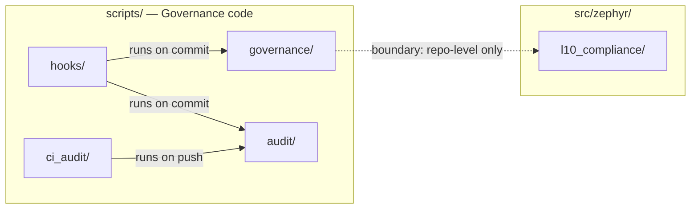

## 1. Purpose of this view / 本视图的用途

The Application Architecture answers:

应用架构视图回答：

- What applications / modules / services exist? (C4 views / C4 视图)
- How do they interact? (Interfaces and protocols / 接口与协议)
- How is `src/zephyr/` structured? (14-layer code architecture / 14 层代码架构)
- How is `scripts/` organized? (Governance code topology / 治理代码拓扑)
- Where do future platform modules belong? (Module placement / 模块归属)

This view is **driven by** the Information Architecture (data distribution determines application boundaries) and **drives** the Technology Architecture (application characteristics determine technology choices).

本视图由信息架构**驱动**（数据分布决定应用边界），并**驱动**技术架构（应用特性决定技术选型）。

> **v2.0.0 重组织说明**：模块属性详情（子模块清单、接口签名、运行平面归属）已迁移至
> `architecture-model/` 联邦 YAML 模型。本视图聚焦**设计理由 + 层间关系叙事 + 核心决策**。
> 每层详细模块清单 → See `architecture-model/layers/lXX-*.yaml`。

---

## 2. C4-L1: System Context / C4-L1 系统上下文图

### 2.1 Actor list / 参与者清单

| Actor / 参与者 | Type / 类型 | Role / 职责 |
|--------------|------------|------------|
| **Independent Operator** 独立操作者 | Human (internal) | 系统拥有者；负责策略配置、风险决策、日常监控 |
| **AI Collaborators** AI 协作者 | System (internal) | Kimi (Trae) + Opus/Sonnet (Cursor)；发散+收口工作流；设计文档、审查架构 |

### 2.2 External system list / 外部系统清单

| External System / 外部系统 | Direction / 方向 | Protocol / 协议 | Purpose / 用途 |
|--------------------------|----------------|----------------|---------------|
| **Broker API** 券商 API | Bidirectional / 双向 | REST / FIX | 发送交易委托；接收成交回报与持仓 |
| **Market Data Provider** 行情数据源 | Inbound / 入向 | REST / WebSocket | 提供历史与实时行情数据 |
| **LLM Providers** LLM 服务商 | Outbound / 出向 | REST | AI 推理调用（OpenAI / Anthropic 等） |
| **Feishu** 飞书 | Outbound / 出向 | REST (Webhook) | 通知与报告分发 |

### 2.3 System context diagram / 系统上下文图

> Source: `diagrams/c4-l1-system-context.mmd`

> **📊 C4-L1 系统上下文图**：见 [`diagrams/c4-l1-system-context.mmd`](diagrams/c4-l1-system-context.mmd)
>
> *渲染预览：ZephyrAlpha 与 4 个外部系统（Broker API、Market Data Provider、LLM Service、Feishu/通知）的交互关系。*

### 2.4 Interface classification / 接口分类

| Interface / 接口 | Direction / 方向 | Trigger / 触发方 | Criticality / 关键性 |
|----------------|----------------|----------------|---------------------|
| Broker order submission | Outbound | Execution Engine | 🔴 Critical — 直接影响资金安全 |
| Broker fill & position callback | Inbound | Broker push | 🔴 Critical — 持仓状态真源 |
| Market data feed | Inbound | Data Provider push/pull | 🟠 High — 数据缺失影响所有下游 |
| LLM inference | Outbound | AI Agent Ops | 🟡 Medium — 可降级（缓存/跳过） |
| Feishu notification | Outbound | Analytics / Risk Engine | 🟢 Low — 告警通道，不影响主流程 |

---

## 3. C4-L2: Container Diagram / C4-L2 容器图

### 3.1 Container categories / 容器分类

| Category / 类别 | Containers / 容器 | Characteristic / 特性 |
|----------------|-----------------|----------------------|
| **Business pipeline** 业务流水线 | Data Pipeline, Factor Engine, Risk Engine, Portfolio Engine, Execution Engine, Post-Trade Analytics | Stateless compute / 无状态计算 |
| **AI operations** AI 运营 | AI Agent Ops | Stateful (context / memory) / 有状态（上下文/记忆） |
| **Data storage** 数据存储 | Data Storage | Stateful persistent / 有状态持久化 |
| **Documentation store** 文档存储 | Documentation Store | Stateful persistent (Git) / 有状态持久化（Git） |

### 3.2 Container inventory / 容器清单

| Container / 容器 | Tech / 技术 | `src/` layer / 对应层 | Responsibility / 职责边界 |
|----------------|-----------|---------------------|--------------------------|
| **Data Pipeline** | Python | `l00_data_source` | 行情数据接入、标准化、质量门禁、落库 |
| **Factor Engine** | Python | `l02_alpha_factor` + `l03_signal_generation` | Alpha 因子计算、舆情信号提取、预测信号生成 |
| **Risk Engine** | Python | `l04_risk_management` | 风险度量、限额执行、止损触发 |
| **Portfolio Engine** | Python | `l05_portfolio_construction` | 权重优化、组合构建、回测框架 |
| **Execution Engine** | Python | `l06_trade_execution` | OMS、SOR、委托路由、执行前风控 |
| **Post-Trade Analytics** | Python | `l07_post_trade_analytics` | 绩效归因、交易复盘、报告生成 |
| **AI Agent Ops** | Python | `l08_human_ai_interface` + `03_modules/_b_track_interfaces/` | Agent 规则、记忆管理、上下文服务、LLM 调用编排 |
| **Data Storage** | PostgreSQL + TimescaleDB（主存储）/ DuckDB（分析）/ Parquet（归档） | — | 行情、因子信号、持仓、交易数据的持久化存储；experimental 确定选型见 04-TA §Q5-1 |
| **Documentation Store** | Git + Markdown | — | 架构文档、决策记录；`docs/` 即文档存储本身 |

### 3.3 Container diagram / 容器图

> Source: `diagrams/c4-l2-containers.mmd`

> **📊 C4-L2 容器图**：见 [`diagrams/c4-l2-containers.mmd`](diagrams/c4-l2-containers.mmd)
>
> *渲染预览：系统内部 14 层容器及其依赖关系，包含 Hot/Warm/Cold 三平面标注。*

### 3.4 Communication protocol table / 通信协议表

| From → To / 从→到 | Protocol / 协议 | Sync/Async | Notes / 说明 |
|------------------|----------------|-----------|-------------|
| Data Pipeline → Storage | Direct write / 直接写入 | Sync | 行情落库 |
| Data Pipeline → Factor Engine | In-process call / 进程内调用 | Sync | 当前单进程；未来可拆分为消息队列 |
| Factor Engine → Risk Engine | In-process call | Sync | 风控前置 |
| Factor Engine → Portfolio Engine | In-process call | Sync | 因子信号驱动组合构建 |
| Risk Engine → Portfolio Engine | In-process call | Sync | 限额约束注入 |
| Portfolio Engine → Execution Engine | In-process call | Sync | 目标权重→委托指令 |
| Execution Engine → Broker API | REST / FIX | Sync | 委托发送 |
| Broker API → Execution Engine | Callback / Push | Async | 成交回报 |
| AI Agent Ops → LLM Providers | REST | Async | AI 推理调用 |
| Market Data → Data Pipeline | REST / WebSocket | Pull + Push | 历史拉取 + 实时推送 |

### 3.5 C4 Level 3 — Component diagrams for critical layers / 关键层组件图

> C4-L3 展开**三个关键层**的内部组件结构——选择依据 = 业务风险最高（L00 数据源头 + L06 资金执行）或架构复杂度最高（L11 ML 平台组件交错）。

| 图 ID | 目标层 | 文件 | 阅读重点 |
|------|-------|------|---------|
| **C4-L3 / L00** | L00 Data Source | `diagrams/c4-l3-l00-data-source.mmd` | Vendor Registry + ACL 三段 + 多 Vendor 故障转移 |
| **C4-L3 / L11-ML** | L11 ML Platform | `diagrams/c4-l3-l11-ml-platform.mmd` | Feature Store + PIT + Training → Registry → Inference |
| **C4-L3 / L06** | L06 Trade Execution | `diagrams/c4-l3-l06-trade-execution.mmd` | OMS + Idempotency Guard + SOR + Broker Adapters |

**推荐阅读路径**：
- **数据入口视角**：C4-L1 → C4-L2 → C4-L3/L00 → `src-domain/ocp-extension-points.md`
- **资金安全视角**：C4-L2 → C4-L3/L06 → §8 幂等设计 → `src-domain/idempotency-design.md`
- **ML 生命周期视角**：C4-L2 → C4-L3/L11-ML → OQ-063 AI Operator 激活路线

---

## 4. `src/zephyr/` — 14-layer code architecture / 14 层代码分层架构

> Dependency direction: upper layers depend on lower layers. Cross-layer direct calls are prohibited; shared contracts pass through `shared/`.
>
> 依赖方向：上层依赖下层，禁止跨层直接调用；跨层共享契约通过 `shared/` 传递。

### 4.0 Runtime Plane Attribution / 运行平面归属

> 运行平面（Hot / Warm / Cold）是与业务分层**正交**的标签维度。**04bis-runtime-planes.md §3.1 是 canonical SSoT**，YAML 模型 `architecture-model/cross-cutting/runtime-planes.yaml` 承载完整 14 层 × 三平面映射。

| 平面 | 延迟 | 技术栈 | 本阶段状态 |
|---|---|---|---|
| **Hot Path** 🔥 | < 10ms P99 | C++/Rust/kernel-bypass | **未激活**（T1 真实资金后首次激活 L04/L06） |
| **Warm Path** 🌡️ | 10ms-1s | Python asyncio / FastAPI | **当前默认**（14 层业务代码全部跑在 Warm） |
| **Cold Path** ❄️ | > 1s batch | Spark / Dask / Airflow | **部分激活**（L02 回算、L05 回测、L07 归因、L11 训练） |

→ 完整 14 层归属速查表：See `architecture-model/cross-cutting/runtime-planes.yaml`
→ 详细定义与标注规范：See `04bis-runtime-planes.md`

### 4.1 14-layer taxonomy / 14 层分层体系

> **SSoT 声明**：模块属性（子模块清单、接口签名、优先级、运行平面归属）的
> **Single Source of Truth** 是 [`architecture-model/layers/*.yaml`](architecture-model/layers/)。
> 本节及任何其他 Markdown 文件中的模块属性描述均为**只读引用**，不得作为权威来源。
> 如有冲突，以 YAML 文件为准。

> **📋 14 层模块完整清单**：见 [`architecture-model/layers/`](architecture-model/layers/) 目录下的 YAML 定义文件（L00~L13 + shared），每个文件包含模块 ID、职责、优先级、运行时平面归属等结构化数据。

**关键设计决策（永久保留）**：

- **L00 ACL（R33/J5）**：`connectors/` 定位为 Anti-Corruption Layer，将外部 Vendor 数据格式"翻译"为内部 canonical schema，防止 Vendor 命名约定渗透到核心业务层。选 ACL 而非 Adapter/Facade 的原因：Adapter 只做接口适配不做领域模型翻译，Facade 是简化调用复杂度的门面——ACL 的核心价值是**将外部领域概念翻译为内部领域语言**。
- **L05 strategic/（R31）**：strategic asset allocation 本质是 portfolio construction 的长周期版本（BlackRock Aladdin P1 模式），业界无顶级机构将其独立成层。
- **L05 meta_router/（N11/OQ-023）**：元策略路由归入 L05 语义最准、工程最简——与 `optimization/` / `rebalancing/` 共用 `StrategyRegistry`，天然协同。
- **L10 命名（R32）**：业界绝大多数顶级机构 L10 均命名为 `compliance`；`governance` 是组织级决策行为，进入 docs 不进代码层。
- **L10 ai_security/（OQ-076/ADR-0009）**：AISG 防泄密子系统，治理归属跨 09-GOV 全三层。
- **L11 scout/（OQ-079）**：Scout Agent 自动抓取外部资讯 + 内部 repo diff，喂养 KMS L1 事实层。
- **L12 命名（OQ-030/R31）**：`system_telemetry` 比 `observability` 更精确——强调"结构化指标流给 AI 读"。

| Layer ID | Layer Name | Directory |
|:---|:---|:---|
| L00 | Data Source | `l00_data_source/` |
| L01 | Infrastructure | `l01_infrastructure/` |
| L02 | Alpha Factor | `l02_alpha_factor/` |
| L03 | Signal Generation | `l03_signal_generation/` |
| L04 | Risk Management | `l04_risk_management/` |
| L05 | Portfolio Construction | `l05_portfolio_construction/` |
| L06 | Trade Execution | `l06_trade_execution/` |
| L07 | Post-Trade Analytics | `l07_post_trade_analytics/` |
| L08 | Human-AI Interface | `l08_human_ai_interface/` |
| L09 | Research & Innovation | `l09_research_innovation/` |
| L10 | Governance & Compliance | `l10_compliance/` |
| L11 | ML Platform | `l11_ml_platform/` |
| L12 | System Telemetry | `l12_system_telemetry/` |
| L13 | Experiment Pipeline | `l13_experimentation/` |
| — | Shared | `shared/` |

### 4.2 Layer dependency diagram / 分层依赖图

> Source: `diagrams/src-layer-stack.mmd`

> **📊 14 层分层依赖图**：见 [`diagrams/src-layer-stack.mmd`](diagrams/src-layer-stack.mmd)
>
> *渲染预览：L00~L13 + shared 共 15 个节点的依赖方向图，箭头方向 = 允许的调用方向。*

### 4.3 Layer classification rationale / 分层分类依据

14 个层（含 Shared，共 15 个 namespace）按**量化投资价值链 + 横向支撑 + AI 时代新增层**三个维度组织：

| Category / 类别 | Layers / 层 | Principle / 原则 |
|----------------|------------|-----------------|
| **Foundation** 基础层 | `shared`, `l01_infrastructure` | 无业务逻辑，被所有层依赖；变更频率最低 |
| **Data & Signal** 数据信号层 | `l00`, `l02`, `l03` | 数据进入→因子加工→信号提取；单向数据流 |
| **Decision** 决策层 | `l04`, `l05` | 风险约束→组合构建；两层强耦合，共同产出委托指令 |
| **Execution** 执行层 | `l06`, `l07` | 委托发出→执行后分析；直连外部系统（券商 API） |
| **Interface & Research** 交互创新层 | `l08`, `l09` | 人机协作入口 + 实验沙盒；不参与主交易流水线 |
| **Compliance** 合规层 | `l10` | 横向硬合规运行时检查；按辖区分片（A 股/美股/欧盟 MiFID II） |
| **AI/ML Platform** AI/ML 平台层 | `l11`, `l12`, `l13` | AI 时代新增三层：ML 生命周期 + 系统可观测 + 自动化实验 |

### 4.4 OCP Extension points / 扩展点设计

> 三个扩展点遵循 Open-Closed Principle。契约（基类 + 注册表）锁死，实现无限扩展。
> 完整接口签名 → `architecture-model/contracts/cross-layer-contracts.yaml`。

系统定义三个核心 OCP 扩展点：

| 扩展点 | 所属层 | 基类 | 注册表 | 用途 |
|:---|:---|:---|:---|:---|
| **因子扩展点** | L02 | `FactorBase` | `FactorRegistry` | 新增 Alpha 因子不修改引擎 |
| **策略扩展点** | L05 | `StrategyBase` | `StrategyRegistry` | 新增组合策略不修改调用方 |
| **券商扩展点** | L06 | `BrokerInterface` | Broker Vendor Registry | 新增券商适配器不修改订单流 |

新增因子/策略/券商适配器只需继承基类并注册，无需修改已有代码。

#### Anti-Corruption Layer / ACL 三段结构（L00 数据接入）

L00 数据接入采用 ACL 三段架构，解耦外部数据格式与内部 canonical schema：

```
外部券商/数据源 API
    ↓
connectors/（连接器）  ─── 处理网络、认证、原始协议
    ↓
mappers/（映射器）     ─── 数据归一化 → canonical schema
    ↓
adapters/（适配器）     ─── 填充 PIT 三字段，注入 Layer L00 domain context
    ↓
共享契约 (shared/contracts/)
```

**关键约束**：
- mapper 必须输出 `shared/contracts/` canonical schema（含 PIT 三字段：`data_source`、`as_of_date`、`ingestion_ts`）
- 不允许跨 jurisdiction 共享 mapper
- Fallback 激活时必须标记 `data_source_quality_degraded=True`
- `source_quality` 应为 `vetted`（可信）或 `degraded`（降级），前端需据此显示数据新鲜度

#### Vendor Registry / 厂商注册表设计原则

| 原则 | 说明 |
|:---|:---|
| **Namespace 隔离** | 按 asset_class/jurisdiction 分区，避免同一 namespace 内歧义 |
| **多 Vendor 故障转移** | 主厂商异常 → 自动 Fallback 到备用厂商（保持相同 jurisdiction 范围内）|
| **Vendor → Mapper 强制映射** | 所有 Vendor 数据路径必须经过 mapper 归一化后再消费 |
| **交易所退市处理** | 写入 `data_source_quality=degraded` + 记录 audit event |

```yaml
# Vendor Registry 配置片段
brokers:
  - id: XXXX-securities
    name: "XXXX 证券"
    jurisdiction: cn_a_share
    asset_class: equity
    provider_rank: primary
    acquisition_method: sdk
    status: active
    fallback_brokers: [YYYY-securities]
  - id: YYYY-securities
    name: "YYYY 证券"
    jurisdiction: cn_a_share
    asset_class: equity
    provider_rank: secondary
    status: active
```

---

## 4A. Vibe Coding 2.0 Infrastructure / 6 大核心服务（跨层支撑）

> 新增于 v2.1.0（2026-04-24）。6 大核心服务作为跨层支撑层的核心组件，为 L00-L11 + L13 的业务层提供 AI 基础设施能力。详见本视图 §4A。

### 4A.1 服务清单与物理位置

| 缩写 | 服务全称 | 物理路径 | 接口规范 | 对应 ADR |
|------|---------|---------|---------|---------|
| **LSG** | LLM Security Gateway | `src/zephyr/llm_security/` | `08_.../llm-security-gateway-interface.md` | ADR-0020 |
| **VMS** | Vector Memory Service | `src/zephyr/vector_memory/` | `08_.../vector-memory-service-interface.md` | ADR-0016 |
| **CE** | Context Engine | `src/zephyr/context_engine/` | `08_.../context-engine-interface.md` | ADR-0015 |
| **Orc** | Agent Orchestrator | `src/zephyr/orchestrator/` | `08_.../agent-orchestrator-interface.md` | ADR-0017 + ADR-0018 |
| **FLE** | Feedback Loop Engine | `src/zephyr/feedback_loop/` | `08_.../feedback-loop-engine-interface.md` | ADR-0019 |

### 4A.2 服务间依赖 DAG

```
LSG ──────── （零依赖，最底层）
VMS ──────── （仅依赖 ChromaDB + BGE-M3 本地资源）
CE  ──────── 依赖 VMS（检索）+ LSG（注入前校验）
Orc ──────── 依赖 CE（上下文）+ VMS（记忆写入）+ LSG（工具调用校验）
FLE ──────── 指标入向：所有服务上报；动作出向：Protocol 适配器调 CE/Orc/VMS/LSG
```

**强约束**：FLE 到其他服务通过 **Protocol 适配器**（单向），其他服务**不知道 FLE 存在**。防止循环依赖。

### 4A.3 与 14 层业务层的集成模式

| 业务层 | 典型 VMS 使用 | 典型 Orc 使用 | 典型 FLE 使用 |
|:------|-------------|--------------|---------------|
| L02 特征工程 | 检索相似因子 + 写因子文档 | 因子开发任务 | 因子计算延迟 |
| L03 策略研究 | 检索历史策略 + ADR | 回测任务 | 回测成功率 |
| L05 执行 | 写执行日志摘要 | （实时流，不走 Orc）| 滑点 / 延迟 |
| L08 反思学习 | 读写 `lessons` Collection | 复盘任务 | — |
| L10 治理 | 读 ADR / 写治理规范 | SSoT 校验任务 | 规范违规率 |

### 4A.4 OCP 扩展点新增（v2.1.0）

除原有 L02/L05/L06 三个 OCP 扩展点外，**6 大核心服务均通过 Protocol 抽象基类暴露扩展点**：

| Protocol | 扩展场景 | experimental 实现 | beta+ 实现 |
|----------|---------|-------------|--------------|
| `VectorMemoryProtocol` | 替换向量库 | `InProcessVectorMemory` (ChromaDB) | `RemoteVectorMemory` (HTTP Client) |
| `ContextEngineProtocol` | 替换 CE 实现 | `InProcessContextEngine` | `RemoteContextEngine` |
| `OrchestratorProtocol` | 替换任务队列 | `InProcessOrchestrator` (SQLite + asyncio) | `RemoteOrchestrator` (NATS) |
| `FeedbackLoopProtocol` | 替换时序存储 | `InProcessFeedbackLoop` (SQLite) | `RemoteFeedbackLoop` (InfluxDB) |
| `LLMSecurityProtocol` | 替换 LSG 实现 | `LocalLLMSecurityGateway` (Pydantic + 规则) | `RemoteLLMSecurityGateway` + 专用模型 |

### 4A.5 架构归属说明

```
src/zephyr/
├── l00_data_source/          ← 业务层（L00）
├── l01_.../                  ← 业务层
├── ...
├── l11_.../                  ← 业务层（L11）
├── l13_.../                  ← 业务层（L13）
│
├── llm_security/             ← L12 跨层支撑（LSG）
├── vector_memory/            ← L12 跨层支撑（VMS）
├── context_engine/           ← L12 跨层支撑（CE）
├── orchestrator/             ← L12 跨层支撑（Orc）
├── feedback_loop/            ← L12 跨层支撑（FLE）
│
└── shared/                   ← 跨层公共契约（原有）
```

**命名约定决策**：6 大核心服务**不**使用 `l12_` 前缀，理由：

- `l12_` 前缀语义是 "编号层"；6 大核心服务是 "职能模块"，两者概念不同
- 避免与未来可能的 `l12_cross_cutting/` 命名冲突
- 与业务层 `l<NN>_` 命名视觉区分，便于快速识别 "基础设施 vs 业务"

### 4A.6 详细架构

- **架构总纲**：本视图 §4A
- **接口规范**：`docs/03_modules/_b_track_interfaces/*-interface.md`（5 份）
- **技术选型**：[`technology-landscape.yaml`](./architecture-model/technology/technology-landscape.yaml)
- **ADR**：KB:decisions namespace（ADR-0015 ~ ADR-0020，6 条，原物理文件已迁入）

---

## 5. `scripts/` — Governance code topology / 治理代码拓扑

> `scripts/` 仅含**仓库级**治理自动化代码。产品级合规运行代码属于 `src/zephyr/l10_compliance/`。
> 模块详情 → See `architecture-model/scripts/scripts-model.yaml`

### 5.1 四域拓扑

| 域 | 职责 | 触发时机 |
|----|------|---------|
| `governance/` | 文档 frontmatter 校验、编码检测、命名规范、记忆生产流水线 | pre-commit + CI |
| `audit/` | 全库 schema 合规扫描、链接有效性检查 | CI (push/PR) |
| `hooks/` | pre-commit 钩子 + 本地安全守卫 | git commit |
| `ci_audit/` | CI 侧全量/差量审计 | push / PR |

### 5.2 Trigger topology / 触发拓扑图

> Source: `diagrams/scripts-topology.mmd`

> *简化版，完整双语版见 [`diagrams/scripts-topology.mmd`](diagrams/scripts-topology.mmd)*



---

## 6. Future platform modules & evolution roadmap / 未来平台模块与演进路线

| Platform module / 平台模块 | Location / 归属 | Status / 状态 |
|--------------------------|----------------|--------------|
| LLM Gateway / task dispatch | L08 `l08_human_ai_interface/model-routing-and-cost/` | deferred |
| Memory Pipeline | L08 `l08_human_ai_interface/memory-and-context/` | in discussion |
| Model Registry (ML) | L11 `l11_ml_platform/model-registry/` | planned |
| Data Platform engine | L00 `l00_data_source/` | planned |
| Feature Store | L11 `l11_ml_platform/feature-store/` | planned |

**架构演进终态**（已锁定，R31+R32+OQ-073）：

- src/zephyr/ 包含 14 个 `l`-prefixed 层（l00–l13）+ `shared/` = 15 namespace
- frontend/ 前端平台层与 src/ 平级，Python 后端与 TypeScript/React 前端完全异构隔离
- docs/ + src/zephyr/ + frontend/ + scripts/ 四域独立演进（四架构联邦制）

---

## 7. Key integration points / 关键集成点与接口契约

> 完整契约签名 → `architecture-model/contracts/cross-layer-contracts.yaml`。本节为导读。

### 7.1 P0 核心数据契约

> **SSoT 声明**：P0 数据契约的 **Single Source of Truth** 是
> [`architecture-model/contracts/cross-layer-contracts.yaml`](architecture-model/contracts/cross-layer-contracts.yaml)。
> 下表中"codegen 目标"列所列的 Python 文件由 codegen 工具从该 YAML **自动生成**，
> 不得手工编辑。任何字段变更必须先修改 YAML，再重新生成 Python 文件。

| 契约类 | 流向 | codegen 目标（自动生成） | 关键特性 |
|--------|------|--------------------------|---------|
| `NormalizedMarketData` | L00 → L02 | `shared/contracts/market_data.py` | frozen dataclass；含质量评分与停牌标记 |
| `FactorSignal` | L02 → L03/L04/L05 | `shared/contracts/factor_signal.py` | frozen；含 raw/normalized/rank_pct |
| `RiskLimits` | L04 → L05 | `shared/contracts/risk_limits.py` | frozen；约束集合 |
| `Order` | L05 → L06 | `shared/contracts/order.py` | 可变；OrderStatus 状态机 |
| `Fill` | L06 → L07 | `shared/contracts/fill.py` | frozen；含成交细节与滑点 |
| `PositionSnapshot` | L06/L07 → L04/L11 | `shared/contracts/position.py` | frozen；不可变持仓快照 |

### 7.2 跨层数据流路径

> 下图标注了 P0 跨层数据契约 ID（CTR-001~CTR-006）作为架构承重墙。
> 可视化版本 → [`diagrams/data-flow.mmd`](diagrams/data-flow.mmd)

```
L00 ──[CTR-001: NormalizedMarketData 🔒]──→ L02 ──[CTR-002: FactorSignal 🔒]──→ L03/L04/L05
L04 ──[CTR-003: RiskLimits 🔒]──→ L05 ──[CTR-004: Order 🔓]──→ L06 ──[CTR-005: Fill 🔒]──→ L07
L06 ──[CTR-006: PositionSnapshot 🔒]──→ L04 (Risk Monitor) / L11 (Strategic)
L07 ──[CTR-006: PositionSnapshot 🔒]──→ L04 (Risk Monitor) / L11 (Strategic)
```

**图例**：🔒 = frozen（不可变契约） | 🔓 = mutable（可变契约，含状态机）

### 7.3 External interface contracts / 外部接口契约

| 契约 ID | 外部系统 | 方向 | 协议 | 关键约束 |
|---------|---------|------|------|---------|
| EXT-001 | Broker API | 双向 | REST/FIX | 发单前必须通过 `l06/pre_trade/` 风控 |
| EXT-002 | Market Data | 入站 | REST/WS | 入站数据必须经 `l00/quality/` 质量门禁 |
| EXT-003 | LLM Providers | 出站 | REST | 支持降级；L02-L07 不允许直接调用，必须经 L08 |
| EXT-004 | Feishu | 出站 | REST Webhook | 非关键路径；发送失败不影响主流程 |

### 7.4 Event bus / 事件总线（当前状态）

**当前架构决策：不引入消息总线。** 当前系统为单进程架构，所有层间调用为进程内同步调用。引入消息总线的条件是"需要多个并发服务"，当前未满足。

### 7.5 Contract versioning / 契约版本管理

> 完整策略 → `architecture-model/contracts/cross-layer-contracts.yaml`

四大原则：**只追加不修改** | **`schema_version` 字段** | **ADR 门禁** | **向后兼容**。所有 P0 契约当前版本均为 `1.0`（2026-04-18 锁定）。

---

## 8. Fault Tolerance & Idempotency / 容错与幂等设计

### 8.1 容错策略分级

| 层级 | 策略 | 实现 | 适用场景 |
|:---|:---|:---|:---|
| **L00/L02** | Fail-Safe | Circuit Breaker + Fallback | 数据源/因子：降级继续运行 |
| **L04/L06** | Fail-Closed | 拒绝优于放行 | 风控/交易：保护资金安全 |
| **L09** | Fail-Reported | 失败透明报告 | 研究/实验：不阻塞主流程 |
| **L11/L13** | Fail-Isolated | Job 级隔离 + 重试 | 实验调度：单批次失败不停止 |

每层拥有独立 Circuit Breaker，避免故障级联传播。

### 8.2 五种核心容错策略

| 策略 | 描述 | 配置参数 | 适用层 |
|:---|:---|:---|:---|
| **Retry** | 指数退避重试 | max_retries, backoff_base_sec | L00, L06 |
| **Circuit Breaker** | 熔断机制 | failure_threshold, recovery_timeout_sec | L04, L06 |
| **Failover** | 故障转移 | primary, secondary list | L00 |
| **Timeout** | 超时保护 | per_operation_timeout_sec | 所有层 |
| **Rate Limiter** | 限流保护 | max_requests_per_sec | L00, L06, L08 |

### 8.3 容错策略 × 业务操作矩阵

| 业务操作 | 主要策略 | 降级路径 | 降级影响 |
|:---|:---|:---|:---|
| L00 行情订阅 | Retry + Failover | 切换备用数据源 | 数据源质量标记 degraded |
| L02 因子计算 | Timeout + Retry | 使用上一快照 | 因子新鲜度降低 |
| L04 风控检查 | Circuit Breaker + Fail-Closed | 拒绝交易 | **零影响**（安全） |
| L06 订单提交 | Retry + Idempotency Guard | 挂起人工审核 | 订单延迟，不重复 |
| L09 研究任务 | Fail-Isolated | 跳过失败 job | 单次实验数据不完整 |

**降级优先级**：Circuit Breaker > Rate Limiter > Retry > Timeout > Failover。降级触发时写结构化 event log（`degradation_reason`、`affected_layer`、`fallback_applied`、`degradation_duration_sec`）。

### 8.4 幂等设计 — 资金安全一级红线

**目标语义**：At-Least-Once + Idempotent Guard → **Effectively Exactly-Once**（业界标准：Stripe / AWS DynamoDB / 支付宝同款）。

**Idempotency Key 生成**：
```
idempotency_key = "ORD-" + SHA256(order_id + broker + price + quantity + timestamp[:19])
```
保证同一订单内容重发产生相同的 key。

**实现架构**：
```
订单请求 → Idempotency Guard (SETNX key + TTL 24h)
    ├── key 不存在 → 正常处理 + 写入结果 → 返回 success
    └── key 已存在 → 返回初始结果（幂等返回）→ 写入幂等命中 event
```

**关键约束**：
- TTL 24 小时（覆盖券商对账周期 + broker timeout）
- Key collision 检测：不同订单内容产生相同 key → 立即告警（P0）
- L06 所有 Retry 必须经过 Idempotency Guard
- Idempotency Guard 失败 → **Order NOT submitted**（宁可延迟不可重复）

> **📊 异常处理时序图**：见 [`seq-exception-handling.mmd`](./diagrams/seq-exception-handling.mmd) — 跨层异常传播与降级处理完整时序

---

## 10. Revision history / 修订记录

| Date | Description |
|------|-------------|
| 2026-05-01 | **v2.2.0**：结构清理 — 融入 `by-domain/src-domain/` 三个详解文件（OCP 扩展点 + ACL 三段架构 + Vendor Registry 设计原则、容错策略矩阵 + 降级优先级、幂等设计与 Idempotency Guard 实现），合并到 §4.4 和 §8。删除 by-domain/ 目录。移除已冗余的 §4.5。 |
| 2026-04-24 | **v2.1.0**：B-d-2 — 追加 §4A Vibe Coding 2.0 Infrastructure / 6 大核心服务（L12 跨层支撑）。含服务清单+依赖 DAG+与 14 层集成模式+5 个 Protocol 扩展点+命名约定说明。架构真源：本视图 §4A。 |
| 2026-04-21 | **v2.0.0**：Architecture-as-Code 重组织——模块属性详情迁移至 `architecture-model/` 联邦 YAML 模型，视图正文从 1076 行压缩至 ≤600 行，保留设计理由+层间关系叙事+核心决策。 |
| 2026-04-19 | v1.10.0：新增 §4.0 Runtime Plane Attribution Index（R69/ADR-0011）。 |
| 2026-04-19 | v1.8.0-v1.9.1：批次 D 深加工（C4-L3 三图 + Vendor Registry + 容错矩阵 + 幂等设计）+ J0-sync（L10 ai_security + L11 scout）。 |

> 完整修订历史：`git log --oneline -- 03-application-architecture.md`

---

## 11. Architecture Runway / 架构预留通道

> 22 条应用组件类 P3 预留（按 L02/L03/L04/L07/L08/L09 六层分组）。
> 完整条目索引 → `docs/08_knowledge/04_future_capabilities/p3-blueprint-index.md` [待创建]
> 每条预留的挂载点、激活触发条件、P3 索引编号 → 见 v1.9.0 git 历史版本。

---

## 附录 A：14 层架构对标证据

> 对标 Goldman Sachs SecDB / JPM Athena / Two Sigma / Citadel / BlackRock Aladdin 五家顶级机构。
> **结论（OQ-068 closed）**：14 层架构覆盖度 100%，不需要新增顶层。
> 完整对标表格 → 见 v1.7.0 git 历史版本。
