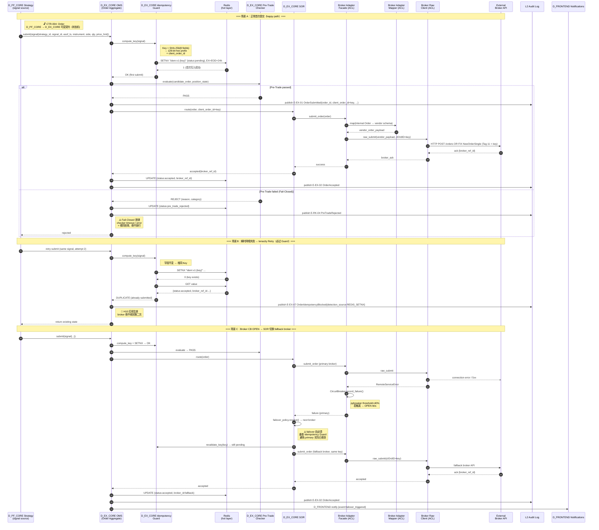
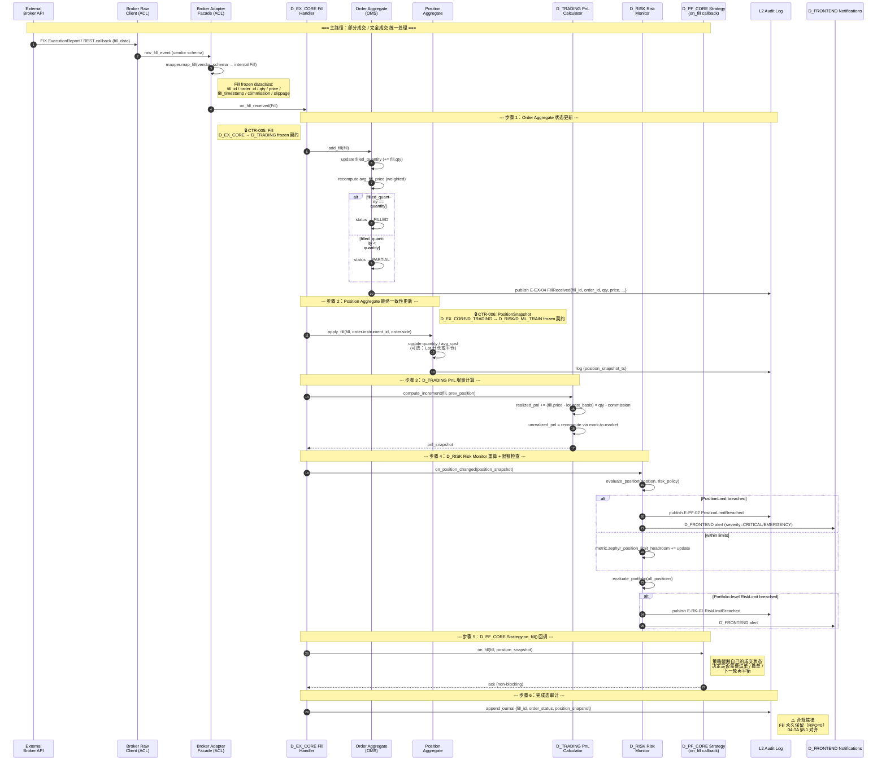
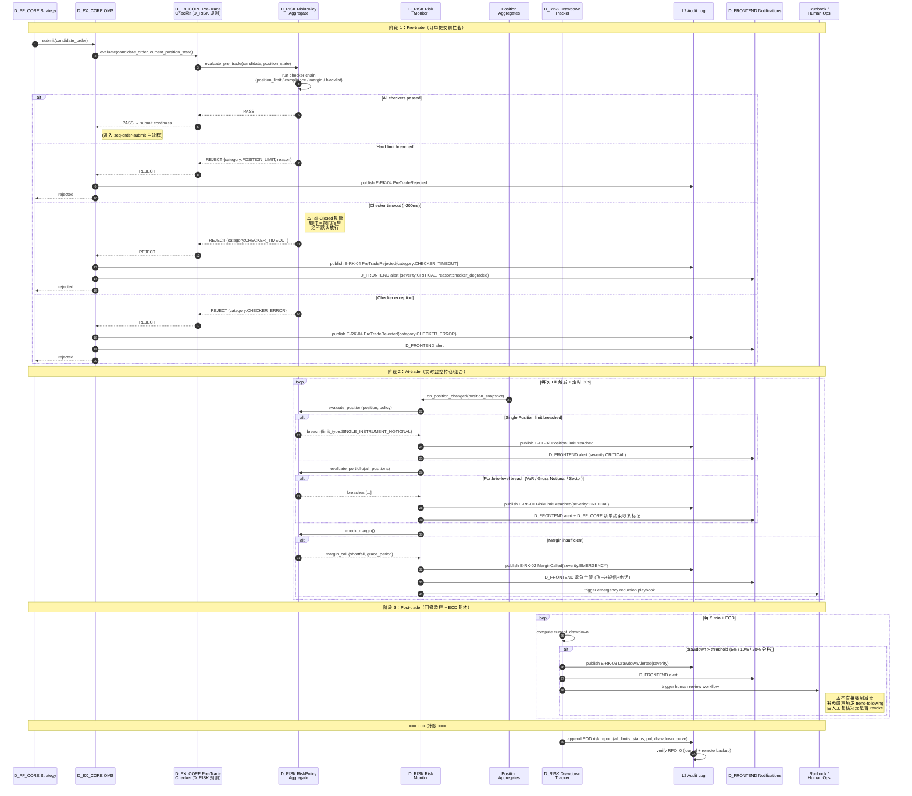
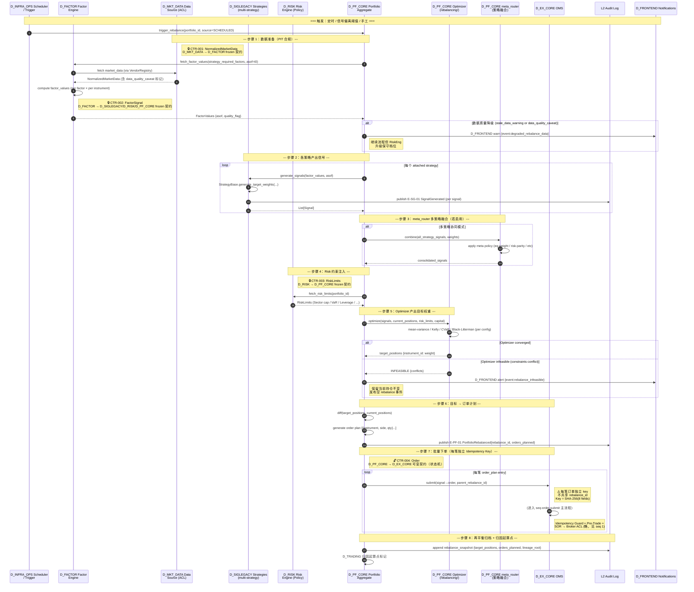
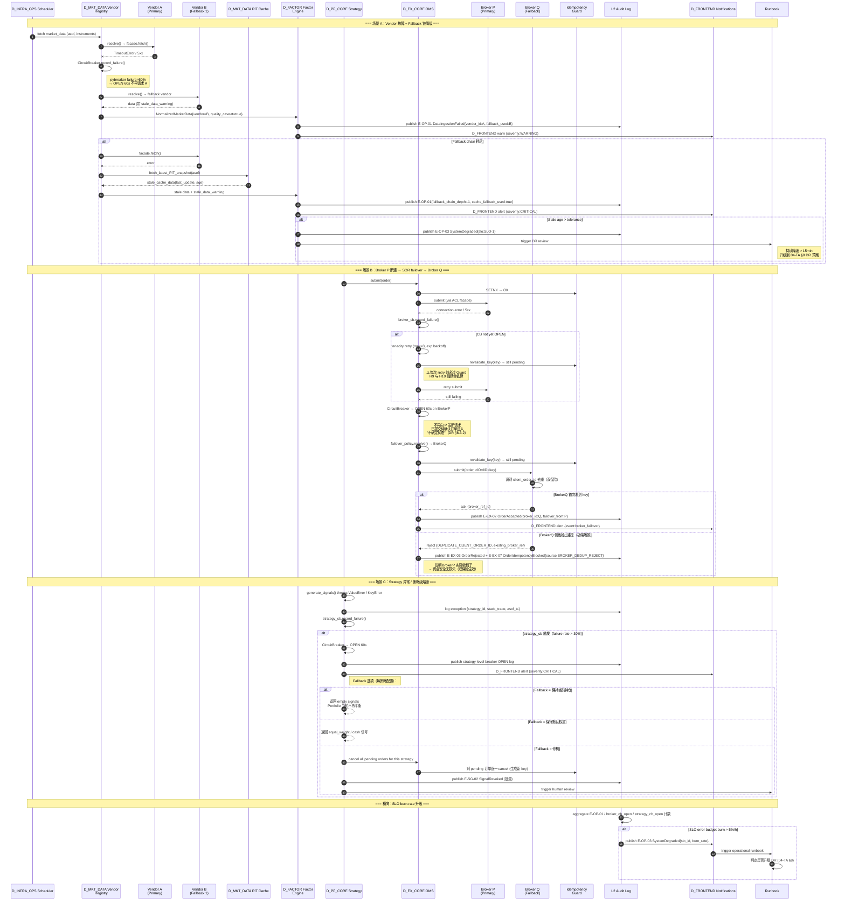

# 应用流程时序图
# Application Flow Sequence Diagrams

> **单一真源 / Single Source of Truth** — 本文档内嵌 5 张应用流程端到端时序图（订单提交 / 成交回报 / 风控触发 / 组合再平衡 / 异常处置），原独立 `.mmd` 已删除。
>
> **背景**：H11 系列 5 张时序图原为独立 `.mmd`，AI 不会主动读取独立 `.mmd`，人亦难直接查看；转为内嵌 mermaid 后可在 IDE 直接渲染。

---

## 1. 订单提交端到端时序（Order Submission）

> 订单提交全流程（覆盖 H10 幂等 + H8 ACL + H9 熔断）。3 场景：正常首次提交（happy path）+ 瞬时网络失败→Retry（幂等）+ Broker CB OPEN→SOR 切换 fallback。

> **版本**: v1.1.0 (2026-05-04) — 标注 CTR-004 Order 契约作为架构承重墙 ｜ **契约真源**: `architecture_model/contracts/cross_layer_contracts.yaml`
> **来源**: 03-AA §9.2 时序图主干抽取 + ACL 三段结构 + Pre-Trade Fail-Closed
> **一致性**: 03-AA §9.2（Idempotency 三场景）｜ ocp-extension-points.md §5（Broker ACL 三段 + failover）｜ fault-tolerance-matrix.md §D_RISK/§D_EX_CORE（Fail-Closed + Retry 过 Guard）｜ domain-event-catalog.md E-EX-01/07、E-RK-04 ｜ ddd-aggregates.md AR-01 Order.submit()

---

## 2. 成交回报处理时序（Fill Received）

> 成交回报处理流程（含 Position/PnL 更新 + Risk 重算 + Strategy 回调）。6 步骤：Order Aggregate 状态更新 + Position Aggregate 更新 + PnL 增量计算 + Risk Monitor 重算 + Strategy.on_fill() 回调 + 完成态审计。

> **版本**: v1.1.0 (2026-05-04) — 标注 CTR-005 Fill + CTR-006 PositionSnapshot 契约作为架构承重墙 ｜ **契约真源**: `architecture_model/contracts/cross_layer_contracts.yaml`
> **来源**: ddd-aggregates.md AR-01 Order.add_fill() + AR-02 Position.apply_fill() ｜ domain-event-catalog.md E-EX-04 FillReceived + E-PF-02 PositionLimitBreached ｜ interface-contracts.md §1.5 Fill + §1.6 PositionSnapshot
> **一致性**: 03-AA §7.2 Broker 回调机制 ｜ fault-tolerance-matrix.md §D_RISK（Risk Fail-Closed）｜ c4_l3_d_ex_core（组件命名一致）

---

## 3. 风控触发时序（Risk Trigger）

> 风控触发全链路（Pre-trade 拦截 + At-trade 监控 + Post-trade 告警）。3 阶段：Pre-trade（拦截）+ At-trade（实时监控）+ Post-trade（回撤监控 + EOD 对账）。

> **版本**: v1.0.0 (2026-04-19, S14-Phase2-BatchF R61)
> **来源**: fault-tolerance-matrix.md §D_RISK（Pre-Trade Fail-Closed 铁律）｜ ddd-aggregates.md AR-07 RiskPolicy ｜ domain-event-catalog.md E-RK-01/02/03/04 + E-PF-02 ｜ 01-BA §5.2 SLO-3 Order Submit Latency SLO-Audit

---

## 4. 组合再平衡时序（Portfolio Rebalance）

> 组合再平衡流程（Signal → Portfolio 决策 → 批量下单，每笔独立 Idempotency Key）。8 步骤：数据准备PIT + 策略产出信号 + meta_router多策略融合 + Risk约束注入 + Optimizer优化 + 目标→订单计划 + 批量下单 + 归档。

> **版本**: v1.1.0 (2026-05-04) — 标注 CTR-001/CTR-002/CTR-003/CTR-004 契约作为架构承重墙 ｜ **契约真源**: `architecture_model/contracts/cross_layer_contracts.yaml`
> **来源**: ddd-aggregates.md AR-03 Portfolio.rebalance() + AR-04 Strategy.generate_signal() ｜ domain-event-catalog.md E-PF-01 PortfolioRebalanced + E-SG-01 SignalGenerated ｜ 03-AA §4.1 D_PF_CORE rebalancing/ + strategic/ 子模块
> **一致性**: interface-contracts.md §1 NormalizedMarketData / FactorSignal / RiskLimits / Order ｜ fault-tolerance-matrix.md §D_FACTOR（Factor Fail-Safe）

---

## 5. 异常处置时序（Exception Handling）

> 异常处置三类场景：数据源故障 / 券商断连 / 策略异常。3 场景：Vendor故障+Fallback链降级 + Broker P断连→SOR failover→Broker Q + 策略异常/策略级熔断 + 横向SLO burn-rate升级。

> **版本**: v1.0.0 (2026-04-19, S14-Phase2-BatchF R61)
> **来源**: ocp-extension-points.md §5 Vendor Registry + failover_policy.yaml ｜ fault-tolerance-matrix.md §D_MKT_DATA/§D_FACTOR/§D_PF_CORE/§D_EX_CORE 各层容错策略 ｜ domain-event-catalog.md E-OP-01 DataIngestionFailed + E-OP-03 SystemDegraded ｜ 04-TA §8 DR/BCP §8.3 量化特殊场景

---

## 说明 / Notes

- **来源 / Source**: 5 张 `.mmd`（`seq_order_submit` / `seq_fill_received` / `seq_risk_trigger` / `seq_rebalance` / `seq_exception_handling`），原存于 `target_architecture/diagrams/`，H11 系列时序图 1/5 ~ 5/5
- **转换规则**: 剥离文件级 `%%` 注释（标题/描述/版本/契约真源/来源/一致性）为 `>` 引用行；`sequenceDiagram` 主体原样保留于 mermaid 代码块
- **审核要点 / Review Focus**:
  - 时序图描绘的参与者（OMS / SOR / Fill Handler / meta_router / Drift Tracker 等）是否与实际代码一致？
  - 事件命名（E-EX-01/02/04/07、E-RK-01~04、E-PF-01/02、E-SG-01/02、E-OP-01/03）是否与 `domain-event-catalog.md` 真源一致？
  - 契约标注（CTR-001~006）是否与 `cross_layer_contracts.yaml` 真源一致？
  - 已决定：作为应用流程时序图单一真源保留（原 `.mmd` 已删除）
