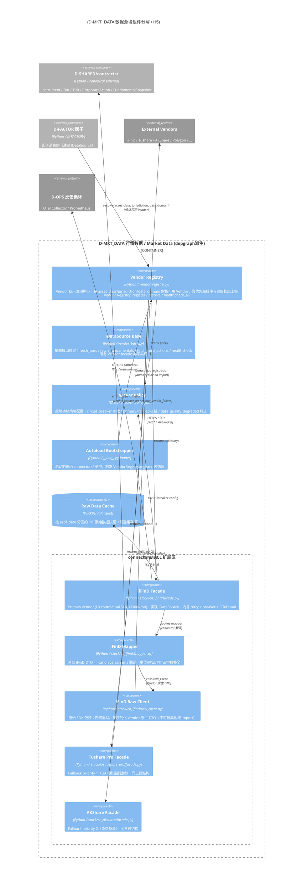
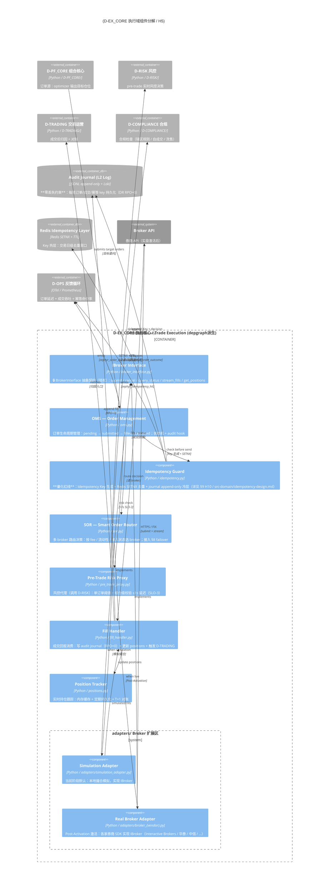

# C4-L3 域组件图（价值评估中）
# C4 Level 3 Component Diagrams (Pending Value Review)

> ⚠️ **价值评估中 / Pending value review** — 本文档由 3 张独立 `.mmd`（`c4_l3_d_mkt_data` / `c4_l3_d_ex_core` / `c4_l3_d_ml_train`）转换为内嵌 mermaid，供挨个评估其架构价值。
>
> **背景**：原计划将 C4-L3 内嵌到各域文档（`02_domain_architecture_docs/`），但 `generate_domain_doc.py` 每次运行完全覆盖域文档（无保留机制），手动内容会被擦除，故改为独立成文。
>
> **评估后处置**：保留 → 本文档成为 C4-L3 单一真源（原 `.mmd` 删除）；删除 → 一并清理 `.mmd` 与本文档。原 `.mmd` 暂存于 `target_architecture/diagrams/`，评估期允许临时双份。

---

## 1. D-MKT_DATA 行情数据域组件图

> 行情数据域组件分解：Vendor 统一注册中心 + IDataSource 抽象 + Failover 策略 + connectors ACL 扩展区（iFinD/Tushare/AKShare 三段式）+ Autoload 引导 + 原始数据缓存。

> **重写时间**: 2026-06-26 (DM-200913 Phase4-B) ｜ **数据源**: depgraph ｜ **契约真源**: `architecture_model/contracts/cross_layer_contracts.yaml`
> **图例**: 🔒 = frozen (不可变契约) ｜ 🔓 = mutable (可变契约，状态机)
> **命名沿革**: v2.1.0 文件名由 `c4_l3_l00_data_source` 重命名为 `c4_l3_d_mkt_data`（14层前缀→域命名）

---

## 2. D-EX_CORE 执行核心域组件图

> 执行核心域组件分解：IBroker 抽象契约 + OMS 订单生命周期 + Idempotency Guard（量化红线）+ SOR 智能路由 + Pre-Trade Risk Proxy + adapters 扩展区（Simulation/Real Broker）+ Fill Handler + Position Tracker。

> **重写时间**: 2026-06-26 (DM-200913 Phase4-B) ｜ **数据源**: depgraph ｜ **契约真源**: `architecture_model/contracts/cross_layer_contracts.yaml`
> **图例**: 🔒 = frozen (不可变契约) ｜ 🔓 = mutable (可变契约，状态机)
> **命名沿革**: v2.1.0 文件名由 `c4_l3_l06_trade_execution` 重命名为 `c4_l3_d_ex_core`（14层前缀→域命名）

---

## 3. D-ML_TRAIN 训练域组件图

> 训练域组件分解：Feature Store + PIT Query Engine + Training Pipeline + Model Registry + Inference Engine + Drift Monitor + Shadow/Canary Mode + AI Operator 预留口子（OQ-063）。

> **重写时间**: 2026-06-26 (DM-200913 Phase4-B) ｜ **数据源**: depgraph ｜ **契约真源**: `architecture_model/contracts/cross_layer_contracts.yaml`
> **图例**: 🔒 = frozen (不可变契约) ｜ 🔓 = mutable (可变契约，状态机)
> **命名沿革**: v2.1.0 文件名由 `c4_l3_l11_ml_platform` 重命名为 `c4_l3_d_ml_train`（14层前缀→域命名）

```mermaid
%%{init: {'theme': 'default'}}%%
C4Component
    title C4 Level 3 — D-ML_TRAIN 训练域组件
    title (D-ML_TRAIN ML平台域组件分解 / H5)

    Container_Boundary(d_ml_train, "D-ML_TRAIN 训练 / ML Platform (depgraph派生)") {

        Component(feature_store, "Feature Store", "Python / feature_store/", "特征物化层：按 entity_id × asof_date PIT 对齐；写入供训练、读取供 inference")

        Component(pit_query, "PIT Query Engine", "Python / pit_query.py", "反 Survivorship 查询：强制带 asof_date + knowledge_date 双游标（05-DA §5 铁律）")

        Component(training_pipeline, "Training Pipeline", "Python / training/", "模型训练编排：数据集切分 + CV + metric 记录，输出 model artifact")

        Component(model_registry, "Model Registry", "Python / model_registry.py", "模型版本化 + lifecycle：draft/staging/prod/archived；每版绑定训练数据快照 id")

        Component(inference_engine, "Inference Engine", "Python / inference/", "生产推理：load by model_id + version + stage，emit metric 延迟/吞吐")

        Component(drift_monitor, "Drift Monitor", "Python / monitoring/drift.py", "feature drift / label drift / concept drift 三类监控；超阈值触发回滚或重训")

        Component(shadow_mode, "Shadow / Canary Mode", "Python / deployment/shadow.py", "新模型对比生产模型：影子跑不写下游 / 金丝雀 5-10% 流量")

        Boundary(ai_operator_slot, "ai_operator/ 预留口子（OQ-063 C-1）") {
            Component(ai_op_reserved, "AI Operator Slot", "Python / D-ML_TRAIN/_ai_operator/ (reserved)", "AI Operator 激活口子：OQ-063 P4 未来态，当前为空 skeleton")
        }
    }

    Container_Ext(d_factor, "D-FACTOR 因子", "Python / D-FACTOR/", "因子供 feature 来源")

    Container_Ext(d_mkt_data, "D-MKT_DATA 行情数据", "Python / D-MKT_DATA/", "原始数据 via IDataSource")

    Container_Ext(d_signal_pf, "D-SIGLEGACY/D-PF_CORE 信号&组合", "Python / D-SIGLEGACY + D-PF_CORE/", "下游推理消费者")

    Container_Ext(d_intelligence, "D-INTELLIGENCE 战略决策", "Python / D-INTELLIGENCE/", "A/B 实验与批跑研究")

    ContainerDb_Ext(artifact_storage, "Model Artifact Storage", "MLflow / 本地 + S3", "模型文件 + training dataset snapshot hash")

    ContainerDb_Ext(feature_storage, "Feature Storage", "Parquet / DuckDB", "按 entity × asof_date 分区")

    Container_Ext(d_ops, "D-OPS 反馈循环", "OTel + Prometheus", "训练/推理 metric + 漂移 metric")

    Rel(d_factor, feature_store, "writes factors as features", "feature ingest")
    Rel(d_mkt_data, feature_store, "writes raw features", "via pit_query")
    Rel(feature_store, feature_storage, "persists", "Parquet partition")
    Rel(feature_store, pit_query, "uses PIT semantics", "asof + knowledge")

    Rel(training_pipeline, feature_store, "reads training data", "PIT window")
    Rel(training_pipeline, model_registry, "registers artifact", "new version draft")
    Rel(model_registry, artifact_storage, "stores artifact", "versioned")

    Rel(inference_engine, model_registry, "loads model", "by stage")
    Rel(inference_engine, feature_store, "reads live features", "for scoring")
    Rel(inference_engine, d_signal_pf, "serves predictions", "signal input")

    Rel(drift_monitor, feature_store, "observes distribution")
    Rel(drift_monitor, inference_engine, "observes predictions")
    Rel(drift_monitor, d_ops, "emits drift metric", "zephyr_model_drift_score")

    Rel(shadow_mode, inference_engine, "duplicates traffic", "5-10% canary")
    Rel(d_intelligence, training_pipeline, "triggers experiments", "A/B job")

    Rel(ai_op_reserved, model_registry, "future: auto-promote/rollback", "OQ-063 P4")
```

---

## 说明 / Notes

- **来源 / Source**: 3 张 `.mmd`（`c4_l3_d_mkt_data` / `c4_l3_d_ex_core` / `c4_l3_d_ml_train`），原存于 `target_architecture/diagrams/`
- **转换规则**: 剥离文件级 `%%` 注释（重写时间/数据源/图例/契约真源/命名沿革）为 `>` 引用行；保留 `%%{init:...}%%` 主题指令与 `C4Component` 主体于 mermaid 代码块
- **评估要点 / Review Focus**:
  - 组件命名是否与实际代码（`src/zephyr/market_data/` / `src/zephyr/ex_core/` / `src/zephyr/ml_train/`）一致？
  - 是否描绘了尚未实现的理想化结构（如 SOR / Drift Monitor / AI Operator Slot）？
  - 作为 C4-L3 单一真源保留，还是因与代码脱节而删除？
- **关联 / Related**: `application_principles.md` §2.3/§2.4（C4 视图分层）已指向本文档
