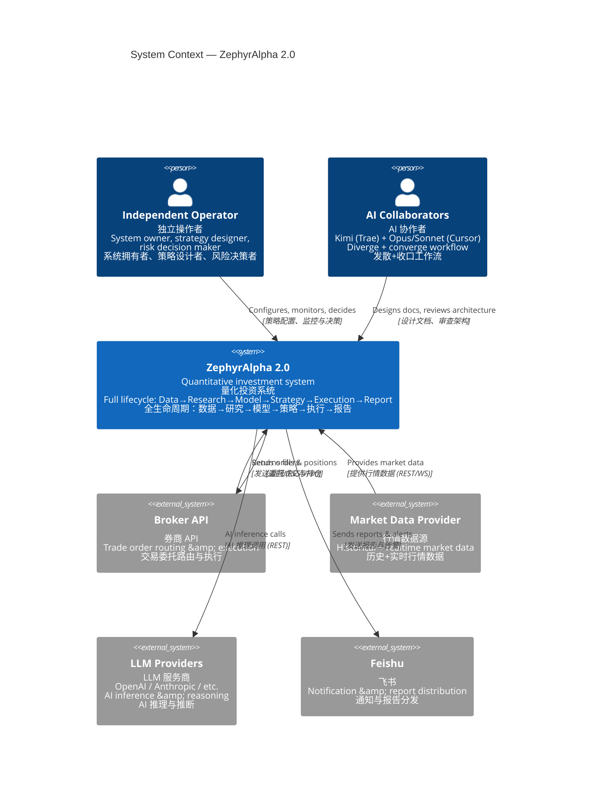
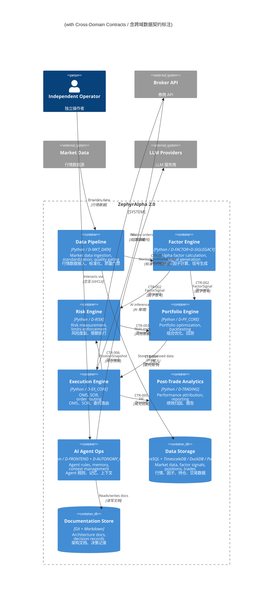

# C4-L1/L2 系统上下文与容器图

> ⚠️ **价值评估中** — 本文档由独立 `.mmd` 转换为内嵌 mermaid，供挨个评估其架构价值。

---

## c4 l1 system context

---

## c4 l2 containers

> 重写时间: 2026-06-26 (DM-200913 Phase4-B)
> 基于§2.1裁定: 14层降级为域属性，53域为唯一物理分类体系
> 数据源: depgraph
> 图例: 🔒 = frozen (不可变契约) | 🔓 = mutable (可变契约，状态机)
> 契约真源: architecture_model/contracts/cross_layer_contracts.yaml

