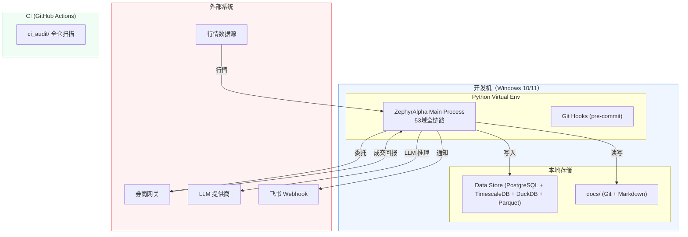

# 数据流图

> **单一真源 / Single Source of Truth** — 本文档内嵌 mermaid 图，原独立 `.mmd` 已删除。

> **生成视图 / Generated View** — 跨域数据流图（data flow / dataflow terminal）已由 `generate_dataflow_diagram.py` 从 depgraph 自动生成，见 [`05_dataflow_architecture/dataflow_index.md`](../05_dataflow_architecture/dataflow_index.md)。本文件仅保留无生成器的手绘概念图（业务价值流 + 部署拓扑）。

---

## business value stream

> Source: 04_architecture_principles_decisions/business_principles.md

```mermaid
flowchart LR
    subgraph INPUT["① 输入 / Input"]
        MH["Market Hypothesis<br/>市场假设<br/>(S2 Quant)"]
        MD["Market Data<br/>市场数据<br/>(S10 Vendor / S6 Data)"]
    end

    subgraph RESEARCH["② Research & Factor / 研究与因子 [C02]"]
        FR["Factor Research<br/>因子研发<br/>LT 5-20d / PT 2-8h / C&A 70%<br/>Owner: S2"]
        FL["Factor Library<br/>因子入库<br/>LT 15-60min / PT 10-30min / C&A 98%<br/>Owner: S2 + S6"]
    end

    subgraph SIGNAL["③ Signal / 信号 [C03/C04]"]
        MT["Model Train/Deploy<br/>模型训练部署<br/>LT 2-24h / PT 30min-4h / C&A 95%<br/>Owner: S7 (deferred)"]
        SG["Signal Generation<br/>信号生成<br/>LT 15-60min / PT 5-15min / C&A 98%<br/>Owner: S2"]
    end

    subgraph PORTFOLIO["④ Portfolio / 组合 [C04]"]
        PC["Portfolio Construction<br/>组合构建<br/>LT 5-15min / PT 1-5min / C&A 99%<br/>Owner: S2 → S9 (future)"]
        RC["Risk Check (pre-trade)<br/>事前风控门<br/>LT &lt;1min / PT 5-30s / C&A 99.9%<br/>Owner: S4"]
    end

    subgraph EXEC["⑤ Execution / 执行 [C05]"]
        OS["Order Submission<br/>下单<br/>LT 1-5min / PT 10-60s / C&A 99.5%<br/>Owner: S3"]
        FB["Fill &amp; Reconcile<br/>成交与对账<br/>LT intraday / PT 1-5min / C&A 99%<br/>Owner: S3 + S6"]
    end

    subgraph POST["⑥ Post-trade / 交易后 [C06]"]
        AT["Attribution &amp; PnL<br/>归因与 PnL<br/>LT T+1 / PT 10-30min / C&A 99%<br/>Owner: S2"]
    end

    subgraph FEEDBACK["⑦ Feedback / 反馈回路"]
        FD["Feedback to Research<br/>反馈至研究<br/>LT T+1 to T+5 / PT 1-4h / C&A 85%<br/>Owner: S1 + S2"]
    end

    MH --> FR
    MD --> FL
    FR --> FL
    FL --> MT
    MT --> SG
    SG --> PC
    PC --> RC
    RC -->|approved| OS
    RC -.->|rejected / rework| SG
    OS --> FB
    FB --> AT
    AT --> FD
    FD -.-> FR
    FD -.-> SG

    %% Handoffs
    classDef handoff fill:#ffe0b2,stroke:#e65100,stroke-width:2px;
    class FL,RC,OS,FB,FD handoff;

    %% Governance cross-cut
    GOV["Cross-cutting / 横向治理<br/>00_governance · 17_risk_and_controls · META_GOVERNANCE (decision logs)<br/>_b_track_interfaces · 08_knowledge"]
    GOV -.-> RESEARCH
    GOV -.-> SIGNAL
    GOV -.-> PORTFOLIO
    GOV -.-> EXEC
    GOV -.-> POST
```

---

## deployment experimental

> Source: technology_principles.md §4.1（experimental vs Post-Activation 部署框架）

