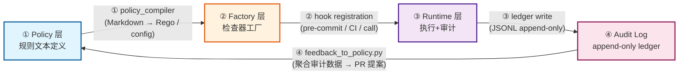
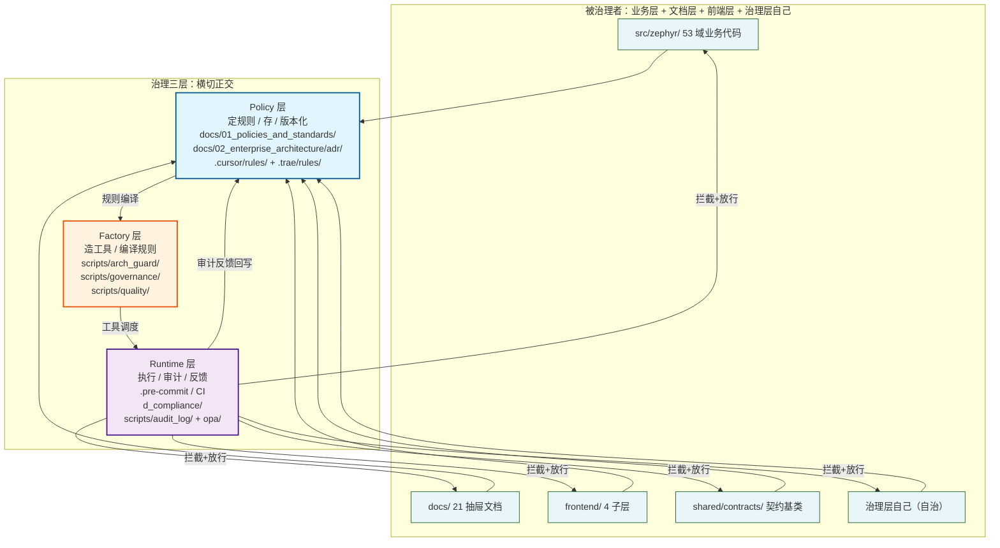

# 治理架构图

> **单一真源 / Single Source of Truth** — 本文档内嵌 mermaid 图，原独立 `.mmd` 已删除。

---

## governance d2b loop

> Source: 04_architecture_principles_decisions/governance_principles.md

---

## governance three layers

> Source: 04_architecture_principles_decisions/governance_principles.md

