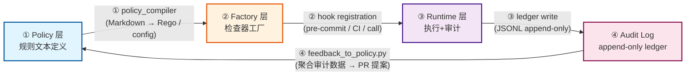
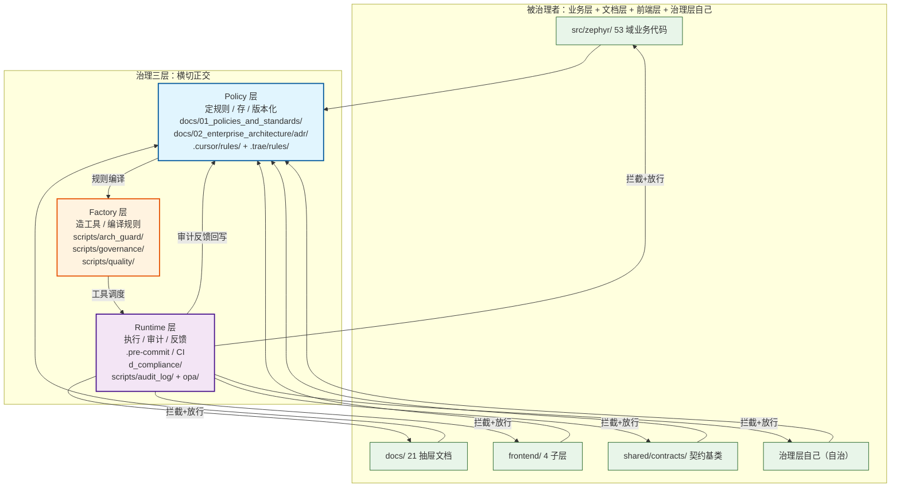

# 治理架构图

> ⚠️ **价值评估中** — 本文档由独立 `.mmd` 转换为内嵌 mermaid，供挨个评估其架构价值。

---

## governance d2b loop

> Source: 04_architecture_principles_decisions/governance_principles.md



---

## governance three layers

> Source: 04_architecture_principles_decisions/governance_principles.md



---

## capability heatmap visual

> 重写时间: 2026-06-26 (DM-200913 Phase4-B)
> 基于§2.1裁定: 14层降级为域属性，53域为唯一物理分类体系
> 数据源: depgraph
> 图例: 🔒 = frozen (不可变契约) | 🔓 = mutable (可变契约，状态机)
> 契约真源: architecture_model/contracts/cross_layer_contracts.yaml
> Source: capability_heatmap.md §3

```mermaid
%%{init: {'theme': 'default'}}%%
%% v2.0.0: 14层×7能力域 → 53域×10能力域矩阵
%% 成熟度数据由depgraph派生

graph LR
    subgraph Heatmap["53域×10能力域热力图（2026-06-26快照）"]
        subgraph 数据接入["数据接入"]
        D_MKT_DATA["D-MKT_DATA<br/>行情数据(接入+存储)<br/>L3+ (9节点)"]
        D_ALT_DATA["D-ALT_DATA<br/>另类数据<br/>L3+ (8节点)"]
        D_DATA_ENG["D-DATA_ENG<br/>数据工程(增值+融合+知识)<br/>L1-L2 (7节点)"]
    end
        subgraph 因子研究["因子研究"]
        D_FACTOR["D-FACTOR<br/>因子<br/>L3+ (17节点)"]
        D_SIGLEGACY["D-SIGLEGACY<br/>siglegacy<br/>L0 (0节点)"]
        D_FUNDAMENTAL_SIGNAL["D-FUNDAMENTAL_SIGNAL<br/>fundamental_signal<br/>L3+ (25节点)"]
        D_ASHARE_SIGNAL["D-ASHARE_SIGNAL<br/>ashare_signal<br/>L1-L2 (7节点)"]
        D_SIGQC["D-SIGQC<br/>signal_quality<br/>L1-L2 (7节点)"]
    end
        subgraph 策略决策["策略决策"]
        D_PF_CORE["D-PF_CORE<br/>组合核心<br/>L3+ (44节点)"]
        D_PF_ALLOC["D-PF_ALLOC<br/>组合分配<br/>L1-L2 (11节点)"]
        D_SELL_DECISION["D-SELL_DECISION<br/>卖出决策<br/>L1-L2 (7节点)"]
        D_CROSS_ASSET["D-CROSS_ASSET<br/>跨资产<br/>L3+ (11节点)"]
    end
        subgraph 执行交易["执行交易"]
        D_EX_CORE["D-EX_CORE<br/>执行核心<br/>L3+ (14节点)"]
        D_EX_SOR["D-EX_SOR<br/>执行路由<br/>L1-L2 (7节点)"]
        D_TRADING["D-TRADING<br/>交易运营<br/>L3+ (163节点)"]
        D_POSITION["D-POSITION<br/>仓位管理<br/>L1-L2 (8节点)"]
    end
        subgraph 风险控制["风险控制"]
        D_RISK["D-RISK<br/>风控<br/>L3+ (25节点)"]
        D_COMPLIANCE["D-COMPLIANCE<br/>合规<br/>L1-L2 (25节点)"]
    end
        subgraph 回测仿真["回测仿真"]
        D_BACKTEST["D-BACKTEST<br/>回测<br/>L1-L2 (7节点)"]
        D_SIMULATION["D-SIMULATION<br/>仿真<br/>L3+ (19节点)"]
        D_EXEC_SIM["D-EXEC_SIM<br/>执行仿真<br/>L1-L2 (7节点)"]
        D_DIGITAL_TWIN["D-DIGITAL_TWIN<br/>数字孪生<br/>L1-L2 (8节点)"]
    end
        subgraph ML平台["ML平台"]
        D_ML_TRAIN["D-ML_TRAIN<br/>model_profiling<br/>L1-L2 (12节点)"]
        D_ML_SERVE["D-ML_SERVE<br/>推理<br/>L1-L2 (7节点)"]
    end
        subgraph 治理_横切_["治理(横切)"]
        D_GOVERNANCE["D-GOVERNANCE<br/>lifecycle_management<br/>L3+ (2831节点)"]
        D_GOV_RULE["D-GOV_RULE<br/>rule_governance<br/>L3+ (11节点)"]
        D_GOV_AUDIT["D-GOV_AUDIT<br/>audit-trail<br/>L3+ (188节点)"]
        D_GOV_DRIFT["D-GOV_DRIFT<br/>drift_detection<br/>L3+ (24节点)"]
    end
        subgraph 安全_横切_["安全(横切)"]
        D_SECURITY["D-SECURITY<br/>adversarial_validation<br/>L3+ (244节点)"]
        D_BEHAVIORAL_AUDIT["D-BEHAVIORAL_AUDIT<br/>行为审计<br/>L3+ (79节点)"]
        D_DATA_SEC["D-DATA_SEC<br/>数据安全与契约<br/>L1-L2 (10节点)"]
        D_AUTONOMY_PERM["D-AUTONOMY_PERM<br/>escalation<br/>L3+ (70节点)"]
    end
        subgraph 基础设施_横切_["基础设施(横切)"]
        D_INFRA_OPS["D-INFRA_OPS<br/>resource_optimization<br/>L3+ (34节点)"]
        D_INFRA_RUNTIME["D-INFRA_RUNTIME<br/>runtime_integration<br/>L3+ (145节点)"]
        D_INTEGRATION["D-INTEGRATION<br/>pipeline_routing<br/>L3+ (296节点)"]
        D_SHARED["D-SHARED<br/>shared_services<br/>L3+ (296节点)"]
        D_FRONTEND["D-FRONTEND<br/>前端<br/>L3+ (23节点)"]
        D_REPORTING["D-REPORTING<br/>报告<br/>L3+ (15节点)"]
        D_KNOWLEDGE["D-KNOWLEDGE<br/>vector_memory<br/>L3+ (41节点)"]
        D_INTELLIGENCE["D-INTELLIGENCE<br/>context_management<br/>L3+ (56节点)"]
        D_AUTONOMY_CORE["D-AUTONOMY_CORE<br/>agent_communication<br/>L3+ (176节点)"]
        D_OPS["D-OPS<br/>feedback-loop<br/>L3+ (433节点)"]
    end

    %% 成熟度图例: L0=缺失 L1=设计 L2=草稿 L3+=可用/生产级
    %% 完整数据见 generated/design_vs_production.md
    style D_MKT_DATA fill:#fde68a
    style D_ALT_DATA fill:#fde68a
    style D_DATA_ENG fill:#bfdbfe
    style D_FACTOR fill:#fde68a
    style D_SIGLEGACY fill:#e5e7eb
    style D_FUNDAMENTAL_SIGNAL fill:#fde68a
    style D_ASHARE_SIGNAL fill:#bfdbfe
    style D_SIGQC fill:#bfdbfe
    style D_PF_CORE fill:#fde68a
    style D_PF_ALLOC fill:#bfdbfe
    style D_SELL_DECISION fill:#bfdbfe
    style D_CROSS_ASSET fill:#fde68a
    style D_EX_CORE fill:#fde68a
    style D_EX_SOR fill:#bfdbfe
    style D_TRADING fill:#fde68a
    style D_POSITION fill:#bfdbfe
    style D_RISK fill:#fde68a
    style D_COMPLIANCE fill:#bfdbfe
    style D_BACKTEST fill:#bfdbfe
    style D_SIMULATION fill:#fde68a
    style D_EXEC_SIM fill:#bfdbfe
    style D_DIGITAL_TWIN fill:#bfdbfe
    style D_ML_TRAIN fill:#bfdbfe
    style D_ML_SERVE fill:#bfdbfe
    style D_GOVERNANCE fill:#fde68a
    style D_GOV_RULE fill:#fde68a
    style D_GOV_AUDIT fill:#fde68a
    style D_GOV_DRIFT fill:#fde68a
    style D_SECURITY fill:#fde68a
    style D_BEHAVIORAL_AUDIT fill:#fde68a
    style D_DATA_SEC fill:#bfdbfe
    style D_AUTONOMY_PERM fill:#fde68a
    style D_INFRA_OPS fill:#fde68a
    style D_INFRA_RUNTIME fill:#fde68a
    style D_INTEGRATION fill:#fde68a
    style D_SHARED fill:#fde68a
    style D_FRONTEND fill:#fde68a
    style D_REPORTING fill:#fde68a
    style D_KNOWLEDGE fill:#fde68a
    style D_INTELLIGENCE fill:#fde68a
    style D_AUTONOMY_CORE fill:#fde68a
    style D_OPS fill:#fde68a
```
