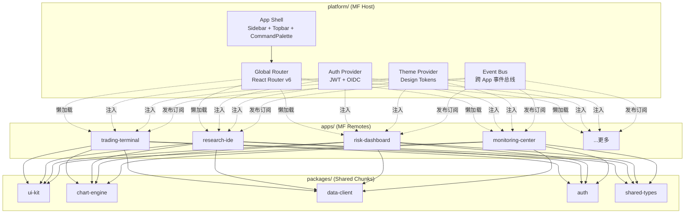
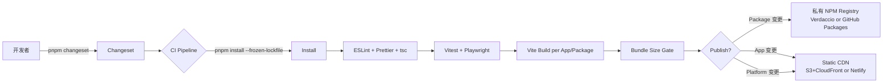
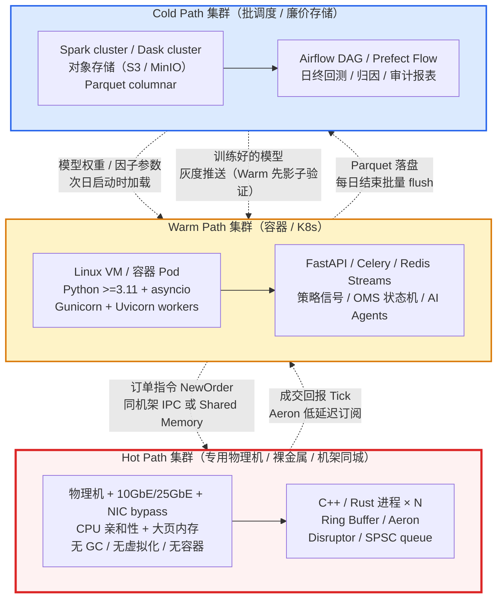
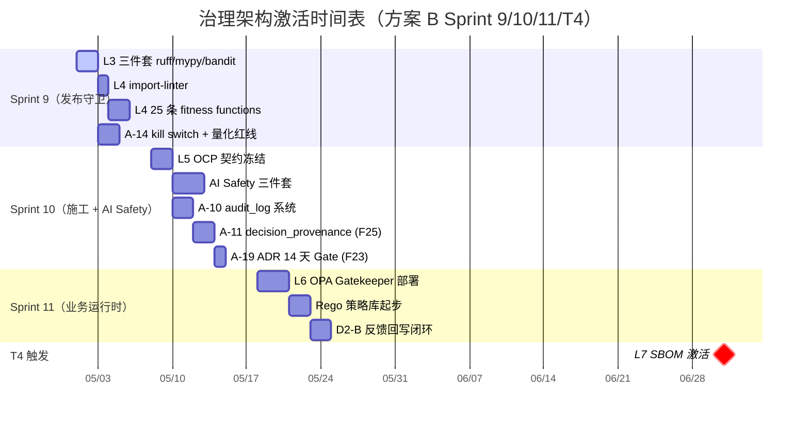
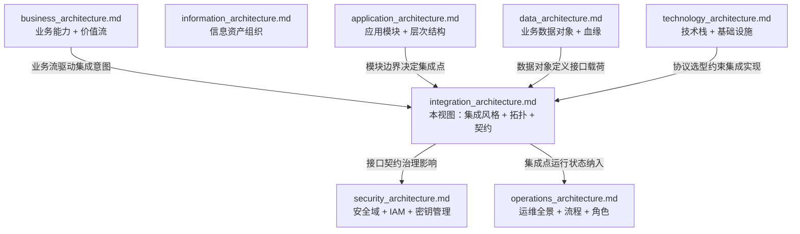
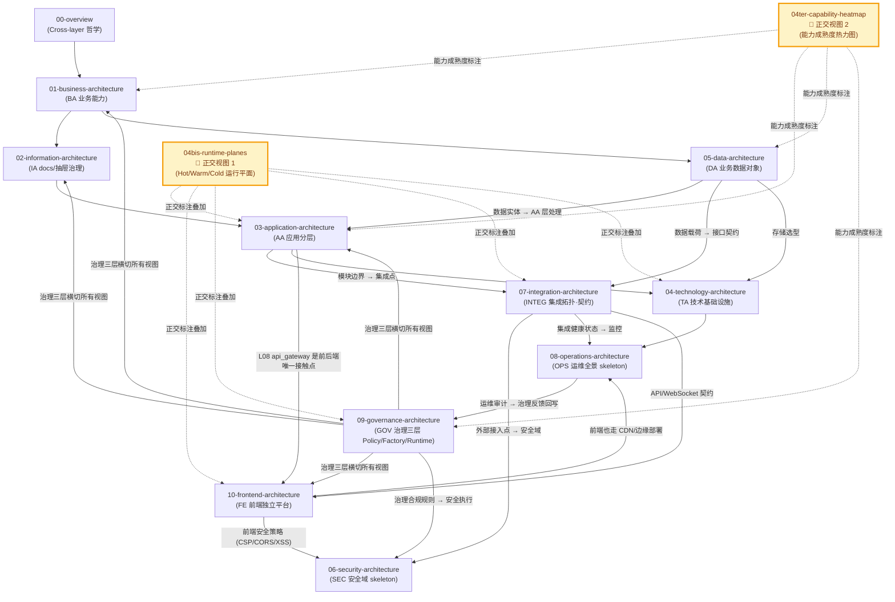

# 已删除图（被恢复）

> ⚠️ **价值评估中** — 本文档由独立 `.mmd` 转换为内嵌 mermaid，供挨个评估其架构价值。

---

## frontend mfe topology

> Source: frontend_architecture.md §4.1

---

## frontend build pipeline

> Source: frontend_architecture.md §7.1

---

## runtime planes topology

> Source: runtime_planes.md §2.3

---

## governance activation gantt

> Source: governance_architecture.md §6.2

---

## view dependencies

> Source: integration_architecture.md §8

---

## readme view dependency graph

> Source: README.md §4

