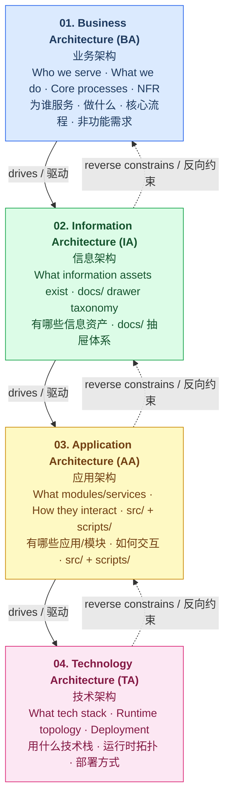
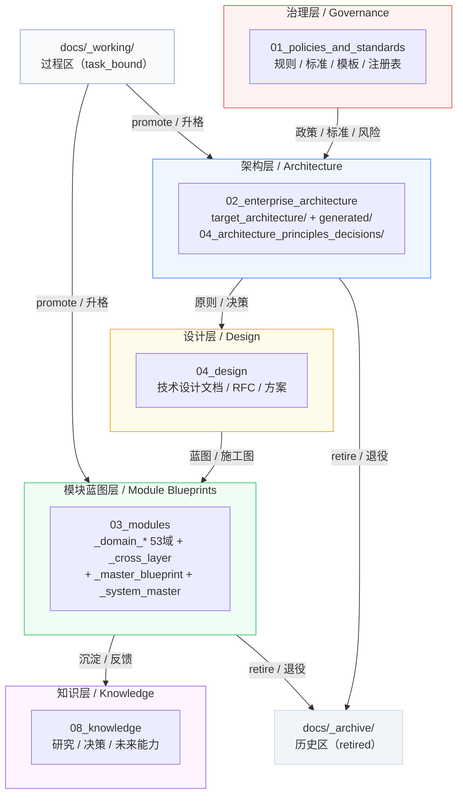
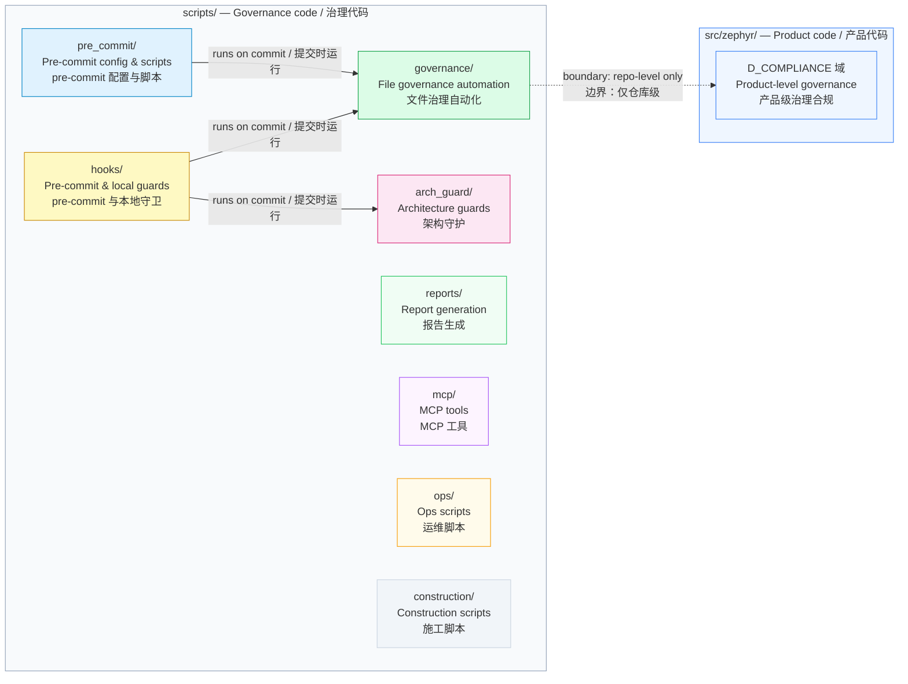
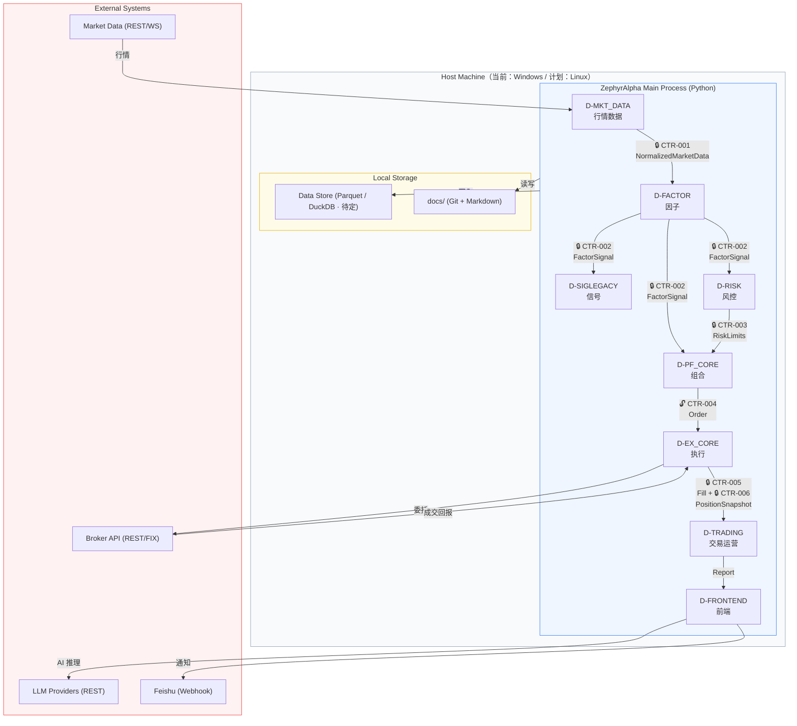

```mermaid
graph LR
    subgraph External["外部系统 External Systems"]
        MD["行情数据源<br/>Market Data Provider<br/>(EI-002)"]
        BK["券商 API<br/>Broker API<br/>(EI-001)"]
        LLM["LLM 服务商<br/>LLM Providers<br/>(EI-003)"]
        FS["飞书 Feishu<br/>(EI-004)"]
        ALT["另类数据源<br/>Alternative Data<br/>(EI-005)"]
    end

    subgraph ACL_Layer["反腐层 Anti-Corruption Layer"]
        CONN["D-MKT_DATA connectors/<br/>(ACL for market data)"]
        BROKER_A["D-EX_CORE adapters/<br/>(ACL for broker)"]
        LLM_A["D-FRONTEND/<br/>(ACL for LLM)"]
    end

    subgraph Core["ZephyrAlpha Core Domains (depgraph派生)"]
        D_MKT_DATA["D-MKT_DATA<br/>行情数据"]
        D_ALT_DATA["D-ALT_DATA<br/>另类数据"]
        D_FACTOR["D-FACTOR<br/>因子"]
        D_SIGNAL["D-SIGLEGACY<br/>信号"]
        D_RISK["D-RISK<br/>风控"]
        D_PF_CORE["D-PF_CORE<br/>组合核心"]
        D_EX_CORE["D-EX_CORE<br/>执行核心"]
        D_TRADING["D-TRADING<br/>交易运营"]
        D_REPORTING["D-REPORTING<br/>报告"]
        D_FRONTEND["D-FRONTEND<br/>前端"]
        D_ML_TRAIN["D-ML_TRAIN<br/>训练"]
        D_OPS["D-OPS<br/>反馈循环"]
    end

    subgraph Notify["通知输出 Output"]
        FS2["飞书 Feishu<br/>报告/通知"]
    end

    MD -- "REST/WebSocket<br/>行情数据" --> CONN
    ALT -- "REST/File<br/>另类数据" --> CONN
    CONN --> D_MKT_DATA
    BK -- "REST/FIX<br/>订单/成交" --> BROKER_A
    BROKER_A --> D_EX_CORE
    LLM -- "REST<br/>OpenAI-compatible" --> LLM_A
    LLM_A --> D_FRONTEND
    D_FRONTEND -- "决策/报告" --> FS2

    %% P0 Cross-Layer Contracts / 跨层数据契约承重墙
    %% 契约真源: cross_layer_contracts.yaml
    %% CTR-001: NormalizedMarketData (frozen) — D-MKT_DATA → D-FACTOR
    D_MKT_DATA -- "🔒 CTR-001<br/>NormalizedMarketData<br/>D-MKT_DATA → D-FACTOR" --> D_FACTOR

    %% CTR-002: FactorSignal (frozen) — D-FACTOR → D-SIGLEGACY/D-RISK/D-PF_CORE
    D_FACTOR -- "🔒 CTR-002<br/>FactorSignal<br/>D-FACTOR → D-SIGLEGACY" --> D_SIGNAL
    D_FACTOR -- "🔒 CTR-002<br/>FactorSignal<br/>D-FACTOR → D-RISK" --> D_RISK
    D_FACTOR -- "🔒 CTR-002<br/>FactorSignal<br/>D-FACTOR → D-PF_CORE" --> D_PF_CORE

    %% CTR-003: RiskLimits (frozen) — D-RISK → D-PF_CORE
    D_RISK -- "🔒 CTR-003<br/>RiskLimits<br/>D-RISK → D-PF_CORE" --> D_PF_CORE

    %% CTR-004: Order (mutable) — D-PF_CORE → D-EX_CORE
    D_PF_CORE -- "🔓 CTR-004<br/>Order<br/>D-PF_CORE → D-EX_CORE" --> D_EX_CORE

    %% CTR-005: Fill (frozen) — D-EX_CORE → D-TRADING
    D_EX_CORE -- "🔒 CTR-005<br/>Fill<br/>D-EX_CORE → D-TRADING" --> D_TRADING

    %% CTR-006: PositionSnapshot (frozen) — D-EX_CORE/D-TRADING → D-RISK/D-ML_TRAIN
    D_EX_CORE -- "🔒 CTR-006<br/>PositionSnapshot<br/>D-EX_CORE → D-RISK" --> D_RISK
    D_TRADING -- "🔒 CTR-006<br/>PositionSnapshot<br/>D-TRADING → D-ML_TRAIN" --> D_ML_TRAIN

    D_TRADING -- "PnL/Risk Metrics" --> D_OPS
    D_ML_TRAIN -- "ModelPrediction" --> D_FACTOR
    D_ML_TRAIN -- "ModelPrediction" --> D_PF_CORE
```

# 架构拓扑图

> ⚠️ **价值评估中** — 本文档由独立 `.mmd` 转换为内嵌 mermaid，供挨个评估其架构价值。

---

## togaf layer stack

---

## docs drawer topology

---

## scripts topology

---

## integration topology

> 重写时间: 2026-06-26 (DM-200913 Phase4-B)
> 基于§2.1裁定: 14层降级为域属性，53域为唯一物理分类体系
> 数据源: depgraph
> 图例: 🔒 = frozen (不可变契约) | 🔓 = mutable (可变契约，状态机)
> 契约真源: architecture_model/contracts/cross_layer_contracts.yaml
> Source: architecture_model/contracts/cross_layer_contracts.yaml（external_contracts EXT 系列 + CTR 数据流）
> v2.0.0: 14层节点→53域节点，保留P0跨层契约标注

---

## runtime topology

> 重写时间: 2026-06-26 (DM-200913 Phase4-B)
> 基于§2.1裁定: 14层降级为域属性，53域为唯一物理分类体系
> 数据源: depgraph
> 图例: 🔒 = frozen (不可变契约) | 🔓 = mutable (可变契约，状态机)
> 契约真源: architecture_model/contracts/cross_layer_contracts.yaml
> Source: technology_architecture.md §3.2
> v2.0.0: 14层节点→53域节点，保留P0跨层契约标注

