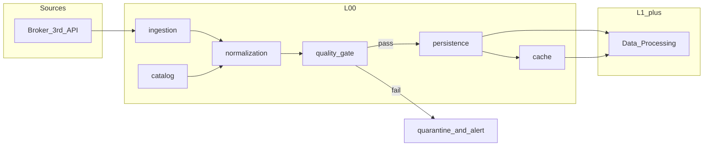

# L00 数据基础设施施工图（Data Infrastructure）

> **范围**：行情与参考数据的 **接入、落库、缓存、元数据与质量门禁、对 L1+ 的稳定输出**。  
> **非范围**：Alpha 特征计算（L2）、信号模型（L3）、风控限额（L4）——仅定义数据侧契约与依赖边界。

## 1. 前置条件

| 依赖 | 说明 |
|------|------|
| 蓝图 | `docs/02_FACTOR_LIBRARY/04_DATA_SOURCE/` 下数据源与目录约定 |
| 运行环境 | Python ≥ 3.12；本地开发栈见仓库根 `docker-compose.yml`（TimescaleDB/PostgreSQL + Redis） |
| 契约 | 全库 API/事件以 `API_Contract.md`（若存在）为真源；本施工图与之冲突时以契约为准并开治理单修订 |

## 2. 模块分解（建议 6 模块）

| 模块 ID | 名称 | 职责 |
|---------|------|------|
| L00-M1 | **ingestion** | 多数据源适配器（券商/三方 API），统一拉取会话与频率限制 |
| L00-M2 | **normalization** | 原始记录 → 标准 **OHLCVBar** / 参考数据 schema（Pydantic） |
| L00-M3 | **persistence** | 时序与元数据落库（PostgreSQL/Timescale）；迁移与分区策略 |
| L00-M4 | **cache** | Redis 热缓存、PubSub 或流式通知（可选） |
| L00-M5 | **catalog** | 标的、交易所日历、数据源版本与血缘登记 |
| L00-M6 | **quality_gate** | 缺失、复权、停牌、异常跳点检测；不合格批次告警与隔离 |

## 3. 公共 API（签名级，实现阶段落在 `src/zephyr/l00_*` 或约定包路径）

```python
# 说明：以下为施工图级契约，Phase 3 实现时须与 mypy / 单测对齐。

def fetch_bars(
    symbol: str,
    interval: str,
    start: "pd.Timestamp",
    end: "pd.Timestamp",
) -> list["OHLCVBar"]:
    """拉取并规范化 K 线；失败抛出 ZephyrBaseError 子类。"""


def persist_bars(batch: list["OHLCVBar"], source_run_id: str) -> int:
    """幂等写入；返回写入行数。"""


def get_catalog(symbol: str) -> "InstrumentMeta | None":
    """标的元数据查询。"""


def validate_batch(batch: list["OHLCVBar"]) -> "QualityReport":
    """质量门禁；不修改输入。"""
```

> 类型名 `OHLCVBar`、`InstrumentMeta`、`QualityReport` 须在共享 `zephyr.core` 或 `zephyr.contracts` 中定义为 Pydantic 模型（Phase 3 落地）。

## 4. 数据流（逻辑）



## 5. 测试要求（P0 思路）

| 模块 | 用例示例 |
|------|----------|
| normalization | 边界日期、空表、复权因子缺失 |
| persistence | 重复主键幂等、事务回滚 |
| quality_gate | 价格跳变阈值、成交量为零 |
| catalog | 未知 symbol、退市标的 |

## 6. 技术选型与 TDR

| 主题 | 选型 | 备注 |
|------|------|------|
| 关系库 | PostgreSQL + Timescale | 与 `docker-compose.yml` 一致 |
| 缓存 | Redis | 会话与分布式锁可后续补充 |
| HTTP | httpx + tenacity | 外部 API 须带重试 |
| 配置 | pydantic-settings | 已有 `zephyr.core.config` 模式可对齐 |

## 7. 已知风险

| 风险 | 缓解 |
|------|------|
| 数据源限频与断连 | ingestion 统一退避；熔断与健康检查 |
| 历史复权口径不一致 | catalog 记录 `adj_type`；质量门禁比对 |
| 大表查询拖垮 OLTP | 时序分区；L1 只读从库或只读连接（后续 TDR） |

## 8. 变更记录

| 版本 | 日期 | 变更 |
|------|------|------|
| 1.0.0 | 2026-04-16 | 首版施工图（Draft），供 Owner 复核 |
