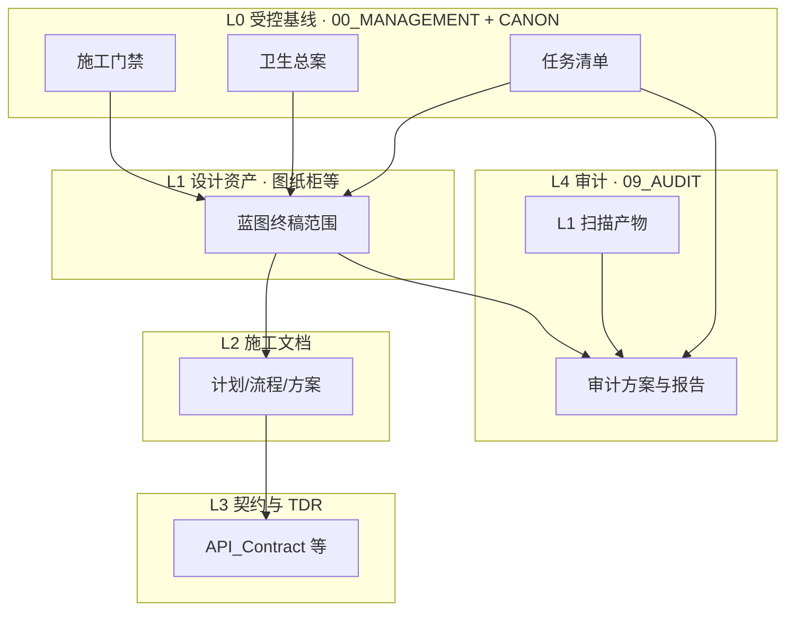

# 文档治理架构（专业机构常见模型 → 本仓库落地）

> **本文回答**：文档在仓库里分几层、谁（何种职能）对哪一层负责、与审计如何衔接。**不**替代各层正文（门禁、审计方案、Playbook 等），只建立**统一参照模型**。  
> **关联**：蓝图交付标准（机构精华版）（目标态与审计关系）· [项目办公室 README](./README.md)（入口表）· 全库治理文档导航。

```
```---
```

## 1. 架构目标

1. **单一真源可指认**：任意主题在对外引用时，能指向明确的 **canonical** 路径。  
2. **阶段清晰**：蓝图基线 → 施工文档 → 实现与验证；与 **门禁** §0 三阶段一致。  
3. **职责分区**：**受控规章 / 放行**、**模块设计正文**、**全库审计与标准**、**归档与重复簇** 分树存放，靠链接与任务清单衔接，而非混放。  
4. **审计可核查**：交付侧产出 **证据链**（勾选清单、扫描报告路径、登记表、版本记录）；审计侧按 `09_AUDIT` 方案独立（或 Owner 复查）核对。

```
```---
```

## 2. 分层模型（机构职能映射）

| 层级 | 机构常见名称 | 本仓库主要物理位置 | 职责摘要 |
|------|----------------|-------------------|----------|
| **L0 受控基线** | Controlled baseline / Document control（核心规章） | `00_MANAGEMENT/` + **`CANON/`** | 施工门禁、蓝图卫生总案、终稿定义、任务清单、登记表、交接说明；**放行与变更口径** |
| **L1 设计资产** | Design baseline / 正式图纸 | `01_BLUEPRINTS/`、`01_FRAMEWORK/*BLUEPRINT*` 等（以门禁 §0.2 为准） | 模块与系统设计说明；**终稿范围**内须满足质量与唯一性 |
| **L2 施工与建设文档** | Implementation package / 施工文件 | `06_CONSTRUCTION_DOCS/`（含 `03_CONSTRUCTION_PLANS/` 等） | 流程、计划、方案；与 §0.3 对齐 |
| **L3 契约与决策** | Interface control / TDR | `03_TRADING_TACTICS/API_Contract.md`、`01_FRAMEWORK/TECH_DECISION_RECORDS.md` 等 | 对外接口与重大技术决策 **可追溯** |
| **L4 质量保证与审计** | QA / Internal audit program | **`docs/09_AUDIT/`**（`PROCEDURES/`、`STANDARDS/`、`STATE/`、`REPORTS/`） | 审计方案、标准、扫描台账、整改报告；**查与证** |
| **L5 归档与重复治理** | Records / Obsolete & duplicate disposition | `06_ARCHIVE/`、`09_ARCHIVE/`（如 `duplicates/`） | 只读副本、历史包、**CANONICAL_POINTERS**；非活跃真源 |

```
```---
```

## 3. 控制流（数据流概览）



说明：**L4 不「审批」L1 的正文内容**（个人项目无独立审计部时，由 Owner 兼任），但 **L4 的程序与产物**用于证明「全库健康与整改状态」；**放行**仍以 **L0 CANON 门禁** 与 **任务清单** 为准。

```
```---
```

## 4. 真源裁决顺序（与交接说明一致）

发生冲突时，优先级与 PROJECT_OFFICE_AI_HANDOFF.md **第 3 节**（含 **§3.1 架构真源**）对齐；本架构文档**不**另起一套优先级。若本节与 HANDOFF 未来不一致，**以 HANDOFF 为准**，并回写本节。

```
```---
```

## 5. 与「把审计搬进办公室」的边界

- **不采纳**：将 `09_AUDIT` **整树**迁入 `00_MANAGEMENT` 作为唯一工作区（削弱分区、与既有导航策略冲突）。  
- **采纳**：办公室侧完成 **审计就绪**（证据、链接、任务闭环），并通过 全库治理文档导航 **链入**审计方案与台账。  
- 详见 蓝图交付标准（机构精华版） 第 3 节「办公室交付侧与全库审计」。

```
```---
```

## 6. 维护规则

- 新增「受控规章类」文件于 `00_MANAGEMENT/` 时：更新 [README](./README.md) 主表，并评估是否需在 **§2 分层表** 增行或脚注。  
- 变更 **CANON** 正文：同步全库引用与 front matter（与现有习惯一致）。  
- 本架构**大改**时：递增本文 `version`，并在版本记录中写一句摘要。

```
```---
```

## 7. 版本记录

| 版本 | 日期 | 说明 |
|------|------|------|
| 1.0.0 | 2026-04-10 | 首版：L0～L5 分层、mermaid 控制流、与审计边界 |
