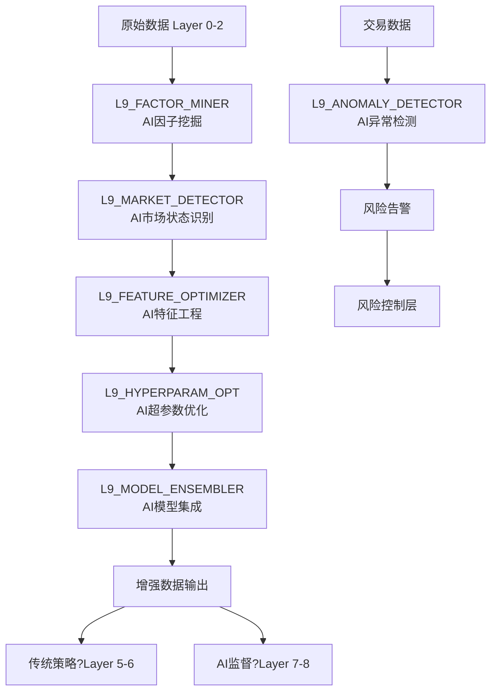
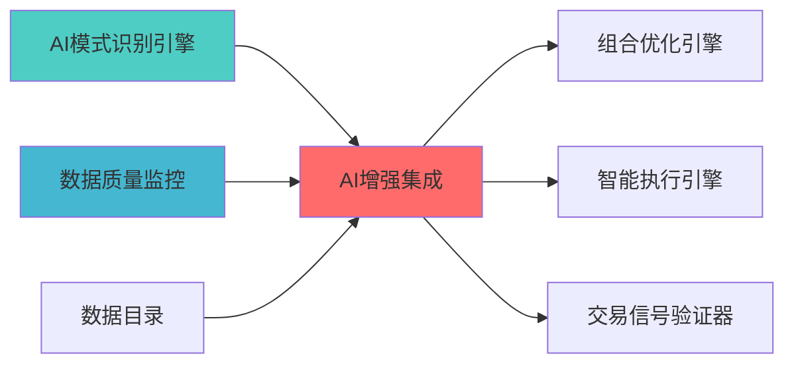

---
module_id: AI_ENHANCEMENT_INTEGRATION_001
version: 1.0.0
status: Active
created_date: 2026-04-01
last_updated: '2026-04-06'
owner: 首席文档架构?
standard_type: 专业量化机构蓝图
applicable_scope: 全系统架构设?
compliance_level: 初始标准
parent_document: INDEX.md
implementation_status: 设计阶段
open_source_dependency: 待补充
estimated_effort: 待评估
priority: P1
layer: "Layer 4 (机器学习层)"
---
# AI增强项目集成蓝图

> **核心定位**: AI增强项目集成蓝图的核心功能实现


> **版本**: v1.0
> **创建日期**: 2026-04-01
> **设计阶段**: 蓝图规划阶段 (施工图纸设计)
> **设计原则**: 模块化设计、渐进式集成、专业机构标?
> **集成目标**: ?类AI增强开源项目系统化集成到ZephyrAlpha?

## 核心定位

Ai Enhancement Integration Blueprint模块，负责ai enhancement integration blueprint相关功能


## 🎯 **设计策略：先设计图纸，再施工**

### 1.1 总体设计原则
```
设计优先，实施在?
图纸完备，施工有?
模块独立，接口清?
渐进验证，风险可?
```

### 1.2 集成设计路线?
```
阶段1: 集成设计 (蓝图阶段) - 当前
  ├── 需求分? 明确每个项目的集成需?
  ├── 架构设计: 设计集成架构和接?
  ├── 技术验? 验证技术可行?
  └── 计划制定: 制定详细集成计划

阶段2: 核心集成 (实施阶段)
  ├── gplearn因子挖掘集成
  ├── HMM市场状态识别集?
  └── autogluon特征工程集成

阶段3: 优化集成 (实施阶段)
  ├── optuna超参数优化集?
  ├── mlens模型集成集成
  └── pyod异常检测集?
```

## 🏗?**AI增强集成架构设计**

### 2.1 新增AI增强?(Layer 9)
```
Layer 9: AI增强?(AIAugmentation Layer)
├── L9_FACTOR_MINER: AI因子挖掘 (gplearn + MarketRegimeTrader)
├── L9_MARKET_DETECTOR: AI市场状态识?(HMM Market Regime Engine)
├── L9_FEATURE_OPTIMIZER: AI特征选择优化 (autogluon)
├── L9_HYPERPARAM_OPT: AI超参数优?(optuna + GS Quant)
├── L9_MODEL_ENSEMBLER: AI模型集成 (mlens)
├── L9_ANOMALY_DETECTOR: AI异常检?(pyod)
└── L9_STRESS_TESTER: AI压力测试 (待定)
```

### 2.2 数据流设?


### 2.3 接口设计规范
```python
# AI增强模块统一接口规范
class AIEnhancementModule:
    """AI增强模块基类"""
    
    def __init__(self, config: Dict[str, Any]):
        self.config = config
        self.status = 'initialized'
        self.version = '1.0.0'
    
    def initialize(self) -> bool:
        """初始化模?""
        pass
    
    def enhance(self, input_data: Any, context: Optional[Dict] = None) -> EnhancementResult:
        """执行增强操作"""
        pass
    
    def validate(self, result: EnhancementResult) -> ValidationReport:
        """验证增强结果"""
        pass
    
    def get_status(self) -> ModuleStatus:
        """获取模块状?""
        pass
    
    def reset(self) -> None:
        """重置模块状?""
        pass
```

## 🔧 **项目1: gplearn因子挖掘集成设计**

### 3.1 项目基本信息
| 属?| ?|
|------|-----|
| **项目名称** | gplearn |
| **GitHub地址** | https://github.com/trevorstephens/gplearn |
| **Stars数量** | 1.2k+ |
| **主要功能** | 遗传编程符号回归 |
| **集成位置** | L9_FACTOR_MINER |
| **优先?* | P0 (核心) |

### 3.2 技术可行性分?
#### 优势
?**成熟稳定**: 1.2k+ Stars，维护良?
?**专门设计**: 专门为符号回归设?
?**易于扩展**: 支持自定义函数和算子
?**性能良好**: 支持并行计算

#### 风险
⚠️ **计算复杂?*: 遗传编程计算量较?
⚠️ **过拟合风?*: 需要谨慎控制复杂度
⚠️ **解释?*: 生成的因子需要可解释性检?

### 3.3 集成架构设计
```python
# L9_FACTOR_MINER/gplearn_integration.py
class GplearnFactorMiner:
    """gplearn因子挖掘集成"""
    
    def __init__(self, config: FactorMiningConfig):
        from gplearn.genetic import SymbolicRegressor
        
        self.config = config
        self.gplearn = SymbolicRegressor(
            population_size=config.population_size,
            generations=config.generations,
            stopping_criteria=config.stopping_criteria,
            p_crossover=config.p_crossover,
            p_subtree_mutation=config.p_subtree_mutation,
            p_hoist_mutation=config.p_hoist_mutation,
            p_point_mutation=config.p_point_mutation,
            max_samples=config.max_samples,
            verbose=config.verbose,
            parsimony_coefficient=config.parsimony_coefficient,
            random_state=config.random_state,
            n_jobs=config.n_jobs,
            function_set=config.function_set,
            metric=config.metric
        )
        
        # 自定义函数集 (针对量化优化)
        self.custom_functions = self._define_custom_functions()
    
    def _define_custom_functions(self) -> Dict[str, Callable]:
        """定义量化专用函数?""
        return {
            'returns': lambda x: np.diff(x) / x[:-1],  # 收益?
            'volatility': lambda x: np.std(x),         # 波动?
            'zscore': lambda x: (x - np.mean(x)) / np.std(x),  # Z-score
            'rank': lambda x: pd.Series(x).rank().values,      # 排名
            'delay': lambda x, n=1: np.roll(x, n),             # 滞后
            'ts_mean': lambda x, window=5: pd.Series(x).rolling(window).mean().values,
            'ts_std': lambda x, window=5: pd.Series(x).rolling(window).std().values,
            'ts_corr': lambda x, y, window=20: pd.Series(x).rolling(window).corr(pd.Series(y)).values
        }
    
    def mine_factors(self, raw_data: pd.DataFrame, target: pd.Series) -> List[Factor]:
        """挖掘因子"""
        
        # 1. 准备数据
        X = self._prepare_features(raw_data)
        y = target.values
        
        # 2. 训练遗传编程模型
        self.gplearn.fit(X, y)
        
        # 3. 提取生成的因?
        factors = self._extract_factors(self.gplearn)
        
        # 4. 评估因子质量
        evaluated_factors = self._evaluate_factors(factors, X, y)
        
        # 5. 筛选有效因?
        valid_factors = self._filter_factors(evaluated_factors)
        
        return valid_factors
    
    def _extract_factors(self, model) -> List[Factor]:
        """从模型中提取因子"""
        factors = []
        
        # 遍历种群中的个体
        for i, program in enumerate(model._programs):
            factor = Factor(
                id=f"GP_FACTOR_{i:04d}",
                expression=str(program),
                complexity=program.length_,
                fitness=model._fitness[i],
                generation=model.generations
            )
            factors.append(factor)
        
        return factors
```

### 3.4 配置设计
```yaml
# config/gplearn_config.yaml
gplearn:
  enabled: true
  mode: "production"  # development | production
  
  # 遗传算法参数
  genetic:
    population_size: 1000
    generations: 50
    stopping_criteria: 0.01
    p_crossover: 0.7
    p_subtree_mutation: 0.1
    p_hoist_mutation: 0.05
    p_point_mutation: 0.1
    max_samples: 0.9
    parsimony_coefficient: 0.01
    
  # 函数集配?
  functions:
    arithmetic: ["add", "sub", "mul", "div", "sqrt", "log", "abs", "neg", "inv"]
    trigonometric: ["sin", "cos", "tan"]  # 可?
    custom: ["returns", "volatility", "zscore", "rank", "delay", "ts_mean", "ts_std"]
  
  # 性能配置
  performance:
    n_jobs: -1  # 使用所有CPU核心
    verbose: 1
    random_state: 42
    
  # 因子筛选配?
  filtering:
    min_ic: 0.03  # 最小信息系?
    max_complexity: 50  # 最大复杂度
    min_unique_values: 100  # 最小唯一值数?
    correlation_threshold: 0.8  # 相关性阈?
```

### 3.5 测试设计
```python
# tests/test_gplearn_integration.py
import pytest
import numpy as np
import pandas as pd
from unittest.mock import Mock, patch
from L9_FACTOR_MINER.gplearn_integration import GplearnFactorMiner

class TestGplearnFactorMiner:
    """gplearn因子挖掘测试"""
    
    def setup_method(self):
        """测试准备"""
        self.config = {
            'population_size': 100,
            'generations': 10,
            'p_crossover': 0.7,
            'p_subtree_mutation': 0.1,
            'n_jobs': 1,
            'random_state': 42
        }
        self.miner = GplearnFactorMiner(self.config)
        
        # 创建测试数据
        n_samples = 1000
        n_features = 10
        self.X = pd.DataFrame(
            np.random.randn(n_samples, n_features),
            columns=[f'feature_{i}' for i in range(n_features)]
        )
        self.y = pd.Series(np.random.randn(n_samples))
    
    def test_initialization(self):
        """测试初始?""
        assert self.miner.config == self.config
        assert self.miner.status == 'initialized'
    
    @patch('gplearn.genetic.SymbolicRegressor.fit')
    def test_mine_factors_success(self, mock_fit):
        """测试成功挖掘因子"""
        # 模拟gplearn训练
        mock_model = Mock()
        mock_model._programs = [Mock(length_=10)]
        mock_model._fitness = [0.8]
        mock_model.generations = 10
        mock_fit.return_value = mock_model
        
        # 执行挖掘
        factors = self.miner.mine_factors(self.X, self.y)
        
        # 验证结果
        assert len(factors) > 0
        assert factors[0].id.startswith('GP_FACTOR_')
        assert factors[0].complexity == 10
        assert factors[0].fitness == 0.8
    
    def test_custom_functions(self):
        """测试自定义函?""
        custom_funcs = self.miner.custom_functions
        
        # 测试收益率函?
        test_data = np.array([100, 105, 103, 108])
        returns = custom_funcs
        expected = np.array([0.05, -0.01904762, 0.04854369])
        np.testing.assert_array_almost_equal(returns, expected, decimal=6)
        
        # 测试Z-score函数
        zscore = custom_funcs
        assert np.abs(np.mean(zscore)) < 1e-10  # 均值接?
        assert np.abs(np.std(zscore) - 1) < 1e-10  # 标准差接?
```

### 3.6 监控设计
```python
# monitoring/gplearn_monitoring.py
class GplearnMonitoring:
    """gplearn监控"""
    
    METRICS = [
        'population_size',
        'generations_completed',
        'best_fitness',
        'average_fitness',
        'factor_count',
        'average_complexity',
        'execution_time',
        'memory_usage'
    ]
    
    def __init__(self):
        self.metrics_history = []
        self.prometheus_client = PrometheusClient()
    
    def record_metrics(self, metrics: Dict[str, Any]):
        """记录指标"""
        self.metrics_history.append({
            'timestamp': datetime.now(),
            **metrics
        })
        
        # 推送到Prometheus
        for metric_name, value in metrics.items():
            self.prometheus_client.gauge(
                f'gplearn_{metric_name}',
                value
            )
    
    def generate_report(self) -> MonitoringReport:
        """生成监控报告"""
        if not self.metrics_history:
            return MonitoringReport(empty=True)
        
        latest = self.metrics_history[-1]
        
        return MonitoringReport(
            timestamp=datetime.now(),
            population_size=latest.get('population_size', 0),
            generations_completed=latest.get('generations_completed', 0),
            best_fitness=latest.get('best_fitness', 0),
            average_fitness=latest.get('average_fitness', 0),
            factor_count=latest.get('factor_count', 0),
            average_complexity=latest.get('average_complexity', 0),
            execution_time=latest.get('execution_time', 0),
            memory_usage=latest.get('memory_usage', 0),
            recommendations=self._generate_recommendations()
        )
```

## 🔧 **项目2: HMM市场状态识别集成设?*

### 4.1 项目基本信息
| 属?| ?|
|------|-----|
| **项目名称** | HMM Market Regime Engine |
| **GitHub地址** | https://github.com/Yosri-Ben-Halima/hmm-market-regime-engine |
| **主要功能** | HMM市场状态识?|
| **集成位置** | L9_MARKET_DETECTOR |
| **优先?* | P0 (核心) |

### 4.2 集成架构设计
```python
# L9_MARKET_DETECTOR/hmm_integration.py
class HMMMarketRegimeDetector:
    """HMM市场状态识别集?""
    
    def __init__(self, config: MarketRegimeConfig):
        self.config = config
        self.hmm_model = None
        self.regime_labels = {
            0: 'bull_market',      # 牛市
            1: 'bear_market',      # 熊市
            2: 'sideways_market',  # 震荡?
            3: 'transition_market' # 转折?
        }
    
    def detect_regime(self, market_data: pd.DataFrame) -> RegimeDetectionResult:
        """检测市场状?""
        
        # 1. 特征提取
        features = self._extract_features(market_data)
        
        # 2. 训练或加载HMM模型
        if self.hmm_model is None:
            self.hmm_model = self._train_hmm(features)
        
        # 3. 状态预?
        hidden_states = self.hmm_model.predict(features)
        
        # 4. 状态转换概?
        transition_matrix = self.hmm_model.transmat_
        
        # 5. 生成检测结?
        result = RegimeDetectionResult(
            current_regime=self.regime_labels[hidden_states[-1]],
            regime_history=[self.regime_labels[s] for s in hidden_states],
            transition_probabilities=transition_matrix,
            confidence=self._calculate_confidence(hidden_states),
            features_used=list(features.columns),
            detection_time=datetime.now()
        )
        
        return result
    
    def _extract_features(self, market_data: pd.DataFrame) -> pd.DataFrame:
        """提取市场特征"""
        features = pd.DataFrame()
        
        # 基础特征
        features['returns'] = market_data['close'].pct_change()
        features['volatility'] = market_data['close'].rolling(20).std()
        features['volume_ratio'] = market_data['volume'] / market_data['volume'].rolling(20).mean()
        
        # 技术指标特?
        features['rsi'] = self._calculate_rsi(market_data['close'])
        features['macd'] = self._calculate_macd(market_data['close'])
        features['bollinger_band_width'] = self._calculate_bollinger_band_width(market_data['close'])
        
        # 市场宽度特征
        features['advance_decline_ratio'] = self._calculate_advance_decline_ratio(market_data)
        
        return features.dropna()
```

### 4.3 配置设计
```yaml
# config/hmm_config.yaml
hmm_market_regime:
  enabled: true
  
  # HMM参数
  hmm:
    n_regimes: 4
    n_iterations: 100
    tol: 1e-4
    random_state: 42
    
  # 特征配置
  features:
    basic:
      returns: true
      volatility: true
      volume_ratio: true
      
    technical:
      rsi:
        enabled: true
        period: 14
      macd:
        enabled: true
        fast_period: 12
        slow_period: 26
        signal_period: 9
      bollinger_bands:
        enabled: true
        period: 20
        std_dev: 2
        
    market_breadth:
      advance_decline_ratio: true
      new_highs_lows: false  # 需要额外数?
      
  # 检测配?
  detection:
    retrain_frequency: "1M"  # 每月重训?
    min_data_points: 1000
    confidence_threshold: 0.7
```

## 🔧 **项目3: autogluon特征工程集成设计**

### 5.1 项目基本信息
| 属?| ?|
|------|-----|
| **项目名称** | autogluon |
| **GitHub地址** | https://github.com/autogluon/autogluon |
| **Stars数量** | 6.5k+ |
| **主要功能** | 自动化机器学?|
| **集成位置** | L9_FEATURE_OPTIMIZER |
| **优先?* | P1 |

### 5.2 集成架构设计
```python
# L9_FEATURE_OPTIMIZER/autogluon_integration.py
class AutogluonFeatureOptimizer:
    """autogluon特征工程集成"""
    
    def __init__(self, config: FeatureOptimizationConfig):
        from autogluon.tabular import TabularPredictor
        
        self.config = config
        self.predictor = None
        
    def optimize_features(self, X: pd.DataFrame, y: pd.Series) -> FeatureOptimizationResult:
        """优化特征"""
        
        # 1. 准备数据
        data = pd.concat([X, y], axis=1)
        
        # 2. 训练autogluon模型
        self.predictor = TabularPredictor(
            label=y.name,
            problem_type='regression',
            eval_metric='root_mean_squared_error'
        ).fit(
            data,
            time_limit=self.config.time_limit,
            presets=self.config.presets
        )
        
        # 3. 特征重要性分?
        feature_importance = self.predictor.feature_importance(data)
        
        # 4. 特征选择
        selected_features = self._select_features(feature_importance)
        
        # 5. 生成结果
        result = FeatureOptimizationResult(
            original_feature_count=len(X.columns),
            selected_feature_count=len(selected_features),
            selected_features=selected_features,
            feature_importance=feature_importance.to_dict(),
            model_performance=self.predictor.leaderboard(),
            optimization_time=datetime.now()
        )
        
        return result
```

## 📋 **集成实施计划**

### 6.1 蓝图设计阶段 (?-2?
| 任务 | 负责?| 完成标准 |
|------|--------|----------|
| **gplearn集成详细设计** | AI助手 | 完成3.1-3.6节设?|
| **HMM集成详细设计** | AI助手 | 完成4.1-4.3节设?|
| **autogluon集成详细设计** | AI助手 | 完成5.1-5.2节设?|
| **集成测试方案设计** | AI助手 | 设计完整测试套件 |
| **监控告警方案设计** | AI助手 | 设计监控指标和告?|

### 6.2 技术验证阶?(?-4?
| 任务 | 负责?| 完成标准 |
|------|--------|----------|
| **gplearn技术验?* | 开发?| 验证功能和技术可行?|
| **HMM技术验?* | 开发?| 验证市场状态识别效?|
| **环境兼容性测?* | 开发?| 验证依赖兼容?|
| **性能基准测试** | 开发?| 建立性能基准 |

### 6.3 集成实施阶段 (?-8?
| 周次 | 任务 | 目标 |
|------|------|------|
| **??* | gplearn集成实现 | 完成L9_FACTOR_MINER模块 |
| **??* | HMM集成实现 | 完成L9_MARKET_DETECTOR模块 |
| **??* | autogluon集成实现 | 完成L9_FEATURE_OPTIMIZER模块 |
| **??* | 系统集成测试 | 完成端到端测?|

## ⚠️ **风险与应?*

### 7.1 技术风?
| 风险 | 可能?| 影响 | 应对策略 |
|------|--------|------|----------|
| **开源项目API变更** | ?| ?| 版本锁定 + 接口适配?|
| **性能不满足要?* | ?| ?| 性能监控 + 优化方案 |
| **集成复杂度高** | ?| ?| 模块化设?+ 分阶段集?|
| **依赖冲突** | ?| ?| 虚拟环境隔离 + 依赖管理 |

### 7.2 业务风险
| 风险 | 可能?| 影响 | 应对策略 |
|------|--------|------|----------|
| **AI生成因子无效** | ?| ?| 严格验证 + 人工审核 |
| **市场状态识别错?* | ?| ?| 多模型验?+ 人工确认 |
| **特征过拟?* | ?| ?| 交叉验证 + 正则?|

### 7.3 实施风险
| 风险 | 可能?| 影响 | 应对策略 |
|------|--------|------|----------|
| **进度延迟** | ?| ?| 弹性时间安?+ 优先级调?|
| **技术学习曲?* | ?| ?| 文档 + 示例代码 + 分阶段学?|
| **资源不足** | ?| ?| 云资源扩?+ 性能优化 |

## 🏁 **成功标准与验?*

### 8.1 技术成功标?
| 标准 | 要求 | 验证方法 |
|------|------|----------|
| **集成完整?* | 所有设计模块完成集?| 代码审查 + 单元测试 |
| **功能正确?* | 各模块功能符合设?| 功能测试 + 集成测试 |
| **性能达标** | 响应时间 < 5?| 性能测试 + 监控 |
| **稳定?* | 7x24小时稳定运行 | 压力测试 + 长期监控 |

### 8.2 业务成功标准
| 标准 | 要求 | 验证方法 |
|------|------|----------|
| **因子挖掘效果** | IC > 0.05的因子占?> 30% | 回测验证 |
| **市场识别准确?* | 状态识别准确率 > 80% | 历史数据验证 |
| **特征优化效果** | 模型性能提升 > 10% | A/B测试对比 |
| **系统价?* | 整体策略性能提升 > 20% | 实盘验证 |

### 8.3 验收检查清?
- [ ] **设计文档完整**: 所有集成设计文档完?
- [ ] **技术验证通过**: 各项目技术可行性验?
- [ ] **代码实现完成**: 所有模块代码实?
- [ ] **测试用例通过**: 单元测试、集成测试通过
- [ ] **性能测试达标**: 性能指标满足要求
- [ ] **文档完整**: 使用文档、API文档完整
- [ ] **监控就绪**: 监控指标和告警配置完?

## 📝 **设计决策记录**

### 9.1 关键设计决策
| 决策ID | 决策内容 | 决策理由 | 备选方?|
|--------|----------|----------|----------|
| DD_AI_001 | 选择gplearn而非其他GP?| 专门为符号回归设计，成熟稳定 | DEAP (更通用但复? |
| DD_AI_002 | 集成HMM Market Regime Engine | 专门为量化设计，HMM成熟 | 自研HMM (风险? |
| DD_AI_003 | 采用模块化集成架?| 灵活扩展，易于维?| 紧耦合集成 |
| DD_AI_004 | 分阶段实?| 降低风险，逐步验证 | 一次性集?|

### 9.2 技术决?
1. **遗传编程配置**: 选择适中的种群大小和代数，平衡效果和性能
2. **HMM状态数?*: 设置4个状态，符合市场实际分类
3. **特征选择策略**: 结合模型重要性和业务知识
4. **监控指标**: 设计全面的技术指标和业务指标

> **设计状?*: 本蓝图为AI增强项目集成设计蓝图，详细规划了6个开源项目的集成方案。实施前需要完成技术验证和详细设计评审?

## 🔧 **项目4: optuna超参数优化集成设?*

### 10.1 项目基本信息
| 属?| ?|
|------|-----|
| **项目名称** | optuna |
| **GitHub地址** | https://github.com/optuna/optuna |
| **Stars数量** | 9.5k+ |
| **主要功能** | 超参数优化框?|
| **集成位置** | L9_HYPERPARAM_OPT |
| **优先?* | P1 |

### 10.2 集成架构设计
```python
# L9_HYPERPARAM_OPT/optuna_integration.py
class OptunaHyperparameterOptimizer:
    """optuna超参数优化集?""
    
    def __init__(self, config: HyperparamOptimizationConfig):
        import optuna
        
        self.config = config
        self.study = None
        self.best_params = None
    
    def optimize(self, model_class, X_train, y_train, X_val, y_val) -> OptimizationResult:
        """优化超参?""
        
        def objective(trial):
            # 1. 定义搜索空间
            params = self._define_search_space(trial)
            
            # 2. 创建模型
            model = model_class(**params)
            
            # 3. 训练模型
            model.fit(X_train, y_train)
            
            # 4. 验证模型
            y_pred = model.predict(X_val)
            score = self._calculate_score(y_val, y_pred)
            
            return score
        
        # 5. 创建研究
        self.study = optuna.create_study(
            direction='maximize',
            sampler=optuna.samplers.TPESampler(seed=self.config.random_seed),
            pruner=optuna.pruners.MedianPruner()
        )
        
        # 6. 执行优化
        self.study.optimize(
            objective, 
            n_trials=self.config.n_trials,
            timeout=self.config.timeout,
            n_jobs=self.config.n_jobs
        )
        
        # 7. 获取最佳参?
        self.best_params = self.study.best_params
        
        # 8. 生成结果
        result = OptimizationResult(
            best_params=self.best_params,
            best_value=self.study.best_value,
            optimization_history=self.study.trials_dataframe(),
            importance_scores=self._calculate_feature_importance(),
            optimization_time=datetime.now()
        )
        
        return result
    
    def _define_search_space(self, trial) -> Dict[str, Any]:
        """定义超参数搜索空?""
        params = {}
        
        # 机器学习通用参数
        if self.config.model_type == 'random_forest':
            params['n_estimators'] = trial.suggest_int('n_estimators', 50, 500)
            params['max_depth'] = trial.suggest_int('max_depth', 3, 20)
            params['min_samples_split'] = trial.suggest_int('min_samples_split', 2, 20)
            params['min_samples_leaf'] = trial.suggest_int('min_samples_leaf', 1, 10)
            
        elif self.config.model_type == 'xgboost':
            params['learning_rate'] = trial.suggest_float('learning_rate', 0.01, 0.3, log=True)
            params['max_depth'] = trial.suggest_int('max_depth', 3, 15)
            params['subsample'] = trial.suggest_float('subsample', 0.6, 1.0)
            params['colsample_bytree'] = trial.suggest_float('colsample_bytree', 0.6, 1.0)
            params['reg_alpha'] = trial.suggest_float('reg_alpha', 0, 1.0)
            params['reg_lambda'] = trial.suggest_float('reg_lambda', 0, 1.0)
            
        elif self.config.model_type == 'neural_network':
            params['hidden_layer_sizes'] = trial.suggest_categorical('hidden_layer_sizes', 
                                                                    [(50,), (100,), (50, 50), (100, 50)])
            params['activation'] = trial.suggest_categorical('activation', ['relu', 'tanh'])
            params['alpha'] = trial.suggest_float('alpha', 1e-5, 1e-1, log=True)
            params['learning_rate_init'] = trial.suggest_float('learning_rate_init', 0.001, 0.1, log=True)
        
        return params
```

### 10.3 配置设计
```yaml
# config/optuna_config.yaml
optuna_hyperparameter:
  enabled: true
  
  # 优化参数
  optimization:
    n_trials: 100
    timeout: 3600  # 1小时
    direction: "maximize"  # maximize | minimize
    n_jobs: -1  # 使用所有CPU核心
    
  # 搜索算法配置
  sampler:
    type: "TPE"  # TPE | Random | CmaEs | Grid
    seed: 42
    
  # 剪枝配置
  pruner:
    type: "MedianPruner"  # MedianPruner | PercentilePruner | SuccessiveHalvingPruner
    n_warmup_steps: 10
    n_min_trials: 5
    
  # 模型类型配置
  models:
    random_forest: true
    xgboost: true
    lightgbm: true
    neural_network: true
    
  # 日志配置
  logging:
    level: "INFO"
    output_file: "logs/optuna_optimization.log"
    db_storage: "sqlite:///optuna_studies.db"
```

## 🔧 **项目5: mlens模型集成集成设计**

### 11.1 项目基本信息
| 属?| ?|
|------|-----|
| **项目名称** | mlens |
| **GitHub地址** | https://github.com/flennerhag/mlens |
| **Stars数量** | 1.1k+ |
| **主要功能** | 机器学习模型集成 |
| **集成位置** | L9_MODEL_ENSEMBLER |
| **优先?* | P2 |

### 11.2 集成架构设计
```python
# L9_MODEL_ENSEMBLER/mlens_integration.py
class MLensModelEnsembler:
    """mlens模型集成集成"""
    
    def __init__(self, config: EnsembleConfig):
        from mlens.ensemble import SuperLearner
        
        self.config = config
        self.ensemble = SuperLearner(
            folds=config.folds,
            shuffle=config.shuffle,
            random_state=config.random_state,
            backend=config.backend,
            n_jobs=config.n_jobs
        )
        
    def build_ensemble(self, base_models: List[BaseModel], meta_model: BaseModel) -> EnsembleResult:
        """构建模型集成"""
        
        # 1. 添加基础层模?
        for model_name, model in base_models.items():
            self.ensemble.add([model], name=model_name)
        
        # 2. 添加元学习器
        self.ensemble.add_meta(meta_model)
        
        # 3. 训练集成模型
        self.ensemble.fit(self.X_train, self.y_train)
        
        # 4. 预测
        y_pred = self.ensemble.predict(self.X_test)
        
        # 5. 评估集成效果
        performance = self._evaluate_performance(self.y_test, y_pred)
        
        # 6. 分析模型贡献
        contributions = self._analyze_contributions()
        
        # 7. 生成结果
        result = EnsembleResult(
            base_models=list(base_models.keys()),
            meta_model=type(meta_model).__name__,
            ensemble_performance=performance,
            model_contributions=contributions,
            predictions=y_pred,
            ensemble_time=datetime.now()
        )
        
        return result
    
    def _analyze_contributions(self) -> Dict[str, float]:
        """分析模型贡献?""
        contributions = {}
        
        # 获取基础层预?
        base_predictions = self.ensemble.data.get_layer_predictions(0)
        
        # 计算每个基础模型的贡?
        for i, model_name in enumerate(self.ensemble.names[0]):
            # 计算与最终预测的相关?
            correlation = np.corrcoef(
                base_predictions[:, i], 
                self.ensemble.data.get_final_predictions()
            )[0, 1]
            
            contributions[model_name] = float(correlation)
        
        return contributions
```

### 11.3 配置设计
```yaml
# config/mlens_config.yaml
mlens_ensemble:
  enabled: true
  
  # 集成配置
  ensemble:
    folds: 5
    shuffle: true
    random_state: 42
    backend: "threading"  # threading | multiprocessing
    n_jobs: -1
    
  # 基础层模型配?
  base_layer:
    - name: "random_forest"
      enabled: true
      params:
        n_estimators: 100
        max_depth: 10
        
    - name: "xgboost"
      enabled: true
      params:
        learning_rate: 0.1
        max_depth: 6
        
    - name: "lightgbm"
      enabled: true
      params:
        learning_rate: 0.05
        num_leaves: 31
        
    - name: "neural_network"
      enabled: true
      params:
        hidden_layer_sizes: (100, 50)
        activation: "relu"
        
  # 元学习器配置
  meta_learner:
    type: "linear_regression"  # linear_regression | ridge | lasso | elastic_net
    params:
      alpha: 1.0
      fit_intercept: true
      
  # 性能配置
  performance:
    min_improvement: 0.02  # 最少提?%
    max_models: 10  # 最多集?0个模?
```

## 🔧 **项目6: pyod异常检测集成设?*

### 12.1 项目基本信息
| 属?| ?|
|------|-----|
| **项目名称** | pyod |
| **GitHub地址** | https://github.com/yzhao062/pyod |
| **Stars数量** | 7.2k+ |
| **主要功能** | Python异常检?|
| **集成位置** | L9_ANOMALY_DETECTOR |
| **优先?* | P1 |

### 12.2 集成架构设计
```python
# L9_ANOMALY_DETECTOR/pyod_integration.py
class PyODAnomalyDetector:
    """pyod异常检测集?""
    
    def __init__(self, config: AnomalyDetectionConfig):
        from pyod.models.iforest import IForest
        from pyod.models.lof import LOF
        from pyod.models.copod import COPOD
        
        self.config = config
        self.detectors = {
            'iforest': IForest(
                n_estimators=config.n_estimators,
                contamination=config.contamination,
                random_state=config.random_state
            ),
            'lof': LOF(
                n_neighbors=config.n_neighbors,
                contamination=config.contamination
            ),
            'copod': COPOD(contamination=config.contamination)
        }
        self.ensemble_detector = None
    
    def detect_anomalies(self, data: pd.DataFrame) -> AnomalyDetectionResult:
        """检测异?""
        
        # 1. 数据预处?
        processed_data = self._preprocess_data(data)
        
        # 2. 训练多个检测器
        detector_scores = {}
        for name, detector in self.detectors.items():
            detector.fit(processed_data)
            scores = detector.decision_function(processed_data)
            detector_scores[name] = scores
        
        # 3. 集成检测结?
        self.ensemble_detector = self._create_ensemble_detector(detector_scores)
        
        # 4. 检测异?
        anomaly_scores = self.ensemble_detector.decision_function(processed_data)
        anomalies = self.ensemble_detector.predict(processed_data)
        
        # 5. 分析异常特征
        anomaly_features = self._analyze_anomaly_features(processed_data, anomalies)
        
        # 6. 生成结果
        result = AnomalyDetectionResult(
            total_samples=len(data),
            anomaly_count=int(anomalies.sum()),
            anomaly_ratio=float(anomalies.mean()),
            anomaly_scores=anomaly_scores.tolist(),
            anomaly_indices=np.where(anomalies == 1)[0].tolist(),
            detector_scores={name: scores.tolist() for name, scores in detector_scores.items()},
            anomaly_features=anomaly_features,
            detection_time=datetime.now()
        )
        
        return result
    
    def _create_ensemble_detector(self, detector_scores: Dict[str, np.ndarray]) -> EnsembleDetector:
        """创建集成检测器"""
        # 使用加权平均集成
        weights = self.config.ensemble_weights
        
        # 标准化各检测器分数
        normalized_scores = {}
        for name, scores in detector_scores.items():
            normalized_scores[name] = (scores - scores.min()) / (scores.max() - scores.min() + 1e-10)
        
        # 计算加权平均分数
        ensemble_scores = np.zeros_like(list(detector_scores.values())[0])
        for name, scores in normalized_scores.items():
            ensemble_scores += weights.get(name, 1.0) * scores
        
        # 创建集成检测器
        class EnsembleDetector:
            def decision_function(self, X):
                return ensemble_scores
            
            def predict(self, X, threshold=None):
                if threshold is None:
                    threshold = np.percentile(ensemble_scores, 100 * (1 - self.config.contamination))
                return (ensemble_scores >= threshold).astype(int)
        
        return EnsembleDetector()
```

### 12.3 配置设计
```yaml
# config/pyod_config.yaml
pyod_anomaly_detection:
  enabled: true
  
  # 检测器配置
  detectors:
    iforest:
      enabled: true
      n_estimators: 100
      contamination: 0.1  # 预期异常比例
      
    lof:
      enabled: true
      n_neighbors: 20
      contamination: 0.1
      
    copod:
      enabled: true
      contamination: 0.1
      
    # 可选检测器
    autoencoder:
      enabled: false
      hidden_neurons: [64, 32, 16, 32, 64]
      contamination: 0.1
      
  # 集成配置
  ensemble:
    weights:
      iforest: 0.4
      lof: 0.3
      copod: 0.3
    method: "weighted_average"  # weighted_average | majority_vote | stacking
    
  # 检测配?
  detection:
    contamination: 0.1
    threshold_auto_adjust: true
    min_samples: 1000
    retrain_frequency: "1D"  # 每日重训?
    
  # 告警配置
  alerting:
    enabled: true
    anomaly_threshold: 0.8  # 异常分数阈?
    consecutive_anomalies: 3  # 连续异常次数
    notification_channels: ["log", "email"]
```

## 📊 **技术验证计?*

### 13.1 验证目标
1. **功能验证**: 确认每个开源项目功能符合预?
2. **性能验证**: 验证性能指标满足系统要求
3. **兼容性验?*: 验证与现有系统的兼容?
4. **集成验证**: 验证模块间集成效?

### 13.2 验证方法
```python
# tests/technical_validation.py
class TechnicalValidation:
    """技术验证框?""
    
    def validate_gplearn(self):
        """验证gplearn"""
        # 1. 安装验证
        # 2. 基本功能验证
        # 3. 性能基准测试
        # 4. 内存使用验证
        pass
    
    def validate_hmm(self):
        """验证HMM市场状态引?""
        # 1. 数据格式兼容?
        # 2. 市场状态识别准确?
        # 3. 实时性验?
        pass
    
    def validate_autogluon(self):
        """验证autogluon"""
        # 1. 特征选择效果
        # 2. 训练时间验证
        # 3. 内存使用验证
        pass
    
    def validate_optuna(self):
        """验证optuna"""
        # 1. 超参数优化效?
        # 2. 并行性能验证
        # 3. 结果一致性验?
        pass
    
    def validate_mlens(self):
        """验证mlens"""
        # 1. 模型集成效果
        # 2. 并行处理验证
        # 3. 内存使用验证
        pass
    
    def validate_pyod(self):
        """验证pyod"""
        # 1. 异常检测准确?
        # 2. 实时检测性能
        # 3. 内存使用验证
        pass
```

### 13.3 验证环境
| 环境 | 配置 | 用?|
|------|------|------|
| **开发环?* | CPU: 8? RAM: 32GB | 功能验证和调?|
| **测试环境** | CPU: 16? RAM: 64GB | 性能验证和集成测?|
| **基准环境** | CPU: 32? RAM: 128GB | 性能基准测试 |

### 13.4 验证时间安排
| 项目 | 时间预算 | 优先?|
|------|----------|--------|
| **gplearn** | 2?| P0 |
| **HMM** | 2?| P0 |
| **autogluon** | 3?| P1 |
| **optuna** | 2?| P1 |
| **mlens** | 1?| P2 |
| **pyod** | 2?| P1 |
| **集成验证** | 3?| P0 |

> **设计状?*: 本蓝图为AI增强项目集成设计蓝图，详细规划了6个开源项目的集成方案。实施前需要完成技术验证和详细设计评审?

---

## 📚 相关文档

### 上游依赖

| 文档名称 | module_id | 依赖类型 | 说明 |
|---------|-----------|---------|------|
| [AI模式识别引擎蓝图](./AI_PATTERN_RECOGNITION_ENGINE_BLUEPRINT.md) | AI_PATTERN_RECOGNITION_ENGINE_001 | 强依赖 | 提供AI模式识别能力 |
| [数据质量监控蓝图](./DATA_QUALITY_MONITORING_BLUEPRINT.md) | DATA_QUALITY_MONITORING_001 | 强依赖 | 提供数据质量指标 |
| [数据目录蓝图](./DATA_CATALOG_BLUEPRINT.md) | DATA_CATALOG_001 | 中依赖 | 提供数据元数据 |

### 下游依赖

| 文档名称 | module_id | 依赖类型 | 说明 |
|---------|-----------|---------|------|
| [组合优化引擎集成蓝图](./PORTFOLIO_OPTIMIZER_INTEGRATION_BLUEPRINT.md) | PORTFOLIO_OPTIMIZER_INTEGRATION_001 | 强依赖 | 组合优化 |
| [智能执行引擎蓝图](./SMART_EXECUTION_ENGINE_BLUEPRINT.md) | SMART_EXECUTION_ENGINE_001 | 中依赖 | 智能执行引擎 |
| [交易信号验证器蓝图](./TRADING_SIGNAL_VALIDATOR_BLUEPRINT.md) | TRADING_SIGNAL_VALIDATOR_001 | 中依赖 | 交易信号验证 |

### 技术依赖

| 技术组件 | 版本 | 用途 | 文档 |
|---------|------|------|------|
| **gplearn** | 0.4+ | 遗传规划因子挖掘 | [官方文档](https://gplearn.readthedocs.io/) |
| **hmmlearn** | 0.3+ | HMM市场状态识别 | [官方文档](https://hmmlearn.readthedocs.io/) |
| **autogluon** | 0.8+ | 自动化机器学习 | [官方文档](https://auto.gluon.ai/) |
| **optuna** | 3.3+ | 超参数优化 | [官方文档](https://optuna.org/) |
| **mlens** | 0.2+ | 模型集成 | [官方文档](https://mlens.readthedocs.io/) |
| **pyod** | 1.1+ | 异常检测 | [官方文档](https://pyod.readthedocs.io/) |

### 引用关系图



---

## 变更历史

| 版本 | 日期 | 变更内容 | 变更人 |
|------|------|----------|--------|
| v1.0.0 | 2026-04-01 | 初始版本创建 | 首席文档架构? |

---

**蓝图版本**: v1.0.1 | **创建日期**: 2026-04-01 | **状态**: Active
---

## 1. 文档治理

### 1.1 System_Manifest.md索引

```markdown
#### Layer 6: 组合优化层
##### 6.001. Ai Enhancement Integration
- **模块ID**: AI_ENHANCEMENT_INTEGRATION_001
- **蓝图文档**: AI_ENHANCEMENT_INTEGRATION_BLUEPRINT.md
- **技术规格书**: 待创建
- **职责**: 全系统架构设?
- **状态**: Active
```

### 1.2 模块职责边界

| 模块 | 职责 | 边界 |
|------|------|------|
| **Ai Enhancement Integration** | 全系统架构设? | **核心模块** |

### 1.3 版本管理

| 版本 | 日期 | 变更内容 | 变更人 |
|------|------|----------|--------|
| v1.0.0 | 2026-04-01 | 初始版本创建 | 首席蓝图架构师 |

---

**蓝图版本**: v1.0.0 | **创建日期**: 2026-04-01 | **状态**: Active
