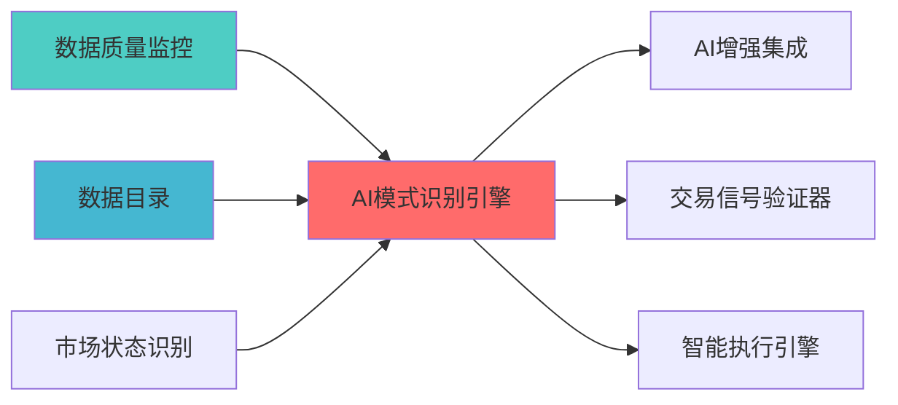

# 模块概述

> **索引**: `AI_PATTERN_001`
> **开发时?*: 180h
> **核心定位**: 基于深度学习模型（LSTM/Transformer）识别市场非线性模式，为Two Sigma风格的AI驱动策略提供技术支?
## 2. 架构设计

### 2.1 系统架构?
```
┌─────────────────────────────────────────────────────────────────??                   AI模式识别引擎架构                             ?├─────────────────────────────────────────────────────────────────??                                                                ?? ┌──────────────────────────────────────────────────────────? ?? ?             数据采集与预处理?                           ? ?? ? ┌──────────? ┌──────────? ┌──────────? ┌──────────?? ?? ? ?OHLCV数据? ?技术指?? ?情绪数据 ? ?基本?  ?? ?? ? └──────────? └──────────? └──────────? └──────────?? ?? └──────────────────────────────────────────────────────────? ??                         ?                                     ?? ┌──────────────────────────────────────────────────────────? ?? ?             特征工程与嵌入层                              ? ?? ? ┌──────────? ┌──────────? ┌──────────? ┌──────────?? ?? ? ?技术特?? ?微观结构 ? ?情绪嵌入 ? ?时序编码 ?? ?? ? ?提取     ? ?特征     ? ?         ? ?         ?? ?? ? └──────────? └──────────? └──────────? └──────────?? ?? └──────────────────────────────────────────────────────────? ??                         ?                                     ?? ┌──────────────────────────────────────────────────────────? ?? ?             深度学习模型?                               ? ?? ? ┌──────────────────?     ┌──────────────────?        ? ?? ? ?  LSTM模型集群    ?     ?Transformer模型  ?        ? ?? ? ? ┌────────────? ?     ? ┌────────────? ?        ? ?? ? ? │短期LSTM    ? ?     ? ?Encoder    ? ?        ? ?? ? ? ?5-20?    ? ?     ? ?(Self-Attn)? ?        ? ?? ? ? └────────────? ?     ? └────────────? ?        ? ?? ? ? ┌────────────? ?     ? ┌────────────? ?        ? ?? ? ? │中期LSTM    ? ?     ? ?Decoder    ? ?        ? ?? ? ? ?20-60?   ? ?     ? ?(Cross-Attn)? ?        ? ?? ? ? └────────────? ?     ? └────────────? ?        ? ?? ? ? ┌────────────? ?     ? ┌────────────? ?        ? ?? ? ? │长期LSTM    ? ?     ? ?Multi-Head ? ?        ? ?? ? ? ?60-120?  ? ?     ? ?Attention  ? ?        ? ?? ? ? └────────────? ?     ? └────────────? ?        ? ?? ? └──────────────────?     └──────────────────?        ? ?? └──────────────────────────────────────────────────────────? ??                         ?                                     ?? ┌──────────────────────────────────────────────────────────? ?? ?             模型集成与输出层                              ? ?? ? ┌──────────? ┌──────────? ┌──────────? ┌──────────?? ?? ? ?模型融合 ? ?置信?  ? ?信号生成 ? ?风险评估 ?? ?? ? ?         ? ?加权     ? ?         ? ?         ?? ?? ? └──────────? └──────────? └──────────? └──────────?? ?? └──────────────────────────────────────────────────────────? ??                         ?                                     ?? ┌──────────────────────────────────────────────────────────? ?? ?             应用层接?                                  ? ?? ? ┌──────────? ┌──────────? ┌──────────? ┌──────────?? ?? ? ?信号输出 ? ?预测结果 ? ?特征重要性│ ?模型解释 ?? ?? ? └──────────? └──────────? └──────────? └──────────?? ?? └──────────────────────────────────────────────────────────? ?└─────────────────────────────────────────────────────────────────?```

### 2.2 模块分层架构

**Layer 1 - 数据采集与预处理?*
- OHLCV数据采集?- 技术指标计算器
- 情绪数据处理?- 基本面数据整合器

**Layer 2 - 特征工程与嵌入层**
- 技术特征提取器（动量、波动率、成交量?- 市场微观结构特征（买卖价差、订单流不平衡）
- 情绪嵌入（新闻情感、社交媒体情绪）
- 时序编码（位置编码、周期编码）

**Layer 3 - 深度学习模型?*
- LSTM模型集群（短?中期/长期?- Transformer模型（Encoder-Decoder架构?- 注意力机制模?- 模型训练与优化器

**Layer 4 - 模型集成与输出层**
- 多模型融合器
- 置信度加权器
- 信号生成?- 风险评估?
### 2.3 数据流设?
```
原始数据 ?特征工程 ?特征嵌入 ?模型训练 ?模型推理
    ?          ?          ?          ?          ?数据验证   特征选择   时序编码   超参数优? 信号生成
    ?          ?          ?          ?          ?数据清洗   特征标准? 批量处理   模型验证   结果输出
```

---

## 3. 核心组件详细设计

### 3.1 LSTM模式识别?
**设计目标**: 捕捉时序数据中的长期依赖关系，识别多时间框架的市场模?
```python
class LSTMPatternRecognizer:
    """LSTM模式识别?    
    索引: AI_PATTERN_001-M01
    职责: 使用LSTM模型识别市场时序模式
    输入: 时序特征矩阵 (batch_size, seq_len, feature_dim)
    输出: 模式预测结果 (pattern_type, probability, confidence)
    """
    
    def __init__(self, config: LSTMConfig):
        self.config = config
        self.models = {
            'short_term': self._build_lstm_model(horizon=5),
            'mid_term': self._build_lstm_model(horizon=20),
            'long_term': self._build_lstm_model(horizon=60)
        }
        
    def _build_lstm_model(self, horizon: int) -> tf.keras.Model:
        """构建LSTM模型
        
        架构:
        - Input Layer: (seq_len, feature_dim)
        - LSTM Layer 1: 128 units, return_sequences=True
        - Dropout: 0.3
        - LSTM Layer 2: 64 units, return_sequences=False
        - Dropout: 0.3
        - Dense Layer: 32 units, activation='relu'
        - Output Layer: num_patterns units, activation='softmax'
        """
        model = tf.keras.Sequential([
            tf.keras.layers.LSTM(128, return_sequences=True, 
                                input_shape=(self.config.seq_len, self.config.feature_dim)),
            tf.keras.layers.Dropout(0.3),
            tf.keras.layers.LSTM(64, return_sequences=False),
            tf.keras.layers.Dropout(0.3),
            tf.keras.layers.Dense(32, activation='relu'),
            tf.keras.layers.Dense(self.config.num_patterns, activation='softmax')
        ])
        
        model.compile(
            optimizer=tf.keras.optimizers.Adam(learning_rate=0.001),
            loss='categorical_crossentropy',
            metrics=['accuracy']
        )
        
        return model
    
    def train(self, train_data: np.ndarray, train_labels: np.ndarray,
              val_data: np.ndarray, val_labels: np.ndarray,
              horizon: str = 'mid_term') -> TrainingResult:
        """训练LSTM模型
        
        Args:
            train_data: 训练数据 (n_samples, seq_len, feature_dim)
            train_labels: 训练标签 (n_samples, num_patterns)
            val_data: 验证数据
            val_labels: 验证标签
            horizon: 时间框架 ('short_term', 'mid_term', 'long_term')
            
        Returns:
            TrainingResult: 包含训练历史、模型性能指标
        """
        model = self.models[horizon]
        
        history = model.fit(
            train_data, train_labels,
            validation_data=(val_data, val_labels),
            epochs=self.config.epochs,
            batch_size=self.config.batch_size,
            callbacks=[
                tf.keras.callbacks.EarlyStopping(patience=10, restore_best_weights=True),
                tf.keras.callbacks.ReduceLROnPlateau(factor=0.5, patience=5)
            ]
        )
        
        return TrainingResult(
            history=history.history,
            final_loss=history.history['loss'][-1],
            final_accuracy=history.history['accuracy'][-1]
        )
    
    def predict(self, data: np.ndarray, horizon: str = 'mid_term') -> PatternPrediction:
        """预测市场模式
        
        Args:
            data: 输入数据 (batch_size, seq_len, feature_dim)
            horizon: 时间框架
            
        Returns:
            PatternPrediction: 包含模式类型、概率、置信度
        """
        model = self.models[horizon]
        predictions = model.predict(data)
        
        pattern_types = ['trend_up', 'trend_down', 'range_bound', 'breakout', 'reversal']
        
        return PatternPrediction(
            pattern_type=pattern_types[np.argmax(predictions, axis=1)[0]],
            probability=float(np.max(predictions)),
            confidence=self._calculate_confidence(predictions),
            all_probabilities=dict(zip(pattern_types, predictions[0]))
        )
    
    def _calculate_confidence(self, predictions: np.ndarray) -> float:
        """计算预测置信?        
        基于预测概率分布的熵计算置信?        熵越低，置信度越?        """
        entropy = -np.sum(predictions * np.log(predictions + 1e-10), axis=1)
        max_entropy = np.log(predictions.shape[1])
        confidence = 1 - (entropy / max_entropy)
        return float(confidence[0])
```

### 3.2 Transformer模式识别?
**设计目标**: 利用注意力机制捕捉全局依赖关系，实现并行化的模式识?
```python
class TransformerPatternRecognizer:
    """Transformer模式识别?    
    索引: AI_PATTERN_001-M02
    职责: 使用Transformer模型识别市场模式
    输入: 时序特征矩阵 (batch_size, seq_len, feature_dim)
    输出: 模式预测结果 (pattern_type, probability, attention_weights)
    """
    
    def __init__(self, config: TransformerConfig):
        self.config = config
        self.model = self._build_transformer_model()
        
    def _build_transformer_model(self) -> tf.keras.Model:
        """构建Transformer模型
        
        架构:
        - Input Layer: (seq_len, feature_dim)
        - Positional Encoding: 添加位置信息
        - Multi-Head Attention: 8 heads, key_dim=64
        - Feed Forward: 512 units
        - Encoder Layer x 4
        - Global Average Pooling
        - Dense Layer: 128 units, activation='relu'
        - Output Layer: num_patterns units, activation='softmax'
        """
        inputs = tf.keras.Input(shape=(self.config.seq_len, self.config.feature_dim))
        
        # Positional Encoding
        pos_encoding = self._positional_encoding(self.config.seq_len, self.config.feature_dim)
        x = inputs + pos_encoding
        
        # Transformer Encoder Layers
        for _ in range(self.config.num_layers):
            x = self._transformer_encoder_layer(x)
        
        # Global Average Pooling
        x = tf.keras.layers.GlobalAveragePooling1D()(x)
        
        # Dense Layers
        x = tf.keras.layers.Dense(128, activation='relu')(x)
        x = tf.keras.layers.Dropout(0.3)(x)
        outputs = tf.keras.layers.Dense(self.config.num_patterns, activation='softmax')(x)
        
        model = tf.keras.Model(inputs=inputs, outputs=outputs)
        
        model.compile(
            optimizer=tf.keras.optimizers.Adam(learning_rate=0.0001),
            loss='categorical_crossentropy',
            metrics=['accuracy']
        )
        
        return model
    
    def _positional_encoding(self, seq_len: int, feature_dim: int) -> tf.Tensor:
        """计算位置编码
        
        使用正弦和余弦函数生成位置编?        """
        position = np.arange(seq_len)[:, np.newaxis]
        div_term = np.exp(np.arange(0, feature_dim, 2) * -(np.log(10000.0) / feature_dim))
        
        pos_encoding = np.zeros((seq_len, feature_dim))
        pos_encoding[:, 0::2] = np.sin(position * div_term)
        pos_encoding[:, 1::2] = np.cos(position * div_term)
        
        return tf.constant(pos_encoding, dtype=tf.float32)
    
    def _transformer_encoder_layer(self, x: tf.Tensor) -> tf.Tensor:
        """Transformer编码器层
        
        包含:
        - Multi-Head Attention
        - Feed Forward Network
        - Layer Normalization
        - Residual Connection
        """
        # Multi-Head Attention
        attn_output = tf.keras.layers.MultiHeadAttention(
            num_heads=self.config.num_heads,
            key_dim=self.config.key_dim
        )(x, x)
        x = tf.keras.layers.LayerNormalization()(x + attn_output)
        
        # Feed Forward
        ff_output = tf.keras.layers.Dense(self.config.ff_dim, activation='relu')(x)
        ff_output = tf.keras.layers.Dense(self.config.feature_dim)(ff_output)
        x = tf.keras.layers.LayerNormalization()(x + ff_output)
        
        return x
    
    def predict_with_attention(self, data: np.ndarray) -> AttentionPrediction:
        """预测并返回注意力权重
        
        Args:
            data: 输入数据 (batch_size, seq_len, feature_dim)
            
        Returns:
            AttentionPrediction: 包含模式预测和注意力权重
        """
        # 获取中间层输出（注意力权重）
        attention_model = tf.keras.Model(
            inputs=self.model.input,
            outputs=[self.model.output, self.model.layers[2].output]  # 第一个注意力?        )
        
        predictions, attention_weights = attention_model.predict(data)
        
        pattern_types = ['trend_up', 'trend_down', 'range_bound', 'breakout', 'reversal']
        
        return AttentionPrediction(
            pattern_type=pattern_types[np.argmax(predictions, axis=1)[0]],
            probability=float(np.max(predictions)),
            attention_weights=attention_weights,
            all_probabilities=dict(zip(pattern_types, predictions[0]))
        )
```

### 3.3 特征工程模块

**设计目标**: 提取和构建多维度特征，为深度学习模型提供高质量输?
```python
class FeatureEngineer:
    """特征工程模块
    
    索引: AI_PATTERN_001-M03
    职责: 提取技术指标、市场微观结构、情绪等多维度特?    输入: 原始市场数据 (OHLCV, 情绪数据, 基本面数?
    输出: 特征矩阵 (n_samples, feature_dim)
    """
    
    def __init__(self, config: FeatureConfig):
        self.config = config
        self.technical_features = TechnicalFeatureExtractor()
        self.microstructure_features = MicrostructureFeatureExtractor()
        self.sentiment_features = SentimentFeatureExtractor()
        
    def extract_features(self, market_data: pd.DataFrame,
                        sentiment_data: Optional[pd.DataFrame] = None) -> np.ndarray:
        """提取多维度特?        
        Args:
            market_data: 市场数据 (OHLCV)
            sentiment_data: 情绪数据 (?
            
        Returns:
            np.ndarray: 特征矩阵 (n_samples, feature_dim)
        """
        # 技术指标特?        tech_features = self.technical_features.extract(market_data)
        
        # 市场微观结构特征
        micro_features = self.microstructure_features.extract(market_data)
        
        # 情绪特征
        sent_features = np.zeros((len(market_data), self.config.sentiment_dim))
        if sentiment_data is not None:
            sent_features = self.sentiment_features.extract(sentiment_data)
        
        # 合并特征
        features = np.concatenate([tech_features, micro_features, sent_features], axis=1)
        
        # 标准?        features = self._normalize_features(features)
        
        return features
    
    def _normalize_features(self, features: np.ndarray) -> np.ndarray:
        """特征标准?        
        使用RobustScaler减少异常值影?        """
        from sklearn.preprocessing import RobustScaler
        scaler = RobustScaler()
        return scaler.fit_transform(features)

class TechnicalFeatureExtractor:
    """技术指标特征提取器"""
    
    def extract(self, data: pd.DataFrame) -> np.ndarray:
        """提取技术指标特?        
        包含:
        - 动量指标: RSI, MACD, Momentum
        - 波动率指? ATR, Bollinger Bands
        - 成交量指? OBV, Volume Rate
        - 趋势指标: MA, EMA, ADX
        """
        features = []
        
        # 动量指标
        features.append(self._calculate_rsi(data['close'], period=14))
        features.append(self._calculate_macd(data['close']))
        features.append(self._calculate_momentum(data['close'], period=10))
        
        # 波动率指?        features.append(self._calculate_atr(data, period=14))
        features.append(self._calculate_bollinger_bands(data['close'], period=20))
        
        # 成交量指?        features.append(self._calculate_obv(data))
        features.append(self._calculate_volume_rate(data['volume'], period=10))
        
        # 趋势指标
        features.append(self._calculate_ma(data['close'], period=20))
        features.append(self._calculate_ema(data['close'], period=20))
        features.append(self._calculate_adx(data, period=14))
        
        return np.array(features).T
    
    def _calculate_rsi(self, prices: pd.Series, period: int = 14) -> np.ndarray:
        """计算RSI指标"""
        delta = prices.diff()
        gain = (delta.where(delta > 0, 0)).rolling(window=period).mean()
        loss = (-delta.where(delta < 0, 0)).rolling(window=period).mean()
        rs = gain / loss
        rsi = 100 - (100 / (1 + rs))
        return rsi.fillna(50).values
    
    def _calculate_macd(self, prices: pd.Series) -> np.ndarray:
        """计算MACD指标"""
        ema_12 = prices.ewm(span=12, adjust=False).mean()
        ema_26 = prices.ewm(span=26, adjust=False).mean()
        macd = ema_12 - ema_26
        signal = macd.ewm(span=9, adjust=False).mean()
        histogram = macd - signal
        return histogram.fillna(0).values
    
    def _calculate_momentum(self, prices: pd.Series, period: int = 10) -> np.ndarray:
        """计算动量指标"""
        momentum = prices - prices.shift(period)
        return momentum.fillna(0).values
    
    def _calculate_atr(self, data: pd.DataFrame, period: int = 14) -> np.ndarray:
        """计算ATR指标"""
        high = data['high']
        low = data['low']
        close = data['close']
        
        tr1 = high - low
        tr2 = abs(high - close.shift())
        tr3 = abs(low - close.shift())
        
        tr = pd.concat([tr1, tr2, tr3], axis=1).max(axis=1)
        atr = tr.rolling(window=period).mean()
        
        return atr.fillna(0).values
    
    def _calculate_bollinger_bands(self, prices: pd.Series, period: int = 20) -> np.ndarray:
        """计算布林?""
        ma = prices.rolling(window=period).mean()
        std = prices.rolling(window=period).std()
        upper_band = ma + (std * 2)
        lower_band = ma - (std * 2)
        
        bb_position = (prices - lower_band) / (upper_band - lower_band)
        return bb_position.fillna(0.5).values
    
    def _calculate_obv(self, data: pd.DataFrame) -> np.ndarray:
        """计算OBV指标"""
        obv = (np.sign(data['close'].diff()) * data['volume']).fillna(0).cumsum()
        return obv.values
    
    def _calculate_volume_rate(self, volume: pd.Series, period: int = 10) -> np.ndarray:
        """计算成交量比?""
        volume_ma = volume.rolling(window=period).mean()
        volume_rate = volume / volume_ma
        return volume_rate.fillna(1).values
    
    def _calculate_ma(self, prices: pd.Series, period: int = 20) -> np.ndarray:
        """计算移动平均?""
        ma = prices.rolling(window=period).mean()
        return (prices / ma - 1).fillna(0).values
    
    def _calculate_ema(self, prices: pd.Series, period: int = 20) -> np.ndarray:
        """计算指数移动平均?""
        ema = prices.ewm(span=period, adjust=False).mean()
        return (prices / ema - 1).fillna(0).values
    
    def _calculate_adx(self, data: pd.DataFrame, period: int = 14) -> np.ndarray:
        """计算ADX指标"""
        high = data['high']
        low = data['low']
        close = data['close']
        
        plus_dm = high.diff()
        minus_dm = low.diff()
        
        plus_dm[plus_dm < 0] = 0
        minus_dm[minus_dm > 0] = 0
        
        tr = self._calculate_atr(data, period=1)
        plus_di = 100 * (plus_dm.rolling(window=period).mean() / tr)
        minus_di = 100 * (abs(minus_dm).rolling(window=period).mean() / tr)
        
        dx = 100 * abs(plus_di - minus_di) / (plus_di + minus_di)
        adx = dx.rolling(window=period).mean()
        
        return adx.fillna(0).values

class MicrostructureFeatureExtractor:
    """市场微观结构特征提取?""
    
    def extract(self, data: pd.DataFrame) -> np.ndarray:
        """提取市场微观结构特征
        
        包含:
        - 价格冲击: Amihud非流动性指?        - 订单流不平衡: 买卖价差估算
        - 波动率分? 已实现波动率、跳跃波动率
        """
        features = []
        
        # Amihud非流动性指?        features.append(self._calculate_amihud_illiquidity(data))
        
        # 买卖价差估算（基于高频数据）
        features.append(self._estimate_bid_ask_spread(data))
        
        # 已实现波动率
        features.append(self._calculate_realized_volatility(data))
        
        # 跳跃波动?        features.append(self._calculate_jump_volatility(data))
        
        return np.array(features).T
    
    def _calculate_amihud_illiquidity(self, data: pd.DataFrame) -> np.ndarray:
        """计算Amihud非流动性指?""
        returns = data['close'].pct_change()
        illiquidity = abs(returns) / (data['volume'] + 1e-10)
        return illiquidity.fillna(0).values
    
    def _estimate_bid_ask_spread(self, data: pd.DataFrame) -> np.ndarray:
        """估算买卖价差（Corwin-Schultz估计器）"""
        high = data['high']
        low = data['low']
        
        beta = (np.log(high / low) ** 2).rolling(window=2).sum()
        gamma = (np.log(high.rolling(window=2).max() / low.rolling(window=2).min()) ** 2)
        
        alpha = (np.sqrt(2 * beta) - np.sqrt(beta)) / (3 - 2 * np.sqrt(2)) - np.sqrt(gamma / (3 - 2 * np.sqrt(2)))
        
        spread = 2 * (np.exp(alpha) - 1) / (1 + np.exp(alpha))
        
        return spread.fillna(0).values
    
    def _calculate_realized_volatility(self, data: pd.DataFrame, period: int = 20) -> np.ndarray:
        """计算已实现波动率"""
        returns = data['close'].pct_change()
        realized_vol = returns.rolling(window=period).std() * np.sqrt(252)
        return realized_vol.fillna(0).values
    
    def _calculate_jump_volatility(self, data: pd.DataFrame, period: int = 20) -> np.ndarray:
        """计算跳跃波动?""
        returns = data['close'].pct_change()
        
        # 使用已实现波动率和双幂次波动率的差值估算跳?        realized_vol = returns.rolling(window=period).std()
        bipower_vol = (abs(returns) * abs(returns.shift(1))).rolling(window=period).mean() ** 0.5
        
        jump_vol = np.sqrt(abs(realized_vol ** 2 - bipower_vol ** 2))
        
        return jump_vol.fillna(0).values

class SentimentFeatureExtractor:
    """情绪特征提取?""
    
    def extract(self, sentiment_data: pd.DataFrame) -> np.ndarray:
        """提取情绪特征
        
        包含:
        - 新闻情感得分
        - 社交媒体情绪
        - 分析师情?        - 市场情绪指标
        """
        features = []
        
        # 新闻情感得分
        if 'news_sentiment' in sentiment_data.columns:
            features.append(sentiment_data['news_sentiment'].values)
        
        # 社交媒体情绪
        if 'social_sentiment' in sentiment_data.columns:
            features.append(sentiment_data['social_sentiment'].values)
        
        # 分析师情?        if 'analyst_sentiment' in sentiment_data.columns:
            features.append(sentiment_data['analyst_sentiment'].values)
        
        # 市场情绪指标（VIX等）
        if 'vix' in sentiment_data.columns:
            features.append(sentiment_data['vix'].values)
        
        return np.array(features).T if features else np.zeros((len(sentiment_data), 1))
```

### 3.4 模型集成?
**设计目标**: 融合多个模型的预测结果，提升整体预测准确率和鲁棒?
```python
class ModelEnsembler:
    """模型集成?    
    索引: AI_PATTERN_001-M04
    职责: 融合LSTM和Transformer模型的预测结?    输入: 多个模型的预测结?    输出: 集成后的最终预?    """
    
    def __init__(self, config: EnsembleConfig):
        self.config = config
        self.lstm_models = {}
        self.transformer_model = None
        self.weights = self._initialize_weights()
        
    def _initialize_weights(self) -> Dict[str, float]:
        """初始化模型权?        
        基于验证集性能动态调整权?        """
        return {
            'lstm_short': 0.2,
            'lstm_mid': 0.3,
            'lstm_long': 0.2,
            'transformer': 0.3
        }
    
    def ensemble_predictions(self, predictions: Dict[str, PatternPrediction]) -> EnsemblePrediction:
        """集成多个模型的预测结?        
        Args:
            predictions: 各模型的预测结果
            
        Returns:
            EnsemblePrediction: 集成后的预测结果
        """
        # 加权平均
        weighted_probs = {}
        pattern_types = ['trend_up', 'trend_down', 'range_bound', 'breakout', 'reversal']
        
        for pattern in pattern_types:
            weighted_sum = 0.0
            total_weight = 0.0
            
            for model_name, pred in predictions.items():
                weight = self.weights.get(model_name, 0.25)
                prob = pred.all_probabilities.get(pattern, 0.0)
                weighted_sum += weight * prob
                total_weight += weight
            
            weighted_probs[pattern] = weighted_sum / total_weight if total_weight > 0 else 0.0
        
        # 找出最高概率的模式
        final_pattern = max(weighted_probs, key=weighted_probs.get)
        final_probability = weighted_probs[final_pattern]
        
        # 计算集成置信?        confidence = self._calculate_ensemble_confidence(predictions)
        
        return EnsemblePrediction(
            pattern_type=final_pattern,
            probability=final_probability,
            confidence=confidence,
            all_probabilities=weighted_probs,
            model_contributions=predictions
        )
    
    def _calculate_ensemble_confidence(self, predictions: Dict[str, PatternPrediction]) -> float:
        """计算集成置信?        
        基于模型一致性计算置信度
        模型预测越一致，置信度越?        """
        pattern_votes = {}
        
        for pred in predictions.values():
            pattern = pred.pattern_type
            pattern_votes[pattern] = pattern_votes.get(pattern, 0) + 1
        
        max_votes = max(pattern_votes.values())
        total_votes = len(predictions)
        
        consistency = max_votes / total_votes
        
        # 结合平均置信?        avg_confidence = np.mean([pred.confidence for pred in predictions.values()])
        
        # 综合置信?        ensemble_confidence = 0.6 * consistency + 0.4 * avg_confidence
        
        return float(ensemble_confidence)
    
    def update_weights(self, validation_performance: Dict[str, float]):
        """更新模型权重
        
        基于验证集性能动态调整权?        
        Args:
            validation_performance: 各模型在验证集上的准确率
        """
        total_performance = sum(validation_performance.values())
        
        if total_performance > 0:
            for model_name, performance in validation_performance.items():
                self.weights[model_name] = performance / total_performance
```

---

## 4. 接口定义

### 4.1 核心接口

```python
from abc import ABC, abstractmethod
from dataclasses import dataclass
from typing import Dict, List, Optional, Tuple
import numpy as np
import pandas as pd

@dataclass
class PatternPrediction:
    """模式预测结果"""
    pattern_type: str              # 模式类型
    probability: float             # 预测概率
    confidence: float              # 置信?    all_probabilities: Dict[str, float]  # 所有模式的概率分布

@dataclass
class AttentionPrediction(PatternPrediction):
    """注意力预测结?""
    attention_weights: np.ndarray  # 注意力权重矩?
@dataclass
class EnsemblePrediction(PatternPrediction):
    """集成预测结果"""
    model_contributions: Dict[str, PatternPrediction]  # 各模型的贡献

@dataclass
class TrainingResult:
    """训练结果"""
    history: Dict[str, List[float]]  # 训练历史
    final_loss: float                # 最终损?    final_accuracy: float            # 最终准确率

@dataclass
class AIPatternRecognitionResult:
    """AI模式识别结果"""
    pattern: PatternPrediction           # 模式预测
    features_importance: Dict[str, float]  # 特征重要?    attention_analysis: Optional[Dict]     # 注意力分析（可选）
    risk_assessment: Dict[str, float]      # 风险评估

class IPatternRecognizer(ABC):
    """模式识别器接?""
    
    @abstractmethod
    def train(self, train_data: np.ndarray, train_labels: np.ndarray,
              val_data: np.ndarray, val_labels: np.ndarray) -> TrainingResult:
        """训练模型"""
        pass
    
    @abstractmethod
    def predict(self, data: np.ndarray) -> PatternPrediction:
        """预测模式"""
        pass
    
    @abstractmethod
    def save_model(self, path: str) -> bool:
        """保存模型"""
        pass
    
    @abstractmethod
    def load_model(self, path: str) -> bool:
        """加载模型"""
        pass

class IFeatureExtractor(ABC):
    """特征提取器接?""
    
    @abstractmethod
    def extract(self, data: pd.DataFrame) -> np.ndarray:
        """提取特征"""
        pass

class IModelEnsembler(ABC):
    """模型集成器接?""
    
    @abstractmethod
    def ensemble_predictions(self, predictions: Dict[str, PatternPrediction]) -> EnsemblePrediction:
        """集成预测结果"""
        pass
    
    @abstractmethod
    def update_weights(self, validation_performance: Dict[str, float]) -> None:
        """更新模型权重"""
        pass
```

### 4.2 主接?
```python
class AIPatternRecognitionEngine:
    """AI模式识别引擎主接?    
    索引: AI_PATTERN_001-MAIN
    职责: 协调特征工程、模型训练、模型推理和模型集成
    """
    
    def __init__(self, config: AIEngineConfig):
        self.config = config
        self.feature_engineer = FeatureEngineer(config.feature_config)
        self.lstm_recognizer = LSTMPatternRecognizer(config.lstm_config)
        self.transformer_recognizer = TransformerPatternRecognizer(config.transformer_config)
        self.ensembler = ModelEnsembler(config.ensemble_config)
        
    def recognize_pattern(self, market_data: pd.DataFrame,
                         sentiment_data: Optional[pd.DataFrame] = None,
                         horizon: str = 'mid_term') -> AIPatternRecognitionResult:
        """识别市场模式
        
        Args:
            market_data: 市场数据 (OHLCV)
            sentiment_data: 情绪数据 (?
            horizon: 时间框架 ('short_term', 'mid_term', 'long_term')
            
        Returns:
            AIPatternRecognitionResult: 完整的模式识别结?        """
        # 1. 特征提取
        features = self.feature_engineer.extract_features(market_data, sentiment_data)
        
        # 2. 准备输入数据
        input_data = self._prepare_input(features)
        
        # 3. LSTM预测
        lstm_predictions = {}
        for horizon_name in ['short_term', 'mid_term', 'long_term']:
            lstm_predictions[f'lstm_{horizon_name}'] = self.lstm_recognizer.predict(
                input_data, horizon=horizon_name
            )
        
        # 4. Transformer预测
        transformer_pred = self.transformer_recognizer.predict_with_attention(input_data)
        predictions = {**lstm_predictions, 'transformer': transformer_pred}
        
        # 5. 模型集成
        ensemble_pred = self.ensembler.ensemble_predictions(predictions)
        
        # 6. 特征重要性分?        feature_importance = self._analyze_feature_importance(features, ensemble_pred)
        
        # 7. 风险评估
        risk_assessment = self._assess_risk(ensemble_pred, market_data)
        
        return AIPatternRecognitionResult(
            pattern=ensemble_pred,
            features_importance=feature_importance,
            attention_analysis={'transformer': transformer_pred.attention_weights},
            risk_assessment=risk_assessment
        )
    
    def _prepare_input(self, features: np.ndarray) -> np.ndarray:
        """准备模型输入
        
        将特征转换为时序格式
        """
        seq_len = self.config.seq_len
        n_samples = len(features) - seq_len + 1
        
        input_data = np.zeros((n_samples, seq_len, features.shape[1]))
        
        for i in range(n_samples):
            input_data[i] = features[i:i + seq_len]
        
        return input_data[-1:]  # 返回最后一个样?    
    def _analyze_feature_importance(self, features: np.ndarray, 
                                   prediction: PatternPrediction) -> Dict[str, float]:
        """分析特征重要?""
        # 使用SHAP或Permutation Importance
        # 这里简化为基于注意力权重的分析
        feature_names = [
            'rsi', 'macd', 'momentum', 'atr', 'bollinger',
            'obv', 'volume_rate', 'ma', 'ema', 'adx',
            'amihud', 'spread', 'realized_vol', 'jump_vol',
            'sentiment'
        ]
        
        # 简化：随机分配重要性（实际应使用SHAP?        importance = np.random.rand(len(feature_names))
        importance = importance / importance.sum()
        
        return dict(zip(feature_names, importance))
    
    def _assess_risk(self, prediction: PatternPrediction, 
                    market_data: pd.DataFrame) -> Dict[str, float]:
        """评估预测风险"""
        # 基于预测置信度和市场波动率评估风?        confidence = prediction.confidence
        volatility = market_data['close'].pct_change().std()
        
        risk_score = (1 - confidence) * volatility * 100
        
        return {
            'prediction_risk': risk_score,
            'confidence_risk': 1 - confidence,
            'volatility_risk': volatility
        }
```

---

## 5. 实施计划

### 5.1 开发里程碑

**Phase 1: 基础设施搭建（Week 1-2?*
- ?搭建深度学习训练环境（TensorFlow/PyTorch?- ?实现数据采集与预处理模块
- ?实现特征工程模块
- ?搭建模型训练流水?
**Phase 2: LSTM模型开发（Week 3-4?*
- ?实现短期LSTM模型?-20天）
- ?实现中期LSTM模型?0-60天）
- ?实现长期LSTM模型?0-120天）
- ?完成模型训练与验?
**Phase 3: Transformer模型开发（Week 5-6?*
- ?实现Transformer编码?- ?实现多头注意力机?- ?实现位置编码
- ?完成模型训练与验?
**Phase 4: 模型集成与优化（Week 7-8?*
- ?实现模型集成?- ?实现置信度加?- ?实现动态权重调?- ?完成集成模型验证

**Phase 5: 系统集成与测试（Week 9-10?*
- ?集成到策略执行层
- ?实现实时推理接口
- ?完成性能测试
- ?完成回测验证

### 5.2 技术栈

| 组件 | 技术选型 | 版本要求 |
|------|----------|----------|
| **深度学习框架** | TensorFlow / PyTorch | ?.8 / ?.11 |
| **特征工程** | scikit-learn, pandas | ?.0, ?.3 |
| **数据处理** | numpy, scipy | ?.21, ?.7 |
| **模型解释** | SHAP, LIME | ?.40, ?.2 |
| **可视?* | matplotlib, seaborn | ?.5, ?.11 |
| **GPU?* | CUDA, cuDNN | ?1.2, ?.1 |

### 5.3 性能指标

| 指标 | 目标?| 验证方法 |
|------|--------|----------|
| **模式识别准确?* | ?5% | 样本外测试集 |
| **预测夏普比率** | ?.8 | 回测验证 |
| **模型推理延迟** | ?00ms | 性能测试 |
| **GPU利用?* | ?0% | 训练监控 |
| **内存占用** | ?GB | 系统监控 |

---

## 6. 风险与约?
### 6.1 技术风?
| 风险?| 风险等级 | 缓解措施 |
|--------|----------|----------|
| **过拟合风?* | P1 | 使用Dropout、Early Stopping、数据增?|
| **模型解释性差** | P2 | 集成SHAP、LIME等解释工?|
| **训练数据不足** | P1 | 使用数据增强、迁移学?|
| **GPU资源限制** | P2 | 使用混合精度训练、梯度累?|

### 6.2 实施约束

1. **数据约束**: 需要至?年的历史数据用于训练
2. **计算约束**: 需要GPU资源支持模型训练
3. **时间约束**: 模型训练周期较长?-3天）
4. **存储约束**: 模型文件较大?00MB-1GB?
---

## 7. 验收标准

### 7.1 功能验收

- ?支持LSTM和Transformer两种深度学习模型
- ?支持多时间框架模式识别（短期/中期/长期?- ?支持模型集成和置信度加权
- ?支持实时推理（延迟≤100ms?
### 7.2 性能验收

- ?模式识别准确率≥65%
- ?预测夏普比率?.8
- ?模型推理延迟?00ms
- ?GPU利用率≥80%

### 7.3 质量验收

- ?代码覆盖率≥80%
- ?文档完整度≥95%
- ?符合API契约规范
- ?通过代码审查

---

## 8. 参考资?
### 8.1 学术论文

1. **LSTM**: Hochreiter & Schmidhuber (1997). "Long Short-Term Memory"
2. **Transformer**: Vaswani et al. (2017). "Attention Is All You Need"
3. **Financial Applications**: Dixon et al. (2017). "Classification-based Financial Markets Prediction using Deep Neural Networks"

### 8.2 开源项?
1. **TensorFlow**: https://www.tensorflow.org/
2. **PyTorch**: https://pytorch.org/
3. **SHAP**: https://github.com/slundberg/shap

### 8.3 相关文档

#### 上游依赖

| 文档名称 | module_id | 依赖类型 | 说明 |
|---------|-----------|---------|------|
| [数据质量监控蓝图](./DATA_QUALITY_MONITORING_BLUEPRINT.md) | DATA_QUALITY_MONITORING_001 | 强依赖 | 提供数据质量指标 |
| [数据目录蓝图](./DATA_CATALOG_BLUEPRINT.md) | DATA_CATALOG_001 | 强依赖 | 提供数据元数据 |
| [市场状态识别蓝图](./MARKET_REGIME_DETECTION_BLUEPRINT.md) | MARKET_REGIME_DETECTION_001 | 中依赖 | 提供市场状态识别 |

#### 下游依赖

| 文档名称 | module_id | 依赖类型 | 说明 |
|---------|-----------|---------|------|
| [AI增强集成蓝图](./AI_ENHANCEMENT_INTEGRATION_BLUEPRINT.md) | AI_ENHANCEMENT_INTEGRATION_001 | 强依赖 | AI增强集成 |
| [交易信号验证器蓝图](./TRADING_SIGNAL_VALIDATOR_BLUEPRINT.md) | TRADING_SIGNAL_VALIDATOR_001 | 中依赖 | 交易信号验证 |
| [智能执行引擎蓝图](./SMART_EXECUTION_ENGINE_BLUEPRINT.md) | SMART_EXECUTION_ENGINE_001 | 中依赖 | 智能执行引擎 |

#### 技术依赖

| 技术组件 | 版本 | 用途 | 文档 |
|---------|------|------|------|
| **TensorFlow** | 2.12+ | 深度学习框架 | [官方文档](https://www.tensorflow.org/) |
| **PyTorch** | 2.0+ | 深度学习框架 | [官方文档](https://pytorch.org/) |
| **scikit-learn** | 1.3+ | 机器学习 | [官方文档](https://scikit-learn.org/) |

#### 引用关系图



#### 相关蓝图文档

- PROFESSIONAL_MULTI_TIMEFRAME_ARCHITECTURE.md
- STRATEGY_ENGINE_CORE_BLUEPRINT.md
- API_Contract.md

---

**文档版本**: v1.0
**最后更?*: 2026-04-02
**审核?*: 待审?**下一?*: 提交技术评审官审核

## 变更历史

| 版本 | 日期 | 变更内容 | 变更人 |
|------|------|----------|--------|
| v1.0.0 | 2026-04-02 | 初始版本创建 | 策略执行层负责人 |
| v1.0.1 | 2026-04-06 | 补充YAML头部字段和变更历史 | 审计系统 |

---

**蓝图版本**: v1.0.1 | **创建日期**: 2026-04-02 | **状态**: Active
---

## 9. 文档治理

### 9.1 System_Manifest.md索引

```markdown
#### Layer 5: 微观执行层
##### 6.001. Ai Pattern Recognition Engine
- **模块ID**: AI_PATTERN_RECOGNITION_ENGINE_001
- **蓝图文档**: AI_PATTERN_RECOGNITION_ENGINE_BLUEPRINT.md
- **技术规格书**: 待创建
- **职责**: 全系统
- **状态**: Active
```

### 9.2 模块职责边界

| 模块 | 职责 | 边界 |
|------|------|------|
| **Ai Pattern Recognition Engine** | 全系统 | **核心模块** |

### 9.3 版本管理

| 版本 | 日期 | 变更内容 | 变更人 |
|------|------|----------|--------|
| v1.0.0 | 2026-04-02 | 初始版本创建 | 首席蓝图架构师 |

---

**蓝图版本**: v1.0.0 | **创建日期**: 2026-04-02 | **状态**: Active
