# 算法交易优化器蓝å›?

## 核心定位

负责算法交易优化器的设计与实现，基于算法交易技术，提供交易执行优化功能，确保交易效率和成本控制。


## 核心定位

负责算法交易策略的优化和执行，提供交易信号的生成、风险控制和执行优化功能，确保交易策略的高效实施ã€?

## 二、架构设è®?

### 2.1 Layer定位

**Layer归属**: Layer 5 - 策略执行å±?

**模块类别**: 核心优化模块

**架构角色**: 
- 作为策略执行层的算法优化核心
- 为智能执行算法提供参数优åŒ?
- 为交易成本分析提供优化反é¦?

### 2.2 系统架构å›?

```
┌─────────────────────────────────────────────────────────────────â”?
â”?                 算法交易优化器架æž?                              â”?
├─────────────────────────────────────────────────────────────────â”?
â”?                                                                â”?
â”? ┌───────────────────────────────────────────────────────────â”?â”?
â”? â”?             数据采集å±?                                  â”?â”?
â”? â”? ┌─────────────────────────────────────────────────────â”?â”?â”?
â”? â”? â”?市场数据采集                                        â”?â”?â”?
â”? â”? â”? ├── 价格数据                                      â”?â”?â”?
â”? â”? â”? ├── 成交量数æ?                                   â”?â”?â”?
â”? â”? â”? ├── 波动率数æ?                                   â”?â”?â”?
â”? â”? â”? └── 流动性数æ?                                   â”?â”?â”?
â”? â”? └─────────────────────────────────────────────────────â”?â”?â”?
â”? â”? ┌─────────────────────────────────────────────────────â”?â”?â”?
â”? â”? â”?历史执行数据                                        â”?â”?â”?
â”? â”? â”? ├── 历史订单                                      â”?â”?â”?
â”? â”? â”? ├── 历史成交                                      â”?â”?â”?
â”? â”? â”? ├── 历史成本                                      â”?â”?â”?
â”? â”? â”? └── 历史滑点                                      â”?â”?â”?
â”? â”? └─────────────────────────────────────────────────────â”?â”?â”?
â”? └───────────────────────────────────────────────────────────â”?â”?
â”?                                                                â”?
â”? ┌───────────────────────────────────────────────────────────â”?â”?
â”? â”?             参数优化å±?                                  â”?â”?
â”? â”? ┌─────────────────────────────────────────────────────â”?â”?â”?
â”? â”? â”?TWAP参数优化                                        â”?â”?â”?
â”? â”? â”? ├── 时间窗口                                      â”?â”?â”?
â”? â”? â”? ├── 订单频率                                      â”?â”?â”?
â”? â”? â”? ├── 订单大小                                      â”?â”?â”?
â”? â”? â”? └── 参与çŽ?                                       â”?â”?â”?
â”? â”? └─────────────────────────────────────────────────────â”?â”?â”?
â”? â”? ┌─────────────────────────────────────────────────────â”?â”?â”?
â”? â”? â”?VWAP参数优化                                        â”?â”?â”?
â”? â”? â”? ├── 成交量预æµ?                                   â”?â”?â”?
â”? â”? â”? ├── 参与çŽ?                                       â”?â”?â”?
â”? â”? â”? ├── 价格限制                                      â”?â”?â”?
â”? â”? â”? └── 时间限制                                      â”?â”?â”?
â”? â”? └─────────────────────────────────────────────────────â”?â”?â”?
â”? â”? ┌─────────────────────────────────────────────────────â”?â”?â”?
â”? â”? â”?POV参数优化                                         â”?â”?â”?
â”? â”? â”? ├── 目标参与çŽ?                                   â”?â”?â”?
â”? â”? â”? ├── 价格限制                                      â”?â”?â”?
â”? â”? â”? ├── 时间限制                                      â”?â”?â”?
â”? â”? â”? └── 停止条件                                      â”?â”?â”?
â”? â”? └─────────────────────────────────────────────────────â”?â”?â”?
â”? â”? ┌─────────────────────────────────────────────────────â”?â”?â”?
â”? â”? â”?IS参数优化                                          â”?â”?â”?
â”? â”? â”? ├── 决策价格                                      â”?â”?â”?
â”? â”? â”? ├── 风险厌恶系数                                  â”?â”?â”?
â”? â”? â”? ├── 时间限制                                      â”?â”?â”?
â”? â”? â”? └── 成本限制                                      â”?â”?â”?
â”? â”? └─────────────────────────────────────────────────────â”?â”?â”?
â”? └───────────────────────────────────────────────────────────â”?â”?
â”?                                                                â”?
â”? ┌───────────────────────────────────────────────────────────â”?â”?
â”? â”?             算法选择å±?                                  â”?â”?
â”? â”? ┌─────────────────────────────────────────────────────â”?â”?â”?
â”? â”? â”?市场条件分析                                        â”?â”?â”?
â”? â”? â”? ├── 波动率分æž?                                   â”?â”?â”?
â”? â”? â”? ├── 流动性分æž?                                   â”?â”?â”?
â”? â”? â”? ├── 趋势分析                                      â”?â”?â”?
â”? â”? â”? └── 季节性分æž?                                   â”?â”?â”?
â”? â”? └─────────────────────────────────────────────────────â”?â”?â”?
â”? â”? ┌─────────────────────────────────────────────────────â”?â”?â”?
â”? â”? â”?算法匹配                                            â”?â”?â”?
â”? â”? â”? ├── TWAP适用场景                                  â”?â”?â”?
â”? â”? â”? ├── VWAP适用场景                                  â”?â”?â”?
â”? â”? â”? ├── POV适用场景                                   â”?â”?â”?
â”? â”? â”? └── IS适用场景                                    â”?â”?â”?
â”? â”? └─────────────────────────────────────────────────────â”?â”?â”?
â”? â”? ┌─────────────────────────────────────────────────────â”?â”?â”?
â”? â”? â”?成本预测                                            â”?â”?â”?
â”? â”? â”? ├── TWAP成本预测                                  â”?â”?â”?
â”? â”? â”? ├── VWAP成本预测                                  â”?â”?â”?
â”? â”? â”? ├── POV成本预测                                   â”?â”?â”?
â”? â”? â”? └── IS成本预测                                    â”?â”?â”?
â”? â”? └─────────────────────────────────────────────────────â”?â”?â”?
â”? └───────────────────────────────────────────────────────────â”?â”?
â”?                                                                â”?
â”? ┌───────────────────────────────────────────────────────────â”?â”?
â”? â”?             时机优化å±?                                  â”?â”?
â”? â”? ┌─────────────────────────────────────────────────────â”?â”?â”?
â”? â”? â”?流动性时机分æž?                                     â”?â”?â”?
â”? â”? â”? ├── 高流动性时æ®?                                 â”?â”?â”?
â”? â”? â”? ├── 低流动性时æ®?                                 â”?â”?â”?
â”? â”? â”? ├── 开盘收盘时æ®?                                 â”?â”?â”?
â”? â”? â”? └── 午间时段                                      â”?â”?â”?
â”? â”? └─────────────────────────────────────────────────────â”?â”?â”?
â”? â”? ┌─────────────────────────────────────────────────────â”?â”?â”?
â”? â”? â”?波动率时机分æž?                                     â”?â”?â”?
â”? â”? â”? ├── 高波动时æ®?                                   â”?â”?â”?
â”? â”? â”? ├── 低波动时æ®?                                   â”?â”?â”?
â”? â”? â”? ├── 事件驱动时段                                  â”?â”?â”?
â”? â”? â”? └── 常规时段                                      â”?â”?â”?
â”? â”? └─────────────────────────────────────────────────────â”?â”?â”?
â”? â”? ┌─────────────────────────────────────────────────────â”?â”?â”?
â”? â”? â”?最佳时机选择                                        â”?â”?â”?
â”? â”? â”? ├── 综合评分                                      â”?â”?â”?
â”? â”? â”? ├── 时机推荐                                      â”?â”?â”?
â”? â”? â”? ├── 风险提示                                      â”?â”?â”?
â”? â”? â”? └── 执行建议                                      â”?â”?â”?
â”? â”? └─────────────────────────────────────────────────────â”?â”?â”?
â”? └───────────────────────────────────────────────────────────â”?â”?
â”?                                                                â”?
â”? ┌───────────────────────────────────────────────────────────â”?â”?
â”? â”?             成本优化å±?                                  â”?â”?
â”? â”? ┌─────────────────────────────────────────────────────â”?â”?â”?
â”? â”? â”?成本分析                                            â”?â”?â”?
â”? â”? â”? ├── 显性成æœ?                                     â”?â”?â”?
â”? â”? â”? ├── 隐性成æœ?                                     â”?â”?â”?
â”? â”? â”? ├── 市场冲击                                      â”?â”?â”?
â”? â”? â”? └── 机会成本                                      â”?â”?â”?
â”? â”? └─────────────────────────────────────────────────────â”?â”?â”?
â”? â”? ┌─────────────────────────────────────────────────────â”?â”?â”?
â”? â”? â”?成本预测                                            â”?â”?â”?
â”? â”? â”? ├── 成本模型                                      â”?â”?â”?
â”? â”? â”? ├── 成本预测                                      â”?â”?â”?
â”? â”? â”? ├── 成本对比                                      â”?â”?â”?
â”? â”? â”? └── 成本优化                                      â”?â”?â”?
â”? â”? └─────────────────────────────────────────────────────â”?â”?â”?
â”? â”? ┌─────────────────────────────────────────────────────â”?â”?â”?
â”? â”? â”?优化反馈                                            â”?â”?â”?
â”? â”? â”? ├── 参数调整                                      â”?â”?â”?
â”? â”? â”? ├── 算法调整                                      â”?â”?â”?
â”? â”? â”? ├── 时机调整                                      â”?â”?â”?
â”? â”? â”? └── 成本监控                                      â”?â”?â”?
â”? â”? └─────────────────────────────────────────────────────â”?â”?â”?
â”? └───────────────────────────────────────────────────────────â”?â”?
└─────────────────────────────────────────────────────────────────â”?
```

### 2.3 模块职责与边ç•?

**核心职责**: 为执行算法提供专业的参数优化和算法选择能力

**职责边界**:
- âœ?本模块负è´?
  - 执行算法参数优化
  - 算法选择和匹é…?
  - 执行时机优化
  - 成本优化和反é¦?
  
- â?本模块不负责:
  - 订单生成（由SignalGenerator负责ï¼?
  - 订单执行（由QMTExecutor负责ï¼?
  - 风险控制（由RiskHedgeEngine负责ï¼?
  - 成本分析（由TCAEngine负责ï¼?

---

## 三、技术实现方æ¡?

### 3.1 开源项目集æˆ?

#### VeighNa algo_trading模块集成

**项目信息**:
- **项目名称**: VeighNa (vn.py)
- **Stars**: 27k+
- **许可�*: MIT
- **语言**: Python
- **维护状æ€?*: 活跃

**核心功能**:
- 算法交易模块
- 参数优化引擎
- 回测框架
- 实盘接口

**集成方案**:
```python
from vnpy.app.algo_trading import AlgoTradingApp
from vnpy.trader.engine import MainEngine

class AlgorithmicTradingOptimizer:
    def __init__(self):
        self.main_engine = MainEngine()
        self.algo_app = self.main_engine.add_app(AlgoTradingApp)
        
    def optimize_twap_params(self, symbol, volume, duration):
        best_params = self.grid_search_optimize(
            algorithm='TWAP',
            symbol=symbol,
            volume=volume,
            duration=duration,
            param_ranges={
                'time_window': [5, 10, 15, 20],
                'order_frequency': [1, 2, 5, 10],
                'participation_rate': [0.05, 0.1, 0.15, 0.2]
            }
        )
        return best_params
```

### 3.2 核心算法设计

#### 3.2.1 参数优化算法

**网格搜索优化**:
```python
def grid_search_optimize(algorithm, symbol, volume, duration, param_ranges):
    best_cost = float('inf')
    best_params = None
    
    for params in generate_param_combinations(param_ranges):
        cost = simulate_execution(algorithm, symbol, volume, duration, params)
        if cost < best_cost:
            best_cost = cost
            best_params = params
            
    return best_params
```

**遗传算法优化**:
```python
def genetic_algorithm_optimize(algorithm, symbol, volume, duration, param_ranges):
    from deap import base, creator, tools, algorithms
    
    creator.create("FitnessMin", base.Fitness, weights=(-1.0,))
    creator.create("Individual", list, fitness=creator.FitnessMin)
    
    toolbox = base.Toolbox()
    toolbox.register("evaluate", evaluate_params, algorithm, symbol, volume, duration)
    toolbox.register("mate", tools.cxTwoPoint)
    toolbox.register("mutate", tools.mutGaussian, mu=0, sigma=1, indpb=0.2)
    toolbox.register("select", tools.selTournament, tournsize=3)
    
    population = [creator.Individual(random_params(param_ranges)) for _ in range(50)]
    algorithms.eaSimple(population, toolbox, cxpb=0.5, mutpb=0.2, ngen=100)
    
    best_individual = tools.selBest(population, k=1)[0]
    return best_individual
```

#### 3.2.2 算法选择算法

**市场条件匹配**:
```python
def select_algorithm(market_conditions):
    volatility = market_conditions['volatility']
    liquidity = market_conditions['liquidity']
    trend = market_conditions['trend']
    urgency = market_conditions['urgency']
    
    if urgency == 'high':
        return 'IS'
    elif liquidity == 'high' and volatility == 'low':
        return 'VWAP'
    elif trend == 'strong':
        return 'POV'
    else:
        return 'TWAP'
```

**成本预测对比**:
```python
def compare_algorithm_costs(symbol, volume, duration, market_data):
    algorithms = ['TWAP', 'VWAP', 'POV', 'IS']
    cost_predictions = {}
    
    for algo in algorithms:
        cost = predict_execution_cost(algo, symbol, volume, duration, market_data)
        cost_predictions[algo] = cost
        
    best_algorithm = min(cost_predictions, key=cost_predictions.get)
    return best_algorithm, cost_predictions
```

### 3.3 数据模型设计

#### 3.3.1 优化配置模型

```python
class OptimizationConfig:
    algorithm: str
    symbol: str
    volume: float
    duration: int
    param_ranges: dict
    optimization_method: str  # grid_search/genetic_algorithm
    objective: str  # minimize_cost/minimize_time
```

#### 3.3.2 优化结果模型

```python
class OptimizationResult:
    algorithm: str
    best_params: dict
    predicted_cost: float
    predicted_time: int
    optimization_score: float
    confidence_interval: tuple
```

---

## 四、个人开发适用性分æž?

### 4.1 开源项目优åŠ?

| 优势维度 | 说明 | 评分 |
|---------|------|------|
| **开源免è´?* | VeighNa完全免费 | ⭐⭐⭐⭐â­?|
| **Python原生** | 与现有系统无缝集æˆ?| ⭐⭐⭐⭐â­?|
| **文档完善** | 详细文档和示例代ç ?| ⭐⭐⭐⭐â­?|
| **社区活跃** | 问题可快速获得解ç­?| ⭐⭐⭐⭐â­?|
| **功能完整** | 满足专业机构需æ±?| ⭐⭐⭐⭐â­?|

### 4.2 AI维护可行æ€?

| 维护维度 | 可行æ€?| 说明 |
|---------|--------|------|
| **代码理解** | ⭐⭐⭐⭐â­?| AI可快速理解框架代码结æž?|
| **Bug修复** | ⭐⭐⭐⭐â­?| AI可快速定位和修复Bug |
| **功能扩展** | ⭐⭐⭐⭐â­?| AI可基于框架扩展自定义功能 |
| **性能优化** | ⭐⭐⭐⭐ | AI可分析和优化性能瓶颈 |
| **文档维护** | ⭐⭐⭐⭐â­?| AI可自动生成和维护文档 |

### 4.3 实施成本评估

| 成本维度 | 评估结果 | 说明 |
|---------|---------|------|
| **开发工æ—?* | 4å‘?| 集成VeighNa algo_trading |
| **学习成本** | ä½?| VeighNa文档完善 |
| **维护成本** | ä½?| 开源项目维护活è·?|
| **硬件成本** | æ—?| 无需额外硬件投入 |

---

## 五、实施路径规åˆ?

### 5.1 Phase 1: 基础集成（Week 1-2ï¼?

**目标**: 集成VeighNa algo_trading模块

**任务清单**:
1. âœ?安装VeighNa依赖
2. âœ?创建算法优化器基础ç±?
3. âœ?实现基础算法参数优化
4. âœ?实现算法选择功能
5. âœ?单元测试和集成测è¯?

**交付成果**:
- 算法优化器基础框架
- 基础参数优化功能
- 算法选择功能

### 5.2 Phase 2: 高级功能开发（Week 3ï¼?

**目标**: 开发高级优化功èƒ?

**任务清单**:
1. âœ?实现遗传算法优化
2. âœ?开发时机优化模å?
3. âœ?实现成本预测功能
4. âœ?开发优化反馈机åˆ?
5. âœ?集成测试

**交付成果**:
- 遗传算法优化模块
- 时机优化模块
- 成本预测功能

### 5.3 Phase 3: 系统集成（Week 4ï¼?

**目标**: 集成到现有系ç»?

**任务清单**:
1. âœ?集成到智能执行引æ“?
2. âœ?集成到TCA引擎
3. âœ?开发API接口
4. âœ?性能优化
5. âœ?文档完善

**交付成果**:
- 完整的算法优化器
- 系统集成完成
- API接口文档
- 用户手册

---

## 六、质量保证标å‡?

### 6.1 功能完整性检æŸ?

| 功能é¡?| 完整性要æ±?| 验证方法 |
|--------|-----------|---------|
| **参数优化** | 支持TWAP/VWAP/POV/IS | 功能测试 |
| **算法选择** | 支持市场条件匹配 | 单元测试 |
| **时机优化** | 支持流动æ€?波动率分æž?| 集成测试 |
| **成本优化** | 支持成本预测和反é¦?| 性能测试 |

### 6.2 性能要求

| 性能指标 | 要求 | 说明 |
|---------|------|------|
| **优化速度** | <10s | 参数优化时间 |
| **预测精度** | 95% | 成本预测准确çŽ?|
| **并发能力** | 10+ | 并发优化任务 |

### 6.3 准确性要æ±?

| 准确性指æ ?| 要求 | 说明 |
|---------|------|------|
| **参数优化精度** | 90% | 与实际最优参数对æ¯?|
| **算法选择精度** | 85% | 与实际最优算法对æ¯?|
| **成本预测精度** | 95% | 与实际成本对æ¯?|

---

## 七、风险评估与缓解

### 7.1 技术风é™?

| 风险é¡?| 风险等级 | 缓解措施 |
|--------|---------|---------|
| **框架兼容æ€?* | ä½?| 充分测试，版本锁å®?|
| **性能瓶颈** | ä¸?| 性能优化，缓存机åˆ?|
| **数据质量** | ä¸?| 数据验证，异常处ç?|

### 7.2 实施风险

| 风险é¡?| 风险等级 | 缓解措施 |
|--------|---------|---------|
| **学习曲线** | ä½?| 文档完善，示例代ç ?|
| **集成复杂åº?* | ä¸?| 分阶段实施，充分测试 |
| **维护成本** | ä½?| 开源项目维护活è·?|

---

## 八、专业机构对æ ?

### 8.1 Citadel对标

| 功能模块 | Citadel实现 | 本蓝图实çŽ?| 对标程度 |
|---------|------------|-----------|---------|
| **参数优化** | AI驱动优化 | 网格搜索+遗传算法 | ⭐⭐⭐⭐ (80%) |
| **算法选择** | 多算法对æ¯?| 市场条件匹配 | ⭐⭐⭐⭐ (80%) |
| **时机优化** | 实时监控 | 流动性分æž?| ⭐⭐⭐⭐ (80%) |
| **成本优化** | 成本最小化 | TCA反馈优化 | ⭐⭐⭐⭐ (80%) |

### 8.2 Two Sigma对标

| 功能模块 | Two Sigma实现 | 本蓝图实çŽ?| 对标程度 |
|---------|--------------|-----------|---------|
| **AI优化** | AI驱动优化 | 传统优化算法 | ⭐⭐â­?(60%) |
| **实时优化** | 实时参数调整 | 批量优化 | ⭐⭐â­?(60%) |

---

## 九、相关文æ¡?

### 上游依赖

| 文档名称 | module_id | 依赖类型 | 说明 |
|---------|-----------|---------|------|
| [组合优化引擎集成蓝图](./PORTFOLIO_OPTIMIZER_INTEGRATION_BLUEPRINT.md) | PORTFOLIO_OPTIMIZER_INTEGRATION_001 | 强依èµ?| 提供组合权重数据 |
| [SMART_ORDER_ROUTER_BLUEPRINT.md](./SMART_ORDER_ROUTER_BLUEPRINT.md) | SMART_ORDER_ROUTER_001 | 强依èµ?| 提供订单路由支持 |
| [数据质量监控蓝图](./DATA_QUALITY_MONITORING_BLUEPRINT.md) | DATA_QUALITY_MONITORING_001 | 强依èµ?| 提供数据质量指标 |

### 下游依赖

| 文档名称 | module_id | 依赖类型 | 说明 |
|---------|-----------|---------|------|
| [TRANSACTION_COST_ANALYSIS_ENGINE_BLUEPRINT.md](./TRANSACTION_COST_ANALYSIS_ENGINE_BLUEPRINT.md) | TRANSACTION_COST_ANALYSIS_ENGINE_001 | 强依èµ?| 交易成本分析 |
| [TRADING_SIGNAL_VALIDATOR_BLUEPRINT.md](./TRADING_SIGNAL_VALIDATOR_BLUEPRINT.md) | TRADING_SIGNAL_VALIDATOR_001 | 中依èµ?| 交易信号验证 |
| [EXECUTION_STRATEGY_BACKTESTER_BLUEPRINT.md](./EXECUTION_STRATEGY_BACKTESTER_BLUEPRINT.md) | EXECUTION_STRATEGY_BACKTESTER_001 | 中依èµ?| 执行策略回测 |

### 技术依èµ?

| 技术组ä»?| 版本 | 用é€?| 文档 |
|---------|------|------|------|
| **VeighNa** | 3.0+ | 算法交易框架 | [官方文档](https://www.vnpy.com/) |
| **NumPy** | 1.24+ | 数值计ç®?| [官方文档](https://numpy.org/) |
| **Pandas** | 2.0+ | 数据处理 | [官方文档](https://pandas.pydata.org/) |
| **SciPy** | 1.11+ | 科学计算 | [官方文档](https://scipy.org/) |

### 引用关系å›?

```mermaid
graph LR
    A[组合优化引擎] --> B[算法交易优化器]
    C[智能订单路由] --> B
    D[数据质量监控] --> B
    
    B --> E[交易成本分析]
    B --> F[交易信号验证]
    B --> G[执行策略回测]
    
    style B fill:#ff6b6b
    style A fill:#4ecdc4
    style C fill:#45b7d1
```



### 其他相关文档

| 文档名称 | 说明 |
|---------|------|
| ARCHITECTURE.md | 系统架构文档 |
| STRATEGY_EXECUTION_LAYER_BLUEPRINT.md | 策略执行层蓝å›?|
| [SMART_EXECUTION_ENGINE_BLUEPRINT.md](./SMART_EXECUTION_ENGINE_BLUEPRINT.md) | 智能执行引擎蓝图 |

---

**蓝图版本**: v1.0
**蓝图日期**: 2026-04-06
**蓝图编写**: 首席架构å¸?
**蓝图状æ€?*: 已完æˆ?

## 变更历史

| 版本 | 日期 | 变更内容 | 变更äº?|
|------|------|----------|--------|
| v1.0.0 | 2026-04-06 | 初始版本创建 | 首席架构å¸?|

---

**蓝图版本**: v1.0.0 | **创建日期**: 2026-04-06 | **状æ€?*: Active
---

## 1. 文档治理

### 1.1 System_Manifest.md索引

```markdown
#### Layer 5: 策略执行å±?
##### 6.001. Algorithmic Trading Optimizer
- **模块ID**: ALGORITHMIC_TRADING_OPTIMIZER_001
- **蓝图文档**: ALGORITHMIC_TRADING_OPTIMIZER_BLUEPRINT.md
- **技术规格书**: 待创å»?
- **职责**: Layer 5 - 策略执行å±?
- **状æ€?*: Active
```

### 1.2 模块职责边界

| 模块 | 职责 | 边界 |
|------|------|------|
| **Algorithmic Trading Optimizer** | Layer 5 - 策略执行å±?| **核心模块** |

### 1.3 版本管理

| 版本 | 日期 | 变更内容 | 变更äº?|
|------|------|----------|--------|
| v1.0.0 | 2026-04-06 | 初始版本创建 | 首席蓝图架构å¸?|

---

**蓝图版本**: v1.0.0 | **创建日期**: 2026-04-06 | **状æ€?*: Active
