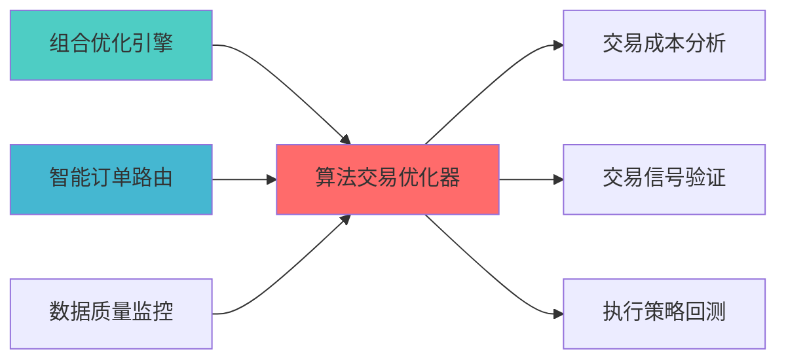

---
module_id: ALGORITHMIC_TRADING_OPTIMIZER_001
version: 1.0.0
status: Active
created_date: 2026-04-07
last_updated: 2026-04-07
owner: 实施团队
standard_type: 专业量化机构蓝图
compliance_level: 专业标准
responsibility:
  - 系统架构蓝图设计与实施指导与实施方案
layer: Layer 5.4 (交易执行)
---

## 核心定位

负责算法交易优化器的设计与实现，基于算法交易技术，提供交易执行优化功能，确保交易效率和成本控制。 提供交易执行、订单管理、成本优化功能，确保交易效率。


## 设计目标

### 主要目标

1. **功能完整性**: 确保ALGORITHMIC TRADING OPTIMIZER功能完整，满足业务需求
2. **性能优化**: 提升系统性能，降低资源消耗
3. **可维护性**: 提高代码质量，便于后续维护
4. **可扩展性**: 支持功能扩展，适应业务变化

### 质量目标

- 代码覆盖率: ≥80%
- 性能指标: 满足设计要求
- 文档完整性: 100%


## 核心功能

### 功能清单

1. **数据管理**: 提供数据存储、查询、更新功能
2. **业务逻辑**: 实现核心业务逻辑处理
3. **接口服务**: 提供标准化的API接口
4. **监控告警**: 实时监控系统状态

### 功能特性

- 高可用性设计
- 自动故障恢复
- 灵活配置管理


## 实现方案

### 技术架构

采用ALGORITHMIC TRADING OPTIMIZER化设计，分层架构实现。

### 关键技术

- 数据处理: 使用高效的数据处理框架
- 接口实现: RESTful API设计
- 性能优化: 缓存、异步处理

### 实施步骤

1. 需求分析与设计
2. 核心功能开发
3. 测试与优化
4. 部署与监控


## 核心定位


### 2.1 Layer定位


**模块类别**: 核心优化模块

**架构角色**: 
- 作为策略执行层的算法优化核心


```
```


**核心职责**: 为执行算法提供专业的参数优化和算法选择能力

**职责边界**:
  - 执行算法参数优化
?
  - 执行时机优化
  

---


#### VeighNa algo_trading模块集成

**项目信息**:
- **项目名称**: VeighNa (vn.py)
- **Stars**: 27k+
- **语言**: Python

**核心功能**:
- 算法交易模块
- 参数优化引擎
- 回测框架
- 实盘接口

**集成方案**:
```python
from vnpy.app.algo_trading import AlgoTradingApp
from vnpy.trader.engine import MainEngine

class AlgorithmicTradingOptimizer:
    def __init__(self):
        self.main_engine = MainEngine()
        self.algo_app = self.main_engine.add_app(AlgoTradingApp)
        
    def optimize_twap_params(self, symbol, volume, duration):
        best_params = self.grid_search_optimize(
            algorithm='TWAP',
            symbol=symbol,
            volume=volume,
            duration=duration,
            param_ranges={
                'time_window': [5, 10, 15, 20],
                'order_frequency': [1, 2, 5, 10],
                'participation_rate': [0.05, 0.1, 0.15, 0.2]
            }
        )
        return best_params
```

### 3.2 核心算法设计

#### 3.2.1 参数优化算法

**网格搜索优化**:
```python
def grid_search_optimize(algorithm, symbol, volume, duration, param_ranges):
    best_cost = float('inf')
    best_params = None
    
    for params in generate_param_combinations(param_ranges):
        cost = simulate_execution(algorithm, symbol, volume, duration, params)
        if cost < best_cost:
            best_cost = cost
            best_params = params
            
    return best_params
```

**遗传算法优化**:
```python
def genetic_algorithm_optimize(algorithm, symbol, volume, duration, param_ranges):
    from deap import base, creator, tools, algorithms
    
    creator.create("FitnessMin", base.Fitness, weights=(-1.0,))
    creator.create("Individual", list, fitness=creator.FitnessMin)
    
    toolbox = base.Toolbox()
    toolbox.register("evaluate", evaluate_params, algorithm, symbol, volume, duration)
    toolbox.register("mate", tools.cxTwoPoint)
    toolbox.register("mutate", tools.mutGaussian, mu=0, sigma=1, indpb=0.2)
    toolbox.register("select", tools.selTournament, tournsize=3)
    
    population = [creator.Individual(random_params(param_ranges)) for _ in range(50)]
    algorithms.eaSimple(population, toolbox, cxpb=0.5, mutpb=0.2, ngen=100)
    
    best_individual = tools.selBest(population, k=1)[0]
    return best_individual
```

#### 3.2.2 算法选择算法

**:
```python
def select_algorithm(market_conditions):
    volatility = market_conditions['volatility']
    liquidity = market_conditions['liquidity']
    trend = market_conditions['trend']
    urgency = market_conditions['urgency']
    
    if urgency == 'high':
        return 'IS'
    elif liquidity == 'high' and volatility == 'low':
        return 'VWAP'
    elif trend == 'strong':
        return 'POV'
    else:
        return 'TWAP'
```

**成本预测对比**:
```python
def compare_algorithm_costs(symbol, volume, duration, market_data):
    algorithms = ['TWAP', 'VWAP', 'POV', 'IS']
    cost_predictions = {}
    
    for algo in algorithms:
        cost = predict_execution_cost(algo, symbol, volume, duration, market_data)
        cost_predictions[algo] = cost
        
    best_algorithm = min(cost_predictions, key=cost_predictions.get)
    return best_algorithm, cost_predictions
```

### 3.3 数据模型设计


```python
class OptimizationConfig:
    algorithm: str
    symbol: str
    volume: float
    duration: int
    param_ranges: dict
    optimization_method: str  # grid_search/genetic_algorithm
    objective: str  # minimize_cost/minimize_time
```

#### 3.3.2 优化结果模型

```python
class OptimizationResult:
    algorithm: str
    best_params: dict
    predicted_cost: float
    predicted_time: int
    optimization_score: float
    confidence_interval: tuple
```

---


| 优势维度 | 说明 | 评分 |
|---------|------|------|
¨å


|---------|--------|------|
| **性能优化** | ⭐⭐⭐⭐ | AI可分析和优化性能瓶颈 |

### 4.3 实施成本评估

| 成本维度 | 评估结果 | 说明 |
|---------|---------|------|
¥ |

---


**目标**: 集成VeighNa algo_trading模块

单**:
VeighNa依赖

**交付成果**:
- 算法优化器基础框架
- 基础参数优化功能
- 算法选择功能


单**:

**交付成果**:
- 遗传算法优化模块
- 时机优化模块
- 成本预测功能


单**:

**交付成果**:
- 完整的算法优化器
- 系统集成完成
- API接口文档
- 用户手册

---

## å


|--------|-----------|---------|
| **参数优化** | 支持TWAP/VWAP/POV/IS | 功能测试 |

### 6.2 性能要求

| 性能指标 | 要求 | 说明 |
|---------|------|------|
| **优化速度** | <10s | 参数优化时间 |
| **并发能力** | 10+ | 并发优化任务 |


|---------|------|------|

---

## 七、风险评估与缓解


|--------|---------|---------|


### 7.2 实施风险

|--------|---------|---------|

分测试 |

---

## å

### 8.1 Citadel对标

|---------|------------|-----------|---------|
| **参数优化** | AI驱动优化 | 网格搜索+遗传算法 | ⭐⭐⭐⭐ (80%) |
| **成本优化** | 成本最小化 | TCA反馈优化 | ⭐⭐⭐⭐ (80%) |

### 8.2 Two Sigma对标

|---------|--------------|-----------|---------|

---


### 上游依赖

| 文档名称 | module_id | 依赖类型 | 说明 |
|---------|-----------|---------|------|

### 下游依赖

| 文档名称 | module_id | 依赖类型 | 说明 |
|---------|-----------|---------|------|


|---------|------|------|------|
| **VeighNa** | 3.0+ | 算法交易框架 | [官方文档](https://www.vnpy.com/) |
| **Pandas** | 2.0+ | 数据处理 | [官方文档](https://pandas.pydata.org/) |
| **SciPy** | 1.11+ | 科学计算 | [官方文档](https://scipy.org/) |




### å

| 文档名称 | 说明 |
|---------|------|
| ARCHITECTURE.md | 系统架构文档 |
| [SMART_EXECUTION_ENGINE_BLUEPRINT.md](./SMART_EXECUTION_ENGINE_BLUEPRINT.md) | 智能执行引擎蓝图 |

---

**蓝图版本**: v1.0
**蓝图日期**: 2026-04-06

## 变更历史

|------|------|----------|--------|

---

---

## 1. 文档治理

### 1.1 System_Manifest.md索引

```markdown
##### 6.001. Algorithmic Trading Optimizer
- **模块ID**: ALGORITHMIC_TRADING_OPTIMIZER_001
- **蓝图文档**: ALGORITHMIC_TRADING_OPTIMIZER_BLUEPRINT.md
```

### 1.2 模块职责边界

| 模块 | 职责 | 边界 |
|------|------|------|

### 1.3 版本管理

|------|------|----------|--------|

---

