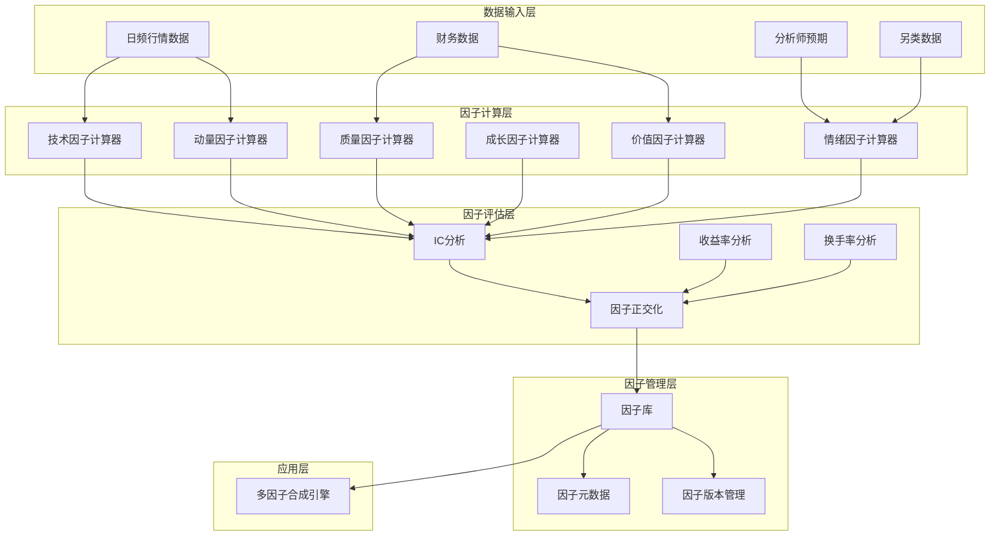

> **版本**: v1.0
> **创建日期**: 2026-04-06
> **核心定位**: 为中观策略层提供系统化的因子生产和管理能力
> **索引**: `ALPHA_FACTOR_FACTORY_001`
> **开发周期**: 3周

---

## 📋 执行摘要

阿尔法因子工厂是清风量化系统中观策略层的核心模块，负责系统化地生产、管理和评估阿尔法因子，为多因子合成引擎提供高质量的因子池。

### 核心价值

- **系统化因子生产**: 标准化的因子计算框架
- **因子质量评估**: 全面的因子有效性检验
- **因子库管理**: 统一的因子存储和版本管理
- **因子组合优化**: 智能的因子权重分配

---

## 🎯 模块定位与职责

### 核心职责

| 职责类别 | 具体职责 | 输出产物 |
|---------|---------|---------|
| **因子计算** | 计算各类阿尔法因子 | 因子值序列 |
| **因子评估** | 评估因子有效性 | 因子评估报告 |
| **因子存储** | 存储因子数据 | 因子库 |
| **因子更新** | 定期更新因子 | 更新日志 |
| **因子筛选** | 筛选有效因子 | 精选因子池 |

---

## 🏗️ 架构设计

### 整体架构



---

## 🔧 关键组件设计

### 1. 因子基类 (Factor Base Class)

```python
from abc import ABC, abstractmethod
from typing import Dict, Any, List
import pandas as pd
import numpy as np

class AlphaFactor(ABC):
    """阿尔法因子基类"""
    
    def __init__(self, factor_name: str, factor_category: str):
        self.factor_name = factor_name
        self.factor_category = factor_category
        self.lookback_period = 20
        
    @abstractmethod
    def calculate(self, data: pd.DataFrame) -> pd.Series:
        """计算因子值"""
        pass
    
    def get_factor_info(self) -> Dict[str, Any]:
        """获取因子信息"""
        return {
            'factor_name': self.factor_name,
            'factor_category': self.factor_category,
            'lookback_period': self.lookback_period
        }


class MomentumFactor(AlphaFactor):
    """动量因子"""
    
    def __init__(self):
        super().__init__('Momentum', 'Momentum')
        
    def calculate(self, data: pd.DataFrame) -> pd.Series:
        """计算动量因子"""
        returns = data['close'].pct_change(self.lookback_period)
        return returns


class ValueFactor(AlphaFactor):
    """价值因子"""
    
    def __init__(self):
        super().__init__('Value', 'Value')
        
    def calculate(self, data: pd.DataFrame) -> pd.Series:
        """计算价值因子（PE倒数）"""
        if 'pe_ttm' in data.columns:
            return 1 / data['pe_ttm']
        return pd.Series(index=data.index)


class QualityFactor(AlphaFactor):
    """质量因子"""
    
    def __init__(self):
        super().__init__('Quality', 'Quality')
        
    def calculate(self, data: pd.DataFrame) -> pd.Series:
        """计算质量因子（ROE）"""
        if 'roe' in data.columns:
            return data['roe']
        return pd.Series(index=data.index)
```

### 2. 因子评估器 (Factor Evaluator)

```python
from typing import Dict, Any
import pandas as pd
import numpy as np
from scipy import stats

class FactorEvaluator:
    """因子评估器"""
    
    def evaluate(self,
                factor_values: pd.Series,
                forward_returns: pd.Series) -> Dict[str, Any]:
        """评估因子有效性"""
        # IC分析
        ic = self._calculate_ic(factor_values, forward_returns)
        
        # IC均值、IC标准差、ICIR
        ic_mean = ic.mean()
        ic_std = ic.std()
        icir = ic_mean / ic_std if ic_std != 0 else 0
        
        # 分组收益分析
        group_returns = self._calculate_group_returns(factor_values, forward_returns)
        
        # 单调性检验
        monotonicity = self._test_monotonicity(group_returns)
        
        return {
            'ic_mean': ic_mean,
            'ic_std': ic_std,
            'icir': icir,
            'group_returns': group_returns,
            'monotonicity': monotonicity,
            'ic_series': ic
        }
    
    def _calculate_ic(self,
                     factor_values: pd.Series,
                     forward_returns: pd.Series) -> pd.Series:
        """计算IC序列"""
        # Spearman秩相关系数
        ic = factor_values.rolling(1).corr(forward_returns, method='spearman')
        return ic
    
    def _calculate_group_returns(self,
                                factor_values: pd.Series,
                                forward_returns: pd.Series,
                                n_groups: int = 5) -> pd.Series:
        """计算分组收益"""
        # 按因子值分组
        factor_rank = factor_values.rank(pct=True)
        group_labels = pd.cut(factor_rank, bins=n_groups, labels=False)
        
        # 计算各组平均收益
        group_returns = forward_returns.groupby(group_labels).mean()
        
        return group_returns
    
    def _test_monotonicity(self, group_returns: pd.Series) -> float:
        """检验单调性"""
        # 计算趋势
        x = np.arange(len(group_returns))
        slope, _, r_value, _, _ = stats.linregress(x, group_returns.values)
        
        return r_value ** 2
```

### 3. 因子工厂 (Factor Factory)

```python
from typing import Dict, Any, List
import pandas as pd

class AlphaFactorFactory:
    """阿尔法因子工厂"""
    
    def __init__(self):
        self.factors: Dict[str, AlphaFactor] = {}
        self.evaluator = FactorEvaluator()
        
    def register_factor(self, factor: AlphaFactor) -> None:
        """注册因子"""
        self.factors[factor.factor_name] = factor
        
    def calculate_all_factors(self, data: pd.DataFrame) -> pd.DataFrame:
        """计算所有因子"""
        factor_values = pd.DataFrame(index=data.index)
        
        for factor_name, factor in self.factors.items():
            factor_values[factor_name] = factor.calculate(data)
        
        return factor_values
    
    def evaluate_all_factors(self,
                            factor_values: pd.DataFrame,
                            forward_returns: pd.Series) -> Dict[str, Dict[str, Any]]:
        """评估所有因子"""
        evaluation_results = {}
        
        for factor_name in factor_values.columns:
            evaluation_results[factor_name] = self.evaluator.evaluate(
                factor_values[factor_name],
                forward_returns
            )
        
        return evaluation_results
    
    def select_best_factors(self,
                           evaluation_results: Dict[str, Dict[str, Any]],
                           top_n: int = 10) -> List[str]:
        """选择最佳因子"""
        # 按ICIR排序
        sorted_factors = sorted(
            evaluation_results.items(),
            key=lambda x: abs(x[1]['icir']),
            reverse=True
        )
        
        return [factor[0] for factor in sorted_factors[:top_n]]
```

---

## 📊 因子库设计

### 因子分类体系

| 因子类别 | 因子名称 | 因子描述 | 计算公式 |
|---------|---------|---------|---------|
| **动量因子** | MOM_1M | 1月动量 | (P_t - P_{t-20}) / P_{t-20} |
| **动量因子** | MOM_3M | 3月动量 | (P_t - P_{t-60}) / P_{t-60} |
| **动量因子** | MOM_6M | 6月动量 | (P_t - P_{t-120}) / P_{t-120} |
| **价值因子** | PE | 市盈率倒数 | 1 / PE_TTM |
| **价值因子** | PB | 市净率倒数 | 1 / PB |
| **价值因子** | PS | 市销率倒数 | 1 / PS_TTM |
| **质量因子** | ROE | 净资产收益率 | Net Income / Equity |
| **质量因子** | ROA | 总资产收益率 | Net Income / Assets |
| **质量因子** | GrossMargin | 毛利率 | (Revenue - COGS) / Revenue |
| **成长因子** | Revenue_Growth | 营收增长率 | (Revenue_t - Revenue_{t-1}) / Revenue_{t-1} |
| **成长因子** | Earnings_Growth | 盈利增长率 | (EPS_t - EPS_{t-1}) / EPS_{t-1} |
| **技术因子** | RSI | 相对强弱指标 | 标准RSI计算 |
| **技术因子** | MACD | 指数平滑异同移动平均线 | 标准MACD计算 |
| **情绪因子** | Sentiment_Score | 情绪评分 | 综合情绪指标 |

---

## 🚀 实施要点

### 阶段1：因子基类开发（第1周）

**任务**:
1. ✅ 实现因子基类
2. ✅ 实现动量因子
3. ✅ 实现价值因子
4. ✅ 实现质量因子
5. ✅ 编写单元测试

---

### 阶段2：因子评估器开发（第2周）

**任务**:
1. ✅ 实现IC分析
2. ✅ 实现分组收益分析
3. ✅ 实现因子正交化
4. ✅ 编写单元测试

---

### 阶段3：因子工厂开发（第3周）

**任务**:
1. ✅ 实现因子注册和管理
2. ✅ 实现因子批量计算
3. ✅ 实现因子筛选
4. ✅ 集成测试

---

## 📈 性能指标

### 因子质量要求

| 指标 | 目标值 |
|------|--------|
| **IC均值** | |IC| > 0.03 |
| **ICIR** | > 0.5 |
| **单调性R²** | > 0.8 |
| **因子覆盖率** | > 95% |

---

## 🔗 相关文档

- [市场状态识别系统蓝图](./MARKET_REGIME_DETECTION_BLUEPRINT.md)
- 多因子合成引擎蓝图
- 专业多时间框架策略架构

---

## 📝 变更历史

| 版本 | 日期 | 变更内容 | 作者 |
|------|------|---------|------|
| v1.0.0 | 2026-04-06 | 初始版本创建 | 首席架构师 |

---

**蓝图状态**: ✅ 设计完成
**下一步**: 开始实施阶段1 - 因子基类开发
---

## 1. 文档治理

### 1.1 System_Manifest.md索引

```markdown
#### Layer 3: 中观策略层
##### 6.001. Alpha Factor Factory
- **模块ID**: ALPHA_FACTOR_FACTORY_001
- **蓝图文档**: ALPHA_FACTOR_FACTORY_BLUEPRINT.md
- **技术规格书**: 待创建
- **职责**: 中观策略层因子生产
- **状态**: Active
```

### 1.2 模块职责边界

| 模块 | 职责 | 边界 |
|------|------|------|
| **Alpha Factor Factory** | 中观策略层因子生产 | **核心模块** |

### 1.3 版本管理

| 版本 | 日期 | 变更内容 | 变更人 |
|------|------|----------|--------|
| v1.0.0 | 2026-04-06 | 初始版本创建 | 首席蓝图架构师 |

---

**蓝图版本**: v1.0.0 | **创建日期**: 2026-04-06 | **状态**: Active
