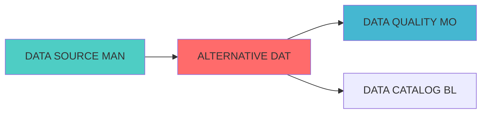

---
module_id: ALTERNATIVE_DATA_INTEGRATION_001
version: 1.0.0
status: Active
created_date: 2026-04-07
last_updated: 2026-04-07
owner: 实施团队
standard_type: 专业量化机构蓝图
applicable_scope: Layer 1 数据源层
compliance_level: 专业标准
responsibility:
  - 另类数据集成
  - 数据源接å
?
  - 数据标准åŒ?
  - 数据质量控制
layer: Layer 5 (策略执行层)
---


## 核心定位

负责另类数据集成的设计与实现，整合多源另类数据，提供数据清洗、标准化和特征提取功能，支持因子挖掘和策略增强。

# ALTERNATIVE DATA INTEGRATION BLUEPRINT

> **核心职责**: Alternative Data Integration蓝图设计
> **职责边界**: 
> - âœ?本文档负责：Alternative Data...


## 设计目标

### 主要目标

1. **功能完整性**: 确保ALTERNATIVE DATA INTEGRATION功能完整，满足业务需求
2. **性能优化**: 提升系统性能，降低资源消耗
3. **可维护性**: 提高代码质量，便于后续维护
4. **可扩展性**: 支持功能扩展，适应业务变化

### 质量目标

- 代码覆盖率: ≥80%
- 性能指标: 满足设计要求
- 文档完整性: 100%


## 核心功能

### 功能清单

1. **数据管理**: 提供数据存储、查询、更新功能
2. **业务逻辑**: 实现核心业务逻辑处理
3. **接口服务**: 提供标准化的API接口
4. **监控告警**: 实时监控系统状态

### 功能特性

- 高可用性设计
- 自动故障恢复
- 灵活配置管理


## 实现方案

### 技术架构

采用ALTERNATIVE DATA INTEGRATION化设计，分层架构实现。

### 关键技术

- 数据处理: 使用高效的数据处理框架
- 接口实现: RESTful API设计
- 性能优化: 缓存、异步处理

### 实施步骤

1. 需求分析与设计
2. 核心功能开发
3. 测试与优化
4. 部署与监控


## 核心定位

**单一职责**: 另类数据源集成与因子构建，åŒ
括新闻数据、社交媒体数据、分析师预期数据的采集、处理和因子生成

### 职责边界

**âœ?核心职责**:

- 另类数据源接å
¥ï¼ˆæ–°é—»ã€ç¤¾äº¤åª’体、分析师预期ï¼?
- 数据采集与æ¸
洗（API接口、爬虫、实时流ï¼?
- NLP处理与因子构建（æƒ
感分析、事件提取、实体识别）
- 因子管理与验证（存储、IC验证、监控）

**â?非职责范å›?*:
- 传统市场数据采集
- 数据质量监控
- 数据存储基础设施

## 一、项目架构设?
### 1.1 整体架构

```
┌─────────────────────────────────────────────────────────────────────??                   另类数据源集成架?                                ?├─────────────────────────────────────────────────────────────────────??                                                                    ?? 数据源层 (Data Sources)                                            ?? ├── 新闻数据? 财联社API、新浪财经API、东方财富API                ?? ├── 社交媒体数据? 微博API、雪球网爬虫、东方财富股?             ?? └── 分析师预期数据源: 东方财富分析师预期、同花顺研报               ??                                                                    ?? 数据采集?(Data Collection)                                       ?? ├── API接口适é
? 统一API调用接口                                 ?? ├── 爬虫引擎: Scrapy + Selenium                                   ?? ├── 实时数据? WebSocket + Kafka                                 ?? └── 数据调度? Apache Airflow                                    ??                                                                    ?? 数据处理?(Data Processing)                                       ?? ├── 数据æ¸
洗: 去重、去噪、格式标准化                               ?? ├── NLP处理: GLM-4-Flash（æƒ
感分析、事件提取）                     ?? ├── 实体识别: 股票代码、å
¬å¸åç§°ã€äººç‰©è¯†?                        ?? └── å
³ç³»æŠ½å–: 新闻-股票å
³è”、事?影响分析                         ??                                                                    ?? 因子构建?(Factor Construction)                                   ?? ├── 新闻因子: æƒ
感因子、事件驱动因子、热度因?                    ?? ├── æƒ
绪因子: 市场æƒ
绪、板块æƒ
绪、个股æƒ
?                        ?? ├── 预期因子: 分析师预期差异、一致预期偏?                        ?? └── å
³æ³¨åº¦å› ? 社交媒体热度、搜索指数、讨论量                     ??                                                                    ?? 因子管理?(Factor Management)                                     ?? ├── 因子存储: SQLite + 向量数据?                                 ?? ├── IC验证: 因子有效性检?                                        ?? ├── 因子监控: 实时因子跟踪                                         ?? └── 因子注册: 自动化因子注册流?                                  ??                                                                    ?└─────────────────────────────────────────────────────────────────────?```

### 1.2 技术栈选择

| 技术领?| 技术选型 | 选择理由 |
|---------|---------|---------|
| **数据采集** | Scrapy + Selenium + Requests | 成熟稳定，支持动态页?|
| **NLP处理** | GLM-4-Flash | 成本低（0.1?百万tokens），速度?|
| **实体识别** | GLM-4-Flash + 正则表达?| 准确率高，成本低 |
| **数据存储** | SQLite + ChromaDB | 轻量级，适合个人使用 |
| **任务调度** | Apache Airflow | 成熟的工作流引擎 |
| **实时流处?* | Kafka（可选） | 支持实时数据?|
| **数据缓存** | Redis | 提升查询性能 |

---

## 二、数据源详细设计

### 2.1 新闻数据?
#### 2.1.1 财联社API

**数据å†
容**:
- 实时财经新闻?×24小时?- 快讯、å
¬å‘Šã€ç ”?- 行业新闻、å
¬å¸æ–°?
**技术方?*:
```python
class CailianNewsDataSource:
    """财联社新闻数据源"""
    
    def __init__(self, config):
        self.api_url = "https://www.cls.cn/api/sw"
        self.headers = {
            'User-Agent': 'Mozilla/5.0',
            'Referer': 'https://www.cls.cn/'
        }
        
    def get_realtime_news(self, limit=100):
        """获取实时新闻"""
        params = {
            'app': 'CailianpressWeb',
            'os': 'web',
            'sv': '8.4.6',
            'sign': self._generate_sign(),
            'rn': limit
        }
        response = requests.get(self.api_url, headers=self.headers, params=params)
        return self._parse_news(response.json())
    
    def get_stock_news(self, stock_code, start_date, end_date):
        """获取个股相å
³æ–°é—»"""
        # 通过å
³é”®è¯æœç´¢ç›¸å
³æ–°?        pass
```

**数据字段**:
| 字段?| 类型 | 说明 |
|--------|------|------|
| news_id | string | 新闻唯一ID |
| title | string | 新闻标题 |
| content | text | 新闻正文 |
| publish_time | datetime | 发布时间 |
| source | string | 数据来源 |
| stock_codes | array | 相å
³è‚¡ç¥¨ä»£ç  |
| sentiment | float | æƒ
感得分?1??|
| event_type | string | 事件类型 |

**成本**: å
è´¹ï¼ˆæœ‰é¢‘率限制?
---

#### 2.1.2 新浪财经API

**数据å†
容**:
- 财经新闻、å
¬?- 行业资讯、市场分?
**技术方?*:
```python
class SinaFinanceDataSource:
    """新浪财经数据?""
    
    def __init__(self, config):
        self.api_url = "https://feed.mix.sina.com.cn/api/roll/get"
        
    def get_news(self, page=1, page_size=50):
        """获取新闻列表"""
        params = {
            'pageid': '153',
            'lid': '2509',
            'k': '',
            'num': page_size,
            'page': page
        }
        response = requests.get(self.api_url, params=params)
        return self._parse_response(response.json())
```

**成本**: å
è´¹

---

#### 2.1.3 东方财富API

**数据å†
容**:
- 财经新闻、å
¬?- 研报、资?
**技术方?*:
```python
class EastMoneyDataSource:
    """东方财富数据?""
    
    def __init__(self, config):
        self.api_url = "https://np-listapi.eastmoney.com/comm/web/getFastNewsList"
        
    def get_news(self, page_index=1, page_size=50):
        """获取新闻列表"""
        params = {
            'client': 'web',
            'biz': 'web_724',
            'fastColumn': '102',
            'sortEnd': '',
            'pageSize': page_size,
            'pageIndex': page_index
        }
        response = requests.get(self.api_url, params=params)
        return self._parse_response(response.json())
```

**成本**: å
è´¹

---

### 2.2 社交媒体数据?
#### 2.2.1 微博API

**数据å†
容**:
- 财经大V观点
- 股票讨论、æƒ
?- 热门话题

**技术方?*:
```python
class WeiboDataSource:
    """微博数据?""
    
    def __init__(self, config):
        self.api_url = "https://m.weibo.cn/api/container/getIndex"
        self.headers = {
            'User-Agent': 'Mozilla/5.0',
            'Cookie': config.get('weibo_cookie')
        }
        
    def search_stock_posts(self, stock_name, page=1):
        """搜索股票相å
³å¾®åš"""
        params = {
            'containerid': f'100103type=1&q={stock_name}',
            'page_type': 'searchall',
            'page': page
        }
        response = requests.get(self.api_url, headers=self.headers, params=params)
        return self._parse_posts(response.json())
    
    def get_hot_topics(self):
        """获取热门话题"""
        params = {
            'containerid': '106003type=25&t=3&disable_hot=1&filter_type=realtime'
        }
        response = requests.get(self.api_url, headers=self.headers, params=params)
        return self._parse_topics(response.json())
```

**数据字段**:
| 字段?| 类型 | 说明 |
|--------|------|------|
| post_id | string | 微博ID |
| user_id | string | 用户ID |
| user_name | string | 用户?|
| content | text | 微博å†
容 |
| publish_time | datetime | 发布时间 |
| likes | int | 点赞?|
| comments | int | 评论?|
| reposts | int | 转发?|
| sentiment | float | æƒ
感得分 |

**成本**: å
è´¹ï¼ˆéœ€è¦ç™»å½•cookie?
---

#### 2.2.2 雪球网爬?
**数据å†
容**:
- 股票讨论、观?- 投资è€
æƒ
?- 热门股票

**技术方?*:
```python
class XueqiuDataSource:
    """雪球数据?""
    
    def __init__(self, config):
        self.base_url = "https://xueqiu.com"
        self.headers = {
            'User-Agent': 'Mozilla/5.0',
            'Cookie': config.get('xueqiu_cookie')
        }
        
    def get_stock_posts(self, stock_code, page=1):
        """获取股票相å
³è®¨è®º"""
        url = f"{self.base_url}/query/v1/symbol/search/status.json"
        params = {
            'symbol': stock_code,
            'count': 20,
            'page': page
        }
        response = requests.get(url, headers=self.headers, params=params)
        return self._parse_posts(response.json())
    
    def get_hot_stocks(self):
        """获取热门股票"""
        url = f"{self.base_url}/stock/pick_and_drop_list.json"
        response = requests.get(url, headers=self.headers)
        return self._parse_hot_stocks(response.json())
```

**成本**: å
è´¹ï¼ˆéœ€è¦ç™»å½•cookie?
---

#### 2.2.3 东方财富股吧

**数据å†
容**:
- 股票讨论、观?- 散户æƒ
绪

**技术方?*:
```python
class GubaDataSource:
    """东方财富股吧数据?""
    
    def __init__(self, config):
        self.base_url = "https://guba.eastmoney.com"
        
    def get_stock_posts(self, stock_code, page=1):
        """获取股票吧帖?""
        url = f"{self.base_url}/list,{stock_code}.html"
        params = {
            'pageindex': page
        }
        response = requests.get(url, params=params)
        return self._parse_posts(response.text)
```

**成本**: å
è´¹

---

### 2.3 分析师预期数据源

#### 2.3.1 东方财富分析师预?
**数据å†
容**:
- 分析师评?- 目标价预?- 盈利预测

**技术方?*:
```python
class AnalystExpectationDataSource:
    """分析师预期数据源"""
    
    def __init__(self, config):
        self.api_url = "https://data.eastmoney.com/dataapi/limit_up"
        
    def get_analyst_rating(self, stock_code):
        """获取分析师评?""
        url = f"https://data.eastmoney.com/report/info/{stock_code}.html"
        response = requests.get(url)
        return self._parse_rating(response.text)
    
    def get_consensus_forecast(self, stock_code):
        """获取一致预?""
        params = {
            'code': stock_code,
            'rtype': 'EPS'
        }
        response = requests.get(self.api_url, params=params)
        return self._parse_forecast(response.json())
```

**数据字段**:
| 字段?| 类型 | 说明 |
|--------|------|------|
| stock_code | string | 股票代码 |
| analyst_name | string | 分析师姓?|
| institution | string | 机构名称 |
| rating | string | 评级（买?增持/ä¸?减持/卖出?|
| target_price | float | 目标?|
| eps_forecast | float | EPS预测 |
| report_date | date | 报告日期 |

**成本**: å
è´¹

---

## 三、NLP处理流程

### 3.1 æƒ
感分析

**技术方?*: GLM-4-Flash

```python
class SentimentAnalyzer:
    """æƒ
感分析?""
    
    def __init__(self):
        self.model = "glm-4-flash"
        self.api_key = config.get('zhipu_api_key')
        
    def analyze_sentiment(self, text):
        """分析文本æƒ
感"""
        prompt = f"""
        请分析以下财经新闻的æƒ
感倾向，返?1?之间的æƒ
感得分：
        -1表示极度负面?表示中性，1表示极度正面
        
        新闻å†
容：{text}
        
        请只返回æƒ
感得分数值，不要å
¶ä»–解释?        """
        
        response = self._call_api(prompt)
        sentiment_score = float(response.strip())
        return sentiment_score
    
    def batch_analyze(self, texts):
        """批量æƒ
感分析"""
        results = []
        for text in texts:
            sentiment = self.analyze_sentiment(text)
            results.append(sentiment)
        return results
```

**成本**: 0.1?百万tokens

---

### 3.2 事件提取

**技术方?*: GLM-4-Flash

```python
class EventExtractor:
    """事件提取?""
    
    def __init__(self):
        self.model = "glm-4-flash"
        self.event_types = [
            '业绩å
¬å‘Š', '并购重组', '股权变动', '高管变动',
            '产品发布', '政策影响', '行业åŠ?, '市场事件'
        ]
        
    def extract_events(self, text):
        """提取新闻事件"""
        prompt = f"""
        请从以下财经新闻中提取å
³é”®äº‹ä»¶ä¿¡æ¯ï¼š
        
        新闻å†
容：{text}
        
        请返回JSON格式?        {{
            "event_type": "事件类型",
            "event_summary": "事件摘要",
            "related_stocks": ["相å
³è‚¡ç¥¨ä»£ç "],
            "impact_level": "影响等级（高/?低）",
            "sentiment": "æƒ
感倾向（正?负面/中性）"
        }}
        """
        
        response = self._call_api(prompt)
        event_info = json.loads(response)
        return event_info
```

---

### 3.3 实体识别

**技术方?*: GLM-4-Flash + 正则表达?
```python
class EntityRecognizer:
    """实体识别?""
    
    def __init__(self):
        self.stock_pattern = r'(SH\d{6}|SZ\d{6}|\d{6}\.(SH|SZ))'
        
    def extract_stocks(self, text):
        """提取股票代码"""
        # 1. 正则匹é
è‚¡ç¥¨ä»£ç 
        stock_codes = re.findall(self.stock_pattern, text)
        
        # 2. GLM-4识别å
¬å¸åç§°
        prompt = f"""
        请从以下文本中识别所有提到的上市å
¬å¸åç§°ï¼Œè¿”回股票代码列表：
        
        文本：{text}
        
        请只返回股票代码列表，格式：["代码1", "代码2"]
        """
        
        response = self._call_api(prompt)
        stock_names = json.loads(response)
        
        return list(set(stock_codes + stock_names))
```

---

## 四、因子构建方?
### 4.1 新闻因子

#### 因子1: 新闻æƒ
感因子

**因子定义**: 基于新闻æƒ
感分析构建的因?
**计算方法**:
```python
def calculate_news_sentiment_factor(stock_code, date, window=7):
    """
    计算新闻æƒ
感因子
    
    Args:
        stock_code: 股票代码
        date: 计算日期
        window: 时间窗口（天?    
    Returns:
        因子值（-1??    """
    # 1. 获取过去window天的相å
³æ–°é—»
    news_list = get_stock_news(stock_code, date-window, date)
    
    # 2. 计算每条新闻的æƒ
感得?    sentiments = [analyze_sentiment(news['content']) for news in news_list]
    
    # 3. 加权平均（近期新闻权重更高）
    weights = np.exp(np.linspace(-1, 0, len(sentiments)))
    weights = weights / weights.sum()
    
    factor_value = np.average(sentiments, weights=weights)
    
    return factor_value
```

**因子特征**:
- 因子类型: æƒ
绪因子
- 更新频率: 日频
- 数据窗口: 7?- IC预期: 0.03-0.05

---

#### 因子2: 事件驱动因子

**因子定义**: 基于重大事件的影响构建的因子

**计算方法**:
```python
def calculate_event_driven_factor(stock_code, date):
    """
    计算事件驱动因子
    
    Args:
        stock_code: 股票代码
        date: 计算日期
    
    Returns:
        因子值（事件影响得分?    """
    # 1. 获取近期重大事件
    events = get_recent_events(stock_code, date, days=30)
    
    # 2. 计算事件影响得分
    impact_scores = []
    for event in events:
        # 根据事件类型和影响等级计算得?        base_score = EVENT_IMPACT_MAP[event['event_type']]
        level_multiplier = {'?: 1.0, '?: 0.6, '?: 0.3}[event['impact_level']]
        sentiment_multiplier = {'正面': 1.0, '负面': -1.0, 'ä¸?: 0.0}[event['sentiment']]
        
        score = base_score * level_multiplier * sentiment_multiplier
        impact_scores.append(score)
    
    # 3. 加权平均（近期事件权重更高）
    factor_value = np.mean(impact_scores) if impact_scores else 0
    
    return factor_value
```

**因子特征**:
- 因子类型: 事件因子
- 更新频率: 日频
- 数据窗口: 30?- IC预期: 0.04-0.06

---

#### 因子3: 新闻热度因子

**因子定义**: 基于新闻数量和å
³æ³¨åº¦æž„建的因?
**计算方法**:
```python
def calculate_news_heat_factor(stock_code, date, window=7):
    """
    计算新闻热度因子
    
    Args:
        stock_code: 股票代码
        date: 计算日期
        window: 时间窗口（天?    
    Returns:
        因子值（热度得分?    """
    # 1. 获取过去window天的新闻数量
    news_count = count_stock_news(stock_code, date-window, date)
    
    # 2. 计算å
¨å¸‚场平均新闻数?    market_avg = get_market_avg_news_count(date-window, date)
    
    # 3. 计算相对热度
    heat_score = (news_count - market_avg) / market_avg
    
    # 4. 标准化到0-1
    factor_value = 1 / (1 + np.exp(-heat_score))
    
    return factor_value
```

**因子特征**:
- 因子类型: å
³æ³¨åº¦å› ?- 更新频率: 日频
- 数据窗口: 7?- IC预期: 0.02-0.04

---

### 4.2 æƒ
绪因子

#### 因子4: 市场æƒ
绪因子

**因子定义**: 基于社交媒体æƒ
绪构建的市场整体æƒ
绪因?
**计算方法**:
```python
def calculate_market_sentiment_factor(date):
    """
    计算市场æƒ
绪因子
    
    Args:
        date: 计算日期
    
    Returns:
        因子值（市场æƒ
绪得分?    """
    # 1. 获取微博、雪球、股吧的热门讨论
    posts = get_hot_posts(date)
    
    # 2. 计算æƒ
绪得分
    sentiments = [analyze_sentiment(post['content']) for post in posts]
    
    # 3. 加权平均（按互动量加权）
    weights = [post['likes'] + post['comments'] + post['reposts'] for post in posts]
    weights = np.array(weights) / sum(weights)
    
    factor_value = np.average(sentiments, weights=weights)
    
    return factor_value
```

**因子特征**:
- 因子类型: æƒ
绪因子
- 更新频率: 日频
- 适用范围: å
¨å¸‚?- IC预期: 0.03-0.05

---

#### 因子5: 个股æƒ
绪因子

**因子定义**: 基于社交媒体讨论构建的个股æƒ
绪因?
**计算方法**:
```python
def calculate_stock_sentiment_factor(stock_code, date, window=7):
    """
    计算个股æƒ
绪因子
    
    Args:
        stock_code: 股票代码
        date: 计算日期
        window: 时间窗口（天?    
    Returns:
        因子值（个股æƒ
绪得分?    """
    # 1. 获取社交媒体讨论
    posts = get_stock_posts(stock_code, date-window, date)
    
    # 2. 计算æƒ
绪得分
    sentiments = [analyze_sentiment(post['content']) for post in posts]
    
    # 3. 计算讨论热度
    engagement = sum([post['likes'] + post['comments'] + post['reposts'] for post in posts])
    
    # 4. 综合æƒ
绪和热?    avg_sentiment = np.mean(sentiments)
    heat_score = np.log1p(engagement)
    
    factor_value = avg_sentiment * (1 + 0.1 * heat_score)
    
    return factor_value
```

**因子特征**:
- 因子类型: æƒ
绪因子
- 更新频率: 日频
- 数据窗口: 7?- IC预期: 0.03-0.05

---

### 4.3 预期因子

#### 因子6: 分析师预期差异因?
**因子定义**: 基于分析师预期与实é™
值差异构建的因子

**计算方法**:
```python
def calculate_expectation_gap_factor(stock_code, date):
    """
    计算分析师预期差异因?    
    Args:
        stock_code: 股票代码
        date: 计算日期
    
    Returns:
        因子值（预期差异得分?    """
    # 1. 获取分析师一致预?    consensus = get_consensus_forecast(stock_code, date)
    
    # 2. 获取实é™
?    actual = get_actual_eps(stock_code, date)
    
    # 3. 计算预期差异
    if consensus and actual:
        gap = (actual - consensus) / abs(consensus)
        factor_value = gap
    else:
        factor_value = 0
    
    return factor_value
```

**因子特征**:
- 因子类型: 预期因子
- 更新频率: 季度
- IC预期: 0.05-0.08

---

#### 因子7: 分析师评级变化因?
**因子定义**: 基于分析师评级变化构建的因子

**计算方法**:
```python
def calculate_rating_change_factor(stock_code, date, window=30):
    """
    计算分析师评级变化因?    
    Args:
        stock_code: 股票代码
        date: 计算日期
        window: 时间窗口（天?    
    Returns:
        因子值（评级变化得分?    """
    # 1. 获取过去window天的评级变化
    ratings = get_rating_history(stock_code, date-window, date)
    
    # 2. 计算评级变化
    if len(ratings) >= 2:
        rating_map = {'ä¹°å
¥': 2, '增持': 1, 'ä¸?: 0, '减持': -1, '卖出': -2}
        latest_rating = rating_map.get(ratings[-1]['rating'], 0)
        previous_rating = rating_map.get(ratings[0]['rating'], 0)
        
        factor_value = latest_rating - previous_rating
    else:
        factor_value = 0
    
    return factor_value
```

**因子特征**:
- 因子类型: 预期因子
- 更新频率: 日频
- 数据窗口: 30?- IC预期: 0.03-0.05

---

### 4.4 å
³æ³¨åº¦å› ?
#### 因子8: 社交媒体热度因子

**因子定义**: 基于社交媒体讨论量构建的å
³æ³¨åº¦å› ?
**计算方法**:
```python
def calculate_social_heat_factor(stock_code, date, window=7):
    """
    计算社交媒体热度因子
    
    Args:
        stock_code: 股票代码
        date: 计算日期
        window: 时间窗口（天?    
    Returns:
        因子值（热度得分?    """
    # 1. 获取社交媒体讨论?    posts = get_stock_posts(stock_code, date-window, date)
    
    # 2. 计算总互动量
    total_engagement = sum([
        post['likes'] + post['comments'] + post['reposts']
        for post in posts
    ])
    
    # 3. 计算讨论?    post_count = len(posts)
    
    # 4. 综合热度得分
    heat_score = np.log1p(total_engagement) + 0.5 * np.log1p(post_count)
    
    # 5. 标准?    factor_value = heat_score / 10  # 简单标准化
    
    return factor_value
```

**因子特征**:
- 因子类型: å
³æ³¨åº¦å› ?- 更新频率: 日频
- 数据窗口: 7?- IC预期: 0.02-0.04

---

## 五、数据存储设?
### 5.1 数据库设?
#### 新闻数据?
```sql
CREATE TABLE news_data (
    news_id TEXT PRIMARY KEY,
    title TEXT NOT NULL,
    content TEXT,
    publish_time TIMESTAMP NOT NULL,
    source TEXT NOT NULL,
    url TEXT,
    stock_codes TEXT,  -- JSON array
    sentiment REAL,
    event_type TEXT,
    event_summary TEXT,
    impact_level TEXT,
    created_at TIMESTAMP DEFAULT CURRENT_TIMESTAMP,
    updated_at TIMESTAMP DEFAULT CURRENT_TIMESTAMP
);

CREATE INDEX idx_news_publish_time ON news_data(publish_time);
CREATE INDEX idx_news_source ON news_data(source);
CREATE INDEX idx_news_sentiment ON news_data(sentiment);
```

#### 社交媒体数据?
```sql
CREATE TABLE social_posts (
    post_id TEXT PRIMARY KEY,
    platform TEXT NOT NULL,  -- weibo, xueqiu, guba
    user_id TEXT,
    user_name TEXT,
    content TEXT NOT NULL,
    publish_time TIMESTAMP NOT NULL,
    likes INTEGER DEFAULT 0,
    comments INTEGER DEFAULT 0,
    reposts INTEGER DEFAULT 0,
    stock_codes TEXT,  -- JSON array
    sentiment REAL,
    created_at TIMESTAMP DEFAULT CURRENT_TIMESTAMP
);

CREATE INDEX idx_posts_platform ON social_posts(platform);
CREATE INDEX idx_posts_publish_time ON social_posts(publish_time);
CREATE INDEX idx_posts_sentiment ON social_posts(sentiment);
```

#### 分析师预期数据表

```sql
CREATE TABLE analyst_expectations (
    id INTEGER PRIMARY KEY AUTOINCREMENT,
    stock_code TEXT NOT NULL,
    analyst_name TEXT,
    institution TEXT,
    rating TEXT,
    target_price REAL,
    eps_forecast REAL,
    report_date DATE NOT NULL,
    created_at TIMESTAMP DEFAULT CURRENT_TIMESTAMP
);

CREATE INDEX idx_analyst_stock ON analyst_expectations(stock_code);
CREATE INDEX idx_analyst_date ON analyst_expectations(report_date);
```

#### 因子数据?
```sql
CREATE TABLE alternative_factors (
    factor_id TEXT PRIMARY KEY,
    factor_name TEXT NOT NULL,
    factor_type TEXT NOT NULL,
    stock_code TEXT NOT NULL,
    date DATE NOT NULL,
    factor_value REAL NOT NULL,
    data_source TEXT,
    calculation_method TEXT,
    created_at TIMESTAMP DEFAULT CURRENT_TIMESTAMP,
    UNIQUE(factor_name, stock_code, date)
);

CREATE INDEX idx_factor_type ON alternative_factors(factor_type);
CREATE INDEX idx_factor_date ON alternative_factors(date);
CREATE INDEX idx_factor_stock ON alternative_factors(stock_code);
```

---

### 5.2 向量数据库设?
**ç”?*: 存储新闻和社交媒体å†
容的向量表示，支持语义搜?
```python
from chromadb import Client
from chromadb.config import Settings

class VectorStore:
    """向量存储"""
    
    def __init__(self):
        self.client = Client(Settings(
            chroma_db_impl="duckdb+parquet",
            persist_directory="./data/vector_db"
        ))
        
        # 创建collection
        self.news_collection = self.client.get_or_create_collection("news_vectors")
        self.posts_collection = self.client.get_or_create_collection("posts_vectors")
        
    def add_news(self, news_id, content, metadata):
        """添加新闻向量"""
        # 生成embedding
        embedding = self._generate_embedding(content)
        
        # 存储向量
        self.news_collection.add(
            ids=[news_id],
            embeddings=[embedding],
            metadatas=[metadata],
            documents=[content]
        )
        
    def search_similar_news(self, query, n_results=10):
        """搜索相似新闻"""
        query_embedding = self._generate_embedding(query)
        
        results = self.news_collection.query(
            query_embeddings=[query_embedding],
            n_results=n_results
        )
        
        return results
```

---

## å
­ã€é¡¹ç›®å®žæ–½è®¡?
### 6.1 时间规划

| 阶段 | 时间 | 任务 | 交付?|
|------|------|------|--------|
| **Phase 1: 数据源接?* | Week 1-3 | 接å
¥æ–°é—»ã€ç¤¾äº¤åª’体、分析师预期数据?| 数据采集模块、数据库表结?|
| **Phase 2: NLP处理** | Week 4-5 | 开发æƒ
感分析、事件提取、实体识别模?| NLP处理模块、API集成 |
| **Phase 3: 因子构建** | Week 6-7 | 构建8个另类数据因?| 因子计算模块、因子数?|
| **Phase 4: 测试验证** | Week 8 | IC验证、回测验证、系统测?| 测试报告、验收文?|

---

### 6.2 里程?
| 里程?| 时间 | 验收标准 |
|--------|------|---------|
| **M1: 数据源接å
¥å®Œ?* | Week 3 | 至少3个数据源接å
¥ï¼Œæ•°æ®è´¨?95% |
| **M2: NLP处理完成** | Week 5 | æƒ
感分析准确?80%，事件提取完?|
| **M3: 因子构建完成** | Week 7 | 至少8个因子，ICå?0.03 |
| **M4: 项目验收** | Week 8 | 所有测试通过，文档完?|

---

## 七、资源分?
### 7.1 人力资源

| 角色 | 职责 | 工作?|
|------|------|--------|
| **项目负责?* | 整体协调、进度管?| 20% |
| **数据工程?* | 数据源接å
¥ã€æ•°æ®é‡‡?| 60% |
| **NLP工程?* | æƒ
感分析、事件提?| 40% |
| **因子研究?* | 因子构建、IC验证 | 40% |
| **测试工程?* | 系统测试、质量保?| 20% |

**总工作量**: ?80人时

---

### 7.2 技术资?
| 资源类型 | 规格 | 成本 |
|---------|------|------|
| **计算资源** | 本地开发机??6G?| 0?|
| **存储资源** | 本地SSD 500GB | 0?|
| **API调用** | GLM-4-Flash | ?00??|
| **数据?* | å
¬å¼€API | 0?|

**总成?*: ?00??
---

## å
«ã€é£Žé™©ç®¡?
### 8.1 技术风?
| 风险 | 影响 | 概率 | 缓解措施 |
|------|------|------|---------|
| **API频率限制** | ?| ?| 实现请求队列、多账号轮换 |
| **数据质量不稳?* | ?| ?| 数据æ¸
洗、异常检?|
| **NLP准确率不?* | ?| ?| 模型优化、人工标注验?|
| **系统性能瓶颈** | ?| ?| 异步处理、缓存优?|

---

### 8.2 项目风险

| 风险 | 影响 | 概率 | 缓解措施 |
|------|------|------|---------|
| **进度延期** | ?| ?| 预留缓冲时间、并行开?|
| **资源不足** | ?| ?| 优å
ˆçº§ç®¡ç†ã€èµ„源复?|
| **需求变?* | ?| ?| 需求冻结、变更控?|

---

## 九、验收标?
### 9.1 功能验收

| 功能 | 验收标准 | 测试方法 |
|------|---------|---------|
| **数据采集** | 数据完整?95% | 数据质量检?|
| **NLP处理** | æƒ
感分析准确?80% | 人工标注验证 |
| **因子计算** | 因子数量??| 功能测试 |
| **IC验证** | ICå?0.03 | 统计检?|

---

### 9.2 性能验收

| 指标 | 目标?| 测试方法 |
|------|--------|---------|
| **数据采集延迟** | <5分钟 | 性能测试 |
| **因子计算延迟** | <10?| 性能测试 |
| **系统可用?* | >99% | 监控统计 |

---

## 十、项目文?
### 10.1 已生成文?
1. **项目蓝图**: 本文?2. **技术规格书**: å¾
制?3. **实施计划**: å¾
制?4. **测试计划**: å¾
制?
---

**蓝图版本**: v1.0  
**创建日期**: 2026-04-02  
**çŠ?*: ?已完?

## 变更历史

| 版本 | 日期 | 变更å†
容 | 变更äº?|
|------|------|----------|--------|
| v1.0.0 | 2026-04-02 | 初始版本创建 | 首席架构å¸?|

---

**蓝图版本**: v1.0.1 | **创建日期**: 2026-04-02 | **状æ€?*: Active
---


---

## 📚 相å
³æ–‡æ¡£

### 上游依赖

| 文档名称 | module_id | 依赖类型 | 说明 |
|---------|-----------|---------|------|
| [DATA SOURCE MANAGEMENT BLUEPRINT](./DATA_SOURCE_MANAGEMENT_BLUEPRINT.md) | DATA_SOURCE_MANAGEMENT_001 | 强依èµ?| 提供数据源连接和é
ç½® |

### 下游依赖

| 文档名称 | module_id | 依赖类型 | 说明 |
|---------|-----------|---------|------|
| [DATA QUALITY MONITORING BLUEPRINT](./DATA_QUALITY_MONITORING_BLUEPRINT.md) | DATA_QUALITY_MONITORING_001 | 强依èµ?| 接收另类数据进行质量检æŸ?|
| [DATA CATALOG BLUEPRINT](./DATA_CATALOG_BLUEPRINT.md) | DATA_CATALOG_001 | 中依èµ?| 注册另类数据资产 |

### 技术依èµ?

| 技术组ä»?| 版本 | 用é€?| 文档 |
|---------|------|------|------|
| **Scrapy** | 2.11+ | 数据采集 | [官方文档](https://scrapy.org/) |
| **Selenium** | 4.15+ | 动态页面抓å?| [官方文档](https://www.selenium.dev/) |
| **GLM-4-Flash** | latest | NLP处理 | [官方文档](https://open.bigmodel.cn/) |
| **Apache Airflow** | 2.7+ | 任务调度 | [官方文档](https://airflow.apache.org/) |

### 引用å
³ç³»å›?



## 1. 文档治理

### 1.1 System_Manifest.md索引

```markdown
#### Layer 6: 组合优化å±?
##### 6.001. Alternative Data Integration
- **模块ID**: ALTERNATIVE_DATA_INTEGRATION_001
- **蓝图文档**: ALTERNATIVE_DATA_INTEGRATION_BLUEPRINT.md
- **技术规格书**: å¾
创å»?
- **职责**: Layer 2 Alpha因子å±?- 另类数据源集æˆ?
- **状æ€?*: Active
```

### 1.2 模块职责边界

| 模块 | 职责 | 边界 |
|------|------|------|
| **Alternative Data Integration** | Layer 2 Alpha因子å±?- 另类数据源集æˆ?| **核心模块** |

### 1.3 版本管理

| 版本 | 日期 | 变更å†
容 | 变更äº?|
|------|------|----------|--------|
| v1.0.0 | 2026-04-02 | 初始版本创建 | 首席蓝图架构å¸?|

---

**蓝图版本**: v1.0.0 | **创建日期**: 2026-04-02 | **状æ€?*: Active
