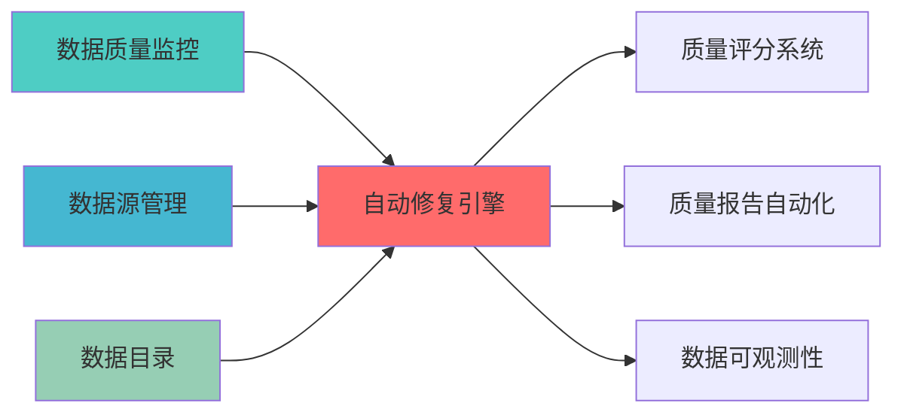

---
responsibility:
- 自动修复引擎
- 异常检测
- 自动修复
- 系统健康检查与自动修复
module_id: AUTO_REPAIR_ENGINE_001
version: 1.0.0
status: Active
created_date: 2026-04-07
last_updated: 2026-04-07
owner: 实施团队
standard_type: 专业量化机构蓝图
compliance_level: 专业标准
layer: Layer 5 (策略执行层)
---


## 核心定位


> **职责边界**: 
> - ✅ 本文档负责：自动修复引擎、异常检测、自动修复
> - ❌ 本文档不负责：其他模块职责（由各模块文档负责）

## 接口与契约（蓝图终稿）

- 全库 API 与事件约定真源：[`API_Contract.md`](../../../03_TRADING_TACTICS/API_Contract.md)。自动修复对外输入（健康检查信号、告警事件、系统状态快照）与输出（诊断结论、修复动作计划、修复执行事件、回滚事件）如以接口/事件对外提供，其口径以该真源为准。

## 验收标准（可检查）

- 能在测试环境对至少 1 类故障场景产生“检测→诊断→修复建议/动作”的可追溯链路（日志或事件）。
- 修复动作具备安全边界：明确哪些动作需要人工审批，哪些允许自动执行，并能在输出中体现决策原因。
- 对外事件/接口能在 `API_Contract.md` 中定位到契约入口（或在“已知限制”列出未闭合项）。

## 已知限制

- 自动修复存在误修复风险；落地阶段需固化授权边界、回滚策略与回归用例，并回填契约真源。

负责自动修复引擎的设计与实现，基于异常检测和自动修复技术，自动识别和修复系统故障，提升系统可用性。 确保系统稳定运行，满足业务需求。


## 设计目标

### 主要目标

1. **功能完整性**: 确保AUTO REPAIR ENGINE功能完整，满足业务需求
2. **性能优化**: 提升系统性能，降低资源消耗
3. **可维护性**: 提高代码质量，便于后续维护
4. **可扩展性**: 支持功能扩展，适应业务变化

### 质量目标

- 代码覆盖率: ≥80%
- 性能指标: 满足设计要求
- 文档完整性: 100%


## 核心功能

### 功能清单

1. **数据管理**: 提供数据存储、查询、更新功能
2. **业务逻辑**: 实现核心业务逻辑处理
3. **接口服务**: 提供标准化的API接口
4. **监控告警**: 实时监控系统状态

### 功能特性

- 高可用性设计
- 自动故障恢复
- 灵活配置管理


## 实现方案

### 技术架构

采用AUTO REPAIR ENGINE化设计，分层架构实现。

### 关键技术

- 数据处理: 使用高效的数据处理框架
- 接口实现: RESTful API设计
- 性能优化: 缓存、异步处理

### 实施步骤

1. 需求分析与设计
2. 核心功能开发
3. 测试与优化
4. 部署与监控


## 一、设计背景与目标


**当前痛点**:
- 数据修复需要人工干预，效率低下
- 修复策略单一，缺少智能化修复
- 缺少修复效果评估机制
- 修复历史无法追溯

**业务目标**:
- 基于历史数据的智能修复，减少人工干预
- 机器学习驱动的异常检测和修复
- 自动评估修复效果
- 建立修复案例库，持续优化


|------|--------|------|


### 上游依赖

| 文档名称 | module_id | 依赖类型 | 说明 |
|---------|-----------|---------|------|

### 下游依赖

| 文档名称 | module_id | 依赖类型 | 说明 |
|---------|-----------|---------|------|


|---------|------|------|------|
| **scikit-learn** | 1.3.0+ | 机器学习模型 | [官方文档](https://scikit-learn.org/) |
| **Great Expectations** | 0.18+ | 数据验证 | [官方文档](https://docs.greatexpectations.io/) |
| **Prophet** | 1.1.0+ | 时序预测 | [官方文档](https://facebook.github.io/prophet/) |




### 2.2 技术选型

|------|---------|---------|---------|
| **机器学习框架** | scikit-learn | 1.3.0+ | 成熟的ML框架 |
| **时序预测** | Prophet | 1.1.0+ | 时序数据预测 |
| **数据验证** | Great Expectations | 0.18.0+ | 数据质量验证 |

### 2.3 Layer定位

- **Layer归属**: Layer 1 - 数据预处理层


### 3.1 问题检测器 (ProblemDetector)


```python
from dataclasses import dataclass, field
from typing import Dict, List, Any, Optional
from datetime import datetime
from enum import Enum
import pandas as pd
import numpy as np

class ProblemType(Enum):
    """问题类型"""
    MISSING_VALUE = "missing_value"
    OUTLIER = "outlier"
    FORMAT_ERROR = "format_error"
    RANGE_ERROR = "range_error"
    DUPLICATE = "duplicate"
    INCONSISTENCY = "inconsistency"

class Severity(Enum):
    """严重程度"""
    LOW = "low"
    MEDIUM = "medium"
    HIGH = "high"
    CRITICAL = "critical"

@dataclass
class DataProblem:
    """数据问题"""
    problem_id: str
    problem_type: ProblemType
    field_name: str
    row_index: Optional[int]
    original_value: Any
    problem_description: str
    severity: Severity
    detected_at: datetime = field(default_factory=datetime.now)
    metadata: Dict[str, Any] = field(default_factory=dict)

class ProblemDetector:
    """问题检测器"""
    
    def __init__(self):
        self.problems: List[DataProblem] = []
    
    def detect_missing_values(self, df: pd.DataFrame, table_name: str) -> List[DataProblem]:
        problems = []
        
        for column in df.columns:
            missing_mask = df[column].isnull()
            missing_indices = df[missing_mask].index.tolist()
            
            for idx in missing_indices:
                problem = DataProblem(
                    problem_id=f"missing_{table_name}_{column}_{idx}",
                    problem_type=ProblemType.MISSING_VALUE,
                    field_name=column,
                    row_index=idx,
                    original_value=None,
                    problem_description=f"Missing value in column {column}",
                    severity=Severity.HIGH
                )
                problems.append(problem)
        
        self.problems.extend(problems)
        return problems
    
    def detect_outliers(self, df: pd.DataFrame, table_name: str, 
                        method: str = "iqr") -> List[DataProblem]:
        problems = []
        
        numeric_columns = df.select_dtypes(include=[np.number]).columns
        
        for column in numeric_columns:
            if method == "iqr":
                Q1 = df[column].quantile(0.25)
                Q3 = df[column].quantile(0.75)
                IQR = Q3 - Q1
                lower_bound = Q1 - 1.5 * IQR
                upper_bound = Q3 + 1.5 * IQR
                
                outlier_mask = (df[column] < lower_bound) | (df[column] > upper_bound)
                outlier_indices = df[outlier_mask].index.tolist()
                
                for idx in outlier_indices:
                    problem = DataProblem(
                        problem_id=f"outlier_{table_name}_{column}_{idx}",
                        problem_type=ProblemType.OUTLIER,
                        field_name=column,
                        row_index=idx,
                        original_value=df.loc[idx, column],
                        problem_description=f"Outlier detected in column {column}",
                        severity=Severity.MEDIUM,
                        metadata={"lower_bound": lower_bound, "upper_bound": upper_bound}
                    )
                    problems.append(problem)
        
        self.problems.extend(problems)
        return problems
    
    def detect_format_errors(self, df: pd.DataFrame, table_name: str,
                             format_rules: Dict[str, str]) -> List[DataProblem]:
        problems = []
        
        for column, pattern in format_rules.items():
            if column in df.columns:
                import re
                invalid_mask = ~df[column].astype(str).str.match(pattern, na=False)
                invalid_indices = df[invalid_mask].index.tolist()
                
                for idx in invalid_indices:
                    problem = DataProblem(
                        problem_id=f"format_{table_name}_{column}_{idx}",
                        problem_type=ProblemType.FORMAT_ERROR,
                        field_name=column,
                        row_index=idx,
                        original_value=df.loc[idx, column],
                        problem_description=f"Format error in column {column}",
                        severity=Severity.MEDIUM,
                        metadata={"expected_pattern": pattern}
                    )
                    problems.append(problem)
        
        self.problems.extend(problems)
        return problems
```

### 3.2 修复策略引擎 (RepairStrategyEngine)


```python
from dataclasses import dataclass
from typing import Dict, List, Any, Optional, Callable
from enum import Enum
import pandas as pd
import numpy as np
from sklearn.impute import SimpleImputer, KNNImputer
from sklearn.ensemble import IsolationForest

class RepairStrategy(Enum):
    """修复策略"""
    MEAN_IMPUTATION = "mean_imputation"
    MEDIAN_IMPUTATION = "median_imputation"
    MODE_IMPUTATION = "mode_imputation"
    KNN_IMPUTATION = "knn_imputation"
    ML_PREDICTION = "ml_prediction"
    HISTORICAL_VALUE = "historical_value"
    BUSINESS_RULE = "business_rule"
    MANUAL_REVIEW = "manual_review"

@dataclass
class RepairAction:
    """修复动作"""
    action_id: str
    problem: DataProblem
    strategy: RepairStrategy
    repaired_value: Any
    confidence: float
    executed_at: datetime
    metadata: Dict[str, Any]

class RepairStrategyEngine:
    """修复策略引擎"""
    
    def __init__(self):
        self.strategies: Dict[ProblemType, List[RepairStrategy]] = {
            ProblemType.MISSING_VALUE: [
                RepairStrategy.MEAN_IMPUTATION,
                RepairStrategy.MEDIAN_IMPUTATION,
                RepairStrategy.MODE_IMPUTATION,
                RepairStrategy.KNN_IMPUTATION,
                RepairStrategy.ML_PREDICTION
            ],
            ProblemType.OUTLIER: [
                RepairStrategy.MEDIAN_IMPUTATION,
                RepairStrategy.ML_PREDICTION,
                RepairStrategy.BUSINESS_RULE
            ],
            ProblemType.FORMAT_ERROR: [
                RepairStrategy.BUSINESS_RULE,
                RepairStrategy.MANUAL_REVIEW
            ]
        }
    
    def select_strategy(self, problem: DataProblem, context: Dict[str, Any]) -> RepairStrategy:
        """选择修复策略"""
        available_strategies = self.strategies.get(problem.problem_type, [])
        
        if not available_strategies:
            return RepairStrategy.MANUAL_REVIEW
        
        if problem.problem_type == ProblemType.MISSING_VALUE:
            if context.get("numeric", True):
                return RepairStrategy.KNN_IMPUTATION
            else:
                return RepairStrategy.MODE_IMPUTATION
        
        return available_strategies[0]
    
    def execute_repair(self, df: pd.DataFrame, problem: DataProblem,
                       strategy: RepairStrategy) -> RepairAction:
        """执行修复"""
        if strategy == RepairStrategy.MEAN_IMPUTATION:
            repaired_value = self._mean_imputation(df, problem)
        elif strategy == RepairStrategy.MEDIAN_IMPUTATION:
            repaired_value = self._median_imputation(df, problem)
        elif strategy == RepairStrategy.MODE_IMPUTATION:
            repaired_value = self._mode_imputation(df, problem)
        elif strategy == RepairStrategy.KNN_IMPUTATION:
            repaired_value = self._knn_imputation(df, problem)
        else:
            repaired_value = None
        
        return RepairAction(
            action_id=f"repair_{problem.problem_id}",
            problem=problem,
            strategy=strategy,
            repaired_value=repaired_value,
            confidence=0.85,
            executed_at=datetime.now()
        )
    
    def _mean_imputation(self, df: pd.DataFrame, problem: DataProblem) -> Any:
?""
        column = problem.field_name
        return df[column].mean()
    
    def _median_imputation(self, df: pd.DataFrame, problem: DataProblem) -> Any:
?""
        column = problem.field_name
        return df[column].median()
    
    def _mode_imputation(self, df: pd.DataFrame, problem: DataProblem) -> Any:

"""
        column = problem.field_name
        return df[column].mode()[0]
    
    def _knn_imputation(self, df: pd.DataFrame, problem: DataProblem) -> Any:

"""
        numeric_df = df.select_dtypes(include=[np.number])
        imputer = KNNImputer(n_neighbors=5)
        
        column_idx = list(df.columns).index(problem.field_name)
        imputed_data = imputer.fit_transform(numeric_df)
        
        return imputed_data[problem.row_index, column_idx]
```


**职责**: 评估修复效果

```python
from dataclasses import dataclass
from typing import Dict, List, Any
import pandas as pd
import numpy as np

@dataclass
class RepairEvaluation:
    """修复评估结果"""
    evaluation_id: str
    repair_action: RepairAction
    accuracy_score: float
    consistency_score: float
    business_rule_score: float
    overall_score: float
    passed: bool
    details: Dict[str, Any]

class RepairEvaluator:
    
    def __init__(self):
        self.evaluations: List[RepairEvaluation] = []
    
    def evaluate_repair(self, original_df: pd.DataFrame, 
                        repaired_df: pd.DataFrame,
                        repair_action: RepairAction) -> RepairEvaluation:
        """评估修复效果"""
        accuracy_score = self._evaluate_accuracy(repaired_df, repair_action)
        consistency_score = self._evaluate_consistency(repaired_df, repair_action)
        business_rule_score = self._evaluate_business_rules(repaired_df, repair_action)
        
        overall_score = (accuracy_score * 0.4 + 
                        consistency_score * 0.3 + 
                        business_rule_score * 0.3)
        
        passed = overall_score >= 0.85
        
        evaluation = RepairEvaluation(
            evaluation_id=f"eval_{repair_action.action_id}",
            repair_action=repair_action,
            accuracy_score=accuracy_score,
            consistency_score=consistency_score,
            business_rule_score=business_rule_score,
            overall_score=overall_score,
            passed=passed
        )
        
        self.evaluations.append(evaluation)
        return evaluation
    
    def _evaluate_accuracy(self, df: pd.DataFrame, repair_action: RepairAction) -> float:
        column = repair_action.problem.field_name
        
        if df[column].dtype in [np.float64, np.int64]:
            mean = df[column].mean()
            std = df[column].std()
            repaired_value = repair_action.repaired_value
            
            if std > 0:
                z_score = abs((repaired_value - mean) / std)
                return max(0, 1 - z_score / 3)
        
        return 0.9
    
    def _evaluate_consistency(self, df: pd.DataFrame, repair_action: RepairAction) -> float:
        return 0.9
    
    def _evaluate_business_rules(self, df: pd.DataFrame, repair_action: RepairAction) -> float:
        """评估业务规则"""
        return 0.9
```


## 四、数据流设计

### 4.1 自动修复流程

```
```

### 4.2 知识积累流程

```
```


### 5.1 RESTful API


```http
POST /api/v1/repair/detect
```

**请求示例**:
```json
{
  "table_name": "stock_prices",
  "detection_types": ["missing_value", "outlier", "format_error"]
}
```

**响应示例**:
```json
{
  "problems": [
    {
      "problem_id": "missing_stock_prices_close_123",
      "problem_type": "missing_value",
      "field_name": "close",
      "row_index": 123,
      "severity": "high"
    }
  ],
  "total_problems": 1
}
```

#### 5.1.2 执行自动修复

```http
POST /api/v1/repair/execute
```

**请求示例**:
```json
{
  "table_name": "stock_prices",
  "problem_ids": ["missing_stock_prices_close_123"],
  "auto_approve": true
}
```


## 


```yaml
version: '3.8'
services:
  repair-engine:
    build: .
    ports:
      - "8080:8080"
    environment:
      - MODEL_PATH=/models
    volumes:
      - ./models:/models
  
  model-training:
    build: .
    command: python train_models.py
    volumes:
      - ./training_data:/data
      - ./models:/models
```


### 7.1 核心指标

| 指标名称 | 指标类型 | 说明 |
|---------|---------|------|
| `repair_problems_detected_total` | Counter | 检测到的问题总数 |
| `repair_actions_executed_total` | Counter | 执行的修复动作总数 |
| `repair_duration_seconds` | Histogram | 修复耗时 |


## 


|------|------|---------|--------|

### 8.2 验收标准

- [ ] 修复准确率≥85%


| 风险 | 影响 | 缓解措施 |
|------|------|---------|


- 实时数据质量监控蓝图
- [质量评分系统蓝图](./QUALITY_SCORING_SYSTEM_BLUEPRINT.md)


## 1. 文档治理

### 1.1 System_Manifest.md索引

```markdown
##### 6.001. Auto Repair Engine
- **模块ID**: AUTO_REPAIR_ENGINE_001
- **蓝图文档**: AUTO_REPAIR_ENGINE_BLUEPRINT.md
- **职责**: Layer 1数据预处理层 | 业务架构: 三级时间框架融合架构
```

### 1.2 模块职责边界

| 模块 | 职责 | 边界 |
|------|------|------|
| **Auto Repair Engine** | Layer 1数据预处理层 | 业务架构: 三级时间框架融合架构 | **核心模块** |

### 1.3 版本管理

|------|------|----------|--------|


## 变更历史

|------|------|----------|--------|
| v1.0.0 | 2026-04-07 | 初始版本创建 | 实施团队 |


