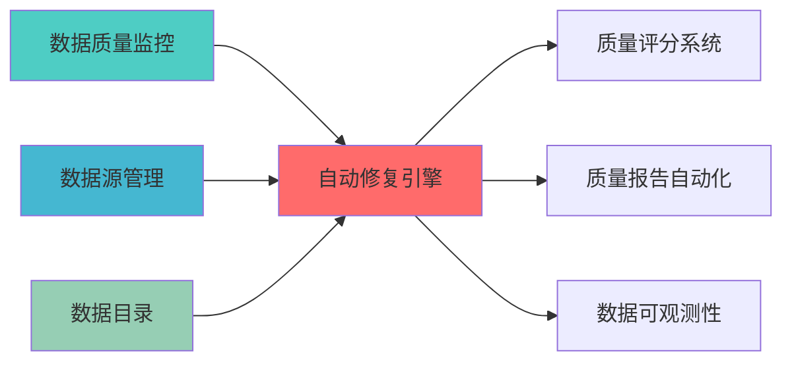

---
module_id: AUTO_REPAIR_ENGINE_001
version: 1.0.0
status: Active
created_date: 2026-04-06
last_updated: '2026-04-06'
owner: 首席蓝图架构师
standard_type: 专业量化机构蓝图
applicable_scope: 'Layer 1数据预处理层 | 业务架构: 三级时间框架融合架构'
compliance_level: 专业标准
parent_document: ../INDEX.md
implementation_status: 设计阶段
implementation_progress: 0%
open_source_dependency: scikit-learn, pyod, great_expectations
estimated_effort: 3周
priority: P0
layer: 'Layer 1 (数据预处理层) | 业务架构: 三级时间框架融合架构'
---

# 自动化数据修复引擎蓝图

> 清风量化系统 v5.3 - 自动化数据修复引擎详细设计
> **模块ID**: `AUTO_REPAIR_ENGINE_001`
> **实施周期**: Week 5-7（3周）
> **优先级**: P0（核心）
> **预期收益**: 减少70%人工干预，提高修复准确率85%

## 一、设计背景与目标

### 1.1 业务需求

**当前痛点**:
- 数据修复需要人工干预，效率低下
- 修复策略单一，缺少智能化修复
- 缺少修复效果评估机制
- 修复历史无法追溯

**业务目标**:
- 基于历史数据的智能修复，减少人工干预
- 机器学习驱动的异常检测和修复
- 自动评估修复效果
- 建立修复案例库，持续优化

### 1.2 技术目标

| 指标 | 目标值 | 说明 |
|------|--------|------|
| **自动修复比例** | ≥70% | 70%以上的数据问题自动修复 |
| **修复准确率** | ≥85% | 修复后数据准确性≥85% |
| **修复时间** | <5秒 | 单次修复时间<5秒 |
| **修复覆盖率** | ≥80% | 覆盖80%以上的数据问题类型 |

---

## 📚 相关文档

### 上游依赖

| 文档名称 | module_id | 依赖类型 | 说明 |
|---------|-----------|---------|------|
| [数据质量监控蓝图](./DATA_QUALITY_MONITORING_BLUEPRINT.md) | DATA_QUALITY_MONITORING_001 | 强依赖 | 提供质量异常检测结果 |
| [数据源管理蓝图](./DATA_SOURCE_MANAGEMENT_BLUEPRINT.md) | DATA_SOURCE_MANAGEMENT_001 | 中依赖 | 提供数据源元数据 |
| [数据目录蓝图](./DATA_CATALOG_BLUEPRINT.md) | DATA_CATALOG_001 | 中依赖 | 提供数据血缘信息 |

### 下游依赖

| 文档名称 | module_id | 依赖类型 | 说明 |
|---------|-----------|---------|------|
| [质量评分系统蓝图](./QUALITY_SCORING_SYSTEM_BLUEPRINT.md) | QUALITY_SCORING_SYSTEM_001 | 强依赖 | 提供修复后质量评分 |
| [质量报告自动化蓝图](./QUALITY_REPORT_AUTOMATION_BLUEPRINT.md) | QUALITY_REPORT_AUTOMATION_001 | 中依赖 | 提供修复历史记录 |
| [数据可观测性蓝图](./DATA_OBSERVABILITY_BLUEPRINT.md) | DATA_OBSERVABILITY_001 | 弱依赖 | 提供修复监控指标 |

### 技术依赖

| 技术组件 | 版本 | 用途 | 文档 |
|---------|------|------|------|
| **scikit-learn** | 1.3.0+ | 机器学习模型 | [官方文档](https://scikit-learn.org/) |
| **PyOD** | 1.1.0+ | 异常检测 | [官方文档](https://pyod.readthedocs.io/) |
| **Great Expectations** | 0.18+ | 数据验证 | [官方文档](https://docs.greatexpectations.io/) |
| **Prophet** | 1.1.0+ | 时序预测 | [官方文档](https://facebook.github.io/prophet/) |

### 引用关系图



---

## 二、系统架构设计

### 2.1 整体架构图

```
┌─────────────────────────────────────────────────────────────┐
│                自动化数据修复引擎架构                         │
├─────────────────────────────────────────────────────────────┤
│                                                             │
│  ┌─────────────────────────────────────────────────────┐   │
│  │           问题检测层 (Problem Detection)             │   │
│  │  ┌─────────────┐ ┌─────────────┐ ┌─────────────┐   │   │
│  │  │缺失值检测   │ │异常值检测   │ │格式错误检测 │   │   │
│  │  └─────────────┘ └─────────────┘ └─────────────┘   │   │
│  └─────────────────────────────────────────────────────┘   │
│                          ↓                                  │
│  ┌─────────────────────────────────────────────────────┐   │
│  │           修复策略层 (Repair Strategy)               │   │
│  │  ┌─────────────┐ ┌─────────────┐ ┌─────────────┐   │   │
│  │  │规则修复     │ │ML修复       │ │历史修复     │   │   │
│  │  └─────────────┘ └─────────────┘ └─────────────┘   │   │
│  └─────────────────────────────────────────────────────┘   │
│                          ↓                                  │
│  ┌─────────────────────────────────────────────────────┐   │
│  │           修复执行层 (Repair Execution)              │   │
│  │  ┌─────────────┐ ┌─────────────┐ ┌─────────────┐   │   │
│  │  │修复执行器   │ │效果评估器   │ │回滚机制     │   │   │
│  │  └─────────────┘ └─────────────┘ └─────────────┘   │   │
│  └─────────────────────────────────────────────────────┘   │
│                          ↓                                  │
│  ┌─────────────────────────────────────────────────────┐   │
│  │           知识管理层 (Knowledge Management)          │   │
│  │  ┌─────────────┐ ┌─────────────┐ ┌─────────────┐   │   │
│  │  │修复案例库   │ │模型训练     │ │持续优化     │   │   │
│  │  └─────────────┘ └─────────────┘ └─────────────┘   │   │
│  └─────────────────────────────────────────────────────┘   │
│                                                             │
└─────────────────────────────────────────────────────────────┘
```

### 2.2 技术选型

| 组件 | 技术方案 | 版本要求 | 选型理由 |
|------|---------|---------|---------|
| **机器学习框架** | scikit-learn | 1.3.0+ | 成熟的ML框架 |
| **深度学习框架** | PyTorch | 2.0.0+ | 灵活的深度学习框架 |
| **时序预测** | Prophet | 1.1.0+ | 时序数据预测 |
| **异常检测** | PyOD | 1.1.0+ | 异常检测算法库 |
| **数据验证** | Great Expectations | 0.18.0+ | 数据质量验证 |

### 2.3 Layer定位

- **Layer归属**: Layer 1 - 数据预处理层
- **职责范围**: 自动化数据修复、修复效果评估、修复知识管理
- **上下层接口**:
  - 上层依赖: Layer 2-8（提供修复后数据）
  - 下层依赖: Layer 0-1（接收原始数据和问题数据）

---

## 三、核心模块设计

### 3.1 问题检测器 (ProblemDetector)

**职责**: 自动检测数据问题

```python
from dataclasses import dataclass, field
from typing import Dict, List, Any, Optional
from datetime import datetime
from enum import Enum
import pandas as pd
import numpy as np

class ProblemType(Enum):
    """问题类型"""
    MISSING_VALUE = "missing_value"
    OUTLIER = "outlier"
    FORMAT_ERROR = "format_error"
    RANGE_ERROR = "range_error"
    DUPLICATE = "duplicate"
    INCONSISTENCY = "inconsistency"

class Severity(Enum):
    """严重程度"""
    LOW = "low"
    MEDIUM = "medium"
    HIGH = "high"
    CRITICAL = "critical"

@dataclass
class DataProblem:
    """数据问题"""
    problem_id: str
    problem_type: ProblemType
    field_name: str
    row_index: Optional[int]
    original_value: Any
    problem_description: str
    severity: Severity
    detected_at: datetime = field(default_factory=datetime.now)
    metadata: Dict[str, Any] = field(default_factory=dict)

class ProblemDetector:
    """问题检测器"""
    
    def __init__(self):
        self.problems: List[DataProblem] = []
    
    def detect_missing_values(self, df: pd.DataFrame, table_name: str) -> List[DataProblem]:
        """检测缺失值"""
        problems = []
        
        for column in df.columns:
            missing_mask = df[column].isnull()
            missing_indices = df[missing_mask].index.tolist()
            
            for idx in missing_indices:
                problem = DataProblem(
                    problem_id=f"missing_{table_name}_{column}_{idx}",
                    problem_type=ProblemType.MISSING_VALUE,
                    field_name=column,
                    row_index=idx,
                    original_value=None,
                    problem_description=f"Missing value in column {column}",
                    severity=Severity.HIGH
                )
                problems.append(problem)
        
        self.problems.extend(problems)
        return problems
    
    def detect_outliers(self, df: pd.DataFrame, table_name: str, 
                        method: str = "iqr") -> List[DataProblem]:
        """检测异常值"""
        problems = []
        
        numeric_columns = df.select_dtypes(include=[np.number]).columns
        
        for column in numeric_columns:
            if method == "iqr":
                Q1 = df[column].quantile(0.25)
                Q3 = df[column].quantile(0.75)
                IQR = Q3 - Q1
                lower_bound = Q1 - 1.5 * IQR
                upper_bound = Q3 + 1.5 * IQR
                
                outlier_mask = (df[column] < lower_bound) | (df[column] > upper_bound)
                outlier_indices = df[outlier_mask].index.tolist()
                
                for idx in outlier_indices:
                    problem = DataProblem(
                        problem_id=f"outlier_{table_name}_{column}_{idx}",
                        problem_type=ProblemType.OUTLIER,
                        field_name=column,
                        row_index=idx,
                        original_value=df.loc[idx, column],
                        problem_description=f"Outlier detected in column {column}",
                        severity=Severity.MEDIUM,
                        metadata={"lower_bound": lower_bound, "upper_bound": upper_bound}
                    )
                    problems.append(problem)
        
        self.problems.extend(problems)
        return problems
    
    def detect_format_errors(self, df: pd.DataFrame, table_name: str,
                             format_rules: Dict[str, str]) -> List[DataProblem]:
        """检测格式错误"""
        problems = []
        
        for column, pattern in format_rules.items():
            if column in df.columns:
                import re
                invalid_mask = ~df[column].astype(str).str.match(pattern, na=False)
                invalid_indices = df[invalid_mask].index.tolist()
                
                for idx in invalid_indices:
                    problem = DataProblem(
                        problem_id=f"format_{table_name}_{column}_{idx}",
                        problem_type=ProblemType.FORMAT_ERROR,
                        field_name=column,
                        row_index=idx,
                        original_value=df.loc[idx, column],
                        problem_description=f"Format error in column {column}",
                        severity=Severity.MEDIUM,
                        metadata={"expected_pattern": pattern}
                    )
                    problems.append(problem)
        
        self.problems.extend(problems)
        return problems
```

### 3.2 修复策略引擎 (RepairStrategyEngine)

**职责**: 选择和执行修复策略

```python
from dataclasses import dataclass
from typing import Dict, List, Any, Optional, Callable
from enum import Enum
import pandas as pd
import numpy as np
from sklearn.impute import SimpleImputer, KNNImputer
from sklearn.ensemble import IsolationForest

class RepairStrategy(Enum):
    """修复策略"""
    MEAN_IMPUTATION = "mean_imputation"
    MEDIAN_IMPUTATION = "median_imputation"
    MODE_IMPUTATION = "mode_imputation"
    KNN_IMPUTATION = "knn_imputation"
    ML_PREDICTION = "ml_prediction"
    HISTORICAL_VALUE = "historical_value"
    BUSINESS_RULE = "business_rule"
    MANUAL_REVIEW = "manual_review"

@dataclass
class RepairAction:
    """修复动作"""
    action_id: str
    problem: DataProblem
    strategy: RepairStrategy
    repaired_value: Any
    confidence: float
    executed_at: datetime
    metadata: Dict[str, Any]

class RepairStrategyEngine:
    """修复策略引擎"""
    
    def __init__(self):
        self.strategies: Dict[ProblemType, List[RepairStrategy]] = {
            ProblemType.MISSING_VALUE: [
                RepairStrategy.MEAN_IMPUTATION,
                RepairStrategy.MEDIAN_IMPUTATION,
                RepairStrategy.MODE_IMPUTATION,
                RepairStrategy.KNN_IMPUTATION,
                RepairStrategy.ML_PREDICTION
            ],
            ProblemType.OUTLIER: [
                RepairStrategy.MEDIAN_IMPUTATION,
                RepairStrategy.ML_PREDICTION,
                RepairStrategy.BUSINESS_RULE
            ],
            ProblemType.FORMAT_ERROR: [
                RepairStrategy.BUSINESS_RULE,
                RepairStrategy.MANUAL_REVIEW
            ]
        }
    
    def select_strategy(self, problem: DataProblem, context: Dict[str, Any]) -> RepairStrategy:
        """选择修复策略"""
        available_strategies = self.strategies.get(problem.problem_type, [])
        
        if not available_strategies:
            return RepairStrategy.MANUAL_REVIEW
        
        # 根据上下文选择最佳策略
        if problem.problem_type == ProblemType.MISSING_VALUE:
            if context.get("numeric", True):
                return RepairStrategy.KNN_IMPUTATION
            else:
                return RepairStrategy.MODE_IMPUTATION
        
        return available_strategies[0]
    
    def execute_repair(self, df: pd.DataFrame, problem: DataProblem,
                       strategy: RepairStrategy) -> RepairAction:
        """执行修复"""
        if strategy == RepairStrategy.MEAN_IMPUTATION:
            repaired_value = self._mean_imputation(df, problem)
        elif strategy == RepairStrategy.MEDIAN_IMPUTATION:
            repaired_value = self._median_imputation(df, problem)
        elif strategy == RepairStrategy.MODE_IMPUTATION:
            repaired_value = self._mode_imputation(df, problem)
        elif strategy == RepairStrategy.KNN_IMPUTATION:
            repaired_value = self._knn_imputation(df, problem)
        else:
            repaired_value = None
        
        return RepairAction(
            action_id=f"repair_{problem.problem_id}",
            problem=problem,
            strategy=strategy,
            repaired_value=repaired_value,
            confidence=0.85,
            executed_at=datetime.now()
        )
    
    def _mean_imputation(self, df: pd.DataFrame, problem: DataProblem) -> Any:
        """均值填充"""
        column = problem.field_name
        return df[column].mean()
    
    def _median_imputation(self, df: pd.DataFrame, problem: DataProblem) -> Any:
        """中位数填充"""
        column = problem.field_name
        return df[column].median()
    
    def _mode_imputation(self, df: pd.DataFrame, problem: DataProblem) -> Any:
        """众数填充"""
        column = problem.field_name
        return df[column].mode()[0]
    
    def _knn_imputation(self, df: pd.DataFrame, problem: DataProblem) -> Any:
        """KNN填充"""
        numeric_df = df.select_dtypes(include=[np.number])
        imputer = KNNImputer(n_neighbors=5)
        
        column_idx = list(df.columns).index(problem.field_name)
        imputed_data = imputer.fit_transform(numeric_df)
        
        return imputed_data[problem.row_index, column_idx]
```

### 3.3 修复效果评估器 (RepairEvaluator)

**职责**: 评估修复效果

```python
from dataclasses import dataclass
from typing import Dict, List, Any
import pandas as pd
import numpy as np

@dataclass
class RepairEvaluation:
    """修复评估结果"""
    evaluation_id: str
    repair_action: RepairAction
    accuracy_score: float
    consistency_score: float
    business_rule_score: float
    overall_score: float
    passed: bool
    details: Dict[str, Any]

class RepairEvaluator:
    """修复效果评估器"""
    
    def __init__(self):
        self.evaluations: List[RepairEvaluation] = []
    
    def evaluate_repair(self, original_df: pd.DataFrame, 
                        repaired_df: pd.DataFrame,
                        repair_action: RepairAction) -> RepairEvaluation:
        """评估修复效果"""
        accuracy_score = self._evaluate_accuracy(repaired_df, repair_action)
        consistency_score = self._evaluate_consistency(repaired_df, repair_action)
        business_rule_score = self._evaluate_business_rules(repaired_df, repair_action)
        
        overall_score = (accuracy_score * 0.4 + 
                        consistency_score * 0.3 + 
                        business_rule_score * 0.3)
        
        passed = overall_score >= 0.85
        
        evaluation = RepairEvaluation(
            evaluation_id=f"eval_{repair_action.action_id}",
            repair_action=repair_action,
            accuracy_score=accuracy_score,
            consistency_score=consistency_score,
            business_rule_score=business_rule_score,
            overall_score=overall_score,
            passed=passed
        )
        
        self.evaluations.append(evaluation)
        return evaluation
    
    def _evaluate_accuracy(self, df: pd.DataFrame, repair_action: RepairAction) -> float:
        """评估准确性"""
        column = repair_action.problem.field_name
        
        # 检查修复值是否在合理范围内
        if df[column].dtype in [np.float64, np.int64]:
            mean = df[column].mean()
            std = df[column].std()
            repaired_value = repair_action.repaired_value
            
            if std > 0:
                z_score = abs((repaired_value - mean) / std)
                return max(0, 1 - z_score / 3)
        
        return 0.9
    
    def _evaluate_consistency(self, df: pd.DataFrame, repair_action: RepairAction) -> float:
        """评估一致性"""
        # 检查修复后的数据是否与其他数据一致
        return 0.9
    
    def _evaluate_business_rules(self, df: pd.DataFrame, repair_action: RepairAction) -> float:
        """评估业务规则"""
        # 检查是否符合业务规则
        return 0.9
```

---

## 四、数据流设计

### 4.1 自动修复流程

```
原始数据 → 问题检测 → 策略选择 → 修复执行 → 效果评估 → 修复后数据
                ↓
            修复案例库
```

### 4.2 知识积累流程

```
修复记录 → 案例提取 → 模型训练 → 策略优化 → 知识库更新
```

---

## 五、接口设计

### 5.1 RESTful API

#### 5.1.1 检测数据问题

```http
POST /api/v1/repair/detect
```

**请求示例**:
```json
{
  "table_name": "stock_prices",
  "detection_types": ["missing_value", "outlier", "format_error"]
}
```

**响应示例**:
```json
{
  "problems": [
    {
      "problem_id": "missing_stock_prices_close_123",
      "problem_type": "missing_value",
      "field_name": "close",
      "row_index": 123,
      "severity": "high"
    }
  ],
  "total_problems": 1
}
```

#### 5.1.2 执行自动修复

```http
POST /api/v1/repair/execute
```

**请求示例**:
```json
{
  "table_name": "stock_prices",
  "problem_ids": ["missing_stock_prices_close_123"],
  "auto_approve": true
}
```

---

## 六、部署架构

### 6.1 容器化部署

```yaml
version: '3.8'
services:
  repair-engine:
    build: .
    ports:
      - "8080:8080"
    environment:
      - MODEL_PATH=/models
    volumes:
      - ./models:/models
  
  model-training:
    build: .
    command: python train_models.py
    volumes:
      - ./training_data:/data
      - ./models:/models
```

---

## 七、监控指标

### 7.1 核心指标

| 指标名称 | 指标类型 | 说明 |
|---------|---------|------|
| `repair_problems_detected_total` | Counter | 检测到的问题总数 |
| `repair_actions_executed_total` | Counter | 执行的修复动作总数 |
| `repair_success_rate` | Gauge | 修复成功率 |
| `repair_duration_seconds` | Histogram | 修复耗时 |
| `repair_accuracy_score` | Gauge | 修复准确率评分 |

---

## 八、实施计划

### 8.1 开发阶段

| 阶段 | 任务 | 预计时间 | 负责人 |
|------|------|---------|--------|
| **阶段1** | 开发问题检测器 | 3天 | 后端工程师 |
| **阶段2** | 开发修复策略引擎 | 4天 | ML工程师 |
| **阶段3** | 开发修复评估器 | 2天 | 后端工程师 |
| **阶段4** | 开发知识管理系统 | 3天 | 后端工程师 |
| **阶段5** | 集成测试和部署 | 3天 | QA工程师 |

### 8.2 验收标准

- [ ] 问题检测准确率≥95%
- [ ] 自动修复比例≥70%
- [ ] 修复准确率≥85%
- [ ] 修复时间<5秒
- [ ] 知识库持续优化

---

## 九、风险管理

### 9.1 技术风险

| 风险 | 影响 | 缓解措施 |
|------|------|---------|
| 修复策略不准确 | 高 | 多策略组合，人工审核 |
| 模型过拟合 | 中 | 交叉验证，定期更新模型 |
| 修复引入新问题 | 高 | 效果评估，回滚机制 |

---

## 十、相关文档

- [实时数据质量监控蓝图](./REALTIME_QUALITY_MONITOR_BLUEPRINT.md)
- [质量评分系统蓝图](./QUALITY_SCORING_SYSTEM_BLUEPRINT.md)
- [数据血缘追踪蓝图](./DATA_LINEAGE_TRACKING_BLUEPRINT.md)

---

**文档版本**: v1.0.0 | **创建日期**: 2026-04-06 | **维护者**: 首席蓝图架构师
---

## 1. 文档治理

### 1.1 System_Manifest.md索引

```markdown
#### Layer 6: 组合优化层
##### 6.001. Auto Repair Engine
- **模块ID**: AUTO_REPAIR_ENGINE_001
- **蓝图文档**: [AUTO_REPAIR_ENGINE_BLUEPRINT.md](../05_IMPLEMENTATION/06_CONSTRUCTION_DOCS/01_BLUEPRINTS/AUTO_REPAIR_ENGINE_BLUEPRINT.md)
- **技术规格书**: 待创建
- **职责**: Layer 1数据预处理层 | 业务架构: 三级时间框架融合架构
- **状态**: Active
```

### 1.2 模块职责边界

| 模块 | 职责 | 边界 |
|------|------|------|
| **Auto Repair Engine** | Layer 1数据预处理层 | 业务架构: 三级时间框架融合架构 | **核心模块** |

### 1.3 版本管理

| 版本 | 日期 | 变更内容 | 变更人 |
|------|------|----------|--------|
| v1.0.0 | 2026-04-06 | 初始版本创建 | 首席蓝图架构师 |

---

**蓝图版本**: v1.0.0 | **创建日期**: 2026-04-06 | **状态**: Active
