---
responsibility:
  - 自动修复
  - 异常检æµ?
  - 系统恢复
  - 数据修复

module_id: AUTO_REPAIR_ENGINE_001
version: 1.0.0
status: Active
created_date: 2026-04-07
last_updated: 2026-04-07
owner: 实施团队
standard_type: 专业量化机构蓝图
applicable_scope: Layer 9 监控å±?
compliance_level: 专业标准
layer: Layer 5 (策略执行层)
---

# 自动化数据修复引擎蓝å›?

## 核心定位

负责自动修复引擎的设计与实现，基于异常检测和自动修复技术，自动识别和修复系统故障，提升系统可用性。


## 设计目标

### 主要目标

1. **功能完整性**: 确保AUTO REPAIR ENGINE功能完整，满足业务需求
2. **性能优化**: 提升系统性能，降低资源消耗
3. **可维护性**: 提高代码质量，便于后续维护
4. **可扩展性**: 支持功能扩展，适应业务变化

### 质量目标

- 代码覆盖率: ≥80%
- 性能指标: 满足设计要求
- 文档完整性: 100%


## 核心功能

### 功能清单

1. **数据管理**: 提供数据存储、查询、更新功能
2. **业务逻辑**: 实现核心业务逻辑处理
3. **接口服务**: 提供标准化的API接口
4. **监控告警**: 实时监控系统状态

### 功能特性

- 高可用性设计
- 自动故障恢复
- 灵活配置管理


## 实现方案

### 技术架构

采用AUTO REPAIR ENGINE化设计，分层架构实现。

### 关键技术

- 数据处理: 使用高效的数据处理框架
- 接口实现: RESTful API设计
- 性能优化: 缓存、异步处理

### 实施步骤

1. 需求分析与设计
2. 核心功能开发
3. 测试与优化
4. 部署与监控


## 核心定位

负责Auto Repair Engine的设计、实现和维护，提供核心功能支持，确保系统模块的稳定运行和高效执行ã€?


## 一、设计背景与目标

### 1.1 业务需æ±?

**当前痛点**:
- 数据修复需要人工干预，效率低下
- 修复策略单一，缺少智能化修复
- 缺少修复效果评估机制
- 修复历史无法追溯

**业务目标**:
- 基于历史数据的智能修复，减少人工干预
- 机器学习驱动的异常检测和修复
- 自动评估修复效果
- 建立修复案例库，持续优化

### 1.2 技术目æ ?

| 指标 | 目标å€?| 说明 |
|------|--------|------|
| **自动修复比例** | â‰?0% | 70%以上的数据问题自动修å¤?|
| **修复准确çŽ?* | â‰?5% | 修复后数据准确性≥85% |
| **修复时间** | <5ç§?| 单次修复时间<5ç§?|
| **修复覆盖çŽ?* | â‰?0% | 覆盖80%以上的数据问题类åž?|

---
## 📚 相关文档

### 上游依赖

| 文档名称 | module_id | 依赖类型 | 说明 |
|---------|-----------|---------|------|
| [数据质量监控蓝图](./DATA_QUALITY_MONITORING_BLUEPRINT.md) | DATA_QUALITY_MONITORING_001 | 强依èµ?| 提供质量异常检测结æž?|
| [数据源管理蓝图](./DATA_SOURCE_MANAGEMENT_BLUEPRINT.md) | DATA_SOURCE_MANAGEMENT_001 | 中依èµ?| 提供数据源元数据 |
| [数据目录蓝图](./DATA_CATALOG_BLUEPRINT.md) | DATA_CATALOG_001 | 中依èµ?| 提供数据血缘信æ?|

### 下游依赖

| 文档名称 | module_id | 依赖类型 | 说明 |
|---------|-----------|---------|------|
| [质量评分系统蓝图](./QUALITY_SCORING_SYSTEM_BLUEPRINT.md) | QUALITY_SCORING_SYSTEM_001 | 强依èµ?| 提供修复后质量评åˆ?|
| [质量报告自动化蓝图](./QUALITY_REPORT_AUTOMATION_BLUEPRINT.md) | QUALITY_REPORT_AUTOMATION_001 | 中依èµ?| 提供修复历史记录 |
| [数据可观测性蓝图](./DATA_OBSERVABILITY_BLUEPRINT.md) | DATA_OBSERVABILITY_001 | 弱依èµ?| 提供修复监控指标 |

### 技术依èµ?

| 技术组ä»?| 版本 | 用é€?| 文档 |
|---------|------|------|------|
| **scikit-learn** | 1.3.0+ | 机器学习模型 | [官方文档](https://scikit-learn.org/) |
| **PyOD** | 1.1.0+ | 异常检æµ?| [官方文档](https://pyod.readthedocs.io/) |
| **Great Expectations** | 0.18+ | 数据验证 | [官方文档](https://docs.greatexpectations.io/) |
| **Prophet** | 1.1.0+ | 时序预测 | [官方文档](https://facebook.github.io/prophet/) |

### 引用关系å›?

```mermaid
graph LR
    A[数据质量监控] --> B[自动修复引擎]
    C[数据源管理] --> B
    D[数据目录] --> B
    
    B --> E[质量评分系统]
    B --> F[质量报告自动化]
    B --> G[数据可观测性]
    
    style B fill:#ff6b6b
    style A fill:#4ecdc4
    style C fill:#45b7d1
    style D fill:#96ceb4
```



---

## 二、系统架构设è®?

### 2.1 整体架构å›?

```
┌─────────────────────────────────────────────────────────────â”?
â”?               自动化数据修复引擎架æž?                        â”?
├─────────────────────────────────────────────────────────────â”?
â”?                                                            â”?
â”? ┌─────────────────────────────────────────────────────â”?  â”?
â”? â”?          问题检测层 (Problem Detection)             â”?  â”?
â”? â”? ┌─────────────â”?┌─────────────â”?┌─────────────â”?  â”?  â”?
â”? â”? │缺失值检æµ?  â”?│异常值检æµ?  â”?│格式错误检æµ?â”?  â”?  â”?
â”? â”? └─────────────â”?└─────────────â”?└─────────────â”?  â”?  â”?
â”? └─────────────────────────────────────────────────────â”?  â”?
�                         �                                 �
â”? ┌─────────────────────────────────────────────────────â”?  â”?
â”? â”?          修复策略å±?(Repair Strategy)               â”?  â”?
â”? â”? ┌─────────────â”?┌─────────────â”?┌─────────────â”?  â”?  â”?
â”? â”? │规则修å¤?    â”?│ML修复       â”?│历史修å¤?    â”?  â”?  â”?
â”? â”? └─────────────â”?└─────────────â”?└─────────────â”?  â”?  â”?
â”? └─────────────────────────────────────────────────────â”?  â”?
�                         �                                 �
â”? ┌─────────────────────────────────────────────────────â”?  â”?
â”? â”?          修复执行å±?(Repair Execution)              â”?  â”?
â”? â”? ┌─────────────â”?┌─────────────â”?┌─────────────â”?  â”?  â”?
â”? â”? │修复执行器   â”?│效果评估器   â”?│回滚机åˆ?    â”?  â”?  â”?
â”? â”? └─────────────â”?└─────────────â”?└─────────────â”?  â”?  â”?
â”? └─────────────────────────────────────────────────────â”?  â”?
�                         �                                 �
â”? ┌─────────────────────────────────────────────────────â”?  â”?
â”? â”?          知识管理å±?(Knowledge Management)          â”?  â”?
â”? â”? ┌─────────────â”?┌─────────────â”?┌─────────────â”?  â”?  â”?
â”? â”? │修复案例库   â”?│模型训ç»?    â”?│持续优åŒ?    â”?  â”?  â”?
â”? â”? └─────────────â”?└─────────────â”?└─────────────â”?  â”?  â”?
â”? └─────────────────────────────────────────────────────â”?  â”?
â”?                                                            â”?
└─────────────────────────────────────────────────────────────â”?
```

### 2.2 技术选型

| 组件 | 技术方æ¡?| 版本要求 | 选型理由 |
|------|---------|---------|---------|
| **机器学习框架** | scikit-learn | 1.3.0+ | 成熟的ML框架 |
| **深度学习框架** | PyTorch | 2.0.0+ | 灵活的深度学习框æž?|
| **时序预测** | Prophet | 1.1.0+ | 时序数据预测 |
| **异常检æµ?* | PyOD | 1.1.0+ | 异常检测算法库 |
| **数据验证** | Great Expectations | 0.18.0+ | 数据质量验证 |

### 2.3 Layer定位

- **Layer归属**: Layer 1 - 数据预处理层
- **职责范围**: 自动化数据修复、修复效果评估、修复知识管ç?
- **上下层接å?*:
  - 上层依赖: Layer 2-8（提供修复后数据ï¼?
  - 下层依赖: Layer 0-1（接收原始数据和问题数据ï¼?

---

## 三、核心模块设è®?

### 3.1 问题检测器 (ProblemDetector)

**职责**: 自动检测数据问é¢?

```python
from dataclasses import dataclass, field
from typing import Dict, List, Any, Optional
from datetime import datetime
from enum import Enum
import pandas as pd
import numpy as np

class ProblemType(Enum):
    """问题类型"""
    MISSING_VALUE = "missing_value"
    OUTLIER = "outlier"
    FORMAT_ERROR = "format_error"
    RANGE_ERROR = "range_error"
    DUPLICATE = "duplicate"
    INCONSISTENCY = "inconsistency"

class Severity(Enum):
    """严重程度"""
    LOW = "low"
    MEDIUM = "medium"
    HIGH = "high"
    CRITICAL = "critical"

@dataclass
class DataProblem:
    """数据问题"""
    problem_id: str
    problem_type: ProblemType
    field_name: str
    row_index: Optional[int]
    original_value: Any
    problem_description: str
    severity: Severity
    detected_at: datetime = field(default_factory=datetime.now)
    metadata: Dict[str, Any] = field(default_factory=dict)

class ProblemDetector:
    """问题检测器"""
    
    def __init__(self):
        self.problems: List[DataProblem] = []
    
    def detect_missing_values(self, df: pd.DataFrame, table_name: str) -> List[DataProblem]:
        """检测缺失å€?""
        problems = []
        
        for column in df.columns:
            missing_mask = df[column].isnull()
            missing_indices = df[missing_mask].index.tolist()
            
            for idx in missing_indices:
                problem = DataProblem(
                    problem_id=f"missing_{table_name}_{column}_{idx}",
                    problem_type=ProblemType.MISSING_VALUE,
                    field_name=column,
                    row_index=idx,
                    original_value=None,
                    problem_description=f"Missing value in column {column}",
                    severity=Severity.HIGH
                )
                problems.append(problem)
        
        self.problems.extend(problems)
        return problems
    
    def detect_outliers(self, df: pd.DataFrame, table_name: str, 
                        method: str = "iqr") -> List[DataProblem]:
        """检测异常å€?""
        problems = []
        
        numeric_columns = df.select_dtypes(include=[np.number]).columns
        
        for column in numeric_columns:
            if method == "iqr":
                Q1 = df[column].quantile(0.25)
                Q3 = df[column].quantile(0.75)
                IQR = Q3 - Q1
                lower_bound = Q1 - 1.5 * IQR
                upper_bound = Q3 + 1.5 * IQR
                
                outlier_mask = (df[column] < lower_bound) | (df[column] > upper_bound)
                outlier_indices = df[outlier_mask].index.tolist()
                
                for idx in outlier_indices:
                    problem = DataProblem(
                        problem_id=f"outlier_{table_name}_{column}_{idx}",
                        problem_type=ProblemType.OUTLIER,
                        field_name=column,
                        row_index=idx,
                        original_value=df.loc[idx, column],
                        problem_description=f"Outlier detected in column {column}",
                        severity=Severity.MEDIUM,
                        metadata={"lower_bound": lower_bound, "upper_bound": upper_bound}
                    )
                    problems.append(problem)
        
        self.problems.extend(problems)
        return problems
    
    def detect_format_errors(self, df: pd.DataFrame, table_name: str,
                             format_rules: Dict[str, str]) -> List[DataProblem]:
        """检测格式错è¯?""
        problems = []
        
        for column, pattern in format_rules.items():
            if column in df.columns:
                import re
                invalid_mask = ~df[column].astype(str).str.match(pattern, na=False)
                invalid_indices = df[invalid_mask].index.tolist()
                
                for idx in invalid_indices:
                    problem = DataProblem(
                        problem_id=f"format_{table_name}_{column}_{idx}",
                        problem_type=ProblemType.FORMAT_ERROR,
                        field_name=column,
                        row_index=idx,
                        original_value=df.loc[idx, column],
                        problem_description=f"Format error in column {column}",
                        severity=Severity.MEDIUM,
                        metadata={"expected_pattern": pattern}
                    )
                    problems.append(problem)
        
        self.problems.extend(problems)
        return problems
```

### 3.2 修复策略引擎 (RepairStrategyEngine)

**职责**: 选择和执行修复策ç•?

```python
from dataclasses import dataclass
from typing import Dict, List, Any, Optional, Callable
from enum import Enum
import pandas as pd
import numpy as np
from sklearn.impute import SimpleImputer, KNNImputer
from sklearn.ensemble import IsolationForest

class RepairStrategy(Enum):
    """修复策略"""
    MEAN_IMPUTATION = "mean_imputation"
    MEDIAN_IMPUTATION = "median_imputation"
    MODE_IMPUTATION = "mode_imputation"
    KNN_IMPUTATION = "knn_imputation"
    ML_PREDICTION = "ml_prediction"
    HISTORICAL_VALUE = "historical_value"
    BUSINESS_RULE = "business_rule"
    MANUAL_REVIEW = "manual_review"

@dataclass
class RepairAction:
    """修复动作"""
    action_id: str
    problem: DataProblem
    strategy: RepairStrategy
    repaired_value: Any
    confidence: float
    executed_at: datetime
    metadata: Dict[str, Any]

class RepairStrategyEngine:
    """修复策略引擎"""
    
    def __init__(self):
        self.strategies: Dict[ProblemType, List[RepairStrategy]] = {
            ProblemType.MISSING_VALUE: [
                RepairStrategy.MEAN_IMPUTATION,
                RepairStrategy.MEDIAN_IMPUTATION,
                RepairStrategy.MODE_IMPUTATION,
                RepairStrategy.KNN_IMPUTATION,
                RepairStrategy.ML_PREDICTION
            ],
            ProblemType.OUTLIER: [
                RepairStrategy.MEDIAN_IMPUTATION,
                RepairStrategy.ML_PREDICTION,
                RepairStrategy.BUSINESS_RULE
            ],
            ProblemType.FORMAT_ERROR: [
                RepairStrategy.BUSINESS_RULE,
                RepairStrategy.MANUAL_REVIEW
            ]
        }
    
    def select_strategy(self, problem: DataProblem, context: Dict[str, Any]) -> RepairStrategy:
        """选择修复策略"""
        available_strategies = self.strategies.get(problem.problem_type, [])
        
        if not available_strategies:
            return RepairStrategy.MANUAL_REVIEW
        
        # 根据上下文选择最佳策ç•?
        if problem.problem_type == ProblemType.MISSING_VALUE:
            if context.get("numeric", True):
                return RepairStrategy.KNN_IMPUTATION
            else:
                return RepairStrategy.MODE_IMPUTATION
        
        return available_strategies[0]
    
    def execute_repair(self, df: pd.DataFrame, problem: DataProblem,
                       strategy: RepairStrategy) -> RepairAction:
        """执行修复"""
        if strategy == RepairStrategy.MEAN_IMPUTATION:
            repaired_value = self._mean_imputation(df, problem)
        elif strategy == RepairStrategy.MEDIAN_IMPUTATION:
            repaired_value = self._median_imputation(df, problem)
        elif strategy == RepairStrategy.MODE_IMPUTATION:
            repaired_value = self._mode_imputation(df, problem)
        elif strategy == RepairStrategy.KNN_IMPUTATION:
            repaired_value = self._knn_imputation(df, problem)
        else:
            repaired_value = None
        
        return RepairAction(
            action_id=f"repair_{problem.problem_id}",
            problem=problem,
            strategy=strategy,
            repaired_value=repaired_value,
            confidence=0.85,
            executed_at=datetime.now()
        )
    
    def _mean_imputation(self, df: pd.DataFrame, problem: DataProblem) -> Any:
        """均值填å…?""
        column = problem.field_name
        return df[column].mean()
    
    def _median_imputation(self, df: pd.DataFrame, problem: DataProblem) -> Any:
        """中位数填å…?""
        column = problem.field_name
        return df[column].median()
    
    def _mode_imputation(self, df: pd.DataFrame, problem: DataProblem) -> Any:
        """众数填充"""
        column = problem.field_name
        return df[column].mode()[0]
    
    def _knn_imputation(self, df: pd.DataFrame, problem: DataProblem) -> Any:
        """KNN填充"""
        numeric_df = df.select_dtypes(include=[np.number])
        imputer = KNNImputer(n_neighbors=5)
        
        column_idx = list(df.columns).index(problem.field_name)
        imputed_data = imputer.fit_transform(numeric_df)
        
        return imputed_data[problem.row_index, column_idx]
```

### 3.3 修复效果评估å™?(RepairEvaluator)

**职责**: 评估修复效果

```python
from dataclasses import dataclass
from typing import Dict, List, Any
import pandas as pd
import numpy as np

@dataclass
class RepairEvaluation:
    """修复评估结果"""
    evaluation_id: str
    repair_action: RepairAction
    accuracy_score: float
    consistency_score: float
    business_rule_score: float
    overall_score: float
    passed: bool
    details: Dict[str, Any]

class RepairEvaluator:
    """修复效果评估å™?""
    
    def __init__(self):
        self.evaluations: List[RepairEvaluation] = []
    
    def evaluate_repair(self, original_df: pd.DataFrame, 
                        repaired_df: pd.DataFrame,
                        repair_action: RepairAction) -> RepairEvaluation:
        """评估修复效果"""
        accuracy_score = self._evaluate_accuracy(repaired_df, repair_action)
        consistency_score = self._evaluate_consistency(repaired_df, repair_action)
        business_rule_score = self._evaluate_business_rules(repaired_df, repair_action)
        
        overall_score = (accuracy_score * 0.4 + 
                        consistency_score * 0.3 + 
                        business_rule_score * 0.3)
        
        passed = overall_score >= 0.85
        
        evaluation = RepairEvaluation(
            evaluation_id=f"eval_{repair_action.action_id}",
            repair_action=repair_action,
            accuracy_score=accuracy_score,
            consistency_score=consistency_score,
            business_rule_score=business_rule_score,
            overall_score=overall_score,
            passed=passed
        )
        
        self.evaluations.append(evaluation)
        return evaluation
    
    def _evaluate_accuracy(self, df: pd.DataFrame, repair_action: RepairAction) -> float:
        """评估准确æ€?""
        column = repair_action.problem.field_name
        
        # 检查修复值是否在合理范围å†?
        if df[column].dtype in [np.float64, np.int64]:
            mean = df[column].mean()
            std = df[column].std()
            repaired_value = repair_action.repaired_value
            
            if std > 0:
                z_score = abs((repaired_value - mean) / std)
                return max(0, 1 - z_score / 3)
        
        return 0.9
    
    def _evaluate_consistency(self, df: pd.DataFrame, repair_action: RepairAction) -> float:
        """评估一致æ€?""
        # 检查修复后的数据是否与其他数据一è‡?
        return 0.9
    
    def _evaluate_business_rules(self, df: pd.DataFrame, repair_action: RepairAction) -> float:
        """评估业务规则"""
        # 检查是否符合业务规åˆ?
        return 0.9
```

---

## 四、数据流设计

### 4.1 自动修复流程

```
原始数据 â†?问题检æµ?â†?策略选择 â†?修复执行 â†?效果评估 â†?修复后数æ?
                �
            修复案例åº?
```

### 4.2 知识积累流程

```
修复记录 â†?案例提取 â†?模型训练 â†?策略优化 â†?知识库更æ–?
```

---

## 五、接口设è®?

### 5.1 RESTful API

#### 5.1.1 检测数据问é¢?

```http
POST /api/v1/repair/detect
```

**请求示例**:
```json
{
  "table_name": "stock_prices",
  "detection_types": ["missing_value", "outlier", "format_error"]
}
```

**响应示例**:
```json
{
  "problems": [
    {
      "problem_id": "missing_stock_prices_close_123",
      "problem_type": "missing_value",
      "field_name": "close",
      "row_index": 123,
      "severity": "high"
    }
  ],
  "total_problems": 1
}
```

#### 5.1.2 执行自动修复

```http
POST /api/v1/repair/execute
```

**请求示例**:
```json
{
  "table_name": "stock_prices",
  "problem_ids": ["missing_stock_prices_close_123"],
  "auto_approve": true
}
```

---

## 六、部署架æž?

### 6.1 容器化部ç½?

```yaml
version: '3.8'
services:
  repair-engine:
    build: .
    ports:
      - "8080:8080"
    environment:
      - MODEL_PATH=/models
    volumes:
      - ./models:/models
  
  model-training:
    build: .
    command: python train_models.py
    volumes:
      - ./training_data:/data
      - ./models:/models
```

---

## 七、监控指æ ?

### 7.1 核心指标

| 指标名称 | 指标类型 | 说明 |
|---------|---------|------|
| `repair_problems_detected_total` | Counter | 检测到的问题总数 |
| `repair_actions_executed_total` | Counter | 执行的修复动作总数 |
| `repair_success_rate` | Gauge | 修复成功çŽ?|
| `repair_duration_seconds` | Histogram | 修复耗时 |
| `repair_accuracy_score` | Gauge | 修复准确率评åˆ?|

---

## 八、实施计åˆ?

### 8.1 开发阶æ®?

| 阶段 | 任务 | 预计时间 | 负责äº?|
|------|------|---------|--------|
| **阶段1** | 开发问题检测器 | 3å¤?| 后端工程å¸?|
| **阶段2** | 开发修复策略引æ“?| 4å¤?| ML工程å¸?|
| **阶段3** | 开发修复评估器 | 2å¤?| 后端工程å¸?|
| **阶段4** | 开发知识管理系ç»?| 3å¤?| 后端工程å¸?|
| **阶段5** | 集成测试和部ç½?| 3å¤?| QA工程å¸?|

### 8.2 验收标准

- [ ] 问题检测准确率â‰?5%
- [ ] 自动修复比例â‰?0%
- [ ] 修复准确率≥85%
- [ ] 修复时间<5ç§?
- [ ] 知识库持续优åŒ?

---

## 九、风险管ç?

### 9.1 技术风é™?

| 风险 | 影响 | 缓解措施 |
|------|------|---------|
| 修复策略不准ç¡?| é«?| 多策略组合，人工审核 |
| 模型过拟å?| ä¸?| 交叉验证，定期更新模åž?|
| 修复引入新问é¢?| é«?| 效果评估，回滚机åˆ?|

---

## 十、相关文æ¡?

- 实时数据质量监控蓝图
- [质量评分系统蓝图](./QUALITY_SCORING_SYSTEM_BLUEPRINT.md)
- 数据血缘追踪蓝å›?

---

**文档版本**: v1.0.0 | **创建日期**: 2026-04-06 | **维护è€?*: 首席蓝图架构å¸?
---

## 1. 文档治理

### 1.1 System_Manifest.md索引

```markdown
#### Layer 6: 组合优化å±?
##### 6.001. Auto Repair Engine
- **模块ID**: AUTO_REPAIR_ENGINE_001
- **蓝图文档**: AUTO_REPAIR_ENGINE_BLUEPRINT.md
- **技术规格书**: 待创å»?
- **职责**: Layer 1数据预处理层 | 业务架构: 三级时间框架融合架构
- **状æ€?*: Active
```

### 1.2 模块职责边界

| 模块 | 职责 | 边界 |
|------|------|------|
| **Auto Repair Engine** | Layer 1数据预处理层 | 业务架构: 三级时间框架融合架构 | **核心模块** |

### 1.3 版本管理

| 版本 | 日期 | 变更内容 | 变更äº?|
|------|------|----------|--------|
| v1.0.0 | 2026-04-06 | 初始版本创建 | 首席蓝图架构å¸?|

---

**蓝图版本**: v1.0.0 | **创建日期**: 2026-04-06 | **状æ€?*: Active

## 变更历史

| 版本 | 日期 | 变更内容 | 变更äº?|
|------|------|----------|--------|
| v1.0.0 | 2026-04-07 | 初始版本创建 | 实施团队 |


---

**蓝图版本**: v1.0.0 | **创建日期**: 2026-04-07 | **状æ€?*: Active
