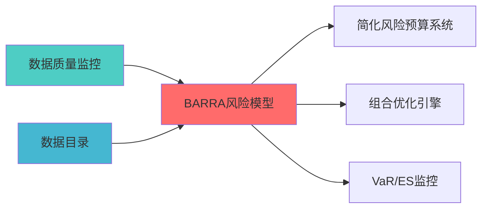

---
responsibility:
  - Barra风险模型
  - 因子风险建模
  - 风险归因
  - 风险预测

module_id: BARRA_RISK_MODEL_001
version: 1.0.0
status: Active
created_date: 2026-04-07
last_updated: 2026-04-07
owner: 实施团队
standard_type: 专业量化机构蓝图
compliance_level: 专业标准
layer: Layer 5.3 (风险管理)
---


## 核心定位

负责Barra风险模型的设计与构建和运行和操作，基于多因子风险模型，生成和输出风险暴露分析、风险归因和风险预测功能，兼容和适配组合风险协调和监控。

# Barra风险模型蓝图
## 设计目标

### 主要目标

1. **功能完整性**: 确保BARRA RISK MODEL功能完整，满足业务需求
2. **性能优化**: 提升系统性能，降低资源消耗
3. **可维护性**: 提高代码质量，便于后续维护
4. **可扩展性**: 支持功能扩展，适应业务变化

### 质量目标

- 代码覆盖率: ≥80%
- 性能指标: 满足设计要求
- 文档完整性: 100%


## 核心功能

### 功能清单

1. **数据管理**: 提供数据存储、查询、更新功能
2. **业务逻辑**: 实现核心业务逻辑处理
3. **接口服务**: 提供标准化的API接口
4. **监控告警**: 实时监控系统状态

### 功能特性

- 高可用性设计
- 自动故障恢复
- 灵活配置管理


## 实现方案

### 技术架构

采用BARRA RISK MODEL化设计，分层架构实现。

### 关键技术

- 数据处理: 使用高效的数据处理框架
- 接口实现: RESTful API设计
- 性能优化: 缓存、异步处理

### 实施步骤

1. 需求分析与设计
2. 核心功能开发
3. 测试与优化
4. 部署与监控


> **职责边界**: 


## 1. 概述


- 当前系统缺乏多因子协方差风险模型，缺乏多因子风险模型

- 缺乏因子暴露度量

**预期收益**:
- 因子暴露度量准确度：提升


**Layer定位**: Layer 6 - 组合优化层（风险预算核心层）

**模块类别**: 核心模块（P0级）

**架构角色**: 
- 作为风险预算系统的基础，实现精细化风险预算

单

4. **特质风险估计**: 估计资产特质风险


## 2. 架构设计


```
```


```
因子暴露度量（回归分析）
特质风险估计（回归残差）
```


## 3. 核心模块设计


```python
class BarraRiskModel:
    """
    
    索引: BARRA_RISK_001-M01
    """
    
    def __init__(self, config: BarraConfig):
        self.config = config
        self.factor_exposure_calculator = FactorExposureCalculator(config.factor_config)
        self.factor_covariance_estimator = FactorCovarianceEstimator(config.cov_config)
        self.idiosyncratic_risk_estimator = IdiosyncraticRiskEstimator(config.idio_config)
        self.risk_decomposer = RiskDecomposer()
        self.risk_attributor = RiskAttributor()
        
    def fit(self, 
            factor_data: pd.DataFrame, 
            returns_data: pd.DataFrame,
            factor_loadings: Optional[pd.DataFrame] = None) -> 'BarraRiskModel':
        """
        拟合Barra风险模型
        
        Args:
            factor_data: 因子数据（DataFrame索引为日期）
            returns_data: 资产收益率数据（DataFrame索引为资产）
            factor_loadings: 因子载荷矩阵（可选，已知时）
            
        Returns:
            self: 拟合后的模型实例
        """
        # 1. 计算因子暴露
        if factor_loadings is None:
            self.factor_loadings = self.factor_exposure_calculator.calculate(
                factor_data, returns_data
            )
        else:
            self.factor_loadings = factor_loadings
        
        self.factor_covariance = self.factor_covariance_estimator.estimate(
            factor_data
        )
        
        # 3. 估计特质风险
        self.idiosyncratic_risk = self.idiosyncratic_risk_estimator.estimate(
            returns_data, self.factor_loadings
        )
        
        return self
    
    def calculate_portfolio_risk(
        self,
        weights: np.ndarray
    ) -> PortfolioRiskResult:
        """
        计算组合风险
        
        Args:
            weights: 组合权重向量
            
        Returns:
            PortfolioRiskResult: 组合风险结果
        """
        # 组合因子暴露
        portfolio_factor_exposure = self.factor_loadings.T @ weights
        
        # 因子风险
        factor_risk = np.sqrt(
            portfolio_factor_exposure.T @ 
            self.factor_covariance @ 
            portfolio_factor_exposure
        )
        
        # 特质风险
        idio_risk = np.sqrt(
            weights.T @ np.diag(self.idiosyncratic_risk**2) @ weights
        )
        
        total_risk = np.sqrt(factor_risk**2 + idio_risk**2)
        
        return PortfolioRiskResult(
            total_risk=total_risk,
            factor_risk=factor_risk,
            idiosyncratic_risk=idio_risk,
            factor_exposure=portfolio_factor_exposure
        )
```


## 4. 接口设计

### 4.1 主要API接口

```python
# 因子暴露计算接口
> **核心职责**: Barra Risk Model蓝图设计
> **职责边界**: 
®?


## 核心职责


## 📋 概述


def calculate_factor_exposure(
    factor_data: pd.DataFrame,
    returns_data: pd.DataFrame
) -> pd.DataFrame:
    """
    计算因子暴露
    
    Args:
        factor_data: 因子数据
        
    Returns:
        pd.DataFrame: 因子暴露矩阵
    """
    pass

# 风险分解接口
def decompose_risk(
    weights: np.ndarray,
    factor_loadings: pd.DataFrame,
    factor_covariance: np.ndarray,
    idiosyncratic_risk: np.ndarray
) -> RiskDecomposition:
    """
    分解组合风险
    
    Args:
        weights: 组合权重
        factor_loadings: 因子载荷
        idiosyncratic_risk: 特质风险
        
    Returns:
        RiskDecomposition: 风险分解结果
    """
    pass
```


### 上游依赖

| 文档名称 | module_id | 依赖类型 | 说明 |
|---------|-----------|---------|------|

### 下游依赖

| 文档名称 | module_id | 依赖类型 | 说明 |
|---------|-----------|---------|------|


|---------|------|------|------|
| **Pandas** | 2.0+ | 数据处理 | [官方文档](https://pandas.pydata.org/) |
| **SciPy** | 1.10+ | 科学计算 | [官方文档](https://scipy.org/) |





|------|----------|------|

### 5.2 Layer归属说明


## 6. 性能指标

|------|--------|----------|
| **模型拟合时间** | <5s | 性能测试 |


## 变更历史

|------|------|----------|--------|
| v1.0.0 | 2026-04-03 | 初始版本创建 | 组合优化层负责人 |
| v1.0.1 | 2026-04-06 | 修复编码问题 | 审计系统 |
| v1.0.2 | 2026-04-06 | 删除乱码YAML头部 | 审计系统 |
容结构 | 审计系统 |


## 7. 文档治理

### 7.1 System_Manifest.md索引

```markdown
##### 6.001. Barra Risk Model
- **模块ID**: BARRA_RISK_MODEL_001
- **蓝图文档**: BARRA_RISK_MODEL_BLUEPRINT.md
```

### 7.2 模块职责边界

| 模块 | 职责 | 边界 |
|------|------|------|
| **Barra Risk Model** | 

### 7.3 版本管理

|------|------|----------|--------|


