---
responsibility:
  - Barra风险模型
  - 风险因子建模
  - 风险暴露分析
  - 风险预测

module_id: BARRA_RISK_MODEL_001
version: 1.0.0
status: Active
created_date: 2026-04-07
last_updated: 2026-04-07
owner: 实施团队
standard_type: 专业量化机构蓝图
applicable_scope: Layer 7 风险管理å±?
compliance_level: 专业标准
layer: Layer 5.3 (风险管理)
---

# Barra风险模型蓝图
## 核心定位

构建Barra风险模型的设计与实现，基于多因子风险模型技术，量化系统性风险和特质风险，支持投资组合风险归因分析，提升风险管理能力ã€?

---


> **核心职责**: 多因子风险模型，实现风险分解、因子暴露度é‡?
> **职责边界**: 
> - âœ?本文档负责：风险分解、因子暴露、风险预ç®?
> - â?本文档不负责：因子计算（由因子模块负责）


## 1. 概述

### 1.1 股票背景与业务目æ ?

**业务需æ±?*:
- 当前系统缺乏多因子协方差风险模型，缺乏多因子风险模型
- 无法准确分解风险来源（因子风é™?vs 特质风险ï¼?
- 无法度量因子暴露度，导致组合投资不可é?
- 无法实现精确的风险预算管ç?

**技术痛ç‚?*:
- 缺乏多因子风险模型实çŽ?
- 缺乏因子暴露度量
- 无法风险分解和归å›?
- 缺乏多因子风险预算管理能åŠ?

**预期收益**:
- 风险分解精度：提å?0%
- 因子暴露度量准确度：提升
- 风险预算管理精度：提å?0%
- 组合优化风险管理能力：新å¢?
- 为桥水基金模式提供核心支æ’?

### 1.2 技术定位与架构层归å±?

**Layer定位**: Layer 6 - 组合优化层（风险预算核心层）

**模块类别**: 核心模块（P0级）

**架构角色**: 
- 作为桥水基金模式的核心组件，提供精确的风险分è§?
- 作为组合优化的风险约束，度量因子暴露åº?
- 作为风险预算系统的基础，实现精细化风险预算

### 1.3 核心功能清单

1. **因子暴露度量**: 度量资产在各因子上的暴露åº?
2. **风险分解**: 将风险分解为因子风险和特质风é™?
3. **因子协方差估è®?*: 估计因子间协方差矩阵
4. **特质风险估计**: 估计资产特质风险
5. **风险预算**: 基于多因子风险预算管ç?
6. **风险预算管理**: 基于多因子风险预算管ç?

---

## 2. 架构设计

### 2.1 系统架构å›?

```
┌─────────────────────────────────────────────────────────────────â”?
â”?                  Barra风险模型系统架构                          â”?
├─────────────────────────────────────────────────────────────────â”?
â”?                                                                â”?
â”?┌──────────────────────────────────────────────────────────â”?  â”?
â”?â”?            输入å±?                                       â”?  â”?
â”?â”?┌────────────────────────────────â”?┌──────────────────â”? â”?  â”?
â”?â”?│因子数æ?                       â”?│资产收益率数据    â”? â”?  â”?
â”?â”?â”? 风格因子ï¼?0个）              â”?â”? 历史收益çŽ?     â”? â”?  â”?
â”?â”?â”? 行业因子ï¼?8个）              â”?â”? 市场收益çŽ?     â”? â”?  â”?
â”?â”?└────────────────────────────────â”?└──────────────────â”? â”?  â”?
â”?└──────────────────────────────────────────────────────────â”?  â”?
�                        �                                      �
â”?┌──────────────────────────────────────────────────────────â”?  â”?
â”?â”?            因子暴露度量å±?                               â”?  â”?
â”?â”?┌────────────────────────────────────────────────────â”?  â”?  â”?
â”?â”?â”?Factor Exposure Calculator                        â”?  â”?  â”?
â”?â”?â”?- 风格因子暴露度量                                 â”?  â”?  â”?
â”?â”?â”?- 行业因子暴露度量                                 â”?  â”?  â”?
â”?â”?â”?- 因子暴露矩阵构建                                 â”?  â”?  â”?
â”?â”?└────────────────────────────────────────────────────â”?  â”?  â”?
â”?└──────────────────────────────────────────────────────────â”?  â”?
�                        �                                      �
â”?┌──────────────────────────────────────────────────────────â”?  â”?
â”?â”?            协方差估计层                                  â”?  â”?
â”?â”?┌──────────â”?┌──────────â”?┌──────────â”?                 â”?  â”?
â”?â”?│因子协方差â”?│特质风é™? â”?│风险分è§? â”?                 â”?  â”?
â”?â”?│估è®?     â”?│估è®?     â”?â”?         â”?                 â”?  â”?
â”?â”?└──────────â”?└──────────â”?└──────────â”?                 â”?  â”?
â”?└──────────────────────────────────────────────────────────â”?  â”?
�                        �                                      �
â”?┌──────────────────────────────────────────────────────────â”?  â”?
â”?â”?            输出å±?                                       â”?  â”?
â”?â”?┌──────────â”?┌──────────â”?┌──────────â”?                 â”?  â”?
â”?â”?│风险分è§? â”?│因子暴éœ? â”?│风险预ç®? â”?                 â”?  â”?
â”?â”?│报å‘?     â”?│报å‘?     â”?│管ç?     â”?                 â”?  â”?
â”?â”?└──────────â”?└──────────â”?└──────────â”?                 â”?  â”?
â”?└──────────────────────────────────────────────────────────â”?  â”?
â”?                                                                â”?
└─────────────────────────────────────────────────────────────────â”?
```

### 2.2 核心数据æµ?

```
因子数据 + 资产收益率数æ?
    �
因子暴露度量（回归分析）
    �
因子协方差估计（统计模型ï¼?
    �
特质风险估计（回归残差）
    �
协方差矩阵构å»?
    �
风险分解、因子暴露、风险预ç®?
```

---

## 3. 核心模块设计

### 3.1 Barra风险模型核心类（BarraRiskModelï¼?

```python
class BarraRiskModel:
    """
    Barra风险模型核心ç±?
    
    索引: BARRA_RISK_001-M01
    职责: 多因子风险模型，实现风险分解、因子暴露度é‡?
    输入: 因子数据、资产收益率数据
    输出: 因子暴露、风险分解、风险预ç®?
    """
    
    def __init__(self, config: BarraConfig):
        self.config = config
        self.factor_exposure_calculator = FactorExposureCalculator(config.factor_config)
        self.factor_covariance_estimator = FactorCovarianceEstimator(config.cov_config)
        self.idiosyncratic_risk_estimator = IdiosyncraticRiskEstimator(config.idio_config)
        self.risk_decomposer = RiskDecomposer()
        self.risk_attributor = RiskAttributor()
        
    def fit(self, 
            factor_data: pd.DataFrame, 
            returns_data: pd.DataFrame,
            factor_loadings: Optional[pd.DataFrame] = None) -> 'BarraRiskModel':
        """
        拟合Barra风险模型
        
        Args:
            factor_data: 因子数据（DataFrame索引为日期）
            returns_data: 资产收益率数据（DataFrame索引为资产）
            factor_loadings: 因子载荷矩阵（可选，已知时）
            
        Returns:
            self: 拟合后的模型实例
        """
        # 1. 计算因子暴露
        if factor_loadings is None:
            self.factor_loadings = self.factor_exposure_calculator.calculate(
                factor_data, returns_data
            )
        else:
            self.factor_loadings = factor_loadings
        
        # 2. 估计因子协方差矩é˜?
        self.factor_covariance = self.factor_covariance_estimator.estimate(
            factor_data
        )
        
        # 3. 估计特质风险
        self.idiosyncratic_risk = self.idiosyncratic_risk_estimator.estimate(
            returns_data, self.factor_loadings
        )
        
        return self
    
    def calculate_portfolio_risk(
        self,
        weights: np.ndarray
    ) -> PortfolioRiskResult:
        """
        计算组合风险
        
        Args:
            weights: 组合权重向量
            
        Returns:
            PortfolioRiskResult: 组合风险结果
        """
        # 组合因子暴露
        portfolio_factor_exposure = self.factor_loadings.T @ weights
        
        # 因子风险
        factor_risk = np.sqrt(
            portfolio_factor_exposure.T @ 
            self.factor_covariance @ 
            portfolio_factor_exposure
        )
        
        # 特质风险
        idio_risk = np.sqrt(
            weights.T @ np.diag(self.idiosyncratic_risk**2) @ weights
        )
        
        # 总风é™?
        total_risk = np.sqrt(factor_risk**2 + idio_risk**2)
        
        return PortfolioRiskResult(
            total_risk=total_risk,
            factor_risk=factor_risk,
            idiosyncratic_risk=idio_risk,
            factor_exposure=portfolio_factor_exposure
        )
```

---

## 4. 接口设计

### 4.1 主要API接口

```python
# 因子暴露计算接口
> **核心职责**: Barra Risk Model蓝图设计
> **职责边界**: 
> - âœ?本文档负责：Barra Risk Model蓝图设计相关内容
> - â?本文档不负责：其他模块内å®?


## 核心职责

Barra风险模型，负责多因子风险模型的实æ–?


---

## 📋 概述

本文档定义了BARRA RISK MODEL的核心功能和技术实现ã€?


> **核心定位**: 因子暴露计算接口的核心功能实çŽ?

def calculate_factor_exposure(
    factor_data: pd.DataFrame,
    returns_data: pd.DataFrame
) -> pd.DataFrame:
    """
    计算因子暴露
    
    Args:
        factor_data: 因子数据
        returns_data: 收益率数æ?
        
    Returns:
        pd.DataFrame: 因子暴露矩阵
    """
    pass

# 风险分解接口
def decompose_risk(
    weights: np.ndarray,
    factor_loadings: pd.DataFrame,
    factor_covariance: np.ndarray,
    idiosyncratic_risk: np.ndarray
) -> RiskDecomposition:
    """
    分解组合风险
    
    Args:
        weights: 组合权重
        factor_loadings: 因子载荷
        factor_covariance: 因子协方å·?
        idiosyncratic_risk: 特质风险
        
    Returns:
        RiskDecomposition: 风险分解结果
    """
    pass
```

---

## 📚 相关文档

### 上游依赖

| 文档名称 | module_id | 依赖类型 | 说明 |
|---------|-----------|---------|------|
| [数据质量监控蓝图](./DATA_QUALITY_MONITORING_BLUEPRINT.md) | DATA_QUALITY_MONITORING_001 | 强依èµ?| 提供数据质量指标 |
| [数据目录蓝图](./DATA_CATALOG_BLUEPRINT.md) | DATA_CATALOG_001 | 强依èµ?| 提供因子数据元数æ?|
| [动态相关性建模蓝图](./DYNAMIC_CORRELATION_MODELING_BLUEPRINT.md) | DYNAMIC_CORRELATION_MODELING_001 | 中依èµ?| 提供相关性矩é˜?|

### 下游依赖

| 文档名称 | module_id | 依赖类型 | 说明 |
|---------|-----------|---------|------|
| [简化风险预算系统蓝图](./SIMPLIFIED_RISK_BUDGET_SYSTEM_BLUEPRINT.md) | SIMPLIFIED_RISK_BUDGET_SYSTEM_001 | 强依èµ?| 风险预算系统 |
| [组合优化引擎集成蓝图](./PORTFOLIO_OPTIMIZER_INTEGRATION_BLUEPRINT.md) | PORTFOLIO_OPTIMIZER_INTEGRATION_001 | 强依èµ?| 组合优化 |
| [VaR/ES监控蓝图](./VAR_ES_MONITORING_BLUEPRINT.md) | VAR_ES_MONITORING_001 | 中依èµ?| VaR/ES监控 |

### 技术依èµ?

| 技术组ä»?| 版本 | 用é€?| 文档 |
|---------|------|------|------|
| **NumPy** | 1.24+ | 数值计ç®?| [官方文档](https://numpy.org/) |
| **Pandas** | 2.0+ | 数据处理 | [官方文档](https://pandas.pydata.org/) |
| **SciPy** | 1.10+ | 科学计算 | [官方文档](https://scipy.org/) |

### 引用关系å›?

```mermaid
graph LR
    A[数据质量监控] --> B[BARRA风险模型]
    C[数据目录] --> B
    D[动态相关性建模] --> B
    
    B --> E[简化风险预算系统]
    B --> F[组合优化引擎]
    B --> G[VaR/ES监控]
    
    style B fill:#ff6b6b
    style A fill:#4ecdc4
    style C fill:#45b7d1
```



---

## 5. 与其他模块的关系

### 5.1 模块依赖关系

| 模块 | 关系类型 | 说明 |
|------|----------|------|
| RISK_ATTRIBUTION_SYSTEM | 被依èµ?| 为风险归因提供因子风险分è§?|
| RISK_CONTRIBUTION_ANALYSIS | 被依èµ?| 为风险贡献分析提供风险模åž?|
| PORTFOLIO_OPTIMIZATION | 被依èµ?| 为组合优化提供风险约æ?|

### 5.2 Layer归属说明

本模块在INDEX.md中被归类为Layer 7（风险控制层），但根据其核心职责（多因子风险模型、风险预算），更适合归类为Layer 6（组合优化层）。建议与架构师确认最终归属ã€?

---

## 6. 性能指标

| 指标 | 目标å€?| 测量方法 |
|------|--------|----------|
| **风险分解精度** | â‰?0% | 回测验证 |
| **因子暴露准确åº?* | â‰?5% | 样本外测è¯?|
| **风险预算管理精度** | â‰?0% | 功能测试 |
| **模型拟合时间** | <5s | 性能测试 |

---

## 变更历史

| 版本 | 日期 | 变更内容 | 变更äº?|
|------|------|----------|--------|
| v1.0.0 | 2026-04-03 | 初始版本创建 | 组合优化层负责人 |
| v1.0.1 | 2026-04-06 | 修复编码问题 | 审计系统 |
| v1.0.2 | 2026-04-06 | 删除乱码YAML头部 | 审计系统 |
| v1.0.3 | 2026-04-06 | 重新生成正确内容结构 | 审计系统 |

---

**蓝图版本**: v1.0.3 | **创建日期**: 2026-04-03 | **状æ€?*: Active
---

## 7. 文档治理

### 7.1 System_Manifest.md索引

```markdown
#### Layer 6: 组合优化å±?
##### 6.001. Barra Risk Model
- **模块ID**: BARRA_RISK_MODEL_001
- **蓝图文档**: BARRA_RISK_MODEL_BLUEPRINT.md
- **技术规格书**: 待创å»?
- **职责**: 全系ç»?
- **状æ€?*: Active
```

### 7.2 模块职责边界

| 模块 | 职责 | 边界 |
|------|------|------|
| **Barra Risk Model** | 全系ç»?| **核心模块** |

### 7.3 版本管理

| 版本 | 日期 | 变更内容 | 变更äº?|
|------|------|----------|--------|
| v1.0.0 | 2026-04-03 | 初始版本创建 | 首席蓝图架构å¸?|

---

**蓝图版本**: v1.0.0 | **创建日期**: 2026-04-03 | **状æ€?*: Active
