---
responsibility:
  - Black-Litterman模型
  - 观点融合
  - 最优é
ç½?
  - 市场均衡收益

module_id: BLACK_LITTERMAN_MODEL_001
version: 1.0.0
status: Active
created_date: 2026-04-07
last_updated: 2026-04-07
owner: 实施团队
standard_type: 专业量化机构蓝图
applicable_scope: Layer 6 组合优化å±?
compliance_level: 专业标准
layer: Layer 5.2 (组合优化)
---


## 核心定位

负责Black-Litterman模型的设计与实现，结合市场均衡收益和投资者观点，提供资产配置优化方案，支持投资决策。

# Black-Litterman组合优化模型蓝图
## 设计目标

### 主要目标

1. **功能完整性**: 确保BLACK LITTERMAN MODEL功能完整，满足业务需求
2. **性能优化**: 提升系统性能，降低资源消耗
3. **可维护性**: 提高代码质量，便于后续维护
4. **可扩展性**: 支持功能扩展，适应业务变化

### 质量目标

- 代码覆盖率: ≥80%
- 性能指标: 满足设计要求
- 文档完整性: 100%


## 核心功能

### 功能清单

1. **数据管理**: 提供数据存储、查询、更新功能
2. **业务逻辑**: 实现核心业务逻辑处理
3. **接口服务**: 提供标准化的API接口
4. **监控告警**: 实时监控系统状态

### 功能特性

- 高可用性设计
- 自动故障恢复
- 灵活配置管理


## 实现方案

### 技术架构

采用BLACK LITTERMAN MODEL化设计，分层架构实现。

### 关键技术

- 数据处理: 使用高效的数据处理框架
- 接口实现: RESTful API设计
- 性能优化: 缓存、异步处理

### 实施步骤

1. 需求分析与设计
2. 核心功能开发
3. 测试与优化
4. 部署与监控


## 核心定位

构建Black-Litterman模型的设计与实现，基于贝叶斯推断技术，融合市场均衡收益和投资è€
观点，优化资产é
ç½®å†³ç­–，提升投资组合表现ã€?

---


> **核心职责**: 结合市场均衡观点与投资è€
主观观点的组合优化
> **职责边界**: 
> - âœ?本文档负责：Black-Litterman模型、观点融合、最优é
ç½?
> - â?本文档不负责：因子计算（由因子模块负责）


## 1. 概述

### 1.1 模块定位与目æ ?

**Layer定位**: Layer 6 - 组合优化层（组合构建模块ï¼?

**核心价å€?*:
- 解决传统均值方差优化对预期收益率估计过于敏感的问题
- 结合市场均衡观点（å
ˆéªŒï¼‰ä¸ŽæŠ•èµ„è€
主观观点（后验ï¼?
- 提供更稳健、更符合实é™
的投资组合权é‡?
- 专业机构广泛使用的核心组合优化模åž?

**业务价å€?*:
- 提升组合优化结果的稳定性和可解释æ€?
- å
è®¸æŠ•èµ„è€
融å
¥ä¸“业判断和市场洞察
- 降低因参数估计误差导致的优化偏差
- 适合个人投资è€
结合自身研究观ç‚?

### 1.2 版本信息

| 项目 | å†
容 |
|------|------|
| **模块ID** | BLACK_LITTERMAN_MODEL_001 |
| **版本** | v1.0.0 |
| **状æ€?* | Active |
| **创建日期** | 2026-04-06 |
| **最后更æ–?* | 2026-04-06 |
| **开源依èµ?* | PyPortfolioOpt, Riskfolio-Lib |
| **预计工时** | 2-3å¤?|

### 1.3 与现有模块å
³ç³?

| å
³ç³»ç±»åž‹ | 模块名称 | module_id | 集成方式 |
|---------|---------|-----------|---------|
| **输å
¥ä¾èµ–** | 因子库模å?| FACTOR_BACKTEST_001 | 获取因子预测信号作为主观观点 |
| **输å
¥ä¾èµ–** | 策略引擎模块 | STRAT_ENGINE_001 | 获取策略观点矩阵 |
| **输å
¥ä¾èµ–** | 数据源层 | Layer 0 | 获取市场数据计算均衡收益 |
| **输出目标** | 组合优化模块 | PORTFOLIO_OPTIMIZATION_001 | 提供优化后的组合权重 |
| **输出目标** | 风险预算系统 | SIMPLIFIED_RISK_BUDGET_SYSTEM_001 | 提供风险贡献分析 |

---
## 📚 相å
³æ–‡æ¡£

### 上游依赖

| 文档名称 | module_id | 依赖类型 | 说明 |
|---------|-----------|---------|------|
| [组合优化引擎集成蓝图](./PORTFOLIO_OPTIMIZER_INTEGRATION_BLUEPRINT.md) | PORTFOLIO_OPTIMIZER_INTEGRATION_001 | 强依èµ?| 提供优化器基础接口 |
| [数据质量监控蓝图](./DATA_QUALITY_MONITORING_BLUEPRINT.md) | DATA_QUALITY_MONITORING_001 | 强依èµ?| 提供数据质量指标 |
| [数据目录蓝图](./DATA_CATALOG_BLUEPRINT.md) | DATA_CATALOG_001 | 中依èµ?| 提供资产å
ƒæ•°æ?|

### 下游依赖

| 文档名称 | module_id | 依赖类型 | 说明 |
|---------|-----------|---------|------|
| [战略é
ç½®å¼•æ“Žè“å›¾](./STRATEGIC_ALLOCATION_ENGINE_BLUEPRINT.md) | STRATEGIC_ALLOCATION_ENGINE_001 | 强依èµ?| 战略资产é
ç½® |
| [简化风险预算系统蓝图](./SIMPLIFIED_RISK_BUDGET_SYSTEM_BLUEPRINT.md) | SIMPLIFIED_RISK_BUDGET_SYSTEM_001 | 中依èµ?| 风险预算系统 |
| [STRATEGY_SELECTION_BLUEPRINT.md](./STRATEGY_SELECTION_BLUEPRINT.md) | STRATEGY_SELECTION_001 | 中依èµ?| 策略选择 |

### 技术依èµ?

| 技术组ä»?| 版本 | 用é€?| 文档 |
|---------|------|------|------|
| **PyPortfolioOpt** | 1.5+ | 组合优化 | [官方文档](https://pyportfolioopt.readthedocs.io/) |
| **Riskfolio-Lib** | 5.0+ | 风险优化 | [官方文档](https://riskfolio-lib.readthedocs.io/) |
| **NumPy** | 1.24+ | 数值计ç®?| [官方文档](https://numpy.org/) |
| **Pandas** | 2.0+ | 数据处理 | [官方文档](https://pandas.pydata.org/) |

### 引用å
³ç³»å›?



---

## 2. 架构设计

### 2.1 Layer定位与职责边ç•?

**Layer 6 - 组合优化层架æž?*:

```
Layer 6: 组合优化å±?
├── 6.1 组合构建模块
â”?  ├── 组合优化å™?(PORTFOLIO_OPTIMIZATION_001)
â”?  ├── Black-Litterman模型 (BLACK_LITTERMAN_MODEL_001) â†?本模å?
â”?  ├── 风险平价策略 (RISK_PARITY_STRATEGY_001)
â”?  └── 多资产é
ç½?(MULTI_ASSET_ALLOCATION_001)
├── 6.2 约束求解模块
â”?  ├── 约束求解å™?(CONSTRAINT_SOLVER_001)
â”?  └── 多目标优åŒ?(MULTI_OBJECTIVE_OPTIMIZATION_001)
└── 6.3 风险预算模块
    ├── 风险预算系统 (SIMPLIFIED_RISK_BUDGET_SYSTEM_001)
    └── 层级风险预算 (HIERARCHICAL_RISK_BUDGET_001)
```

**职责边界**:
- âœ?**负责**: 市场均衡收益计算、主观观点矩阵构建、后验收益估计、组合权重优åŒ?
- â?**不负è´?*: 因子计算（因子库负责）、策略信号生成（策略引擎负责）、风险预算分é
ï¼ˆé£Žé™©é¢„算系统负责ï¼?

### 2.2 核心组件架构

```mermaid
graph TB
    subgraph "输å
¥å±?
        A[市场数据] --> B[市场均衡收益计算器]
        C[因子预测] --> D[主观观点生成器]
        E[策略信号] --> D
        F[风险模型] --> G[协方差矩阵估计器]
    end
    
    subgraph "Black-Litterman核心引擎"
        B --> H[å
ˆéªŒæ”¶ç›Šä¼°è®¡]
        D --> I[观点矩阵构建]
        I --> J[观点置信度设定]
        H --> K[Black-Litterman融合器]
        J --> K
        G --> K
    end
    
    subgraph "优化求解å±?
        K --> L[后验收益估计]
        L --> M[均值方差优化器]
        M --> N[约束处理器]
        N --> O[组合权重输出]
    end
    
    subgraph "输出å±?
        O --> P[组合权重方案]
        O --> Q[风险归因报告]
        O --> R[观点影响分析]
    end
```

### 2.3 数据流设è®?

**核心数据æµ?*:

```
市场数据 â†?市场均衡收益 (π)
         �
主观观点 (Q) + 观点矩阵 (P) + 置信åº?(Ω)
         �
Black-Litterman融合
         �
后验收益 (E[R]) + 后验协方å·?(Σ')
         �
均值方差优åŒ?
         �
最优组合权é‡?(w*)
```

---

## 3. 技术实çŽ?

### 3.1 开源项目集成方æ¡?

#### 3.1.1 PyPortfolioOpt集成（推荐）

**优势**:
- 成熟稳定ï¼?.2k+ GitHub Stars
- 完整的Black-Litterman实现
- 与现有系统技术栈å
¼å®¹ï¼ˆPython + Pandas + NumPyï¼?
- 文档完善，社区活è·?

**核心API**:

```python
from pypfopt import BlackLittermanModel
from pypfopt.black_litterman import market_implied_prior_returns
from pypfopt import risk_models, expected_returns

class BlackLittermanOptimizer:
    """
    Black-Litterman优化å™?
    
    索引: BLACK_LITTERMAN_001-M01
    职责: 基于PyPortfolioOpt实现Black-Litterman组合优化
    输å
¥: 市场数据、主观观点、协方差矩阵
    输出: 优化后的组合权重
    """
    
    def __init__(self, risk_free_rate: float = 0.02):
        self.risk_free_rate = risk_free_rate
        
    def calculate_market_equilibrium_returns(
        self,
        market_prices: pd.DataFrame,
        market_caps: dict,
        risk_aversion: float = 2.5
    ) -> pd.Series:
        """
        计算市场均衡收益（å
ˆéªŒï¼‰
        
        Args:
            market_prices: 市场价格数据
            market_caps: 各资产市å€?
            risk_aversion: 风险厌恶系数
            
        Returns:
            市场均衡收益序列
        """
        S = risk_models.CovarianceShrinkage(market_prices).ledoit_wolf()
        pi = market_implied_prior_returns(market_caps, risk_aversion, S)
        return pi
    
    def build_views_matrix(
        self,
        assets: list,
        views: dict,
        confidence: dict
    ) -> tuple:
        """
        构建观点矩阵
        
        Args:
            assets: 资产列表
            views: 观点字å
¸ï¼Œæ ¼å¼?{'asset1': 0.05, 'asset2': -0.03}
            confidence: 置信度字å
¸ï¼Œæ ¼å¼ {'asset1': 0.8, 'asset2': 0.6}
            
        Returns:
            (P, Q, Omega): 观点矩阵、观点向量、置信度矩阵
        """
        n_assets = len(assets)
        n_views = len(views)
        
        P = np.zeros((n_views, n_assets))
        Q = np.zeros(n_views)
        Omega = np.zeros((n_views, n_views))
        
        for i, (asset, view) in enumerate(views.items()):
            asset_idx = assets.index(asset)
            P[i, asset_idx] = 1
            Q[i] = view
            Omega[i, i] = 1 / confidence[asset]
            
        return P, Q, Omega
    
    def optimize_portfolio(
        self,
        market_prices: pd.DataFrame,
        market_caps: dict,
        views: dict,
        confidence: dict,
        risk_aversion: float = 2.5
    ) -> dict:
        """
        执行Black-Litterman优化
        
        Args:
            market_prices: 市场价格数据
            market_caps: 市值字å
?
            views: 主观观点
            confidence: 观点置信åº?
            risk_aversion: 风险厌恶系数
            
        Returns:
            优化结果字å
¸ï¼ŒåŒ
含权重、预期收益、风险指æ ?
        """
        assets = list(market_prices.columns)
        
        pi = self.calculate_market_equilibrium_returns(
            market_prices, market_caps, risk_aversion
        )
        
        S = risk_models.CovarianceShrinkage(market_prices).ledoit_wolf()
        
        P, Q, Omega = self.build_views_matrix(assets, views, confidence)
        
        bl = BlackLittermanModel(
            S, 
            pi=pi, 
            P=P, 
            Q=Q, 
            Omega=Omega,
            risk_aversion=risk_aversion
        )
        
        bl_returns = bl.bl_returns()
        bl_cov = bl.bl_cov()
        
        from pypfopt import EfficientFrontier
        ef = EfficientFrontier(bl_returns, bl_cov)
        weights = ef.max_sharpe()
        
        cleaned_weights = ef.clean_weights()
        
        performance = ef.portfolio_performance()
        
        return {
            'weights': cleaned_weights,
            'expected_return': performance[0],
            'volatility': performance[1],
            'sharpe_ratio': performance[2],
            'bl_returns': bl_returns,
            'bl_covariance': bl_cov
        }
```

#### 3.1.2 Riskfolio-Lib集成（备选）

**优势**:
- 功能更å
¨é¢ï¼Œæ”¯æŒæ›´å¤šé£Žé™©åº¦é‡
- 提供完整的Black-Litterman教程
- 支持因子模型集成

**核心API**:

```python
import riskfolio as rp

class RiskfolioBlackLittermanOptimizer:
    """
    基于Riskfolio-Lib的Black-Litterman优化å™?
    
    索引: BLACK_LITTERMAN_001-M02
    职责: 使用Riskfolio-Lib实现Black-Litterman优化
    """
    
    def optimize_with_riskfolio(
        self,
        returns: pd.DataFrame,
        views: dict,
        confidence: dict
    ) -> dict:
        """
        使用Riskfolio-Lib执行Black-Litterman优化
        
        Args:
            returns: 资产收益率数æ?
            views: 主观观点
            confidence: 观点置信åº?
            
        Returns:
            优化结果
        """
        port = rp.Portfolio(returns=returns)
        port.assets_stats(method_mu='hist', method_cov='hist')
        
        bl_mu, bl_cov = rp.black_litterman(
            returns,
            views=views,
            confidence=confidence
        )
        
        port.mu = bl_mu
        port.cov = bl_cov
        
        w = port.optimization(
            model='Classic',
            rm='MV',
            obj='Sharpe',
            rf=0.02
        )
        
        return w
```

### 3.2 å
³é”®ç®—法实现

#### 3.2.1 市场均衡收益计算

**理论基础**:
根据CAPM模型，市场均衡收益可以通过反向优化获得ï¼?

```
π = δ * Σ * w_market
```

å
¶ä¸­ï¼?
- π: 市场均衡收益向量
- δ: 风险厌恶系数（通常å?.5ï¼?
- Σ: 协方差矩é˜?
- w_market: 市场权重（基于市值）

**实现代码**:

```python
def market_implied_prior_returns(
    market_caps: dict,
    risk_aversion: float,
    cov_matrix: np.ndarray
) -> np.ndarray:
    """
    计算市场隐含均衡收益
    
    Args:
        market_caps: 各资产市值字å
?
        risk_aversion: 风险厌恶系数
        cov_matrix: 协方差矩é˜?
        
    Returns:
        市场均衡收益向量
    """
    total_cap = sum(market_caps.values())
    market_weights = np.array([cap / total_cap for cap in market_caps.values()])
    
    pi = risk_aversion * np.dot(cov_matrix, market_weights)
    
    return pi
```

#### 3.2.2 Black-Littermanå
¬å¼

**核心å
¬å¼**:

```
E[R] = [(τΣ)^(-1) + P'Ω^(-1)P]^(-1) * [(τΣ)^(-1)π + P'Ω^(-1)Q]
```

å
¶ä¸­ï¼?
- E[R]: 后验预期收益
- τ: 缩放因子（通常å?.01-0.05ï¼?
- Σ: 协方差矩é˜?
- P: 观点矩阵
- Ω: 观点置信度矩é˜?
- π: 市场均衡收益
- Q: 观点向量

**实现代码**:

```python
def black_litterman_formula(
    pi: np.ndarray,
    P: np.ndarray,
    Q: np.ndarray,
    Sigma: np.ndarray,
    Omega: np.ndarray,
    tau: float = 0.02
) -> tuple:
    """
    Black-Litterman核心å
¬å¼
    
    Args:
        pi: 市场均衡收益
        P: 观点矩阵
        Q: 观点向量
        Sigma: 协方差矩é˜?
        Omega: 观点置信度矩é˜?
        tau: 缩放因子
        
    Returns:
        (后验收益, 后验协方å·?
    """
    tau_Sigma_inv = np.linalg.inv(tau * Sigma)
    Omega_inv = np.linalg.inv(Omega)
    
    M = np.linalg.inv(tau_Sigma_inv + P.T @ Omega_inv @ P)
    
    bl_return = M @ (tau_Sigma_inv @ pi + P.T @ Omega_inv @ Q)
    
    bl_cov = Sigma + M
    
    return bl_return, bl_cov
```

### 3.3 性能要求

| 性能指标 | 目标å€?| 说明 |
|---------|--------|------|
| **优化计算时间** | <500ms | 100个资产以å†?|
| **å†
存占用** | <100MB | 单次优化 |
| **并发支持** | 10 QPS | 支持多策略并行优åŒ?|
| **数值稳定æ€?* | 条件æ•?1000 | 协方差矩阵正定性检æŸ?|

---

## 4. 数据模型

### 4.1 输å
¥æ•°æ®ç»“æž„

```python
@dataclass
class BlackLittermanInput:
    """Black-Litterman输å
¥æ•°æ®"""
    market_prices: pd.DataFrame
    market_caps: Dict[str, float]
    views: Dict[str, float]
    confidence: Dict[str, float]
    risk_aversion: float = 2.5
    tau: float = 0.02
    risk_free_rate: float = 0.02
```

### 4.2 输出数据结构

```python
@dataclass
class BlackLittermanResult:
    """Black-Litterman优化结果"""
    weights: Dict[str, float]
    expected_return: float
    volatility: float
    sharpe_ratio: float
    bl_returns: pd.Series
    bl_covariance: pd.DataFrame
    risk_contribution: Dict[str, float]
    view_impact: Dict[str, float]
    timestamp: datetime
```

### 4.3 数据库表设计

```sql
CREATE TABLE IF NOT EXISTS black_litterman_views (
    view_id VARCHAR(50) PRIMARY KEY,
    asset_symbol VARCHAR(20) NOT NULL,
    view_type VARCHAR(20) NOT NULL,
    expected_return DECIMAL(10, 6),
    confidence DECIMAL(5, 4),
    source VARCHAR(50),
    created_at TIMESTAMP DEFAULT CURRENT_TIMESTAMP,
    valid_until TIMESTAMP,
    INDEX idx_asset (asset_symbol),
    INDEX idx_created (created_at)
);

CREATE TABLE IF NOT EXISTS black_litterman_results (
    result_id VARCHAR(50) PRIMARY KEY,
    portfolio_id VARCHAR(50) NOT NULL,
    weights_json TEXT NOT NULL,
    expected_return DECIMAL(10, 6),
    volatility DECIMAL(10, 6),
    sharpe_ratio DECIMAL(10, 4),
    bl_returns_json TEXT,
    bl_covariance_json TEXT,
    created_at TIMESTAMP DEFAULT CURRENT_TIMESTAMP,
    INDEX idx_portfolio (portfolio_id),
    INDEX idx_created (created_at)
);
```

---

## 5. 接口定义

### 5.1 API接口

```python
class BlackLittermanAPI:
    """Black-Litterman API接口"""
    
    @endpoint("/api/v1/black_litterman/optimize")
    async def optimize_portfolio(
        self,
        request: OptimizationRequest
    ) -> OptimizationResponse:
        """
        执行Black-Litterman组合优化
        
        Args:
            request: 优化请求
            
        Returns:
            优化结果
        """
        pass
    
    @endpoint("/api/v1/black_litterman/views")
    async def submit_views(
        self,
        views: List[ViewInput]
    ) -> ViewResponse:
        """
        提交主观观点
        
        Args:
            views: 观点列表
            
        Returns:
            观点确认结果
        """
        pass
    
    @endpoint("/api/v1/black_litterman/market_equilibrium")
    async def get_market_equilibrium(
        self,
        assets: List[str]
    ) -> EquilibriumResponse:
        """
        获取市场均衡收益
        
        Args:
            assets: 资产列表
            
        Returns:
            市场均衡收益数据
        """
        pass
```

### 5.2 与å
¶ä»–模块接å?

| 接口类型 | 对接模块 | 接口格式 | 数据å†
容 |
|---------|---------|---------|---------|
| **输å
¥æŽ¥å£** | 因子库模å?| Parquet | 因子预测信号 |
| **输å
¥æŽ¥å£** | 策略引擎模块 | JSON | 策略观点矩阵 |
| **输出接口** | 组合优化模块 | JSON | 优化后权é‡?|
| **输出接口** | 风险预算系统 | JSON | 风险贡献数据 |

---

## 6. 实施路径

### 6.1 Phase 1: 核心功能实现ï¼?周）

**目标**: 完成基础Black-Litterman优化功能

| 任务 | 工时 | 交付ç‰?|
|------|------|--------|
| PyPortfolioOpt集成 | 4h | 集成代码、单å
ƒæµ‹è¯?|
| 市场均衡收益计算 | 4h | 计算模块、测试用ä¾?|
| 观点矩阵构建 | 4h | 观点处理模块 |
| 优化求解实现 | 4h | 优化器实çŽ?|

### 6.2 Phase 2: 功能增强ï¼?周）

**目标**: 增强功能和系统集æˆ?

| 任务 | 工时 | 交付ç‰?|
|------|------|--------|
| Riskfolio-Lib集成 | 4h | 备选优化器 |
| 数据库表创建 | 2h | SQL脚本 |
| API接口开å?| 4h | REST API |
| 与因子库集成 | 4h | 集成代码 |

### 6.3 Phase 3: 测试与文档（0.5周）

**目标**: 完成测试和文æ¡?

| 任务 | 工时 | 交付ç‰?|
|------|------|--------|
| 单å
ƒæµ‹è¯• | 4h | 测试代码 |
| 集成测试 | 4h | 测试报告 |
| 文档编写 | 4h | 用户手册、API文档 |

---

## 7. 文档治理

### 7.1 System_Manifest.md索引

**索引位置**: Layer 6 - 组合优化å±?- 组合构建模块

**索引条目**:
```markdown
| Black-Litterman模型蓝图 | BLACK_LITTERMAN_MODEL_001 | v1.0.0 | Active | 2026-04-06 | [链接](./BLACK_LITTERMAN_MODEL_BLUEPRINT.md) |
```

### 7.2 模块职责边界

**与因子库模块边界**:
- 因子库负责因子计算和预测
- Black-Litterman负责将因子预测转化为观点矩阵

**与策略引擎模块边ç•?*:
- 策略引擎负责策略信号生成
- Black-Litterman负责将策略信号转化为组合权重

**与组合优化模块边ç•?*:
- 组合优化模块提供优化框架
- Black-Litterman是å
¶ä¸­ä¸€ç§ä¼˜åŒ–æ–¹æ³?

### 7.3 版本管理策略

| 版本 | 变更å†
容 | 发布日期 |
|------|---------|---------|
| v1.0.0 | 初始版本，基础Black-Litterman功能 | 2026-04-06 |
| v1.1.0 | 增加因子观点自动生成 | TBD |
| v1.2.0 | 增加动态观点置信度调整 | TBD |

---

## 8. 风险评估

### 8.1 技术风é™?

| 风险é¡?| 风险等级 | 影响范围 | 缓解措施 |
|--------|---------|---------|---------|
| 协方差矩阵ç—
æ€?| P1 | 优化结果不稳å®?| 使用收缩估计、正则化 |
| 观点置信度设定主è§?| P1 | 优化结果偏差 | 提供历史回测校准方法 |
| 市场均衡收益估计误差 | P2 | å
ˆéªŒä¸å‡†ç¡?| 使用多数据源交叉验证 |

### 8.2 实施风险

| 风险é¡?| 风险等级 | 影响范围 | 缓解措施 |
|--------|---------|---------|---------|
| 开源项目API变更 | P2 | 集成失败 | 锁定版本、定期更æ–?|
| 数据质量问题 | P1 | 计算错误 | 数据æ¸
洗、异常检æµ?|

### 8.3 治理风险

| 风险é¡?| 风险等级 | 影响范围 | 缓解措施 |
|--------|---------|---------|---------|
| 文档索引缺失 | P2 | 可维护性下é™?| 及时更新System_Manifest.md |
| 版本管理混乱 | P2 | 追踪困难 | 严格执行版本管理策略 |

---

## 9. 质量保证

### 9.1 测试策略

| 测试类型 | 覆盖率目æ ?| 测试工å
· |
|---------|-----------|---------|
| 单å
ƒæµ‹è¯• | â‰?0% | pytest |
| 集成测试 | â‰?0% | pytest + mock |
| 性能测试 | å
³é”®è·¯å¾„ | pytest-benchmark |
| 回测验证 | 历史数据 | Backtrader |

### 9.2 验收标准

| 验收é¡?| 标准 | 验证方法 |
|--------|------|---------|
| 功能完整æ€?| 所有API正常工作 | 单å
ƒæµ‹è¯• |
| 性能达标 | 优化时间<500ms | 性能测试 |
| 数值稳定æ€?| 条件æ•?1000 | 数值检æŸ?|
| 文档完整æ€?| 文档覆盖率≥90% | 文档审计 |

---

## 10. 参考资æ–?

### 10.1 学术论文

1. Black, F., & Litterman, R. (1992). "Global Portfolio Optimization". Financial Analysts Journal.
2. He, G., & Litterman, R. (1999). "The Intuition Behind Black-Litterman Model Portfolios". Goldman Sachs.

### 10.2 开源项目文æ¡?

1. PyPortfolioOpt Documentation: https://pyportfolioopt.readthedocs.io/
2. Riskfolio-Lib Tutorials: https://riskfolio-lib.readthedocs.io/

### 10.3 相å
³è“å›¾

- 组合优化蓝图
- [风险平价策略蓝图](./RISK_PARITY_STRATEGY_BLUEPRINT.md)
- [风险贡献分析蓝图](./RISK_CONTRIBUTION_ANALYSIS_BLUEPRINT.md)

---

**蓝图版本**: v1.0.0 | **创建日期**: 2026-04-06 | **状æ€?*: Active | **合规çŽ?*: 100% âœ?

## 变更历史

| 版本 | 日期 | 变更å†
容 | 变更äº?|
|------|------|----------|--------|
| v1.0.0 | 2026-04-06 | 初始版本创建 | 首席蓝图架构å¸?|
| v1.0.1 | 2026-04-06 | è¡¥å

YAML头部字段和变更历å?| 审计系统 |

---

**蓝图版本**: v1.0.1 | **创建日期**: 2026-04-06 | **状æ€?*: Active
