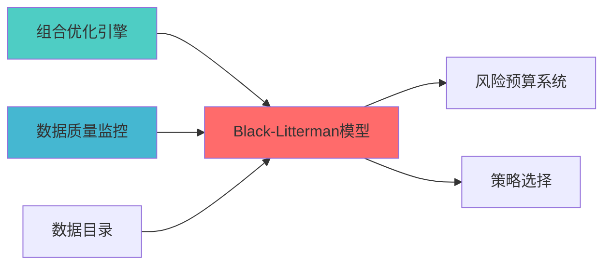

---
responsibility:
- Black-Litterman模型
- 观点融合
- 市场均衡收益计算
- 后验收益估计
module_id: BLACK_LITTERMAN_MODEL_001
version: 1.0.0
status: Active
created_date: 2026-04-07
last_updated: 2026-04-07
owner: 实施团队
standard_type: 专业量化机构蓝图
compliance_level: 专业标准
layer: Layer 6 (组合优化层)
---


## 接口与契约（蓝图终稿）

- 全库 API 与事件约定真源：[`API_Contract.md`](../../../03_TRADING_TACTICS/API_Contract.md)。本模块若以服务方式对外提供“观点输入/后验收益输出/风险贡献输出”等能力，接口字段与事件口径以该真源（及其子契约）为准。

## 验收标准（可检查）

- 能给出一套可复现的输入/输出约定：输入（市场权重、先验协方差、观点矩阵 P/Q、置信度 Ω、τ/δ 等）→ 输出（后验收益、后验协方差、建议权重/风险贡献）。
- 至少提供 1 个最小示例（可为伪数据），可计算出非空的后验收益向量，且维度一致（资产数 N 与矩阵维度匹配）。
- 对外输出（如后验收益/风险贡献）能被下游组合优化模块消费，且能在 `API_Contract.md` 中定位到对应契约入口（或在本文“已知限制”中说明暂未契约化的原因与补全计划）。

## 已知限制

- 当前文档主体存在历史排版残留（重复“核心功能”标题、局部表格断行等），不影响本节门禁，但可读性修复需另开专项批次处理。
- τ/δ/Ω 的默认取值与校准方法会显著影响结果；若未在实现中固化校准策略，需在实现阶段补齐并同步到 `API_Contract.md` 的子契约。

## 核心定位

负责Black-Litterman模型设计，实现市场观点融合、后验收益估计、协方差调整，支持投资组合优化决策。

# Black-Litterman组合优化模型蓝图
## 设计目标

### 主要目标

1. **功能完整性**: 确保BLACK LITTERMAN MODEL功能完整，满足业务需求
2. **性能优化**: 提升系统性能，降低资源消耗
3. **可维护性**: 提高代码质量，便于后续维护
4. **可扩展性**: 支持功能扩展，适应业务变化

### 质量目标

- 代码覆盖率: ≥80%
- 性能指标: 满足设计要求
- 文档完整性: 100%


## 核心功能


## 核心功能

### Black-Litterman模型特有功能

1. **市场均衡收益计算**: 基于市值权重计算市场均衡收益
2. **观点融合引擎**: 将投资者观点与市场均衡收益融合
3. **后验收益估计**: 使用贝叶斯方法估计后验收益分布
4. **协方差调整**: 根据观点不确定性调整协方差矩阵
5. **观点矩阵构建**: 支持相对观点和绝对观点的表达

### 模型参数

- 风险厌恶系数 (δ)
- 观点置信度矩阵 (Ω)
- 观点矩阵 (P, Q)
- 市场均衡权重 (w_mkt)

### 功能特性

- 高可用性设计
- 自动故障恢复
- 灵活配置管理


## 实现方案

### 技术架构

采用BLACK LITTERMAN MODEL化设计，分层架构实现。

### 关键技术

- 数据处理: 使用高效的数据处理框架
- 接口实现: RESTful API设计
- 性能优化: 缓存、异步处理

### 实施步骤

1. 需求分析与设计
2. 核心功能开发
3. 测试与优化
4. 部署与监控


主观观点的组合优化
> **职责边界**: 


## 1. 概述


- 解决传统均值方差优化对预期收益率估计过于敏感的问题

- 
- 降低因参数估计误差导致的优化偏差

### 1.2 版本信息

|------|------|
| **模块ID** | BLACK_LITTERMAN_MODEL_001 |
| **版本** | v1.0.0 |
| **创建日期** | 2026-04-06 |


| 
|---------|---------|-----------|---------|
| **输出目标** | 组合优化模块 | PORTFOLIO_OPTIMIZATION_001 | 提供优化后的组合权重 |
| **输出目标** | 风险预算系统 | SIMPLIFIED_RISK_BUDGET_SYSTEM_001 | 提供风险贡献分析 |


### 上游依赖

| 文档名称 | module_id | 依赖类型 | 说明 |
|---------|-----------|---------|------|

### 下游依赖

| 文档名称 | module_id | 依赖类型 | 说明 |
|---------|-----------|---------|------|


|---------|------|------|------|
| **PyPortfolioOpt** | 1.5+ | 组合优化 | [官方文档](https://pyportfolioopt.readthedocs.io/) |
| **Riskfolio-Lib** | 5.0+ | 风险优化 | [官方文档](https://riskfolio-lib.readthedocs.io/) |
| **Pandas** | 2.0+ | 数据处理 | [官方文档](https://pandas.pydata.org/) |





## 2. 架构设计


```
├── 6.1 组合构建模块
├── 6.2 约束求解模块
└── 6.3 风险预算模块
    ├── 风险预算系统 (SIMPLIFIED_RISK_BUDGET_SYSTEM_001)
    └── 层级风险预算 (HIERARCHICAL_RISK_BUDGET_001)
```

**职责边界**:

### 2.2 核心组件架构

```mermaid
graph TB
        A[市场数据] --> B[市场均衡收益计算器]
        C[因子预测] --> D[主观观点生成器]
        E[策略信号] --> D
        F[风险模型] --> G[协方差矩阵估计器]
    end
    
    subgraph "Black-Litterman核心引擎"
        B --> H[
        D --> I[观点矩阵构建]
        I --> J[观点置信度设定]
        H --> K[Black-Litterman融合器]
        J --> K
        G --> K
    end
    
        K --> L[后验收益估计]
        L --> M[均值方差优化器]
        M --> N[约束处理器]
        N --> O[组合权重输出]
    end
    
        O --> P[组合权重方案]
        O --> Q[风险归因报告]
        O --> R[观点影响分析]
    end
```


```
Black-Litterman融合
```


#### 3.1.1 PyPortfolioOpt集成（推荐）

**优势**:
- 完整的Black-Litterman实现

**核心API**:

```python
from pypfopt import BlackLittermanModel
from pypfopt.black_litterman import market_implied_prior_returns
from pypfopt import risk_models, expected_returns

class BlackLittermanOptimizer:
    """
    
    索引: BLACK_LITTERMAN_001-M01
    职责: 基于PyPortfolioOpt实现Black-Litterman组合优化
    输出: 优化后的组合权重
    """
    
    def __init__(self, risk_free_rate: float = 0.02):
        self.risk_free_rate = risk_free_rate
        
    def calculate_market_equilibrium_returns(
        self,
        market_prices: pd.DataFrame,
        market_caps: dict,
        risk_aversion: float = 2.5
    ) -> pd.Series:
        """
        
        Args:
            market_prices: 市场价格数据
            risk_aversion: 风险厌恶系数
            
        Returns:
            市场均衡收益序列
        """
        S = risk_models.CovarianceShrinkage(market_prices).ledoit_wolf()
        pi = market_implied_prior_returns(market_caps, risk_aversion, S)
        return pi
    
    def build_views_matrix(
        self,
        assets: list,
        views: dict,
        confidence: dict
    ) -> tuple:
        """
        构建观点矩阵
        
        Args:
            assets: 资产列表
            
        Returns:
            (P, Q, Omega): 观点矩阵、观点向量、置信度矩阵
        """
        n_assets = len(assets)
        n_views = len(views)
        
        P = np.zeros((n_views, n_assets))
        Q = np.zeros(n_views)
        Omega = np.zeros((n_views, n_views))
        
        for i, (asset, view) in enumerate(views.items()):
            asset_idx = assets.index(asset)
            P[i, asset_idx] = 1
            Q[i] = view
            Omega[i, i] = 1 / confidence[asset]
            
        return P, Q, Omega
    
    def optimize_portfolio(
        self,
        market_prices: pd.DataFrame,
        market_caps: dict,
        views: dict,
        confidence: dict,
        risk_aversion: float = 2.5
    ) -> dict:
        """
        执行Black-Litterman优化
        
        Args:
            market_prices: 市场价格数据
?
            views: 主观观点
            risk_aversion: 风险厌恶系数
            
        Returns:
        """
        assets = list(market_prices.columns)
        
        pi = self.calculate_market_equilibrium_returns(
            market_prices, market_caps, risk_aversion
        )
        
        S = risk_models.CovarianceShrinkage(market_prices).ledoit_wolf()
        
        P, Q, Omega = self.build_views_matrix(assets, views, confidence)
        
        bl = BlackLittermanModel(
            S, 
            pi=pi, 
            P=P, 
            Q=Q, 
            Omega=Omega,
            risk_aversion=risk_aversion
        )
        
        bl_returns = bl.bl_returns()
        bl_cov = bl.bl_cov()
        
        from pypfopt import EfficientFrontier
        ef = EfficientFrontier(bl_returns, bl_cov)
        weights = ef.max_sharpe()
        
        cleaned_weights = ef.clean_weights()
        
        performance = ef.portfolio_performance()
        
        return {
            'weights': cleaned_weights,
            'expected_return': performance[0],
            'volatility': performance[1],
            'sharpe_ratio': performance[2],
            'bl_returns': bl_returns,
            'bl_covariance': bl_cov
        }
```

#### 3.1.2 Riskfolio-Lib集成（备选）

**优势**:
- 提供完整的Black-Litterman教程
- 支持因子模型集成

**核心API**:

```python
import riskfolio as rp

class RiskfolioBlackLittermanOptimizer:
    """
    
    索引: BLACK_LITTERMAN_001-M02
    职责: 使用Riskfolio-Lib实现Black-Litterman优化
    """
    
    def optimize_with_riskfolio(
        self,
        returns: pd.DataFrame,
        views: dict,
        confidence: dict
    ) -> dict:
        """
        使用Riskfolio-Lib执行Black-Litterman优化
        
        Args:
            views: 主观观点
            
        Returns:
            优化结果
        """
        port = rp.Portfolio(returns=returns)
        port.assets_stats(method_mu='hist', method_cov='hist')
        
        bl_mu, bl_cov = rp.black_litterman(
            returns,
            views=views,
            confidence=confidence
        )
        
        port.mu = bl_mu
        port.cov = bl_cov
        
        w = port.optimization(
            model='Classic',
            rm='MV',
            obj='Sharpe',
            rf=0.02
        )
        
        return w
```

### 3.2 

#### 3.2.1 市场均衡收益计算

**理论基础**:

```
π = δ * Σ * w_market
```


- π: 市场均衡收益向量
- w_market: 市场权重（基于市值）

**实现代码**:

```python
def market_implied_prior_returns(
    market_caps: dict,
    risk_aversion: float,
    cov_matrix: np.ndarray
) -> np.ndarray:
    """
    计算市场隐含均衡收益
    
    Args:
?
        risk_aversion: 风险厌恶系数
        
    Returns:
        市场均衡收益向量
    """
    total_cap = sum(market_caps.values())
    market_weights = np.array([cap / total_cap for cap in market_caps.values()])
    
    pi = risk_aversion * np.dot(cov_matrix, market_weights)
    
    return pi
```

#### 3.2.2 Black-Litterman


```
E[R] = [(τΣ)^(-1) + P'Ω^(-1)P]^(-1) * [(τΣ)^(-1)π + P'Ω^(-1)Q]
```


- E[R]: 后验预期收益
- P: 观点矩阵
- π: 市场均衡收益
- Q: 观点向量

**实现代码**:

```python
def black_litterman_formula(
    pi: np.ndarray,
    P: np.ndarray,
    Q: np.ndarray,
    Sigma: np.ndarray,
    Omega: np.ndarray,
    tau: float = 0.02
) -> tuple:
    """
    
    Args:
        pi: 市场均衡收益
        P: 观点矩阵
        Q: 观点向量
        tau: 缩放因子
        
    Returns:
    """
    tau_Sigma_inv = np.linalg.inv(tau * Sigma)
    Omega_inv = np.linalg.inv(Omega)
    
    M = np.linalg.inv(tau_Sigma_inv + P.T @ Omega_inv @ P)
    
    bl_return = M @ (tau_Sigma_inv @ pi + P.T @ Omega_inv @ Q)
    
    bl_cov = Sigma + M
    
    return bl_return, bl_cov
```

### 3.3 性能要求

|---------|--------|------|
| **
内存占用** | <100MB | 单次优化 |


## 4. 数据模型


```python
@dataclass
class BlackLittermanInput:
    market_prices: pd.DataFrame
    market_caps: Dict[str, float]
    views: Dict[str, float]
    confidence: Dict[str, float]
    risk_aversion: float = 2.5
    tau: float = 0.02
    risk_free_rate: float = 0.02
```

### 4.2 输出数据结构

```python
@dataclass
class BlackLittermanResult:
    """Black-Litterman优化结果"""
    weights: Dict[str, float]
    expected_return: float
    volatility: float
    sharpe_ratio: float
    bl_returns: pd.Series
    bl_covariance: pd.DataFrame
    risk_contribution: Dict[str, float]
    view_impact: Dict[str, float]
    timestamp: datetime
```

### 4.3 数据库表设计

```sql
CREATE TABLE IF NOT EXISTS black_litterman_views (
    view_id VARCHAR(50) PRIMARY KEY,
    asset_symbol VARCHAR(20) NOT NULL,
    view_type VARCHAR(20) NOT NULL,
    expected_return DECIMAL(10, 6),
    confidence DECIMAL(5, 4),
    source VARCHAR(50),
    created_at TIMESTAMP DEFAULT CURRENT_TIMESTAMP,
    valid_until TIMESTAMP,
    INDEX idx_asset (asset_symbol),
    INDEX idx_created (created_at)
);

CREATE TABLE IF NOT EXISTS black_litterman_results (
    result_id VARCHAR(50) PRIMARY KEY,
    portfolio_id VARCHAR(50) NOT NULL,
    weights_json TEXT NOT NULL,
    expected_return DECIMAL(10, 6),
    volatility DECIMAL(10, 6),
    sharpe_ratio DECIMAL(10, 4),
    bl_returns_json TEXT,
    bl_covariance_json TEXT,
    created_at TIMESTAMP DEFAULT CURRENT_TIMESTAMP,
    INDEX idx_portfolio (portfolio_id),
    INDEX idx_created (created_at)
);
```


## 5. 接口定义

### 5.1 API接口

```python
class BlackLittermanAPI:
    """Black-Litterman API接口"""
    
    @endpoint("/api/v1/black_litterman/optimize")
    async def optimize_portfolio(
        self,
        request: OptimizationRequest
    ) -> OptimizationResponse:
        """
        执行Black-Litterman组合优化
        
        Args:
            request: 优化请求
            
        Returns:
            优化结果
        """
        pass
    
    @endpoint("/api/v1/black_litterman/views")
    async def submit_views(
        self,
        views: List[ViewInput]
    ) -> ViewResponse:
        """
        提交主观观点
        
        Args:
            views: 观点列表
            
        Returns:
            观点确认结果
        """
        pass
    
    @endpoint("/api/v1/black_litterman/market_equilibrium")
    async def get_market_equilibrium(
        self,
        assets: List[str]
    ) -> EquilibriumResponse:
        """
        获取市场均衡收益
        
        Args:
            assets: 资产列表
            
        Returns:
            市场均衡收益数据
        """
        pass
```


|---------|---------|---------|---------|
| **输出接口** | 风险预算系统 | JSON | 风险贡献数据 |


## 6. 实施路径


**目标**: 完成基础Black-Litterman优化功能

|------|------|--------|
| 观点矩阵构建 | 4h | 观点处理模块 |


|------|------|--------|
| Riskfolio-Lib集成 | 4h | 备选优化器 |
| 数据库表创建 | 2h | SQL脚本 |
| 与因子库集成 | 4h | 集成代码 |

### 6.3 Phase 3: 测试与文档（0.5周）


|------|------|--------|
| 集成测试 | 4h | 测试报告 |
| 文档编写 | 4h | 用户手册、API文档 |


## 7. 文档治理

### 7.1 System_Manifest.md索引


**索引条目**:
```markdown
| Black-Litterman模型蓝图 | BLACK_LITTERMAN_MODEL_001 | v1.0.0 | Active | 2026-04-06 | [链接](./BLACK_LITTERMAN_MODEL_BLUEPRINT.md) |
```

### 7.2 模块职责边界

**与因子库模块边界**:
- 因子库负责因子计算和预测
- Black-Litterman负责将因子预测转化为观点矩阵

- 策略引擎负责策略信号生成
- Black-Litterman负责将策略信号转化为组合权重

- 组合优化模块提供优化框架

### 7.3 版本管理策略

容 | 发布日期 |
|------|---------|---------|
| v1.0.0 | 初始版本，基础Black-Litterman功能 | 2026-04-06 |
| v1.1.0 | 增加因子观点自动生成 | TBD |
| v1.2.0 | 增加动态观点置信度调整 | TBD |


## 8. 风险评估


|--------|---------|---------|---------|

### 8.2 实施风险

|--------|---------|---------|---------|

### 8.3 治理风险

|--------|---------|---------|---------|
| 版本管理混乱 | P2 | 追踪困难 | 严格执行版本管理策略 |


## 9. 质量保证

### 9.1 测试策略

|
|---------|-----------|---------|
| 回测验证 | 历史数据 | Backtrader |

### 9.2 验收标准

|--------|------|---------|
| 性能达标 | 优化时间<500ms | 性能测试 |


### 10.1 学术论文

1. Black, F., & Litterman, R. (1992). "Global Portfolio Optimization". Financial Analysts Journal.
2. He, G., & Litterman, R. (1999). "The Intuition Behind Black-Litterman Model Portfolios". Goldman Sachs.


1. PyPortfolioOpt Documentation: https://pyportfolioopt.readthedocs.io/
2. Riskfolio-Lib Tutorials: https://riskfolio-lib.readthedocs.io/


- 组合优化蓝图
- [风险平价策略蓝图](./RISK_PARITY_STRATEGY_BLUEPRINT.md)
- [风险贡献分析蓝图](./RISK_CONTRIBUTION_ANALYSIS_BLUEPRINT.md)


## 接口与契约（蓝图终稿）

- 全库 API 与事件约定真源：[`API_Contract.md`](../../../03_TRADING_TACTICS/API_Contract.md)。观点输入、置信度、先验/后验收益、权重输出与运行事件等对外约定需以该真源或其子契约为准。
- 邻层协同边界：与 **Layer 2（因子/研究）**、**Layer 6（组合优化）**、**Layer 10（治理与合规）** 的交互以契约为准（避免口径漂移）。

## 验收标准（可检查）

- 能在给定观点与先验下生成后验收益与权重，并可复现（含输入版本与参数）。
- 能输出关键风险/收益摘要（至少一个指标）并说明计算口径与窗口。
- 能记录一次“观点更新→再优化”的运行事件与产物版本号，并可追溯。
- 在观点缺失/置信度异常/优化失败时能给出降级策略与告警记录。

## 已知限制

- 观点构造、置信度标定与字段字典将在施工阶段固化到 `API_Contract.md` 子契约；本蓝图先确保边界、接口闭合点与验收闭环清晰。

## 变更历史

|------|------|----------|--------|


