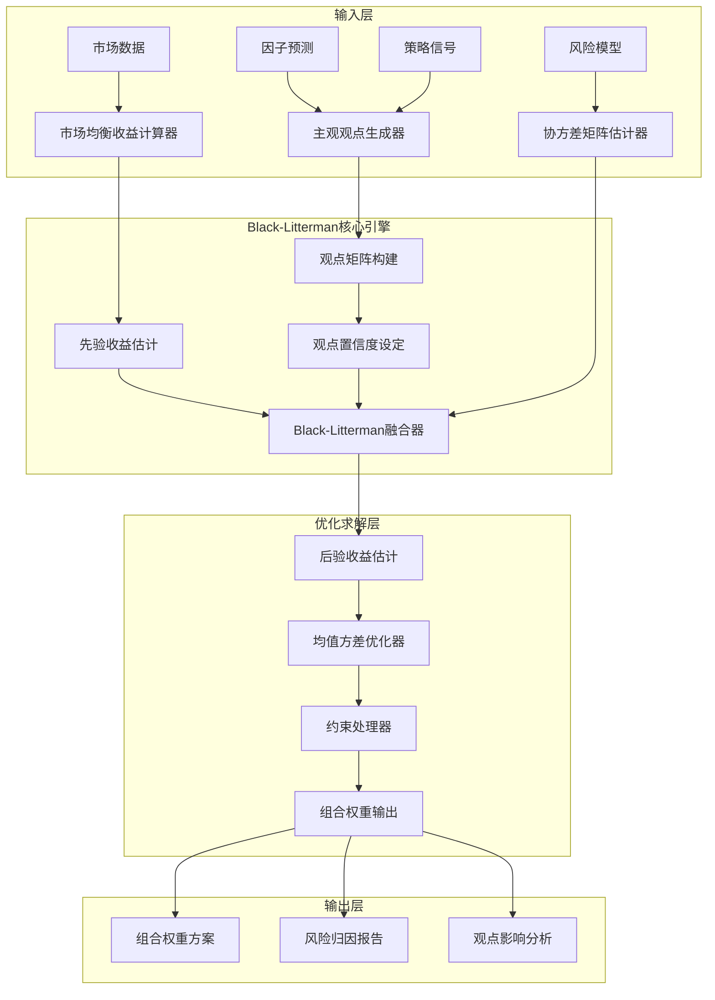

# Black-Litterman组合优化模型蓝图

> 清风量化交易系统 v5.3 - Black-Litterman组合优化模型详细设计
> **索引**: `BLACK_LITTERMAN_001`
> **开发周期**: 2-3天（集成开源项目）
> **核心定位**: 结合市场均衡观点与投资者主观观点的组合优化模型，解决传统均值方差优化对输入参数敏感的问题
> **参考开源**: PyPortfolioOpt (4.2k+ ⭐) + Riskfolio-Lib (3.1k+ ⭐)
> **专业对标**: 文艺复兴科技、Two Sigma、Citadel等顶级量化机构标配模型

## 1. 概述

### 1.1 模块定位与目标

**Layer定位**: Layer 6 - 组合优化层（组合构建模块）

**核心价值**:
- 解决传统均值方差优化对预期收益率估计过于敏感的问题
- 结合市场均衡观点（先验）与投资者主观观点（后验）
- 提供更稳健、更符合实际的投资组合权重
- 专业机构广泛使用的核心组合优化模型

**业务价值**:
- 提升组合优化结果的稳定性和可解释性
- 允许投资者融入专业判断和市场洞察
- 降低因参数估计误差导致的优化偏差
- 适合个人投资者结合自身研究观点

### 1.2 版本信息

| 项目 | 内容 |
|------|------|
| **模块ID** | BLACK_LITTERMAN_MODEL_001 |
| **版本** | v1.0.0 |
| **状态** | Active |
| **创建日期** | 2026-04-06 |
| **最后更新** | 2026-04-06 |
| **开源依赖** | PyPortfolioOpt, Riskfolio-Lib |
| **预计工时** | 2-3天 |

### 1.3 与现有模块关系

| 关系类型 | 模块名称 | module_id | 集成方式 |
|---------|---------|-----------|---------|
| **输入依赖** | 因子库模块 | FACTOR_BACKTEST_001 | 获取因子预测信号作为主观观点 |
| **输入依赖** | 策略引擎模块 | STRAT_ENGINE_001 | 获取策略观点矩阵 |
| **输入依赖** | 数据源层 | Layer 0 | 获取市场数据计算均衡收益 |
| **输出目标** | 组合优化模块 | PORTFOLIO_OPTIMIZATION_001 | 提供优化后的组合权重 |
| **输出目标** | 风险预算系统 | SIMPLIFIED_RISK_BUDGET_SYSTEM_001 | 提供风险贡献分析 |

---

## 2. 架构设计

### 2.1 Layer定位与职责边界

**Layer 6 - 组合优化层架构**:

```
Layer 6: 组合优化层
├── 6.1 组合构建模块
│   ├── 组合优化器 (PORTFOLIO_OPTIMIZATION_001)
│   ├── Black-Litterman模型 (BLACK_LITTERMAN_MODEL_001) ← 本模块
│   ├── 风险平价策略 (RISK_PARITY_STRATEGY_001)
│   └── 多资产配置 (MULTI_ASSET_ALLOCATION_001)
├── 6.2 约束求解模块
│   ├── 约束求解器 (CONSTRAINT_SOLVER_001)
│   └── 多目标优化 (MULTI_OBJECTIVE_OPTIMIZATION_001)
└── 6.3 风险预算模块
    ├── 风险预算系统 (SIMPLIFIED_RISK_BUDGET_SYSTEM_001)
    └── 层级风险预算 (HIERARCHICAL_RISK_BUDGET_001)
```

**职责边界**:
- ✅ **负责**: 市场均衡收益计算、主观观点矩阵构建、后验收益估计、组合权重优化
- ❌ **不负责**: 因子计算（因子库负责）、策略信号生成（策略引擎负责）、风险预算分配（风险预算系统负责）

### 2.2 核心组件架构



### 2.3 数据流设计

**核心数据流**:

```
市场数据 → 市场均衡收益 (π)
         ↓
主观观点 (Q) + 观点矩阵 (P) + 置信度 (Ω)
         ↓
Black-Litterman融合
         ↓
后验收益 (E[R]) + 后验协方差 (Σ')
         ↓
均值方差优化
         ↓
最优组合权重 (w*)
```

---

## 3. 技术实现

### 3.1 开源项目集成方案

#### 3.1.1 PyPortfolioOpt集成（推荐）

**优势**:
- 成熟稳定，4.2k+ GitHub Stars
- 完整的Black-Litterman实现
- 与现有系统技术栈兼容（Python + Pandas + NumPy）
- 文档完善，社区活跃

**核心API**:

```python
from pypfopt import BlackLittermanModel
from pypfopt.black_litterman import market_implied_prior_returns
from pypfopt import risk_models, expected_returns

class BlackLittermanOptimizer:
    """
    Black-Litterman优化器
    
    索引: BLACK_LITTERMAN_001-M01
    职责: 基于PyPortfolioOpt实现Black-Litterman组合优化
    输入: 市场数据、主观观点、协方差矩阵
    输出: 优化后的组合权重
    """
    
    def __init__(self, risk_free_rate: float = 0.02):
        self.risk_free_rate = risk_free_rate
        
    def calculate_market_equilibrium_returns(
        self,
        market_prices: pd.DataFrame,
        market_caps: dict,
        risk_aversion: float = 2.5
    ) -> pd.Series:
        """
        计算市场均衡收益（先验）
        
        Args:
            market_prices: 市场价格数据
            market_caps: 各资产市值
            risk_aversion: 风险厌恶系数
            
        Returns:
            市场均衡收益序列
        """
        S = risk_models.CovarianceShrinkage(market_prices).ledoit_wolf()
        pi = market_implied_prior_returns(market_caps, risk_aversion, S)
        return pi
    
    def build_views_matrix(
        self,
        assets: list,
        views: dict,
        confidence: dict
    ) -> tuple:
        """
        构建观点矩阵
        
        Args:
            assets: 资产列表
            views: 观点字典，格式 {'asset1': 0.05, 'asset2': -0.03}
            confidence: 置信度字典，格式 {'asset1': 0.8, 'asset2': 0.6}
            
        Returns:
            (P, Q, Omega): 观点矩阵、观点向量、置信度矩阵
        """
        n_assets = len(assets)
        n_views = len(views)
        
        P = np.zeros((n_views, n_assets))
        Q = np.zeros(n_views)
        Omega = np.zeros((n_views, n_views))
        
        for i, (asset, view) in enumerate(views.items()):
            asset_idx = assets.index(asset)
            P[i, asset_idx] = 1
            Q[i] = view
            Omega[i, i] = 1 / confidence[asset]
            
        return P, Q, Omega
    
    def optimize_portfolio(
        self,
        market_prices: pd.DataFrame,
        market_caps: dict,
        views: dict,
        confidence: dict,
        risk_aversion: float = 2.5
    ) -> dict:
        """
        执行Black-Litterman优化
        
        Args:
            market_prices: 市场价格数据
            market_caps: 市值字典
            views: 主观观点
            confidence: 观点置信度
            risk_aversion: 风险厌恶系数
            
        Returns:
            优化结果字典，包含权重、预期收益、风险指标
        """
        assets = list(market_prices.columns)
        
        pi = self.calculate_market_equilibrium_returns(
            market_prices, market_caps, risk_aversion
        )
        
        S = risk_models.CovarianceShrinkage(market_prices).ledoit_wolf()
        
        P, Q, Omega = self.build_views_matrix(assets, views, confidence)
        
        bl = BlackLittermanModel(
            S, 
            pi=pi, 
            P=P, 
            Q=Q, 
            Omega=Omega,
            risk_aversion=risk_aversion
        )
        
        bl_returns = bl.bl_returns()
        bl_cov = bl.bl_cov()
        
        from pypfopt import EfficientFrontier
        ef = EfficientFrontier(bl_returns, bl_cov)
        weights = ef.max_sharpe()
        
        cleaned_weights = ef.clean_weights()
        
        performance = ef.portfolio_performance()
        
        return {
            'weights': cleaned_weights,
            'expected_return': performance[0],
            'volatility': performance[1],
            'sharpe_ratio': performance[2],
            'bl_returns': bl_returns,
            'bl_covariance': bl_cov
        }
```

#### 3.1.2 Riskfolio-Lib集成（备选）

**优势**:
- 功能更全面，支持更多风险度量
- 提供完整的Black-Litterman教程
- 支持因子模型集成

**核心API**:

```python
import riskfolio as rp

class RiskfolioBlackLittermanOptimizer:
    """
    基于Riskfolio-Lib的Black-Litterman优化器
    
    索引: BLACK_LITTERMAN_001-M02
    职责: 使用Riskfolio-Lib实现Black-Litterman优化
    """
    
    def optimize_with_riskfolio(
        self,
        returns: pd.DataFrame,
        views: dict,
        confidence: dict
    ) -> dict:
        """
        使用Riskfolio-Lib执行Black-Litterman优化
        
        Args:
            returns: 资产收益率数据
            views: 主观观点
            confidence: 观点置信度
            
        Returns:
            优化结果
        """
        port = rp.Portfolio(returns=returns)
        port.assets_stats(method_mu='hist', method_cov='hist')
        
        bl_mu, bl_cov = rp.black_litterman(
            returns,
            views=views,
            confidence=confidence
        )
        
        port.mu = bl_mu
        port.cov = bl_cov
        
        w = port.optimization(
            model='Classic',
            rm='MV',
            obj='Sharpe',
            rf=0.02
        )
        
        return w
```

### 3.2 关键算法实现

#### 3.2.1 市场均衡收益计算

**理论基础**:
根据CAPM模型，市场均衡收益可以通过反向优化获得：

```
π = δ * Σ * w_market
```

其中：
- π: 市场均衡收益向量
- δ: 风险厌恶系数（通常取2.5）
- Σ: 协方差矩阵
- w_market: 市场权重（基于市值）

**实现代码**:

```python
def market_implied_prior_returns(
    market_caps: dict,
    risk_aversion: float,
    cov_matrix: np.ndarray
) -> np.ndarray:
    """
    计算市场隐含均衡收益
    
    Args:
        market_caps: 各资产市值字典
        risk_aversion: 风险厌恶系数
        cov_matrix: 协方差矩阵
        
    Returns:
        市场均衡收益向量
    """
    total_cap = sum(market_caps.values())
    market_weights = np.array([cap / total_cap for cap in market_caps.values()])
    
    pi = risk_aversion * np.dot(cov_matrix, market_weights)
    
    return pi
```

#### 3.2.2 Black-Litterman公式

**核心公式**:

```
E[R] = [(τΣ)^(-1) + P'Ω^(-1)P]^(-1) * [(τΣ)^(-1)π