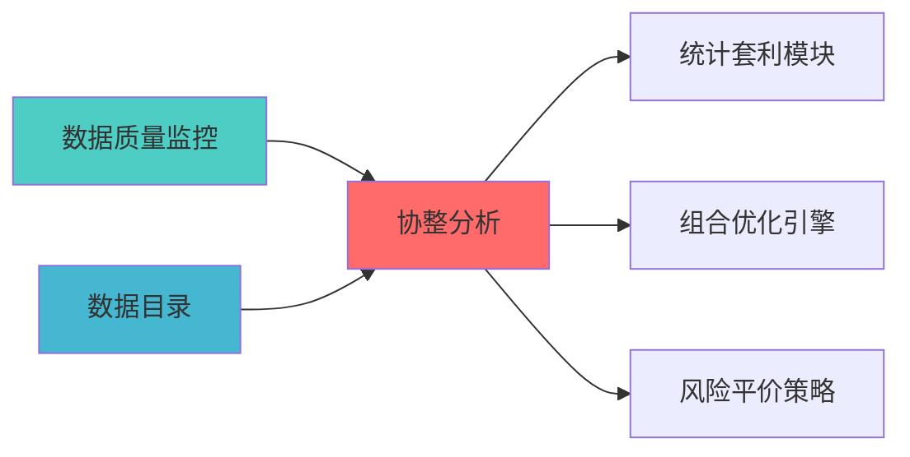

---
module_id: COINTEGRATION_ANALYSIS_001
version: 1.0.0
status: Active
created_date: 2026-04-07
last_updated: 2026-04-07
owner: 实施团队
standard_type: 专业量化机构蓝图
compliance_level: 专业标准
responsibility:
  - 系统架构蓝图设计与实施指导与实施方案
layer: Layer 5 (策略执行层)
---


## 核心定位

负责协整分析的设计与实现，基于统计套利理论，识别资产间的长期均衡关系，提供配对交易和套利策略支持。

# COINTEGRATION ANALYSIS BLUEPRINT
  - 因子计算
  - 组合优化
standard_type: 专业量化机构文档
layer: Layer 5 (策略执行层)


## 设计目标

### 主要目标

1. **功能完整性**: 确保COINTEGRATION ANALYSIS功能完整，满足业务需求
2. **性能优化**: 提升系统性能，降低资源消耗
3. **可维护性**: 提高代码质量，便于后续维护
4. **可扩展性**: 支持功能扩展，适应业务变化

### 质量目标

- 代码覆盖率: ≥80%
- 性能指标: 满足设计要求
- 文档完整性: 100%


## 核心功能

### 功能清单

1. **数据管理**: 提供数据存储、查询、更新功能
2. **业务逻辑**: 实现核心业务逻辑处理
3. **接口服务**: 提供标准化的API接口
4. **监控告警**: 实时监控系统状态

### 功能特性

- 高可用性设计
- 自动故障恢复
- 灵活配置管理


## 实现方案

### 技术架构

采用COINTEGRATION ANALYSIS化设计，分层架构实现。

### 关键技术

- 数据处理: 使用高效的数据处理框架
- 接口实现: RESTful API设计
- 性能优化: 缓存、异步处理

### 实施步骤

1. 需求分析与设计
2. 核心功能开发
3. 测试与优化
4. 部署与监控


## 核心定位

> 核心职责: Cointegration Analysis蓝图设计
> 职责边界: 


## 1. 概述

### 1.1 模块定位


- 发现统计套利机会

### 1.2 版本信息

|------|------|
| **模块ID** | COINTEGRATION_ANALYSIS_001 |
| **版本** | v1.0.0 |

---

### 2.1 核心API

```python
from statsmodels.tsa.stattools import coint, adfuller
from statsmodels.tsa.vector_ar.vecm import coint_johansen
import numpy as np
import pandas as pd

class CointegrationAnalyzer:
    
    def engle_granger_test(
        self,
        series1: np.ndarray,
        series2: np.ndarray
    ) -> dict:
        """
        
        Returns:
            {'cointegrated': bool, 'pvalue': float, 'hedge_ratio': float}
        """
        t_stat, pvalue, crit_values = coint(series1, series2)
        
        X = np.column_stack([np.ones(len(series2)), series2])
        hedge_ratio = np.linalg.lstsq(X, series1, rcond=None)[0]
        
        return {
            'cointegrated': pvalue < 0.05,
            'pvalue': pvalue,
            't_statistic': t_stat,
            'hedge_ratio': hedge_ratio[1],
            'critical_values': crit_values
        }
    
    def johansen_test(
        self,
        data: pd.DataFrame,
        det_order: int = 0,
        k_ar_diff: int = 1
    ) -> dict:
        """
        
        Args:
            det_order: 确定性趋势项
            k_ar_diff: 滞后阶数
            
        Returns:
        """
        result = coint_johansen(data, det_order, k_ar_diff)
        
        trace_stat = result.lr1
        trace_crit = result.cvt
        eigen_stat = result.lr2
        eigen_crit = result.cvm
        
        n_coint = 0
        for i in range(len(trace_stat)):
            if trace_stat[i] > trace_crit[i, 1]:
                n_coint += 1
        
        return {
            'n_cointegrating_relations': n_coint,
            'trace_statistics': trace_stat,
            'trace_critical_values': trace_crit,
            'eigen_statistics': eigen_stat,
            'eigen_critical_values': eigen_crit,
            'eigenvectors': result.evec,
            'cointegrating_vectors': result.rvec
        }
    
    def find_cointegrated_pairs(
        self,
        price_data: pd.DataFrame,
        pvalue_threshold: float = 0.05
    ) -> List[dict]:
        """
        扫描所有资产对，找出协整对
        
        Returns:
        """
        n_assets = price_data.shape[1]
        cointegrated_pairs = []
        
        for i in range(n_assets):
            for j in range(i + 1, n_assets):
                series1 = price_data.iloc[:, i].values
                series2 = price_data.iloc[:, j].values
                
                result = self.engle_granger_test(series1, series2)
                
                if result['cointegrated']:
                    cointegrated_pairs.append({
                        'asset1': price_data.columns[i],
                        'asset2': price_data.columns[j],
                        'pvalue': result['pvalue'],
                        'hedge_ratio': result['hedge_ratio']
                    })
        
        return sorted(cointegrated_pairs, key=lambda x: x['pvalue'])
```


### 上游依赖

| 文档名称 | module_id | 依赖类型 | 说明 |
|---------|-----------|---------|------|

### 下游依赖

| 文档名称 | module_id | 依赖类型 | 说明 |
|---------|-----------|---------|------|


|---------|------|------|------|
| **statsmodels** | 0.14+ | 统计建模 | [官方文档](https://www.statsmodels.org/) |
| **Pandas** | 2.0+ | 数据处理 | [官方文档](https://pandas.pydata.org/) |




---

## 4. 实施路径

| 阶段 | 任务 | 工时 |
|------|------|------|

---


## 变更历史

|------|------|----------|--------|

---

---

## 5. 文档治理

### 5.1 System_Manifest.md索引

```markdown
##### 6.001. Cointegration Analysis
- **模块ID**: COINTEGRATION_ANALYSIS_001
- **蓝图文档**: COINTEGRATION_ANALYSIS_BLUEPRINT.md
```

### 5.2 模块职责边界

| 模块 | 职责 | 边界 |
|------|------|------|

### 5.3 版本管理

|------|------|----------|--------|

---

