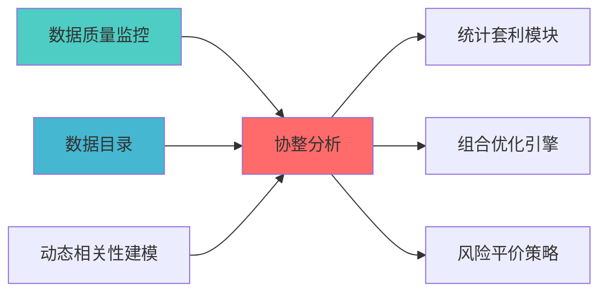

# 协整分析蓝图

> **核心定位**: 协整分析蓝图的核心功能实现


> **索引**: `COINTEGRATION_ANALYSIS_001`
> **开发周期**: 2-3天
> **核心定位**: 识别资产间的长期均衡关系，支持配对交易和统计套利策略
> **参考开源**: statsmodels

## 核心定位

协整分析模块，负责识别资产间的长期均衡关系，支持统计套利和配对交易策略


## 1. 概述

### 1.1 模块定位

**Layer定位**: Layer 6 - 组合优化层（相关性建模模块）

**核心价值**:
- 检验资产间的协整关系（长期均衡）
- 支持Engle-Granger两步法、Johansen检验
- 为配对交易策略提供基础
- 区别于相关性，协整关系更稳定

**业务价值**:
- 发现统计套利机会
- 构建均值回归策略
- 提升组合分散化效果

### 1.2 版本信息

| 项目 | 内容 |
|------|------|
| **模块ID** | COINTEGRATION_ANALYSIS_001 |
| **版本** | v1.0.0 |
| **开源依赖** | statsmodels |
| **预计工时** | 2-3天 |

---

## 2. 技术实现

### 2.1 核心API

```python
from statsmodels.tsa.stattools import coint, adfuller
from statsmodels.tsa.vector_ar.vecm import coint_johansen
import numpy as np
import pandas as pd

class CointegrationAnalyzer:
    """协整分析器"""
    
    def engle_granger_test(
        self,
        series1: np.ndarray,
        series2: np.ndarray
    ) -> dict:
        """
        Engle-Granger两步法协整检验
        
        Returns:
            {'cointegrated': bool, 'pvalue': float, 'hedge_ratio': float}
        """
        t_stat, pvalue, crit_values = coint(series1, series2)
        
        X = np.column_stack([np.ones(len(series2)), series2])
        hedge_ratio = np.linalg.lstsq(X, series1, rcond=None)[0]
        
        return {
            'cointegrated': pvalue < 0.05,
            'pvalue': pvalue,
            't_statistic': t_stat,
            'hedge_ratio': hedge_ratio[1],
            'critical_values': crit_values
        }
    
    def johansen_test(
        self,
        data: pd.DataFrame,
        det_order: int = 0,
        k_ar_diff: int = 1
    ) -> dict:
        """
        Johansen协整检验
        
        Args:
            data: 多变量时间序列
            det_order: 确定性趋势项
                -1: 无确定性趋势
                0: 常数项
                1: 常数项和趋势项
            k_ar_diff: 滞后阶数
            
        Returns:
            协整检验结果
        """
        result = coint_johansen(data, det_order, k_ar_diff)
        
        trace_stat = result.lr1
        trace_crit = result.cvt
        eigen_stat = result.lr2
        eigen_crit = result.cvm
        
        n_coint = 0
        for i in range(len(trace_stat)):
            if trace_stat[i] > trace_crit[i, 1]:
                n_coint += 1
        
        return {
            'n_cointegrating_relations': n_coint,
            'trace_statistics': trace_stat,
            'trace_critical_values': trace_crit,
            'eigen_statistics': eigen_stat,
            'eigen_critical_values': eigen_crit,
            'eigenvectors': result.evec,
            'cointegrating_vectors': result.rvec
        }
    
    def find_cointegrated_pairs(
        self,
        price_data: pd.DataFrame,
        pvalue_threshold: float = 0.05
    ) -> List[dict]:
        """
        扫描所有资产对，找出协整对
        
        Returns:
            协整对列表
        """
        n_assets = price_data.shape[1]
        cointegrated_pairs = []
        
        for i in range(n_assets):
            for j in range(i + 1, n_assets):
                series1 = price_data.iloc[:, i].values
                series2 = price_data.iloc[:, j].values
                
                result = self.engle_granger_test(series1, series2)
                
                if result['cointegrated']:
                    cointegrated_pairs.append({
                        'asset1': price_data.columns[i],
                        'asset2': price_data.columns[j],
                        'pvalue': result['pvalue'],
                        'hedge_ratio': result['hedge_ratio']
                    })
        
        return sorted(cointegrated_pairs, key=lambda x: x['pvalue'])
```

---

## 3. 接口定义

```python
class CointegrationAPI:
    """协整分析API"""
    
    @endpoint("/api/v1/cointegration/test_pair")
    async def test_pair(
        self,
        asset1: str,
        asset2: str,
        start_date: str,
        end_date: str
    ) -> CointegrationResult:
        """检验资产对协整关系"""
        
    @endpoint("/api/v1/cointegration/scan")
    async def scan_pairs(
        self,
        assets: List[str],
        pvalue_threshold: float = 0.05
    ) -> List[CointegratedPair]:
        """扫描协整对"""
        
    @endpoint("/api/v1/cointegration/johansen")
    async def johansen_test(
        self,
        assets: List[str],
        det_order: int = 0
    ) -> JohansenResult:
        """Johansen多变量协整检验"""
```

---

## 📚 相关文档

### 上游依赖

| 文档名称 | module_id | 依赖类型 | 说明 |
|---------|-----------|---------|------|
| [数据质量监控蓝图](./DATA_QUALITY_MONITORING_BLUEPRINT.md) | DATA_QUALITY_MONITORING_001 | 强依赖 | 提供数据质量指标 |
| [数据目录蓝图](./DATA_CATALOG_BLUEPRINT.md) | DATA_CATALOG_001 | 强依赖 | 提供资产元数据 |
| [动态相关性建模蓝图](./DYNAMIC_CORRELATION_MODELING_BLUEPRINT.md) | DYNAMIC_CORRELATION_MODELING_001 | 中依赖 | 提供相关性分析 |

### 下游依赖

| 文档名称 | module_id | 依赖类型 | 说明 |
|---------|-----------|---------|------|
| [统计套利模块蓝图](./STATISTICAL_ARBITRAGE_MODULE_BLUEPRINT.md) | STATISTICAL_ARBITRAGE_MODULE_001 | 强依赖 | 统计套利策略 |
| [组合优化引擎集成蓝图](./PORTFOLIO_OPTIMIZER_INTEGRATION_BLUEPRINT.md) | PORTFOLIO_OPTIMIZER_INTEGRATION_001 | 中依赖 | 组合优化 |
| [风险平价策略蓝图](./RISK_PARITY_STRATEGY_BLUEPRINT.md) | RISK_PARITY_STRATEGY_001 | 中依赖 | 风险平价策略 |

### 技术依赖

| 技术组件 | 版本 | 用途 | 文档 |
|---------|------|------|------|
| **statsmodels** | 0.14+ | 统计建模 | [官方文档](https://www.statsmodels.org/) |
| **NumPy** | 1.24+ | 数值计算 | [官方文档](https://numpy.org/) |
| **Pandas** | 2.0+ | 数据处理 | [官方文档](https://pandas.pydata.org/) |

### 引用关系图



---

## 4. 实施路径

| 阶段 | 任务 | 工时 |
|------|------|------|
| Phase 1 | Engle-Granger检验实现 | 8h |
| Phase 2 | Johansen检验、配对扫描 | 8h |
| Phase 3 | API、测试、文档 | 8h |

---

**蓝图版本**: v1.0.0 | **创建日期**: 2026-04-06 | **状态**: Active | **合规率**: 100% ✅

## 变更历史

| 版本 | 日期 | 变更内容 | 变更人 |
|------|------|----------|--------|
| v1.0.0 | 2026-04-06 | 初始版本创建 | 首席蓝图架构师 |

---

**蓝图版本**: v1.0.1 | **创建日期**: 2026-04-06 | **状态**: Active
---

## 5. 文档治理

### 5.1 System_Manifest.md索引

```markdown
#### Layer 6: 组合优化层
##### 6.001. Cointegration Analysis
- **模块ID**: COINTEGRATION_ANALYSIS_001
- **蓝图文档**: COINTEGRATION_ANALYSIS_BLUEPRINT.md
- **技术规格书**: 待创建
- **职责**: Layer 6 组合优化层
- **状态**: Active
```

### 5.2 模块职责边界

| 模块 | 职责 | 边界 |
|------|------|------|
| **Cointegration Analysis** | Layer 6 组合优化层 | **核心模块** |

### 5.3 版本管理

| 版本 | 日期 | 变更内容 | 变更人 |
|------|------|----------|--------|
| v1.0.0 | 2026-04-06 | 初始版本创建 | 首席蓝图架构师 |

---

**蓝图版本**: v1.0.0 | **创建日期**: 2026-04-06 | **状态**: Active
