---
module_id: COINTEGRATION_ANALYSIS_001
version: 1.0.0
status: Active
created_date: 2026-04-07
last_updated: 2026-04-07
owner: 实施团队
standard_type: 专业量化机构蓝图
applicable_scope: Layer 2 Alpha因子å±?
compliance_level: 专业标准
responsibility:
  - 协整分析
  - 协整关系检éª?
  - 配对交易识别
  - 统计套利
layer: Layer 5 (策略执行层)
---


## 核心定位

负责协整分析的设计与实现，基于统计套利理论，识别资产间的长期均衡关系，提供配对交易和套利策略支持。

# COINTEGRATION ANALYSIS BLUEPRINT
  - 因子计算
  - 组合优化
standard_type: 专业量化机构文档
layer: Layer 5 (策略执行层)
ï»? 协整分析蓝图

> **核心定位**: 协整分析蓝图的核心功能实çŽ?


> **索引**: `COINTEGRATION_ANALYSIS_001`
> **开发周æœ?*: 2-3å¤?
> **核心定位**: 识别资产间的长期均衡关系，支持配对交易和统计套利策略
> **参考开æº?*: statsmodels

## 设计目标

### 主要目标

1. **功能完整性**: 确保COINTEGRATION ANALYSIS功能完整，满足业务需求
2. **性能优化**: 提升系统性能，降低资源消耗
3. **可维护性**: 提高代码质量，便于后续维护
4. **可扩展性**: 支持功能扩展，适应业务变化

### 质量目标

- 代码覆盖率: ≥80%
- 性能指标: 满足设计要求
- 文档完整性: 100%


## 核心功能

### 功能清单

1. **数据管理**: 提供数据存储、查询、更新功能
2. **业务逻辑**: 实现核心业务逻辑处理
3. **接口服务**: 提供标准化的API接口
4. **监控告警**: 实时监控系统状态

### 功能特性

- 高可用性设计
- 自动故障恢复
- 灵活配置管理


## 实现方案

### 技术架构

采用COINTEGRATION ANALYSIS化设计，分层架构实现。

### 关键技术

- 数据处理: 使用高效的数据处理框架
- 接口实现: RESTful API设计
- 性能优化: 缓存、异步处理

### 实施步骤

1. 需求分析与设计
2. 核心功能开发
3. 测试与优化
4. 部署与监控


## 核心定位

> 核心职责: Cointegration Analysis蓝图设计
> 职责边界: 
> - âœ?本文档负责：Cointegration Analysis蓝图设计相关内容
> - â?本文档不负责：其他模块内容，确保系统功能的稳定运行和高效执行ã€?


## 1. 概述

### 1.1 模块定位

**Layer定位**: Layer 6 - 组合优化层（相关性建模模块）

**核心价å€?*:
- 检验资产间的协整关系（长期均衡ï¼?
- 支持Engle-Granger两步法、Johansen检éª?
- 为配对交易策略提供基础
- 区别于相关性，协整关系更稳å®?

**业务价å€?*:
- 发现统计套利机会
- 构建均值回归策ç•?
- 提升组合分散化效æž?

### 1.2 版本信息

| 项目 | 内容 |
|------|------|
| **模块ID** | COINTEGRATION_ANALYSIS_001 |
| **版本** | v1.0.0 |
| **开源依èµ?* | statsmodels |
| **预计工时** | 2-3å¤?|

---
## 2. 技术实çŽ?

### 2.1 核心API

```python
from statsmodels.tsa.stattools import coint, adfuller
from statsmodels.tsa.vector_ar.vecm import coint_johansen
import numpy as np
import pandas as pd

class CointegrationAnalyzer:
    """协整分析å™?""
    
    def engle_granger_test(
        self,
        series1: np.ndarray,
        series2: np.ndarray
    ) -> dict:
        """
        Engle-Granger两步法协整检éª?
        
        Returns:
            {'cointegrated': bool, 'pvalue': float, 'hedge_ratio': float}
        """
        t_stat, pvalue, crit_values = coint(series1, series2)
        
        X = np.column_stack([np.ones(len(series2)), series2])
        hedge_ratio = np.linalg.lstsq(X, series1, rcond=None)[0]
        
        return {
            'cointegrated': pvalue < 0.05,
            'pvalue': pvalue,
            't_statistic': t_stat,
            'hedge_ratio': hedge_ratio[1],
            'critical_values': crit_values
        }
    
    def johansen_test(
        self,
        data: pd.DataFrame,
        det_order: int = 0,
        k_ar_diff: int = 1
    ) -> dict:
        """
        Johansen协整检éª?
        
        Args:
            data: 多变量时间序åˆ?
            det_order: 确定性趋势项
                -1: 无确定性趋åŠ?
                0: 常数é¡?
                1: 常数项和趋势é¡?
            k_ar_diff: 滞后阶数
            
        Returns:
            协整检验结æž?
        """
        result = coint_johansen(data, det_order, k_ar_diff)
        
        trace_stat = result.lr1
        trace_crit = result.cvt
        eigen_stat = result.lr2
        eigen_crit = result.cvm
        
        n_coint = 0
        for i in range(len(trace_stat)):
            if trace_stat[i] > trace_crit[i, 1]:
                n_coint += 1
        
        return {
            'n_cointegrating_relations': n_coint,
            'trace_statistics': trace_stat,
            'trace_critical_values': trace_crit,
            'eigen_statistics': eigen_stat,
            'eigen_critical_values': eigen_crit,
            'eigenvectors': result.evec,
            'cointegrating_vectors': result.rvec
        }
    
    def find_cointegrated_pairs(
        self,
        price_data: pd.DataFrame,
        pvalue_threshold: float = 0.05
    ) -> List[dict]:
        """
        扫描所有资产对，找出协整对
        
        Returns:
            协整对列è¡?
        """
        n_assets = price_data.shape[1]
        cointegrated_pairs = []
        
        for i in range(n_assets):
            for j in range(i + 1, n_assets):
                series1 = price_data.iloc[:, i].values
                series2 = price_data.iloc[:, j].values
                
                result = self.engle_granger_test(series1, series2)
                
                if result['cointegrated']:
                    cointegrated_pairs.append({
                        'asset1': price_data.columns[i],
                        'asset2': price_data.columns[j],
                        'pvalue': result['pvalue'],
                        'hedge_ratio': result['hedge_ratio']
                    })
        
        return sorted(cointegrated_pairs, key=lambda x: x['pvalue'])
```


## 📚 相关文档

### 上游依赖

| 文档名称 | module_id | 依赖类型 | 说明 |
|---------|-----------|---------|------|
| [数据质量监控蓝图](./DATA_QUALITY_MONITORING_BLUEPRINT.md) | DATA_QUALITY_MONITORING_001 | 强依èµ?| 提供数据质量指标 |
| [数据目录蓝图](./DATA_CATALOG_BLUEPRINT.md) | DATA_CATALOG_001 | 强依èµ?| 提供资产元数æ?|
| [动态相关性建模蓝图](./DYNAMIC_CORRELATION_MODELING_BLUEPRINT.md) | DYNAMIC_CORRELATION_MODELING_001 | 中依èµ?| 提供相关性分æž?|

### 下游依赖

| 文档名称 | module_id | 依赖类型 | 说明 |
|---------|-----------|---------|------|
| [统计套利模块蓝图](./STATISTICAL_ARBITRAGE_MODULE_BLUEPRINT.md) | STATISTICAL_ARBITRAGE_MODULE_001 | 强依èµ?| 统计套利策略 |
| [组合优化引擎集成蓝图](./PORTFOLIO_OPTIMIZER_INTEGRATION_BLUEPRINT.md) | PORTFOLIO_OPTIMIZER_INTEGRATION_001 | 中依èµ?| 组合优化 |
| [风险平价策略蓝图](./RISK_PARITY_STRATEGY_BLUEPRINT.md) | RISK_PARITY_STRATEGY_001 | 中依èµ?| 风险平价策略 |

### 技术依èµ?

| 技术组ä»?| 版本 | 用é€?| 文档 |
|---------|------|------|------|
| **statsmodels** | 0.14+ | 统计建模 | [官方文档](https://www.statsmodels.org/) |
| **NumPy** | 1.24+ | 数值计ç®?| [官方文档](https://numpy.org/) |
| **Pandas** | 2.0+ | 数据处理 | [官方文档](https://pandas.pydata.org/) |

### 引用关系å›?

```mermaid
graph LR
    A[数据质量监控] --> B[协整分析]
    C[数据目录] --> B
    D[动态相关性建模] --> B
    
    B --> E[统计套利模块]
    B --> F[组合优化引擎]
    B --> G[风险平价策略]
    
    style B fill:#ff6b6b
    style A fill:#4ecdc4
    style C fill:#45b7d1
```



---

## 4. 实施路径

| 阶段 | 任务 | 工时 |
|------|------|------|
| Phase 1 | Engle-Granger检验实çŽ?| 8h |
| Phase 2 | Johansen检验、配对扫æ?| 8h |
| Phase 3 | API、测试、文æ¡?| 8h |

---

**蓝图版本**: v1.0.0 | **创建日期**: 2026-04-06 | **状æ€?*: Active | **合规çŽ?*: 100% âœ?

## 变更历史

| 版本 | 日期 | 变更内容 | 变更äº?|
|------|------|----------|--------|
| v1.0.0 | 2026-04-06 | 初始版本创建 | 首席蓝图架构å¸?|

---

**蓝图版本**: v1.0.1 | **创建日期**: 2026-04-06 | **状æ€?*: Active
---

## 5. 文档治理

### 5.1 System_Manifest.md索引

```markdown
#### Layer 6: 组合优化å±?
##### 6.001. Cointegration Analysis
- **模块ID**: COINTEGRATION_ANALYSIS_001
- **蓝图文档**: COINTEGRATION_ANALYSIS_BLUEPRINT.md
- **技术规格书**: 待创å»?
- **职责**: Layer 6 组合优化å±?
- **状æ€?*: Active
```

### 5.2 模块职责边界

| 模块 | 职责 | 边界 |
|------|------|------|
| **Cointegration Analysis** | Layer 6 组合优化å±?| **核心模块** |

### 5.3 版本管理

| 版本 | 日期 | 变更内容 | 变更äº?|
|------|------|----------|--------|
| v1.0.0 | 2026-04-06 | 初始版本创建 | 首席蓝图架构å¸?|

---

**蓝图版本**: v1.0.0 | **创建日期**: 2026-04-06 | **状æ€?*: Active
