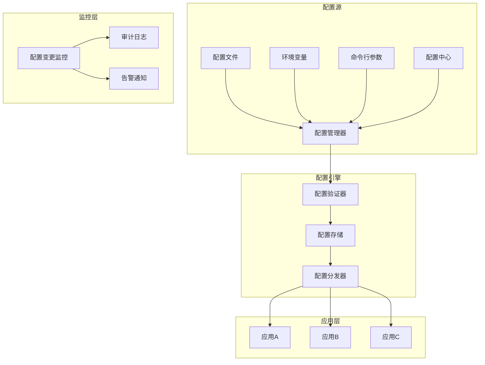

# 配置管理中心蓝图

> **核心职责**: 配置集中管理、版本控制、热更新
> **职责边界**: 
> - ✅ 本文档负责：配置管理、版本控制、热更新
> - ❌ 本文档不负责：密钥管理（由密钥管理系统负责）

## 核心定位

负责系统配置的管理和维护，提供配置的版本控制、环境管理和动态配置更新功能。

## 📋 执行摘要

本蓝图设计基于Consul和Etcd的配置管理中心，提供专业级配置管理能力，适合个人开发和AI维护。

**核心价值**:
- 配置集中管理
- 版本控制与回滚
- 热更新支持
- 环境隔离
- 配置审计

**开源方案**: Consul + Etcd + 自定义配置管理器

**预估工作量**: 30小时

---

## 1. 模块定位与目标

### 1.1 模块定位

**Layer定位**: Layer 1 - 数据预处理层（数据服务模块）

**核心价值**:
- 统一配置管理
- 动态配置更新
- 配置版本控制
- 环境隔离

**业务价值**:
- 提高运维效率
- 降低配置错误
- 支持快速迭代
- 提升系统灵活性

### 1.2 设计目标

| 目标 | 优先级 | 技术实现 |
|------|--------|----------|
| **配置集中管理** | P0 | Consul |
| **版本控制** | P0 | Git + Consul |
| **热更新** | P0 | Consul Watch |
| **环境隔离** | P1 | Consul Namespaces |
| **配置审计** | P1 | 自定义审计器 |

---

## 2. 系统架构设计

### 2.1 架构概览



### 2.2 核心组件

#### 2.2.1 配置管理器

**职责**: 管理配置生命周期

**核心功能**:
- 配置加载
- 配置验证
- 配置合并
- 配置导出

#### 2.2.2 配置存储

**职责**: 存储配置数据

**核心功能**:
- 配置持久化
- 版本控制
- 快速查询
- 高可用

#### 2.2.3 配置分发器

**职责**: 分发配置到应用

**核心功能**:
- 配置推送
- 热更新
- 配置同步
- 变更通知

---

## 3. 开源方案集成

### 3.1 Consul集成

**GitHub**: https://github.com/hashicorp/consul

**Star数**: 28k+

**核心特性**:
- 服务发现
- 配置管理
- 健康检查
- 多数据中心

**集成方式**:

```python
import consul
import json
from typing import Dict, Any, List
from datetime import datetime

class ConsulConfigManager:
    """Consul配置管理器"""
    
    def __init__(self, host='localhost', port=8500):
        self.client = consul.Consul(host=host, port=port)
        self.prefix = 'zephyr-alpha/config'
    
    def set_config(self, key: str, value: Any, environment: str = 'default'):
        """
        设置配置
        
        Args:
            key: 配置键
            value: 配置值
            environment: 环境名称
        
        Returns:
            bool: 是否成功
        """
        full_key = f"{self.prefix}/{environment}/{key}"
        
        if isinstance(value, (dict, list)):
            value = json.dumps(value)
        
        return self.client.kv.put(full_key, str(value))
    
    def get_config(self, key: str, environment: str = 'default'):
        """
        获取配置
        
        Args:
            key: 配置键
            environment: 环境名称
        
        Returns:
            Any: 配置值
        """
        full_key = f"{self.prefix}/{environment}/{key}"
        
        index, data = self.client.kv.get(full_key)
        
        if data is None:
            return None
        
        value = data['Value'].decode('utf-8')
        
        try:
            return json.loads(value)
        except json.JSONDecodeError:
            return value
    
    def get_all_configs(self, environment: str = 'default'):
        """
        获取所有配置
        
        Args:
            environment: 环境名称
        
        Returns:
            Dict: 所有配置
        """
        prefix = f"{self.prefix}/{environment}/"
        
        index, data = self.client.kv.get(prefix, recurse=True)
        
        configs = {}
        
        if data:
            for item in data:
                key = item['Key'].replace(prefix, '')
                value = item['Value'].decode('utf-8')
                
                try:
                    value = json.loads(value)
                except json.JSONDecodeError:
                    pass
                
                keys = key.split('/')
                current = configs
                
                for k in keys[:-1]:
                    if k not in current:
                        current[k] = {}
                    current = current[k]
                
                current[keys[-1]] = value
        
        return configs
    
    def delete_config(self, key: str, environment: str = 'default'):
        """
        删除配置
        
        Args:
            key: 配置键
            environment: 环境名称
        
        Returns:
            bool: 是否成功
        """
        full_key = f"{self.prefix}/{environment}/{key}"
        
        return self.client.kv.delete(full_key)
    
    def watch_config(self, key: str, callback, environment: str = 'default'):
        """
        监听配置变化
        
        Args:
            key: 配置键
            callback: 回调函数
            environment: 环境名称
        """
        full_key = f"{self.prefix}/{environment}/{key}"
        
        index = None
        
        while True:
            index, data = self.client.kv.get(full_key, index=index)
            
            if data is not None:
                value = data['Value'].decode('utf-8')
                
                try:
                    value = json.loads(value)
                except json.JSONDecodeError:
                    pass
                
                callback(key, value)
    
    def list_environments(self):
        """
        列出所有环境
        
        Returns:
            List: 环境列表
        """
        index, data = self.client.kv.get(self.prefix, keys=True)
        
        environments = set()
        
        if data:
            for key in data:
                parts = key.replace(f"{self.prefix}/", '').split('/')
                if parts:
                    environments.add(parts[0])
        
        return list(environments)


class ConfigValidator:
    """配置验证器"""
    
    def __init__(self, schema):
        self.schema = schema
    
    def validate(self, config: Dict[str, Any]):
        """
        验证配置
        
        Args:
            config: 配置字典
        
        Returns:
            Dict: 验证结果
        """
        errors = []
        
        for key, rules in self.schema.items():
            value = config.get(key)
            
            if rules.get('required', False) and value is None:
                errors.append({
                    'key': key,
                    'error': 'Required field is missing'
                })
                continue
            
            if value is not None:
                if 'type' in rules:
                    if not self._check_type(value, rules['type']):
                        errors.append({
                            'key': key,
                            'error': f"Type mismatch, expected {rules['type']}"
                        })
                
                if 'min' in rules and isinstance(value, (int, float)):
                    if value < rules['min']:
                        errors.append({
                            'key': key,
                            'error': f"Value {value} is less than minimum {rules['min']}"
                        })
                
                if 'max' in rules and isinstance(value, (int, float)):
                    if value > rules['max']:
                        errors.append({
                            'key': key,
                            'error': f"Value {value} is greater than maximum {rules['max']}"
                        })
                
                if 'enum' in rules:
                    if value not in rules['enum']:
                        errors.append({
                            'key': key,
                            'error': f"Value {value} not in allowed values {rules['enum']}"
                        })
        
        return {
            'valid': len(errors) == 0,
            'errors': errors
        }
    
    def _check_type(self, value, expected_type):
        """检查类型"""
        type_map = {
            'string': str,
            'integer': int,
            'float': float,
            'boolean': bool,
            'list': list,
            'dict': dict
        }
        
        expected = type_map.get(expected_type)
        
        if expected is None:
            return True
        
        return isinstance(value, expected)
```

### 3.2 Etcd集成

**GitHub**: https://github.com/etcd-io/etcd

**Star数**: 47k+

**核心特性**:
- 分布式键值存储
- 强一致性
- 高可用
- 监听机制

**集成方式**:

```python
import etcd3
from typing import Dict, Any, List

class EtcdConfigManager:
    """Etcd配置管理器"""
    
    def __init__(self, host='localhost', port=2379):
        self.client = etcd3.client(host=host, port=port)
        self.prefix = '/zephyr-alpha/config'
    
    def set_config(self, key: str, value: Any, environment: str = 'default'):
        """
        设置配置
        
        Args:
            key: 配置键
            value: 配置值
            environment: 环境名称
        
        Returns:
            bool: 是否成功
        """
        full_key = f"{self.prefix}/{environment}/{key}"
        
        if isinstance(value, (dict, list)):
            value = json.dumps(value)
        
        self.client.put(full_key, str(value))
        
        return True
    
    def get_config(self, key: str, environment: str = 'default'):
        """
        获取配置
        
        Args:
            key: 配置键
            environment: 环境名称
        
        Returns:
            Any: 配置值
        """
        full_key = f"{self.prefix}/{environment}/{key}"
        
        value, _ = self.client.get(full_key)
        
        if value is None:
            return None
        
        value = value.decode('utf-8')
        
        try:
            return json.loads(value)
        except json.JSONDecodeError:
            return value
    
    def get_all_configs(self, environment: str = 'default'):
        """
        获取所有配置
        
        Args:
            environment: 环境名称
        
        Returns:
            Dict: 所有配置
        """
        prefix = f"{self.prefix}/{environment}/"
        
        configs = {}
        
        for value, metadata in self.client.get_prefix(prefix):
            key = metadata.key.decode('utf-8').replace(prefix, '')
            value = value.decode('utf-8')
            
            try:
                value = json.loads(value)
            except json.JSONDecodeError:
                pass
            
            keys = key.split('/')
            current = configs
            
            for k in keys[:-1]:
                if k not in current:
                    current[k] = {}
                current = current[k]
            
            current[keys[-1]] = value
        
        return configs
    
    def watch_config(self, key: str, callback, environment: str = 'default'):
        """
        监听配置变化
        
        Args:
            key: 配置键
            callback: 回调函数
            environment: 环境名称
        """
        full_key = f"{self.prefix}/{environment}/{key}"
        
        events_iterator, cancel = self.client.watch(full_key)
        
        for event in events_iterator:
            if isinstance(event, etcd3.events.PutEvent):
                value = event.value.decode('utf-8')
                
                try:
                    value = json.loads(value)
                except json.JSONDecodeError:
                    pass
                
                callback(key, value)
```

### 3.3 配置版本控制

**技术栈**: Git + 自定义版本管理器

**核心功能**:
- 配置版本历史
- 版本回滚
- 变更追踪

```python
import git
import os
from typing import Dict, Any, List
from datetime import datetime

class ConfigVersionControl:
    """配置版本控制器"""
    
    def __init__(self, repo_path: str):
        self.repo_path = repo_path
        self.repo = git.Repo(repo_path) if os.path.exists(repo_path) else None
    
    def commit_config(self, message: str, config_files: List[str]):
        """
        提交配置变更
        
        Args:
            message: 提交消息
            config_files: 配置文件列表
        
        Returns:
            str: 提交ID
        """
        if self.repo is None:
            raise ValueError("Git repository not initialized")
        
        for file in config_files:
            self.repo.index.add([file])
        
        commit = self.repo.index.commit(message)
        
        return commit.hexsha
    
    def get_config_history(self, config_file: str, limit: int = 10):
        """
        获取配置历史
        
        Args:
            config_file: 配置文件路径
            limit: 历史记录数量限制
        
        Returns:
            List: 历史记录列表
        """
        if self.repo is None:
            raise ValueError("Git repository not initialized")
        
        history = []
        
        for commit in self.repo.iter_commits(paths=config_file, max_count=limit):
            history.append({
                'commit_id': commit.hexsha,
                'message': commit.message,
                'author': commit.author.name,
                'timestamp': datetime.fromtimestamp(commit.committed_date).isoformat()
            })
        
        return history
    
    def rollback_config(self, commit_id: str, config_file: str):
        """
        回滚配置
        
        Args:
            commit_id: 提交ID
            config_file: 配置文件路径
        
        Returns:
            bool: 是否成功
        """
        if self.repo is None:
            raise ValueError("Git repository not initialized")
        
        try:
            commit = self.repo.commit(commit_id)
            
            target_file = commit.tree[config_file]
            
            with open(os.path.join(self.repo_path, config_file), 'wb') as f:
                f.write(target_file.data_stream.read())
            
            return True
        except Exception as e:
            return False
    
    def diff_configs(self, commit_id1: str, commit_id2: str, config_file: str):
        """
        对比配置差异
        
        Args:
            commit_id1: 第一个提交ID
            commit_id2: 第二个提交ID
            config_file: 配置文件路径
        
        Returns:
            str: 差异内容
        """
        if self.repo is None:
            raise ValueError("Git repository not initialized")
        
        commit1 = self.repo.commit(commit_id1)
        commit2 = self.repo.commit(commit_id2)
        
        diff = commit1.tree[config_file].diff(commit2.tree[config_file])
        
        return diff.diff
```

---

## 4. 配置管理策略

### 4.1 配置层次结构

```yaml
config_hierarchy:
  - level: 1
    name: default
    description: 默认配置
    priority: 1
  
  - level: 2
    name: environment
    description: 环境配置
    priority: 2
    environments:
      - development
      - staging
      - production
  
  - level: 3
    name: service
    description: 服务配置
    priority: 3
  
  - level: 4
    name: instance
    description: 实例配置
    priority: 4
```

### 4.2 配置合并策略

```python
from typing import Dict, Any

class ConfigMerger:
    """配置合并器"""
    
    def __init__(self):
        pass
    
    def merge_configs(self, configs: List[Dict[str, Any]]):
        """
        合并多个配置
        
        Args:
            configs: 配置列表（按优先级从低到高）
        
        Returns:
            Dict: 合并后的配置
        """
        merged = {}
        
        for config in configs:
            merged = self._deep_merge(merged, config)
        
        return merged
    
    def _deep_merge(self, base: Dict, override: Dict):
        """深度合并"""
        result = base.copy()
        
        for key, value in override.items():
            if key in result and isinstance(result[key], dict) and isinstance(value, dict):
                result[key] = self._deep_merge(result[key], value)
            else:
                result[key] = value
        
        return result
```

### 4.3 环境隔离策略

```yaml
environment_isolation:
  development:
    config_prefix: dev
    database:
      host: localhost
      port: 5432
      name: zephyr_alpha_dev
  
  staging:
    config_prefix: staging
    database:
      host: staging-db.example.com
      port: 5432
      name: zephyr_alpha_staging
  
  production:
    config_prefix: prod
    database:
      host: prod-db.example.com
      port: 5432
      name: zephyr_alpha_prod
```

---

## 5. 配置热更新

### 5.1 热更新机制

```python
from typing import Callable, Dict, Any
import threading

class HotReloader:
    """配置热更新器"""
    
    def __init__(self, config_manager):
        self.config_manager = config_manager
        self.callbacks = {}
        self.watchers = {}
    
    def register_callback(self, key: str, callback: Callable):
        """
        注册配置变更回调
        
        Args:
            key: 配置键
            callback: 回调函数
        """
        if key not in self.callbacks:
            self.callbacks[key] = []
        
        self.callbacks[key].append(callback)
    
    def start_watching(self, key: str, environment: str = 'default'):
        """
        开始监听配置
        
        Args:
            key: 配置键
            environment: 环境名称
        """
        def watch_thread():
            self.config_manager.watch_config(
                key,
                lambda k, v: self._on_config_change(k, v),
                environment
            )
        
        watcher = threading.Thread(target=watch_thread, daemon=True)
        watcher.start()
        
        self.watchers[key] = watcher
    
    def _on_config_change(self, key: str, value: Any):
        """配置变更处理"""
        if key in self.callbacks:
            for callback in self.callbacks[key]:
                try:
                    callback(key, value)
                except Exception as e:
                    print(f"Callback error for key {key}: {e}")
```

### 5.2 应用集成

```python
class ConfigAwareApplication:
    """配置感知应用基类"""
    
    def __init__(self, config_manager, hot_reloader):
        self.config_manager = config_manager
        self.hot_reloader = hot_reloader
        self.config = {}
    
    def load_config(self, keys: List[str], environment: str = 'default'):
        """
        加载配置
        
        Args:
            keys: 配置键列表
            environment: 环境名称
        """
        for key in keys:
            self.config[key] = self.config_manager.get_config(key, environment)
            
            self.hot_reloader.register_callback(key, self._on_config_update)
            self.hot_reloader.start_watching(key, environment)
    
    def _on_config_update(self, key: str, value: Any):
        """配置更新回调"""
        self.config[key] = value
        
        self.on_config_change(key, value)
    
    def on_config_change(self, key: str, value: Any):
        """
        配置变更处理（子类实现）
        
        Args:
            key: 配置键
            value: 新值
        """
        pass
```

---

## 6. 配置审计

### 6.1 审计日志

```python
from datetime import datetime
from typing import Dict, Any

class ConfigAuditor:
    """配置审计器"""
    
    def __init__(self, config):
        self.config = config
        self.audit_log = []
    
    def log_config_change(self, event: Dict[str, Any]):
        """
        记录配置变更
        
        Args:
            event: 变更事件
        """
        audit_record = {
            'timestamp': datetime.now().isoformat(),
            'event_type': event.get('event_type', 'unknown'),
            'key': event.get('key', 'unknown'),
            'old_value': event.get('old_value'),
            'new_value': event.get('new_value'),
            'changed_by': event.get('changed_by', 'unknown'),
            'environment': event.get('environment', 'default'),
            'reason': event.get('reason', '')
        }
        
        self.audit_log.append(audit_record)
        
        self._store_audit_record(audit_record)
    
    def get_audit_history(self, key: str = None, limit: int = 100):
        """
        获取审计历史
        
        Args:
            key: 配置键（可选）
            limit: 记录数量限制
        
        Returns:
            List: 审计记录列表
        """
        if key:
            records = [r for r in self.audit_log if r['key'] == key]
        else:
            records = self.audit_log
        
        return records[-limit:]
    
    def _store_audit_record(self, record):
        """存储审计记录"""
        pass
```

---

## 7. 实施计划

### 7.1 阶段一：核心配置管理（12小时）

**目标**: 实现基础配置管理

**任务**:
- [ ] 集成Consul（4小时）
- [ ] 实现配置管理器（4小时）
- [ ] 实现配置验证器（4小时）

**交付物**:
- Consul集成
- 配置管理器
- 配置验证器

### 7.2 阶段二：版本控制（10小时）

**目标**: 实现配置版本控制

**任务**:
- [ ] 实现版本控制器（5小时）
- [ ] 实现配置合并器（3小时）
- [ ] 配置环境隔离（2小时）

**交付物**:
- 版本控制器
- 配置合并器
- 环境隔离配置

### 7.3 阶段三：热更新与审计（8小时）

**目标**: 实现热更新和审计

**任务**:
- [ ] 实现热更新器（4小时）
- [ ] 实现配置审计器（4小时）

**交付物**:
- 热更新器
- 配置审计器

---

## 8. 监控与运维

### 8.1 关键指标

| 指标 | 目标值 | 监控方式 |
|------|--------|----------|
| **配置更新延迟** | ≤1秒 | Consul监控 |
| **配置一致性** | 100% | 一致性检查 |
| **热更新成功率** | ≥99% | 应用监控 |
| **配置错误率** | ≤0.1% | 验证监控 |

### 8.2 运维任务

| 任务 | 频率 | 负责人 |
|------|------|--------|
| **检查配置一致性** | 每天 | 运维人员 |
| **审查配置变更** | 每周 | 运维人员 |
| **清理过期配置** | 每月 | 运维人员 |
| **备份配置** | 每天 | 自动化 |

---

## 9. 成本效益分析

### 9.1 开发成本

| 项目 | 工作量 | 成本 |
|------|--------|------|
| **核心配置管理** | 12小时 | ¥1,200 |
| **版本控制** | 10小时 | ¥1,000 |
| **热更新与审计** | 8小时 | ¥800 |
| **总计** | **30小时** | **¥3,000** |

### 9.2 收益评估

| 收益项 | 年化价值 |
|--------|----------|
| **提高运维效率** | ¥20,000 |
| **降低配置错误** | ¥15,000 |
| **支持快速迭代** | ¥10,000 |
| **总计** | **¥45,000** |

**ROI**: (45,000 - 3,000) / 3,000 = 1400%

---

## 10. 风险与缓解

### 10.1 技术风险

| 风险 | 影响 | 缓解措施 |
|------|------|----------|
| **配置中心故障** | 高 | 高可用部署 + 本地缓存 |
| **配置错误** | 中 | 配置验证 + 灰度发布 |
| **版本冲突** | 低 | 锁机制 + 冲突检测 |

### 10.2 业务风险

| 风险 | 影响 | 缓解措施 |
|------|------|----------|
| **配置泄露** | 高 | 加密存储 + 访问控制 |
| **误操作** | 中 | 权限控制 + 审批流程 |
| **环境混淆** | 中 | 环境标识 + 访问隔离 |

---

## 11. 后续优化方向

### 11.1 短期优化（1-3个月）

- [ ] 增强配置验证
- [ ] 优化热更新性能
- [ ] 完善审计功能

### 11.2 中期优化（3-6个月）

- [ ] 配置模板化
- [ ] 配置依赖管理
- [ ] 配置可视化

### 11.3 长期优化（6-12个月）

- [ ] 智能配置推荐
- [ ] 配置自动化测试
- [ ] 配置自愈

---

## 12. 参考资料

### 12.1 开源项目

- [Consul](https://github.com/hashicorp/consul)
- [Etcd](https://github.com/etcd-io/etcd)
- [Spring Cloud Config](https://github.com/spring-cloud/spring-cloud-config)

### 12.2 技术文档

- [Consul官方文档](https://www.consul.io/docs)
- [Etcd官方文档](https://etcd.io/docs/)
- [配置管理最佳实践](https://12factor.net/config)

---

**文档版本**: v1.0.0
**最后更新**: 2026-04-07
**维护者**: 个人开发者
**审核状态**: 待审核
