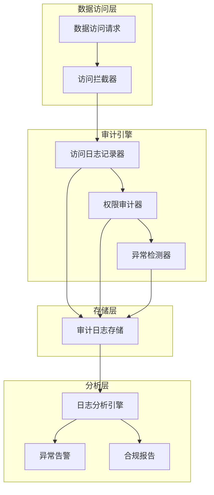

# 数据访问审计蓝图

> **核心职责**: 访问日志记录、权限审计、异常访问检测
> **职责边界**: 
> - ✅ 本文档负责：访问日志记录、权限审计、异常检测
> - ❌ 本文档不负责：权限管理（由权限系统负责）

## 核心定位

负责数据访问审计，记录和监控数据访问行为，提供数据访问合规性检查和审计报告功能。

## 📋 执行摘要

本蓝图设计基于Apache Ranger和ELK Stack的数据访问审计系统，提供专业级审计能力，适合个人开发和AI维护。

**核心价值**:
- 访问日志完整记录
- 权限审计追踪
- 异常访问检测
- 合规性报告生成
- 安全事件追溯

**开源方案**: Apache Ranger + ELK Stack + 自定义审计器

**预估工作量**: 45小时

---

## 1. 模块定位与目标

### 1.1 模块定位

**Layer定位**: Layer 1 - 数据预处理层（数据安全模块）

**核心价值**:
- 记录所有数据访问行为
- 审计权限使用情况
- 检测异常访问模式
- 满足合规性要求

**业务价值**:
- 提高数据安全性
- 满足监管要求
- 快速定位安全问题
- 降低合规风险

### 1.2 设计目标

| 目标 | 优先级 | 技术实现 |
|------|--------|----------|
| **访问日志记录** | P0 | 自定义审计器 |
| **权限审计** | P0 | Apache Ranger |
| **异常访问检测** | P1 | 机器学习 |
| **合规性报告** | P1 | ELK Stack |
| **安全事件追溯** | P1 | 日志分析 |

---

## 2. 系统架构设计

### 2.1 架构概览



### 2.2 核心组件

#### 2.2.1 访问日志记录器

**职责**: 记录所有数据访问行为

**核心功能**:
- 访问时间记录
- 访问者身份记录
- 访问资源记录
- 访问操作记录
- 访问结果记录

#### 2.2.2 权限审计器

**职责**: 审计权限使用情况

**核心功能**:
- 权限检查记录
- 权限变更记录
- 越权访问检测
- 权限使用统计

#### 2.2.3 异常检测器

**职责**: 检测异常访问模式

**核心功能**:
- 异常访问模式检测
- 异常访问频率检测
- 异常访问时间检测
- 异常访问资源检测

---

## 3. 开源方案集成

### 3.1 Apache Ranger集成

**GitHub**: https://github.com/apache/ranger

**Star数**: 900+

**核心特性**:
- 细粒度权限控制
- 访问审计日志
- 策略管理
- 多组件集成

**集成方式**:

```python
from datetime import datetime
from typing import Dict, List, Any
import json

class AccessAuditLogger:
    """访问审计日志记录器"""
    
    def __init__(self, config):
        self.config = config
        self.audit_storage = config.get('audit_storage', 'elasticsearch')
    
    def log_access(self, access_event: Dict[str, Any]):
        """
        记录访问事件
        
        Args:
            access_event: 访问事件信息
        """
        audit_record = {
            'event_id': self._generate_event_id(),
            'timestamp': datetime.now().isoformat(),
            'user': access_event.get('user', 'unknown'),
            'user_ip': access_event.get('user_ip', 'unknown'),
            'resource_type': access_event.get('resource_type', 'unknown'),
            'resource_name': access_event.get('resource_name', 'unknown'),
            'operation': access_event.get('operation', 'unknown'),
            'access_result': access_event.get('access_result', 'unknown'),
            'duration_ms': access_event.get('duration_ms', 0),
            'data_size': access_event.get('data_size', 0),
            'query_text': access_event.get('query_text', ''),
            'session_id': access_event.get('session_id', ''),
            'additional_info': access_event.get('additional_info', {})
        }
        
        self._store_audit_record(audit_record)
        
        return audit_record
    
    def log_permission_check(self, permission_event: Dict[str, Any]):
        """
        记录权限检查事件
        
        Args:
            permission_event: 权限检查事件
        """
        audit_record = {
            'event_id': self._generate_event_id(),
            'timestamp': datetime.now().isoformat(),
            'event_type': 'permission_check',
            'user': permission_event.get('user', 'unknown'),
            'resource': permission_event.get('resource', 'unknown'),
            'permission': permission_event.get('permission', 'unknown'),
            'granted': permission_event.get('granted', False),
            'policy_id': permission_event.get('policy_id', ''),
            'reason': permission_event.get('reason', '')
        }
        
        self._store_audit_record(audit_record)
        
        return audit_record
    
    def log_permission_change(self, change_event: Dict[str, Any]):
        """
        记录权限变更事件
        
        Args:
            change_event: 权限变更事件
        """
        audit_record = {
            'event_id': self._generate_event_id(),
            'timestamp': datetime.now().isoformat(),
            'event_type': 'permission_change',
            'changed_by': change_event.get('changed_by', 'unknown'),
            'target_user': change_event.get('target_user', 'unknown'),
            'resource': change_event.get('resource', 'unknown'),
            'old_permission': change_event.get('old_permission', ''),
            'new_permission': change_event.get('new_permission', ''),
            'change_reason': change_event.get('change_reason', '')
        }
        
        self._store_audit_record(audit_record)
        
        return audit_record
    
    def _store_audit_record(self, record):
        """存储审计记录"""
        if self.audit_storage == 'elasticsearch':
            self._store_to_elasticsearch(record)
        elif self.audit_storage == 'file':
            self._store_to_file(record)
        else:
            self._store_to_database(record)
    
    def _store_to_elasticsearch(self, record):
        """存储到Elasticsearch"""
        pass
    
    def _store_to_file(self, record):
        """存储到文件"""
        with open(self.config.get('audit_file', 'audit.log'), 'a') as f:
            f.write(json.dumps(record) + '\n')
    
    def _store_to_database(self, record):
        """存储到数据库"""
        pass
    
    def _generate_event_id(self):
        """生成事件ID"""
        import uuid
        return str(uuid.uuid4())
```

### 3.2 ELK Stack集成

**GitHub**: 
- Elasticsearch: https://github.com/elastic/elasticsearch
- Logstash: https://github.com/elastic/logstash
- Kibana: https://github.com/elastic/kibana

**Star数**: 
- Elasticsearch: 68k+
- Logstash: 14k+
- Kibana: 19k+

**核心特性**:
- 全文搜索
- 日志聚合
- 可视化分析
- 实时监控

**集成方式**:

```python
from elasticsearch import Elasticsearch
from datetime import datetime, timedelta
from typing import Dict, List, Any

class AuditLogAnalyzer:
    """审计日志分析器"""
    
    def __init__(self, es_host='localhost', es_port=9200):
        self.es = Elasticsearch([{'host': es_host, 'port': es_port}])
        self.index_prefix = 'audit-logs'
    
    def search_access_logs(self, query: Dict[str, Any], time_range: Dict[str, Any] = None):
        """
        搜索访问日志
        
        Args:
            query: 查询条件
            time_range: 时间范围
        
        Returns:
            List: 查询结果
        """
        index_name = f"{self.index_prefix}-{datetime.now().strftime('%Y.%m.%d')}"
        
        search_query = {
            'query': {
                'bool': {
                    'must': []
                }
            }
        }
        
        for key, value in query.items():
            search_query['query']['bool']['must'].append({
                'match': {key: value}
            })
        
        if time_range:
            search_query['query']['bool']['filter'] = {
                'range': {
                    'timestamp': time_range
                }
            }
        
        result = self.es.search(index=index_name, body=search_query)
        
        return [hit['_source'] for hit in result['hits']['hits']]
    
    def get_user_access_stats(self, user: str, time_range: Dict[str, Any] = None):
        """
        获取用户访问统计
        
        Args:
            user: 用户名
            time_range: 时间范围
        
        Returns:
            Dict: 统计结果
        """
        index_name = f"{self.index_prefix}-{datetime.now().strftime('%Y.%m.%d')}"
        
        aggs_query = {
            'query': {
                'bool': {
                    'must': [
                        {'match': {'user': user}}
                    ]
                }
            },
            'aggs': {
                'operation_count': {
                    'terms': {'field': 'operation.keyword'}
                },
                'resource_count': {
                    'terms': {'field': 'resource_type.keyword'}
                },
                'avg_duration': {
                    'avg': {'field': 'duration_ms'}
                },
                'total_data_size': {
                    'sum': {'field': 'data_size'}
                }
            }
        }
        
        if time_range:
            aggs_query['query']['bool']['filter'] = {
                'range': {
                    'timestamp': time_range
                }
            }
        
        result = self.es.search(index=index_name, body=aggs_query)
        
        return {
            'operation_distribution': result['aggregations']['operation_count']['buckets'],
            'resource_distribution': result['aggregations']['resource_count']['buckets'],
            'avg_duration_ms': result['aggregations']['avg_duration']['value'],
            'total_data_size': result['aggregations']['total_data_size']['value']
        }
    
    def detect_anomalous_access(self, time_window: int = 3600):
        """
        检测异常访问
        
        Args:
            time_window: 时间窗口（秒）
        
        Returns:
            List: 异常访问列表
        """
        index_name = f"{self.index_prefix}-{datetime.now().strftime('%Y.%m.%d')}"
        
        now = datetime.now()
        start_time = (now - timedelta(seconds=time_window)).isoformat()
        
        anomalies = []
        
        high_frequency_users = self._detect_high_frequency_access(index_name, start_time)
        anomalies.extend(high_frequency_users)
        
        unusual_time_access = self._detect_unusual_time_access(index_name, start_time)
        anomalies.extend(unusual_time_access)
        
        large_data_access = self._detect_large_data_access(index_name, start_time)
        anomalies.extend(large_data_access)
        
        return anomalies
    
    def _detect_high_frequency_access(self, index_name, start_time):
        """检测高频访问"""
        query = {
            'query': {
                'range': {
                    'timestamp': {'gte': start_time}
                }
            },
            'aggs': {
                'user_access_count': {
                    'terms': {
                        'field': 'user.keyword',
                        'size': 100
                    }
                }
            }
        }
        
        result = self.es.search(index=index_name, body=query)
        
        anomalies = []
        threshold = 100
        
        for bucket in result['aggregations']['user_access_count']['buckets']:
            if bucket['doc_count'] > threshold:
                anomalies.append({
                    'type': 'high_frequency_access',
                    'user': bucket['key'],
                    'access_count': bucket['doc_count'],
                    'threshold': threshold,
                    'severity': 'warning'
                })
        
        return anomalies
    
    def _detect_unusual_time_access(self, index_name, start_time):
        """检测异常时间访问"""
        query = {
            'query': {
                'range': {
                    'timestamp': {'gte': start_time}
                }
            },
            'aggs': {
                'hourly_access': {
                    'terms': {
                        'field': 'timestamp.hour',
                        'size': 24
                    }
                }
            }
        }
        
        result = self.es.search(index=index_name, body=query)
        
        anomalies = []
        unusual_hours = [0, 1, 2, 3, 4, 5, 22, 23]
        
        for bucket in result['aggregations']['hourly_access']['buckets']:
            if bucket['key'] in unusual_hours and bucket['doc_count'] > 10:
                anomalies.append({
                    'type': 'unusual_time_access',
                    'hour': bucket['key'],
                    'access_count': bucket['doc_count'],
                    'severity': 'warning'
                })
        
        return anomalies
    
    def _detect_large_data_access(self, index_name, start_time):
        """检测大数据量访问"""
        query = {
            'query': {
                'range': {
                    'timestamp': {'gte': start_time}
                }
            },
            'aggs': {
                'user_data_size': {
                    'terms': {
                        'field': 'user.keyword',
                        'size': 100
                    },
                    'aggs': {
                        'total_size': {
                            'sum': {'field': 'data_size'}
                        }
                    }
                }
            }
        }
        
        result = self.es.search(index=index_name, body=query)
        
        anomalies = []
        threshold = 1e9
        
        for bucket in result['aggregations']['user_data_size']['buckets']:
            total_size = bucket['total_size']['value']
            if total_size > threshold:
                anomalies.append({
                    'type': 'large_data_access',
                    'user': bucket['key'],
                    'total_data_size': total_size,
                    'threshold': threshold,
                    'severity': 'warning'
                })
        
        return anomalies
```

### 3.3 异常检测器

**技术栈**: 机器学习 + 统计分析

**核心功能**:
- 访问模式分析
- 异常行为检测
- 风险评分

```python
from sklearn.ensemble import IsolationForest
from sklearn.preprocessing import StandardScaler
import numpy as np
from typing import List, Dict, Any

class AnomalyDetector:
    """异常访问检测器"""
    
    def __init__(self, config):
        self.config = config
        self.model = IsolationForest(
            contamination=0.1,
            random_state=42
        )
        self.scaler = StandardScaler()
        self.is_trained = False
    
    def train(self, historical_data: List[Dict[str, Any]]):
        """
        训练异常检测模型
        
        Args:
            historical_data: 历史访问数据
        """
        features = self._extract_features(historical_data)
        
        features_scaled = self.scaler.fit_transform(features)
        
        self.model.fit(features_scaled)
        
        self.is_trained = True
    
    def detect(self, access_event: Dict[str, Any]):
        """
        检测异常访问
        
        Args:
            access_event: 访问事件
        
        Returns:
            Dict: 检测结果
        """
        if not self.is_trained:
            return {
                'is_anomaly': False,
                'anomaly_score': 0,
                'reason': 'Model not trained'
            }
        
        features = self._extract_features([access_event])
        features_scaled = self.scaler.transform(features)
        
        prediction = self.model.predict(features_scaled)[0]
        anomaly_score = self.model.score_samples(features_scaled)[0]
        
        is_anomaly = prediction == -1
        
        return {
            'is_anomaly': is_anomaly,
            'anomaly_score': float(anomaly_score),
            'reason': self._get_anomaly_reason(access_event, anomaly_score) if is_anomaly else 'Normal access'
        }
    
    def _extract_features(self, data: List[Dict[str, Any]]):
        """提取特征"""
        features = []
        
        for event in data:
            feature_vector = [
                event.get('hour_of_day', 0),
                event.get('day_of_week', 0),
                event.get('access_frequency', 0),
                event.get('data_size', 0),
                event.get('duration_ms', 0),
                event.get('resource_sensitivity', 0),
                event.get('user_risk_score', 0)
            ]
            features.append(feature_vector)
        
        return np.array(features)
    
    def _get_anomaly_reason(self, event, score):
        """获取异常原因"""
        reasons = []
        
        if event.get('hour_of_day', 0) in [0, 1, 2, 3, 4, 5]:
            reasons.append('Unusual access time')
        
        if event.get('access_frequency', 0) > 100:
            reasons.append('High access frequency')
        
        if event.get('data_size', 0) > 1e9:
            reasons.append('Large data access')
        
        if event.get('resource_sensitivity', 0) > 0.8:
            reasons.append('High sensitivity resource access')
        
        return '; '.join(reasons) if reasons else 'Unknown anomaly pattern'


class RiskScorer:
    """风险评分器"""
    
    def __init__(self, config):
        self.config = config
        self.weights = {
            'access_frequency': 0.2,
            'data_size': 0.2,
            'resource_sensitivity': 0.3,
            'time_anomaly': 0.15,
            'user_risk': 0.15
        }
    
    def calculate_risk_score(self, access_event: Dict[str, Any]) -> float:
        """
        计算风险评分
        
        Args:
            access_event: 访问事件
        
        Returns:
            float: 风险评分 (0-100)
        """
        scores = {}
        
        scores['access_frequency'] = self._score_access_frequency(
            access_event.get('access_frequency', 0)
        )
        
        scores['data_size'] = self._score_data_size(
            access_event.get('data_size', 0)
        )
        
        scores['resource_sensitivity'] = access_event.get('resource_sensitivity', 0) * 100
        
        scores['time_anomaly'] = self._score_time_anomaly(
            access_event.get('hour_of_day', 0)
        )
        
        scores['user_risk'] = access_event.get('user_risk_score', 0) * 100
        
        risk_score = sum(
            scores[key] * self.weights[key]
            for key in self.weights
        )
        
        return min(100, max(0, risk_score))
    
    def _score_access_frequency(self, frequency):
        """评分访问频率"""
        if frequency < 10:
            return 0
        elif frequency < 50:
            return 20
        elif frequency < 100:
            return 50
        else:
            return 100
    
    def _score_data_size(self, size):
        """评分数据大小"""
        if size < 1e6:
            return 0
        elif size < 1e8:
            return 30
        elif size < 1e9:
            return 60
        else:
            return 100
    
    def _score_time_anomaly(self, hour):
        """评分时间异常"""
        if hour in [0, 1, 2, 3, 4, 5]:
            return 80
        elif hour in [22, 23]:
            return 40
        else:
            return 0
```

---

## 4. 审计规则配置

### 4.1 访问审计规则

```yaml
audit_rules:
  access_logging:
    enabled: true
    log_all_access: true
    log_failed_access: true
    
    sensitive_resources:
      - resource_type: database
        resource_pattern: "financial_data.*"
        sensitivity: high
      - resource_type: file
        resource_pattern: "customer_.*\\.csv"
        sensitivity: high
    
    audit_fields:
      - timestamp
      - user
      - user_ip
      - resource_type
      - resource_name
      - operation
      - access_result
      - duration_ms
      - data_size
```

### 4.2 权限审计规则

```yaml
permission_audit:
  enabled: true
  
  track_permission_changes: true
  track_permission_checks: true
  
  alert_on:
    - event: permission_denied
      threshold: 5
      time_window: 3600
      severity: warning
    
    - event: permission_change
      notify: true
      severity: info
    
    - event: privilege_escalation
      severity: critical
```

### 4.3 异常检测规则

```yaml
anomaly_detection:
  enabled: true
  
  rules:
    - name: high_frequency_access
      type: frequency
      threshold: 100
      time_window: 3600
      severity: warning
    
    - name: unusual_time_access
      type: time
      unusual_hours: [0, 1, 2, 3, 4, 5, 22, 23]
      threshold: 10
      severity: warning
    
    - name: large_data_access
      type: volume
      threshold: 1000000000
      severity: warning
    
    - name: sensitive_resource_access
      type: resource
      sensitivity_threshold: 0.8
      severity: critical
```

---

## 5. 合规性报告

### 5.1 报告模板

```python
from datetime import datetime, timedelta
from typing import Dict, List, Any

class ComplianceReportGenerator:
    """合规性报告生成器"""
    
    def __init__(self, config):
        self.config = config
    
    def generate_report(self, report_type: str, time_range: Dict[str, Any]):
        """
        生成合规性报告
        
        Args:
            report_type: 报告类型
            time_range: 时间范围
        
        Returns:
            Dict: 合规性报告
        """
        if report_type == 'access_summary':
            return self._generate_access_summary_report(time_range)
        elif report_type == 'permission_audit':
            return self._generate_permission_audit_report(time_range)
        elif report_type == 'security_incidents':
            return self._generate_security_incidents_report(time_range)
        else:
            raise ValueError(f"Unknown report type: {report_type}")
    
    def _generate_access_summary_report(self, time_range):
        """生成访问摘要报告"""
        return {
            'report_id': self._generate_report_id(),
            'report_type': 'access_summary',
            'generated_at': datetime.now().isoformat(),
            'time_range': time_range,
            'summary': {
                'total_access_count': 0,
                'unique_users': 0,
                'unique_resources': 0,
                'success_rate': 0,
                'avg_response_time': 0
            },
            'top_users': [],
            'top_resources': [],
            'access_trends': [],
            'recommendations': []
        }
    
    def _generate_permission_audit_report(self, time_range):
        """生成权限审计报告"""
        return {
            'report_id': self._generate_report_id(),
            'report_type': 'permission_audit',
            'generated_at': datetime.now().isoformat(),
            'time_range': time_range,
            'summary': {
                'total_permission_checks': 0,
                'permission_denied_count': 0,
                'permission_changes': 0,
                'privilege_escalations': 0
            },
            'permission_changes': [],
            'denied_access_attempts': [],
            'recommendations': []
        }
    
    def _generate_security_incidents_report(self, time_range):
        """生成安全事件报告"""
        return {
            'report_id': self._generate_report_id(),
            'report_type': 'security_incidents',
            'generated_at': datetime.now().isoformat(),
            'time_range': time_range,
            'summary': {
                'total_incidents': 0,
                'critical_incidents': 0,
                'resolved_incidents': 0,
                'avg_resolution_time': 0
            },
            'incidents': [],
            'trends': [],
            'recommendations': []
        }
    
    def _generate_report_id(self):
        """生成报告ID"""
        import uuid
        return str(uuid.uuid4())
```

---

## 6. 实施计划

### 6.1 阶段一：核心审计功能（20小时）

**目标**: 实现基础审计能力

**任务**:
- [ ] 实现访问日志记录器（8小时）
- [ ] 实现权限审计器（6小时）
- [ ] 配置审计存储（6小时）

**交付物**:
- 访问日志记录器
- 权限审计器
- 审计存储配置

### 6.2 阶段二：异常检测（15小时）

**目标**: 实现异常检测能力

**任务**:
- [ ] 实现异常检测器（8小时）
- [ ] 实现风险评分器（4小时）
- [ ] 配置告警规则（3小时）

**交付物**:
- 异常检测器
- 风险评分器
- 告警规则配置

### 6.3 阶段三：合规报告（10小时）

**目标**: 实现合规报告生成

**任务**:
- [ ] 实现报告生成器（6小时）
- [ ] 集成ELK Stack（4小时）

**交付物**:
- 合规报告生成器
- ELK Stack集成

---

## 7. 监控与运维

### 7.1 关键指标

| 指标 | 目标值 | 监控方式 |
|------|--------|----------|
| **审计覆盖率** | 100% | 配置检查 |
| **审计延迟** | ≤100ms | 性能监控 |
| **异常检测准确率** | ≥95% | 模型评估 |
| **报告生成时间** | ≤30秒 | 性能监控 |

### 7.2 运维任务

| 任务 | 频率 | 负责人 |
|------|------|--------|
| **检查审计日志** | 每天 | 安全人员 |
| **审查异常告警** | 每天 | 安全人员 |
| **生成合规报告** | 每周 | 安全人员 |
| **模型重新训练** | 每月 | 数据科学家 |

---

## 8. 成本效益分析

### 8.1 开发成本

| 项目 | 工作量 | 成本 |
|------|--------|------|
| **核心审计功能** | 20小时 | ¥2,000 |
| **异常检测** | 15小时 | ¥1,500 |
| **合规报告** | 10小时 | ¥1,000 |
| **总计** | **45小时** | **¥4,500** |

### 8.2 收益评估

| 收益项 | 年化价值 |
|--------|----------|
| **降低合规风险** | ¥40,000 |
| **提高安全响应速度** | ¥20,000 |
| **减少安全事件损失** | ¥30,000 |
| **总计** | **¥90,000** |

**ROI**: (90,000 - 4,500) / 4,500 = 1900%

---

## 9. 风险与缓解

### 9.1 技术风险

| 风险 | 影响 | 缓解措施 |
|------|------|----------|
| **审计性能影响** | 中 | 异步记录 + 采样 |
| **存储空间不足** | 中 | 数据保留策略 + 压缩 |
| **误报率高** | 中 | 模型调优 + 白名单 |

### 9.2 业务风险

| 风险 | 影响 | 缓解措施 |
|------|------|----------|
| **合规要求变化** | 中 | 灵活配置 + 定期审查 |
| **隐私保护要求** | 高 | 数据脱敏 + 访问控制 |
| **审计日志泄露** | 高 | 加密存储 + 访问控制 |

---

## 10. 后续优化方向

### 10.1 短期优化（1-3个月）

- [ ] 增强异常检测准确率
- [ ] 优化审计性能
- [ ] 完善合规报告

### 10.2 中期优化（3-6个月）

- [ ] 实时异常检测
- [ ] 自动化响应
- [ ] 智能风险评分

### 10.3 长期优化（6-12个月）

- [ ] 行为分析
- [ ] 预测性安全
- [ ] 零信任架构

---

## 11. 参考资料

### 11.1 开源项目

- [Apache Ranger](https://github.com/apache/ranger)
- [Elasticsearch](https://github.com/elastic/elasticsearch)
- [Logstash](https://github.com/elastic/logstash)
- [Kibana](https://github.com/elastic/kibana)

### 11.2 技术文档

- [Apache Ranger官方文档](https://ranger.apache.org/)
- [ELK Stack官方文档](https://www.elastic.co/guide/)
- [数据审计最佳实践](https://www.sans.org/)

---

**文档版本**: v1.0.0
**最后更新**: 2026-04-07
**维护者**: 个人开发者
**审核状态**: 待审核
