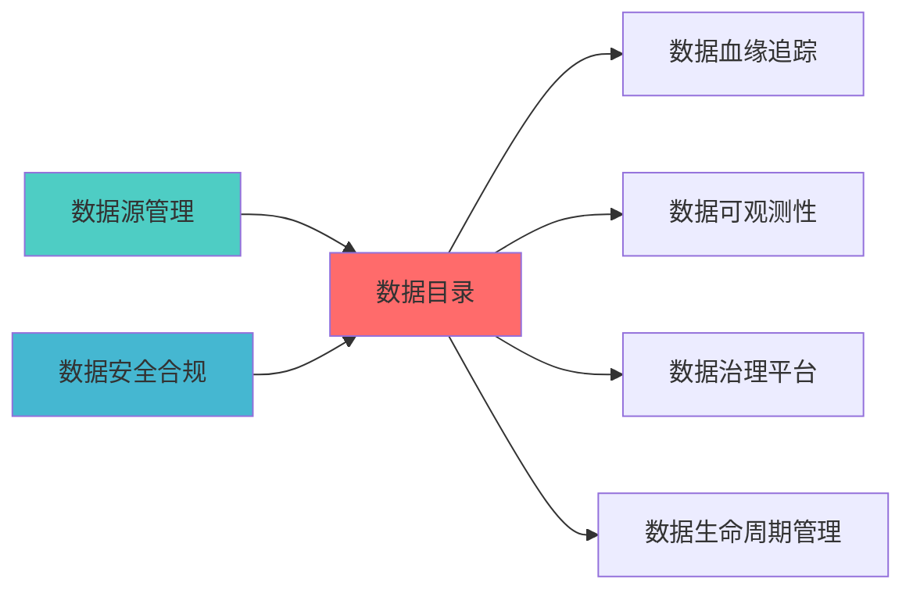

# DATA CATALOG BLUEPRINT

> **核心职责**: Data Catalog蓝图设计
> **职责边界**: 
> - ✅ 本文档负责：Data Catalog蓝图设计相关内容
> - ❌ 本文档不负责：其他模块内容

---
module_id: DATA_CATALOG_001
version: 1.0.0
status: Active
created_date: 2026-04-07
last_updated: 2026-04-07
owner: 个人开发者
responsibility:
  - 数据质量
  - 因子计算
  - 组合优化
standard_type: 专业量化机构文档
layer: "Layer 1 (数据源层)"
# 数据目录/元数据管理平台蓝图

> **核心定位**: 数据目录/元数据管理平台蓝图的核心功能实现


> **模块ID**: `DATA_CATALOG_001`
> **实施周期**: Week 5-6（2周）
> **优先级**: P0（核心）
> **预期收益**: 数据资产可发现性提升100%，元数据管理效率提升80%

## 核心定位

主导DATA CATALOG的设计与实现，基于Delta Lake技术，实现核心功能，确保数据质量合规。

## 一、设计背景与目标

### 1.1 业务需求

**当前痛点**:
- 数据资产分散，无法快速找到所需数据表
- 缺少统一的元数据管理，表描述、字段说明不完整
- 数据血缘关系不清晰，难以理解数据来源
- 敏感数据缺乏标记，存在合规风险

**业务目标**:
- 建立统一的数据资产目录，支持快速搜索和发现
- 完善元数据管理，包括表描述、字段说明、所有者信息
- 集成数据血缘可视化，展示列级血缘关系
- 实现数据治理功能，包括敏感数据标记和生命周期管理

### 1.2 技术目标

| 指标 | 目标值 | 说明 |
|------|--------|------|
| **数据资产覆盖率** | 100% | 所有数据表都被编目 |
| **元数据完整率** | ≥95% | 95%以上的表有完整元数据 |
| **搜索响应时间** | <2秒 | 数据搜索响应时间 |
| **血缘可视化** | 支持 | 列级血缘关系可视化 |

---
## 📚 相关文档

### 上游依赖

| 文档名称 | module_id | 依赖类型 | 说明 |
|---------|-----------|---------|------|
| [数据源管理蓝图](./DATA_SOURCE_MANAGEMENT_BLUEPRINT.md) | DATA_SOURCE_MANAGEMENT_001 | 强依赖 | 提供数据源连接信息 |
| [数据安全合规蓝图](./DATA_SECURITY_COMPLIANCE_BLUEPRINT.md) | DATA_SECURITY_COMPLIANCE_001 | 中依赖 | 提供敏感数据分类标准 |

### 下游依赖

| 文档名称 | module_id | 依赖类型 | 说明 |
|---------|-----------|---------|------|
| [数据血缘追踪蓝图](./DATA_CATALOG_METADATA_BLUEPRINT.md) | DATA_CATALOG_METADATA_001 | 强依赖 | 提供血缘追踪元数据 |
| [数据可观测性蓝图](./DATA_OBSERVABILITY_BLUEPRINT.md) | DATA_OBSERVABILITY_001 | 强依赖 | 提供数据资产监控 |
| [数据治理平台蓝图](./DATA_GOVERNANCE_PLATFORM_BLUEPRINT.md) | DATA_GOVERNANCE_PLATFORM_001 | 强依赖 | 提供治理策略执行 |
| [数据生命周期管理蓝图](./DATA_LIFECYCLE_MANAGEMENT_BLUEPRINT.md) | DATA_LIFECYCLE_MANAGEMENT_001 | 中依赖 | 提供生命周期元数据 |

### 技术依赖

| 技术组件 | 版本 | 用途 | 文档 |
|---------|------|------|------|
| **OpenMetadata** | 1.2+ | 元数据管理 | [官方文档](https://docs.open-metadata.org/) |
| **Apache Atlas** | 2.3+ | 数据血缘 | [官方文档](https://atlas.apache.org/) |
| **Elasticsearch** | 8.0+ | 搜索引擎 | [官方文档](https://www.elastic.co/) |
| **Neo4j** | 5.0+ | 图数据库 | [官方文档](https://neo4j.com/) |

### 引用关系图



---

## 二、系统架构设计

### 2.1 整体架构图

```
┌─────────────────────────────────────────────────────────────┐
│                数据目录/元数据管理平台架构                      │
├─────────────────────────────────────────────────────────────┤
│                                                             │
│  ┌─────────────────────────────────────────────────────┐   │
│  │           元数据采集层 (Metadata Collection)         │   │
│  │  ┌─────────────┐ ┌─────────────┐ ┌─────────────┐   │   │
│  │  │数据库采集   │ │文件系统采集 │ │API采集      │   │   │
│  │  └─────────────┘ └─────────────┘ └─────────────┘   │   │
│  └─────────────────────────────────────────────────────┘   │
│                          ↓                                  │
│  ┌─────────────────────────────────────────────────────┐   │
│  │           元数据存储层 (Metadata Storage)            │   │
│  │  ┌─────────────┐ ┌─────────────┐ ┌─────────────┐   │   │
│  │  │元数据存储   │ │血缘图谱存储 │ │搜索索引     │   │   │
│  │  │(MySQL)      │ │(Neo4j)      │ │(Elasticsearch)│  │   │
│  │  └─────────────┘ └─────────────┘ └─────────────┘   │   │
│  └─────────────────────────────────────────────────────┘   │
│                          ↓                                  │
│  ┌─────────────────────────────────────────────────────┐   │
│  │           元数据服务层 (Metadata Service)            │   │
│  │  ┌─────────────┐ ┌─────────────┐ ┌─────────────┐   │   │
│  │  │搜索服务     │ │血缘服务     │ │治理服务     │   │   │
│  │  └─────────────┘ └─────────────┘ └─────────────┘   │   │
│  └─────────────────────────────────────────────────────┘   │
│                          ↓                                  │
│  ┌─────────────────────────────────────────────────────┐   │
│  │           用户界面层 (User Interface)                │   │
│  │  ┌─────────────┐ ┌─────────────┐ ┌─────────────┐   │   │
│  │  │数据发现     │ │血缘可视化   │ │治理仪表板   │   │   │
│  │  └─────────────┘ └─────────────┘ └─────────────┘   │   │
│  └─────────────────────────────────────────────────────┘   │
│                                                             │
└─────────────────────────────────────────────────────────────┘
```

### 2.2 技术选型

| 组件 | 技术方案 | 版本要求 | 选型理由 |
|------|---------|---------|---------|
| **元数据平台** | OpenMetadata | 1.3.0+ | 一体化元数据平台，开箱即用 |
| **元数据存储** | MySQL | 8.0+ | OpenMetadata默认存储 |
| **血缘图谱** | Neo4j | 5.4.0+ | 图数据库，存储血缘关系 |
| **搜索引擎** | Elasticsearch | 8.0+ | 全文搜索，快速发现数据 |
| **Web框架** | React | 18.0+ | OpenMetadata前端框架 |

### 2.3 Layer定位

- **Layer归属**: Layer 1 - 数据预处理层
- **职责范围**: 数据资产发现、元数据管理、数据血缘可视化、数据治理
- **上下层接口**:
  - 上层依赖: Layer 2-8（提供数据发现服务）
  - 下层依赖: Layer 0数据源层（采集元数据）

---

## 三、核心模块设计

### 3.1 元数据采集器 (MetadataCollector)

**职责**: 自动采集数据源元数据

```python
from dataclasses import dataclass, field
from typing import Dict, List, Optional, Any
from datetime import datetime
from enum import Enum

class DataSourceType(Enum):
    """数据源类型"""
    MYSQL = "mysql"
    POSTGRESQL = "postgresql"
    DELTA_LAKE = "delta_lake"
    KAFKA = "kafka"
    FILE = "file"
    API = "api"

@dataclass
class TableMetadata:
    """表元数据"""
    table_id: str
    table_name: str
    database_name: str
    schema_name: str
    description: str
    owner: str
    tags: List[str] = field(default_factory=list)
    columns: List['ColumnMetadata'] = field(default_factory=list)
    created_at: datetime = field(default_factory=datetime.now)
    updated_at: datetime = field(default_factory=datetime.now)
    row_count: int = 0
    size_bytes: int = 0

@dataclass
class ColumnMetadata:
    """列元数据"""
    column_name: str
    data_type: str
    description: str
    is_nullable: bool = True
    is_primary_key: bool = False
    is_foreign_key: bool = False
    default_value: Optional[str] = None
    tags: List[str] = field(default_factory=list)

class MetadataCollector:
    """元数据采集器"""
    
    def __init__(self, source_config: Dict[str, Any]):
        self.source_config = source_config
        self.connectors: Dict[DataSourceType, 'BaseConnector'] = {}
    
    def register_connector(self, source_type: DataSourceType, connector: 'BaseConnector'):
        """注册数据源连接器"""
        self.connectors[source_type] = connector
    
    def collect_table_metadata(self, source_type: DataSourceType, database: str, table: str) -> TableMetadata:
        """采集表元数据"""
        connector = self.connectors.get(source_type)
        if not connector:
            raise ValueError(f"未找到数据源类型 {source_type} 的连接器")
        
        return connector.get_table_metadata(database, table)
    
    def collect_all_tables(self, source_type: DataSourceType, database: str) -> List[TableMetadata]:
        """采集数据库所有表的元数据"""
        connector = self.connectors.get(source_type)
        if not connector:
            raise ValueError(f"未找到数据源类型 {source_type} 的连接器")
        
        tables = connector.list_tables(database)
        return [self.collect_table_metadata(source_type, database, t) for t in tables]
```

### 3.2 数据发现服务 (DataDiscoveryService)

**职责**: 提供数据搜索和发现功能

```python
from typing import List, Optional
from dataclasses import dataclass

@dataclass
class SearchRequest:
    """搜索请求"""
    query: str
    filters: Dict[str, Any] = None
    page: int = 1
    page_size: int = 20
    sort_by: str = "relevance"
    sort_order: str = "desc"

@dataclass
class SearchResult:
    """搜索结果"""
    table_id: str
    table_name: str
    database_name: str
    description: str
    owner: str
    tags: List[str]
    relevance_score: float
    highlight: Dict[str, str]

class DataDiscoveryService:
    """数据发现服务"""
    
    def __init__(self, search_engine: 'SearchEngine'):
        self.search_engine = search_engine
    
    def search(self, request: SearchRequest) -> List[SearchResult]:
        """搜索数据表"""
        return self.search_engine.search(request)
    
    def search_by_tag(self, tag: str) -> List[SearchResult]:
        """按标签搜索"""
        request = SearchRequest(query="*", filters={"tags": tag})
        return self.search(request)
    
    def search_by_owner(self, owner: str) -> List[SearchResult]:
        """按所有者搜索"""
        request = SearchRequest(query="*", filters={"owner": owner})
        return self.search(request)
    
    def search_by_column(self, column_name: str) -> List[SearchResult]:
        """按列名搜索"""
        request = SearchRequest(query=column_name, filters={"search_fields": ["columns"]})
        return self.search(request)
    
    def get_popular_tables(self, limit: int = 10) -> List[SearchResult]:
        """获取热门数据表"""
        request = SearchRequest(
            query="*",
            sort_by="popularity",
            sort_order="desc",
            page_size=limit
        )
        return self.search(request)
    
    def get_recently_updated(self, limit: int = 10) -> List[SearchResult]:
        """获取最近更新的表"""
        request = SearchRequest(
            query="*",
            sort_by="updated_at",
            sort_order="desc",
            page_size=limit
        )
        return self.search(request)
```

### 3.3 数据血缘服务 (DataLineageService)

**职责**: 提供数据血缘查询和可视化

```python
from typing import List, Dict, Any, Optional
from dataclasses import dataclass
from enum import Enum

class LineageDirection(Enum):
    """血缘方向"""
    UPSTREAM = "upstream"      # 上游血缘
    DOWNSTREAM = "downstream"  # 下游血缘
    BOTH = "both"              # 双向血缘

@dataclass
class LineageNode:
    """血缘节点"""
    node_id: str
    node_name: str
    node_type: str
    database: str
    schema: str
    table: str

@dataclass
class LineageEdge:
    """血缘边"""
    source_id: str
    target_id: str
    transformation: str
    columns: List[Dict[str, str]]

@dataclass
class LineageGraph:
    """血缘图谱"""
    nodes: List[LineageNode]
    edges: List[LineageEdge]
    depth: int

class DataLineageService:
    """数据血缘服务"""
    
    def __init__(self, lineage_store: 'LineageStore'):
        self.lineage_store = lineage_store
    
    def get_lineage(
        self,
        table_id: str,
        direction: LineageDirection = LineageDirection.BOTH,
        depth: int = 3
    ) -> LineageGraph:
        """获取数据血缘"""
        return self.lineage_store.get_lineage(table_id, direction, depth)
    
    def get_upstream_lineage(self, table_id: str, depth: int = 3) -> LineageGraph:
        """获取上游血缘"""
        return self.get_lineage(table_id, LineageDirection.UPSTREAM, depth)
    
    def get_downstream_lineage(self, table_id: str, depth: int = 3) -> LineageGraph:
        """获取下游血缘"""
        return self.get_lineage(table_id, LineageDirection.DOWNSTREAM, depth)
    
    def get_column_lineage(
        self,
        table_id: str,
        column_name: str,
        direction: LineageDirection = LineageDirection.UPSTREAM
    ) -> List[Dict[str, Any]]:
        """获取列级血缘"""
        return self.lineage_store.get_column_lineage(table_id, column_name, direction)
    
    def get_impact_analysis(self, table_id: str) -> Dict[str, Any]:
        """影响分析"""
        downstream = self.get_downstream_lineage(table_id, depth=10)
        return {
            "affected_tables": len(downstream.nodes),
            "affected_pipelines": self._count_pipelines(downstream),
            "affected_reports": self._count_reports(downstream),
            "details": downstream
        }
    
    def _count_pipelines(self, graph: LineageGraph) -> int:
        """统计受影响的管道数"""
        return sum(1 for node in graph.nodes if node.node_type == "pipeline")
    
    def _count_reports(self, graph: LineageGraph) -> int:
        """统计受影响的报表数"""
        return sum(1 for node in graph.nodes if node.node_type == "report")
```

### 3.4 数据治理服务 (DataGovernanceService)

**职责**: 提供数据治理功能

```python
from typing import List, Dict, Any, Optional
from dataclasses import dataclass
from enum import Enum
from datetime import datetime

class DataClassification(Enum):
    """数据分类"""
    PUBLIC = "public"           # 公开数据
    INTERNAL = "internal"       # 内部数据
    CONFIDENTIAL = "confidential"  # 机密数据
    RESTRICTED = "restricted"   # 限制级数据

class DataSensitivity(Enum):
    """数据敏感度"""
    NONE = "none"
    LOW = "low"
    MEDIUM = "medium"
    HIGH = "high"
    CRITICAL = "critical"

@dataclass
class GovernancePolicy:
    """治理策略"""
    policy_id: str
    policy_name: str
    description: str
    rules: List[Dict[str, Any]]
    created_at: datetime
    updated_at: datetime

@dataclass
class DataAccessLog:
    """数据访问日志"""
    log_id: str
    user_id: str
    table_id: str
    action: str
    timestamp: datetime
    ip_address: str

class DataGovernanceService:
    """数据治理服务"""
    
    def __init__(self, metadata_store: 'MetadataStore'):
        self.metadata_store = metadata_store
    
    def classify_table(
        self,
        table_id: str,
        classification: DataClassification,
        sensitivity: DataSensitivity
    ) -> bool:
        """分类数据表"""
        return self.metadata_store.update_table_classification(
            table_id, classification, sensitivity
        )
    
    def auto_classify_table(self, table_id: str) -> DataClassification:
        """自动分类数据表"""
        columns = self.metadata_store.get_table_columns(table_id)
        
        for col in columns:
            col_name_lower = col.column_name.lower()
            if any(kw in col_name_lower for kw in ['password', 'secret', 'key', 'token']):
                return DataClassification.RESTRICTED
            if any(kw in col_name_lower for kw in ['ssn', 'id_card', 'phone', 'email']):
                return DataClassification.CONFIDENTIAL
            if any(kw in col_name_lower for kw in ['name', 'address', 'birthday']):
                return DataClassification.INTERNAL
        
        return DataClassification.PUBLIC
    
    def tag_sensitive_data(self, table_id: str) -> List[str]:
        """标记敏感数据列"""
        columns = self.metadata_store.get_table_columns(table_id)
        sensitive_columns = []
        
        for col in columns:
            col_name_lower = col.column_name.lower()
            if any(kw in col_name_lower for kw in ['password', 'secret', 'key', 'token', 'ssn']):
                col.tags.append("sensitive")
                sensitive_columns.append(col.column_name)
        
        return sensitive_columns
    
    def set_retention_policy(
        self,
        table_id: str,
        retention_days: int,
        archive_location: Optional[str] = None
    ) -> bool:
        """设置保留策略"""
        return self.metadata_store.update_retention_policy(
            table_id, retention_days, archive_location
        )
    
    def log_data_access(
        self,
        user_id: str,
        table_id: str,
        action: str,
        ip_address: str
    ) -> str:
        """记录数据访问"""
        log = DataAccessLog(
            log_id=f"log_{datetime.now().strftime('%Y%m%d%H%M%S')}_{user_id}",
            user_id=user_id,
            table_id=table_id,
            action=action,
            timestamp=datetime.now(),
            ip_address=ip_address
        )
        return self.metadata_store.save_access_log(log)
    
    def get_access_audit_report(
        self,
        start_date: datetime,
        end_date: datetime,
        user_id: Optional[str] = None,
        table_id: Optional[str] = None
    ) -> List[DataAccessLog]:
        """获取访问审计报告"""
        return self.metadata_store.query_access_logs(
            start_date, end_date, user_id, table_id
        )
```

---

## 四、OpenMetadata集成方案

### 4.1 部署架构

```yaml
version: '3.8'
services:
  openmetadata-server:
    image: openmetadata/server:1.3.0
    container_name: openmetadata-server
    ports:
      - "8585:8585"
    environment:
      - SERVER_HOST=0.0.0.0
      - SERVER_PORT=8585
      - DB_HOST=mysql
      - DB_PORT=3306
      - DB_USER=openmetadata
      - DB_PASSWORD=openmetadata_password
      - DB_SCHEMA=openmetadata_db
    depends_on:
      - mysql
      - elasticsearch
    networks:
      - openmetadata-network

  openmetadata-ingestion:
    image: openmetadata/ingestion:1.3.0
    container_name: openmetadata-ingestion
    environment:
      - SERVER_HOST=openmetadata-server
      - SERVER_PORT=8585
    networks:
      - openmetadata-network

  mysql:
    image: mysql:8.0
    container_name: openmetadata-mysql
    environment:
      - MYSQL_ROOT_PASSWORD=root_password
      - MYSQL_USER=openmetadata
      - MYSQL_PASSWORD=openmetadata_password
      - MYSQL_DATABASE=openmetadata_db
    volumes:
      - mysql-data:/var/lib/mysql
    networks:
      - openmetadata-network

  elasticsearch:
    image: docker.elastic.co/elasticsearch/elasticsearch:8.8.0
    container_name: openmetadata-elasticsearch
    environment:
      - discovery.type=single-node
      - ES_JAVA_OPTS=-Xms512m -Xmx512m
      - xpack.security.enabled=false
    volumes:
      - es-data:/usr/share/elasticsearch/data
    networks:
      - openmetadata-network

networks:
  openmetadata-network:
    driver: bridge

volumes:
  mysql-data:
  es-data:
```

### 4.2 数据源连接器配置

```yaml
sourceConfig:
  config:
    type: DatabaseMetadata
    databaseServiceName: qmt_mysql
    filterPattern:
      includes:
        - "stock_data.*"
        - "factor_data.*"
        - "trade_data.*"

sink:
  type: metadata-rest
  config:
    api_endpoint: http://openmetadata-server:8585/api

workflowConfig:
  openMetadataServerConfig:
    hostPort: http://openmetadata-server:8585
    authProvider: no-auth
```

### 4.3 Python SDK集成

```python
from metadata.ingestion.api.workflow import Workflow
from metadata.ingestion.ometa.ometa_api import OpenMetadata
from metadata.generated.schema.entity.data.table import Table
from metadata.generated.schema.type.entityReference import EntityReference

class OpenMetadataClient:
    """OpenMetadata客户端"""
    
    def __init__(self, server_url: str = "http://localhost:8585"):
        self.server_url = server_url
        self.client = OpenMetadata(server_url)
    
    def create_database_service(self, name: str, connection_config: dict) -> EntityReference:
        """创建数据库服务"""
        service = self.client.create_or_update(
            DatabaseService(
                name=name,
                serviceType=connection_config["type"],
                connection=connection_config
            )
        )
        return service
    
    def ingest_metadata(self, config_path: str):
        """执行元数据采集"""
        workflow = Workflow.create(config_path)
        workflow.execute()
        workflow.raise_from_status()
    
    def search_tables(self, query: str) -> list:
        """搜索数据表"""
        return self.client.list_entities(
            entity=Table,
            query=query
        )
    
    def get_table_lineage(self, table_id: str) -> dict:
        """获取表血缘"""
        return self.client.get_lineage_by_id(
            entity=Table,
            entity_id=table_id
        )
    
    def add_table_tags(self, table_id: str, tags: list):
        """添加表标签"""
        table = self.client.get_by_id(entity=Table, entity_id=table_id)
        table.tags = tags
        self.client.create_or_update(table)
    
    def set_table_owner(self, table_id: str, owner_id: str):
        """设置表所有者"""
        table = self.client.get_by_id(entity=Table, entity_id=table_id)
        table.owner = EntityReference(id=owner_id, type="user")
        self.client.create_or_update(table)
```

---

## 五、与现有系统集成

### 5.1 与数据血缘追踪系统集成

```python
from integration.lineage_integration import LineageIntegrator

class CatalogLineageIntegration:
    """数据目录与血缘系统集成"""
    
    def __init__(self, catalog_client: OpenMetadataClient, lineage_service: DataLineageService):
        self.catalog_client = catalog_client
        self.lineage_service = lineage_service
    
    def sync_lineage_to_catalog(self):
        """同步血缘信息到数据目录"""
        tables = self.catalog_client.list_all_tables()
        
        for table in tables:
            lineage = self.lineage_service.get_upstream_lineage(table.id)
            self.catalog_client.update_table_lineage(table.id, lineage)
    
    def enrich_metadata_with_lineage(self, table_id: str):
        """用血缘信息丰富元数据"""
        lineage = self.lineage_service.get_lineage(table_id)
        
        upstream_tables = [n for n in lineage.nodes if n in lineage.edges]
        self.catalog_client.add_table_description(
            table_id,
            f"数据来源: {', '.join([t.table_name for t in upstream_tables])}"
        )
```

### 5.2 与数据质量监控系统集成

```python
from integration.quality_integration import QualityIntegrator

class CatalogQualityIntegration:
    """数据目录与质量系统集成"""
    
    def __init__(self, catalog_client: OpenMetadataClient, quality_service):
        self.catalog_client = catalog_client
        self.quality_service = quality_service
    
    def sync_quality_metrics_to_catalog(self):
        """同步质量指标到数据目录"""
        tables = self.catalog_client.list_all_tables()
        
        for table in tables:
            quality_score = self.quality_service.get_table_quality_score(table.id)
            self.catalog_client.update_table_quality_metrics(
                table.id,
                {
                    "quality_score": quality_score,
                    "last_quality_check": datetime.now().isoformat()
                }
            )
    
    def get_tables_with_quality_issues(self) -> list:
        """获取有质量问题的表"""
        return self.catalog_client.search_tables(
            query="quality_score:<0.8"
        )
```

---

## 六、实施计划

### 6.1 Week 5: 基础部署与配置

| 任务 | 预计时间 | 负责人 | 交付物 |
|------|---------|--------|--------|
| 部署OpenMetadata服务 | 2天 | DevOps | 运行中的OpenMetadata实例 |
| 配置数据源连接器 | 1天 | 数据工程师 | MySQL、Delta Lake连接器 |
| 执行首次元数据采集 | 1天 | 数据工程师 | 完整的元数据快照 |
| 配置用户权限 | 1天 | 管理员 | 用户角色和权限配置 |

### 6.2 Week 6: 集成与优化

| 任务 | 预计时间 | 负责人 | 交付物 |
|------|---------|--------|--------|
| 集成血缘追踪系统 | 2天 | 数据工程师 | 血缘可视化集成 |
| 集成质量监控系统 | 1天 | 数据工程师 | 质量指标展示 |
| 配置数据治理策略 | 1天 | 数据管理员 | 分类策略和标签 |
| 用户培训与文档 | 1天 | 数据工程师 | 使用手册和培训材料 |

---

## 七、验收标准

### 7.1 功能验收

| 功能 | 验收标准 | 测试方法 |
|------|---------|---------|
| 数据发现 | 搜索响应时间<2秒 | 性能测试 |
| 元数据管理 | 元数据完整率≥95% | 数据审计 |
| 血缘可视化 | 列级血缘正确展示 | 功能测试 |
| 数据治理 | 敏感数据自动标记 | 功能测试 |

### 7.2 性能验收

| 指标 | 目标值 | 测试方法 |
|------|--------|---------|
| 搜索响应时间 | <2秒 | 压力测试 |
| 元数据采集速度 | >100表/分钟 | 性能测试 |
| 血缘查询时间 | <1秒 | 性能测试 |
| 并发用户数 | >50 | 压力测试 |

---

## 八、风险与缓解措施

| 风险 | 等级 | 影响 | 缓解措施 |
|------|------|------|---------|
| 元数据采集失败 | P1 | 数据目录不完整 | 配置重试机制和告警 |
| 性能瓶颈 | P2 | 搜索响应慢 | 优化索引，增加缓存 |
| 用户采用率低 | P2 | 投资回报低 | 加强培训和推广 |

---

## 九、参考文档

1. OpenMetadata官方文档: https://docs.open-metadata.org/
2. OpenMetadata GitHub: https://github.com/open-metadata/OpenMetadata
3. 数据血缘追踪蓝图: DATA_LINEAGE_TRACKING_BLUEPRINT.md
4. 数据质量监控蓝图: REALTIME_QUALITY_MONITOR_BLUEPRINT.md

---

**蓝图版本**: v1.0.0 | **创建日期**: 2026-04-05 | **维护者**: 首席蓝图架构师

## 变更历史

| 版本 | 日期 | 变更内容 | 变更人 |
|------|------|----------|--------|
| v1.0.0 | 2026-04-05 | 初始版本创建 | 首席蓝图架构师 |

---

**蓝图版本**: v1.0.1 | **创建日期**: 2026-04-05 | **状态**: Active
---

## 1. 文档治理

### 1.1 System_Manifest.md索引

```markdown
#### Layer 6: 组合优化层
##### 6.001. Data Catalog
- **模块ID**: DATA_CATALOG_001
- **蓝图文档**: DATA_CATALOG_BLUEPRINT.md
- **技术规格书**: 待创建
- **职责**: Layer 1数据预处理层 | 业务架构: 三级时间框架融合架构
- **状态**: Active
```

### 1.2 模块职责边界

| 模块 | 职责 | 边界 |
|------|------|------|
| **Data Catalog** | Layer 1数据预处理层 | 业务架构: 三级时间框架融合架构 | **核心模块** |

### 1.3 版本管理

| 版本 | 日期 | 变更内容 | 变更人 |
|------|------|----------|--------|
| v1.0.0 | 2026-04-05 | 初始版本创建 | 首席蓝图架构师 |

---

**蓝图版本**: v1.0.0 | **创建日期**: 2026-04-05 | **状态**: Active
