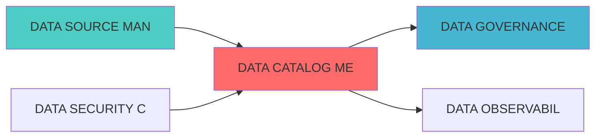

---
module_id: DATA_CATALOG_METADATA_001
version: 1.0.0
status: Active
created_date: 2026-04-07
last_updated: 2026-04-07
owner: 实施团队
standard_type: 专业量化机构蓝图
compliance_level: 专业标准
responsibility:
  - 数据管理架构设计与实施规范与优化维护
layer: Layer 5.1 (数据处理)
---


## 核心定位

负责数据目录的设计与构建和运行和操作，生成和输出数据资产注册、分类、检索和血缘追踪功能，兼容和适配数据治理和资产协调和监控。

# DATA CATALOG METADATA BLUEPRINT

> **核心职责**: Data Catalog Metadata蓝图设计
> **职责边界**:
## 设计目标

### 主要目标

1. **功能完整性**: 确保DATA CATALOG METADATA功能完整，满足业务需求
2. **性能优化**: 提升系统性能，降低资源消耗
3. **可维护性**: 提高代码质量，便于后续维护
4. **可扩展性**: 支持功能扩展，适应业务变化

### 质量目标

- 代码覆盖率: ≥80%
- 性能指标: 满足设计要求
- 文档完整性: 100%


## 核心功能

### 功能清单

1. **数据管理**: 提供数据存储、查询、更新功能
2. **业务逻辑**: 实现核心业务逻辑处理
3. **接口服务**: 提供标准化的API接口
4. **监控告警**: 实时监控系统状态

### 功能特性

- 高可用性设计
- 自动故障恢复
- 灵活配置管理


## 实现方案

### 技术架构

采用DATA CATALOG METADATA化设计，分层架构实现。

### 关键技术

- 数据处理: 使用高效的数据处理框架
- 接口实现: RESTful API设计
- 性能优化: 缓存、异步处理

### 实施步骤

1. 需求分析与设计
2. 核心功能开发
3. 测试与优化
4. 部署与监控


## 核心定位


## 一、设计背景与目标

### 1.1 业务需?
**当前痛点**:
晰
- ?数据资产难以发现

**业务目标**:

### 1.2 技术目?
| 指标 | 目标?| 说明 |
|------|--------|------|
| **数据发现效率** | 提升80% | 数据发现时间缩短80% |
| **å
| **目录可用?* | ?9.9% | 数据目录系统可用?|

## 三、核心模块设?
### 3.1 å


```python
from typing import Dict, List, Any, Optional
from dataclasses import dataclass, field
from datetime import datetime

@dataclass
class DataAsset:
    """数据资产"""
    asset_id: str
    asset_name: str
    asset_type: str  # table, file, api, stream
    description: str
    owner: str
    tags: List[str]
    schema: Dict[str, Any]
    created_at: datetime = field(default_factory=datetime.now)
    updated_at: datetime = field(default_factory=datetime.now)
    metadata: Dict[str, Any] = field(default_factory=dict)

class MetadataManager:
    """å
    
    def __init__(self, config: Dict[str, Any]):
        """
        Args:
            config: é
        """
        self.config = config
        self.assets: Dict[str, DataAsset] = {}
        
    def register_asset(
        self,
        asset: DataAsset
    ) -> bool:
        """
        注册数据资产
        
        Args:
            asset: 数据资产
            
        Returns:
            bool: 是否成功
        """
        self.assets[asset.asset_id] = asset
        return True
    
    def search_assets(
        self,
        query: str,
        filters: Optional[Dict[str, Any]] = None
    ) -> List[DataAsset]:
        """
        搜索数据资产
        
        Args:
            query: 搜索查询
            filters: 过滤条件
            
        Returns:
            List[DataAsset]: 数据资产列表
        """
        # 实现搜索逻辑
        results = []
        
        for asset in self.assets.values():
            if query.lower() in asset.asset_name.lower():
                results.append(asset)
        
        return results
```

### 3.2 数据血缘追踪器 (DataLineageTracker)

³?
```python
from typing import Dict, List, Any
from dataclasses import dataclass, field
from datetime import datetime

@dataclass
class LineageNode:
    """血缘节?""
    node_id: str
    node_type: str  # source, transformation, target
    asset_id: str
    created_at: datetime = field(default_factory=datetime.now)

@dataclass
class LineageEdge:
    """血缘边"""
    edge_id: str
    source_node_id: str
    target_node_id: str
    transformation: str
    created_at: datetime = field(default_factory=datetime.now)

class DataLineageTracker:
    """数据血缘追踪器"""
    
    def __init__(self, config: Dict[str, Any]):
        """
        初始化血缘追踪器
        
        Args:
            config: é
        """
        self.config = config
        self.nodes: Dict[str, LineageNode] = {}
        self.edges: Dict[str, LineageEdge] = {}
        
    def add_lineage(
        self,
        source_asset_id: str,
        target_asset_id: str,
        transformation: str
    ) -> bool:
        """
³?        
        Args:
            source_asset_id: 源资产ID
            target_asset_id: 目标资产ID
            transformation: 转换逻辑
            
        Returns:
            bool: 是否成功
        """
        # 创建节点
        source_node = LineageNode(
            node_id=f"node_{source_asset_id}",
            node_type="source",
            asset_id=source_asset_id
        )
        
        target_node = LineageNode(
            node_id=f"node_{target_asset_id}",
            node_type="target",
            asset_id=target_asset_id
        )
        
        # 创建?        edge = LineageEdge(
            edge_id=f"edge_{source_asset_id}_{target_asset_id}",
            source_node_id=source_node.node_id,
            target_node_id=target_node.node_id,
            transformation=transformation
        )
        
        # 存储
        self.nodes[source_node.node_id] = source_node
        self.nodes[target_node.node_id] = target_node
        self.edges[edge.edge_id] = edge
        
        return True
    
    def get_lineage(
        self,
        asset_id: str,
        direction: str = "upstream"
    ) -> List[LineageNode]:
        """
³?        
        Args:
            asset_id: 资产ID
            direction: 方向（upstream, downstream?            
        Returns:
            List[LineageNode]: 血缘节点列?        """
        # 实现血缘查询逻辑
        return []
```


## 五、验收标?
| 验收?| 验收标准 | 验收方法 |
|--------|---------|---------|
| **数据发现效率** | 提升80% | 功能测试 |
| **å
| **血缘追踪准?* | ?5% | 功能测试 |

---

**蓝图版本**: v1.0 | **创建日期**: 2026-04-02 | **?*: ?正式 | **维护?*: ZephyrAlpha技术团?

## 变更历史

|------|------|----------|--------|
| v1.0.0 | 2026-04-02 | 初始版本创建 | 首席技术评审官 |

---


---


### 上游依赖

| 文档名称 | module_id | 依赖类型 | 说明 |
|---------|-----------|---------|------|

### 下游依赖

| 文档名称 | module_id | 依赖类型 | 说明 |
|---------|-----------|---------|------|


|---------|------|------|------|
| **OpenMetadata** | 1.2+ | å
| **Elasticsearch** | 8.0+ | 搜索引擎 | [官方文档](https://www.elastic.co/) |




## 1. 文档治理

### 1.1 System_Manifest.md索引

```markdown
##### 6.001. Data Catalog Metadata
- **模块ID**: DATA_CATALOG_METADATA_001
- **蓝图文档**: DATA_CATALOG_METADATA_BLUEPRINT.md
- **职责**: Layer 1数据预处理层 | 业务架构: 三级时间框架融合架构
```

### 1.2 模块职责边界

| 模块 | 职责 | 边界 |
|------|------|------|
| **Data Catalog Metadata** | Layer 1数据预处理层 | 业务架构: 三级时间框架融合架构 | **核心模块** |

### 1.3 版本管理

|------|------|----------|--------|

---

